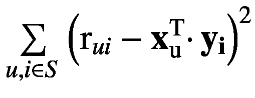
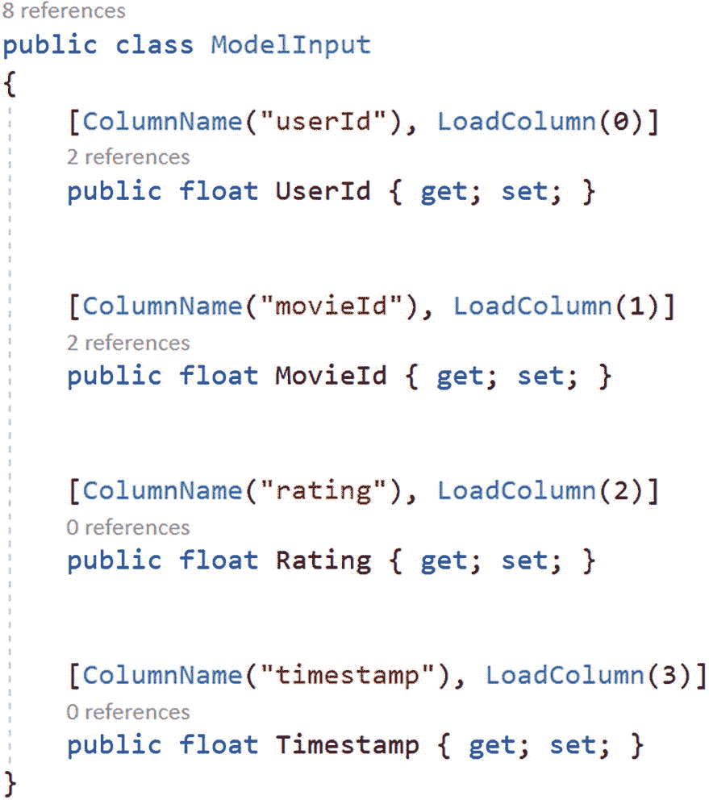

# 8.产品推荐


## 介绍

对于个人来说，在购买引起他们想象的东西之前，很有可能在购物时看到类似的产品。产品推荐非常有用，因为它能促进销售。一些建议的例子如下:

*   网飞根据你目前观看和评价的内容推荐你可能喜欢的电影。

*   Spotify 根据用户的喜好推荐音乐/歌曲。

*   亚马逊推荐你可能感兴趣的产品。

*   Visual Studio IntelliCode 基于其他开发人员在不同项目中编写的示例，提供了代码完成候选项。

*   Microsoft PowerPoint 根据内容提供了几种设计思路。这个设计决策是推荐系统的输出，该推荐系统基于历史输入和输出随着时间的推移学习什么吸引用户。

这些只是推荐系统隐藏在精心制作的用户界面后面的一些例子，有时这与魔术没有什么区别。推荐系统是监督机器学习的一个非常有用的应用，幸运的是并不难理解。

本章将向您介绍实现推荐系统的一些关键思想，特别是将带您浏览一个使用一种非常流行的算法“矩阵分解”的产品推荐示例。在这个过程中，您将发现 Along 是如何向应用程序开发人员隐藏这样一个系统的复杂性的。

## 行业术语…

推荐系统向人们推荐(非常明显)一些东西，让他们*考虑*(潜在的约会)*思考*(潜在的工作机会)*购买*(用于购买股票)*听*(系统认为他们会喜欢的歌曲)*看*(系统认为他们会产生共鸣的电影)*接受建议*(将一个短语改为推荐系统认为听起来更专业的短语)，等等。

在所有这些情况下，系统为人们提供一些帮助。推荐系统的受众在技术文献中被称为用户。并且推荐系统提供/推荐的任何东西都被称为项目。

### 用户

用户由单词 *U* 表示，为了表示 *m* 用户，下标符号是这样使用的 *U* <sub>*i*</sub> …。。*U*T12*m*T15】。

### 项目

项目由单词 *I* 表示，为了表示 *n* 项目，下标符号是这样使用的*I*T6】T7】IT9】…。。*我* <sub>*m*</sub> 。

### 等级

用户基于他们的体验对项目进行评级，然后这些评级变得可用于协作过滤技术，即基于来自与活动用户具有共同评级的其他人的现有评级做出的预测，以基于先前的偏好推荐项目。用户给出的评分一般用*R*<sub>T3】IT5】…*R*<sub>*n*</sub>来表示。</sub>

因此，您可以想象一个先前评级的项目库会是这样的:

<colgroup><col class="tcol1 align-left"> <col class="tcol2 align-left"> <col class="tcol3 align-left"> <col class="tcol4 align-left"></colgroup> 
| 

用户

 | 

项目

 | 

等级

 | 

…其他数据

 |
| --- | --- | --- | --- |
| **<sub>**1**</sub>** | *我* <sub>1</sub> | `3.5` |   |
| **<sub>**2**</sub>** | *我* <sub>2</sub> | ？ |   |
| **<sub>**2**</sub>** | *我* <sub>1</sub> | `5` |   |

产品推荐算法的挑战是填充缺失的块，就像在这种情况下，第二个用户的第二个项目的评级缺失。

## 推荐系统的类型…

推荐系统有两种主要的设计方式。第一组被称为 CBF(基于内容的过滤)，第二组算法被称为 CF(协同过滤)。

CBF 依赖于这样一个事实，即人们通常喜欢类似的产品，这种类型的技术有助于定位类似的商品或具有相同偏好的用户，然后这些信息可以用来找到商品缺失的评级。

然而，在这一章中，我们将讨论一种叫做*矩阵分解*的流行算法，用于执行协作过滤，这是一种进行自动预测的方法。

通常在推荐系统中，用户的数量要多得多(通常在数百万的范围内),项目的数量要少得多(通常在数千的范围内),但是评级的总数非常少，因为不是所有的用户都对所有的项目进行了评级。

## 矩阵分解

因式分解意味着将一个大数字分解成两个或更多的小数字或表达式。矩阵分解是将一个大矩阵分解成两个小矩阵的过程。在我们的例子中，我们将把大矩阵表示为两个小矩阵的乘积。第一个较小的矩阵是客户和他们对电影的偏好之间的矩阵，第二个较小的矩阵是电影和它们的特征(电影有多漫画，电影中有多少动作等等。).较大矩阵中的元素是这两个较小矩阵的行和列的点积。下表很好地描述了这一点。

<colgroup><col class="tcol1 align-left"> <col class="tcol2 align-left"> <col class="tcol3 align-left"> <col class="tcol4 align-left"> <col class="tcol5 align-left"> <col class="tcol6 align-left"></colgroup> 
| 

***人***

 | 

**电影 1**

 | 

**电影 2**

 | 

**电影 3**

 | 

**电影 4**

 | 

**电影 5**

 |
| --- | --- | --- | --- | --- | --- |
| Dana | *3* | *1* | *1* | *3* | *1* |
| 安娜 | *1* | *2* | *4* | *2* | *3* |
| 山姆 | three | **？** | *4* | *3* | *1* |
| *汉斯* | *4* | *3* | **？** | *4* | *4* |

这个矩阵的大小是 *m* × *n* ，其中 *m* 是用户数 *n* 是电影数。

如果我们将所有数据存储在一个矩阵中，那么整个表就是这个样子。但是以这种方式存储数据效率不高，因为矩阵将具有非常大的维度(使用大量的机器内存)，同时，矩阵中的许多元素将为零，因为用户没有在每部电影中都吃饭。当一个矩阵有许多零元素时，称为稀疏矩阵。

表格上的两个问号表示我们需要预测的两个评级。你认为山姆会给《第二部电影》打多少分？看着表格，似乎 Sam 的偏好和 Dana 的非常接近。所以很可能他也会讨厌这部电影。所以我们可以标记为 1，山姆不会喜欢这部电影。同样，韩的电影 3 评分也将接近 4，因为韩的偏好与山姆几乎相同。这种基于相似邻居的偏好来调整预测评级的方法被称为“*协同过滤*”。它可以被假设为一个过程，其中所有相似的邻居(具有相似的偏好)协作来过滤掉杂草，并帮助为新用户产生最佳的可能推荐。

这个矩阵中的每个元素都是通过这两个矩阵的行和列之间的点积来计算的。第一个矩阵是用户的偏好。用户对几种电影类型有偏好。一些用户喜欢喜剧电影，一些喜欢动作片，很少有人喜欢惊悚片，如果你和我一样，你也喜欢纪录片和推理惊悚片。因此，用户的偏好可以通过如下矩阵所示的二进制表示进行编码:

<colgroup><col class="tcol1 align-left"> <col class="tcol2 align-left"> <col class="tcol3 align-left"> <col class="tcol4 align-left"> <col class="tcol5 align-left"> <col class="tcol6 align-left"></colgroup> 
| 

***人***

 | 

**喜剧**

 | 

**动作**

 | 

**纪录片**

 | 

**惊悚片**

 | 

**传记片**

 |
| --- | --- | --- | --- | --- | --- |
| Dana | *是* | *否* | *否* | *否* | *是* |
| 安娜 | *否* | *是* | *否* | *是* | *否* |
| *山姆* | *是* | *否* | *是* | *否* | *否* |
| *汉斯* | *是* | *否* | *否* | *否* | *是* |

这个矩阵的大小是 *m* × *k* ，其中 *m* 是用户数 *k* 是为电影识别的特征数。在这种情况下， *k* 是 5(因为有 5 个特征，“喜剧”，…，“传记片”)。

因此，如果将“是”和“否”替换为 1 和 0，那么用户/个人的偏好将看起来更像一个可以用在点积中的向量。

<colgroup><col class="tcol1 align-left"> <col class="tcol2 align-left"> <col class="tcol3 align-left"> <col class="tcol4 align-left"> <col class="tcol5 align-left"> <col class="tcol6 align-left"></colgroup> 
| 

***人***

 | 

**喜剧**

 | 

**动作**

 | 

**纪录片**

 | 

**惊悚片**

 | 

**传记片**

 |
| --- | --- | --- | --- | --- | --- |
| 达纳 | *1* | *0* | *0* | *0* | *1* |
| 安娜 | *1* | *1* | *0* | *1* | *0* |
| *山姆* | *1* | **0** | *1* | *0* | *0* |
| 德国人或荷兰人的绰号 | *0* | *0* | **0** | *0* | *1* |

现在，让我们想象我们以某种方式发现一部电影有几帧喜剧，几帧动作，等等。所以每部电影都可以用这个矩阵中的一行来表示:

<colgroup><col class="tcol1 align-left"> <col class="tcol2 align-left"> <col class="tcol3 align-left"> <col class="tcol4 align-left"> <col class="tcol5 align-left"> <col class="tcol6 align-left"></colgroup> 
| 

***电影体裁***

 | 

**电影 1**

 | 

**电影 2**

 | 

**电影 3**

 | 

**电影 3**

 | 

**电影 5**

 |
| --- | --- | --- | --- | --- | --- |
| *喜剧* | *1* | *0* | *0* | *1* | *0* |
| *动作* | *0* | *1* | *0* | *1* | *0* |
| *纪录片* | *0* | **0** | *1* | *0* | *1* |
| *惊悚片* | *0* | *1* | **0** | *0* | *1* |
| *传记片* | *0* | *0* | **1** | *0* | *0* |

这个矩阵的大小为 *k* × *n* (其中 n 是电影的数量)。

### 空间优势…

要了解这种方案带来了多大的空间效益，只需给所有变量 *m* 、 *n* 、 *k* 分配一些现实的数字。

假设你正在为一些像亚马逊 Prime 这样真正受欢迎的平台做这件事；那么用户数量 *m* 将在百万的范围内。让我们假设在现实的规模中，有 1000 部电影开始。还可以有更多，但这是一个很好的大概数字。还假设我们可以在一些 20 左右的特性中分布用户的偏好和电影的流派。这使得 m =一百万，n = 1000，k = 20。

现在，如果我们把这些数字存储在一个大的元素矩阵中，那将会是一个巨大的 10 亿。但是将它们存储在两个独立的矩阵中使得这个数字下降到只有 2000 万。

### 我们来预测一下…

电影通常分为多种类型。在这些例子中，“电影 3”是一部动作喜剧，而“电影 5”是一部惊险纪录片。

要知道我们是否应该为“Dana”推荐“Movie1”，如果她还没有看过，我们需要找出第一个矩阵的第一行和第二个矩阵的第一列的点积。这将是[1，0，0，0，1 ] [ 1 0 0 0 0]，也就是 1。

安娜喜欢喜剧和动作，所以对于电影 5，她的评分将是[11010] [11000]，总计为 2。

提醒您一下，点积是根据指数乘法计算的条目的总和。所以[1，1，0，1，0] [1，1，0，0，0] = 1 × 1 + 1 × 1 + 0 × 0 + 1 × 0 + 0 × 0 = 2。

所有这些听起来都不错，但是期望这样的数据可用于现实生活场景太好了，在大多数情况下，数据本身必须在最初的几个月/几年内获得。

### 寻找大矩阵的正确因式分解

找到正确的因子矩阵集是一个迭代过程。两个矩阵(一个用于用户特征，另一个用于项目特征)用随机值初始化，然后选择的算法来回多次，直到这两个矩阵中的权重产生由大矩阵提供的真实评级的足够接近的近似值。

算法需要一种方法来衡量它是接近正确的值还是离正确的值更远。它这样做是为了最小化下面的函数(也称为损失函数):


在这种情况下，x 代表用户，y 代表项目。 *r* <sub>*ui*</sub> 表示用户 *u* 对项目 *i* 的评分。所以计算机试图最小化平方误差。是平方误差。等式右边的部分称为正则化。这用于防止系统过度拟合数据。

因此，从概念上讲，该算法采用一组随机条目填充向量作为特征矩阵(因子矩阵)，然后继续迭代，直到它达到真实评级(由一些用户为一些项目提供的评级)的综合近似值。

梯度下降算法族通常用于求解因子矩阵中的权重。

### 在 ML.NET 修改超参数

您可以修改所有这些超参数，这些参数的值用于控制学习过程，通过`MatrixFactorizationTrainer`调整算法。`Options`类代码。


图 8-1

显示了如何设置损失函数

`SquareLossRegression`是缺省值，`SquareLossOneClass`用于隐式推荐系统，推荐用户是否会点击、购买、观看广告等等。


图 8-2

示出了如何设置正则化参数

## 使用模型生成器进行矩阵分解

***第一步*** :选择场景作为推荐(图 [8-3](#Fig3) )。


图 8-3

定位场景

***第二步*** :选择想要训练模型的位置(图 [8-4](#Fig4) )。


图 8-4

选择培训环境

在撰写本文时(2020 年 8 月)，这只能在本地进行培训。

***第三步*** :选择训练文件(图 [8-5](#Fig5) )。


图 8-5

查找培训数据

该向导可以从平面文件或 SQL Server 数据库中读取数据。

***第四步*** :验证你的数据(图 [8-6](#Fig6) )。


图 8-6

预览和验证数据

***第五步*** :定位要预测的列和用于训练的列。一旦你这样做，这些列将显示在括号内。


图 8-7

注释用于训练模型的数据

***第六步*** **:** 离开默认的 10 秒训练时间(图 [8-8](#Fig8) )。


图 8-8

训练模型

***第七步*** :等待训练结束。一旦完成，它将显示这样的结果(图 [8-9](#Fig9) )。


图 8-9

训练模型已经完成

***第八步*** :您可以通过访问评估选项卡，有选择地验证训练模型的结果(图 [8-10](#Fig10) )。


图 8-10

模型评估

这里，用户 14 对电影 8477 的预测评级在右侧显示为 5.24。它还列出了电影的 5 大推荐。但是在实际应用中，我们必须将预测评级的上限和下限限制在 1 到 5 之间。所以 5.24 会封顶到 5。

***第九步*** :下一步就是用这个生成的代码来解。一旦确认，模型构建器就将这两个项目添加到解决方案中。


图 8-11

显示解决方案中添加的项目

这里是`ModelInput`级(图 [8-12](#Fig12) )。



图 8-12

模型输入类

输出将仅产生以 R 平方衡量的分数:

```py
public class ModelOutput
{
     public float Score { get; set; }
}

This can be used as shown in the generated code.
// Create single instance of sample data from
//first line of dataset for model input

ModelInput sampleData = new ModelInput()

{
        UserId = 1F,
        MovieId = 1F,
};

// Make a single prediction on the sample data and print results
var predictionResult = ConsumeModel.Predict(sampleData);

```

为了产生电影的推荐列表，必须计算所有电影的分数，然后按降序排序。

## 摘要

此时，ML.NET 提供矩阵分解作为推荐系统的训练器。还有其他几个基于内存的模型可以很好地解决推荐问题，这些模型不是 ML.NET API 的一部分，但是您可以将它们作为 ONNX 模型导入，并在中使用。Net 应用程序通过 ML.NET。

推荐也可以作为信息检索中的相似性度量问题来处理。在该方法中，向用户推荐具有相似属性的电影/项目。