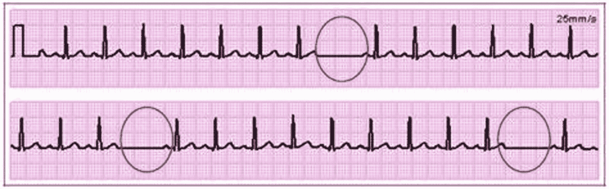

# 9.异常检测


## 介绍

及早发现异常情况可以挽救生命。想象一下，如果能够在一百万辆汽车装运之前发现汽车发动机的制造缺陷，将会挽救多少灾难。制造商可以在召回所有汽车的潜在损害控制上节省大量资金，更不用说由此造成的尴尬了。

在怀孕的某个阶段，会进行异常扫描来预测胎儿的阶段。这种扫描的目的是流产会导致早产或绝症婴儿的妊娠。

异常检测算法在欺诈交易检测中也发挥着巨大的作用。通过测量交易的几个方面/特征，计算机可以从其他人那里发现有臭味/可疑的交易(如果你愿意的话)。交易的时间、金额、用户输入登录凭证的速度等等为异常检测算法提供了所有必要的线索，以便能够区分 chalk(欺诈交易)和 cheese(真正的合法交易)。

## 目标

在这一章中，你将学习如何使用 ML.NET 发现不同数据集中的异常。阅读完本章后，你应该能够为你自己的数据集编写异常检测算法，这些数据集来自你自己的领域模型。

## 什么是异常现象？

它是一组相似物品中的异类。想象一下，一个人历史上(过去 5 年)在她的信用卡上每笔交易花费 1 到 2000 美元。一天晚上，该银行的服务器在一笔交易中收到一笔 9000 美元的借记请求。这超出了历史的极限。这很可能是合法的。也许她变得很奢侈，花了比那天晚上更多的钱，但这足以让银行服务器上的异常检测算法尝试将此标记为异常。这是因为 9000 美元远远超过了她在相当长的时间内在单笔交易上花费的最大值，无法用来创建一个作为其购买行为代表的档案。

所以，简而言之，异常意味着任何不寻常的事情。任何显而易见的东西都会吸引眼球。

## 不同类型的异常…

通常有三种不同类型的异常:

*   点异常

*   语境异常

*   集体异常

### 点异常

当一个数据点距离输入数据集中的所有其他数据点都很远时，它可能是异常的。在这种情况下，点异常也称为异常值。想象一下，我们把房子的面积和价格存储在一个元组列表中，一般的假设是房子大了就贵。然而，如果我们发现一个非常大的房子，要价非常低，那么这太好了，不可能是真的，这代表了一个异常值或异常点。

### 语境异常

有时根据季节的不同，看起来不正常的事情可能听起来很正常。例如，在圣诞节/新年假期期间，一个来自纽约的人每天的花费可能会超过她的平均花费值。这是正常的，但是当同一个人在假期后似乎花得更多时，可能有问题。可能是卡被偷了。如你所见，很难确定我们是在处理上下文异常还是点异常。季节性事件的知识必须调和在一起才能得到有用的东西。

### 集体异常

有时数据点本身并不被认为是异常的。但是对于数据集中的其他点，它们可能是异常的。如图 [9-1](#Fig1) 所示，心电图中的心跳缺失是集体异常的一个例子。



图 9-1

显示异常心电图

这里，点(用圆圈突出显示)本身不是异常的，但是在 ECG 中所有点的上下文中，它们是异常的。

## 检测异常的不同方法…

基于异常检测问题如何被平衡，异常检测问题可以被表示为有监督的或无监督的/聚类问题。

### 简单的统计问题

异常检测可以被认为是一个简单的统计问题，我们需要找到低于或高于四分位范围(IQR:四分位范围)的元素，如图 [9-2](#Fig2) 所示。


图 9-2

显示 IQR 山脉

如图所示，低于最小值和最大值的数据点是异常值/异常数据实例。

### 作为监督学习问题

如果我们有几个异常和正常(非异常)数据的标记示例，异常检测可以被认为是一个有监督的机器学习问题。如果像这样呈现，那么可以使用若干监督机器学习分类/聚类技术来检测数据中的异常，如果存在任何异常的话。

监督方法背后的基本原理是，一般的、正常的和典型的数据点看起来彼此非常接近，而异常的实例被隔离得更远。由于这个原因，基于密度的模型，如最近邻，是可行的。

### 聚类学习问题

k-均值聚类可以检测异常。没有真正附着在质心上的元素被称为异常元素。然而，异常检测的挑战在于新颖性。有时异常条目会出现，看起来与它们之前的化身相去甚远。这是将异常检测视为无监督/聚类学习问题的主要动机之一。

### ML.NET 提议

ML.NET 提供了各种方法来定位时间序列数据中的异常。如图 [9-3](#Fig3) 所示，这些可通过`Microsoft.ML.Timeseries` 1.5.1 NuGet 包或更高版本获得。


图 9-3

显示需要 NuGet 包

时间序列异常检测算法作为扩展方法在`TransformsCatalog`上实现。表 [9-1](#Tab1) 显示了这些扩展功能及其用途。

表 9-1

显示检测点异常的方法

<colgroup><col class="tcol1 align-left"> <col class="tcol2 align-left"></colgroup> 
| 

函数名

 | 

描述

 |
| --- | --- |
| **检测 ChangePointBySsa** | 创建 [SsaChangePointEs 估计器](https://docs.microsoft.com/en-us/dotnet/api/microsoft.ml.transforms.timeseries.ssachangepointestimator?view=ml-dotnet)，它使用[奇异谱分析(SSA)](https://en.wikipedia.org/wiki/Singular_spectrum_analysis) 预测时间序列中的变化点。 |
| **检测器奥美利 byrcnn** | 创建微软。它使用 SRCNN 算法检测整个输入的时间序列异常。 |
| **detectidhangepoint** | 创建 [IidChangePointEs 估计器](https://docs.microsoft.com/en-us/dotnet/api/microsoft.ml.transforms.timeseries.iidchangepointestimator?view=ml-dotnet)，它基于自适应核密度估计和鞅得分预测[独立同分布(i. i. d. )](https://en.wikipedia.org/wiki/Independent_and_identically_distributed_random_variables) 时间序列中的变化点。 |
| **检测尖峰信号** | 创建 [IidSpikeEstimato r](https://docs.microsoft.com/en-us/dotnet/api/microsoft.ml.transforms.timeseries.iidspikeestimator?view=ml-dotnet) ，它基于自适应核密度估计和鞅得分预测[独立同分布(i. i. d. )](https://en.wikipedia.org/wiki/Independent_and_identically_distributed_random_variables) 时间序列中的尖峰。C# |
| **探测 SpikeBySsa** | 创建 [SsaSpikeEstimato r](https://docs.microsoft.com/en-us/dotnet/api/microsoft.ml.transforms.timeseries.ssaspikeestimator?view=ml-dotnet) ，它使用[奇异谱分析(SSA)](https://en.wikipedia.org/wiki/Singular_spectrum_analysis) 预测时间序列中的尖峰。 |

## SRCNN 算法…

该算法的目标是预测每个输入数据点的得分。更正式地说，如果输入数据表示为 *x* <sub>1</sub> 、 *x* <sub>2</sub> 、 *x* <sub>3</sub> 、…、 *x* <sub>*n*</sub> ，那么该算法尝试预测表示为 *y* <sub>1</sub> 、 *y* 的输入数据中每个点的异常分数


图 9-4

SRCNN 算法的表示

因此，输入中的每个点要么代表时间序列异常，要么不代表时间序列异常。如果该点代表异常，则为 1，否则为 0。

SRCNN 首先使用输入数据的谱残差，然后使用其输出作为 CNN(卷积神经网络)的输入来计算该点是否异常。

更多关于算法内部运作的提示，请关注 [`https://techcommunity.microsoft.com/t5/ai-customer-engineering-team/overview-of-sr-cnn-algorithm-in-azure-anomaly-detector/ba-p/982798`](https://techcommunity.microsoft.com/t5/ai-customer-engineering-team/overview-of-sr-cnn-algorithm-in-azure-anomaly-detector/ba-p/982798) 的原帖。

## ML.NET 封装…

你可以通过图 [9-5](#Fig5) 所示的`AnomalyDetection`变压器上的封装方法从 ML.NET 使用它。


图 9-5

显示 ML.NET Sr CNN 方法的工具提示

表 [9-2](#Tab2) 显示了该方法采用的所有参数及其用途。

表 9-2

SRCNN 方法参数的详细信息

<colgroup><col class="tcol1 align-left"> <col class="tcol2 align-left"></colgroup> 
| 

参数

 | 

目的

 |
| --- | --- |
| **OuputColumnName** | `inputColumnName`数据处理后的列名。列数据是一个 [`Double`](https://docs.microsoft.com/en-us/dotnet/api/system.double) 的向量。这个向量的长度根据`detectMode`的不同而不同。 |
| **InputColumnName** | 要处理的列的名称。列数据必须是 [`Double`](https://docs.microsoft.com/en-us/dotnet/api/system.double) 。 |
| **阈值** | 确定异常的阈值。当给定点的计算 SR 原始分数大于设定阈值时，检测到异常。该阈值必须介于[0，1]之间，其默认值为 0.3。 |
| **批次大小** | 将输入数据分成批次以拟合`srcnn`模型。当设置为-1 时，使用整个输入来拟合模型，而不是逐批拟合；当设置为正整数时，使用该数字作为批量大小。必须是-1 或不小于 12 的正整数。默认值为 1024。 |
| **灵敏度** | 边界的灵敏度，仅在`srCnnDetectMode`为`AnomalyAndMargin`时有用。必须在[0，100]内。默认值为 99。 |
| `detectMode` | 一个枚举类型 [`SrCnnDetectMode`](https://docs.microsoft.com/en-us/dotnet/api/microsoft.ml.timeseries.srcnndetectmode?view=ml-dotnet) 。当设置为`AnomalyOnly`时，输出向量将是一个三元素双向量(`IsAnomaly`、`RawScore`、`Mag`)。当设置为`AnomalyAndExpectedValue`时，输出向量将是一个四元素双向量(`IsAnomaly`、`RawScore`、`Mag`、`ExpectedValue`)。当设置为`AnomalyAndMargin`时，输出向量将是一个七元素双向量(`IsAnomaly`、`AnomalyScore`、磁、`ExpectedValue`、`BoundaryUnit`、`UpperBoundary`、`LowerBoundary`)。SR 输出原始分数，以确定某个点是否异常；在 AnomalyAndMargin 模式下，当一个点异常时，会根据灵敏度设置计算一个`AnomalyScore`。默认值为`AnomalyOnly`。 |

## 使用异常检测来发现销售数据中的峰值…

我们可以使用前面的方法来检测输入销售数据中的峰值(本质上是异常)。下一个例子将展示我们如何调整表 [9-2](#Tab2) 中讨论的几个参数来发现异常。

***第一步*** :在 Visual Studio 2019 中创建一个控制台 app。

```py
using System;
using System.Collections.Generic;
using System.Linq;
using System.Text;
using System.Threading.Tasks;

namespace AnomalyDetect
{
    class Program
    {
        static void Main(string[] args)
        {
        }
    }
}

```

***第二步*** :获取必要的 NuGet 包。

转到工具➤ NuGet 软件包管理器➤软件包管理器控制台(图 [9-6](#Fig6) )。


图 9-6

显示软件包管理器控制台菜单

当控制台出现时，得到如图 [9-7](#Fig7) 和 [9-8](#Fig8) 所示的两个包。


图 9-8

显示军情六处。还安装了 Timeseries NuGet 包


图 9-7

显示 NuGet 包已安装

一旦成功，这些引用将显示在项目的引用上，如图 [9-9](#Fig9) 所示。


图 9-9

在引用中显示所有这些 dll

在这个阶段，您已经准备好使用数据了。

***第三步*** :添加必要的使用指令。

```py
using Microsoft.ML;

```

***第四步*** `:`创建一个 ML 上下文。

```py
MLContext ml = new MLContext();

```

***第 5 步*** `:`将以下类添加到解决方案中:

```py
private class TimeSeriesData
{
      public double Value { get; set; }
}

private class SrCnnAnomalyDetection
{
             [VectorType]
             public double[] Prediction { get; set; }
}

```

***第六步*** `:`通过以下方法从文本文件中加载数据:

```py
private static List<TimeSeriesData> LoadDataFromFile(string fileName)
{
             return File.ReadAllLines(fileName)
            .Skip(1)
            .Select(f => new TimeSeriesData()
       { Value = Convert.ToDouble(f.Split(new char[] { ',' },
              StringSplitOptions.RemoveEmptyEntries)[1])
       })
             .ToList();
}

```

***第七步*** :从文件中加载数据。

您可以从 [`https://raw.githubusercontent.com/dotnet/machinelearning-samples/master/samples/csharp/getting-started/AnomalyDetection_Sales/SpikeDetection/Data/product-sales.csv`](https://raw.githubusercontent.com/dotnet/machinelearning-samples/master/samples/csharp/getting-started/AnomalyDetection_Sales/SpikeDetection/Data/product-sales.csv) 下载数据。

然后从 Main 方法中，你可以把它加载到一个列表中:

```py
var data = LoadDataFromFile(@"D:\product-sales.csv");

```

***第八步*** `:`将数据转换成一个`IDataView`实例。

```py
var dataView = ml.Data.LoadFromEnumerable(data);

```

***第九步*** :准备输入输出列。

```py
string outputColumnName = nameof(SrCnnAnomalyDetection.Prediction);
string inputColumnName = nameof(TimeSeriesData.Value);

```

***第十步*** :对每个输入数据点进行批量异常检测。

```py
// Do batch anomaly detection
var outputDataView = ml.AnomalyDetection.DetectEntireAnomalyBySrCnn
  (dataView,
   outputColumnName,
   inputColumnName,
   threshold: 0.30,
   batchSize: -1,
   sensitivity: 91,
   detectMode: SrCnnDetectMode.AnomalyAndExpectedValue);

```

***第十一步*** :获取新创建的列。

```py
var predictionColumn = ml.Data.CreateEnumerable<SrCnnAnomalyDetection>(
                outputDataView, reuseRowObject: false);

```

***第 12 步*** :循环遍历预测列，找到尖峰。

```py
  foreach (var prediction in predictionColumn)
   {
              if(prediction.Prediction[2]>0.3)
      {
              Console.WriteLine($"Detected spike at {data[k].Value}");
      }
     k++;
   }

```

这将打印以下内容。显然，必须忽略第一个条目，因为这是数据值的开始。

```py
Detected spike at 271
Detected spike at 150.9
Detected spike at 341.5
Detected spike at 426.6
Detected spike at 687

```

## 摘要

ML.NET 为时间序列分析提供了异常检测，但是正如在本章开始时提到的，异常可能发生在任何数据中。希望其他统计方法，如 IQR 和相关方法将被纳入该框架。