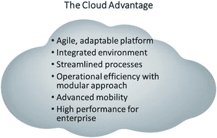

# 二、商业智能、大数据和云

在我们于 2015 年撰写的第一本书中，我们描述了一个完整、全面的 BI 解决方案如何涉及三个主要的报告和分析类别。在那本书里，我们把它们标为:

*   运营报告
*   运营 BI
*   分析 BI

当时，我们主要关注于描述企业商业智能解决方案中的元素——也就是说，涉及结构化数据的解决方案。虽然我们写了几个章节，但我们几乎故意忽略了随着大数据和云的出现而发生的行业变化。从那时起，我们再也不能忽视他们在未来商业智能和分析中的存在和主导地位。这本书涵盖了这些组件以及支持高级分析甚至大数据分析的人工智能(机器学习)。

现在，随着当今最新技术(如大数据、人工智能和云计算)带来的新功能，报告和分析领域的一种新分类占据了前沿并吸引了大量关注。这种新的分类包括数据发现和探索，甚至一般的大数据分析。在这个新的分类中，甚至商业智能领域作为一个整体也承担了一个全新的角色。商业智能已经转变为一个完全不同的功能级别，能够提供关于从数据中收集的情报的见解以及与这些情报的交互。这种下一级商业智能——由人工智能推动——被称为可操作智能。

## 商业智能的目标

谈到商业智能，我们已经走过了漫长的道路。作为实践者和实现者，我们已经看到了很多变化和增加的功能。有些在行业早期甚至不可行，主要是因为所需技术的不足。以实时或近实时分析为例。面临的挑战是，当数据到达正确的人手中时，情报将不再新鲜或值得利用。负责此类运营的直线经理或主管甚至无法访问此类信息(和相关见解)来影响运营流程；这种信息的缺乏会阻碍企业获得竞争优势。

因此，直到工具和技术变得足够复杂，能够以一种有利于使用数据获得竞争优势的方式在数据源之间移动数据，实时商业智能才开始发挥作用。仅仅是在您的组织内收集数据以便加以利用这一行为就构成了巨大的挑战。几十年来，仅仅是将所有信息存储在一个地方的想法就是一个大问题。根本没有有效的方法将数据从一个系统转移到另一个系统。研究了几种方法，以确定从原始数据中创建情报和分析的最有效方法。让我们讨论一下移动数据的早期解决方案。

收集和使用数据的能力的很大一部分演变是由 Informatica 等公司发起的，这些公司专注于将数据从一个来源传递到一个目标。借助基于 Oracle 的优化引擎(OBOE ),我们已经有了移动数据的方法，例如，编写 SQL 脚本和在 Oracle 中使用 SQL *Loader。但是没有一种复杂的方式将数据从一个系统转移到另一个系统。即使您能够收集所有的数据，您仍然面临清理、传输和转换这些数据的挑战。Informatica 等公司解决了这个问题，他们通过创建现在所谓的提取、转换和加载(ETL)来自动化这个过程。随着高管们能够专注于商业智能和分析，整个市场围绕这项新技术发展起来。

尽管 ETL 对于管理过程是有效的，但它仍然在处理大量不同的数据方面留下了空白，特别是我们现在称之为大数据的非结构化数据。根本没有移动数据的有效方法，即使有强大的 ETL 工具也不行。这个问题开启了处理大量数据的全新模式。我们将在本章后面讨论这种新的数据准备方法。

### 大数据分析

商业智能和大数据分析之间存在差异。尽管今天这两个术语经常互换使用。然而，随着技术、数据架构和策略的新进展，特别是在高级分析方面，我预计这两者最终会融合为一体。

在早期，从报告开始，访问供事务使用的数据的能力是主要关注点。然而，它并不真正能够获得任何基于历史的洞察分析——至少不能自动获得。报告实际上只是一种访问事务系统中所有数据的手段。此后，任何类型的分析都由不同的系统完成，通常称为决策支持系统(DSS)或在线分析处理(OLAP)系统。

在当今这个拥有人工智能的高级分析世界中，从报告到分析的转变变得更加无缝。如果我们要分离可用的各种类型的系统，我们可以谈论报告与分析(它们作为一个整体包含在现在被称为商业智能的东西中)。但是，随着无缝交付报告和分析功能的工具和技术的每一次进步，新的子类别出现了，它们有自己的一套成功标准和要求。

在大数据分析方面，与可操作的商业智能相关的一系列全新目标已经出现。我们的目标是推动分析系统走得更远，更有预见性和规范性。如果我们要真正改变这个行业的成功，我们必须指出这些最新的进步是推动发展的动力，然后将商业智能和分析真正带到下一个级别，在这个级别上，信息和智能提供了有价值的见解，然后可以完全付诸行动。

有了云，我们更接近可操作的商业智能的目标，因为这种无处不在的解决方案显然提供了几个优势(见图 [2-1](#Fig1) )。

图 2-1。

The cloud advantage

2016 年，一家受欢迎的数据可视化供应商撰写了一份题为“2016 年 10 大云趋势”的白皮书。该论文陈述如下:

> In 2015, the cloud technology pattern has undergone changes that can only be achieved by a highly disruptive market. From watershed innovation announcements to unexpected business initiatives, 2015 dispelled any doubts that the cloud revolution was permanent in the minds of skeptics. At the center of this storm, people increasingly realize that data, as a key business asset, can be stored in the cloud very efficiently (and cost-effectively). The database, integration and analysis markets are now competing to understand how they will finally take advantage of this transformation.

### 但是为什么现在要机器学习呢？

支持机器学习的论点非常简单:我们希望在一个存储库中访问尽可能多的数据，并能够分析这些数据，以便找到可能有用的特定模式。如果不使用超级计算机，人类可能无法获得这些模式。因此，我们可以认为，只有通过人工智能，也就是机器学习，我们才能得出结果。

到目前为止，技术还没有为我们提供能够使用现在产生的所有数据的手段。如果没有这些新的工具和技术，我们将拥有无尽的数据海洋，而我们作为人类不可能分析和处理这些数据。

2016 年，甲骨文宣布了其未来战略和名为“客户云”的下一代云基础设施。为了应对公众对其以前的云产品的接受和采用，甲骨文将其新战略集中在客户以及新技术可以为其 ERP 项目(例如 EBS)带来的优势上，该项目涵盖了企业的方方面面，从人力资源到供应链管理。

客户云将整个企业的数据与多个来源相结合，并使用机器学习来提出建议。人工智能嵌入到软件应用程序中，并与甲骨文的数据相结合。甲骨文将这些产品描述为“软件即服务产品，将第三方数据与实时分析相结合，创建能够适应和学习的云应用程序。”

此外，凭借其实时分析、以用户友好的显示方式呈现的机器学习结果以及数据可视化，客户云等工程系统可以为用户提供对其企业数据和信息的更多洞察。

## 一图胜千言。

什么是数据可视化？让我们探索一下这种非常流行的技术在今天的分析中扮演着越来越重要的角色。可视化本身被定义为将信息转换为视觉对象，如点、线和条，目的是更有效地将信息传达给查看者。信息可以是一组数字数据，甚至是抽象的想法、过程或概念。在技术上，数据可视化是指显示可以存储在计算机中的信息，目的是解释或探索模式、趋势和相关性。在更广泛的意义上，这可以被看作是数字的关系。毫无疑问，与必须处理以表格形式存储为电子表格的数据相比，使用图表或图形(或其他形式的数据可视化)是处理大量复杂数据的一种更简单的方法。

我们都听说过一句流行的俏皮话“一张图片抵得上一千个单词”，或者我们应该说，在当今的商业智能和分析世界中，“一个可视化结果抵得上一千个数据点。”数据可视化可以将多行数据压缩成一个图形表示，允许查看者快速高效地访问大量信息。它旨在吸引观众并抓住观众的注意力。这是因为图像比表格数据更容易吸收和解释；与文字和数字相比，人脑对图像的感知能力更强。

除了视觉上的，单词和数字是我们一生中学习的信息的编码单位。同时呈现许多数字需要大量的心理处理，以及数学和统计学的专业知识，才能看出它们之间的关系。相比之下，模式、相关性、异常值和趋势在视觉上更容易识别。

就使用数据可视化进行解释而言，图像也比文字和数字更容易保留。此外，数据可视化可以以更完整的方式回答问题，展示更大的图景。例如，假设您有一个定量问题，如哪个月的销售额最低。通过数据可视化呈现的答案将显示一个完整的画面，使您能够看到全年的销售分布，以及与其他月份相比，最小值小了多少。相比之下，来自简单的基于查询的软件的答案只会给你直接的价值。数据可视化还提供了访问数据和新见解的便利，从而鼓励后续问题，进而产生新的见解。例如，回答月模式的相同数据如果汇总也可以回答年模式。

业务经理需要准确定位业务中的问题和机会，同时也要快速找出它们发生的原因和方式，以便做出反应性的决策。业务分析师需要找到影响这些问题和机会的关键变量，以便制定正确的解决方案。[1]数据可视化对分析的影响取决于企业对 BI 和分析的持续需求。企业依靠分析，通过提供对数据的自助式即时访问和自定义分析，将可操作的信息快速提供给业务线用户，从而为决策者提供支持。[2]

认识到需要将可视化解决方案与数据分析和数据挖掘前端相结合，一个新的学科已经从信息可视化、科学可视化和数据挖掘社区中出现:可视化分析。视觉分析专注于整个所谓的意义形成过程，从数据采集开始，通过大量重复和精炼的可视化场景继续(在此期间，交互允许用户探索各种观点，或测试和精炼大量假设)，并通过呈现用户对感兴趣的潜在现象的洞察力结束。因此，可视化分析通常侧重于单个静态或图像的太大或太复杂的流程或数据集。可视化分析的目标是提供支持终端用户分析思维的技术和工具。[3]

可视化的另一个基本特征是它们的交互性。可视化过程很少是静态的。在大多数应用程序中，需要可视化无法在单个屏幕上显示的大量数据、每个数据点包含许多独立数据值的高维数据集，或者两者都需要。在这种情况下，显示包含所有数据的静态图像通常是不可能的。此外，即使这是可能的，通常也有许多方法来构建数据到图像的映射，用户可能想要尝试这些方法以便更好地理解手边的数据。所有这些方面都受益于交互式可视化的使用。这种应用使用户能够修改几个参数(范围从视角、缩放因子和颜色使用到所使用的可视化方法的类型),并观察所产生的图像的变化。

但是更大数量和更复杂形式的数据正从今天的设备和计算机中涌现出来。一个流行的说法和大数据线是“今天互联网上所有数字数据的 90%是在过去两年中产生的”[4]。数据科学家或数据挖掘者通常要求分析团队具备统计学和数据科学方面的专业知识，以便执行更复杂的探索性分析来处理大数据。因此，商业思想家可能需要咨询数据团队，才能获得关于他们的数据问题的明确答案。

可视化是一个持续的过程。大量的数据不能全部用一张或几张图像来概括；大数据太浩瀚，每个数据点都有太多的价值属性。例如，一家连锁百货商店的销售交易数据行有许多属性:销售价格、利润率、日期、销售地点、时间，甚至更多来自产品和购买者的属性。所有这些属性都不能归结为一种或几种形式的可视化。不同的变量需要在一个连续的过程中被隔离、省略和过滤，以获得新的见解。

在某种程度上，可视化分析已经成为商业思想家访问大数据的用户友好界面。商业思想家可以采取主动，成为分析师。通过快速、交互式地访问数据，商业思考者可以自由地探索数据，而不必回答特定的问题或解决特定的问题。数据的可见性使模式、相关性、趋势和异常值的识别变得更加容易和快速，并由业务专业知识支持对这些观察结果进行推理，这对企业来说是一种非常强大的商品。出于这个原因，许多企业软件提供商现在将可视化分析作为一种必要手段。

在当今的商业智能和知识管理环境中，数据可视化已经成为一种必不可少甚至是最强大的分析工具。出于这个原因，许多供应商都关注它，并推销它应该如何有效地完成。许多人认为数据可视化是科学和艺术的复杂融合。其吸引人的有效界面体验已经成为大数据分析等式的重要组成部分，许多供应商已经认识到了它的作用。

总之，数据可视化工具正在改变商业智能，因为市场上的许多供应商已经主要围绕他们的数据可视化工具进入市场。一些供应商最近通过利用这一数据可视化和发现浪潮而受到欢迎，并通过专注于其产品的数据可视化功能而看到了新的竞争机会。其中许多是小型的“部门”工具。另一方面，商业智能的主要参与者现在也加入了这场游戏，例如 Oracle 最新版本的 OBIEE 12c。在这种情况下，他们发布了可视化功能，以补充他们传统的和已经流行的工具套件。

Citations

[`www.sas.com/en_ca/insights/analytics/what-is-analytics.htm`](http://www.sas.com/en_ca/insights/analytics/what-is-analytics.htm)【1】

[`http://bluehillresearch.com/business-intelligence-data-visualization-and-the-brain/`](http://bluehillresearch.com/business-intelligence-data-visualization-and-the-brain/)【2】

亚历山德鲁·泰利娅。数据可视化:原理与实践。博卡拉顿:CRC，泰勒和弗朗西斯集团，2015 年。打印。[3]

SINTEF。“无论好坏，大数据:世界上 90%的数据都是在过去两年中生成的。”科学日报。科学日报，2013 年 5 月 22 日。[`www.sciencedaily.com/releases/2013/05/130522085217.htm.`](http://www.sciencedaily.com/releases/2013/05/130522085217.htm)【4】

## 数据建模

现在处理数据的方向是将非结构化数据自动转换为结构化数据。借助 Oracle Analytics 云平台，大数据服务将使用轻量级模型，然后使用人工智能进行数据准备，从任何数据存储中读取数据并将其添加到模型中。焦点转移到了业务和分析建模人员身上，将他们的模型应用到已经准备好并准备好进行分析的数据以及所需的实际工作之上。

另一个功能是 Oracle 大数据 SQL，它能够发送任何非本地格式和标准的查询，如 NoSQL 数据库。此外，带 R 的 SQL 将用于进行分析。

理解需要两种不同的结构和架构来支持事务系统和决策支持系统是很重要的。简单来说，一种类型的架构不能有效地满足两者。作为一名数据架构师，您必须了解如何以及何时将适当的体系结构应用于各个系统。直到今天，我仍然会遇到一些组织不理解这个基本概念，并且在构建一个合适的解决方案方面失败得很惨。更糟糕的是，我最近遇到了一些组织，他们自行创建了另一种结构(将其解释为混合结构),既不支持事务解决方案，也不支持决策支持解决方案。他们最终得到的是另一种需要维护的结构，这种结构需要花费大量的金钱和资源来创建，但仍然无法提供合适的解决方案。此外，由人工智能和机器学习辅助的任何未来进步都将被数据结构的模式进一步混淆，从而不能被利用。

为了说明这一点，试着像优化决策支持系统一样优化事务系统，反之亦然。你会发现你最终会得到徒劳的结果。例如，您为事务系统创建的索引侧重于数据操作(插入、更新和删除),并且肯定不同于为决策支持创建的索引，后者的主要重点是快速检索和查询。如果能够直接访问您的事务系统进行查询，而不需要任何其他类型的工作，那该有多好。事实上，当技术发展到交易系统和决策支持系统可以在后台使用相同的数据库结构时，就不再需要数据架构师及其专业知识了。有了机器学习，这一天可能就要到来了。

通过使用数据点，我们可以从描述事实和行为(可能是预期的或意外的)的数据中创建聚合和汇总。此外，通过人工智能和机器学习，可以基于基线数据识别异常，以便预测某些未来行动。这种预测和规定功能是机器学习的最终目标，它专注于数据的实时分析和自动化异常检测。

这种技术不仅可以用来寻找数据异常，还可以“学习”某些变化，然后根据数据和变化的模式提出建议。机器学习可以从数据度量中学习，识别异常，警告用户，并提供建议。除此之外，它还能识别出我们人类没有问过或者不可能知道要问的问题。就像最受信任的顾问一样，人工智能可以以我们甚至不知道的方式帮助我们。在我们的日常生活和商业中应用人工智能的前景是广阔的。

### 机器学习数据准备的未来

人工智能改变了我们创建分析解决方案的方式，从而改变了 Oracle 分析的未来。最显著的变化之一是为生成报告准备数据。数据准备这个术语变得越来越重要，并且可能是我们一直在寻找的游戏规则改变者。

让我来介绍一下为什么这很重要的背景。当从头开始构建解决方案时，传统的实现方法是首先建立支持应用程序所需的数据基础。总的来说，这项工作需要业务和技术资源投入大量的时间和精力来构建合适的数据基础。因此，数据架构师的任务是提出日模型和随后的数据库，整个开发过程都依赖于它。

二十多年来，我的专业知识被反复利用。根据我个人的观察，尽管对于以数据为中心的应用程序的开发人员来说，这是一项极其重要的技能，但它似乎被遗忘了，甚至被搁置一旁。因此，我见过由于缺乏数据架构和数据建模技能而失败的项目。事实是，奠定基础可能是以数据为中心和数据驱动的解决方案中最重要的一块。没有适当的基础，下游应用程序将不得不“强行”提出一个解决方案，并试图弥补日模型中的问题。我花了多年的经验才最终能够一遍又一遍地提供专业知识。那么，如果这种专业知识能够以一种容易用来创建解决方案的方式包装起来，会怎么样呢？该应用程序将充当数据架构师，配备适当的设计技术，以提供适当的数据模型和基础。本质上，您将能够即时交付一个解决方案，因为它很容易用自动化来处理。

进入今天创建数据模型的范式，它已经发生了相当大的变化。在今天的过程中，时间是一个同样重要的因素。在开始一个解决方案时，机器学习使我们能够识别某些缺失的数据元素和对象，并将它们附加到已经存在的模型中，而不是预先完全指定一个数据模型。这消除了数据建模师和架构师在第一次尝试正确设置基础时遇到的常见障碍。那么这对发展有什么影响呢？只需建立一个基线基础，然后让 AI 通过识别缺失的组件来继续开发，就可以大大缩短实现时间。换句话说，通过机器学习，一个简单的模式可以被你的机器学习算法读取和利用，以便在数据进入你的着陆区域时确定数据的适当存储。因此，通过机器学习算法，该机制可以根据数据采样推荐甚至创建适当的属性，以自动创建新的模式。

那么这对数据建模意味着什么呢？这意味着您不再需要确保您的模式当前是由您的数据库和后续 RPD 指定的。机器学习将有助于自动包含任何超出结构化模式的数据，方法是根据数据中发现的模式将其作为建议进行添加。

综上所述，创建合适的数据模型的一个建议过程是使用一个规范模型，它为任何实体指定一个基础。然后，使用机器学习算法，任何需要的后续附加属性都可以自动添加到模式和结构中。

### Oracle 商业智能云服务

2014 年，甲骨文发布了首批基于云的商业智能平台之一，作为其甲骨文分析云产品的一部分。这是一个成熟的云应用，在当时相对较新。对于那些熟悉 OBIEE 的从业者来说，它本质上提供了 11g 的特性。

2016 年，我在为一家美国政府机构实现 OBIEE 12c，但也在一次 Oracle 应用用户组会议上展示了 BICS 产品。我注意到数据可视化特性和组件是单独提供的。我意识到，甲骨文集成 OBIEE、可视化分析器和大数据分析之间的一切只是时间问题。这一时刻现在已经到来，我敦促那些感兴趣和曾经尝试过的人再试一次。

### Oracle 分析云

在我们拥有 Oracle Analytics Cloud 之前，BICS 是第一代基于云的 BI 应用程序。如前所述，它在其套件包中包含从头开始开发报告和分析所需的工具，包括数据库服务、建模工具、数据加载器和仪表板。从行业角度来看，它是云上最早的产品之一，其功能集更像是 11g。

第二代分析产品 Oracle Analytics Cloud 本质上是 Oracle 云解决方案的“最新、最棒”版本(12c)。此外，作为一项前进战略，Oracle 将首先更新云版本的新功能，内部版本也将紧随其后。

在功能方面，标准版本专注于可视化(与 Tableau、Qlikview 和 PowerBI 等数据可视化工具竞争。企业包括一切，使其成为一个完整的整体解决方案，包括具有大数据和人工智能组件的大数据湖版本。此外，它还有用于报告的 BI Publisher。对于高级分析，R 和映射是内置的。为了帮助引导程序开发，免费提供了一个内容包。通过用 R 编程的机器学习方法，分析会建议纠正措施。随后，可以发布、导出和导入分析项目，以便与其他人共享或嵌入到网页中进行共享。

### Oracle 数据库 18c

甲骨文在 2017 年 10 月宣布，其旗舰产品 Oracle 关系数据库管理系统的最新版本(版本 18c)现在使用机器学习来自动维护、管理和排除系统故障。这包括升级、修补和自我调整。这种技术能够为系统建立基线，然后使用机器学习方法和技术，学习什么是不“正常”的，并提出相应的纠正或修改方法。

## Oracle 移动分析

作为甲骨文整体战略不可或缺的一部分，它整合了程序和应用程序，以配合当今的移动设备。Day by Day 和 Synopsis 是移动应用程序，是其与企业层无缝集成的下一代移动应用程序的一部分。

Analytics On The Go

Oracle Business Intelligence Mobile 是唯一一款提供全方位功能(从交互式仪表盘到位置智能)的移动应用程序，可让您直接通过移动设备启动业务流程。该应用程序允许您执行以下操作:

*   让商业智能像任何消费者移动应用一样易于使用
*   在苹果 iPhone 和 iPad 上查看、分析和处理所有 Oracle 商务智能内容
*   在移动设备上即时访问新的或现有的内容；不需要设计变更
*   借助直观易用的移动应用程序，增加商业智能在您组织中的使用

[T2`www.oracle.com/solutions/business-analytics/business-intelligence/mobile/bi-mobile/index.html`](https://www.oracle.com/solutions/business-analytics/business-intelligence/mobile/bi-mobile/index.html)

用户将通过移动设备使用语音界面，该界面依次经过企业 BI 的语义层和大数据湖层，然后最终构建一个可视化界面来响应您的查询。

## 摘要

Oracle 最近推出了 Oracle Analytics 云平台，提供了一个完整、全面的分析解决方案，涵盖了无处不在的云上的商业智能、大数据和人工智能。

机器学习的两个主要特征如下:

*   数据可视化
*   数据准备

这些都是游戏规则的改变者，为提供具有高级分析的商业智能提供了全新的范例。

通过机器学习，洞察成为可能。其中一些洞见涉及到我们作为人类甚至想都不敢想的事情。即使在有效处理来自大数据甚至企业数据仓库的海量数据时，人工智能也可以帮助识别我们通常无法识别的数据模式。