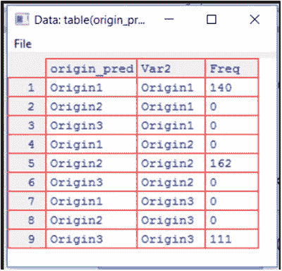
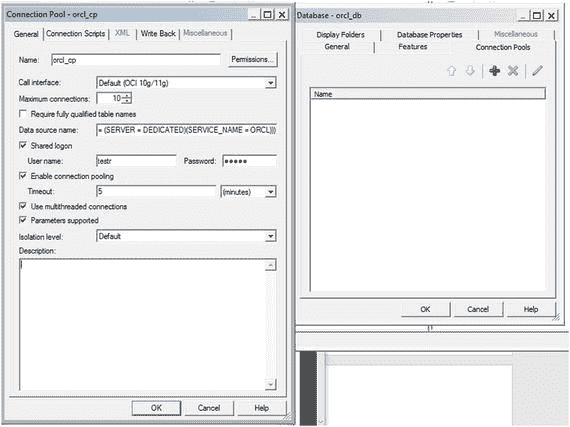
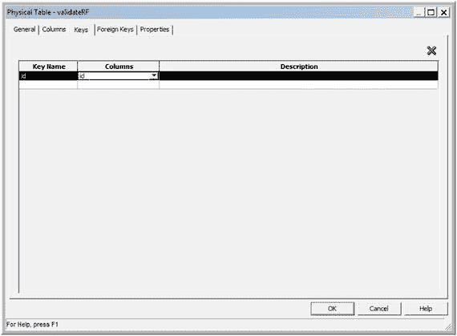

# 三、Oracle R 技术和 R 企业

人工智能(AI)的进步已经将商业智能(BI)的领域扩展到机器学习和预测分析以及大数据分析领域。这导致了一套扩展的机器学习算法，可用于解决现实世界的商业智能问题。用于机器学习和统计计算的最流行和最广泛使用的语言之一是 R 开源语言。其广泛的算法集，加上对丰富图形和数据可视化的支持，使其成为数据分析和数据科学的首选语言。

这一章关注企业的 R 技术。它还从机器学习的角度概述了一些开源 R 包的使用，以及 R 脚本和 Oracle R Enterprise 在 Oracle 数据库中的使用。本章解释了 Oracle R Enterprise 如何与 OBIEE 一起使用。最后，它解释了如何通过在 R 生态系统中使用机器学习来执行大数据高级分析。

## r 企业技术

r 是一种用于机器和统计学习以及高级图形功能的开源脚本语言。为了本章的目的，R 技术可以大致分为两类:开源 R 和 Oracle 的 R 技术。

### 开源 R

开源 R 由一组丰富的编译代码、函数例程和相关数据以包和视图的形式组成，称为 CRAN 视图或 CRAN 任务视图。CRAN 是 Comprehensive R Archive Network 的缩写，由发布到其网站 [`http://cran.r-project.org`](http://cran.r-project.org) 的用户自定义包组成。每个任务视图都由一个特定于功能域的网页和该域的相应包的详细信息组成。CRAN 任务视图的例子是卫生保健领域中的遗传学、临床试验和医学成像；机器学习；统计学习；时间序列分析；和财务分析。

r 是可扩展的和全面的，能够以新包的形式添加定制功能。r 可以通过旋钮形式的开箱即用功能进一步扩展，有助于额外的定制。R 项目网站或 CRAN 网站都可以用来免费下载和安装 R。

Note

R 开源项目详情可以在 [`www.R-project.org`](http://www.r-project.org) 找到。

表 [3-1](#Tab1) 描述了广泛用于机器学习的 CRAN 任务视图。这些也可以在 [`https://cran.r-project.org/web/views/MachineLearning.html`](https://cran.r-project.org/web/views/MachineLearning.html) 找到。

表 3-1。

CRAN Task Views for Machine Learning

<colgroup><col> <col></colgroup> 
| 视图名称 | 描述 |
| --- | --- |
| [神经](https://cran.r-project.org/web/views/Bayesian.html)网络和深度学习 | Stuttgart 神经网络模拟器(RSNNS)用户可扩展人工神经网络(FCNN)深度学习—darch、deepnet、RcppDL、h2o TensorFlow |
| [递归](https://cran.r-project.org/web/views/ChemPhys.html)分区 | 用于回归、分类和生存分析的树形结构模型；基于规则的模型和助推；递归分区 |
| [随机](https://cran.r-project.org/web/views/ClinicalTrials.html)森林 | 回归和分类、集成学习、强化学习树 |
| [规则化](https://cran.r-project.org/web/views/Cluster.html)和收缩法 | 线性、逻辑和多项式回归模型；基因表达分析 |
| [升压](https://cran.r-project.org/web/views/DifferentialEquations.html)和梯度下降 | 用于回归任务的基于梯度下降的梯度推进和学习模型 |
| [支持](https://cran.r-project.org/web/views/Distributions.html)向量机 | 与 SVMLIB 和以及 SVMLight 的接口(仅用于一对多分类) |
| [Bayesian 方法](https://cran.r-project.org/web/views/Econometrics.html) | 贝叶斯加法回归树(BART)、遗传算法等。 |
| [关联](https://cran.r-project.org/web/views/Environmetrics.html)规则 | 挖掘频繁项集、最大项集、闭频繁项集和关联规则 |
| 基于模糊规则的系统 | 基于模糊规则的系统来自用于回归和分类的数据、粗糙集理论和模糊粗糙集理论 |
| [元](https://cran.r-project.org/web/views/ExtremeValue.html)包 | 构建预测模型(caret)、GBM、GLM(使用弹性网络正则化)、mlr 和深度学习(前馈多层网络) |
| 图像使用者界面 | R 语言中数据挖掘的图形用户界面 |
| [可视化](https://cran.r-project.org/web/views/Genetics.html) | 用于 R 中可视化的各种图和图形，包括散点图、特征集、gg 图、pairs 图、用于探索性数据分析的图、网格图和用于学习模型的图，包括随机森林和 SVM、预测函数等。 |
| [统计](https://cran.r-project.org/web/views/Graphics.html)学习 | 基于统计和概率的各种算法，用于数据挖掘、推理和预测 |
| [杂项](https://cran.r-project.org/web/views/HighPerformanceComputing.html) | 模型选择和验证算法、量化测试模式类别的证据分类器、用于确定和处理缺失值和数值数据的分类模型、用于预测响应变量的基于特征和基于图形的数据 |

### 甲骨文的研发技术

Oracle 的研发技术包括以下内容:

*   Oracle R 发行版
*   神谕
*   Oracle R 企业版(ORE)
*   面向 Hadoop 的 Oracle R 高级分析

每一个都在下面的小节中描述。

#### Oracle R 发行版

Oracle R 发行版是开源 R 的免费 R 软件再发行版。它包含动态加载数学库的功能，用于高性能计算和学习，包括多线程执行。主要的数学库包括英特尔数学内核库、AMD 核心数学库和 Solaris Sun 性能库。使用这些库可以透明地完成矩阵函数、分量分析、快速傅立叶级数变换和向量分析等数学函数。Oracle R 发行版还附带了对开源 R 的增强，可以在 Oracle Enterprise Linux、Solaris、AIX 和 Windows 上使用。Oracle 支持面向 Oracle 高级分析选项和大数据设备以及 Oracle R Enterprise 的客户。Oracle R 发行版的使用还支持跨客户机和数据库的可伸缩性，以便执行嵌入式 R。在撰写本文时，Oracle R 发行版的最新版本是 3.3.0。

#### 神谕

ROracle 是一个符合数据库接口的 Oracle 驱动程序，使用 Oracle 调用接口(OCI)库。ROracle 针对 R 和 Oracle 数据库之间的连接进行了重新设计和优化，是一个由 Oracle 管理的开源 R CRAN 包。它主要支持从 R 接口执行 SQL 语句和对数据操纵语言(DML)操作的事务支持。Oracle R Enterprise 也使用 ROracle 来连接 R 和 Oracle DB。与 RODBC 和 RJDBC 相比，从 Oracle 表读取 R data.frame 以及从 R data.frame 写入 Oracle 表时，ROracle 连接更快。ROracle 还可以跨所有数据类型(主要是 Oracle `NUMBER`、`VARCHAR2`、`TIMESTAMP`和`RAW`数据类型)以及大型结果集进行伸缩。在撰写本文时，ROracle 3-1.11 是 ROracle 的最新版本。

Note

ROracle 可用于从 Oracle R 发行版连接到 Oracle DB。要使用 ROracle，必须安装 Oracle Instant Client 或 Oracle standard Database Client。当使用 ROracle 连接时，SQL*Plus SQL 接口也可以与 Oracle Instant Client 一起使用。使用 Oracle Instant Client 时，不需要创建`ORACLE_HOME`。

要使用 ROracle 包，首先必须安装 Oracle 数据库。然后必须安装 Oracle R，接着安装 ROracle 软件包和数据库接口(DBI)软件包。一旦设置完成，就可以在 Oracle DB 和 Oracle R 之间建立连接，方法是首先加载 ROracle 库和 Oracle DB 驱动程序，然后创建一个数据库连接。一旦完成，就可以执行标准的 DDL、DML 和/或提交/回滚操作。当您使用完数据库操作后，需要关闭数据库连接并卸载数据库驱动程序。清单 [3-1](#Par18) 给出了一个使用 ROracle 的例子；代码加载 ROracle 包，然后从 Oracle 模式表中检索结果。内置的 RConsole 可用于运行 ROracle 方法。

```py
SQL> alter user testr quota unlimited on users;  
User altered.

Listing 3-1.Connecting to and Retrieving Results from an Oracle DB Table

by Using ROracle from Oracle R

```

这在表空间 users 上将无限制的配额分配给用户 testr。

```py
SQL> create table temp_tab(cd varchar2(10 char) constraint temp_tab_pk primary key,
  2  descr varchar2(30 char) not null,
  3  eff_start_date date not null, 

  4  eff_end_date date);

Table created.

```

以下脚本必须在 R 控制台中执行。

```py
library(ROracle)
drvr <- dbDriver("Oracle")
conn <- dbConnect(drvr, username = "myusername", password = "mypassword")
select_resultset <- dbSendQuery(conn, "select * from myusername.temp_tab")
fetch(select_resultset)
row_cnt <- dbGetRowCount(select_resultset)
if (row_cnt == 0) {
        warning("No results returned!") 

}
dbClearResult(select_resultset)
dbDisconnect(conn)
dbUnloadDriver(drvr)

```

以下是在 RGui 中执行的代码的输出:

```py
> library(ROracle)
Loading required package: DBI
Warning messages:
1: package 'ROracle' was built under R version 3.3.0
2: package 'DBI' was built under R version 3.2.5
> drvr <- dbDriver("Oracle")

> conn <- dbConnect(drvr, username = "testr", password = "testr")
> select_resultset <- dbSendQuery(conn, "select * from testr.temp_tab")
> fetch(select_resultset)
[1] CD             DESCR          EFF_START_DATE EFF_END_DATE  
<0 rows> (or 0-length row.names)
> row_cnt <- dbGetRowCount(select_resultset)
> if (row_cnt == 0) {
+ warning("No results returned!") 

+ }
Warning message:
No results returned!
> dbClearResult(select_resultset)
[1] TRUE
> dbDisconnect(conn)
[1] TRUE
> dbUnloadDriver(drvr) 

[1] TRUE
>

```

还可以使用 DB 实例名属性在`dbConnect`中指定 Oracle 实例，如下所示:

```py
conn <- dbConnect(drvr, username = "myusername", password = "mypassword", dbname="mydbinstance")

```

不使用`dbDriver("Oracle")`，Oracle 方法`Oracle()`可以用来实例化一个 Oracle 实例:

```py
drvr <- Oracle()

```

此外，可以将另外两个参数`SYSDBA`和`external_credentials,`分别设置为`SYSDBA`和外部认证。它们被指定为`SYSDBA = TRUE|FALSE`和`external_credentials=TRUE|FALSE`。这些在 ROracle 1-1.11 版本中受支持。

清单 [3-2](#Par31) 给出了将数据从一个 R data.frame 写入一个 Oracle 表，然后从同一个表读入一个 R data.frame 并显示它的示例代码。

```py
library(ROracle)
drvr <- dbDriver("Oracle")
conn <- dbConnect(drvr, username = "testr", password = "testr", dbname="orcl")
insertStr <- "insert into testr.temp_tab values (:1, :2, :3, :4)"; 

cd <- "CD13";
descr <- "Description for Code 13";
eff_start_date <- "2017-01-01";
eff_start_date <- as.POSIXct(eff_start_date);
eff_end_date <- "2017-12-31";
eff_end_date <- as.POSIXct(eff_end_date);
# The TZ env variable in R must be set as also the corresponding ORA_SDTZ # env var to the same value

Sys.setenv(TZ = "EST")  # EST value is obtained from SESSIONTIMEZONE value # in Oracle
Sys.setenv(ORA_SDTZ = "EST")
dbGetQuery(conn, insertStr, data.frame(cd, descr, eff_start_date, eff_end_date));
dbCommit(conn)

# Selecting data into R data.frame and displaying it
select_resultset <- dbSendQuery(conn, "select * from testr.temp_tab")
data <- fetch(select_resultset) 

dim(data)
data
dbClearResult(select_resultset)
dbDisconnect(conn)
dbUnloadDriver(drvr)

Listing 3-2.Connecting to and Writing Data from an R data.frame into an Oracle DB Table, and Reading the Same Table Data into an R data.frame

and Displaying It Using ROracle from Oracle R

```

下面是运行清单 [3-2](#Par31) 中代码的输出:

```py
> library(ROracle)
Loading required package: DBI
Warning messages: 

1: package 'ROracle' was built under R version 3.3.0
2: package 'DBI' was built under R version 3.2.5
> drvr <- dbDriver("Oracle")
       > conn <- dbConnect(drvr, username = "testr", password = "testr", dbname="orcl")
> dbListTables(conn) 

       [1] "TEMP_TAB"
> Sys.timezone()
[1] "EST"
> Sys.setenv(TZ = "EST")
> Sys.setenv(ORA_SDTZ = "EST")
> dbGetQuery(conn, insertStr, data.frame(cd, descr, eff_start_date, eff_end_date));
[1] TRUE
> dbCommit(conn) 

[1] TRUE
> select_resultset <- dbSendQuery(conn, "select * from testr.temp_tab")
> data <- fetch(select_resultset)
> dim(data)
[1] 1 4
> data

    CD                   DESCR EFF_START_DATE EFF_END_DATE
1 CD13 Description for Code 13     2017-01-01   2017-12-31
> dbClearResult(select_resultset)
[1] TRUE
> dbDisconnect(conn)
[1] TRUE
> dbUnloadDriver(drvr) 

[1] TRUE
>

```

基于绑定参数值的一组行(也就是说，当执行清单 [3-2](#Par31) 中的代码时，替换`:1`、`:2`、`:3`、`:4`的实际值)也可以从 Oracle 表读入 R data.frame 并显示。清单 [3-3](#Par35) 给出了示例代码。

```py
library(ROracle) 

drvr <- dbDriver("Oracle")
conn <- dbConnect(drvr, username = "testr", password = "testr", dbname="orcl")
dbListTables(conn)

# Selecting data based on code value CODE13 into R data.frame and displaying it
select_resultset <- dbSendQuery(conn, "select * from testr.temp_tab where cd = :1", data = data.frame(cd='CODE13'))

data1 <- fetch(select_resultset)

dim(data1)
data1
dbClearResult(select_resultset)
dbDisconnect(conn)
dbUnloadDriver(drvr)

Listing 3-3.Connecting to and Writing Data from an R data.frame into an Oracle DB Table, and Reading the Same Table Data into an R data.frame and Displaying it Using ROracle from Oracle R

```

下面是运行清单 [3-3](#Par35) 中代码的输出:

```py
> library(ROracle) 

> drvr <- dbDriver("Oracle")
> conn <- dbConnect(drvr, username = "testr", password = "testr", dbname="pdborcl")
> dbListTables(conn)
[1] "TEMP_TAB"
> select_resultset <- dbSendQuery(conn, "select * from testr.temp_tab where cd = :1", data = data.frame(cd='CD13'))
> data1 <- fetch(select_resultset)
> dim(data1)
[1] 1 4
> data1

    CD                   DESCR EFF_START_DATE EFF_END_DATE
1 CD13 Description for Code 13     2017-01-01   2017-12-31
> dbClearResult(select_resultset)
[1] TRUE
> dbDisconnect(conn)
[1] TRUE
> dbUnloadDriver(drvr) 

[1] TRUE
>

```

#### 面向 Hadoop 的 Oracle R 高级分析

Oracle R Advanced Analytics for Hadoop(ORAAH)是 Oracle 大数据连接器软件套件的一个组件。ORAAH 的最新版本是 2.7.0。它将 Hadoop 和 Apache Hive 集成到一个 Hadoop 集群中，该集群具有 Oracle 数据库(具有高级分析选项)和 R(通过包含 R 引擎和开源 R 包的 R 接口)。在 Hadoop 分布式文件系统(HDFS)中处理数据可以使用基于 Hive 的 Hibernate 查询语言(HQL)，也可以通过 HDFS 数据映射作为机器学习例程的直接输入。后者可以作为调用定制 R mappers 和/或 reducers 的 MapReduce 作业来执行，或者通过使用 Apache Spark 来执行。基于配置单元的 HQL 支持数据准备、连接和视图创建。源数据可以是 HDFS 逗号分隔值(CSV)数据集或配置单元表的形式，或者是作为弹性分布式数据集(RDD)缓存到 Apache Spark 中的 HDFS CSV 数据集的形式。与基于 Spark MLlib 的算法相比，基于 ORAAH Spark 的算法性能更好，基于 ORAAH Spark 的算法与相应的 MapReduce 算法相比也是如此。

表 [3-2](#Tab2) 显示了最新发布的 ORAAH 支持的 Hadoop 集群中的主要算法。这些算法用于机器和统计学习，并支持并行和分布式执行。此外，GLM 和 LM 算法能够处理大数据并扩展到整个企业，并且比相应的 Apache Spark 的 MLIib 模型更快。

表 3-2。

Primary Machine-Learning Algorithms Supported by ORAAH

<colgroup><col> <col></colgroup> 
| 算法名称 | 描述 |
| --- | --- |
| 线性回归 | 用于回归—基于 Spark 和 MapReduce |
| 启用火花缓存的逻辑回归 LM 多层感知前馈神经网络(MLP NN)启用火花缓存的广义线性模型(GLM) | 对于分类，基于 Apache Spark MLlib 进行回归，基于 Apache Spark MLlib 和 MapReduce 进行分类，基于 MapReduce 和 Spark as v 2 . 7 . 0 |
| 主成分分析 | 对于属性重要性，基于 Spark 和 MapReduce |
| k 均值 | 对于聚类，基于 Spark 和 MapReduce |
| 非负矩阵分解(NMF)低秩矩阵分解(LMF)高斯混合模型相关和协方差矩阵计算最小绝对收缩和选择算子(LASSO)决策树随机森林支持向量机 | 对于特征提取，基于 MapReduce 进行特征提取，基于 MapReduce 2 . 7 . 0 版本新增，基于 Apache Spark MLlib 进行统计计算和学习，基于 MapReduce 基于 Spark 基于 Spark 基于 Spark 基于 Spark 基于 Spark |

Note

关于 ORAAH 的更多信息，包括支持的各种算法和基准测试，可以在 Oracle 的网站上找到: [`www.oracle.com/technetwork/database/database-technologies/bdc/r-advanalytics-for-hadoop/overview/index.html`](http://www.oracle.com/technetwork/database/database-technologies/bdc/r-advanalytics-for-hadoop/overview/index.html) 。

在 [`https://blogs.oracle.com/R/entry/oracle_r_advanced_analytics_for`](https://blogs.oracle.com/R/entry/oracle_r_advanced_analytics_for) 可以找到使用 Hive 和 ORAAH 实现这些算法的真实用例的例子。

#### 甲骨文企业

Oracle R Enterprise (ORE)是迄今为止最重要的 Oracle R 技术，它附带了 Oracle 数据库的 Oracle 高级分析选项。ORE 通过直接利用存储数据上的 Oracle 数据库内计算来提升和扩展开源 R 的执行，从而减少延迟、高性能计算、多线程并行执行数据和任务、可伸缩性以及减少或最小化内存使用。

从体系结构的角度来看，ORE 包含以下内容:

*   安装了 Oracle DB 的数据库服务器计算机，具有支持 ORE 客户机的库和 PL/SQL 程序
*   安装在 Oracle DB 上的 R 引擎，支持嵌入式 R 执行，并执行数据库内统计和机器学习功能。每个 DB R 引擎都有服务器和客户端包。Oracle DB 催生了多个 R 引擎来实现数据并行。in-DB R 引擎具有一个本机 Oracle DB 特性集，能够紧密集成 SQL 和基于 DBMS 包的功能
*   Oracle R 发行版
*   R Oracle 用于数据库连接
*   带有客户机 ORE 包、开源 R(或 Oracle R 发行版)和 r Oracle 的客户机 R 引擎
*   数据库 R 脚本存储库，存储 Oracle 数据库中的 R 脚本，可以从 SQL 中通过名称直接调用这些脚本
*   在 Oracle DB 中存储 R 对象的数据库 R 数据存储

图 [3-1](#Fig1) 给出了矿石结构的概述。


图 3-1。

An overview of Oracle R enterprise architecture

从增强的角度来看，ORE 以下列方式扩展了开源 R:

*   矿石透明层
*   嵌入式 R 执行(通过嵌入式 R 引擎)—R 接口和 SQL 接口
*   预测分析

在撰写本文时，Oracle R Enterprise 的最新版本是 1.5.0。

Note

关于 ORE 的其他信息，包括 ORE 1.5.0 中的增强功能，可以在 [`www.oracle.com/technetwork/database/database-technologies/r/r-enterprise/overview/index.html`](http://www.oracle.com/technetwork/database/database-technologies/r/r-enterprise/overview/index.html) 找到。

从企业的角度来看，矿石具有以下特征:

表 3-3。

ORE Embedded Execution API (for R Interface and SQL Interface)

<colgroup><col> <col> <col></colgroup> 
| API R 接口 | API SQL 接口 | 描述 |
| --- | --- | --- |
| `ore.doEval` | `rqEval` | 不带输入数据参数执行函数`f`。 |
| `ore.tableApply` | `rqTableApply` | 使用通过第一个参数提供给`f`(作为`data.frame`)的`ore.frame`输入数据参数执行函数`f`。 |
| `ore.groupApply` | `rqGroupApply` | 通过按照索引列中的值对数据进行分区来执行函数`f`。每个数据分区都作为一个`data.frame`变量提供给`f`的第一个参数。启用`f`的每个调用的并行执行。 |
| `ore.rowApply` | `rqRowEval` | 通过传递所提供的输入数据的一大块行来执行函数`f`。每个输入数据块都作为一个`data.frame`传递给`f`的第一个参数。启用`f`的每个调用的并行执行。 |
| `ore.indexApply` | 不适用的 | 执行函数`f`,不带输入数据参数，但带有执行调用 1 到 n 的索引，其中 n 是函数调用的次数。启用`f`的每个调用的并行执行。 |
| `ore.scriptCreate` | `sys.rqScriptCreate` | 使用给定的名称和关联的函数将 R 脚本存储到 ORE R 脚本存储库中。 |
| `ore.scriptDrop` | `sys.rqScriptDrop` | 从具有给定名称的 ORE R 脚本库中删除 R 脚本。 |
| `ore.scriptLoad` |   | 从 ORE R script 存储库中加载给定名称的 R script，以便随后执行与 R script 关联的函数。 |

In the Description column, the function f refers to the R function associated with each API.

*   ORE 在内存分配和多线程执行方面提供了所需的优化，而没有补充包的麻烦，因为它支持在数据库中直接对 Oracle DB 中的数据执行 R 脚本和模型。大型数据集可以加载到内存中，并使用函数调用运行，而无需复制数据，从而消除了 R 的按值调用语义。从 CRAN set 执行开源 R 包时也是如此。
*   通过 R 对数据进行的数据库内计算和分析是透明的。基本的 R 操作可以编码为 R 数据帧，相应的 R 函数作为重载函数定义公开，它们的执行被推送到 Oracle DB。对 Oracle 表中的数据执行统计和机器学习操作。ORE 提供了 ore.frame 对象(data.frame 的一个子类),用于替换数据库表，从而生成 SQL，以便在数据库中对存储在 Oracle 中的数据执行。这种透明层在操作效率和大数据集规模方面提供了减少的延迟和最佳性能。
*   使用 Oracle DB 开发的嵌入式 R 引擎，ORE 通过其嵌入式 R 执行支持实现数据和任务并行。嵌入式 R execution 利用更多的内存可用性和支持数据库的数据并行性，支持执行嵌入在 SQL 和 PL/SQL 例程中的 R 脚本(包括那些基于开源 CRAN 包的脚本)。这种类型的处理称为熄灯处理。R 脚本可以存储在数据库 R 脚本存储库中，并在调用 SQL 语句时通过名称来调用。这也可以动态完成。嵌入式 R 执行通过 R 和 SQL APIs 公开。这种执行的输出可以是结构化的数据、R 对象和图形的 XML 表示或者通过 Oracle 表中的 BLOB 列的 PNG 图形。后者允许与其他应用程序(如 OBIEE RPDs 和仪表板)无缝集成，传递来自 R 的结果，用于商业智能和高级分析。表 [3-3](#Tab3) 列出了 ORE v1.5.0 的这些 API(包括 R 接口和 SQL 接口)。
*   ORE 还允许通过 r 与 in-DB 预测分析算法进行接口。示例包括 OREeda(探索性数据分析)、OREdm(数据挖掘)和 OREpredict。OREeda 可以实现线性模型、逐步回归、广义线性模型、神经网络和随机森林算法，以及基本的 s as 等效功能。

OREeda 由支持数据库的 ORE 版本的线性和逐步回归 R 模型、广义线性模型、神经网络和并行随机森林分类组成。它通过函数来展示这些:分别用于线性回归和最小二乘回归的`ore.lm()`、用于逐步最小二乘回归的`ore.stepwise()`、用于广义线性模型和逻辑回归的`ore.glm`、用于模式识别的神经网络模型的`ore.neural()`以及用于分类的`ore.randomForest()`。所有这些都在一个`ore.frame`中的数据上工作，并可用于基于 Oracle DB 中的数据创建 R 模型。

OREdm 拥有相当于实现分类、回归、聚类、属性重要性、关联规则、特征提取和异常检测的 Oracle 数据挖掘算法。这些算法可用于利用 Oracle 表中的数据建立模型。以下是一些算法:

*   分类
    *   决策图表
    *   GLM 分类—二元逻辑回归
    *   奈伊夫拜厄斯
    *   支持向量机
    *   随机森林—ORE v 1 . 5 . 0 中的新功能
*   回归
    *   GLM 回归(线性回归和岭回归)
    *   支持向量机
*   使聚集
    *   k-means(一种基于距离的聚类算法)
    *   正交分割簇，或 O-簇(`ore.odmOC`)
*   属性重要性(最小描述符长度— `ore.odmAI`)
*   关联规则
    *   先验的(`ore.odmAssocRules`)
*   特征抽出
    *   非负矩阵分解(`ore.odmNMF`)
    *   主成分分析—v 1 . 5 . 0 中的新功能
    *   奇异值分解—v 1 . 5 . 0 中的新功能
*   异常检测
    *   支持向量机

OREpredict 提供了使用 select R 模型对`ore.frame`对象中的 DB 内数据进行评分的能力。通常，使用 R 模型进行评分的数据必须在 R `data.frame`中。ORE 允许这些原生 R 模型在评分操作期间透明地转换成 SQL。例如用于行为分析的 in-DB SQL 和 R 预测模型。OREpredict 有以下算法:

*   线性模型
*   广义线性模型
*   负二项广义线性模型
*   多项式对数线性模型
*   k 均值聚类
*   分层聚类
*   神经网络
*   递归划分和回归树

ORE 提供了需要在企业级进行分析的数据的备份、恢复和安全性。

ORE 本质上负责从 Oracle 表到 R data.frames 的语义数据映射，反之亦然，否则在使用 RODBC、RJDBC 和 ROracle 包直接访问数据库时，或者在涉及 R。

表 [3-4](#Tab4) 列出了主要的 Oracle R Enterprise 软件包

表 3-4。

Primary ORE Packages

<colgroup><col> <col></colgroup> 
| 包裹 | 功能 |
| --- | --- |
| 增益 | R 数据库接口的补充包 |
| 矿 | 甲骨文企业 |
| 口内膏 | 与 R 的基本包相关的功能 |
| 核心图形框架 | 与 R 的图形包相关的功能 |
| 奥雷斯塔德 | 与 R 的统计包相关的功能 |
| 自然界魔力 | 探索性数据分析包 |
| OREdm | 数据挖掘包(Oracle 数据挖掘) |
| 预测 | 使用 R 模型预测对 Oracle 数据库中的数据进行评分的包 |
| ORExml | R 中的 XML 生成功能 |
| 比特普斯 | 用于位运算的函数 |
| png | 用于从/向 R 和 Oracle DB 读取/写入 PNG 图像的补充包 |
| OBIEEAdvancedAnalytics | ORE 支持高级分析和机器学习功能，用于与 OBIEE 集成 |

OBIEE 与 R graphics 的集成还包括参数控制，可用于定制图形，如曲线图和图表。

## 使用 ORE 进行机器学习和商业智能:从开始到结束的语用学

本节详细介绍了使用机器学习算法和 ORE 的端到端语用学，以及随后通过 OBIEE 仪表板将其输出并入商业智能。我们将首先展示一个使用`randomForest()`算法预测葡萄酒原产地的 R 程序的例子。接下来，我们将展示一个示例，说明如何修改该程序，以使用 ORE R 接口展示 Oracle DB 中的嵌入式 R 执行。然后，我们将演示一个使用相同程序的例子，展示使用 SQL 接口的嵌入式 R 执行。这个例子解释了如何从 ORE 获得输出，包括一个结构化的表格、XML 和一个图形(PNG)。最后，我们将详细介绍如何将 ORE execution 的输出集成到 OBIEE 仪表盘中进行预测分析。

### 利用 ORD randomForest 算法预测葡萄酒产地

这是使用随机森林 R 模型完成的，它是决策树模型的扩展。

Note

关于决策树和随机森林的很好的解释可以在 [`https://medium.com/towards-data-science/decision-trees-and-random-forests-df0c3123f991`](https://medium.com/towards-data-science/decision-trees-and-random-forests-df0c3123f991) 和 [`https://medium.com/towards-data-science/decision-trees-and-random-forests-for-classification-and-regression-pt-1-dbb65a458df`](https://medium.com/towards-data-science/decision-trees-and-random-forests-for-classification-and-regression-pt-1-dbb65a458df) 找到。决策树和随机森林的比较用法可以在 [`http://whrc.org/wp-content/uploads/2016/02/DecisionTrees_RandomForest_v2.pdf`](http://whrc.org/wp-content/uploads/2016/02/DecisionTrees_RandomForest_v2.pdf) 找到。

清单 [3-4](#Par103) 给出了示例代码。它构建 R 模型，然后根据测试数据测试构建的模型，根据`Wine`类预测葡萄酒的原产地。它输出一个预测结果表以及 PNG 图，显示预测的葡萄酒原产地输出与输出表的对比。此处的源数据包括修改在 [`https://archive.ics.uci.edu/ml/machine-learning-databases/wine/wine.data`](https://archive.ics.uci.edu/ml/machine-learning-databases/wine/wine.data) `.`获得的葡萄酒数据集。此外， [`https://datascienceplus.com/predicting-wine-quality-using-random-forests/`](https://datascienceplus.com/predicting-wine-quality-using-random-forests/) 处的文章也是此处的一个示例。

```py
> library(randomForest)
randomForest 4.6-12
Type rfNews() to see new features/changes/bug fixes.
Warning message:
package 'randomForest' was built under R version 3.2.5
> winedata <- read.csv("winedata.csv", header=TRUE, sep=',') # The file # winedata.csv is present in the working directory from where the R # interface was invoked
> head(winedata) 

  class Alcohol Malic.acid  Ash Alcanility.of.ash Magnesium Total.phenols Flavanoids
1     1   14.23     1.71 2.43           15.6     127        2.80       3.06
2     1   13.20     1.78 2.14           11.2     100        2.65       2.76
3     1   13.16     2.36 2.67           18.6     101        2.80       3.24
4     1   14.37     1.95 2.50           16.8     113        3.85       3.49
5     1   13.24     2.59 2.87           21.0     118        2.80       2.69
6     1   14.20     1.76 2.45           15.2     112        3.27       3.39
  Nonflavanoid.phenols Proanthocyanins Color.intensity  Hue OD280.OD315.of.diluted.wines
1               0.28          2.29          5.64 1.04                  3.92
2               0.26          1.28          4.38 1.05                  3.40
3               0.30          2.81          5.68 1.03                  3.17
4               0.24          2.18          7.80 0.86                  3.45
5               0.39          1.82          4.32 1.04                  2.93
6               0.34          1.97          6.75 1.05                  2.85
  Proline
1    1065
2    1050
3    1185
4    1480
5     735

6    1450
> winedata$origin <- ifelse(winedata$class == 1, 'Origin1',
+                    ifelse(winedata$class == 2, 'Origin2',
+                    ifelse(winedata$class == 3, 'Origin3', '')))
> winedata$origin <- as.factor(winedata$origin)
> head(winedata$origin)
[1] Origin1 Origin1 Origin1 Origin1 Origin1 Origin1
Levels: Origin1 Origin2 Origin3
> table(winedata$origin)

Origin1 Origin2 Origin3 

    489     549     336
> set.seed(123)
> sample_size <- 0.70 * nrow(winedata)
> sampledata <-sample(seq_len(nrow(winedata)), sample_size)
> training_data <- winedata[sampledata, ]
> test_data <- winedata[-sampledata, ]
> wine.rf <- randomForest(origin ∼ . - class, data = training_data)
> wine.rf
Call:
 randomForest(formula = origin ∼ . - class, data = training_data)
               Type of random forest: classification
                     Number of trees: 500
No. of variables tried at each split: 3

        OOB estimate of  error rate: 0%
Confusion matrix:
        Origin1 Origin2 Origin3 class.error
Origin1     349       0       0           0
Origin2       0     387       0           0
Origin3       0       0     225           0
> origin_pred <- predict(wine.rf, newdata = test_data)
> table(origin_pred, test_data$origin)
origin_pred Origin1 Origin2 Origin3

    Origin1     140       0       0
    Origin2       0     162       0
    Origin3       0       0     111
> pairs(table(origin_pred, test_data$origin), main="Wine Origin Predictors")
>

Listing 3-4.Using R randomForest Model

to Predict Wine Origin (R code along with its output)

```

图 [3-2](#Fig2) 显示了清单 [3-4](#Par103) 中的图表。


图 3-2。

PNG graph output of the pairs plot on the Wine Origin Predictors table data

### 使用 Oracle 数据库中的嵌入式 R 执行和 ORE R 接口预测葡萄酒产地

在这一节中，我们将修改清单 [3-4](#Par103) 来为 R 接口使用 ORE embedded R 执行函数。它使用`ore.doEval()`功能实现相同的功能。清单 [3-5](#Par106) 中给出了修改后的代码，相应的 PNG 图如图 [3-3](#Fig3) 所示。如你所见，使用`ore.doEval()`和原始 R 程序的输出是一样的。不同的是，`ore.doEval()` ORE 函数是在数据库中执行的，结果被传递到用户控制台上的 R 终端。

```py
library(ORE)

ore.connect(user="testr", sid="orcl", host="localhost", password="testr")

ore.doEval(function () {
library(randomForest)
# The file winedata.csv is in the working directory from where ORE interface # was invoked
winedata <- read.csv("winedata.csv", header=TRUE, sep=',') 

head(winedata)
winedata$origin <- ifelse(winedata$class == 1, 'Origin1',
ifelse(winedata$class == 2, 'Origin2',
ifelse(winedata$class == 3, 'Origin3', '')))
winedata$origin <- as.factor(winedata$origin)
head(winedata$origin)
set.seed(123)
sample_size <- 0.70 * nrow(winedata)
sampledata <-sample(seq_len(nrow(winedata)), sample_size) 

training_data <- winedata[sampledata, ]
test_data <- winedata[-sampledata, ]
wine.rf <- randomForest(origin ∼ . - class, data = training_data) 

origin_pred <- predict(wine.rf, newdata = test_data)
table(origin_pred, test_data$origin)
library(AppliedPredictiveModeling)
transparentTheme(trans = .4)
pairs(table(origin_pred, test_data$origin), main="Wine Origin Predictors")
}, ore.graphics=TRUE, ore.png.height=600, ore.png.width=500) 

Listing 3-5.Using ORE to Build and Test a randomForest() Model

```

以下是要遵循的步骤:

1.  使用 ORE 打开 Rterminal。
2.  连接到数据库。使用 ORE 需要这一步，即使没有使用 DB 相关的函数。
3.  装载矿石库。
4.  编写一个执行以下操作的`ore.doEVal`函数:
    1.  加载随机森林库。
    2.  将葡萄酒数据集从源文件中检索到名为`winedata.`的 data.frame 中
    3.  显示前几行以验证数据框是否包含加载的数据。
    4.  基于`winedata`数据集中的第一个列类，创建葡萄酒产地分类器变量`winedata` $origin。
    5.  将`winedata`中的数据分成训练数据集和测试数据集。大约 70%的数据作为训练数据进行采样，其余的作为测试数据。
    6.  对训练数据集应用`randomForest()`模型，产生一个名为`wine.rf`的葡萄酒预测器类。模型输出显示了每个分割点的三个预测值，即 Origin1、Origin2 和 Origin3。输出还显示了预测值与实际值的对比表。
    7.  通过对测试数据使用`predict()`来显示测试模型，并根据预测输出和`test_data$origin`分类器变量以表格的形式显示预测的输出
    8.  通过使用预测值表作为输入数据来绘制 pairs 图。PNG 图形显示在单独的图形显示窗口中。 

下面是清单 [3-5](#Par106) 中代码的输出:

```py
> library(ORE)
Loading required package: OREbase
Loading required package: OREcommon

Attaching package: 'OREbase'

The following objects are masked from 'package:base':

    cbind, data.frame, eval, interaction, order, paste, pmax, pmin, 

    rbind, table

Loading required package: OREembed
Loading required package: OREstats
Loading required package: MASS
Loading required package: OREgraphics
Loading required package: OREeda
Loading required package: OREmodels

Loading required package: OREdm
Loading required package: lattice
Loading required package: OREpredict
Loading required package: ORExml

> ore.connect(user="testr", sid="orcl", host="localhost", password="testr")
> ore.doEval(function () {
+ library(randomForest)
+ winedata <- read.csv("winedata.csv", header=TRUE, sep=',') 

+ head(winedata)
+ winedata$origin <- ifelse(winedata$class == 1, 'Origin1',
+ ifelse(winedata$class == 2, 'Origin2',
+ ifelse(winedata$class == 3, 'Origin3', '')))
+ winedata$origin <- as.factor(winedata$origin)
+ head(winedata$origin)
+ set.seed(123)
+ sample_size <- 0.70 * nrow(winedata) 

+ sampledata <-sample(seq_len(nrow(winedata)), sample_size)
+ training_data <- winedata[sampledata, ]
+ test_data <- winedata[-sampledata, ]
+ wine.rf <- randomForest(origin ∼ . - class, data = training_data) 

+ origin_pred <- predict(wine.rf, newdata = test_data)
+ table(origin_pred, test_data$origin)
+ library(AppliedPredictiveModeling)
+ transparentTheme(trans = .4)
+ pairs(table(origin_pred, test_data$origin), main="Wine Origin Predictors")
+ }, ore.graphics=TRUE, ore.png.height=600, ore.png.width=500) 

origin_pred Origin1 Origin2 Origin3
    Origin1     140       0       0
    Origin2       0     162       0
    Origin3       0       0     111
>

```

图 [3-3](#Fig3) 显示了相应的 PNG 图。


图 3-3。

PNG graph output of the pairs plot on the Wine Origin Predictors table data

清单 [3-6](#Par124) 显示了使用 ORE 构建随机森林模型的详细版本。它描述了一些细节，例如在使用`print()` R 函数构建 RF 模型后打印该模型以查看重要特征，使用`plot()`函数绘制 RF 模型以查看相应的 RF 模型图，使用`importance()`函数构建模型后打印模型的重要性输出，以及使用`varIMpPLot()`函数构建模型后绘制重要性变量。此外，使用`margin()`函数的输出绘制准确度的误差范围，其中通过在`test_data`上对 RF 模型评分获得的模型和原点分类器作为其参数。这些输出，连同原始表格和 pairs 图输出，在列表 [3-6](#Par124) 后立即显示。

```py
library(ORE)
ore.connect(user="testr", sid="orcl", host="localhost", password="testr")
ore.is.connected()
ore.doEval(function () { library(randomForest) 

# The file winedata.csv is in the working directory from where the ORE # interface was invoked
winedata <- read.csv("winedata.csv", header=TRUE, sep=',')
head(winedata)
winedata$origin <- ifelse(winedata$class == 1, 'Origin1',
ifelse(winedata$class == 2, 'Origin2',
ifelse(winedata$class == 3, 'Origin3', '')))
class(winedata$origin)
winedata$origin <- as.factor(winedata$origin) 

head(winedata$origin)
set.seed(123)
sample_size <- 0.70 * nrow(winedata)
sampledata <-sample(seq_len(nrow(winedata)), sample_size)
training_data <- winedata[sampledata, ]
test_data <- winedata[-sampledata, ]
formula <- origin ∼ . - class
wine.rf <- randomForest(formula, data=training_data,ntree=100, importance=TRUE, proximity=TRUE)
head(wine.rf)
class(wine.rf)

print(wine.rf) # Print RF model to see important features

plot(wine.rf) # Plot RF Model to see the corresponding RF model graph

importance(wine.rf) # See the importance of the variables

varImpPlot(wine.rf) # Plot RF Model see the variable Importance
origin_pred <- predict(wine.rf, newdata = test_data)
head(origin_pred)
table(origin_pred, test_data$origin)

plot(margin(wine.rf, test_data$origin)) # Plot margin of error for accuracy

library(AppliedPredictiveModeling)
transparentTheme(trans = .4)

pairs(table(origin_pred, test_data$origin), main="Wine Origin Predictors")
}, ore.graphics=TRUE, ore.png.height=600, ore.png.width=500) 

Listing 3-6.Using ORE to Build and Test a randomForest() Model

— Detailed Version

```

清单 [3-6](#Par124) 中代码的两个主要输出是`print(wine.rf)`和`importance(wine.rf)`，如下所示:

```py
> print(wine.rf)

Call:
 randomForest(formula = formula, data = training_data, ntree = 100,      importance = TRUE, proximity = TRUE) 

               Type of random forest: classification
                     Number of trees: 100
No. of variables tried at each split: 3

        OOB estimate of  error rate: 0%

Confusion matrix:
        Origin1 Origin2 Origin3 class.error

Origin1     349       0       0           0
Origin2       0     387       0           0
Origin3       0       0     225           0
> plot(wine.rf)
> importance(wine.rf) # See the importance of the variables

                            Origin1   Origin2   Origin3        MeanDecrease                                                                   Accuracy

Alcohol                     11.105535 9.526838  7.123277         12.129635
Malic.acid                  4.839083  6.448424  4.905585          6.960896

Ash                         4.326631  6.724472  5.399456          7.243023
Alcanility.of.ash           4.527594  6.332050  4.863168          6.958164
Magnesium                   6.467083  6.776471  4.327440          7.301142
Total.phenols               6.739080  6.357134  6.025438          7.877900
Flavanoids                  8.465542  8.610455 11.318216         12.551384
Nonflavanoid.phenols        2.866508  4.082630  3.718137          4.484671
Proanthocyanins             2.909023  5.907274  5.583297          7.075015
Color.intensity             12.855845 12.054849 12.554351        17.634433
Hue                         5.896908  7.500771  8.471345          9.225476

OD280.OD315.of.diluted.wines  6.017725   7.304052  8.207104           9.652773
Proline                     12.374653 8.791325  6.200598         13.307739

MeanDecreaseGini

Alcohol                             80.459884
Malic.acid                          15.259082
Ash                                  8.053578
Alcanility.of.ash                   14.141569
Magnesium                           19.983451
Total.phenols                       42.076450
Flavanoids                          96.234232
Nonflavanoid.phenols                 6.998323
Proanthocyanins                     14.879801
Color.intensity                    109.622069
Hue                                 50.237897
OD280.OD315.of.diluted.wines        52.182508
Proline                            114.973278

```

接下来是运行清单 [3-6](#Par124) 中的代码的输出，接着是从图 [3-4](#Fig4) 到 [3-7](#Fig7) 中产生的四个图形。


图 3-4。

Output of plot(wine.rf)

```py
> library(ORE)
Loading required package: OREbase
Loading required package: OREcommon

Attaching package: 'OREbase'

The following objects are masked from 'package:base': 

    cbind, data.frame, eval, interaction, order, paste, pmax, pmin,
    rbind, table

Loading required package: OREembed

Loading required package: OREstats
Loading required package: MASS
Loading required package: OREgraphics
Loading required package: OREeda
Loading required package: OREmodels
Loading required package: OREdm
Loading required package: lattice

Loading required package: OREpredict
Loading required package: ORExml
> ore.connect(user="testr", sid="orcl", host="localhost", password="testr")
> ore.doEval(function () {

+ library(randomForest)
+ winedata <- read.csv("winedata.csv", header=TRUE, sep=',')
+ head(winedata)
+ winedata$origin <- ifelse(winedata$class == 1, 'Origin1',
+ ifelse(winedata$class == 2, 'Origin2',
+ ifelse(winedata$class == 3, 'Origin3', '')))
+ class(winedata$origin)
+ winedata$origin <- as.factor(winedata$origin)
+ head(winedata$origin) 

+ set.seed(123)
+ sample_size <- 0.70 * nrow(winedata)
+ sampledata <-sample(seq_len(nrow(winedata)), sample_size)
+ training_data <- winedata[sampledata, ]
+ test_data <- winedata[-sampledata, ]
+ formula <- origin ∼ . - class

+ wine.rf <- randomForest(formula, data=training_data,ntree=100, importance=TR$
+ print(wine.rf)
+ plot(wine.rf)
+ importance(wine.rf) 

+ varImpPlot(wine.rf)
+ origin_pred <- predict(wine.rf, newdata = test_data)
+ table(origin_pred, test_data$origin)
+ plot(margin(wine.rf, test_data$origin)) # PLot margin of error for accuracy
+ library(AppliedPredictiveModeling) 

+ transparentTheme(trans = .4)
+ pairs(table(origin_pred, test_data$origin), main="Wine Origin Predictors")
+ }, ore.graphics=TRUE, ore.png.height=600, ore.png.width=500)

NULL

>

```

注意，x-ais 上的树的数量扩展到 100，如清单 [3-6](#Par124) 中对`randomForest`模型的调用中的`ntree`参数值所定义的。

关于来自`ranDomForest`模型的重要性输出，它们是`MeanDecreaseAccuracy`和`MeanDecreaseGini`。这些出现在图 [3-5](#Fig5) 的 x 轴上。


图 3-5。

Output of varImpPlot(wine.rf)

图 [3-6](#Fig6) 所示的重要性变量分别为`MeanDecreaseAccuracy`和`MeanDecreaseGini`。


图 3-7。

Output of pairs(table(origin_pred, test_data$origin), main=“Wine Origin Predictors”)


图 3-6。

Output of plot(margin(wine.rf, test_data$origin))

### 使用 ore.randomForest 代替 R 的 randomForest 模型

这一小节演示了如何使用 ORE 的`ore.randomForest`函数来构建随机森林模型并对其进行评分，以预测葡萄酒产地。我们修改了清单 [3-4](#Par103) 中的代码，使用清单 [3-7](#Par133) 中的`ore.randomForest;`提供修改后的代码，其执行输出显示在清单后面的代码中。

```py
library(ORE)

ore.connect("testr","orcl","localhost","testr")

library(OREmodels)

# The file winedata.csv is in the working directory frm which ORE interface # was invoked
winedata <- read.csv("winedata.csv", header=TRUE, sep=',')
head(winedata)
winedata$origin <- ifelse(winedata$class == 1, 'Origin1',
ifelse(winedata$class == 2, 'Origin2',
ifelse(winedata$class == 3, 'Origin3', ''))) 

class(winedata$origin)
winedata$origin <- as.factor(winedata$origin)
class(winedata$origin)
head(winedata$origin)
table(winedata$origin)
set.seed(123)
sample_size <- 0.70 * nrow(winedata)
sampledata <-sample(seq_len(nrow(winedata)), sample_size)
training_data <- winedata[sampledata, ]
class(training_data)

TRAINING_DATA <- ore.push(training_data)

class(TRAINING_DATA)
test_data <- winedata[-sampledata, ]

TEST_DATA <- ore.push(test_data)

class(TEST_DATA)
head(TRAINING_DATA)
head(TEST_DATA)
wine.rf <- ore.randomForest(origin ∼ . - class, TRAINING_DATA)
class(wine.rf)

tree15 = grabTree(wine.rf, k = 15, labelVar = TRUE)

origin_pred <- predict(wine.rf, TEST_DATA, type = "all", supplemental.cols="origin")
res <- table(origin_pred$origin, origin_pred$prediction)
library(AppliedPredictiveModeling) 

transparentTheme(trans = .4)
pairs(table(origin_pred$origin, origin_pred$prediction), main="Wine Origin Predictors")
res

Listing 3-7.Use of ore.randomForest

to Predict Wine Origin

```

下面是执行清单 [3-7](#Par133) 中代码的输出:

```py
> library(ORE)
Loading required package: OREbase
Loading required package: OREcommon

Attaching package: 'OREbase'

The following objects are masked from 'package:base':

    cbind, data.frame, eval, interaction, order, paste, pmax, pmin,
    rbind, table

Loading required package: OREembed
Loading required package: OREstats
Loading required package: MASS
Loading required package: OREgraphics
Loading required package: OREeda
Loading required package: OREmodels
Loading required package: OREdm
Loading required package: lattice
Loading required package: OREpredict

Loading required package: ORExml
> ore.connect("testr","orcl","localhost","testr")
> library(OREmodels)
> winedata <- read.csv("winedata.csv", header=TRUE, sep=',')
> head(winedata)
  class Alcohol Malic.acid  Ash Alcanility.of.ash Magnesium Total.phenols
1     1   14.23       1.71 2.43              15.6       127          2.80
2     1   13.20       1.78 2.14              11.2       100          2.65
3     1   13.16       2.36 2.67              18.6       101          2.80
4     1   14.37       1.95 2.50              16.8       113          3.85
5     1   13.24       2.59 2.87              21.0       118          2.80
6     1   14.20       1.76 2.45              15.2       112          3.27
  Flavanoids Nonflavanoid.phenols Proanthocyanins Color.intensity  Hue

1       3.06                 0.28            2.29            5.64 1.04
2       2.76                 0.26            1.28            4.38 1.05
3       3.24                 0.30            2.81            5.68 1.03
4       3.49                 0.24            2.18            7.80 0.86
5       2.69                 0.39            1.82            4.32 1.04
6       3.39                 0.34            1.97            6.75 1.05
  OD280.OD315.of.diluted.wines Proline

1                         3.92    1065
2                         3.40    1050
3                         3.17    1185
4                         3.45    1480
5                         2.93     735
6                         2.85    1450
> winedata$origin <- ifelse(winedata$class == 1, 'Origin1',
+ ifelse(winedata$class == 2, 'Origin2',
+ ifelse(winedata$class == 3, 'Origin3', '')))
> class(winedata$origin)
[1] "character"
> winedata$origin <- as.factor(winedata$origin) 

> class(winedata$origin)
[1] "factor"
> head(winedata$origin)
[1] Origin1 Origin1 Origin1 Origin1 Origin1 Origin1
Levels: Origin1 Origin2 Origin3
> table(winedata$origin)

Origin1 Origin2 Origin3
    489     549     336
> set.seed(123)
> sample_size <- 0.70 * nrow(winedata) 

> sampledata <-sample(seq_len(nrow(winedata)), sample_size)
> training_data <- winedata[sampledata, ]
> class(training_data)
[1] "data.frame"
> TRAINING_DATA <- ore.push(training_data)
> class(TRAINING_DATA)
[1] "ore.frame"
attr(,"package")
[1] "OREbase"
> test_data <- winedata[-sampledata, ]
> TEST_DATA <- ore.push(test_data) 

> class(TEST_DATA)
[1] "ore.frame"
attr(,"package")
[1] "OREbase"
> head(TRAINING_DATA)
     class Alcohol Malic.acid  Ash Alcanility.of.ash Magnesium Total.phenols

396      3   12.60       2.46 2.20              18.5        94          1.62
1083     3   13.45       3.70 2.60              23.0       111          1.70
562      2   11.82       1.72 1.88              19.5        86          2.50
1211     2   11.82       1.47 1.99              20.8        86          1.98
1289     3   12.70       3.55 2.36              21.5       106          1.70
63       2   13.67       1.25 1.92              18.0        94          2.10
     Flavanoids Nonflavanoid.phenols Proanthocyanins Color.intensity  Hue

396        0.66                 0.63            0.94            7.10 0.73
1083       0.92                 0.43            1.46           10.68 0.85
562        1.64                 0.37            1.42            2.06 0.94
1211       1.60                 0.30            1.53            1.95 0.95
1289       1.20                 0.17            0.84            5.00 0.78
63         1.79                 0.32            0.73            3.80 1.23
     OD280.OD315.of.diluted.wines Proline  origin

396                          1.58     695 Origin3
1083                         1.56     695 Origin3
562                          2.44     415 Origin2
1211                         3.33     495 Origin2
1289                         1.29     600 Origin3
63                           2.46     630 Origin2
> head(TEST_DATA)
   class Alcohol Malic.acid  Ash Alcanility.of.ash Magnesium Total.phenols

4      1   14.37       1.95 2.50              16.8       113          3.85
6      1   14.20       1.76 2.45              15.2       112          3.27
8      1   14.06       2.15 2.61              17.6       121          2.60
20     1   13.64       3.10 2.56              15.2       116          2.70
21     1   14.06       1.63 2.28              16.0       126          3.00
24     1   12.85       1.60 2.52              17.8        95          2.48
   Flavanoids Nonflavanoid.phenols Proanthocyanins Color.intensity  Hue

4        3.49                 0.24            2.18            7.80 0.86
6        3.39                 0.34            1.97            6.75 1.05
8        2.51                 0.31            1.25            5.05 1.06
20       3.03                 0.17            1.66            5.10 0.96
21       3.17                 0.24            2.10            5.65 1.09
24       2.37                 0.26            1.46            3.93 1.09
   OD280.OD315.of.diluted.wines Proline  origin

4                          3.45    1480 Origin1
6                          2.85    1450 Origin1
8                          3.58    1295 Origin1
20                         3.36     845 Origin1
21                         3.71     780 Origin1
24                         3.63    1015 Origin1
> wine.rf <- ore.randomForest(origin ∼ . - class, TRAINING_DATA)
> class(wine.rf) 

[1] "ore.randomForest" "ore.model"
> tree15 = grabTree(wine.rf, k = 15, labelVar = TRUE)
> origin_pred <- predict(wine.rf, TEST_DATA, type = "all", supplemental.cols="$
> res <- table(origin_pred$origin, origin_pred$prediction)
> library(AppliedPredictiveModeling) 

Warning message:
package 'AppliedPredictiveModeling' was built under R version 3.2.5
> transparentTheme(trans = .4)
> pairs(table(origin_pred$origin, origin_pred$prediction), main="Wine Origin P$
> res

          Origin1 Origin2 Origin3

  Origin1     140       0       0
  Origin2       0     162       0
  Origin3       0       0     111
>

```


图 3-8。

Output of pairs plot from Listing [3-7](#Par133)

注意`table(origin_pred$origin, origin_pred.$prediction)`的曲线与`table(origin_pred, test_data$origin)`的曲线相同。

### 使用 Oracle 数据库中的嵌入式 R 执行和 ORE SQL 接口来预测葡萄酒产地

清单 [3-8](#Par140) 显示了嵌入式 R 执行的 SQL 接口，相当于清单 [3-5](#Par106) 中的接口，它将 R 代码存储在 Oracle 数据库存储库脚本中，然后由下面的 SQL `SELECT`语句调用。清单 [3-8](#Par140) 的输出图像与执行清单 [3-5](#Par106) 中的代码得到的图像相同。R 函数代码封装在 PL/SQL 块中，随后从 SQL `SELECT`语句中调用。当执行第 24 行和第 25 行时，图像被生成为 PNG 文件。PL/SQL 块和后续的`SELECT`被保存为名为`rTestRF.sql`的 SQL 文件。图像`rTestRF.png`在设置为工作目录的文件夹中创建，如代码的第 6 行所示。

要执行清单 [3-8](#Par140) 到 [3-13](#Par159) 中的代码，可以使用 SQL*Plus。也可以使用基于 GUI 的界面，如 Oracle SQL Developer。打开 SQL*Plus，使用特定的用户名和密码登录，剪切并粘贴代码，然后按 Enter 键。

```py
SQL> begin
  2  sys.rqScriptDrop('rTestRF');
  3  sys.rqScriptCreate('rTestRF',
  4  ' function () {
  5  library(randomForest)
  6  setwd("F:/testr/")
  7  winedata <- read.csv("winedata.csv", header=TRUE, sep='','')
  8  head(winedata)
  9  winedata$origin <- ifelse(winedata$class == 1, ''Origin1'',
 10  ifelse(winedata$class == 2, ''Origin2'',
 11  ifelse(winedata$class == 3, ''Origin3'', '''')))
 12  winedata$origin <- as.factor(winedata$origin) 

 13  head(winedata$origin)
 14  set.seed(123)
 15  sample_size <- 0.70 * nrow(winedata)
 16  sampledata <-sample(seq_len(nrow(winedata)), sample_size)
 17  training_data <- winedata[sampledata, ]
 18  test_data <- winedata[-sampledata, ]
 19  wine.rf <- randomForest(origin ∼ . - class, data = training_data)
 20  origin_pred <- predict(wine.rf, newdata = test_data)
 21  res <- table(origin_pred, test_data$origin)
 22  res.df <- as.matrix(res)
 23  head(res.df)
 24  png("rTestRF.png")

 25  pairs(table(origin_pred, test_data$origin), main="Wine Origin Predictors")

 26  dev.off()

 27  res.df

 28  }' );
 29  end;
 30  /
PL/SQL procedure successfully completed.

Listing 3-8.Using SQL Interface

of Embedded R Execution to Build and Test a randomForest() Model

```

为了验证脚本是否存储在 Oracle 数据库 R 脚本存储库中，从 ORE DB 用户帐户发出查询，如清单 [3-9](#Par142) 所示。

```py
SQL> select * from user_rq_scripts where name = 'rTestRF';

NAME
--------------------------------------------------------------------------------
SCRIPT
--------------------------------------------------------------------------------

rTestRF

 function () {
library(randomForest)
setwd("F:/testr/")
winedata <- read.csv("winedata.csv", header=TRUE, sep=',')
head(winedata)
winedata$origin <- ifelse(winedata$class == 1, 'Origin1',
ifelse(winedata$class == 2, 'Origin2',
ifelse(winedata$class == 3, 'Origin3', '')))
winedata$origin <- as.factor(winedata$origin) 

head(winedata$origin)
set.seed(123)
sample_size <- 0.70 * nrow(winedata)
sampledata <-sample(seq_len(nrow(winedata)), sample_size)
training_data <- winedata[sampledata, ]
test_data <- winedata[-sampledata, ]
wine.rf <- randomForest(origin ∼ . - class, data = training_data)
origin_pred <- predict(wine.rf, newdata = test_data)
res <- table(origin_pred, test_data$origin)
res.df <- as.matrix(res)
head(res.df)
png("rTestRF.png")

pairs(table(origin_pred, test_data$origin), main="Wine Origin Predictors")
dev.off()
res.df
}
SQL>

Listing 3-9.SQL Query to Verify That the Script rTestRF is Created in Oracle RB

```

注意，`NAME`列的值是`rTestRF,`，而`SCRIPT` clob 列显示了 R 函数的定义，如清单 [3-8](#Par140) 中所定义的。

通过使用 SQL `SELECT`语句，可以从 SQL*Plus 调用上述脚本，如下所示:

```py
select * from table (rqEval(NULL, 'XML', 'rTestRF'));

```

第一个参数是`NULL`，因为脚本中定义的函数没有任何输入参数。第二个参数是`XML`，指定期望的输出是 R 函数输出的 XML 表示，在本例中是 R 表。第三个参数是存储在 ORE 数据库 R 脚本存储库中的实际 R 脚本名称。

运行前面的 SQL 语句的输出如清单 [3-10](#Par148) 所示。

```py
SQL> set pages 1000
SQL> set long 200000
SQL> select * from table(rqEval(NULL, 'XML', 'rTestRF'));

NAME
----------------------------------------------------------------------------
VALUE
----------------------------------------------------------------------------

<root><table_obj><ROW-table_obj><origin_pred>Origin1</origin_pred><Var2>Origin1</Var2><Freq>140</Freq></ROW-table_obj><ROW-table_obj><origin_pred>Origin2</origin_pred><Var2>Origin1</Var2><Freq>0</Freq></ROW-table_obj><ROW-table_obj><origin_pred>Origin3</origin_pred><Var2>Origin1</Var2><Freq>0</Freq></ROW-table_obj><ROW-table_obj><origin_pred>Origin1</origin_pred><Var2>Origin2</Var2><Freq>0</Freq></ROW-table_obj><ROW-table_obj><origin_pred>Origin2</origin_pred><Var2>Origin2</V"ar2><Freq>162</Freq></ROW-table_obj><ROW-table_obj><origin_pred>Origin3</origin_pred><Var2>Origin2</Var2><Freq>0</Freq></ROW-table_obj><ROW-table_obj><origin_pred>Origin1</origin_pred><Var2>Origin3</Var2><Freq>0</Freq></ROW-table_obj><ROW-table_obj><origin_pred>Origin2</origin_pred><Var2>Origin3</Var2><Freq>0</Freq></ROW-table_obj><ROW-table_obj><origin_pred>Origin3</origin_pred><Var2>Origin3</Var2><Freq>111</Freq></ROW-table_obj></table_obj></root>

SQL>

Listing 3-10.
SQL Interface 

of Embedded R Execution Based Query Invocation of Script rTestRF Defined in Listing 3-8

```

Note

从前面的 XML 输出可以明显看出，来自 ORE 的 R 输出的表表示由三个名为`origin_pred`、`Var2`和`Preq`的列表示。这些是列名和列值。列值显示在每个列名的旁边(在 XML 中用粗体斜体表示)。在清单 [3-8](#Par140) 的第 6 行指定的工作目录中创建 PNG 图形。该图像是通过执行清单 [3-8](#Par140) 的第 24 和 25 行生成的。

使用 R `View`调用列出 [3-8](#Par140) 的 R 表输出如图 [3-9](#Fig9) 所示。在 R 控制台中调用 R `View`调用，如下所示:



图 3-9。

R table output of Listing [3-8](#Par140) using the `View` R function

```py
View(res.df)

```

清单 [3-10](#Par148) 中`VALUE`列的相应 XML 输出如图 [3-10](#Fig10) 所示。


图 3-10。

XML output of the VALUE column in Listing [3-10](#Par148)

要使用 SQL SELECT 获得前面的视图调用输出，必须将 res.df 输出转换为 data.frame 输出。这可以通过在清单 [3-8](#Par140) 的第 27 行之后添加以下代码行来实现:

```py
res.df.output <- data.frame(res.df)

```

清单 [3-10](#Par148) 中的查询可以如清单 [3-11](#Par156) 所示进行修改，以获得结构化(关系)表输出。

```py
SQL> select *
  2  from table(rqEval(
  3      NULL,
  4       'select CAST(''a'' as VARCHAR2(50)) "origin_pred", CAST(''b'' AS VARCHAR2(50)) "Var2", 1 as "Freq" from dual',
  5      'rTestRF')); 

origin_pred
--------------------------------------------------
Var2                                                     Freq
-------------------------------------------------- ----------
Origin1
Origin1                                                   140

Origin2
Origin1                                                     0

Origin3
Origin1                                                     0

Origin1
Origin2                                                     0

Origin2
Origin2                                                   162

Origin3
Origin2                                                     0

Origin1
Origin3                                                     0

Origin2
Origin3                                                     0

Origin3
Origin3                                                   111

9 rows selected.

Listing 3-11.Listing 3-10 Modified to Generate Structured Table Output

```

不像清单 [3-8](#Par140) 中那样将图像生成为 PNG 文件，输出可以以 XML 格式捕获。区别在于从清单 [3-8](#Par140) 中删除了第 24 和 26 行，并修改了清单 [3-10](#Par148) 中的`SELECT`查询。清单 [3-12](#Par158) 和 [3-13](#Par159) 展示了这一变化和相应的执行输出。

```py
SQL> begin
  2      sys.rqScriptDrop('rTestRF_final1'); 

  3      sys.rqScriptCreate('rTestRF_final1',
  4      ' function () {
  5      library(randomForest)
  6      setwd("F:/testr/")
  7      winedata <- read.csv("winedata.csv", header=TRUE, sep='','') 

  8      winedata$origin <- ifelse(winedata$class == 1, ''Origin1'',
  9     ifelse(winedata$class == 2, ''Origin2'',
 10     ifelse(winedata$class == 3, ''Origin3'', '''')))
 11     winedata$origin <- as.factor(winedata$origin) 

 12     set.seed(123)
 13     sample_size <- 0.70 * nrow(winedata)
 14     sampledata <-sample(seq_len(nrow(winedata)), sample_size)
 15     training_data <- winedata[sampledata, ]
 16     test_data <- winedata[-sampledata, ]
 17     wine.rf <- randomForest(origin ∼ . - class, data = training_data)
 18     origin_pred <- predict(wine.rf, newdata = test_data)
 19     res <- table(origin_pred, test_data$origin)
 20     pairs(table(origin_pred, test_data$origin), main="Wine Origin Predictors")

 21     res
 22     }' );
 23  end;
 24  /

PL/SQL procedure successfully completed. 

SQL>

Listing 3-12.Listing 3-8 Modified to Capture Image Generated

in XML Format

```

```py
SQL> set pages 1000
SQL> set long 100000
SQL> select xmltype(a.value).getClobVal() as "XML Output with Image included"

  2  from   table(rqEval( NULL,'XML','rTestRF_final1')) a;

XML Output with Image included
----------------------------------------------------------------------------
<root><R-data><table_obj><ROW-table_obj><origin_pred>Origin1</origin_pred><Var2>Origin1</Var2><Freq>140</Freq></ROW-table_obj><ROW-table_obj><origin_pred>Origin2</origin_pred><Var2>Origin1</Var2><Freq>0</Freq></ROW-table_obj><ROW-table_obj><origin_pred>Origin3</origin_pred><Var2>Origin1</Var2><Freq>0</Freq></ROW-table_obj><ROW-table_obj><origin_pred>Origin1</origin_pred><Var2>Origin2</Var2><Freq>0</Freq></ROW-table_obj><ROW-table_obj><origin_pred>Origin2</origin_pred><Var2>Origin2</Var2><Freq>162</Freq></ROW-table_obj><ROW-table_obj><origin_pred>Origin3</origin_pred><Var2>Origin2</Var2><Freq>0</Freq></ROW-table_obj><ROW-table_obj><origin_pred>Origin1</origin_pred><Var2>Origin3</Var2><Freq>0</Freq></ROW-table_obj><ROW-table_obj><origin_pred>Origin2</origin_pred><Var2>Origin3</Var2><Freq>0</Freq></ROW-table_obj><ROW-table_obj><origin_pred>Origin3</origin_pred><Var2>Origin3</Var2><Freq>111</Freq></ROW-table_obj></table_obj></R-data><images><image><![CDATA[iVBORw0KGgoAAAAN.... fBAAAAAElFTkSuQmCC]]>
</img></image></images></root>

Listing 3-13.SQL Interface of Embedded R Execution Based Query Invocation of Script rTestRF_final1 Defined in Listing 3-12

```

清单 [3-13](#Par159) 中修改后的列的 XML 输出如图 [3-11](#Fig11) 所示。


图 3-11。

XML output of the modified VALUE column in Listing [3-13](#Par159)

### 使用 ORE SQL 接口生成 PNG 图并将其与 OBIEE Dashboard 集成

在这一节中，我们将演示如何通过 ORE SQL 接口使用`randomForest` R 算法为葡萄酒产地预测问题获得 PNG 图。正如前面的示例所述，我们首先创建两个脚本，存储在 Oracle DB R 脚本存储库中。它们被命名为`BuildandScoreRF`和`validateRF`。第一个脚本`BuildandScoreRF`关联了一个 R 函数，该函数将输入数据作为一个参数，并基于随机抽样将其划分为两组——70%作为训练数据集，30%作为测试数据集。它基于训练数据集构建一个基于随机森林的模型，然后基于测试数据集使用`predict` R 函数对该模型进行评分。

`validaterF`脚本根据`Wine`类和其他相关属性，从葡萄酒数据的 CSV 文件中准备`BuildandScoreRF`脚本所需的输入数据。它将此输入数据存储在名为的数据库表中，然后调用第一个脚本，将准备好的数据作为输入传递给其对应的 R 函数。

清单 [3-14](#Par165) 和 [3-15](#Par166) 显示了这两个 R 脚本的代码。

要执行清单 [3-14](#Par165) 到 [3-16](#Par171) 中的代码和任何`SELECT`语句，请打开 SQL*Plus 或 Oracle SQL Developer。登录，复制并粘贴代码。对于 SQL*Plus，按回车键；对于 Oracle SQL Developer，单击运行脚本图标。

```py
begin
   sys.rqscriptDrop('BuildandScoreRF');
   sys.rqScriptcreate('BuildandScoreRF',
'function(winedata) {
library(randomForest)
winedata$origin <- ifelse(winedata$class == 1, ''Origin1'',
ifelse(winedata$class == 2, ''Origin2'',
ifelse(winedata$class == 3, ''Origin3'', '''')))
winedata$origin <- as.factor(winedata$origin)
set.seed(123)
sample_size <- 0.70 * nrow(winedata)
sampledata <-sample(seq_len(nrow(winedata)), sample_size)
training_data <- winedata[sampledata, ]
test_data <- winedata[-sampledata, ]
wine.rf <- randomForest(origin ∼ . - class, data = training_data)
origin_pred <- predict(wine.rf, newdata = test_data)
res <- table(origin_pred, test_data$origin)
pairs(table(origin_pred, test_data$origin), main="Wine Origin Predictors")
res
}'); 

end;
/

Listing 3-14.
BuildandScoreRF Script

Using SQL Interface That Builds and Scores the Wine Class Data Using randomForest R Function

```

```py
begin
  sys.rqScriptDrop('validateRF');
  sys.rqScriptCreate('validateRF',
  'function() {
    library(ORE)
    ore.connect("testr","orcl","localhost","testr")
    setwd("F:/testr/")
    inputdata <- read.csv("winedata.csv", header=TRUE, sep='','')
    ore.drop(table="WINE_DATA")
    ore.create(inputdata, table="WINE_DATA")
    ore.scriptLoad(name = "BuildandScoreRF")
    res1 <- BuildandScoreRF(inputdata)

    res1.df <- data.frame(res1)
    res1.df
    }');
end; 

/

Listing 3-15.
validateRF Script

Using SQL Interface That Prepares the Input Data and Calls the BuildandScoreRF Script Based R Function

```

为了验证`validateRF`的输出是否准确，我们首先通过执行以下查询来查询 SQL 表格输出:

```py
SQL> select *
  2  from table(rqEval(
  3      NULL,
  4       'select CAST(''a'' as VARCHAR2(50)) "origin_pred", CAST(''b'' AS VARCHAR2(50)) "Var2", 1 as "Freq" from dual',
  5      'validateRF'));

origin_pred
--------------------------------------------------
Var2                                                     Freq

-------------------------------------------------- ----------
Origin1
Origin1                                                   140

Origin2
Origin1                                                     0

Origin3
Origin1                                                     0

Origin1
Origin2                                                     0

Origin2
Origin2                                                   162

Origin3
Origin2                                                     0

Origin1
Origin3                                                     0

Origin2
Origin3                                                     0

Origin3
Origin3                                                   111

9 rows selected. 

```

输出类似于从清单 [3-11](#Par156) 中获得的结果。接下来，我们执行清单 [3-16](#Par171) 中所示的查询，该查询生成一个对应于 PNG 图形输出的`IMAGE`列。

Note

清单 [3-16](#Par171) 中的查询将用于集成两个 R 脚本和 OBIEE RPD 生成的图形输出。

```py
SQL> select *
  2  from table(rqEval(
  3      NULL,
  4      'PNG',
  5      'validateRF')); 

NAME
----------------------------------------------------------------------------
        ID
----------
IMAGE
----------------------------------------------------------------------------

         1

89504E470D0A1A0A0000000D49484452000001E0000001E008060000007DD4BE9500002000494441

54789CEDDD7F901BF57DFFF1D706FFA80DC660E3D824181B9FCE105998160A89EF8A99129B727243

0E42AF6EC28F09A15203ADEF8039481ABE43004FA7E4A0D191528F44CA8CA16E2767DC5E2720116C

0A76F1D171301D8C7C98938E40B0030D0E501FBFFC83EEF70F6637924EBA9374BAFDE8C7F331A319
6B6FF7F3794B27EFEB3E9F5DED5AB66DDB0200009EFA8CE90200006844043000000610C000001840
0003006000010C008001043000000610C0000018400003006000010C008001043000000610C00000

18400003006000010C008001043000000610C0000018400003006000010CA35A5B5B655996D2E9B4

BB2C1C0ECBB22CB5B6B666AD6B59962CCB1AF56F2FF4F6F6BA7D3A8FDEDEDEA2B72FA7DE4ABCC6DC
9A9D47EE7B5B69B9B57BFDFB026A01010CA30281802429954AB9CB62B19824696060C05DE6047428
........
SQL>

Listing 3-16.
SQL Based Query

for Obtaining PNG Graph Output of validateRF Script Execution

```

从 SQL Developer 的角度来看，清单 [3-16](#Par171) 中的查询输出如图 [3-12](#Fig12) 所示。注意`IMAGE`列的 BLOB 输出。双击图像列并选择“以图像形式查看”会显示 PNG 图形。


图 3-12。

PNG output of the IMAGE column in Listing [3-16](#Par171)

### 集成 PNG 图和 OBIEE

将 R PNG 图形输出与 OBIEE12c 集成需要下载一个现有的存储库，或者创建一个新的存储库并将其与 OBIEE 12c 存储库集成。在这一节中，我们将下载现有的`SampleAppLite`存储库，并修改它以反映出葡萄酒产地预测图。

#### OBIEE 12c 集成所需的预备步骤

在从 OBIEE12c 服务器下载 SampleAppLite 存储库之前，必须完成一些预备步骤，以便 OBIEE 12c 可以与测试数据库和模式进行通信:

1.  在位于`<FusionMiddlewareHome>\user_projects\domains\bi\config\fmwconfig\biconfig\OBIS`文件夹的`NQSConfig.INI`文件中，进行以下更改:
    1.  在`[ADVANCE_ANALYTICS_SCRIPT]`部分。设置`TARGET = "ORE";`的值，并将连接池的值设置为`CONNECTION_POOL = "ORCL"."testr/testr:1521";`
    2.  确保在 Oracle DB 12c 服务器的`tnsnames.ora`文件中定义了 ORCL 别名。 
2.  通过发出`stop.cmd`命令，然后发出`start.cmd`命令，重新启动 WebLogic Server 和相关服务。这些可以在`<FusionMiddlewareHome>\user_projects\domains\bi\bitools\bin`文件夹中找到。
3.  重新启动 Oracle 商业智能服务(如果在 Windows 上，从任务管理器➤服务中)。
4.  使用以下命令下载 SampleAppLite 对应的服务器 RPD 文件:

    ```py
    <FusionMiddlewareHome>\user_projects\domains\bi\bitools\bin\datamodel.cmd downloadrpd -O obieenew.rpd -W Admin123 -U weblogic -P <weblogic_password> -SI ssi 

    ```

    RPD 下载为`the obieenew.rpd`文件。

#### 自定义已下载的 SampleAppLite RPD，以便整合返回的 PNG 图形

将葡萄酒原产地预测图与`obieenew.rpd`文件集成的整个步骤包括`obieenew.rpd`的定制，这是在客户端的 OBIEE 管理工具中完成的。

这包括以下主要步骤:

1.  创建 Oracle 连接池
2.  创建物理层
3.  创建业务模型和映射层
4.  创建表示层

这些将在下面的小节中介绍。

##### 创建 Oracle 连接池

以下是涉及的步骤:

1.  Open `obieenew.rpd` in offline mode in the OBIEE Admin Tool. In the Physical layer, choose New Database. Fill in the details as shown in the dialog box in Figure [3-13](#Fig13).

    

    图 3-13。

    New Database dialog box in OBIEE Admin tool  
2.  Click the Connection Pools tab and create a new connection pool with the properties shown in Figure [3-14](#Fig14). The Data Source Name must be specified as the complete connect descriptor string for the tnsnames alias ORCL.

    

    图 3-14。

    New Connection Pool dialog boxes  

##### 创建物理层

以下是创建物理层的步骤:

1.  Select `orcl_db` and right-click and select New Object ➤ Physical Schema. Specify the Name as TESTR. as shown in Figure [3-15](#Fig15).

    

    图 3-15。

    New Physical Schema dialog box  
2.  Right-click the TESTR schema and select New Physical Table. A new dialog box appears, as shown in Figure [3-16](#Fig16). Note In the Physical Table dialog box, in the General tab, specify the Name as validateRF, the Table Type as Select, and the Default Initialization String as the `SELECT` statement from Listing [3-16](#Par171), as follows:

    ```py
    select id, image from table(rqEval(NULL, 'PNG', 'validateRF'))

    ```

    These are highlighted in Figure [3-16](#Fig16).

    

    图 3-16。

    New Physical Table dialog box  
3.  In the Columns tab, define two columns named `Id` and `image`. For the Id column, set the Type too INT and Length for the `Id` column, as shown in Figure [3-17](#Fig17). For the `image` column, set Type to LONGVARBINARY and Length to 32000, as shown in Figure [3-18](#Fig18).

    

    图 3-18。

    image column dialog box of New Physical Table lidateRF

    

    图 3-17。

    Id column dialog box of New Physical Table validateRF  
4.  On the Keys tab, add id under Key Name and under Column, as shown in Figure [3-19](#Fig19).

    

    图 3-19。

    Keys dialog box of New Physical Table validateRF  
5.  Click OK in the main Physical Table dialog box, as shown in Figure [3-20](#Fig20).

    

    图 3-20。

    Physical Table dialog box of validateRF table  
6.  The Physical Diagram window is displayed, showing the `validateRF` physical table, as shown in Figure [3-21](#Fig21).

    

    图 3-21。

    Physical Diagram window showing the validateRF physical table  
7.  保存 RPD 并关闭物理图窗口。

##### 创建业务模型和映射层

以下是创建业务模型和映射层的步骤:

1.  Click the TESTRF schema in the Physical layer and drag and drop it into the Business Model and Mapping layer (BMM layer). Figure [3-22](#Fig22) shows the Physical layer with the `validateRF` table and its columns (note that the id column is marked as a key column, as shown by the yellow key icon to its left); and the TESTR schema with the `validateRF` entity in the BMM layer.

    

    图 3-22。

    Physical layer and Business Model and Mapping layer showing the TESTR schema with the validateRF table  
2.  Right-click the `validateRF` entity in the BMM layer to duplicate it, resulting in `validateRF#1`. This is illustrated in Figure [3-23](#Fig23).

    

    图 3-23。

    BMM showing duplicated validateRF table appearing as validateRF#1  
3.  Expand the `validateRF` table. Double-click id. The Logical Column dialog box for id appears, as shown in Figure [3-24](#Fig24).

    

    图 3-24。

    Logical column dialog box for id  
4.  在列源选项卡中，双击逻辑表源条目。您可以在此指定图像查找列。单击右侧的编辑图标。按如下方式指定查找表达式:
    1.  在已经存在的`image`字符串之前，键入`lookup(`。
    2.  在`image`字符串后添加一个逗号。
    3.  双击`id`将其添加到表达式中。
    4.  将第二个`orcl_db`后的两个连续点改为两个连续双引号。
    5.  在表达式的末尾添加一个结束符`)`。 
5.  Click OK. The resulting dialog box is shown Figure [3-25](#Fig25).

    

    图 3-25。

    Lookup Expression Builder for the image column  
6.  Specify the sort order and descriptor id columns for the image column as follows:
    1.  双击图像，然后单击对应于排序顺序的设置。
    2.  在弹出的对话框中选择 id 列，如图 [3-26](#Fig26) 所示，点击确定。
    3.  Repeat this for the descriptor id. The Logical Column dialog box for image now appears, as shown in Figure [3-27](#Fig27) .

        

        图 3-27。

        Logical Column dialog box for the image column after setting the sort order and descriptor id

        

        图 3-26。

        Setting sort order and descriptor id for image column  At this point, the Physical and BMM layers appear as shown in Figure [3-28](#Fig28).

    

    图 3-28。

    Physical and BMM layers corresponding to the TESTR schema with the validateRF table included  
7.  Rick-click the `validateRF` entity in the BMM layer and select Business Model Diagram ➤ Whole Diagram, as shown in Figure [3-29](#Fig29). The BMM diagram is displayed in a new window. Click the New Join icon in the tool, select the `validateRF` object in the BMM diagram, and drag the cursor to the `validateRF#1` object to form a straight line, subsequently releasing the cursor. The updated BMM diagram appears, as shown Figure [3-30](#Fig30).

    

    图 3-30。

    Updated BMM diagram showing join between validateRF and validateRF#

    

    图 3-29。

    BMM diagram —whole diagram for the TESTR schema  

##### 创建表示层

以下是创建表示层的步骤:

1.  Close the BMM diagram and save the RPD. In the Presentation area, drag and drop the TESTR schema from the BMM layer to create a New Presentation subject area named TESTR. The three modified layers appear as shown in Figure [3-31](#Fig31).

    

    图 3-31。

    Physical layer, Business Model and Mapping layer, and Presentation layer showing the TESTR schema along with the validateRF and validateRF#1 tables in the Presentation layer  
2.  拯救 RPD。使用以下命令上传 RPD:

    ```py
    <FusionMiddlewareHome>\user_projects\domains\bi\bitools\bin\datamodel.cmd uploadrpd -I obieenew.rpd -SI ssi -U weblogic -P <password>
    RPD Password: <enter Admin123 at this prompt>
    Service Instance: ssi
    Operation successful.
    RPD upload completed successfully.

    ```

### 使用上传的 RPD 创建 OBIEE 分析和仪表板

这意味着`obieenew.rpd`将用于在 OBIEE 12c 演示服务中创建和定制新的分析和仪表板。

1.  登录 OBIEE，点击管理➤Reload 文件和元数据。
2.  Then create an Analysis by clicking New ➤ Analysis. The schema TESTR now appears under the available subject areas. Click it, as shown in Figure [3-32](#Fig32).

    

    图 3-32。

    New OBIEE Analysis showing TESTR as one of selectable subject areas  
3.  将`id`和`image`列从 TESTR 主题区域拖放到 Selected Columns 区域。单击结果。显示葡萄酒产地预测的配对图。此图与从 ORE R 接口和 SQL 接口生成的图相同。
4.  单击顶部的保存图标保存分析。

分析和结果图(PNG)如图 [3-33](#Fig33) 和 [3-34](#Fig34) 所示。


图 3-34。

Pairs plot of Wine Origin Predictors


图 3-33。

New analysis basd on the TESTR subject area and the validateRF table

要创建仪表板，请单击“新建➤仪表板”，指定 TESTR Dashboard 作为名称，并选择保存它的文件夹名称。在我的文件夹或共享文件夹中选择一个文件夹。在左下方的 Catalog 部分，选择名为 Pairs Plot of Wine Origin Prediction 的分析，然后将其拖放到仪表板右侧的空白区域。单击运行查看仪表板。图 [3-35](#Fig35) 显示了刚刚创建的 TESTR 仪表板。


图 3-35。

TESTR dashboard showing the Pairs Plot of Wine Origin Prediction

TESTR 仪表板也显示在仪表板➤组件菜单下，如屏幕右上方区域所示。PNG 图像是通过 SQL `SELECT`查询生成的，该查询在初始物理表默认初始化字符串中指定，并且物理表类型设置为 Select。该查询调用存储在 Oracle DB R 脚本存储库中的 R 函数。

这就完成了从执行 ORE R 脚本获得的 PNG 图形输出与 OBIEE12c 分析和仪表板的集成。此外，基于从 ORE R 函数生成的多个图像，属于同一分析的多个图表可以与 OBIEE 集成。此外，通过定义与 R 脚本相对应的参数化 R 函数，并定义在运行时可以交互选择的 OBIEE 变量和提示，可以实现动态仪表板。

## 机器学习成为 EDW 的对手

OBIEE 12 c 提供了五种可以帮助机器学习的分析算法:聚类、离群值、Regr(session)、趋势线和评估脚本。此外，OBIEE 12 提供了时间序列预测算法。其中，最符合企业数据仓库(EDW)要求的是 TRENDLINE。本节重点介绍如何在机器学习趋势分析的 EDW 环境中使用趋势线。

已经编写了大量的算法，并且机器学习已经成功地应用于许多应用。从农业和制造业等行业的任务自动化开始，我们现在已经进入了一个时代，人们正在寻找新的应用程序来为知识工作者自动化任务。

这种自动化的一个领域是决策支持系统(DSSs)，或者更具体地说，是企业数据仓库(EDWs)。在这里，计算能力和处理大量数据的能力正受到人工智能驱动的新应用的考验。使用 EDW 的基本目标是能够在已整合和存储的数据中找到趋势。通常，只有在 EDW 中，组织才拥有完全收集、集成和进一步清理的数据，以便可以使用这些数据来提供对企业的一些历史洞察并揭示趋势。

以发现趋势为目标，与发现趋势线和基本模式有关的机器学习应用算法有助于实现 EDW 的确切目的，因此是未来商业企业的完美应用人工智能技术。

下面的侧栏提供了定义趋势线的 OBIEE 12c 文档。

Definition Of Trendline

`TRENDLINE`函数测量一段时间内的数据，并按有序记录显示指标的折线图。

目前，`TRENDLINE`函数可以将数据建模为线性和指数回归。

```py
TRENDLINE( <numeric_expr>, ( [<series>] ) BY ( [<partitionBy>] ),
<model_type>, <result_type>, [number_of_degrees] )

```

其中:

`numeric_expr`表示数据走向。这通常是一个度量列。请注意，这是 y 轴。

`series`表示 x 轴。这是一个`<valueExp> <orderByDirection>`的列表，其中`<valueExp>`是维度列，`<orderByDirection>`是`ASC`或`DES`。默认为`ASC`。请注意，这不能是数字列的任意组合。

`partitionBy`表示趋势线的控制断点。

`model_type`表示要使用的型号类型。目前，您只能指定`LINEAR`。

`result_type`表示输出的类型。你可以指定`VALUE`或`MODEL. VALUE`返回拟合中给定 X 的回归 Y 值。`MODEL`返回 JSON 格式字符串中的参数。

`number_of_degrees`仅用于多项式模型。该参数是可选的。

考虑下面的`TRENDLINE`例子。它按订单类型定义了每个名称季度的完整季度收入趋势线，这意味着结果是作为特定于每个订单类型的趋势线获得的。

```py
TRENDLINE("Calculated Facts"."Full Quarter Revenue", ("Time"."Per Name Qtr") BY ("Orders"."Order Type"), 'LINEAR', 'VALUE')

```

图 [3-32](#Fig32) 至 [3-35](#Fig35) 显示了使用前述函数和获得的输出为`TRENDLINE`创建的分析。图 [3-36](#Fig36) 显示了相应的仪表板视图。

以下是所需的步骤:

1.  登录 OBIEE Presentation Services 并选择 SampleSales 主题区域下的分析。
2.  选择订单，然后选择订单类型。将它拖放到右边的空白区域。
3.  选择时间下的每个姓名季度。将其拖放到订单类型字段的右侧。
4.  Select Full Quarter Revenue under Calculated Facts. Drag and drop it to the right of the Per Name Qtr field. The screenshot of the analysis so far is shown in Figure [3-36](#Fig36).

    

    图 3-36。

    Creating the analysis based on Order Type, Per Name Qtr, and Full Quarter Revenue  
5.  复制“完整季度收入”字段，并将其放在现有字段的右侧。
6.  Click the circular icon on it and then select and expand the Analytics node. The built-in OBIEE analytics functions appear, as shown in Figure [3-37](#Fig37).

    

    图 3-37。

    Selecting the Trendline analytics function as part of the analysis  
7.  选择趋势线函数。在打开的对话框中，单击 f(…)。
8.  The formula for the `TRENDLINE` function is implicitly populated under the Column Formula area. Complete it as shown in Figure [3-38](#Fig38).

    

    图 3-38。

    Specifying the TRENDLINE function formula, as shown in the Column Formula section  
9.  Click OK to close the dialog box. The resulting OBIEE analysis screen is shown in Figure [3-39](#Fig39).

    

    图 3-39。

    The OBIEE analysis after adding TRENDLINE to it  
10.  At the top left, click Results (to the right of Criteria) to display the graph of the trendline, as shown in Figure [3-40](#Fig40).

    

    图 3-40。

    The resulting graph from the OBIEE analysis of the TRENDLINE  
11.  Clickthe Dashboard View icon to show how the graph appears in the OBIEE dashboard. The corresponding dashboard view is shown in Figure [3-41](#Fig41).

    

    图 3-41。

    Dashboard view of the TRENDLINE analysis from Figure [3-36](#Fig36)  

发出的分析查询如下:

```py
SELECT
   0 s_0,
   "Sample Sales Lite"."Orders"."Order Type" s_1,
   "Sample Sales Lite"."Time"."Per Name Qtr" s_2,
   TRENDLINE("Sample Sales Lite"."Calculated Facts"."Full Quarter Revenue",("Sample Sales Lite"."Time"."Per Name Qtr") BY ("Sample Sales Lite"."Orders"."Order Type"),'LINEAR','VALUE') s_3
FROM "Sample Sales Lite"
ORDER BY 3 ASC NULLS LAST, 2 ASC NULLS LAST
FETCH FIRST 65001 ROWS ONLY

```

Note

x 轴必须代表一个数字或日期变量，`TRENDLINE`才能工作。但是，也可以使用属于日期或时间层次结构的字符串值。这里我们用了`"Time"."Per Name Qtr"`。

在图 [3-42](#Fig42) 中，显示了趋势线仪表盘的相应 3D 视图以及表格输出。


图 3-42。

3D view of the dashboard for the TRENDLINE in Figure [3-37](#Fig37) along with the corresponding table output

在`TRENDLINE`的公式中为`model_type`指定`EXPONENTIAL`而不是`LINEAR`会产生不同的分析，如图 [3-43](#Fig43) 所示。


图 3-43。

LINEAR and EXPOENETIAL view of the 3D TRENDLINEof Figure [3-38](#Fig38) along with the corresponding table output

为前面的数据绘制网格图产生了图 [3-44](#Fig44) 所示的输出。


图 3-44。

Trellis chart for the analysis

用网格图、3D 图形和表格输出创建一个仪表板，产生如图 [3-45](#Fig45) 和 [3-46](#Fig46) 所示的图形。


图 3-46。

A dashboard of trellis charts, 3D graph and tabular output of the TRENDLINE


图 3-45。

A dashboard of the trellis chart, 3D graph, and tabular output of the TRENDLINE

## 摘要

本章介绍了 Oracle R 技术。本章从对开源软件 R 的简要描述开始，概述了 Oracle 的 R 技术，如 Oracle R 发行版、ROracle、Oracle R Advanced Analytics for Hadoop(ORAAH)和 Oracle R Enterprise (ORE)。然后详细解释了使用 ORE 进行机器学习和使用 BI 与 OBIEE 进行机器学习的端到端过程。我们涵盖了以多种方式使用机器学习的随机森林分类算法，即使用 ORD，用 R 接口和 SQL 接口嵌入 R 执行，生成相应的 PNG 图，并将其与 OBIEE 集成以创建分析和仪表板。最后，我们谈到了机器学习趋势匹配 EDW，并详细介绍了 OBIEE 12c 中预定义的趋势线高级分析功能的使用。