# 六、时间序列模型的可解释性

时间序列模型是一种生成未来时间段多步预测的方法。可以部署统计模型和基于机器学习的模型，以基于历史数据生成对未来的预测。如果模型预测可信或不可信，那么某人对预测有多大的信心？能被解释的模型和不能被解释的模型是我们在这一章将要涉及的某些事情。

## 时间序列模型

时间序列模型的主要目的是使用时间作为独立变量来估计目标变量的值。目标变量可以是股票价格的价值，可以是产品的单位数量，可以是流入公司账户的收入金额，也可以是特定网站的独立访问者数量。预测值是多步的，因为当使用时间序列模型时，我们通常预测多个时间步。时序模型生成预测值。预测值有一定的置信度。置信度越高，模型越好；在较低的置信水平下，模型在生成预测值时缺乏稳定性。置信区间可以计算为预测值加上和减去 1.96(对应于 95%置信度的统计表的标准化值)的预测值乘以从模型计算的残差项的标准误差。这是基于误差项正态分布的条件。

时间序列模型要求以频繁的时间间隔记录数据，在时间步长上没有任何中断。时间序列数据本质上是有序的，因为顺序决定了隐含的时间序列。作为一名机器学习工程师，从数据中创建有用的特征以做出正确的预测非常重要。在时序模型中，时间是一个独立变量。在单变量时间序列模型中，只有一个变量。在因果预测模型中，您有一个类似于回归模型的模型。在单变量时间序列模型中，特征是自回归项，如滞后项、移动平均项(如三期或五期移动平均)和差异项。最流行的时间序列预测模型完全依赖于目标变量的历史值。它们是指数平滑模型和 ARIMA(自回归综合移动平均模型)。如果您要使用上述两个模型，您必须在特征工程步骤中捕获时间序列的组成部分。以下是时间序列的组成部分:

*   **趋势**:当变量的值在几个时间步内连续增加或减少或保持不变时，这是一个标志。当使用时间序列建模时，趋势被认为是一个特征。

*   **季节性**:它是在一个确定的时间间隔内明显的规则模式的标志，本质上是周期性的。它以恒定的时间间隔不断重复。时间序列模型在特征工程步骤中也采用季节变量。

*   **周期性**:商业周期通常随时间波动。有时高一些，有时低一些。周期性是帮助预测目标变量的值的特殊特征。

除了时间序列成分之外，还可以引入其他工程特征，例如滞后变量；基于移动平均的变量；基于节假日和特殊事件等事件的虚拟变量；营销活动；以及数据中异常值的存在。时间序列模型的可解释性和可解释性是建立对模型的信任、解释预测以及理解模型行为所必需的。时序组件和功能以及附加功能对于解释时序模型的行为非常重要。图 [6-1](#Fig1) 显示了我们通常在单变量时间序列预测模型中建模的内容。

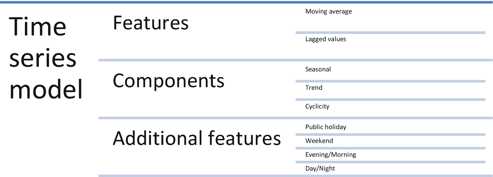

图 6-1

我们通常在时间序列预测模型中建模

让我们看一些用例，在这些用例中，时间序列模型是适用的，并且也需要模型的可解释性:

*   从安装在各地的物联网设备的传感器获取的数据

*   股票价格等财务数据

*   经济指标，如 GDP、FII、IIP、通货膨胀等等

*   机器的系统日志和错误日志

*   供应链行业中的需求预测

为了解决各种各样的用例，我们有一个可以生成未来预测的算法列表。然而，这些算法并不容易理解。也有复杂的模型。并不是所有的算法都具有可解释性和可解释性。但是向商业领袖解释这些模型是很重要的。这些算法如下:

*   自回归综合移动平均模型

*   广义自回归条件异方差模型

*   贝叶斯概率模型

*   向量自回归模型

*   神经网络自回归模型

*   递归神经网络模型

*   长短期记忆模型

*   门递归单元模型

## 知道哪个模型是好的

在生产场景中使用时间序列模型之前，需要使用指标和其他诊断方法对其进行评估。

指标:

*   **均方根误差(RMSE)** :这是尺度的函数。越少，模型越好。

*   **平均绝对百分比误差(MAPE)** :这与尺度无关。根据行业基准，最好低于 10%。

拟合预测模型后，了解度量标准以确定模型与数据的拟合程度非常重要。时间序列模型特有的一个概念是白噪声，这意味着模型无法解释的误差。如果满足以下属性，错误可被视为白噪声:

*   剩余项不相关，这意味着由 ACF 值表示的自相关函数为 0。

*   残差服从正态分布。

如果以上两个都不满足，那么模型还有改进的余地。

### 预测策略

如果业务需求是在较高层次上生成预测，并且粒度级数据可用，则有两种方式可以生成预测:

*   宏观级别，使用较高的层次结构(例如:服装类别的销售量预测在宏观级别，每个库存单位(SKU)的销售量预测在微观级别)

*   微观级别，然后使用尽可能低的粒度执行聚合

### 预测的置信区间

并非所有的时间序列模型都为预测值提供了置信区间。预测值的置信区间提供了有意义的见解。置信区间越高，模型越好。如果模型与置信区间不一致，可能会出现两种情况:

*   **黑天鹅事件**:预测值置信区间被实际值严重突破，造成大破坏。

*   **灰天鹅事件**:小于预测值的置信区间，可能导致次优结果。

在图 [6-2](#Fig2) 中，显示了每日销售额，历史数据用于预测未来。虚线显示由模型生成的预测值，两条平行的黑线显示预测值的置信区间，置信区间在上线处具有上限阈值，在下线处具有下限阈值。如果预测值像点 A 一样超过上限阈值，则称为黑天鹅事件，如果预测值超过下限阈值点 B，则称为灰天鹅事件。

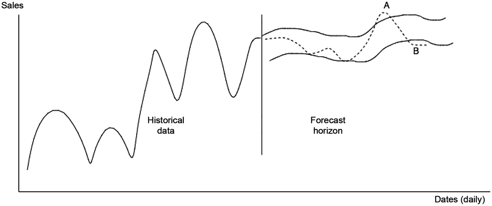

图 6-2

黑天鹅和灰天鹅事件

## 信任会怎么样？

XAI 的目的是向最终用户解释，他们是应该相信预测，还是选择更值得信赖的竞争模型。以上两种情况，黑天鹅和灰天鹅事件，极难预测。如果它们出现一两次，那也没什么。如果模型不能经常识别这样的场景，那么用户将不会对模型有信心或信任。控制这类事件的方法之一是在更高的阈值处生成置信区间，例如 90%的置信界限。其他情况需要用模型参数来解释。

数据集有一个日期戳和一些产品的价格。这被认为是一个单变量时间序列模型。您需要生成未来的预测值。

```py
import pandas as pd
import numpy as np
import matplotlib.pyplot as plt
%matplotlib inline
df = pd.read_csv('/Users/pradmishra/Downloads/XAI Book Apress/monthly_csv.csv',index_col=0)
df
# line plot of time series
# line plot of dataset
df.plot()

```

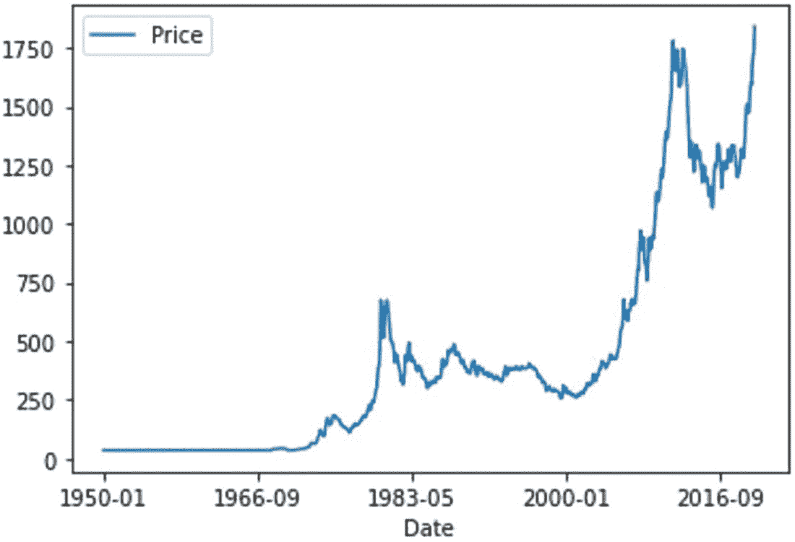

图 6-3

日期价格

在图 [6-3](#Fig3) 中，数据集中的数据显示了价格的变化，趋势和 2016 年底的某种程度的跳跃。时间序列模型中存在一定程度的季节性。季节性意味着相同的价格值会在特定的时间段出现，并且会有类似的事件重复发生。如果大于 1，那么可以确认数据中存在季节性。要在预测值中包含季节性，可以将时间序列模型扩展到季节性调整模型变量。但是，如果您希望从预测值中消除季节性因素的影响，则需要使用差分方法来调整时间序列。差别是时间序列减去它自己过去的值一个周期。季节性调整数据可以单独存储。

```py
 # seasonal difference
differenced = df.diff(12)
# trim off the first year of empty data
differenced = differenced[12:]
# save differenced dataset to file
differenced.to_csv('seasonally_adjusted.csv', index=False)
# plot differenced dataset
differenced.plot()
plt.show()

```

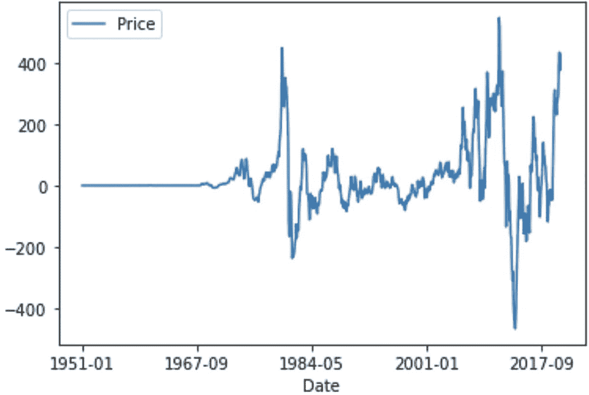

图 6-4

季节性差异时间序列数据

在图 [6-4](#Fig4) 中，显示了相同的季节性调整时间序列。自回归综合移动平均(ARIMA)模型是业内最常用的模型。他们解释了数据中的自相关性。平稳时间序列可以定义为其值不依赖于实际发生时间的序列。任何具有趋势性和季节性的时间序列都不是平稳的。然而，具有周期性的时间序列在本质上是平稳的。使时间序列平稳的方法之一是应用差分法，因为平稳性是 ARIMA 模型的假设之一。差异有助于减少数据中的趋势和季节性，从而使其稳定。自相关函数(ACF)是识别平稳性的方法之一；ACF 将很快降至零。然而，对于非平稳时间序列，相关值仍然相当高，相关值的衰减也非常小。

```py
from statsmodels.graphics.tsaplots import plot_acf
plot_acf(df)
plt.show()

```

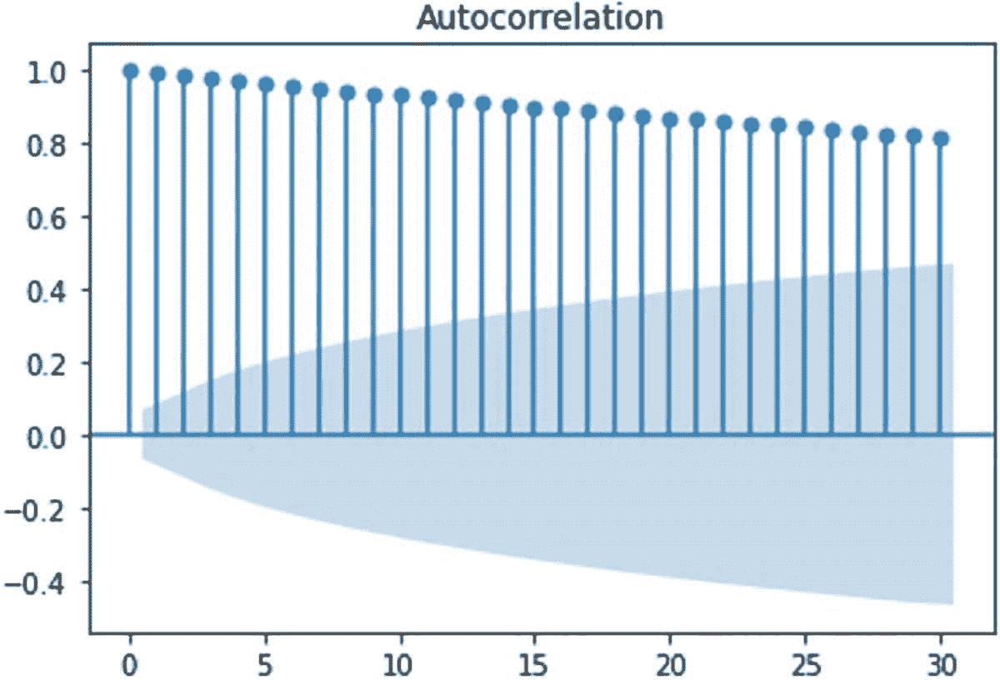

图 6-5

价格的自相关函数

在图 [6-5](#Fig5) 中，自相关函数的模式告诉我们该序列是非平稳的，因为相关系数在 30°滞后时大于 0.80。阴影颜色表示相关系数值的置信水平。由于相关系数在多达 30 个滞后时不为零，该序列在本质上是高度不稳定的。因为你知道序列不是平稳的，所以你不能应用标准的 ARIMA 模型。

有一种替代方法可以将问题转化为自回归监督机器学习问题，以了解任何滞后是否对预测值有影响。这就是为什么您创建 12 个滞后值作为独立特征来预测作为因变量的实际价格序列。

```py
# reframe as supervised learning
dataframe = pd.DataFrame()
for i in range(12,0,-1):
    dataframe['t-'+str(i)] = df.shift(i).values[:,0]
dataframe['t'] = df.values[:,0]
print(dataframe.head(13))
dataframe = dataframe[13:]
# save to new file
dataframe.to_csv('lags_12months_features.csv', index=False)

```

在上面的脚本中，您计算滞后值。在图 [6-6](#Fig6) 中，您可以看到表格形式的滞后值。

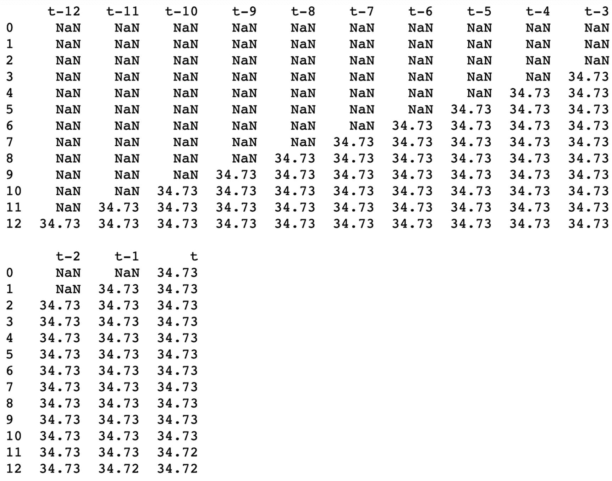

图 6-6

为模型开发创建滞后变量后处理的数据

这 12 个滞后值是要素，您可以使用随机森林回归器进行不同的要素组合，以构建决策树，并通过对所有树的预测值取平均值来集成模型预测。通过这种方式，您可以确定哪个功能更重要。

```py
# split into input and output

df = pd.read_csv('lags_12months_features.csv')
data = df.values
X = data[:,0:-1]
y = data[:,-1]
from sklearn.ensemble import RandomForestRegressor
# fit random forest model
model = RandomForestRegressor(n_estimators=500, random_state=1)
model.fit(X, y)
# show importance scores
print(model.feature_importances_)
# plot importance scores
names = dataframe.columns.values[0:-1]
ticks = [i for i in range(len(names))]
plt.bar(ticks, model.feature_importances_)
plt.xticks(ticks, names)
plt.show()

```

您已经考虑了 500 个决策树，并使用这些功能来训练随机森林回归模型。图 [6-7](#Fig7) 估算特征重要性。

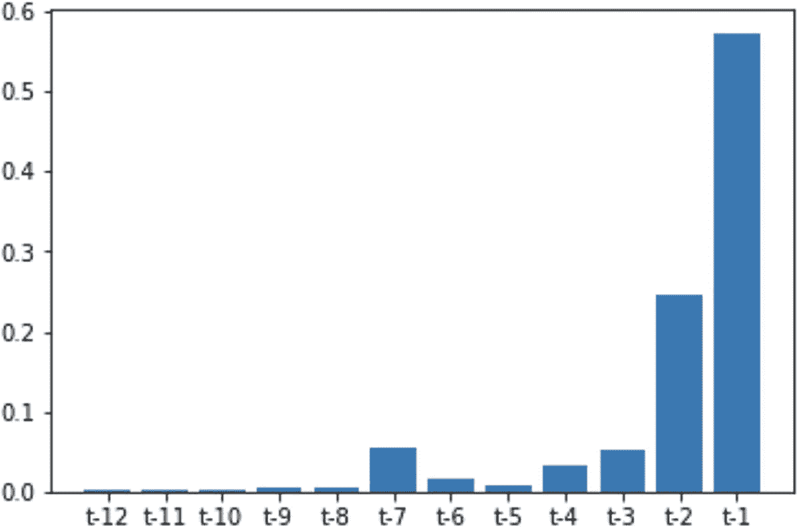

图 6-7

RF 模型的特征重要性

在图 [6-7](#Fig7) 中，可以看到滞后 1 (t-1)是最重要的特征，滞后 2 (t-2)是第二重要的特征，滞后 7 (t-7)是第三重要的特征，其次是滞后 3 和滞后 4，分别如(t-3)和(t-4)所示。其他特性对模型来说不是太重要。

```py
from sklearn.feature_selection import RFE
# perform feature selection
rfe = RFE(RandomForestRegressor(n_estimators=500, random_state=1), n_features_to_select=4)
fit = rfe.fit(X, y)
# report selected features
print('Selected Features:')
names = dataframe.columns.values[0:-1]
for i in range(len(fit.support_)):
    if fit.support_[i]:
        print(names[i])
# plot feature rank
names = dataframe.columns.values[0:-1]
ticks = [i for i in range(len(names))]
plt.bar(ticks, fit.ranking_)
plt.xticks(ticks, names)
plt.show()

```

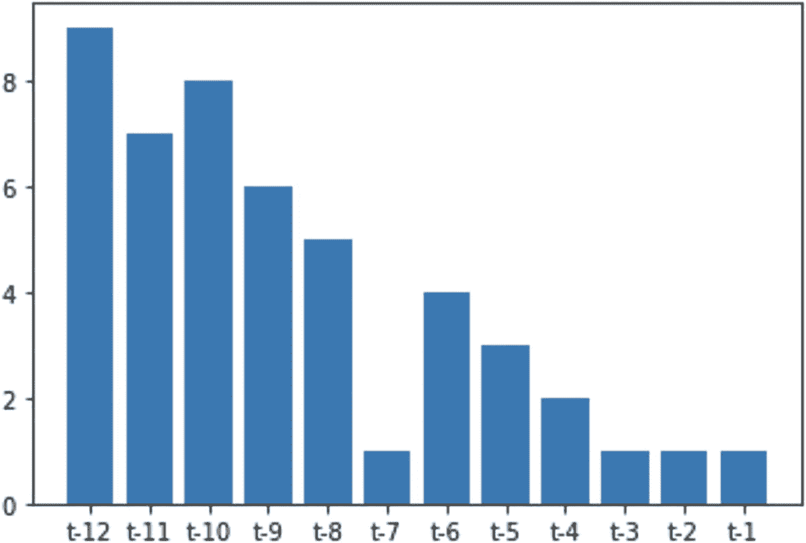

图 6-8

来自 RFE 算法的特征重要性

递归特征消除(RFE)是一种在监督学习环境中从特征列表中移除冗余特征的流行算法(图 [6-8](#Fig8) )。有两种不同的选项来配置 RFE:要么选择要素的数量，要么选择用于选择要素的算法。RFE 就像是基于监督回归的模型或基于分类的模型之上的包装算法。这意味着你需要一个模型，然后你可以在它上面应用 RFE。在上面的脚本中，你在随机森林回归模型上使用了 RFE。选择的最重要的特征是滞后 7、3、2 和 1。其余的八个特征没有被算法选择。因此，连续和一致的滞后对目标特征没有影响；但是，所选特征会对预测结果产生影响。本章前面讨论的时间序列模型的特征只有滞后变量和移动平均变量。这就是为什么如果只使用滞后项，时间序列对象可以建模为 AR。如果只使用移动平均项作为特征，则只能是 MA。自回归意味着滞后值可以用作预测实际时间序列的特征。

```py
# AR example
from statsmodels.tsa.ar_model import AutoReg
from random import random
# fit model
model = AutoReg(y, lags=1)
model_fit = model.fit()
model_fit.summary()

```

前面的脚本显示，如果您仅使用滞后 1 来预测当前时间段，则该模型称为 AR 1 模型。这类似于线性回归。见表 [6-1](#Tab1) 。

表 6-1

自回归模型结果

<colgroup><col class="tcol1 align-left"> <col class="tcol2 align-left"></colgroup> 
|  |

您可以将等式写成

Yt = 0.5136 + 1.0039*Yt-1

系数 1.0039 的 p 值为 0.000，小于 0.05。这意味着在 95%的置信水平和 5%的显著性统计水平下，第一个滞后项足以影响实际的时间序列 Yt。这可以解释为，*如果滞后项变化 1 个单位，则预测序列的实际值变化 0.39%* 。

```py
# AR example
from statsmodels.tsa.ar_model import AutoReg
from random import random
# fit model
model = AutoReg(y, lags=2)
model_fit = model.fit()
model_fit.summary()

```

通过考虑两个滞后，可以进行类似的分析，等式变成

Yt = 0.6333+1.2182 * Yt-1–0.2156 * Yt-2

系数 1.2182 和 0.2156 的 p 值为 0.000，小于 0.05，这意味着 95%的置信水平和 5%的显著性统计水平。对于第一个和第二个滞后项，这足以影响实际的时间序列 Yt。这可以解释为，*如果滞后项变化一个单位，则预测序列的实际值变化 0.22%* 。滞后 2 系数可以解释为，*如果滞后 2 改变一个单位，序列 Yt 将减少 0.2156 倍*。见表 [6-2](#Tab2) 。

表 6-2

具有两个滞后结果的自回归模型

<colgroup><col class="tcol1 align-center"> <col class="tcol2 align-center"></colgroup> 
|  |

```py
# AR example
from statsmodels.tsa.ar_model import AutoReg
from random import random
# fit model
model = AutoReg(y, lags=12)
model_fit = model.fit()
model_fit.summary()

```

与上述两个滞后情景一样，您可以将模型扩展到 12 个滞后情景，并做出类似的解释。参见表 [6-3](#Tab3) 和 [6-4](#Tab4) 。

表 6-5

季节性 ARIMA 模型结果

<colgroup><col class="tcol1 align-center"> <col class="tcol2 align-center"></colgroup> 
| 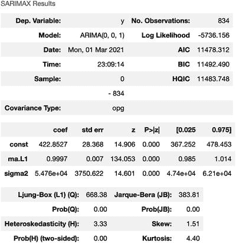 |

表 6-4

上述模型的系数表

<colgroup><col class="tcol1 align-center"> <col class="tcol2 align-center"></colgroup> 
| 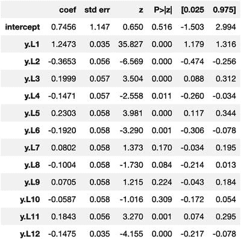 |

表 6-3

具有 12 个滞后变量的自回归模型结果

<colgroup><col class="tcol1 align-center"> <col class="tcol2 align-center"></colgroup> 
| 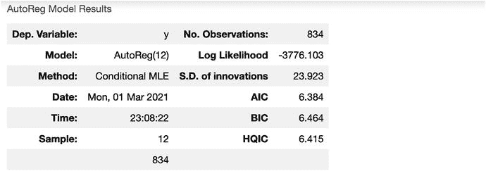 |

选择 ARIMA 模型时，需要定义模型的阶次。在以下脚本中，您将顺序定义为(0，0，1)，这意味着(p，d，q)，其中 p 表示自回归项，d 表示微分，q 表示移动平均值。所以 0，0，1 的顺序只代表移动平均模型。

```py
# MA example
from statsmodels.tsa.arima.model import ARIMA
from random import random
# fit model
model = ARIMA(y, order=(0, 0, 1))
model_fit = model.fit()
# make prediction
yhat = model_fit.predict(len(y), len(y))
print(yhat)
model_fit.summary()

```

以下脚本显示了 2 阶、0 阶和 1 阶 ARIMA、2 个滞后自回归项、0 个微分项和 1 个移动平均项:

```py
# ARMA example
from statsmodels.tsa.arima.model import ARIMA
from random import random
# fit model
model = ARIMA(y, order=(2, 0, 1))
model_fit = model.fit()
# make prediction
yhat = model_fit.predict(len(y), len(y))
print(yhat)
model_fit.summary()

```

所有模型的结果摘要可以用与上面非常相似的方式来解释。如果你想在 ARIMA 模型中引入季节性因素，它就变成了萨里玛模型。季节性订单也可以根据表 [6-7](#Tab7) 进行定义。

表 6-7

SARIMA 模型参数解释，下表是参数及其解释的表示

<colgroup><col class="tcol1 align-left"> <col class="tcol2 align-left"></colgroup> 
| 

因素

 | 

说明

 |
| --- | --- |
| `Endog` | 观察到的时间序列过程𝑦 |
| `Order` | AR 参数、差异和 MA 参数数量的模型的(p，d，q)阶 |
| `seasonal_order` | AR 参数、差异、MA 参数和周期的模型的季节分量的(p，d，q)阶 |
| `Trend` | 控制确定性趋势多项式𝐴(𝑡).的参数 |
| `enforce_stationarity` | 是否转换 AR 参数以强制模型的自回归分量具有平稳性。默认值为 True。 |

表 6-6

SARIMAX 模型结果，下表显示了最多 2 个滞后的自回归项和最多 1 个移动平均值，还显示了系数及其统计显著性水平

<colgroup><col class="tcol1 align-center"> <col class="tcol2 align-center"></colgroup> 
| 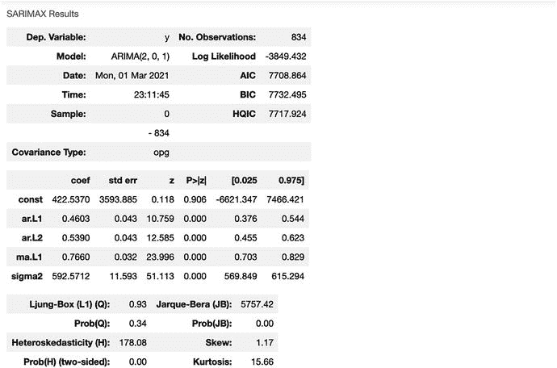 |

```py
# ARMA example
from statsmodels.tsa.arima.model import ARIMA
from random import random
# fit model
model = ARIMA(y, order=(2, 1, 1))
model_fit = model.fit()
# make prediction
yhat = model_fit.predict(len(y), len(y))
print(yhat)
model_fit.summary()

# SARIMA example
from statsmodels.tsa.statespace.sarimax import SARIMAX
from random import random
# fit model
model = SARIMAX(y, order=(1, 1, 1), seasonal_order=(0, 0, 0, 0))
model_fit = model.fit(disp=False)
# make prediction
yhat = model_fit.predict(len(y), len(y))
print(yhat)
model_fit.summary()

```

*表 6-8。* *萨里玛模式* *结果*


表 6-8 中系数的 p 值在 5%的显著性水平上具有统计显著性，因为这些值小于 0.05。上面生成的模型输出摘要主要使用 OLS 作为测量技术，OLS 方法非常类似于多元线性回归模型。因此，模型系数、它们的相关性和解释可以很容易地做出。

## 时间序列:石灰

使用 LIME 可解释库，您可以将 12 个滞后作为特征，训练一个回归模型并解释预测，如下所示。如果您还没有安装 LIME 库，那么首先需要安装它:

```py
!pip install Lime
 import lime
import lime.lime_tabular
explainer = lime.lime_tabular.LimeTabularExplainer(np.array(X),
                                                   mode='regression',
                                                  feature_names=X.columns,
                                                  class_names=['t'],
                                                  verbose=True)
explainer.feature_frequencies
# asking for explanation for LIME model
i = 60
exp = explainer.explain_instance(np.array(X)[i],
                                 new_model.predict,
                                 num_features=12
                                )
exp.show_in_notebook(show_table=True)

```

在上面的脚本中，您将时间序列模型视为监督学习模型，并使用 12 个滞后作为特征。从 LIME 库中，您可以使用 LIME 表格解释器。图 [6-9](#Fig9) 显示了记录号 60 的解释。

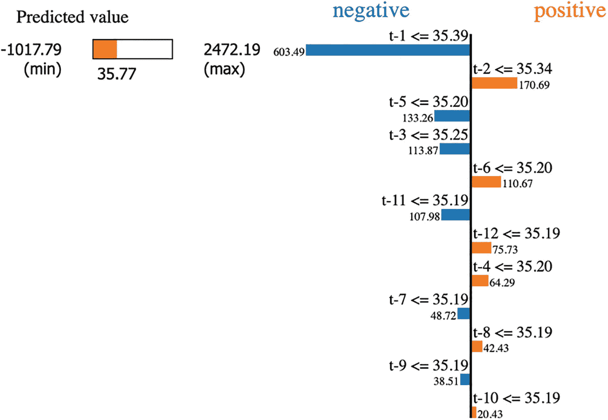

图 6-9

记录 60 的石灰说明

预测值为 35.77，下阈值和上阈值反映了预测结果的置信带。有助于预测的积极因素和消极因素如图 [6-9](#Fig9) 所示。滞后 1 是一个非常重要的特性；第二个重要特性是滞后 2，然后是滞后 5，滞后 3，滞后 6，依此类推。作为特征的滞后值及其对预测值的贡献如图 [6-10](#Fig10) 所示。

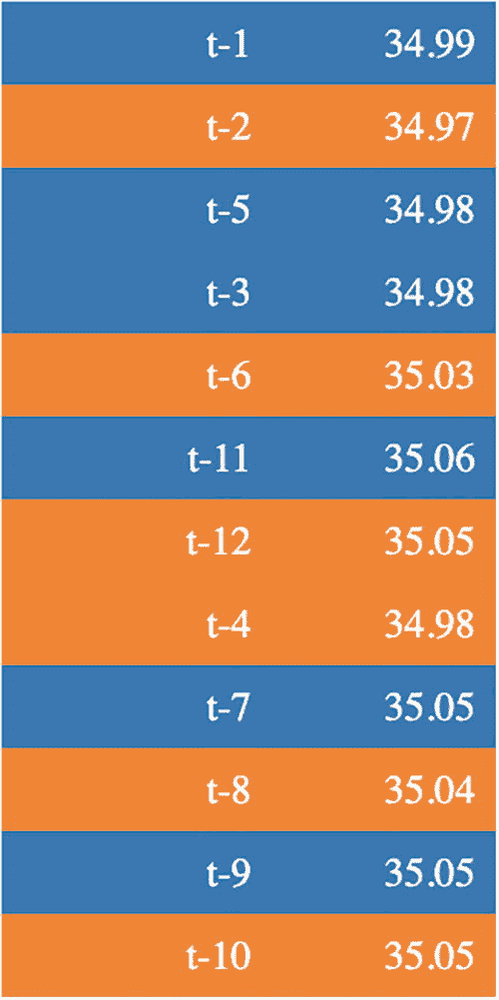

图 6-10

模型的特征重要性

```py
 # Code for SP-LIME
import warnings
from lime import submodular_pick

# Remember to convert the dataframe to matrix values
# SP-LIME returns exaplanations on a sample set to provide a non redundant global decision boundary of original model
sp_obj = submodular_pick.SubmodularPick(explainer, np.array(X),
                                        new_model.predict,
                                        num_features=12,
                                        num_exps_desired=10)
import matplotlib.pyplot as plt
plt.savefig('[exp.as_pyplot_figure() for exp in sp_obj.sp_explanations ].png', dpi=300)
images = [exp.as_pyplot_figure() for exp in sp_obj.sp_explanations ]
exp.predicted_value

```

用于解释模型的子模块通过数据中的一组实例提供了对模型的全局理解。在上面的脚本中，您考虑了所有 12 个基于 lag 的特性，10 个实例供用户检查或显示解释。

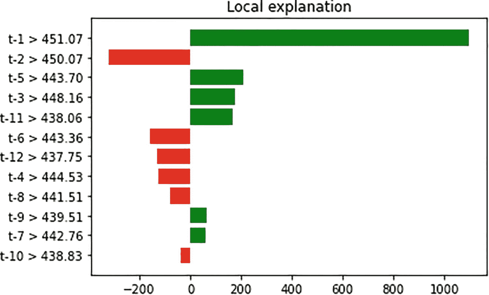

图 6-11

记录 0 的本地解释

在图 [6-11](#Fig11) 中，滞后 1 在预测输出值时非常重要。绿色条改善预测，红色条降低预测值。这是当地对第一条记录的解释。以类似的方式，您可以考虑其他样本记录并生成这样的解释。

## 结论

在本章中，您学习了如何解释时间序列模型。您将时间序列模型视为监督学习模型，并解释了所有特性的特性重要性。您研究了自回归模型、移动平均模型以及自回归和综合移动平均模型。使用 LIME 作为可解释库，您看到了 lags 在预测目标值中的重要性。此外，您还了解了有助于预测结果的正滞后和负滞后特征。