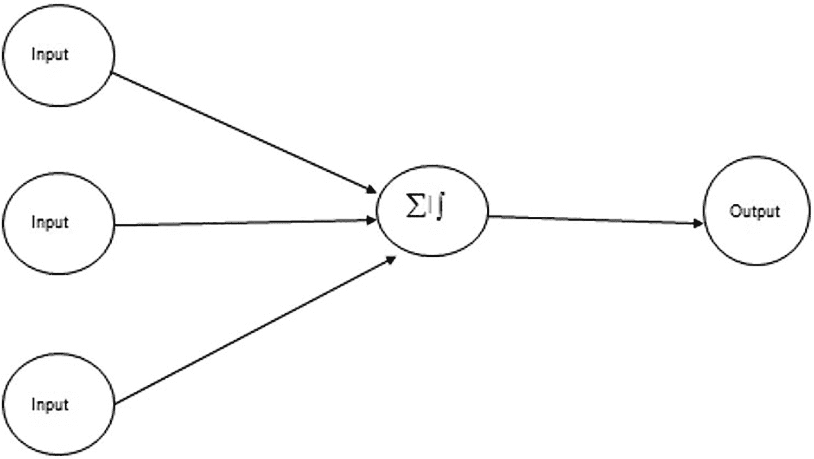
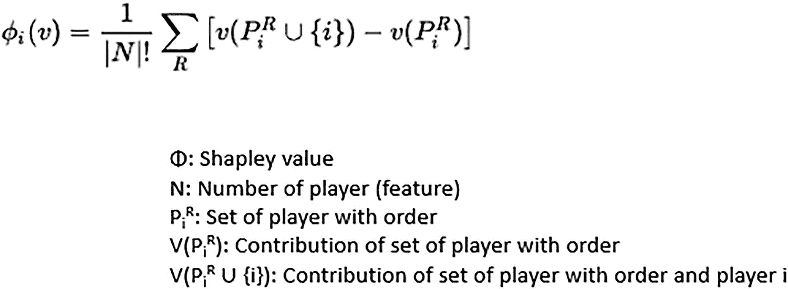
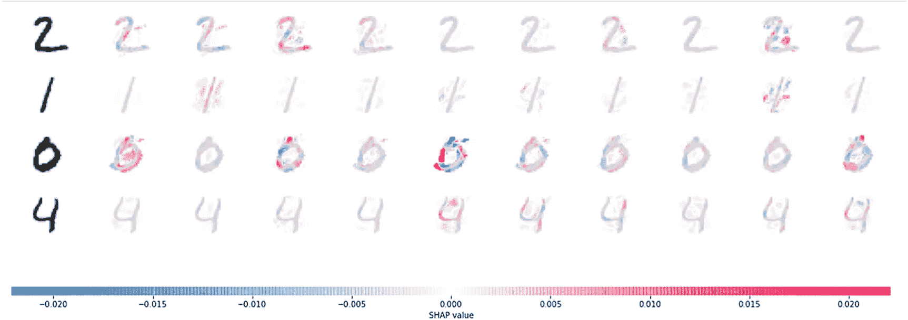
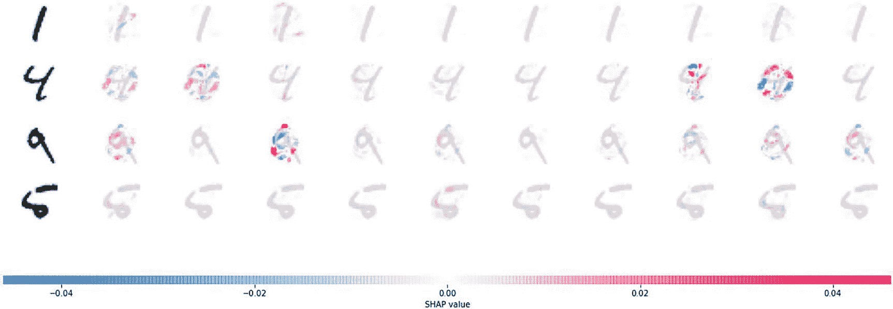
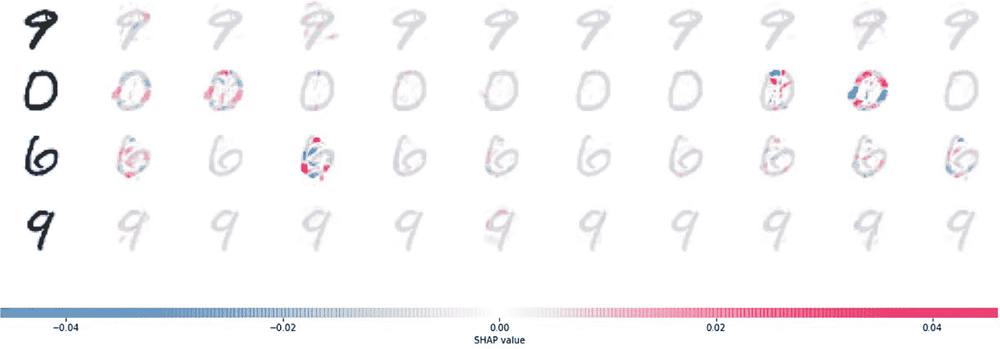
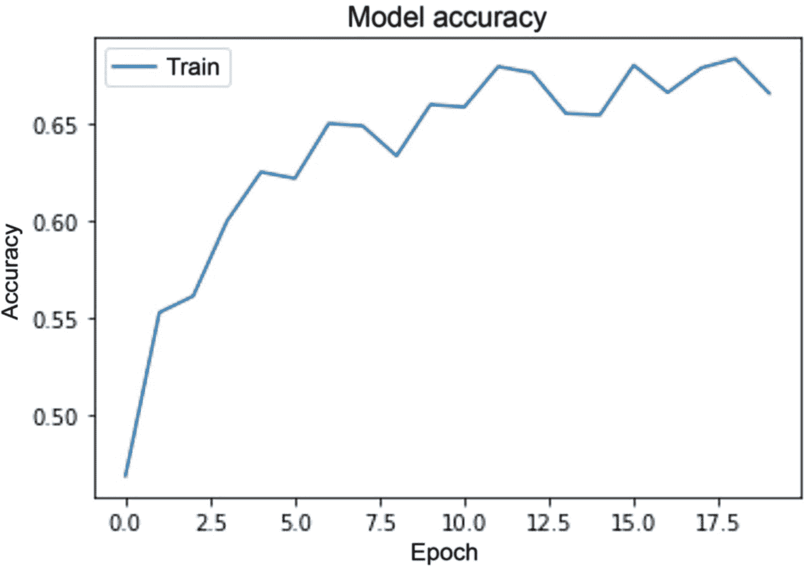
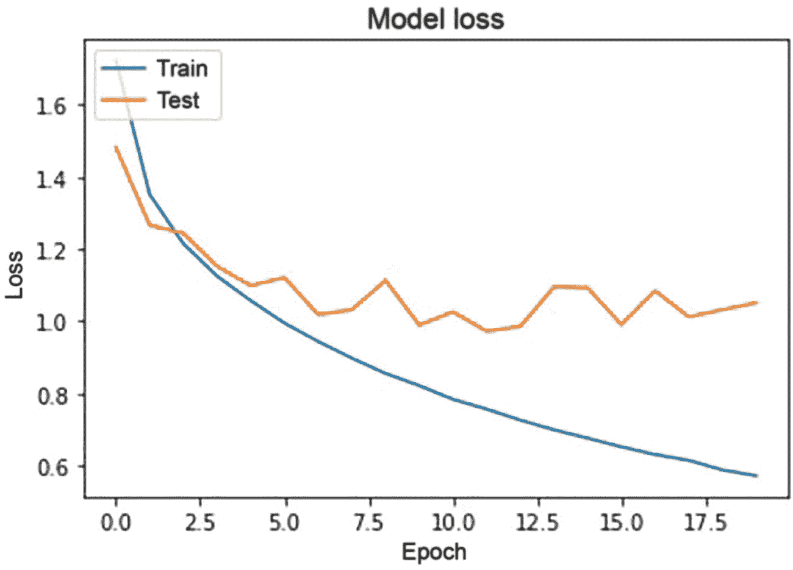
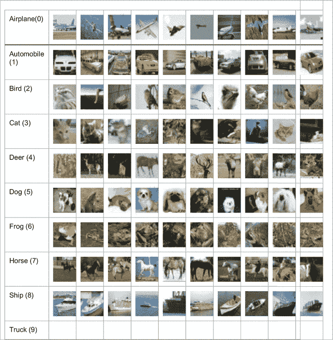
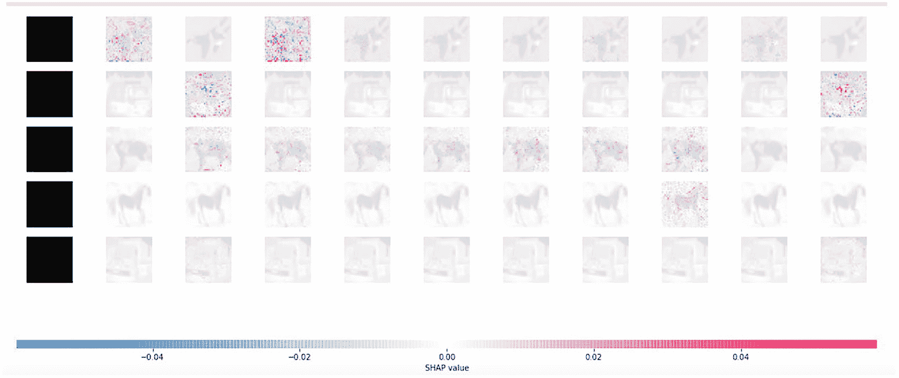

# 九、深度学习模型的可解释性

基于深度神经网络的模型正逐渐成为人工智能和机器学习实现的支柱。数据挖掘的未来将受到基于人工神经网络的高级建模技术的控制。那么，为什么神经网络在 20 世纪 50 年代被发明的时候会变得如此重要呢？借用计算机科学领域，神经网络可以被定义为并行信息处理系统，其中输入彼此连接，就像人脑中的神经元一样，以传输信息，从而可以执行像人脸识别和图像识别这样的活动。理论上，神经网络已经存在了 50 多年，但在计算方面取得一定进展后，特别是 GPU 和 TPU 在执行高端计算、大规模矩阵乘法等方面的发展，神经网络项目在实际场景中的执行成为可能。在本章中，您将了解基于神经网络的方法在各种数据挖掘任务中的应用，如分类、回归、预测和特征约简。人工神经网络(ANN)的功能类似于人脑的功能，其中数十亿个神经元相互连接，进行信息处理和洞察生成。

## 解释 DL 模型

大脑的生物网络为现实生活场景中的信息处理和洞察力生成提供了连接元素的基础。神经元的层次通过层连接，其中一层的输出成为另一层的输入。信息作为权重从一层传递到另一层。与每个神经元相关联的权重包含洞察力，以便下一级的识别和推理变得更容易。人工神经网络是一种非常流行和有效的方法，它由与权重相关联的层组成。不同层之间的关联由一个数学等式控制，该等式将信息从一层传递到另一层。事实上，在一个人工神经网络模型中有一堆数学方程在起作用。图 [9-1](#Fig1) 显示了基于神经网络模型的一般架构，其中显示了输入层、输出层和隐藏层。


图 9-1

样本神经网络结构

有三层(输入、隐藏和输出),它们是任何基于神经网络的架构的核心。人工神经网络是解决许多现实世界问题的强大技术，例如分类、回归和特征选择。人工神经网络具有从新输入数据形式的新经验中学习的能力，以便改进基于分类或回归的任务的性能，并使自己适应输入环境的变化。图 [9-1](#Fig1) 中的每个圆圈代表一个神经元。深度学习的一个主要优势是，我们不必专注于为模型训练创建手工制作的特征。特征交互不需要由人类来创建；它们应该在培训过程中自动创建。

从算法或计算的角度来看，神经网络有不同的变体，用于多种不同的场景。下面我将从概念上解释其中的几个，以便你能理解它们在实际应用中的用法。

*   **单隐层神经网络**:这是神经网络最简单的形式，如图 [9-1](#Fig1) 所示。里面只有一个隐藏层。

*   **多隐层神经网络**:在这种形式中，不止一个隐层将输入数据与输出数据连接起来。这种形式增加了计算的复杂性，并且需要系统有更多的计算能力来处理信息。

*   **前馈神经网络**:在这种形式的神经网络架构中，信息从一层向另一层单向传递；没有从第一级学习开始的迭代。

*   **反向传播神经网络**:在这种形式的神经网络中，有两个重要步骤。前馈的工作原理是将信息从输入层传递到隐藏层，再从隐藏层传递到输出层。其次，它计算误差并将其传播回先前的层。

还有另一种基于用法和结构的分类，可以解释如下:

*   **递归神经网络(RNN)** :这多用于顺序信息处理，如音频处理、文本分类等。

*   **深度神经网络(DNN)** :用于高维结构化数据问题，其中特征交互非常复杂，手工构建每个特征非常繁琐。

*   **卷积神经网络(CNN)** :这主要用于图像数据，其中像素大小产生高维矩阵。需要以复杂的方式综合信息来对图像进行分类。

前馈神经网络模型架构如图 [9-2](#Fig2) 所示，反向传播方法将在下一节中解释。



图 9-2

基本前馈神经网络结构

## 将 SHAP 与 DL 一起使用

如前几章所述，SHAP 是各种模型解释的伟大图书馆，局部模型解释，全球模型解释，而这些解释来自 Shapely 值。重要的是要知道什么是 Shapely 值；这个匀称的值完全依赖于博弈论的方法。下面的公式解释了 Shapely 值的计算是如何在库中发生的:



### 使用深层 SHAP

深度 SHAP 是一个从基于深度学习的模型中导出 SHAP 值的框架，该模型是使用基于 Keras 的模型或基于 TensorFlow 的模型开发的。你可以以 MNIST 数据集为例，其中一个样本数据点显示了该数字的像素值，一个深度学习模型正在被训练以对图像进行分类。SHAP 值如下所示。

如果我们将机器学习模型与深度学习模型进行比较，ML 模型仍然是可解释的，但神经网络模型，尤其是深度神经网络模型，本质上是黑盒，这是业界采用 AI 模型的障碍，因为没有人可以解释深度学习模型预测的应用。深度学习重要特性(DeepLIFT)是 2019 年 10 月出现的一个框架。它被设计成应用一种用于分解深度神经网络模型的输出预测的方法。这是通过反向传播深度神经网络中所有神经元对输入的每个特征的贡献来实现的。DeepLIFT 框架通过比较每个神经元的激活与其相应的激活来实现这一点，并分配一个分数，该分数被称为贡献分数。

### 利用不在场证明

除了 DeepLIFT 和 Deep SHAP，还有一个开源库叫做 Alibi。这是一个基于 Python 的库，旨在解释机器学习模型。下面的代码解释了如何安装 Alibi，以及如何使用另一个名为 Ray 的库来加速 Alibi 的搜索。

```py
!pip install alibi

```

上面的代码安装了解释模型的 Alibi 库。

```py
!pip install alibi[ray]

```

alibi[ray]库是一个依赖库，也需要安装。

```py
!pip install tensorflow_datasets

```

您可以使用`tensorflow_datasets`从库中收集一些数据集用于本章。

```py
!pip install keras

```

Keras 库是用来训练深度学习模型的。

```py
from __future__ import print_function
import keras
from keras.datasets import mnist
from keras.models import Sequential
from keras.layers import Dense, Dropout, Flatten
from keras.layers import Conv2D, MaxPooling2D
from keras import backend as K
import matplotlib.pyplot as plt
%matplotlib inline

batch_size = 128
num_classes = 10
epochs = 12

# input image dimensions
img_rows, img_cols = 28, 28

```

MNIST 是一个数字分类数据集，其中有手写的数字图片，并由专家标记，让模型学习模式。Conv2D 是一个卷积二维层，它转换权重并对图像像素执行空间卷积。Conv2D 中提供的值是卷积层将学习的滤波器数量。卷积后，在低维空间中像素的压缩表示需要最大池。因此，每个回旋层需要一个最大池层。最大池图层也需要输出矩阵大小。在以下脚本中，您在 Conv2D 层中使用了 32 个过滤器，并且内核大小或过滤器大小为(3，3)。最大汇集通常用于减少输出体积的空间维度。内核大小必须是奇数组合，例如(1，1)、(3，3)或(5，5)，以便确保内核滤波器平滑地遍历空间空间。`Stride`是使过滤器在像素空间中移动的值。`stride =1`表示过滤器在像素矩阵中向右移动一个位置。一旦到达像素矩阵的边缘，它就向下移动并保持移动到尽可能低的行，然后向左移动。当您在像素空间中移动奇数编号的核来收集所有复杂的特征时，有时过滤器不会到达像素矩阵的边缘。为了实现这一点，您需要在原始像素矩阵周围添加一行和一列。这叫做填充。填充可以是零填充和相同填充。

```py
# the data, split between train and test sets
(x_train, y_train), (x_test, y_test) = mnist.load_data()
if K.image_data_format() == 'channels_first':
    x_train = x_train.reshape(x_train.shape[0], 1, img_rows, img_cols)
    x_test = x_test.reshape(x_test.shape[0], 1, img_rows, img_cols)
    input_shape = (1, img_rows, img_cols)
else:
    x_train = x_train.reshape(x_train.shape[0], img_rows, img_cols, 1)
    x_test = x_test.reshape(x_test.shape[0], img_rows, img_cols, 1)
    input_shape = (img_rows, img_cols, 1)

x_train = x_train.astype('float32')
x_test = x_test.astype('float32')
x_train /= 255
x_test /= 255

print('x_train shape:', x_train.shape)
print(x_train.shape[0], 'train samples')
print(x_test.shape[0], 'test samples')

```

上面的脚本显示了从 Keras 库中获取数据并使用加载的数据来规范化训练样本和测试样本的一般步骤。这是通过将每个单独的像素值除以其最高像素值来实现的。之后，60，000 个样本停放用于训练，10，000 个样本停放用于测试。这里的图像大小是 28×28 像素，批量大小是 128，每一个数字一个类别图像的类别数是 10。此外，您将使用 10 次迭代或历元来训练模型。

```py
# convert class vectors to binary class matrices
y_train = keras.utils.to_categorical(y_train, num_classes)
y_test = keras.utils.to_categorical(y_test, num_classes)

model = Sequential()
model.add(Conv2D(32, kernel_size=(3, 3),
                 activation='relu',
                 input_shape=input_shape))
model.add(Conv2D(64, (3, 3), activation='relu'))
model.add(MaxPooling2D(pool_size=(2, 2)))
model.add(Dropout(0.25))
model.add(Flatten())
model.add(Dense(128, activation='relu'))
model.add(Dropout(0.5))
model.add(Dense(num_classes, activation='softmax'))

```

您在这里作为示例使用的图像分类模型有三个部分，加上卷积和最大池的应用以减少维度。使用`Dropout`和`Flatten`是为了移除低概率权重，以限制模型过度拟合。`Flatten`添加层以重塑数据，用于进一步的矩阵乘法。您还可以使用密集层来创建全连接神经网络模型，该模型在低维空间中运行，以更高的精度对目标类进行分类。激活函数是在从前一层接收的权重和特征的点积相乘之后使用的传递函数。为了获得每个类的概率，您需要在神经网络模型的最后一层使用 softmax 激活函数。

```py
model.compile(loss=keras.losses.categorical_crossentropy,
              optimizer=keras.optimizers.Adadelta(),
              metrics=['accuracy'])

```

一旦设计了模型结构，下一步就是编译模型。Keras 库中的编译步骤有某些参数；重要的是损失函数、优化器和度量。除此之外，还有其他参数可用于微调模型和重新训练模型，以限制模型过度拟合。误差函数或损失函数的选择应该基于任务。如果目标列有两个以上的类，那么可以使用分类交叉熵。优化器的作用是优化损失函数并识别损失函数最小的步骤。度量的功能是计算对应于每个时期的模型的精确度。

```py
model.fit(x_train, y_train,
          batch_size=batch_size,
          epochs=epochs,
          verbose=1,
          validation_data=(x_test, y_test))

```

所有时期的结果不能在日志中表示，因此它被截断，但是在日志上保持观察以识别迭代，在该迭代之后模型正在学习或者精度变得平坦，等等。从下面的结果来看，分类模型的测试准确率为 85.28%。

```py
score = model.evaluate(x_test, y_test, verbose=0)
print('Test loss:', score[0])
print('Test accuracy:', score[1])

import tensorflow as tf
tf.compat.v1.disable_v2_behavior() # run this if you get tensor related error

```

### 深度学习的 SHAP 解释者

SHAP 库有一个深度解释器模块，它包含了一个展示正面和负面属性或者对分类任务的贡献的表示，特别是对每个类。

```py
background = x_train[np.random.choice(x_train.shape[0],100, replace=False)]
explainer = shap.DeepExplainer(model,background)

shap_values = explainer.shap_values(x_test[1:5])

# plot the feature attributions
shap.image_plot(shap_values, -x_test[1:5])

```



图 9-3

图像分类的深度解释器

在图 [9-3](#Fig3) 中，红色的值是预测类的正类，蓝色的值是预测类的负类。该图显示了 SHAP 值 2、1、0 和 4。该模型生成对应于图像的这四个值的 10 个预测。红色值使预测接近最左侧的输入图像，负值使预测相对于左侧的输入图像有所降低。深度 SHAP 是在 NIPS 发表的一篇论文的基础上开发的。

在为分类和回归模型生成预测后，DeepLIFT 使用类似于反向传播的方法对 SHAP 值进行估计。

```py
# plot the feature attributions
shap.image_plot(shap_values, -x_test[5:9])

```



图 9-4

DeepExplainer 获得更多记录

在图 [9-4](#Fig4) 中，打印了另外四个数字，并绘制了它们对应的 SHAP 分数。如果你看看数字 5 和 1，你会发现它们的模式是一致的。然而，当你看到数字 4 和 9 时，就会产生歧义，因为在某些地方，SHAP 分数并不能清楚地帮助预测该类别。

```py
# plot the feature attributions
shap.image_plot(shap_values, -x_test[9:13])

```



图 9-5

另外四位数的深度解释器

在图 [9-5](#Fig5) 中，同样可以在数字 0 和 6 中看到类似的视图，因为这两个数字似乎都以非常相似的方式书写。然而，数字 9 是相当清楚的。

### 图像分类的另一个例子

CIFAR-10 数据集取自 [`www.cs.toronto.edu/~kriz/cifar.html`](http://www.cs.toronto.edu/%257Ekriz/cifar.html) `.`您有一个 60，000 幅图像的样本，由 32x32 幅彩色图像组成，有 10 个需要预测或分类的类别。这些类别是飞机、汽车、鸟等。深度学习模型可以用两个解释器来解释，DeepExplainer 和 GradientExplainer。

```py
from keras.datasets import cifar10
from keras.utils import np_utils
from keras.models import Sequential
from keras.layers.core import Dense, Dropout, Activation, Flatten
from keras.layers.convolutional import Conv2D, MaxPooling2D
from keras.optimizers import SGD, Adam, RMSprop

import matplotlib.pyplot as plt

#from quiver_engine import server
# CIFAR_10 is a set of 60K images 32x32 pixels on 3 channels
IMG_CHANNELS = 3
IMG_ROWS = 32
IMG_COLS = 32

#constant
BATCH_SIZE = 128
NB_EPOCH = 20
NB_CLASSES = 10
VERBOSE = 1
VALIDATION_SPLIT = 0.2
OPTIM = RMSprop()

```

你不能将一整组样本放入卷积层和密集层。这个过程非常慢、耗时，而且计算量很大。因此，需要使用来自训练集的小批量样本，并在每个时期后递增地更新权重。因此，批量大小为 128，时期数为 20，优化器为 RMSPROP，验证样本大小为 20%。这些是被认为是示例的超参数，这是超参数配置的最佳设置吗，可能不是，因为这些可以在多次迭代之后设置。最佳超参数选择可以使用网格搜索方法或多次迭代来完成。

```py
#load dataset
(X_train, y_train), (X_test, y_test) = cifar10.load_data()
print('X_train shape:', X_train.shape)
print(X_train.shape[0], 'train samples')
print(X_test.shape[0], 'test samples')

# convert to categorical
Y_train = np_utils.to_categorical(y_train, NB_CLASSES)
Y_test = np_utils.to_categorical(y_test, NB_CLASSES)

# float and normalization
X_train = X_train.astype('float32')
X_test = X_test.astype('float32')
X_train /= 255
X_test /= 255

# network

model = Sequential()
model.add(Conv2D(32, (3, 3), padding='same',
                 input_shape=(IMG_ROWS, IMG_COLS, IMG_CHANNELS)))
model.add(Activation('relu'))
model.add(MaxPooling2D(pool_size=(2, 2)))
model.add(Dropout(0.25))

model.add(Flatten())
model.add(Dense(512))
model.add(Activation('relu'))
model.add(Dropout(0.5))
model.add(Dense(NB_CLASSES))
model.add(Activation('softmax'))

model.summary()

```

神经元数量汇总显示在`param`栏中。正在训练的参数有 4，200，842 个，没有不可训练的参数。

```py
# train
#optim = SGD(lr=0.01, decay=1e-6, momentum=0.9, nesterov=True)
model.compile(loss='categorical_crossentropy', optimizer=OPTIM,
        metrics=['accuracy'])

history = model.fit(X_train, Y_train, batch_size=BATCH_SIZE,
        epochs=NB_EPOCH, validation_split=VALIDATION_SPLIT,
        verbose=VERBOSE)

print('Testing...')
score = model.evaluate(X_test, Y_test,
                     batch_size=BATCH_SIZE, verbose=VERBOSE)
print("\nTest score:", score[0])
print('Test accuracy:', score[1])

```

一旦训练出一个更好的分类模型，您就可以保存该模型对象，供以后生成推理时进一步使用。

```py
#save model
model_json = model.to_json()
open('cifar10_architecture.json', 'w').write(model_json)
model.save_weights('cifar10_weights.h5', overwrite=True)

# list all data in history
print(history.history.keys())
# summarize history for accuracy
#plt.plot(mo)

plt.plot(history.history['val_acc'])
plt.title('model accuracy')
plt.ylabel('accuracy')
plt.xlabel('epoch')
plt.legend(['train', 'test'], loc='upper left')
plt.show()

```



图 9-6

每个历元的训练模型精度

从图 [9-6](#Fig6) 中可以清楚地看到，最高的训练精度是在第 10 个<sup>时期左右达到的。之后，训练精度相当不稳定。有一个之字形图案。</sup>

```py
# summarize history for loss
plt.plot(history.history['loss'])
plt.plot(history.history['val_loss'])
plt.title('model loss')
plt.ylabel('loss')
plt.xlabel('epoch')
plt.legend(['train', 'test'], loc='upper left')
plt.show()

```



图 9-7

模型训练损失和模型测试损失表示

从图 [9-7](#Fig7) 来看，模型训练损失和模型试验损失是齐头并进的，直到第三个<sup>时期</sup>。之后，损失值发散，测试损失显示出之字形图案，清楚地显示出不稳定损失，并且训练损失继续下降，这是过拟合的明显迹象。

在生成模型解释之前，确保模型稳定、准确和可靠是很重要的。否则，很难证明推论是正确的，因为模型会产生随机的推论和解释。

### 使用 SHAP

在获得具有良好准确性的体面的深度学习模型之后，解释模型预测是重要的。此外，了解 SHAP 分数如何导致班级预测也是非常有趣的。见图 [9-8](#Fig8) 和表 [9-1](#Tab1) 。

表 9-3

表 [9-2](#Tab2) 中所示的九个等级的概率值

<colgroup><col class="tcol1 align-left"> <col class="tcol2 align-left"> <col class="tcol3 align-left"> <col class="tcol4 align-left"> <col class="tcol5 align-left"> <col class="tcol6 align-left"> <col class="tcol7 align-left"> <col class="tcol8 align-left"> <col class="tcol9 align-left"> <col class="tcol10 align-left"> <col class="tcol11 align-left"></colgroup> 
|   | Zero | one | Two | three | four | five | six | seven | eight | nine |
| **0** | Zero | Zero point zero zero one | Zero point zero zero two | Zero point nine two eight | Zero point zero zero seven | Zero point zero five three | Zero | Zero | Zero point zero zero eight | Zero |
| **1** | Zero | Zero point zero zero five | Zero | Zero | Zero | Zero | Zero | Zero | Zero point nine nine five | Zero |
| **2** | Zero point one six four | Zero point zero one three | Zero point zero zero five | Zero point zero zero one | Zero point zero zero one | Zero | Zero | Zero point zero zero one | Zero point seven nine seven | Zero point zero one nine |
| **3** | Zero point six six one | Zero point zero zero two | Zero point one zero five | Zero point zero zero one | Zero point zero zero three | Zero | Zero point zero zero one | Zero | Zero point two two six | Zero |
| **4** | Zero | Zero | Zero point zero three seven | Zero point zero seven three | Zero point two eight nine | Zero point zero zero two | Zero point five nine eight | Zero | Zero | Zero |
| **5** | Zero point zero zero one | Zero | Zero point zero three five | Zero point zero three three | Zero point zero two three | Zero point zero two four | Zero point eight seven seven | Zero point zero zero three | Zero | Zero point zero zero three |
| **6** | Zero | One | Zero | Zero | Zero | Zero | Zero | Zero | Zero | Zero |
| **7** | Zero point zero zero nine | Zero | Zero point zero three six | Zero point zero zero one | Zero | Zero | Zero point nine five four | Zero | Zero | Zero |
| **8** | Zero point zero zero three | Zero | Zero point zero two nine | Zero point six six five | Zero point one two one | Zero point one four seven | Zero point zero zero eight | Zero point zero two five | Zero point zero zero one | Zero |
| **9** | Zero point zero zero one | Zero point nine three six | Zero | Zero | Zero | Zero | Zero | Zero | Zero point zero zero one | Zero point zero six one |

表 9-2

对象的名称、样本图像和括号中的数字显示了它在上述模型的目标类中是如何编码的

<colgroup><col class="tcol1 align-left"> <col class="tcol2 align-left"></colgroup> 
|  |

表 9-1

前 10 条记录的预测类别

<colgroup><col class="tcol1 align-left"> <col class="tcol2 align-left"></colgroup> 
| 

行号

 | 

预测类别

 |
| --- | --- |
| **0** | three |
| **1** | eight |
| **2** | eight |
| **3** | Zero |
| **4** | six |
| **5** | six |
| **6** | one |
| **7** | six |
| **8** | three |
| **9** | one |



图 9-8

SHAP 特征属性

```py
background = X_train[np.random.choice(X_train.shape[0],100, replace=False)]
explainer = shap.DeepExplainer(model,background)

shap_values = explainer.shap_values(X_test[10:15])

# plot the feature attributions
shap.image_plot(shap_values, -X_test[10:15])
import pandas as pd
pd.DataFrame(model.predict_classes(X_test)).head(10)

```

```py
import pandas as pd

pd.DataFrame(np.round(model.predict_proba(X_test),3)).head(10)

```

### 表格数据的深层解释器

让我们在复杂的数据集上应用深度学习模型。这叫做葡萄酒质量预测。由于特征的复杂性和模糊性，从该数据集中可以获得的最佳准确度是 62%。没有算法可以把准确率提高到 70%或者 80%以上。因此，这是一个复杂的数据集。有不同的酒类需要分类。数据集来自位于 [`https://archive.ics.uci.edu/ml/datasets/wine+quality`](https://archive.ics.uci.edu/ml/datasets/wine%252Bquality) 的 UCI 机器学习知识库。包括两个数据集，分别与来自葡萄牙北部的红葡萄酒和白葡萄酒样本相关。目标是根据物理化学测试建立葡萄酒质量模型。这两个数据集与葡萄牙 Vinho Verde 葡萄酒的红色和白色变种有关。由于隐私和逻辑问题，只有物理化学(输入)和感官(输出)变量可用(例如，没有关于葡萄类型、葡萄酒品牌、葡萄酒销售价格等的数据。).这些数据集可以被视为分类或回归任务。等级是有序的，而不是平衡的(例如，普通葡萄酒比优质或劣质葡萄酒多得多)。

```py
from tensorflow import keras
from sklearn.model_selection import cross_val_score, KFold
from keras.wrappers.scikit_learn import KerasRegressor
from keras.layers import Dense, Dropout
from keras.models import Sequential
from sklearn.metrics import accuracy_score
from sklearn.preprocessing import StandardScaler
import pandas as pd
import numpy as np
import matplotlib.pyplot as plt

```

上面的脚本导入了必要的库来为表格数据集创建深度学习模型。以下脚本命名了可用于预测葡萄酒质量目标的特征:

```py
feature_names = [
    "fixed acidity",
    "volatile acidity",
    "citric acid",
    "residual sugar",
    "chlorides",
    "free sulfur dioxide",
    "total sulfur dioxide",
    "density",
    "pH",
    "sulphates",
    "alcohol",
    "quality",
]

```

以下脚本从 UCI 机器学习知识库中读取两个数据集:

```py
red_wine_data = pd.read_csv(
    'https://archive.ics.uci.edu/ml/machine-learning-databases/wine-quality/winequality-red.csv', names=feature_names, sep=";", header=1)

white_wine_data = pd.read_csv(
    'https://archive.ics.uci.edu/ml/machine-learning-databases/wine-quality/winequality-white.csv', names=feature_names, sep=";", header=1)

wine_data = red_wine_data.append(white_wine_data)
wine_features = wine_data[feature_names].drop('quality', axis=1).values
wine_quality = wine_data['quality'].values

scaler = StandardScaler().fit(wine_features)
wine_features = scaler.transform(wine_features)

```

深度学习模型具有来自 11 个特征的输入。它是一个三层深度神经网络模型。

```py
model = Sequential()
model.add(Dense(1024, input_dim=11, activation='tanh'))
model.add(Dense(512, activation='tanh'))
model.add(Dense(64,  activation='tanh'))
model.add(Dense(1))
model.compile(loss='mse', optimizer='adam', metrics=['accuracy'])

model.summary()

history = model.fit(wine_features, wine_quality,
                    batch_size=BATCH_SIZE,
                    epochs=NB_EPOCH,
                    validation_split=VALIDATION_SPLIT,
                    verbose=VERBOSE)

background = wine_features[np.random.choice(wine_features.shape[0],100, replace=False)]
explainer = shap.DeepExplainer(model,background)
shap_values = explainer.shap_values(wine_features)

pd.DataFrame(np.array(shap_values).reshape(6495,11))

np.round(model.predict(wine_features),0)

```

正 SHAP 值有助于进行预测，负 SHAP 值会降低预测能力。

## 结论

在本章中，您学习了如何使用三个数据集来解释分类模型结果的推断:MNIST 数字数据集、CIFAR 数据集和葡萄酒质量数据集。使用深度学习模型，训练已经完成，您使用 SHAP 图书馆的 DeepExplainer 解释了模型预测。DeepExplainer 的作用是展示图像的正 SHAP 值和负 SHAP 值，以解释分类任务中的任何模糊或重叠。在像葡萄酒质量分类这样的结构化数据问题中，它还解释了哪些特征会对预测产生积极影响，哪些特征会对预测产生消极影响。机器学习模型和深度学习模型的区别在于，在深度学习中，特征选择是自动发生的，并且在训练深度神经网络时有一个迭代过程。正因为如此，很难向任何人解释模型预测。现在，使用 DeepExplainer 来解释模型预测，任务就简单多了。