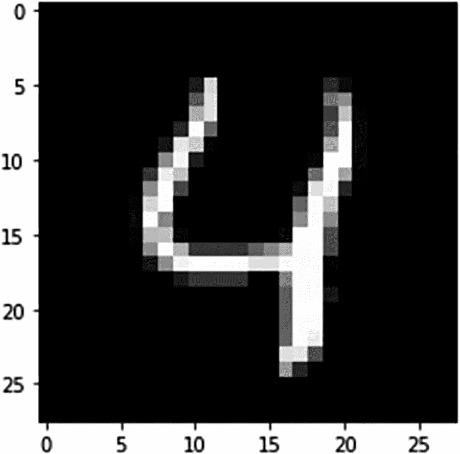
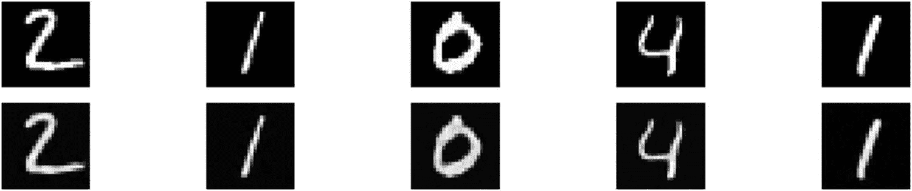
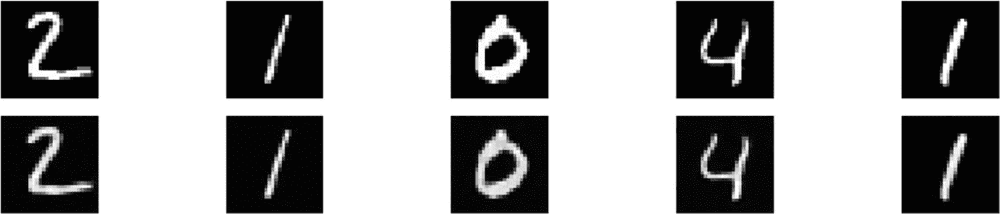
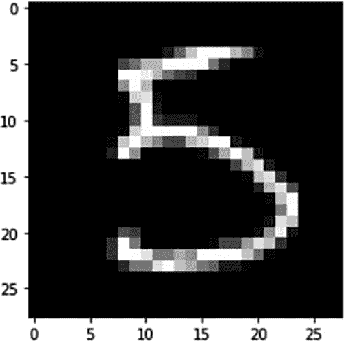
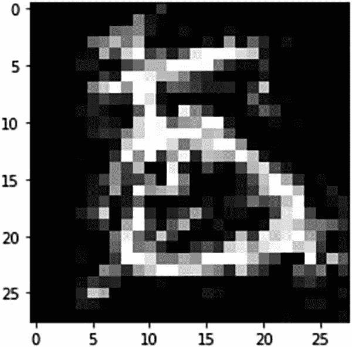
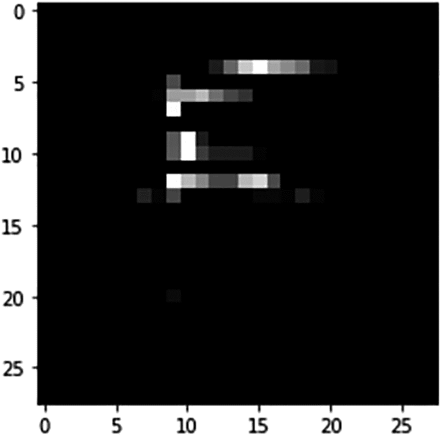
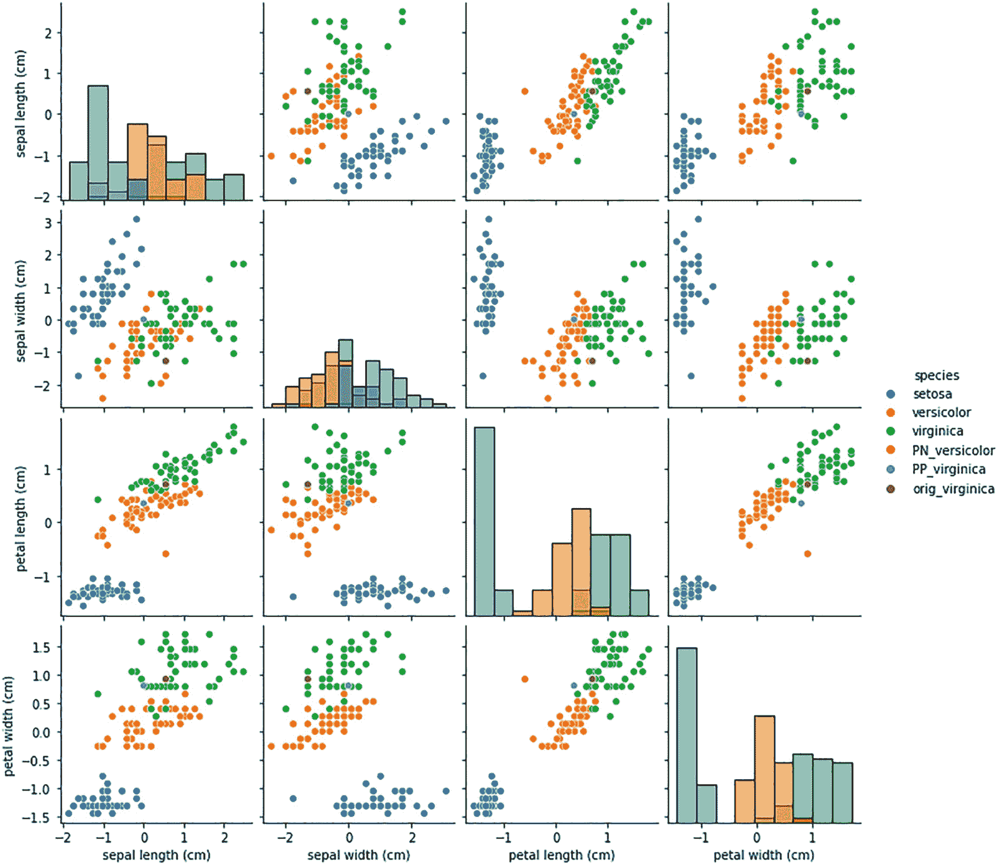

# 十一、机器学习的对比解释

对比学习是一种在机器学习管道中寻找相似和不相似候选对象的新方法。对比解释的目的是找到两个特征之间的相似性，以帮助预测一个类别。针对不同类型的超参数和一系列针对不同时期和学习率优化的参数训练的典型黑盒模型很难解释，甚至更难解释为什么模型预测 A 类与 b 类。需要生成更多解释以便业务用户可以理解预测，这吸引了许多开发人员来创建能够产生价值的创新框架。对比解释着重于解释为什么模型预测了 A 类而不是 b 类。原因发现有助于业务用户理解模型的行为。在本章中，您将使用 Alibi 库通过基于 TensorFlow 的框架执行图像分类任务。

## ML 的 CE 是什么？

为了理解机器学习的对比解释(CE ),让我们以银行的贷款审批流程或信用风险评估流程为例。没有银行会向有风险的客户提供贷款。同样，没有银行会拒绝给无风险的客户贷款。当贷款申请或信贷申请被拒绝时，这不仅仅是银行某个人做出的任意决定。相反，这是一个人工智能模型做出的决定，它考虑了一个人的许多特征，包括金融历史和其他因素。贷款被拒绝的个人可能想知道是什么方面决定了他的贷款资格，是什么在贷款资格方面将一个人与另一个人区分开来，以及他们的档案中缺少什么元素等等。类似地，在从多个可用的其他图像中识别感兴趣的对象时，是什么使得感兴趣的对象不同于其他图像？对比解释是区分一个类别和其他类别的特征差异。

对比解释就像人类的对话，帮助人们进行更投入的对话。有两个与对比解释相关的概念:

*   相关积极因素(PP)

*   相关负面信息

PP 解释发现机器学习模型识别与预测类别相同的类别所必需的那些特征的存在。举个例子，一个人的收入和年龄决定了这个人的净资产。您希望您的 ML 模型从高收入和高年龄组中识别出一类高净值个人。这在几个方面可以与机器学习模型的锚点解释相媲美。PN 是 PP 的反义词；它解释了在保持原始输出类的同时记录中应该缺少的要素。这也被一些研究者称为*反事实解释*。

## CEM 利用不在场证明

对模型的对比解释有助于向最终用户阐明为什么一个事件或预测与另一个相反地发生。为了解释模型(CEM)的对比解释的概念，以及如何通过基于 Python 的库来实现它，让我们使用 Alibi。第一步，你要以 TensorFlow 为后端，开发一个基于 Keras 的深度学习模型。以下脚本具有可用于开发深度学习模型的模块和方法的各种导入语句。CEM 可以在解释模块下的 Alibi 库中找到。

```py
import tensorflow as tf
tf.get_logger().setLevel(40) # suppress deprecation messages
tf.compat.v1.disable_v2_behavior() # disable TF2 behaviour as alibi code still relies on TF1 constructs
import tensorflow.keras as keras
from tensorflow.keras import backend as K
from tensorflow.keras.layers import Conv2D, Dense, Dropout, Flatten, MaxPooling2D, Input, UpSampling2D
from tensorflow.keras.models import Model, load_model
from tensorflow.keras.utils import to_categorical

import matplotlib
%matplotlib inline
import matplotlib.pyplot as plt
import numpy as np
import os
from alibi.explainers import CEM

print('TF version: ', tf.__version__)
print('Eager execution enabled: ', tf.executing_eagerly()) # False

```

在解释 PP 的存在和 PN 的不存在时，重要的是识别和组织相关特征，将重要特征从不重要特征中分类出来。如果您在模型训练步骤中有更多不重要的特性，那么它们属于 PP 还是 PN 真的无关紧要。模型中不重要的特征根本不相关。为 CEM 解释显示 MNIST 数字分类数据集的目的是因为许多开发人员和 ML 工程师熟悉 MNIST 数据集，因此他们可以很好地与 CEM 的概念联系起来。下面的脚本将数据集分割成一个训练集和一个测试集，图 [11-1](#Fig1) 中还显示了一个编号为 4 的样本图像:



图 11-1

数字四的示例图像

```py
(x_train, y_train), (x_test, y_test) = keras.datasets.mnist.load_data()
print('x_train shape:', x_train.shape, 'y_train shape:', y_train.shape)
plt.gray()
plt.imshow(x_test[4]);

```

你将开发一个分类模型。下一步，您需要规范化这些功能，以加快深度学习模型的训练过程。所以你把像素值除以最高像素值(255)。

```py
x_train = x_train.astype('float32') / 255
x_test = x_test.astype('float32') / 255
x_train = np.reshape(x_train, x_train.shape + (1,))
x_test = np.reshape(x_test, x_test.shape + (1,))
print('x_train shape:', x_train.shape, 'x_test shape:', x_test.shape)

y_train = to_categorical(y_train)
y_test = to_categorical(y_test)
print('y_train shape:', y_train.shape, 'y_test shape:', y_test.shape)

xmin, xmax = -.5, .5
x_train = ((x_train - x_train.min()) / (x_train.max() - x_train.min())) * (xmax - xmin) + xmin
x_test = ((x_test - x_test.min()) / (x_test.max() - x_test.min())) * (xmax - xmin) + xmin

```

以下脚本显示了创建卷积神经网络模型的步骤:

*   输入数据集是一个 28x28 像素的形状。

*   卷积 2D 层应用 64 个滤波器，核大小为 2，填充相同，校正线性单元作为激活函数。

*   在应用卷积层之后，需要应用最大池，以便生成可以被后续层使用的抽象特征。

*   为了限制模型过度拟合，通常会应用 Dropout。

*   有三层卷积 2D 滤波器，随后是最大池层和用于降低数据维度的丢弃层。

*   应用卷积和最大池的目的是达到具有较少神经元的层，该层可用于训练完全连接的神经网络模型。

*   如果需要展平数据以改变形状，则应用密集层，这是一种完全连接的神经网络模型。

*   最后，应用 softmax 层，以便生成关于每个数字类别的类别概率。

*   在编译阶段，您需要提供分类交叉熵作为损失函数，adam 作为优化器，以及准确性作为度量。

```py
 def cnn_model():
    x_in = Input(shape=(28, 28, 1)) #input layer
    x = Conv2D(filters=64, kernel_size=2, padding='same', activation='relu')(x_in) #conv layer
    x = MaxPooling2D(pool_size=2)(x) #max pooling layer
    x = Dropout(0.3)(x) #drop out to avoid overfitting

    x = Conv2D(filters=32, kernel_size=2, padding='same', activation='relu')(x) # second conv layer
    x = MaxPooling2D(pool_size=2)(x) #max pooling layer
    x = Dropout(0.3)(x) #drop out to avoid overfitting

    x = Conv2D(filters=32, kernel_size=2, padding='same', activation='relu')(x) # third conv layer
    x = MaxPooling2D(pool_size=2)(x) #max pooling layer
    x = Dropout(0.3)(x) # drop out to avoid overfitting

    x = Flatten()(x) # flatten for reshaping the matrix
    x = Dense(256, activation='relu')(x) #this is for Fully Connected Neural Network Layer training
    x = Dropout(0.5)(x) # drop out again to avoid overfitting
    x_out = Dense(10, activation='softmax')(x) #final output layer

    cnn = Model(inputs=x_in, outputs=x_out)
    cnn.compile(loss='categorical_crossentropy', optimizer='adam', metrics=['accuracy'])

    return cnn

```

卷积神经网络模型摘要显示在下面的表格视图中。在模型训练步骤中，您需要提供批量大小和时期数。然后，您可以将训练好的模型对象保存为 h5 格式。

```py
cnn = cnn_model()
cnn.summary()
cnn.fit(x_train, y_train, batch_size=64, epochs=5, verbose=1)
cnn.save('mnist_cnn.h5', save_format='h5')

```

为了生成有意义的 CEM 解释，你必须确保一个模型有很高的准确性，否则 CEM 解释将缺乏一致性。因此，建议首先训练、微调或搜索产生至少 85%准确度的最佳模型。在当前示例中，测试数据集上的模型准确率为 98.73%，因此您可以期待有意义的 CEM 解释。

```py
# Evaluate the model on test set
cnn = load_model('mnist_cnn.h5')
score = cnn.evaluate(x_test, y_test, verbose=0)
print('Test accuracy: ', score[1])

```

为了生成 CEM 解释，您需要一个将输入数据分类到特定类的模型对象。CEM 试图提出两种可能的解释:

*   尝试找到输入中必须存在的最少信息量，该信息量足以生成相同的类分类。这叫 PP。

*   尝试找出输入数据中最少信息的缺失，这足以防止类预测发生变化。这叫 PN。

寻找可能改变预测或有助于维持预测的最少信息通常是输入数据集中最重要的特征值。输入数据与从数据生成的抽象层的匹配用于识别最小信息的存在或不存在。抽象层称为自动编码器。对于图像分类问题，它可以是卷积自动编码器。通过使用输入层和输出层中的输入数据来训练自动编码器。该模型被训练为准确预测与输入相同的输出。一旦输入和输出匹配，则神经网络模型权重中最里面的隐藏层可以作为自动编码器值导出。这些自动编码器值有助于识别任何输入数据集中的最小信息可用性。以下脚本显示了如何训练自动编码器模型。它是一个神经网络模型。它将 28x28 像素作为输入，并产生 28x28 像素作为输出。

```py
# Define and train an Auto Encoder, it works like a principal component analysis model
def ae_model():
    x_in = Input(shape=(28, 28, 1))
    x = Conv2D(16, (3, 3), activation='relu', padding='same')(x_in)
    x = Conv2D(16, (3, 3), activation='relu', padding='same')(x)
    x = MaxPooling2D((2, 2), padding='same')(x)
    encoded = Conv2D(1, (3, 3), activation=None, padding='same')(x)

    x = Conv2D(16, (3, 3), activation='relu', padding='same')(encoded)
    x = UpSampling2D((2, 2))(x)
    x = Conv2D(16, (3, 3), activation='relu', padding='same')(x)
    decoded = Conv2D(1, (3, 3), activation=None, padding='same')(x)

    autoencoder = Model(x_in, decoded)
    autoencoder.compile(optimizer='adam', loss='mse')

    return autoencoder

 ae = ae_model()
ae.summary()
ae.fit(x_train, x_train, batch_size=128, epochs=4, validation_data=(x_test, x_test), verbose=0)
ae.save('mnist_ae.h5', save_format='h5')

```

模型摘要显示了结构和可训练参数的总数。可训练参数在模型的每次迭代中具有更新的权重。没有不可训练的参数。一旦 autoencoder 模型准备就绪，就可以将模型对象加载到会话中。使用测试集上的预测功能，可以生成解码的 MNIST 图像。以下脚本的输出显示，测试图像与使用 autoencoder 函数生成的图像完全匹配，这意味着您的 autoencoder 模型在生成准确的输出方面非常健壮。自动编码器模型有两个部分:编码器和解码器。编码器的作用是将任何输入转换成抽象层，解码器的作用是从抽象层重建相同的输入。

### 原始图像与自动编码器生成的图像的比较

您可以将训练集中的原始图像与图 [11-2](#Fig2) 中基于自动编码器生成的模型图像集进行比较。从图像中可以看到，自动编码器生成的模型与原始图像完全匹配。由于这是一个示例数据集，匹配非常接近；然而，对于其他示例，需要大量的训练来生成如此接近的图像。一个训练有素的自动编码器模型将非常有助于生成对比解释。



图 11-2

AE 模型生成的图像与原始图像的比较

```py
ae = load_model('mnist_ae.h5')

decoded_imgs = ae.predict(x_test)
n = 5
plt.figure(figsize=(20, 4))
for i in range(1, n+1):
    # display original
    ax = plt.subplot(2, n, i)
    plt.imshow(x_test[i].reshape(28, 28))
    ax.get_xaxis().set_visible(False)
    ax.get_yaxis().set_visible(False)
    # display reconstruction
    ax = plt.subplot(2, n, i + n)
    plt.imshow(decoded_imgs[i].reshape(28, 28))
    ax.get_xaxis().set_visible(False)
    ax.get_yaxis().set_visible(False)
plt.show()

```

第一行显示来自测试数据集的第一条记录的实际图像，第二行显示自动编码器生成的预测图像。

```py
ae = load_model('mnist_ae.h5')

decoded_imgs = ae.predict(x_test)
n = 5
plt.figure(figsize=(20, 4))
for i in range(1, n+1):
    # display original
    ax = plt.subplot(2, n, i)
    plt.imshow(x_test[i].reshape(28, 28))
    ax.get_xaxis().set_visible(False)
    ax.get_yaxis().set_visible(False)
    # display reconstruction
    ax = plt.subplot(2, n, i + n)
    plt.imshow(decoded_imgs[i].reshape(28, 28))
    ax.get_xaxis().set_visible(False)
    ax.get_yaxis().set_visible(False)
plt.show()

```



图 11-3

相关的负面解释

上面的脚本显示了同一个图像(图 [11-3](#Fig3) )的显示和重建，下面显示为 5(图 [11-4](#Fig4) )。



图 11-4

数字 5 的原始图像显示

```py
idx = 15
X = x_test[idx].reshape((1,) + x_test[idx].shape)
plt.imshow(X.reshape(28, 28));

```

```py
# Model prediction
cnn.predict(X).argmax(), cnn.predict(X).max()

```

CNN 模型以 99.95%的概率预测输入为 5(表 [11-1](#Tab1) )。

表 11-1

CEM 参数解释

<colgroup><col class="tcol1 align-left"> <col class="tcol2 align-left"></colgroup> 
| 

参数

 | 

说明

 |
| --- | --- |
| `Mode` | PN 或 PP |
| `Shape` | 输入实例形状 |
| `Kappa` | 为使第一个损失项最小化，在作为原始实例的预测类上扰动实例的预测概率与其他类上的最大概率之间需要的最小差异 |
| `Beta` | L1 损失项的权重 |
| `Gamma` | 自动编码器损耗项的权重 |
| `C_steps` | 更新次数 |
| `Max iterations` | 迭代次数 |
| `Feature_range` | 受干扰实例的特征范围 |
| `Lr` | 初始学习率 |

以下脚本显示了从示例实例 x 生成的解释对象的相关负面预测。相关负面分析告诉您 5 中缺少一些重要功能；否则，它会被归类为 8。丢失的信息是保持 5 类预测不同于 8 类预测的最小信息。图 [11-5](#Fig5) 有 8 叠加在数字 5 上。



图 11-5

Perntinet 负面预测是数字 8，而原始图像是 5

```py
mode = 'PN'  # 'PN' (pertinent negative) or 'PP' (pertinent positive)
shape = (1,) + x_train.shape[1:]  # instance shape
kappa = 0\.  # minimum difference needed between the prediction probability for the perturbed instance on the
            # class predicted by the original instance and the max probability on the other classes
            # in order for the first loss term to be minimized
beta = .1  # weight of the L1 loss term
gamma = 100  # weight of the optional auto-encoder loss term
c_init = 1\.  # initial weight c of the loss term encouraging to predict a different class (PN) or
              # the same class (PP) for the perturbed instance compared to the original instance to be explained
c_steps = 10  # nb of updates for c
max_iterations = 1000  # nb of iterations per value of c
feature_range = (x_train.min(),x_train.max())  # feature range for the perturbed instance
clip = (-1000.,1000.)  # gradient clipping
lr = 1e-2  # initial learning rate
no_info_val = -1\. # a value, float or feature-wise, which can be seen as containing no info to make a prediction
                  # perturbations towards this value means removing features, and away means adding features
                  # for our MNIST images, the background (-0.5) is the least informative,
                  # so positive/negative perturbations imply adding/removing features

# initialize CEM explainer and explain instance
cem = CEM(cnn, mode, shape, kappa=kappa, beta=beta, feature_range=feature_range, gamma=gamma, ae_model=ae, max_iterations=max_iterations,
          c_init=c_init, c_steps=c_steps, learning_rate_init=lr, clip=clip, no_info_val=no_info_val)

explanation = cem.explain(X)

print(f'Pertinent negative prediction: {explanation.PN_pred}')
plt.imshow(explanation.PN.reshape(28, 28));

```

对于同一个数字 5，也可以生成相关的肯定解释，这意味着为了将该数字归类为 5，您绝对要在图像中寻找什么特征。这叫中肯的正面解释。

```py
# Now Generate pertinent positive
mode = 'PP'
# initialize CEM explainer and explain instance
cem = CEM(cnn, mode, shape, kappa=kappa, beta=beta, feature_range=feature_range, gamma=gamma, ae_model=ae, max_iterations=max_iterations,
          c_init=c_init, c_steps=c_steps, learning_rate_init=lr, clip=clip, no_info_val=no_info_val)

explanation = cem.explain(X)
print(f'Pertinent positive prediction: {explanation.PP_pred}')
plt.imshow(explanation.PP.reshape(28, 28));

```



图 11-6

对数字 5 的相关正面解释

在上面的脚本中，您生成了相关的正数。相关的正面解释指出，图 [11-6](#Fig6) 中所示的像素值是预测图像为数字 5 的最低要求。

### 表格数据解释的 CEM

对于任何表格数据(也称为结构化数据)，行是示例，列是特征。对于使用熟悉的 IRIS 数据集的简单多类分类问题的示例，您可以使用在上述卷积神经网络模型中遵循的相同过程。

```py
# CEM for Structured dataset
import tensorflow as tf
tf.get_logger().setLevel(40) # suppress deprecation messages
tf.compat.v1.disable_v2_behavior() # disable TF2 behaviour as alibi code still relies on TF1 constructs

from tensorflow.keras.layers import Dense, Input
from tensorflow.keras.models import Model, load_model
from tensorflow.keras.utils import to_categorical

import matplotlib
%matplotlib inline
import matplotlib.pyplot as plt
import numpy as np
import os

import pandas as pd
import seaborn as sns
from sklearn.datasets import load_iris
from alibi.explainers import CEM

print('TF version: ', tf.__version__)
print('Eager execution enabled: ', tf.executing_eagerly()) # False

```

以上脚本显示了 Alibi 模型生成 PP 和 PN 解释所需的导入语句。

```py
dataset = load_iris()
feature_names = dataset.feature_names
class_names = list(dataset.target_names)

 # scaling data
dataset.data = (dataset.data - dataset.data.mean(axis=0)) / dataset.data.std(axis=0)

idx = 145
x_train,y_train = dataset.data[:idx,:], dataset.target[:idx]
x_test, y_test = dataset.data[idx+1:,:], dataset.target[idx+1:]
y_train = to_categorical(y_train)
y_test = to_categorical(y_test)

```

虹膜模型有四个特征，目标列中的三个类是`setosa`、`versicolor,`和`virginica`。前 145 条记录是训练数据集，5 条记录用于测试模型。目标列或`y_train`和`y_test`数据集需要分类编码，因为该列包含字符串值。

以下神经网络模型函数将这四个特征作为输入，并使用来自 Keras 的密集函数的全连接网络来训练模型。您使用分类交叉熵作为损失函数，使用优化器作为随机梯度下降。用于训练模型的批量大小是 16，具有 500 个时期。有非常少的参数正在被训练。

```py
def lr_model():
    x_in = Input(shape=(4,))
    x_out = Dense(3, activation='softmax')(x_in)
    lr = Model(inputs=x_in, outputs=x_out)
    lr.compile(loss='categorical_crossentropy', optimizer='sgd', metrics=['accuracy'])
    return lr

lr = lr_model()
lr.summary()
lr.fit(x_train, y_train, batch_size=16, epochs=500, verbose=0)
lr.save('iris_lr.h5', save_format='h5')

```

训练完模型后，模型保存为`iris_lr.h5`。在以下脚本中，您加载已训练的模型对象，并使用表 [11-1](#Tab1) 中之前解释的所有参数初始化 CEM 函数。

```py
idx = 0
X = x_test[idx].reshape((1,) + x_test[idx].shape)
print('Prediction on instance to be explained: {}'.format(class_names[np.argmax(lr.predict(X))]))
print('Prediction probabilities for each class on the instance: {}'.format(lr.predict(X)))

mode = 'PN'  # 'PN' (pertinent negative) or 'PP' (pertinent positive)
shape = (1,) + x_train.shape[1:]  # instance shape
kappa = .2  # minimum difference needed between the prediction probability for the perturbed instance on the
            # class predicted by the original instance and the max probability on the other classes
            # in order for the first loss term to be minimized
beta = .1  # weight of the L1 loss term
c_init = 10\.  # initial weight c of the loss term encouraging to predict a different class (PN) or
              # the same class (PP) for the perturbed instance compared to the original instance to be explained
c_steps = 10  # nb of updates for c
max_iterations = 1000  # nb of iterations per value of c
feature_range = (x_train.min(axis=0).reshape(shape)-.1,  # feature range for the perturbed instance
                 x_train.max(axis=0).reshape(shape)+.1)  # can be either a float or array of shape (1xfeatures)
clip = (-1000.,1000.)  # gradient clipping
lr_init = 1e-2  # initial learning rate

# define model
lr = load_model('iris_lr.h5')

# initialize CEM explainer and explain instance
cem = CEM(lr, mode, shape, kappa=kappa, beta=beta, feature_range=feature_range, max_iterations=max_iterations, c_init=c_init, c_steps=c_steps, learning_rate_init=lr_init, clip=clip)
cem.fit(x_train, no_info_type='median')  # we need to define what feature values contain the least
                                         # info wrt predictions
                                         # here we will naively assume that the feature-wise median
                                         # contains no info; domain knowledge helps!
explanation = cem.explain(X, verbose=False)

```

在上面的脚本中，最初的实例是`virginica`，但是对相关否定的解释预测它是`versicolor`。只有第三个特征的不同造成了预测的不同。你也可以举同样的例子来预测相关的正类。

```py
print(f'Original instance: {explanation.X}')
print('Predicted class: {}'.format(class_names[explanation.X_pred]))

print(f'Pertinent negative: {explanation.PN}')
print('Predicted class: {}'.format(class_names[explanation.PN_pred]))

expl = {}
expl['PN'] = explanation.PN
expl['PN_pred'] = explanation.PN_pred

mode = 'PP'

# define model
lr = load_model('iris_lr.h5')

# initialize CEM explainer and explain instance
cem = CEM(lr, mode, shape, kappa=kappa, beta=beta, feature_range=feature_range, max_iterations=max_iterations, c_init=c_init, c_steps=c_steps, learning_rate_init=lr_init, clip=clip)
cem.fit(x_train, no_info_type='median')
explanation = cem.explain(X, verbose=False)

print(f'Pertinent positive: {explanation.PP}')
print('Predicted class: {}'.format(class_names[explanation.PP_pred]))

```

在上面的脚本中，您解释了相关的正预测类。它是`virginica`类，实际也是`virginica`类。您正在使用 CEM 模型的功能和结果创建一种显示 PP 和 PN 的可视化方式。您创建一个 expl 对象，并创建名为`PN, PN_pred`、`PP`和`PP_pred`的列。您创建一个包含原始数据和特征名称(包括目标类)的数据框架。这是数据可视化所必需的。Seaborn Python 库用于以图形方式展示 PNs 和 PPs，如图 [11-7](#Fig7) 所示。



图 11-7

相关的正面和负面视觉化

```py
expl['PP'] = explanation.PP
expl['PP_pred'] = explanation.PP_pred

df = pd.DataFrame(dataset.data, columns=dataset.feature_names)
df['species'] = np.array([dataset.target_names[i] for i in dataset.target])

pn = pd.DataFrame(expl['PN'], columns=dataset.feature_names)
pn['species'] = 'PN_' + class_names[expl['PN_pred']]
pp = pd.DataFrame(expl['PP'], columns=dataset.feature_names)
pp['species'] = 'PP_' + class_names[expl['PP_pred']]
orig_inst = pd.DataFrame(explanation.X, columns=dataset.feature_names)
orig_inst['species'] = 'orig_' + class_names[explanation.X_pred]
df = df.append([pn, pp, orig_inst], ignore_index=True)

fig = sns.pairplot(df, hue='species', diag_kind='hist');

```

对比解释通常是通过将特征作为抽象特征投影到潜在空间中，然后只考虑特征空间中的有用特征，以便模型区分目标类别。

## 结论

在本章中，您探索了一些方法和库，这些方法和库可以为使用 MNIST 数据集识别笔迹的图像分类问题和使用简单虹膜数据集的结构化数据分类问题建立对比解释。相关的正面和相关的负面都是从 Alibi 库中的对比解释模块中捕获的。这个 CEM 提供了更多关于类预测的清晰性，并且它总结了为什么一个特定的类被预测以及为什么它没有被预测。