# 一、云计算和 AWS

本章涵盖了云计算和AWS(AWS)的不同组成部分。读完这一章后，你会理解 AWS 的不同重要组件，这将使理解 AWS 的机器学习组件变得更容易。

## 什么是云？

那么，什么是云呢？如果你看看互联网上分享的迷因，你可能会认为云只不过是别人的电脑，你可以从自己的计算设备上使用，供你个人使用。那么问题就来了，当我们有自己的电脑时，为什么还需要另一台电脑呢？这是因为我们的电脑可能没有其他系统拥有的东西。也许你在购买系统时的预算比其他人少，因此他有更多的计算能力可以使用。因此，您可以访问另一个系统一段时间，然后回到自己的系统，而不是购买一个计算能力更强的新系统。这就是云提供的好处。顺便说一下，我们都知道另一个系统不是普通的系统。云系统由亚马逊、谷歌等大公司提供。因此，即使你试图购买一个计算能力与云系统相当的新系统，你也负担不起。

从形式上讲，*云*是一种特殊的计算服务，存在于不同的远程位置，我们可以通过网络或互联网访问。云服务可能包括存储服务、基础设施服务、软件服务或您需要的任何其他特定服务。图 [1-1](#Fig1) 显示了不同的设备如何连接到远程位置的云系统。

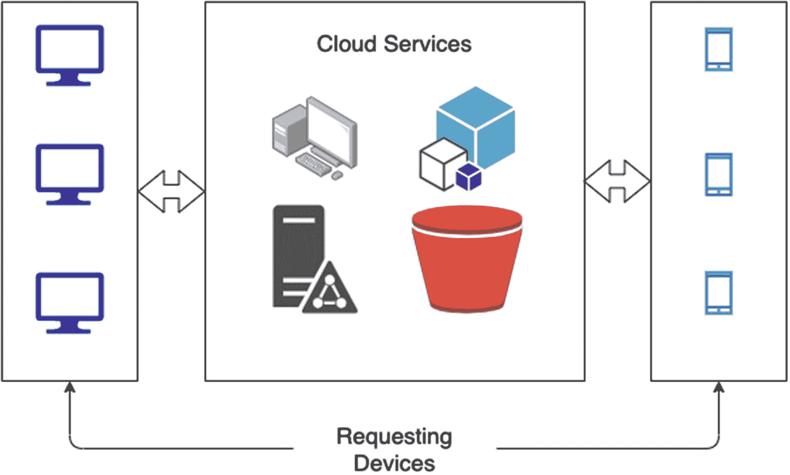

图 1-1

不同的设备如何连接到远程位置的云系统

如果我们能够使用互联网或网络访问远程位置的任何服务，那么我们称之为*云计算*。

## 云系统的控制

显然，如果有人允许访问通过互联网使用他们的个人系统，那么他们可能希望以某种方式限制访问。或者，他们可能希望一组人拥有完全访问权限，而另一组人拥有有限的访问权限。这样做是为了避免安全问题，并且不暴露系统中存在的漏洞。为了解决这个问题，云计算有四种类型。

*   公共云

*   私有云

*   混合云

*   社区云

### 公共云

当整个云基础设施对公众开放时，它就被称为*公共云*。例子是谷歌或雅虎提供的电子邮件服务。

### 私有云

当只有特定人群可以访问云提供的服务时，那么它就被称为*私有云*。例如，组织中的人员可以访问组织云中的资源，但组织外部的人员无法访问相同的资源。

### 社区云

当一组组织可以访问云服务时，它就被称为*社区云*。例如，不同的组织可以通过注册来访问 AWS 或 Google 云平台的服务。因此，所有付费的组织都可以获得同样的服务，但其他任何人都不能。

### 混合云

当云服务提供两种选择(即公共云和私有云的服务)时，它就被称为*混合云*。一个例子是使用 AWS 的两个服务。当我们使用 SageMaker training 训练一个模型时，它是特定组织的私有任务，因为它包含敏感数据和其他内容，但当我们训练一个模型，然后公开共享端点时，它是一个公共云，因为任何人都可以访问该端点。(在后面的章节中你会学到更多关于 SageMaker 的知识。)

## 云服务

现在，您已经了解了访问云的不同方式，让我们更深入地了解一下云平台可能提供的服务。我们可以将这些服务分为四个领域。

*   基础设施即服务(IaaS)

*   平台即服务(PaaS)

*   软件即服务(SaaS)

*   一切即服务(XaaS)

### 基础设施即服务

顾名思义，当云服务提供商向用户提供对其构建的基础设施的访问时，就被认为是 IaaS。例如，云提供商可以提供对虚拟机、物理机、存储设备等的访问。例如，我们可以使用 Google Drive 在云上存储信息，因为 Google 是以服务的形式提供其硬盘的。AWS 还提供称为 EC2 实例的机器，个人可以使用这些机器来完成需要更高计算能力的操作。

### 平台即服务

有时，我们不需要一个完整的基础设施，我们只需要一个特定的开发运行时，在那里我们可以编写代码或制作游戏或网站。这样可以降低构建整个基础设施的成本。这种类型的服务是 PaaS。例如，我们可以使用 Google Colaboratory 来编写 Python 或 R 代码。此外，我们可以使用 AWS SageMaker 进行训练，并将机器学习模型投入生产。还有其他服务提供商，如微软 Azure、谷歌云平台、IBM Cloud 等。

### 软件即服务

当我们不想要运行时，但我们希望使用特定的软件应用程序及其内置的运行时，我们不需要 PaaS，PaaS 将为我们提供运行时以及我们需要安装的依赖项和软件。因此，有云服务为特定的用途提供特定的软件，称为 SaaS。SaaS 的例子有用于数据管理的 Amazon Ground Truth 和微软的 Office 365。

### 任何服务

前三种类型的服务已经在市场上存在了相当一段时间，但现在，由于技术的进步，云服务提供商几乎可以提供任何云服务。例如，我们现在可以绘制网页草图并将其交给 Azure，Azure 会将其转换为 HTML 页面。此外，你只需与连接到 AWS 的 Alexa 对话，就可以播放在线歌曲。所有这些都在 XaaS 的保护伞下。

现在让我们更深入地了解一个特定的云服务提供商，叫做 Amazon Web Services (AWS)。

## AWS简介

AWS 在许多国家提供全球云计算服务，目前负责处理许多公司的基础设施，包括小型和大型企业。根据 AWS 文档，目前 AWS 为 190 个国家的数十万家企业提供服务。

AWS 提供 150 多种服务，可以按需使用，也可以根据使用的时间付费。目前，AWS 在许多地区都有数据服务器，您可以选择只使用离您的用户最近的一个地区的服务器。以下是全球数据服务器的列表:

*   **北美**
    *   俄亥俄州(美国东部)

    *   俄勒冈州(美国西部)

    *   北加州(美国西部)

    *   北弗吉尼亚(美国西部)

    *   政府云(美国东部和西部)

    *   加拿大(中部)

*   **南美**
    *   圣保罗(葡萄牙)

*   **欧洲/中东/非洲**
    *   伦敦(欧洲)

    *   斯德哥尔摩(欧洲)

    *   法兰克福(欧洲)

    *   巴黎(欧洲)

    *   巴林(中东)

    *   爱尔兰(欧洲)

*   **亚太地区**
    *   新加坡(亚太地区)

    *   Mainland China 北京

    *   悉尼(亚太地区)

    *   东京(亚太地区)

    *   首尔(亚太地区)

    *   宁夏(Mainland China)

    *   大阪(亚太地区)

    *   孟买(亚太地区)

    *   香港(亚太地区)

正如我提到的，AWS 有超过 150 项服务。问题是，你如何访问它们？是否有一个集中的地方可以访问它们？嗯，是的！这个地方叫做 AWS 管理控制台。让我们来看看这款主机的一些特性，以及它对用户的真正帮助。

## AWS 管理控制台

有了 AWS 管理控制台(AMC ),您不仅可以访问这些服务，而且它还提供了一些其他很酷的功能。其中一些如下:

*   一旦您在 AWS 上创建了一个帐户并登录到 AMS，那么您的会话仅在 12 小时内保持活动状态。之后需要重新登录。显然，这个时间限制是可定制的。提供此功能是出于安全原因。

*   您不仅可以通过网络访问 AMS，还可以使用移动应用程序。AMS 应用程序在 IOS 和 Android 设备上都存在。

*   AMS 提供对不同学习资源、文章、文档、视频等的访问。，帮助我们了解 AWS 的不同服务。

*   您甚至可以根据自己的使用和需求定制和个性化 AMS。

登录 AWS 后，您将看到以下功能:

*   搜索按钮查找特定服务

*   用户最近访问的服务

*   所有服务的列表

*   自动化工作流程的链接

*   链接到学习资源

图 [1-2](#Fig2) 、 [1-3](#Fig3) 、 [1-4](#Fig4) 和 [1-5](#Fig5) 显示了 AMS 的不同屏幕。

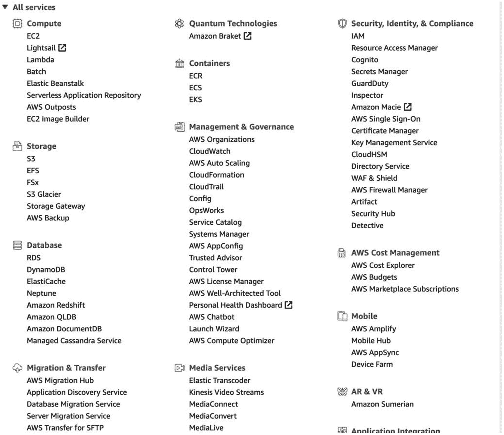

图 1-5

AMS 上所有服务的列表

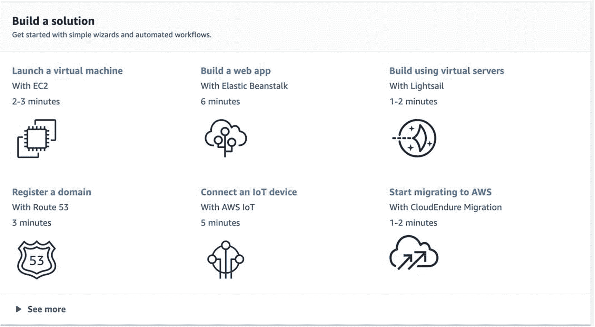

图 1-4

AMS 上的自动化

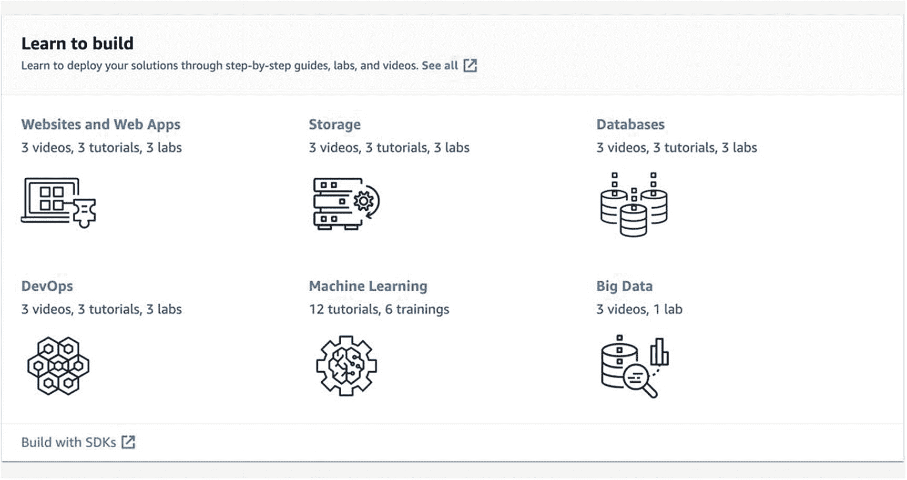

图 1-3

AMS 上的学习资源

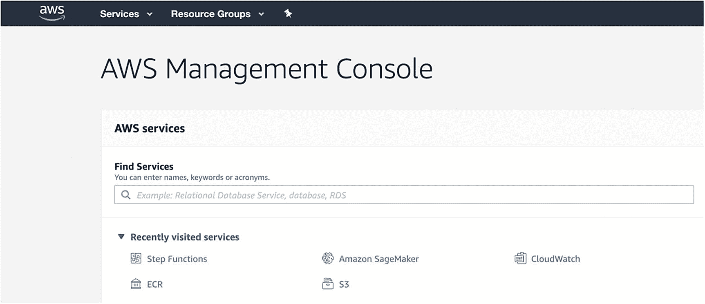

图 1-2

在 AMS 上查找服务功能和最近访问的服务

我们将在下一节关于机器学习的内容中详细介绍如何登录 AWS 和访问 AMS。现在，让我们转到 AWS 的下一个特性，称为 AWS 命令行界面(AWS CLI)。

## AWS 命令行界面

如果 AMC 为您提供了一个可视化界面来访问 AWS 服务，那么 CLI 为您提供了一些高级功能来通过控制台访问相同的服务。它由使用过 AWS 一段时间的高级开发人员使用。你只需要下载一个工具，然后就可以用它来控制不同的服务，编写脚本，控制服务的自动化。

AWS 提供了大量的参考文档、GitHub 库、论坛等资源。，了解 AWS CLI。尽管用户可以从默认控制台(如 Windows 的命令提示符或 Linux 和 Mac 的终端)使用 AWS CLI，但有一个专用的 AWS shell 提供一些高级功能。其中一些如下:

*   自动完成支持

*   命令的内联文档

*   OS shell 命令，也可以从同一个 shell 中执行

当我们详细讨论机器学习时，我们将会大量使用 CLI。因此，我们将在那一节直接看它的实际方面。

因为 AWS 提供了如此多的服务，所以不可能在一本书中涵盖所有的服务。而且这本书讲的是机器学习，在这里把每一个服务都涵盖进去没有任何意义。但是，我们将讨论我认为非常重要且常用的三种服务。以下是我们将在此讨论的服务:

*   AWS 存储服务

*   AWS 计算服务

*   AWS 网络和内容交付服务

让我们从第一项开始讨论，即存储服务。

## AWS 存储服务

当我们在云平台上工作并使用其服务时，显然我们会根据需求拥有大量数据。例如，如果我们正在建立一个网站，那么我们将有图像，视频和许多其他的东西来存储。如果我们有一个机器学习模型，那么我们将有万亿字节的数据要处理。这些数据可以是结构化的，也可以是非结构化的。同样，出于业务目的，我们可以有多个 Excel 表格或演示文稿。所有这些数据类型都必须存储在云中的某个地方，云平台应该提供这种便利。

AWS 为数据存储提供了许多选项，我们将在本节中讨论其中的三个。

*   亚马逊 S3

*   亚马逊弹性文件系统(EFS)

*   AWS 存储网关

### 亚马逊 S3

AWS 最常用的服务之一是亚马逊简单存储系统(S3)。它为您提供了一个界面，您可以在其中以类似于在本地文件系统中存储数据的方式存储数据。您可以创建文件夹和多个子目录来组织数据。以下是亚马逊 S3 提供的一些基本功能:

*   它提供了目前业界领先的可扩展性。

*   它提供实时数据可用性。

*   它提供了安全性和优化的性能。

*   它具有 99.9999999%的耐用性(11 个 9)。

S3 很容易使用。首先让我们了解亚马逊 S3 使用的一些命名惯例。

#### 大量

一个*桶*就像本地文件系统中的一个文件夹。它是一个用于存储文件的容器。

#### 目标

您存储在 S3 的文件被称为*对象*。所有对象都存储在桶中。

#### 键

你存储的每个对象都将被赋予一个唯一的标识符，称为*键*。此外，不仅对象，而且存储桶都有唯一的键。

S3 是否如其名只提供简单的存储？我会说是和不是。是的，因为它的主要用途只是存储，它真的很简单。不会，因为它有许多围绕存储功能的其他功能，这使它成为每个客户的首选服务。让我们看看是什么特征让 S3 如此强大。

*   根据数据的使用频率，S3 提供不同类型的存储类别。
    *   **S3 标准**:需要经常访问的数据

    *   **S3 标准 _IA** :需要较少访问的数据

    *   **S3 冰川**:我们想要存档的数据

*   没有安全性的存储什么都不是。AWS 提供了对您创建的存储桶的访问控制。您可以使用*策略*来实现这一点。以下是我们可以应用的基于策略的三个控制级别:
    *   谁可以访问哪个存储桶？

    *   可以从哪个网络访问存储桶？

    *   应该在什么时候访问存储桶？

*   您还可以创建对象的版本。例如，如果同一个 Excel 表更新了五次，那么就可以创建它的五个版本。

在这整本书中，亚马逊 S3 是我们将持续使用的机器学习服务。我们将在下一节详细讨论这些服务。

### 亚马逊弹性文件系统

亚马逊弹性文件系统(EFS)是一个弹性网络文件系统，大多数 AWS 云服务都与之兼容。它被称为*弹性*，因为它既可伸缩又可收缩。如果您上传的数据量较小，那么它会缩小大小以容纳该数据。但是如果你上传了大量的数据，那么它的大小就会增加。向上扩展也可以达到 Pb 级。EFS 使用 NFS 的最新版本，即 NFSv4.1。因此，它几乎可以兼容你想开发的任何东西。

Tip

使用网络文件系统(NFS)，您可以存储、编辑、删除和执行类似于在本地系统中执行的其他操作。它是一种使用*附网存储* (NAS)的分布式文件系统。当前版本的 NFS 提供了一些高级功能，如强身份验证、文件缓存和对 Windows 文件系统的支持。现在可以通过全球广域网访问 NFS。

就像 S3 一样，EFS 提供两种文件存储方式。

*   标准访问

*   不经常访问

当我们想要频繁访问数据时，我们使用标准访问，而不常用的数据可以存储在不常用访问 EFS 中。此外，就像 S3 一样，你可以在 EFS 认证和授权数据，并进一步加密。最后，您可以像 S3 一样添加策略来维护访问控制。

### AWS 存储网关

AWS 存储网关是由 AWS 提供的混合基础设施。如果您希望使用您的内部基础架构来满足所有存储需求，但您仍然希望获得一些功能来使用 AWS 的云存储服务，那么 Storage Gateway 是最佳解决方案。

存储网关提供了三种解决方案。

*   文件网关

*   卷网关

*   磁带网关

#### 文件网关

使用这项服务，所有的文件都存储在 S3。它给你一个虚拟的应用程序，你可以用它来管理你在 S3 的所有文件。使用网络文件系统或服务器消息块等协议来检索/存储文件。我们所说的虚拟软件只不过是一个用来管理文件的虚拟机。这可以通过 VMware ESXi 或 Microsoft Hyper-V 实现。

#### 卷网关

您可以直接将卷存储在云中，而不是文件，稍后您可以将其作为互联网小型计算机系统接口(iSCSI)进行安装。同样，内部部署的软件是一个虚拟机。支持以下类型的卷:

*   缓存卷

*   存储容量

拥有缓存卷意味着将数据完全存储在 S3，然后将经常使用的数据缓存在本地系统中。图 [1-6](#Fig6) 显示了 AWS 提供的缓存卷网关架构。

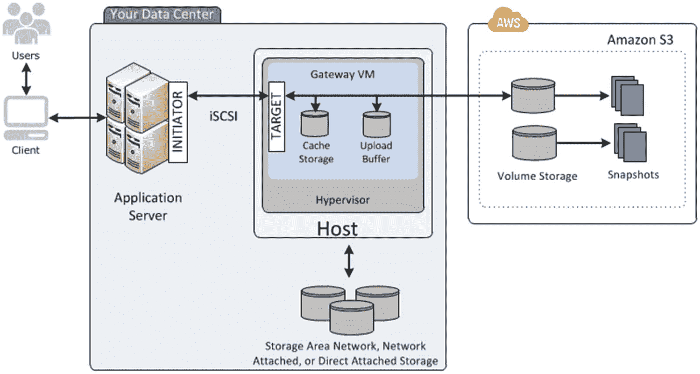

图 1-6

缓存卷，存储网关体系结构

图 [1-6](#Fig6) 分为三部分。左边部分显示了使用本地架构的实际用户。中间组件是组织的本地基础设施。右侧组件具有用于数据备份的 S3 连接。

当您在本地存储您的全部数据，然后在云上备份这些数据的快照版本时，它就是 Volume Gateway 的存储卷支持。我们可以在灾难恢复的情况下使用它。例如，如果您丢失了本地数据，您可以从云中下载最新的快照。同样，我们在这里使用 S3 作为存储服务。图 [1-7](#Fig7) 显示了存储卷的架构。

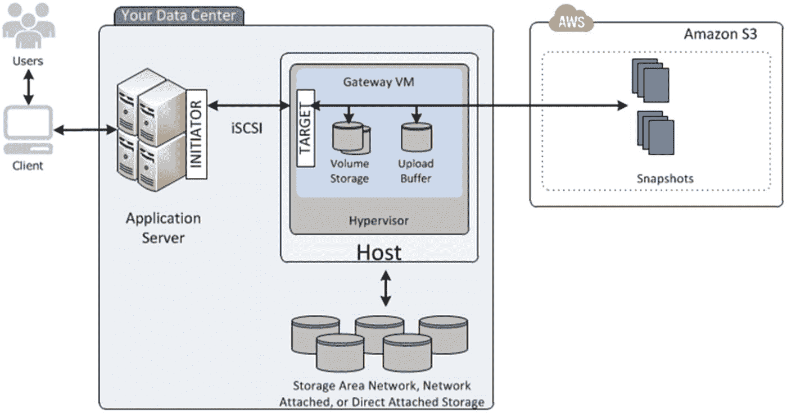

图 1-7

存储卷，存储网关体系结构

图 [1-7](#Fig7) 中的架构与图 [1-6](#Fig6) 中的架构几乎相同，但是我们并没有存储全部数据，而是只存储本地保存数据的快照。

#### 磁带网关

这用于归档数据。为此，我们可以使用亚马逊 S3 冰川或深度档案作为存储服务。这也可以使用虚拟机在本地部署。图 [1-8](#Fig8) 中给出的架构显示了磁带网关的工作原理。

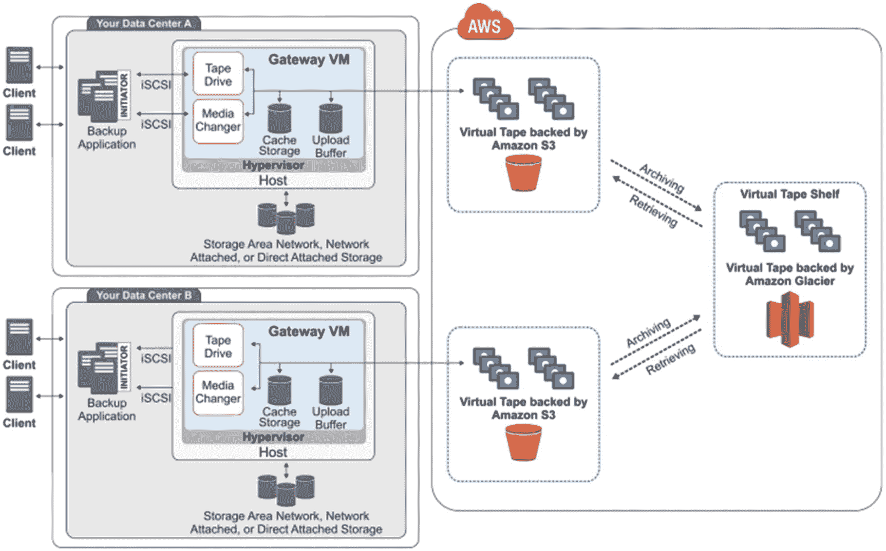

图 1-8

磁带网关、存储网关体系结构

您可以在体系结构中看到，不同的基础架构将数据存储在各自的 S3 存储桶中。后来，所有 S3 桶的数据被合并，然后存储在亚马逊 S3 冰川。虚拟磁带只不过是一种存储数据的手段。就像物理磁带是空的，然后在使用时被填满一样，虚拟磁带也可以是空的，可以根据您的需要填充数据。

现在，我们已经了解了 AWS 的存储服务是如何运行的，并了解了不同的服务，让我们继续探索计算服务。

## AWS 计算服务

在上一节中，您学习了如何使用 AWS 服务存储数据。在本节中，我们将了解 AWS 提供的一些计算服务。当我们运行应用程序、玩游戏或开发某样东西时，我们需要系统的计算能力。我们从 RAM、处理器、显卡等方面进行衡量。有时我们可能有一个很大的系统需求，但由于缺乏资金或资源而无法实现。这就是亚马逊为所有计算需求提供不同种类服务的原因。在本节中，我们将讨论以下 AWS 计算服务:

*   亚马逊 EC2

*   亚马逊 ECR

### 亚马逊 EC2

弹性组件云(EC2)减轻了用户在硬件需求上的投资负担。无论需求是什么，EC2 都允许您创建许多虚拟服务器，在那里可以立即处理工作。此外，它不是静态的基础架构，而是动态的。这意味着，如果计算需求突然激增，EC2 会自动扩大规模，而不会中断正在进行的进程。

以下是 EC2 为用户提供的一些特性:

*   它提供了一个环境，我们可以在那里做计算繁重的工作。这是在虚拟计算环境中完成的，AWS 称之为*实例*。

*   无论您的软件或硬件需要什么，您都可以使用 Amazon 机器映像(AMIs)服务来配置它们。

*   它为您启动的所有实例提供安全性。它还提供安全组，帮助用户配置防火墙、端口、IP 范围等。

除此之外，还有很多其他服务可以帮助用户进行日常的编码和开发工作。

EC2 提供的实例类型可以分为以下几类:

*   通用

*   计算优化

*   内存优化

*   存储优化

*   加速计算

#### 通用类型

这些类型提供了计算能力、存储和网络的平衡。他们进一步分为以下几组:

*   一流的

*   T3

*   T2

*   M6g

*   M5

*   M5a

*   M5n

*   M4

#### 计算优化

当工作需要大量计算资源并且需要大量处理器时，您可以使用计算优化实例。它们可以用于媒体任务、科学任务、快速 web 服务器，甚至游戏服务器。它们可以分为以下几种类型:

*   溴化五烃季胺

*   C5n

*   补体第四成份缺乏

你可以在 [`https://aws.amazon.com/ec2/instance-types/`](https://aws.amazon.com/ec2/instance-types/) 找到更多关于这些群体的信息。

#### 内存优化

如果工作需要处理大型数据集，您需要内存优化的实例。它们分为以下几种类型:

*   稀有

*   R5a

*   R5n

*   R4

*   X1e

*   X1

*   高记忆力

*   z1d

#### 加速计算

对于所有的机器学习和深度学习应用程序，这些类型的实例是首选的。这些系统真的很快，而且精度也很高。它们可以分为以下几种类型:

*   P3

*   P2

*   Inf1

*   G4

*   自交第三代

*   子一代

#### 存储优化

如果您希望处理大型数据集，并且希望通过更快的读写操作减少延迟，这种类型是最佳选择。它们可以分为以下几种类型:

*   I3

*   I3en

*   D2

*   氕

您可以在 [`https://aws.amazon.com/ec2/instance-types/`](https://aws.amazon.com/ec2/instance-types/) 找到每个实例类型的详细信息。

### 其他服务

AWS 还为其他服务提供了大多数以前的实例类型。这样做是为了根据您的使用情况为您提供经济利益。这些服务包括以下内容:

*   按需实例

*   保留实例

*   定点实例

如果你认为你的工作不会花费很多时间，比如几天或几个月，那么你可以选择*按需实例*。这些实例按小时收费。无论你想要什么样的计算或内存和存储容量，你都可以使用，但费用将基于使用的时间。

*保留实例*用于长期使用，因此个人获得的折扣高达按需实例的 75%。这也提供了更改类型的选项。

有时候会有很多 EC2 实例没有被使用。 *Spot 实例*让你利用那些实例，当使用 Spot 实例时，你可以得到比按需实例高达 90%的折扣。

## 亚马逊弹性容器注册中心

最近，Docker 席卷了整个行业。它允许公司将他们的基础设施从他们的编码中分离出来。简而言之，Docker 为您提供了一个平台，在这个平台上，您可以高效地开发和发布代码，而无需担心底层架构。Amazon ECR 是您想要在 AWS 中运行的所有 Docker 图像的存储库。

一旦启动了 EC2 实例，就可以选择在该实例上运行任何 Docker 映像。AWS 有自己预先构建的 Docker 映像，您可以导入，或者您可以将自己定制的 Docker 映像上传到 ECR 上，然后导入到 EC2 实例中。

Amazon ECR 包含以下组件:

*   登记处

*   认证令牌

*   贮藏室ˌ仓库

*   政策

*   图像

注册中心就像一个普通的注册中心，你可以在这里为你上传到 ECR 的每一张图片做一个记录。为了确保只有正确的人能够访问 ECR 来上传图像，使用了认证令牌。存储库是实际存储 Docker 图像的地方。图像是你实际的 Docker 文件。这些是您创建的包含所有依赖项的文件。您使用图像将它们存储在 ECR 中，并导入 EC2 中。

当我们在后面的章节中介绍 SageMaker 时，您将会详细了解 ECR 的操作。

## AWS 网络和内容交付服务

在本节中，我们将讨论 AWS 在这一领域的三项重要服务。

*   亚马逊 VPC

*   亚马逊 API 网关

*   亚马逊云前线

### 亚马逊 VPC

亚马逊虚拟私有云(VPC)是我们创建的一个虚拟网络，以便我们可以将某些东西从整个用户域中隔离出来。它的行为就像普通的云一样，但不是拥有独立的基础架构，而是只有一个云基础架构，而是在其上构建了多个虚拟云。例如，我们可以为营销、财务和运营部门创建单独的虚拟云。只有它自己的一组用户知道每个云中发生了什么，但实际上所有存储的文件都在同一个存储上，由所有部门共享。因此，每个云可以有自己的安全策略、访问级别等。

亚马逊 VPC 也是一样，只是它也提供了一个可扩展的 AWS 架构。亚马逊 VPC 有以下组件:

*   *子网*:每个虚拟私有云只能由一组 IP 地址访问。来自列表之外的地址的任何请求都不会被授予访问权限。这个列表被称为*子网*。

*   *路由表*:如我所说，虚拟私有云与本地云具有相同的底层基础架构。但是 AWS 也提供了自己的特性。其中一个功能是负载平衡，这意味着如果服务器的负载变得非常高，那么我们可以将流量转移到备用服务器。一旦我们在 VPC 工作，我们就必须知道需要引导交通的路线。这些路由存储在路由表中。

*   *互联网网关*:通过互联网网关，您的所有虚拟私有云都能够联系底层 EC2 实例。

*   *端点*:如果我们想将我们的虚拟私有云连接到 AWS 提供的任何服务，我们只需使用亚马逊 VPC 提供的 VPC 端点服务。

图 [1-9](#Fig9) 显示了一个将互联网用于 VPC 的架构。

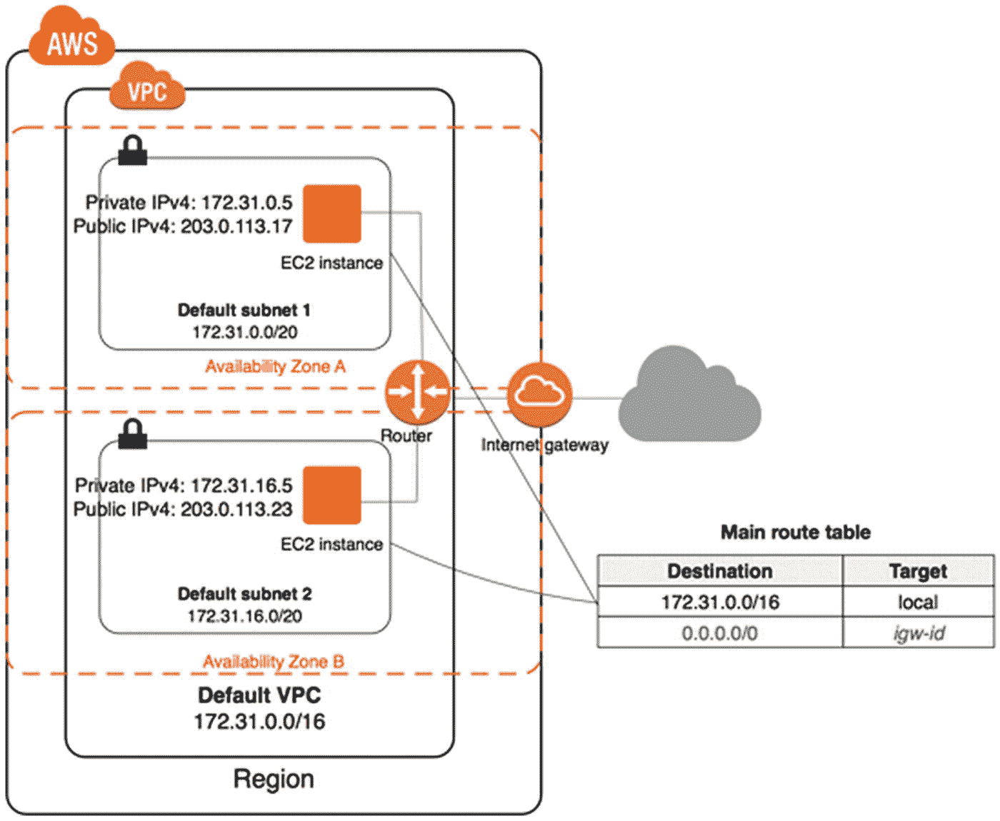

图 1-9

Amazon VPC 体系结构

如果您查看图 [1-9](#Fig9) 中的架构，您可以看到在 VPC 内部我们有两个 EC2 实例，每个都有一个公共 IP 地址和一个私有 IP 地址。如果您想从 VPC 以外的地方访问服务，可以使用公共 IP 地址，而私有 IP 地址用于从 VPC 境内访问相同的服务。您可以看到，有一台路由器使用路由表来了解不同的路由，然后使用互联网网关进行访问。您还有一个 VPC 的 IP 地址和端口号(在图 [1-9](#Fig9) 中，172.31.0.0 是 IP 地址，16 是端口号)。

### 亚马逊 API 网关

在了解 API Gateway 之前，我先简单介绍一下应用编程接口(API)。API 是一种服务，我们用它来让两个或更多的应用程序相互交流。例如，当我们使用脸书上传图片或视频时，我们使用的是脸书的上传 API，而每当我们喜欢、评论或分享时，我们使用的是脸书的另一个 API。因此，在当前的开发场景中，每个小服务都被开发，然后被转换成一个 API(REST API 是最常用的 API 类型之一)，然后可以使用网络协议来使用。Amazon API Gateway 为您提供了有效管理这些 API 的服务。

Amazon API Gateway 可用于创建、发布、维护、监控和保护不同种类的 API，如 REST、HTTP 或 WebSocket API。这些 API 不仅可以拥有自己的应用程序，还可以访问和使用不同的 AWS 服务。

图 [1-10](#Fig10) 显示了 API 网关的架构。

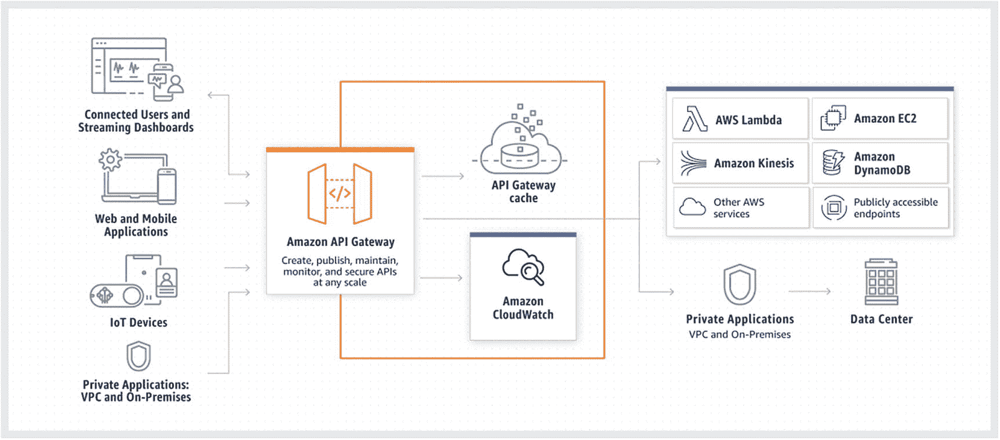

图 1-10

API 网关的体系结构

在图 [1-10](#Fig10) 中，Amazon CloudWatch 用于监控当前状态下 AWS 和 API Gateway 提供的任何服务的日志。API 网关缓存为您提供了一个选项，通过存储最常用的组件来减少延迟。所有的 API 都可以连接到 AWS 的不同服务，如 AWS Lambda、EC2、Kinesis(用于实时数据分析)、DynamoDB(云数据库)等。任何第三方应用程序也可以使用它。

### 亚马逊云前线

网络上有很多服务，为我们提供了很多选择来建立网站并提供给最终用户。AWS 可以算作其中之一，但它提供了其他人没有提供的功能。AWS 提供了更短延迟的选项。为了更详细地理解延迟，假设你正在打开一个网站，它的服务器在印度，但你在朝鲜(假设互联网是提供给它的公民的)。现在，由于服务器离得很远，使用网站提供的任何服务都要花费很多时间。但是，如果网站部署在 AWS 中，那么一个人就可以使用韩国的服务器，而不是使用印度的服务器。因为服务器离国家近，页面打开会更快。

AWS 是怎么做到的？答案是其名为 CloudFront 的服务。CloudFront 是如何做到的？这是通过使用 AWS 提供的边缘位置来实现的。当你制作一个网站时，它有静态和动态的内容，如 HTML 页面、CSS 和 JavaScript 等。因此，如果使用网站的请求来自您的服务器不存在的位置，CloudFront 会将网站的所有内容分发到离发出请求的位置最近的边缘位置。因此，现在打开网站变得更快，因为内容是从最近的服务器传送的。要了解更多关于边缘位置的信息，请访问此链接: [`https://aws.amazon.com/cloudfront/features/`](https://aws.amazon.com/cloudfront/features/) 。

在图 [1-11](#Fig11) 中，你可以看到 CloudFront 是如何用于这个发行版的。让我们看看图像中的每一步代表什么。

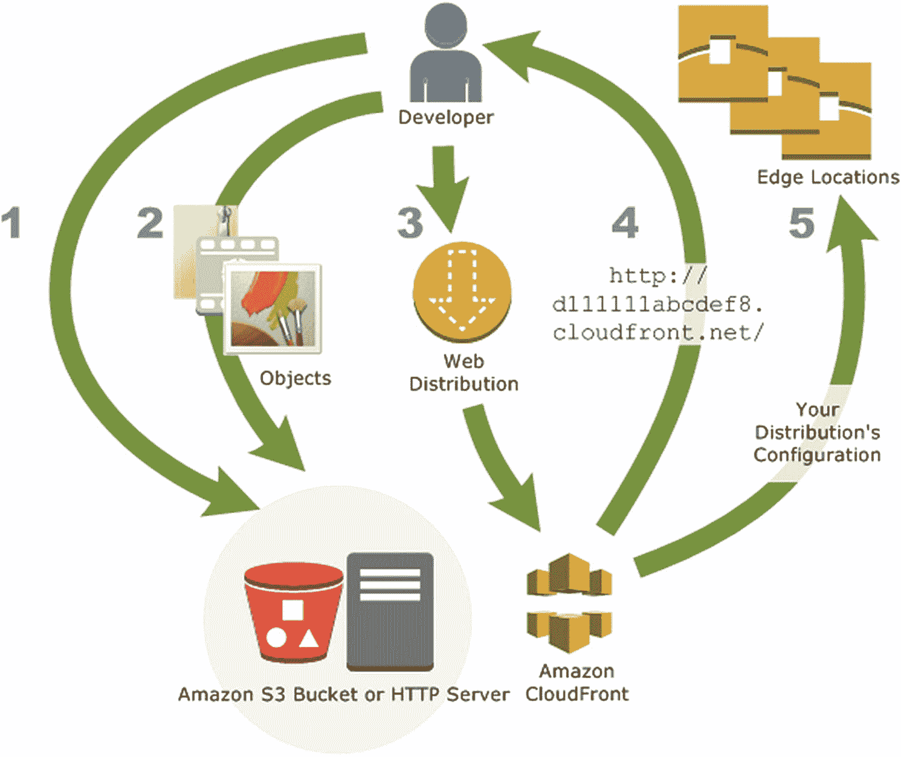

图 1-11

亚马逊 CloudFront 服务

1.  你的网站将要使用的所有文件都存储在像 S3 这样的 AWS 服务中，或者它可以是你自己的 HTTP 服务器。(步骤 1 和 2。)

2.  现在，您通过提供到您的 S3 或 HTTP 服务器的链接来启动 CloudFront 发行版。(第三步。)

3.  特定于 CloudFront 的域名将提供给您的发行版。也是可以改变的。(第四步。)

4.  CloudFront 将刚刚创建的发行版的配置发送到世界各地的所有边缘位置。这里创建了文件的缓存。(第五步。)

## 结论

这就完成了关于云计算和 Amazon 版本的云:AWS 的基本介绍。在本章中，您看到了与云计算相关的不同概念，并了解了 AWS 的不同组件。我们还没有看到 AWS 的所有服务，因为 AWS 有 150 多个。它们不可能在一本书中全部涵盖，但就本书而言，我们已经涵盖了所有重要的问题。

在下一章中，我们将着眼于 AWS 的安全方面以及为使我们的应用程序安全而提供的不同类型的服务。