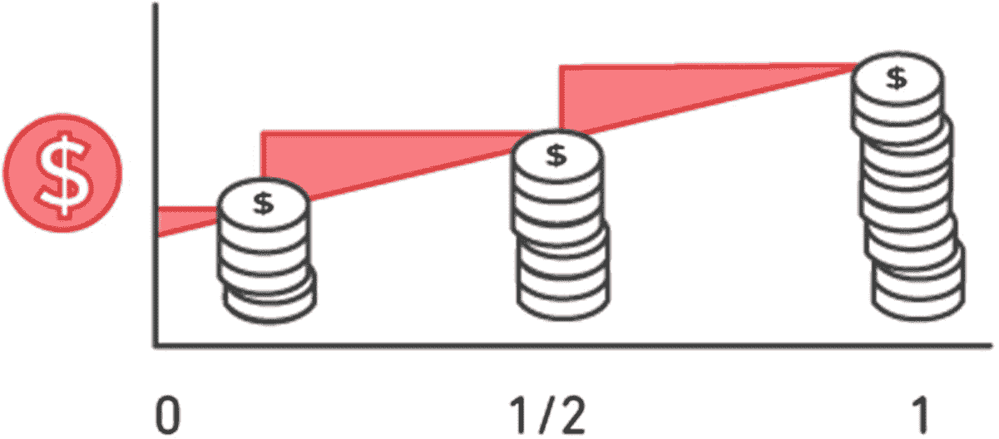
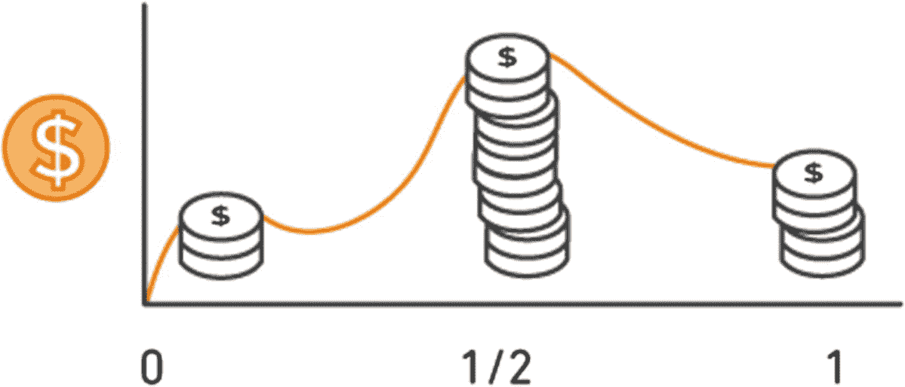
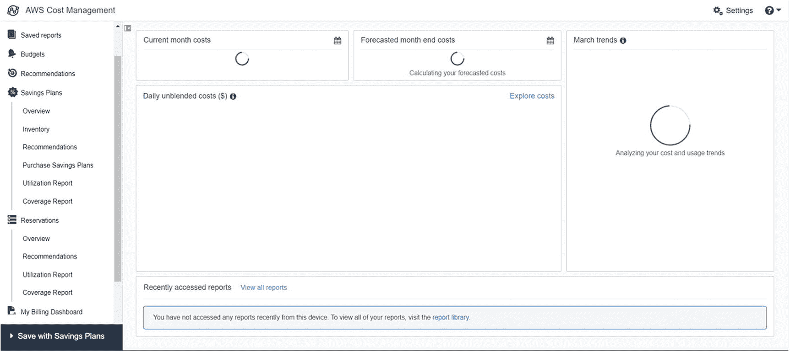
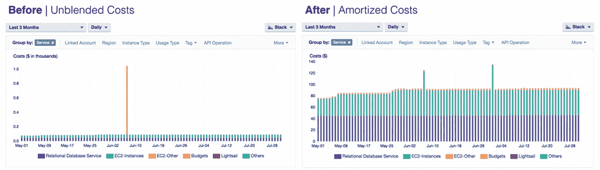
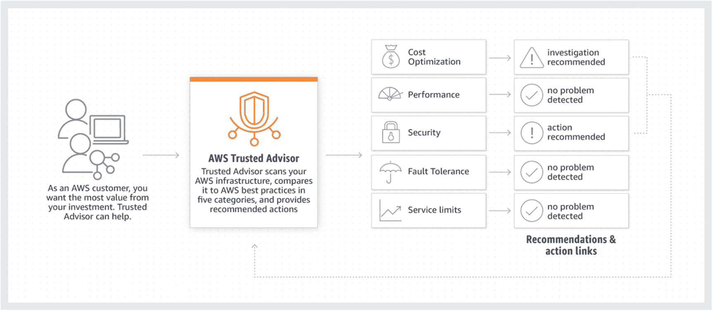
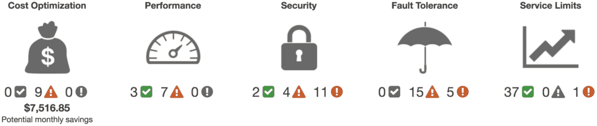

# 二、AWS 定价和成本管理

在前一章中，我们了解了云计算的一些概念，并探索了 AWS 提供的一些重要服务。在本章中，我们将了解 AWS 如何对我们提供的服务收费，以及我们如何在尽可能减轻我们的财务负担的情况下充分利用 AWS。

## 了解 AWS 的定价

根据文档，AWS 试图让我们的生活变得更简单，向我们收取的费用与我们收取的电费或水费相同。这意味着我们只为我们将要使用的东西付费。当我们的场所有基础设施时，我们必须支付一切费用，即使我们没有使用它。在 AWS 中，就不一样了。这叫做*现收现付*。

在图 [2-1](#Fig1) 和 [2-2](#Fig2) 中，AWS 试图展示两种架构在定价上的差异。当我们看图 [2-1](#Fig1) 时，我们看到即使我们不使用基础设施，即红色阴影区域表示的部分，我们仍然在为其付费。因此，到最后，你会看到每个月的费用都在增加，到年底，你最终要支付很多费用。

图 2-1

内部基础架构的定价

相反，图 [2-2](#Fig2) 显示，一个人用得越多，支付的费用就越多，而在剩下的日子里，支付的费用就会少得多。因此，AWS 节省的成本要多得多。AWS 帮助我们省钱的另一个方法是使用提供的预留功能。

图 2-2

AWS 基础架构中的定价

通过*保留实例*，AWS 意味着您预先为 AWS 服务付费，以获得更长时间的使用。这意味着稍后该服务所需的资源和基础设施被保留，因此没有其他人可以使用这些保留的服务和基础设施。由于您要求在更长的时间内使用整个服务，这意味着 AWS 将继续从这些服务中获利。基础设施在资金方面永远不会闲置。因此，为了让选择保留实例的公司更容易，AWS 降低了收费。有时不到我们在前一章中讨论的按需实例的 70%。

现在，在进入 AWS 定价的细节之前，让我们先看看 AWS 免费层，包括我们可以免费使用哪些服务以及使用多长时间。

## AWS 自由层

AWS 在三个领域提供免费服务。

*   永远免费的服务

*   大约 12 个月免费的服务

*   可试用的服务

以下是一些永远免费的服务:

*   DynamoDB 免费提供 25 GB 存储空间。

*   AWS Lambda 对于每月 100 万次请求和高达 320 万次的计算时间总是免费的。

*   100 万个物体可以免费存放在亚马逊胶水里。

以下是大约 12 个月内免费的一些服务:

*   5 GB 的亚马逊 S3

*   每月 750 小时 EC2 实例，支持 t2.micro 和 t3.micro

*   亚马逊理解中的 50 K 单位文本

以下是可以试用的服务:

*   250 小时/月的亚马逊 SageMaker 使用 t2.medium 两个月

*   50 小时/月的亚马逊 SageMaker 使用 m4.xlarge 两个月

*   125 小时/月在亚马逊 SageMaker 托管两个月

## 影响 AWS 定价的因素

AWS 根据以下三个要素计算价格:

*   计算

*   仓库

*   数据传送

AWS 不会对数据的传入传输或 AWS 的两个或更多服务之间的数据传输向您收费。但是，无论数据在 AWS 网络之外传输(出站数据传输)，它都要为此向您收费。这取决于传输的数据量。数据越多，每千兆字节的价格越低。

如前所述，对于计算，费用是按小时计算的，而对于存储，费用是按千兆字节计算的。现在我们知道了哪些因素影响 AWS 定价，我们必须知道如何优化 AWS 中的成本。

## AWS 成本优化

我们可以通过下面给出的四个简单步骤来创建一个经济高效的 AWS 架构:

*   合理确定您的服务规模

*   使用保留实例

*   利用现货市场

*   使用成本浏览器

### 合适的尺寸

术语*调整规模*意味着您只使用您需要的服务。这意味着您只使用您需要的计算能力或只使用您需要的存储。您不能过度调配资源，也不能牺牲容量。AWS 为您提供服务，帮助您通过自动扩展来调整规模，包括根据使用情况进行向上扩展、向下扩展、向外扩展和向内扩展。

要调整规模，组织应该完全了解需求和使用模式，然后利用 AWS 的弹性来调整规模。通过这种方式，组织可以节省高达 70%的总成本。此外，人们必须记住，这不是一次性的事情。这意味着公司必须定期计划他们的需求和模式，并做出相应的改变。因此，我们可以说，正确确定规模是一个持续的过程。

您如何决定何时是再次执行正确规模估算的最佳时机？为此，AWS 给了我们一些工具，可以用来做出这类决定。

*   *亚马逊 CloudWatch* :可以了解 CPU 的利用量，网络的吞吐量，磁盘 I/O 操作等。，然后使用此信息来决定是否需要调整规模。

*   *AWS 成本优化*:这为您提供基于当前利用率的正确规模建议。我们将在接下来的部分对此进行更多的讨论。

*   *AWS 成本浏览器*:你可以使用成本浏览器来了解公司成本的主要驱动因素是什么。基于此，可以做出正确的决定。

*   *AWS 可信顾问*:这有助于您了解更多关于闲置或未充分利用的资源。

以下是在确定最佳规模时可以考虑的一些因素。这些因素可分为以下几类:

*   根据性能数据确定合适的规模

*   根据使用需求确定合适的规模

*   通过停止实例来调整规模

*   基于正确实例系列选择的正确规模

*   基于数据库实例选择的适当规模

在进行性能数据分析时，应该识别空闲或未充分利用的实例。为此，可以查看实例的 CPU 和内存使用情况。这可以使用 CloudWatch 或前面提到的任何其他工具来完成。Amazon 建议那些四周内最大 CPU 或内存使用率低于 40%的实例可以调整大小。

在分析使用需求时，必须考虑以下因素:

*   如果负载在很长一段时间内保持不变，我们可以选择保留实例，而不是按需或现场实例。我们将在下一节详细讨论保留实例。

*   如果负载不是恒定的，但是我们可以说在近似相等的时间间隔内或者在特定的场景中负载增加或者减少，那么我们可以使用 AWS EC2 实例的自动缩放特性。

*   所有被视为灵活的负载(这意味着它们仅在需要时使用，然后可以关闭)都可以使用按需实例或现场实例。

当我们运行笔记本电脑或台式机等常规系统时，我们会在不使用时将其关闭。AWS 也可以做同样的事情。所有空闲超过两周的实例都可以停止或终止。一旦实例被停止，公司就停止支付 EC2 实例的费用。但是请记住，对于每个 EC2 实例，都有一个与之关联的 EBS 卷。卷还活着，你还在继续付费。如果要终止实例，附加的 EBS 卷也会被删除；因此，EBS 没有成本。但是，如果您想要重新运行该实例，那么应该进行一些重新配置来取回 EBS 卷。最好的方法之一是存储 EBS 卷的快照，以便在终止期间或者甚至在删除期间，EBS 卷可以以快照的形式存储作为备份。

#### 什么是 EBS 卷？

在了解亚马逊弹性块存储(EBS)之前，我们必须知道什么是块设备。一个*块设备*，简单来说就是用来存储你的信息的设备。因此，所有像 HDD 或 SSD 这样的磁盘驱动器都是块设备。它们是平台独立的，这意味着你可以给它们任何操作系统，一个块设备就可以工作。在块设备中，存储了所有文件，可以使用任何实例和操作系统访问这些文件。

现在，当我们谈到 EBS 时，它允许在 Amazon EC2 实例中使用这种块存储。它为您提供了在单个 EC2 实例中附加多个 EBS 卷或将一个 EBS 卷附加到多个 EC2 实例的功能。

我们可以决定为我们的工作负载选择完美的实例，我们还可以基于两个选项来更改它:更改同一系列中的实例，以及将实例更改为不同系列。我们可以根据以下指标将该实例更改为同一系列中的另一个实例:

*   vCPUs 计数

*   看着记忆

*   查看网络吞吐量

*   查看附加存储

但是，当我们将该实例更改为不同系列中的另一个实例时，我们会考虑以下指标:

*   选择正确的虚拟化类型

*   选择是否需要 VPC 支持

*   选择正确的平台

*   选择是否升级硬件要求

对于前三点，我们必须确定升级前的配置和升级后的配置是一样的。对于最后一点，必须努力将整个架构迁移到升级的 EC2 实例。在前一章中，我们讨论了不同系列的 EC2 实例。

#### 什么是虚拟化类型？

AWS 中的 Linux 机器支持两种类型的虚拟化:半虚拟化(PV)和硬件虚拟机(HVM)。这两个实例之间的区别在于操作系统如何引导以及如何利用额外的配置，如 CPU、存储等。

#### 调整数据库实例的规模

最后但同样重要的是，我们可以调整数据库实例的大小。为此，必须牢记以下指标:

*   要么扩大或缩小数据库实例，要么保持存储大小不变。

*   我们可以单独更改数据库实例的存储大小。

*   AWS 很重视许可证。因此，无论一个人使用什么数据库，都必须有正确的许可证。

*   您可以选择合适的数据库实例调整时间。它可以立即完成，也可以在特定窗口完成，例如在维护期间。

这就结束了我们关于在 AWS 中调整规模的讨论。接下来，我们必须了解更多关于保留实例的信息。

### 使用保留实例

保留的实例都是关于承诺。当您购买 AWS 的 reserve compatible 服务时，只有在那个时候，您才必须决定是要长期购买，还是您的需求会定期发生变化。如果是长期的，那么你可以选择预约服务，这样可以降低服务的小时成本。以下是 AWS 提供的服务，这些服务提供了预订服务:

*   亚马逊 EC2

*   亚马逊 RDS

*   亚马逊弹性缓存

*   亚马逊红移

*   亚马逊 DynamoDB

必须绝对确保使用保留的实例，因为锁定期要么是一年，要么是三年。这意味着你必须提前支付一整年或三年的费用。付款完成后，无论你使用多少实例，你都不会得到任何退款，就像按需实例一样。因此，一旦您为锁定期付费，您可以获得高达按需实例 75%的折扣，但之后您将无法获得使用模式的动态定价。

保留的实例提供以下付款选项:

*   无需预付

*   部分预付款

*   所有预付款项

顾名思义，没有预付意味着你在开始时不用支付任何金额。部分预付意味着您可以在开始时支付一些金额，而全部预付意味着您在开始时支付全部金额。对于没有预付的情况，客户按小时折扣率付费。但是，由于 AWS 不确定客户是否会付款，因此它需要与客户签订合同协议，并且它还会查看这些客户与 AWS 的过去关系。对于部分预付，遵循同样的事情。剩余金额按小时折扣率收取。

保留实例分为两种。

*   标准保留实例

*   可转换的保留实例

对于标准保留实例，可以增加实例的大小或修改可用性区域，或者也可以在保留实例市场中出售。另一方面，可转换的保留实例可以与可能具有新属性(如实例族、实例类型、平台等)的其他可转换实例交换。它们不能在市场上出售。

一个月内可以购买的保留实例的数量也有限制。对于特定区域，一个月可以购买 20 个区域实例和 20 个分区实例。区域实例是可用于整个区域的实例，而区域实例是可用于特定可用性区域的实例。

### 使用定点实例

正如前一章已经讨论过的，spot 实例是那些空闲运行的实例，目前 AWS 没有从中产生任何收入。这些实例可以被公司采用，并且可以实现高达 90%的按需实例折扣。请记住，由于这些是当前空闲的实例，这并不意味着它们将一直空闲。这意味着每当它们的使用再次增加时，EC2 会给你两分钟的通知，然后中断 spot 实例的会话。显然，每一件伟大的事情都有缺点。终止 spot 实例的另一种方式是当您产生的成本增加了定义的阈值时。

我们必须了解必须使用 spot 实例的场景。Amazon 建议在以下情况下使用 spot 实例:

*   制作容错和灵活的应用程序
    *   网络服务器

    *   API 后端

    *   CI/CD 流水线(DevOps)

    *   Hadoop 数据处理

*   图像渲染

*   无状态 web 服务

*   大数据分析

*   并行计算

一旦有了一个随需应变的实例，就可以请求 spot 实例来处理应用程序具有的一些额外功能。为此，您可以通过在 EC2 中启动向导来请求 spot 实例。您只需要告诉实例的数量、实例的类型、可用区域以及您愿意为此支付的最高价格。

### 使用成本浏览器

一旦您决定了要使用的服务类型，无论是预约、按需还是现场，您都可以使用 AWS 提供的工具“成本浏览器”来分析您的使用情况和产生的成本。Cost Explorer 提供了三种类型的报告来帮助您:报告过去 12 个月的使用情况和发生的成本，根据您过去的使用情况预测未来三个月的支出，以及获得关于要使用的实例类型的建议。

如果您打开成本浏览器仪表板，它将带有一个默认视图，如图 [2-3](#Fig3) 所示。

图 2-3

AWS 成本浏览器控制板

查看仪表板，我们可以说成本浏览器由以下组件组成:

*   成本浏览器成本

*   成本浏览器趋势

*   每日未混合成本

*   每月未混合成本

*   未混合成本净额

*   最近的成本浏览器报告

*   摊余成本

#### 成本浏览器成本

该组件告诉您两个指标:当前成本与上个月成本的比较，以及当前预测与上个月实际成本的比较。成本浏览器以图表的形式显示截止到某个日期当月的当前成本，然后将其与前一个月同期的成本进行比较。它还预测该月剩余的天数，然后将其与前一个月实际发生的费用进行比较。这有助于用户决定各种因素，如合适的规模、减少使用等。

#### 成本浏览器趋势

本节将告诉您用户正在使用的不同服务的成本趋势。它在控制面板中显示了排名靠前的趋势，但用户可以深入查看所有服务的趋势，还可以进一步深入查看特定服务，查看导致该趋势的不同成本。

#### 每日未混合成本

首先，我们必须了解什么是未混合成本。它是 AWS 在特定时刻向用户收取的费用。例如，如果 AWS 因我在上午 10:45 使用 EC2 实例而向我收费 100 美元，那么它将成为我每日未混合成本的一部分。一般来说，它被认为是最重要的成本数据，因为它告诉你发生时的成本。显然，您可以使用不同的过滤器来更改成本浏览器的未混合成本部分的视图。您也可以下载 CSV 格式的信息。有一点应该明确:unblended cost 并不显示用户在特定时期内收到的退款金额。

#### 每月未混合成本

顾名思义，不用查看每日未混合的成本信息，可以将粒度更改为月级别。这可以为您提供月份的总体情况，然后您可以继续查看特定月份的每日未混合成本，您可能会发现异常或希望进一步调查。

#### 未混合成本净额

净成本考虑您已经发生的总成本，根据同期给您的折扣进行调整，然后向您提供信息。如果用户愿意，他们实际上可以包括或排除任何其他调整，如 AWS 提供的退款或信用。

#### 最近的成本浏览器报告

此指标包括用户过去访问过的所有报告的列表，以及每个报告的时间戳和链接。您只需单击该链接即可再次查看报告。

#### 摊余成本

通常摊余成本是一种标准化的成本信息。例如，如果我们考虑一个月，每天将收取不同的服务使用成本，我们可以在未混合成本部分查看一下。但是，如果我们采取了一个保留的实例，例如，然后可能每个月的第一天，整个月的费用将被收取。你会在图表中看到一个突然的峰值。因此，信息可以被标准化和分布，而不是处理所有这些种类的尖峰，然后它可以给我们一个更好的整体画面。图 [2-4](#Fig4) 完美地向我们展示了未摊成本和摊余成本之间的差异。

图 2-4

未摊成本和摊余成本之间的差额

现在我们已经了解了 AWS Cost Explorer 的工作原理，让我们来看看 AWS Trusted Advisor 也是如何工作的。

## AWS 值得信赖的顾问

众所周知，AWS 是云计算服务的市场领导者。因为它有很多客户端，所以它知道每个人的使用模式统计。基于此，AWS 提出了一些最佳实践。它们分为以下几类:

*   成本优化

*   安全性

*   容错

*   表演

*   服务限制

在本章中，我们已经看到了一些影响成本优化的因素。我们将在下一章讨论其余的因素。但是，记住所有这些因素，用户可以用最低的成本获得最高的性能。AWS Trusted Advisor 会考虑所有这些因素，并提供自己的建议，帮助用户尽可能降低成本。图 [2-5](#Fig5) 完美展示了可信顾问的工作原理。

图 2-5

AWS 值得信赖的顾问

它的工作原理就像你个人系统中的反病毒保护软件一样，为你提供恶意软件和其他相关信息。在这里，不是恶意软件洞察，而是我之前指定的五个类别的洞察。这些洞见可以如图 [2-6](#Fig6) 所示。

图 2-6

AWS 值得信赖的顾问见解

绿色复选标记表示我们正在以正确的方式做事情。黄色感叹号是需要注意的警告，否则可能会导致问题。红色感叹号表示应该立即考虑这些建议，因为它们已经影响了成本、性能、安全性等。

以下是使用 AWS Trusted Advisor 的一些好处:

*   登录 AWS 帐户后，Trusted Advisor 会为您提供实时通知。如果您启用它，它还可以通过电子邮件定期向您发送通知。

*   如果需要，您可以对 Trusted Advisor 生成的报告进行更改。您可以包括或排除项目。

*   当可信赖的顾问提出建议时，它会提供一个链接，将您带到 AWS 管理控制台，您可以在那里整理警告。

## AWS 服务的定价

既然我们已经研究了找出使用 AWS 服务所产生的成本的不同方法以及如何优化它们，那么让我们看看在哪里可以找到更多的信息；见表 [2-1](#Tab1) 。

表 2-1

成本链接

<colgroup><col class="tcol1 align-left"> <col class="tcol2 align-left"></colgroup> 
| 

AWS 服务

 | 

AWS 定价页面

 |
| --- | --- |
| 按需 EC2 实例 | [T2`https://aws.amazon.com/ec2/pricing/on-demand/`](https://aws.amazon.com/ec2/pricing/on-demand/) |
| 现场 EC2 实例 | [T2`https://aws.amazon.com/ec2/spot/pricing/`](https://aws.amazon.com/ec2/spot/pricing/) |
| 保留的 EC2 实例 | [T2`https://aws.amazon.com/ec2/pricing/reserved-instances/pricing/`](https://aws.amazon.com/ec2/pricing/reserved-instances/pricing/) |
| 亚马逊 S3 | [T2`https://aws.amazon.com/s3/pricing/`](https://aws.amazon.com/s3/pricing/) |
| 亚马逊 VPC | [T2`https://aws.amazon.com/vpc/pricing/`](https://aws.amazon.com/vpc/pricing/) |
| 亚马逊萨格玛克 | [T2`https://aws.amazon.com/sagemaker/pricing/`](https://aws.amazon.com/sagemaker/pricing/) |
| 亚马逊 RDS | [T2`https://aws.amazon.com/rds/pricing/`](https://aws.amazon.com/rds/pricing/) |

有关其他服务的信息，您可以登录 AWS 管理控制台，然后切换到您选择的服务并查看其价格部分。

## 结论

在本章中，您了解了 AWS 如何对其服务收费，以及如何有效地使用一些 AWS 服务来最大限度地降低成本。本章帮助您根据您的预算和需求决定选择哪些服务。

在下一章中，您将详细了解 AWS 的安全性。您还将了解 AWS 如何处理容错，以及如何有效地构建一个基于组织层次结构为 AWS 服务服务的架构。