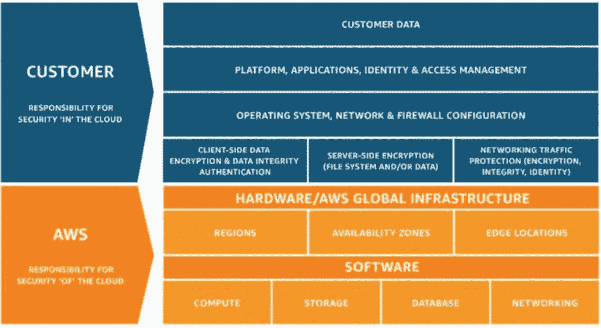
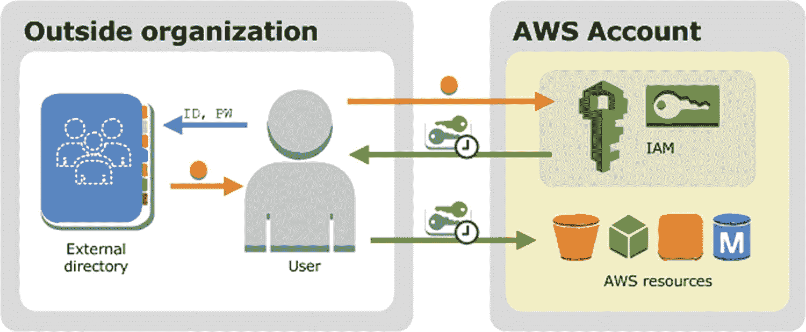
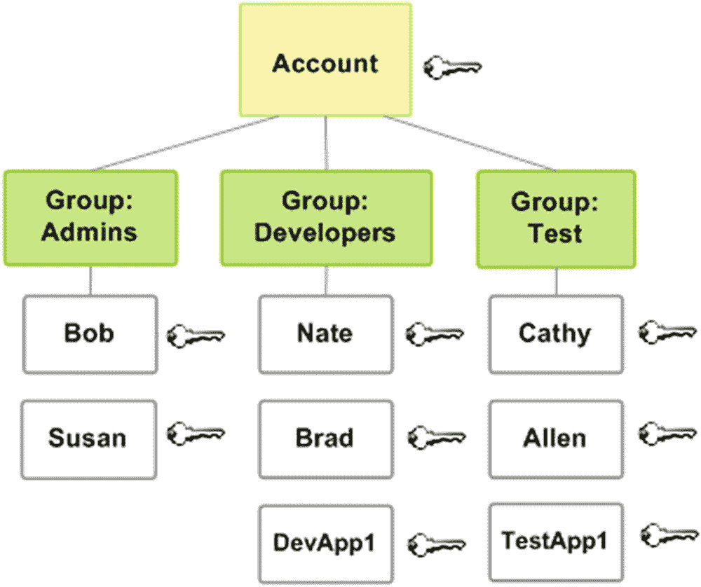
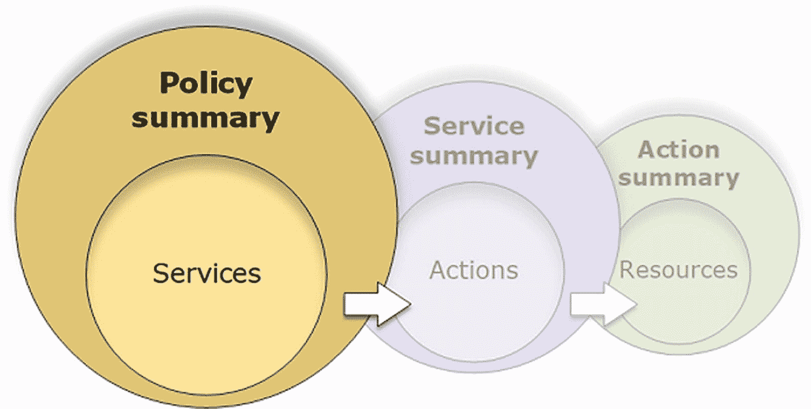
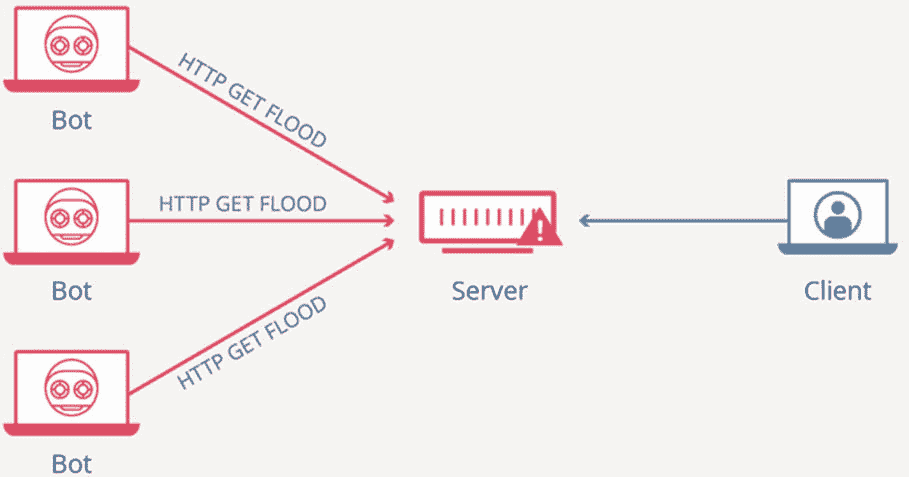
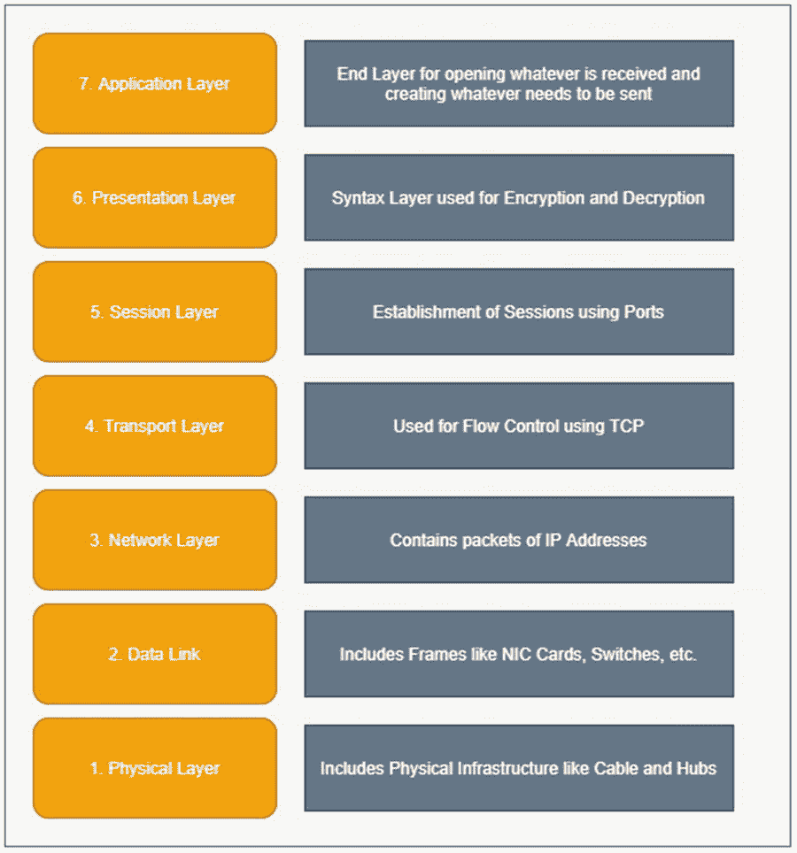

# 三、AWS 中的安全性

在这一章中，我们将看看 AWS 的安全方面。如你所知，AWS 有数百项服务，为数以千计的客户提供服务，因此其安全性方面的一个小小的妥协就可能导致特定公司乃至 AWS 自身的巨大损失。这就是为什么 AWS 有一些具体的安全实践，以及专门的安全服务来保护 AWS 的所有功能。

本章专门介绍这些服务的一些最重要的部分。在本章结束时，你将理解 AWS 的底层安全性，并且能够在你使用的产品中实现不同的安全特性。

## 自动气象站的 SSR 模型

谈到安全性，AWS 遵循共享安全责任(SSR)模型。这个模型很简单:责任应该由客户和 AWS 共同承担。具体来说，AWS 负责其借给客户的整个基础设施的安全。另一方面，客户对其在该基础架构中保存的任何东西负责。图 [3-1](#Fig1) 显示了 AWS 的 SSR 模型。



图 3-1

AWS 的共享安全模型

以下是 AWS 的部分职责:

*   AWS 负责整个基础设施，包括硬件、软件、网络和 AWS 用来运行其服务的其他设施。

*   AWS 通过组织第三方审计定期提供有关其运营的报告。它的合规性、安全标准和法规都经过验证。

*   对于大多数服务，基本的安全任务也由 AWS 完成，如安装客户操作系统、修补数据库、配置防火墙和进行灾难恢复。

以下是客户和用户的一些责任:

*   预订服务并由 AWS 负责基本安全后，客户有责任执行所有必要的安全配置和管理任务。这可能包括更新操作系统、安装安全补丁、配置防火墙等。

*   客户必须使用 Amazon 身份和访问管理(IAM)服务设置用户帐户。这将允许客户为其每个用户提供不同的凭证，从而访问不同的服务。

*   客户必须为每个帐户设置多因素身份验证。

我们将在本章后面更深入地讨论 Amazon IAM 和多因素身份验证。

AWS 为其客户提供高级别的安全性，可分为以下几类:

*   合规要求

*   物理和环境安全

*   业务连续性管理

*   网络安全性

### 服从

AWS 的基础设施基于几个 IT 安全标准，包括:

*   SOC 1/SSAE 16/ISAE 3402(前 SAS 70)

*   SOC 2

*   SOC 3

*   FISMA、DIACAP 和 FedRAMP

*   国防部 CSM 等级 1-5

*   PCI DSS 级

*   iso 9001/iso 27001/iso 27017/iso 27018

此外，AWS 遵循一些特定于行业的标准。

*   刑事司法信息服务(CJIS)

*   云安全联盟(CSA)

*   家庭教育权利和隐私法(FERPA)

*   健康保险流通与责任法案(HIPAA)

*   美国电影协会(美国电影协会)

### 物理和环境安全

对于基础设施的物理和环境安全，AWS 遵循以下标准:

*   只有经过授权的人才能进入 AWS 数据中心，即使他们是 AWS 或亚马逊的员工。

*   设施中安装了自动火灾探测传感器和灭火剂。

*   AWS 数据中心不仅有稳定的电力供应，而且还有强大的 UPS，这样在停电的情况下，操作永远不会停止。

*   安装了温度控制设备，并由工作人员持续监控，以保持数据中心内的最佳温度。

*   AWS 按照严格的规范停用任何硬件，这样数据就不会受到损害。

### 业务连续性管理

许多公司正在转向云平台，他们不希望自己的业务运营因为 AWS 而中断。当公司将他们的整个业务基础设施转移到 AWS 时，他们的所有数据都驻留在那里。即使几个小时的中断也会给公司造成巨大损失。因此，AWS 需要严格设计其基础设施计划，以避免这种情况发生。为了确保业务连续性管理，AWS 采取了许多措施。

*   AWS 的所有数据中心 24/7/365 全天候运行。因此，如果某个数据中心出现故障，AWS 首先要做的就是将数据流量从受影响的区域移走。

*   使用 AWS，客户可以将其数据放入多个地理区域，在每个区域内，数据可以放入多个可用性区域。可用性区域以这样的方式构成，即它们独立于同一区域中的所有其他可用性区域。因此，例如，如果可用性区域所在的某个区域有可能在特定季节受到洪水的影响，那么同一地区的所有剩余可用性区域将被放置在永远不会受到同一洪水影响的位置。

*   每个数据中心都由 UPS 和现场备份生成设施提供备份。此外，为了进一步提高安全性，在设施内部提供来自不同网格线的电力，以便在一个发生故障时，另一个仍然有效。

### 网络安全性

正如我们在上一节中看到的，AWS 已经使其数据中心能够抵御灾难。但是，比这更大的威胁是网络入侵。随着技术的进步，黑客的技能也在进步。那么，AWS 是如何应对其网络安全的呢？好吧，让我们探讨一下 AWS 为确保网络安全而采取的一些措施。

*   有一个防火墙保护您的传入和传出流量。这是网络安全最基本也是最有力的第一步。

*   AWS 有访问控制列表(ACL ),其中包含一组策略，决定谁可以访问 AWS 的哪些服务以及哪些信息可以访问哪些服务。这些 ACL 会定期更新，并使用名为 ACLManage 的 AWS 工具自动推送。

*   信息可以从许多入口点流入 AWS 服务器，出口点也是如此。因此，在这种情况下，管理这些入口点和出口点会变得非常困难。因此，为了处理这个问题，AWS 有安全的访问点。使用它们，AWS 只有有限数量的接入点，通过这些接入点可以对所有传入和传出的传输进行全面监控。这些接入点被称为 *API 端点*，只有 HTTPS 接入才被允许拥有安全连接。

*   AWS 通过亚马逊 VPC 为其客户提供额外的安全选项。我们在第 1 章中讨论了 VPC。

*   对于 AWS，有两种类型的客户端。一个是它的老客户，一个是它自己的企业网络。在访问 AWS 服务时，AWS 不会为其公司网络提供任何特权。对于 AWS 员工来说，如果他们想首先访问任何 AWS 服务，他们必须提出一个票证，如果它获得批准，那么他们就可以访问。此外，出于安全目的，员工所做的一切都会被安全地记录下来。

*   AWS 有许多自动监控工具，因此它可以监控服务器和网络使用情况，扫描入站和出站传输的端口，检测未经授权的入侵尝试等。

## AWS 帐户安全功能

在前面的章节中，我们看到了 AWS 是如何保证其基础设施安全的。在本节中，我们将了解 AWS 如何保护其客户的 AWS 帐户。AWS 做的第一件事是用凭证保护每个帐户。AWS 使用凭证进行身份验证的方式有多种。

*   密码

*   加密密钥

*   数字签名

*   证书

*   多因素认证

一旦为您的帐户创建了凭据，就可以很容易地从“安全凭据”页面下载凭据报告。报告中包含的信息告诉我们帐户是否使用密码、密码是否可重设、密码上次更改的时间、密钥上次轮换的时间以及多因素身份验证是否已启用。

在 AWS 中，我们可以创建多个访问密钥，也可以定义多个证书。出于安全原因，这样做是为了连续轮换它们。当它们被轮换并且我们希望业务连续性不受影响时，我们可以使用并发密钥和证书。我们可以使用 AWS IAM 来旋转按键。我们将在下一节更详细地了解密钥和证书。

### 用于验证的密码

如果要访问 AWS 服务，密码真的很重要。它们授予您 AWS 内部的第一级访问权限。密码是在创建帐户时创建的，可以通过“安全凭据”页面随时更改。AWS 允许最多 128 个字符的密码，它们必须有特殊的字符组合才能足够强。

如果您组织的基础设施完全托管在 AWS 上，您可以创建密码策略，以便新密码必须遵循您的安全策略。这可以确保创建最强的密码。

### 多因素认证

这是客户可以选择的额外安全级别。多因素身份验证要求客户成功输入用户名和密码后，用户必须提供一个特定且唯一的六位数字代码进行身份验证。如果成功，那么这个人将被允许进入帐户。该六位数代码由客户接收到其认证设备之一。它可以是智能手机、电子邮件或电话号码。当用户登录时，会收到一个应该输入的代码，然后成功登录。

### API 认证的访问密钥

API 是这样一种特性，其中请求被发送到 API 背后封装的一段代码，用户接收输出。现在，API 内部的编码逻辑可能允许用户访问敏感信息。因此，发送到这些 API 的请求也必须经过身份验证，这意味着只有正确的用户才能访问 API。这是通过*数字签名*完成的。这个数字签名是通过将请求文本和秘密访问密钥传递给负责加密的散列函数而生成的。这个散列函数对消息进行加密，然后将其发送给 API。这又在 API 端被解密；检查密钥，然后提供条目。

目前，数字签名使用一个名为 HMAC-SHA256 的协议，这是它的第四个版本。数字签名验证的另一个安全级别是在请求中添加时间戳。如果 API 生成和接收的数字签名的时间戳相差超过 15 分钟，请求将被拒绝。

### X.509 证书

当我们希望两个或更多的 web 服务相互通信时，我们使用基于 SOAP 的请求。为了使这类请求安全，我们使用 X.509 证书。这些证书由三部分组成。

*   公钥

*   私人钥匙

*   附加元数据

第一步是使用我们在上一节中看到的过程来生成数字签名。现在，我们使用这个数字签名和证书来发送请求。首先，AWS 试图通过解密数字签名并验证它来验证通过身份验证的用户是否发送了请求。之后，AWS 会将已发送的证书与通过身份验证的用户在自己的 AWS 帐户中上传的证书进行匹配。如果一切都是绿色的，则请求被转发；否则就否定了。

## AWS 身份和访问管理

就像我们有 Amazon 管理控制台来访问所有 AWS 服务一样，对于所有安全需求，我们也有 AWS 身份和访问管理。所有身份验证或授权都可以从 IAM 进行管理。我们可以创建用户、定义角色、授予权限、分配策略，以及做许多其他事情，所有这些都来自 IAM。因此，这是每个使用 AWS 的人，无论是机器学习还是 web 开发，都必须了解的一项服务。

想要使用 AWS 服务的人要做的第一件事就是创建一个 root 用户帐户。这个帐户可以通过用户名和密码访问，它让用户可以无限期地访问它注册的所有服务。但是，AWS 不鼓励我们总是使用根用户帐户登录，因为这会危及组织的安全。这就是为什么我们可以使用 IAM 服务创建不同的用户，而不是使用 root 用户。这些被称为 *IAM 用户*。管理员可以向所有这些用户授予权限，要求他们提供自己的密码，分配不同的策略，从而使整个基础架构既简单又安全。

为了更好地理解这一点，让我们看一个例子。假设有一个拥有 5000 名员工的组织。将会有董事会、首席执行官、首席技术官、总裁、经理、建筑师、工程师和其他员工。首先，我们不能给每个人 root 访问权限，这不需要任何解释。因此，组织可以创建 IAM 用户。但是，给予顶层管理人员的权限将不同于给予较低层员工的权限。即使在高层管理中，董事会成员可能对具有仪表板或可视化支持的特定服务只有只读访问权限(例如 Splunk 仪表板)，但 CTO 拥有某种根访问权限。类似地，工程师将可以使用他们被雇佣的服务。机器学习工程师可能会接触到 SageMaker，数据工程师可能会接触到 EMR 或者 DynamoDB 等等。因此，我们可以从这个例子得出结论，不同的用户需要不同的权限，所有这些都可以使用 AWS IAM 来完成。

一旦定义了 IAM 用户，它将拥有自己的密码。一旦用户登录，用户将只能看到他们有权使用的服务。其他服务将要求凭据或拒绝访问。请注意，IAM 用户可能不是真实的人。它可以是一个软件服务。例如，假设一家公司制作了一个托管在不同平台上的网站，但使用了某些 AWS 服务，如 S3 或 DynamoDB。因此，网站应该不断地与这些服务对话。为了验证正确的软件与 AWS 服务对话，为这些服务创建一个 IAM 用户，网站使用自己的凭证访问相应的服务。

但是，组织确实已经有了自己的基础设施，来自任何管理层的每个员工都有一个电子邮件 ID 和密码。当员工必须使用 AWS 时，他们将有一个新的 ID 和密码。这意味着这个人必须记住并保护两个账户:公司账户和 AWS 账户。如果 AWS 提供一种方法，让员工只需登录公司帐户，并自动登录 AWS 帐户，这不是很棒吗？AWS 确实有一个解决方案，叫做*联合用户*。

### AWS 中的用户联盟

如果雇员在公司网络中具有帐户，并且公司在 AWS 网络中具有帐户，那么一旦雇员登录到公司网络，用户身份就可以由组织联合到 AWS 网络。这样，它减轻了 AWS 内部企业员工的登录麻烦。见图 [3-2](#Fig2) 。



图 3-2

用户联盟

以下是联邦的一些功能:

*   企业网络使用*单点登录* (SSO)使联盟成为可能。在此之后，自动登录发生，员工无需再次登录即可到达 Amazon 管理控制台。

*   即使一个人在 Gmail、脸书、亚马逊等平台拥有账户。，它们可以用于单点登录。

### AWS 中的访问管理是如何完成的

在通用术语中，*访问管理*也可以称为*授权*。登录 AWS 账户的个人或服务被称为*主体*。主体实体使用 IAM 进行身份验证(它用于对 IAM 角色或用户进行身份验证)。身份验证完成后，将检查附加到特定用户或角色的策略。这些策略有助于确定给予主体实体的权限。它们被创建并附加到不同的 IAM 身份，如用户、角色或组。现在，如果主体实体发送一个服务请求，但是策略中没有定义使用该服务的权限，那么访问将被拒绝。这就是 AWS 中访问管理的实现方式。

可以基于 IAM 角色、资源或访问控制列表来应用策略。角色的一个例子是数据工程师。所有具有数据工程师角色的 IAM 用户将被分配相同的策略。这意味着该角色中的每个人都能够以相同的权限级别访问相同的资源。应用于资源的策略对特定资源的使用施加限制。例如，我们可以创建一个策略，允许用户读取 DynamoDB 表，但不允许创建表。当我们想要应用跨平台策略时，使用 ACL。

这里给出了一个基于角色的策略的例子。我们已经定义了一个 JSON 文件，该文件显示了在 DynamoDB 上定义的策略。

```py
{
  "Version": "2012-10-17",
  "Statement": {
    "Effect": "Allow",
    "Action": "dynamodb:*",
    "Resource": "arn:aws:dynamodb:us-east-2:123456789012:table/Books"
  }
}

```

这允许用户使用 DynamoDB 中的`Books`表。这清楚地表明，要分配策略，必须创建 JSON 文件，并且这些文件必须附加到各自的实体。策略不仅可以附加到特定的实体，也可以附加到一组实体。这些被称为 *IAM 集团*；见图 [3-3](#Fig3) 。



图 3-3

IAM 组

图 [3-3](#Fig3) 定义了多个 IAM 用户，并将他们分成三个 IAM 组:管理员、开发人员和测试人员。现在，策略可以应用于整个组，并自动应用于其成员。但是，这里需要注意的一点是，如果某个特定成员没有被授予某项服务的权限，那么即使该组可以访问该服务，该成员仍然没有访问该服务的权限。

我们在哪里可以找到所有已定义策略的摘要？IAM 控制台中有三个表格，为我们提供了有关策略的详细信息。这些表格如下:

*   政策摘要

*   服务摘要

*   行动总结

当我们打开策略摘要时，我们将看到定义了策略的服务列表。我们可以单击任何服务，转到该特定服务的摘要表。摘要表显示了可以在该特定服务上执行的所有操作以及附加到这些操作的权限。您可以单击任何操作，然后可以进入操作摘要，该摘要给出了已经授予该特定操作的权限。图 [3-4](#Fig4) 为你总结了这些表格。



图 3-4

策略、服务和操作摘要

策略可以分为两种:基于身份的策略和基于资源的策略。顾名思义，当策略被附加到 IAM 角色、用户或组时，它们被称为*基于身份的策略*，而当我们将它们附加到 S3 桶或 DynamoDB 等资源时，它们被称为*基于资源的策略*。

### 基于属性的访问控制

在谈论基于属性的访问控制(ABAC)之前，我们必须了解 *AWS 标签*。这些是附加到 IAM 用户、角色、组甚至 AWS 资源的一些属性。当我们有一个大的组织并且我们想要为雇员制定政策时，这些标签是有用的。标签有什么用？让我们看一个例子。

一家制造机器学习产品的公司已经将其整个架构转移到 AWS。现在它在亚马逊 SageMaker 上做模型，用亚马逊 EMR 做数据工程，做网站，API，用 DynamoDB 和 CloudFormation 做数据库管理，为了安全用其他各种 AWS 服务如 CloudWatch，TrustedAdvisor 等。现在，我们还假设公司有大约 5000 名员工。提供 IAM 角色，然后将策略附加到每个员工将是一项单调乏味的任务。那么，我们该怎么办？这时泰格和 ABAC 出现了。

想象两个机器学习工程师；一个只使用 SageMaker 和 S3 桶，而另一个除了其他工程师使用的服务之外还使用 EMR。组织可以为不同的用途创建两个标签。假设一个标签叫做*基本机器学习*，另一个叫做*高级机器学习*。在定义他们的 IAM 角色时，所有的机器学习工程师和初级数据科学家都可以被赋予第一个标签。高级数据科学家和解决方案架构师可以获得第二个标签。现在，当一名初级数据科学家试图访问 EMR 时，会检查标签，并查看其相应的策略。许可将立即被拒绝，因为策略不足以提供这种访问。但是，如果解决方案架构师试图访问初级数据科学家访问过的同一标签，他将被授予访问权限，因为与该标签相关联的策略将适当的权限授予该人。这些标签也被称为*属性*，因此这个过程被称为*基于属性的访问控制* (ABAC)。

我们怎么能说 ABAC 工艺比传统工艺好呢？让我们来看看它们之间的一些区别。传统的过程也被称为*基于角色的访问控制* (RBAC)。

*   第一个区别是，在 RBAC 中，每次添加新资源时，附加到角色或用户的策略都必须更新——不仅是针对一个角色，而是针对所有角色。相反，在 ABAC，只有标签需要更新。

*   由于这些标签，ABAC 的政策比 RBAC 少得多，因此更容易管理。

在本书的第二部分，我们将了解创建根凭证，然后定义角色、用户、组等的整个过程。，使用 IAM。在这一节中，我们已经讨论了它的理论方面。实际上，我们将在下一部分讨论应用。

AWS 还提供了其他一些服务来提高应用程序的安全性。

*   AWS 晶圆

*   AWS 屏蔽

*   AWS 防火墙管理器

让我们逐一讨论每个服务。

## AWS Web 应用程序防火墙

所有发送到特定 AWS 服务(如 Amazon API Gateway、Amazon CloudFront 或应用程序负载平衡器)的 HTTP 或 HTTPS 请求都由 AWS Web 应用程序防火墙(WAF)监控。WAF 允许你控制对内容的访问。这是基于特定的条件和规则。下面列出了一些规则:

*   允许每个 HTTP/HTTPS 请求，明确指定的请求除外。

*   阻止每个 HTTP/HTTPS 请求，明确指定的请求除外。

*   对请求进行计数，并将请求中定义的属性与 WAF 中提到的属性进行匹配。如果相同属性的计数匹配，则允许请求；否则，阻止它们。

匹配允许或阻止请求的条件遵循一些特征。以下是其中的一些特征:

*   监控 IP 地址，查看请求的来源。

*   查看发出请求的国家。

*   分析请求头中的值。

*   正则表达式可以在字符串中搜索特定的模式，然后做出接受或拒绝的决定。

*   检查 SQL 代码是否存在，这可能是恶意的。

*   检查脚本是否存在，这些脚本可能是恶意的。

WAF 还可以用来保护 ECR 内部托管的应用程序。ECR 允许您有效地管理集群中的 Docker 容器。要定义 WAF 中的规则和条件，可以使用以下功能:

*   Web ACLs

*   规则

*   规则组

首先，可以创建一个 ACL 来监控对特定 AWS 资源的访问。然后，可以将规则分配给这些 ACL，它们将充当防火墙并监控请求。每个规则都是一种带有条件的陈述，称为*检查标准*。如果满足条件，那么要么允许请求，要么阻止请求。我们还可以使用规则组，规则组是包含条件的语句组，这些条件可以附加到您的 ACL，从而间接附加到 AWS 资源。

## AWS 屏蔽

在查看 AWS Shield 服务之前，我们必须首先了解一种叫做*分布式拒绝服务* (DDoS)的网络攻击，因为 AWS Shield 有助于减轻这种攻击。

每个 web 服务或服务器都有一定的带宽来服务尽可能多的当前用户群，同时在高峰时间处理更多的流量。为了实现 DDoS 攻击，网络犯罪分子向服务或服务器发送大量流量，导致用户难以操作，或者整个服务或服务器崩溃。如果流量是从单个系统生成的，攻击就不会那么有效。这就是为什么流量是从多个系统并行产生的，目标受到攻击。图 [3-5](#Fig5) 显示了 DDoS 攻击的可视化表示。



图 3-5

DDoS 攻击

AWS WAF 可用于阻止这类攻击，但为了实现高级安全性，我们还可以使用 AWS Shield Standard 和 AWS Shield Advanced。默认情况下，我们在 AWS 中使用的所有服务都附带 AWS Standard Shield，没有额外费用。要使用 AWS Advanced Shield，用户需要额外支付一点费用。

网络中有两个特定的层会受到网络攻击:网络层和传输层。AWS Standard Shield 监控这两层并提供保护。如果 AWS Standard Shield 与 Amazon CloudFront 或 Route53 一起使用，那么它还会提供一些额外的好处。

对于额外的保护，例如，如果您想要保护在 EC2 或弹性负载平衡器中运行的应用程序，用户可以选择 AWS Advanced Shield。Advanced Shield 不仅为网络层和传输层提供安全性，也为应用层提供安全性。图 [3-6](#Fig6) 显示了网络内部的不同层，使用了开放源代码互联(OSI)网络模型。



图 3-6

OSI 七层模型

## AWS 防火墙管理器

为了确保 AWS WAF 和 AWS Shield 平稳高效地运行，可以使用 AWS 防火墙管理器。AWS 防火墙管理器负责自动应用在资源和服务上定义的所有规则。即使在 AWS 中添加了新资源，也是如此。由于这种自动功能，AWS 防火墙管理器提供了许多优势。

*   如果一组资源遵循特定的标记，AWS 防火墙管理器可以自动应用一些自定义规则。

*   AWS 防火墙管理器允许您创建和管理自己的规则或从市场购买的规则。

*   如果组织中有许多用户，使用 AWS 防火墙管理器通常是有益的。

## 结论

在本章中，您了解了 AWS 的各种安全方面。这就完成了本书的第一部分，在这里我们介绍了与 AWS 相关的所有基础知识。现在，我们将继续本书的第二部分，在那里我们将看看如何使用 AWS 制作机器学习模型。在下一章中，我们将更实际地看待本章的概念，不仅成为制作机器学习模型的专家，而且成为使用各种其他服务的专家，如 S3 桶、DynamoDB、AWS 的安全工具等。您还将学习如何使模型高效，以及如何实现自动化。