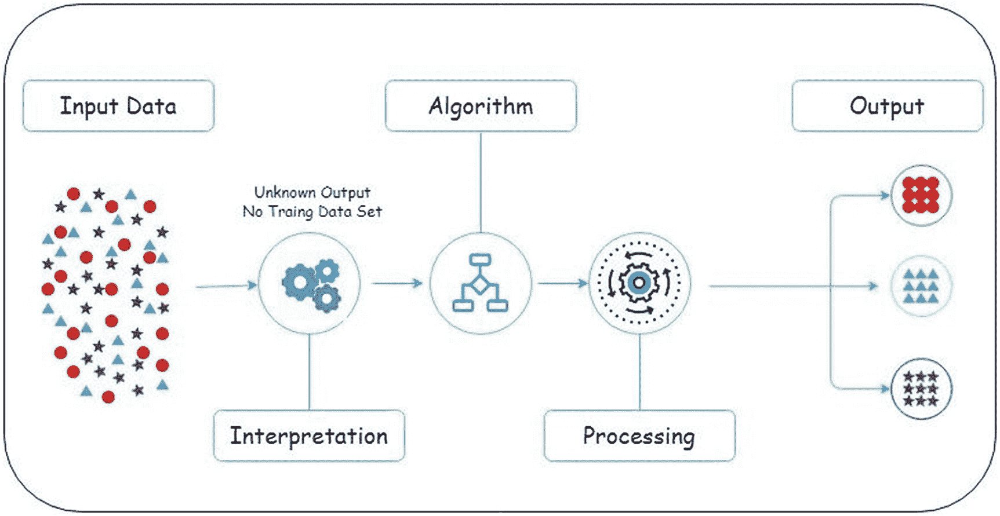

# 四、机器学习导论

本章涵盖两个主要主题。首先，将向您介绍机器学习及其组件，然后，您将了解 AWS 提供的帮助您制作机器学习模型的不同服务。

## 机器学习和人工智能导论

*机器学习*和*人工智能*是现在业界使用频率很高的两个术语。大多数时候，人们认为他们是彼此的同义词，没有太大的区别。然而，它们是不同的。*人工智能*是计算机科学和数学领域，试图模仿类似人类的行为并做出类似人类的决定。*机器学习*可以被认为是人工智能的一个子集，我们让机器通过提供的历史数据进行学习，然后使用学习到的行为来预测结果，如果我们在未来获得类似的信息。因此，机器学习完全是关于预测和建议，而我们让机器像人一样思考的任何事情都是人工智能。

例如，我们与 Alexa 交谈，就像它是一个人。Alpha Zero 机器人可以打败国际象棋冠军，就好像它是一个超级智能的人类一样。汽车现在可以在没有人类帮助的情况下自动驾驶，在路上自己做决定。所有这些都是人工智能代理的例子，因为它们的行为就像人类一样。

当我们试图预测未来六个月的销量，预测一只股票在未来几天是上涨还是下跌，或者猜测机器是否能够理解一段文字的上下文，并对它是负面还是正面谈论某些事情进行分类时，我们谈论的是机器学习。在这里，我们通过提供过去的数据来训练模型，然后机器预测未来输入数据的结果。

我们到底为什么希望机器在日常生活中学习和帮助我们？以下是一些令人信服的原因:

*   作为人类，我们通过从周围环境中学习来做决定。但是我们只能接触到这些信息。此外，作为一个人，在新的场景中犯错的几率很高。这就是为什么我们有这样的说法，“毕竟，我只是一个人。”另一方面，机器可以得到尽可能多的信息。他们可以得到尽可能多的复杂信息。因此，经过训练后，他们可以根据周围的环境做出自己的决定。当然，我们不能让机器独立决策，但它们可以协助人类决策。

*   在过去，人们在制作基于规则的系统。这意味着如果某个场景发生，那么就这样做；否则，就这样做。但是，今天，数据变得越来越复杂，数据的四个 v(数量、准确性、速度和多样性)都达到了顶峰。因此，建立基于规则的系统几乎是不可能的。机器学习系统帮助我们理解这种复杂的非结构化数据并做出决策。

机器学习通过三种类型的学习来解决这些问题。

*   监督学习

*   无监督学习

*   强化学习

### 监督学习

监督学习是机器学习的一个分支，我们确切地知道过去发生了什么，然后我们试图预测如果过去发生的情况再次发生，是否会出现相同的结果。例如，在过去的六年里，我们收集了一些村庄的雨雪数据。具体来说，我们收集了关于湿度、压力、温度等不同的信息。每当下雨或下雪时。我们根据这些数据训练了一个机器学习模型。现在，如果我们知道未来几天的湿度、压力和温度信息，我们能预测会下雨或下雪吗？这是监督学习。

在监督学习术语中，湿度、压力、温度等因素。，被称为*自变量*。我们试图预测的因素，即是否会下雨或下雪，被称为*因变量*。

图 [4-1](#Fig1) 显示了一个监督学习框架。你可以看到有一个监督者检查预测输出是否与预期输出相同。在此基础上进行调整，对于不同的机器学习算法，这种调整是不同的。最后，我们得到我们的预测输出。

图 4-1

监督学习

### 无监督学习

在机器学习的这个分支中，我们没有引导变量，这意味着因变量不存在。因此，无监督学习的主要目的是首先理解数据中存在的模式，然后将遵循类似模式的数据放在同一组中。因此，我们可以拥有具有相似特征的集群，或者我们可以拥有一起购买的相似产品，等等。让我们借助一个例子来理解这一点。

当我们去零售店，比如宜家，我们可以看到很多产品。我们去那里是为了买一件特定的商品。我们也买一些其他物品。在付款时，收银员会要求我们提供手机号码，通过手机号码他们可以识别唯一的客户。现在，因为我们喜欢这个产品，我们又去了商店，买了其他必需品。这家店成了我们最喜欢的一家，三年来我们所有的购物都是在那里完成的。使用无监督的机器学习，现在商店可以利用我们的购买历史，并开始推荐不同的产品。例如，如果我们最近买了窗帘，它可能会建议一些其他装饰项目。

图 [4-2](#Fig2) 显示了无监督学习框架。在此图中，您可以看到在解释部分发现了相似性的隐藏模式，基于此，类似的项目被放在相同的位置，正如我们在输出中看到的那样。

图 4-2

无监督学习

你不仅可以在实体店找到这种例子，在电子商务网站上也可以找到。

### 强化学习

强化学习是机器学习的一个独特领域，机器试图通过分析不同的场景来进行自我学习。这是通过对每一个成功完成任务的机器给予奖励，如果没有完成任务则给予惩罚来实现的。机器的目的是获得尽可能多的奖励。有了这个模型，机器可以自动学习在不同的场景下操作。让我们看一个例子。

一个机器人想学走路。首先提供给它的环境是一条平坦的道路。每成功一步，也许给 50 奖励点，但每跌倒一次，就要扣 100 罚点。机器人迈出第一步就摔倒了，所以受到了处罚。它这样做了多次，并继续下降。最后，它迈了一步，没有摔倒。因此，它会获得奖励积分。这一次，机器人知道它做了什么来获得第一次奖励。现在，它会尽量每次都不掉下来，这样才能获得最大数量的奖励。一旦它训练自己学会走路，环境就可以改变，并且可以引入多个障碍。同样，机器人将开始探索不同的选择，以获得最大的回报。强化学习就是这样发生的。

在强化学习中，有两种方法的结合:探索和利用。*探索*意味着机器人应该查看环境中的多个选项，以便它可以了解当前的每个困难。*剥削*意味着无论机器人做什么，它都必须不断获得最大数量的奖励点数。机器人探索并最大化奖励点，因此它学习如何在艰难的情况下操作。强化学习超出了本书的范围，但是我们将在本书中详细讨论机器学习的其他方面。

图 [4-3](#Fig3) 显示了强化学习过程的样子。

图 4-3

强化学习

还有一种类型的机器学习需要专门讨论:深度学习。

## 深度学习

我们人类到底在想什么？我们如何做决定？很明显，负责的是大脑，但并不完全负责做决定。只有当一些信息到达大脑时，大脑才会执行，但要让这些信息到达大脑，还有一些其他非常小但重要的组件负责。这些被称为*神经元*。他们是第一个接收信息的人，然后通过一系列的神经元，这些信息被传输到大脑，大脑反过来做出决定。这个神经元链被称为*神经网络*或*生物神经网络*。图 [4-4](#Fig4) 显示了一个简单的生物神经元及其组成部分。

图 4-4

生物神经元

数学和计算机专家研究了是否有可能模仿人类接收信息然后做出决定的行为。这项研究导致了人工神经网络领域，它构成了深度学习的主要部分。这些神经网络以类似于生物神经网络的方式运行。它们接收信息，然后通过一系列数学方程，像向前和向后传播、梯度下降、激活函数等。，他们做决定。我们将在本书的后面讨论这个问题。

图 [4-5](#Fig5) 显示了一个人工神经网络，由隐藏层中的多个人工神经元组成。

图 4-5

人工神经网络

现在我们已经看到了机器学习的一般介绍，让我们来探索一下 AWS 帮助用户建立机器学习模型的不同服务。

## AWS 中的机器学习

在本节中，我们将讨论以下 AWS 服务:

*   亚马逊萨格玛克

*   亚马逊理解

*   亚马逊波利

*   亚马逊索赔案

*   亚马逊地面真相

*   亚马逊文本 ct

*   亚马逊翻译

*   亚马逊转录

*   亚马逊 Lex

让我们从探索第一个，也是最重要的服务开始，Amazon SageMaker。

## 亚马逊萨格玛克

亚马逊 SageMaker 是跨行业使用的最重要的服务之一。因此，它是本书所有章节的基础，理解该服务是必不可少的，所以我将给出它与亚马逊的其他机器学习服务相比的详细解释。

机器学习不只是建立一个模型；事实上，根据我的经验，与特征工程、数据准备或模型服务相比，花在模型构建上的时间最少。SageMaker 通过提供可用于准备数据、构建模型、测试模型，然后将其部署到生产环境中的服务，使数据科学家的生活变得更加轻松。它提供了大多数用于构建机器学习模型的通用算法，如果您想要制作 SageMaker 不支持的任何定制模型，那么它可以通过使用自带容器服务来实现。与单节点运行相比，它还提供了一个分布式培训选项，可以使您的模型运行得更快。

亚马逊 SageMaker 具有以下特性:

*   **贤者工作室**

    这是一个应用程序，您可以在其中构建、训练、验证、处理和部署模型。这是一个可以做任何事情的地方。

*   **SageMaker 地面真相**

    这用于创建带标签的数据集。

*   **工作室笔记本**

    这是 SageMaker 的最新功能之一，包括单点登录功能、更快的启动时间和一键式文件共享。

*   **预处理**

    这用于分析和探索数据。它的特点是工程和数据转换，以及为机器学习准备数据所需的所有其他事情。

*   **调试器**

    这有不同的调试用法，例如跟踪在模型训练期间值不断变化的超参数。它甚至可以在参数或数据发生异常时发出警报。

*   **自动驾驶**

    无需编写一行代码，如果您希望 SageMaker 负责您的模型构建，无论是回归还是分类问题，auto-pilot 都是可以使用的特性。一般是针对编码经验较少的用户。

*   **强化学习**

    这提供了运行强化学习算法的接口，该算法在奖励和惩罚架构上运行。

*   **批量转换**

    在构建模型之后，如果您想要获得对数据子集的预测或者想要预处理数据子集，您可以使用 SageMaker 的批量转换特性。

*   **模型监视器**

    这用于检查模型质量是持久的还是偏离了标准模型。

图 4-6

页面制作流程

### 了解 pagemaker 的工作原理

图 [4-6](#Fig6) 显示了 SageMaker 如何工作的逐步过程。

这个图不仅对 SageMaker 有效，对我们做的任何机器学习模型都有效。它们都经历相同的过程。该流程遵循以下主要步骤:

1.  **获取数据**

    这是建立任何机器学习模型的第一步。一旦我们决定了要解决的问题陈述，我们就必须积累与之相关的所有数据。数据可以是数据库表格、Excel 表格、文本文件、Word 文档、图像等格式。一旦我们知道了所有的数据源，这些文件需要放在一个单独的存储库中，这样模型就知道位置了。

2.  **清理数据**

    我们的数据可能包含空值、异常值、拼写错误的单词、损坏的文件等。在将数据提供给模型之前，所有这些事情都需要探索和整理。也有许多统计方法用于数据清理，

3.  **准备数据**

    一旦我们清理了数据，就该准备数据了。这包括对数据进行的所有转换、缩放和标准化过程、特征的组合或特征的分割等。在所有这些事情完成之后，它必须被存储在一个特定的地方，这样模型就知道对干净的和准备好的数据文件的引用。

    我们已经看到的前三个步骤，所有这些都可以在 SageMaker Jupyter 笔记本中完成，之后，清理后的数据可以存储在 S3 存储桶中。

4.  **训练模型**

    准备好数据后，我们需要训练模型。第一件事是选择需要应用的模型。可以从 SageMaker 提供的内置算法列表中选择模型，也可以通过制作自己的容器并上传到 AWS 或从 AWS 市场购买来使用定制模型。

    此外，为了训练模型，我们必须决定需要哪种计算。可以基于 RAM 大小或 GPU 计数的数量等进行选择。这是根据数据集的大小或模型的复杂程度来决定的。

5.  **评估训练好的模型**

    一旦模型在数据集上成功定型，就需要在将其部署用于生产之前对其进行评估。为此，可以使用多个指标。对于回归模型，可以使用 RMSE 分数，而对于分类模型，可以使用精确度和召回率。一旦度量超过了决定的阈值，只有到那时它才能走向生产。

6.  **将模型部署到生产中**

    在 SageMaker 中部署模型很容易。一般来说，在正常场景中，人们必须制作 API，然后通过端点为模型提供服务。对于所有这些，编码需求是必要的。但是，在 SageMaker 中，只需很少的编码工作，就可以将模型转换成 API 端点，然后就可以开始实时或批量模型推理。此外，为了部署模型，可以选择另一个计算实例，与训练模型实例相比，该实例通常占用较少的 RAM 或 GPU。

7.  **监控模型**

    一旦模型开始在生产中服务，我们可以继续监控模型的性能。我们可以衡量模型在哪些数据点上表现良好，以及在哪些方面表现不佳。这个过程叫做了解*地面真相*。

8.  **当更多数据到来时重复该过程(再训练)**

    最后，当新数据到来时，可以重新训练模型，并重复所有先前的步骤。所有这些都可以在零停机时间内完成。这意味着旧型号一直服役到新型号投产。

### pagemaker 中数据的预处理

正如我们在上一节中所讨论的，在我们将数据提供给任何模型之前，我们首先对其进行清理和预处理。我们可以通过多种方式在 SageMaker 中做到这一点。

*   使用 SageMaker Jupyter Notebook 编写 Python 脚本处理数据

*   在得到推论之前，使用 SageMaker 批处理转换脚本处理数据

*   使用脚本处理器对数据编写处理脚本

使用这些方法中的一种，可以处理数据，然后可以调用任何 SageMaker 训练模型对处理后的数据进行训练。为此，我们可以使用流行的 Python 库，如 Scikit-Learn 或 TensorFlow。如果你的脚本包含了一些其他的库，那么你可以在 Docker 容器中上传你自己的脚本。在后面的章节中你会学到更多。

### pagemaker 中的模型培训

图 [4-7](#Fig7) 显示了模型训练和模型部署是如何进行的。在本节中，我们将讨论培训部分，而在下一节中，我们将讨论部署部分。

图 4-7

pagemaker 培训和部署流程

为了理解 SageMaker 中的模型训练是如何工作的，我们将查看图像的底部。我们可以看到，它由五个部分组成。

*   训练数据的 S3 桶

*   助手代码

*   培训代码

*   训练代码图像

*   模型工件的 S3 桶

在 SageMaker 中训练一个模特被称为*训练工作*。在 SageMaker 中执行的任何算法都要求训练数据存在于 S3 桶中。这是因为用于训练模型的计算实例是在模型执行期间动态调用的，并且它们不是持久的。这意味着一旦作业完成，存储在那里的数据将被删除。因此，我们可以将数据保存在 S3，模型将通过 S3 URL 知道从哪里获取数据。

用 Python 编写的编码部分由两部分组成。第一部分，助手代码，帮助您处理数据、获取数据、存储输出等。第二部分，训练代码，实际上是通过对数据应用选定的算法来为您进行模型训练。

训练代码映像是一个 Docker 容器映像，存储在 AWS 的 ECR 中。它包含执行代码所需的所有包和软件。它还包含您编写的培训和部署脚本。我们将所有需要的东西打包在一个集装箱内，并推送到 ECR。然后，我们只需将图像的 URL 传递给所选的算法，训练脚本就会自动运行。我们需要理解 SageMaker 是基于 Docker 容器工作的，因此用户在学习 SageMaker 之前必须了解 Docker。

最后，一旦模型训练完成，与模型相关的参数值应存储在 S3 中；如上所述，一旦训练工作完成，计算实例将被删除，因此我们将丢失所有已学习的参数。这就是为什么 S3 成为储存所有信息的公共点。

这里需要注意的一点是，Docker 映像是由您构建的，但是我们仍然没有选择硬件要求。因此，当我们调用 SageMaker 算法并传递 S3 URL 和 Docker 图像 URL 等参数时，我们只能传递我们必须选择的实例类型。这些实例就是我们在第 [1](01.html) 章中看到的 EC2 实例。一旦我们选择了实例，Docker 映像就会和训练数据一起下载到该实例上。最后，模型训练开始。

在接下来的章节中，我们将会看到在 SageMaker 中训练模型的所有这些方面。

### pagemaker 中的模型部署

一旦模型训练完成，所有学习到的参数都存储在 S3 桶中，并被称为*模型工件*。这些模型工件将在推断(或预测)过程中使用。图 [4-7](#Fig7) 中底部为模型训练部分；现在我们将讨论上面的部分，也就是模型部署部分。它由以下部分组成:

*   S3 桶中模型工件的 URL 引用

*   助手和推理代码

*   推理代码图像

*   端点

*   客户

助手和推理代码由处理脚本和预测脚本组成。此外，它还包括需要发送或保存预测的格式。对于预测，使用在训练部分期间生成的模型工件。

SageMaker 将培训计算需求与部署计算需求一起删除。这是因为训练可能需要具有更强计算能力的大实例，但是对于预测，我们不需要那么多大实例。因此，预测也可以用较小的实例来完成。这有助于节省大量成本。

我们可以使用为训练推理模型而构建的同一个 Docker 映像，只需添加一些额外的 Python 脚本来帮助部署。这可能包括使用包装，如烧瓶，Gunicorn 等。要开始部署，我们需要传递模型工件 URL、ECR 图像 URL 和我们需要的计算实例。通过给出这三个参数，就完成了部署，并创建了一个端点。

端点是我们以特定格式(可能是 CSV 或 JSON)发送请求并从模型获得响应的地方。这被称为 RESTful API。创建的模型通过这个 API 提供服务，我们需要预测的数据以 CSV 格式逐行发送，我们以同样的方式获得预测。这些是 POST 和 GET 请求。我们可以向任何客户端对象公开这个端点。它可以是一个网站，一个移动应用程序，一个 IOT 设备，或者其他任何东西。我们只需要将一些记录发送到端点并获得预测。

当我们进行实时预测时，会用到端点。因此，它们会一直运行，直到我们手动停止它们或添加超时条件。但是假设我们想要对数据子集的预测，可能是 5000 行，并且我们不想要一个活动的端点。然后 SageMaker 支持一种叫做*批处理转换*的东西。使用这种方法，我们提供了与部署代码相同的参数，但是提供了一个额外的参数。它是到需要推断的数据的链接。该数据再次存储在 S3，因此在需要预测时下载到实例中。预测完成后，预测会存储在 S3 中，然后计算实例会立即停止。图 [4-8](#Fig8) 显示了 SageMaker 中批量转换的过程。

图 4-8

成批处理

在接下来的章节中，我们将会看到端点生成和批量转换这两种方法。

### 内置 SageMaker 算法

以下是 SageMaker 提供的所有算法:

*   **炽热的文字**

    该算法用于涉及文本分类的问题陈述。它是 Word2Vec 算法的优化版本，可用于多种任务，如情感分析、命名实体识别等。

*   **深度预测**

    该算法应用于基于 RNNs 的单变量时间序列预测领域。它可用于对多个相似的时间序列数据进行训练，在大多数情况下，它优于 ARIMA 或指数平滑方法。

*   **因式分解机**

    这是一种通用算法，可用于回归和分类任务。对于分类，它只支持二元分类问题。

*   **图像分类**

    这是建立在 ResNet (CNN 模型)上的，用于图像的多标签分类。如果可用的数据集很大，可以从头开始训练；否则，如果数据集的大小很小，可以应用迁移学习。

*   **知识产权洞察**

    该算法用于一个特殊的用例—查找 IPv4 地址的使用模式。它可以用来发现用户发送请求的 IP 地址是否异常。

*   **K-表示**

    该算法用于查找遵循相似模式的数据聚类。它是统计 k 均值聚类算法的优化版本。

*   **K-最近邻**

    它通过使用查找最近邻的方法来对数据进行分类。它是 k-最近邻统计算法的优化版本。

*   **潜在狄利克雷分配**

    这是一种用于找出文档中存在的主题的算法，因此应用领域也被称为*主题建模*。这是一种无监督的学习方法，用于从一堆文档中找出类别。

*   **线性学习者**

    是一种普通的简单多元线性回归算法，能够对分类问题执行逻辑回归。

*   **神经主题模型**

    这又是一种主题建模方法，通过找出它们的统计分布，从一堆文档中提取主题。该算法可用于文本摘要或推荐领域。

*   **Object2Vec**

    这用于为对象生成向量，它类似于 Word2Vec 算法。唯一的一点是，它是它的一般化版本。使用这种方法，可以进行大量优化和高效的分类和回归，从而为我们提供更好的性能。

*   **物体检测**

    该算法的主要任务是发现和识别图像中存在的物体。它包含一个单一的深度神经网络来执行这一操作。该模型中使用的框架是单触发多盒检测器(SSD ),并使用 VGGNet 和 ResNet 作为基础。

*   **主成分分析**

    这是基于找到变量的重要性，然后基于相似性组合变量。它用于数据的降维，以便可以基于使用特征值和特征向量的概念组合变量的重要性来减少变量的数量。

*   **随意砍伐森林**

    该算法用于发现数据集中存在的模式，然后发现那些偏离数据集中存在的所有一般模式的模式。例如，为什么时序数据中会出现不必要的尖峰？为什么一个特定的数据点不能被分类？这些是随机采伐森林方法的多种用途中的几个。

*   **语义分割**

    这用于开发计算机视觉应用程序。这是一种像素级方法算法，其中每个像素都根据数据进行标记。它可以用于自动驾驶汽车、医学成像等领域。

*   **SeqtoSeq 建模**

    当我们有一个输入序列，并且我们必须生成一个输出序列时，就会用到这种方法。例如，我们可能有德语输入序列，需要将该序列翻译成英语。同样，它可以用于时序数据、图像和其他文本应用程序。该算法使用基于注意力的方法的 RNNs 和 CNN。

*   **XGBoost**

    这是系综树的高度优化版本之一，它使用梯度推进方法的概念，并利用多线程和多处理的能力来对数据集进行令人敬畏的推理。这是最常用的算法之一，不仅在 SageMaker 中，在其他地方也是如此。

在接下来的章节中，我们将会看到这些算法的大部分及其实际实现。

### pagemaker 中的自定义算法

在上一节中，我们看到了 SageMaker 支持的不同算法。但是如果你想使用 SageMaker 不支持的不同算法呢？例如，如果您想使用 BERT 模型，而不是炽热的文本，该怎么办？在这种情况下，我们可以使用定制的 Docker 图像，在 SageMaker 的术语中，这被称为*自带模型*。正如您前面看到的，我们需要的只是一个用于训练和推理的 Docker 映像、S3 桶中的训练文件、输出 S3 桶位置等。因此，要让您的定制模型在 SageMaker 中运行，您必须遵循以下步骤:

1.  编写培训脚本。

2.  在 Docker 中安装了所有重要的包之后，测试 Docker 容器中的训练脚本。

3.  在 Docker 中编辑推理脚本。这可能是用 Python 和 Flask 编写的脚本。

4.  测试推理脚本。

5.  一旦一切正常，就将 Docker 映像以及训练和推理脚本推送到 ECR 上。

6.  现在可以通过传递 ECR 的 URL 来调用这个算法。

在接下来的章节中，我们将会看到如何在 SageMaker 中创建一个自定义算法。

SageMaker 中还有很多其他特性，我们将在本书中继续讨论。但是，现在，这个介绍就足够了。在接下来的章节中，我们将深入探讨 SageMaker 以及如何执行其中的代码和算法。

现在让我们探索一下除了 SageMaker 之外，AWS 提供的其他一些机器学习服务。

## AWS 的其他机器学习服务

让我们从 Amazon understand 开始，这是一个致力于 AWS 中文本分析的服务。

### 亚马逊理解

Amazon understand 是 AWS 为 NLP 相关任务提供的服务。如果一家公司有一组文档，并且需要从这些文档中提取一些内容，以便得出特定的见解，那么 Amazon understand 就是可以使用的服务。同样的任务也可以在 SageMaker 中完成，但是 understand 需要的编码最少。对于编码经验较少的人来说，这是一个理想的解决方案。以下是可以从文档中提取的关键元素:

*   实体，如组织、地点、名称等。

*   文档中的关键短语

*   句子的语言和情感

*   句子的句法和句法结构

除了这些功能之外，还可以构建自定义分类器，根据相似性将文档分类。此外，除了可以提取的默认实体之外，还可以从文档中提取自定义实体。这可以通过训练亚马逊理解的基础模型来实现。Amazon understand 的所有 NLP 任务都有一个神经网络基础。这意味着所有执行的任务都是基于深度学习的，也可以定制。

此外，当我们可以根据单词的频率和分布找到所有文档中的关键主题时，我们可以使用 Amazon understand 进行主题建模。对于这项任务，Amazon 建议至少使用 1000 个文档。

### 亚马逊波利

亚马逊 Polly 是 AWS 为语音合成提供的服务。无论你给波利什么文本，它都会被转换成栩栩如生的语言。它支持多种语言，可以根据我们选择的声音进行定制。亚马逊 Polly 的基础是神经网络，就像 comprehension 一样。它被称为*神经文本到语音* (NTTS)模型。这就是为什么 Polly 比它的竞争对手拥有最像人类的声音。

Polly 的发音准确度超高，包括缩写、缩略词扩展、日期/时间解释；它还支持同形异义词歧义消除。这意味着单词拼写相同，但根据它们在句子中的用法意思不同，Polly 也能理解。这个过程被称为*上下文感知分析*。

Polly 提供男声和女声，支持三种英式英语语音和八种美式英语语音。Polly 甚至支持听起来像新闻播音员的声音。

### 亚马逊索赔案

Amazon Rekognition 用于理解图像或视频中存在的对象，然后提取它们。对象可以包括人、文本、场景、活动、不适当的内容等。它具有面部分析、面部比较和面部搜索的能力。和其他服务一样，亚马逊 Rekognition 有一个深度学习的后端，用神经网络来理解模式。

Amazon Rekognition 的开发正在进行中，这意味着数据会不断更新并提供给模型，标签数量会不断增加。这意味着对于不同的类别，模型的准确性不断提高。Amazon Rekognition 的一些常见用例如下:

*   在图像或视频中搜索对象的存在

*   使用基于面部特征的认证

*   理解快乐、悲伤、热情等情绪表达。

*   使用人口统计信息，如性别、地点、类型等。

*   检测视频或图像中出现的成人和暴力内容

*   从图像中识别和提取文本内容

如果与问题陈述相关的特定数据集需要，我们还可以在自定义标签上训练 Amazon Rekognition。

### 亚马逊翻译

机器翻译是自然语言处理的应用之一，我们将一种语言翻译成另一种语言。亚马逊已经为这个用例提供了完全专用的服务，支持从多种语言到多种语言的神经机器翻译。它叫做亚马逊翻译。

该服务基于类似于 BERT 和其他语言模型的编码器-解码器架构。这里，首先使用编码器架构理解输入语言，然后使用解码器架构完成翻译任务。它还使用了一种叫做*注意力层*的东西，试图通过理解单词之间的关系来理解句子的上下文。将所有这些东西与长短期记忆(LSTM)这样的神经网络结合起来，就实现了翻译的过程。

### 亚马逊转录

当我们有多个音频文件，并且希望将剪辑中的内容转换成文本时，我们可以使用 Amazon Transcribe。它有多个应用程序，包括一些其他亚马逊服务的组合。以下是一些例子:

*   新闻剪辑可以首先使用 Transcribe 从语音转换为文本，然后使用 Translate 转换为您选择的语言，最后使用 Polly 大声读出。

*   客服电话可以录音转录。最后，理解可以用来理解转录文本的不同方面。

*   它可以用来提供实时字幕。

亚马逊转录可以用来根据声音识别说话者。它可以用来区分提问者和回答者，应该是在一个录制的新闻发布会上。此外，如果你觉得转录是不能够理解一些单词，那么你可以通过提供一个自定义词汇来增加转录的词汇量。

### 亚马逊文本 ct

Amazon Textract 用于检测 PDF 格式或图像格式的文档中的文本。它还可以从表格数据或其他类型的文档格式中提取信息，包括财务报告提取、医疗记录提取等应用程序。像其他服务一样，Textract 也建立在深度神经网络架构上，通过访问超过 10 亿张图像和视频，权重几乎每天都在更新。Textract 还可以用于从表单、CSV 表、网站等中提取数据。

## 结论

在本章中，您了解了 AWS 的特定于机器学习的概述。在下一章中，我们将研究使用 SageMaker 的数据处理，并探索其他服务，这将有助于我们进行数据处理。