# 五、自动气象站的数据处理

数据处理是机器学习流水线的第一步。由于不同的数据源有不同的格式，在模型中处理所有的格式几乎是不可能的。因此，我们给数据一个同步结构，然后我们尝试处理它的不同的不需要的部分。这些部分包括空值、异常值、分类列的实体模型化、数字列的标准化等。我们可以使用 SageMaker 有效地处理所有这些领域的数据。本章假设您了解不同的数据处理技术及其在 Python 中的实现。本章将致力于使用 SageMaker 来做这件事。

## Jupyter 笔记本中的预处理

在接收原始数据和将数据输入模型之间，数据要经过许多步骤。这些步骤是数据处理步骤。数据处理包括特征选择、特征变换、特征插补、特征归一化等。完成所有这些步骤后，我们继续将数据分为训练集和验证集，最终将它们提供给模型。

在本节中，我们将了解一些可以遵循的基本数据处理步骤。

1.  加载原始数据

2.  输入空值，这意味着如何用一些实际值替换空值。

3.  将数据分为分类数据框和数字数据框

4.  “伪化”分类数据

5.  输入剩余的空值

6.  连接分类数据框和数字数据框

7.  归一化最终数据帧

8.  将数据分为训练集和验证集

本章假设您已经掌握了关于熊猫、Numpy 和 Scikit-Learn 的实践知识。这些包是数据处理步骤所必需的。如果没有，那么建议您在继续学习 SageMaker 之前研究这些包，获得一些实践经验。

我们将用于处理的数据集是 Big Mart 销售数据集，可以通过 [`www.kaggle.com/devashish0507/big-mart-sales-prediction`](http://www.kaggle.com/devashish0507/big-mart-sales-prediction) 从 Kaggle 下载。

该数据集包含大量与零售商店商品销售相关的信息。任务是预测商品的销售。在这一章中，我们将不看预测部分。相反，我们将只探索该过程的数据处理部分。让我们从使用 Pandas 框架读取 train 文件开始。

```py
import pandas as pd
data = pd.read_csv("Train.csv")

```

现在，整个 CSV 表的列保存在名为`data`的数据框对象中。接下来，让我们探索数据集的前五行。

```py
data.head()

```

这将为我们提供如图 [5-1](#Fig1) 所示的输出。

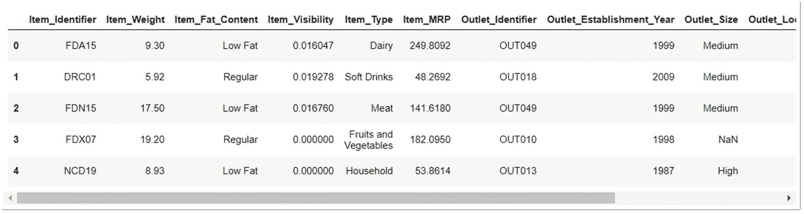

图 5-1

前五行数据

如您所见，还有许多其他列没有显示在图 [5-1](#Fig1) 中。那么，让我们看看数据的形状以及所有列的列表。

```py
print(data.shape)
print("*****************************************************************")
print(data .columns)

```

这给了我们如图 [5-2](#Fig2) 所示的输出。

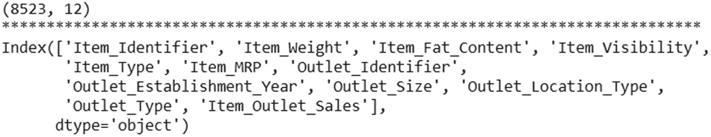

图 5-2

数据和列的形状

如我们所见，有 8，523 行和 12 列。此外，我们可以看到给定列表中所有列的名称。

正如我们在处理步骤中看到的，下一步是估算空值。那么，让我们看看所有具有空值的列。

```py
data.isna().sum()

```

这段代码给出了如图 [5-3](#Fig3) 所示的输出。


图 5-3

空值探索

因此，有两列的值为空:`Item_Weight`和`Outlet_Size`。我们可以使用 Scikit-Learn 提供的正常插补方法来插补这些空值。但是，相反，我们将使用附近列的帮助来填充这些空值。让我们看看这些列的数据类型，因为这将有助于我们制定插补策略。

```py
print(data['Item_Weight'].dtype)
print(data['Outlet_Size'].dtype)

```

输出显示`Item_Weight`列是一个浮点数，而`Outlet_Size`列是分类的(或者是一个对象)。我们将首先估算`Item_weight`列。如果我们找到`Item_Weight`的平均值，并按`Item_Type`分组，那么我们可以看到不同的项目类型有不同的平均值。见图 [5-4](#Fig4) 。

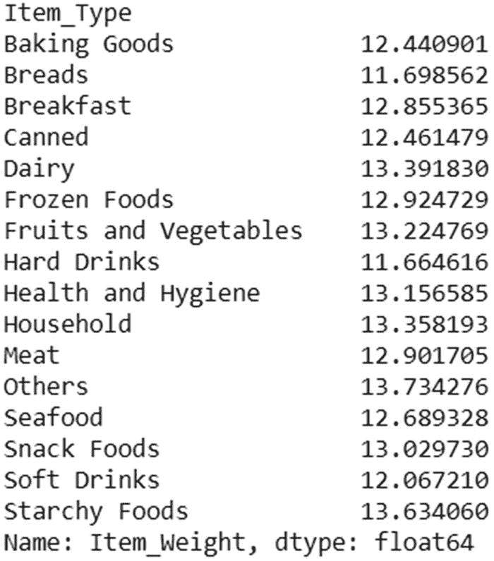

图 5-4

基于项目类型的项目重量平均值

```py
data.groupby(['Item_Type']).mean()['Item_Weight']

```

查看输出，我们能做的是使用`Item_Type`的平均值估算`Item_Weight`的所有空值。这可以通过执行以下代码行来实现:

```py
for i in data.Item_Type.value_counts().index:
    data.loc[(data['Item_Weight'].isna()) & (data['Item_Type'] == i), ['Item_Weight']] = \
    data.loc[data['Item_Type'] == 'Fruits and Vegetables', ['Item_Weight']].mean()[0]

```

现在，如果我们再次检查空值，我们得到图 [5-5](#Fig5) 。

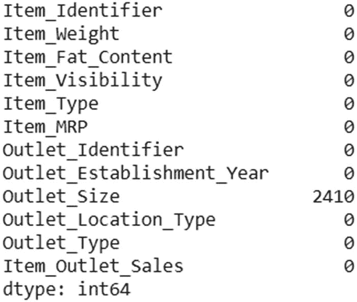

图 5-5

删除了数字空值

因此，我们成功地估算了`Item_Weight`列的空值。对于`Outlet_Size`，我们接下来要做的是首先将数据分成数字和分类数据框架，然后输入空值。

```py
import numpy as np
cat_data = data.select_dtypes(object)
num_data = data.select_dtypes(np.number)

```

现在我们有了`cat_data`中所有的分类列。我们可以再次检查空值的存在。见图 [5-6](#Fig6) 。

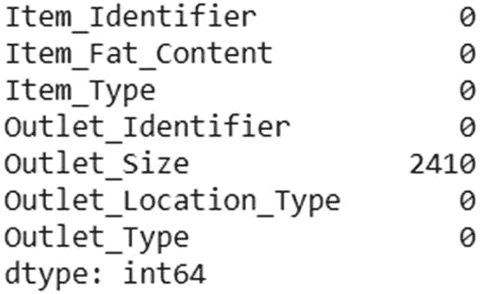

图 5-6

分类数据空值

```py
cat_data.isna().sum()

```

所以，空值仍然存在。如果我们看一下`Outlet_Size`列中的类别，我们会看到有三个。见图 [5-7](#Fig7) 。

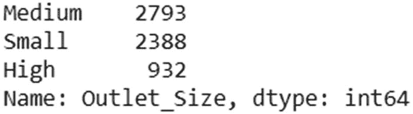

图 5-7

类别及其数量

```py
cat_data.Outlet_Size.value_counts()

```

但是，如果我们基于`Outlet_Type`来查看这些类别的计数，那么它看起来就像图 [5-8](#Fig8) 。

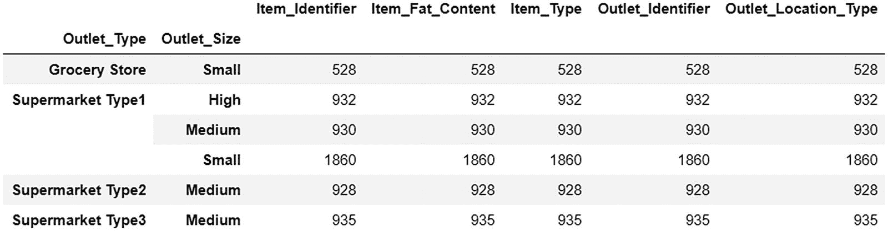

图 5-8

根据类型对插座尺寸进行分组

```py
cat_data.groupby(['Outlet_Type','Outlet_Size']).count()

```

在该图中，我们可以看到杂货店的最大`Small`网点大小，超市类型 1 的最大`Small`，超市类型 2 和超市类型 3 的最大`Medium`。因此，我们将根据插座类型相应地估算空值。

```py
cat_data.loc[(cat_data['Outlet_Size'].isna()) & (cat_data['Outlet_Type'] == 'Grocery Store'), ['Outlet_Size']] = 'Small'
cat_data.loc[(cat_data['Outlet_Size'].isna()) & (cat_data['Outlet_Type'] == 'Supermarket Type1'), ['Outlet_Size']] = 'Small'
cat_data.loc[(cat_data['Outlet_Size'].isna()) & (cat_data['Outlet_Type'] == 'Supermarket Type2'), ['Outlet_Size']] = 'Medium'
cat_data.loc[(cat_data['Outlet_Size'].isna()) & (cat_data['Outlet_Type'] == 'Supermarket Type3'), ['Outlet_Size']] = 'Medium'

```

我们现在可以检查空值进行确认。参见图 [5-9](#Fig9) 。

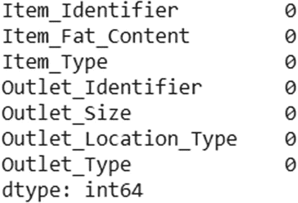

图 5-9

删除所有空值

最后，所有的空值都已被成功删除。记住，我们可以用熊猫的`fillna()`方法来做同样的事情。此外，我们可以使用不同的其他方法来估算值，如后向填充、前向填充、插值等。你可以自己尝试所有这些方法。

既然我们已经处理了所有的空值，我们将在进行实体模型化之前做最后一件事。如果我们查看`Item Fat Content`列的类别，我们会发现相同的值以不同的方式出现。见图 [5-10](#Fig10) 。

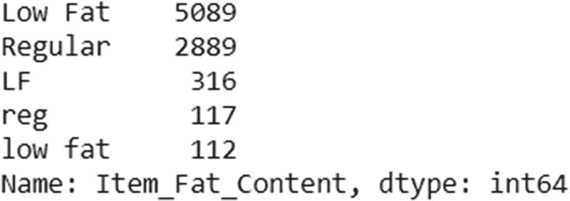

图 5-10

复制

```py
cat_data.Item_Fat_Content.value_counts()

```

`LF`表示低脂，`reg`表示普通，`low fat`只是低脂的小写版本。让我们纠正这一切。

```py
cat_data.loc[cat_data['Item_Fat_Content'] == 'LF' , ['Item_Fat_Content']] = 'Low Fat'
cat_data.loc[cat_data['Item_Fat_Content'] == 'reg' , ['Item_Fat_Content']] = 'Regular'
cat_data.loc[cat_data['Item_Fat_Content'] == 'low fat' , ['Item_Fat_Content']] = 'Low Fat'

```

现在，我们将看到图 [5-11](#Fig11) 中所示的值。

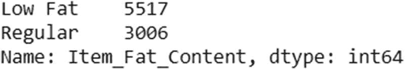

图 5-11

删除重复项

所以，这个任务成功完成了。接下来，让我们对分类数据框应用标签编码。为此，我们将使用 Scikit-Learn 包。

```py
from sklearn.preprocessing import LabelEncoder
le = LabelEncoder()
cat_data = cat_data.apply(le.fit_transform)

```

输出结果如图 [5-12](#Fig12) 所示的数据帧。

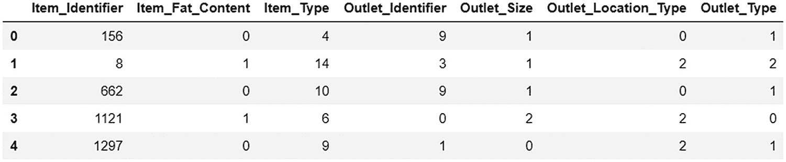

图 5-12

标签编码输出

```py
cat_data.head()

```

我们将连接两个数据框架，分类的和数字的，然后标准化列。此外，我们将删除之前的两列，一列在`Item_Identifier`中，另一列在`Item_Sales`中。`Item_Identifier`不是真正重要的列，而`Item_Sales`将是我们的因变量；因此，它不能在独立变量列表中。见图 [5-13](#Fig13) 。

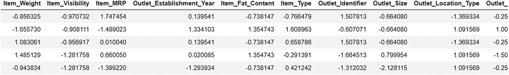

图 5-13

标准缩放输出

```py
from sklearn.preprocessing import StandardScaler
ss = StandardScaler()

num_data = pd.DataFrame(ss.fit_transform(num_data.drop(['Item_Outlet_Sales'], axis=1)), columns = num_data.drop(['Item_Outlet_Sales'],axis=1).columns)

cat_data = pd.DataFrame(ss.fit_transform(cat_data.drop(['Item_Identifier'], axis=1)), columns = cat_data.drop(['Item_Identifier'], axis=1).columns)

final_data = pd.concat([num_data,cat_data],axis=1)
final_data.head()

```

现在，我们已经准备好了最终数据。我们使用了一个标准的 scaler 类来将所有数值标准化为它们的 z 分数。我们将使用`final_data`作为自变量，而我们将提取`Item Sales`作为因变量。

```py
X = final_data
y = data['Item_Outlet_Sales']

```

最后一步是获取我们的训练集和验证集。为此，我们将使用 Scikit-Learn 提供的类`model_selection`。我们将把 10%的数据作为验证集，而剩下的作为测试集。

```py
from sklearn.model_selection import train_test_split
X_train, X_test, y_train, y_test = train_test_split(X, y, test_size = 0.1, random_state=5)

```

这标志着数据处理的最后一步。现在我们可以用它来训练任何我们想要的模型。我展示的代码行可以在任何 Jupyter 笔记本中执行，无论是在本地主机还是在云中。唯一的要求是必须安装必要的软件包。

在下一节中，我将向您展示如何使用 SageMaker 服务提供的 Scikit-Learn 容器在 SageMaker 中运行相同的代码。脚本保持不变，但是过程发生了变化，因为我们必须不断地与 S3 桶对话，并且还要定义实例。我们将在下一节详细探讨这一点。

## 使用 SageMaker 的 Scikit-Learn 容器进行预处理

我们使用 SageMaker 来利用多种优势，尤其是计算能力、API 生成和易于存储。因此，要实现这些事情，代码必须以特定的格式编写。我们将使用前一节中看到的相同代码，但是我们将对整体结构进行一些更改，以便它与 SageMaker 兼容。

首先，数据应该在 S3 桶中。在本章的第一节，我们已经把我们的`Train.csv`文件放进了桶里。一旦完成，我们就可以开始写代码了。首先，我们将定义用户的角色和使用 SageMaker 服务的地区。

```py
import boto3
import sagemaker
from sagemaker import get_execution_role

region = boto3.session.Session().region_name
role = get_execution_role()

```

如果我们使用 SageMaker 笔记本，Boot3 包会尝试自动提取地区名。如果我们从本地主机笔记本工作，那么它需要自定义。我们将在本书的最后一部分讨论这一部分。`get_execution_role()`提取用户登录的当前角色。它可以是 root 用户或 IAM 角色。

既然我们已经定义了区域和角色，下一步将是定义我们的 Scikit-Learn 容器。正如在本书的第一部分中提到的，SageMaker 在 Docker 容器上运行。所有内置的算法都不过是 Docker 容器，甚至自定义的算法也必须放在 Docker 容器里面，上传到 ECR。由于我们将使用 Scikit-Learn 来处理我们的数据，SageMaker 已经有了一个处理容器。我们只需要实例化它，然后使用它。

```py
from sagemaker.sklearn.processing import SKLearnProcessor
sklearn_processor = SKLearnProcessor(framework_version='0.20.0',
                    role=role,
                    instance_type='ml.m5.xlarge',
                    instance_count=1)

```

在前面的代码中，我们创建了一个名为`SKLearnProcessor`的对象。传递的参数告诉我们 Scikit-Learn 使用的版本、要传递给实例的 IAM 角色、要使用的计算实例的类型，以及最后要启动的计算实例的数量。一旦完成，我们编写的任何使用 Scikit-Learn 的 Python 脚本都可以在这个容器中使用。

现在，让我们检查我们的数据是否可以从 SageMaker 访问。

```py
import pandas as pd
input_data = 's3://slytherins-test/Train.csv'
df = pd.read_csv(input_data)
df.head()

```

`slytherins-test`是我们在本章前面创建的 S3 存储桶的名称。`Train.csv`是我们上传的数据。如果一切正常，你将得到如图 [5-14](#Fig14) 所示的输出。

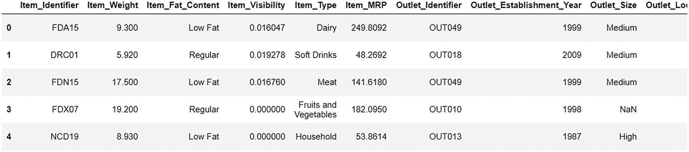

图 5-14

数据概述

如果您遇到任何错误，请确保 bucket 和数据已经被授予公共访问权限。我们在本书的前一部分已经谈到了这一点。

现在，是时候定义将在容器内部运行的处理脚本了。我们已经在前一部分写了这个脚本。我们将重新构建代码，并将其保存在一个名为`preprocessing.py`的文件中。

```py
import argparse
import os
import warnings
import pandas as pd
import numpy as np
from sklearn.model_selection import train_test_split
from sklearn.preprocessing import StandardScaler, LabelEncoder
from sklearn.exceptions import DataConversionWarning
warnings.filterwarnings(action='ignore', category=DataConversionWarning)

# Here we have defined all the columns that are present in our data
columns = ['Item_Identifier', 'Item_Weight', 'Item_Fat_Content', 'Item_Visibility',
'Item_Type', 'Item_MRP', 'Outlet_Identifier',
'Outlet_Establishment_Year', 'Outlet_Size', 'Outlet_Location_Type',
'Outlet_Type', 'Item_Outlet_Sales']

# This method will help us in printing the shape of our data
def print_shape(df):
    print('Data shape: {}'.format(df.shape))

if __name__=='__main__':
    # At the time of container execution we will use this parser to define our train validation split. Default kept is 10%
    parser = argparse.ArgumentParser()
    parser.add_argument('--train-test-split-ratio', type=float, default=0.1)
    args, _ = parser.parse_known_args()

    print('Received arguments {}'.format(args))

    # This is the data path inside the container where the Train.csv will be downloaded and saved
    input_data_path = os.path.join('/opt/ml/processing/input', 'Train.csv')

    print('Reading input data from {}'.format(input_data_path))
    data = pd.read_csv(input_data_path)
    data = pd.DataFrame(data=data, columns=columns)
    for i in data.Item_Type.value_counts().index:
        data.loc[(data['Item_Weight'].isna()) & (data['Item_Type'] == i), ['Item_Weight']] = \
        data.loc[data['Item_Type'] == 'Fruits and Vegetables', ['Item_Weight']].mean()[0]

    cat_data = data.select_dtypes(object)
    num_data = data.select_dtypes(np.number)

    cat_data.loc[(cat_data['Outlet_Size'].isna()) & (cat_data['Outlet_Type'] == 'Grocery Store'), ['Outlet_Size']] = 'Small'
    cat_data.loc[(cat_data['Outlet_Size'].isna()) & (cat_data['Outlet_Type'] == 'Supermarket Type1'), ['Outlet_Size']] = 'Small'
    cat_data.loc[(cat_data['Outlet_Size'].isna()) & (cat_data['Outlet_Type'] == 'Supermarket Type2'), ['Outlet_Size']] = 'Medium'
    cat_data.loc[(cat_data['Outlet_Size'].isna()) & (cat_data['Outlet_Type'] == 'Supermarket Type3'), ['Outlet_Size']] = 'Medium'

    cat_data.loc[cat_data['Item_Fat_Content'] == 'LF' , ['Item_Fat_Content']] = 'Low Fat'
    cat_data.loc[cat_data['Item_Fat_Content'] == 'reg' , ['Item_Fat_Content']] = 'Regular'
    cat_data.loc[cat_data['Item_Fat_Content'] == 'low fat' , ['Item_Fat_Content']] = 'Low Fat'

    le = LabelEncoder()
    cat_data = cat_data.apply(le.fit_transform)
    ss = StandardScaler()
    num_data = pd.DataFrame(ss.fit_transform(num_data), columns = num_data.columns)
    cat_data = pd.DataFrame(ss.fit_transform(cat_data), columns = cat_data.columns)
    final_data = pd.concat([num_data,cat_data],axis=1)

    print('Data after cleaning: {}'.format(final_data.shape))

    X = final_data.drop(['Item_Outlet_Sales'], axis=1)
    y = data['Item_Outlet_Sales']

    split_ratio = args.train_test_split_ratio
    print('Splitting data into train and test sets with ratio {}'.format(split_ratio))
    X_train, X_test, y_train, y_test = train_test_split(X, y, test_size=split_ratio, random_state=0)

    # This defines the output path

inside the container from where all the csv sheets will be taken and uploaded to S3 Bucket
    train_features_output_path = os.path.join('/opt/ml/processing/train', 'train_features.csv')
    train_labels_output_path = os.path.join('/opt/ml/processing/train', 'train_labels.csv')
    test_features_output_path = os.path.join('/opt/ml/processing/test', 'test_features.csv')
    test_labels_output_path = os.path.join('/opt/ml/processing/test', 'test_labels.csv')
    print('Saving training features to {}'.format(train_features_output_path))
    pd.DataFrame(X_train).to_csv(train_features_output_path, header=False, index=False)
    print('Saving test features to {}'.format(test_features_output_path))
    pd.DataFrame(X_test).to_csv(test_features_output_path, header=False, index=False)
    print('Saving training labels to {}'.format(train_labels_output_path))
    y_train.to_csv(train_labels_output_path, header=False, index=False)
    print('Saving test labels to {}'.format(test_labels_output_path))
    y_test.to_csv(test_labels_output_path, header=False, index=False)

```

我们可以看到，前面的代码和本书前面部分的代码是一样的；我们所做的就是定义数据在容器中的存储位置和输出的存储位置，然后从那里上传到 S3 存储桶。一旦这个脚本被定义，我们就可以开始了。我们所要做的就是启动实例化的容器，将这个脚本作为参数传递，将数据作为参数传递，传递输出文件将被存储的目录，最后传递目的地 S3 桶。

```py
from sagemaker.processing import ProcessingInput, ProcessingOutput
sklearn_processor.run(code='preprocessing.py',
           inputs=[ProcessingInput(
           source=input_data,
           destination='/opt/ml/processing/input')],

           outputs=[ProcessingOutput(output_name='train_data',
                     source='/opt/ml/processing/train',
                     destination='s3://slytherins-test/'),
                  ProcessingOutput(output_name='test_data',
                     source='/opt/ml/processing/test',
                     destination='s3://slytherins-test/')],

           arguments=['--train-test-split-ratio', '0.1']
                        )

```

在前面的代码中，我们已经传递了所有的参数。此外，我们已经定义了关于分割百分比的参数。在`preprocessing.py`脚本中，我们有解析这个参数的代码。

图 [5-15](#Fig15) 显示了接下来会发生什么。

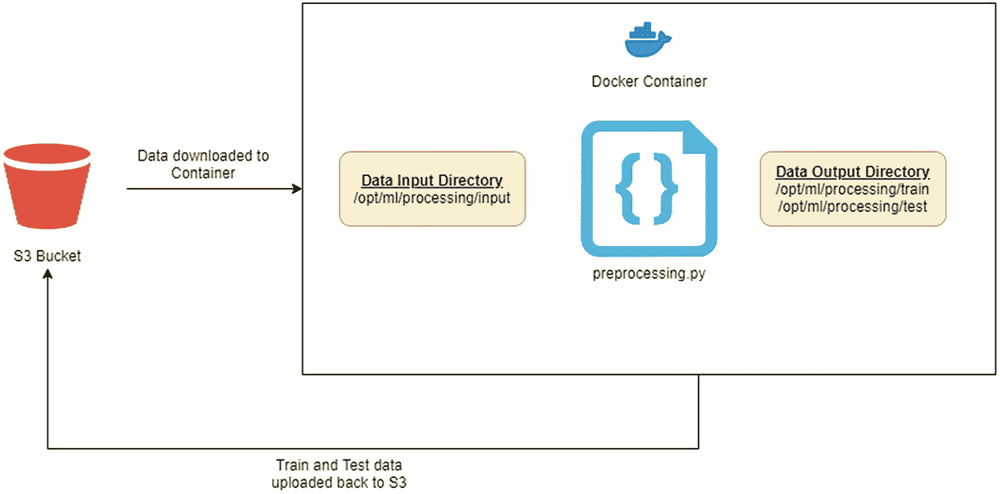

图 5-15

处理作业的工作方式

处理工作需要一些时间才能完成。它首先启动一个实例(类似于启动操作系统)，然后在该实例上下载`sklearn`映像。然后将数据下载到实例中。然后处理作业开始。当作业完成时，训练和测试数据被存储回 S3。然后整个操作结束。作业完成后，我们可以通过使用以下脚本获得有关作业的详细信息:

```py
preprocessing_job_description = sklearn_processor.jobs[-1].describe()

```

让我们使用此脚本来获取训练和测试数据集的 S3 存储桶位置:

```py
output_config = preprocessing_job_description['ProcessingOutputConfig']
for output in output_config['Outputs']:
    if output['OutputName'] == 'train_data':
        preprocessed_training_data = output['S3Output']['S3Uri']
    if output['OutputName'] == 'test_data':
        preprocessed_test_data = output['S3Output']['S3Uri']

```

现在，我们可以通过使用 Pandas 读取数据来检查输出。

```py
training_features = pd.read_csv(preprocessed_training_data + 'train_features.csv', nrows=10, header=None)
print('Training features shape: {}'.format(training_features.shape))
training_features.head(10)

```

这给了我们如图 [5-16](#Fig16) 所示的输出。

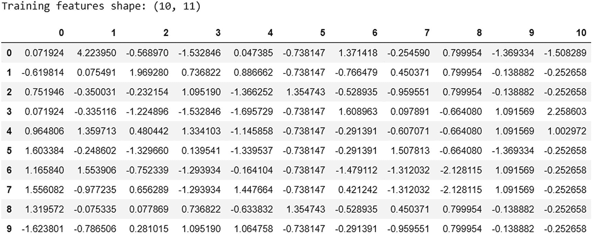

图 5-16

处理过的数据

这就完成了使用`SklearnProcessor`可以完成的整个处理工作。下一步永远是定义机器学习的算法。我们将在下一章中讨论这个问题。

但是假设不使用 SageMaker 的预定义容器，比如`ScriptProcessor`，我们想制作自己的容器并在其上运行脚本。在这种情况下，我们可以使用名为`ScriptProcessor`的 SageMaker 类。让我们在下一节探讨这个问题。

## 使用 ScriptProcessor 创建自己的预处理代码

在上一节中，我们使用了`SkLearnProcessor`，这是 SageMaker 提供的一个内置容器。但是，很多时候，我们不得不编写一些不能在 SageMaker 的预定义容器中执行的代码。为此，我们必须自己制作容器。我们将着眼于制造我们自己的容器，同时训练一个机器学习模型。在本节中，我们将创建一个容器，它执行与`SKlearnProcessor`容器相同的任务。唯一的区别是它不是预先构建的；我们将从头开始建造它。

为了使用定制容器来处理作业，我们使用由 SageMaker 提供的名为`ScriptProcessor`的类。在给`ScriptProcessor`输入之前，第一个任务是创建我们的 Docker 容器并将其推送到 ECR。

### 创建 Docker 容器

为此，我们将创建一个名为`Dockerfile`的无扩展名文件。在这个里面，我们将下载一个最小操作系统的镜像，然后在里面安装我们的包。因此，我们的最小操作系统将是基于 Linux 的，我们将在其中安装 Python、Scikit-Learn 和 Pandas。

```py
FROM python:3.7-slim-buster

RUN pip3 install pandas==0.25.3 scikit-learn==0.21.3
ENV PYTHONUNBUFFERED=TRUE

ENTRYPOINT ["python3"]

```

前面的脚本必须存在于`Dockerfile`中。第一行，`FROM python:3.7-slim-buster`，讲述了需要从 Docker Hub 下载的最小操作系统。这仅包含 Python 3.7 和运行 Python 所需的最小软件包。但是，我们也需要安装其他软件包。这就是为什么我们将使用下一行，`RUN pip3 install pandas==0.25.3 scikit-learn==0.21.3`。这将安装 Pandas、Scikit-Learn、Numpy 和其他重要的软件包。下一行`ENV PYTHONUNBUFFERED=TRUE`是一条高级指令，告诉 Python 立即记录消息。这有助于调试。最后，最后一行`ENTRYPOINT ["python3"]`，告诉我们`preprocessing.py`文件应该如何执行。

### 建立和推动形象

现在我们的 Docker 文件已经准备好了，我们需要构建这个图像，然后将它推送到 Amazon ECR，这是一个 Docker 图像存储库服务。要构建和推送此映像，需要以下信息:

*   帐户 ID

*   存储库名称

*   地区

*   赋予图像的标签

所有这些信息都可以使用以下脚本进行初始化:

```py
import boto3

account_id = boto3.client('sts').get_caller_identity().get('Account')
ecr_repository = 'sagemaker-processing-container'
tag = ':latest'
region = boto3.session.Session().region_name

```

一旦我们有了这些信息，我们就可以开始这个过程，首先定义 ECR 存储库地址，然后执行一些命令行脚本。

```py
processing_repository_uri = '{}.dkr.ecr.{}.amazonaws.com/{}'.format(account_id, region, ecr_repository + tag)

# Create ECR repository and push docker image
! docker build -t $ecr_repository docker # This builds the image
! $(aws ecr get-login --region $region --registry-ids $account_id --no-include-email) # Logs in to AWS
! aws ecr create-repository --repository-name $ecr_repository # Creates ECR Repository
! docker tag {ecr_repository + tag} $processing_repository_uri # Tags the image to differentiate it from other images
! docker push $processing_repository_uri # Pushes image to ECR

```

如果一切正常，那么您的图像将被成功推送到 ECR。你可以去 ECR 服务并检查存储库。可以看到图 [5-17](#Fig17) 中的视图。

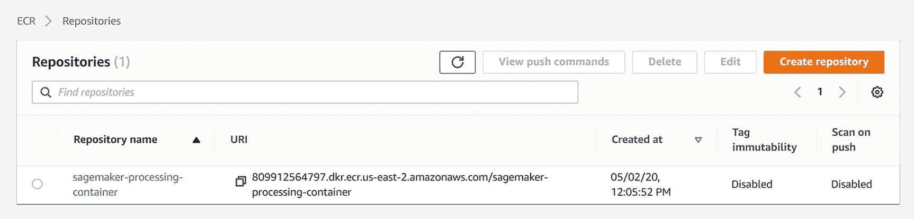

图 5-17

图像被推送到 ECR

### 使用 ScriptProcessor 类

现在我们的映像已经准备好了，我们可以开始使用`ScriptProcessor`类了。我们将在这个容器中执行相同的代码`preprocessing.py`。就像我们在`SKLearnProcessor`中所做的一样，我们将首先创建一个类的对象。

```py
from sagemaker.processing import ScriptProcessor, ProcessingInput, ProcessingOutput
from sagemaker import get_execution_role

role = get_execution_role()

script_processor = ScriptProcessor(command=['python3'],
          image_uri=processing_repository_uri,
          role=role,
          instance_count=1,
          instance_type='ml.m5.xlarge')

```

一旦创建了对象，我们就可以用它来运行我们的`preprocessing.py`文件。

```py
input_data = 's3://slytherins-test/Train.csv'

script_processor.run(code='preprocessing.py',
          inputs=[ProcessingInput(
            source=input_data,
            destination='/opt/ml/processing/input')],
          outputs=[ProcessingOutput(source='/opt/ml/processing/train', destination='s3://slytherins-test/'),
            ProcessingOutput(source='/opt/ml/processing/test', destination='s3://slytherins-test/')])

```

你会发现代码和`SKLearnProcessor`代码几乎一样。它也会给出相同的输出。最后，一旦处理工作完成，我们可以用同样的方式再次检查输出。

```py
preprocessing_job_description = script_processor.jobs[-1].describe()

output_config = preprocessing_job_description['ProcessingOutputConfig']
for output in output_config['Outputs']:
    if output['OutputName'] == 'output-1':
        preprocessed_training_data = output['S3Output']['S3Uri']
    if output['OutputName'] == 'output-2':
        preprocessed_test_data = output['S3Output']['S3Uri']

import pandas as pd
training_features = pd.read_csv(preprocessed_training_data + 'train_features.csv', nrows=10, header=None)
print('Training features shape: {}'.format(training_features.shape))
training_features.head(n=10)

```

您将得到的输出将与图 [5-16](#Fig16) 所示的相同。

在本节中，我们看到了如何创建自己的容器并运行处理脚本。这在许多情况下变得很重要。例如，如果我们想在 NLP 任务上使用基于 BERT 的预处理，我们必须为此创建一个容器，因为 SageMaker 没有为我们提供基于 BERT 的服务。在后面的章节中，我们将在创建训练和推理任务的同时探索更多关于定制容器的内容。

在过去的两节中，我们已经在 SageMaker 容器中使用了 Jupyter 笔记本。但是，大多数时候，尤其是在生产过程中，我们必须在不同的系统中运行代码。为此，我们必须使用 Boto3 API 进行认证和执行。在下一节中，我们将看到如何使用 Boto3 来运行我们的定制脚本。

## 使用 Boto3 运行处理作业

如前所述，我们使用 Boto3 包从任何其他计算机(包括您的本地主机)访问 AWS 的服务。因此，在本节中，我们将使用 Boto3 运行我们在上一节中看到的自定义 Docker 容器脚本。

### 安装 Boto3

使用 Boto3 的第一步是将其安装在本地主机环境中。除了 Boto3，我们还必须安装`awscli`，这将有助于我们与 AWS 和 s3fs 进行身份验证，进而有助于我们与 S3 木桶进行对话。为了安装它，我们将使用`pip`，如下所示:

```py
pip install boto3
pip install awscli
pip install s3fs

```

安装完成后，我们需要配置 AWS 的凭证。为此，我们将运行以下命令:

```py
aws configure

```

这将要求您输入以下四个信息:

*   AWS 访问键

*   AWS 秘密访问密钥

*   默认区域名称

*   默认输出格式

一旦我们提供了这些信息，我们就可以很容易地使用 Boto3 来连接 AWS 服务。我已经向您展示了在创建 IAM 角色时如何获得访问密钥和秘密访问密钥。默认的区域名称将是 us-east-2，但是您可以通过查看 AWS 管理控制台的右上角来重新检查它。它会告诉你位置。如图 [5-18](#Fig18) 所示，我已经传入了所需的信息。

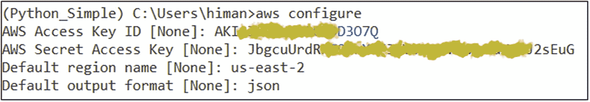

图 5-18

设置 AWS 凭据

一旦这一部分完成，我们就可以启动我们的 Jupyter 笔记本(本地系统笔记本)并使用我们已经安装了所有包并配置了 AWS 的相同环境创建一个笔记本。

### 正在初始化 Boto3

在笔记本内部，第一步是初始化 Boto3。为此，我们将使用以下脚本:

```py
import boto3
import s3fs
region = boto3.session.Session().region_name
client = boto3.client('sagemaker')

```

在上一步中，区域是由您设置的。相同的区域将被提取并存储在可变区域内。接下来是设置 Boto3。可以为 AWS 的所有服务设置 Boto3。目前，我们将使用 SageMaker 因此，我们将调用 Boto3 的 client 类并用 SageMaker ( `client = boto3.client('sagemaker')`)初始化它。

### 更改 Dockerfile 文件并推送映像

现在，我们将使用 Boto3 API 来调用处理作业方法。这将创建与我们在上一节中看到的相同的处理作业。但是，还需要一些小的改变，我们将一个一个地探索它们。

我们将使用方法`create_processing_job`来运行数据处理作业。要了解更多关于这种方法，或者 Boto3 提供的与 SageMaker 相关的所有方法，可以访问 [`https://boto3.amazonaws.com/v1/documentation/api/latest/reference/services/sagemaker.html`](https://boto3.amazonaws.com/v1/documentation/api/latest/reference/services/sagemaker.html) 。

但是，在此之前，我们必须对 Docker 容器和处理 Python 文件进行一些更改。对于 Docker 容器，我们需要将我们的`preprocessing.py`脚本复制到其中，以便 Boto3 方法可以直接运行脚本。为此，我们将对 docker 文件进行以下更改:

```py
FROM python:3.7-slim-buster
RUN pip3 install pandas==0.25.3 scikit-learn==0.21.3
ENV PYTHONUNBUFFERED=TRUE
ENV PATH="/opt/ml/code:${PATH}"
COPY preprocessing.py /opt/ml/code/preprocessing.py
WORKDIR /opt/ml/code

```

我们在现有的文档中增加了三个新行。行`ENV PATH="/opt/ml/code:${PATH}"`建立到`/opt/ml/code`的环境路径。我们将把我们的脚本`preprocessing.py`和`COPY preprocessing.py /opt/ml/code/preprocessing.py`放在一起。最后，我们将使我们的工作目录相同的文件夹:`WORKDIR /opt/ml/code`。这是必需的，这样 Docker 容器将知道脚本文件在哪里，并有助于它的执行。

一旦我们在 docker 文件中进行了更改，我们将对构建图像并将其推送到 ECR 的脚本进行更改。我们需要做的唯一改变是添加一行，允许容器使用`preprocessing.py`脚本。否则，Docker 可能没有权限打开并查看其内容。

```py
# Create ECR repository and push docker image
! chmod +x docker/preprocessing.py # This line gives read and write access to the preprocessing script
! docker build -t $ecr_repository docker # This builds the image
! $(aws ecr get-login --region $region --registry-ids $account_id --no-include-email) # Logs in to AWS
! aws ecr create-repository --repository-name $ecr_repository # Creates ECR Repository
! docker tag {ecr_repository + tag} $processing_repository_uri # Tags the image to differentiate it from other images
! docker push $processing_repository_uri # Pushes image to ECR

```

一旦这一步完成，我们就可以运行我们的 Boto3 处理作业了。

### 创建处理作业

简而言之，我们需要关于四个部分的信息来使用 Boto3 创建处理作业。

*   输入数据信息(`ProcessingInput`)

*   输出数据信息(`ProcessingOutput`)

*   资源信息(`ProcessingResources`)

*   集装箱信息(`AppSpecification`)

正如您在下面的代码中看到的，提供了所有以前的信息。该代码再次类似于我们在上一节中看到的代码；只是 Boto3 需要的信息应该作为参数手动放入其中，而当我们从 SageMaker 内部运行代码时，大部分信息是自动提取的。

```py
response = client.create_processing_job(       # Initialize the method
    ProcessingInputs=[
        {
            'InputName': "Training_Input",    # Give Input Job a name

            'S3Input': {
                'S3Uri': input_data,          # URL from where the data needs to be taken
                'LocalPath': '/opt/ml/processing/input',     # Local directory where the data will be downloaded
                'S3DataType': 'S3Prefix',     # What kind of Data is it?
                'S3InputMode': 'File'         # Is it a file or a continuous stream of data?
            }
        },
    ],
    ProcessingOutputConfig={
        'Outputs': [
            {
                'OutputName': 'Training',      # Giving Output Name
                'S3Output': {
                    'S3Uri': 's3://slytherins-test/',      # Where the output needs to be stored
                    'LocalPath': '/opt/ml/processing/train',   # Local directory where output needs to be searched
                    'S3UploadMode': 'EndOfJob'     # Upload is done when the job finishes
                },
                'OutputName': 'Testing',
                'S3Output': {
                    'S3Uri': 's3://slytherins-test/',
                    'LocalPath': '/opt/ml/processing/test',
                    'S3UploadMode': 'EndOfJob'
                }
            },
        ],
    },
    ProcessingJobName='preprocessing-job-test',    # Giving a name to the entire job. It should be unique
    ProcessingResources={
        'ClusterConfig': {
            'InstanceCount': 1,                  # How many instances are required?
            'InstanceType': 'ml.m5.xlarge',      # What's the instance type?
            'VolumeSizeInGB': 5                 # What should be the instance size?
        }
    },
    AppSp {
        'ImageUri': '809912564797.dkr.ecr.us-east-2.amazonaws.com/sagemaker-processing-container:latest',
# Docker Image URL
        'ContainerEntrypoint': [
            'Python3','preprocessing.py'         # How to run the script
        ]
    },
    RoleArn='arn:aws:iam::809912564797:role/sagemaker-full-accss',    # IAM role definition
)

```

定义运行代码所需的 IAM 角色。我们已经在活动部分做了这个角色。我还解释了如何在创建 IAM 角色时复制 ARN。

前面的代码将启动处理作业。但是，您不会看到任何输出。要了解作业的状态，可以使用 CloudWatch，我将在下一节中介绍。现在，我们将从 Boto3 方法`describe_processing_job`获得帮助来获取信息。我们可以通过编写以下代码来实现这一点:

```py
client.describe_processing_job(
    ProcessingJobName='processing-job-test'
)

```

这将为我们提供关于工作的详细信息，如图 [5-19](#Fig19) 所示。

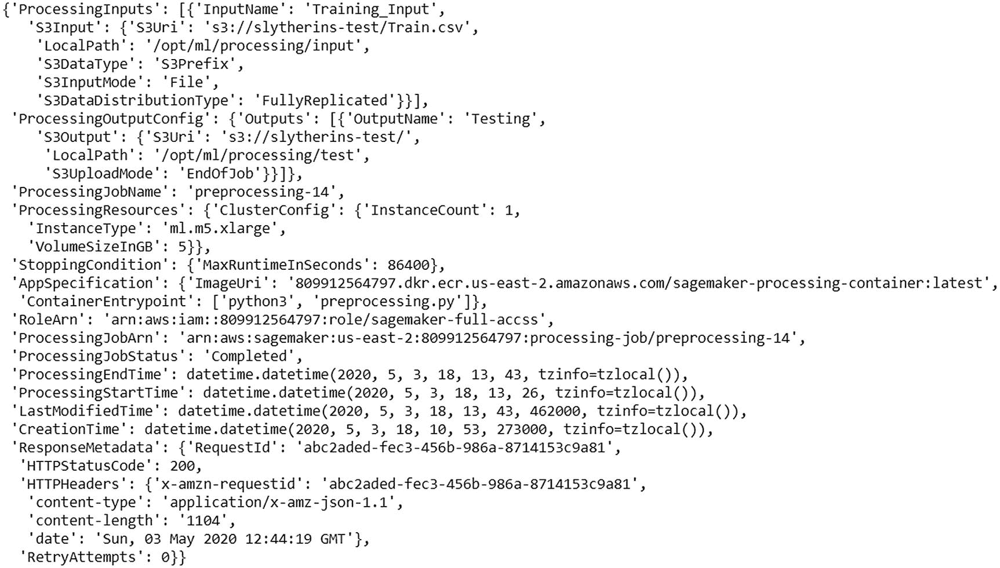

图 5-19

加工作业描述

您将找到键`ProcessingJobStatus`，它告诉您状态，如果作业失败，您也将获得失败键的原因。所以，现在我们已经看到了 SageMaker 提供的三种数据处理方式。让我们在下一节探讨如何监控这些作业。

## 使用 CloudWatch 监控处理作业

CloudWatch 是亚马逊提供的一项令人惊叹的服务，它可以帮助你监控几乎每一项工作，无论是培训、推理还是处理工作。在本节中，我们将了解如何使用 CloudWatch 来监控处理作业。在后面的章节中，我们将探索它在其他机器学习技术中的应用。

首先，一旦我们登录到 AWS 管理控制台，我们必须转到服务，然后搜索 *CloudWatch* 并打开它。然后在右边的面板中找到日志部分，并单击它。见图 [5-20](#Fig20) 。

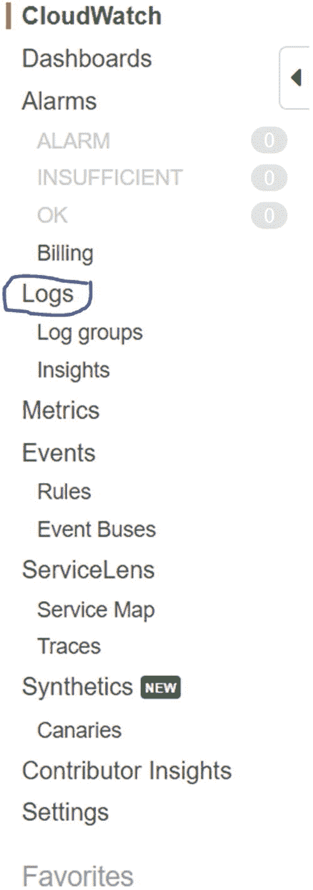

图 5-20

CloudWatch 菜单

根据我们使用的 AWS 服务，您可以在这里看到所有的日志组。由于到目前为止我们只使用了两个服务，SageMaker 和 Processing，您将很容易找到这些信息，如图 [5-21](#Fig21) 所示。

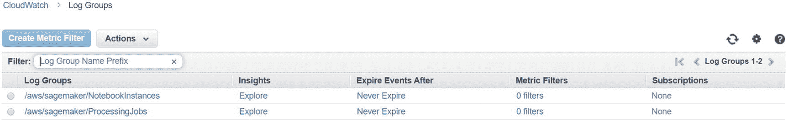

图 5-21

CloudWatch 中的工作信息

我们将单击 ProcessingJobs 部分，并搜索我们为作业指定的处理作业名称。找到后，点击链接。它将给我们一些类似于图 [5-22](#Fig22) 的输出。

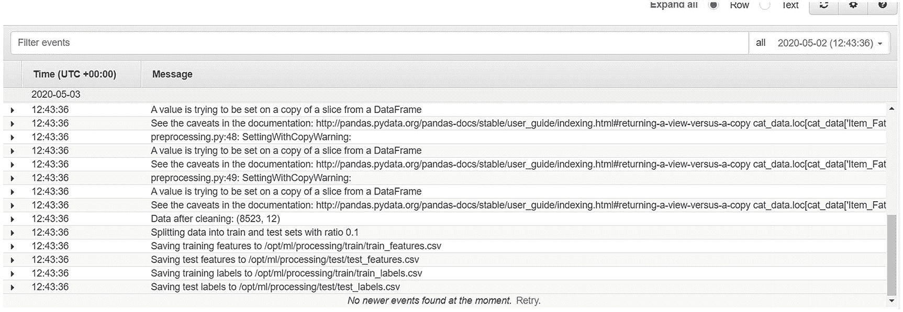

图 5-22

CloudWatch 中的作业日志

如果您有任何错误，您也可以根据处理作业的名称在这里找到它们。这也是我之前提到名字要唯一的原因。在 CloudWatch 中还有很多其他的部分，但是现在它们并不重要。当需要的时候，我们将探索它们。

这里需要记住的一点是，在 SageMaker 控制台中，您不会找到处理作业的日志。所以你要来 CloudWatch 找工作。对于大多数培训工作、转型工作等。，您将直接在 SageMaker 的控制台中找到日志——但不是用于处理作业。

## 结论

这一章是关于使用 SageMaker 处理原始数据的。在下一章中，我们将详细介绍 SageMaker 的大多数内置算法。我们将从处理原始数据开始，然后继续训练模型，并将模型工件保存到 S3 桶中。