# 六、在 SageMaker 中构建和部署模型

在这一章中，我们将探索 SageMaker 的一些在行业中广泛使用的内置算法。我们将从通用领域、自然语言处理领域、计算机视觉领域和预测领域探索算法。

## 探索线性学习算法

SageMaker 的线性学习器算法类似于机器学习领域的回归算法。我们可以使用线性学习算法建立多元线性回归、逻辑回归和多项式逻辑回归模型。在本节中，我们将了解如何将该算法用于线性回归和逻辑回归。我们将使用我们在前一章中使用的 Big Mart 数据集来应用该算法。在深入研究如何在 SageMaker 中应用线性学习器之前，让我们先简单了解一下线性和逻辑回归。

### 线性回归概述

线性回归是机器学习中最基本也是最重要的算法之一。它用于拟合观察值的直线(或非线性回归情况下的曲线),然后对拟合的直线进行插值以获得预测。为了拟合这条线，我们使用一种叫做*最小二乘估计*的方法，它给出了我们的系数值。这些系数值以这样的方式确定，即误差的平均值近似为零。误差是每个观察值与拟合直线的欧几里德距离。图 [6-1](#Fig1) 显示了用于拟合直线的简单线性回归。

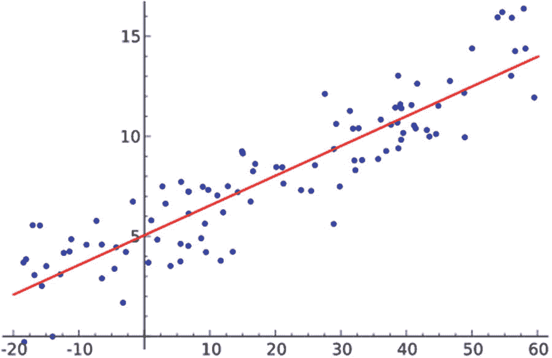

图 6-1

简单线性回归

线性回归用于预测数值。回归有各种版本，即岭回归、套索回归、弹性网回归、高斯回归等。

### 逻辑回归概述

逻辑回归是线性回归的一种变换，其预测范围是从 0 到 1。这是通过将线性回归方程传递给 sigmoid 函数来实现的。因此，我们在线性回归中看到的直线被转换成一条 S 形曲线，其上限为 1，下限为 0，如图 [6-2](#Fig2) 所示。

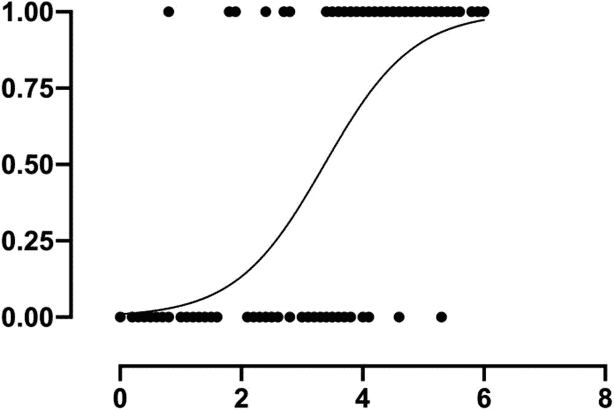

图 6-2

逻辑回归

一旦逻辑回归预测了一个值，它就被作为二元分类用例的预测概率。默认情况下，如果预测超过 0.5，则预测成功类别；否则，会预测故障类别。阈值 0.5 是可定制的，这样我们可以获得更好的精度和召回率(这将在下一章详细讨论)。多类分类的逻辑回归称为*多项式逻辑回归*，它不使用 sigmoid，而是使用 softmax 函数。

### 线性学习器的 pagemaker 应用

第一步是从 S3 存储桶中读取数据集，预处理列以删除空值，并应用缩放和编码。在前一章中，我们已经看到了如何预处理数据集并获得因变量和自变量。因此，我们将通过对预处理数据集应用该算法来直接开始这一部分。我们将定义角色和桶，以便 SageMaker 可以正确地与不同的服务对话。

```py
import boto3
from sagemaker import get_execution_role
bucket = 'slytherins-test'
prefix = 'linear-learner'
role = get_execution_role()

```

现在，我们需要决定需要应用什么算法，即线性或逻辑回归。我们将从逻辑回归开始。要建立逻辑回归模型，我们需要一个分类列。我们知道我们的目标变量是`Sales`，它是一个数值列；因此，逻辑回归不能应用。因此，我们将把`Sales`列分成四类，然后我们可以开始应用算法。

```py
y_binned = pd.cut(y['Item_Outlet_Sales'], 4, labels=['A', 'B', 'C', 'D'])

```

先前的码元`y`分为四个类别`A`、`B`、`C`和`D`，每个类别具有相等的范围。您可以在这里看到输出:

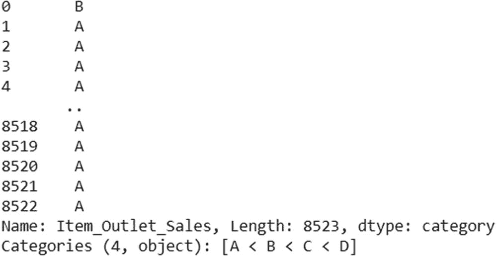

既然我们已经将分类列作为目标变量，我们将对它应用标签编码，这样每个类别都可以用一个整数来表示。

```py
from sklearn.preprocessing import LabelEncoder
le = LabelEncoder()
temp = le.fit(y_binned)
y_final = temp.transform(y_binned)

```

既然我们已经在`y_final`中定义并存储了最终的目标变量，我们将使用它来训练模型。如前一章所述，SageMaker 在 Docker 容器中运行算法，因此数据应该存储在 S3 桶中，以便容器可以访问它们。我们的下一步将是在 S3 存储数据。对于我们的线性学习算法，我们将使用一种称为 RecordIO-Protobuf 格式的数据格式。使用这种数据格式有助于加快训练时间，并且可以在实时数据模式下训练模型(称为*流水线模式*)。我们可以使用下面几行代码将自变量和目标变量转换为 RecordIO 格式:

```py
import io
import numpy as np
import sagemaker.amazon.common as smac

vectors = np.array(X.values, dtype="float32")
labels = np.array(y_final, dtype="float32")

buf = io.BytesIO()
smac.write_numpy_to_dense_tensor(buf, vectors, labels)
buf.seek(0)

```

前面几行将数据转换成 RecordIO 格式，然后打开临时文件，这样就可以直接插入到 S3 中。RecordIO 文件的使用方法是将一个大文件分成几个块，然后使用这些块进行分析。这个文件帮助我们在 SageMaker 中创建流作业，这使得训练变得很快。为了发送它，我们将使用下面几行代码:

```py
key = 'recordio-pb-data'
boto3.resource('s3').Bucket(bucket).Object(os.path.join(prefix, 'train', key)).upload_fileobj(buf)
s3_train_data = 's3://{}/{}/train/{}'.format(bucket, prefix, key)
print('uploaded training data location: {}'.format(s3_train_data))

```

这将把数据上传到 S3，并关闭我们创建的缓冲区。现在，我们的基本步骤已经完成。我们需要做的就是建立联系并训练模型。第一步是初始化我们的线性学习算法 Docker 容器。

```py
from sagemaker.amazon.amazon_estimator import get_image_uri
container = get_image_uri(boto3.Session().region_name, 'linear-learner')

```

初始化后，让我们为线性学习器传递所需的参数，并初始化算法。

```py
sess = sagemaker.Session()

linear = sagemaker.estimator.Estimator(container,
                     role,
                     train_instance_count=1,
                     train_instance_type='ml.m4.xlarge',
                      output_path=output_location,
                      sagemaker_session=sess)

```

正如我们所知，回归算法有几个需要定义的超参数，如变量数量、批量大小等。接下来我们将定义这些值。

```py
linear.set_hyperparameters(feature_dim=11,
              predictor_type='multiclass_classifier',
              mini_batch_size=100,
              num_classes=4)

```

现在一切都已确定，接下来我们将开始训练。

```py
linear.fit({'train': s3_train_data})

```

您将在开始时看到接下来给出的输出，然后培训将开始。

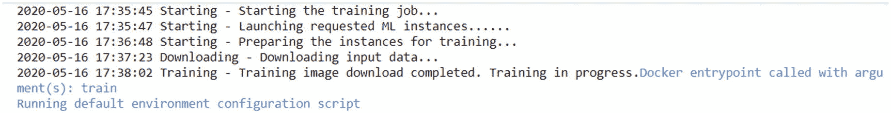

模型的训练需要一段时间。一旦模型被训练，我们就可以将模型部署为一个端点，然后我们就可以开始测试了。为了部署模型，我们将使用`deploy`函数。

```py
linear_predictor = linear.deploy(initial_instance_count=1,
                   instance_type='ml.m4.xlarge')

```

部署模型然后创建端点需要一些时间。一旦完成，我们就可以开始预测了。为了开始预测，我们必须首先告诉端点将接收哪种数据。然后我们将不得不序列化数据。这种格式有助于有效地传输和存储数据，完美地恢复原始数据。我们可以通过使用以下代码来序列化我们的测试数据:

```py
from sagemaker.predictor import csv_serializer, json_deserializer
linear_predictor.content_type = 'text/csv'
linear_predictor.serializer = csv_serializer
linear_predictor.deserializer = json_deserializer

```

现在，无论我们将向端点发送什么数据，它都将被序列化并发送给模型。一个预测将以串行方式出现，然后我们将看到数据的原始结构。为了预测，我们将使用测试数据。

```py
result = linear_predictor.predict(test_vectors[0])
print(result)

```

前一行给出了单行的预测。但是如果我们想要预测多行，我们可以使用下面的代码:

```py
import numpy as np

predictions = []
for array in np.array_split(test_vectors, 100):
    result = linear_predictor.predict(array)
    predictions += [r['predicted_label'] for r in result['predictions']]

predictions = np.array(predictions)

```

前面的代码一次获取 100 行，然后将它们的预测存储在变量 predictions 中。我们现在可以使用以下代码来查看模型指标:

```py
from sklearn.metrics import precision_score, recall_score, f1_score

print(precision_score(labels, predictions, average="weighted"))
print(recall_score(labels, predictions, average="weighted"))
print(f1_score(labels, predictions, average="weighted"))

```

这将为我们提供以下结果:

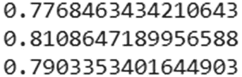

我们也可以使用云指标来可视化模型的不同指标，但是我们将在下一章中探讨。

请记住，一旦创建了端点，它们将一直运行，直到我们手动或通过脚本停止它们。在运行了所有前面的代码之后，我们的端点仍然在运行。因此，我们将停止它，这样就不会给我们带来任何成本。

```py
sagemaker.Session().delete_endpoint(linear_predictor.endpoint)

```

前一行停止端点并删除它。在前面的例子中，我们已经进行了多项式逻辑回归。我们也可以使用线性回归来预测数值。为此，我们将在前面的代码中进行以下更改:

```py
linear.set_hyperparameters(feature_dim=11,
               predictor_type='regression',
               mini_batch_size=100)

```

此外，不要忘记使用 Big Mart 数据集中的原始目标变量(`Sales`列),而不是装箱的变量。在下一节中，我们将在同一个数据集上应用 XGBoost 算法，并将其性能与逻辑回归进行比较。

## 探索 XGBoost 算法

XGBoost 代表*极限梯度提升*。在这一节中，我们将首先了解普通梯度下降算法是如何工作的，以及 XGBoost 如何使它更加有效。我们将把这个算法应用于大市场数据集的多类分类。让我们先来看看这两个算法。

### 梯度推进算法

*Boosting* 是机器学习中集成树领域内的一种技术。在这个算法中，多个决策树被组合起来给出最终的预测。系综树的其他方法包括装袋和随机森林。Boosting 与其他方法的不同之处在于它组合了多个树。当生成第一个决策树(通常是它的 CART 决策树)时，所有的观察值被赋予相同的权重。该模型一旦被训练，就应用于相同的数据集。然后生成第二棵决策树。在这个决策树中，所有在第一个决策树中被错误分类的观察值被赋予更大的权重，而其他观察值被赋予更小的权重。这是通过增加难以分类的观察值的权重，同时减少所有其他观察值的权重来实现的。这个过程不断重复，最后最后决策树给我们最后的预测。所以说每个决策树都是被前面的决策树助推的，这也是为什么叫*助推*的原因。有不同种类的增强方法，例如 AdaBoost、梯度增强、light GBM、XGBoost 等。见图 [6-3](#Fig3) 。

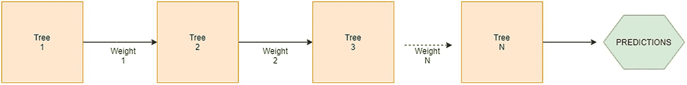

图 6-3

梯度推进

在梯度增强中，使用梯度下降方法学习赋予参数的权重。首先定义损失函数，在回归问题的情况下它可以是均方误差，或者在分类问题的情况下是 logit 函数。在每一个决策树被制作并被添加到下一个决策树之后，这个损失函数被最小化。最终目标是最小化总损失函数，这反过来给出了所有观测的最佳权重值。

### XGBoost 算法

XGBoost 算法基于梯度推进框架。XGBoost 是梯度提升的超级优化版本，因为它很好地利用了计算资源的能力，对于中小型数据集，它的性能远远优于神经网络。以下是使用 XGBoost 的一些主要好处:

*   支持多线程操作，因此构建的多个树使用并行化概念，因此我们可以更少地利用大量决策树来提供更准确的预测。

*   使用缓存和缓冲区、核外计算等方法可以最大限度地提高硬件性能。

*   XGBoost 在决策树中附加了正则化因子，因此解决了过拟合和欠拟合的问题。它支持 L1 和 L2 正规化。

*   XGBoost 通过了解邻域自动学习缺失值。

*   使用一种叫做*加权分位数草图*算法的方法找到最佳分割点。

*   每一步都自动进行交叉验证，以找到超参数的最佳值。因此，不需要编写自定义代码。

你可以在 [`https://arxiv.org/pdf/1603.02754.pdf`](https://arxiv.org/pdf/1603.02754.pdf) 找到 XGBoost 算法的详细概述。

### xgboost 的 pagemaker 应用

就像前面的算法一样，第一步是定义 bucket 并设置路径。

```py
import os
import boto3
import re
import sagemaker
role = sagemaker.get_execution_role()
region = boto3.Session().region_name

bucket = 'slytherins-test'
prefix = 'xgboost'

bucket_path = 'https://s3-{}.amazonaws.com/{}'.format(region, bucket)

```

我们现在将遵循预处理数据集的相同步骤，即我们在上一节和上一章中看到的步骤。我们将从目标变量已入库的部分开始。在 XGBoost 算法中，我们将使用 CSV 数据集，而在之前的算法中，我们使用 RecordIO-Protobuf。我们将保存我们的数据，并将其存储在 S3。

```py
data_final.to_csv('train.csv', header=None, index=False)
boto3.Session(region_name=region).resource('s3').Bucket(bucket).Object(prefix + '/train.csv').upload_file('train.csv')

```

下一步是初始化 XGBoost 的 Docker 映像。

```py
from sagemaker.amazon.amazon_estimator import get_image_uri
container = get_image_uri(region, 'xgboost', '1.0-1')

```

一旦容器被初始化，我们将初始化算法并运行模型。

```py
import boto3
from time import gmtime, strftime

job_name = 'xgboost-classification-' + strftime("%Y-%m-%d-%H-%M-%S", gmtime())

create_training_params = \
{
    "AlgorithmSpecification": {
        "TrainingImage": container,
        "TrainingInputMode": "File"
    },
    "RoleArn": role,
    "OutputDataConfig": {
        "S3OutputPath": bucket_path + "/" + prefix + "/xgboost"
    },
    "ResourceConfig": {
        "InstanceCount": 1,
        "InstanceType": "ml.m4.xlarge",
        "VolumeSizeInGB": 5
    },
    "TrainingJobName": job_name,
    "HyperParameters": {
        "max_depth":"5",
        "eta":"0.2",
        "gamma":"4",
        "min_child_weight":"6",
        "subsample":"0.7",
        "silent":"0",
        "objective":"multi:softmax",
        "num_round":"50",
        "num_class":"4"
    },
    "StoppingCondition": {
        "MaxRuntimeInSeconds": 3600
    },
    "InputDataConfig": [
        {
            "ChannelName": "train"

,
            "DataSource": {
                "S3DataSource": {
                    "S3DataType": "S3Prefix",
                    "S3Uri": bucket_path + "/" + prefix + '/',
                    "S3DataDistributionType": "FullyReplicated"
                }
            },
            "ContentType": "csv",
            "CompressionType": "None"
        },
        {
            "ChannelName": "validation",
            "DataSource": {
                "S3DataSource": {
                    "S3DataType": "S3Prefix",
                    "S3Uri": bucket_path + "/" + prefix + '/',
                    "S3DataDistributionType": "FullyReplicated"
                }
            },
            "ContentType": "csv",
            "CompressionType": "None"
        }
    ]
}

client = boto3.client('sagemaker', region_name=region)
client.create_training_job(**create_training_params)

```

我们来理解一下前面的代码。

1.  在算法规范中，我们将传递初始化的 Docker 容器和数据的类型。这里我们使用的是 CSV 文件；因此，数据类型将是`file`。

2.  在`RoleArn`中，我们将通过 IAM 角色。这是必须通过的，因为它将定义我们可以访问哪些资源。我们可以转到 IAM 角色部分，并注意我们在那里创建的角色的 ARN。

3.  定义我们的模型文件在 S3 的存储位置。

4.  接下来，我们必须配置我们的资源。我们将指定资源数量、资源类型和存储。记住，你选择的资源越大，你承担的成本就越大。在做出决定之前，请访问成本浏览器，查看您想要选择的资源的成本。

5.  XGBoost 算法的超参数需要在下一节中设置。

6.  下一节将讨论您希望资源运行的最长时间。如果运行时间超过该时间，作业将自动停止。

7.  最后，我们传递最后一节中的输入数据配置和类型。

这种 JSON 格式一旦被填充，就会旋转容器，然后开始训练。我们可以使用云度量和 CloudWatch 来了解模型的度量和日志，这将在下一章中介绍。在这里，我们将编写一个脚本，不断告诉我们训练是否正在进行。一旦训练结束或者发生了一些错误，脚本就会通知我们。

```py
import time

status = client.describe_training_job(TrainingJobName=job_name)['TrainingJobStatus']
print(status)
while status !='Completed' and status!='Failed':
    time.sleep(60)
    status = client.describe_training_job(TrainingJobName=job_name)['TrainingJobStatus']
    print(status)

```

训练结束后，我们会得到如下所示的输出:

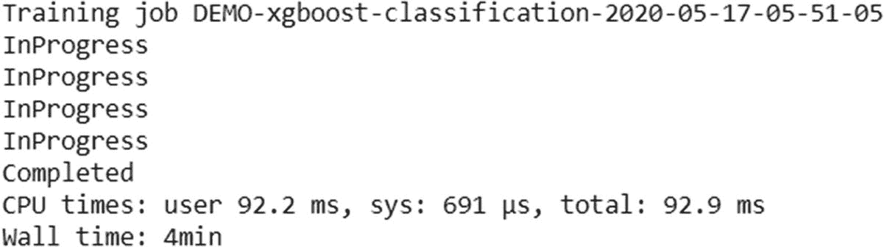

就像上一节一样，一旦模型定型，我们就可以准备和公开预测可以使用的端点。要公开端点，可以使用 XGBoost 算法的以下脚本:

```py
create_endpoint_response = client.create_endpoint(
    EndpointName="xgboost-bigmart-endpoint",
    EndpointConfigName="xgboost-bigmart-config")

```

这将使端点旋转起来，稍后可以使用它进行预测。接下来，我们可以通过使用`invoke_endpoint()`方法来测试模型。

```py
runtime_client = boto3.client('runtime.sagemaker', region_name=region)
response = runtime_client.invoke_endpoint(EndpointName=endpoint_name,
                  ContentType='text/csv',
                  Body=test_data)

```

要阅读预测，我们可以使用以下脚本:

```py
result = response['Body'].read()
result = result.decode("utf-8")
result = result.split(',')
result = [math.ceil(float(i)) for i in result]
label = payload.strip(' ').split()[0]
print ('Label: ',label,'\nPrediction: ', result[0])

```

我们也可以进行批量预测，就像线性学习者一样。您可以在 GitHub 资源库中找到批量预测的代码。不要忘记删除预测后的端点。

```py
client.delete_endpoint(EndpointName=endpoint_name)

```

## 探索炽热文本算法

闪耀文本算法用于为文本数据生成单词嵌入。稍后，这些嵌入可以提供给任何机器学习模型来完成任何分类任务。在这一节中，我们将首先了解燃烧文本算法，然后将其应用于 text8 数据集。

燃烧文本算法是 word2vec 算法的高度优化版本，它允许更快的训练和推理，并且支持分布式训练。一旦使用这种算法生成了向量，我们就可以将它们用于不同的任务，例如文本分类、摘要、翻译等。它支持两种架构，类似于 word2vec 的架构。

*   跳过 gram 架构

*   连续的文字袋建筑

让我们简单讨论一下这些架构。

### 词向量生成的跳格结构

skip gram 算法用于通过查找彼此最相似的单词来生成单词向量。这个算法试图理解一个句子的上下文。为此，它将一个单词作为输入，然后尝试预测所有具有相似上下文的单词。图 [6-4](#Fig4) 展示了该架构，摘自 [`https://arxiv.org/pdf/1301.3781.pdf`](https://arxiv.org/pdf/1301.3781.pdf) (Mikolov el al。)

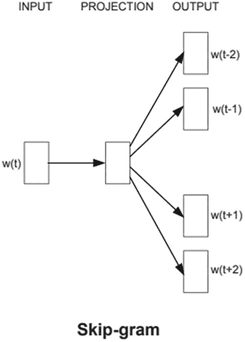

图 6-4

跳过 gram 算法

为了理解上下文并生成单词向量，使用了具有没有激活功能的隐藏层的小型神经网络架构。开始时，每个单词都使用一键编码算法进行编码，然后输入到网络中。一个权重被分配给隐藏层，其值通过损失函数学习。一旦模型被训练，它可以用于生成单词向量或直接用于文本分类模型。

### 词向量生成的连续词袋体系结构

你可以说，连续单词包(CBOW)方法是 skip gram 的逆方法。它理解上下文，然后尝试在上下文中预测单词。例如，如果句子是“德里是印度的首都”，然后我们写“德里是首都”，那么它应该预测印度。架构也是一样的，我们有一个隐藏层和一个输出层。传递到网络的每个字都是一次性编码的。见图 [6-5](#Fig5) 。

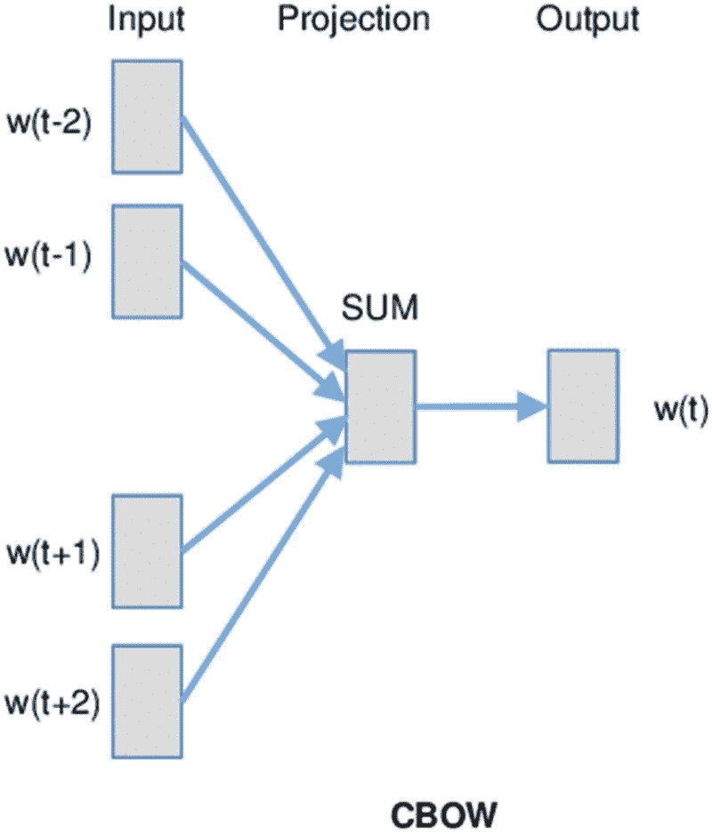

图 6-5

CBOW 算法

### 闪耀文本的 pagemaker 应用

在开始编码之前，我们必须了解我们将使用 blazing text 算法为其生成单词向量的数据集。我们将使用的数据集称为 text8 数据集。它是整个维基百科文本的一个小而干净的版本。整个维基百科转储被称为 wiki9，然后被清理并转换为 fil9。获取该清理数据集的一个子集(100 MB ),称为 text8。我们可以从 [`http://mattmahoney.net/dc/text8.zip`](http://mattmahoney.net/dc/text8.zip) 下载数据集。

您现在可能已经知道，下载的数据必须发送到 S3 桶，以便我们的资源和算法容器可以访问它。我们可以使用以下脚本上传数据:

```py
train_channel = prefix + '/train'
sess.upload_data(path='text8', bucket=bucket, key_prefix=train_channel)

```

让我们将这个数据集的路径存储在一个变量中。

```py
s3_train_data = 's3://{}/{}'.format(bucket, train_channel)

```

记得在执行这段代码之前定义所有必需的字段，即 bucket、role 等。我们已经在前面的章节中看到了如何定义它们。我们也可以看看 GitHub repo，了解完整的代码。

既然我们已经存储了数据并定义了路径，下一步将是初始化炽热的文本 Docker 容器。

```py
container = sagemaker.amazon.amazon_estimator.get_image_uri(region_name, "blazingtext", "latest")

```

一旦容器准备好了，我们必须初始化实例/资源。

```py
bt_model = sagemaker.estimator.Estimator(container,
                     role,
                     train_instance_count=1,
                     train_instance_type='ml.m4.xlarge',
                     train_volume_size = 5,
                     train_max_run = 360000,
                     input_mode= 'File',
                     output_path=s3_output_location,
                     sagemaker_session=sess)

```

在运行这段代码之前，不要忘记定义 S3 输出位置。

```py
s3_output_location = 's3://{}/{}/output'.format(bucket, prefix)

```

所有的参数都是不言自明的，我们已经在前一节中研究过了。记住，`ml.m4.xlarge`实例在空闲层之下。因此，如果您想尝试不同的算法，请始终使用这个实例。接下来，我们将设置算法超参数。

```py
bt_model.set_hyperparameters(mode="batch_skipgram",
              epochs=5,
              min_count=5,
              sampling_threshold=0.0001,
              learning_rate=0.05,
              window_size=5,
              vector_dim=100,
              negative_samples=5,
              batch_size=11,
              evaluation=True,
              subwords=False)

```

我们已经在本节开始时研究了算法的这些部分。现在我们将数据作为一个 JSON 文件来训练算法。在此之前，我们必须告诉算法数据来自 S3。这个信息是在前面的使用 JSON 的算法中传递的。在这里，我们将使用以下脚本传递它:

```py
train_data = sagemaker.session.s3_input(s3_train_data, content_type='text/plain', s3_data_type="S3Prefix")
data_channels = {'train': train_data}
bt_model.fit(inputs=data_channels, logs=True)

```

`logs`参数不仅会训练模型，还会在同一个 Jupyter 笔记本中显示模型输出。否则，我们将不得不查看 CloudWatch 中的输出。接下来的步骤将与之前相同。部署模型并测试它。

```py
bt_endpoint = bt_model.deploy(initial_instance_count = 1,instance_type = 'ml.m4.xlarge')

words = ["awesome", "blazing"]
payload = {"instances" : words}
response = bt_endpoint.predict(json.dumps(payload))
vecs = json.loads(response)
print(vecs)

```

这里我们将得到输出，这将是为单词 *awesome* 和*flashing*生成的单词向量。最后，我们将删除模型端点。

```py
sess.delete_endpoint(bt_endpoint.endpoint)

```

在下一节中，我们将看看 SageMaker 中的图像分类算法。

## 探索图像分类算法

SageMaker 的图像分类算法基于一种称为 ResNet 的特殊卷积神经网络架构。在看这个算法的应用之前，我们先来探索和了解一下用于图像分类的 ResNet 架构。

### 瑞斯网

ResNet 是一种基于卷积神经网络框架的架构，用于图像分类等问题陈述。为了理解一个 ResNet，我们必须首先看看卷积神经网络的操作。见图 [6-6](#Fig6) 。

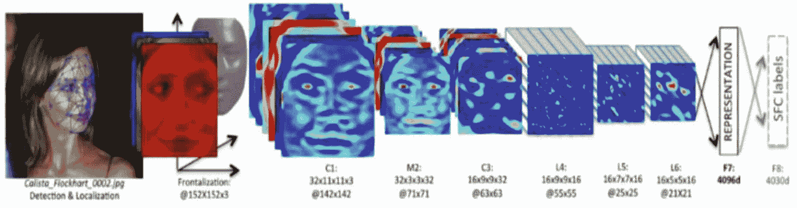

图 6-6

卷积神经网络，10.1109/icengtechnol . 10110101015

典型的 CNN 由以下操作组成:

1.  第一个操作是卷积操作，它也被认为是滤波器的一个应用。我们对图像应用不同的过滤器，这样我们就可以得到同一幅图像的不同版本，这有助于我们完美地理解图像。但是，不是对滤波器进行硬编码，而是使用反向传播方法来学习这些滤波器的值。

2.  下一步被称为*汇集*或*子采样*。在这里，我们缩小图像的大小，以便训练时间变得更快。有不同类型的汇集方法，如最大汇集，平均汇集等。

3.  前面的两个过程重复多次，然后最终的池化操作的输出被提供给完全连接的神经网络层。在这里进行主要的学习，最后完成分类任务。

以前的体系结构的一个问题是当网络做得太深时；这就是反向传播过程受到影响的时候。在反向传播过程中，梯度变为零，因此学习停止。这种现象被称为*消失梯度*。因此，为了解决这个问题，在 CNN 的一次深度培训中，ResNets 应运而生。图 [6-7](#Fig7) 显示了一个 ResNet 的架构。

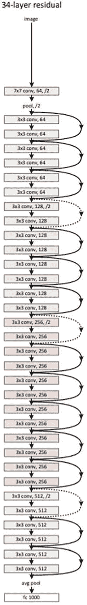

图 6-7

来源: [`https://arxiv.org/pdf/1512.03385.pdf`](https://arxiv.org/pdf/1512.03385.pdf)

ResNet 的主要关键是它允许梯度反向流动。此外，每两次卷积都会绕过输入。CNN 中的这两种变通方法解决了渐变消失的问题。要了解更多关于 ResNet 的信息，请访问 [`https://arxiv.org/pdf/1512.03385.pdf`](https://arxiv.org/pdf/1512.03385.pdf) 。接下来介绍的是 34 层剩余网络。

### 图像分类的 pagemaker 应用

对于这个算法，我们将使用一个名为 Caltech256 的数据集。它包含 256 个物体类别的大约 30，000 幅图像。这些类别包括 ak47、蚱蜢、浴缸等。我们可以探索关于该数据集的更多信息，或者从 [`http://www.vision.caltech.edu/Image_Datasets/Caltech256/`](http://www.vision.caltech.edu/Image_Datasets/Caltech256/) 下载数据集。

因此，在这一节中，我们的任务是创建一个机器学习算法，将图像分类到这 256 个类别中。我们将从定义我们的角色、区域等开始。，我们在前面的章节中已经看到了。接下来，让我们初始化图像分类算法的 Docker 容器。

```py
training_image = get_image_uri(boto3.Session().region_name, 'image-classification')

```

我们已经将这些图像分类为训练集和验证集。我们可以直接使用这些图像。我们可以从这里下载图片:

[T2`http://data.mxnet.io/data/caltech-256/caltech-256-60-train.rec`](http://data.mxnet.io/data/caltech-256/caltech-256-60-train.rec)

[T2`http://data.mxnet.io/data/caltech-256/caltech-256-60-val.rec`](http://data.mxnet.io/data/caltech-256/caltech-256-60-val.rec)

让我们把这些图像移到我们的 S3 桶。这些图像是 RecordIO-Protobuf 格式，因为算法只希望它们是这种格式。这次让我们创建一个将文件上传到 S3 的函数。

```py
def upload_to_s3(channel, file):
    s3 = boto3.resource('s3')
    data = open(file, "rb")
    key = channel + '/' + file
    s3.Bucket(bucket).put_object(Key=key, Body=data)

```

我们现在将在存储桶中定义保存数据的文件夹。

```py
s3_train_key = "image-classification/train"
s3_validation_key = "image-classification/validation"

```

剩下的工作就是将图像文件存储在 S3。

```py
upload_to_s3(s3_train_key, 'caltech-256-60-train.rec')
upload_to_s3(s3_validation_key, 'caltech-256-60-val.rec')

```

让我们定义与算法相关的参数，我们将使用这些参数来训练模型。

```py
num_layers = "18"
image_shape = "3,224,224"
num_training_samples = "15420"
num_classes = "257"
mini_batch_size =  "64"
epochs = "2"
learning_rate = "0.01"

```

层数决定了网络的深度。图像形状为 224×224，三通道(RGB)。训练数据集中的图像总数是 15，420。我们总共有 257 个类，256 个对象，还有一个额外的类给其他人。我们将批量大小定义为 64，这表示一次将有多少图像进入网络。我们将时期定义为 2，这意味着模型将在整个训练数据集上训练两次。最后，学习率被选择为 0.1，这将决定收敛并达到局部最小值所需的步数。

我们现在可以定义算法了。我们已经初始化了容器。

```py
s3 = boto3.client('s3')

job_name_prefix = 'imageclassification'

job_name = job_name_prefix + '-' + time.strftime('-%Y-%m-%d-%H-%M-%S', time.gmtime())

training_params = \
{
    "AlgorithmSpecification": {
        "TrainingImage": training_image,
        "TrainingInputMode": "File"
    },
    "RoleArn": role,
    "OutputDataConfig": {
        "S3OutputPath": 's3://{}/{}/output'.format(bucket, job_name_prefix)
    },
    "ResourceConfig": {
        "InstanceCount": 1,
        "InstanceType": "ml.p2.xlarge",
        "VolumeSizeInGB": 50
    },
    "TrainingJobName": job_name,
    "HyperParameters": {
        "image_shape": image_shape,
        "num_layers": str(num_layers),
        "num_training_samples": str(num_training_samples),
        "num_classes": str(num_classes),
        "mini_batch_size": str(mini_batch_size),
        "epochs": str(epochs),
        "learning_rate": str(learning_rate)
    },
    "StoppingCondition": {
        "MaxRuntimeInSeconds": 360000
    },
    "InputDataConfig": [
        {
            "ChannelName": "train",
            "DataSource": {
                "S3DataSource": {
                    "S3DataType": "S3Prefix

",
                    "S3Uri": s3_train,
                    "S3DataDistributionType": "FullyReplicated"
                }
            },
            "ContentType": "application/x-recordio",
            "CompressionType": "None"
        },
        {
            "ChannelName": "validation",
            "DataSource": {
                "S3DataSource": {
                    "S3DataType": "S3Prefix",
                    "S3Uri": s3_validation,
                    "S3DataDistributionType": "FullyReplicated"
                }
            },
            "ContentType": "application/x-recordio",
            "CompressionType": "None"
        }
    ]
}

```

我们已经知道了以前的 JSON 中的大多数参数，因为我们已经在 XGBoost 算法中介绍过了。以下是该算法中的一些独特参数:

*   `ContentType`就是`application/x-recordio`。正如我已经提到的，图像分类只需要 RecordIO-Protobuf 数据格式。

*   `S3DataDistributionType`是完全复制的，这意味着如果我们使用多个实例进行并行训练，那么数据集将在所有实例中复制。

*   我们使用的实例类型是`p2.xlarge`,因为图像分类需要一个有显卡的实例。要知道`p2`和`p3`实例根本不是免费的，它们是要收费的。

一旦我们完成了算法规范，我们将开始培训过程。

```py
sagemaker = boto3.client(service_name='sagemaker')
sagemaker.create_training_job(**training_params)
status = sagemaker.describe_training_job(TrainingJobName=job_name)['TrainingJobStatus']
print(status)
while status !='Completed' and status!='Failed':
    time.sleep(60)
    status = client.describe_training_job(TrainingJobName=job_name)['TrainingJobStatus']
    print(status)

```

如图所示，这段代码将开始训练，然后通知我们训练是否成功完成。一旦训练结束，我们将部署模型，然后进行预测。同样，该过程将与我们在前面的算法中看到的过程相同。

```py
endpoint_response= sagemaker.create_endpoint(
    EndpointName="image-classification-caltech-endpoint",
    EndpointConfigName="image-classification-caltech-config")

```

这将需要一些时间，并增加端点生成所需的资源。一旦端点生成，我们就可以开始预测了。

让我们下载一张图片，并用它来测试我们的模型。我们可以下载一个浴缸图像，并检查模型是否完美地预测了它。

```py
! wget -O /tmp/test.jpg http://www.vision.caltech.edu/Image_Datasets/Caltech2img/008.bathtub/008_0007.jpg

```

前一行将直接下载图像到您的系统。如果你的系统不是 Linux，那么你可以直接去链接下载镜像。接下来，我们需要读取图像，然后将其传递给端点。

```py
with open('/tmp/test.jpg', 'rb') as f:
    payload = f.read()
    payload = bytearray(payload)

response = runtime.invoke_endpoint(EndpointName=endpoint_name,
                   ContentType='application/x-image',
                   Body=payload)

result = response['Body'].read()
result = json.loads(result)

```

可变结果由所有类别的预测概率组成。我们需要找到具有最大概率的类。这意味着，如果我们能得到有最大概率的论点，那将是我们预测的类。为此，我们可以使用`np.argmax()`函数。

```py
index = np.argmax(result)

```

现在，我们可以使用这个索引来提取标签。我们可以创建一个所有标签的列表，其顺序与它们在数据集中出现的顺序相同，然后我们可以传递索引来预测标签。假设我们将所有的类保存在变量`object_classes`中。接下来我们可以打印预测。

```py
print("Result: label - " + object_categories[index] + ", probability - " + str(result[index]))

```

您可以在 GitHub 资源库中找到完整的代码。此外，不要忘记在所有操作完成后删除端点。

```py
sage.delete_endpoint(EndpointName=endpoint_name)

```

## 探索 SeqToSeq 算法

亚马逊的序列到序列算法基于递归神经网络、卷积神经网络和编码器-解码器架构，以更有效地理解上下文。下一节是 RNN 和编码器-解码器架构的简要概述。

### 递归神经网络

当我们处理顺序数据或基于时间的数据时，有必要记住过去的一些事情，并了解如何用它们来预测结果。这对于使用普通的人工神经网络或卷积神经网络是不可能的。因此，每当我们处理顺序数据时，都会使用一种叫做 RNN 的新架构。图 6-8 显示了一个简单的 RNN 架构。

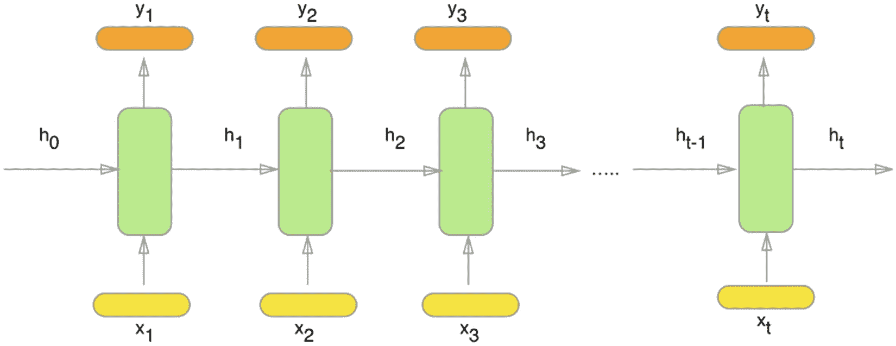

图 6-8

递归神经网络

例如，在文本分类中，提取文本的每个单词，应用一些基于神经网络的计算，并且存储重要的方面，然后传递到下一个 RNN 层。存储发生在`h`中，字通过`x`发送，而输出通过`y`接收。单词不是直接传递的，而是转换成向量再传递。我们可以在 SageMaker 中使用 word2vec、glove 或 blazing text 等算法来生成这些词向量。

对 rnn 有各种修改，解决了原始版本中存在的缺点。最常用的两种是长短期记忆(LSTM)和门控循环单位(GRU)。

### 编码器-解码器架构

图 [6-9](#Fig9) 显示了典型的编码器和解码器架构。

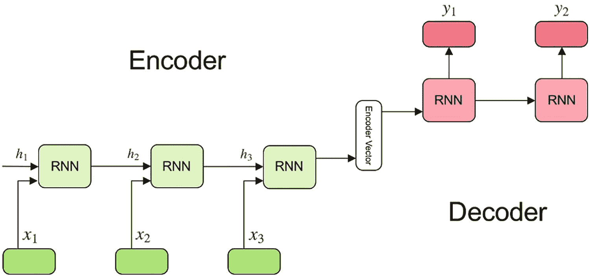

图 6-9

编码器和解码器

编码器通常不仅用于记忆过去并给出准确的预测，还用于理解所传递文本的上下文。我们可以使用正常的 rnn 或 LSTMS 和 gru。一旦编码器查看了所有的单词向量，它们就生成编码器向量，并将它们传递给解码器。编码器向量满足了编码器接收到的所有信息，解码器使用它来进行有效的预测。

解码器获取这些编码器向量，将其提供给自己的 rnn，然后应用 softmax 激活函数给出输出。除了理解上下文之外，这种架构的最大优点是它能够接受可变长度的输入并给出可变长度的输出。

### seqtoseq 的 pagemaker 应用程序

让我们通过将其应用于机器翻译用例来更详细地理解该算法；那就是，让我们把一些东西从英语翻译成德语。前几个步骤将保持不变，就像我们在前面的算法中看到的那样。

```py
from time import gmtime, strftime
import time
import numpy as np
import os
import json
import boto3
import re
from sagemaker import get_execution_role
region_name = boto3.Session().region_name

bucket = 'slytherins-test'
prefix = 'seq2seq-E2G'
role = get_execution_role()

from sagemaker.amazon.amazon_estimator import get_image_uri
container = get_image_uri(region_name, 'seq2seq')

```

因此，在前面的步骤中，我们已经定义了算法的容器，并定义了存储桶和文件夹，其中将保存整个模型相关的文件。下一步是建立一个数据集。Seq2Seq 算法有两种方法。首先，您可以使用可用于预测的预训练模型。因此，对于我们的例子，已经存在一个模型，该模型被训练成英语到德语的机器翻译。或者，我们可以在自己的语料库上训练该模型，然后将其用于预测。这个过程可能要花很多时间，但是当用于特定领域的翻译任务时，它是最好的。

我们将首先看看如何在语料库上训练模型，然后我们将使用预训练的模型进行预测。我们将使用的数据是新闻数据。我们将有包含英语新闻评论和德语翻译的文件。我们可以从 [`http://data.statmt.org/wmt17/translation-task/`](http://data.statmt.org/wmt17/translation-task/) 得到这些文件。

让我们从笔记本内部下载数据，并创建我们的培训和验证集。

```py
! wget http://data.statmt.org/wmt17/translation-task/preprocessed/de-en/corpus.tc.de.gz

! wget http://data.statmt.org/wmt17/translation-task/preprocessed/de-en/corpus.tc.en.gz

! gunzip corpus.tc.de.gz

! gunzip corpus.tc.en.gz

! mkdir validation

! curl http://data.statmt.org/wmt17/translation-task/preprocessed/de-en/dev.tgz | tar xvzf - -C validation

```

我们之前下载的文件很大，每个大约 250 MB。因此，如果我们在整个数据集上训练模型，可能需要几天才能完成。因此，我们可以获取整个数据的子集，并将其用于训练。

```py
! head -n 10000 corpus.tc.en > corpus.tc.en.small
! head -n 10000 corpus.tc.de > corpus.tc.de.small

```

前面创建的子集有 10，000 行。我们将使用这个小数据集进行训练。下一步是从前面的文件中生成英语和德语词汇。这将使用标记化和其他 NLP 组件来生成词汇表。

```py
%%bash
python3 create_vocab_proto.py \
      --train-source corpus.tc.en.small \
      --train-target corpus.tc.de.small \
      --val-source validation/newstest2014.tc.en \
      --val-target validation/newstest2014.tc.de

```

前面的 Python 脚本将源英语文本和目标德语文本作为输入。它应用预处理来生成词汇表。最后，它将英语和德语词汇保存在验证文件夹中。我们使用`%%bash`来运行笔记本内部的任何命令行脚本。这是一个朱庇特魔法函数。

既然我们的数据集已经创建，我们需要把它发送到我们的 S3 桶。

```py
def upload_to_s3(bucket, prefix, channel, file):
    s3 = boto3.resource('s3')
    data = open(file, "rb")
    key = prefix + "/" + channel + '/' + file
    s3.Bucket(bucket).put_object(Key=key, Body=data)

upload_to_s3(bucket, prefix, 'train', 'train.rec')
upload_to_s3(bucket, prefix, 'validation', 'val.rec')
upload_to_s3(bucket, prefix, 'vocab', 'vocab.src.json')
upload_to_s3(bucket, prefix, 'vocab', 'vocab.trg.json')

```

我们刚刚执行的代码生成了两个文件。一个是生成的词汇表，第二个是数据的 RecordIO-Protobuf 版本。我们将使用前面的代码将这两个文件上传到 S3。

所有的基本步骤都完成了，现在我们要初始化算法。我们将使用下面显示的代码来完成这项工作:

```py
job_name = 'seq2seq-E2G'
print("Training job", job_name)

create_training_params = \
{
    "AlgorithmSpecification": {
        "TrainingImage": container,
        "TrainingInputMode": "File"
    },
    "RoleArn": role,
    "OutputDataConfig": {
        "S3OutputPath": "s3://{}/{}/".format(bucket, prefix)
    },
    "ResourceConfig": {
        # Seq2Seq does not support multiple machines. Currently, it only supports single machine, multiple GPUs
        "InstanceCount": 1,
        "InstanceType": "ml.m4.xlarge", # We suggest one of ["ml.p2.16xlarge", "ml.p2.8xlarge", "ml.p2.xlarge"]
        "VolumeSizeInGB": 5
    },
    "TrainingJobName": job_name,
    "HyperParameters": {
        # Please refer to the documentation for complete list of parameters

        "max_seq_len_source": "60",
        "max_seq_len_target": "60",
        "optimized_metric": "bleu",
        "batch_size": "64", # Please use a larger batch size (256 or 512) if using ml.p2.8xlarge or ml.p2.16xlarge
        "checkpoint_frequency_num_batches": "1000",
        "rnn_num_hidden": "512",
        "num_layers_encoder": "1",
        "num_layers_decoder": "1",
        "num_embed_source": "512",
        "num_embed_target": "512"
    },
    "StoppingCondition": {
        "MaxRuntimeInSeconds": 48 * 3600
    },
    "InputDataConfig": [
        {
            "ChannelName": "train",
            "DataSource": {
                "S3DataSource": {
                    "S3DataType": "S3Prefix",
                    "S3Uri": "s3://{}/{}/train/".format(bucket, prefix),
                    "S3DataDistributionType": "FullyReplicated"
                }
            },
        },
        {
            "ChannelName": "vocab",
            "DataSource": {
                "S3DataSource": {
                    "S3DataType": "S3Prefix",
                    "S3Uri": "s3://{}/{}/vocab/".format(bucket, prefix),
                    "S3DataDistributionType": "FullyReplicated

"
                }
            },
        },
        {
            "ChannelName": "validation",
            "DataSource": {
                "S3DataSource": {
                    "S3DataType": "S3Prefix",
                    "S3Uri": "s3://{}/{}/validation/".format(bucket, prefix),
                    "S3DataDistributionType": "FullyReplicated"
                }
            },
        }
    ]
}

sagemaker_client = boto3.Session().client(service_name='sagemaker')
sagemaker_client.create_training_job(**create_training_params)

```

可以看到格式与 XGBoost 算法和图像分类算法相同。所有参数都与我们在前面章节中讨论的算法相同。只有超参数特定于该算法。让我们来讨论这些参数:

*   原始文本和目标文本的最大序列长度是作为序列并传递给神经网络结构的字符数。

*   批处理大小是一次传递给算法的行数。

*   检查点频率在每批 1，000 行之后保存模型。

*   神经网络的隐藏层数被定义为 512，具有一个编码器结构单元和一个解码器结构单元。记住，这些单元是用来理解句子的上下文的。

*   嵌入源和目标定义了数据集中每个句子的词向量大小。它被设置为 512。

这段代码将启动培训的执行，需要花费很多时间才能完成。记住，这个算法需要一个 GPU 实例来执行。因此，无论您选择哪个实例，都是可以收费的。明智地选择。

现在，让我们看看如何使用已经存在的预训练模型，并通过公开端点对测试数据集进行推断。当我们训练前面的模型时，我们将得到三个文件:

*   `Model.tar.gz`

*   `Vocab.src.json`

*   `Vocab.trg.json`

所以，一旦你训练了模型，你就可以直接使用这些文件了。但是，为了使用预训练模型，我们将下载这些文件。我们可以从这里下载:

```py
model_name = "DEMO-pretrained-en-de-model"
! curl https://s3-us-west-2.amazonaws.com/seq2seq-data/model.tar.gz > model.tar.gz
! curl https://s3-us-west-2.amazonaws.com/seq2seq-data/vocab.src.json > vocab.src.json
! curl https://s3-us-west-2.amazonaws.com/seq2seq-data/vocab.trg.json > vocab.trg.json

```

我们必须将模型文件上传到 S3，以便我们的端点可以使用它。

```py
upload_to_s3(bucket, prefix, 'pretrained_model', 'model.tar.gz')
model_data = "s3://{}/{}/pretrained_model/model.tar.gz".format(bucket, prefix)

```

`model_data`存储上传的模型文件的地址。接下来，我们将不得不在算法中更新这个模型，以便我们可以使用它进行预测。为此，我们将使用`create_model()`函数。

```py
sage = boto3.client('sagemaker')
primary_container = {
    'Image': container,
    'ModelDataUrl': model_data
}

create_model_response = sage.create_model(
    ModelName = model_name,
    ExecutionRoleArn = role,
    PrimaryContainer = primary_container)

```

下一步是定义端点将使用的资源。

```py
from time import gmtime, strftime

endpoint_config_name = 'DEMO-Seq2SeqEndpointConfig-' + strftime("%Y-%m-%d-%H-%M-%S", gmtime())
print(endpoint_config_name)
create_endpoint_config_response = sage.create_endpoint_config(
    EndpointConfigName = endpoint_config_name,
    ProductionVariants=[{
        'InstanceType':'ml.m4.xlarge',
        'InitialInstanceCount':1,
        'ModelName':model_name,
        'VariantName':'AllTraffic'}])

```

现在，我们可以通过使用前面的配置来公开端点。

```py
endpoint_name = 'DEMO-Seq2SeqEndpoint-' + strftime("%Y-%m-%d-%H-%M-%S", gmtime())

create_endpoint_response = sage.create_endpoint(
    EndpointName=endpoint_name,
    EndpointConfigName=endpoint_config_name)

```

一段时间后，我们的端点将准备好进行推断。让我们看看如何进行预测，在这种情况下，将英语文本转换为德语。

```py
runtime = boto3.client(service_name='runtime.sagemaker')
sentences = ["you are so good !",
             "can you drive a car ?",
             "i want to watch a movie ."
            ]

payload = {"instances" : []}
for sent in sentences:
    payload["instances"].append({"data" : sent})

response = runtime.invoke_endpoint(EndpointName=endpoint_name,
                                   ContentType='application/json',
                                   Body=json.dumps(payload))

response = response["Body"].read().decode("utf-8")
response = json.loads(response)
print(response)

```

您将获得如下所示的输出:

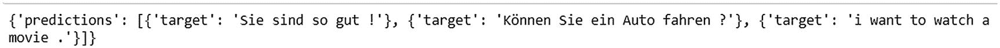

如您所见，预测已经成功完成。

## 结论

在本章中，您了解了 SageMaker 的各种内置算法。这些是机器学习领域中已经存在的算法的优化版本。在下一章中，我们将探索不同的指标，通过这些指标，我们可以使用云指标评估这些模型，使用 CloudWatch 查看容器运行时的日志，并通过 lambda 函数的连接详细探索端点配置。此外，我们将对我们在本章中已经看到的算法进行批量转换。