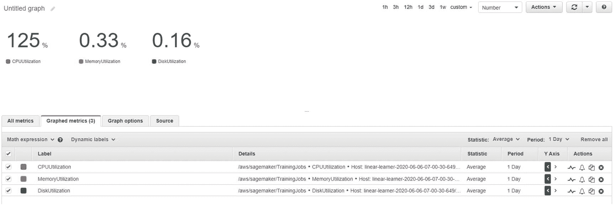

# 7.通过 SageMaker 使用 CloudWatch

在本章中，我们将详细探讨 AWS 中的 CloudWatch 功能。具体来说，我们将查看 CloudWatch 的两个组件，CloudWatch 日志和 CloudWatch 指标，我们在使用 SageMaker 时会经常用到这两个组件。

## 亚马逊云观测

亚马逊云观察(Amazon CloudWatch)是亚马逊提供的一项服务，用于跟踪 AWS 的资源活动，并提供与之相关的指标。它还存储由使用的每个资源提供的日志。通过这些日志和指标，用户可以探索正在使用的 AWS 资源的性能，以及可以做些什么来改善它。

当涉及到机器学习，特别是使用 SageMaker 时，CloudWatch Logs 给我们提供了代码在其中运行的容器的输出。正如我们在前面的章节中已经看到的，机器学习算法在附加到 EC2 实例的 Docker 容器中运行。因此，来自这些容器的输出不是直接可见的。为了查看这个输出，我们必须对我们的代码进行一些调整，然后可以在使用中的 Jupyter 笔记本中直接看到状态，或者我们可以使用 CloudWatch 日志以分步方式获得这个输出。输出可以包括您的模型输出、您的模型失败的原因、对逐步执行的洞察等等。三个作业需要容器，因此我们在机器学习中有三个日志组。

*   处理作业日志组

*   培训工作日志组

*   转换作业日志组

我们将在接下来的小节中详细讨论这些日志组。

CloudWatch Metrics 以变量值的形式为我们提供信息。例如，当涉及到机器学习时，CloudWatch 指标可以提供模型的准确性、精确度、误差等值。它还可以提供与资源相关的指标，如 GPU 利用率、内存利用率等。我们将在接下来的章节中详细讨论 CloudWatch 指标。图 [7-1](#Fig1) 展示了 CloudWatch 如何工作的架构。

图 7-1

亚马逊云手表架构

通过查看这个架构，我们可以看到，除了通过亚马逊管理控制台访问服务之外，我们还可以通过亚马逊 SNS 集成警报，这些警报可以连接到您的电子邮件。我们还可以根据某些标准设置自定义规则。这包括启动、停止和终止进程，或者使用自动缩放等功能。让我们在下一节更深入地研究 CloudWatch 日志。

## CloudWatch 日志

在 SageMaker 控制台的左侧，我们有一个侧边栏，可以引导我们完成不同的操作。我们可以创建笔记本实例，查看我们运行的不同算法，并分析端点。通过查看日志详细信息，我们可以查看我们使用过的所有服务的日志。让我们从与培训工作相关的日志开始。

### 培训工作

在前一章中，我们在 Big Mart 数据集上运行了一个 XGBoost 模型。在 SageMaker 控制台内，如果我们转到培训下拉菜单并选择“培训作业”(图 [7-2](#Fig2) ，我们将获得我们已经运行的所有算法的列表(图 [7-3](#Fig3) )。

图 7-3

选择需要分析日志的作业

图 7-2

选择培训工作

我们可以选择需要更多细节的算法；在我们的例子中，它是 XGBoost。当我们单击该算法时，会打开一个新页面，其中包含我们运行的模型的大量信息。例如，它讲述了我们在运行模型时提供的算法规范。如果我们向下滚动页面，将会看到一个名为 Monitor 的部分(图 [7-4](#Fig4) )。从那里我们可以跳转到 CloudWatch 日志。

图 7-4

监控部分

点击“查看日志”链接，您将看到 CloudWatch 页面打开。见图 [7-5](#Fig5) 。

图 7-5

为日志选择算法

如图 [7-5](#Fig5) 所示，CloudWatch 控制台中有很多选项可用。我们正在查看日志组。如你所知，因为我们已经选择了培训工作，该信息显示在控制台的顶部(参见图 [7-6](#Fig6) )。

图 7-6

小路

当我们向下滚动时，在底部我们可以看到算法的名称。我们必须点击它才能进入日志(见图 [7-7](#Fig7) )。

图 7-7

可视化日志

您可以看到，与您的算法相关的完整日志将出现在那里。我们得到逐步的结果，在这种情况下，包括训练和验证错误。您可以继续向下滚动，直到页面结束，以到达算法的最后一个输出。这就是你可以查看你已经执行的任何训练算法的日志的方式。

请记住，只有当容器成功启动并且算法开始运行时，日志才会开始出现。如果您的 Docker 脚本有问题，那么您将不会发现任何生成的日志。但是，如果您与算法相关的代码有错误，那么您将在 logs 部分找到信息，因为容器已经成功启动，因此日志已经开始生成。因此，如果您的模型没有运行，您可以查看日志来检查代码中的错误。对于定制容器，如果日志没有开始运行，通常错误可能在 Docker 脚本中。我们将在下一章探索自定义容器。现在让我们看看处理作业的日志。

### 处理作业

在第 [5](05.html) 章中，我们看到了如何使用处理脚本处理数据。我们使用了两个 Sklearn 容器，我还向您展示了如何使用自定义容器进行处理。让我们看看由我们的处理脚本生成的日志。为此，我们将首先从服务列表中打开 CloudWatch 控制台。在这里，单击我们在上一节中使用的日志组部分。在这里，您会发现不同日志组的列表，如图 [7-8](#Fig8) 所示。

图 7-8

日志组

您可以看到，除了培训作业之外，您还会发现处理作业、笔记本实例和端点日志。让我们单击处理作业。您将找到您运行的所有处理作业的列表。如果你记得工作的名称，那么就更容易找到它。这就是为什么总是建议对各种作业使用唯一标识符的原因。单击我们运行的最新处理作业。一旦你点击它，你会发现处理容器给出的所有步骤输出的列表，如图 [7-9](#Fig9) 所示。

图 7-9

集装箱的产量

这就是如何使用 CloudWatch 来获得关于处理作业的见解。让我们看看，如果单击我们创建的端点，会得到什么输出。让我们探索一下线性学习者端点(图 [7-10](#Fig10) )。

图 7-10

探索线性学习终点

你可以看到我们为预测发送的所有测试数据，它为我们提供了 JSON 格式的输出。这就是我们如何在工作中使用 CloudWatch 日志。日志下面还有一个部分是转换作业，我们将在下一章讨论批处理转换作业时讨论这个部分。

## 云观察指标

类似于我们如何使用 CloudWatch 日志来查看我们的作业日志，我们可以获得与算法或资源相关的指标。让我们从了解与培训工作相关的指标开始。我们将登录我们的 SageMaker 控制台，进入培训工作页面。我们将探索在 Big Mart 数据集上完成的分类任务的线性学习者指标。我们将按照在 CloudWatch 日志中看到的相同步骤转到算法页面。进入该页面后，我们将点击查看指标，而不是点击查看日志，如图 [7-11](#Fig11) 所示。

图 7-11

选择指标

一旦你点击“查看算法指标”，在新的屏幕上你会发现不同的指标可用于该算法和图形画布。它看起来将如图 [7-12](#Fig12) 所示。

图 7-12

选择客观指标

在线性学习器算法中，我们可以看到的指标是损失函数、训练进度和吞吐量。让我们看看训练停止后损失函数的最终值。我们可以单击“目标损失”，然后单击“添加到图表”接下来，我们可以转到“图表化指标”选项，将时间段更改为您完成培训的时间。您可以将图形类型更改为数字。你将得到输出，如图 [7-13](#Fig13) 所示。

图 7-13

可视化客观损失

同样，基于数据集，我们可以访问许多指标，如图 [7-14](#Fig14) 所示。

图 7-14

不同种类的可用指标

可以采用相同的过程来获得已经运行的任何算法的度量。让我们看看实例度量的一些方面。在实例指标中，我们可以查看 CPU 利用率、内存利用率和磁盘利用率，如图 [7-15](#Fig15) 所示。

图 7-15

可视化指标

如果在培训期间打开 CloudWatch，您可以看到指标在实时变化。

## 结论

在本章中，您学习了如何使用 CloudWatch 获取不同算法和资源的日志和指标。在下一章，我们将看看如何训练一个自定义算法，也看看 SageMaker 的其他一些方面。