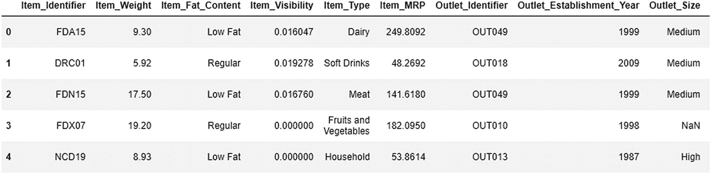
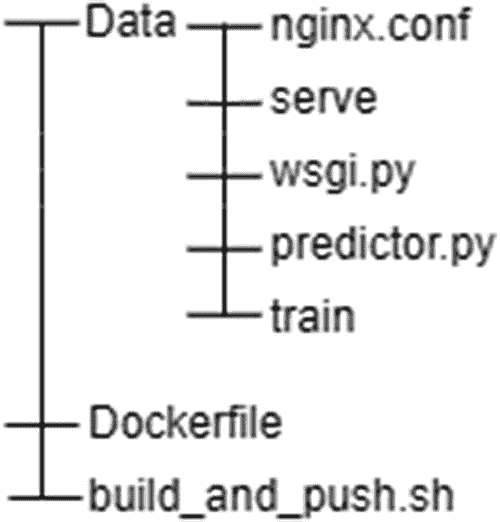
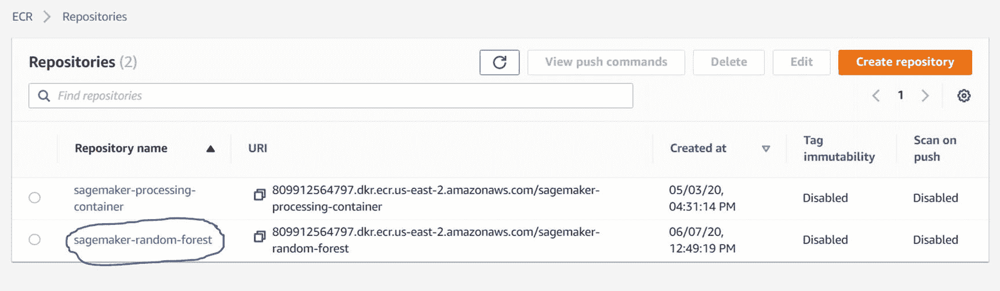
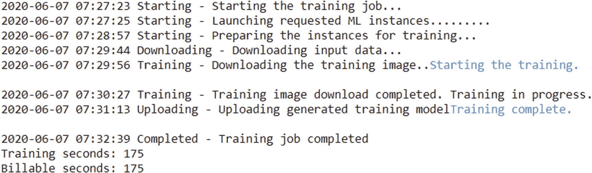
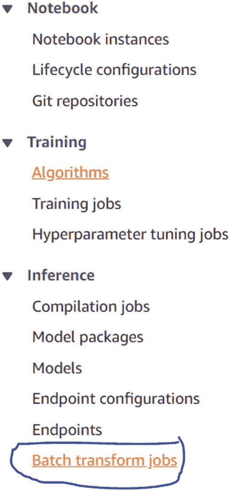
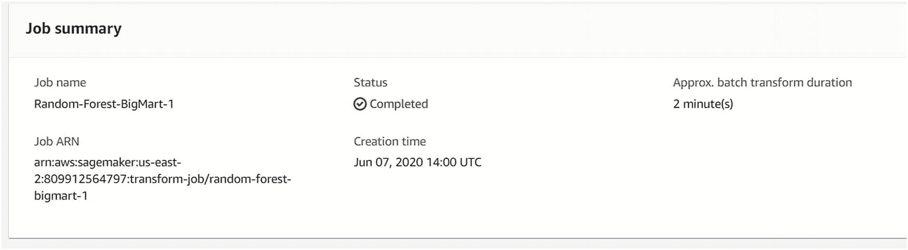

# 8.在 SageMaker 中运行自定义算法

在本章中，你将看到如何运行你自己的算法，而不是使用 SageMaker 的内置算法。尽管 SageMaker 为几乎任何类型的问题陈述提供了内置算法，但很多时候我们希望利用 SageMaker 的能力运行自己的定制模型。如果我们有 Docker 的工作知识和 Python 的实践知识，我们可以有效地这样做。在这一章中，我们将为我们的 Big Mart 数据集创建一个定制的随机森林模型。我们将在 ECR 中部署容器，然后使用 SageMaker 训练模型。然后，我们将使用该模型进行实时推理，并了解如何进行批量转换。

## 问题陈述

问题陈述是，我们将尝试使用随机森林算法(监督学习集成树算法之一)来预测一家电子商务公司的销售额。由于这是一个回归问题，我们将使用 Scikit-Learn 包的`RandomForestRegressor`类。我们已经在前几章探索了数据集；这是大集市的数据集。图 [8-1](#Fig1) 显示了数据集的前几行。



图 8-1

数据集的开始

如果您想了解数据集，请复习第 [5](05.html) 章。我们已经处理了该章中的数据，并创建了训练和验证数据集，因此我们在此不再重复该过程。在训练和测试分割完成后，我们将继续开发算法。请通过第 [5](05.html) 章修改整个流程。

## 运行模型

在 SageMaker 环境中应用模型之前，让我们首先在本地对我们准备的数据集运行算法，并检查发生的总损失。

```py
from sklearn.ensemble import RandomForestRegressor
rfc = RandomForestRegressor(n_estimators=500)

```

在前面的代码中，我们初始化了`RandomForestRegressor`算法，并要求合并 500 个独立决策树的输出。一旦我们初始化了算法，我们就可以开始训练模型了。

```py
rfc.fit(X_train, y_train)

```

前面的代码将开始模型的定型。现在，我们可以使用训练好的模型对测试集进行预测。

```py
predictions = rfc.predict(X_test)

```

所有的预测都不会存储在变量预测中。让我们来计算我们已经创建的模型的旋转均方误差。

```py
from sklearn.metrics import mean_squared_error
np.sqrt(mean_squared_error(predictions, y_test))

```

这将给出最终误差值。对我来说，大约是 1054。由于采样不同，不同的系统可能有不同的输出。

## 转换代码以使用 pagemaker 资源

既然我们已经成功地在本地环境中运行了代码，接下来我们将转换它，以便它可以在 SageMaker 环境中运行。以下是在 SageMaker 中运行定制模型的步骤:

1.  将数据存储在 S3。

2.  创建一个训练脚本，并将其命名为`train`。

3.  创建一个有助于预测的推理脚本。我们称之为`predictor.py`。

4.  设置文件，以便有助于端点生成。

5.  创建一个 docker 文件，它将有助于构建一个映像，整个代码将在该映像中运行。

6.  构建一个脚本，将 Docker 映像推送到 Amazon 弹性容器注册中心(ECR)。

7.  使用 SageMaker 和 Boto3 APIs 来训练和测试模型。

我们在 S3 已经有了我们的训练数据，所以我们将从创建一个训练脚本开始。

### 创建培训脚本

我们已经创建了一个培训笔记本。该培训脚本将与笔记本类似，但我们有一些额外的注意事项。首先要记住的是，脚本将在容器中运行。因此，可能存在同步问题，因为脚本在容器内部，而数据来自容器外部的 S3 桶。同样，算法的结果也应该保存在 S3 桶中。在我们创建培训脚本时，我们需要记住所有这些。

我们应该知道的第一件事是，在容器内部，不管进来的是什么数据，它都存储在文件夹`/opt/ml`中。因此，S3 的数据将从该文件夹下载。因此，在这个文件夹中，我们必须创建三个文件夹:一个存储输入，一个存储输出，一个存储模型。这可以通过使用以下脚本来定义:

```py
prefix = '/opt/ml/'
input_path = prefix + 'input/data'
output_path = os.path.join(prefix, 'output')
model_path = os.path.join(prefix, 'model')

```

在数据文件夹中，我们可以有多个文件，如`training`、`validation`或`testing`。我们也可以将不同的文件组成一个培训文件。因此，我们也可以进行这种隔离。对我们来说，我们只有一个档案:培训档案。因此，我们将只使用一个通道。

```py
channel_name='training'
training_path = os.path.join(input_path, channel_name)

```

这为我们处理数据的训练脚本做好了准备。接下来是培训脚本本身。数据将来自 S3。首先我们必须阅读它，然后应用我们在第 [5](05.html) 章中看到的所有步骤。要读取该文件，我们可以使用以下脚本:

```py
input_files = [ os.path.join(training_path, file) for file in os.listdir(training_path) ]
raw_data = [ pd.read_csv(file) for file in input_files ]
data = pd.concat(raw_data)

```

如果您有多个 CSV 表需要阅读，这个脚本也会有所帮助。但是，在这种情况下，请记住保留参数`header=None.`,因为我们已经读取了数据，我们可以开始训练过程。以下是培训的完整脚本:

```py
def train():
    print('Starting the training.')
    try:

        # Take the set of files and read them all into a single pandas dataframe
        input_files = [ os.path.join(training_path, file) for file in os.listdir(training_path) ]
        if len(input_files) == 0:
        raise ValueError(('There are no files in {}.\n' +
                 'This usually indicates that the channel ({}) was incorrectly specified,\n' +
                 'the data specification in S3 was incorrectly specified or the role specified\n' +
                 'does not have permission to access the data.').format(training_path, channel_name))
        raw_data = [ pd.read_csv(file) for file in input_files ]
        data = pd.concat(raw_data)
        data = data.sample(frac=1)

        for i in data.Item_Type.value_counts().index:
           data.loc[(data['Item_Weight'].isna()) & (data['Item_Type'] == i), ['Item_Weight']] = \
           data.loc[data['Item_Type'] == 'Fruits and Vegetables', ['Item_Weight']].mean()[0]

        cat_data = data.select_dtypes(object)

        num_data = data.select_dtypes(np.number)

        cat_data.loc[(cat_data['Outlet_Size'].isna()) & (cat_data['Outlet_Type'] == 'Grocery Store'), ['Outlet_Size']] = 'Small'
        cat_data.loc[(cat_data['Outlet_Size'].isna()) & (cat_data['Outlet_Type'] == 'Supermarket Type1'), ['Outlet_Size']] = 'Small'
        cat_data.loc[(cat_data['Outlet_Size'].isna()) & (cat_data['Outlet_Type'] == 'Supermarket Type2'), ['Outlet_Size']] = 'Medium'
        cat_data.loc[(cat_data['Outlet_Size'].isna()) & (cat_data['Outlet_Type'] == 'Supermarket Type3'), ['Outlet_Size']] = 'Medium'

        cat_data.loc[cat_data['Item_Fat_Content'] == 'LF' , ['Item_Fat_Content']] = 'Low Fat'
        cat_data.loc[cat_data['Item_Fat_Content'] == 'reg' , ['Item_Fat_Content']] = 'Regular'
        cat_data.loc[cat_data['Item_Fat_Content'] == 'low fat' , ['Item_Fat_Content']] = 'Low Fat'

        le = LabelEncoder()
        cat_data = cat_data.apply(le.fit_transform)

        ss = StandardScaler()

        num_data = pd.DataFrame(ss.fit_transform(num_data.drop(['Item_Outlet_Sales'], axis=1)), columns = num_data.drop(['Item_Outlet_Sales'],axis=1).columns)
        cat_data = pd.DataFrame(ss.fit_transform(cat_data.drop(['Item_Identifier'], axis=1)), columns = cat_data.drop(['Item_Identifier'], axis=1).columns)

        final_data = pd.concat([num_data,cat_data],axis=1)

        X = final_data
        y = data['Item_Outlet_Sales']

        from sklearn.model_selection import train_test_split
        X_train, X_test, y_train, y_test = train_test_split(X, y, test_size = 0.1, random_state=5)

        from sklearn.ensemble import RandomForestRegressor
        rfc = RandomForestRegressor(n_estimators=500)

        clf = rfc.fit(X_train, y_train)

        # save the model
        with open(os.path.join(model_path, 'randomForest-tree-model.pkl'), 'w') as out:
            pickle.dump(clf, out)
        print('Training complete.')
    except Exception as e:
        trc = traceback.format_exc()
        with open(os.path.join(output_path, 'failure'), 'w') as s:
            s.write('Exception during training: ' + str(e) + '\n' + trc)
        print('Exception during training: ' + str(e) + '\n' + trc, file=sys.stderr)
        sys.exit(255)

```

我们将把整个脚本保存在一个名为`train().`的函数中。在阅读 CSV 表之后，我们将遵循我们在第 [5 章](05.html)中看到的相同程序。稍后，我们将根据数据拟合随机森林模型，这是我们在上一节中运行的。

做完这一切后，我们必须保存这个模型，因为以后我们将不得不使用这个模型进行预测。为了保存模型，我们将首先使用 pickle 将其序列化，然后将其保存在模型位置。后来，这个模型将被保存在 S3。

最后，我们可以运行整个脚本。

```py
if __name__ == '__main__':
    train()
    sys.exit(0)

```

我们必须使用`sys.exit(0)`,因为它向 SageMaker 发送了培训已经成功完成的消息。用文件名`train`保存文件，不带扩展名。

### 创建推理脚本

训练脚本用于训练模型。但是，一旦模型训练完毕，我们就需要进行预测，无论是像我们在第 [6](06.html) 章中看到的实时推理，还是我们将在本章中看到的批量转换。我们将推理脚本保存在一个名为`predictor.py`的文件中。

预测器文件由以下组件组成:

*   `ScoringService()`阶级

*   `ping()`方法

*   `transformation()`方法

*   需要的任何其他帮助功能

`ScoringService()`类由两个函数组成。第一个函数`get_model()`加载并反序列化模型，而第二个方法`predict()`负责进行预测。记住，推理脚本也使用与训练脚本使用的基础文件夹相同的文件夹，`/opt/ml`。以下是`ScoringService()`类的脚本:

```py
prefix = '/opt/ml/'
model_path = os.path.join(prefix, 'model')

class ScoringService(object):
    model = None

    @classmethod
    def get_model(cls):
      if cls.model == None:
          with open(os.path.join(model_path, 'randomForest-tree-model.pkl'), 'r') as inp:
             cls.model = pickle.load(inp)
        return cls.model

    @classmethod
    def predict(cls, input):
        clf = cls.get_model()
        return clf.predict(input)

```

`ping()`方法只是用来检查代码运行所在的 Docker 容器是否健康。如果它不健康，那么它给出一个 404 错误，否则 202。

```py
@app.route('/ping', methods=['GET'])
def ping():
    status = 200 if health else 404
    return flask.Response(response='\n', status=status, mimetype='application/json')

```

`transformation()`是负责读取测试文件并调用所需方法和类的方法。这里需要理解的一点是，整个端点生成过程只不过是一个 API 的创建。一旦创建了 API，数据就作为 POST 请求发送，然后我们得到预测作为响应。这整个架构是使用 Flask 框架构建的。

数据是使用 POST 方法发送的，因此要读取它，我们需要使用`StringIO()`方法来解码数据。一旦数据被解码，我们就可以用正常的熊猫方法读取它。`transformation()`函数将数据发送给类`ScoringService().`的`predict()`函数，该方法将输出发送回`transformation()`函数。在`StringIO()`函数的帮助下，这个预测输出被发送回调用 API 的主机。这完成了终点的整个循环。下面是`transformation()`的代码:

```py
@app.route('/invocations', methods=['POST'])
def transformation():
    data = None

    if flask.request.content_type == 'text/csv':
        data = flask.request.data.decode('utf-8')
        s = StringIO.StringIO(data)
        data = pd.read_csv(s, header=None)
    else:
        return flask.Response(response='This predictor only supports CSV data', status=415, mimetype='text/plain')

    print('Invoked with {} records'.format(data.shape[0]))

    # Do the prediction
    predictions = ScoringService.predict(data)

    # Convert from numpy back to CSV
    out = StringIO.StringIO()
    pd.DataFrame({'results':predictions}).to_csv(out, header=False, index=False)
    result = out.getvalue()

    return flask.Response(response=result, status=200, mimetype='text/csv')

```

我们将使用这个 Python 文件来进行预测，但是为了高效地运行服务器，我们需要一些配置文件。让我们在下一节探索它们。

### 配置端点生成文件

为了成功运行推理服务器，我们需要配置以下文件:

*   `nginx.conf`文件

*   `serve`文件

*   `wsgi.py`文件

通常我们不会对这些文件进行修改。我们创造它们，然后用它们进行预测。我们不会深入这些文件的逐行细节，但让我们了解每个文件的用途。

Nginx 文件用于启动服务器，并使部署在 EC2 实例上的 Docker 容器和 SageMaker 网络内外的客户机之间的连接成为可能。Nginx 使用一个名为 Gunicorn 的 Python 框架来帮助设置 HTTP 服务器。

Serve 使用正在运行的 Gunicorn 服务器来实现不同资源之间的连接。具体来说，它用于以下目的:

*   有效地使用运行模型的 CPU 数量

*   定义服务器超时

*   生成日志

*   使用 Nginx 和 Gunicorn 启动服务器

*   如果事情没有按预期进行，停止服务器

最后，`wsgi.py`文件用于告诉服务器我们的`predictor.py`文件。我们可以在这本书的 GitHub 资源库中探索每个文件中的代码。请记住，这些文件非常重要，因为没有它们，服务器将永远无法运行；因此，你无法做出预测。不要修改这些文件，除非你非常确定你在做什么。

### 设置 Dockerfile 文件

现在我们所有的脚本文件都准备好了，我们必须创建一个 Docker 映像，这样它就可以上传到 ECR，然后 SageMaker 就可以访问其中的代码，并在附加的 EC2 实例中运行它。让我们首先看看如何给我们创建的文件一个结构。图 [8-2](#Fig2) 描述了在创建图像之前，我们应该给目录的结构。



图 8-2

目录结构

我们已经创建了存在于`Data`目录中的所有文件。现在，我们必须创建一个`Dockerfile`脚本，运行它来构建图像。然后我们将使用`build_and_push.sh`文件将图像推送到 ECR。

这些是我们将在`Dockerfile`中遵循的步骤:

1.  从 DockerHub 下载一个包含我们操作系统的映像。我们将下载一个最小版本的 Ubuntu，这样我们的代码可以在里面运行。为此，我们将使用以下脚本:

1.  说出维护和创造这一形象的人或组织的名字。我在这里写了我的名字。你可以用任何你喜欢的名字。

```py
FROM ubuntu:16.04

```

1.  运行一些 Ubuntu 命令，这样我们就可以设置 Python 环境并更新操作系统文件。我们还将下载用于运行推理端点的服务器文件。要理解这个脚本，您必须熟悉 Linux 命令。

    ```py
    RUN apt-get -y update && apt-get install -y --no-install-recommends \
             wget \
             python \
             nginx \
             ca-certificates \
        && rm -rf /var/lib/apt/lists/*

    ```

2.  一旦设置完成，我们可以使用 Python 中的`pip`来安装重要的 Python 包。

    ```py
    RUN wget https://bootstrap.pypa.io/get-pip.py && python get-pip.py && \
        pip install numpy==1.16.2 scipy==1.2.1 scikit-learn==0.20.2 pandas flask gevent gunicorn && \
            (cd /usr/local/lib/python2.7/dist-packages/scipy/.libs; rm *; ln ../../numpy/.libs/* .) && \
            rm -rf /root/.cache

    ```

3.  设置环境变量，以便 Python 知道包含代码的默认文件夹是什么。此外，我们将设置 Python 的一些特性。我们首先确保应该从容器接收到及时的日志消息，然后我们确保一旦任何模块被导入 Python，它的`.pyc`文件不会被创建。这是分别使用变量`pythonunbuffered`和`pythondontwritebytecode`完成的。

    ```py
    ENV PYTHONUNBUFFERED=TRUE
    ENV PYTHONDONTWRITEBYTECODE=TRUE
    ENV PATH="/opt/program:${PATH}"

    ```

4.  最后，实例将指示将我们的`Data`目录文件复制到默认工作目录，然后我们将更改默认工作目录。

    ```py
    COPY Data /opt/program
    WORKDIR /opt/program

    ```

```py
MAINTAINER Himanshu Singh

```

这就完成了我们的创作。以下是完整的代码:

```py
FROM ubuntu:16.04

MAINTAINER Himanshu Singh

RUN apt-get -y update && apt-get install -y --no-install-recommends \
         wget \
         python \
         nginx \
         ca-certificates \
    && rm -rf /var/lib/apt/lists/*

RUN wget https://bootstrap.pypa.io/get-pip.py && python get-pip.py && \
    pip install numpy==1.16.2 scipy==1.2.1 scikit-learn==0.20.2 pandas flask gevent gunicorn && \
        (cd /usr/local/lib/python2.7/dist-packages/scipy/.libs; rm *; ln ../../numpy/.libs/* .) && \
        rm -rf /root/.cache

ENV PYTHONUNBUFFERED=TRUE
ENV PYTHONDONTWRITEBYTECODE=TRUE
ENV PATH="/opt/program:${PATH}"

COPY Data /opt/program
WORKDIR /opt/program

```

现在，让我们来看一下将这个图像推送到 ECR 的脚本。

### 将 Docker 图像推送到 ECR

我们将创建一个 shell 脚本文件，它将首先用于从我们在上一节中创建的`Dockerfile`构建图像，然后将图像推送到 ECR。让我们来看看这一步一步的过程:

1.  给图像命名。我们将把名字保存在一个变量中。

1.  授予 train 和 serve 文件完全的读写权限，这样一旦容器启动，就不会出现拒绝访问错误。

    ```py
    chmod +x Data/train
    chmod +x Data/serve

    ```

2.  获取 AWS 配置，以便在推送映像时不会出现中断。我们将定义 AWS 的客户和区域。记住，因为我们将从 SageMaker 内部运行这段代码，所以可以自动获取信息。如果我们从您的本地系统或 AWS 之外的任何地方运行它，那么我们必须给出自定义值。

    ```py
    account=$(aws sts get-caller-identity --query Account --output text)
    region=$(aws configure get region)
    region=${region:-us-east-2}

    ```

3.  给出容器的路径和名称。我们将使用第一步中给出的相同名称。我们稍后将使用此路径来推送图像。

    ```py
    fullname="${account}.dkr.ecr.${region}.amazonaws.com/${algorithm_name}:latest"

    ```

4.  检查图像是否已经存在。如果没有，那么就会产生一个新的形象；否则，相同的图像将被更新。

    ```py
    aws ecr describe-repositories --repository-names "${algorithm_name}" > /dev/null 2>&1

    if [ $? -ne 0 ]
    then
        aws ecr create-repository --repository-name "${algorithm_name}" > /dev/null
    fi

    ```

5.  获取 AWS 帐户的登录凭据。

```py
algorithm_name=sagemaker-random-forest

```

1.  用已经决定的名称构建映像，用我们决定的包含 ECR 地址的全名重命名它，然后最后推送代码。

    ```py
    docker build  -t ${algorithm_name} .
    docker tag ${algorithm_name} ${fullname}
    docker push ${fullname}

    ```

```py
$(aws ecr get-login --region ${region} --no-include-email)

```

以下是应该保存在文件`build_and_push.sh`中的整个脚本。

```py
algorithm_name=sagemaker-random-forest
chmod +x Container/train
chmod +x Container/serve
account=$(aws sts get-caller-identity --query Account --output text)
region=$(aws configure get region)
region=${region:-us-east-2}
fullname="${account}.dkr.ecr.${region}.amazonaws.com/${algorithm_name}:latest"
aws ecr describe-repositories --repository-names "${algorithm_name}" > /dev/null 2>&1
if [ $? -ne 0 ]
then
    aws ecr create-repository --repository-name "${algorithm_name}" > /dev/null
fi
$(aws ecr get-login --region ${region} --no-include-email)
docker build  -t ${algorithm_name} .
docker tag ${algorithm_name} ${fullname}
docker push ${fullname}

```

完成这一步后，我们必须进入终端，进入您的`Dockerfile`所在的目录，然后键入以下内容:

```py
sh build_and_push.sh

```

这将开始运行脚本，并将映像成功上传到 ECR。然后，您可以转到 ECR 并检查该图像是否存在。图 [8-3](#Fig3) 显示了我们在 ECR 中的图像。



图 8-3

ECR 中的容器图像

这就完成了创建 Docker 的过程。现在，我们将在下一节中看到如何使用该图像在 SageMaker 笔记本中训练模型。

## 训练模型

现在，我们将使用一个 SageMaker 笔记本在 Big Mart 数据集上执行一个分类模型，使用我们刚刚创建的随机森林容器。像我们在第 [6](06.html) 章看到的模型一样，我们必须首先定义角色，然后创建 SageMaker 会话，最后定义 SageMaker 运行的帐户和区域。

```py
import boto3
import re
import os
import numpy as np
import pandas as pd
from sagemaker import get_execution_role
import sagemaker as sage

role = get_execution_role()
sess = sage.Session()
account = sess.boto_session.client('sts').get_caller_identity()['Account']
region = sess.boto_session.region_name

```

下一步将是获取我们的数据位置。在前几章中，我们已经在 S3 上传了数据集。让我们定义路径。

```py
data_location = 's3://slytherins-test/Train.csv'

```

接下来，我们需要定义我们刚刚创建并推送到 ECR 的定制 Docker 映像的路径。

```py
image = '{}.dkr.ecr.{}.amazonaws.com/sagemaker-random-forest:latest'.format(account, region)

```

现在所有的初始步骤都完成了，我们可以开始训练我们的模型了。我们将首先用 EC2 实例、图像、角色和输出 S3 路径初始化容器，然后我们将拟合模型。

```py
tree = sage.estimator.Estimator(image,
             role, 1, 'ml.m4.xlarge',
             output_path="s3://{}/output".format(“slytherins-test”),
             sagemaker_session=sess)

tree.fit(data_location)

```

这将启动培训作业，一旦作业完成，它还会告诉您计费时间。图 [8-4](#Fig4) 显示了培训作业的输出。



图 8-4

培训工作的产出

这就完成了我们的培训工作。我们可以随时使用 CloudWatch 查看算法的详细日志。

## 部署模型

既然我们已经成功地训练了模型，我们可以使用下面的脚本行来部署它:

```py
from sagemaker.predictor import csv_serializer
predictor = tree.deploy(1, 'ml.m4.xlarge', serializer=csv_serializer)

```

启动一个实例需要一些时间，然后就可以开始我们的推理了。

## 做实时推理

让我们使用 Big Mart 数据集的测试数据集，并使用我们刚刚在其上部署模型的活动端点进行预测。

```py
predictions = predictor.predict(test_data.values).decode('utf-8')

```

请记住，要进行这些预测，我们需要有一个启动并运行的端点。这意味着当终端运行时，我们将不得不向亚马逊付费。但是，如果我们希望启动端点只是为了进行预测，然后自动删除端点，那么我们可以使用 SageMaker 中的 Batch Transformation 服务。让我们在下一节看看这个。

## 进行批量转换

要进行批量转换，我们需要做的第一件事是创建一个包含模型文件的模型，这些文件是在我们训练模型和算法图像时生成的。下面是我们可以用来实现这一点的代码:

```py
import boto3
client = boto3.client('sagemaker')
image = '{}.dkr.ecr.{}.amazonaws.com/sagemaker-random-forest:latest'.format(account, region)
role = get_execution_role()
primary_container = {
    'Image': image,
    'ModelDataUrl': 's3://sagemaker-us-east-2-809912564797/output/sagemaker-random-forest-2020-06-07-07-27-23-190/output/model.tar.gz'
}

create_model_response = client.create_model(
    ModelName = 'Random-Forest-BigMart',
    ExecutionRoleArn = role,
    PrimaryContainer = primary_container)

```

这将打包所有内容，然后我们可以将它传递给批处理转换脚本，这样我们就可以开始预测了。要开始批量转换，首先我们需要在 S3 存储测试文件。一旦我们存储了文件，然后我们需要提供它的位置和在 S3 的位置预测将被保存。我们必须给这项工作起一个独特的名字。

以下是将用于运行批处理转换作业的脚本:

```py
import time
from time import gmtime, strftime

batch_job_name = 'RF-Batch-Transform-' + strftime("%Y-%m-%d-%H-%M-%S", gmtime())
input_location = 's3://slytherins-test/test_data.csv'
output_location = 's3://{}/{}/output/{}'.format('slytherins-test', 'RF-Batch-Transform', batch_job_name)

request = \
{
    "TransformJobName": 'Random-Forest-BigMart-1',
    "ModelName": 'Random-Forest-BigMart',
    "TransformOutput": {
        "S3OutputPath": output_location,
        "Accept": "text/csv",
        "AssembleWith": "Line"
    },
    "TransformInput": {
        "DataSource": {
            "S3DataSource": {
                "S3DataType": "S3Prefix",
                "S3Uri": input_location

            }
        },
        "ContentType": "text/csv",
        "SplitType": "Line",
        "CompressionType": "None"
    },
    "TransformResources": {
            "InstanceType": "ml.m4.xlarge",
            "InstanceCount": 1
    }
}

client.create_transform_job(**request)
print("Created Transform job with name: ", batch_job_name)

```

下面解释了前面代码中使用的一些键:

*   `ContentType`讲述了我们的测试数据集的数据类型。在我们的案例中，它是一个 CSV。

*   `SplitType`告诉我们如何在数据集中拆分不同的行。在我们的例子中，它是按行分割的。

*   `CompressionType`告知我们的数据是原始数据还是像 TAR 文件一样的压缩文件。对我们来说，这是一个原始的 CSV 文件。

一旦我们执行了前面的代码，我们就可以在 SageMaker 控制台中监控作业进度。但是，如果我们想在笔记本中直接监控进度，我们可以使用下面的脚本:

```py
try: client.get_waiter('transform_job_completed_or_stopped').wait(TransformJobName='Random-Forest-BigMart-1')
finally:
    response = client.describe_transform_job(TransformJobName='Random-Forest-BigMart-1')
    status = response['TransformJobStatus']
    print("Transform job ended with status: " + status)
    if status == 'Failed':
        message =response['FailureReason']
        print('Transform failed with the following error: {}'.format(message))
        raise Exception('Transform job failed')

```

要在 SageMaker 控制台中查看作业，我们需要选择 batch transform 选项。参见图 [8-5](#Fig5) 。



图 8-5

批量转换作业

您可以使用 CloudWatch 来获取日志和指标。我们可以通过查看状态来确定作业是否成功完成。参见图 [8-6](#Fig6) 。



图 8-6

作业的状态

作业完成后，我们可以前往 S3 输出位置查看预测。

## 结论

在本章中，您学习了如何创建自定义容器来运行 SageMaker 中没有的代码和算法，同时使用 AWS 的计算能力和 SageMaker 的服务。我们可以通过遵循相同的过程来运行任何类型的定制代码。

在下一章中，您将了解如何使用 Step 函数创建端到端的管道。