# 十、AWS 中的机器学习用例

在这一章中，我们将探索 AWS 可用于解决典型机器学习问题的三个用例，而无需编写太多代码。除了 SageMaker 之外，我们还将使用一些 AWS 服务。

## 用例 1:使用亚马逊理解的自然语言处理

Amazon understand 是 AWS 中的一项服务，可以执行各种 NLP 任务，如从文本中提取关键实体、情感分析、短语提取、语法检查、语言检测、主题建模和文档分类。Amazon understand 提供了一个 UI，我们可以用它来训练一个模型，而无需编写任何代码。我们也可以使用 understand 提供的 API 将其连接到您选择的脚本语言，然后直接从代码中训练模型。

在这一节中，我们将探索如何使用 understand 来分析文本，然后我们将使用它创建一个定制的情感分析模型。

### 文本分析

从亚马逊管理控制台，我们可以选择亚马逊理解服务，然后单击启动亚马逊理解。然后我们会看到一个叫做“实时分析”的部分让我们利用这一部分来实时分析一些文本。我用来分析的这段文字摘自一篇*权力的游戏*评论: [`https://www.polygon.com/tv/2019/6/3/18634311/game-of-thrones-review-full-tv-series-hbo`](https://www.polygon.com/tv/2019/6/3/18634311/game-of-thrones-review-full-tv-series-hbo) 。

我们将分析的摘录如下:

*   该剧的结局引发了粉丝们无尽的不满，从长达数英里的推特帖子到要求 HBO 从头开始重拍第八季的请愿书。总的来说，这些抱怨给人的感觉是“巅峰电视”时代的典型:你可能会想到那些将艾米莉亚·克拉克饱受创伤的野蛮的丹妮莉丝·坦格利安解读为关于女孩权力的一维信息的人会发出的喧嚣；愤怒于某个角色“应得”一些他们没有得到的特定结局。这在很大程度上可以归结为观众对该节目失败的不满。"

图 [10-1](#Fig1) 显示了一个“输入文本”框。只需将之前的摘录粘贴到那里，然后单击分析。

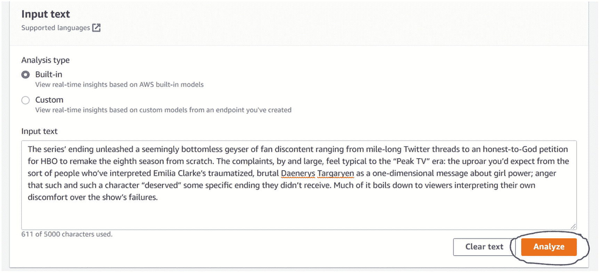

图 10-1

将文本输入理解

现在，让我们看看领悟在分析之后给了我们什么。第一件事是它提取的实体列表，以及置信度。见图 [10-2](#Fig2) 。

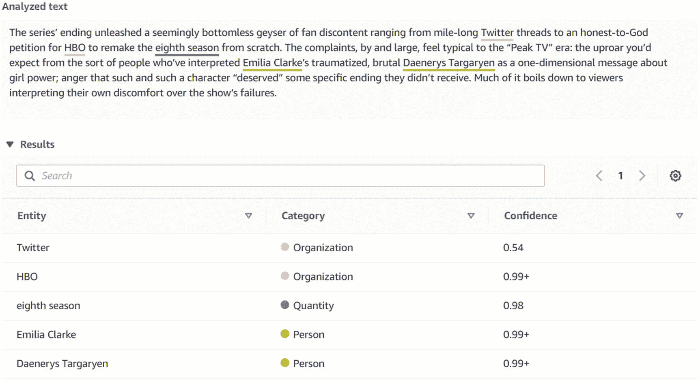

图 10-2

分析结果

在图 [10-2](#Fig2) 中，可以看到提取的实体大部分都是正确的。现在，让我们来看看理解中认为重要的关键短语是什么。单击“关键短语”选项卡。图 [10-3](#Fig3) 显示了输出。

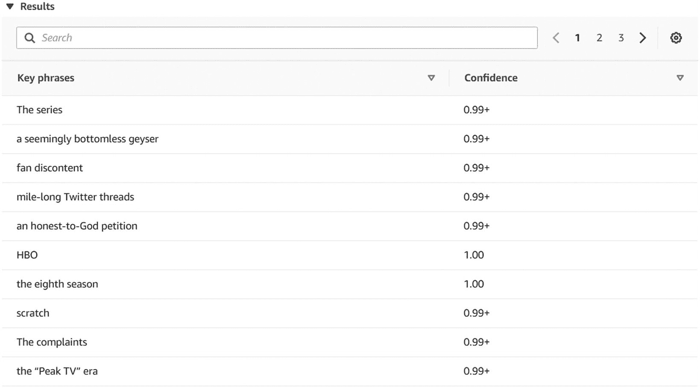

图 10-3

文中出现的关键短语

有些短语真的很重要，因为通过阅读它们，我们可以知道这一段是关于什么的，以及它的语气。说到语气，我们再来看整段的感悟。为此，我们将单击“情绪”选项卡。图 [10-4](#Fig4) 显示段落的情感分析。

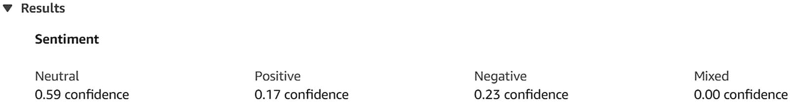

图 10-4

情感分析输出

这里你可以看到《领悟》在告诉我们作者对*权力的游戏*大多持中立态度。如果你读了这一段，你会发现作者实际上是在讲述不喜欢最后一季的粉丝，而不是作者不喜欢它。因此，在这一部分，理解能够给我们正确的图片。

如果您想让您的脚本拥有 understand，您可以使用它提供的 API。这超出了本章的范围，但是值得一试。你可以阅读理解 API 文档来尝试一下。

接下来，让我们看看如何使用 understand 创建一个定制的分类模型。在这里，我们将找到一串文本的毒性级别。数据集取自 Kaggle，可以从 [`www.kaggle.com/c/jigsaw-toxic-comment-classification-challenge/data`](http://www.kaggle.com/c/jigsaw-toxic-comment-classification-challenge/data) 下载。

### 自定义分类

数据集总共包含八列。我只保留了两列，删除了其余的，因为 understand 中的多类分类只需要两列，一列是文本，另一列是类。

在理解控制台中，我们将单击“自定义分类”然后点击“训练分类器”图 [10-5](#Fig5) 显示了这些步骤。

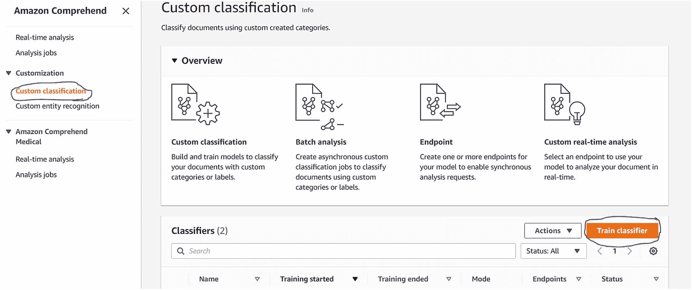

图 10-5

训练自定义分类器

第一步是给你的培训工作起一个名字。遵循理解期望的命名约定的说明。见图 [10-6](#Fig6) 。

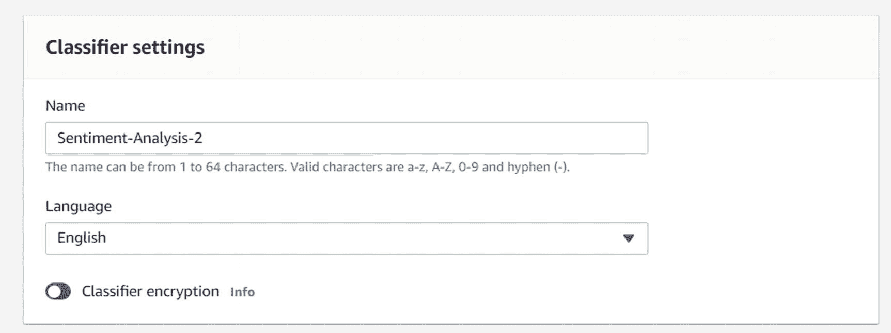

图 10-6

命名分类器

接下来，您必须选择一个分类模式。多类别分类是指我们只有一列类别，而多标签分类是指每个类别还可以有子类别。我们将选择第一个，如图 [10-7](#Fig7) 所示。

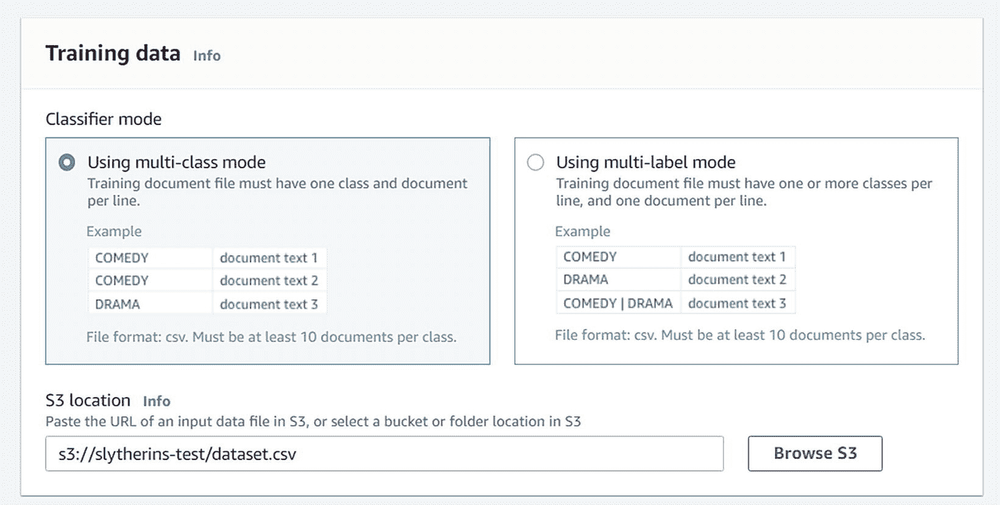

图 10-7

多类理解分类

接下来，我们必须将数据集上传到 S3 存储桶并提供路径。请记住，只能有两列。参见图 [10-8](#Fig8) 。

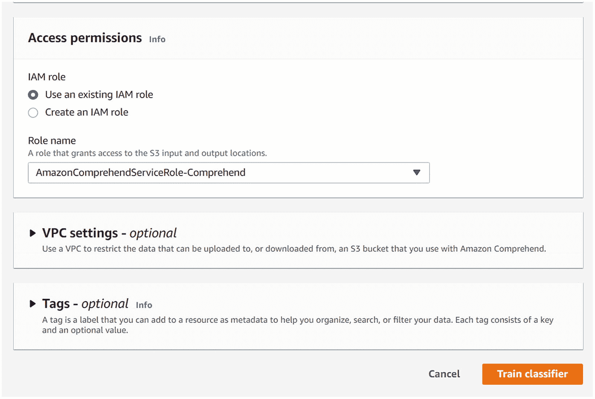

图 10-8

定义 IAM 角色

提供路径后，选择您的 IAM 角色，然后单击“训练分类器”这将开始模型的训练。一旦你的模型被训练，你将看到类似于图 [10-9](#Fig9) 的信息。

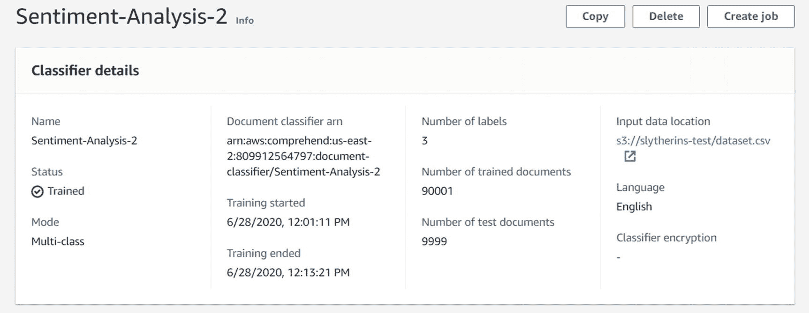

图 10-9

模型训练输出

接下来，您可以在“分类器性能”下找到训练模型的指标，如图 [10-10](#Fig10) 所示。

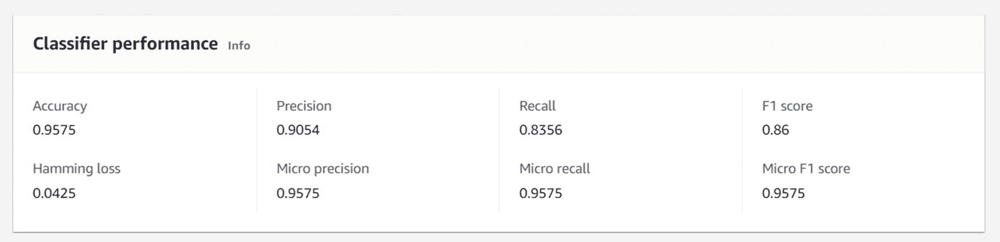

图 10-10

理解分类器的性能

你可以看到它给出了一个非常好的结果，在准确性、精确度和召回率方面。接下来，为了使用这个模型，我们可以创建一个端点，然后开始推理。只需点击“创建端点”按钮，并给它一个名字，开始这个过程。参见图 [10-11](#Fig11) 。

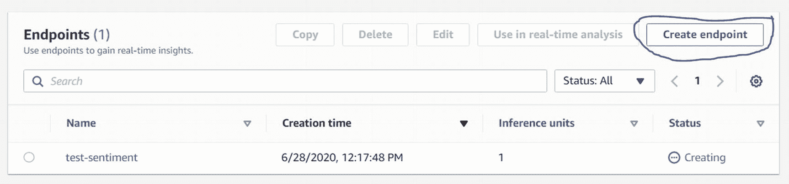

图 10-11

端点的创建

一旦端点准备就绪，我们就可以转到实时分析部分，这次不是单击内置分析类型，而是单击 Custom 并选择您的端点。接下来，给出任何文本，它将预测其类别，如图 10-12 和 T2 10-13 所示。

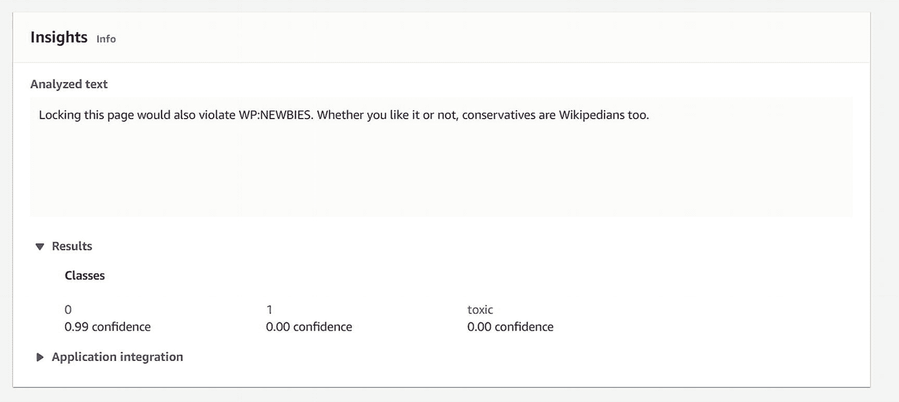

图 10-13

从推论中得到的启示

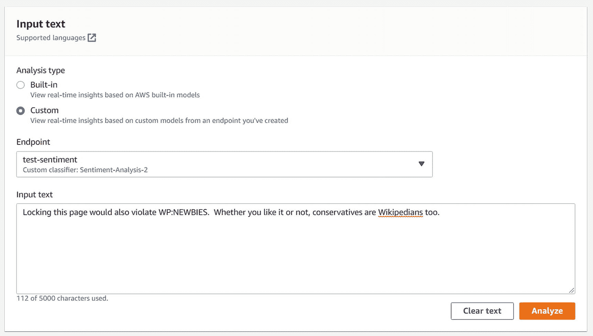

图 10-12

使用自定义分类器进行推理

一旦分析完成，不要忘记删除端点，因为它是收费的。这结束了我们对第一个用例的讨论。接下来，让我们看一个销售预测模型，它可以使用另一个叫做 Amazon Forecast 的 Amazon 服务来构建。

## 用例 2:使用亚马逊预测进行销售预测

在本节中，我们将预测一家公司的销售预测。为此，我们将使用 Kaggle 的预测数据集，名为商店商品需求预测。您可以从 [`https://www.kaggle.com/c/demand-forecasting-kernels-only/data?select=train.csv`](https://www.kaggle.com/c/demand-forecasting-kernels-only/data%253Fselect%253Dtrain.csv) 下载数据集。

一旦我们下载了数据集，我们必须对它进行一些格式化。第一件事是，我们将添加一个 ID 列。这应该是数据集的第一列。接下来，确保日期字段的格式为 YYYY-MM-DD；否则亚马逊预测不会接受。完成后，将数据集上传到 S3，然后记下它的路径。

### 创建数据集组

现在，打开亚马逊管理控制台，然后搜索*亚马逊预测服务*。单击创建数据集组。第一步是给数据集组命名，然后选择预测的域。在我们的分析中，我们选择了一个自定义域。参见图 [10-14](#Fig14) 。

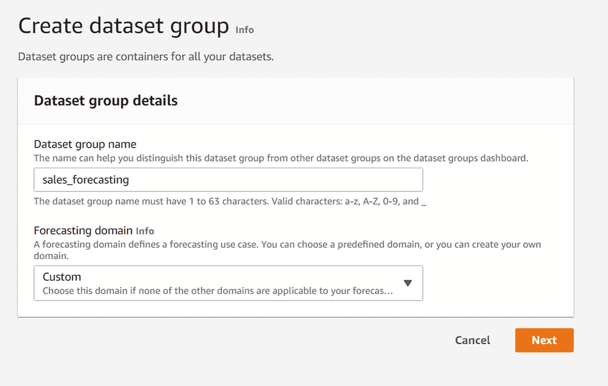

图 10-14

创建数据集组名

### 定义列属性

下一步是给数据集命名。然后，您必须定义列属性。参见图 [10-15](#Fig15) 。

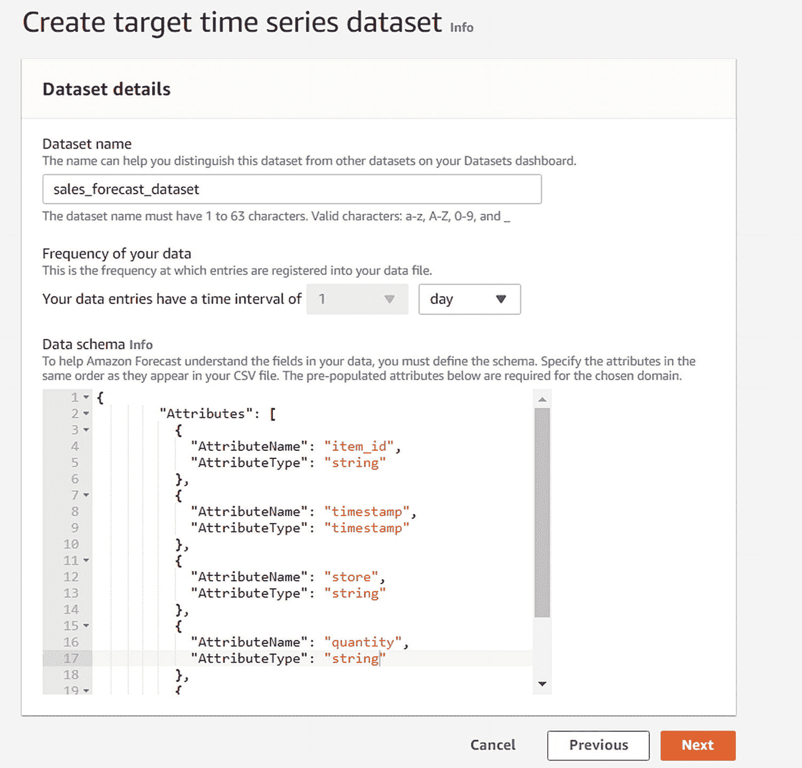

图 10-15

定义列属性

请记住，属性的顺序应该与数据集中的顺序相同。此外，除了 JSON 模式中已经存在的属性之外，所有属性都必须是字符串。这就是为什么商店和数量被称为字符串。您也可以定义间隔。对于我们来说，它是一个每日间隔，所以它是如何设置的。单击下一步。

### 导入数据

最后一步是开始导入数据。在这里，您将为数据集导入提供 S3 路径和名称。参见图 [10-16](#Fig16) 。

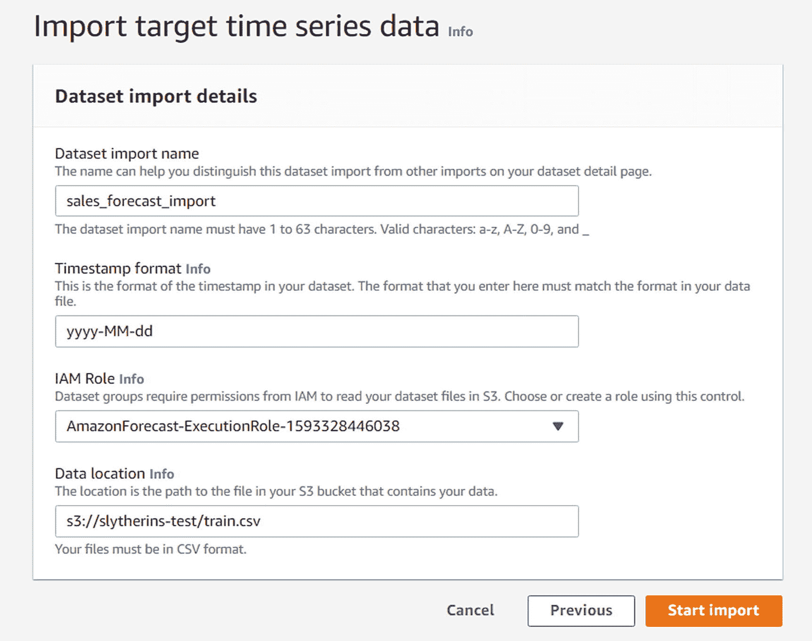

图 10-16

配置数据集路径

### 做预测

现在，点击“开始导入”导入完成后，我们必须单击“开始预测器训练”在这里，我们将告知 Amazon Forecast 我们必须进行的预测的类型以及预测的范围。图 [10-17](#Fig17) 显示了我们必须进行的输入。

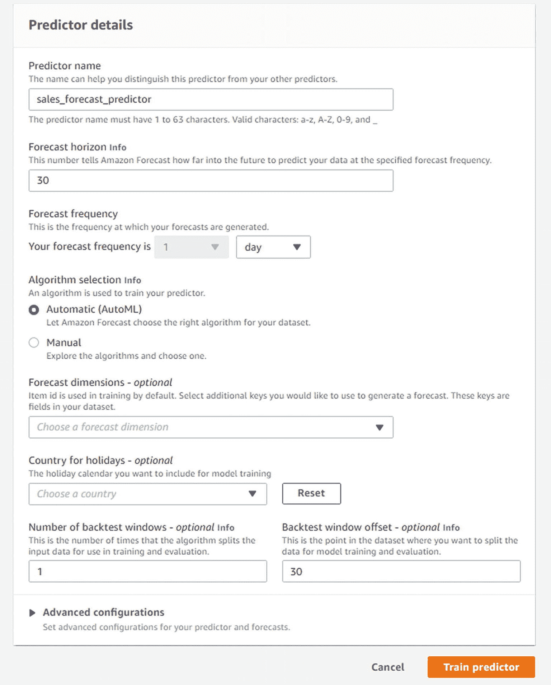

图 10-17

开始培训工作的输入

训练将在这之后开始。等到训练结束，如果您觉得 AutoML 花费了太多时间，您可以选择任何自定义预测器。使用手动算法。

培训结束后，我们必须点击“创建预测”在这里，您需要为您的预测提供一个名称和您刚刚创建的预测器。点击“创建预测”参见图 [10-18](#Fig18) 。

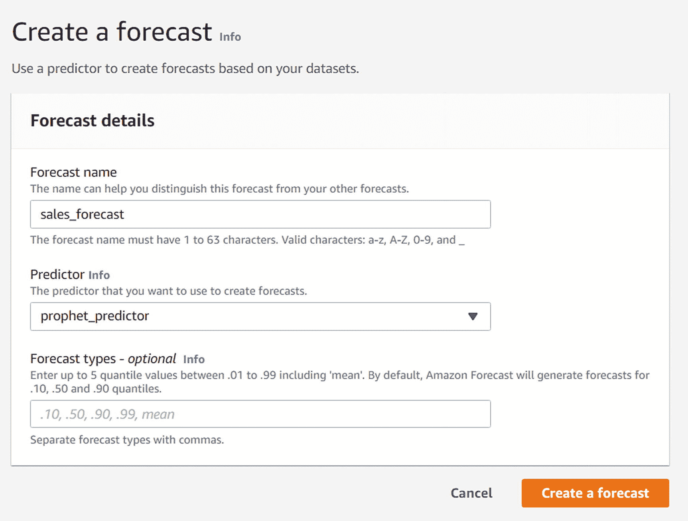

图 10-18

生成预测

预测完成后，您可以单击“预测查找”进行查看。参见图 [10-19](#Fig19) 。

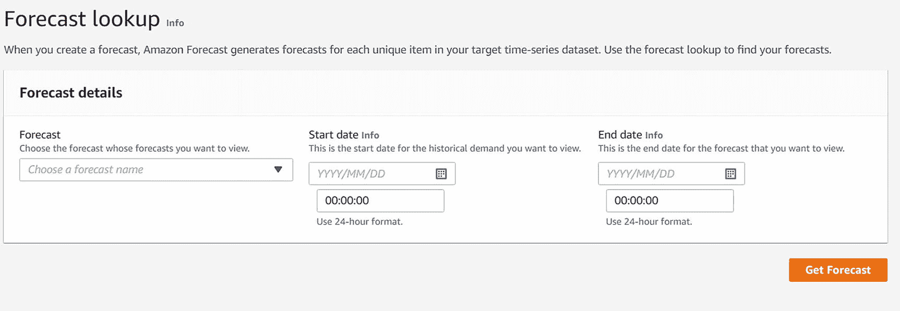

图 10-19

预测查找

只要给出预测的范围，你就会得到一个非常好的可视化，如图 [10-20](#Fig20) 所示。

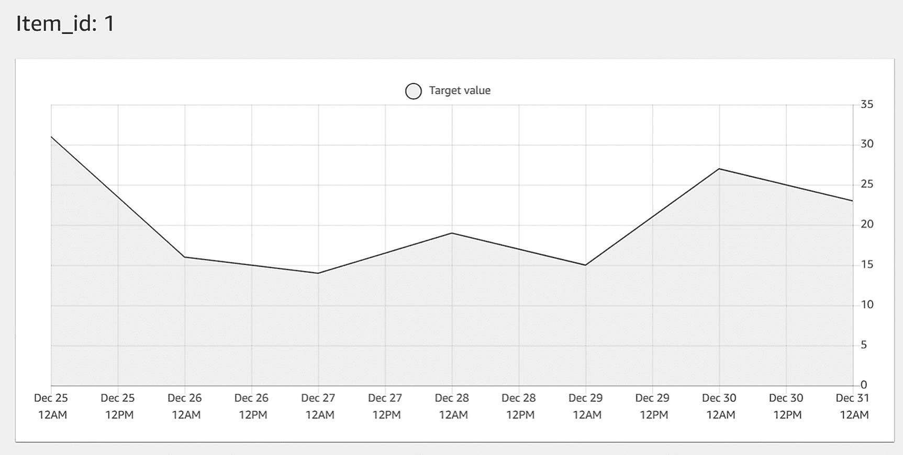

图 10-20

生成的预测

我们关于使用 Amazon Forecast 进行销售预测的讨论到此结束。如前所述，我们可以为不同的数据集创建不同类型的预测。现在让我们看看最后一个用例，我们将使用 Amazon Textract 从不同的文件格式中提取文本信息。

## 用例 3:使用 Amazon Textract 提取图像文本

使用 Amazon Textract，我们不仅可以从图像、pdf、Word 文件等中提取文本。，但是我们也可以提取表格和基于表单的数据。同样，与之前的所有服务一样，这个过程很简单。我们只需要上传包含信息的图像，数据就会被提取出来。让我们首先进入 Amazon 管理控制台并搜索 *Amazon Textract 服务*来开始这个过程。接下来，点击“尝试亚马逊 Textract”最后，单击上传文档。

### 提取表格信息

首先，让我们对一些表格数据应用 Textract。为此，我们将使用图 [10-21](#Fig21) 。

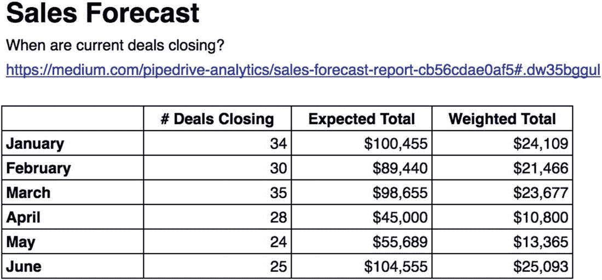

图 10-21

重要性表

一旦你上传了图片，你就会得到结果，如图 [10-22](#Fig22) 所示。第一次提取原始文本，第二次提取表格。我们可以看到 Textract 工作得非常完美，如图 [10-23](#Fig23) 所示。

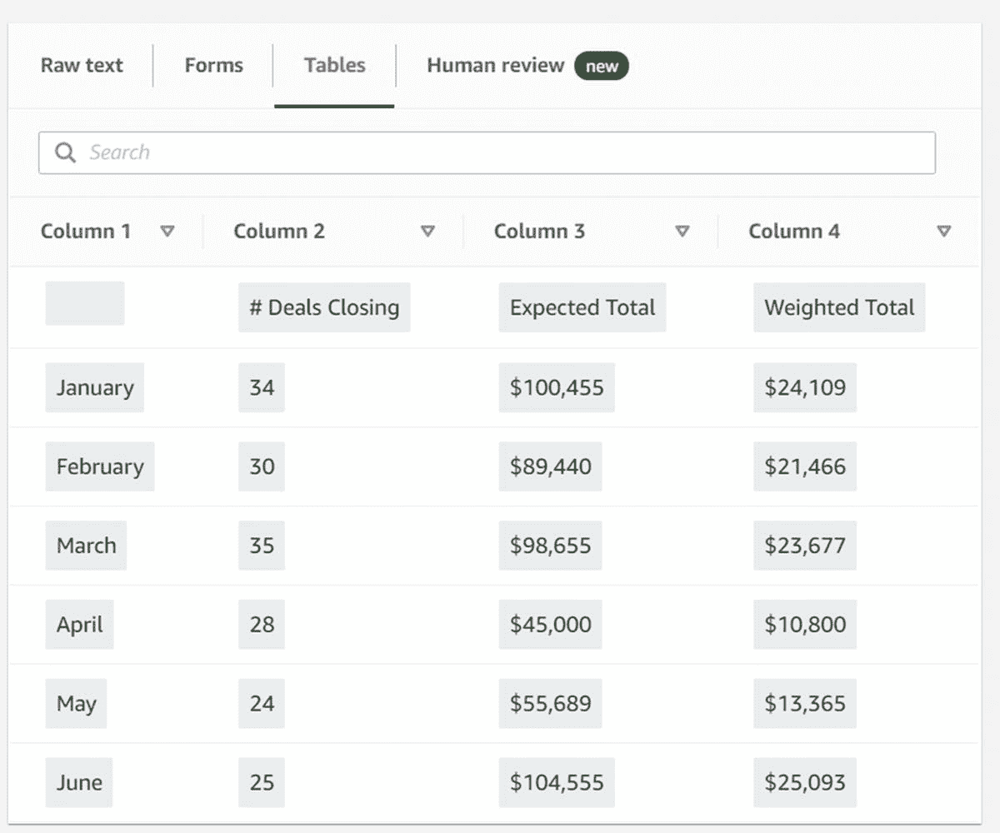

图 10-23

提取的表格关键词

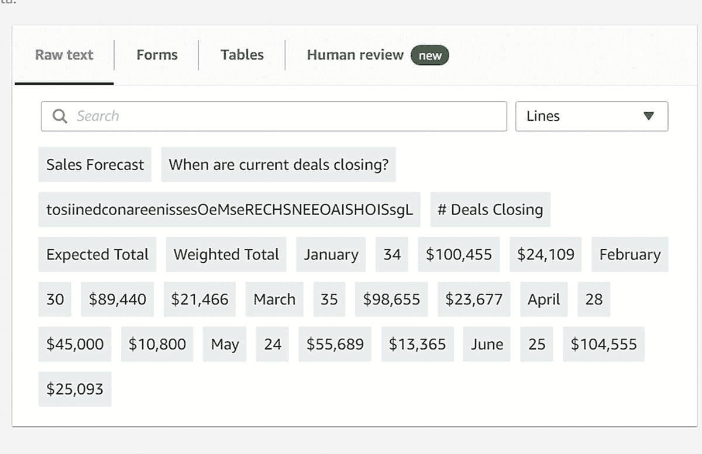

图 10-22

提取的关键词

### 提取表单数据

现在，让我们看看 Textract 如何处理表单数据。图 [10-24](#Fig24) 显示了我们将使用的图像。

图 10-24

表单数据测试图像

当我们上传这个图像并分析表单结果时，我们得到如图 [10-25](#Fig25) 所示的结果。

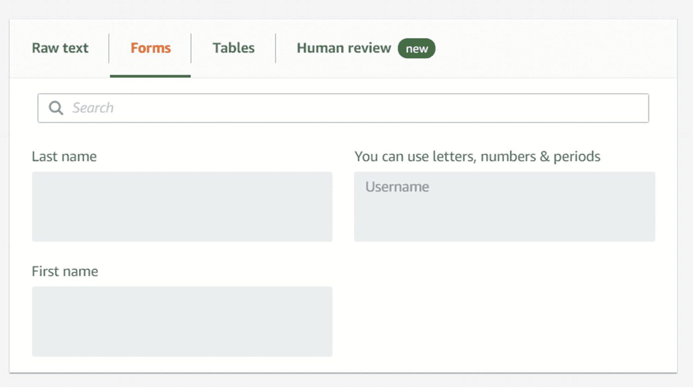

图 10-25

提取的表单数据

可以看到表单的大部分字段都被 Textract 成功提取出来了。类似地，我们可以给 text ract PDF 文件和其他支持的格式，以获得所需的字段。我们还可以连接到 Textract API，这样结果就可以直接被 Python 这样的脚本语言吸收，并可以进行进一步的分析。

## 结论

在这一章中，你学习了机器学习领域中不同的亚马逊服务。它们是亚马逊提供的现成解决方案，将编码知识最小化，以便具有深厚数学/统计背景的人可以进行他们的分析。这本书的最后一章到此结束。