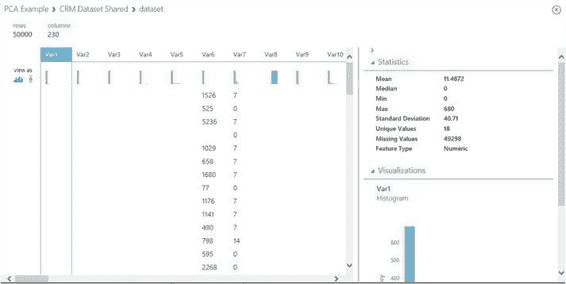
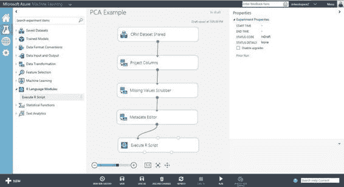

# 三、与 R 集成

本章将介绍 R，并展示它是如何与微软 Azure 机器学习集成的。通过简单的例子，你将学会在使用 Azure 机器学习时如何编写和运行自己的 R 代码。您还将学习 Azure 机器学习支持的 R 包，以及如何在 Azure Machine Learning Studio(ML Studio)中使用它们。

简而言之

r 是一种开源的统计编程语言,通常被计算统计和数据科学社区用来解决广泛的商业问题。这些问题跨越以下领域:

*   生物信息学(例如基因组分析)
*   精算科学(例如，计算保险、金融和其他行业的风险敞口)
*   电信(分析企业和消费者客户群的流失、欺诈性 SIM 卡使用或移动使用模式)
*   金融和银行业(例如识别金融交易中的欺诈行为)、制造业(例如预测硬件组件故障时间)等等。

当使用 R 时，用户会觉得它的 R 包工具箱为数据分析、可视化和建模提供了强大的功能。截至 2014 年，全面的 R 档案网络(CRAN)提供了超过 5000 个 R 包的大集合。除了 CRAN 之外，在 Github(https://github.com/trending?l=r)上还有许多其他的 R 软件包，在 bio conductor R repository([www.bioconductor.org/](http://www.bioconductor.org/))中有专门的生物信息学 R 软件包。

 **注** R 是由 Joss Ihaka 和 Robert Gentleman 于 1994 年在奥克兰大学创建的。自从 R 创建以来，许多领先的计算机科学家和统计学家通过为 R 代码库做出贡献或提供 R 包，使 R 用户能够利用最新的技术进行统计分析、可视化和数据挖掘，从而推动了 R 的成功。这促使 R 成为数据科学家的语言之一。在 www.r-project.org/了解更多关于 R 的信息。

鉴于数据科学社区使用 R 解决机器学习问题的势头，基于云的机器学习平台让数据科学家能够继续使用他们编写的熟悉的 R 脚本，并继续保持生产力，这是非常重要的。目前，Azure 机器学习支持超过 400 个 R 包。表 3-1 显示了目前支持的 R 包的子集。这些 R 包使您能够从购物篮分析、分类、回归、预测和可视化中对广泛的机器学习问题进行建模。

[表 3-1](#_Tab1) 。Azure 机器学习支持的 r 包

| 

r 包

 | 

描述

 |
| --- | --- |
| 阿鲁勒斯 | 频繁项集与关联规则挖掘 |
| 保理商 | 数据探索 |
| **预测** | 单变量时间序列预测(指数平滑和自动 ARIMA) |
| **ggplot2** | 制图法 |
| glmnet | 线性回归、逻辑和多项式回归模型、泊松回归和 Cox 模型 |
| **方** | 决策树工具 |
| **随机应变** | 基于森林的分类和回归模型 |
| **个人资料** | 使用增广拉格朗日乘子的一般非线性优化 |
| 文字 | 时间序列 |
| 动物园 | 时间序列 |

 **提示**获取已安装包的完整列表，在云机器学习中创建新实验，使用**执行 R 脚本**模块，在**执行 R 脚本**模块体中提供以下脚本，运行实验。实验结束后

```py
out <- data.frame(installed.packages())maml.mapOutputPort("out")
```

完成后，右键单击模块的左侧输出入口，并选择**可视化**。将列出已经安装在云机器学习中的包。

Azure Machine Learning 提供了 R 语言模块，使你能够将 R 集成到你的机器学习实验中。目前，可以在 Azure 机器学习工作室(ML Studio)内使用的 R 语言模块是**执行 R 脚本**模块。

**执行 R 脚本**模块使您能够指定输入数据集(最多两个数据集)、一个 R 脚本和一个包含一组 R 脚本的 Zip 文件(可选)。在模块处理数据之后，它产生一个结果数据集和一个 R 设备输出。在 Azure 机器学习中，使用 R 4.1.0 执行 R 脚本。

 **注意**R 设备输出显示控制台输出和在 R 脚本执行期间产生的图形。例如，在 R 脚本中，您可能使用了 R plot()函数。右击 R 设备输出并选择**可视化**，可以可视化 plot()的输出。

ML Studio 使您能够监控和排除实验过程中的故障。一旦执行完成，您就可以查看 R 模块每次运行的输出日志。如果执行失败，输出日志还将使您能够解决问题。

在这一章中，你将学习如何将 R 与 Azure Machine Learning 集成。通过使用 ML Studio 中可用的简单示例和数据集，您将获得释放 R 的力量的基本技能，以使用 Azure 机器学习创建令人兴奋和有用的实验。我们开始吧！

构建和部署你的第一个 R 脚本

要构建和部署您的第一个 R script 模块，首先您需要创建一个新的实验。创建实验后，您将看到 Azure Machine Learning Studio(ML Studio)中提供的**执行 R 脚本**模块。该脚本将由 Azure Machine Learning 使用 R 3.1.0(本书出版时安装在云机器学习上的版本)来执行。[图 3-1](#Fig1) 显示了 R 语言模块。


[图 3-1](#_Fig1) 。ML Studio 中的 r 语言模块

在本节中，您将学习如何使用 Execute R 脚本对数据集执行采样。遵循这些步骤。

1.  从工具箱中展开**保存的数据集**节点，点击**成人普查收入二元分类**数据集。将其拖放到实验设计区域。
2.  从工具箱中展开 **R 语言模块**节点，点击**执行 R 脚本**模块。将其拖放到实验设计区域。
3.  Connect the dataset to the **Execute R Script** module. [Figure 3-2](#Fig2) shows the experiment design.

    

    [图 3-2](#_Fig2) 。使用 Execute R 脚本对成人人口普查收入二元分类数据集执行采样

    **执行 R 脚本**模块为 R 脚本可以使用的数据集提供了两个输入端口。此外，它允许您指定一个 Zip 文件，其中包含模块使用的 R 源脚本文件。您可以在本地机器上编辑 R 源代码脚本文件并测试它们。然后，你可以把需要的文件压缩成一个 Zip 文件，从本地文件路径通过新的>数据集>上传到 Azure 机器学习。在**执行 R 脚本**模块处理完数据后，该模块提供两个输出端口:结果数据集和一个 R 设备。结果数据集对应于 R 脚本的输出，可以传递给下一个模块。R 设备输出端口为您提供了一种简单的方式来查看控制台输出和由 R 解释器生成的图形。

    让我们继续使用 ML Studio 创建你的第一个 R 脚本。

4.  点击**执行 R 脚本**模块。
5.  在 Properties 窗格上，编写以下 R 脚本来执行采样:

    ```py
    # Map 1-based optional input ports to variables
    dataset1 <- maml.mapInputPort(1) # class: data.frame
    mysample <- dataset1[sample(1:nrow(dataset1), 50, replace=FALSE),]

    data.set = mysample
    print (mysample)

    # Select data.frame to be sent to the output Dataset port
    maml.mapOutputPort("data.set");

    R Script to perform sampling
    ```

要使用 **Execute R Script** 模块，通常使用以下模式:

*   将输入端口映射到 R 变量或数据帧。
*   R 脚本的主体。
*   将结果映射到输出端口(参见[图 3-3](#Fig3) )。


[图 3-3](#_Fig3) 。成功执行取样实验

要查看这种模式，请注意在提供的 R 脚本中，maml.mapInputPort(1)方法 用于将从模块的第一个输入端口传入的数据集映射到 R 数据框。接下来，查看用于执行数据采样的 R 脚本。出于调试目的，我们还打印出了示例的结果。在 R 脚本的最后一步中，使用 maml.mapOutputPort("data.set ")将结果分配给 data.set 并映射到输出端口。

您现在已经准备好运行实验了。为此，单击 ML Studio 底部窗格中的运行图标。[图 3-3](#Fig3) 显示实验已经成功完成执行。

一旦实验运行完毕，您就可以看到 R 脚本的输出。为此，右键单击**执行 R 脚本**模块的**结果数据集**。[图 3-4](#Fig4) 。显示了右键单击**执行 R 脚本**模块的**结果数据集**时可用的选项。选择**可视化**。


[图 3-4](#_Fig4) 。可视化 R 脚本的输出

点击**可视化**后，会看到样本由 50 行组成。每一行有 15 列和数据的数据分布。[图 3-5](#Fig5) 显示了结果数据集的可视化。


[图 3-5](#_Fig5) 。R 脚本生成的结果数据集的可视化

恭喜你，你刚刚成功完成了你的第一个简单的 R 脚本在 Azure 机器学习中的集成！在下一节中，您将学习如何使用 Azure 机器学习和 R 来创建机器学习模型。

 **注**在[http://OCW . MIT . edu/courses/Sloan-school-of-management/15-097-prediction-Machine-Learning-and-statistics-spring-2012/lecture-notes/MIT 15 _ 097 S12 _ le C02 . pdf](http://ocw.mit.edu/courses/sloan-school-of-management/15-097-prediction-machine-learning-and-statistics-spring-2012/lecture-notes/MIT15_097S12_lec02.pdf)了解更多关于 R 和机器学习的知识。

使用 R 进行数据预处理

在许多机器学习任务中，降维是用于减少机器学习算法的特征数量的重要步骤。主成分分析(PCA )是一种常用的降维技术。PCA 通过寻找一组新的变量(主成分)来降低数据集的维度，这些变量是原始数据集的线性组合，并且与所有其他变量不相关。在这一节中，您将学习如何使用 R 来预处理数据和减少数据集的维数。

让我们开始使用 **Execute R Script** 模块对 ML Studio 中可用的一个样本数据集进行主成分分析。遵循这些步骤。

1.  创建一个新的实验。
2.  From Saved Datasets, choose **CRM Dataset Shared** (see [Figure 3-6](#Fig6)).

    

    [图 3-6](#_Fig6) 。使用示例数据集，CRM 数据集共享

3.  Right-click the output node, and choose **Visualize**. From the visualization shown in [Figure 3-7](#Fig7), you will see that are 230 columns.

    

    [图 3-7](#_Fig7) 。CRM 共享数据集中最初的 230 列

4.  在执行 PCA 之前，需要确保 **Execute R Script** 模块的输入是数字。对于 CRM Dataset Shared 的示例数据集，您知道前 190 列是数值型的，剩下的 40 列是分类型的。您首先使用**项目列**，并将**选择列|** 列索引设置为 1-190。
5.  接下来，使用**缺失值洗涤器**模块将缺失值替换为 0，如下所示:
    1.  对于缺失值:自定义替代值
    2.  替换为值:0
    3.  包含所有 MV 的列:KeepColumns
    4.  MV 指示器列:不生成
6.  一旦删除了丢失的值，使用**元数据编辑器**模块将所有列的数据类型更改为整数。
7.  Next, drag and drop the **Execute R Script** module to the design surface and connect the modules, as shown in [Figure 3-8](#Fig8).

    

    [图 3-8](#_Fig8) 。使用 Execute R 脚本模块执行 PCA

8.  Click the **Execute R Script** module. You can provide the following script that will be used to perform PCA:

    ```py
    # Map 1-based optional input ports to variables
    dataset1 <- maml.mapInputPort(1)
    # Perform PCA on the first 190 columns
    pca = prcomp(dataset1[,1:190])

    # Return the top 10 principal components
    top_pca_scores = data.frame(pca$x[,1:10])
    data.set = top_pca_scores
    plot(data.set)
    # Select data.frame to be sent to the output Dataset port
    maml.mapOutputPort("data.set");
    ```

    [图 3-9](#Fig9) 展示了如何在 ML Studio 中使用脚本。

    

    [图 3-9](#_Fig9) 。对前 190 列执行 PCA

9.  点击**运行**。
10.  一旦实验成功执行，点击**执行 R 脚本**模块的**结果数据集**节点。点击**可视化**。
11.  [图 3-10](#Fig10) 显示了 CRM 共享数据集的十大主要组成部分。主成分用于建立分类模型的后续步骤。


[图 3-10](#_Fig10) 。为 CRM 共享数据集确定的主要组件

 **提示**你也可以提供一个包含 Zip 文件中 R 脚本的脚本包，在**执行 R 脚本**模块中使用。

使用脚本包(Zip)

如果您有一个一直在使用的 R 脚本，并希望将其用作实验的一部分，您可以压缩 R 脚本，并将其作为数据集上传到 ML Studio。要将脚本包与 **Execute R Script** 模块一起使用，您首先需要将文件打包成 Zip 格式，因此请遵循以下步骤。

1.  Navigate to the folder containing the R scripts that you intend to use in your experiment (see [Figure 3-11](#Fig11)).

    

    [图 3-11](#_Fig11) 。包含 R 脚本 pcaexample.r 的文件夹

2.  Select all the files that you want to package up and right-click. In this example, right-click the file **pcaexample.r**, and choose **Send to Compressed (zipped) folder**, as shown in [Figure 3-12](#Fig12).

    

    [图 3-12](#_Fig12) 。将 R 脚本打包成一个 ZIP 文件

3.  Next, upload the zip file to ML Studio. TO do this, choose **New DATASET  From Local File**. Select the Zip file that you want to upload, as shown in [Figures 3-13](#Fig13) and [3-14](#Fig14).

    

    [图 3-13](#_Fig13) 。来自本地文件的新数据集

    

    [图 3-14](#_Fig14) 。上传新数据集

4.  数据集上传后，您就可以在实验中使用它了。为此，从**保存的数据集**中，选择**上传的 Zip 文件**，并将其拖放到实验中。
5.  Connect the uploaded Zip file to the **Execute R Script** module – **Script Bundle (Zip)** input, as shown in [Figure 3-15](#Fig15).

    

    [图 3-15](#_Fig15) 。使用脚本包作为 Execute R 脚本模块的输入

6.  In the **Execute R Script** module, specify where the R script can be found, as follows and as shown in [Figure 3-16](#Fig16):

    ```py
    # Map 1-based optional input ports to variables
    dataset1 <- maml.mapInputPort(1)
    # Contents of optional Zip port are in ./src/
    source("src/pcaexample.r");

    # Select data.frame to be sent to the output Dataset port
    maml.mapOutputPort("data.set");
    ```

    

    [图 3-16](#_Fig16) 。使用脚本包作为 Execute R 脚本模块的输入

7.  现在，您可以使用已经上传到 ML Studio 的 Zip 文件中的 R 脚本来运行实验了。使用脚本包允许您轻松地引用一个 R 脚本文件，您可以在 ML Studio 之外测试该文件。为了更新脚本，您必须重新上传 Zip 文件。

使用 R 构建和部署决策树

在本节中，您将学习如何使用 R 来构建机器学习模型。当使用 R 时，您可以利用大量的 R 包，这些包实现了各种机器学习算法，用于分类、聚类、回归、K 近邻、购物篮分析等等。

 **注意**当你使用 R 中可用的机器学习算法并使用 **Execute R** 模块执行它们时，你只能可视化模型和参数。您不能保存已训练的模型并将其用作其他 ML Studio 模块的输入。

利用 ML studio，提供了几种 R 机器学习算法。例如，您可以使用 **R 自动 ARIMA** 模块为单变量时间序列构建一个最佳的自回归移动平均模型。您还可以使用**R K-最近邻分类**模块来创建 K-最近邻(KNN)分类模型。

在本节中，您将学习如何使用名为 **rpart** 的 R 包来构建决策树。 **rpart** 包为您提供了执行分类和回归的递归分割算法。

 **注**在[http://cran.r-project.org/web/packages/rpart/rpart.pdf](http://cran.r-project.org/web/packages/rpart/rpart.pdf)了解更多关于 **rpart** R 包的信息。

在本练习中，您将使用成人人口普查收入二元分类数据集。让我们开始吧。

1.  从工具箱中，将以下模块拖放到实验设计区域:
    1.  **成人普查收入二元分类**数据集(可在**保存的数据集**下获得)
    2.  **项目列**(可从数据**转换操纵**获得)
    3.  **执行 R 脚本**模块(在 **R 语言**模块下找到)
2.  将**成人人口普查收入二元分类**数据集连接到**项目列**。
3.  Click **Project Columns** to select the columns that will be used in the experiment. Select the following columns: age, sex, education, income, marital-status, occupation.

    [图 3-17](#Fig17) 显示了色谱柱的选择，[图 3-18](#Fig18) 显示了完成的实验和项目色谱柱的特性。

    

    [图 3-17](#_Fig17) 。选择将要使用的列

    

    [图 3-18](#_Fig18) 。完整实验

4.  将**项目列**连接到**执行 R 脚本**。
5.  点击**执行 R 脚本**，提供如下脚本。[图 3-19](#Fig19) 显示 ML studio 中的 R 脚本。

    ```py
    library(rpart) 

    # Map 1-based optional input ports to variables
    Dataset1 <- maml.mapInputPort(1) # class: data.frame

    fit <- rpart(income ~ age + sex + education + occupation,method="class", data=Dataset1)

    # display the results, and summary of the splits
    printcp(fit)
    plotcp(fit)
    summary(fit)

    # plot the decision tree
    plot(fit, uniform=TRUE, margin = 0.1,compress = TRUE, main="Classification Tree for Census Dataset")
    text(fit, use.n=TRUE, all=TRUE, cex=0.8, pretty=1)

    data.set = Dataset1

    # Select data.frame to be sent to the output Dataset port
    maml.mapOutputPort("data.set");
    ```


图 3-19。使用 R 脚本执行分类的实验

在 R 脚本中，首先使用 library() 加载 rpart 库。接下来，将传递给 **Execute R Script** 模块的数据集映射到一个数据框。

要构建决策树，您将使用 rpart 函数。rpart 支持几种类型的方法:class(分类)和 anova(回归)。在本练习中，您将使用 rpart 执行分类(即 method="class ")，如下所示:


指定的公式使用以下格式:prediction variable ~ input feature 1+input feature 2+...

构建决策树之后，R 脚本调用 printcp()、plotcp()和 summary()函数来显示结果，以及树中每个拆分值的摘要。在 R 脚本中，plot()函数用于绘制 rpart 模型。默认情况下，在打印 rpart 模型时，会使用缩写表示来表示分割值。在 R 脚本中，添加了 pretty=1 的设置，以显示实际的拆分值(参见[图 3-20](#Fig20) )。


[图 3-20](#_Fig20) 。ML Studio 中的 R 脚本

您现在已经准备好运行实验了。为此，单击 ML Studio 底部窗格的运行图标。实验成功执行后，您可以查看决策树的详细信息，还可以看到决策树的整体形状。

要查看决策树的详细信息，点击**属性**窗格中的**执行 R 脚本**模块和**查看输出日志**(如图[图 3-21](#Fig21) 所示)。


[图 3-21](#_Fig21) 。查看执行 R 脚本的输出日志

显示了一个输出日志示例:

```py
[ModuleOutput] Classification tree:
[ModuleOutput]
[ModuleOutput]
[ModuleOutput]
[ModuleOutput] Variables actually used in tree construction:
[ModuleOutput]
[ModuleOutput] [1] age        education  occupation sex
[ModuleOutput]
[ModuleOutput]
...
[ModuleOutput]   Primary splits:
[ModuleOutput]
[ModuleOutput]       education  splits as  LLLLLLLLLRRLRLRL, improve=1274.3680, (0 missing)
[ModuleOutput]
[ModuleOutput]       occupation splits as  LLLRLLLLLRRLLL, improve=1065.9400, (1843 missing)
[ModuleOutput]
[ModuleOutput]       age        < 29.5 to the left,  improve= 980.1513, (0 missing)
[ModuleOutput]
[ModuleOutput]       sex        splits as  LR, improve= 555.3667, (0 missing)
```

要可视化决策树，点击 **R 设备**输出端口(即**执行 R 脚本**模块的第二个输出)，你会看到你刚刚用 rpart 构建的决策树(如图[图 3-22](#Fig22) )。


[图 3-22](#_Fig22) 。使用 rpart 构建决策树

 **注意** Azure 机器学习提供了一个很好的保存数据集的集合，可以在你的实验中使用。此外，你还可以在 http://archive.ics.uci.edu/ml/datasets.html 的[UCI 机器学习仓库找到大量数据集。](http://archive.ics.uci.edu/ml/datasets.html)

摘要

在这一章中，你学习了 R 与 Azure Machine Learning 集成所提供的令人兴奋的可能性。您学习了如何在 ML Studio 中使用不同的 R 语言模块。当您使用 R 设计您的实验时，您学习了如何将模块的输入和输出映射到 R 变量和数据帧。接下来，您学习了如何构建第一个 R 脚本来执行数据采样，以及如何使用 ML Studio 中内置的数据可视化工具来可视化结果。在此基础上，您继续构建和部署实验，通过 R 脚本包使用 R 进行数据预处理，并构建决策树。