# 四、统计和机器学习算法介绍

本章将作为微软 Azure 机器学习中一些最常用算法的参考。我们将简要介绍一些算法，如线性和逻辑回归、聚类的 k 均值、决策树、决策树(随机森林、增强决策树和 Gemini)、神经网络、支持向量机和贝叶斯点机器。

这一章将为你在本书其余部分将遇到的一些算法提供一个良好的基础和参考材料。我们将这些算法分为以下几类:

*   回归
*   分类
*   使聚集

回归算法

先说 Azure 机器学习服务中常用的回归技术。回归技术用于预测具有数字结果的响应变量，例如预测汽车每加仑行驶的英里数或预测城市的温度。输入变量可以是数字或分类变量。然而，这些算法的共同点是输出(或响应变量)是数字的。我们将回顾一些最常用的回归技术，包括线性回归、神经网络、决策树和增强决策树回归。

线性回归

线性回归是统计学中最古老的预测技术之一。事实上，它可以追溯到卡尔·弗里德里希·高斯在 1795 年的工作。线性回归的目标是拟合响应和独立变量之间的线性模型，并使用它来预测给定一组观察到的独立变量的结果。简单线性回归模型是一个公式，其结构如下

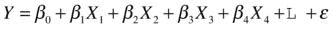

在哪里

*   y 是响应变量(即你试图预测的结果)，如每加仑英里数。
*   *X* 1 、 *X* 2 、 *X* 3 等。是用于预测结果的独立变量。
*   *β* 0 是一个常数，是回归线的截距。
*   *β* 1 、 *β* 2 、 *β* 3 等。是独立变量的系数。这些是指每个变量的部分斜率。
*   *ε* 是与响应变量相关的误差或噪声，不能用自变量 X1、X2 和 X3 来解释。

线性回归模型有两个部分:确定性部分(即*β*1*X*1+*β*2*X*2+...)和随机部分(即误差， *ε* )。您可以将这两个组件视为模型中的信号和噪声。

如果只有一个输入变量 X，则回归模型是拟合数据的最佳直线。图 4-1 显示了一个简单的线性回归模型的例子，该模型根据一辆汽车的马力预测其每加仑行驶的英里数。对于两个输入变量，线性回归是拟合 3D 空间中一组数据点的最佳平面。变量的系数(即 *β* 1 、 *β* 2 、 *β* 3 等)。)是每个变量的部分斜率。如果你保持所有其他变量不变，那么当变量*X*T20】1 增加 1 时，结果 Y 将增加 *β* 1 。这就是为什么经济学家通常使用短语“*其他条件不变的情况下*”或“*所有其他条件相同的情况下*”来描述一个独立变量对给定结果的影响。

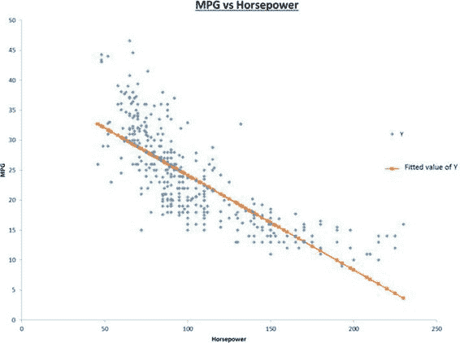

[图 4-1](#_Fig1) 。一个简单的线性回归模型，根据汽车的马力预测每加仑的行驶里程

线性回归使用最小二乘法或梯度下降法来寻找给定数据集的最佳模型系数。最小二乘法通过最小化训练数据中每个观察值的拟合值和实际值之间的误差平方和来实现这一点。梯度下降通过在每次迭代中更新系数来找到最佳模型系数。更新的方向使得模型拟合值和训练数据的实际值之间的误差总和减小。通过几次迭代，它通过向负梯度方向移动找到局部最小值，因此得名。

 **注**你可以从《使用回归的商业分析:案例手册 (Foster，D. P .，Stine，R.H .，Waterman，r . p .；美国纽约；施普林格出版社，1998 年)。

神经网络

人工神经网络是一套模拟大脑功能的算法。有许多不同的神经网络算法，包括反向传播网络、Hopfield 网络、Kohonen 网络(也称为自组织映射)和自适应共振理论(或 ART )网络。然而，最常见的是反向传播算法，也称为多层感知器。

反向传播网络有几个分层排列的神经元。最常用的架构是[图 4-2](#Fig2) 所示的三层网络。这种架构有一个输入层、一个隐藏层和一个输出层。但是，您也可以有两个或多个隐藏层。输入和输出节点的数量由数据集决定。基本上，输入节点的数量等于您想要用来预测输出的独立变量的数量。输出节点的数量与响应变量的数量相同。相比之下，隐藏节点的数量更加灵活。

神经网络模型的开发分两步完成:训练和测试。在训练期间，您向神经网络展示训练集中的一组示例。每个例子都有独立变量和响应变量的值。在训练过程中，您要多次向神经网络展示这些示例。在每次迭代中，网络预测响应。在训练的前向传播阶段，隐藏层和输出层中的每个节点计算其输入的加权和，然后通过激活函数使用该和来计算其输出。神经网络中每个神经元的输出通常使用以下 s 形激活函数:

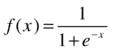

然而，在神经网络中可以使用其他激活函数，例如高斯函数、双曲正切函数(tanh)、线性阈值函数，甚至简单的线性函数。

假设有 M 个输入节点。输入节点和第一隐藏层之间的连接权重由*w*1T5】ij表示。

在每个隐藏节点，加权和由下式给出

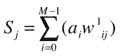

计算加权和时，s 形激活函数计算如下:

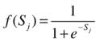

计算出输出节点的激活电平后，反向传播步骤开始。在这个阶段，算法根据实际响应值计算其预测的误差。使用梯度下降法，它调整所有连接的权重与误差成比例。权重以减少下次误差的方式进行调整。经过几次迭代后，神经网络收敛到一个解。

在测试过程中，您只需使用训练好的模型对记录进行评分。对于每条记录，神经网络预测一组给定输入变量的响应值(见[图 4-2](#Fig2) )。

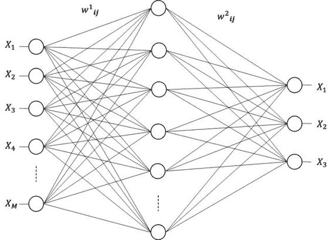

[图 4-2](#_Fig2) 。具有三层的神经网络:一个输入层、一个隐藏层和一个输出层

学习率决定了收敛到解的速度。如果学习率太低，算法将需要更多的学习迭代(因此需要更多的时间)来收敛到最小值。相比之下，如果学习率过大，算法会来回跳动，可能永远找不到局部最小值。因此，神经网络将是一个糟糕的预测器。

另一个重要的参数是隐藏节点的数量。神经网络的精确度可以随着隐藏节点的数量而增加。然而，这增加了处理时间并可能导致过度拟合。一般来说，增加隐节点数或隐层数容易导致过参数化，会增加过拟合的风险。一个经验法则是从大约等于输入节点数的平方根的隐藏节点数开始。另一个一般的经验法则是，隐藏层中神经元的数量应该在输入层的大小和输出层的大小之间。例如，(输入节点数+输出节点数)x 2/3。这些经验法则仅仅是起点，旨在避免过度拟合；最佳数量只能通过实验和对测试数据的性能验证来找到。

决策树

决策树算法决策树的目标是最大化树中不同节点的方差，最小化每个节点内的方差。[图 4-3](#Fig3) 显示了一个简单的决策树，它由两部分数据组成。根节点(节点 0)包含数据集中的所有数据。该算法根据定义的统计信息拆分数据，创建三个新节点(节点 1、节点 2 和节点 3)。使用相同的统计数据，它在节点 1 再次分割数据，创建另外两个叶节点(即节点 4 和 5)。决策树通过遍历叶节点(即终端节点之一:节点 2、3、4 或 5)对每个数据行进行预测。

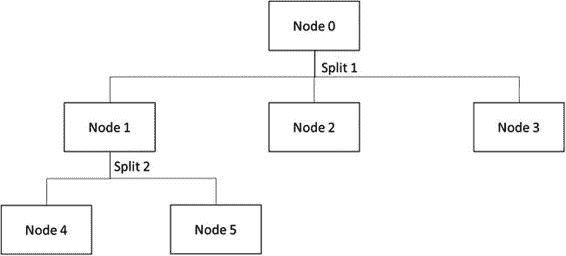

[图 4-3](#_Fig3) 。带有两个数据分割的简单决策树

图 4-4 展示了一个非常简单的决策树的虚构例子，该决策树预测客户是否会购买自行车。在本例中，原始数据集有 100 个示例。最具预测性的变量是年龄，因此决策首先按年龄拆分数据。30 岁以下的客户属于左支，而 30 岁或以上的客户属于右支。下一个最重要的变量是性别，所以在下一层决策树按性别分割数据。在较年轻的分支中(例如，对于 30 岁以下的客户),决策树将数据分为男性和女性分支。对于较老的分支也是如此。最后，[图 4-4](#Fig4) 显示了每个节点的样本数和购买概率。因此，如果你有一个 23 岁的女性顾客，树预测她只有 30%的机会购买自行车，因为她将在节点 3 结束。一个 45 岁的男性顾客将有 80%的机会购买自行车，因为他将在树的节点 6 结束。

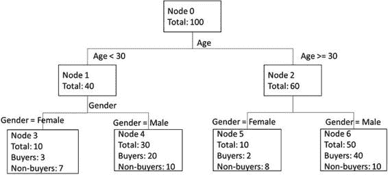

[图 4-4](#_Fig4) 。预测购买自行车可能性的简单决策树

一些最常用的决策树算法包括迭代二分法 3 (ID3 )、C4.5 和 c 5.0(ID3 的继承者)、自动交互检测(AID)、卡方自动交互检测(CHAID)以及分类和回归树(CART) 。虽然非常有用，但 ID3、C4.5、C5.0 和 CHAID 算法是分类算法，对回归没有用。顾名思义，CART 算法既可以用于分类，也可以用于回归。

如何选择用于在每个级别拆分数据的变量？每个决策树算法使用不同的统计量来选择最佳的分裂变量。ID3、C4.5 和 C5.0 使用信息增益，而 CART 使用一种称为基尼系数的指标。基尼系数衡量的是随机抽样的错误分类率。

 **注**更多关于决策树的信息，请参见 S. Chiu 和 D. Tavella 所著的《最佳市场回报的数据挖掘和市场情报》(英国牛津，巴特沃斯-海涅曼出版社，2008 年)以及 http://en.wikipedia.org/wiki/Decision_tree_learning。

增强决策树

增强决策树是一种集成模型。像其他集成模型一样，增强决策树使用几个决策树来产生更好的预测器。每个单独的决策树都可能是弱预测器。然而，当两者结合时，会产生更好的结果。

正如在第 1 章中所讨论的，建立集成模型有三个关键步骤:a)数据选择，b)训练分类器，以及 c)组合分类器。

构建集成模型的第一步是分类器模型的数据选择。对数据进行采样时，一个关键目标是最大化模型的多样性，因为这可以提高解决方案的准确性。一般来说，模型越多样化，最终分类器的性能就越好，预测的方差就越小。

该过程的步骤 2 需要训练几个单独的分类器。但是如何分配分类器呢？在众多可用的策略中，最受欢迎的两种是装袋和助推。bagging 算法使用不同的随机数据子集来训练每个模型。然后，可以在训练数据的随机子集上并行训练模型。相比之下，boosting 算法通过顺序训练模型来提高整体性能，并根据训练数据测试每个模型的性能。训练集中被错误分类的示例在后续训练中被赋予更大的重要性。因此，在训练期间，每个额外的模型更加关注错误分类的数据。增强决策树算法使用增强策略。在这种情况下，每个新的决策树都是通过强调错误分类的案例来训练的，以降低错误率。这就是增强决策树如何从弱决策树中产生更好的结果。

观察提升决策树的两个关键参数很重要:每个决策树中的叶子数量和提升迭代的次数。每棵树的叶子数量决定了模型中变量之间允许的交互量。如果该数字设置为 2，则不允许交互。如果设置为 3，则模型最多可以包含两个变量的交互影响。您需要尝试不同的值，以找到最适合您的数据集的值。据报道，对于大多数应用，每棵树 4-8 片叶子产生良好的结果。相比之下，每棵树只有两片叶子会导致糟糕的结果。要调整的第二个重要参数是提升迭代的次数(即模型中树的数量)。大量的树减少了误差，但是容易导致过度拟合。为了避免过度拟合，您需要找到最佳数量的树，以最小化验证数据集上的错误。

最后，一旦你训练了所有的分类器，最后一步就是结合它们的结果来做出最终的预测。有几种方法可以合并投票结果，从简单多数到加权多数投票。

 **注**你可以从 C. Zhang 和 Y. Ma 的书*集成机器学习、方法和应用*(纽约州纽约市:第 1 - 34 页，Springer，2012 年)和在[http://en . Wikipedia . org/wiki/Gradient _ boosting # Gradient _ tree _ boosting](http://en.wikipedia.org/wiki/Gradient_boosting#Gradient_tree_boosting)了解更多关于增强决策树的信息。

分类算法

分类是一种有监督的机器学习。在监督学习中，目标是使用标记的训练数据来推断一个函数。然后，该函数可用于确定新数据集的标签(标签未知)。可用于构建模型的分类算法的非穷尽列表包括决策树、逻辑回归、神经网络、支持向量机、朴素贝叶斯和贝叶斯点机器。

分类算法用于预测输入数据的标签(标签未知)。标签也被称为类、组或目标变量。例如，一家电信公司希望预测以下情况:

*   *流失*:倾向于转投另一家电信运营商的客户
*   *购买倾向*:客户愿意购买新产品或服务
*   *追加销售*:愿意购买升级服务或附加服务的客户

为了实现这一点，电信公司使用训练数据建立了一个分类模型(其中标签是已知的或者已经被预定义)。在这一节中，您将了解几种可用于构建模型的常见分类算法。一旦使用测试数据构建并验证了模型，电信公司的数据科学家就可以使用该模型来预测客户的流失、购买倾向和追加销售标签(标签未知)。因此，电信公司可以使用这些预测来设计营销策略，以减少客户流失，并向更愿意购买新服务或追加销售的客户提供服务。

通常使用分类算法的其他情况包括金融机构，在这些机构中，模型用于确定信用卡交易是否是欺诈案件，或者是否应该根据客户的财务状况批准贷款申请。酒店和航空公司使用模型来确定客户是否应该升级到更高的服务级别(例如，从经济舱升级到商务舱，从普通房间升级到套房等)。).

分类问题定义如下:给定一个输入样本 *X* = ( *x* 1 ，*X*T8】2，... *x*

一个数据实例属于 J 个组(或类)中的一个，如*C*T2】1、*C*T6】2，...、 *C* *j* 。例如，在电信场景的两类分类问题中，类*C*T16】1 指的是将流失并转换到新电信提供商的客户，而类*C*T20】2 指的是不会流失的客户。

为了实现这一点，首先使用标记的训练数据来训练使用分类算法之一的模型。然后，通过使用测试数据来确定被训练的模型(即，分类器)所犯的错误的数量，来验证这一点。使用各种度量来测量分类器的性能。这些包括测量训练模型的准确度、精确度、召回率和曲线下面积(AUC)。

在前面的章节中，您学习了决策树、增强决策树和神经网络的工作原理。这些算法对回归和分类都有用。在本节中，您将了解支持向量机和贝叶斯点机器是如何工作的。

支持向量机

支持向量机(SVMs )是由 Bernhard E. Boser、Isabelle Guyon 和 Vladimir N. Vapnik 在 1992 年的学习理论会议(COLOT)上提出的。SVM 基于基于统计学习理论的技术，被认为是一种基于内核的学习算法。

支持向量机的核心思想是找到将训练数据分成两类的分离超平面，其间隙(或边缘)尽可能宽。当只有两个输入变量时，一条直线将数据分成两类。在高维空间中(即，多于两个输入变量)，超平面将训练数据分成两类。图 4-5 显示了超平面是如何将两个类和边缘分开的。带圆圈的项目是支持向量，因为它们定义了提供最大余量的最佳超平面。

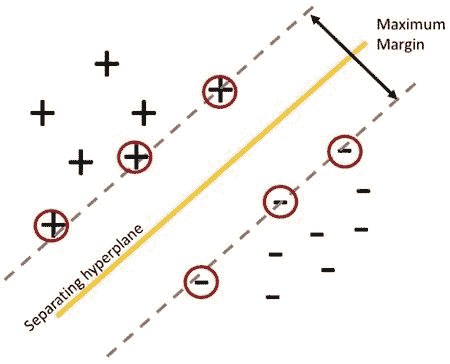

[图 4-5](#_Fig5) 。支持向量机，分离超平面和边缘

考虑下面的例子。假设一家电信公司有以下由 *n* 个客户组成的训练数据。在这 n 个客户中，我们假设 50 个客户会流失，另外 50 个客户不会。对于每个客户，您提取 10 个输入变量(或特征)来代表客户。给定一个已经使用该服务一段时间的客户，电信公司的数据科学家和业务分析师想要确定该客户是否会流失并转移到不同的电信提供商。

假设训练数据由以下组成:( *x* 1 ， *y* 1 )，...，( *x* *n* ， *y* *n* )，其中( *x* *i* ， *y* *j* 【T31)表示映射到 *x* *i* 超平面决策函数是

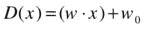

其中 *w* 和*w*T4】0 为系数。分离超平面将满足以下约束:

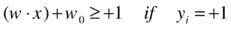

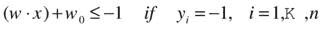

最优分离超平面是使两个类之间的间隔最大的超平面。描述超平面的这两个约束可以用下面的等式表示

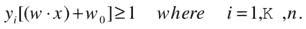

该方程可用于表示可用于分离数据的所有超平面。通常，由于直接计算| |*w*| | |的范数的值的困难，该方程不能以其当前形式(也称为原始形式)直接求解。在实践中，该方程的对偶形式用于求解将识别最佳超平面的优化问题。

 **注**你可以从以下书籍中了解更多关于支持向量机以及如何最大化利润的知识:

Vladimir，c .和 Filip，m .，*从数据中学习(概念、理论和方法)*。
第 353-384 页(威利-Interscience，1998)。

支持向量机的一个很好的概述可以在[http://en.wikipedia.org/wiki/Support_vector_machine](http://en.wikipedia.org/wiki/Support_vector_machine)找到。

Azure Machine Learning 提供了一个**两类支持向量机**模块，可以让你建立一个支持二进制预测的模型。模块的输入可以是连续和/或分类变量。该模块提供了几个参数，可用于微调支持向量机算法的行为。这些包括

*   *迭代次数*:决定训练模型的速度。此参数使您能够在训练速度和模型准确性之间取得平衡。默认值设置为 1。
*   *λ*:L1 正则化的权重，用于调整所产生的模型的复杂度。λ的默认值设置为 0.001。非零值用于避免过度拟合模型。
*   *规格化特征*:决定算法是否规格化数值。
*   *投影到单位球面*:决定算法是否将数值投影到单位球面。
*   *随机数种子* :计算模型时用于随机数生成的种子值。
*   *允许未知分类级别*:确定算法是否支持未知分类值。如果设置为 True，算法将为每个分类列创建一个附加级别。附加级别用于映射在训练数据集中找不到的测试数据集中的级别。

贝叶斯点机器

贝叶斯点机器(BPMs )是一种线性分类算法，由拉尔夫·赫布里希、托雷·格拉佩尔和科林·坎贝尔于 2001 年提出。贝叶斯点机器算法的核心思想是识别一个“平均”分类器，它能够有效且高效地逼近几个线性分类器的理论最优贝叶斯平均值(基于它们的概括能力)。“平均”分类器被称为贝叶斯点。在实证研究中，对于实验室和真实世界的数据，贝叶斯点机器一直优于支持向量机。

 **注**Azure 机器学习中使用的贝叶斯点机器算法是基于 Infer.Net 的，对原有的贝叶斯点机器算法进行了改进。这些改进使 Azure 机器学习中使用的贝叶斯点机器更健壮，更不容易过度拟合数据。它还减少了执行性能调优的需要。

其中一些改进包括使用期望传播作为消息传递算法。此外，该实现不需要使用参数扫描和归一化数据。

回想一下前面对分类问题的定义:给定一个输入样本 *X* = ( *x* 1 ， *x* 2 ，。。。、 *x* *d* )，其中 *x* *i* 指大小为 d 的样本中的一个项目，分类的目标是学习映射 *X* → *Y* ，其中*Y*Y*Y*为一个类

给定样本中的一项*x*T3】IT5】，其中 *x* *i* 为一个或多个变量的向量。BPM 通过执行以下步骤计算出 *x* *i* 的分类标签:

*   用权重向量 w 计算 *x* *i* 的内积
*   判断*x*T3】IT5】是否属于 y 类，如果(*x**I**w*)为正。(*x**I**w*是矢量 *x* *i* 和 w 的内积)。高斯噪声被添加到计算中。

在训练期间，BPM 算法使用先验和训练数据来学习 w 的后验分布。计算中使用的高斯噪声有助于解决没有能够完美分类训练数据的 *w* 的情况(即，当训练数据中的两个类不是线性可分的)。

 **注意**你可以在[http://research.microsoft.com/apps/pubs/default.aspx?了解更多关于 BPMs 的信息 id=65611](http://research.microsoft.com/apps/pubs/default.aspx?id=65611) 。

此外，以下使用 infernet 和 BPMs 的教程深入介绍了算法的工作原理:[http://research . Microsoft . com/en-us/um/Cambridge/projects/infernet/docs/Bayes % 20 point % 20 machine % 20 tutorial . aspx](http://research.microsoft.com/en-us/um/cambridge/projects/infernet/docs/Bayes%20Point%20Machine%20tutorial.aspx)。

Azure Machine Learning 提供了一个**两类贝叶斯点机器**模块，使你能够建立一个支持二元预测的模型。该模块提供了几个参数，可用于微调**贝叶斯点机器**模块的行为。这些包括

*   **训练迭代次数* :决定消息传递算法在训练中使用的迭代次数。通常，期望更多的迭代可以提高模型所做预测的准确性。默认的训练迭代次数是 30。*
**   *Include bias* :确定是否给每个训练和预测实例增加一个恒定的偏差值。*

 *类似于**支持向量机**模块，支持名为**允许未知分类级别**的参数。

聚类算法

聚类是一种无监督的机器学习。在聚类中，目标是将相似的对象分组在一起。大多数现有的聚类算法可以分类如下:

*   *分区*:将一个数据集分成 *k* 个数据分区。每个分区对应一个集群。
*   *层次化*:给定一个数据集，在构建集群时，层次化方法要么自下而上，要么自上而下。在自下而上的方法(也称为凝聚方法)中，算法从数据集中分配给一个聚类的每个项目开始。随着算法在层次结构中向上移动，它将单个聚类(相似的)合并成更大的聚类。这一直持续到所有的集群合并成一个(层次的根)。在自顶向下方法(也称为除法方法)中，算法从一个聚类中的所有项目开始，在每次迭代中，划分为更小的聚类。
*   *密度*:基于密度的算法通过考虑每个项目“邻域”中的密度(项目数)来增长聚类。它们通常用于识别具有“任意”形状的簇。相比之下，大多数基于划分的算法依赖于距离度量的使用。这产生具有规则形状(例如球形)的簇。

 **注意**在[http://en.wikipedia.org/wiki/Cluster_analysis](http://en.wikipedia.org/wiki/Cluster_analysis)阅读各种聚类算法的概述。

在这一章中，我们将关注基于划分的聚类算法。具体来说，您将了解 k-means 聚类是如何工作的。

对于基于划分的聚类算法，能够测量点和向量之间的距离(或相似性)是很重要的。各种距离度量包括欧几里得距离、余弦距离、曼哈顿距离(也称为城市街区距离)、切比雪夫距离、闵可夫斯基距离和马哈拉诺比斯距离。

在 Azure 机器学习中， **K-Means 聚类**模块支持欧几里德和余弦距离度量。给定两个点 p1 和 p2，p1 和 p2 之间的欧几里德距离是连接这两个点的线段的长度。欧几里德距离也可以用来测量两个向量之间的距离。给定两个向量 v1 和 v2，余弦距离是 v1 和 v2 之间角度的余弦。

用于聚类的距离度量是基于被聚类的数据类型来选择的。欧几里德距离对所比较的向量的比例/大小很敏感。例如，即使两个向量看起来相对相似，要素的比例也会影响欧氏距离的值。在这种情况下，余弦距离测量更合适，因为它不太容易受到缩放的影响。两个向量之间的余弦角会很小。

k 均值聚类的工作原理如下:

1.  从数据集中随机选择 k 个项目作为 k 个聚类的初始中心。
2.  对于剩余的每个项目，根据项目和分类中心之间的距离，将每个项目分配给 k 个分类。
3.  计算每个聚类的新中心。
4.  重复第 2 步和第 3 步，直到集群不再有变化，或者达到最大迭代次数。

为了说明起见，[图 4-6](#Fig6) 给出了一个 k 均值聚类的数据集。该数据中有三个不同的聚类，用不同的颜色表示。

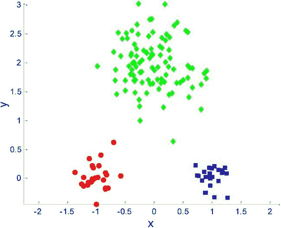

[图 4-6](#_Fig6) 。k 均值聚类数据集

[图 4-7](#Fig7) 说明了 k=3 的 k 均值聚类，以及三个聚类质心(表示为+符号)如何在每次迭代中移动，以减少均方误差并更准确地反映聚类中心。

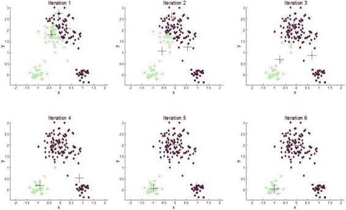

[图 4-7](#_Fig7) 。k=3 的 K 均值聚类算法的迭代，其中聚类质心移动以最小化误差

Azure 机器学习中的 **K-Means 聚类**模块支持不同的质心初始化算法。这是由**初始化**属性指定的。支持五种质心初始化算法。[表 4-1](#Tab1) 显示了支持的不同质心初始化方法。

[表 4-1](#_Tab1) 。k-均值聚类质心初始化算法

<colgroup><col width="45%" class="calibre18"> <col width="55%" class="calibre18"></colgroup> 
| 

质心初始化算法

 | 

描述

 |
| --- | --- |
| **默认** | 拾取前 N 个点作为初始质心 |
| **随机** | 随机拾取初始质心 |
| **K-Means++** | K-Means++质心初始化 |
| **K-Means+ Fast** | K-Means++质心初始化，P:=1(其中在算法的每次迭代中选取最远的质心) |
| **均匀地** | 均匀选取 N 个点作为初始质心 |

摘要

在本章中，您学习了不同的回归、分类和聚类算法。您了解了每种算法的工作原理，以及它们适用的问题类型。本章的目标是为你提供使用这些算法来解决即将到来的章节中所涉及的各种问题的基础。此外，本章提供的资源将帮助您更深入地了解机器学习的最新发展水平，以及其中一些算法背后的理论。*