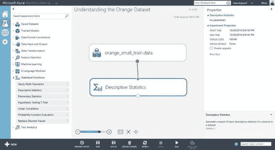
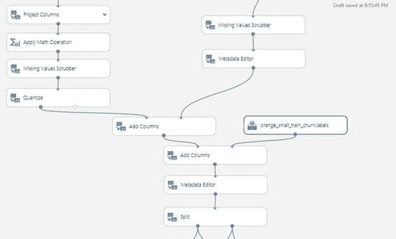

# 六、构建流失模型

在这一章，我们揭示了建立客户流失模型的秘密，这是非常高的需求。许多行业使用流失分析作为减少客户流失的手段。本章将展示在微软 Azure 机器学习中构建客户流失模型的整体视图。

简而言之，改变模型

企业需要一个有效的策略来管理客户流失，因为吸引新客户比留住现有客户成本更高。客户流失可以采取不同的形式，如转向竞争对手的服务，减少使用服务的时间，减少使用的服务数量，或转向成本更低的服务。零售、媒体、电信和银行行业的公司使用客户流失建模来创建更好的产品、服务和体验，从而提高客户保留率。

让我们更深入地探讨为什么客户流失建模对电信公司至关重要。许多电信公司的消费者业务在一个竞争非常激烈的市场中运营。在许多国家，两家或两家以上的电信公司争夺同一个客户是很常见的。此外，移动号码可移植性使客户更容易转换到另一家电信提供商。

许多电信公司在其年度报告中跟踪客户流失率。客户流失模型的使用使电信提供商能够制定有效的商业策略来留住客户，并防止潜在的收入损失。

流失模型使公司能够预测哪些客户最有可能流失，并了解导致流失发生的因素。在用于构建流失模型的不同机器学习技术中，分类算法是常用的。Azure 机器学习提供了广泛的分类算法，包括决策森林、决策丛林、逻辑回归、神经网络、贝叶斯点机器和支持向量机。图 6-1 显示了你可以在 Azure 机器学习工作室中使用的不同分类算法。

[图 6-1](#_Fig1) 。ML Studio 中可用的分类算法

在建立客户流失模型(基于分类算法)之前，理解数据非常重要。给定一个用于培训和测试客户流失模型的数据集，您应该就该数据提出以下问题(非详尽):

*   每一列都捕捉到了什么样的信息？
*   您应该直接使用每一列中的信息，还是应该从每一列中计算更有意义的派生值？
*   数据分布是怎样的？
*   每列中的值是数值型还是分类型？
*   一列是否包含许多缺失值？

一旦您理解了数据，您就可以使用以下步骤开始构建客户流失模型。

1.  数据准备和理解
2.  数据预处理和特征选择
3.  预测客户流失的分类模型
4.  评估模型的性能
5.  模型的操作化

在本章中，您将学习如何执行这些步骤来为电信用例构建客户流失模型。您将学习 Azure Machine Learning Studio 中用于理解数据和执行数据预处理的不同工具。您将了解用于评估模型有效性的不同绩效指标。我们开始吧！

构建和部署客户流失模型

在本节中，您将学习如何使用不同的分类算法构建客户流失模型。为了构建客户流失模型，您将使用来自 2009 年 KDD 杯的电信数据集。该数据集由法国领先的电信公司 Orange 提供。根据 Orange 2013 年年报，Orange 在全球拥有 2.36 亿客户(1550 万固定宽带客户和 1.785 亿移动客户)。

KDD 杯 2009 挑战赛的目标是建立一个有效的机器学习模型，用于预测客户流失、购买新产品/服务的意愿(欲望)和向上销售的机会。在这一部分，您将重点关注预测客户流失。

 **注** KDD 杯是由 ACM 知识发现和数据挖掘特别兴趣小组(SIGKDD)组织的一年一度的比赛。每年，数据科学家都会参与各种数据挖掘和知识发现挑战。这些挑战包括预测谁最有可能向慈善机构捐款(1997 年)，在线零售商的点击流分析(2000 年)，预测电影分级行为(2007 年)，预测客户更换提供商的倾向(2009 年)。

准备和理解数据

在本练习中，您将使用由 50，000 行组成的小型橙色数据集。每行有 230 列(称为变量)。前 190 个变量是数字变量，后 40 个变量是分类变量。

在开始构建实验之前，请从 KDD 杯网站下载以下小数据集和客户流失标签:

*   orange _ small _ train . data . zip-[www.sigkdd.org/site/2009/files/orange_small_train.data.zip](http://www.sigkdd.org/site/2009/files/orange_small_train.data.zip)
*   orange _ small _ train _ churn . labels-[www . sigk DD . org/site/2009/files/orange _ small _ train _ churn . labels](http://www.sigkdd.org/site/2009/files/orange_small_train_churn.labels)

在 orange _ small _ train _ churn . labels 文件中，每行包含一个+1 或-1 值。+1 值表示正面例子(客户流失)，而-1 值表示负面例子(客户没有流失)。

文件上传后，您应该将数据集和标签上传到 Machine Learning Studio ，如下所示:

1.  Click **New** and choose **Dataset  From Local File** ([Figure 6-2](#Fig2)).

    

    [图 6-2](#_Fig2) 。使用机器学习工作室上传 Orange 数据集

2.  Next, choose the file to upload: **orange_small_train.data** ([Figure 6-3](#Fig3)) .

    

    [图 6-3](#_Fig3) 。上传数据集

3.  点击**确定**。

上传完 Orange 数据集后，重复这些步骤将客户流失标签文件上传到 Machine Learning Studio。一旦完成，当您创建一个新的实验时，您应该能够看到两个橙色的数据集。为此，创建一个新实验，并在左窗格中展开 Saved Datasets 菜单。[图 6-4](#Fig4) 显示了你上传的橙色训练和流失标签数据集。

[图 6-4](#_Fig4) 。保存的数据集、橙色训练数据和流失标签

在建立任何机器学习模型时，在试图建立模型之前，了解数据是非常重要的。为此，创建一个新的实验，如下所示。

1.  点击**新建**  **实验**。
2.  命名实验- **理解橙色数据集**。
3.  从**保存的数据集**中，选择 **orange_small_train.data** 数据集(双击)。
4.  从**统计功能**中，选择**描述性统计**(双击)。
5.  You will see both modules. Connect the dataset with the **Descriptive Statistics** module. [Figure 6-5](#Fig5) shows the completed experiment.

    

    [图 6-5](#_Fig5) 。了解 Orange 数据集

6.  点击**运行**。
7.  一旦运行成功完成，右键单击**描述性统计**下面的圆圈，并选择**可视化**。
8.  您将看到数据分析，包括每个变量的唯一值计数、缺失值计数、最小值和最大值([图 6-6](#Fig6) )。

[图 6-6](#_Fig6) 。橙色数据集的描述性统计数据

这提供了关于每个变量的有用信息。通过可视化，您将观察到有许多变量缺少值(例如，Var1、Var8)。例如，Var8 实际上是一个没有任何有用信息的列。

 **提示**可视化**描述性统计**的输出时，显示前 100 个变量。要查看所有 230 个变量的统计数据，右键单击**描述性统计**模块的底部圆圈，并选择**另存为数据集**。保存数据集后，您可以选择下载文件并在 Excel 中查看所有行。

数据预处理和特征选择

在大多数分类任务中，您通常需要确定应该使用哪些变量来构建模型。Machine Learning Studio 提供了两个特征选择模块，可用于确定建模的正确变量。这包括基于过滤器的特征选择和线性判别分析。

在本练习中，您将不会使用这些功能选择模块。[图 6-7](#Fig7) 显示了数据预处理步骤。

[图 6-7](#_Fig7) 。数据预处理步骤

为简单起见，执行以下步骤来预处理数据。

1.  Divide the variables into the first 190 columns (numerical data) and the remaining 40 columns (categorical data). To do this, add two **Project Columns** modules.

    对于第一个 **项目列**模块，选择**列索引:1-190** ( [图 6-8](#Fig8) )。

    

    [图 6-8](#_Fig8) 。选择列索引 1-190(数字列)

    对于第二**项目列**模块，选择**列索引:191-230** ( [图 6-9](#Fig9) )。

    

    [图 6-9](#_Fig9) 。选择列索引 191-230(分类列)

2.  For the first 190 columns, do the following:
    1.  Use **Project Columns** to select the columns that contain numerical data (and remove columns that contain zero or very few values). These includes the following columns: Var6, Var8, Var15, Var20, Var31, Var32, Var39, Var42, Var48, Var52, Var55, Var79, Var141, Var167, Var175, and Var185\. [Figure 6-10](#Fig10) shows the columns that are excluded.

        

        [图 6-10](#_Fig10) 。排除不包含有用值的列

    2.  Apply a math operation that adds 1 to each row. The rationale is that this enables you to distinguish between rows that contain actual 0 for the column vs. the substitution value 0 (when you use the Missing Values Scrubber). [Figure 6-11](#Fig11) shows the properties for the **Math Operation** module.

        

        [图 6-11](#_Fig11) 。将现有数值变量加 1

    3.  Use the **Missing Value Scrubber** to substitute missing values with 0\. [Figure 6-12](#Fig12) shows the properties.

        

        图 6-12。缺失值洗涤器属性

    4.  使用**量化**模块，通过量化功能将输入值映射到较少数量的箱中。在本练习中，您将使用**等宽宁滨**模式。[图 6-13 显示了所使用的属性。](#Fig13)

    

    图 6-13。量化属性

3.  对于剩余的 40 列，执行以下步骤:
    1.  Use the **Missing Values Scrubber** to substitute it with 0\. [Figure 6-14](#Fig14) shows the properties.

        

        [图 6-14](#_Fig14) 。缺失值洗涤器(针对剩余的 40 列)

    2.  Use the **Metadata Editor** to change the type for all columns to be **categorical**. [Figure 6-15](#Fig15) shows the properties.

        

        [图 6-15](#_Fig15) 。使用元数据编辑器将列标记为包含分类数据

4.  Combine it with the labels from the **ChurnLabel** dataset. [Figure 6-16](#Fig16) shows the combined data.

    

    [图 6-16](#_Fig16) 。组合训练数据和训练标签

5.  将标签列重命名为 **ChurnLabel** 。[图 6-17](#Fig17) 显示了如何使用元数据编辑器来重命名列。

[图 6-17](#_Fig17) 。将标签列重命名为 ChurnLabel

预测客户流失的分类模型

在本节中，您将开始使用 Azure Machine Learning Studio 中提供的分类算法构建客户流失模型。为了预测客户流失，您将使用两个分类算法，一个两类提升决策树和一个两类决策树。

决策树是一种用于分类或回归的机器学习算法。在训练期间，它使用给出最高信息增益的输入变量来拆分数据。对数据的每个子集重复该过程，直到不再需要分割。决策树的叶子识别要预测的标签(或类别)。该预测是基于概率分布提供的。

增强的决策树和决策树算法构建了一个决策树集合，并使用它们进行预测。这两种方法之间的关键区别在于，在增强决策树算法中，多个决策树是连续增长的，使得一个树的输出被提供作为下一个树的输入。这是集合建模的一种推进方法。相比之下，决策树算法独立地生长每棵决策树；集合中的每棵树都使用从原始数据集中提取的数据样本。这就是集合建模的 bagging 方法。关于决策树、决策树和增强决策树的更多细节，请参见第 4 章。[图 6-18](#Fig18) 显示了数据是如何被分割并用作训练两个分类模型的输入的。

[图 6-18](#_Fig18) 。将数据分为训练和测试，并训练客户流失模型

从[图 6-18](#Fig18) 中，可以看到执行了以下步骤。

1.  Splitting the input data into training and test data: In this exercise, you split the data by specifying the **Fraction of rows in the first output** dataset, and set it as **0.7**. This assigns 70% of data to the training set and the remaining 30% to the test dataset.

    [图 6-19](#Fig19) 显示了拆分的属性。

    

    [图 6-19](#_Fig19) 。拆分模块的属性

2.  Training the model using the training data: In this exercise, you will be training two classification models, a two-class boosted decision tree and two-class decision forest. [Figures 6-20](#Fig20) and [6-21](#Fig21) show the properties for each of the classification algorithms.

    

    [图 6-20](#_Fig20) 。两类提升决策树的性质

    

    [图 6-21](#_Fig21) 。两类决策森林的性质

3.  Training the model using the **Train Model** module: To train the model, you need to select the label column. In this exercise, you will be using the **ChurnLabel** column. [Figure 6-22](#Fig22) shows the properties for **Train Model**.

    

    [图 6-22](#_Fig22) 。使用 ChurnLabel 作为标签列

    对模型评分:在训练客户流失模型之后，您可以使用**评分模型**模块来预测测试数据集的标签列。**评分模型**的输出将在**评估模型**中使用，以了解模型的性能。

恭喜你，你已经成功建立了客户流失模型！您学习了如何使用 Machine Learning Studio 中的两种分类算法。您还学习了如何评估模型的性能。在接下来的几章中，您将学习如何将模型部署到生产环境中并使其可操作化。

评估客户流失模型的性能

在您使用**评分模型**预测客户是否会流失之后，**评分模型**模块的输出被传递到**评估模型**以生成每个模型的评估指标。[图 6-23](#Fig23) 显示了**评分模型**和**评估模型**模块。

[图 6-23](#_Fig23) 。对模型进行评分和评估

评估完模型后，可以右键单击**评估模型**底部的圆圈，查看两个客户流失模型的表现。[图 6-24](#Fig24) 显示的是接收机工作特性(ROC 曲线 ) ，而[图 6-25](#Fig25) 显示的是两种客户流失模型的准确度、精确度、召回率和 F1 得分。

[图 6-24](#_Fig24) 。两种客户流失模型的 ROC 曲线

[图 6-25](#_Fig25) 。客户流失模型的准确度、精确度、召回率和 F1 分数

ROC 曲线显示了客户流失模型的性能。图表上从(0，0)到(1，1)的对角线显示了随机猜测的性能。例如，如果你随机猜测哪个客户会流失，曲线将在对角线上。好的预测模型应该比随机猜测表现更好，ROC 曲线应该在对角线以上。客户流失模型的性能可以通过考虑曲线下面积(AUC)来衡量。曲线下的面积越大，模型的性能越好。理想模型的 AUC 为 1.0，而随机猜测的 AUC 为 0.5。

从可视化中，您可以看到客户流失模型的累积 AUC、准确度和精确度分别为 0.698、0.907 和 0.283。您还可以看到客户型号的 F1 得分为 0.204。

 **注**参见[http://en.wikipedia.org/wiki/F1_score](http://en.wikipedia.org/wiki/F1_score)关于使用 F1 分数来衡量机器学习模型准确性的很好的讨论。

摘要

通过使用 KDD 杯 2009 Orange 电信数据集，您一步一步地学习了如何使用 Azure 机器学习来构建客户流失模型。在构建模型之前，您花时间首先理解数据并执行数据预处理。接下来，您学习了如何使用两类提升决策树和两类决策树算法来执行分类，并使用电信数据集来构建预测客户流失的模型。在构建模型之后，您还学习了如何度量模型的性能。