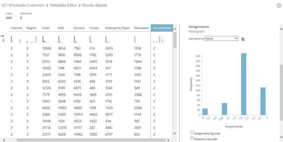

# 七、客户细分模型

在本章中，你将学习如何在微软 Azure 机器学习中构建客户细分模型。通过一个实际的例子，我们展示了一个使用微软 Azure 机器学习的分步指南，以使用 k-means 聚类轻松构建细分模型。模型构建完成后，您将学习如何执行验证并将其部署到生产环境中。

简而言之，客户细分模型

为了让公司更有效地竞争，并制造销售的产品和服务，找出目标客户群和每个客户群的特征是非常重要的。识别客户群至关重要，因为它有助于公司更好地确定营销活动的目标，以赢得最有利可图的客户。公司中的数据分析师的任务是从内部和外部数据源中筛选数据，以确定吸引特定客户群的神奇成分(这可能不是先验知识)。

客户细分使公司有能力制定营销策略并开展针对特定客户群的营销活动。此外，客户细分导致更大的客户满意度，因为不同细分中的不同需求可以得到适当解决。

 **注意**在[http://en.wikipedia.org/wiki/Market_segmentation](http://en.wikipedia.org/wiki/Market_segmentation)了解更多关于市场细分的信息。

公司必须能够掌握大量可用信息(如市场研究报告、概念/市场测试等)。).虽然这种市场研究数据提供了市场上定性和定量信息的良好平衡，但如果公司能够利用他们已经拥有的巨大数据宝库(例如，会员/忠诚度计划数据库、来自在线服务/零售店的账单数据、CRM 系统等)，他们可以更有效地竞争。).宝库中的某个地方蕴藏着一些见解，企业可以将这些见解转化为自己的竞争优势。这些见解使公司能够认识到潜在的客户群及其特征。

例如，在美国，许多人都熟悉消费者信用评分的使用。消费者信用评分有助于银行了解申请贷款(汽车贷款、抵押贷款等)的客户的风险状况。).这反过来使银行能够根据个人所属的风险类别调整利率。

再比如电信行业。许多电信提供商努力深入了解如何有效地向他们的客户进行销售，这些客户分为两大类:公司业务和消费者。为了找出针对消费者的有效营销策略，电信提供商通常对使用该服务的人的简档感兴趣。具有相似特征的人被组合在一起，并提供吸引该特征的折扣或增值服务。电信提供商考虑的特征的非详尽列表包括收入群体、朋友和家庭成员的呼叫频率、呼叫/短消息的数量和发生时间、他们如何支付每月账单(在线、自助服务亭、实体店)、支付延迟等。

在不同类型的无监督机器学习技术中，k 均值聚类是一种用于执行客户细分的常用技术。在本章中，您将学习如何使用 Microsoft Azure 机器学习在维基百科 SP 500 数据集(ML Studio 中可用的样本数据集之一)上执行 k-means 聚类。

维基百科 SP 500 数据集包含以下信息:行业类别，以及描述 500 家标准普尔(SP500)公司的文本。您将构建并部署一个 k-means 聚类模型来执行公司细分。由于从文本中提取了大量的特征，您将执行一个 R 脚本来执行主成分分析，以确定前 10 个特征，这些特征将用于确定聚类。执行 k-means 聚类后，彼此相似的公司(基于从公司描述性文本中提取的特征)将被分配到相同的细分市场。

 **注**参见[第 4 章](05.html)对不同统计和机器学习算法的概述。在本章中，您还将了解聚类算法的类别，以及 K 均值聚类的工作原理。

构建和部署您的第一个 K 均值聚类模型

为了帮助您开始构建您的第一个 k-means 聚类模型，您将使用 ML Studio 中提供的一个示例实验。该实验使用 k-means 聚类对标准的&普尔(S & P) 500 公司列表中的公司进行细分。

实验成功执行后，可以看到这些公司(来自不同的行业类别)被分配到不同的集群中([图 7-1](#Fig1) )。在此示例中，k-means 算法在 x 轴上找到了标记为 0、1 和 2 的三个线段。在每个方框中，你会看到每个类别中被分配到一个集群的公司数量。在分类 2 中，您可以看到有 1 家公司属于非必需消费品类别。


[图 7-1](#_Fig1) 。公司的细分

我们开始吧！在这个练习中，让我们使用名为样本实验-标准普尔 500 公司聚类-开发的样本实验(如图[图 7-2](#Fig2) )。从[图 7-3](#Fig3) ，你会看到实验由以下步骤组成。

1.  从维基百科 SP 500 数据集中检索数据。
2.  对数据执行要素散列以矢量化要素。
3.  执行一个 R 脚本来识别特征的主要组成部分。
4.  规划将在聚类分析模型中使用的列。
5.  使用两个 k-means 聚类分析模型来定型聚类分析模型。对于每个 k-均值聚类模型，指定了不同的聚类数。
6.  将结果转换为 CSV 文件。

在本节中，您将学习如何对公司进行细分。


[图 7-2](#_Fig2) 。ML 工作室的实验样品


[图 7-3](#_Fig3) 。在 ML Studio 中创建您的第一个 k 均值聚类模型

特征散列法

在机器学习中，输入特征可以是自由文本。表示自由文本的一种常见方法是使用一个单词包。每个单词都被表示为一个令牌。每当该单词出现在文本中时，就给该令牌分配一个 1。如果单词没有出现，则分配 0。

然而，单词袋模型将不会缩放，因为可能单词的数量事先是不知道的。想象一下，在每家标准普尔 500 公司的描述性文本中，用一个单词代表一个符号。输入的维数可能很大。因此，一种常见的方法是使用哈希函数将所有标记转换为数字特征，并限制可能的哈希值的范围。为此，机器学习社区通常使用特征哈希(也称为“哈希技巧”)来准备数据集，然后将其用作机器学习算法的输入。

在这个例子中，**特征散列**模块用于对标准普尔 500 公司的描述性文本执行散列。在底层，特性散列模块使用 Vowpal Wabbit 库来执行 32 位 murmurhash 散列。对于这个练习，散列位大小被设置为 **12** ，以及 **N 元文法**。特征散列模块执行后，你会看到描述性文本已经被转换成大量的列，列名以 Text_HashingFeature_ 为前缀(如图[图 7-4](#Fig4) 所示)。


[图 7-4](#_Fig4) 。特征散列

 **注**vow pal Wabbit 库是一个开源的机器学习库。更多信息见[https://github.com/JohnLangford/vowpal_wabbit/wiki/Tutorial](https://github.com/JohnLangford/vowpal_wabbit/wiki/Tutorial)。

MurmurHash 是一个非加密散列函数家族，它提供了良好的分布、雪崩行为和抗冲突性。参见[https://code.google.com/p/smhasher/](https://code.google.com/p/smhasher/)了解更多关于 MurmurHash 系列散列函数的信息。

确定正确的特征

当使用 k-均值聚类进行客户细分时，您需要确定在聚类过程中将使用的特征。在执行了特征散列之后，将会基于描述性文本计算出大量的特征。

**主成分分析** (PCA) 是一种强大的统计技术，可用于识别少量特征(即主成分)，这些特征捕捉了原始特征的关键本质。

在这个示例实验中，您将学习如何使用 R 执行主成分分析。具体来说，您将使用**执行 R 脚本**模块来执行下面的 R 脚本(作为示例实验的一部分提供)。

```py
# Map 1-based optional input ports to variables
dataset1 <- maml.mapInputPort(1) # class: data.frame

# Sample operation
titles_categories = dataset1[,1:2]
pca = prcomp(dataset1[,4:4099])
top_pca_scores = data.frame(pca$x[,1:10])
data.set = cbind(titles_categories,top_pca_scores)

# You'll see this output in the R Device port.
# It'll have your stdout, stderr and PNG graphics device(s).
plot(pca)

# Select data.frame to be sent to the output Dataset port
maml.mapOutputPort("data.set");
```

从 R 脚本中，您会注意到使用了 R 函数 prcomp。prcomp 的输入包括数据集 1 的第 4 至 4099 列。计算结果存储在变量 pca 中。对于这个示例实验，您将获得前 10 个主成分，并将其作为 k-means 聚类算法的输入。

运行实验后，您可以点击 **Execute R Script** 模块，并选择可视化结果数据集。[图 7-5](#Fig5) 显示了结果数据集，以及计算出的前 10 个主成分(PC)。


[图 7-5](#_Fig5) 。结果数据集的可视化(数据集的前 10 个主成分)

 **注**参考[http://en.wikipedia.org/wiki/Principal_component_analysis](http://en.wikipedia.org/wiki/Principal_component_analysis)了解更多关于 PCA 的信息。

在 R 中，有几个函数可用于执行 PCA。其中包括 pca()、prcomp()和 princomp()。prcomp()之所以被广泛使用，是因为它在数值上更稳定，并返回一个包含以下信息的 R 对象:特征向量、特征值的平方根和分数。

参见第 3 章了解更多关于如何将 R 与 Azure 机器学习结合使用的信息。

K-均值聚类的性质

从[图 7-3](#Fig3) 你会看到实验中使用了两次 k-means 聚类。两个 k 均值聚类模块的主要区别在于质心的数量(即 k 的值)。这也与您希望从 k-means 算法中获得的分段数或聚类数相同。对于左侧 k-均值聚类，样本实验已经指定 k 的值为 3(即，k-均值聚类模型将识别 3 个聚类)；而右边的 k 均值聚类模型指定 k 的值为 4。

您可以通过单击每个 k-means 聚类矩形来查看指定的质心数量。[图 7-6](#Fig6) 显示了 K 均值聚类模型的各种属性，包括

*   质心数量
*   公制:公制用于计算集群之间的距离
*   初始化:用来指定种子初始质心的方法
*   迭代次数:使用的迭代次数


[图 7-6](#_Fig6) 。k-均值聚类模型的性质

执行聚类时，用户需要指定空间中任意两点之间的距离度量。在 ML Studio 中，这是由 Metric 属性定义的。支持两种距离度量:欧几里得距离(也称为 L2 范数)和余弦距离。根据输入数据和用例的特征，用户应该选择 k-means 聚类使用的相关度量属性。

 **注意**在执行聚类时，能够测量点和向量之间的距离(或相似性)是很重要的。欧几里德距离和余弦距离是常用的距离度量。

*欧氏距离*:给定两个点 p1 和 p2，p1 和 p2 之间的欧氏距离就是连接这两个点的线段的长度。欧几里德距离也可以用来测量两个向量之间的距离。

*余弦距离*:给定两个矢量 v1 和 v2，余弦距离就是 v1 和 v2 夹角的余弦。

要使用的距离度量的选择通常是特定于域的。

欧几里德距离对所比较的向量的比例/大小很敏感。需要注意的是，即使两个向量可能相对相似，但是如果特征的尺度显著不同，欧几里德距离可能表明这两个向量不同。在这种情况下，通常使用余弦距离，因为无论比例如何，两个向量之间的余弦角都很小。

为距离度量选择度量后，您需要选择质心初始化算法。在 Azure 机器学习中，这是由初始化属性定义的。支持五种质心初始化算法。[表 7-1](#Tab1) 显示了不同的质心初始化算法。

[表 7-1](#_Tab1) 。k-均值聚类，质心初始化算法

<colgroup><col width="40%" class="calibre18"> <col width="60%" class="calibre18"></colgroup> 
| 

质心初始化算法

 | 

描述

 |
| --- | --- |
| **默认** | 拾取前 N 个点作为初始质心 |
| **随机** | 随机拾取初始质心 |
| **K-Means++** | K-means++质心初始化 |
| **K-Means+ Fast** | K-means++质心初始化，P:=1(其中在算法的每次迭代中选取最远的质心) |
| **均匀地** | 均匀选取 N 个点作为初始质心 |

这些属性已经在示例实验中为您预先配置好了。

此时，您已经准备好运行实验了。点击 ML Studio 底部面板上的**运行**。一旦实验成功执行，就产生了两组集群。**元数据编辑器**模块用于改变与数据集中的列相关联的元数据，以包括分配的集群。此外， **Convert to CSV** 模块用于将结果转换为逗号分隔的值，这允许您下载结果集。

恭喜你！您已经使用 ML Studio 中的 **K 均值聚类**模块成功运行了您的第一个公司细分实验。

批发客户的客户细分

在前面的小节中，您了解了样本实验中使用的关键模块( K-Means 聚类、训练聚类模型)来执行客户细分。

在本节中，您将逐步了解如何构建聚类模型来为批发客户数据集执行客户细分。

 **注意**批发客户数据集可在 UCI 机器学习存储库中获得。该数据集包含八列(称为属性或特征),并包含在不同地区经营的批发分销商的客户信息。

这些栏目包括鲜奶、杂货、冷冻食品、洗涤剂、纸张和熟食产品的年度支出。此外，它还包括客户(酒店/咖啡厅/餐厅)或零售商的渠道信息。

参考[http://archive.ics.uci.edu/ml/datasets/Wholesale](http://archive.ics.uci.edu/ml/datasets/Wholesale)+客户。

从 UCI 机器学习知识库加载数据

让我们从使用读取器模块从 UCI 机器存储库 中检索数据开始。为此，从工具箱中拖放一个**阅读器**模块(数据输入和输出)。接下来，配置阅读器模块从 Http 源读取，并提供数据集的 URL:[Http://archive . ics . UCI . edu/ml/machine-learning-databases/00292/Wholesale % 20 customers % 20 data . CSV](http://archive.ics.uci.edu/ml/machine-learning-databases/00292/Wholesale%20customers%20data.csv)

[图 7-7](#Fig7) 。显示了读卡器模块及其配置。


[图 7-7](#_Fig7) 。使用读取器模块从 HTTP 数据源读取数据

利用 K-均值聚类进行批发客户细分

对于这个实验，您将使用数据集中的所有八列作为执行聚类的输入。为此，拖放**K-均值聚类**和**列车聚类模型**，并根据[图 7-8](#Fig8) 所示将模块连接在一起。


[图 7-8](#_Fig8) 。使用 K-Means 聚类和训练聚类模型

要配置每个模块，点击模块，并使用屏幕右侧的**属性**窗格指定值。对于 K-Means 聚类模块，将其配置为识别四个聚类(**质心数= 4** )，并使用**欧几里德**距离度量。使用默认的 100 次迭代。对于列车聚类模式模块，将其配置为在执行聚类时使用**所有**功能。

最后，您将希望在实验成功运行后可视化结果。为此，您将使用**元数据编辑器**模块。配置元数据编辑器，使其使用由**列车聚类模型**模块产生的**所有**特征。[图 7-9](#Fig9) 。显示了群集实验的最终设计。


[图 7-9](#_Fig9) 。完成了执行批发客户细分的实验

实验成功运行后，您将能够右键单击**元数据编辑器**模块的**结果**数据集输出来查看集群分配(如图[图 7-10](#Fig10) 所示)。



[图 7-10](#_Fig10) 。显示批发客户的分类分配的直方图

新数据的聚类分配

如果您有新客户，并且希望将他们分配到您确定的某个集群中，会发生什么情况？在本节中，您将学习如何使用**分配给集群**模块。

在本例中，首先将输入数据集分成两组。第一组将用于训练分类模型，第二组将用于分类分配。对于实际的用例，第二个数据集将是您新获得的新数据(例如，您想要分配到一个集群的新客户)。要分割输入数据集，您将使用**分割**模块(在**数据转换示例和分割**中)，并对其进行配置，使其将 90%的输入数据重定向到其第一个输出，将剩余的 10%重定向到第二个输出。您将使用拆分模块的第一个输出中的数据来训练分类模型。

[图 7-11](#Fig11) 显示了修改后的聚类实验设计，其中添加了分配给聚类和分割模块。要配置 Assign to Cluster 模块，单击该模块，并单击 **Launch** 列选择器来选择所有列。**将**分配给集群模块的输出链接到元数据编辑器模块。当进行新的观察时，将其分配给质心距离最近的聚类。

现在，您已经准备好运行实验来执行集群分配。实验成功运行后，您可以通过右键单击元数据编辑器模块的**结果**数据集，并选择**可视化**来可视化结果。


[图 7-11](#_Fig11) 。使用训练好的分类模型执行分类分配的实验

恭喜你！您已经成功地构建了 k-means 聚类分析模型，并使用训练好的模型为聚类分配新数据。

摘要

在本章中，您学习了如何使用 Azure 机器学习创建 k-means 聚类模型。为了快速启动学习，您使用了 Azure Machine Learning 中可用的样本实验，该实验执行标准普尔 500 公司的细分(基于每个公司的描述性文本)。您了解了 ML Studio 中用于执行聚类的关键模块:K-Means 聚类和 Train 聚类模型。您了解了如何使用特征散列对输入(由自由文本组成)进行矢量化，以及如何使用 PCA 来识别主要成分。

此外，您还学习了对批发客户数据集执行 k 均值聚类的步骤，以及如何使用训练好的模型对新数据执行聚类分配。