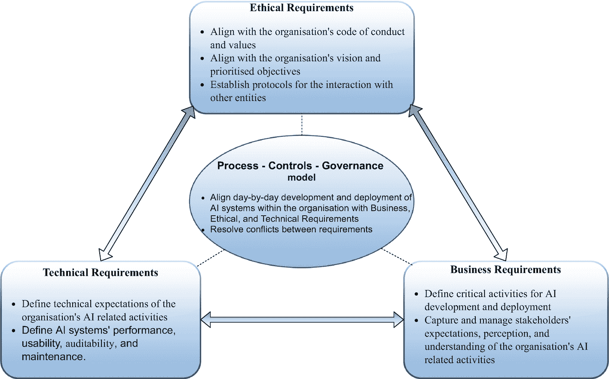

# 三、可持续人工智能框架（SAIF）

Overview of SAIF Framework

接下来的几章讨论了可持续人工智能框架(SAIF)的组成部分。正如第 [1](1.html) 章所强调的，SAIF 依赖于四个支柱:人的因素、组织内部对人工智能的理解、治理和绩效衡量。如图 [3-1](#Fig1) 所示，这四个支柱构成了 SAIF 框架运营模式的概念基础。通过这种操作模型，组织可以决定人工智能系统的最终行为。具体来说，SAIF 运营模式旨在让组织能够

图 3-1

SAIF 运营模式

*   通过评估 AI 对组织在长期、中期和短期内创造价值的能力的影响，了解当前和(潜在)未来的风险状况和不良后果

*   提高组织内对在组织内实现人工智能的要素的理解

*   采用一种实用的方法来设计、开发和部署人工智能系统，将商业和人类的价值和原则结合起来

*   审计一个组织现有的和未来的人工智能系统

SAIF 运营模式的核心是三个基本要素:人工智能开发流程、控制和治理。他们确保组织的愿景与组织内人工智能系统的日常开发和部署保持一致。

*   人工智能开发过程:这包括在人工智能系统的开发和部署中要采取的步骤。

*   **控制:**这些控制对每个过程步骤施加了一些必须遵守的约束，有助于管理最终结果，并达到符合预期的解决方案。

*   治理:这定义了不同涉众的安排和职责，通过这些安排和职责，开发过程和控制在组织内得以实现。

    **流程-控制-治理**模式构成了 SAIF 运营模式的核心要素，因此也可以被称为 SAIF 核心。这将在第 4 章[中详细讨论。这些核心元素受到道德、技术和业务需求的影响。道德、技术和业务需求无疑是相互影响的，并且需要注意确保所有三个因素交付的需求是相互一致的。](4.html)