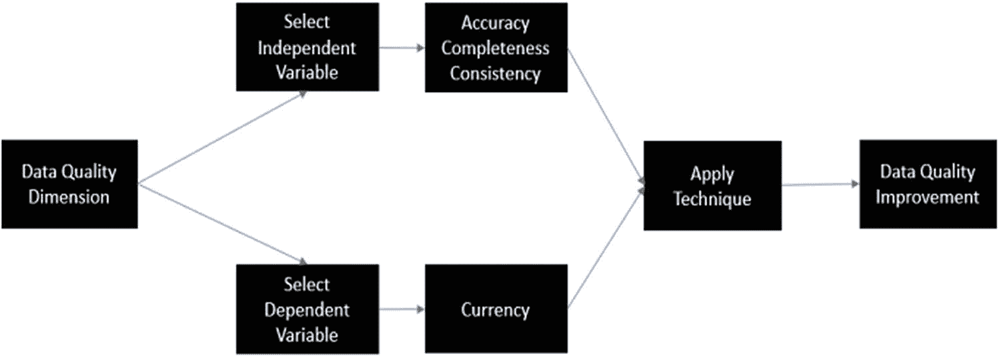

# 一、简介：大数据、自动机器学习和数据流

数据流是一类不断更新和捕获的数据，其数量不断增长，并且在很大程度上是无限的[Aggarwal，2007；扳手等人，2016】。想想我们的日常生活是如何影响数据流的。每次我们使用信用卡购物时，您的姓名、购买金额、购买的产品、购买的时间和日期、购买的地点、数量、产品代码等购买事件信息都会被实时捕获，并存储在能够存储大量数据的数据存储平台中。浏览网页还会导致大量数据流经 IP 网络，这些数据会被您的互联网服务提供商(ISP)捕获。甚至我们驾驶的汽车也越来越多地与互联网相连。汽车制造商正在捕捉和存储所有的遥测和 GPS 数据。

数据继续渗透到我们生活的方方面面。我们今天使用的日常用品，如冰箱、汽车、洗衣机、电视等，每天都会产生大量的数据。据估计，我们每天会产生 2.5 万亿字节的数据。而且，世界上大多数数据都是在过去几年中创建的。这在规模上令人印象深刻，并表明数据正以我们 10 或 15 年前从未想象过的方式涌入我们的世界。我们大多数人都熟悉存在于数据库表、平面文件和数据帧中的数据，但一种新的数据类别正在为数据工程师、科学家和分析师带来新的挑战，这就是由数字互联世界驱动的大规模、快速移动的数据流。我们都知道数据的增长及其对组织的价值[Read et al .，2019；里德等人，2020；古兹和沃兹尼亚克，2020；Lang et al .，2020]，但我们仍处于管理和分析快速移动的数据流的早期阶段，同时还处于管理随着触发大数据流的各种事件峰值而产生的负载的早期阶段，这也可能影响机器学习模型的性能。数据流，或连续的数据流，将在后面详细讨论，正在从多个来源产生，如人类或机器，并且管理这些数据流的技术正在发展。有效管理和分析流数据正成为金融服务、社交技术、零售、媒体、医疗保健和制造业等高容量事务行业的必要能力。想想每秒钟(或更快)从脸书、Twitter、LinkedIn、网飞、物联网设备、金融技术等产生的所有数据。这些类型的快速流动数据积累迅速，如果允许，其大小可以无限增长，数据流科学家可以通过以下方式使用事务性机器学习(TML)进行分析:

1.  数据流可以回滚并实时连接以形成整合的数据集，该数据集可用作 TML 的训练数据集。通过实时分析训练数据集的“窗口”,我们避免了一次分析所有数据的需要；相反，我们可以连续分析时间事务中的所有数据。例如，如果您想要分析每笔零售事务是否存在信用卡欺诈，那么对信用卡事务流应用 TML 将有助于您在购买时及时做出决策。

2.  数据流可以被命名以帮助形成机器学习模型。具体来说，通过命名数据流，我们可以确定一个因变量流和自变量流，以构建一个可以通过 TML 估计的模型。

3.  数据流可以重新用于存储 TML 选择的最佳算法的信息。这些算法可以用于预测分析和优化，可以存储在其他数据流中，供人类或机器在报告和仪表板中用于决策。

我们将进一步展示 TML 如何导致*无摩擦机器学习*，它可以加速对非事务性数据进行操作的传统机器学习方法。具体而言，传统的机器学习过程在准备数据、用因变量和自变量公式化数学模型、估计模型和微调模型中的超参数，以及最终部署模型以供真实世界使用时需要人工干预。所有这些过程都会导致摩擦，从而给机器学习过程增加几天或几周的时间[姚等人，2019]。我们在本书中展示了 TML 如何在使用 AutoML 处理数据流时显著减少这种摩擦。

我们还将展示 TML 解是如何具有弹性的。TML 解决方案是灵活的，因为你可以调整数据流和创建的机器学习模型的数量，以及调整数据生产者和机器学习模型见解消费者的数量。这很重要，原因有几个:

*   允许组织快速满足快速变化的业务领域的分析需求

*   允许组织通过快速停用 TML 解决方案来控制不再使用的解决方案的成本

*   允许组织根据用户需求扩展或缩减解决方案

任何机器学习过程的核心组成部分都是数据。传统上，在进行机器学习之前，首席信息官或 CDO 的主要关注点是制定数据战略。但是，数据速度的提高为数据管理和分析带来了另一层复杂性，这在传统的数据策略中并不容易实现。本书将提供解决这一挑战的方法，并展示如何将数据流整合到数据策略中，以符合您组织的目标和目的。在我们讨论这个问题之前，我们需要问一个问题:什么是数据？在谷歌上快速搜索“数据”,会出现数百万次数据点击。在本书中，我们将假设数据是由数字方式创建的。数据有三种形式:

1.  结构数据

2.  半结构化数据

3.  非结构化数据

## 结构数据

结构化数据是在某个数据库中组织有序的数据。这种结构使开发人员或用户能够以一种标准化的方式访问数据，并在各种类型的技术解决方案中重复使用。结构化数据是一种常见的数据类型，因为它使访问数据更容易进行分析和报告。要对数据施加结构，我们必须执行以下操作:

1.  对其进行分类——是数字、文本还是图像？

2.  确定规模—数据有多大？或者有可能变得多大？

3.  给它命名——我们应该给它取什么名字？让我们假设所有有名字的数据都叫做“变量”

通过对数据进行分类、调整大小和命名，我们不仅构建了数据，而且使其他人更容易使用和访问数据。这对于分析和可视化报告和仪表板中的数据非常重要。

## 半结构化数据

这些类型的数据都有一定的结构，但并不是所有的数据都是结构化的。想想那些不能完全符合表格形式，但可以通过键和值进行标记和标识的数据。一个例子是被称为 JSON [1](#Fn1) 或 XML 的数据。 [2](#Fn2) 这些是普遍接受的通过键和值来标记数据的行业标准形式，但是它们不适合标准的结构化关系数据库。半结构化是一种重要的数据形式，因为它不需要数据库模式来存储。数据的存储可以在应用程序级别以 JSON 或 XML 的形式定义。这使得半结构化数据在不同应用程序之间的使用和交换非常灵活，从而更容易在报告和仪表板中使用和可视化。TML 解决方案使用 JSON 数据格式。

## 非结构化数据

这些类型的数据没有结构。它们不容易用表格形式分类，也不容易像 JSON 或 XML 那样用键值格式分类。非结构化数据可能是最丰富的数据形式，因为它们可以由几乎任何数字设备创建。想想电子邮件、网站数据、视频、图像、传感器读数等等。在非结构化数据上强加一种结构是有价值的。例如，假设您有数千封电子邮件，并且您想通过关键字来组织这些电子邮件。给电子邮件分配一个关键字，可以让您使用该关键字对所有电子邮件进行分类，并提高搜索电子邮件的速度。所有这些类型的数据的共同点是数量。这些类型的数据的巨大增长被称为大数据，将在下一节讨论。

## 快速了解大数据

自 20 世纪 90 年代以来，术语“大数据”一直被用来描述太大而无法使用传统方法进行分析的数据。具体来说，非大数据可以在笔记本电脑或家用电脑上轻松地进行管理、准备和分析。术语“大数据”的常见定义和起源可能要归功于 John Mashey [Mashey，1999；Lohr，2013】。他在计算机环境中使用术语大数据，这是第一次有人记录数据增长及其对计算机硬件(如磁盘空间、CPU 和基础设施)不断增长的需求，他称之为“基础设施压力”。

大数据被描述为[Sagiroglu，2013]

1.  容量—这是指数据的大小，以增长的兆兆字节、兆兆字节甚至更大的单位来衡量。这一数量将影响用于存储这些数据的存储硬件的选择以及可以完成的分析类型。

2.  多样性—这是指可以归类为大数据的不同类型的数据。数据类型不仅会影响存储选择，还会影响数据的分析、准备和管理方式。例如，如果大数据是文本的，那么使用机器学习技术对这些数据执行分析将需要将数据转换为数字形式以供分析。

3.  速度—这是指数据的创建速度。数据创建的速度将直接影响这些数据的数量。这也将影响数据的处理方式和分析方式。

4.  准确性——这是指数据的质量。数据的质量将影响从这些数据中提取的见解的质量。虽然很难衡量数据质量，但统计方法和算法可以用来确定数据质量；稍后将详细介绍数据质量。

5.  价值——从数据中提取的见解的价值。数据的价值应该在问题或调查领域的背景下衡量。例如，如果有人试图回答为什么年轻人的汽车保险费比老年人高的问题，那么使用捕捉不同人口统计数据的驾驶模式可以为回答这个问题增加很多价值:为不同年龄组的保险费制定最优价格。选择*正确的*数据来解决*正确的*问题可以在许多业务领域提供可观的价值。

上述特征并不是一个完整的列表，但它们为我们理解、描述和分类大数据提供了指导。具体来说，数据的数量、种类和速度给确保数据质量和寻找利用机器学习分析高速数据的方法带来了挑战，这些机器学习为决策提供了高质量的见解。这些高速数据挑战正是 TML 要应对和解决的问题。

数据流可以导致大数据，但大数据不一定导致数据流[Jayanthiladevi et al .，2018]。具体来说，持续的数据流将在您的存储平台中积累，从而产生大数据。但是，大数据不需要连续流动，可以是静态的，也可以驻留在磁盘上。在数据流环境中(稍后讨论)，适用于数据流的大数据特征是速度、容量、准确性和多样性。如果执行 TML，值特性可以进一步应用:当数据流与自动机器学习一起使用时，我们将在第 [2](2.html) 章中讨论。

从 TML 解决方案和基础架构的角度来看，建立一个数据可以增长且不受任何限制的环境非常重要。抱着无限数据心态的组织将更加重视数据分析，以提取洞察，做出更好的数据驱动型决策[Sagiroglu，2013]。然而，做出良好的数据驱动决策将依赖于使用高质量的数据。我们将在下一节讨论数据质量。

## 数据质量

从数据中提取的见解直接依赖于数据的质量。传统的静态数据和连续流动的数据流之间的数据质量问题没有改变。然而，如何确定和识别质量问题在这两种类型的数据之间有所不同，这直接取决于数据的速度。例如，数据速度越快，数据底层结构的变化就越快。检测和提高数据流中的数据质量提出了进一步的挑战。鉴于数据的持续流动，评估质量需要自动化和实时处理[Gudivada et al .，2017]。如何进行数据插补或检测数据流中的重复数据？这仍然是一个悬而未决的问题，但开始得到更多的关注[Gudivada 等人，2017]。正如第 2 章所讨论的，TML 可以在这方面提供一些帮助。具体而言，如果试图识别数据中的异常值或异常，传统的异常检测机制可能不会拾取所有的异常值。传统方法的问题是它们没有考虑随时间变化的事务数据。我们将展示 TML 如何使用无监督学习算法来检测随时间快速变化的快速数据流中的异常值。

垃圾进，垃圾出的格言是正确的。与坏数据相反，好数据是好见解的关键要求。但是，如何确定他们拥有的数据质量是否良好呢？使用国际标准化组织(ISO)对质量的定义[Heravizadeh et al .，2009]: *一个实体满足其明示和暗示需求的能力的总体特征*。这些明示和暗示的需求会因使用这些数据的环境和上下文而异。这将进一步意味着数据质量阈值将随着环境和上下文而变化。例如，测量某人患癌症风险所需的数据质量阈值可能会高于测量人们更喜欢可口可乐而不是百事可乐的可能性所需的质量阈值。

事实上，数据质量的维度也会有所不同。例如，在会计和审计中，*准确性*、*相关性*、*及时性*是三个重要的数据质量维度【Sidi et al .，2012】。在信息系统领域，*可靠性*、*精度*、*相关性*、*可用性*和*独立性*都很重要*。*表 [1-1](#Tab1) 显示了数据质量维度的综合列表【Sidi et al .，2012，pp. 302】。

表 1-1

数据质量维度

<colgroup><col class="tcol1 align-left"> <col class="tcol2 align-left"></colgroup> 
| 

尺寸

 | 

定义

 |
| --- | --- |
| 及时 | 数据的年龄适合于要执行的任务的程度。具体来说，及时性是现实世界状态的变化与信息系统状态的相应修改之间的延迟。这可能会影响信息的年龄和易变率，例如，年龄衡量的是信息相对于记录时的年龄，而易变率衡量的是基于实体属性中值的变化频率的信息不稳定性。 |
| 货币 | 尽管当前值与时间相关的变化会导致差异，但数据仍保持最新的程度。货币是对信息何时输入源或数据存储技术(如数据库)以及输入时间的描述。 |
| 一致性 | 数据以相同格式呈现并与以前的数据兼容的程度。 |
| 准确 | 数据正确、可靠和经过认证的程度。具体来说，准确性衡量数据值与被认为正确的其他值的接近程度。 |
| 完全 | 数据被认为是真实世界系统的表示的程度，这样数据对于要执行的任务具有足够的广度、深度和范围，并且包含理论所建议的应该收集的所有值。 |
| 易接近 | 数据易于获得和快速检索的程度。 |
| 复制 | 对于特定字段、记录或数据集，数据在系统内部或跨系统存在重复的程度。 |
| 数据规格 | 数据被认为是完整的、有良好文档记录的、具有数据模型、业务规则和元数据以及参考数据的程度。 |
| 演示质量 | 数据可用于可视化的程度，以及对图形和仪表板等可视化技术的适当使用的支持。 |
| 一致表示 | 数据达到可跨应用程序和系统使用的标准格式的程度。 |
| 名声 | 数据在来源和内容方面受到高度重视的程度。 |
| 安全 | 数据对人类、财产、过程和环境的危害达到合理和可接受水平的程度。 |
| 适当的数据量 | 数据量适合于要执行的任务的程度。 |
| 安全性 | 对数据进行适当限制以维护其安全性的程度。 |
| 可信度 | 数据被视为真实可信的程度。 |
| 易懂 | 数据清晰、明确和易于理解的程度。 |
| 客观性 | 信息不偏不倚、不偏不倚和公正的程度。 |
| 关联 | 信息对要执行的任务的适用程度和帮助程度。 |
| 有效性 | 用户可以实现指定目标的程度，在用例环境中的准确性和完整性。 |
| 可解释性 | 可以用不同的语言、符号和单位清晰地解释数据的程度。 |
| 易于操作 | 数据易于操作和转换的程度。 |
| 没有错误 | 数据的可靠和正确程度。 |
| 易用性和可维护性 | 数据易于使用但也易于访问、更新、维护和管理的程度。 |
| 可用性 | 信息清晰和易于使用的程度。 |
| 可靠性 | 信息的正确和可靠程度足以用于分析，而不会对结果的性能和质量产生负面影响。 |
| 数据量 | 可用数据量适合分析的程度。 |
| 新鲜 | 质量因素系列的影响程度，每一个都代表影响其度量的新鲜度。 |
| 附加价值 | 信息通过使用提供优势的程度。 |
| 学习能力 | 获取的信息可用于学习的程度。 |
| 数据衰减 | 数据负向变化的速度[McGilvray，2008]。 |
| 简明的 | 信息不是压倒性的，而是完整和中肯的。 |
| 一致性和同步性 | 其他数据存储、应用程序和系统中信息的等效程度，以及使数据等效的过程。 |
| 数据完整性基础知识 | 数据的存在程度、有效性、结构、内容和其他基本特征。 |
| 航行 | 数据易于链接的程度。 |
| 有用的 | 数据对要执行的任务的帮助程度。 |
| 效率 | 数据能够满足待执行任务的信息需求的程度。 |
| 有效 | 数据完全可访问的程度。 |
| 数据覆盖范围 | 数据代表全部数据的程度。 |
| 可译性 | 数据将产生期望的业务事务或结果的程度。 |
| 及时性和可用性 | 在分析所需的时间范围内，数据的最新程度和可用程度。 |

使用数据挖掘和统计技术，以及寻找维度之间的依赖关系，使我们能够确定数据质量的水平[Sidi et al .，2012]。但是，评估大数据中的数据质量带来了一些挑战，如处理复杂因素、缺失数据、数据重复和数据异构，这些都是由来自多个来源的数据[Gudivada 等人，2017 年]以及由多种类型(人类和机器)生成的数据造成的。一些数据挖掘和统计技术可用于提高数据质量，如填补缺失数据的数据插补、使用回归分析等机器学习算法的异常值检测，以及使用自然语言处理的重复数据检测[Gudivada et al .，2017]。

找到维度之间的依赖关系，然后使用数据挖掘和统计技术来客观地衡量质量水平提供了希望。我们可以应用一个框架来显示维度如何与数据变量相关联，从而提高数据质量[McGilvray，2008]。然而，尽管深入探究数据质量维度超出了本书的范围，但在进行任何分析之前了解潜在的数据质量问题是很重要的。

最常见的数据质量维度是准确性、时效性、一致性和完整性。使用数据进行分析时，至少应考虑这四个方面，以衡量数据的质量水平。图[1-1](#Fig1)【Sidi 等人，2012 年】显示了一个基于分析中考虑的自变量和因变量评估数据质量的一般框架。有了数据流，这些方面就不那么重要了，TML 更加重视数据的一致性和完整性。

图 1-1

数据质量框架[Sidi 等人，2012 年]

如图 [1-1](#Fig1) 所示，自变量和因变量的分离突出了不同类型变量所需的数据质量维度类型的差异。这也表明在选择因变量和自变量时需要仔细考虑——因为质量维度可能会有所不同。如前所述，应用统计技术来衡量事务性或事件驱动型数据的数据质量将面临诸多挑战，例如获取足够的历史数据进行分析、选择正确的数据子集、比较子集之间的数据，以及对这些子集实时应用统计数据。

在本书中，我们将了解如何使用 TML 实时提取可用于机器学习的数据子集，这有助于检测事务数据中的数据质量问题。具体来说，我们将在第 [6](6.html) 章中展示如何实时构建和评估有监督和无监督的机器学习模型，以解决各种业务问题和数据质量问题，如异常检测。

虽然在衡量数据流中的数据质量方面存在挑战，但上述维度为我们展示了在解决数据质量问题时应该考虑哪些类型的特征提供了指导。使用 TML 解决数据流中的数据质量问题可以帮助减少一些挑战，并提高我们从数据流中获得的见解的质量。下一节介绍数据流。

## 数据流

数据流给数据分析带来了几个挑战。首先，我们如何确定数据质量？从表 [1-1](#Tab1) 中，我们知道最适用于数据流的数据质量维度是可事务性、及时性和可用性、准确性、完整性、新鲜度和一致性。一些作者使用准确性和完整性作为数据流最相关的质量维度[Aggarwal，2007]。但是还有其他方面可以帮助衡量数据流的质量，比如可靠性、可理解性和易操作性。然而，数据流对收集、处理和分析提出了几个挑战[Aggarwal，2007]:

*   随着数据量的增加，通过多次传递来处理数据变得更加困难，因此将分析限制为一次传递，这可能会导致随着数据的积累而丢失信息。

*   随着数据随时间演变，它们表现出*时间局部性*。这意味着任何使用数据挖掘算法的数据分析都必须有一个明确的重点，即纳入时间对不断变化的数据的影响。

*   数据流在本质上是分布式的，这意味着在分析中必须考虑多个数据流。这使得在任何分析中使用数据流的过程变得更加复杂，也使得测量多个数据流的质量更加困难。

使用机器学习的数据流分析因业务问题而变得更加复杂，这些业务问题需要实时解决方案来更快地做出决策，如欺诈检测、产品推荐、自主设备控制等。这些实时解决方案需要实时处理数据流，这可能会给本地系统带来内存、CPU 和吞吐量方面的挑战[Cormode，2005；Kollios 等人，2005 年]。使用基于云的基础设施可以减少这些复杂性，因为云基础设施更有弹性，能够随着数据的增长进行水平扩展，如果需要更多的 CPU 能力，还可以进行垂直扩展。识别正确业务问题的方法将在第 [4](4.html) 章中讨论。

云基础设施的灵活性对于管理、分析和存储数据流非常重要。虽然如今数据存储的成本已不再是一个令人担忧的问题，但对数据流进行机器学习会带来其他独特的挑战，例如构建训练数据集，以实时、直观的形式提供分析见解，用于决策目的。下一节将讨论其中的一些挑战。

## 溪流采矿

从数据流中提取价值需要机器能够收集正确的数据流，将它们组合起来形成训练数据集，然后将算法应用于训练数据集。鉴于数据流中数据积累的速度，不可能对组合数据流执行传统的机器学习，这需要大量的人工参与。我们将人类参与的程度称为**摩擦**:人类参与程度高导致摩擦程度高，人类参与程度低导致机器学习过程中摩擦程度低。最近的研究表明，人们对自动机器学习(AutoML)如何减少人类的参与并加速机器学习的结果供人类和机器使用越来越感兴趣[He et al .，2020；姚等，2019；Amershi 等人，2014 年】。

TML 的主要目标之一是减少这种摩擦，促进无摩擦的机器学习过程。虽然将机器学习应用于数据流(如本书所提出的，并在第 [6](6.html) 章中演示)仍然是一个新现象，但过去的工作已经为 TML 使用的一些概念奠定了基础。这些基础领域中的一些在流挖掘[Aggarwal，2007]中，例如

*   数据流聚类–虽然聚类技术广泛应用于传统数据，但由于数据集上的单程约束，将聚类应用于数据流存在挑战。有些人通过对整个数据集进行聚类，对数据流使用微聚类技术，但随着数据集的增长，这可能会增加计算和性能的压力。

*   数据流分类——分类技术广泛应用于机器学习建模。具体来说，分类需要根据某些业务规则或逻辑对因变量中的值进行分类，以证明分类的合理性。通过对数据进行分类，可以使用应用于模型的算法来预测在给定模型中独立变量的值的情况下，每个类别出现的概率或可能性。但是对因变量进行分类对于数据流来说是复杂的，因为它需要过去的分类知识，而这对于实时数据来说几乎是不可能确定的，但是对于静态数据来说要容易得多。我们将在本书中展示如何使用无监督学习来检测存在时间局部性的异常或欺诈的可能性，这可以帮助您缓解对因变量流进行分类的问题。

*   频繁模式挖掘[Agrawal et al .，1993]–数据流是频繁变化的数据，不同于静态的和驻留在磁盘上的常规数据。因此，寻找分析频繁变化的数据的方法为 TML 提供了挑战和机遇，这将在本书中讨论。

*   数据流中的变化检测–鉴于数据流的性质，很多时候跟踪和分析趋势和模式的变化以及它们如何影响分析非常重要。这被认为是分析的一个挑战，因为数据流的变化也会影响分析的变化[Agrawal，2003；Dasu 等人，2005 年；Kifer 等人，2004 年]。例如，如果您正在分析客户数据，检测客户地址何时发生变化对于数据流来说是很复杂的，因为您需要分析每个客户过去的地址，然后使用内存中的逻辑来检测地址的变化，然后执行一些操作。在这本书里，你将会学到一些技术，这些技术将会帮助你处理这些类型的用例。

*   数据流中的减载——假设数据流中的数据是从外部来源产生的，则很难控制输入流的速率；减载是一种通过降低未使用流的性能来平衡传入流的方法。在本书中，我们展示了另一种管理流的方法，即跟踪谁在向流中生产，谁在从流中消费；如果没有人在使用该流，那么我们将展示如何停用该流，从而减少不必要的存储、CPU、吞吐量使用，并降低整体网络负载。

*   数据流中的滑动窗口计算[Datar et al .，2002]–大多数数据流实际上是随时间变化的时间序列数据，这使得历史训练数据集的创建变得复杂。这通过使用滑动窗口方法来解决，该方法在小时间增量的窗口中分割数据流以构建训练数据。然后在这个数据窗口片上执行计算，这减少了计算开销并提高了性能。

*   数据流中的概要构建——为了进一步应对分析大量数据的挑战，可以使用技术[Garofalakis 等人，2002 年]生成整个数据集的概要。对于某些问题，通过构建一个大纲来获得问题的近似解可能是可以接受的。在本书中，我们将展示如何使用 synopsis 来构建机器学习的训练数据集，以便更深入地理解数据，并允许您实时执行预测分析、异常检测和数据流优化。

*   数据流中的连接处理——连接流对于关联流之间的信息至关重要。连接来自不同来源的数据流为数据增加了额外的维度，使连接的数据流对机器学习建模更有效。在本书中，流连接将在事务性机器学习中发挥重要作用，因为连接流允许您构建 TML 将使用的训练数据集。流连接中的一个挑战是跨流保持数据状态的一致性；然而，由于数据流的基本性质，如时间局部性，不可能保持一致的状态[Aggarwal，2007]。

*   为数据流编制索引—虽然在传统数据中很重要，但由于数据量不断增加，用数据流为数据编制索引会带来挑战。正确地索引数据可以改进数据的跟踪和分析。在本书中，我们使用键和值对在创建时唯一地表示每个数据，以改进云中大型数据集的存储和检索。

*   数据流中的维数减少和预测——随着时间的推移，数据流中的数据积累已经对分析提出了挑战；当处理多个数据流时，这变得更加复杂，因此需要降维[Sakurai 等人，2005；易等，2000]。减少数据流的维数对于有效和高效的建模将是重要的。理论应该驱动制定机器学习模型的变量的选择；TML 没有取消这一要求。通过预先知道哪些流是重要的，哪些流是不重要的，来确保机器学习模型中不包括不必要的变量将是重要的。

*   数据流的分布式挖掘—数据流可能来自不同的源或节点以及底层流程，并存储在不同的位置。处理数据流的这种分布式特性给每个节点的存储、CPU、内存和网络吞吐量带来了挑战。管理分布式数据还会增加整个网络的通信开销。这种规模的数据流并不少见，尤其是当组织是大型跨国公司时。在本书中，我们将展示如何通过适当的存储和保留策略来有效地管理这种情况，使管理大量分布式数据流变得更加容易。

数据流的上述方面可能使它们看起来难以用于分析。例如，虽然一个数据流可能更容易处理，但处理多个数据流会带来负载管理、数据质量、流连接等方面的挑战。但是，正如我们将在第 [5](5.html) 章中展示的，选择正确的技术和架构可以极大地改善您管理和分析数据流的方式。通过使用应用编程接口(API)和基于微服务的架构，您可以横向和纵向扩展 TML 解决方案，使其成为大规模部署的理想选择。

在下一节中，我们将讨论如何将自动机器学习与数据流集成，使我们能够将高级机器学习算法应用于机器学习模型，以找到最适合实时数据的最佳算法。这个最佳算法然后可以用于进行预测和执行优化。

## 自动机器学习

到目前为止，我们关注的焦点是数据质量、数据流以及它们所具有的一些重要特征；这对于理解如何构建 TML 解决方案非常重要。我们现在讨论如何使用 AutoML 从数据流中提取价值。

AutoML，顾名思义，就是将构建机器学习模型的过程自动化，几乎不需要人工干预[Yao et al .，2019]。Mitchell (1997)说得很好:“自从计算机被发明以来，我们一直想知道它们是否可以被制造出来学习。如果我们能够理解如何编程让它们学习——随着经验自动提高——影响将是巨大的。”

Xin 等人(2020)在大量研究论文中对 AutoML 进行了很好的总结。因为我们在自动化机器学习，所以我们要问:什么是机器学习？思考机器学习的一个简单方法是使用人类学习类比。作为人类，我们从父母、老师、朋友、社会团体和我们周围不同环境中的其他人给我们的经验和信息中学习。人类的大脑处理和存储这些信息或数据作为学习，我们使用这些学习来帮助指导我们在我们的生活环境中的决策和选择。类似地，机器使用随时间变化的历史数据，并表示命名的、表示变量的合并数据的组合；这种变量组合以正确的方式*构建，形成由因变量和自变量组成的模型。我们强调*正确方法*，因为如上所述，这需要一些人类信念或理论来指导选择哪些变量是因变量(即响应变量)的影响因素(即自变量)。*

用变量形成模型的基本原理是为了回答某个问题或解决某个问题。如果问题是回答“明天的天气温度是多少？”作为人类，我们可以通过向窗外看或走到外面来回答这个问题，并猜测明天的天气温度可能是多少。或者，我们可以采取一种更加数据驱动的方法，收集过去一年的数据，并制定一个模型，使用*相关*变量来帮助我们预测明天的温度。我们使用因变量，我们试图解释的变量，如天气温度，和自变量，变量被*认为*影响因变量。这种信念将基于我们对影响天气温度的因素的经验、专家对影响温度的变量的看法、关于天气温度的理论等等。使用这些信息，我们可以收集这些变量，并与我们认为会影响天气温度的其他独立变量(如云量(CC)和一年中的时间(ToY))一起制定天气温度(WT)模型。

接下来，我们可以用估计的形式来表示模型，如等式所示。1 作为

wt = a+b * cc+c *玩具(Eq。(1)

机器可以通过估计参数 a、b 和 c 来确定自变量与因变量在数学上的关系。一旦机器估计了 a、b 和 c，我们就可以使用估计的等式来预测明天的天气(WT)。因此，在一个非常简单的例子中，我们使用变量创建了一个模型，机器可以从中学习:学习是在估计的系数 a、b 和 c 中捕获的。但是，它如何学习呢？机器的学习是通过使用算法来完成的，算法是一组基于逻辑的指令，用于帮助计算机确定自变量(CC 和 ToY)在数学上如何与因变量(WT)相关联。这种相关性或学习能力表现为每个独立变量的估计系数(a，b，c ),如等式所示。2.举例来说，如果机器使用算法选择 a=20，b=1.2，c=1.5，那么等式。1 变成了 Eq。2.

wt = a+b * cc+c *玩具(Eq。(1)

wt = 20+(1.2)* cc+(1.5)*玩具(相等)。(2)

现在，如果你想知道明天的重量是多少，你有一个客观的方法，只需输入 CC 和 ToY 的值。如果 CC=2，而 ToY=6(六月)，那么预测温度如等式所示。3:

WT = 20 + (1.2)*(2) + (1.5)*(6) = 31.4(等式 3)

相当于 31.4 摄氏度。前面例子的主要挑战是确保 a、b 和 c 的估计值是因变量相关性的*最佳*表示。解决天气问题的人类数据科学家可能会手动迭代 20 个或更多的模型，检查它们的预测，然后确定最佳模型。这在耗费时间和模型质量方面都是昂贵的。AutoML 可以在确定最适合问题的一个或多个模型之前，几乎立即试用更多的模型。在 AutoML 的上下文中，可以通过使用统计指标来确定最佳值，这些统计指标衡量模型预测能力与实际值相比的准确性。这种预测能力衡量预测值与样本值或实际值的接近程度；预测值越接近实际值，在所用数据的范围内，*算法和估计系数就越好*。衡量这种接近程度的一个流行指标是 MAPE [3](#Fn3) (平均绝对百分比误差)。想象一下，如果有一种方法可以遍历任何和所有算法，微调算法中的超参数，计算 MAPE，然后选择具有最低 MAPE 的*算法作为最佳算法:这是 AutoML 可以帮助的，也是 AutoML 的一个重要方面[Xin et al .，2020]。自动重新训练和调优对于数据流尤其重要，因为模型会随着快速数据而迅速退化。通过更频繁地对数据窗口切片进行重新训练和调整，获得更高质量洞察的可能性更大。此外，TML 在技术上是在大数据上执行机器学习，而不需要额外的软件或硬件。在第 [6](6.html) 章中，我们将演示如何做到这一点。*

AutoML 是学术界和组织都感兴趣的快速增长领域[Xin et al .，2020]。特别是随着数据创建的增长和速度不断加快，组织越来越意识到数据的价值和可以提取的见解，他们将继续寻找更快的方法来从数据中提取价值。从数据流中快速提取价值是 TML 的核心关注点。具体来说，我们将展示将数据流与 AutoML 相结合，采用可扩展的架构，可以帮助满足组织对更快机器学习的需求[Gudivada et al .，2017]。随着数据流变得越来越快，对更快洞察的需求也在增长，使用这些洞察来更快做出决策的方法对于实现业务价值最大化变得非常重要。在分布式数据流网络中，大型组织不仅需要平衡数据负载，还需要通过对数据和算法保持强有力的监督和治理来确保数据安全和网络威胁得到有效管理。在第 [6](6.html) 章中，我们将展示如何使用算法和洞察管理系统(AiMS)技术来实现对算法的治理和监督。下一节讨论与数据流相关的机器学习模型构建过程。

## 机器学习模型构建过程

用于机器学习的模型构建的传统过程需要人类收集数据和变量，执行数据分析以提取重要特征，用那些特征来制定模型，估计模型，通过与专家讨论结果的有效性来测试模型结果，验证模型制定的正确性，然后部署模型以供人类或机器使用。这一过程将花费时间、精力和金钱，这可能会对许多组织造成限制，并且可能不适合数据流。我们将讨论 TML 如何能够导致*无摩擦的机器学习*过程，从而减少在模型构建、评估和部署阶段对人工接触点的需求。这种摩擦的减少在三个方面与数据流挖掘和分析保持一致:

1.  速度——从数据流中获得见解的速度因流数据的时间位置而变得复杂，这使得传统的机器学习充满挑战。TML 通过 AutoML 加快了从数据流中获得见解的速度。

2.  规模—流数据快速积累，产生大数据。由于前面提到的原因，处理整个流式数据集是不实际的，但是将机器学习应用于滑动窗口形式的数据集事务可以极大地提高从流式数据中洞察的程度和深度。

3.  见解深度——数据挖掘是“对(通常是大型)观察数据集的分析，以发现未被怀疑的关系，并以数据所有者可以理解和有用的新方式总结数据”[Hand et al .，2001]。它也是“在大量数据集中寻找有价值的信息”[Weiss and Indurkhya，1998]。数据挖掘不同于机器学习，机器学习旨在使用历史数据、趋势、模式或数学模型中精心制定的变量之间的相关性来*教会*计算机——计算机学习是人工智能的一部分。机器学习的先驱亚瑟·塞缪尔(Arthur Samuel)将机器学习定义为“在没有明确编程的情况下，赋予计算机学习能力的研究领域”[塞缪尔，1959]。如我们的简单 WT 模型所示，机器以 a、b 和 c 参数或系数的数值估计的形式捕获这些学习。机器学习和数据挖掘的另一个区别是，前者可以从模型中制定的多维数据变量中学习，而数据挖掘最适合大型一维数据集。

TML(自动机器学习对数据流的应用将在第 [2](2.html) 章中正式定义)是一个新的研究领域，从数据流中提供更深入的见解。它减少了传统机器学习过程中存在的摩擦，同时增加了机器学习解决方案的弹性，以大规模加速人类或机器实时决策的见解消耗。TML 为学术界和组织开辟了令人兴奋的机会，它通过制定 TML 模型提供了一种学习数据流中更深层次模式和结构的方法，这些模型可以实时估计，用于预测分析和优化，以及提高数据质量。下一节以结束语和对后面章节的描述结束。

## 结束语

来自不同来源的数据不断增加。我们使用或穿戴的几乎所有东西都会产生某种数字数据，这些数据会被人类或其他机器捕获和消费。更快的计算机、更大的数据存储设施、不断下降的计算和存储成本，以及使用“即服务”业务模式的基于云的基础设施的急剧增长，使得对大数据流的高级分析成为可能。对许多人来说遥不可及的基础设施现在只需每月支付几美元就可以得到。事实上，高级云基础设施的发展使得任何人都可以在大型(和小型)数据集上执行机器学习等高级分析，而不会产生大量成本。这导致了机器学习和数据科学的民主化，推动了创新，并扰乱了几乎每个领域和行业。

然而，在这本书里，我们的目标是解决越来越多的挑战。首先，在将数据流与 AutoML 相结合以构建无摩擦且灵活的机器学习解决方案方面，几乎没有做什么工作。我们怀疑原因是 AutoML 是一个尚未完全开发的新领域[Xin et al .，2020]，更不用说数据流了。其次，大数据也是一个最近出现的现象，因为世界上的大部分数据都是在过去几年中生成的，但由于消费者对实时数据的需求增加，这一现象正在快速增长。这导致组织向其客户传输更多的数据； [4](#Fn4) 因此，使用机器学习对数据流进行更深入分析的需求变得越来越重要，这将增强和创造新产品和服务，从而改善客户体验并降低成本。第三，随着大数据存储和计算的成本持续下降，分析大数据集提供了更多机会来揭示见解，从而为组织提供关于谁是他们的客户以及他们喜欢或不喜欢什么的更好情报；这对于有针对性的营销和广告活动非常有价值，也正是脸书和谷歌所遵循的商业惯例[Carter，2013]。通常使用数据挖掘技术挖掘智能，但使用机器学习通过结合其他数据流来找到更深层次的见解，仍然没有被组织广泛应用[Xiang et al .，2019；Jayanthi 和 Sumathi，2016]；这本书展示了如何将自动机器学习应用于数据流，从而快速创造巨大的商业价值。

本章介绍了事务性机器学习的主要领域——大数据、数据流和 AutoML——以及将它们结合在一起时出现的独特挑战，如数据质量问题、缺乏洞察速度、可扩展性和负载削减问题，以及洞察的深度和质量。人们普遍认为，通过分析数据获得见解是改善我们个人和职业生活许多方面的基础。数据挖掘和机器学习的技术和方法已经非常成熟。当前和未来的趋势都指向更快的数据创建，需要更快的方法从这些数据中提取更深入的见解。

第 [2](2.html) 章通过定义 TML 和介绍 TML 的原则来更深入地研究它。它将所有片段汇集在一起，以展示为什么随着技术、基础设施、机器学习和数据流的重要性不断增长，随着组织越来越依赖数据和见解来实现增长和降低成本，它在行业中会变得越来越重要。它将展示 TML 如何通过减少机器学习过程中的人类接触点来实现无摩擦的机器学习，以及通过快速扩大或缩小 TML 解决方案来实现弹性。它还将讨论 TML 解决方案如何通过机器学习算法处理和分析任何数量的数据量。它还展示了如何管理算法来减少不必要的云计算和存储成本。还讨论了治理和安全的作用，以支持机器学习过程的近乎闭环的方法。最后是结束语。

第 [3](3.html) 章将介绍数据流和机器学习的一些行业挑战——具体来说，为什么不仅在数据上使用和应用传统的机器学习仍然是一个挑战，在流数据上更是如此。随着各行业继续利用数据并找到降低成本的方法，同时试图找到与客户进行更多互动的方法，存在着人力和技术挑战，这些挑战阻止了许多组织完全采用机器学习来帮助指导他们业务的每个领域。这些挑战导致了专门从事数据流和数据科学的第三方技术和咨询供应商的增长，以帮助组织实现业务数字化转型，并采用数据和机器学习来保持竞争优势。本章还将讨论应对这些挑战的方法，并为那些努力完全接受数据流和机器学习的公司提供一条前进之路。最后是结束语。

第 4 章将关注 TML 的商业价值。技术书籍很少关注技术将如何为企业提供价值。在这一章中，我们将关注几个有价值的领域:人、过程、技术和文化。我们将在 TML 的背景下讨论这些价值杠杆。我们还将讨论 TML 的风险，讨论它如何不是银弹，而是可以应用于许多行业用例的整体技术工具集的一部分。它将讨论 TML 如何通过减少一些摩擦点来改变传统的机器学习过程。这些摩擦点将被确定，并与 TML 和没有 TML 的情况进行比较。这一章以结束语结束。

第 [5](5.html) 章讨论了带有数据流和 AutoML 的 TML 解决方案的技术组件。本章将介绍各项技术以及这些技术如何相互集成。它还将讨论将这些技术结合在一起的计算机代码。目的是向您展示 TML 解决方案是如何成为一个实用的解决方案的。我们还将讨论 TML 组件如何推进数据流和 AutoML 领域，这将允许用户将 TML 应用到现实世界的用例中。本章还将讨论组织的技术组件和架构的优缺点。本章将为 TML 在真实业务用例中的应用建立后续章节。

第 [6](6.html) 章将讨论 TML 的商业应用。它将开发一个 TML 解决方案模板，您可以用它来解决任何类型的数据流行业问题。该解决方案模板将提供一个循序渐进的指南，使您可以轻松地开始使用真实代码构建 TML 解决方案，使用云作为数据主干，并使用您可以下载的 AutoML 和可视化技术。我们将讨论如何从技术上构建 TML 解决方案。本章进一步讨论了 TML 对企业的商业价值。这一章以结束语结束。

第 7 章将讨论可视化。它将讨论并展示如何从 TML 模型中可视化流见解。它将展示 TML 可视化是如何用于决策的。它将讨论沃尔玛和欺诈案例的可视化，这将有助于您使用 TML 解决方案快速有效地构建自己的可视化。

第八章将讨论 TML 未来的道路。这里的重点是提供一个 TML 行业在 3-5 年内的发展前景，以及推动该领域发展的关键领域。目的是给出组成 TML 解决方案的数据流和 AutoML 的统一视图。它还将关注无摩擦、弹性的机器学习，以及行业中会受益和不会受益的领域。它将讨论在有意义时不使用 TML 的风险，云技术和基础架构即服务业务模式的价值，以及这将如何推动 TML 的采用。本章还将提供一个框架，帮助组织决定哪些用例更适合 TML，哪些不适合。它将进一步讨论企业如何将 TML 集成到他们的数字组织中，以不断减少机器学习过程中的摩擦。它还将讨论 TML 的财务价值，以及它如何帮助企业降低成本和创造新的收入来源。这一章以结束语结束。

第 [9](9.html) 章将提供本书的概要以及各章中讨论的要点。它将阐明数据流和 AutoML 之间的核心联系，当两者结合在一起时，就产生了 TML 解决方案。它将专注于 TML 如何带来无摩擦、弹性的机器学习解决方案，以及这如何快速增加商业价值。它还将讨论如何管理和评估 TML 项目。

这本书最后列出了一系列参考文献，以支持我们的观点和主张，避免使用他人的研究成果。这本书还增加了关于作者的信息，最后以致谢部分结束。

<aside aria-label="Footnotes" class="FootnoteSection" epub:type="footnotes">Footnotes [1](#Fn1_source)

JSON 代表 JavaScript 对象符号；更多信息可以在这里找到: [`www.json.org/json-en.html`](http://www.json.org/json-en.html)

  [2](#Fn2_source)

XML 代表可扩展标记语言；更多信息可以在这里找到: [`www.w3.org/XML/`](http://www.w3.org/XML/)

  [3](#Fn3_source)

MAPE 是分子中预测值和实际值之间的绝对差值除以实际值的比率。

  [4](#Fn4_source)

网飞就是一个很好的例子，苹果和 Spotify 等音乐流媒体公司也是如此。

 </aside>