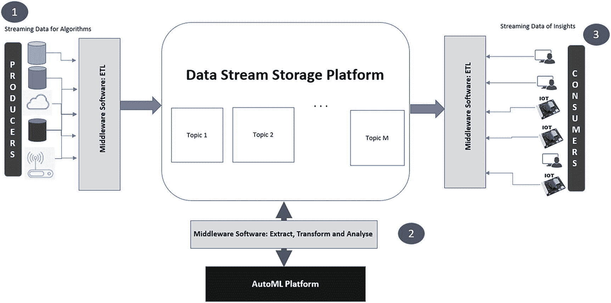
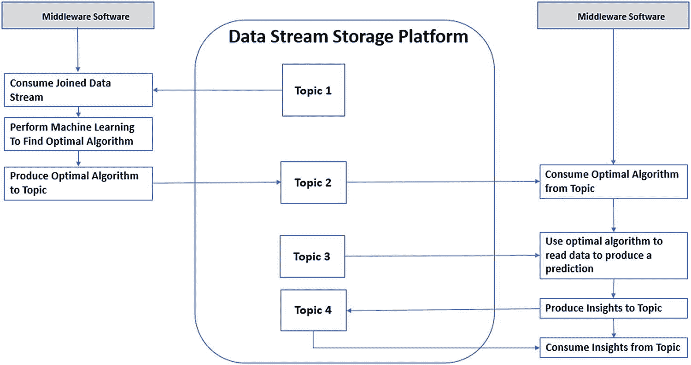
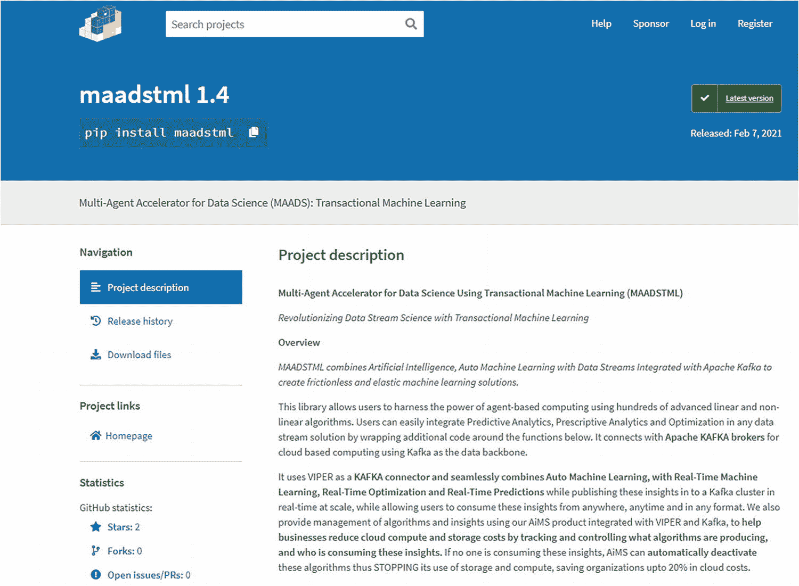
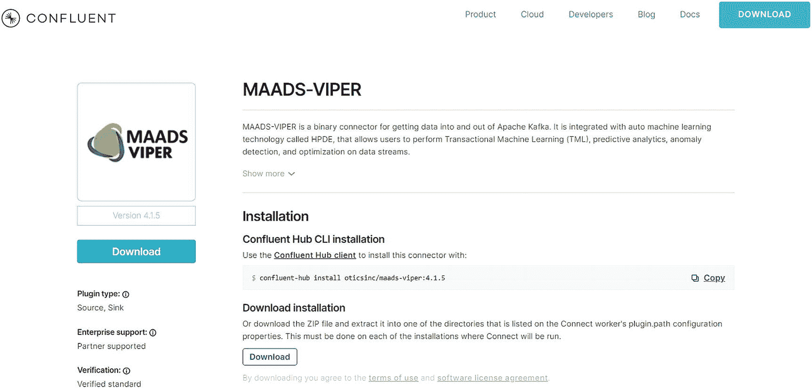
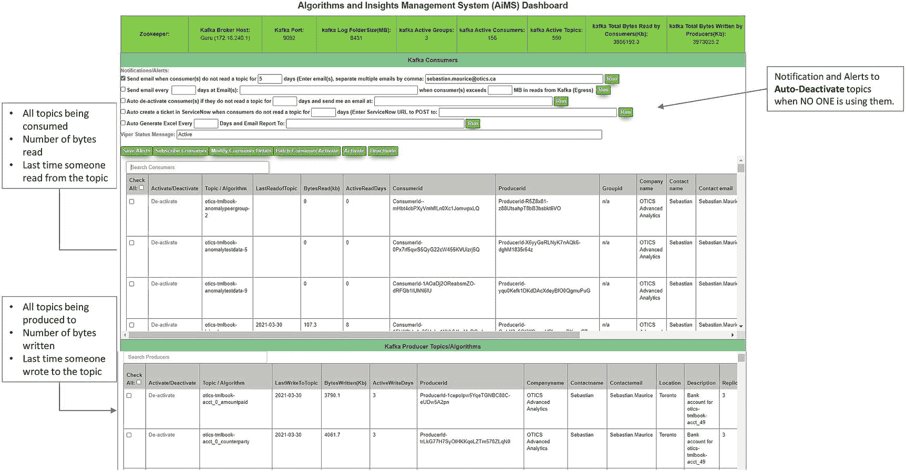
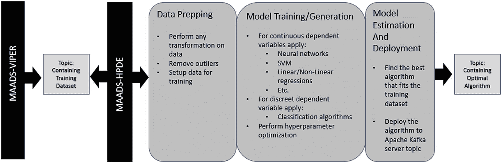
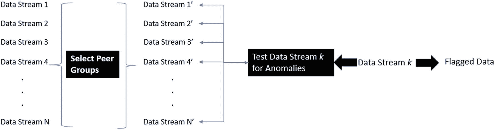
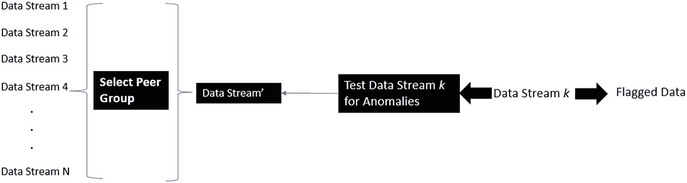

# 2.交易机器学习

事务机器学习(TML)是机器学习的一个令人兴奋的领域，它特别专注于将自动机器学习(AutoML)应用于数据流，以创建无摩擦和弹性的机器学习解决方案。本章将定义 TML 以及对构建 TML 解决方案很重要的相关技术。它还讨论了将存储和处理数据流以进行分析和机器学习的(大)数据平台。将机器学习应用于数据流将对颠覆性技术至关重要[Jayanthiladevi et al .，2018]。我们对 TML 的定义如下。

**TML**

## 审视 TML

让我们仔细看看我们所说的 TML 是什么意思。事务是实时生成或创建的数据，或者是在某个事件发生后立即生成和捕获的数据。例如，当您从事某项活动(如购买产品或服务)时，您会生成交易数据:销售点(POS)机器会捕获并记录您的操作所生成的数据，如您为产品或服务支付的金额、购买的数量、您的姓名、产品或服务名称、购买地点、付款信息等。这些交易代表了购买产品或服务的最新事件，因此捕捉了您当前的行为或行动。随着数据速度的提高，做出更快决策的机会也在增加。TML 支持更快的决策，这对于欺诈检测、产品和服务推荐、物联网设备控制等时间敏感型业务用例至关重要。表 [2-1](#Tab1) 显示了从数据挖掘和商业智能到 TML 的演变。随着数据速度的提高，我们正在从关系数据仓库发展到事件流平台，这将需要机器学习过程的更高自动化，从而实现更快的决策。随着更多的 ML 过程自动化，ML 解决方案将朝着更低摩擦的方向发展，这些解决方案适用于在 ML 模型构建、测试和部署中需要更高程度的人工交互的特定业务用例。此外，ML 解决方案中较低的摩擦也将导致 ML 解决方案更高的弹性，可以通过快速调整 ML 解决方案的数量和组件，根据业务需求扩大或缩小规模。

表 2-1

进化到 TML[1](#Fn1)T3】

<colgroup><col class="tcol1 align-left"> <col class="tcol2 align-left"> <col class="tcol3 align-left"> <col class="tcol4 align-left"></colgroup> 
|   | 

数据挖掘和

商业智能

 | 

一批

机器学习

 | 

事务性的

机器学习(TML)

 |
| --- | --- | --- | --- |
| 数据恢复精神速度 | 天 | 小时，分钟 | 秒，毫秒 |
| 决定速度 | 反应式——人在回路中的决策 | 混合人/机回路 | 即时-自动 ML 循环 |
| 数据环境 | SQL 数据仓库数据挖掘中间层数据可视化前端 | 数据湖存储集群计算框架机器学习基础设施 | 数据流基础设施事件驱动的流媒体云平台AutoML 服务基于微服务的数据架构 |
| 用例 | 少量决策支持:业务绩效诊断客户盈利能力分析 | 中等容量决策:广告投放产品和服务建议动态定价 | 高容量决策:欺诈交易识别和干预产品和服务建议物联网设备控制 |
| 机器学习解决方案 | 高摩擦 ML 解决方案低弹性 ML 解决方案 | 中等摩擦 ML 解决方案中低弹性 ML 解决方案 | 低摩擦 ML 解决方案高弹性 ML 解决方案 |

机器也可以通过传感器测量机器的电子信号来进行数据交易。电视、汽车、家电、工业机械和其他类似设备等物联网(IoT)连接设备就是一个很好的例子。在物联网背景下，没有人类的交互，机器更加独立地产生数据。这是可能的，因为先进的传感器或其他电子电路允许机器产生由传感器测量的数据；这种测量结果存储在数据库或文件系统中。例如，一些冰箱可以在牛奶快用完的时候感知到牛奶，然后提醒人们去买牛奶。或者，冰箱可以自己下单买牛奶。虽然自主机器在过去几年中取得了进步，主要是由于传感器 [2](#Fn2) 的成本降低，推动了物联网市场，但传感器数据在机器学习中的使用仍处于起步阶段，但正在增长。

给机器增加智能在三个方面有几个好处:

1.  决策优化

2.  降低风险

3.  成本节约

首先是在决策优化领域。在大多数情况下，你试图利用现有信息做出最佳决策。甚至你决定今晚吃什么也取决于你想吃什么，你的位置或离可用餐馆的远近或应用程序的访问，你的冰箱里有什么，其他人想吃什么，你有多少钱，你喜欢什么和不喜欢什么，等等。你也可以使用机器输出，比如手机应用程序上的餐馆评级，甚至是你车上的 GPS 软件推荐的餐馆。

机器决策和优化也是可能的，并且在物联网行业变得越来越重要。机器可以使用数据对自己进行健康检查。例如，预测性资产维护(PAM)用例可以被设计成允许机器向人发出服务呼叫来修理它[Faiz and Edirisinghe，2009]。机器决策减少了人类监控机器潜在故障的需要。通过允许机器使用自己的数据，它减少了由人类引起的摩擦，并可以大大减少机器故障对人和企业的任何不利影响。但挑战在于如何让一台机器独立思考，利用数据流做出数据驱动的决策？TML 提供了实现这一点的方法，我们将在本节中讨论。

其次是降低风险。如果一台机器能够自己决定什么时候会出故障，这有助于预防机器故障吗？当然可以。在事件发生前预测事件的能力使您能够为潜在的机器故障制定计划。我们说潜在的，或可能性，因为这还不确定。对于计算故障概率或可能性的机器，它将需要机器学习数据中的模式以产生概率度量。但是学习数据中的模式需要机器使用算法来理解模式。回想一下天气温度的例子，我们构建了一个简单的模型，使用云量(CC)和一年中的时间(ToY)来帮助预测明天的天气温度(WT)。我们非常简单地展示了机器如何学习所有变量之间的模式和相关性，以产生估计的系数:a，b，c 值。请注意，这是一个具有三个维度的多维问题:WT、CC 和 ToY。这就是机器学习实现价值的地方:在因变量和自变量之间构建多维关系的能力，这是数据挖掘或流挖掘无法完全捕捉的。

通过机器学习模型建立复杂的关系，挖掘出更多关于自变量如何影响因变量的信息。因此，对于预测机器故障可能性的机器，可能需要构建一个多维模型，在估计其系数后，该模型可用于预测故障概率。 [3](#Fn3) 能够预测事件发生概率的机器学习模型家族是分类模型，例如逻辑回归、决策树和随机森林模型【Faiz 和 Edirisinghe，2009】。

第三是在节约成本方面。从 TML 创造财务价值是吸引企业的一个重要方面。由于在构建大型机器学习解决方案时减少了人工接触点，因此机器学习的人工成本得以降低。由于 TML 不需要数据模式，因此降低了数据管理成本。TML 在读取时使用模式，这使得 TML 解决方案非常灵活，不依赖于任何特定的模式和必须维护的昂贵的数据仓库。使用基于云服务的方法，TML 解决方案非常灵活，可以根据不同的业务需求和用户快速定制。这种敏捷性有助于创建一个更有可能带来收益而不是产生成本的环境。对于组织来说，这种好处应该通过增加收入和降低成本来增加运营利润。TML 可用于许多领域来增加不同行业的利润，这将是第 [4](4.html) 章的重点。

### TML 的特色

低摩擦和高弹性是 TML 解决方案的操作特点。这些运营方面为组织带来了更低的成本和更高的收益。这些优势是 TML 解决方案的特点的直接结果。有以下五个关键特征:

1.  数据是流动的——就像水流一样，数据从任何方向(源)流入，又从任何位置(汇)流出。

2.  数据流必须是可连接的——就像 SQL [4](#Fn4) 连接一样，连接数据流对于实时构建训练数据集至关重要。

3.  数据流格式是标准化的——数据流被标准化为 JSON 格式。如果数据流在 JSON 中是标准化的，这使得在系统和技术之间构建可移植的解决方案和执行分析变得更加容易。

4.  数据流与自动机器学习(AutoML)相集成–AutoML 在没有人工干预的情况下，将机器学习应用于训练数据集，以找到最适合数据流的算法。

5.  低代码——TML 解决方案提供的编码语言使开发 TML 解决方案变得简单，无需编写大量代码。

前面的特性对于帮助您对可以由 TML 解决的用例进行分类非常重要。这些功能还可以在设计 TML 解决方案时为解决方案架构师提供指导，这些解决方案需要将特定的人员技能、流式技术平台和机器学习流程更改构建到架构中。这些功能不应被视为一个完整的列表；随着时间的推移，随着技术的发展和业务需求的变化，可能会添加新的功能。我们现在详细讨论前面的特征。

#### 数据流动性

正如已经讨论过的，数据流的特征在于其速度、多样性、准确性和容量。数据流动性仅仅意味着这些数据流的来源可以来自任何地方或任何东西:这就是我们所说的来源。数据流也可以去任何地方:这就是我们所说的接收器。**源**和**汇**的概念将在开发能够轻松扩展以解决大型业务用例的 TML 解决方案中发挥重要作用。

在 TML 解决方案上下文中，我们可以进一步将源和接收器分别转换为数据的发布者和订阅者；这可以称为**发布-订阅**模型【Eugster 等人，2003】。数据流中的数据必须由某人或某物生成，并由某人或某物消费，即人类或机器。对于 TML 解决方案，发布有两个组成部分:

1.  将原始数据发布到流

2.  使用 AutoML 将从原始数据中提取的见解发布到另一个流中

订阅者可以订阅流中的见解。这种将数据发布或生成到数据流，然后订阅以消费来自另一个数据流的见解的能力将是 TML 解决方案的核心部分，也是减少机器学习过程中摩擦的基础。如何做到这一点的机制将在第 [5](5.html) 章中讨论。

图 [2-1](#Fig1) 显示了 TML 解决方案的生产者和消费者流程。流程步骤 1 显示了数据的生产者。这些可能是任何人或任何事生成的任何数据源。为了处理这些数据，我们需要一个中间件软件来吸收数据，并可能额外转换数据。

图 2-1

交易机器学习过程

这个中间件是 TML 解决方案的重要组成部分。其主要功能是摄取并存储在数据流存储平台(DSSP)中。数据流存储平台必须能够处理非常大量的数据，因为数据流的一个关键特征是*量*。数据量可能高达数千兆兆字节或更多。该平台还需要确保存储的数据可以轻松访问。有技术可以处理海量数据[Jayanthi，2016]。除了存储大量数据之外，DSSP 还需要执行另一个重要的功能:它需要能够在数据流中**回滚**并检索历史数据。回滚数据流对于构建机器学习的训练数据集非常重要。具体来说，我们已经知道流中的数据积累得非常快；数据的积累就是简单地将数据堆叠在彼此之上，或者将**附加到数据流的**。每个字节的数据都增加了存储容量。假设 10 个数据源生成 1 个字节的数据，并且一天 24 小时每毫秒存储一次。一天之内，您将需要 864，000，000 字节的存储空间或 864，000 千字节，而这仅仅是为了生成 1 字节的数据。大数据存储技术使用特定的算法将数据分解成更小的大小，并将其存储在分布式计算机系统中[Jayanthi，2016]。

如果我们没有回滚流的能力，我们就无法为 TML 构建训练数据集。能够通过回滚从流中实时提取**滑动窗口**数据集是一个强大的功能。当从连续的数据流中提取这些数据集时，它变得更加强大，因为它提供了一种持续学习的方法。很少有数据平台允许回滚数据流。Apache Kafka、是开发流中数据回滚功能的一项技术，这也是我们在第 [6](6.html) 章中采用的技术。

一旦我们创建了训练数据集，我们就可以转到图 [2-1](#Fig1) 中的步骤 2。使用训练数据集，我们可以执行机器学习，以找到最适合数据的最佳算法，以及估计的系数，即天气温度示例中的 a、b、c。估计的参数也由 DSSP 中的中间件软件存储在您选择的特定主题名称中，比如 insight topic 1。

主题是数据流的名称。随着主题中数据的增长，DSSP 可以使用一种叫做*分片*的技术将数据分布在不同的内存分区和多个计算机服务器上。 [6](#Fn6)

图 [2-1](#Fig1) 中的步骤 3 显示了消费者订阅主题，消费主题中的见解并可视化流结果。 [7](#Fn7) 对主题的订阅创建了到主题的专用连接，或者数据流，用于消费。消费者可以是人，也可以是机器。洞察的消费可以用于报告和仪表板，或者发送到下游系统。请注意，在步骤 1-3 中，我们不与任何人互动，除非消费者是您。通过这种方式，我们可以设计一个完全自动化的无摩擦的机器学习过程。

如表 [2-2](#Tab2) 所示，强调将在后面章节中使用的核心术语是有益的。

表 2-2

TML 进程术语

<colgroup><col class="tcol1 align-left"> <col class="tcol2 align-left"></colgroup> 
| 

术语

 | 

描述

 |
| --- | --- |
| 生产者 | 生产者是像人类或机器一样的数据生成者。物联网设备上的传感器就是生产者的好例子。 |
| 顾客 | 消费者是订阅主题并接收数据或见解的人或机器，这些数据或见解可用于报告和仪表板或发送给其他下游系统。 |
| 主题 | 主题是数据流的名称。用户在 DSSP 中创建一个主题，方法是给它一个唯一标识该数据流的名称。 |
| 订阅 | 如果机器或人类想要从主题中获取数据或见解，他们可以订阅主题。 |
| 强烈的 | 为了从主题中消费，消费者首先使用中间件软件订阅主题，然后再次使用中间件软件从主题中接收数据。 |
| 生产 | 为了生成主题，生产者使用中间件软件首先在 DSSP 中创建一个主题，然后使用中间件软件将数据发送到 DSSP 中的主题。 |
| DSP | DSSP 是一个大数据流存储平台，支持发布者-订阅者模型。DSSP 对 TML 有两个关键作用:1)分区2)补偿Partition 是一个数字，它允许 DSSP 在分布式网络中高效地管理大数据存储，方法是使用分片来分解数据，并将其存储在计算机网络中不同机器的不同分区中。一个分区从零开始。用户可以指定他们想要的 DSSP 计算机服务器中的分区数量。大量分区可以提高消费者的可访问性。例如，如果 1000 个消费者想要消费同一个主题，那么分区设置 1000 允许 1000 个消费者中的每一个并行访问该主题，而不会影响其他消费者。Offset 是一个从零开始的数字，用于跟踪数据流中的每个数据。偏移量从零开始，表示数据流中的第一个数据点，并随着数据流中数据的增长而连续增长。偏移量由 DSSP 确定和维护。偏移量很重要，因为它允许我们“回滚”流中的数据，以引用过去的数据。通过回滚流中的数据，我们可以实时构建训练数据集。数据流中的数据值在主题中由分区、偏移量和键唯一标识。 |
| 中间件软件(MWS) | 允许生产者和消费者向 DSSP 发送数据和从 DSSP 接收数据的软件。MWS 可以被称为执行微服务的 DSSP 的连接器。它还与 AutoML 软件集成。如图 [2-1](#Fig1) 所示的 MWS 将**生产者-汽车-消费者**连接在一起，允许开发者创建 TML 解决方案。稍后将详细描述 MWS。 |
| 钥匙 | 关键字是标识主题中每个数据值的唯一值。键的目的是帮助 DSSP 有效地管理分布式网络中跨分区的数据，同时还允许消费者快速检索信息。 |
| 训练数据集 | 通过从特定的偏移值连接数据流来创建训练数据集，该训练数据集具有一个因变量主题和一个或多个自变量主题。合并后的数据集称为训练数据集，将用于 TML。 |

接下来，我们讨论连接数据流的过程。

#### 连接数据流

连接数据流的重要性是为 TML 创建训练数据集的基础。如表 [2-2](#Tab2) 所述，每个数据流被命名为一个主题；通过使用 MWS，您可以使用这些主题名称来标识要连接的数据流。每个流都有相同的数据格式:我们对每个流使用 JSON [8](#Fn8) 格式。JSON 是一种流行且广泛使用的格式，它使用键值标记。比如这是一个简单的 JSON: {"Name": "Sebastian Maurice "，" Phone Number": 555-555-5555}，其中" Name "和" Phone Number "是键，" Sebastian Maurice "和 555-555-5555 分别是值。

要通过 MWS 加入 streams，请按照以下步骤操作:

1.  通过使用主题名称来标识要加入的流。

2.  利用 MWS 汇入河流。

3.  创建另一个主题来存储联接的流或训练数据集。

4.  向训练数据流产生数据。

加入流时存在一些挑战。首先，可以在不同的时间生成单独的流。这意味着根据数据的创建日期和时间连接流可能很困难。但是这种挑战减少了(如果没有消除的话),因为通过连接多个流来创建滑动训练数据集几乎同时从每个流中获取数据。然而，这是假设每个流都在产生数据并且没有空闲。例如，使用 offset=-1 告诉 MWS 从所有流的末尾获取数据，然后可以通过用户指定的偏移量回滚这些数据，以创建一个训练数据集——这将在第 [6](6.html) 章中变得更加清楚。通过使用 MWS，您可以指定任何想要控制定型数据集大小的回滚偏移量。

第二，流的长度可能不同。为了对合并的数据流执行机器学习，流的长度必须相等。为了创建相等的长度，TML 采用了如下修剪算法:

1.  使用回滚偏移量从所有分区的每个流中获取数据。

2.  由于每个流中有多个分区，数据的大小会有所不同。例如，如果一个流在所有分区上有 1500 个数据点，而另一个流在所有分区上有 500 个数据点，那么长度显然是不同的。为了对齐长度，我们必须修剪其中一个流，以便流之间的长度相同；在这种情况下，我们将具有 1500 个数据点的较长数据流删减为 500 个数据点。

3.  一旦所有流的长度相等，就将它们连接起来并创建一个训练数据集。

前面的过程几乎是实时进行的，是执行 TML 之前的关键步骤。

第三，为了合并流以创建训练数据集，我们必须确保一个流是因变量，而其他流是自变量；这将是我们在 TML 的模式。接下来，我们讨论数据标准化如何简化连接。

#### 数据流标准化

我们对每个流数据使用 JSON 格式。当 MWS 向 DSSP 中的流主题生成数据时，会自动处理 JSON 的格式。JSON 格式遵循一个普遍接受的约定，允许其他应用程序和系统以相同的方式读取 JSON 数据，这使得分析数据更加容易，即使数据来自不同的来源。除了易于访问之外，它还有助于提高读取数据的性能。JSON 键充当索引，可用于快速访问数据，这使得引用 JSON 对象的每个组件更容易进行报告、分析和创建训练数据集。这将我们带到如何与 AutoML 集成的下一部分。

#### 与 AutoML 的数据流集成

TML 的一个关键功能是使用来自数据流的训练数据集进行机器学习。因此，建立训练数据集是 TML 的一项重要要求。我们使用 MWS 连接到 AutoML 技术，AutoML 技术连接到 DSSP，允许 AutoML 技术使用训练数据集并应用机器学习来找到最佳算法:在 MWS 和 AutoML 之间没有训练数据移动。然后 AutoML 技术产生这个最优算法给 DSSP 中的一个题目，如图 [2-1](#Fig1) 所示。因此，AutoML 技术既是 DSSP 训练数据集的消费者，也是 DSSP 优化算法的生产者。完整的 AutoML 流程如图 [2-2](#Fig2) 所示。该图显示了一般过程。假设我们希望通过此流程来检测信用卡欺诈，并且在 MWS 加入相关数据流以创建训练数据集后，主题 1 包含信用卡交易的训练数据集，则:

图 2-2

自动过程

1.  MWS 使用包含信用卡训练数据集的主题 1。

2.  MWS 连接到 AutoML 技术，该技术执行机器学习，以找到最佳的机器学习算法，最适合最佳训练模型的信用卡交易数据。

3.  AutoML 对另一个课题 2:信用卡欺诈训练模型产生了最优训练模型。

4.  MWS 使用主题 2 中的最佳训练模型。

5.  MWS 从主题 3 中读取新的信用卡交易数据，并使用新的交易数据对潜在的欺诈行为进行洞察。新数据是用于预测因变量(欺诈)的自变量数值。例如，在天气温度示例中，主题 3 将包含云量和一年中的时间值。然后将预测存储回另一个主题，主题 4:欺诈预测。

6.  想要洞察的消费者将订阅主题 4 并消费这些洞察。具体来说，可以通过电子邮件或文本消息自动提醒客户潜在的欺诈交易。

对任意数量的数据流重复前面的步骤，并且可以容易地扩展到任意数量的算法和由任意数量的消费者消费的洞察力。这是如何构建的将在关于架构的章节 [5](5.html) 中解释。具体来说，MWS 和 AutoML 技术可以用作**微服务**，可以实例化为任意数量，易于部署，并用于将 TML 解决方案扩展到几乎任意数量的数据流、算法、消费者和生产者。将 AutoML 轻松集成到这个可伸缩的架构中是本书中提出的 TML 解决方案的独特之处之一。这将我们带到 low code 的最后一个特性，它讨论了如何使用 MAADS Python 库或使用 REST API 连接到 MWS，使得 MWS 语言不可知。

#### 低位代码

与 DSSP、MWS 和 AutoML 集成的 TML 解决方案需要编程代码来更好地控制执行和调试。然而，所需的代码量不应该过多，并且应该尽可能少。 [9](#Fn9) 与无代码相比，低代码用可见性和定制来换取敏捷性、规模和速度。虽然使用图形用户界面可以减少代码，但这并不是必需的，因为预构建的功能可以提供相同的价值。例如，提供 API(应用程序编程接口)的库可以减轻从头编写代码的负担，从而减少开发 TML 解决方案的工作量。在本书中，我们使用一个名为 MAADSTML Python 库 [10](#Fn10) 的库来开发如图 [2-3](#Fig3) 所示的 TML 解决方案。这个库是用 Python 编程语言 [11](#Fn11) 开发的，可以通过调用“pip install maadstml”在任何环境下轻松安装。

图 2-3

MAADSTML Python 库

这个库包含一些函数，这些函数提供了一个 API 来帮助生成数据、使用 AutoML 处理数据以及消费数据。该库中的核心函数如表 [2-3](#Tab3) 所示。

表 2-3

MAADSTML Python 库函数

<colgroup><col class="tcol1 align-left"> <col class="tcol2 align-left"></colgroup> 
| 

MAADSTML Python 函数

 | 

描述

 |
| --- | --- |
| vipercreatetopic | 在卡夫卡经纪人中创造话题。 |
| vipersubscribeconsumer | 为消费者订阅主题。消费者将立即收到来自主题的见解。这也使 TML 解决方案的管理员能够更好地控制谁在使用这些见解，并允许他们确保在算法出现问题时快速解决任何问题。 |
| viperhpdetraining | 用户可以对 Kafka 主题中的数据执行 TML。这对于使用我们的 HPDE [12](#Fn12) 技术的即时“交易学习”非常强大和有用。HPDE 将在几分钟内找到数据的最佳算法。 |
| viperhpdepression | 使用优化算法，用户可以从流式数据到 Kafka 主题进行实时预测。 |
| viperhpdeoptimize | 用户甚至可以进行优化以最小化或最大化最优算法，从而找到将最小化或最大化目标函数的独立变量的最佳值。 |
| Viperproducetotopic | 用户可以从任何数据源获取任何主题。 |
| viperconsumefrontopic | 用户可以从任何主题中进行消费，并将其用于可视化。 |
| viperconsumefromstreamtopic | 用户可以一次从多个主题流中消费。 |
| vipercreateconsummergroup | TML 管理员可以创建一个由任意数量的消费者组成的消费者组。您可以在 Kafka broker 中为组添加尽可能多的分区，并指定复制因子，以确保高可用性，并且不会对使用主题见解的用户造成干扰。 |
| viperconsumergroupconsumefromtopic | 属于使用者组的用户可以同时使用一个主题的多个分区。 |
| viperproducetotopicstream | 整合流中的数据并生成主题。 |
| Vipercreatejointopicstreams | 用户可以加入多个主题流，并产生另一个主题的组合结果。 |
| vipercreatetrainingdata | 用户可以从 TML 的主题流中创建训练数据集。 |
| 毒蛇猛兽 | 对数据流执行无监督学习，用于异常检测。 |
| viperanomalypredict | 使用使用 viperanomalytrain 函数找到的对等组来预测数据流中可能出现的异常。 |

通过使用前面的函数，你可以极大地减少开发 TML 解决方案所需的代码量，我们将在第 [6](6.html) 章中展示。具体来说，开发图 [2-2](#Fig2) 中的功能所需的 MAADSTML 函数是

1.  **vipercreatetopic**–这将创建主题 1–4。

2.  **vipercreatejointopicstreams**–这将为训练数据集创建元数据结构，并开始训练数据集构建过程。

3.  **viperproducetotopicstream**–这使用元数据结构从流中获取数据。

4.  **vipercreatetrainingdata**–这将使用上一个函数中的数据创建训练数据集，并将其生成到主题 1:信用卡训练数据集。

5.  **viperconsumefromtopic**–这消耗了来自主题 1 的训练数据集。

6.  **viperanomalytrain**–使用训练数据，执行 AutoML 并生成最佳训练模型(在本例中为对等组)到主题 2:信用卡欺诈训练模型。

7.  **viperanomalypdict**–这使用来自主题 2 的最佳训练模型(对等组)，并使用来自主题 3:新交易数据的数据来进行欺诈预测。

8.  **viperproducetotopic**–这将生成主题 4 的欺诈预测。

9.  **vipersubscribeconsumer**–消费者订阅主题 4。

10.  **viperconsumefromtopic**–这消耗了来自主题 4 的洞察力。

TML 在商业解决方案模板中的应用将是第 [6](6.html) 章的重点。至此，我们已经讨论了用 AutoML 集成数据流以创建 TML 解决方案的过程。我们现在更详细地讨论 DSSP、AutoML 和 MWS 技术。

### 数据流存储平台(DSSP)

我们已经讨论了事件流平台 DSSP 如何管理我们用于 TML 的数据流。对于这本书，我们将使用阿帕奇卡夫卡。 [13](#Fn13) Apache Kafka(或简称 Kafka)是一种分布式开源技术，被 80%的财富 100 强公司所使用。 [14](#Fn14) 它是由 LinkedIn [15](#Fn15) 的一群开发者开发的，他们把它捐赠给了 Apache 软件基金会。[16](#Fn16)Kafka 的开发者随后创办了一家名为 confuent[17](#Fn17)的公司，提供 Kafka 托管服务；截至 2019 年，该公司价值 25 亿美元。 [18](#Fn18) 除了开源之外，Kafka 受欢迎的主要原因是 Kafka 是唯一的发布者-订阅者事件流平台【Jayanthi，2016】，这使得它在以下方面非常适合 TML:

1.  Kafka 能够处理大量数据，并在主题或数据流的多个分区中有效地管理这些数据。

2.  Kafka 是一个针对规模进行了优化的事件流平台，这不同于 Hadoop 等其他大数据平台，后者针对适合大批量计算的大型静态数据集进行了优化。

3.  Kafka 在流中存储数据时使用偏移，这允许我们“回滚”数据流中的数据以创建训练数据集。正如 Kafka 文档中所解释的， [19](#Fn19) “偏移充当该分区内记录的唯一标识符，并且还表示消费者在分区中的位置。”

4.  Kafka 允许我们将数据流命名为主题。

5.  卡夫卡允许我们加入数据流。

6.  卡夫卡可以在任何云平台上运行。

7.  Kafka 允许群体从一个主题消费，从而允许向每个消费者并行传递信息。

Kafka 最初是为受益于发布者-订阅者类型框架的大型消息传递系统开发的。然而，鉴于 Kafka 对**偏移**的使用，它允许我们将 Kafka 的功能扩展到使用数据流创建 TML 解决方案的机器学习。Kafka 对事务性机器学习的这种扩展是目前这种类型的第一次。我们将使用 MAADS-VIPER 作为我们与 Kafka 的 MWS 连接器:MAADS-VIPER 是目前唯一经过 Confluent 验证和测试的用于 TML 的 Kafka 连接器。 [20](#Fn20) 接下来讨论 MAADS-VIPER。

### 处女毒蛇

一个官方的 Kafka 连接器，如图 [2-4](#Fig4) 所示，已经过 Confluent 的验证和测试。MAADS-VIPER(或简称 VIPER)是我们的 MWS，它促进了消费者与生产商、AutoML 和 DSSP 之间的沟通。毒蛇是 TML 的核心。有两种方法可以与 VIPER 通信以构建 TML 解决方案:

图 2-4

MAADS-VIPER Kafka 连接器

1.  使用表 [2-3](#Tab3) 中描述的函数的 MAADSTML Python 库。

2.  表述性状态转移(REST) API 是一种定义了约束的软件架构，允许创建 web 服务。例如，浏览网站使用超文本传输协议(HTTP)；使用相同的 HTTP 协议，用户可以连接到 VIPER。这确保了开发人员，无论他们使用什么编程语言，都可以访问 VIPER。

VIPER 适合微服务架构，因为它

*   易于部署到任何操作系统，即 Windows、MacOS、Linux

*   通过 HTTP 和不可知的编程语言进行通信

*   对进出 DSSP 的数据使用 SSL/TLS 加密

*   围绕 TML 解决方案的特定功能执行任务

*   与 DSSP 和 AutoML 脱钩

*   可以从中央资源下载

这种特殊的功能，以及对功能的轻松访问，使 VIPER 成为一个有效的 Kafka 连接器，已经由 Apache Kafka creators 在 Confluent 进行了广泛的测试和验证。

VIPER 有几个方面使其成为有效的 TML 支持技术:

1.  VIPER 是跨平台的；它可以在 Windows、MacOS 和 Linux 上运行。

2.  VIPER 与云无关。对于大数据解决方案来说，云平台很重要。VIPER 可以连接到任何运行 Apache Kafka 的主要云平台，如微软 Azure、亚马逊 AWS、谷歌云平台或融合云。

3.  VIPER 启用了 SSL/TLS。如今，安全性至关重要，组织希望确保所有数据都经过加密。Kafka 可以设置 SSL/TLS 加密；这意味着 VIPER 需要处理 SSL/TLS 流量来与 Kafka 通信。

4.  VIPER 可以使用使用者组同时读取一个主题中的多个分区。随着流中数据的增加和消费者数量的增长，Kafka 会将一个主题中的数据分布到多个分区中。这意味着从应用程序的角度来看，跨多个分区使用来自一个主题的数据变得更加困难。VIPER 有一个内置的从多个分区消费的过程，因此数据总是被正确和并发地消费。

5.  VIPER 可以从任何偏移量读取。如前所述，指定偏移是创建训练数据集的基础。然而，考虑到数据流的性质，偏移量可以在控制流中的数据量以构造不太大的训练数据集方面发挥重要作用。如果训练数据集太大，这可能会大大增加机器学习所需的时间，并会影响 TML 解决方案的性能。

6.  VIPER 可以被实例化多次。对于具有数千或数百万数据流和数千算法的超大型 TML 解决方案，可能需要有许多 VIPER 实例来卸载适合微服务架构的负载。正如将在第 [5](5.html) 章中讨论的，使用 VIPER 作为微服务是大型 TML 解决方案的一个重要架构考虑因素。

下一节将讨论如何使用算法和洞察管理系统(AiMS)仪表板来管理算法。

## 算法和见解管理系统(AiMS)仪表板

VIPER 可以通过图 [2-5](#Fig5) 所示的算法和洞察管理系统(AiMS)仪表盘管理大量算法。TML 的一个结果是用 AutoML 创建算法相对容易。这将导致许多算法组成一个循环的 TML 解。因此，必须监控和跟踪这些解决方案的使用情况，因为它们会对存储、计算和网络访问产生成本影响。AiMS 提供了一种非常方便的方法来跟踪、监控和控制 TML 解决方案的执行。

图 2-5

AiMS 仪表板

VIPER 的每个实例中的信息都使用 JSON 格式保存在嵌入式数据库中；AiMS 使用这些信息来填充其仪表板。这意味着 VIPER 不需要外部数据库存储。嵌入式数据库的优势在于它使 VIPER 具有可移植性和自包含性。这确保了无论 VIPER 安装在哪个系统中，捕获的信息都可以用于管理 TML 解决方案。表 [2-4](#Tab4) 显示了 VIPER 为每个消费者、生产者和消费者群体捕获的信息。注意，这不是 DSSP；相反，这是 VIPER 存储在 AiMS 的本地嵌入式数据库实例中的元数据。

表 2-4

AiMS 仪表板字段名称

<colgroup><col class="tcol1 align-left"> <col class="tcol2 align-left"></colgroup> 
| 

字段名称

 | 

描述

 |
| --- | --- |
| 激活/停用 | VIPER 的管理员可以手动激活或停用一个主题，或者他们可以告诉 VIPER 使用警报和通知来自动停用算法。 |
| 活动阅读天数 | 这是主题被阅读的天数。 |
| 活动写入天数 | 主题被写入的天数。 |
| 读取的字节数(Kb) | 记录消费者读取的字节数，单位为千字节。这是流出量。出口是云消费定价的一个重要指标。 |
| 写入字节数(Kb) | 生成器写入的字节数，以千字节为单位。这是进入量。入口是云消费定价的一个重要指标。 |
| 公司名称 | 这是消费者所属公司的名称。 |
| 消费者 id | 消费者 ID 唯一地标识从该主题消费的消费者。 |
| 联系电子邮件 | 这是消费者的邮件。 |
| 联系人姓名 | 这是消费者的名字。 |
| 创建于 | 这是主题创建的日期和时间。 |
| 因变量 | 如果此主题是存储训练数据集的联接主题，则这是训练数据集中因变量的名称。 |
| 描述 | 这是对题目的描述。 |
| 组名 | 组 ID 是该消费者可能所属的组的 ID。管理员可以创建组并将消费者分配给该组。这对于从单个主题向多个消费者并行传递信息可能是有用的。 |
| 组名 | 这是该组的名称。 |
| 自变量 | 如果此主题是存储训练数据集的联接主题，则这是训练数据集中独立变量的名称。 |
| 非活动状态 | 这表示主题是活动的(1)还是非活动的(0)。 |
| 加入的主题 | 这将列出连接在一起的主题的名称。 |
| 上次偏移 | 当消费者从主题中读取时，该字段记录消费者在主题中的最后偏移量。 |
| 主题的最后一次阅读 | 这是消费者最后一次阅读该主题的日期和时间。 |
| 上次写入主题 | 这是制作者最后一次写入主题的日期和时间。 |
| 位置 | 这是消费者居住的位置。 |
| MAADS 算法密钥 | 这是唯一标识最佳算法的键名。 |
| mads-hpde 某物服务器 | 这是 AutoML 服务器的物理 IP 地址或网络名称。 |
| maads-hpde 微服务 | 如果使用反向代理，这是代理的网络名称。使用微服务对于大规模 TML 解决方案部署非常有益。 |
| 月门 | 这是 MAADS 服务器正在侦听的网络端口。 |
| 处女标记 | 这是访问马阿德斯-HPDE 所需的安全令牌。 |
| 消费者数量 | 组中消费者的数量。 |
| 划分 | 这是主题中的分区数量。 |
| 生产者 id | 生产者 ID 是写入该主题的生产者的 ID。 |
| 复制因子 | 复制因子是 Apache Kafka 的一个特性，表示用于冗余的物理计算机服务器的数量。 |
| 主题/算法 | DSSP 中的主题名称。这也可以是算法的名称，由用户选择。 |
| 更新 | 这是制作者最后一次写入主题的日期和时间。 |

管理员的其他功能包括

*   为消费者订阅主题

*   保存警报

*   修改消费者详细信息

*   批量消费者激活/停用

*   激活一组主题

*   停用一组主题

*   创建主题

*   批量主题激活

*   创建组

*   批量激活/停用组

管理算法对组织非常重要，原因有三:

1.  成本——算法会消耗网络计算和存储资源，这就要花钱，尤其是使用云平台的时候。通过跟踪算法的生产者和消费者，VIPER 可以轻松确定谁在消费谁没有消费洞察力。如果没有人在消费洞察力，那么算法就没有任何价值，但仍在消费耗费金钱的计算和存储；在没有消费者的情况下，VIPER 可以通知 TML 解决方案的管理员，并自动停用不使用的算法，从而潜在地为组织节省资金。

2.  安全性—通过跟踪算法，组织可以确切地知道算法在做什么，谁在使用它，以及有多少字节正在被读写。这允许他们控制对信息的访问，并且只允许用户访问他们需要的信息。

3.  服务管理——在消费者由于解决方案中的问题而停止接收洞察的情况下，保持良好的服务水平是 VIPER 的另一个重要方面。如果消费者抱怨算法不再产生洞察力，解决方案的管理员可以立即在 AiMS 仪表板中查找算法主题，确定是谁开发了它，并联系该人来解决问题或创建服务管理事件。

AiMS 为组织提供了在其环境中运行的所有算法的鸟瞰图。他们有权创建警报和通知，如图 [2-6](#Fig6) 所示，以控制访问并允许他们充分利用资源来减少不必要的成本。

图 2-6

AiMS 通知

AiMS 中有五种类型的预警和通知:

1.  当消费者或生产者 X 天没有读或写某个主题时，发送电子邮件。

2.  egress–当用户从某个主题中读取 X 兆字节时，发送电子邮件。

3.  入口——当制作人向一个主题写入 X 兆字节时，发送一封电子邮件。

4.  当使用者或生产者 X 天没有读取或写入主题时，自动停用主题。

5.  当消费者或生产者没有分别读取或写入主题时，在服务管理软件中自动创建票证。

6.  生成并通过电子邮件发送列出所有消费者、生产者和团体的 Excel 报告。

接下来，我们讨论 TML 解决方案用来执行实时机器学习的 AutoML 技术。

### 自动化技术

TML 解决方案使用的 AutoML 技术被称为 MAADS-HPDE。 [21](#Fn21) 它是一种跨平台的技术，可以在 Windows 或 Linux 下运行。它与 MAADS-VIPER、AiMS 和 Apache Kafka 集成在一起，专为快速机器学习而设计。任何 AutoML 技术都有几个关键方面，例如[He et al .，2020]

1.  数据准备

2.  模型生成

3.  超参数优化

4.  模型估计

5.  模型报告

6.  模型部署

MAADS-HPDE 执行上述六项功能。明确地

*   数据准备——HPDE 可以从逗号分隔值(CSV)文件中读取数据，也可以直接连接到 Apache Kafka 等事件流平台，直接从主题中使用训练数据集。

*   模型生成——MAADS-HPDE 将几种算法应用于训练数据集。这些包括
    *   神经网络

    *   SVM/兰登森林

    *   因变量为离散变量的分类模型

    *   梯度下降算法

    *   线性和非线性回归

    *   用于数据流异常检测的无监督学习

*   超参数优化——HPDE 采用随机网格搜索流程，通过对连续因变量使用 MAPE(平均绝对百分比误差)和对离散因变量使用 ROC/AUC 指标来寻找算法的最佳参数。具体来说，HPDE 应用了几种算法，并为每种算法计算 MAPE 或 ROC/AUC，然后选择 MAPE 最低或 ROC/AUC 最高的算法作为**最优算法**。

*   模型估计–它执行模型估计，以找到最适合数据的估计系数。这可以通过使用表 [2-3](#Tab3) 中讨论的 **viperhpdetraining** 功能来实现。

*   模型部署–它可以将最佳算法部署到任何服务器，或者将结果写入主题。

有几个关键领域使 HPDE 在其他汽车技术中独一无二:

*   HPDE 与 Apache Kafka、AiMS 和 MAADS-VIPER 等事件流平台相集成，用于实时建模。HPDE 可以将最佳训练模型(算法)部署到阿帕奇卡夫卡中的一个主题。这使得能够访问该主题的其他应用程序可以很容易地检索最佳训练模型并进行预测。

*   持续学习 AutoML 技术的一个重要方面应该是能够通过记忆旧数据和学习新数据来进行持续学习[He et al .，2020]。使用滑动窗口技术，TML 解决方案通过在快速流动的数据中连续学习新模式而无需人工干预，实现了零模型过时。

*   HPDE 也做数学优化。回想一下，优化是通过选择零售网站上的最佳价格和产品组合，找到最小化或最大化某些目标函数的独立变量的最佳值的过程，例如最大化总实现利润。这可以通过使用表 [2-3](#Tab3) 中讨论的 **viperhpdeoptimize** 功能来实现。

*   HPDE 对数据流进行实时无监督学习(稍后讨论),并且**不需要**事先对因变量进行分类——而传统的机器学习过程要求对欺诈或异常进行预测。VIPER 使用 **viperanomalytrain** 和**viperanomalypict**进行异常检测。

*   HPDE 是 SSL/TLS 启用和加密的所有数据写入和读取阿帕奇卡夫卡。

*   HPDE 可以被实例化为任意数量的实例，这使得它对于跨网络分布的大规模 TML 解决方案非常有效。

AutoML 流程如图 [2-7](#Fig7) 所示。该流程显示了 MAADS-VIPER 和 MAADS-HPDE 之间的整合。明确地

*   MAADS-VIPER 在 Apache Kafka 中创建了训练数据集主题。

*   马阿德斯-HPDE 阅读训练数据集主题。

*   马阿德斯-HPDE 执行任何数据准备和转换。

*   马阿德斯-HPDE 将机器学习算法应用于训练数据集。

*   马德斯-HPDE 选择最符合数据的算法:我们称之为最佳训练模型。

*   然后，马阿德斯-HPDE 通过将算法位置写入卡夫卡的另一个主题来部署这个算法。

这个过程可以用无限数量的数据流和训练数据集重复无数次。唯一的限制是在硬件方面。从理论上讲，有了无限量的存储，AutoML 进程可以用无限量的数据运行。

图 2-7

自动过程

许多使用 TML 建立的模型将使用监督学习；然而，在许多其他情况下，无监督学习对于数据流中的异常检测将是重要的。下一节将讨论 TML 如何处理欺诈或异常检测用例。

### 无监督学习:检测异常

当需要检测数据中的异常时，无监督学习在许多情况下是有用的。例如，欺诈检测的用例通常需要检测异常行为。要确定“异常”行为，我们必须将其与“平常”或“正常”行为进行比较。当使用**监督学习**时，这种比较是简单明了的:它需要过去关于“不寻常”和“平常”行为的知识，这些行为被人类物理分类；然后用这些分类制定机器学习模型，机器学习不寻常和通常行为的模式。然而，对于数据流，几乎不可能事先知道什么是“不正常”和“正常”的行为。快速流动的数据使得很难制定有监督的机器学习模型，以允许机器学习行为的差异。缺乏实时异常的过去知识和数据流的速度，使得监督学习的应用即使不是不可能也是困难的；因此，我们必须使用数据流的**无监督**学习。

HPDE 使用[Bolton & Hand，1999]开发的一种技术变体执行无监督学习，该技术变体使用对等组分析(PGA)和断点分析(BPA)。该技术相当简单，如下所示:

1.  从数据中，找到与交易类型相似的对等组，以评估欺诈或异常情况。

2.  创建该对等组的汇总统计数据，用于衡量“正常”和“异常”行为的差异。

3.  将新事务与该对等组进行比较，并确定事务相对于对等组摘要统计的“不寻常”程度。将那些与摘要统计数据相差很大的交易标记为可疑。

当数据流传输时，前面的步骤可能会很快变得复杂。但是，这种复杂性被卡夫卡的《毒蛇》和《HPDE》大大简化了。具体来说，如图 [2-8](#Fig8) 所示，无监督学习过程有两个要素:

图 2-8

方法一:无监督学习流程

1.  同伴群体的选择

2.  异常检测，用于标记与对等组不同的行为

从数据流中选择对等组包括以下步骤:

1.  对于每个数据流，只需使用 offset 参数回滚数据，即可从数据中选择数据窗口。

2.  对于每个数据流窗口，使用 K 均值聚类算法计算组的质心。

3.  对于窗口中的每个数据，将其与组的质心进行比较，以确定每个点和质心之间的**距离**。

4.  将距离存储在一个数组中。

5.  从最高到最低的距离值对数组进行排序。

6.  删除距离数组中的第一个和最后一个成员–我们删除第一个和最后一个成员以标准化值，从而删除极端行为的影响并构建对等组数据流:数据流 1’、数据流 2’、数据流 3’、数据流 4’…数据流 N’。

7.  现在，将新数据与对等组进行比较，对于每个新数据，计算每个新点的标准化方差指标 T。我们可以把 T 解释为一个**分数**——分数越高，数据越可疑。可以设置将 T 与阈值进行比较的阈值；任何高于阈值的 T 值都被标记为可疑。人们可能会问，如何选择一个好的阈值？新数据的 T 得分(T d )与质心值的 T 得分(T c )进行比较；将绝对百分比与阈值进行比较(T t ):
    1.  如果(| Td-Tc|/Td)≥TT，则数据可疑

    2.  试验阈值(T t )。如果业务用例对偏离正常行为(T c )很敏感，那么 T t 应该是一个 30%左右的低百分比；如果不敏感，那就把它设高一点。

8.  Construct the Flagged Data stream and evaluate for fraud or anomalies.

    

    图 2-9

    方法 2:无监督学习

断点分析(BPA)方法类似于对等组分析(PGA)方法，不同之处在于 BPA 创建一个组**由所有其他组的质心组成。这个方法从所有的对等组中挑选出通常的行为，并创建一个只有这些行为的组。PGA 和 BPA 之间的另一个区别是，前者比较不同行为的对等体的新行为，因为一个对等体组中的正常行为在另一个组中可能不正常:它说明了正常性的可变性。同时使用 PGA 和 BPA 可以更可靠地检测异常行为或正常行为。接下来，我们展示了 TML 如何导致一个无摩擦的机器学习过程。**

### 无摩擦机器学习

传统的机器学习过程不同于 TML 过程，它最大限度地减少了人的接触点。对于特定的用例，过多的人的接触点会导致更高水平的摩擦。这在传统的机器学习过程中是显而易见的，其中在数据准备、模型生成和模型部署过程中人机交互是频繁的。这并不是说人机交互不好；事实上，对于一些高度复杂的情况，这可以非常有效地确定最佳训练模型(算法)[Amershi et al .，2014]。然而，在处理数据流时，由于前面讨论的原因，传统方法并不理想。具体来说，数据流不是静态的磁盘驻留数据，而是持续流动的数据。这使得传统的机器学习过程很难被人类应用。

我们可以将机器学习过程中的摩擦原因分为五个方面:

1.  数据准备——减少数据准备过程中的人员接触点可以极大地减少摩擦。

2.  模型生成——自动选择应用于数据的算法可以减少人们决定选择哪个模型所需的时间。同样，建立模型也很耗时。

3.  超参数优化–选择超参数可能是最耗时的过程。通过自动化这一过程，我们可以减少摩擦。

4.  模型报告——记录模型选择的细节也非常耗时。算法结果的自动化模型报告不仅简化了这个过程，而且提高了模型的透明度。

5.  模型部署——部署模型或算法需要遵循特定的过程，但是这些过程是可以自动化的。例如，如果需求是首先将模型部署到测试环境中，然后，在几天的测试之后，部署到生产环境中，这可以是自动化的。

需要注意的是**并不是所有的业务用例都适合 TML 过程。例如，对于高度复杂和低数据量的用例，传统的机器学习方法可能需要人类专家在将机器学习模型部署用于生产之前，通过几次迭代和测试场景来制定机器学习模型。方法的选择将取决于许多因素。但是，如果存在数据流，并且可以通过连接数据流来创建训练数据集，则应考虑 TML 过程。**

此外，TML 过程仍然需要人们选择正确的数据流来加入，这将由业务用例驱动，并在将其用于现实世界设置之前测试模型的结果或输出。虽然我们意识到 TML 不能完全消除传统机器学习过程中存在的摩擦，但如果应用于正确的用例，它可以通过减少人类接触点来大大减少摩擦。此外，TML 对于拥有许多消费者的大型、分布式用例更有效。对于小型用例，TML 可能是多余的；这将在关于 TML 商业价值的第 [4](4.html) 章中讨论。我们现在提供结束语。

## 结束语

这一章对 TML 做了深入的解释。它已经被正式定义了。TML 最重要的方面是它的数据流和 AutoML 技术的集成:DSSP 和 MAADS-HPDE。它使用 MAADS-VIPER 作为中间件软件(MWS)来管理(训练)数据集创建的整个过程，从产生到主题，从主题消费，并在维护访问控制的同时控制整个算法开发、创建和部署过程，具有 AiMS。TML 技术广泛覆盖了端到端的 TML 过程，以减少机器学习过程中的摩擦。

使用低代码技术(如 MAADSTML Python 库)创建 TML 解决方案的能力，在某种意义上，使 TML 过程民主化，并允许具有最少开发经验的用户构建强大的解决方案。使用 MAADSTML 功能，如表 [2-3](#Tab3) 所示，允许组织将 TML 解决方案的输出整合到下游系统。例如，函数*viperhpdepression*、*viperanomalypdict*和*viperhpdepoptimize*可以将预测和最佳结果输出到其他主题，这些主题可以由其他应用程序读取。这些应用程序可以在仪表板或报告中使用这些结果，供人或机器使用。

传统机器学习过程的一个问题是通常存在于数据准备、模型选择、超参数优化、模型报告和模型部署中的摩擦水平。这些领域可能会给机器学习解决方案增加数周或数月的时间。传统的过程对于连续流动的数据流也是不可持续的。传统的机器学习解决方案也不是灵活的解决方案，当不再需要时，可以快速放大或缩小或关闭。在这些情况下，对于不断变化的数据，TML 可能是更好的选择。通过将数据流与 AutoML 集成，我们可以通过自动化许多传统的机器学习过程来减少摩擦，从而大幅减少创建和部署机器学习解决方案所需的天数。虽然不是每个业务用例都适合 TML 过程，但是那些具有可以连接起来创建训练数据集的数据流的用例，并且是大规模的，可能对 TML 更有意义。下一章将讨论数据流和机器学习的行业挑战。

<aside aria-label="Footnotes" class="FootnoteSection" epub:type="footnotes">Footnotes [1](#Fn1_source)

我要感谢 Tim Raiswell 在这张表中提出的关键观点和观点。

  [2](#Fn2_source)

[T2`https://new.engineering.com/story/research-report-how-the-shrinking-cost-of-sensors-is-fueling-the-internet-of-things`](https://new.engineering.com/story/research-report-how-the-shrinking-cost-of-sensors-is-fueling-the-internet-of-things)

  [3](#Fn3_source)

我们暂时忽略因变量的离散分类，该分类识别机器在过去何时发生故障以及何时未发生故障。

  [4](#Fn4_source)

SQL 代表结构化查询语言。更多信息请参见`www.iso.org/standard/63555.html`。

  [5](#Fn5_source)

apache kafka， [`https://kafka.apache.org/`](https://kafka.apache.org/)

  [6](#Fn6_source)

分片是一种分解大量数据并将它们分布在同一台机器或不同机器上以便以后检索的技术。

  [7](#Fn7_source)

我们将讨论 MAADS-VIPERviz，这是一种专门构建的可视化技术，用于使用 HTTP 或 HTTPS 协议，通过专用 WebSockets，安全地可视化来自传统 web 浏览器的流结果。

  [8](#Fn8_source)

[T2`www.json.org/json-en.html`](http://www.json.org/json-en.html)

  [9](#Fn9_source)

[T2`wwwcdn.spanishpoint.ie/wp-content/uploads/2019/04/The-Forrester-Wave%E2%84%A2_-Low-Code-Development-Platforms-For-ADD-Professionals-Q1-2019.pdf`](http://wwwcdn.spanishpoint.ie/wp-content/uploads/2019/04/The-Forrester-Wave%25E2%2584%25A2_-Low-Code-Development-Platforms-For-ADD-Professionals-Q1-2019.pdf)

  [10](#Fn10_source)

[T2`https://pypi.org/project/maadstml/`](https://pypi.org/project/maadstml/)

  [11](#Fn11_source)

[T2`www.python.org/`](http://www.python.org/)

  [12](#Fn12_source)

我们将在第五章讨论 HPDE。

  [13](#Fn13_source)

[T2`https://kafka.apache.org/`](https://kafka.apache.org/)

  [14](#Fn14_source)

[T2`https://kafka.apache.org/`](https://kafka.apache.org/)

  [15](#Fn15_source)

[T2`www.Linkedin.com`](http://www.linkedin.com)

  [16](#Fn16_source)

[T2`www.apache.org/`](http://www.apache.org/)

  [17](#Fn17_source)

[T2`www.confluent.io/`](http://www.confluent.io/)

  [18](#Fn18_source)

[T2`www.forbes.com/sites/alexkonrad/2019/01/23/open-source-unicorn-confluent-reaches-25-billion-valuation-three-years-after-hiring-its-first-sales-rep/?sh=70f4ee8715e2`](http://www.forbes.com/sites/alexkonrad/2019/01/23/open-source-unicorn-confluent-reaches-25-billion-valuation-three-years-after-hiring-its-first-sales-rep/%253Fsh%253D70f4ee8715e2)

  [19](#Fn19_source)

[T2`https://kafka.apache.org/22/javadoc/org/apache/kafka/clients/consumer/KafkaConsumer.html`](https://kafka.apache.org/22/javadoc/org/apache/kafka/clients/consumer/KafkaConsumer.html)

  [20](#Fn20_source)

[T2`www.confluent.io/hub/oticsinc/maads-viper`](http://www.confluent.io/hub/oticsinc/maads-viper)

  [21](#Fn21_source)

该技术由 OTICS Advanced Analytics Inc. ( `www.otics.ca`)开发，可从 [`https://github.com/smaurice101/MAADS-HPDE`](https://github.com/smaurice101/MAADS-HPDE) 下载。HPDE 代表对边缘设备的超预测。

 </aside>