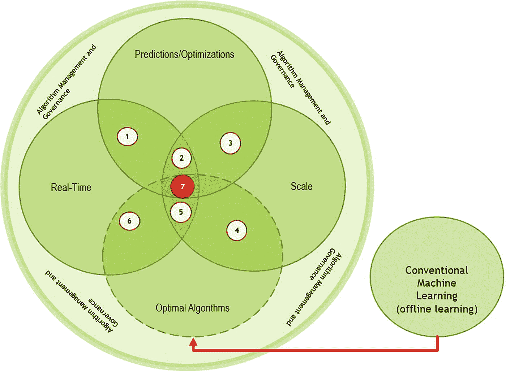
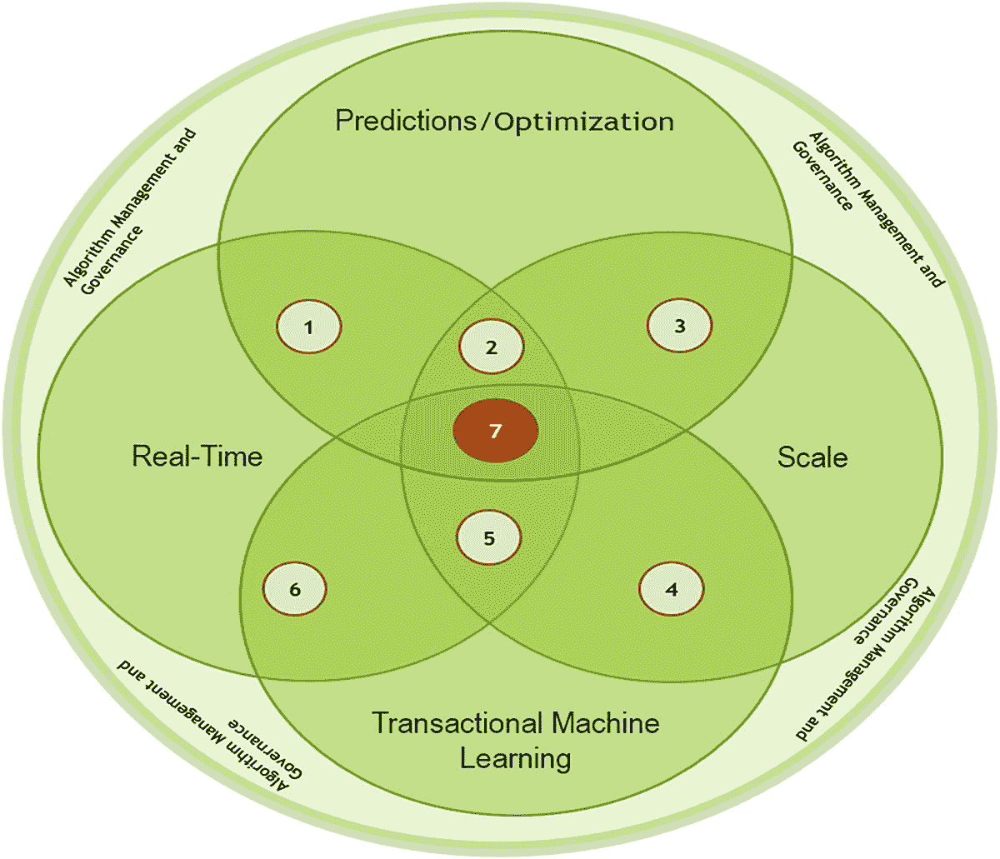

# 4.交易型机器学习的商业价值

快速数据需要快速的机器学习来快速决策。这是支撑 TML 的核心主题，也是机会所在。具体来说，快速学习导致快速决策，从而更快地实现这些决策的潜在好处。对于企业来说，在与其他企业争夺市场份额和客户的商业市场中，快速决策可以成为竞争优势的来源[Davenport，2006]。通过将数据流与 AutoML 相结合，学习速度从根本上偏离了传统的机器学习(CML)。由于集成了用于在线学习和预测的 AutoML，减少了摩擦，为更快地扩展解决方案提供了机会。它不仅创建了一个无摩擦的机器学习过程，而且还创建了一个弹性的机器学习解决方案，可以随着(业务)需求的变化而伸缩。

随着企业面临后 Covid 世界，成本压力将推动提高运营效率和更广泛采用人工智能的需求。 [1](#Fn1) 例如，Covid 迫使组织每周更新或重新创建几次需求和销售预测。为什么？新数据和模型在几小时内就过时了。想象一个永远在线的模型和流程，它只需要新的数据来重新配置自己，并立即开始提供更新的信息:这就是 TML 的商业价值。能够看到预测的变化是永远在线模型的一个主要优势，因为您可以看到您对自己的业务决策有多自信。

越来越多的自动化和机器智能解决方案正在发生结构性转变，这推动了以云存储和计算为中心的数字技术的更广泛采用。分析洞察的速度将成为推动业务成果的竞争优势。数据的增长和数据创建速度的提高将要求更快的数据学习方式。有能力更快地学习将导致更快的决策，这将导致更好的业务成果。 [2](#Fn2)

做出更快的决策有一些关键优势。它允许人类和机器调整他们的过程或行为，从而导致更快的行动。随着时间的推移，做出明智的、数据驱动的决策的好处会不断积累，从而进一步促进流程或行为的改进[Davenport，2006]。使用数据做出好的决策是改进这些过程和行为的基础[Davenport，2006]。

对于企业领导人来说，数据驱动的决策对于改善业务成果至关重要[Davenport，2006]。正如我们在前面的章节中所讨论的，TML 提供了从快速流动的数据中学习的机会，这是传统的机器学习无法完全提供的。具体来说，通过减少机器学习过程中的人类接触点，从而减少摩擦，组织可以利用速度来获得见解，使他们能够将这些见解整合到每个业务流程中[Mohammadi et al .，2018]。让数据驱动的洞察力为每个业务决策提供信息的价值

1.  数字化成熟的组织，使其在快速变化的环境中更加敏捷

2.  一个透明的组织，它能让客户和利益相关者更加信任

3.  一个没有摩擦的组织，需要更少的数据、服务器和网络管理 IT 全职员工，以及更少的数据科学家全职员工

成熟度、透明度和摩擦这三个方面可以为企业释放价值，从而打开新的收入流，推动增长。数字成熟度是成功的关键。使用技术来降低成本是重要的，但是公司现在正期待技术来增加增长。此外，业务流程中的透明度加上更少的摩擦具有增加员工和客户信任度的双重效果。一项研究发现，94%的消费者会忠于一个透明的品牌。 [4](#Fn4) 接下来的章节将会更深入地探讨如何通过 TML 来实现这一点。但首先，我们讨论传统的机器学习过程。

## 传统机器学习

在本节中，我们将了解传统的机器学习是如何关注静态的、驻留在磁盘上的数据的。这将有助于与 TML 形成对比，后者专注于非静态数据流。今天，机器学习是一个涉及数据准备、特征选择、模型建立、模型估计、超参数微调和模型部署中几个人类接触点的过程[Amershi et al .，2014；米切尔 1997 年]。人类参与机器学习过程会产生摩擦，从而降低模型制定、模型估计、超参数微调和模型部署的速度；通过自动化这些任务，我们可以减少传统机器学习过程中的摩擦。大多数数据科学家花 80%的时间清理和准备数据，只有 20%的时间做数据分析。 [5](#Fn5) 借助 TML，数据分析实现了自动化，可立即节省 20%或更多的成本。TML 的数据准备包括识别和连接数据流，使用 MAADSTML Python 库或 REST API 动态构建 ML 模型；这将额外减少 30%或更多的数据准备时间。我们将在第六章[中演示这些任务。](6.html)

我们并不是暗示 CML 没有价值；CML 有许多用途，可以从静态的、驻留在磁盘上的数据中操作和学习。其中一些用途集中在不需要实时做出的决策上。或者，使用不经常随时间变化的分析数据。图 [4-1](#Fig1) 显示了实时数据环境下的 CML 流程，并使用最佳算法进行了预测和优化。此图显示了 CML 流程如何在大部分情况下离线分析数据，以确定最适合数据的算法。通过改变每个算法中的参数或变量或者应用不同类型的算法来选择和应用几个模型迭代，通常可以找到最佳算法。

图 4-1

CML 过程

选择最佳算法既是一门科学，也是一门艺术。统计指标用于衡量特定算法的优劣，同时避免过度拟合，这意味着避免将算法训练得太好，以至于它在接受训练的数据上表现良好，而在接受*而不是*训练的数据上表现不佳。一旦选择了算法和参数，它们就被用于预测和规定的分析。

下面解释图 [4-1](#Fig1) 中的六个圆:

*   实时–这表示数据是实时或批量生成的。这些数据不是用于训练模型的；相反，它用于使用预训练的模型进行评分或进行预测。

*   规模—这意味着在一个大型分布式或本地网络中存在大量静态数据和高容量数据。CML 环境中的规模很大程度上取决于人员、流程和技术。此外，扩展机器学习模型涉及几个组件，如服务器基础架构、存储、计算和网络吞吐量。所有这些将使成千上万的消费者能够从你的机器学习模型中获得洞察力。扩展几个机器学习模型可能并不那么困难，但如果您有数百个机器学习模型被分布式网络中的数千或数百万用户使用，会怎么样？那么，当模型需要变更、重新培训和重新部署时，这些模型的模型管理、数据和见解的安全性以及治理又如何呢？用 CML 不容易做到。数据和见解的模型管理、治理和安全控制方面的挑战使得快速扩展变得更加困难。

*   预测和优化——这意味着使用预先训练的机器学习模型，通过对数据进行评分来进行预测，并找到独立变量的最佳值。例如，在我们的天气温度示例中，这将是 CC 和 ToY 值。具体地，在模型被训练之后，估计的参数(即，a、b 和 c)从训练数据集中获取学习。这些机器学习本质上是对生成数据的分布的估计。回想一下，训练数据集是一些总体数据的样本，但是在大多数情况下我们没有总体数据，所以我们使用样本数据来估计总体数据。需要注意的是，这些都是经过预先训练的模型。这些预先训练的模型是使用静态的历史数据开发的，这些数据可能持续数月或数年。这与 TML 大相径庭，在那里，模型是使用几秒钟或几分钟前生成的数据实时训练的。

*   最优算法/传统机器学习–这种最优算法是最适合数据的算法，具有最佳调整的超参数。这是 CML 的数据科学家正在寻找的，也是为什么他们可能需要几天或几周才能找到它。这也是与 TML 的一个关键区别，在那里，无需人工干预，在几秒钟或几分钟内就可以找到带有调整过的超参数的最佳算法。红色箭头表示来自离线机器学习过程的输出，即最适合训练数据集的最优算法。然后，该最佳算法可用于预测和/或找到输入变量的最佳值。

*   算法管理和治理——在 CML 中，训练模型的管理和治理是一个越来越大的挑战。这是由于三个原因:
    *   越来越多的经过训练的模型在组织内部创建，但在数据访问、机器学习平台、开源技术使用的增加以及模型部署后的维护和支持方面几乎没有标准流程和控制。

    *   组织和客户要求更快地从数据中获得洞察力，以某种方式改善他们的日常任务。这推动了对更多机器学习模型的需求，使模型再训练、版本控制以及洞察力和可视化的质量变得复杂。

    *   维护和支持机器学习模型的成本将会增加，因为云中的数据和机器学习平台，加上开源技术，使得跨分布式网络构建和部署模型变得更加容易。为了控制云计算和存储成本，这将使管理哪些模型正在使用，哪些模型没有使用变得更加困难。在世界银行最近为金融科技行业发布的一份报告中，许多金融科技公司报告称，数据存储费用有所增加。 [6](#Fn6)

TML 在三个方面不同于 CML:

*   TML 在实时、事件驱动的训练数据集上进行在线机器学习。这里，在线指的是为机器学习动态创建训练数据集。随着新数据的出现，这些训练数据集不断被创建。

*   TML **使用事件流数据**作为在线机器学习以及预测和说明性分析和优化的输入数据。数据流中实时填充了事件，这些事件需要机器学习解决方案做出更快的响应来捕获信息、处理信息并将其向前发送，以供人类或机器快速决策。

*   TML 解决方案的部署、扩展和再培训速度更快:它们是**无摩擦**、**和弹性**，这是与 CML 解决方案的一个关键区别。CML 解决方案也可以扩展，但成本函数是线性的。TML 的成本函数很快变平，因为在同一个基础设施中可以廉价地增加多个流。弹性 TML 解决方案将 TML 解决方案的特征和设计与解决方案的管理和治理相结合。

下一部分着眼于 TML 提供的将机器学习应用于实时、事件驱动的数据的机会。

## TML 机会

由组织收集的数据的增长在很大程度上仍未得到利用。在最近的 2019 年调查中，代表美国运通、福特汽车、通用电气、通用汽车和约翰逊&约翰逊等超大型企业的 64 名高管发现

*   72%的受访者尚未创建数据文化。

*   69%尚未创建数据驱动型组织。

*   53%的企业尚未将数据视为企业资产。

*   52%的人承认没有在数据和分析上竞争。

显然，前面的调查显示了在数据和分析的使用方面的改进空间。当然，另一方面，48%的公司在数据和分析方面展开竞争。虽然将数据视为一种资产的做法越来越多，但这需要组织领导层将数据和见解作为竞争优势。此外，从数据中提取的洞察力还需要直接显示它如何有助于增加收入和降低成本。如果没有与组织损益表的底线直接联系[Maurice et al .，2006]，将很难获得高管对使用数据和机器学习作为竞争武器的认可。稍后，我们将展示组织如何将 TML 用例与企业优先事项相结合，以确保开发正确的 TML 用例，并在增加整个组织价值的同时，直接为这些优先事项做出贡献。

图 [4-2](#Fig2) 显示了与 CML 类似的图表，但这里 TML 增加了实时数据、规模、预测/优化，从而可以更快地做出决策。我们将讨论组织如何向 TML 发展，并为他们的组织增加额外的价值。

图 4-2

tml ven diagram(tml 来源图)

下面解释图 [4-2](#Fig2) 中的五个圆:

*   实时——这意味着数据是实时生成的，并且是事件驱动的；我们认为实时是一个连续的数据流，如数据流。这些数据流是无限的，这意味着它们在技术上可以无限增长。这是 TML 的一个关键价值领域:它对大数据快速执行机器学习的能力。

*   规模——这意味着在一个大型分布式网络中有大量的数据流和数据。随着来自不同来源的不同类型数据的巨大增长，以及组织向云的转移，对基于云的机器学习解决方案的需求将不断增长，这些解决方案可以快速构建、部署、管理和使用；此处的管理意味着，如果解决方案未被使用，能够自动将其停用。

*   预测和优化——这意味着使用机器学习算法进行预测，并找到独立变量的最佳值。TML 使用新训练的机器模型对数据进行预测或评分。与 CML 的主要区别在于，TML 解决方案使用的数据始终是最新的数据，可能是几秒钟或几分钟前的数据，而不是像大多数 CML 使用案例那样是几个月或几年前的数据。

*   交易型机器学习——参见前面的定义。

*   算法管理和治理–实时管理 TML 解决方案，通过自动停用闲置的解决方案来控制云计算和存储成本。

结合前面的五个方面，我们开始发现另外七个令人感兴趣的功能:

1.  将预测/优化与实时数据相结合成为实时分析。这是目前几家公司用来预测消费者行为、推荐产品或服务等的方法。
    1.  在其产品和服务中嵌入机器智能的企业拥有更多参与其中的客户。

    2.  通过优化来确定以特定价格出售或购买的最佳数量，可以确保收入最大化，成本最小化。

2.  大规模实时分析使组织能够预测消费者行为，并为几百人而不是几百万人推荐产品或服务。想想使用脸书的数十亿人；大规模使用实时分析可以让脸书向个人用户投放广告。有少数公司可以做得很好。

3.  在不考虑实时性的情况下，将规模和预测/优化结合起来与将离线机器学习应用于静态数据是一样的。这方面的例子很多，比如在医疗保健中预测服用某些药物后的免疫反应。其他例子包括预测产品推荐、零售价格、健康和安全事故、资产损失等等。有几家公司可以做到这一点。必须更新、重新训练和微调机器学习模型的超参数是具有挑战性的；TML 是一种一次性的方法。它允许组织减少对进入 TML 模型和流程的输入的关注，而更多地关注来自 TML 的结果，并使用它来制定更好的业务决策，以推动其业务快速发展。这在竞争激烈的市场中非常重要。

    组织较少采用的领域(如果有)是

4.  将 TML 与规模相结合——如今很少有公司能够做到这一点。

5.  将 TML 与规模和实时相结合，例如对流数据进行数据挖掘——目前很少有公司在这样做。

6.  将 TML 与实时相结合——现在很少有公司这样做。

    这就把我们带到了 TML 尚未开发的核心领域[Mohammadi et al .，2018]:

7.  将 TML 与实时相结合，进行大规模预测/优化——只有将数据流与 AutoML 相结合才有可能。正如我们所讨论的，CML 过程不够快，无法将机器学习应用于数据流。具体来说，随着数据的变化，数据的底层结构也会变化，这将改变从这些数据中获得的知识。考虑主要由人类行为驱动的金融数据的快速变化。使用 CML 从几个月或几年前的财务数据中学习可能会错过市场条件变化、环境变化、流行病等带来的人类行为变化。如果错过这些变化，将会影响机器学习模型预测的结果，从而影响人类做出的决定。能够更快地从简单无缝的最新数据中学习，就有更大的机会捕捉底层数据结构中的或大或小的变化，这自然会导致更好或更准确的模型结果和决策。

图的外部区域显示了**算法治理和管理**的重要性。 [8](#Fn8) 与价值领域 1-6 一起，组织可以通过专注于逐渐导致更快的数据创建、更快的机器学习应用、更快的优化和预测决策以及适当的治理的领域，向价值领域 7 发展。

但是，是什么让第七区如此特别呢？仅仅因为极少数公司(如果有的话)处于 7 并不意味着它是理想的，不是吗？如前所述，领域 1-3 是一些组织目前正在做的事情；这已经确立了实时预测和大规模优化的采用。随着越来越多的公司开始采用 1-3 领域，这将迫使已经处于 1-3 领域的领先公司开始差异化、创新，并发展到其他领域，以获得市场份额并保持竞争力[Davenport，2006；穆罕默迪等人，2018】。

为了快速决策，需要对流式数据进行快速机器学习(和深度学习)。 [9](#Fn9) 但是有几个挑战使得从数据流中学习变得很困难，即依赖历史数据来训练算法【Mohammadi et al .，2018】。TML 提供了一种从数据流中提取历史数据的方法，以促进机器快速学习。这允许组织向区域 4、5 和 6 发展，并最终向区域 7 发展，这可以帮助他们保持竞争优势。

向领域 4、5、6 和 7 发展将要求组织采用不同的思维模式和文化，利用过去在分析方面的创新。Davenport (2006)提供了几个公司如何利用人员、流程、技术和文化在分析上竞争的例子。许多成功使用分析的组织构建了一个允许分析蓬勃发展的生态系统。例如，Davenport (2006)解释了沃尔玛如何坚持其供应商使用他们的零售链接系统来监控商店的产品移动，计划促销，并使用数据更好地管理产品库存。宝洁公司与其供应商和零售客户分享其数据和分析，以帮助提高响应能力和降低成本[Davenport，2006]。构建一个生态系统，让分析在分布式用户网络中提供真正的目的和价值来源，以实现共同的目标，这不仅有助于加快数据和分析的采用，还将促进解决新业务问题的新思路和解决方案。TML 通过使用云基础设施作为公共存储和交付平台，将合作伙伴的数据流与您的数据流结合或连接起来，使合作伙伴之间的数据共享变得更加容易。

对组织如何向分析发展的深入研究表明，数据加上业务需求是驱动力[Davenport，2006]。随着越来越多的数据从低速发展到高速，从低容量发展到高容量，从低多样性发展到高多样性，分析这些数据的方法也将随之发展。我们只需要回顾一下计算机的演变，从阿塔纳索夫-贝里计算机(ABC)，巨像，ENIAC，曼彻斯特婴儿机，EDSAC，IAS，等等。随着计算机内存和存储的增加，强大的(开源)编程语言，以及电子电路的进步，我们可以看到事情发生了多么迅速的变化，以及我们如何加速向计算发展，从而开辟了许多新的应用和创新领域[Williams，2000]。如果不是阿兰·m·图灵和约翰·冯·诺依曼解决了推动创新需求的战略和复杂的计算问题，计算和运算是不可能的。

因此，不难接受的是，领先的组织将加速向领域 4、5、6 和 7 发展，这是主要由业务需求、竞争压力、技术进步和人员技能驱动的自然进程。下一节讨论 TML 的核心价值领域。

## TML 的核心价值领域

与 AutoML 集成的数据流可以解决大规模问题，并为数百万人提供更快的洞察力，将继续获得牵引力。上一节已经展示了业务需求、竞争压力、技术进步和人们如何自然地发展到更快、更好、更便宜的做事方式所驱动的计算和运算的演变；数据和机器学习也是如此。因此，TML 的商业价值将通过以下方面实现:

*   更快的决策——通过减少 CML 中存在的摩擦，TML 以更少的人工干预和更灵活的解决方案提高了洞察速度。

*   更快的扩展–与 Kafka 一起，TML 解决方案可以使用 API 和微服务架构快速扩展，为几乎每个行业的组织开辟新的机会。

*   更快(更深入)的洞察–即时连接数据流以创建训练数据集，然后应用机器学习来寻找最佳算法，通过微调超参数，创建一个无摩擦的机器学习过程，可以在非常短的时间内提供更深入的洞察，而不是几天或几周。

如果企业希望从快速流动的数据中获得最大价值，上述领域强调了提高速度的途径。许多研究人员[达文波特，2006；阿格瓦尔，2007 年；Amershi 等人，2014 年；何等，2020；Jayanthi 等人，2016；里德等人，2020；Yao 等人，2019]已经展示了分析、大数据、数据流和 AutoML 对决策的价值。网飞、Apple Music、Disney+、亚马逊 Prime Video、脸书流媒体、FinTechs、谷歌等流媒体技术以及物联网设备和技术的近期增长表明，消费者的行为正在转向基于流媒体的文化。这些技术正在促成流数据的指数级增长，这将推动对更快分析这些数据以做出更快决策的方法的需求。下一节将更详细地讨论这些价值领域(杠杆)。

## TML 价值区域(杠杆)

在确定影响人工智能在大数据上的应用的成功因素方面，一直缺乏研究[段等人，2019]。更少的是对数据流上使用 AI 和机器学习的成功因素的研究。本节将进一步讨论上一节中讨论的价值领域(杠杆)。具体来说，我们在这里提出了一个 TML 价值框架(TVF ),以帮助确定 TML 的用例，这些用例符合企业的优先事项和目标。TML 的主要目标是不断将自动机器学习应用于数据流，以快速提取见解:以最小的摩擦快速获得见解对于成功的 TML 解决方案至关重要。在商业环境中，几乎没有研究表明 AutoML 在应用于数据流时如何产生商业价值:增加收入和/或降低成本。表 [4-1](#Tab1) 展示了 TVF 作为组织度量 TML 用例随时间变化的业务价值的一种方式。

表 4-1

TML 价值框架

<colgroup><col class="tcol1 align-left"> <col class="tcol2 align-left"> <col class="tcol3 align-left"> <col class="tcol4 align-left"> <col class="tcol5 align-left"></colgroup> 
| 

TML 地区

 | 

商务办公区

 | 

决策区域

 | 

产生的价值

 | 

实现价值的时间

 |
| --- | --- | --- | --- | --- |
| 更快的决策 | 确定业务中需要更快决策的领域。这些可能包括金融人力资源营销信息技术制造业风险运营 | 确定决策领域。这些可能是提高客户满意度减少产品故障减少欺诈提高客户保持率降低员工流动率提高客户参与度 | 为每个业务领域和决策领域确定你希望实现的期望值 [10](#Fn10) 。 | 确定你什么时候想实现这个价值。具体点。例如，*我想在 1 周内实现客户保持率的提升*。或者，我想在 1 个月内实现客户满意度的提升。 |
| 更快的规模 | 确定你想要扩展的业务领域。 [11](#Fn11) | 您希望扩展哪个决策区域？ | 规模化实现的价值是什么？例如，如果你想提高 1000 万客户的参与度，那么你可以为 1000 万客户提供什么样的见解或服务，让他们对你的产品或服务更感兴趣？ | 你想多快实现这个价值？如果你向 1000 万客户提供关于产品推荐的见解，你是按需提供信息还是事件驱动的，每分钟，每小时等等。？ |
| 更快(深入)的洞察力 | 确定需要从机器学习中获得更深入见解的业务领域:对某事的预测或某事的最佳值。您目前在生产中使用的模型是批量更新还是手动更新？您是否发现模型会随着时间的推移而失去相关性，例如，它们的性能通过准确性或错误率来评估，或者盈利能力会随着时间的推移而恶化？您的数据团队是否花费时间更新或改进现有模型？如果您对这些问题中的任何一个回答是肯定的，您可能有机会使用 TML 来减少您的数据科学过程中的摩擦。 | 确定您预测或优化的内容。例如，我想预测下个月我的客户满意度是多少。或者，我想知道我的客户下周想要多少产品。或者我想检测每一笔银行交易的欺诈行为。 | 从更深层次的洞察中识别价值是什么。例如，如果您预测 100 万笔交易中存在欺诈，则指出您希望减少的欺诈百分比。 | 确定您希望以多快的速度提供这些更深入的见解。例如，我想分析每秒 100 万笔交易的潜在欺诈，并在 1 个月内将欺诈减少 10%。对静态数据进行操作的 CML 流程无法足够快地发现潜在的欺诈行为，并且可能会使您的组织面临收入泄露的风险。 |

表 [4-1](#Tab1) 显示了一个框架，帮助组织选择用例以及业务问题，通过快速提取洞察力来满足他们的企业目标。我们可以展示这个框架如何应用于一个虚构公司的欺诈用例。对于该公司，我们确定以下几点:

*   业务领域–销售奢侈品的在线零售商的运营风险管理。

*   决策领域–给定的交易是否具有欺诈性，是否应该允许交易继续进行？在什么样的风险水平下应该允许交易继续结帐？

*   价值领域–您的公司每周因欺诈交易损失 70 万美元。将这一比例降低 50%,可以防止每周 350，000 美元的收入从您的组织中流失。现在，这些节省与竞争用例相比如何？

*   实现价值的时间–财务部门希望每周减少 50%的欺诈，并在 6 个月内实现 840 万美元的节约。

目标明确、清晰且重点突出，有助于设计出符合您目标的 TML 解决方案。下一节将详细介绍 TML 解决方案的价值衡量。

## 测量 TML 解决方案的价值

最后一节讨论了价值领域。在本节中，我们将对 TML 解决方案产生的价值进行转化和量化。通过衡量 TML 解决方案的价值，组织可以根据从高到低的价值对 TML 解决方案进行优先排序和规划。虽然对价值的哲学讨论超出了本书的范围，但是区分价值和估价是很重要的[哈特曼，1969；哈特曼，1972]。某样东西的价值很大程度上是主观的，取决于它在多大程度上实现了它被设计来实现的概念。哈特曼(1972 年，第 250 页)将价值定义为“一个事物在实现其概念意图的程度上具有价值。“估价是一种测量有价值的事物的属性的人类活动，或者如哈特曼(1969 年，第 215 页)所说，“事物属性的组合安排”。“虽然价值和估值之间的区别可能看起来很微妙，几乎微不足道，但它们在价值计算中的重要性绝不是微不足道的，特别是如果你考虑到开发可能影响数百万人的大规模机器学习解决方案所涉及的成本。如果这些解决方案产生的价值不等于或大于解决方案的成本，那么这就是一个赔钱的解决方案。

延伸价值和估价的概念，我们可以从两个方面来看待 TML 解决方案的价值:

1.  内在价值——这是 TML 解决方案本身的价值；这可能与解决方案的唯一性有关，特别是所做决策的唯一性、解决方案的大小、正在使用的数据流数量以及随着时间的推移生成的算法数量。例如，对持续流动的数据交易进行实时欺诈检测，可以大规模进行，降低人员和技术成本，同时减少收入损失的机会，这将是一项直接影响组织底线的价值。

2.  外在价值——这是非内在的价值。具体来说，TML 解决方案对组织内外有什么外部影响？TML 解决方案对增加收入和/或降低成本有何直接贡献？TML 解决方案的投资回收期有多长？

了解 TML 解决方案的内在和外在价值不仅有助于组织出于规划和开发目的对解决方案进行优先排序，还有助于在更广泛的技术和业务利益相关者群体中提供解决方案的可见性；这可能会加速利益相关者的认同。

使用平衡计分卡(BSC) [Kaplan 和 Norton，1996，2001]等广泛接受的方法获取内在和外在价值，有助于提供所有 TML 解决方案的跨企业视图。以及是否有机会将 TML 解决方案与其他非 TML 解决方案相结合。例如，表 [4-2](#Tab2) 显示了一个 BSC [Kaplan 和 Norton，1996，2001；Looy 等人，2016]针对 TML 解决方案。

表 4-2

平衡计分卡下的 TML

<colgroup><col class="tcol1 align-left"> <col class="tcol2 align-left"> <col class="tcol3 align-left"> <col class="tcol4 align-left"></colgroup> 
| 

BSC 区域

 | 

观察视角

 | 

绩效指标

 | 

TML 解决方案增加了

 |
| --- | --- | --- | --- |
| 财政状况 | 股东和高级管理层的财务表现 | 战略财务数据 | 业务领域:否决策领域:否价值:是时间:否 |
| 与客户相关的绩效 | 客户绩效供应商绩效社会表现 | 客户调查结果外部协作和流程依赖社交媒体互动数据，即喜欢/不喜欢、对产品和服务的负面/正面评论 | 业务领域:是决策领域:否价值:否时间:否 |
| 内部业务流程绩效 | 一般过程性能与时间相关的过程性能与成本相关的流程绩效与内部质量相关的流程绩效与灵活性相关的过程性能 | 流程工作的描述性数据流程工作中与时间相关的数据运营财务数据满足最终用户需求的能力流程工作中的变更或变量数据 | 业务领域:是决策领域:否价值:否时间:否 |
| 与学习和成长相关的绩效 | 数字创新绩效员工绩效 | 流程和项目的创新员工对流程工作和个人发展的贡献 | 业务领域:是决策领域:否价值:否时间:否 |

表 [4-2](#Tab2) 中的最后一列“TML 增加”应表示对 TML 地区的是/否-作为示例，我们填写了是和否。每个 TML 解决方案都应该这样做，这将有助于将 TML 解决方案与整个组织的平衡计分卡联系起来。这对于促进跨业务领域的非竖井方法也很重要，并可以使 TML 解决方案更加明显，以增加买入。然而，当 TML 解决方案的某些方面增加了 BSC 领域而其他方面没有增加时，困难就出现了。从表 [4-2](#Tab2) 中选取以下财务绩效示例:

*   业务领域:否

*   决策领域:否

*   价值:是

*   时间:否

在这种情况下，价值:是意味着 TML 解决方案增加了财务绩效，但其他 TML 领域如决策领域和时间没有。例如，你可以问:一些决策领域对财务绩效不重要吗？对时间说不意味着长期绩效而不是短期绩效吗？TML 将如何、何时以及在多大程度上减少欺诈？能够免费创建灵活的概念证明 [12](#Fn12) 可以快速、无风险地评估潜在的 TML 解决方案。我们将在下一节中提出一种解决这一困难的方法。具体来说，下一节将展示一种量化 TML 解决方案价值的评估方法，以帮助选择 TML 用例。TML 解决方案提供的商业价值将是他们成功的一个重要方面。

## 选择正确的 TML 用例

在某些情况下，组织匆忙开发解决方案，而没有意识到对成本的广泛影响。 [13](#Fn13) 谨慎评估 TML 解决方案的收益和成本将有助于降低在为组织创造极少价值的解决方案上超支的风险；如果一个解决方案的成本超过了它所创造的价值，那么它绝对不值得开发。

在本节中，我们开发了一个 TML 价值指数(TVI ),用于量化 TML 解决方案的内在和外在价值。指数组成部分如下(在 TML 解决方案的背景下) :

1.  业务领域重要性
    1.  1 =非常重要

    2.  2 =重要

    3.  3 =稍微重要

    4.  4 =平均值

    5.  5 =不重要

2.  对于正在做出的每个决策，选择该决策是否
    1.  1 =非常重要

    2.  2 =重要

    3.  3 =稍微重要

    4.  4 =平均值

    5.  5 =不重要

3.  对于为每个决策生成的值，选择该值是否为
    1.  1 =非常重要

    2.  2 =重要

    3.  3 =稍微重要

    4.  4 =平均值

    5.  5 =不重要

4.  对于要回答的决策的时间部分，指出时间是否
    1.  1 =非常重要

    2.  2 =重要

    3.  3 =稍微重要

    4.  4 =平均值

    5.  5 =不重要

你可能会问“不是每个业务领域和决策都很重要吗？”不一定。业务优先级会随着时间而变化。这些优先事项将使一个领域比其他领域更重要:业务不是一成不变的。例如，如果你是一家生产疫苗的制药公司，而我们在疫情，那么这家公司将优先考虑他们的研发(R&D)而不是他们的 IT 部门。因此，在疫情的背景下，针对 R&D 地区的 TML 解决方案将会、也应该比针对它的 TML 解决方案更重要。一旦疫情结束，这项业务可能会重新优先考虑他们的重点领域。

回想一下在平衡计分卡方法中协调 TML 地区的困难:我们现在可以解决这个困难。具体来说，如果 TML 地区对 BSC 地区的增值不一致，通过使用 TVI，我们可以量化 TML 用例，并根据其 TVI 值进行排名。表 [4-3](#Tab3) 显示了我们如何计算 TML 用例的 TVI。

表 4-3

TVI 计算

<colgroup><col class="tcol1 align-left"> <col class="tcol2 align-left"> <col class="tcol3 align-left"> <col class="tcol4 align-left"> <col class="tcol5 align-left"> <col class="tcol6 align-left"></colgroup> 
| 

TML 用例

 | 

商务办公区

 | 

决策区域

 | 

价值区域

 | 

时间

 | 

成像

 |
| --- | --- | --- | --- | --- | --- |
| “财务领域希望将 1 个月内 100 万笔交易的欺诈减少 10%” | Two | one | one | three | One point seven five |
| “营销部门希望花费 100 万美元将 1000 件产品的销售额提高 10%，并在 3 个月内增加 400 万美元的收入” | three | Two | one | Two | Two |

这个用例的 TVI 是什么？通过对每个领域使用“非常重要”到“不重要”的等级，组织可以在一个小组中回答这个问题，将每个业务领域的个人作为回答者。[14](#Fn14)TVI 的范围从 1 到 4:它是每个 TML 区域的平均值。需要注意三个要点:

1.  必须根据当时的业务优先级来选择重要性。

2.  选择不能在一个筒仓中完成，而是要尽可能多地涉及不同的业务利益相关者。

3.  要在 TML 用例中进行选择，请将 TVI 列从最低到最高排序；编号最小的 TVI 是最重要的用例。在表 [4-3](#Tab3) 的最后一列，TVI 值 1.75 比 TVI 值 2 更可取。

虽然前面的方法在查看单个用例时工作得很好，但是在查看用例之间的相对重要性时就不太好了。 [15](#Fn15) 这是因为我们通过给重要性分配一个数值来将序数排序转换为基数排序，这引起了对选择重要性值的客观性水平的关注。这就是为什么在一组相对用例之间执行这个为 TML 区域选择值的练习是重要的。当几个不同的个体进行选择时，选择偏差的水平应该降低[Kugler 等人，2012]。然后，应将总体分组结果用于 TVI 计算。下一节将探讨 TML 解决方案的优势和成本，以及如何计算这些优势和成本。

## 收益和成本

到目前为止，我们已经关注了 TML 解决方案可以实现的价值领域，但没有太多关注收益和成本的比较。组织应密切关注 TML 解决方案带来的好处以及构建和支持这些解决方案所产生的成本，以避免浪费财务资源，这种情况越来越普遍。 [16](#Fn16) 具体来说，净收益(即收益减去成本)应该是正数，以证明 TML 方案的合理性。但是这些净收益不应该是一次性的计算；相反，在 TML 解决方案的整个生命周期中，净收益应该是一个持续的计算过程。

TML 解决方案有几个重要的成本方面，其中一些可能不会立即显现出来。为了看到这一点，我们提出了下面的例子。我们关注使用云技术(如磁盘存储、内存、计算能力和吞吐量)的大型 TML 解决方案的成本。这些组件中的每一个都是支持 TML 解决方案运营的特定基础架构。[17](#Fn17)TML 解决方案的其他成本方面是卡夫卡特有的，如表 [4-4](#Tab4) 所示。

表 4-4

TML 成本构成 [18](#Fn18)

<colgroup><col class="tcol1 align-left"> <col class="tcol2 align-left"> <col class="tcol3 align-left"></colgroup> 
| 

成本类型

 | 

金额(美元)

 | 

最大限制

 |
| --- | --- | --- |
| 读 | 0.11 美元/GB | 每秒 100 MB |
| 写 | 0.11 美元/GB | 每秒 100 MB |
| 仓库 | 0.00013889 美元/千兆小时 | 5000 GB |
| 分区 [19](#Fn19) | 0.004 美元/分区小时 | Two thousand and forty-eight |

现在，对于大型 TML 解决方案，假设

1.  每小时 1000 GB 的网络读取。

2.  每小时 1000 GB 的网络写入。

3.  每小时使用 10，000 GB 的存储。

4.  创建 10，000 个主题/算法，每个主题/算法有 10 个分区，使用 100 GB 的存储空间。

5.  TML 解决方案运行 1 年(或 8760 小时)。

表 [4-5](#Tab5) 显示了 TML 解决方案的成本。

表 4-5

TML 解决费用 [20](#Fn20)

<colgroup><col class="tcol1 align-left"> <col class="tcol2 align-left"> <col class="tcol3 align-left"> <col class="tcol4 align-left"></colgroup> 
| 

成本类型

 | 

金额(美元)

 | 

吞吐量/小时

 | 

年成本(美元)

 |
| --- | --- | --- | --- |
| 读 | 0.11 美元/GB | One thousand | Nine hundred and sixty-three thousand |
| 写 | 0.11 美元/GB | One thousand | Nine hundred and sixty-three thousand |
| 仓库 | 0.00013889 美元/千兆小时 | Ten thousand | Twelve thousand one hundred and sixty-seven |
| 划分 | 0.004 美元/分区小时 | One hundred thousand | Three million five hundred and four thousand |
| **年度总成本** |   |   | $5,442,167 |

如表 [4-5](#Tab5) 所示，对于大型 TML 解决方案，预计运行费用(8760 小时)为 5，442，167 美元。这还不包括开发应用程序的人力成本和初始成本。年度总成本的主要组成部分是 Kafka 隔断的成本，约占 65%。因此，在设计和构建 TML 解决方案时，为每个主题选择正确的 Kafka 分区数量应该是一个重要的考虑因素。

虽然 550 万美元对多国组织来说似乎不算多，但随着维护和支持的人力成本以及创建其他 TML 解决方案的额外成本，这一数字可能会进一步增加。因此，通过跟踪 TML 解决方案来控制持续成本将成为确保净收益在解决方案生命周期内保持正值的关键组成部分。具体来说，如果解决方案没有为组织提供价值或收益达到或超过 550 万美元，那么组织应该问自己“我们能否通过缩减解决方案或改进其应用来提高投资回报？”如果答案是否定的，那就问“我们真的负担得起这个解决方案吗？”

使用 AiMS 仪表板是控制成本的一种方式。回想一下，AiMS 显示了 TML 解决方案的元数据。有四个关键字段对于跟踪 TML 解决方案的使用非常重要，具体来说:

*   写入字节数(Kb)

*   读取的字节数(Kb)

*   主题的最后一次阅读

*   上次写入主题

如果不运行，TML 解决方案不会产生(云)成本。但是，如果 TML 解决方案正在运行，但没有人使用该解决方案，那么您就在浪费资源，并且将适用表 [4-4](#Tab4) 中所示的云费用。为了避免这种情况，TML 解决方案管理员应该设置警报，以停用无人使用的 TML 解决方案。这些通知可以配置为跟踪消费者最后一次阅读主题的时间。如果没有人阅读一个主题(这是 TML 解决方案的一部分)，比如说，30 天，那么这个主题应该自动停用，以阻止它消耗宝贵的云资源，节省您的组织的资金。因此，跟踪和监测 TML 解决方案的商业用途或不使用，然后立即采取行动不使用，可能是一个重要的成本控制措施。下一节讨论 TML 解决方案的风险和陷阱。

## 风险和陷阱

TML 解决方案在帮助从大规模数据流中提取机器学习洞察方面非常强大。如果管理不当，这种能力的缺点可能是拥有成本。虽然云成本持续下降，但随着时间的推移，组织仍必须密切关注 TML 解决方案的净收益。

组织应该了解 TML 解决方案的主要风险:

1.  随着时间的推移，净收益减少–这可能是由于 TML 解决方案正在运行，消耗了宝贵的资源，但没有人使用该解决方案。如果没有人使用这个解决方案，那么这个解决方案就没有为组织提供任何价值。因此，虽然 TML 解决方案可能会提供初始值，但随着时间的推移，这可能会减少。

    Mitigation:
    1.  组织可以通过使用 AiMS 密切监控 TML 解决方案的使用来降低这种风险。

    2.  在开发解决方案之前，清楚地了解解决方案对组织的价值。这应该通过使用前面讨论的方法来完成，例如将业务领域、决策领域、价值领域和时间映射到 BSC 中的业务优先级。计算每个 TML 用例的 TVI，然后选择 TVI 值最低的用例，这将有助于确定价值最高的解决方案的优先级。以及通过在每周报告中显示使用该解决方案的用户数量、数据读写量、该解决方案处于活动状态的天数来检查部署中的产品。您还可以确定这些数字是否与原始业务案例中陈述的解决方案的预期价值一致，以及它是否提供了 BSC 中归属于它的价值。使用这些信息，您可以决定是继续运行解决方案还是停用它。

    3.  为需要业务决策结果的用户提供 TML 解决方案。通过优化主题中所需的分区数量，仔细控制对解决方案的访问也有助于降低成本。

2.  增加创建的算法数量——AutoML 有助于减少机器学习的摩擦，但它也增加了组织中算法的数量。这可能会给缓解带来挑战:
    1.  模型管理

    2.  模型治理

    3.  安全性

         Mitigation:
    1.  更好地规划 TML 解决方案非常重要。具体来说，了解解决方案将需要多少算法，您将在 Kafka 中创建多少主题，主题将如何相互关联，将从主题中读取多少数据以及将多少数据写入主题，以及每个主题将需要多少分区。

    2.  Use 旨在停用不再使用的主题。

3.  利益相关方对 TML 解决方案的不满——必须仔细考虑 TML 解决方案。这将包括选择正确的 TML 用例，创建主题的数量，主题如何相互关联，以及每个主题的分区数量。缓解措施:
    1.  选择 TVI 分数低且符合平衡计分卡的 TML 用例。

    2.  确定谁需要他们业务的解决方案成果，并且只向需要的用户提供访问权限。

    3.  确定谁将制作主题。生产者可以是人，也可以是机器。如果出现问题，这将有助于支持和维护 TML 解决方案。

    4.  确定并计算解决方案的收益和成本。随着时间的推移，确保收益大于成本*。*

4.  成本超支——未正确使用 AiMS 中的警报/通知可能会增加 TML 解决方案成本“失控”的风险，这些成本来自无人使用的主题/算法，不会给组织增加任何价值。

    Mitigation:
    1.  使用 AiMS 仔细跟踪所有主题。

    2.  使用警报/通知来保持主题的最新读取和写入，以确保它们仍在被使用。

    3.  停用未使用的主题。主题总是可以被再次激活。

5.  TML 故障——为分布式网络中的减载设计 TML 解决方案可以显著提高性能和利用率。否则，解决方案将会很慢，不利于使用。

    Mitigation:
    1.  了解有多少人会使用该解决方案，并据此进行设计。

    2.  如果该解决方案将在分布式网络中运行，那么确保它被设计为负载分流将有助于提高性能和增加使用率。这可能包括 VIPER 和 HPDE 的多个实例，以及几个 Kafka 经纪人或服务器。 [21](#Fn21)

    3.  如果一个主题将被多个消费者访问，那么创建一个消费者组来并行地将信息分发给消费者。

    4.  如果多个用户将使用某个主题，请为该主题选择合适的分区数量。分区的数量应该等于并行处理的用户数量。

    5.  通过使用 Kafka 中的复制因子，确保系统内置冗余，以防止在服务器或网络中断的情况下停机。

大型 TML 解决方案会很快变得复杂；但是，采取符合组织优先事项的审慎方法将确保解决方案得到更广泛的接受。通过遵循缓解策略来避免上述风险也有助于在解决方案的整个生命周期中保持低成本和高收益。下一节提供了一些结束语。

## 结束语

本章讨论了 TML 解决方案的关键价值驱动因素，例如

1.  选择正确的*业务领域*

2.  选择正确的*决策区域*

3.  选择正确的*值区域*

4.  选择合适的*时间交付*解决方案见解

它讨论了如何将这些驱动因素与企业目标相结合，以及如何衡量 TML 解决方案的价值。任何大型技术解决方案的潜在风险不仅在于人员和流程，还在于技术本身。从技术解决方案中获得的价值必须与技术在其生命周期中的成本进行权衡。

对于依赖于存储和计算等云资源的 TML 解决方案，必须随着时间的推移监控拥有成本，并根据解决方案提供的价值不断权衡。在大型组织中，技术和解决方案成本很容易快速增长，而组织却没有获得同等价值的回报来证明解决方案的持续运营是合理的。监控 TML 解决方案以确定该解决方案是否正在使用，这对于确定是否应该停用该解决方案及其组件以节省资金非常重要。从模型管理和治理的角度来看，这是谨慎的。

使用算法和洞察管理系统(AiMS)是监控和跟踪 TML 解决方案的一种方式。具体来说，TML 管理员可以跟踪(以及其他)

*   写入字节数(Kb)

*   读取的字节数(Kb)

*   主题的最后一次阅读

*   上次写入主题

AiMS 字段可用于确定构成 TML 解决方案的主题的最后读取和写入。通过使用有关读写的最后日期和时间的信息，管理员可以确定是否有人或任何应用程序正在读取数据或向主题写入数据。管理员可以设置警报来持续检查读取和写入，并可以手动或自动停用无人使用的主题。或者，如果没有东西写到这个主题，这也意味着 TML 解决方案有问题，开发 TML 解决方案的人可以很快纠正这个问题。

对于可能不需要云资源的小型 TML 解决方案来说，TML 解决方案的风险和成本相对较低。基于云的大型 TML 解决方案存在最高的成本失控风险。如果不能持续有效地跟踪和监控 TML 解决方案，它们可能会产生过多的成本，而不会给组织带来相应的价值。

到目前为止，我们已经从很大程度上从理论的角度讨论了 TML，并确定了它对于希望从快速数据中快速做出决策的企业的重要性。我们已经描述了数据流和 AutoML 之间的关系，以及它们如何构成 TML 解决方案。接下来的几章将从技术的角度来看 TML。具体来说，我们将讨论它的架构和组件，并展示我们如何应用这些组件来构建低代码的 TML 解决方案。

<aside aria-label="Footnotes" class="FootnoteSection" epub:type="footnotes">Footnotes [1](#Fn1_source)

[T2`www.forbes.com/sites/kenrickcai/2020/07/10/ai-50-founders-post-coronavirus-predictions/?sh=696f71442ccc`](http://www.forbes.com/sites/kenrickcai/2020/07/10/ai-50-founders-post-coronavirus-predictions/%253Fsh%253D696f71442ccc)

  [2](#Fn2_source)

[T2`https://hbr.org/2020/01/when-data-creates-competitive-advantage`](https://hbr.org/2020/01/when-data-creates-competitive-advantage)

  [3](#Fn3_source)

[T2`www.forbes.com/sites/bernardmarr/2020/05/27/digital-maturity-is-critical-to-business-success--now-more-so-than-ever--survey-finds/?sh=3a483b0935fc`](http://www.forbes.com/sites/bernardmarr/2020/05/27/digital-maturity-is-critical-to-business-success%252D%252Dnow-more-so-than-ever%252D%252Dsurvey-finds/%253Fsh%253D3a483b0935fc)

  [4](#Fn4_source)

[T2`www.forbes.com/sites/mikekappel/2019/04/03/transparency-in-business-5-ways-to-build-trust/?sh=4c6d7a5e6149`](http://www.forbes.com/sites/mikekappel/2019/04/03/transparency-in-business-5-ways-to-build-trust/%253Fsh%253D4c6d7a5e6149)

  [5](#Fn5_source)

[T2`www.infoworld.com/article/3228245/the-80-20-data-science-dilemma.html`](http://www.infoworld.com/article/3228245/the-80-20-data-science-dilemma.html)

  [6](#Fn6_source)

[T2`www.worldbank.org/en/news/press-release/2020/12/03/fintech-market-reports-rapid-growth-during-covid-19-pandemic`](http://www.worldbank.org/en/news/press-release/2020/12/03/fintech-market-reports-rapid-growth-during-covid-19-pandemic)

  [7](#Fn7_source)

[T2`https://hbr.org/2019/02/companies-are-failing-in-their-efforts-to-become-data-driven`](https://hbr.org/2019/02/companies-are-failing-in-their-efforts-to-become-data-driven)

  [8](#Fn8_source)

这是在第 [2](2.html) 章中讨论的 AiMS 仪表板。

  [9](#Fn9_source)

回想一下，流数据或快速数据随着时间不断变化(具有时间局部性)，因此需要人类对主要静态数据进行操作的传统机器学习过程无法快速捕获快速数据中的底层结构，而几乎不需要人类干预的 AutoML 可以设计为快速捕获快速流动数据中的底层结构变化。

  [10](#Fn10_source)

这里的“期望值”是指你希望从可能的结果中获得的价值。例如，超过过去 3 年的平均收入 10%是可以实现的。如果决策制定得更快，实现的平均收入或避免的成本可能是多少？一小时内我们可能会做出多少这样的决定？一天？一周？

  [11](#Fn11_source)

我们所说的规模是指增加机器学习支持的决策数量。例如，您可能是一家制造公司，拥有数百台产生数据流的机器。您可以做出数百个关于维护或输出的局部、人工优化决策，这些决策在局部是最优的，但总体上是次优的。但是，如果这些机器将物联网数据传输到 TML 解决方案，您可以开发一个单一的决策框架，让您优化您的维护和输出决策。

  [12](#Fn12_source)

使用融合云平台，用户可以获得 200 美元的免费云信用，允许他们使用 TML 技术建立具有海量数据的 TML 解决方案。这种在大数据环境中免费展示 TML 价值的能力是快速、无风险地确定 TML 解决方案价值的绝佳方式。如果价值得到验证，解决方案就可以更正式地成为一个项目。

  [13](#Fn13_source)

[T2`www.forbes.com/sites/joemckendrick/2018/02/15/too-much-corporate-money-is-evaporating-into-the-cloud-survey-suggests/?sh=4c72a3731c18`](http://www.forbes.com/sites/joemckendrick/2018/02/15/too-much-corporate-money-is-evaporating-into-the-cloud-survey-suggests/%253Fsh%253D4c72a3731c18)

  [14](#Fn14_source)

深入研究群体决策超出了本书的范围。该领域存在大量研究[Shaw 1932；克尔等人，2004 年；库格勒等人，2012；Saaty 等人，2008 年]。

  [15](#Fn15_source)

有像层次分析法(AHP)这样的方法可以用来以分析的方式衡量选择的相对重要性[Saaty 1982]。

  [16](#Fn16_source)

[T2`www.forbes.com/sites/joemckendrick/2018/02/15/too-much-corporate-money-is-evaporating-into-the-cloud-survey-suggests/?sh=4c72a3731c18`](http://www.forbes.com/sites/joemckendrick/2018/02/15/too-much-corporate-money-is-evaporating-into-the-cloud-survey-suggests/%253Fsh%253D4c72a3731c18)

  [17](#Fn17_source)

当我们在第 [5](5.html) 章讨论 TML 解决方案的技术组件时，这一点会变得更加清楚。

  [18](#Fn18_source)

这些金额目前由[汇流云](https://www.confluent.io)收取。

  [19](#Fn19_source)

分区有进一步的限制:入口每秒高达 5 MB，出口每秒高达 15 MB，存储高达 250 GB。

  [20](#Fn20_source)

虽然这些成本是大型 TML 解决方案的名义成本，但它们反映了 TML 解决方案关键组件的实际单位成本，并且会因解决方案而异。

  [21](#Fn21_source)

这将在第 [5](5.html) 章中讨论。

 </aside>