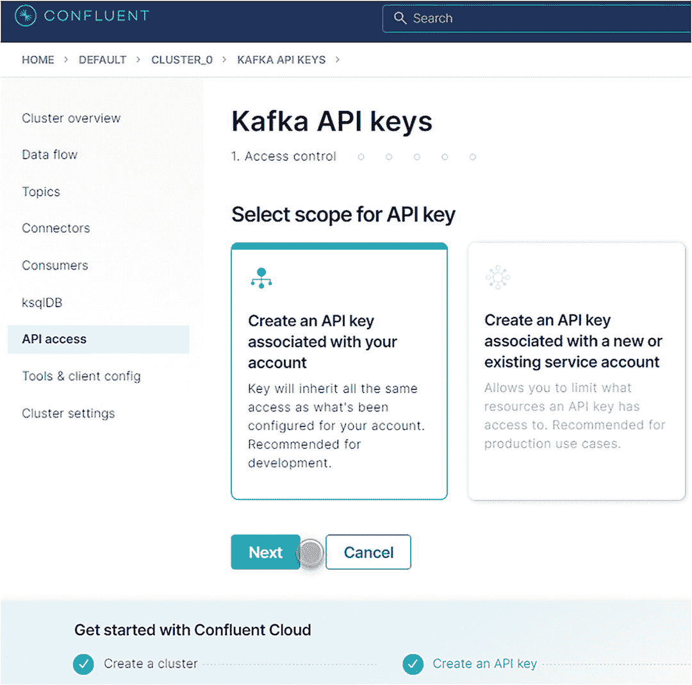

# 六、使用流可视化的事务性机器学习解决方案模板

本章将通过示例代码详细讨论构建 TML 解决方案所需的技术

*   预测和优化 11，000 家沃尔玛商场的客流量

*   预测有 10，000 笔银行事务的 50 个银行账户的异常情况

本章的目的是给你一个实际操作的演练，告诉你如何使用运行在 Google 云平台上的融合云，构建你自己的集成了 Apache Kafka 和数据流和 AutoML 的 TML 解决方案。您将了解核心库函数，以及如何使用 MAADSTML Python 库 <sup>[1](#Fn1)</sup> 调用它们，该库连接到 VIPER 和 Kafka 云，以执行非常高级的自动机器学习来进行预测和说明性分析，以及使用无监督机器学习进行异常检测。

您将熟悉构建和优化 TML 解决方案的常用步骤。解决方案模板是一种简单而强大的方法，可帮助您快速构建可根据自己的需求定制的 TML 解决方案。你不需要成为一个专业的程序员；初学者会发现用这个模板很容易构建 TML 解决方案。我们将使用 Python 作为编程语言来访问 VIPER，但是由于 VIPER 可以通过 REST 调用来访问，所以您可以使用任何您喜欢的编程语言，只要它支持 REST，这是当今使用的大多数编程语言。在本章结束时，您将使用领先的云平台和领先的 Kafka 技术来执行高级自动机器学习(大)数据流，同时使用高级可视化来获得流洞察。所有的例子和技术都可以在 GitHub 上找到。 <sup>[2](#Fn2)</sup> 下一节将概述 TML 解决方案模板及其相关技术。

## TML 解决方案模板概览

该模板可用于构建任何类型的可伸缩、无摩擦且有弹性的 TML 解决方案。如前所述，下面描述的所有组件(Kafka Cloud 除外)都可以从 GitHub 下载。主要模板组件如下:

*   Kafka Cloud——需要使用具有 SSL/TLS 安全性的融合云创建一个运行在 Amazon、Microsoft 或 Google 基础架构上的 Kafka 集群(代理)。

*   MAADS-VIPER(just VIPER)——运行于 Linux 的官方 Kafka 源汇连接器(也有 Windows 和 MacOS 版本)；它将执行 TML 解决方案所需的所有功能。这款 Kafka 连接器已经过 Confluent 的验证和测试。

*   环境文件–VIPER 环境文件，包含所有必需的凭据，包括令牌文件(admin.tok)和示例 SSL/TLS 安全证书:client.cer.pem、client.key.pem、server.cer.pem。

*   MAADS-HPDE(仅 HPDE)-在 Linux 中执行 TML 运行的 AutoML 技术(也提供 Windows 和 MacOS 版本)。

*   MAADS-VIPERviz(简称 viper viz)——可视化技术，用于可视化:HPDE 产生的异常检测、预测和优化结果。AiMS 也需要 VIPERviz。

*   AiMS–算法和见解管理系统仪表板，用于管理 TML 解决方案。

*   MAADSTML Python 库**、**Python<sup>T3】3IDE，以及 Jupyter 笔记本。</sup>

如前所述，在构建 TML 解决方案时，应仔细考虑 TML 解决方案的规模及其长期使用情况。尺寸将取决于

*   数据流数量(主题)

*   每个数据流中有多少个分区(主题)

*   有监督学习的训练数据集或无监督学习的对等组的数量

*   生成的算法、对等组、预测、最佳值和异常的数量

*   有多少消费者会从话题中消费

*   有多少制作人会制作主题

*   有多少卡夫卡经纪人，毒蛇，VIPERviz 和 HPDE 的例子

*   卡夫卡星团的大小

下一节将详细讨论每个模板组件。

### 模板组件详细信息

本节将详细介绍每个模板组件及其使用方法。它将为您提供运行构建 TML 解决方案所需的技术所需的所有必要的设置说明。每个组件都提供了为快速数据和快速机器学习而构建的高级功能。这对许多读者来说可能是新的，但是本章将尽力确保您理解每个组件及其用途。在您理解了组件之后，构建 TML 解决方案依赖于一些函数，如果使用得当，这些函数将允许您在非常短的时间内相对容易地构建非常大的解决方案。我们开始吧。

### 卡夫卡云通过汇流云

Kafka 是一个越来越流行、越来越强大的流处理软件平台。 <sup>[4](#Fn4)</sup> 许多主要的云供应商，如亚马逊、微软和谷歌，都提供在其基础设施中运行的 Kafka 应用服务。这使得构建**云不可知**的 TML 解决方案变得非常容易。VIPER 与运行在亚马逊 AWS、微软 Azure、谷歌云平台(GCP)或融合云上的 Kafka 兼容。

一个非常受欢迎的选择是使用由称为融合云(CC)的融合提供的 Kafka 托管服务。CC 允许 TML 开发者选择 Kafka 实例在他们选择的云供应商上运行。开发人员可以选择使用亚马逊、微软或谷歌云基础设施来创建 Kafka 集群。使用 CC 在您选择的云供应商上运行 Kafka 的优势有三点:

*   已经使用 Amazon、Microsoft 或 Google 的组织可以继续使用它们，而不会遇到任何业务中断；同样，也没有必要学习新技术。

*   对于 Kafka 的企业设置，您继续从亚马逊、微软或谷歌获得一个云账单 Confluent 作为您账单中的一个行项目。具体来说，每个云提供商都有融合云的 marketplace connectors，您可以使用它将基础架构计费与 CC 即服务提供商相集成。更多细节可以在汇合网站上找到。 <sup>[5](#Fn5)</sup>

*   不需要特殊的 Kafka 设置——CC 负责所有的设置细节，允许开发人员快速专注于构建他们的 TML 解决方案。

要开始构建您的 TML 解决方案，您首先需要创建一个 Kafka 集群。为此，请按照下列步骤操作:

1.  进入汇合登录<sup>[6](#Fn6)</sup>——如果您没有账户，请创建一个。如果您已经有帐户，请登录。

2.  合流会给你免费的云信用。这将允许您构建和测试合理规模的 TML 解决方案，并熟悉融合云。

3.  登录后，创建一个 Kafka 集群，如图 [6-1](#Fig1) 所示。


图 6-1

卡夫卡集群

然后，选择如图 [6-2](#Fig2) 所示的基本集群设置。


图 6-2

卡夫卡基本簇

点击开始配置后，您将看到如图 [6-3](#Fig3) 所示的屏幕。这就是你在亚马逊、谷歌或微软之间做出选择的地方。你可以选择任何你喜欢的人；但是，如果您的组织偏爱某个特定的云供应商，那么您应该选择那个供应商。


图 6-3

基础设施选择

一旦你选择了一个特定的云供应商，然后按继续。成功创建集群后，您将看到图 [6-4](#Fig4) 。


图 6-4

集群概述

创建集群后还有几个额外的步骤。要从 VIPER 和 HPDE 访问集群，我们需要创建一个 API 密钥。为此，点击**创建与您的账户**相关联的 API 密钥，如图 [6-5](#Fig5) 所示。



图 6-5

API 密钥

点击**下一个**后，会生成如图 [6-6](#Fig6) 所示的两个密钥:


图 6-6

密钥和秘密

*   钥匙

*   秘密

一定要记录下这个密钥和秘密。这些将是您的云凭据-出于安全原因，我已将我的密钥显示为灰色。

最后一步是进入**工具和客户端配置**，如图 [6-7](#Fig7) 所示。


图 6-7

工具和客户端配置

在图 [6-8](#Fig8) 中，向下滚动到 **Go** ，复制 *`bootstrap.servers`* 地址。


图 6-8

引导服务器

恭喜您，您已经成功在云端配置了您的 Kafka 集群。接下来，我们需要设置 MAADS-VIPER 环境信息。

### VIPER 环境文件

为了使用 VIPER，需要将有关 Kafka Cloud 的信息保存在一个名为 **VIPER 的文件中。ENV** 。该文件包含连接 Kafka Cloud 所需的所有必要信息。该文件的详细内容如表 [6-1](#Tab1) 所示。有几个配置参数可用。这些配置是为 VIPER、VIPERviz 和 HPDE 的每个实例设置的。所有敏感信息，如密码，将被隐藏后，文件保存和访问的毒蛇。如果用新信息更新该文件，必须重新启动 VIPER、VIPERviz 和 HPDE，新信息才能生效。在构建我们的 TML 解决方案时，我们将回头参考此表。这个文件由毒蛇，HPDE 和 VIPERviz 共享。

表 6-1

毒蛇。环境配置详细信息

<colgroup><col class="tcol1 align-left"> <col class="tcol2 align-left"></colgroup> 
| 

结构参数

 | 

描述

 |
| --- | --- |
| 卡夫卡 _ 广告 _ 主机 _ 名称 | Kafka 服务器属性中公布的主机名。这是可选的。 |
| 卡夫卡 _ 动物园管理员 _ 连接 | Zookeeper 主机名和端口。这是可选的。 |
| KAFKA _ 连接 _ 引导程序 _ 服务器 | Kafka 引导服务器–用逗号分隔多个服务器。这是必需的。 |
| 卡夫卡 _ 根 | 卡夫卡根文件夹。如果使用卡夫卡云，只需输入“卡夫卡”。这是可选的。 |
| HPDE 服务器 | **自动机器学习**需要 HPDE(边缘设备的超预测)。指定安装它的主机。这是可选的。 |
| HPDE_PORT 函数 | HPDE 监听端口。这是可选的。 |
| SSL _ 客户端 _ 证书 _ 文件 | 如果 Kafka 启用了 SSL/TLS，则需要 SSL 证书文件。这是必需的。 |
| SSL _ 客户端 _ 密钥 _ 文件 | 如果 Kafka 启用了 SSL/TLS，则需要 SSL 证书密钥存储文件。这是必需的。 |
| SSL _ 服务器 _ 证书 _ 文件 | 如果 Kafka 启用了 SSL/TLS，则需要 SSL 证书服务器密钥文件。这是必需的。 |
| 云 _ 用户名 | SASL _ 平原用户名连接到汇合云。这是必需的。 |
| 云 _ 密码 | SASL _ 连接到融合云的普通密码。这是必需的。 |
| hmailserver 服务器 | 用于发送电子邮件的 SMTP 邮件服务器主机名。如果使用 **AiMS Dashboard** 来监控 Kafka 中的算法，这是需要的。这是可选的。 |
| 邮件端口 | 用于发送电子邮件的 SMTP 邮件服务器端口。如果使用 **AiMS Dashboard** 来监控 Kafka 中的算法，这是需要的。这是可选的。 |
| 弗多德尔 | 发件人地址放入电子邮件。如果使用 **AiMS Dashboard** 来监控 Kafka 中的算法，这是需要的。这是可选的。 |
| SMTP _ 用户名 | SMTP 用户名。如果使用 **AiMS Dashboard** 来监控 Kafka 中的算法，这是需要的。这是可选的。 |
| SMTP _ 密码 | SMTP 密码。如果使用 **AiMS Dashboard** 来监控 Kafka 中的算法并打开警报，则需要这样做。这是可选的。 |
| SMTP_SSLTLS | 邮件服务器 SSL/TLS 已启用:真或假。如果使用 **AiMS Dashboard** 来监控 Kafka 中的算法并打开警报，则需要这样做。这是可选的。 |
| 服务 _ 用户名 | 如果使用 ServiceNow，请指定 ServiceNow 网页登录用户名。如果使用 **AiMS Dashboard** 来监控 Kafka 中的算法并打开警报，则需要这样做。这是可选的。 |
| 服务 _ 密码 | 如果使用 ServiceNow，请指定 ServiceNow 网页登录密码。如果使用 **AiMS Dashboard** 来监控 Kafka 中的算法并打开警报，则需要这样做。这是可选的。 |
| 服务 _ 受托人 | 如果使用 ServiceNow，请指定要向其分配 ServiceNow 票证的 ServiceNow 名称。如果使用 **AiMS 仪表板**并且警报开启，则需要这样做。这是可选的。 |
| 服务 _ 表单 _ 字段 | `{"key1":"Assignedto","key2":"LastReadofTopic","key3":"Consumerid", "key4":"Brokerhost","key5":"Brokerport","key6":"Companyname", "key7":"Contactemail","key8":"Contactname","key9":"Description", "key10":"Location","key11":"Topic","key12":"Priority","key13":"Producerid","key14":"LastWritetoTopic"}`用户应该用 ServiceNow 表单中的字段名称替换“Key”值。VIPER 将在向 ServiceNow 提交事件时更新关键值。如果使用 **AiMS 仪表板**并且警报开启，则需要这样做。这是可选的。 |
| SERVICE _ content type = application/JSON | ServiceNow 网页内容类型。这个可以改，但是**应用/json** 应该没问题。如果使用 **AiMS 仪表板**并且警报开启，则需要这样做。这是可选的。 |
| 轮询 _ 警报 | 以分钟为单位轮询警报。如果使用 **AiMS 仪表板**并且警报开启，则需要这样做。VIPER 将轮询警报，并在几分钟后等待下一轮轮询。这是可选的。 |
| 公司名称 | 指定公司名称。这在从 AiMS 仪表板发送电子邮件时使用。这是可选的。 |

对于本书中的例子，在你的蝰蛇。ENV 文件，进行以下更新(您的信息当然会与这里显示的不同；我已经把我的卡夫卡集群地址):

*   KAFKA _ CONNECT _ BOOTSTRAP _ SERVERS = PKC-419 Q3 . us-east 4 . GCP . confluent . cloud:9092<sup>[7](#Fn7)</sup>

*   云用户名=[Key]
    1.  用图 [6-6](#Fig6) 中复制的钥匙替换【钥匙】。

*   CLOUD _ PASSWORD =[秘密]
    1.  用图 [6-6](#Fig6) 中复制的秘密替换【秘密】。

因为我们正在加密进出 Kafka Cloud 的流量，所以我们需要使用 SSL/TLS 设置双向加密。为此，我们需要将三个文件转换为 PEM 格式。 <sup>[8](#Fn8)</sup> (注意例子。GitHub 上的 VIPER、VIPERviz 和 HPDE 发行版文件中都提供了 PEM 文件，但这些都是用于测试的；它们应该被你的官方文件证书所取代。)

*   客户端证书文件

*   客户端密钥文件

*   服务器证书文件

请注意，您可能需要事先准备好以下文件 <sup>[9](#Fn9)</sup> :

*   kafka.server.truststore.jks

*   kafka.server.keystore.jks

以下是执行此操作的常见步骤:

*   ***【key tool】***【import eystore】-src keystore*【Kaka . server . keystore . jks】*-deststore client . p12-deststore type pkcs12

*   ***$ OpenSSL**T3】pkcs12-in client . p12-no keys-out client . cer . PEM*

*   ***$ OpenSSL**T3】pkcs12-in client . p12-nodes-nocerts-out client . key . PEM*
    *   **输出:** client.cer.pem

    *   **输出:** client.key.pem

1.  接下来，转换客户端密钥库:

*   **$ keytool**-import keystore-srckeystore Kafka . server . trust store . jks-dest keystore server . p12-dest storetype PKCS12

*   **$ OpenSSL**pkcs12-in server . p12-no keys-out server . cer . PEM
    *   **输出:** server.cer.pem

1.  首先，使用 keytools 和 openssl 提取证书颁发机构(CA ):

然后，您将更新 VIPER。ENV 文件与 PEM 文件的完整路径如下: <sup>[10](#Fn10)</sup>

*   SSL _ CLIENT _ CERT _ FILE = c:/viper/CLIENT . cer . PEM

*   SSL _ CLIENT _ KEY _ FILE = c:/viper/CLIENT . KEY . PEM

*   SSL _ SERVER _ CERT _ FILE = c:/viper/SERVER . cer . PEM

如果一切都做得正确，VIPER、HPDE 和 VIPERviz 将能够使用 SSL/TLS 加密安全地与 Kafka 通信。下一节将讨论如何设置这些技术。

## VIPER、VIPERviz 和 HPDE 设置

VIPER、VIPERviz 和 HPDE 可以安装在 Windows、Linux 或 MacOS 操作系统上。 <sup>[11](#Fn11)</sup> 不需要额外的软件组件或数据库。这些技术都监听主机 IP 地址和端口号上的连接。这意味着你可以使用 REST API 和 TML Python 库 <sup>[12](#Fn12)</sup> (我们将在本章使用这个库)来连接它们。解决方案架构师和开发人员还会发现，使用这些技术很容易，例如支持特定 TML 解决方案的*微服务*，这使得创建超大型 TML 解决方案以减少负载变得更加容易。所有这些技术都与作为数据主干的 Apache Kafka 紧密集成。这使得开发人员可以构建 TML 解决方案，而不用考虑消耗的数据流、算法和洞察的数量。此外，这些技术不需要互联网连接，因为 Kafka 也可以在本地运行(我们将在使用 Google 云平台的融合云上运行的云中使用 Kafka)。但是，如果开发生产就绪的 TML 解决方案，Kafka Cloud 是首选。

VIPER 已经通过 Confluent 用 Apache Kafka 验证测试过了，可以从他们的网站 <sup>[13](#Fn13)</sup> 或者 GitHub 下载。 <sup>[14](#Fn14)</sup> 只需解压文件，并按照软件包中提供的安装说明进行操作。所有最新版本的技术都可以从 GitHub 网站下载。当启动 VIPER、VIPERviz 或 HPDE 时，用户可以在命令行键入“Help ”,帮助屏幕将详细显示所有必要的信息。具体来说，对于想要通过 REST API 连接的用户，所有的 REST 命令都将在这个屏幕中提供。对于我们的例子，我们只需要连接到 VIPER，VIPER 将管理到 HPDE 的连接。

如果使用 MAADSTML Python 库，用户可以在 Jupyter Notebook 中或者通过下载 Python 来编写 Python 代码。<sup>[15](#Fn15)</sup>Python 和 Jupyter 都很受欢迎，有很多资源可供你学习这些技术。其他问题请发送电子邮件至 info@otics.ca，或者，您可以加入 LinkedIn 上的事务性机器学习小组。 <sup>[16](#Fn16)</sup> 下一节讨论如何创建主题和连接数据流。

### 卡夫卡主题和数据流

卡夫卡和 TML 解决方案的一个基本部分是主题和数据流。我们已经在前面的章节中讨论了主题和数据流。本节将讨论我们如何创建和使用主题(或数据流)来创建训练数据集。首先，确保您已经下载并安装了 Python 编程语言。然后，打开 Python IDE，或者如果你使用 Jupyter Notebook，那么在 Windows、Linux 或 MacOS 中通过调用 ***jupyter notebook*** 来启动 Jupyter。我们将使用 Windows 操作系统作为例子。然后，通过在命令提示符 中调用 ***pip install maadstml 来安装 MAADSTML Python 库。你完了。然后，在 Kafka 中创建您的主题，您将使用函数***vipercreatetopic***。该 Python 函数将需要以下输入参数: <sup>[17](#Fn17)</sup>***

```py
vipercreatetopic(vipertoken,host,port,topic,companyname,contactname,contactemail,location, description,enabletls=1, brokerhost='',brokerport=-999, numpartitions=2, replication=3, microserviceid='')

```

在哪里

*   VIPER token–这个令牌包含在发行版 VIPER 文件中。

*   主机–这是 VIPER 的主机地址。

*   端口–这是 VIPER 监听连接的端口。

*   主题–这是您想要创建的主题。您可以用逗号分隔多个主题。

*   公司名称–这是您公司的名称。

*   Contact name–主题创建者的联系人姓名。

*   联系人电子邮件–创建主题的人的电子邮件。

*   位置–创建主题的人的位置。

*   描述–主题的描述。

*   enable TLS–如果在 Kafka 中启用了 SSL/TLS，则将此项设置为 1；默认情况下，这在 Kafka Cloud 中已经启用。

*   broker host–指定 Kafka 代理主机。这是可选的；如果留空，那么 VIPER 将使用 KAFKA _ CONNECT _ BOOTSTRAP _ SERVERS 中的值。

*   broker port–指定 Kafka 代理端口。这是可选的；如果留空，那么 VIPER 将使用 KAFKA _ CONNECT _ BOOTSTRAP _ SERVERS 中的端口值。

*   num partitions–指定主题中要创建的分区数量。虽然默认值设置为 2，但如果希望使用该主题的人数增加，您可能需要随着时间的推移增加该值，以确保信息传递的并行处理。例如，如果您有 10 个人想要使用这个主题，那么可以考虑将分区设置为 10。

*   复制–这是复制因子，它告诉 Kafka 要为故障转移复制主题多少次。Kafka 的服务器端最小值是 3。

*   microservice id–如果使用反向代理进行减载，则可以在此指定代理的名称。

有些人可能会问为什么需要 companyname、contactname 等等。这些将有助于管理 AiMS 中的主题。如果您创建了数千个主题，能够识别谁创建了主题以及它们的意义将有助于改进主题的管理(即 TML 解决方案)，尤其是在 TML 解决方案出现问题的情况下。您可能会发现将业务/产品名称放在公司名称中非常有用，这样可以使公司 it 部门更好地跟踪 TML 解决方案。一旦创建了主题，该函数将返回一个 ***producerid*** 。将需要这个 producerid 来为主题生成数据。每个主题都会有一个唯一的 producerid。

为了给题目产生数据，我们将使用函数***viperproducetotopic***。该 Python 函数将需要以下输入参数:

```py
viperproducetotopic(vipertoken,host,port,topic,producerid,enabletls=1,delay=100,inputdata='',maadsalgokey='',maadstoken='',getoptimal=0,externalprediction='',brokerhost='',brokerport=-999,microserviceid='')

```

在哪里

*   VIPER token–这个令牌包含在发行版 VIPER 文件中。

*   主机–这是 VIPER 的主机地址。

*   端口–这是 VIPER 监听连接的端口。

*   主题–这是你想写的主题。您可以用逗号分隔多个主题。如果使用多个主题，必须具有相同数量的生产者 id(用逗号分隔)和相同数量的外部预测(用逗号分隔)。一次产生多个主题便于同步用于机器学习的流的定时，并加速大量主题的主题创建。

*   producerid–这是从 ***vipercreatetopic*** 返回的 producer id。

*   enable TLS–如果在 Kafka 中启用了 SSL/TLS，则将此项设置为 1；默认情况下，这在 Kafka Cloud 中已经启用。

*   delay–这个 delay 参数是 VIPER 等待 Kafka 以确认消息已写入 Kafka 主题的方式进行响应的毫秒数。

*   input data–对于 TML，这可以忽略。

*   maadsalgokey<sup>[18](#Fn18)</sup>——对于 TML 来说，这个可以忽略。

*   马斯托克——对 TML 来说，这可以忽略不计。

*   get optimal–对于 TML 来说，这可以忽略不计。

*   external prediction–在此参数中输入一个值以写入主题。

*   broker host–指定 Kafka 代理主机。这是可选的；如果留空，那么 VIPER 将使用 KAFKA _ CONNECT _ BOOTSTRAP _ SERVERS 中的值。

*   broker port–指定 Kafka 代理端口。这是可选的；如果留空，那么 VIPER 将使用 KAFKA _ CONNECT _ BOOTSTRAP _ SERVERS 中的端口值。

*   微服务 id–如果使用反向代理进行减载

您可以在一个循环中使用前面的函数向 Kafka 主题连续写入数据。您可以并行产生几个主题，这仅仅取决于您如何构建您的解决方案以及 VIPER 运行的实例数量。该函数将返回一个 JSON 对象，其中包含写入值的详细信息、Kafka 中值的键，包括写入的分区、偏移量和时间戳。在 Kafka 中，每个数据点都可以通过以下方式进行唯一标识

*   主题

*   划分

*   抵消

Kafka 使用唯一的密钥来优化数据存储。对于非常大的数据集，这对于从主题中快速引用和使用数据非常重要。应该仔细选择主题的名称，因为它们将识别在构建训练数据集时需要的因变量和自变量流。一个简单的约定是使用[company id]-[projectid]-[解决方案名称或 id]-[输入或输出流]。例如，otics-IOT-iotfailureprediction-sensor readings-input 和 otics-IOT-IOT failure prediction-sensor readings-predictions-output 将表示 TML 解决方案 IOT failure prediction 的输入和输出流。这样，用户需要订阅什么主题来消费和可视化就一目了然了。不管你使用什么惯例，它都应该是一致的。

虽然 Kafka 在使用分区存储大数据方面非常聪明，但这也使数据检索变得复杂。具体来说，Kafka 将选择它想要写入哪个分区来优化存储。检索数据时的挑战是您需要做额外的处理来确定哪些数据是最新的**数据。例如，如果一个主题有三十(30)个分区，Kafka 会将您的数据写入其中的任何一个分区。在消耗这些数据时，你不会知道哪个分区包含了 ***最新的*** 数据。幸运的是，您可以告诉 VIPER 使用值为-1 的 partition 关键字在每个分区中搜索最新的数据。因为 Kafka 中存储的每个值都有一个日期和时间值(人类可读的日期/时间以及 Unix 时间)，所以您可以检查每个值的日期和时间戳，以确定哪个是最新的*值。虽然在许多情况下这不是问题，但在某些情况下，您可能想知道主题中存储的最新值。***

 ***为了动态构建训练数据集**，我们将使用以下三个函数:**

 ***   vipercreatejointopicstreams

*   viperproducetotopicstream

*   vipercreatetrainingdata

首先，**vipercreatejointopicstreams**定义如下:

```py
vipercreatejointopicstreams(vipertoken,host,port,topic,topicstojoin,companyname,contactname,contactemail, description,location,enabletls=0,brokerhost='',brokerport=-999, replication=1, numpartitions=1, microserviceid='')

```

在哪里

*   VIPER token–这个令牌包含在发行版 VIPER 文件中。

*   主机–这是 VIPER 的主机地址。

*   端口–这是 VIPER 监听连接的端口。

*   主题–这是将为合并的流创建的主题。

*   topics tojoin–这是您想要加入的数据流(即，因变量流和自变量流)的列表。这些数据流应该存在。用逗号分隔多个流。

*   如前所述，为该主题指定 companyname、contactname、contactemail、description、location、enabletls、brokerhost、brokerport、replication、numpartitions 和 microserviceid。请注意，有些字段是可选的。

这个函数将返回一个 ***producerid*** 来写这个题目。这个函数充当指向将要连接的主题的指针。这个指针将在下一个向这个流产生数据的函数中使用。具体来说，一旦连接的主题流被创建，我们现在就可以产生这个流。为此，我们使用函数***viperproducetotopicstream***:

*   VIPER token–这个令牌包含在发行版 VIPER 文件中。

*   主机–这是 VIPER 的主机地址。

*   端口–这是 VIPER 监听连接的端口。

*   主题——这是包含来自合并流的所有数据的主题。

*   producerid–这是从***vipercreatejointopicstreams***返回的 producer id。

*   offset–这是数据从每个数据流开始的位置。具体来说，如果 offset=0，那么这个函数将从它加入的每个流的开头开始。如果 offset=-1，它将从最新的值开始。此参数有助于避免检索大量数据，因为这会影响 TML 解决方案的性能。

*   maxrows–这是到 ***回滚*** 流的偏移量。对于监督学习模型，每个流中必须至少有 30 个数据点。

*   enabletls、delay、brokerhost、brokerport 和 microserviceid 如前面所定义。

```py
viperproducetotopicstream(vipertoken,host,port,topic,producerid,offset,maxrows,enabletls,delay, brokerhost='', brokerport=-999, microserviceid='')

```

该函数 ***同时*** 从所有数据流中消费数据，并将其写入连接的主题流。回想一下，要加入的数据流在参数:***topic tojoin***中。读者可以利用这个强大的功能连续读取多个数据流，并实时连接它们。 ***maxrows*** 是回滚流的偏移量。具体来说，当 VIPER 同时从每个流中检索数据时，它使用 maxrows 偏移量回滚每个流，然后合并流主题中的所有数据流。该功能将执行以下步骤:

1.  使用 maxrows 确保每个流具有相同数量的值。例如，连接的流可能具有不同数量的数据点；对于机器学习，我们必须在每个流中拥有相同数量的数据。

2.  修剪数据流，以确保它们都具有相同的数据量。例如，如果您加入三个流(流 1 = 100 个数据点，流 2 = 150 个数据点，流 3 = 50 个数据点)，则此函数将采用编号最小的流(流 3)，并将流 1 和流 2 删减为 50。这确保了所有数据流最多有 50 个数据点。

3.  为新主题生成新的、经过修剪的数据流，以构建训练数据集。

如果 offset=-1，VIPER 将回滚流，这意味着如果 offset=-1，您将告诉 VIPER 转到每个流的**(技术上是流的结尾)，然后将流回滚到 rollback=lastoffset-maxrows 确定的偏移量。这个包含整合数据的流将用于构建训练数据集。**

 **在创建训练数据集之前，我们需要订阅刚刚创建的主题。为此，调用函数**vipersubscribeconsumer**:<sup>[19](#Fn19)</sup>

```py
vipersubscribeconsumer(vipertoken,host,port,topic,companyname,contactname,contactemail, location,description, brokerhost='', brokerport=-999,groupid='',microserviceid='')

```

在哪里

*   VIPER token–这个令牌包含在发行版 VIPER 文件中。

*   主机–这是 VIPER 的主机地址。

*   端口–这是 VIPER 监听连接的端口。

*   主题–要订阅的主题的名称

*   所有其他参数与之前类似。

该函数将返回一个消费者 id:**。主题的每个消费者将使用一个唯一的消费者 ID。消费者 ID 允许 AiMS 跟踪和控制每个消费者，并记录读取的字节数。我们还可以通过调用函数 ***vipercreatetopic*** 为我们的训练数据集创建一个主题，该函数将返回 ***producerid*** 。我们将需要 producerid 和 consumerid 来创建我们的训练数据集。**

 **我们现在可以通过调用***vipercreatetrainingdata***来最终创建我们的训练数据集:

*   VIPER token–这个令牌包含在发行版 VIPER 文件中。

*   主机–这是 VIPER 的主机地址。

*   端口–这是 VIPER 监听连接的端口。

*   consume from–这是我们使用函数***【viperproducetotopicstream】***创建和生成连接流数据的主题。我们还通过调用***vipersubscribeconsumer***订阅了该主题，并将使用返回的消费 id。

*   produce to–这是我们将生成训练数据集的主题，也是我们使用函数 ***vipercreatetopic*** 创建的主题。

*   dependent variable–因变量流的名称。这应该与*vipercreatejointopicstreams*中的因变量相匹配。

*   独立变量–独立变量流的名称。这应该与*vipercreatejointopicstreams*中的独立变量相匹配。

*   消费者 id–这是来自主题的*消费者的消费者 id。*

*   producerid–这是*producer to*主题的 producer id。

*   偏移–这是从主题的*消费中开始读取的偏移或位置。*

*   公司名称–培训数据集所有者的公司名称。

*   partition–这是由***viperproducetotopicstream***生成的数据的分区位置。这对于确保您使用正确的数据来创建训练数据集非常重要。

*   enabletls 和 delay 如前所述。

*   brokerhost、brokerport 和 microserviceid 和以前一样。

```py
vipercreatetrainingdata(vipertoken,host,port,consumefrom,produceto,dependentvariable, independentvariables, consumerid, producerid,companyname,partition=-1, enabletls=0,delay=100, brokerhost='',brokerport=-999,microserviceid='')

```

训练数据集将存储在 Kafka 中，在 ***Produceto*** 中指定的主题中。我们最终准备调用 HPDE 在监督学习的训练数据集上执行 TML。为此，我们需要调用***viperhpdetraining***:

```py
viperhpdetraining(vipertoken,host,port,consumefrom,produceto,companyname,consumerid,producerid, hpdehost, viperconfigfile, enabletls=1,partition=-1,deploy=0, modelruns=50, modelsearchtuner=80, hpdeport=-999,offset=-1, islogistic=0, brokerhost='', brokerport=-999,timeout=120,microserviceid='')

```

在哪里

*   vipertoken、主机和端口与之前一样是 VIPER 连接的详细信息。

*   consume from——是我们在参数 ***Produceto*** 中的函数***vipercreatetrainingdata***中生成训练数据集的 Kafka 主题名称。您应该已经订阅了此主题并保存了消费 id。

*   produce to–这是 HPDE 将存储最佳算法细节的主题名称。你应该已经创建了这个主题并保存了 ***producerid*** 。

*   公司名称–指定您的公司名称。

*   consume id–参数 ***consumefrom*** 中主题的 consume id。

*   Producerid–主题 ***的 producer id 到*** 的主题。

*   hpdehost–HPDE 的主机地址。

*   惠普尔德沃——HPDE 港口正在监听。

*   VIPER confile–毒蛇的完整路径。磁盘上的 ENV 文件。

*   enable TLS–如果 SSL/TLS 在 Kafka 中未启用，则设置为 1 或 0。

*   partition–这是由***vipercreatetrainingdata***返回的训练数据集的分区号。此分区确保您使用正确的训练数据集。

*   部署–如果为 1，那么 HPDE 将把算法保存在**部署**文件夹中。如果为 0，它将仅将其保存到模型文件夹中。如果您想测试算法，但还不想在生产中使用它，这是很有用的。

*   模型运行——HPDE 为找到最佳算法而运行的模型数量。数字越大，HPDE 找到最佳算法的时间就越长。

*   modelsearchtuner–介于 0 和 100 之间的整数。该变量将尝试微调模型搜索空间。一个接近 0 的数字意味着你会有很多模型，但是它们的质量可能很低；接近 100 的数字(默认值=80)意味着您将拥有更少的模型，但是它们的质量会更高。

*   offset–训练数据集的偏移量位置。这通常设置为-1，以选择最后偏移中的最新训练数据集。

*   is logistic–如果因变量是二元变量，则将该参数设置为 1，否则将连续因变量设置为 0。

*   Brokerhost、brokerport 和 microserviceid 和以前一样。

*   超时–这是 VIPER 等待 HPDE 响应的秒数。

如果 HPDE 成功响应，那么恭喜你，你已经使用了 TML 的核心功能。我们将把这些函数应用到一个实际的例子中，让您更好地理解这些函数可以应用的用例。训练函数将返回分别使用**和***viperhpdepression***函数进行预测或优化所需的所有信息。清单 [6-1](#PC8) 中显示了一个 TML 输出示例。**

```py
{
     "Algokey": "ConsumerId-TYq4wDnyS5pVqzImGQIwVQzGD1LrZ0_json",
     "Algo": "ConsumerId-TYq4wDnyS5pVqzImGQIwVQzGD1LrZ0_jsonrdg",
     "DependentVariable": "viperdependentvariable",
     "Forecastaccuracy": .80,
     "Filename": "./hpdedata/ConsumerId-TYq4wDnyS5pVqzImGQIwVQzGD1LrZ0.csv",
     "Fieldnames": "Date,viperindependentvariable1,viperindependentvariable2",
     "TestResultsFile": "./models/ConsumerId-TYq4wDnyS5pVqzImGQIwVQzGD1LrZ0_json_predictions.csv",
     "Deployed": 1,
     "DeployedTo": "Local Machine Deploy Folder",
     "Created": "2021-01-14T21:15:58.3153622-05:00",
     "ConsumeridFrom": "ConsumerId-TYq4wDnyS5pVqzImGQIwVQzGD1LrZ0",
     "Producerid": "ProducerId-fuj1ygdy-E5noyO2CtKjDN0S6UeaB4",
     "ConsumingFrom": "trainingdata2",
     "ProduceTo": "trainined-params",
     "Companyname": "OTICS",
     "BrokerhostPort": "pkc-419q3.us-east4.gcp.confluent.cloud:9092",
     "Islogistic": 0,
     "HPDEHOST": "192.168.0.13:8001",
     "HPDEMACHINENAME": "Guru",
     "Modelruns": 10,
"Modelsearchtuner": 80,
     "TrainingData_Partition": 0,
     "BytesWritten": 944,
     "kafkakey": "EkFXhJJ3fvTpquCyXEgUq3HZ-CsNnT",
     "Partition": 0,
     "Offset": 4
}

Listing 6-1Example TML Output

```

示例输出是 JSON 格式的数据。它显示了您需要用于预测和优化的所有重要信息的键和值。该 JSON 输出在表 [6-2](#Tab2) 中描述。

表 6-2

JSON 输出键的描述

<colgroup><col class="tcol1 align-left"> <col class="tcol2 align-left"></colgroup> 
| 

钥匙

 | 

描述

 |
| --- | --- |
| **藻类生物** | 由 HPDE 生成的用于标识算法的唯一密钥。 |
| 某物 | 最适合数据的算法的名称。 |
| **相依性变数** | 你为 TML 模型选择的因变量流。 |
| **预测准确度** | 模型的预测精度，以百分比表示。预测精度是 MAPE(平均绝对百分比误差)，通过将模型预测与测试数据集进行比较来确定。 |
| **文件名** | 定型数据集的物理文件。如果您想要审核用于确定最佳算法的(训练)数据，这将非常有用。 |
| **字段名** | TML 模型中使用的独立变量流。一个日期变量作为占位符被添加，但是在估计中当然被忽略。 |
| **测试结果筛选** | 这是 MAPE 计算结果的物理文件。 |
| **展开** | 如果为 1，则将此算法部署到/deploy 文件夹。 |
| **部署到** | 存储算法的位置。 |
| **已创建** | 估计模型的日期和时间。 |
| **来自**的消费 | 您在 Kafka 中消费的主题的消费者 ID。 |
| 生产 | 您在 Kafka 中制作的主题的制作者 ID。 |
| **消费罗姆** | 包含 HPDE 机器学习训练数据集的 Kafka 主题。 |
| **生产到** | 算法产生的卡夫卡主题。 |
| **Companyname** | 你的公司名称。 |
| **代理主机端口** | Kafka broker 主机和端口——你可以在亚马逊 AWS、微软、谷歌云平台或融合云上使用 Kafka。对于这个例子，我们使用了融合云的 Google 云平台。 |
| **是逻辑的** | 如果 1，模型是逻辑的(有分类因变量)；否则，因变量是连续的。 |
| **hpdehorst** | HPDE 主机和端口。 |
| **hpdemachin name** | 运行 HPDE 的机器。 |
| 模型运行 | HPDE 将迭代的模型数量。这个数字越高，HPDE 就越强烈地寻找最适合数据的最佳算法或模型。 |
| 模型搜索调谐器 | 模型搜索调谐器的值。 |
| **TrainingData_Partition** | 用于训练数据集的数据分区(由***vipercreatetrainingdata***生成)。这对于审核训练数据集很有用。 |
| 字节移动 | 在 ***produceto*** 键中写入 Kafka 主题的字节数。 |
| 卡夫卡 | 卡夫卡把*中的话题与**中的**话题联系起来。* |
| **分区** | 卡夫卡选择了分区号来存储 ***中的数据，产生**到*的主题。这对于预测/优化非常重要，以确保您在 Kafka 分区中拥有算法的最新位置。 |
| **偏移** | 偏移号表明卡夫卡已经选择了将数据存储在 ***produceto*** topic 中。 |

如果不用于预测或说明性分析，该算法是无用的。为了使用它进行预测分析，我们需要调用函数***viperhpdeprect***:

```py
viperhpdepredict(vipertoken,host,port,consumefrom,produceto,companyname,consumerid,producerid, hpdehost,inputdata, algokey='',partition=-1,offset=-1,enabletls=1, delay=1000, hpdeport=-999,brokerhost='', brokerport=-999, timeout=120, usedeploy=0,microserviceid='')

```

在哪里

*   vipertoken、主机和端口–是 VIPER 连接的详细信息。

*   consume from–是函数***viper 训练*** 中 ***produceto*** 参数中的主题名称。您应该已经订阅了此主题并保存了消费 id。

*   produce to–是要写入预测值的主题名称。您应该已经创建了这个主题并保存了 producerid。

*   公司名称–您的公司名称。

*   consume id–参数 ***consumefrom*** 中主题的 consume id。

*   Producerid–参数***producer to***中主题的 producer id。

*   HPDE 的主机地址。

*   HP export–HPDE 的港口地址。

*   input data–这是独立变量的新原始数据。具体来说，这些是算法进行预测所需的每个独立变量的值。值的排序必须与最佳算法信息中独立变量的排序相匹配。或者，您可以将您生成的数据流附加到***viperproducetotopicstream***中；VIPER 将不断读取这个流并生成预测。

*   algo key–这是标识最优算法的键，它将由 JSON 对象中的***viperhpdetraining***返回。

*   分区——这是包含最新训练算法的 Kafka 分区；通常，当旧算法被覆盖时，您可以将其设置为-1。

*   偏移–这是最佳算法信息的偏移位置。

*   Enabletls、delay、brokerhost、brokerport、timeout 和 microservice id——前面已经介绍过了。

*   usedeploy–设置为 1，如果你想使用**部署**中的算法(算法必须存在)；否则，如果为 0，它将使用模型文件夹中的算法。

如果该函数成功执行，那么您已经使用新的流数据通过 TML 算法做出了预测。可以重复调用该函数来生成预测。清单 [6-2](#PC10) 中显示了一个输出示例。

```py
{
     "Hyperprediction": 2.935,
     "Algokey": "ConsumerId-n1NiZUObhCOpIEhAn3q1df3orJpcqy_json",
     "Algo": "ConsumerId-n1NiZUObhCOpIEhAn3q1df3orJpcqy_jsonrdg",
     "Usedeploy": 1,
     "Created": "2021-01-15T16:01:06.9048943-05:00",
     "Unixtime": 1610744466906892800,
     "ConsumeridHPDE": "ConsumerId-c2hTW0ANA7DPR-Y6hN6ot2AggzuPfv",
     "Producerid": "ProducerId-HWWwbtbXSykcitWtfN3vY3epHv5OLD",
     "HPDEHOST": "http://192.168.0.13",
     "HPDEPORT": 8001,
     "Consumefrom": "trainined-params",
     "Produceto": "hyper-predictions",
     "Brokerhost": "pkc-419q3.us-east4.gcp.confluent.cloud",
     "Brokerport": 9092,
     "kafkakey": "4sW8XUFJcGajzBMT3vlxqU0NkwqzQC",
     "Inputdata": "146,268",
     "Fieldnames": "Date,viperindependentvariable1,viperindependentvariable2",
     "DependentVariable": "viperdependentvariable",
     "Partition": 2,
     "Offset": 11
}

Listing 6-2Prediction JSON Output

```

表 [6-3](#Tab3) 描述了清单 [6-2](#PC10) 中的各个按键。

表 6-3

TML 预测 JSON 键的描述

<colgroup><col class="tcol1 align-left"> <col class="tcol2 align-left"></colgroup> 
| 

钥匙

 | 

描述

 |
| --- | --- |
| **预测过度** | 来自 TML 算法的预测，使用流输入数据。 |
| **藻类生物** | 用于进行预测的算法的键。 |
| 某物 | 用于进行预测的算法。该算法物理上位于磁盘上并经过加密。 |
| **使用部署** | 如果为 1，则 HPDE 使用/deploy 文件夹中的算法；否则，它使用测试文件夹(即/Models 文件夹)中的算法。 |
| **已创建** | 算法的创建日期和时间。 |
| **Unixtime** | Unix 时代。 |
| **消费性帮助** | HPDE 从中读取以检索算法的主题的使用者 ID。 |
| 生产 | HPDE 向其写入结果的主题的生产者 ID。 |
| **hpdehorst** | HPDE 主机 IP 地址。 |
| **hpsport** | HPDE 端口。 |
| **消费自** | Kafka 主题包含用于超预测的算法。 |
| **生产到** | 卡夫卡的话题产生超预期。 |
| **经纪人主持人** | 卡夫卡经纪人主持人。 |
| **代理端口** | 卡夫卡经纪人港。 |
| 卡夫卡 | 卡夫卡的关键与预言有关。 |
| **输入数据** | 独立变量的值——按照**字段名**中所示的正确顺序(不包括日期)。 |
| **字段名** | TML 模型中的字段名称。 |
| **相依性变数** | TML 模型的因变量。 |
| **分区** | 包含超预测的 Kafka 划分。 |
| **偏移** | Kafka Offset–指定超预测的偏移量。 |

我们甚至可以更进一步，通过最大化或最小化目标函数，对最优算法进行优化，以找到独立变量的最优值。例如，为了做到这一点，我们调用***viperhpdeoptimize***:

```py
viperhpdeoptimize(vipertoken,host,port,consumefrom,produceto,companyname,consumerid,producerid, hpdehost,partition=-1,offset=-1,enabletls=0, delay=100,hpdeport=-999,usedeploy=0, ismin=1,constraints='best', stretchbounds=20, constrainttype=1,epsilon=10,brokerhost='',brokerport=-999, timeout=120,microserviceid='')

```

在哪里

*   Vipertoken、主机和端口–是 VIPER 连接的详细信息。

*   consume from–是函数***viper 训练*** 中 ***produceto*** 参数中的主题名称。

*   produce to–是要保存最佳值的主题名称。

*   公司名称–是您公司的名称。

*   consume id——是 ***consumefrom*** 中题目的 consume id。

*   Producerid——是 ***到*** 中题目的 producer id。

*   Hpdehost、HP dexpress–是 HPDE 连接的详细信息。

*   分区、偏移–是最佳算法信息的位置。

*   Enabletls、delay、brokerhost、brokerport、timeout、microservice id–如前所述。

*   ismin–如果要最小化因变量，将其设置为 1；如果要最大化因变量，将其设置为 0。

*   约束——您可以将它留在“最佳”位置，让 VIPER 来决定；或者，可以使用以下格式为每个独立变量设置这些值:varname1:min:max，varname2:min:max，...

*   stretch bounds–这是一个百分比，用于拉伸独立变量约束的边界。举个例子，如果 stretchbounds=20，a 和 b 是变量 **var** 上的界，那么 a<varT5】b，那么 HPDE 将减少 a = a-a*0.2，增加 b = b+b * 0.2 20%。

*   constraint type–如果为 1，则 HPDE 使用每个变量的最小值/最大值作为边界；如果是 2，HPDE 将通过他们的标准偏差调整最小值/最大值；如果为 3，则 HPDE 使用 stretchbounds 来调整每个变量的最小值/最大值。

*   ε——这是一个百分比。如果ε是 10，那么一旦 HPDE 找到一个好的局部最小值/最大值，它就使用这个ε值将独立变量的输入值扰动 10%,以找到全局最小值/最大值，从而确保您拥有最小化或最大化因变量的独立变量的最佳值。

如果此函数成功执行，则您已经对该算法执行了优化，并将为自变量生成最佳值，从而最小化或最大化因变量。输出如清单 [6-3](#PC12) 所示。

```py
{
     "UserDetails": {
          "CreatedOn": "Fri, 15 Jan 2021 16:01:16 EST",
          "Unixtime": 1610744476871555800,
          "HPDEHOST": "192.168.0.13:8001",
          "ConstraintType": "USE min/max for bounds",
          "Epsilon": 20,
          "StretchBounds": 10,
          "Usedeploy": 0
     },
     "OptimizedValues": {
          "Objective": "Maximization",
          "ObjectiveFunctionValue": 9.999,
          "OptimalValues": [{
               "viperindependentvariable1": 630.350
          }, {
               "viperindependentvariable2": 780.078
          }]
     },
     "Constraints": [{
          "Max": 854.744,
          "Min": 569.83,
          "Variable": "viperindependentvariable1"
     }, {
          "Max": 837.678,
          "Min": 558.452,
          "Variable": "viperindependentvariable2"
     }],
     "DescriptiveStats": [{
          "Max": 984,
          "Mean": 505.203,
          "Min": 0,
          "STD": 269.828,
          "Variable": "viperindependentvariable1"
     }, {
          "Max": 994,
          "Mean": 488.21,
          "Min": 1,
          "STD": 290.087,
          "Variable": "viperindependentvariable2"
     }],
     "AdditionDetails": {
          "Consumerid": "ConsumerId-c2hTW0ANA7DPR-Y6hN6ot2AggzuPfv",
          "Producerid": "ProducerId-xTo2TFMGy3-HPaVEkBFE581tbwkxU1",
          "Consumefrom": "trainined-params",
          "Produceto": "hpde-optimal-parameters",
          "Brokerhost": "pkc-419q3.us-east4.gcp.confluent.cloud",
          "Brokerport": 9092,
          "BytesWritten": 1007,
          "kafkakey": "uQH9JI99rr28igMUdvFCV4KrPNgrMP",
          "Partition": 0,
          "Offset": 4
     }
}

Listing 6-3TML Optimization Output

```

表 [6-4](#Tab4) 描述了清单 [6-3](#PC12) 中的按键。

表 6-4

优化输出键的描述

<colgroup><col class="tcol1 align-left"> <col class="tcol2 align-left"></colgroup> 
| 

键

 | 

描述

 |
| --- | --- |
| **用户详细信息** | 用户优化详细信息。 |
| **CreatedOn** | 日期和时间优化已生成。 |
| **Unixtime** | 生成优化结果的 Unix 时间。 |
| **hpdehorst** | HPDE 主持人。 |
| **约束类型** | 使用的约束类型。有三种类型的约束。如果 ConstraintType=1，则独立变量将受其最小值和最大值的约束。例如，对于 independentvariable1，界限为 min <=independentvariable1<= max。如果 ConstraintType=2，则独立变量将受其最小值减去其标准偏差的约束。例如，对于 independentvariable1，界限是 min-STD < = independent variable 1 < = max-STD。如果 ConstraintType=3，那么独立变量将由它们的最小值减去 stretchbounds 中的值来限定。例如，对于 independentvariable1，界限为 min-min * stretch bounds < = independent variable 1 < = max-max * stretch bounds。 |
| **ε** | 一旦 HPDE 找到一个好的局部最小值/最大值，它就会使用这个ε值来找到全局最小值/最大值，以确保您拥有最小化或最大化因变量的独立变量的最佳值。 |
| **拉伸边界** | 从 0 到 100 的百分数。这个值将在约束中用来扩展边界，如前所示。 |
| **使用部署** | 如果为 1，则使用部署的算法(在/deploy 文件夹中)；否则，使用测试算法(在/models 文件夹中)。 |
| **优化值** | 这些是优化后的目标函数和独立变量的优化值。 |
| **目标** | 这将表明你在最大化和最小化之间的选择。 |
| 客观功能价值 | 这是目标函数的优化值。 |
| **最优值** | 这些是优化过程中独立变量的优化值。 |
| **约束条件** | 这将指示独立变量的约束边界。 |
| **描述性统计** | 这将显示独立变量的描述性统计数据:最小值、最大值、平均值、标准差。 |
| **附加细节** | 这些是优化的附加细节。 |
| **消费者 ID** | 您在 Kafka 中消费的主题的消费者 ID。 |
| **生产商 ID** | 您在 Kafka 中制作的主题的制作者 ID。 |
| **消费自** | 你在卡夫卡中消费的主题。 |
| **生产到** | 你在卡夫卡中产生的主题。 |
| **经纪人主持人** | 卡夫卡经纪人主持人。 |
| **代理端口** | 卡夫卡经纪人港。 |
| 字节移动 | 在 Kafka 中写入的字节数。 |
| 卡夫卡 | 与 Kafka **produceto** topic 中存储的数据相关联的 Kafka 密钥。 |
| **分区** | Kafka 在 **produceto** topic 中写入数据的分区。 |
| **偏移** | 为 **produceto** topic 中的数据生成的偏移 Kafka。 |

结合使用**和***viperhpdeoptimize***可以有效地从 TML 模型中生成可用于更好、更快决策的结果。上述函数将对任何数据流执行 TML。使用最佳算法来预测和优化独立变量的值，用户可以以无摩擦的方式提供高级机器学习见解。为了便于参考，图 [6-9](#Fig9) 显示了通常何时使用这些功能的典型 TML 流程。**

 **

图 6-9

监督学习的 TML 流程图

我们将展示这个过程是如何应用到作为本书一部分提供的示例代码中的。接下来的部分将讨论示例代码以及它们如何适应前面的过程。

## TML 示例代码

作为本书的一部分，您将获得示例 TML 代码。代码可以在 GitHub 上找到。 <sup>[20](#Fn20)</sup> 代码分为两组:

**代码集 1:** 这组程序将通过一个例子来预测和优化大约 11，000 家沃尔玛商店的客流量。若要运行此示例，请按照下列步骤操作:

*   步骤 1-用 Python 复制这个程序:将沃尔玛的数据生成到 Kafka 集群，让它运行 5 分钟左右，然后运行机器学习代码。

*   第二步——用 Python: Walmart foot traffic TML 复制这个程序，运行 5 分钟左右，然后运行预测/优化代码。

*   步骤 3-用 Python 复制这个程序:执行沃尔玛客流量预测和优化，并生成预测。

*   第 4 步——为了可视化第 3 步中的结果，您需要运行 MAADS Visualization (MAADSViz ),然后输入第 [7](7.html) 章中讨论的相应 URL。

**上述步骤假设**

1.  您已经在融合云(或 AWS、微软或谷歌云)中创建了一个 Kafka 集群。

2.  您让 MAADSViz 运行在 IP: 127.0.0.1 上，并监听端口:8003。

3.  您下载了 views zip 并将内容提取到 viperviz/views 文件夹中。

**代码集 2:** 这套程序将对每笔事务中的 50 个银行账户和 5 个字段进行银行欺诈检测。它将通过以下步骤实时检测欺诈:

*   步骤 1–用 Python 复制这个程序:向 Kafka 集群生成银行账户数据，让它运行 5 分钟左右，然后运行异常检测代码。

*   步骤 2–用 Python 复制这个程序:对流数据执行事务银行欺诈检测，并让它运行以产生异常结果。

*   第 3 步–可视化异常(在第 [7](7.html) 章中讨论)。

**上述步骤假设**

1.  您已经在融合云(或 AWS、微软或谷歌云)中创建了一个 Kafka 集群。

2.  您让 MAADSViz 运行在 IP: 127.0.0.1 上，并监听端口:8003。

3.  您下载了 views zip 并将内容提取到 viperviz/views 文件夹中。

请注意，您应该在运行上述程序期间和之后监控您的云计费/支付。明确地

*   完成后删除您的集群。

*   如果您不使用群集，请不要让它运行。

*   前面的程序将非常快速地自动创建所有数据。因此您可以立即删除您的集群。

*   合流会给你 200 美元的免费云信用。 <sup>[21](#Fn21)</sup> 前面的程序将消耗这个免费量的一小部分。

下一节讨论代码集 1:沃尔玛客流量预测。

## 基于 TML 的沃尔玛客流量预测与优化

熟悉 TML 的最好方法是看它的实际运作。使用图 [6-9](#Fig9) 的简单沃尔玛例子就可以做到这一点。这个过程中的每一步都是核心步骤，但是您可以很容易地修改 Python 代码来满足您的需求。这将有助于您了解这三个程序如何与可视化连接，以解决预测世界各地沃尔玛商场客流量的特定用例。 <sup>[22](#Fn22)</sup> 沃尔玛示例中有三个程序文件:

1.  为<sup>23</sup>产生模拟数据流到 Kafka 集群
    *   因变量-步行交通

    *   独立变量–一天中的小时、一年中的月份、沃尔玛商店位置编号(共有 11，000 个位置)

2.  对四个数据流执行 TML:客流量、一天中的时间、一年中的月份、沃尔玛商店的位置。 <sup>[24](#Fn24)</sup>

3.  生成洞见: <sup>[25](#Fn25)</sup>
    *   根据一天中的小时、一年中的月份和商店位置编号，预测所有 11，000 个商店位置的客流量。

    *   通过查找一天中的小时、一年中的月份和商店位置的最佳值来优化(最大化)客流量。这将使你能够计划在一个商店雇佣多少人、库存数量、在特定地点促销产品的最佳时间等等。

4.  将预测和优化的见解可视化。可视化将在第 [7](7.html) 章中详细讨论。现在，您应该知道，只需使用 VIPER visualization 并将浏览器指向提供的 HTML 文件，就可以可视化流见解
    *   预测–使用文件**。**

    ***   优化–使用文件**。**** 

 ****图 [6-9](#Fig9) 中的流程步骤用 TML Python 函数解释如下: <sup>[26](#Fn26)</sup>

1.  在 Kafka 集群中创建主题来存储您的数据流。您可以使用 vipercreatetopic Python 函数创建主题。将根据您选择的分区数量创建主题。在示例中，主题是用一个分区创建的。您应该注意到，分区的定价高于数据，因此您需要小心地分配分区。也可以同时创建主题，如果您有数千个主题，并且希望很快创建它们，这将非常有用。
    *   代码示例: <sup>[27](#Fn27)</sup>
        *   streams =[" otics-tml book-Walmart retail-foot traffic-prediction-foottraffic amount-input "，" otics-tml book-Walmart retail-foottraffic-prediction-hour of day-input "，" otics-tml book-Walmart retail-foottraffic-prediction-month of year-input "，" otics-tml book-Walmart retail-foottraffic-prediction-walmartlocation number-input "]

        *   topicnames=“，”。加入(流)

        *   描述="TML 图书示例预测和优化建模"

        *   result = maadstml . vipercreatetopic(viper token，VIPERHOST，VIPERPORT，topicnames，companyname，myname，myemail，mylocation，description，enabletls，brokerhost，brokerport，numpartitions，replication，microserviceid)

        *   topicnames 是我们将在 streams 数组中创建的主题列表。

2.  用你的数据产生主题。在示例中，我们模拟数据。使用函数 viperproducetotopic 可以非常快速地为每个主题生成数据。您应该将 VIPER 的一个实例专用于不同的端口，以便处理数据生成，从而获得最大的性能。还可以同时为所有主题生成数据。该示例同时向四个数据流生成数据。
    *   代码示例:
        *   topicbuf=“，”。加入(话题列表)

        *   produceridbuf=“，”。加入(生产者 id)

        *   延迟=7000

        *   result = maadstml . viperproducetotopic(viper token，VIPERHOST，VIPERPORT，topicbuf，produceridbuf，1，delay，''，''，''，0，inputbuf)，其中

        *   topic buf–是一个主题列表

        *   produceridbuf–是每个主题的生产者 id 列表

        *   input buf–是要存储在每个主题中的值

        *   延迟–7000 毫秒，如果 Kafka 没有响应，那么 VIPER 将最多等待 7 秒钟，然后退出

3.  加入主题为加入的主题创建一个模板主题:客流量、一天中的小时、一年中的月份和商店位置号。该模板是使用函数 vipercreatejointopicstreams 创建的。使用该功能，您可以轻松加入任意数量的主题。这使得 TML 解具有弹性，因为你可以用一个函数创建非常大或非常小的解。
    *   代码示例:<sup>[28](#Fn28)</sup>streamstojoin =[" otics-tml book-Walmart retail-foottraffic-prediction-foottraffic amount-input "，" otics-tml book-Walmart retail-foottraffic-prediction-hour of day-input "，" otics-tml book-Walmart retail-foottraffic-prediction-month of year-input "，" otics-tml book-Walmart retail-foottraffic-prediction-walmartlocation number-input "]

    *   streamstojoin=“，”。加入(streamstojoin)

    *   result = maadstml . vipercreatejointopicstreams(viper token，VIPERHOST，VIPERPORT，joinedtopic，streamstojoin，companyname，myname，myemail，description，mylocation，enabletls，brokerhost，brokerport，replication，numpartitions，microserviceid)
        *   joined topics-otics-tml book-Walmart retail-foot traffic-prediction-joined topics-input-这是模板主题

        *   streamstojoin–要加入的主题组

4.  订阅主题以使用已加入主题流中的数据。使用函数 vipersubscribeconsumer 自动处理订阅。订阅主题只需一次，有助于跟踪所有主题。在这个例子中，您订阅了一个主题来使用它的数据。
    *   代码示例:result = maadstml . vipersubscribeconsumer(viper token，VIPERHOST，VIPERPORT，joinedtopic，companyname，myname，myemail，mylocation，description，brokerhost，brokerport，groupid，microserviceid)
        *   joined topic–这是要订阅的主题。

5.  创建连接的模板后，生成数据以连接主题。使用函数 viperproducetotopicstream。这是一个强大的功能。这是您回滚数据流以创建事务性机器学习的历史数据集的地方。具体来说，这个函数将读取您想要连接的主题，然后连接到每个数据流，回滚每个数据流，并同时为连接的主题生成合并数据。这个过程非常快，并且是 TML 解决方案的关键部分。
    *   代码示例:result = maadstml . viperproducetotopicstream(viper token，VIPERHOST，VIPERPORT，joinedtopic，producerid，startingoffset，rollbackoffsets，enabletls，delay，brokerhost，brokerport，microserviceid)
        *   joined topic–生成该主题的流

        *   roll back offsets–回滚数据流的偏移量

        *   starting offset–设置为-1 以转到流的末尾并回滚

6.  为 TML 创建训练数据集。您可以使用函数 vipercreatetrainingdata 创建训练数据集。该函数将读取合并后的数据，并通过确保所有流具有相同的行数来转换它，然后将 JSON 转换为用于机器学习的数组。它也将因变量从自变量中分离出来。在本例中，我们使用步行交通流作为因变量，一天中的小时、一年中的月份和商店位置号作为自变量流。
    *   代码示例:

    *   result = maadstml . vipercreatertrainingdata(viper token，VIPERHOST，VIPERPORT，consumefrom，producetotopic，dependentvariable，independentvariables，consumerid，producerid，companyname，partition，

    *   启用 tls、延迟、代理主机、代理端口、微服务 id)

7.  TML 寻找最佳算法。通过使用函数 viperhpdetraining，您可以连接到 HPDE，后者将连接到 Kafka 中的训练数据集并执行 TML。它将遍历七组算法:
    *   神经网络

    *   里脊回归

    *   梯度推进

    *   遗传算法

    *   线性梯度

    *   多元线性回归

    *   逻辑回归(如果因变量是分类)

        这些算法中的每一个还将对每个模型执行超参数调整。模型的数量由 modelruns 字段指定。在本例中，我们将其设置为 20。您可以增加或减少这个数字，但是数字越大，找到最佳算法所需的时间就越长。该函数中另一个感兴趣的参数是字段 modelsearchtuner:该字段的范围是从 0 到 100。接近于零的值会给你很多模型，但是它们的质量可能很低；接近 100 的值会给你更少的模型，但是它们的质量会更高。在示例中，我们将该值设置为 85。要查看最终的算法集，您可以转到/models 文件夹，它会显示一个 CSV 文件、info 文件、param 文件和所选的算法。最有趣的是 CSV 文件，它显示了在维持数据集上使用该算法的结果。它显示了实际 Y(因变量)与预测 Y(因变量)的对比，并允许您查看算法在预测维持数据集方面的表现。param 文件将记录算法中产生最佳模型的最后一组参数。对于你的下一次再培训，HPDE 使用这些参数，并试图找到更好的模型，如果有的话。如果没有找到更好的模型，它将使用旧的参数。HPDE 使用 MAPE(平均绝对百分比误差)来确定哪个模型或算法优于竞争模型。info 文件包含最佳模型的详细信息，每次发现新的(更好的)模型时，都会更新该文件。有了 HPDE，你可以轻松地根据新的流数据自动重新训练模型，这导致了一个无摩擦的机器学习过程。

    *   代码示例: <sup>[29](#Fn29)</sup>

    *   consume from = " otics-tml book-Walmart retail-foot traffic-预测-训练数据-输入"

    *   producetotopic = " otics-tml book-Walmart retail-foot traffic-prediction-trained-params-input "

    *   部署=1

    *   模型运行=20

    *   偏移量=-1

    *   islogistic=0

    *   网络超时=600

    *   modelsearchtuner=85

    *   result = maadstml . viperhpdetraining(viper token，VIPERHOST，VIPERPORT，consumefrom，producetotopic，companyname，consumeridtrainingdata2，producerid，hpdehost，viperconfigfile，enabletls，partition_training，deploy，modelruns，modelsearchtuner，HP depress，offset，islogistic，brokerhost，brokerport 【T0
        *   Consume from–来自培训数据集主题的消费。

        *   producetotopic–生成该主题的训练模型。

        *   deploy–如果 deploy=1，则模型被部署到/deploy 文件夹。否则，它位于/models 文件夹中。这有助于在生产中使用模型之前对其进行测试。

        *   模型运行–模型迭代的次数。您可以增加这个数字来找到更好的模型，但这将需要更长的时间。

        *   offset–offset =-1 表示转到 consume from 流的末尾，以获取用于训练的数据。

        *   is logistic–如果 islogistic=0，则该模型不是逻辑模型；如果 islogistic=1，那么它就是。

        *   network time out–这是 VIPER 在退出之前等待 HPDE 完成的最大秒数。

        *   modelsearchtuner–该数字将微调模型搜索空间。如果数字接近 0，会得到更多的型号可供选择，但质量可能较低；如果数量接近 100，那么你得到的可供选择的型号会更少，但质量会更高。注意，基于最高 MAPE 值，从所有竞争模型中仅选择一个最佳模型。

        *   partition _ training–这是包含用于训练的数据的分区。这是一个重要的参数，可确保您使用正确的数据集。

8.  用训练好的模型预测值。HPDE 使用信息文件中的细节来确定使用哪种算法来预测因变量的值。通过使用函数 viperhpdepredict，您可以非常快速地预测因变量的值。对于我们的客流量示例，我们将预测在给定的小时、月和商店位置，沃尔玛位置发生的客流量。
    *   代码示例: <sup>[30](#Fn30)</sup>
        *   producetotopic = " otics-tml book-Walmart retail-foot traffic-prediction-results-output "

        *   输入数据=joinedtopic

        *   consume from = " otics-tml book-Walmart retail-foot traffic-prediction-trained-params-input "

        *   mainalgokey= " "

        *   偏移量=-1

        *   延迟=60000

        *   usedeploy=1

        *   网络超时=120

        *   maadstml . viperhpdepression(viper token，VIPERHOST，VIPERPORT，consumefrom，producetotopic，companyname，consumeridtraininedparams，produceridhyperprediction，hpdehost，inputdata，mainalgokey，-1，offset，enabletls，delay，HP depress，brokerhost，brokerport，networktimeout，usedeploy，microserviceid)
            *   ***producetotopic***–将对该话题产生预测。*这是你可以用来可视化的主题*。您可以订阅该主题，并生成一个可在可视化中使用的消费者 id。

            *   ***input data***–指向一个输入数据流。这与在*viperproducetotopicstream*中使用的主题相同，并且包含模型将用于预测因变量的新输入数据。

            *   ***consume from***——这是包含被训练参数(算法)的题目。

            *   ***mainalgokey***–如果为空，则使用存储在 consumefrom 主题中的算法。这仅仅是为了提高性能:如果您在这里指定了算法的名称，那么预测函数就不必在 Kafka 主题中查找算法。您可以在以*****_ 为后缀的文件中的***【algo key】***字段中找到算法的名称。info********/models***文件夹中；该文件的前缀是 consumerid 的名称。****

            *****   ***偏移***–已训练参数的偏移。注:*****_。info*****文件是训练好的模型细节的元数据。当您重新训练模型时，这个元文件中的“Algo”字段可能指向一个新的(更好的)算法，但是“_”。info "文件将 ***而不是*** 改变。****

                *****   ***延迟***–这是 VIPER 在退出之前等待 Kafka 返回成功响应的最大延迟(毫秒)。

                *   ***usedeploy***–这告诉 HPDE 在 usedeploy=1 时使用/deploy 文件夹中的模型，或者在 usedeploy=0 时使用/models 文件夹中的模型。

                *   ***网络超时***–这是 VIPER 在退出之前等待 HPDE 完成其任务的秒数。******** 

*****   通过找到自变量的最佳值来优化因变量。通过使用函数 viperhpdeoptimize，您可以快速找到最佳值。在客流量示例中，您将找到使沃尔玛客流量最大化的独立变量的最佳值。
    *   代码示例: <sup>[31](#Fn31)</sup>
        *   **=“otics-tml book-Walmart retail-foot traffic-prediction-trained-params-input”**

        ***   **= 10000**

            ***   ***偏移*** =-1

            *   *你的名字是“T2”*= 0

            *   ***约束***=‘最佳’

            *   **= 20**

            ***   ***【constrainttype】***= 1

            *   ***ε***= 20

            *   ***超时*** =120****** 
    *****   maadstml . viperhpdeoptimize(viper token，VIPERHOST，VIPERPORT，consumefrom，producetotopic，companyname，consumeridtraininedparams，

        *   producerid，hpdehost，-1，offset，enabletls，delay，HP depress，usedeploy，ismin，constrainttype，epsilon，brokerhost，brokerport，timeout，microserviceid)

        *   **——消费的话题。本主题包含训练参数。我们将预测我们想要优化的因变量的值。**

        ***   ***延迟***–VIPER 在退出之前等待 Kafka 响应的延迟时间(毫秒)。

        *   ***offset***–如果 offset=-1，则 HPDE 会在 consumefrom 流的末尾查找算法。

        *   ***ismin***–如果 ismin=1，那么你想要最小化目标函数(它是你训练你的模型时确定的因变量方程)。

        *   ***约束***–您可以指定“最佳”让 HPDE 确定约束，或者您可以指定自定义约束。自定义约束必须采用以下格式:varname1:min:max，varname2:min:max，...

        *   ***stretch bounds***–这是介于 0 和 100 之间的值，指定拉伸约束的下限和上限的百分比。

        *   ***constraint type***–如果为 1，则 HPDE 使用每个变量的最小值/最大值作为边界；如果是 2，HPDE 将通过他们的标准偏差调整最小值/最大值；如果为 3，则 HPDE 使用 stretchbounds 来调整每个变量的最小值/最大值。

        *   ***ε***–一旦 HPDE 找到一个好的局部最小值/最大值，它就使用这个在 0 到 100 之间的ε值来找到全局最小值/最大值，以确保你有使因变量最小化或最大化的自变量的最佳值。****** *****   可视化预测和优化结果。可视化是 TML 解决方案的一个重要方面。当洞见被写到卡夫卡的时候，你可以立即将预测和优化的结果可视化。VIPER visualization 通过提供的 HTML 文件使用 WebSocket 将见解推送到您的浏览器。我们将在第 [7](7.html) 章详细讨论可视化。

     ********

 ****下一个示例程序(代码集 2)展示了如何对银行事务执行异常检测。在我们应用异常检测之前，让我们更深入地了解一下 TML 是如何为异常检测执行无监督学习的。

## 用于异常检测的无监督学习

当无法创建训练数据集时，无监督学习非常有用。例如，在实时欺诈检测中，当您无法轻松标记因变量时，您*没有*因变量，或者不知道如何对因变量进行分类。与监督学习相比，机器学习因变量和自变量之间的关系。然后，在我们的天气温度示例中，机器在估计参数中捕获这些学习，即 a、b 和 c。但是，对于需要在数据流中检测异常或异常值的用例，使用监督学习是不切实际的。这是因为监督学习需要一个因变量，该因变量在数据中有*分类*的*过去*的异常或异常值。知道数据流中过去的异常，然后用这种分类建立因变量，是不可能实时完成的[Bolton & Hand，1999]。出于这个原因，使用无监督学习，即*不*需要过去异常的知识，并且*不*需要因变量，是正确的方法【Bolton & Hand，1999】。

使用 TML 无监督学习，您现在可以执行异常检测，并预测事务是正常还是异常:预测异常的可能性的概率。有大量的用例可以利用这种无监督学习技术来预测数据流中的异常概率，例如

1.  金融事务中的欺诈预测

2.  物联网设备的产品或设备故障预测

3.  在线产品推荐预测

4.  等等

在前两种情况下，快速识别异常数据可以降低巨大的财务损失风险。在第三个例子中，TML 揭示了潜在的机会，使收入最大化。

如前所述，为异常预测构建 TML 模型的过程与监督学习的过程相似，几乎没有区别:

1.  您不需要创建定型数据集；相反，您现在将创建一个对等组，从数据流中捕获滑动窗口中的“正常”行为。

2.  您将使用对等组作为比较组来检测新数据(事务)中的“异常”行为。

3.  您将生成一个介于 0 和 1 之间(包括 0 和 1)的风险分值，该分值将指示新事务是“正常”还是“异常”

TML 使用无监督学习对数据流实时执行异常检测的能力是一项非常强大的技术，可以快速扩展到数百万或数十亿次事务。

用于异常检测的 TML 模型使用两个 MAADSTML Python 函数:

1.  ***viperanomalytrain**T3】*
    1.  从连接的事务流中创建数据集，**回滚**这些流。

    2.  通过检测“正常”事务行为，从数据集中找到事务的**对等组**(训练数据集)。

    3.  将对等组(训练数据集)存储在另一个 Kafka 主题中。

    4.  您可以选择参数来调整选择“正常”行为的算法的敏感度。

2.  ***viperanomaly predict**T3】*
    1.  根据“正常”行为的对等组测试新事务。

    2.  使用 HPDE 的**高级算法对潜在异常进行现场级测试。**

    3.  实时预测每笔事务可能出现的异常情况。

    4.  您可以选择参数来调整选择异常行为的算法的敏感度。

鉴于这些功能的综合性质，将对它们进行详细讨论。首先，表 [6-5](#Tab5) 描述了**毒蛇猛兽**:

表 6-5

Viperanomalytrain 描述

<colgroup><col class="tcol1 align-left"> <col class="tcol2 align-left"></colgroup> 
| 

可变的

 | 

描述

 |
| --- | --- |
| vipertoken | 启动 VIPER 所需的 VIPER 令牌。 |
| 宿主 | VIPER 监听连接的主机地址。 |
| 港口 | VIPER 监听连接的端口地址。 |
| 从...消费 | 消费的主题。这就是***viperproducetotopicstream***产生的目的。 |
| 生产给 | 本主题将包含用于异常训练的格式化数据。请将此视为中间数据存储。 |
| 生产者集团 | 向其生成对等组的主题。 |
| 生产者小组 | 对等组主题的生成器 ID。从 ***vipercreatetopic*** 函数中得到这个。 |
| 消费者生产者 | *生产者到*主题的消费者 ID。从*的 **vipersubscribeconsumer 的**的*函数中得到这个。 |
| streamstoanalyse | 数据流的名称。用逗号分隔多个流。这表明您正在分析哪些数据流是否存在异常。 |
| 公司名称 | 你的公司名称。 |
| 消费者 id | **consumefrom** 主题的消费者 ID。 |
| 生产者 id | **produceto** 主题的生产者 ID。 |
| 旗帜 | 这是控制如何选择同伴群体的一个重要变量。具体来说，要选择一个好的“正常”行为的对等组，您需要删除任何“异常”值，因为这些是您想要检测的值。但是每个数据流都是不同的，因此每个对等组也是不同的。在定义“正常”行为时，您不希望过于严格或过于宽松，因为如果您指责某项事务欺诈，而事实并非如此，那么这可能会给您的客户带来问题。因此，我们的目的是通过在同伴中选择最合理的正常行为来最大限度地减少您的结果中出现的误报和漏报。flags 变量允许您试验不同的值，直到您满意地认为您的对等组合理地代表了您的数据的正常行为。您必须为 **streamstoanalyse** 中指定的每个数据流设置标志。用符号~分隔多个流。对于**数字流**，标志必须具有以下格式:[ **主题名称**，[ **主题类型** =数字]，[ **阈值数量**=该数字用于确定一个数字值或字符串值是否正常。通常，低于 0.2200 的数字是正常的，但是您可以试验这个值]，[**lag**=这用于在执行正态性测试之前平滑函数；值 5 通常就可以了]，[**ztesh**=数据与数据流质心的标准偏差；通常一个值 2.5 个标准差就可以了]，[ **影响**=对数据的正常影响接近 1，但取决于数据；通常值为 0.5 就可以了】。 |
|   | 对于**文本流**，标志必须具有以下格式:[主题名称]，[主题类型=字符串]，[ **阈值数量【T3]=这是检测文本数据相似性的阈值。例如，将使用文本分析测试文本值“dog”“defied”的相似性。阈值 0.810 可能没问题，但您需要试验这些值]。**让我们以五个数据流为例，它们是数字流和文本流的组合:1.viperdependentvariable2.viperindependentvariable13.viperindependentvariable24 .文字资料 15 .文字资料 2 基于数据流，标志可以设置如下:对于不同的数据流，这些值可能会发生变化:**主题** =viperdependentvariable，**topic ype**= numeric， **threshnumber** =300.15， **lag** =5，**ztesh**= 2.5，**影响** =0.5~ **主题**= viperindependendentvariable 1，**topic ype**= numeric，**thresh number**= 1**影响力**= 0.5 ~ topic = viperindependentvariable 2，**topic ype**=数值， **threshnumber** =0.18300， **lag** =5， **zthresh** =2.5，**影响** =0.9~ **主题**=文本数据 1，**主题类型**=字符串，**阈值数量** =100.85~ **主题**=文本数据 2，**主题类型**=字符串，**阈值数量** =0.80 |
| hpdehost | HPDE 的主机 IP 地址。 |
| Viperconfigfile | VIPER 配置文件的完整路径地址。 |
| Enabletls | 如果为 1，则 Kafka 启用了 SSL/TLS，而 VIPER/HPDE 将自动切换到 SSL/TLS 加密，否则不启用 SSL/TLS。 |
| 划分 | 这是函数**viperproducetotopicstream**将加入的流存储到*T3 的分区。* 具体来说，因为 Kafka 将数据存储在它选择的分区中，用这个变量你可以告诉 Kafka 读取这个分区中的最后一项数据。这可以确保您为对等组使用正确的数据。 |
| 惠普驱逐出境 | HPDE 的端口号。 |
| 代理主机、代理端口、延迟、超时、微服务 id | 和之前的描述一样。 |

```py
viperanomalytrain(vipertoken,host,port,consumefrom,produceto,producepeergroupto,produceridpeergroup,consumeridproduceto, streamstoanalyse,companyname,consumerid,producerid,flags,hpdehost,viperconfigfile, enabletls=1,partition=-1,hpdeport=-999,brokerhost='',brokerport=9092,delay=1000,timeout=120,microserviceid='')

```

所有这些都可以在一行代码中实现。您可能感觉到使用 TML 进行异常检测很复杂，但实际上非常简单。您只需要编写一行代码来检测任意数量的组合数据流中的异常。例如，在我们的银行欺诈示例中，假设您在沃尔玛购物，在购物时，销售点系统(POS)可能会记录

1.  您的姓名 （IN）

2.  您购买的日期/时间(DT)

3.  您的位置(L)

4.  您购买的产品(PP)

5.  您支付的价格(Pr)

6.  付款方式

7.  商店位置

可能会记录更多的信息，但为了举例，我们将使用这七种字段类型，并将其称为 F (=7)。此外，我将变量放在由 N、DT、L、PP、Pr、S 和 m 表示的每一项中。每笔事务将由这些记录类型组成:*T*<sub>*I*</sub>= {*YN*<sub>*I*</sub>、*DT*<sub>*I*</sub>、 *L* <sub>*i*</sub> 、 *Pr*<sub>*I*</sub>，*MP*<sub>*I*</sub>，*S*<sub>*I*</sub>}是事务***I******= 1，…N** ，其中 N 为大数。 现在，如果我在一家银行工作，并要求你检查每个账户持有人的每笔事务， **j=1…M** 是否有欺诈行为，那么我需要分析你的事务，加上其他每个账户持有人 **j** 。这将把事务集改为*T*<sub>*Ji*</sub>= {*<sub>*Ji*</sub>，*DT*<sub>*Ji*</sub>，*L*<sub>*Ji*</sub>， <sub>*S*<sub>*Ji*</sub>}其中***I*****= 1、…***N*<sub>*j*</sub>:事务号 ***i*** ，为账户持有人 ***j*** 我们如何用 TML 来做这个模型？对此建模的一种方法是为每个字段类型 F 和账户持有人创建单独的数据流( *j* )。对于*T*<sub>*Ji*</sub>，我们可以为每种记录类型创建七个流，{YN，DT，L，PP，Pr，MP，S}，包含*N*<sub>*j*</sub>每种类型的数据量和 M 个流。假设 N=100，M=1000，那么你将有 7000(= F×M)个数据流。对于每个数据流类型{YN，DT，L，PP，Pr，MP，S}，对于每个帐户持有者，我使用 **viperanomalytrain** 来查找正常或通常条目的 7000 个对等组(*P*<sub>*j*</sub>)，比如说，*P*<sub>*j*</sub>= {*【YN】 *PP*<sub>*jp*</sub>，*Pr*<sub>*jp*</sub>，*MP*<sub>*jp*</sub>，*S*<sub>*jp*</sub>}，其中 {*YN*<sub>*jp*</sub>，*DT*<sub>*jp*</sub>，*L*<sub>*jp*</sub>，*PP*<sub>*jp*</sub>，* 为了进行异常预测，我将使用第二个函数**viperanomalypict**:</sub>****

```py
viperanomalypredict(vipertoken,host,port,consumefrom, produceto,consumeinputstream,produceinputstreamtest,produceridinputstreamtest, streamstoanalyse, consumeridinputstream, companyname, consumerid,producerid,flags, hpdehost, viperconfigfile, enabletls=1,partition=-1,hpdeport=-999,brokerhost='', brokerport=9092,delay=1000, timeout=120, microserviceid='')

```

前述功能在表 [6-6](#Tab6) 中描述。

表 6-6

Viperanomalypredict 描述

<colgroup><col class="tcol1 align-left"> <col class="tcol2 align-left"></colgroup> 
| 

可变的

 | 

描述

 |
| --- | --- |
| Vipertoken | 毒蛇令牌。 |
| 圣体 | VIPER 监听的主机 IP 地址。 |
| 港口 | VIPER 正在监听的端口号。 |
| 从...消费 | 包含同伴群体的卡夫卡主题。 |
| 生产给 | 卡夫卡题产生了异常预言的结果。 |
| 消费输入流 | 新事务输入流的联合主题。从*T1】viperproducetotopicstreamT3】处获取。* |
| 生产输入流测试 | 用于测试异常的格式化输入流的主题名。 |
| Produceridinputstreamtest | 测试输入流的生成器 ID。 |
| Streamstoanalyse | 要分析的流–同***viperanomalytrain***。 |
| 消费输入流 | 输入流的使用者 ID。 |
| 公司名称 | 公司名称。 |
| 消费者 id | **consumefrom** 主题的消费者 ID。 |
| 生产者 id | **produceto** 主题的生产者 ID。 |
| 旗帜 | 您可以为在 **Streamstoanalyse** 变量中指定的每个变量定义标志。对于**数字**流，标志必须具有以下格式:[**risk score**=这是分数的阈值，必须介于 0 和 1 之间。任何等于或大于该数字的计算值都被视为异常]~[ **complete** =(and，or，p[0-100]–如果 complete=and，则所有计算的风险分值都必须超过阈值风险分值；如果 complete =或，则至少一个流必须超过事务的风险分值，才能标记为异常。如果 complete=p50，则至少 50%的字段必须包含异常)]~[type=(and，or)，(topic name)，(topic type)，(v1 =要标记为可疑的某个值-这是可选的)，(sc =将事务标记为可疑的标准化分数阈值-这是一个数字，范围在 0 到 1 之间；高值可疑)]。 |
|   | 对于文本流，这些标志是[type=(or，and)，(主题名)，(topictype=string)，(stringcontains=1 或 0；如果为 1，则在 v2 中标记包含字符串的新事务；否则会将字符串等同于 v2)，(v2 =要标记为可疑的字符串值；您可以使用 valueany 或字符串值。您还可以使用^ (and)和&#124; (or)来分隔多个字符串)，(sc =流的得分阈值，通常在 0 和 1 之间)] |
| Hpdehost | HPDE 主机 IP 地址。 |
| Viperconfigfile | 毒蛇的完整路径。环境文件。 |
| enabletls | 如果为 1，则 Kafka 启用 SSL/TLS 加密，否则不启用。 |
| 划分 | 包含要测试的对等组的分区号。这个分区号是从***viperanomalytrain**T3】返回的。* |
| 惠普驱逐出境 | HPDE 港口号码。 |
| 代理主机、代理端口、延迟、超时、微服务 id | 和之前的描述一样。 |

有关标志如何确定风险分值的更多详细信息如下。鉴于同龄人群体*P*<sub>T3】jT5】= {*YN*<sub>*jp*</sub>，*DT*<sub>*jp*</sub>，*L*<sub>*jp*</sub>，*PP*<sub>*jp*</sub>， *Pr *S*<sub>*jp*</sub>}针对每个账户持有人 ***j*** ，并给出新事务***k***:*NT*<sub>*JK*</sub>= {*<sub>*JK*</sub>，* *Pr*<sub>*JK*</sub>，*MP*<sub>*JK*</sub>，*S*<sub>*JK*</sub>}，对每个字段进行分析比较，**，对照其对等组***p【T111 为了确定计算的风险分值，如果**完成=且**，则事务 ***k*** 需要将每个字段标记为异常。 <sup>[32](#Fn32)</sup> 如果**完成=或**，则至少有一个字段需要标记为异常；如果**完成=p50** ，则至少 50%的字段需要标记为异常。例如，如果对等组具有以下值:******</sub>

1.  ***YN={Sushma，Sushma，Sushma，Sushma，Sushma，}***

****   DT={2020-01-30-13:00，2020-02-03-12:12，2020-02-10-15:30，2020-03-10-10:12，2020-03-13-09:10，2020-04-13-17:10}

     *   L = {多伦多，多伦多，多伦多，多伦多，多伦多，多伦多}

     *   PP = {u 盘，硬盘，电脑内存，笔记本电脑，显示器，书}

     *   pr = { 50609050650900 }

     *   MP = {信用卡，信用卡，信用卡，信用卡，信用卡，信用卡}

     *   S = {沃尔玛，沃尔玛，沃尔玛，沃尔玛，沃尔玛，百思买}

     ***

 ***又一笔新的事务，****，**进来了:**

 **1.  YN=Sushma

2.  DT=2020-06-30-20:

3.  l =墨西哥

4.  PP =钻石戒指

5.  Pr=25000

6.  MP =信用卡

7.  s =卡地亚

该算法可能会标记这一点，因为 25，000 的价格与对等组价格(Pr)相差很大。同样，墨西哥的位置(L)不同于多伦多的正常位置。商店的位置与沃尔玛有很大不同。当 Sushma 的信用卡被盗，有人用她的信用卡进行大额购物时，就可能出现这种情况。虽然这是一个微不足道的例子，但是当您面对许多字段、事务和帐户持有人时，您可以看到这个问题发展得有多快。如果您有 50 个字段，每个帐户持有人每年有 150，000 笔事务，有 1，000，000 个帐户持有人，则有 5000 万个数据流，每个帐户有 150，000 笔流式事务。传统的机器学习过程无法处理如此大的规模和速度，但 TML 可以通过两个函数使其相对容易地管理:***viperanomalytrain***和***viperanomalytrapid***。具体来说，使用***viperanomalytrain***，我们为每个账户使用实时事务的滑动窗口创建对等组。然后***viperanomalypecast***使用该对等组来预测每个账户的新事务是否异常。这些结果是实时可视化的，让您可以看到哪些事务应该进行欺诈调查。下一节讨论银行欺诈的例子。

## 对与 TML 的银行事务进行异常检测

本书还提供了示例代码(set 2)来检测模拟银行事务中的异常。 <sup>[33](#Fn33)</sup> 这是使用无监督学习来执行的，因为如上所述，不可能实时地将因变量分类为欺诈或无欺诈，因为需要欺诈的先验知识来分类因变量:对于实时数据，先验知识不容易获得。TML 拥有独特而强大的异常检测流程，也可用于许多其他异常用例，例如预测物联网设备中的资产故障、预测产品建议以及其他需要以概率形式进行风险预测的用例。该过程如图 [6-10](#Fig10) 所示。


图 6-10

无监督学习的 TML 流程图

用于异常检测的 TML 遵循监督学习的类似过程，如图 [6-10](#Fig10) 所示。对于这个例子，遍历整个过程是有用的；我们将重点介绍银行欺诈检测程序中的核心代码。 <sup>[34](#Fn34)</sup>

1.  Create Topics creates topics for 50 simulated bank accounts with 7 fields in each account. This will result in 350 data streams in Kafka, each with 1 partition. In the example, each account is numbered from 0 to 50, and the fields are
    *   transaction Date time–事务的日期和时间

    *   货币——用于购买产品或服务的货币

    *   购买的产品–购买的产品

    *   支付金额——为产品或服务支付的金额

    *   位置-购买位置

    *   事务 id–事务 id

    *   事务对手——出售产品的公司

        For the anomaly detection example, we will analyze the following streams:
    *   货币

    *   购买的产品

    *   支出金额

    *   位置

    *   对手方

    其想法是检查每个事务和字段中任何不正常(异常)的异常活动，然后将其可视化以供进一步调查。

2.  针对主题生成模拟数据。我们将利用 Python 中的并行处理来同时为每个流生成数据。<sup>[35](#Fn35)T3】</sup>

3.  订阅主题是为了处理数据。

4.  加入主题为加入的主题(数据流)创建模板主题:货币、购买的产品、支付的金额、位置、事务方。

5.  创建连接的模板后，生成数据以连接主题。它将回滚数据流以创建历史数据。

6.  创建训练数据集并执行异常检测的 TML。使用函数 viperanomalytrain 创建训练数据集并执行 TML。这个函数将读取合并后的数据，并将 JSON 转换成一个数组，用于对等组分析。对等组分析是一种独特的无监督学习算法，将分析所有数据流并生成一组正常值。新事务将与正常值的这些对等组进行比较，如果新值偏离正常值，则认为它们是非正常的或异常的。您可以指定标志来控制 HPDE 在构造对等组时的敏感程度。有关如何使用标志的详细信息可在 TML Python 页面上找到。 <sup>[36](#Fn36)</sup>
    *   代码示例:
        *   ***结果***= maadstml . viperanomalytrain(VIPERTOKEN，VIPERHOST，VIPERPORT， ***consumefrom*** ，***producer to***，***producepeergroupto***，produceridpeergroup，***streamstoanalyst***，companyname，consumerid，producerid，

        *   **-包含连接数据的主题。**

        ***   ***produce to***——这是一个中介话题，为同伴群体分析准备数据。

            *   ***producepeergroupto***——这是将存储对等组的主题。

            *   ***streamstoanalyse***–这些是要分析的流。您可以加入任意数量的流，它们将被分析。

            *   ***标记过滤***–您可以设置标记来控制如何选择对等组的敏感度。

            *   ***分区***–这是包含用于对等组分析的数据的分区。

            *   ***结果***–这将指示包含对等组的分区。** 

***   使用对等组预测异常。使用函数 viperanomalypredict 获取新事务，并将每个新事务与其对等组进行比较。您可以指定标志来控制 HPDE 在预测异常时的敏感度。有关如何使用标志的详细信息可在 TML Python 页面上找到。 <sup>[37](#Fn37)</sup>
    *   代码示例:
        *   result = maadstml . viperanomalypdict(viper token，VIPERHOST，VIPERPORT， ***consumefrom*** ， ***produceto*** ，***consume inputstream***，***produceinputstream test***，produceridinputstreamtest，streamstoanalyse，consumeridinputstream，companyname，consumeridmainpredict，producerid，***flag***

        *   ***consume from***——这是包含对等组的话题。这是 producepeergroupto 中的相同主题。

        *   ***peer group _ partition***–这是包含对等组的分区。

        *   ***produce to***–这是包含异常预测的主题。*你在可视化中使用这个主题。*

        *   ***消费输入流***–这是用于异常预测的新事务的输入流。

        *   ***produceinputstreamtest***——这是新事务的格式化数据。

        *   ***标志预测***–您可以指定标志来控制预测的灵敏度。

             *   可视化异常结果，并决定事务是否需要进一步调查。

     **

 **下一节将结束本章。

## 结束语

本章讨论并展示了如何使用一个可用于其他解决方案的模板来构建 TML 解决方案。TML 解决方案有四个关键组成部分:

1.  阿帕奇卡夫卡
    1.  我们使用融合云创建了一个卡夫卡集群。

    2.  我们检索了 Kafka 引导服务器地址，并更新了 MAADS-VIPER 环境文件:VIPER.ENV。

    3.  我们检索了 Kafka 云密钥和秘密作为我们的云用户名和密码，并更新了 VIPER。环境文件。

    4.  我们启用了 SSL/TLS 加密。

    5.  我们将密钥库文件转换成 PEM 格式。

2.  处女毒蛇
    1.  我们下载了 MAADS-VIPER 并给它分配了一个主机和端口。

    2.  我们得到了运行 VIPER 所需的有效 Vipertoken。

    3.  我们用的是 Windows 版的 VIPER。

3.  处女怀孕了
    1.  我们下载了 HPDE，并给它分配了一个主机和端口。

    2.  我们得到了运行 HPDE 所需的有效 HPDE 令牌。

    3.  我们把 HPDE 和毒蛇安装在同一个网络上。

    4.  VIPER 通过 TCP/IP 网络与 HPDE 通信。

4.  MAADS-VIPERviz(将在下一章讨论)
    1.  我们将使用 VIPERviz 实时可视化预测、异常和优化结果。

5.  MAADSTML Python 库
    1.  我们使用以下代码安装了 MAADSTML Python 库
        1.  pip 安装 maadstml

    2.  我们通过 TML 的 MAADSTML Python 库使用了 VIPER Python 函数。

    3.  我们使用这个库来构建 TML 解决方案模板。

该模板展示了仅使用 11 个核心功能构建 TML 解决方案的基本方法:

1.  vipercreatetopic

2.  viperproducetotopic

3.  vipersubscribeconsumer

4.  vipercreatejointopicstreams

5.  viperproducetotopicstream

6.  vipercreatetrainingdata

7.  viperhpdetraining

8.  viperhpdepression

9.  viperhpdeoptimize

10.  毒蛇猛兽

11.  viperanomalypredict

我们用 HPDE 在不到一个小时的时间里对数据流进行了高级自动机器学习。使用上述功能的不同组合，您可以使用运行在谷歌云平台(或任何其他云供应商，如亚马逊或微软)上的融合云，通过 Apache Kafka 在云中使用大数据创建强大、无摩擦和弹性的 TML 解决方案。这种方法也使得从初学者到高级开发人员都可以轻松地使用 Python 从数据流创建 TML 解决方案。在可以创造的解决方案类型上，可能性几乎是无穷无尽的。

我们讨论了 TML 解决方案流程图。每个 TML 解决方案都将使用上述功能的某种组合。订阅主题以获取消费 id 是从主题消费所必需的。几个消费者可以使用 VIPERviz 从同一个主题中获得见解。蝰蛇可以在卡夫卡那里创造消费群体。一个消费群允许多个消费者从同一个主题并行消费:这就是我们在 Kafka 中进行并行处理的方式。在创建使用者组时，重要的是要确保主题的分区数量(该组将从该分区消费)等于使用者的数量。所以，如果 100 个人(消费者)会从这个话题消费，那么这个话题应该有 100 个分区。在我们创建的主题中，我们使用了一个分区；你可以很容易地增加这个数字。

培训、异常检测、预测、优化和可视化是 TML 解决方案的核心组成部分。HPDE 是用来表演的

*   模特培训

*   异常检测

*   预报

*   最佳化

VIPER 可视化用于可视化异常、预测和优化。训练的过程依赖于 Kafka 主题中存储的训练数据集。一个警告:训练数据集不应该很大，因为 Kafka 不会在一个主题中存储大型数据集以保持数据完整性；通常，数据长度为 100 应该没问题，但是您需要对此进行试验。开发人员在生成主题流时需要试验回滚功能(即 viperproducetotopicstream 中的 maxrows 功能),以确保 Kafka 能够接受数据量。TML 适用于事务性数据，需要经常从事务性数据中学习。这意味着几乎不需要大的训练数据集，因为学习更频繁，与 CML 相反，CML 的学习不是很频繁，因此需要更大的数据集。优化也是规定性分析的一个重要组成部分。VIPER 有一种独特的方法，可以从经过训练的优化算法中找到全局最大值或最小值。这允许用户快速找到自变量的值，使因变量最小化或最大化。

预测是 TML 解决方案的另一个重要组成部分。除了优化，预测是我们首先进行监督机器学习的原因。这与需要无监督机器学习的异常检测相反。TML 技术可以灵活地处理监督和非监督学习解决方案。

构建 TML 解决方案时有几个重点领域:

1.  云成本

2.  模型管理–算法数量

3.  安全性

应该密切跟踪云成本，尤其是如果您创建许多 Kafka 主题，并且每个主题有许多分区。TML 解决方案越大，对成本的跟踪就应该越紧密。AiMS 提供了多种方式来更好地了解 TML 解决方案的入口和出口，并使管理员能够通过快速激活或停用主题来控制 TML 解决方案的执行，从而实现灵活的 TML 解决方案。

虽然 AutoML 在构建无摩擦 TML 解决方案方面向前迈出了一大步，但这也增加了创建的算法数量。这使得模型管理在三个方面变得复杂:

1.  活动模型的数量

2.  访问模型

3.  维修模型，如果它们停止工作

如果没有适当的可见性，前面三个方面会很快使大型、多 TML 解决方案的管理变得更加困难。同样，AiMS 通过使用主题的自动提醒和通知，使管理员更容易做到这一点。为由多个不同主题组成的 TML 解决方案提供服务可能会变得非常复杂。但是这种复杂性可以通过为每个主题指明以下内容来最小化:

1.  公司名称

2.  联系人姓名

3.  联系电子邮件

4.  位置

5.  主题描述

创建主题时，需要为主题输入前面的信息。如果 TML 解决方案出现问题，管理员可以参考前面的详细信息，让人们了解问题，以便快速解决问题。

TML 解决方案的减少摩擦和高弹性使其成为希望构建高度先进的机器学习解决方案的组织的理想选择，这些解决方案可以快速适应不断变化的业务需求。减少人的接触点有几个好处:

1.  更快地开发和部署机器学习解决方案

2.  从解决方案中更快实现见解

3.  更快地做出决策，从而更快地实现业务价值

增加 TML 解决方案的弹性具有以下优势:

1.  更好地控制云计算、存储、主题分区和吞吐量等 TML 解决方案的成本

2.  通过控制、激活或停用不再使用或不再需要的主题或解决方案，更好地利用业务资源

3.  根据对解决方案见解的需求，扩大或缩小 TML 解决方案

上述特征是 TML 解决方案所独有的，并将其与 CML 解决方案区分开来。然而，虽然 TML 有许多使用案例，但 CML 也有许多。TML 和 CML 方法之间的选择取决于利用快速数据的用例类型，以及快速决策的需求。正如我们所声称的，快速数据将需要快速的机器学习。快速机器学习的目的应该与快速学习产生的业务需求和业务决策保持一致。如果不需要根据快速数据快速做出决策，就不应该采用 TML 解决方案。

本章讨论了一个 TML 解决方案模板，该模板应用于两个用例，通过示例代码预测沃尔玛客流量和银行欺诈检测。TML 解决方案可以通过 MAADSTML Python 库构建。这个库具有连接到 VIPER 和 HPDE 的所有功能，以执行从数据流进行监督和非监督学习的机器学习。该模板需要初级的 Python 知识，只需要少量的函数就可以构建强大的 TML 解决方案。这符合低代码的 TML 原则。

该模板也可以是集成了 TML 和 CML 解决方案的大型解决方案的一部分。例如，使用 CML 构建的算法的输出可以与 TML 解决方案的输出结合使用。如果检测到数据中的欺诈，使用 TML 和 CML 进行欺诈检测有助于验证两种方法中的欺诈，从而降低误报和漏报的几率。

在 Kafka 经纪人的分布式网络中扩展 TML 解决方案，使其成为需要单独和定制的机器学习模型的用例的理想选择。例如，对于每个账户持有人，使用单独的无监督机器学习模型检查每笔银行事务是否存在欺诈，这在 TML 是可行的。为每辆汽车建立单独的机器学习模型是可能的。通过 TML 等，为每个物联网设备建立机器学习模型是可能的。TML 的限制不仅仅是硬件的限制，而是我们创造性的想象力和解决方案架构的限制。下一章将讨论 TML 解决方案的可视化。

<aside aria-label="Footnotes" class="FootnoteSection" epub:type="footnotes">Footnotes [1](#Fn1_source)

[T2`https://pypi.org/project/maadstml/`](https://pypi.org/project/maadstml/)

  [2](#Fn2_source)

[T2`https://github.com/smaurice101/transactionalmachinelearning`](https://github.com/smaurice101/transactionalmachinelearning)

  [3](#Fn3_source)

[T2`https://pypi.org/project/maadstml/`](https://pypi.org/project/maadstml/)

  [4](#Fn4_source)

[T2`www.businesswire.com/news/home/20180626005510/en/Survey-Reveals-Apache-Kafka%C2%AE-Will-Be-Mission-Critical-to-90-Percent-of-Data-and-Application-Infrastructures-in-2018`](http://www.businesswire.com/news/home/20180626005510/en/Survey-Reveals-Apache-Kafka%25C2%25AE-Will-Be-Mission-Critical-to-90-Percent-of-Data-and-Application-Infrastructures-in-2018)

  [5](#Fn5_source)

[T2`https://docs.confluent.io/cloud/current/billing/overview.html`](https://docs.confluent.io/cloud/current/billing/overview.html)

  [6](#Fn6_source)

[T2`https://confluent.cloud/login`](https://confluent.cloud/login)

  [7](#Fn7_source)

注意在我们的例子中，文档中需要的参数不需要用引号括起来。

  [8](#Fn8_source)

[T2`www.ssl.com/guide/pem-der-crt-and-cer-x-509-encodings-and-conversions/#:~:text=PEM%20(originally%20%E2%80%9CPrivacy%20Enhanced%20Mail,%2D%2D%2D%2D%2D%20)`](http://www.ssl.com/guide/pem-der-crt-and-cer-x-509-encodings-and-conversions/%2523:%257E:text%253DPEM%2520%2528originally%2520%25E2%2580%259CPrivacy%2520Enhanced%2520Mail,%252D%252D%252D%252D%252D%2520%2529)

  [9](#Fn9_source)

[T2`https://docs.oracle.com/cd/E19509-01/820-3503/ggfen/index.html`](https://docs.oracle.com/cd/E19509-01/820-3503/ggfen/index.html)

  [10](#Fn10_source)

这里假设您在 Windows 中创建了一个 c:/viper 文件夹。对于 Linux/Mac，您需要 PEM 文件的完整路径。

  [11](#Fn11_source)

你也可以查看这段详细介绍设置信息的 YouTube 视频: [`www.youtube.com/watch?v=b1fuIeC7d-8`](http://www.youtube.com/watch%253Fv%253Db1fuIeC7d-8)

  [12](#Fn12_source)

[T2`https://pypi.org/project/maadstml/`](https://pypi.org/project/maadstml/)

  [13](#Fn13_source)

[T2`www.confluent.io/hub/oticsinc/maads-viper`](http://www.confluent.io/hub/oticsinc/maads-viper)

  [14](#Fn14_source)

[T2`https://github.com/smaurice101/transactionalmachinelearning`](https://github.com/smaurice101/transactionalmachinelearning)

  [15](#Fn15_source)

[T2`www.python.org/`](http://www.python.org/)

  [16](#Fn16_source)

[T2`www.linkedin.com/groups/13930079/`](http://www.linkedin.com/groups/13930079/)

  [17](#Fn17_source)

详见 [`https://pypi.org/project/maadstml/`](https://pypi.org/project/maadstml/) 。

  [18](#Fn18_source)

这是用于 MAADS 深度学习技术的，是本书不涉及的单独技术。用户可发送电子邮件至 info@otics.ca 获取信息。

  [19](#Fn19_source)

可以有很多消费者。如果您正在生成异常预测，那么您的消费者将有兴趣使用 VIPER 可视化来查看哪些事务是异常的或者不是异常的。

  [20](#Fn20_source)

[T2`https://github.com/smaurice101/transactionalmachinelearning`](https://github.com/smaurice101/transactionalmachinelearning)

  [21](#Fn21_source)

这些积分可能会随着时间的推移而变化。

  [22](#Fn22_source)

这个例子可以在 GitHub 上找到。

  [23](#Fn23_source)

这个文件叫做:向 Kafka 集群产生数据。

  [24](#Fn24_source)

这个文件叫做:TML 沃尔玛步行交通。

  [25](#Fn25_source)

这个文件叫做:沃尔玛预测并优化客流量。

  [26](#Fn26_source)

关于 TML Python 库函数的所有细节可以在这里找到: [`https://pypi.org/project/maadstml/`](https://pypi.org/project/maadstml/)

  [27](#Fn27_source)

[T2`https://github.com/smaurice101/produce_data_to_kafka`](https://github.com/smaurice101/produce_data_to_kafka)

  [28](#Fn28_source)

[T2`https://github.com/smaurice101/Walmart-Foot-Traffic-Transactional-Machine-Learning`](https://github.com/smaurice101/Walmart-Foot-Traffic-Transactional-Machine-Learning)

  [29](#Fn29_source)

[T2`https://github.com/smaurice101/Walmart-Foot-Traffic-Transactional-Machine-Learning`](https://github.com/smaurice101/Walmart-Foot-Traffic-Transactional-Machine-Learning)

  [30](#Fn30_source)

[T2`https://github.com/smaurice101/Walmart-Predict-and-Optimize-Foot-Traffic`](https://github.com/smaurice101/Walmart-Predict-and-Optimize-Foot-Traffic)

  [31](#Fn31_source)

[T2`https://github.com/smaurice101/Walmart-Predict-and-Optimize-Foot-Traffic`](https://github.com/smaurice101/Walmart-Predict-and-Optimize-Foot-Traffic)

  [32](#Fn32_source)

字段被视为独立于其他字段。

  [33](#Fn33_source)

所有程序文件都在 GitHub 上。

  [34](#Fn34_source)

[T2`https://github.com/smaurice101/Predict-Bank-Fraud`](https://github.com/smaurice101/Predict-Bank-Fraud)

  [35](#Fn35_source)

产生数据的程序文件被称为产生银行欺诈数据到卡夫卡。

  [36](#Fn36_source)

[T2`https://pypi.org/project/maadstml/`](https://pypi.org/project/maadstml/)

  [37](#Fn37_source)

[T2`https://pypi.org/project/maadstml/`](https://pypi.org/project/maadstml/)

 </aside>*****************************