# 一、感知器模型

所有主要的动物群体都有由神经元构成的大脑。*神经元*是一种特殊的细胞，利用轴突将电化学刺激传递给其他神经元。神经元通过*树突*接收这种神经冲动。自早期计算机时代以来，科学家们就试图制作一个神经元的计算模型。感知器是首批模仿神经元行为的模型之一。

这一章在书中起着两个重要的作用。首先，它介绍了*感知器*，这是神经网络所基于的基本模型。其次，它还提供了对 Pharo 编程语言的简单介绍。本章在 Pharo 中建立了一个简单的感知器模型。

## 1.1 感知器作为一种神经元

感知器是一种模拟生物神经元行为的人工神经元。感知器是一种为一组提供的输入值产生输出的机器。图 [1-1](#Fig1) 给出了一个感知器的可视化表示。

感知器接受一个、两个或多个数值作为输入。它产生一个数值作为输出(一个简单方程的结果，我们很快就会看到)。感知器对数字进行操作，这意味着输入和输出是数值(例如，整数或浮点值)。

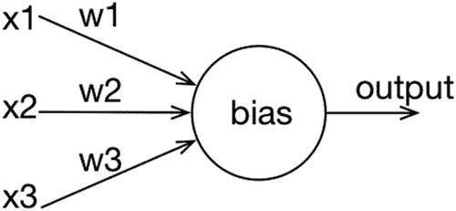

图 1-1

代表感知器

图 [1-1](#Fig1) 描绘了一个感知机。感知器通常表示为一个有一些输入和一个输出的圆。输入表示为位于中心圆左侧的输入箭头，输出表示为位于中心圆右侧的输出箭头。图 [1-1](#Fig1) 中的感知器有三个输入，标记为`x1`、`x2`和`x3`。

对于感知器来说，不是所有的输入都一样重要。例如，一个输入可能比其他输入更重要。输入的相关性使用与该输入相关联的权重(也是数值)来表示。在图 [1-1](#Fig1) 中，输入`x1`与权重`w1`关联，`x2`与权重`w2`关联，`x3`与`w3`关联。一些输入的不同相关性允许网络模拟特定的行为。例如，对于图像识别任务，位于图片边缘的像素通常比位于中间的像素相关性低。因此，与对应于边界像素的输入相关联的权重将相当接近于零。除了加权输入值，感知器还需要一个*偏差*，一个作为阈值的数值。我们将偏差表示为`b`。

感知器接收刺激作为输入，并通过产生输出值来响应该刺激。输出遵循一个非常简单的规则:如果加权输入的和大于一个特定的给定值，那么感知器触发`1`；否则，它触发`0`。从程序上讲，我们首先计算加权输入和偏差的总和。如果这个和严格高于`0`，那么感知器产生`1`；否则，就会产生`0`。

形式上，基于图 [1-1](#Fig1) 给出的感知器，我们写出`z = x1` * `w1 + x2` * `w2 + x3` * `w3 + b`。在一般情况下，我们写`z = ∑`<sub>`i`</sub>`x`<sub>`i`</sub>`* w`<sub>`i`</sub>`+ b`。变量`i`覆盖感知器的所有输入。如果`z > 0`，则感知器产生`1`，或者如果`z` ≤ `0`，则产生`0`。

在下一节中，我们将实现一个既可扩展又可维护的感知器模型。你可能想知道这有什么大不了的。毕竟，感知器模型可以用几行代码实现。然而，实现感知器功能只是工作的一小部分。本章的真正价值在于创建一个可测试的、测试良好的、可扩展的感知机模型。很快就会看到如何训练一个人工神经元的网络，重要的是将这个网络框架建立在一个坚实的基础上。

## 1.2 实现感知器

在这一节中，我们将动手用 Pharo 编程语言实现感知器模型。我们将生成该模型的面向对象的实现。我们将在一个名为`NeuralNetwork`的包中实现一个名为`Neuron`的类。该类将有一个名为`feed`的方法，用于计算两个值— `z`和感知器输出。

这段代码将包含在一个包中。要创建一个新的包，首先需要通过在 Pharo 菜单中选择相应的条目来打开一个*系统浏览器*。系统浏览器是 Pharo 中必不可少的工具。它允许我们读写代码。Pharo 中的大多数编程活动通常发生在系统浏览器中。

图 [1-2](#Fig2) 显示了一个系统浏览器，由五个不同的部分组成。顶部由四个列表组成。最左边的列表给出了可用的和随时可用的包。在图 [1-2](#Fig2) 中，名称`Announcement`、`AST-Core`和`Alien`是包的例子。图中选择了`Announcement`包。

第二个列表给出了属于所选包的类。许多类都是`Announcement`包的一部分，包括名为`Announcement`、`AnnouncementSet`和`Announcer`的类。

第三个列表显示了所选类的方法类别。方法类别将方法分类到逻辑组中，以阐明它们的目的，并使它们更容易找到。可以把它们看作是一种方法包。因为图中没有选择类，所以没有列出方法类别。

最右边的列表显示了所选类的方法，根据所选的方法类别(如果有的话)进行过滤。因为没有选择类，所以没有列出方法。系统浏览器的底部显示源代码，它是下列之一:

<colgroup><col class="tcol1 align-left"> <col class="tcol2 align-left"></colgroup> 
| 

选择

 | 

显示的代码

 |
| --- | --- |
| 方法 | 选定方法源代码 |
| 班级 | 选定的类别定义 |
| 没有人 | 新班级模板 |

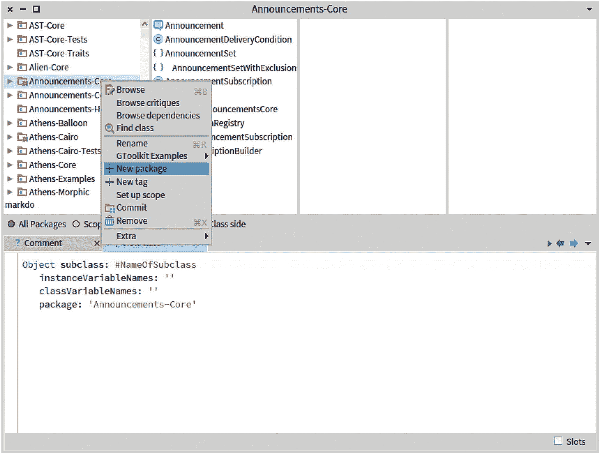

图 1-2

Pharo 系统浏览器

右键单击最左边的列表来创建一个新的包，命名为`NeuralNetwork`。这个包将包含我们将在这本书的第一部分中编写的大部分代码。

选择您刚刚创建的包`NeuralNetwork`，并在底部窗格中修改模板，如下所示:

```py
Object subclass: #Neuron
        instanceVariableNames: 'weights bias'
        classVariableNames: ''
        package: 'NeuralNetwork'

```

然后，您需要通过“接受”源代码来编译代码。右键单击文本窗格并选择`Accept`选项。`Neuron`类定义了两个实例变量— `weights`和`bias`。注意，我们不需要输入和输出值的变量。这些值将作为消息参数和返回值提供。我们需要添加一些方法来定义这个感知器的逻辑。特别是，我们需要计算中间值`z`和输出值。我们先来关注一下`weights`这个变量。我们将定义两个方法向该变量写入一个值，另一个方法从中读取值。

你可能想知道为什么我们定义一个名为`Neuron`的类，而不是`Perceptron`。在下一章，我们将扩展`Neuron`类，把它变成一个人工神经元的开放抽象。因此，这个`Neuron`类是我们将在后续章节中进行改进的占位符。在这一章中，我们考虑一个感知器，但是在下一章中，我们将转向一个抽象神经元的实现。因此，`Neuron`这个名字更合适。

下面是在`Neuron`类中定义的`weights:`方法的代码:

```py
Neuron>>weights: someWeightsAsNumbers
    "Set the weights of the neuron.
    Takes a collection of numbers as argument."
    weights := someWeightsAsNumbers

```

要定义这个方法，您需要在类面板(第二个顶部列表面板)中选择`Neuron`类。然后，编写给定的不带 `Neuron>>`的代码*，该代码通常在文档中前置以指示应该承载该方法的类。浏览器中不需要它，因为该类在顶部窗格中被选中。图 [1-3](#Fig3) 对此进行了说明。接下来，您应该接受代码(再次通过右键单击`Accept`菜单项)。在 Pharo 行话中，接受一个方法具有实际编译它的效果(即使用 Pharo 编译器将 Pharo 源代码翻译成 Pharo 虚拟机可以理解的一些字节码)。一旦编译完成，就可以执行一个方法。代码定义了名为`weights:`的方法，该方法接受一个参数，作为名为`someWeightsAsNumbers`的变量提供。*

`weights := someWeightsAsNumbers`表达式将值`someWeightsAsNumbers`赋给变量`weights`。

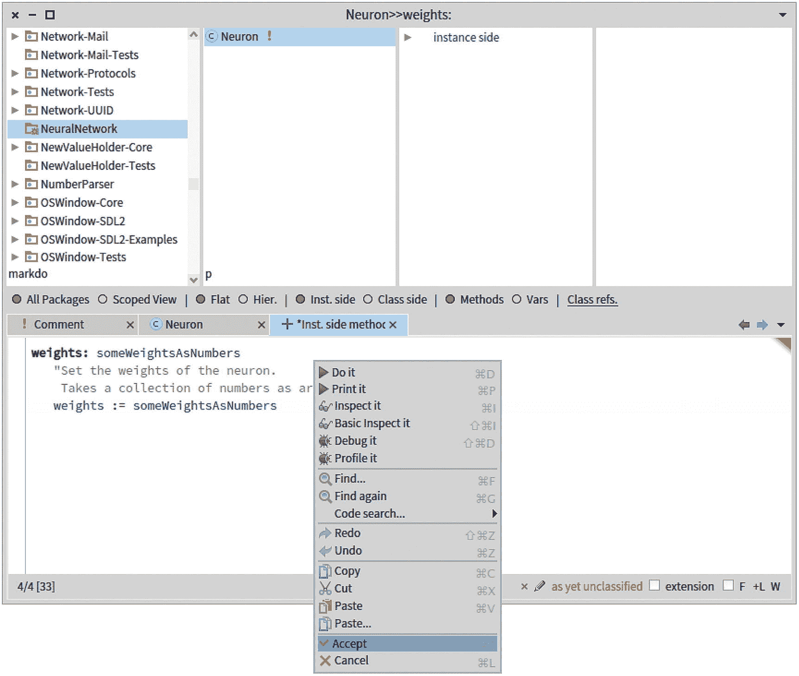

图 1-3

`Neuron`类的`weights:`方法

你的系统浏览器现在应该如图 [1-3](#Fig3) 所示。`weights:`方法向变量`weights`写入一个值。它返回权重的兄弟方法是

```py
Neuron>>weights
    "Return the weights of the neuron."
    ^ weights

```

字符`^`返回表达式的值，在本例中是变量`weights`的值。

类似地，您需要定义方法来给`bias`变量赋值并读取其内容。方法`bias:`定义如下:

```py
Neuron>>bias: aNumber
    "Set the bias of the neuron"
    bias := aNumber

```

读取变量`bias`由以下内容提供:

```py
Neuron>>bias
    "Return the bias of the neuron"
    ^ bias

```

到目前为止，我们已经定义了`Neuron`类，它包含两个变量(`weights`和`bias`)和四个方法(`weights:`、`weights`、`bias:`和`bias`)。我们现在需要通过应用一组输入值并获得输出值来定义这个感知器的逻辑。让我们添加一个`feed:`方法来完成这个小计算:

```py
Neuron>>feed: inputs
    | z |
    z := (inputs with: weights collect: [ :x :w | x * w ]) sum + bias.
    ^ z > 0 ifTrue: [ 1 ] ifFalse: [ 0 ].

```

`feed:`方法只是将前面讨论的数学感知机激活公式翻译成 Pharo 编程语言。表达式`inputs with: weights collect: [ :x :w | x * w ]`使用提供的函数转换`inputs`和`weights`集合。考虑下面的例子:

```py
#(1 2 3) with: #(10 20 30) collect: [ :a :b | a + b ]

```

表达式`#(1 2 3)`是由三个数字组成的数组——`1`、`2`和`3`。表达式计算结果为`#(11 22 33)`。从语法上来说，该表达式意味着文字值`#(1 2 3)`接收一个名为`with:collect:`的消息，该消息带有两个参数，文字数组`#(10 20 30)`和块`[ :a :b | a + b ]`。您可以通过打开一个游戏场(可从`Tools`顶部菜单进入)来验证该表达式的值。游乐场是 Pharo 的一种命令终端(例如，UNIX 世界中的`xterm`)。图 [1-4](#Fig4) 显示了表达式的评估(通过从右键菜单中选择打印或使用适当的快捷方式进行评估——在 OSX 系统上为 Cmd+p，在其他操作系统上为 Alt+p)。

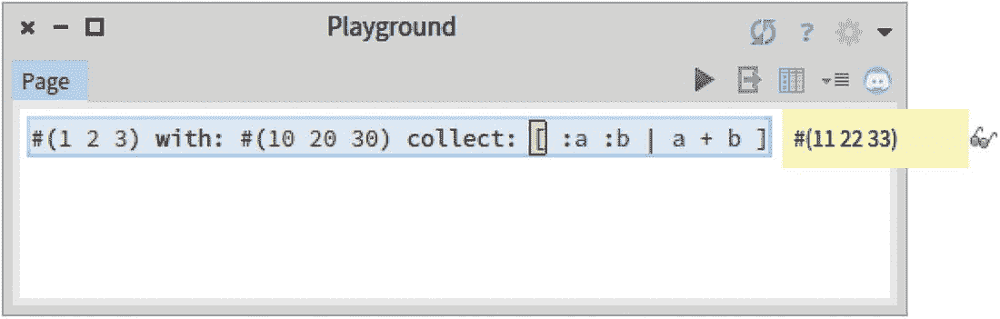

图 1-4

操场

我们现在可以用感知器玩一会儿，并在我们刚刚打开的操场上评估以下代码:

```py
p := Neuron new.
p weights: #(1 2).
p bias: -2.
p feed: #(5 2)

```

这段代码求值为`1`(因为`(5*1 + 2*2)-2`等于`7`，大于`0`，如图 [1-5](#Fig5) 所示。

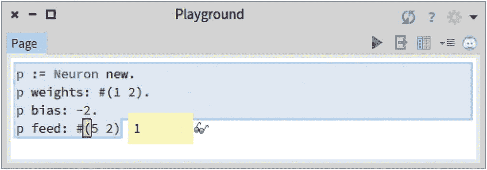

图 1-5

评估感知器

## 1.3 测试代码

现在是时候谈谈测试了。每当我们使用敏捷方法编写代码时，测试都是必不可少的活动。测试是关于提高我们编写的代码做它应该做的事情的信心。

虽然这本书不是关于写大型软件工件的，但是我们*确实*写源代码。并且确保这些代码能够以自动化的方式被测试，这极大地提高了我们工作的质量。更重要的是，大多数代码被阅读的次数远远多于被编写的次数。测试帮助我们产生可维护的和适应性强的代码。在本书中，我们将改进我们的代码库。确保我们的改进不会破坏现有功能是非常重要的。

例如，我们之前定义了一个感知机，并在操场上非正式地测试了它。这个非正式的测试花费了我们一些按键和一点时间。如果我们每次修改感知机的定义时都可以重复这个测试，会怎么样？这正是*单元测试*的意义所在。

我们现在将离开操场一会儿，返回到系统浏览器来定义一个名为`PerceptronTest`的类:

```py
TestCase subclass: #PerceptronTest
    instanceVariableNames: ''
    classVariableNames

: ''
    package: 'NeuralNetwork'

```

`TestCase`类属于内置的 Pharo 代码库。创建子类是创建单元测试的第一步。我们定义的测试将创建许多感知机。我们可以将该方法定义如下:

```py
PerceptronTest>>newNeuron
    "Return a new neuron"
    ^ Neuron new

```

测试现在可以添加到`PerceptronTest`中。定义以下方法:

```py
PerceptronTest>>testSmallExample
    | p result |
    p := self newNeuron.
    p weights: #(1 2).
    p bias: -2.
    result := p feed: #(5 2).
    self assert: result equals: 1.

```

`testSmallExample`方法测试我们之前给出的代码片段是否返回值`1`。您可以通过单击方法名称旁边的灰色圆圈来运行测试。灰色圆圈变为绿色表示测试通过(参见图 [1-6](#Fig6) )。

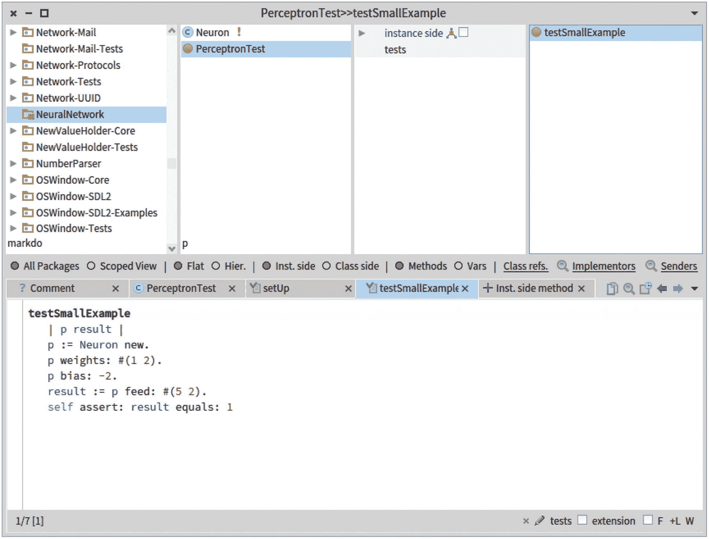

图 1-6

测试感知器

绿色测试意味着在测试执行期间没有断言失败，也没有出现错误。`testSmallExample`方法发送`assert:equals:`消息，测试第一个参数是否等于第二个参数。

*练习:*到目前为止，你只是浅尝辄止地测试了一下这个感知机。您可以通过两种方式改进这些测试:

*   通过给感知器`p`输入不同的值来扩展`testSmallExample`(例如，`-2`和`2`给出`0`作为结果)。

*   用不同的权重和偏差测试感知器。

一般来说，编写一套完整的测试是一个非常好的实践，即使是对于像这个`Neuron`类这样的小组件。

## 1.4 制定逻辑表达式

使用感知器的一个典型例子是表达布尔逻辑门。这个想法是有一个感知器，它有两个输入(每个都是布尔值)，模拟逻辑门的结果作为输出。

一点算术表明，一个具有权重`#(1 1)`和偏差`-1.5`的感知器形成了“与”逻辑门。回想一下，`#(1 1)`是一个大小为`2`的数组，其中包含两次数字`1`。与门是一种基本的数字逻辑门，是实现与布尔函数的理想器件。与门可以表示为下表:

<colgroup><col class="tcol1 align-left"> <col class="tcol2 align-left"> <col class="tcol3 align-left"></colgroup> 
| 

A

 | 

B

 | 

a 和 B

 |
| --- | --- | --- |
| `0` | `0` | `0` |
| `0` | `1` | `0` |
| `1` | `0` | `0` |
| `1` | `1` | `1` |

因此，我们可以用一种新的测试方法来验证这一点:

```py
PerceptronTest>>testAND
    | p |
    p := self newNeuron.
    p weights: #(1 1).
    p bias: -1.5.

    self assert: (p feed: #(0 0)) equals: 0.
    self assert: (p feed: #(0 1)) equals: 0.
    self assert: (p feed: #(1 0)) equals: 0.
    self assert: (p feed: #(1 1)) equals: 1.

```

类似地，感知器可以构造“或”逻辑门:

<colgroup><col class="tcol1 align-left"> <col class="tcol2 align-left"> <col class="tcol3 align-left"></colgroup> 
| 

A

 | 

B

 | 

a 还是 B

 |
| --- | --- | --- |
| `0` | `0` | `0` |
| `0` | `1` | `1` |
| `1` | `0` | `1` |
| `1` | `1` | `1` |

考虑以下测试:

```py
PerceptronTest>>testOR
    | p |
    p := self newNeuron.
    p weights: #(1 1).
    p bias: -0.5.

    self assert: (p feed: #(0 0)) equals: 0.
    self assert: (p feed: #(0 1)) equals: 1.
    self assert: (p feed: #(1 0)) equals: 1.
    self assert: (p feed: #(1 1)) equals: 1.

```

对权重和偏差取反会导致逻辑门取反:

```py
PerceptronTest>>testNOR
    | p |
    p := self newNeuron.
    p weights: #(-1 -1).
    p bias: 0.5.

    self assert: (p feed: #(0 0)) equals: 1.
    self assert: (p feed: #(0 1)) equals: 0.
    self assert: (p feed: #(1 0)) equals: 0.
    self assert: (p feed: #(1 1)) equals: 0.

```

到目前为止，我们已经建立了有两个输入的感知器。输入值的数量必须与权重的数量相同。因此，如果只提供一个权重，则只需要一个输入。考虑非逻辑门，如下所示:

```py
PerceptronTest>>testNOT
    | p |
    p := self newNeuron.
    p weights: #(-1).
    p bias: 0.5.

    self assert: (p feed: #(1)) equals: 0.
    self assert: (p feed: #(0)) equals: 1.

```

## 1.5 处理错误

在`testNOT`中，我们定义了一个只有一个权重的感知器。调用`feed:` *时提供的数组*必须只有一个条目。但是如果我们有两个条目而不是一个，会发生什么呢？会出现一个错误，因为我们错误地使用了我们定义的(小)API。

您还应该测试这种行为，以确保正确生成错误。定义以下测试:

```py
PerceptronTest>>testWrongFeeding
    | p |
    p := self newNeuron.
    p weights: #(-1).
    p bias: 0.5.

    self should: [ p feed: #(1 1) ] raise: Error

```

只有当表达式`pfeed: #(1 1)`产生了一个错误时，`testWrongFeeding`测试才会通过。

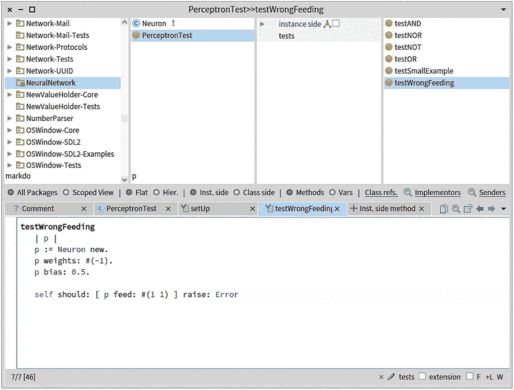

图 1-7

运行测试

到目前为止，我们已经用五种方法定义了`Neuron`类，用六种测试方法定义了单元测试`PerceptronTest`。您可以通过点击单元测试名称`PerceptronTest`旁边的圆圈来运行这些测试(参见图 [1-7](#Fig7) )。

重要的是要强调，严格测试您的代码，这也包括验证错误是否得到正确处理，这在您从头实现神经网络时非常重要。不幸的是，由于输入大小和权重不匹配而导致的错误太频繁了，在这方面不能松懈。

## 1.6 组合感知器

到目前为止，我们定义了与、或非、非和或逻辑门。逻辑门组合起来就变得有趣了。数字比较器电路是两个非门与两个与门和一个或非门的组合。整体组合对于比较两个值`A`和`B`很有用。有三种可能的结果:

*   `A`大于`B`

*   `A`等于`B`

*   `A`小于`B`

因此，我们可以用两个输入和三个输出来模拟我们的电路。下表总结了该电路:

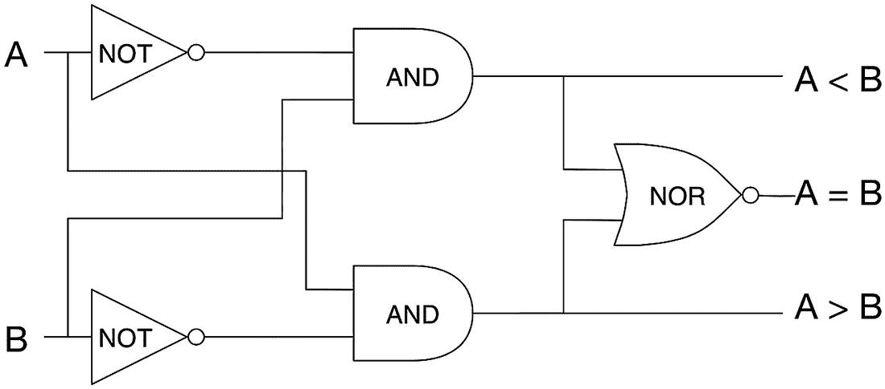

图 1-8

数字比较电路

<colgroup><col class="tcol1 align-left"> <col class="tcol2 align-left"> <col class="tcol3 align-left"> <col class="tcol4 align-left"> <col class="tcol5 align-left"></colgroup> 
| 

`A`

 | 

`B`

 | 

`A < B`

 | 

`A = B`

 | 

`A > B`

 |
| --- | --- | --- | --- | --- |
| `0` | `0` | `0` | `1` | `0` |
| `0` | `1` | `1` | `0` | `0` |
| `1` | `0` | `0` | `0` | `1` |
| `1` | `1` | `0` | `1` | `0` |

图 [1-8](#Fig8) 显示了电路。三个不同的逻辑门是必要的:与、非和或非。我们需要把这些门联系起来。正如我们之前所做的，一些测试将推动这项工作。为了方便起见，我们在单元测试中定义的`digitalComparator:`方法模拟数字比较器电路:

```py
PerceptronTest>>digitalComparator: inputs
    "Return an array of three elements"
    | not and nor a b aGb aEb aLb notA notB |
    a := inputs first.
    b := inputs second.

    and := self newNeuron weights: #(1 1); bias: -1.5.
    not := self newNeuron weights: #(-1); bias: 0.5.
    nor := self newNeuron weights: #(-1 -1); bias: 0.5.
    notA := not feed: { a }.
    notB := not feed: { b }.

    aLb := and feed: { notA . b }.
    aGb := and feed: { a . notB }.
    aEb := nor feed: { aGb . aLb }.
    ^ { aGb . aEb . aLb }

```

该方法接受一组输入作为其参数。我们首先提取这些输入的第一个和第二个元素，并将它们分配给临时变量`a`和`b`。

接下来，我们创建三个逻辑门作为感知器，并使用变量`notA`、`notB`、`aGb` ( `a`大于`b`)、`aLb` ( `a`小于`b`)和`aEb` ( `a`等于`b`)将它们连接在一起。

然后我们计算`notA`和`notB`。这里，我们使用另一种语法来定义数组。`{ A }`表达式用`A`引用的对象创建一个数组。这个数组语法的元素将在运行时计算，不像`#(...)`符号，它是在编译时计算的。因此，对于像数字这样的“文字”对象，总是使用`#(...)`(例如`#(1 -1)`)。要创建包含表达式结果的数组，总是使用`{...}`。请注意，从技术上讲，我们也可以使用`{...}`语法(例如`{1 . -1}`)来编写数字，但是由于运行时评估的性能损失，这样做很少，也没有任何好处。记住这两个符号很重要，因为我们将在整本书中大量使用它们。

`digitalComparator:`方法以数组的形式返回电路评估的结果。我们可以使用以下测试方法对其进行测试:

```py
PerceptronTest>>testDigitalComparator
    self assert: (self digitalComparator: #(0 0)) equals: #(0 1 0).
    self assert: (self digitalComparator: #(0 1)) equals: #(0 0 1).
    self assert: (self digitalComparator: #(1 0)) equals: #(1 0 0).
    self assert: (self digitalComparator: #(1 1)) equals: #(0 1 0).

```

数字比较器电路的例子显示了如何“手动”组合感知器。整体行为分为几个部分，每个部分引用一个变量。然后，这些变量必须被组合以表达逻辑流(例如，变量`notA`必须在计算输出之前被计算)。

## 1.7 训练感知器

到目前为止，我们已经使用了带有一组特定权重和偏差的感知器。例如，我们用值`1`定义了 AND 逻辑门的两个权重和一个偏差`-1.5`。考虑下面的练习:手动计算权重和偏差来模拟 NAND 逻辑门(例如，我们记得 NAND 的表是`#( #(0 0 1)#(0 1 1)#(1 0 1)#(1 1 0))`)。这样做需要一些时间来计算一些简单的算术。想象一个感知机接受成千上万的输入。手动确定权重和偏差的适当值是不现实的。这正是训练感知器的目的——找到足够的权重和偏差，使感知器能够解决特定的问题。

学习通常包括一组输入示例和一些已知的输出。学习过程评估人工神经元相对于期望输出有多好。特别是，如 Frank Rosenblatt 在 20 世纪 50 年代末所定义的，感知器的每个权重被修改的量与(I)输入的乘积和(ii)实际输出和期望输出之间的差成比例。神经网络中的学习意味着调整权重和偏差，以使输出接近训练样本集。

感知器学习的方式简单地遵循这些规则

`w`<sub>【I】</sub>`(t + 1) = w`<sub>【I】</sub>`(t) + (d`——`z)`<sub>【I】</sub>*α

`z)`-`z)`*α

其中

*   `i`是体重指数

*   `w` <sub>`i`</sub> `(t)`是给定时间的重量`i``t`

*   `b(t)`是给定时间的偏差`t`

*   `d`是期望值

*   `z`是感知器的实际输出

*   `x` <sub>`i`</sub> 对应于在索引`i`提供的输入

*   α是学习率，通常是一个小的正值，接近于`0`

我们有`w` <sub>i</sub> `(0)`等于一个随机数，通常在以`0`为中心的狭窄范围内。前面给出的两个等式可以翻译成下面的伪代码:

```py
diff = desiredOutput - realOutput
alpha = 0.1
For all N:
    weightN = weightN + (alpha * inputN * diff)
bias = bias + (alpha * diff)

```

这个伪代码可以用 Pharo 中的`train:desiredOutput:`方法编写。但在此之前，我们需要通过添加`learningRate`实例变量来稍微调整`Neuron`类的定义。定义如下:

```py
Object subclass: #Neuron
    instanceVariableNames: 'weights bias learningRate'
    classVariableNames: ''
    package: 'NeuralNetwork'

```

我们还可以提供必要的方法来修改`learningRate`变量:

```py
Neuron>>learningRate: aNumber
    "Set the learning rate of the neuron"
    learningRate := aNumber

```

要获取变量的值，请使用以下代码:

```py
Neuron>>learningRate
    "Return the learning rate of the neuron"
    ^ learningRate

```

变量可以在构造函数中初始化，如下所示:

```py
Neuron>>initialize
    super initialize.
    learningRate := 0.1

```

我们现在可以定义`train:desiredOutput:`方法来让感知器学习。

```py
Neuron>>train: inputs desiredOutput: desiredOutput
    | theError output newWeight |
    output := self feed: inputs.
    theError := desiredOutput - output.
    inputs
        withIndexDo: [ :anInput :index |
            newWeight := (weights at: index) + (learningRate * theError * anInput).
            weights at: index put: newWeight ].
    bias := bias + (learningRate * theError)

```

在调整权重和偏差之前，我们需要知道感知器对输入集的评估有多好。因此，我们需要用`inputs`参数来评估感知器，它是数值的集合。结果被分配给`output`变量。`theError`变量代表期望输出和实际输出之间的差异。我们还需要决定感知机应该学习多快。`learningRate`值的范围在`0.0`和`1.0`之间。这个例子任意使用了`0.1`的值。

让我们看看如何在实践中使用培训。考虑下例中的感知器`p`:

```py
p := Neuron new.
p weights: #(-1 -1).
p bias: 2.
p feed: #(0 1).

```

你可以在操场上评估这段代码。我们有`pfeed: #(0 1)`等于`1`。如果我们希望感知器为输入`#(0 1)`输出`0`呢？我们需要训练`p`。正如我们所说，这个训练将调整权重和偏差。让我们试试下面的方法:

```py
p := Neuron new.
p weights: #(-1 -1).
p bias: 2.
p train: #(0 1) desiredOutput: 0.
p feed: #(0 1).

```

对这个表达式求值仍然输出`1`。啊？！我们不是应该训练我们的感知机吗？感知器学习速度很慢。因此，我们需要在期望的输出上训练感知器几次。我们可以如下重复训练感知器:

```py
p := Neuron new.
p weights: #(-1 -1).
p bias: 2.
10 timesRepeat: [ p train: #(0 1) desiredOutput: 0 ].
p feed: #(0 1).

```

评估代码产生了`0`，这正是我们所希望的(见图 [1-9](#Fig9) )。感知器学会了！

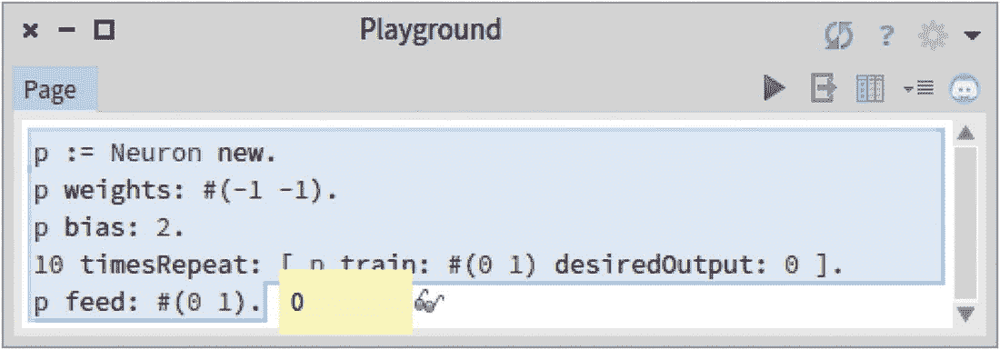

图 1-9

教感知器

我们现在可以训练一个感知器来学习如何表达逻辑门。考虑以下`testTrainingOR`:

```py
PerceptronTest>>testTrainingOR
    | p |
    p := self newNeuron.
    p weights: #(-1 -1).
    p bias: 2.

    40 timesRepeat: [
        p train: #(0 0) desiredOutput: 0.
        p train: #(0 1) desiredOutput: 1.
        p train: #(1 0) desiredOutput: 1.
        p train: #(1 1) desiredOutput: 1.
    ].

    self assert: (p feed: #(0 0)) equals: 0.
    self assert: (p feed: #(0 1)) equals: 1.
    self assert: (p feed: #(1 0)) equals: 1.
    self assert: (p feed: #(1 1)) equals: 1.

```

`testTrainingOR`方法首先创建一个带有任意权重和偏差的感知器。我们用 OR 逻辑门的四种可能组合成功地训练了它。训练之后，我们验证感知器是否已经正确学习。

在`testTrainingOR`中，我们在完整的例子集上训练感知机 40 次。用完整的例子集训练一个感知器(或大型神经网络)被称为一个*时期*。所以，在这个例子中，我们用 40 个历元训练`p`。纪元是训练的单位。

类似地，我们可以定义一个测试来训练感知器来模拟非逻辑门:

```py
PerceptronTest>>testTrainingNOT
    | p |
    p := self newNeuron.
    p weights: #(-1).
    p bias: 2.

    40 timesRepeat: [
        p train: #(0) desiredOutput: 1.
        p train: #(1) desiredOutput: 0.
    ].

    self assert: (p feed: #(0)) equals: 1.
    self assert: (p feed: #(1)) equals: 0.

```

*运动*:

*   训练`p`最少需要多少个历元？尝试减少 epochs 的数量，并运行测试以查看它是否仍然通过。

*   我们已经展示了如何训练感知器来学习或逻辑门。为我们见过的其他门编写名为`testTrainingNOR`和`testTrainingAND`的方法。

*   `learningRate`的值如何影响训练的最小时期数？

## 1.8 绘制图表

通常需要绘制图表来监控网络的进度。我们将使用 Roassal 可视化引擎来可视化这种演变。Roassal 提供 Grapher API，专门用于绘制图形。您可以通过在操场上执行以下命令来加载 Roassal:

```py
Metacello new
    baseline: 'Roassal2';
    repository: 'github://ObjectProfile/Roassal2/src';
    load.

```

下一节使用 Roassal。请确保您已经加载了它，否则下面的部分代码将无法工作，甚至无法编译。更多关于 Roassal 的信息可以在 [`http://AgileVisualization.com`](http://agilevisualization.com) 上找到，详细的装载说明可以在 [`https://github.com/ObjectProfile/Roassal2`上找到。](https://github.com/ObjectProfile/Roassal2)

下面是一个绘制简单图形的例子(见图 [1-10](#Fig10) ):

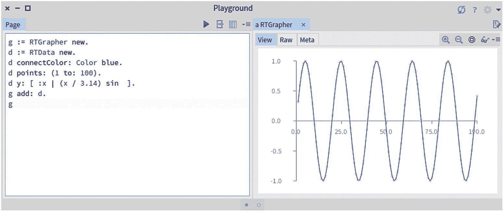

图 1-10

图表示例

```py
g := RTGrapher new.
d := RTData new.
d connectColor: Color blue.
d points: (1 to: 100).
d y: [ :x | (x / 3.14) sin ].
g add: d.
g

```

我们将在整本书中大量使用图表。关于绘制图形的更多信息可以在 Roassal 的例子中找到。

## 1.9 预测和 2D 点

我们现在将看到感知器的一个新应用，它可以用来对数据进行分类并做出一些预测。我们将挑选一个简单的分类问题。请考虑以下情况:

*   由红色和蓝色点组成的空间

*   一条直线将红点和蓝点分开

考虑下面两个(真实的)人，一个老师和一个学生之间的互动。教师的目标是让学生推断蓝色和红色点之间的直线分隔线在哪里。首先，老师可以给出任意数量的例子。每个例子都以位置和颜色的形式提供给学生。几个例子之后，学生可以猜测任意位置的颜色。直觉上，老师给学生的例子越多，学生就越有可能正确预测某个位置的颜色。

出现了一些问题:

*   我们能教一个感知器正确分配一个点的颜色吗？

*   我们需要多少个样本点来训练感知器以做出一个好的预测？

让我们选择一个线性函数，比如`f(x) =``2x``3`。给定点(`x`、*、*、`y`)如果`y > f(x)`为红色；否则就是蓝色。考虑以下脚本:

```py
somePoints := OrderedCollection new.
500 timesRepeat: [
    somePoints add: {(50 atRandom - 25) . (50 atRandom - 25)}
].

f := [ :x | (-2 * x) - 3 ].

"We use the Roassal Grapher engine to plot our points"
g := RTGrapher new.
d := RTData new.
d dotShape
    color: [ :p | (p second > (f value: p first))
                    ifTrue: [ Color red trans ]
                    ifFalse: [ Color blue trans ] ].
d points: somePoints.
d x: #first.
d y: #second.
g add: d.
g

```

检查这个代码片段会产生一个有 500 个彩色点的图形(见图 [1-11](#Fig11) )。

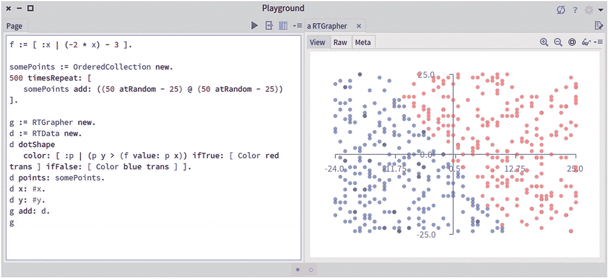

图 1-11

沿线对点进行分类

该脚本首先定义一组 500 个点，范围在 50 的平方区域内(从-25 到+25)。`50 atRandom`表达式返回一个介于 1 和 50 之间的随机数。表达式`{(50 atRandom- 25). (50 atRandom- 25)}`创建了一个包含两个随机值的数组。每个点都表示为两个数字的数组。我们的 500 个积分保存在一个集合中，这是类`OrderedCollection`的一个实例。

我们给变量`f`分配一个表示函数`f(x)`的块，用 Pharo 语法编写。可以用`value:`消息评估一个块。例如，我们有返回`-9`的`f value: 3`和返回`1`的`f value: -2`。

脚本的其余部分使用 Grapher 来绘制这些点。如果`psecond`大于`f value: p first`，则点`p`为红色；否则就是蓝色。表达式`Color red trans`的计算结果为透明的红色。

我们可以将由`f`定义的线添加到图形中。考虑小的修改(见图 [1-12](#Fig12) ):

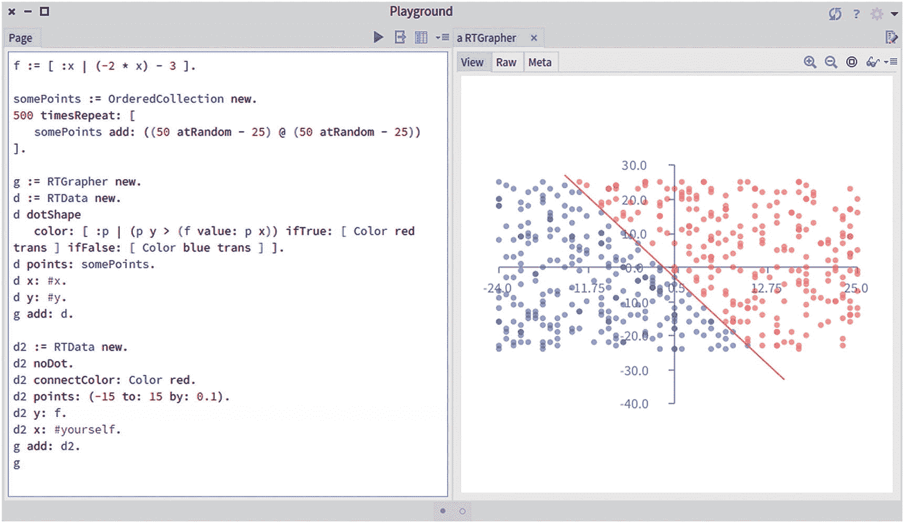

图 1-12

添加分隔线

```py
somePoints := OrderedCollection new.
500 timesRepeat: [
    somePoints add: {(50 atRandom - 25) . (50 atRandom - 25)}
].

f := [ :x | (-2 * x) - 3 ].

g := RTGrapher new.
d := RTData new.
d dotShape
    color: [ :p | (p second > (f value: p first))
                    ifTrue: [ Color red trans ]
                    ifFalse: [ Color blue trans ] ].
d points: somePoints.
d x: #first.
d y: #second.
g add: d.

"Added code below"
d2 := RTData new.
d2 noDot.
d2 connectColor: Color red.
d2 points: (-15 to: 15 by: 0.1).
d2 y: f.
d2 x: #yourself.
g add: d2.
g

```

我们现在将在脚本中添加一个感知器，看看它能在多大程度上猜测一个点落在线的哪一侧。考虑以下脚本(参见图 [1-13](#Fig13) ):

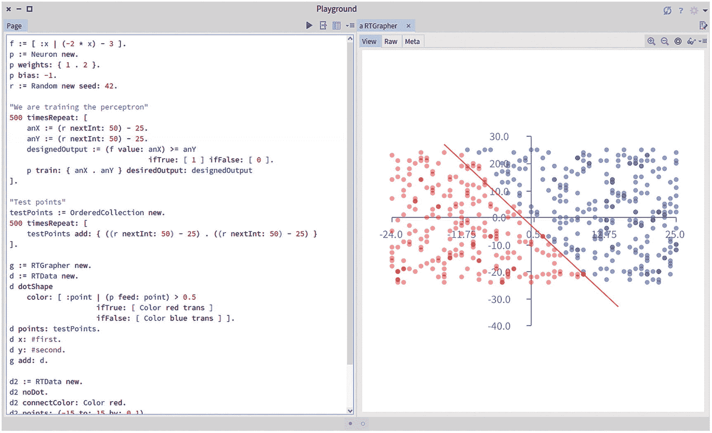

图 1-13

预测点的颜色

```py
f := [ :x | (-2 * x) - 3 ].
p := Neuron new.
p weights: { 1 . 2 }.
p bias: -1.
r := Random new seed: 42.

"We are training the perceptron"
500 timesRepeat: [
    anX := (r nextInt: 50) - 25.
    anY := (r nextInt: 50) - 25.
    designedOutput := (f value: anX) >= anY
                                ifTrue: [ 1 ] ifFalse: [ 0 ].
    p train: { anX . anY } desiredOutput: designedOutput
].

"Test points"
testPoints := OrderedCollection new.
2000 timesRepeat: [
    testPoints add: { ((r nextInt: 50) - 25) . ((r nextInt: 50) - 25) }
].

g := RTGrapher new.
d := RTData new.
d dotShape
    color: [ :point | (p feed: point) > 0.5
                    ifTrue: [ Color red trans ]
                    ifFalse: [ Color blue trans ] ].
d points: testPoints.
d x: #first.
d y: #second.
g add: d.

d2 := RTData new.
d2 noDot.
d2 connectColor: Color red.
d2 points: (-15 to: 15 by: 0.1).
d2 y: f.
d2 x: #yourself.
g add: d2.
g

```

图 [1-13](#Fig13) 给出了预测结果。我们可以看到一些红点没有正确分类。一些红点位于直线的右侧。一般来说，精度是好的，因为大多数点都放在正确的一面。

与前面的脚本一样，该脚本从块函数`f`的定义开始。然后，它创建一个带有任意权重和偏差的感知器。随后，创建一个随机数生成器。在前面的脚本中，为了获得 1 到 50 之间的随机值，我们简单地编写了`50 atRandom`。使用随机数生成器，我们需要编写以下内容:

```py
r := Random new seed: 42.
r nextInt: 50.

```

这是为什么呢？首先，能够生成随机数在所有随机方法中都是必要的，包括神经网络。虽然随机性非常重要，但我们通常不希望让这样的随机值造成无法重现的情况。假设我们的代码行为不稳定，很可能是由于一个随机值。我们如何追踪代码中的异常？如果我们有真正的随机数，这意味着执行同一段代码两次可能会产生(即使是轻微的)不同的行为。因此，正确测试可能很复杂。相反，我们将使用一个具有已知种子的随机发生器来产生一个已知的随机数序列。考虑这个表达式:

```py
(1 to: 5) collect: [ :i| 50 atRandom]

```

每次对这个表达式求值时，您将获得一个由五个随机数组成的新的*序列。使用生成器，您会得到以下结果:*

```py
r := Random new seed: 42.
(1 to: 5) collect: [:i | r nextInt: 50]

```

多次评估这个小脚本总是产生相同的序列。这是具有可再现性和确定性行为的关键。在本书的剩余部分，我们将经常使用随机数发生器。

然后我们的脚本用 500 分训练一个感知器。接下来，我们创建 2，000 个测试点，这些测试点将使用 Grapher 显示在屏幕上。我们写了条件`(p feed: point)> 0.5`将一个点涂成红色。我们可以用`(p feed: point)= 1`来代替，但是在接下来的章节中，我们将用另一种人工神经元来代替感知器，这种人工神经元不会精确地产生值`1`。

我们看到蓝点和红点的面积非常接近直线。这意味着我们的感知器能够以相对较高的精度对点进行分类。

如果我们减少感知机的训练次数会怎么样？您可以尝试将值 500 更改为 100。结果如何呢？感知器不能准确地对点进行分类。一般来说，感知器的训练越多，它就越准确(然而，神经网络并不总是如此，我们将在后面看到)。

*练习:*减少感知器的训练次数。验证将值降低到 500 以下会导致感知器产生一些错误，如红线和彩色点区域之间的不匹配。

## 1.10 测量精度

我们已经看到，感知器对点进行分类的准确性非常依赖于我们训练它的次数。我们需要多少训练才能达到可接受的精度？跟踪精度和训练对于了解我们的系统在分类方面有多好至关重要。

在操场上评估以下脚本:

```py
learningCurve := OrderedCollection new.
f := [ :x | (-2 * x) - 3 ].
0 to: 2000 by: 10 do: [ :nbOfTrained |
    r := Random new seed: 42.
    p := Neuron new.
    p weights: #(1 2).
    p bias: -1.

    nbOfTrained timesRepeat: [
        anX := (r nextInt: 50) - 25.
        anY := (r nextInt: 50) - 25.
        trainedOutput := (f value: anX) >= anY ifTrue: [1] ifFalse:
[0].
        p train: (Array with: anX with: anY) desiredOutput:
            trainedOutput ].

    nbOfGood := 0.
    nbOfTries := 1000.
    nbOfTries timesRepeat: [
        anX := (r nextInt: 50) - 25.
        anY := (r nextInt: 50)- 25.
        realOutput := (f value: anX) >= anY ifTrue: [1] ifFalse: [0].
        ((p feed: { anX . anY }) - realOutput) abs < 0.2
            ifTrue: [ nbOfGood := nbOfGood + 1 ].
    ].
    learningCurve add: { nbOfTrained . (nbOfGood / nbOfTries) }.
].

g := RTGrapher new.
d := RTData new.
d noDot.
d connectColor: Color blue.
d points: learningCurve.
d x: #first.
d y: #second.
g add: d.
g axisY title: 'Precision'.
g axisX noDecimal; title: 'Training iteration'.
g

```

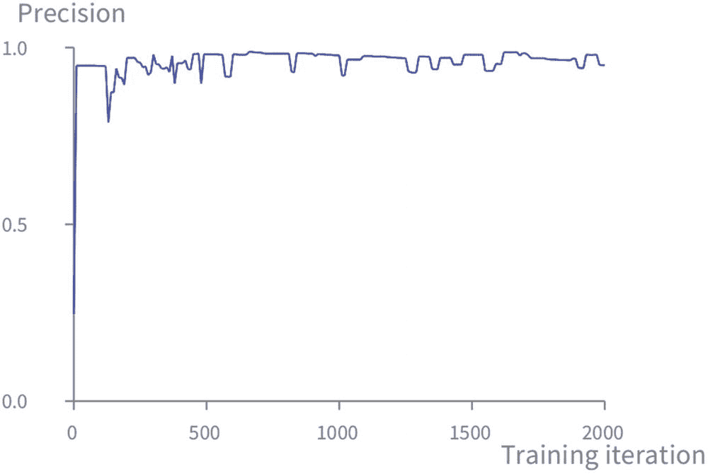

图 1-14

点分类任务的精度

脚本生成一条曲线，y 轴为精度，x 轴为训练次数(见图 [1-14](#Fig14) )。我们看到，感知器开始时性能相当差，大约为 0.25。然而，它很快提高到接近 1.0 的精度。几个纪元后，我们的感知器就能以很好的精度猜出一个点的颜色。

## 1.11 历史视角

沃伦·麦卡洛克和沃尔特·皮茨是第一个用人工神经元来表达计算的人。他们在 1943 年发表了开创性的文章《神经活动中固有观念的逻辑演算》。这篇论文对人工智能领域产生了重大影响。阅读我们当时所掌握的关于生物神经元的知识是很有趣的。本章介绍的感知机模型源自这篇开创性的论文。

## 1.12 练习

*   我们已经看到感知器是如何被用来实现一些逻辑门的。特别是，我们已经看到了如何实现 AND、OR 和 NOT。异或门呢？你能训练一个感知机来学习异或行为吗？(提醒一下，我们有`0 XOR 0 = 0`、`0 XOR 1 = 1`、`1 XOR 0 = 1`和`1 XOR 1 = 0`。)

*   我们已经看到了如何将五个感知器组合成一个数字比较器。你觉得你可以把这五个感知器的组合作为一个整体来训练，来学习数字比较器的行为吗？

## 1.13 我们在本章中看到了什么？

本章涵盖了以下主题:

*   提供感知机的概念。我们定义了一个感知器，这是一个重要的抽象概念，我们将在接下来的章节中建立它。

*   使用 Pharo 编程的分步指南。当我们实现感知器时，我们勾画了编程在 Pharo 中是如何发生的。这一章绝不是对 Pharo 的介绍。相反，它是一个如何使用 Pharo 编程环境的例子。特别是，我们看到了如何使用系统浏览器编写代码，以及如何使用操场运行代码。这两个工具非常重要，值得深入了解。

*   实现一个感知机。我们实现并测试了感知机。测试很重要，因为它是一种形式化我们希望感知器表现的方式。

*   让感知机学习。我们看到了让感知机学习的基本方法。这相当简单，但是，正如你将在以后的章节中看到的，同样的技术可以让我们走得更远。

## 1.14 关于 Pharo 的进一步阅读

Pharo 是一种非常棒的编程语言，也是一种生动的动态编程环境。这第一章已经让你领略了用 Pharo 编程的滋味。但是，强烈建议您寻找更多的资料，以便真正熟悉 Pharo 并了解它的强大之处。特别是， *Pharo by Example* 这本书是学习和掌握 Pharo 的绝佳入门。网站 [`http://books.pharo.org`](http://books.pharo.org) 包含了这本书的免费拷贝以及许多其他内容。看看吧！