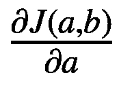

# 4.学习理论

理解神经网络使用的学习算法涉及到大量的数学符号。本章详细介绍了神经网络工作方式的一些相关理论。因此，我们将回顾损失函数和梯度下降的概念。请注意，这一章绝不是对网络如何学习的完整描述。正如本章末尾所指出的，许多其他人在准确描述学习和优化机制的理论基础方面做了出色的工作。相反，本章旨在支持前几章中解释的实现的某些方面，假设您熟悉基本的微分。

如果你对神经网络背后的理论不感兴趣，你可以放心地跳过这一章。

本章集中使用 Roassal 来可视化数据。因此，为了运行本章中的脚本，您需要加载它，如前几章所述。

## 4.1 损失函数

一个网络需要学习以减少它在做预测时犯的错误。这种预测既可以用于数据分类，也可以用于回归分析。因此，必须有一种方法来测量网络造成的误差。这正是损失函数所做的。

*损失函数*是由特定模型产生的误差的度量。损失函数通常也被称为*误差函数*或*成本函数*。为了说明损失函数的用途和需要，让我们考虑以下问题:对于给定的一组点，最接近这些点的直线是什么？

考虑一组四点:


图 4-1

绘制四个点

```py
points :={(1 @ 3.0). (3 @ 5.2). (2 @ 4.1). (4 @ 7.5)}.

g := RTGrapher new.
d := RTData new.
d dotShape color: Color red.
d points: points.
d x: #x; y: #y.
g add: d.
g

```

图 [4-1](#Fig1) 显示了这四个点的曲线图。确定一条接近这些点的直线意味着我们需要找到`a`和`b`的最佳值，以得到最接近这些点的函数`y = f(x) = a` * `x + b`。因为这些点不是完全对齐的，所以没有一条线正好穿过所有这些点。

让我们选择任意的`a`和`b`并画一条线:


图 4-2

点和线

```py
points :={(1 @ 3.0). (3 @ 5.2). (2 @ 4.1). (4 @ 7.5)}.

a := 0.5.
b := 3.
f := [ :x | a * x + b ].

g := RTGrapher new.
d := RTData new.
d dotShape color: Color red.
d points: points.
d x: #x; y: #y.
g add: d.
d := RTData new.
d noDot; connectColor: Color blue.
d points: (0 to: 5).
d x: #yourself.
d y: f.
g add: d.
g

```

图 [4-2](#Fig2) 显示了我们任意定义的点和线。正如你所看到的，我们为`a`和`b`选择的值不是很好，因为这条线离第一点和第四点相当远。如果我们想寻找一个更好的`a`和`b`，我们需要以某种方式转换直线距离这些点有多远。我们知道我们的生产线并不出色，但是它有多糟糕呢？重要的是，我们有一些方法来衡量我们的近似有多好。

*损失函数*是一个数学函数，它将一个事件(描述为一个或多个变量的一组值)映射成一个数值。损失函数给出的数值直观地表示了与事件相关的*成本*，一般是一个数值。在这种情况下，损失函数近似于直线与四个点之间的距离。如果线靠近四个点，那么成本会比较低。反之，如果离积分远，成本就高。在我们的例子中，让损失函数告诉我们，逼近四个点的直线实际上偏离了多少。

常见的损失函数是*均方误差* (MSE)。在这种情况下，该函数被定义为`J`函数，如下:


`J`函数是我们的线和每个点之间的均方差。注意`J`总是正的。对于`a`和`b`两个给定值，`J`函数表示`f`函数与点(`x` <sub>`i`</sub> 、`y` <sub>`i`</sub> )的接近程度。请注意，变量`x`<sub>`1`</sub><sub>`n`</sub>`, y`<sub>`, ..., y`<sub>`n`</sub>代表我们希望调整模型的数据。在这种情况下，这些变量代表了点数(`x`<sub>`1`</sub>`, y`<sub>`1`</sub>)*，...、*(`x`<sub>`n`</sub>`, y`<sub>`n`</sub>)。我们可以如下计算`J`的值:</sub>

```py
points :={(1 @ 3.0) . (3 @ 5.2) . (2 @ 4.1) . (4 @ 7.5)}.
a := 0.5.
b := 3.
f := [ :x | a * x + b ].
j := (points collect: [ :p | (p y - (f value: p x)) squared ]) sum /
   points size.

```

脚本返回`1.75`。如果我们把`a`改成`2`，把`b`改成`-0.5`，那么`J`等于`0.67`。如果你用`a:=2`和`b:=-0.5`画线，你会看到它离红点更近。

这个例子突出了损失函数的一个重要用途。改变参数(本例中为`a`和`b`)可能会增加或减少 MSE。较小的 MSE 表明我们的参数更好，因为我们的模型犯的错误更少。

这条简单的线与神经网络的学习机制有什么关系？反向传播算法直接基于这种机制，但是规模更大。在这个例子中，我们寻找两个值(`a`和`b`)；在神经网络中，我们可以寻找数千或数百万个值，这些值对应于权重和偏差。

让我们回到点和线的例子。我们最初的问题是找到最接近这些点的直线。因此，这个问题可以转化为寻找最小化 MSE 值的`a`和`b`。手动查找这两个值相当繁琐费力。自然的下一步是自动找到最小化损失函数的`a`和`b`值。

## 4.2 梯度下降

我们知道修改`a`值会改变我们直线的斜率，修改`b`值会移动直线与`Y`轴相交的点。因此，每个值都以特定的方式修改我们的线。我们确实在寻找最佳的`a`和`b`，但是我们不能尝试所有的可能性，主要有两个原因:(I)这可能非常昂贵(尝试`a`和`b`的所有可能值的组合是一项艰巨的任务)，以及(ii)由于`a`和`b`是连续的值，理论上没有有限的值集可供尝试。

在一般情况下，我们有许多参数要搜索，但不清楚每个参数的作用。为了表达这个模型中的一个小变化，我们引入了导数。由于我们关注的是多变量函数中单个参数的微小变化，所以需要用到偏导数。

梯度下降是寻找最佳模型配置的一般机制。梯度下降广泛用于数学优化领域，包括让神经网络学习。

首先，我们需要计算`MSE(a, b)`相对于每个变量值的偏导数。记住`J`的功能:


如果我们扩展`J`中的`f`函数，我们得到如下:


我们可以推导出以下关于`a`和`b`的偏导数:


将导函数和应用于给定的`a`和`b`返回移动参数的方向，以减少总 J(a，b)。

我们更新`a`和`b`如下:


α值是学习率，表示`a`和`b`应该以多快的速度向导数指示的方向移动。

重复更新`a`和`b`将减少 J 损失函数，随着时间的推移，这表明模型正在改进。下面的脚本演示了整个过程(我们称α为`learningRate`):


图 4-3

梯度下降

```py
points :={(1 @ 3.0) . (3 @ 5.2) . (2 @ 4.1) . (4 @ 7.5)}.

a := 0.5.
b := 3.
f := [ :x | x * a + b ].

learningRate := 0.01.
1000 timesRepeat: [
       deriMSEa := (2 / points size) * (points collect: [ :aPoint | aPoint
              x * (aPoint y - (f value: aPoint x)) negated ]) sum.
deriMSEb := (2 / points size) * (points collect: [ :aPoint | 1 * (
      aPoint y - (f value: aPoint x)) negated ]) sum.
       a := a - (learningRate * deriMSEa).
       b := b - (learningRate * deriMSEb).
].

g := RTGrapher new.
d := RTData new.
d dotShape color: Color red.
d points: points.
d x: #x; y: #y.
g add: d.

d := RTData new.
d noDot; connectColor: Color blue.
d dotShape color: Color blue.
d points: (0 to: 5).
d x: #yourself.
d y: f.
g add: d.
g

```

图 [4-3](#Fig3) 给出了脚本执行的结果。该脚本计算使直线更接近四个点的`a`和`b`的值。换句话说，应用梯度下降技术来最小化 J(a，b)成本函数。实际上，在 1000 次迭代后，我们近似 J 在点(`1.42` *、* `1.39`)的最小值。

## 4.3 参数更新

之前的剧本可能看起来有点神秘。我们一步一步地重复减少`a`和`b`值，这是导数值乘以`learningRate`的结果。由于某种原因，成本函数降低。这是为什么呢？要回答这个问题，我们需要深入一些基本的数学概念。

假设一个函数`f`和一个已知值`x`，我们写出`f(x)`。已知`f(x)`，泰勒级数用于近似`x + e`处`f`的值，其中`e`是一个很小的值。早在 18 世纪初，人们就发现，在一个无限可微的函数的情况下(就像神经网络操作的那样)，我们可以如下近似`f(x + e)`的值:


为什么计算是这样一件事？嗯，神经网络是关于进行预测/回归，而学习是关于确定权重和偏差的哪些变化使网络表现更好，这间接表示为`f(x + e)`。如果`f`是损失函数，这意味着我们想要以这样的方式改变权重和偏差，使得`f(x + e)`比`f(x)`更接近于`0`。

如果我们知道`f(x)`并且我们搜索`f(x + e)`小于`f(x)`，我们应该改变网络的参数以遵循`f`的下降斜率。对于线性函数，我们可以将一阶导数近似为`f(x + e) = f(x) + ef`′`(x)`。因此，为了最小化`f(x + e)`，我们需要`ef`′`(x)`来减少`f(x)`。唯一的任意值是`e`，所以我们需要找到一个最小化`f`的`e`。`ef`′`(x)`相对于`e`的导数为:


我们可以坐`e = f`’`(x)`。但是在这种情况下`f`最大化，所以我们可以选择`e =`—`f`’`(x)`，这样会最小化`f`。替换我们泰勒级数中的:


因此，我们可以推导出`f(x`—`f`’`(x)) < f(x)`，因为*我们知道*`f`’`(x)2`是一个正值(即任何值乘以自身总是正的)。如果我们通过减去`f`的导数来更新`x`，那么`f(x)`就越来越接近`0`。我们可以用`e =`α`f`′`(x)`来加上学习值。

我们可以写出下面的表达式:


这个表达式减少了`f(x)`的值，如果*f*'(*x*)≠0。幸运的是，我们注意选择成本函数`J`来符合这些要求。否则，我们就会停滞不前，停止学习。

考虑以下脚本:


图 4-4

MSE 成本函数的变化

```py
points := {(1 @ 3.0) . (3 @ 5.2) . (2 @ 4.1) . (4 @ 7.5)}.

a := 0.5.
b := 3.

f := [ :x | x * a + b ].

learningRate := 0.01.

result := OrderedCollection new.
1000 timesRepeat: [
       deriMSEa := (2 / points size) * (points collect: [ :aPoint | aPoint
              x * (aPoint y - (f value: aPoint x)) negated ]) sum.
       deriMSEb := (2 / points size) * (points collect: [ :aPoint | 1 * (
              aPoint y - (f value: aPoint x)) negated ]) sum.
       a := a - (learningRate * deriMSEa).
       b := b - (learningRate * deriMSEb).

       mse := (points collect: [ :aPoint | (aPoint y - (f value: aPoint x)
              ) squared ]) sum / points size.
       result add: mse ].

g := RTGrapher new.
d := RTData new.
d noDot; connectColor: Color blue.
d points: result.
d y: #yourself.
g add: d.
g

```

图 [4-4](#Fig4) 显示了每次更新`a`和`b`值时成本函数的变化。你可以看到它离`0`越来越近，但仍然很远。原因是由于我们使用的点并没有完美地排成一行，所以没有`a`和`b`使得成本值等于`0`。如果你选择完美排列的点，(例如`{(4@6.5). (2@3.5). (2@3.5). (2@3.5)}`)，那么成本函数渐近于`0`。

## 4.4 我们实施中的梯度下降

在第 [3](03.html) 章中，当我们介绍激活函数时，我们使用以下规则概括了人工神经元的学习方式:


其中:

*   δ是神经元的期望输出和实际输出之差

*   `d`是示例输出，这是所需的值

*   `z`是感知器的实际输出

*   σ是激活函数(阶跃函数或 sigmoid 函数)

*   σ′是σ的导数函数

*   `i`是权重指数，范围从`1`到`N`，是神经元所包含的权重数

*   `w` <sub>`i`</sub> `(t)`是给定时间的重量`i``t`

*   `b(t)`是给定时间的偏差`t`

*   `x` <sub>`i`</sub> 对应于在索引`i`提供的输入

*   α是学习率，一个接近`0`的小正值

这与我们为`a`和`b`值提出的更新规则非常相似。在这种情况下，我们有:


这些公式在`Neuron>>adjustDeltaWith:`、`NeuronLayer>> backwardPropagateError:`和`NeuronLayer>>backwardPropagateError`方法中公开。

## 4.5 随机梯度下降

梯度下降从整个数据集计算损失函数的梯度。这通常很困难，因为在搜索全局最小值时可能会找到最小局部点和鞍点。此外，梯度下降基于所有样本的累积误差的总和来调整参数。这意味着仅在预测整个数据集的每个点之后才更新参数。一旦数据集很大，这就变得不切实际了。你可以在上一节中看到这一点，在计算`deriMSEa`和`deriMSEb`时，我们使用了`sum`。

梯度下降的另一种选择是*随机梯度下降* (SGD)。使用 SCG，您首先需要整理您的训练示例，并将它们分成小数据集。参数仅在运行整个小批量后更新。因此，使用 SGD 对整个数据集进行训练会更快。我们将用当前的回归问题来说明这个想法。

考虑前面的脚本，但稍作更新以获取更大的数据集:


图 4-5

近似一条经过 100 个点的线

```py
nbOfPoints := 100.
r := Random seed: 42.
points := (1 to: nbOfPoints) collect: [ :i | (i / nbOfPoints) asFloat @
      ((r next * 40 - 20 + i ) / nbOfPoints) asFloat ].

a := 0.5.
b := 3.
learningRate := 0.01.
f := [ :x | x * a + b ].

result := OrderedCollection new.
3000 timesRepeat: [
       deriMSEa := (2 / points size) * (points collect: [ :aPoint | aPoint
              x * (aPoint y - (f value: aPoint x)) negated ]) sum.
       deriMSEb := (2 / points size) * (points collect: [ :aPoint | 1 * (
             aPoint y - (f value: aPoint x)) negated ]) sum.
       a := a - (learningRate * deriMSEa).
       b := b - (learningRate * deriMSEb).

       mse := (points collect: [ :aPoint | (aPoint y - (f value: aPoint x)
              ) squared ]) sum / points size

.
       result add: mse ].

g := RTGrapher new.
d := RTData new.
d noDot; connectColor: Color blue.
d points: result.
d y: #yourself.
g add: d.
g.

```

该脚本创建了一个由 100 个点组成的数据集。点位于线`y = x`周围(以下脚本将对此进行说明)。图 [4-5](#Fig5) 表明我们的模型能够使用梯度下降从数据集学习。

我们可以通过将以下脚本附加到上一个脚本来绘制 100 个点和找到的线:


图 4-6

近似一条经过 100 个点的线

```py
...
g := RTGrapher new.
d := RTData new.
d dotShape color: Color red.
d points: points.
d y: #y.
d x: #x.
g add: d.

d2 := RTData new.
d2 noDot; connectColor: Color blue.
d2 points: (0 to: 1.0 by: 0.01).
d2 x: #yourself.
d2 y: f.
g add: d2.
g

```

图 [4-6](#Fig6) 显示了数据集的布局。我们的模型找到了一个相对较好的近似值。

让我们使用随机梯度下降算法重写这个脚本:

```py
nbOfPoints := 100.
r := Random seed: 42.
points := (1 to: nbOfPoints) collect: [ :i | (i / nbOfPoints) asFloat @
((r next * 40 - 20 + i ) / nbOfPoints) asFloat ].

currentBatch := OrderedCollection new.
miniBatches := OrderedCollection new.
batchSize := 5.
1 to: points size do: [ :index |
      currentBatch add: (points at: index).
     index \\ batchSize = 0
            ifTrue: [ miniBatches add: currentBatch copy. currentBatch :=
                OrderedCollection new. ]].
miniBatches.

a := 0.5.
b := 3.
learningRate := 0.01.
f := [ :x | x * a + b ].

result := OrderedCollection new.
1000 timesRepeat: [
      accumulatedMse := 0.
      miniBatches do: [ :pointsBatch |
            deriMSEa := (2 / pointsBatch size) * (pointsBatch collect: [ :
                aPoint | aPoint x * (aPoint y - (f value: aPoint x)) negated
                  ]) sum.
            deriMSEb := (2 / pointsBatch size) * (pointsBatch collect: [ :
                aPoint | 1 * (aPoint y - (f value: aPoint x)) negated ]) sum

                .
            a := a - (learningRate * deriMSEa).
            b := b - (learningRate * deriMSEb).

            mse := (pointsBatch collect: [ :aPoint | (aPoint y - (f value:
                  aPoint x)) squared ]) sum / points size.
            accumulatedMse := accumulatedMse + mse
      ].
      result add: accumulatedMse ].

g := RTGrapher new.
d := RTData new.
d noDot; connectColor: Color blue.
d points: result.
d y: #yourself.
g add: d.
g.

```

这个脚本非常类似于使用梯度下降的版本。唯一的区别是:

*   `miniBatches`变量包含一批点。每批有`batchSize`个点的大小。

*   这个脚本不是从整个数据集的`points`中学习，而是在运行完`pointsBatch`小批量之后，递增地更新`a`和`b`参数。

脚本的结果和渐变下降的结果非常相似，如图 [4-7](#Fig7) 所示。


图 4-7

随机梯度下降的结果

图 [4-7](#Fig7) 显示了一个非常相似的误差函数形状。这意味着这个模型能够轻松地从我们的数据集学习，就像我们使用梯度下降一样。

当测量性能时，随机和非随机算法之间的差异被反映出来。

考虑这个脚本，它使用梯度下降算法:

```py
[ nbOfPoints := 30000.
r := Random seed: 42.
points := (1 to: nbOfPoints) collect: [ :i | (i / nbOfPoints) asFloat @
      ((r next * 40 - 20 + i ) / nbOfPoints) asFloat ].

a := 0.5.
b := 3.
f := [ :x | x * a + b ].
learningRate := 0.01.

result := OrderedCollection new.
3000 timesRepeat: [
       deriMSEa := (2 / points size) * (points collect: [ :aPoint | aPoint
              x * (aPoint y - (f value: aPoint x)) negated ]) sum.
       deriMSEb := (2 / points size) * (points collect: [ :aPoint | 1 * (
            aPoint y - (f value: aPoint x)) negated ]) sum.
       a := a - (learningRate * deriMSEa).
       b := b - (learningRate * deriMSEb).

       mse := (points collect: [ :aPoint | (aPoint y - (f value: aPoint x)
              ) squared ]) sum / points size.
       result add: mse ]. ] timeToRun

```

前面的脚本在我们的计算机上返回`0:00:00:27.479`。使用 3.2GHz 英特尔酷睿 i5 处理器和 16GB 内存运行该脚本需要 27 秒多。

考虑随机版本:

```py
[ nbOfPoints := 30000.
r := Random seed: 42.
points := (1 to: nbOfPoints) collect: [ :i | (i / nbOfPoints) asFloat @
      ((r next * 40 - 20 + i ) / nbOfPoints) asFloat ].

currentBatch := OrderedCollection new.
miniBatches := OrderedCollection new.
batchSize := 5.
1 to: points size do: [ :index |
       currentBatch add: (points at: index).
      index \\ batchSize = 0
            ifTrue: [ miniBatches add: currentBatch copy. currentBatch :=
                 OrderedCollection new. ]].

a := 0.5.
b := 3.
f := [ :x | x * a + b ].
learningRate := 0.01.

result := OrderedCollection new

.
1000 timesRepeat: [
    accumulatedMse := 0.
    miniBatches do: [ :pointsBatch |
          deriMSEa := (2 / pointsBatch size) * (pointsBatch collect: [ :
                 aPoint | aPoint x * (aPoint y - (f value: aPoint x)) negated
                 ]) sum.
          deriMSEb := (2 / pointsBatch size) * (pointsBatch collect: [ :
               aPoint | 1 * (aPoint y - (f value: aPoint x)) negated ]) sum
               .
          a := a - (learningRate * deriMSEa).
          b := b - (learningRate * deriMSEb).

          mse := (pointsBatch collect: [ :aPoint | (aPoint y - (f value:
                  aPoint x)) squared ]) sum / points size.
          accumulatedMse := accumulatedMse + mse
    ].
    result add: accumulatedMse ].
] timeToRun

```

脚本返回`0:00:00:18.847`。这比之前的脚本少花了将近 10 秒钟，而且没有明显降低训练的质量。

## 4.6 Sigmoid 函数的导数

`SigmoidAF>>derivative:`方法定义如下:

```py
SigmoidAF>>derivative: output
        ^ output * (1 - output)

```

本节描述了为什么这样定义这个方法。正如我们之前看到的，我们有。

因此，我们也有以下:


由于`x` <sub>`n`</sub> 的导数是`nx`<sup>n1</sup>，我们有

=(1+*e*<sup>*x*</sup>)<sup>—2</sup>(*e*<sup>—*x*</sup>)

通过重新排列术语，我们得到


这个结果用`SigmoidAF>>derivative:`方法表示，这在前面的章节中已经介绍过了。

## 4.7 我们在本章中看到了什么？

本章介绍了在前面章节中找到的实现的一些理论基础。特别是，我们了解到:

*   损失函数是特定模型(如神经网络)产生的误差量的度量。

*   梯度下降的概念和随机梯度下降的好处。

*   将我们实现的一些方面与使网络学习的一些理论属性联系起来。

## 4.8 进一步阅读

有许多优秀的参考书目。*深度学习*由 Goodfellow 等人所著，麻省理工学院出版社出版，是该领域的参考。注意，这本书没有提到编程和实现细节。奠定了深度学习的理论基础。从 [`www.deeplearningbook.org`](https://www.deeplearningbook.org) 开始可以获得免费版的*深度学习*书。