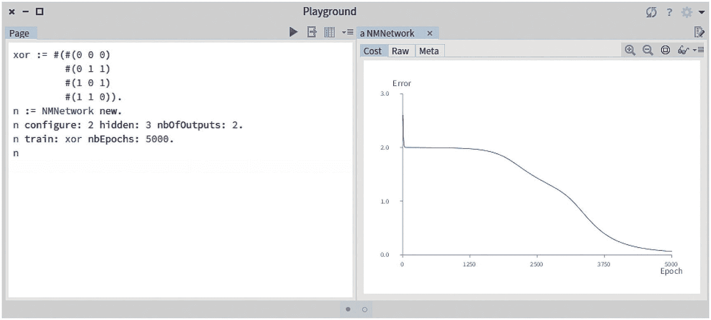

# 7.基于矩阵的神经网络

本章修改了我们的神经网络的实现。在这次修订中，我们的网络将使用矩阵来计算前向和后向传播算法。总的来说，我们基于矩阵的实现由两个类组成，`NMLayer`和`NMNetwork`。由于大部分计算都委托给了我们在前一章中定义的矩阵库，我们新版本的神经网络在代码方面相当轻便。

## 7.1 定义基于矩阵的层

神经网络由几层组成。我们将层描述为`NMLayer`类的一个实例，定义如下:

```py
Object subclass: #NMLayer
    instanceVariableNames: 'w b delta output previous next lr
       numberOfExamples'
    classVariableNames: ''
    package: 'NeuralNetwork-Matrix'

```

正如我们在第一个实现中看到的,`NMLayer`类不包含神经元。相反，使用一个描述权重的矩阵并保存在`w`变量中，另一个矩阵用于保存偏差向量，保存在`b`变量中。

层的初始化简单地包括设置默认学习速率:

```py
NMLayer>>initialize
    super initialize.
    lr := 0.1

```

`NMLayer`类包含许多访问器和赋值器方法。首先，一个层包含一个权重矩阵。使用`w:`进行设置:

```py
NMLayer>>w: matrixForWeights
    "Take a MMatrix as argument"
    w := matrixForWeights

```

使用`w`可访问权重矩阵，如下所示:

```py
NMLayer>>w
    "Return the MMatrix representing the weights"
    ^ w

```

类似地，使用`b:`设置偏置向量，如下所示:

```py
NMLayer>>b: biasVector
    "Set a vector, instance of MMatrix, as the bias vector"
    b := biasVector

```

偏置向量可通过以下方式获得:

```py
NMLayer>>b
    "Return the bias vector"
    ^ b

```

增量矩阵存储在`delta`变量中，如下所示:

```py
NMLayer>>delta: deltaMatrix
    delta := deltaMatrix

```

使用访问器读取它:

```py
NMLayer>>delta
    ^ delta

```

学习率是一个非常小的正数，全局设置为一个层:

```py
NMLayer>>lr: aLearningRate
    lr := aLearningRate

```

各层相互链接。我们使用层的经典表示:网络从最左边的层，即输入层馈入。输出是从最右边的层，即输出层产生的。对于给定的层`l`，`l`的下一层是`l`右边的层，上一层是`l`左边的层。使用以下内容设置下一层:

```py
NMLayer>>next: aLayer
    "Set the next layer"
    next := aLayer

```

使用以下内容检索下一层:

```py
NMLayer>>next
    "Return the next layer"
    ^ next

```

类似地，前一层使用以下内容进行设置:

```py
NMLayer>>previous: aLayer
    "Set the previous layer"
     previous := aLayer

```

前一层使用以下内容获得:

```py
NMLayer>>previous
    "Return the previous layer"
    ^ previous

```

层的输出是使用其访问器获得的，如下所示:

```py
NMLayer>>output
    "Return the output matrix, computed during the feed forward phase"
    ^ output

```

为了计算成本导数，需要有足够数量的例子。使用`numberOfExamples:`方法进行设置，定义如下:

```py
NMLayer>>numberOfExamples: aNumber
    numberOfExamples := aNumber

```

使用相应的访问器读取示例的数量:

```py
NMLayer>>numberOfExamples
    ^ numberOfExamples

```

通过提供该层应该包含的神经元数量和输出数量来初始化该层。还提供随机数发生器来初始化权重和偏置矩阵。我们将初始化方法定义如下:

```py
NMLayer>>nbInputs: nbOfInputs nbOutputs: nbOfOutputs random: random
    "Initialize the layer"
    w := MMatrix newRows: nbOfOutputs columns: nbOfInputs.
    w random: random.
    b := MMatrix newRows: nbOfOutputs columns: 1.
    b random: random.

```

使用`feed:`方法执行前馈一层:

```py
NMLayer>>feed: inputMatrix
    "Feed the layer with the input matrix"
    output := (w +* inputMatrix + b) collect: [ :v | 1 / (1 + v negated exp) ].
^ output

```

一旦误差被反向传播，权重和偏差可以被更新:

```py
NMLayer>>update
    "Update the weights and biases using the delta value"
    w := w - ((delta +* previous output transposed) * lr /
    numberOfExamples).
    b := b - (delta sumHorizontal * lr / numberOfExamples).
    next ifNotNil: [ next update ]

```

第一层使用输入向量来更新其参数:

```py
NMLayer>>update: input
    "Update the weights and biases using the input value"
    w := w - ((delta +* input transposed) * lr / numberOfExamples).
    b := b - (delta sumHorizontal * lr / numberOfExamples).
    next update

```

我们对层的定义现在完成了。接下来我们可以提出一个`NMNetwork`类的定义。

## 7.2 定义基于矩阵的神经网络

我们将把描述基于矩阵的神经网络的类称为`NMNetwork`。下面是它的定义:

```py
Object subclass: #NMNetwork
    instanceVariableNames: 'random errors layers'
    classVariableNames: ''
    package: 'NeuralNetwork-Matrix'

```

这些变量类似于我们第一版的神经网络。`random`变量包含一个随机数生成器，用于初始化层。`errors`变量包含训练过程中产生的误差值。`layers`变量包含了`NMLayer`的实例。

网络初始化时没有层和随机数发生器:

```py
NMNetwork>>initialize
    "Initialize the network with no layer and a proper random generator"
    super initialize.
    layers := OrderedCollection new.
    random := Random seed: 42.

```

当一个层被添加到网络中时，必须维护一个层链:

```py
NMNetwork>>addLayer: aLayer
    "Add a layer to the network. Note that layers form a bidirectional
    chain."
    layers ifNotEmpty: [
        layers last next: aLayer.
        aLayer previous: layers last ].
    layers add: aLayer

```

学习过程的一个中心方法是`backwardX:y:`，它计算误差并沿各层反向传播:

```py
NMNetwork>>backwardX: x y: y
    "Compute and backpropagate the error"
    | lastLayer dz currentLayer |
    lastLayer := layers last.
    dz := lastLayer output - y.
    lastLayer delta: dz.
    currentLayer := lastLayer previous.
    [ currentLayer notNil ] whileTrue: [
        dz := (currentLayer next w transposed +* dz)
                 multiplyPerElement: (currentLayer output collect: [:v | v * (1 - v) ]).
        currentLayer delta: dz.
        currentLayer := currentLayer previous.
    ].

```

为两个给定的向量计算成本函数:

```py
NMNetwork>>computeCost: v1 and: v2
    "Compute the cost function for two provided vectors"
    ^ ((v1 - v2) collect: [ :v | v * v ]) sum

```

网络的配置是通过多种实用方法完成的。以下方法使用一个隐藏层配置网络:

```py
NMNetwork>>configure: nbOfInputs hidden: nbOfNeurons nbOfOutputs:
    nbOfOutputs
    "Configure the network with the given parameters
    The network has only one hidden layer"
    self addLayer: (NMLayer new nbInputs: nbOfInputs nbOutputs:
        nbOfNeurons random: random).
    self addLayer: (NMLayer new nbInputs: nbOfNeurons nbOutputs:
        nbOfOutputs random: random).

```

类似地，可以使用以下方法配置两个隐藏层:

```py
NMNetwork>>configure: nbOfInputs hidden: nbOfNeurons1 hidden:
    nbOfNeurons2 nbOfOutputs: nbOfOutputs
    "Configure the network with the given parameters. The network has two hidden layers"
    self addLayer: (NMLayer new nbInputs: nbOfInputs nbOutputs:
        nbOfNeurons1 random: random).
    self addLayer: (NMLayer new nbInputs: nbOfNeurons1 nbOutputs:
        nbOfNeurons2 random: random).
    self addLayer: (NMLayer new nbInputs: nbOfNeurons2 nbOutputs:
        nbOfOutputs random: random).

```

使用`feed:`方法简单地完成向前进给:

```py
NMNetwork>>feed: inputs
    "Feed the network with the provided inputs vector
    Return the output value as a matrix"
    | mat |
    mat := inputs.
    layers do: [ :l | mat := l feed: mat ].
    ^ mat

```

使用专用方法定义网络的学习速率，如下所示:

```py
NMNetwork>>lr: aLearningRateAsFloat
    "Globally set the learning rate"
    layers do: [ :l | l lr: aLearningRateAsFloat ]

```

使用以下方法进行培训:

```py
NMNetwork>>trainX: x y: y nbOfEpochs: nbEpochs
    "Train the network with a set of inputs against the expected values"
    | cost output |
    "We need to tell to each layer the number of examples they have"
    layers do: [ :l | l numberOfExamples: y nbColumns ].
    errors := OrderedCollection new.
    nbEpochs timesRepeat: [
        output := self feed: x.
        cost := self computeCost: output and: y.
        self backwardX: x y: y.
        self update: x.
        errors add: cost.
    ].
    ^ cost

```

权重和偏差的更新使用以下方法完成:

```py
NMNetwork>>update: input
    "Update the weights and bias using the provided input vector"
    layers first update: input

```

请注意，该层执行更新其参数的工作。预测可以通过简单地从我们最初的实现中复制`predict:`方法来实现:

```py
NMNetwork>>predict: inputs
    "Make a prediction. This method assumes that the number of outputs
       is the same as the number of different values the network can
       output"
    "The index of a collection begins at 1 in Pharo,
    which is why we need to substrate 1"
    | outputs |
    outputs := self feed: inputs.
    ^ (outputs asArray indexOf: (outputs max)) - 1

```

我们定义了`train:nbEpochs:`方法，这对于使用带标签的数据集训练模型很有用:

```py
NMNetwork>>train: data nbEpochs: nbEpochs
    "Data is provided as a collection of arrays.
    The example data needs to be labeled using a numerical value"
    | x y labels numberOfOutputs |
    x := (MMatrix newFromArrays: (data collect: #allButLast))
       transposed.
    layers do: [ :l | l numberOfExamples: data size ].
    labels := data collect: #last.
    numberOfOutputs := labels asSet size.
    labels := labels collect: [ :row |
        | expectedOutput |
        expectedOutput := Array new: numberOfOutputs withAll: 0.
        expectedOutput at: row + 1 put: 1.
        expectedOutput
    ].
    y := (MMatrix newFromArrays: labels) transposed.
    ^ self trainX: x y: y nbOfEpochs: nbEpochs

```

在那个阶段，我们有一个基于矩阵的网络，它可以从一个标记的数据集学习。考虑下面的例子:

```py
xor := #(#(0 0 0)
         #(0 1 1)
         #(1 0 1)
         #(1 1 0)).
n := NMNetwork new.
n configure: 2 hidden: 3 nbOfOutputs: 2.
n train: xor nbEpochs: 5000.
n predict: (MMatrix newFromVector: #(1 0)).

```

预测的结果是`1`。同样，评估表达式`npredict: (MMatrix newFromVector: #(1 1))`。返回`0`。下一节介绍了一种绘制误差函数的简单方法。

## 7.3 可视化结果

我们将扩展`NMNetwork`类来可视化误差在各个时期的演变。简单地定义这个方法:

```py
NMNetwork>>viewLearningCurve
    | b ds |
    errors
        ifEmpty: [ ^ RTView new
                add: (RTLabel elementOn: 'Should first run the network');
               yourself ].
b := RTGrapher new.
"We define the size of the charting area"
b extent: 500 @ 300.
ds := RTData new.
ds samplingIfMoreThan: 2000.
ds noDot.
ds connectColor: Color blue.
ds points: (errors collectWithIndex: [ :y :i | i -> y ]).
ds x: #key.
ds y: #value.
ds dotShape rectangle color: Color blue.
b add: ds.
b axisX noDecimal; title: 'Epoch'.
b axisY title: 'Error'.
^ b

```

挂钩到`GTInspector`框架是使用以下方法完成的:

```py
NMNetwork>>viewLearningCurveIn: composite
    <gtInspectorPresentationOrder: -10>
    composite roassal2
        title: 'Cost';
        initializeView: [ self viewLearningCurve ]

```

评估前一部分的训练指令应输出如图 [7-1](#Fig1) 所示的误差曲线。



图 7-1

可视化成本函数

## 7.4 鸢尾花数据集

我们现在可以修改脚本，在 Iris flower 数据集上训练一个神经网络。考虑这个脚本:

```py
"The execution of this script initializes the variable irisData.
    This variable is used in the subsequent scripts of this chapter"
irisCSV := (ZnEasy get: 'https://agileartificialintelligence.github.io/
    Datasets/iris.csv') contents.
lines := irisCSV lines.
lines := lines allButFirst.
tLines := lines collect: [ :l |
             | ss |
             ss := l substrings: ','.
             (ss allButLast collect: [ :w | w asNumber ]), (Array with: ss last) ].
irisData := tLines collect: [ :row | |l|
             row last = 'setosa' ifTrue: [ l := #( 0 ) ].
             row last = 'versicolor' ifTrue: [ l := #( 1 ) ].
             row last = 'virginica' ifTrue: [ l := #( 2 ) ].
             row allButLast, l ].
irisData.

n := NMNetwork new.
n configure: 4 hidden: 6 nbOfOutputs: 3.
n train: irisData nbEpochs: 3000.
n

```

结果和我们之前看到的一样。

## 7.5 我们在本章中看到了什么？

本章修改了我们以前的神经网络实现。我们修改的实现采用矩阵来模拟网络的状态，这大大简化了它的实现。然而，它提高了抽象层次，因为矩阵不是核心。该章探讨了:

*   *利用矩阵实现前向和后向传播。*它使用上一章介绍的矩阵库。

*   *用虹膜分类的例子来说明新的神经网络类。*