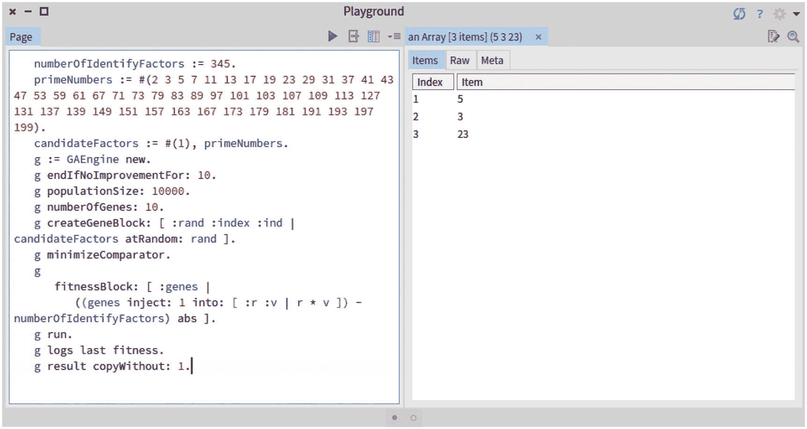
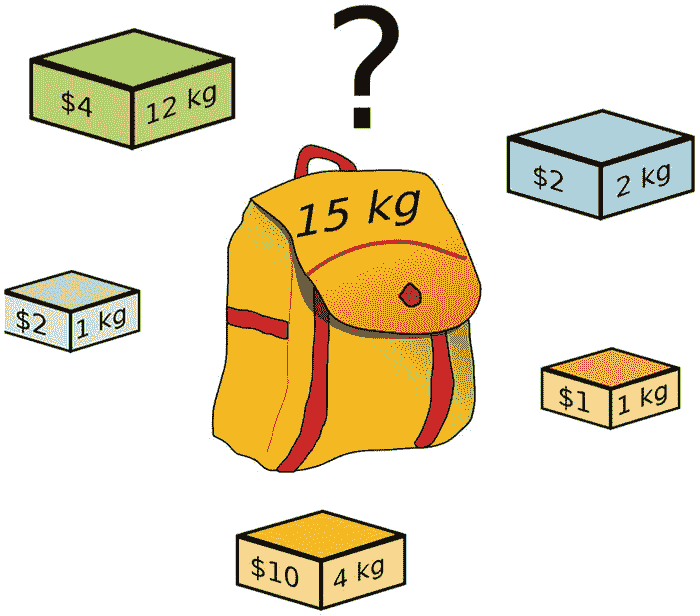
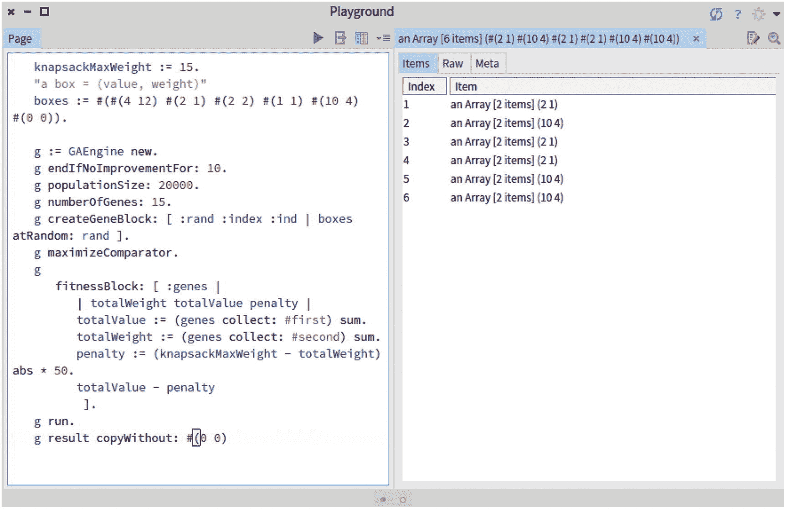
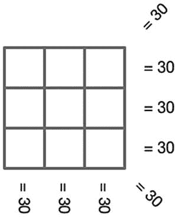
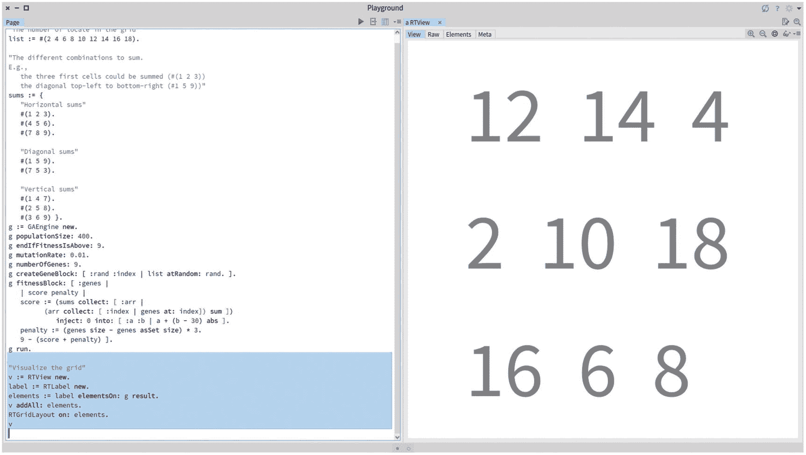
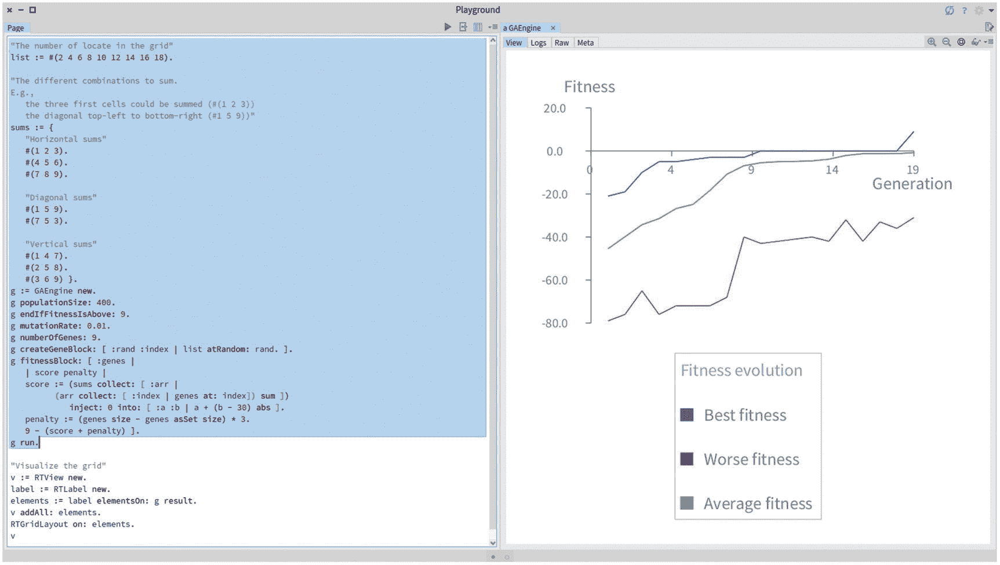

# 9.遗传算法在起作用

本章通过解决一些困难的算法问题来说明遗传算法的使用。本章介绍的大多数问题都涉及到一些算术运算，因此带有数学的味道。

## 9.1 算术基本定理

质数是一个大于 1 的整数，它的唯一因子是 1 和它本身。例如，7 是一个素数，因为它只能被 7 和 1 整除。数字 10 不是一个质数，因为它能被 2 和 5 整除——这两个质数。

在数论中，有一个定理叫做**算术基本定理*，它表述为“任何大于 1 的整数要么本身就是素数，要么可以写成素数的唯一乘积。”请注意，这种表示是唯一的，除了因子的顺序。例如，数字 345 是因子 3*5*23 的乘积。找到这个因素列表在计算上是昂贵的。我们将使用遗传算法来识别任何给定数字的质因数。因此，一个基因将代表一个质数因子。*

 *需要注意的是，因子的数量取决于要分解的数量。例如，数字`345`有三个因子(`3`、`5`和`23`，而数字`788,389`从`788,389 = 7` * `41` * `41` * `67`开始有四个因子。在我们上一章介绍的遗传算法中，所有的个体都有完全相同数量的基因。那么我们如何表示任意数量的基因呢？一种非常适合我们情况的方法是将`1`作为一个可能的因素。假设每个个体有 10 个基因，`345`的因子可以用值`3`、`5`、`23`和因子`1`的 7 倍来编码。然后，解决方案将是包含在个体中的因子，我们忽略其值`1`。

适应度函数就是质因数的乘积和我们感兴趣的寻找因数的数之间的绝对差。如果适应度等于`0`，那么我们找到了解决方案。

考虑以下脚本:

```py
numberOfIdentifyFactors := 345.
primeNumbers := #(2 3 5 7 11 13 17 19 23 29 31 37 41 43 47 53 59 61 67
   71 73 79 83 89 97 101 103 107 109 113 127 131 137 139 149 151 157
   163 167 173 179 181 191 193 197 199).
candidateFactors := #(1), primeNumbers.
g := GAEngine new.
g endIfNoImprovementFor: 10.
g populationSize: 10000.
g numberOfGenes: 10.
g createGeneBlock:
    [ :rand :index :ind | candidateFactors atRandom: rand ].
g minimizeComparator.
g
   fitnessBlock: [ :genes |
       ((genes inject: 1 into: [ :r :v | r * v ]) -
          numberOfIdentifyFactors) abs ].
g run.

```

我们提供了 46 个素数，算法必须从中选择相关的数。fitness 函数包含`genes inject: 1 into: [ :r :v | r * v ]`表达式，该表达式返回包含在`genes`临时变量中的数字的乘积。例如，`#(3 5 23)inject: 1 into: [ :r :v | r * v ]`的计算结果为`345`。

在脚本执行之后，我们可以用这个表达式来验证它是如何运行的:

```py
...
g logs last bestFitness.

```

如果值是`0`，我们找到精确的质因数。如果我们没有找到它，我们可以增加人口规模或增加`endIfNoImprovementFor:`的论点。

质因数可以使用下面的表达式获得:

```py
...
g result copyWithout: 1.

```



图 9-1

345 素因子的识别

图 [9-1](#Fig1) 给出了执行整个脚本的结果。

对于任何非素数，素因子的序列都是唯一的。这意味着数字`345`只能分解成质因数组——`3`、`5`和`23`。没有其他产生`345`的质数组合。因此，质因数构成了`345`合数的“同一性”。算术基本定理有一个很好的名字。这个定理有很多应用，其中之一就是密码学。如果说密码学像今天这样重要，本质上是因为这个定理。在密码学中，一个质因数代表一个私钥，如果这个合数足够大，那么要找到质因数就要花费大量的时间。

## 9.2 背包问题

背包问题是组合优化中一个众所周知的问题。可以总结如下:给定一组项目，每个项目都有一个值和一个权重，确定集合中要包含的每个项目的数量，使得(I)总权重小于或等于给定的限制，以及(ii)总值尽可能大。

我们将考虑这个问题的两个变体——无界背包问题和 0-1 背包问题。



图 9-2

背包问题(从维基百科获得，作者大可，知识共享署名，共享 2.5 通用版)

图 [9-2](#Fig2) 举例说明背包问题。有五个箱子可供选择，每个箱子都有特定的价值和重量。这个包不能装超过 15 公斤的东西。如果我们考虑问题的无界变体，那么解决方案是三盒 10 美元和三盒 2 美元。如果我们考虑 0-1 变量，解决方案是除了 4 美元的盒子以外的所有盒子。

### 9.2.1 无界背包问题变体

在这个变体中，一个盒子可以被多次使用。我们使用遗传算法来搜索最优解。适应度函数反映了一组给定盒子的值(该值的总和)减去惩罚。该损失是总重量与背包容量之间的差值。考虑以下脚本:

```py
knapsackMaxWeight := 15.
"a box = (value, weight)"
boxes := #(#(4 12) #(2 1) #(2 2) #(1 1) #(10 4) #(0 0)).

g := GAEngine new.
g endIfNoImprovementFor: 10.
g populationSize: 20000.
g numberOfGenes: 15.
g createGeneBlock: [ :rand :index :ind | boxes atRandom: rand ].
g maximizeComparator.
g
    fitnessBlock: [ :genes |
        | totalWeight totalValue penalty |
        totalValue := (genes collect: #first) sum.
        totalWeight := (genes collect: #second) sum.
        knapsackMaxWeight < totalWeight
            ifTrue: [ penalty := (knapsackMaxWeight - totalWeight) abs
               * 50 ]
            ifFalse: [ penalty := 0 ].
        totalValue - penalty
         ].
g run.
g result copyWithout: #(0 0)

```

`knapsackMaxWeight`变量是指背包的容量。`boxes`变量包含所有可用的框。每个盒子被表示为一个元组`(value, weight)`。

包的容量为 15kg，最轻的箱子重 1kg，如图 [9-2](#Fig2) 所示。最轻的盒子重 1kg 的事实设定了我们算法的基因数量:每个个体不需要有超过 15 个基因。更多数量的基因没有意义，因为 16 个或更多盒子的总和将超过 15 公斤。相反，少于 15 个基因可能会排除一些解决方案。比如最优解是 15 箱 1kg，我们的算法应该能找到。综上所述，似乎每个人都应该有 15 个基因。

然而，如果我们用每个个体 15 个基因来调整我们的算法，我们如何用少于 15 个盒子来表示解决方案呢？特别是，无界背包问题的解决方案有六个盒子——三个 10 美元的盒子和三个 2 美元的盒子——总重量为 15 公斤。这不完全是我们的算法将产生的结果，因为它将寻找由*正好* 15 个盒子组成的解。因此，强制一个由 15 个盒子组成的解会使我们的算法错过这个解。因此，我们需要一种方法来放松一个解决方案必须有 15 个盒子的事实。在这种特殊情况下，只需向我们的算法`#(0 0)`添加一个没有值的空盒子，就可以很好地完成工作:该算法可以挑选六个盒子(问题的真实解)，并用空盒子填充携带该解的个人的九个剩余位置。

适应度函数包含三个变量。`totalValue`变量对包含在`genes`变量中的一组框的值求和。`totalWeight`变量是箱子的重量。我们定义了一个`penalty`变量，它是行李容量和`totalWeight`之间的绝对差值。我们使用`50`因子来确保该值不会取代惩罚..



图 9-3

遗传算法在背包问题中的应用

图 [9-3](#Fig3) 说明了脚本的执行。

### 9 . 2 . 2 0-1 背包问题变体

在这个变体中，每个可用的框最多出现一次。我们用与前一个问题相似的方法处理这个问题；然而，基因的编码和解码必须反映这样一个事实，即每个盒子在每个个体中最多只能出现一次。

在解决这个问题的变体时，要考虑的关键方面是要认识到这个问题类似于搜索一个用二进制写的数(即由`0`和`1`组成)。假设盒子的集合是固定的和有序的，正如我们到目前为止所指定的，那么我们可以将值`0`分配给一个盒子，以指示该盒子在由个人表示的解决方案中*不存在*。类似地，值`1`表示盒子*存在*。

考虑以下脚本:

```py
knapsackMaxWeight := 15.
"a box = (value, weight)"
boxes := #(#(4 12) #(2 1) #(2 2) #(1 1) #(10 4) ).
g := GAEngine new.
g endIfNoImprovementFor: 10.
g populationSize: 20000.
g numberOfGenes: boxes size.
g createGeneBlock: [ :rand :index :ind | #(0 1) atRandom: rand ].
g maximizeComparator.
g fitnessBlock: [ :genes |
        | totalWeight totalValue penalty |
        decodeToBoxes := OrderedCollection new.
        genes doWithIndex: [ :b :ind | b = 1 ifTrue: [ decodeToBoxes
           add: (boxes at: ind) ] ].
        decodeToBoxes
           ifEmpty: [ totalValue := 0\. totalWeight := 0 ]
           ifNotEmpty: [
               totalValue := (decodeToBoxes collect: #first) sum.
               totalWeight := (decodeToBoxes collect: #second) sum ].
        knapsackMaxWeight < totalWeight
            ifTrue: [ penalty := (knapsackMaxWeight - totalWeight) abs
               * 50 ]
            ifFalse: [ penalty := 0 ].

        totalValue - penalty ].
g run.

"We now retrieve the solution"
decodeToBoxes := OrderedCollection new.
g result doWithIndex: [ :b :ind |
            b = 1 ifTrue: [ decodeToBoxes add: (boxes at: ind) ] ].
decodeToBoxes

```

算法选择的盒子是`#(2 1)#(2 2)#(1 1)#(10 4)`。我们现在将详细描述脚本。基因要么是一个值`0`要么是`1`。适应度函数首先选择包含在`genes`变量中的`0`和`1`组所指示的方框。作为当前解决方案一部分的盒子保存在`decodeToBoxes`变量中。我们需要验证`decodeToBoxes`是否为空。如果`genes`变量仅由`0` s 组成，则它可能为空。一旦我们有了由`genes`变量指示的总值和总重量，我们就需要像前面所做的那样，将罚值设置为`knapsackMaxWeight`和`totalWeight`之间的差值。

### 编码和编码

从概念上讲，背包问题的两种变体在每个盒子可能出现的范围上有所不同。正如我们已经看到的，这可能会对如何编码一个可能的解决方案产生影响。在无界变体中，我们有一组盒子，而在 0-1 变体中，我们有一组`0`和`1`作为解决方案。

找到合适的编码是至关重要的，因为我们必须减轻算法的负担，以满足不同的目标和约束。特别是，在无界版本中，我们有两个目标:最大化包的价值，并确保包的总重量不超过限制。我们用罚函数解决了这个问题，这是一个足够的方法来表达这个问题(用很少的盒子和很低的重量限制)。在 0-1 版本中，我们有第三个目标，那就是盒子不应该重复出现。我们可以增加第二个惩罚来表达这个约束。然而，该算法将是次优的，因为它将不得不解决一些涉及三个目标的折衷。为了减少搜索，我们使用 0-1 变体的编码，这隐式地避免了框重复。

背包问题是*多目标问题*的一个例子，因为总目标可以分解成更小的子目标。有多种方法可以解决多目标问题，这超出了本章的范围。

## 9.3 会议室调度问题

会议室调度是一个经典问题，包括将会议分配到不同的房间。会议不应重叠，但我们仍应使用最少数量的不同会议室。为了说明这个问题，我们把一个会议看作一个元组 *(* `start time, end time` *)* 。两个会议`#(#(1 3)(2 3))`确实重叠，因此，我们需要在不同的房间召开会议。反之，两个会议`#(#(1 3)(4 5))`可以在同一个房间举行。考虑以下会议:`#(#(1 3)#(2 3)#(5 6)#(7 9)#(4 7))`。两个房间是必要的，因为会议`#(2 3)`和`#(4 7)`可以在一个房间举行，而`#(1 3),#(5 6),`和`#(7 9)`可以在另一个房间举行。

我们可以使用遗传算法来确定举行一系列会议所需的最小房间数。考虑这个脚本:

```py
"We assume that each meeting is correctly defined"
"a meeting = (start time, end time)"
meetings := #(#(1 3) #(2 3) #(5 6) #(7 9) #(4 7)).
numberOfMeetings := meetings size.

g := GAEngine new.
g endIfNoImprovementFor: 10.
g populationSize: 20000.
g numberOfGenes: numberOfMeetings.
g createGeneBlock: [ :rand :index :ind | (1 to: numberOfMeetings)
    atRandom: rand ].
g minimizeComparator.
g
    fitnessBlock: [ :genes |
        | distribution |
        distribution := OrderedCollection new.
        numberOfMeetings timesRepeat: [ distribution add:
           OrderedCollection new ].
        genes doWithIndex: [ :roomNumber :index | (distribution at

:
           roomNumber) add: (meetings at: index) ].

        numberOfOverlap := 0.
        distribution do: [ :aSetOfMeetings |
           table := OrderedCollection new: 10 withAll: 0.
           aSetOfMeetings do: [ :meet |
               meet first to: meet second do: [ :v | table at: v put:
                  (table at: v) + 1 ]
           ].
           numberOfOverlap := numberOfOverlap + (table select: [ :v |
              v >= 2 ]) size.
        ].
         (distribution select: #notEmpty) size + numberOfOverlap.
        ].
g run.
g result asSet size

```

`meetings`变量包含会议列表。我们假设每个会议都被正确定义(例如，结束时间大于开始时间)。`numberOfMeetings`变量包含我们开会的次数。

我们认为基因是特定会议的房间分配。如果我们考虑会议的集合`#(#(1 3)#(2 3)#(5 6)#(7 9)#(4 7))`，那么一个可能的解决方案是`#(1 5 1 1 5)`，这意味着会议`#(1 3)`、`#(5 6)`和`#(7 9)`在`1`室举行，而会议`#(2 3)`和`#(4 7)`在`5`室举行。因此，解决方案是两个房间。

因为我们希望最小化房间的数量和重叠的数量，所以遗传算法将寻找最小化适应度函数的房间分配。适应度函数计算不同房间的数量和重叠的数量。最后，不同房间的数量由`gresultasSetsize`表达式给出。

## 9.4 迷你 sodoku

考虑下面这组数字:`8 4 6 2 10 12 14 16 18`。如何将这些数字放入一个 3×3 的网格中，使每条水平线、垂直线和对角线都等于 30？



图 9-4

迷你数独

图 [9-4](#Fig4) 显示了数字应该位于的网格。查看以下脚本:

```py
"The number of locate in the grid"
list := #(2 4 6 8 10 12 14 16 18).

"The different combinations to sum.
E.g., the three first cells could be summed (#(1 2 3))
      the diagonal top-left to bottom-right (#1 5 9))"
sums := {
    "Horizontal sums"
    #(1 2 3).
    #(4 5 6).
    #(7 8 9).

    "Diagonal sums"
    #(1 5 9).
    #(7 5 3).

    "Vertical sums"
    #(1 4 7).
    #(2 5 8)

.
    #(3 6 9) }.
g := GAEngine new.
g populationSize: 400.
g endIfFitnessIsAbove: 9.
g mutationRate: 0.01.
g numberOfGenes: 9.
g createGeneBlock: [ :rand :index | list atRandom: rand. ].
g fitnessBlock: [ :genes |
    | score penalty |
    score := (sums collect: [ :arr |
            (arr collect: [ :index | genes at: index]) sum ])
                inject: 0 into: [ :a :b | a + (b - 30) abs ].
    penalty := (genes size - genes asSet size) * 3.
    9 - (score + penalty) ].
g run.

"Visualize the grid"
v := RTView new.
label := RTLabel new.
elements := label elementsOn: g result.
v addAll: elements.
RTGridLayout on: elements.
v

```

提供给`fitnessBlock:`方法的块迭代包含在`sums`变量中的每个组合，如果总和是 30，则加上`1`，否则加上`0`。我们能拥有的最大值是`9`，所以当它达到一个高于`8`的适应度时，算法结束。



图 9-6

迷你数独的结果



图 9-5

适应度的进化

图 [9-5](#Fig5) 显示了适应度的演变，图 [9-6](#Fig6) 显示了结果。我们要感谢 Milton Mamani 制作了这个例子。

## 9.5 我们在本章中看到了什么？

这一章给出了三个例子，说明如何有效地利用遗传算法找到一个明显复杂问题的解决方案:

*   算术的基本定理发现，对于给定的数`N` *、*，一组素数相乘后等于`N`。

*   背包问题的两种变型，即无界变型和 0-1 变型，选择盒子而不通过总限制，同时最大化所选集合的值。

*   房间调度问题，将会议分配到各个房间，同时避免重叠。

遗传算法是解决这些问题的一种简单有效的方法。但是，它不能保证结果是最优解。算法可以找到一个候选解，对此我们盲目地把它当成一个方便的解。遗传算法可能无法在合理的时间内找到最佳解决方案。在前一章中，我们使用遗传算法来搜索三个字母长的单词`cat`。要求算法搜索一个有 1000 个字母的单词会花费很长时间，算法似乎不会收敛。当这种情况发生时，专门化遗传操作是明智的，正如我们将在接下来的章节中所做的那样。

下一章将介绍一个使用遗传算法的更大的例子。它还将讨论到目前为止我们使用的遗传算子的局限性。*