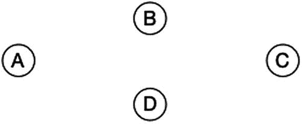
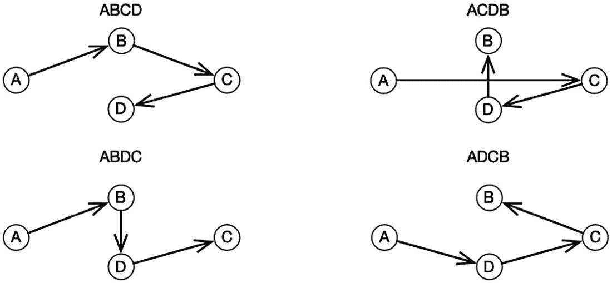
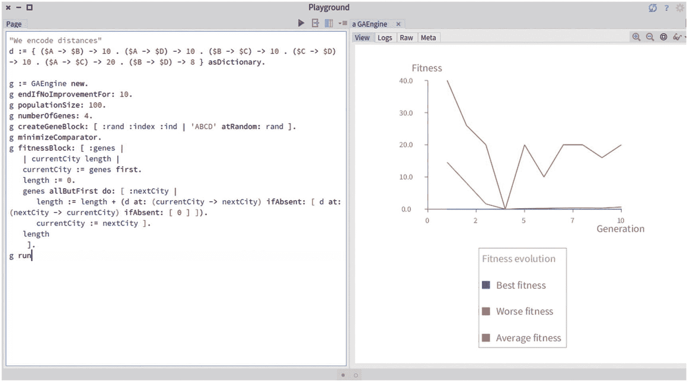
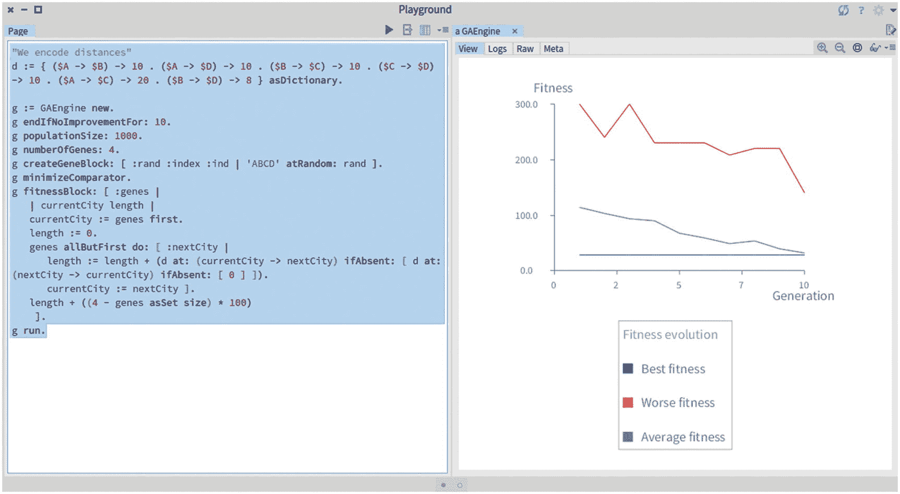
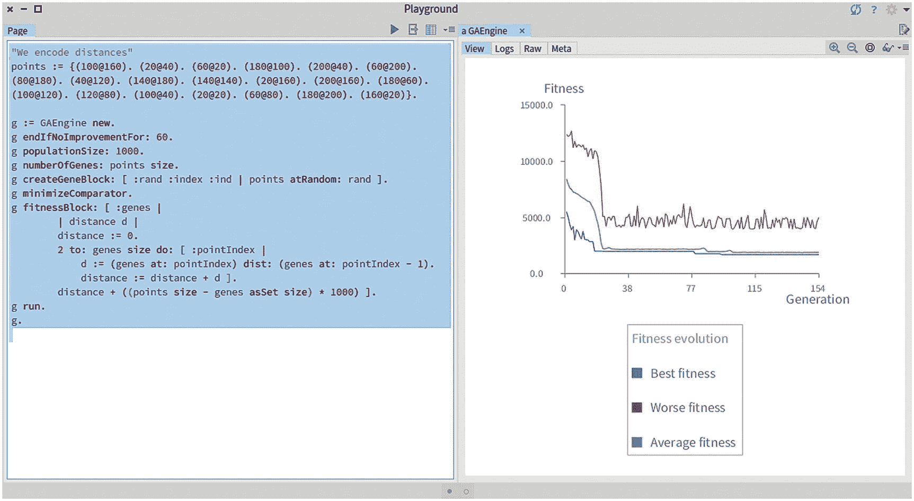
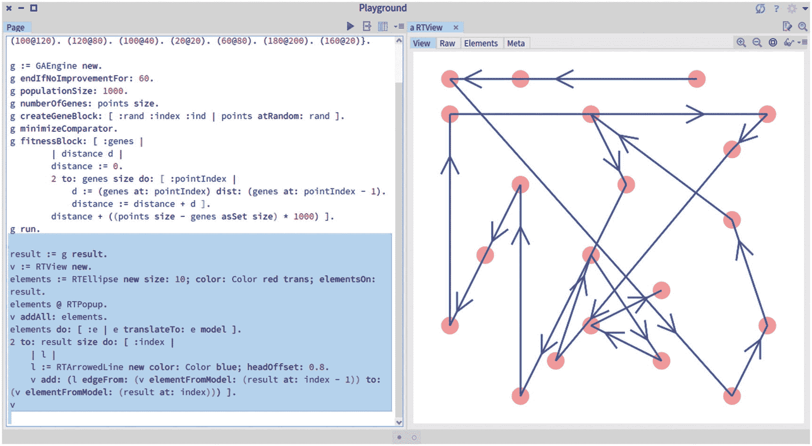
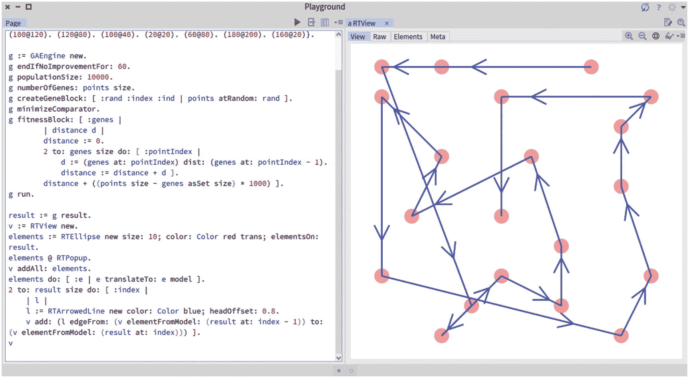
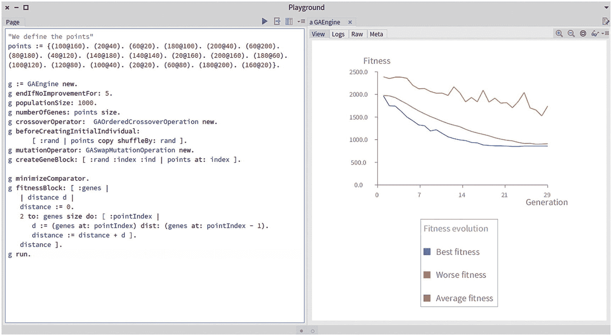
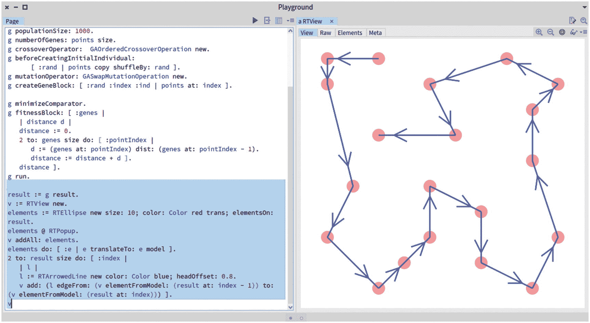

# 10.旅行推销员问题

旅行商问题是一个经典的算法问题。它包括确定几个相连城市之间的最短可能路线。这个问题不仅从算法的角度来看是相关的，而且它还有许多具体的应用，比如微芯片制造，你很快就会看到。

本章使用遗传算法逐步建立一个非平凡的问题解决方案。这一章从一个简单的方法开始，提出了一个健壮的、实用的解决方法。

## 问题的说明



图 10-1

旅行推销员问题的设置

考虑图 [10-1](#Fig1) 中给出的例子。该图显示了位于水平菱形中的四个城市。每个城市都有一个 2D 坐标，因此位于一个二维平面上。假设旅行者从城市 A 开始他们的旅程，许多路径可以访问所有的城市。



图 10-2

旅行推销员问题的说明

如图 [10-2](#Fig2) 所示，可能有不同的路径，包括 ABCD、ACDB、ABDC 和 ADCB。参观所有城市的最短路径是什么？这四个城市呈水平菱形分布。因此，城市 B 和城市 D 彼此最接近。访问所有城市的最短路径必须包含线段 BD(或 DB ),然后倾向于菱形外缘的线段。AC(或 CA)段不能属于最短路径。

## 10.2 旅行推销员问题的相关性

从理论和实践的角度来看，旅行商问题都是一个值得关注的相关问题。TSP 是在 20 世纪 30 年代早期制定的，并且是研究最多的算法问题之一。TSP 的应用很多，从组合优化(即从有限的对象集合中找到最优对象)到资源规划、DNA 测序和电子电路制造。例如，当建造电子板时，细钻头必须在板上钻孔。使用孔之间的最短路径可能会对生产电路板的时间产生重大影响。尽管这个问题已经研究了很长时间，但是还没有发现通用的解决方案。

TSP 显然是一个简单的问题:你只需以最佳方式连接城市。然而，TSP 是一个非常困难的问题，被认为是 NP 难的。NP-hard 意味着，对于两个给定的候选解，很容易挑选出最佳的一个(例如，给定两条路径，很容易挑选出最短的一个)，但是没有有效的方法来解决问题本身。如果有一天有人找到了 TSP 的解析解，世界将会受到深远的影响。解析地解决 NP 难问题(例如，解析地找到最短路径)意味着任何 NP 完全问题也可以解析地解决。你听说过 P 对 NP 问题吗？这是数学家和理论家计算机科学家今天面临的最具挑战性的问题之一。克莱数学研究所将颁发 1，000，000 美元的千禧年奖给通过分析解决 NP 难题的个人或团体。

在这一章中，我们并不假装通过分析来解决这个问题。然而，使用遗传算法来寻找一条好的路径是一种非常可靠的技术，尽管它可能不是最佳路径。

## 10.3 幼稚的方法

我们如何编码一条路径，使它能被遗传算法利用？对于这个问题，计算适应度是很简单的:它只是线段长度的总和。我们可以尝试以下脚本:

```py
"We encode distances"
d := { ($A -> $B) -> 10 . ($A -> $D) -> 10 . ($B -> $C) -> 10 . ($C ->
    $D) -> 10 . ($A -> $C) -> 20 . ($B -> $D) -> 8 } asDictionary.
g := GAEngine new.
g endIfNoImprovementFor: 10.
g populationSize: 100.
g numberOfGenes: 4.
g createGeneBlock: [ :rand :index :ind | 'ABCD' atRandom: rand ].
g minimizeComparator.
g fitnessBlock: [ :genes |
    | currentCity length |
    currentCity := genes first.
    length := 0.
    genes allButFirst do: [ :nextCity |
        length := length + (d at: (currentCity -> nextCity) ifAbsent: [
            d at: (nextCity -> currentCity) ifAbsent: [ 0 ] ]).
        currentCity := nextCity ].
    length
    ].
g run

```



图 10-3

天真方法的结果

我们将地图编码到保存在变量`d`中的字典中。字典的每一个词条都是两个城市之间的一条路径。基因只是四个可能城市中的一个城市。由于有四个不同的城市，我们的算法要经过这四个城市，所以每个个体都有四个基因。适合度计算为连接这四个城市的路线的长度。我们有两个临时变量— `currentCity`和`length`。对于基因中包含的每个城市，适应度函数检索其与当前城市的距离。要计算的段由输入`d at: (currentCity ->nextCity)`或相反方向`d at: (nextCity->currentCity)`给出。

图 [10-3](#Fig3) 显示了运行的结果。最适合的是`0`，这显然不是我们所期待的。一条访问四个城市的路线不能有`0`的长度。点击`Logs`选项卡，显示所有人都是`($B $B $B $B)`。遗传算法告诉我们，最小的旅行距离是根本不旅行！

如何强制算法避免访问相同的城市？为了有效，路径应该只穿过所有城市一次。最简单的方法是在发生这种情况时招致惩罚，就像我们在上一章所做的那样。考虑这个脚本的修改版本:

```py
"We encode distances"
d := { ($A -> $B) -> 10 . ($A -> $D) -> 10 . ($B -> $C) -> 10 . ($C ->
    $D) -> 10 . ($A -> $C) -> 20 . ($B -> $D) -> 8 } asDictionary.
g := GAEngine new.
g endIfNoImprovementFor: 10.
g populationSize: 1000.
g numberOfGenes: 4.
g createGeneBlock: [ :rand :index :ind | 'ABCD' atRandom: rand ].
g minimizeComparator.
g fitnessBlock: [ :genes |
    | currentCity length |
    currentCity := genes first.
    length := 0.
    genes allButFirst do: [ :nextCity |
        length := length + (d at: (currentCity -> nextCity) ifAbsent: [
            d at: (nextCity -> currentCity) ifAbsent: [ 0 ] ]).
        currentCity := nextCity ].
    length + ((4 - genes asSet size) * 100)
    ].
g run.

```



图 10-4

改进简单的方法

图 [10-4](#Fig4) 现在呈现了一个可接受的结果。最佳路径的适应度为`28`。蓝色曲线没有随时间演变，这意味着算法从一开始就找到了解决方案。点击`Logs`选项卡显示解决方案。例如，我们看到 ABDC 和 ABCD 是解，这很容易验证。乍一看，我们的处罚似乎起了作用。良好的...不完全是，我们将会看到。

让我们选一个更复杂的例子。以下脚本将我们的城市列表替换为点列表:

```py
"We encode distances"
points := {(100@160). (20@40). (60@20). (180@100). (200@40). (60@200).
    (80@180). (40@120). (140@180). (140@140). (20@160). (200@160). (180
    @60). (100@120). (120@80). (100@40). (20@20). (60@80). (180@200).
    (160@20)}.

g := GAEngine new.
g endIfNoImprovementFor: 60.
g populationSize: 1000.
g numberOfGenes: points size.
g createGeneBlock: [ :rand :index :ind | points atRandom: rand ].
g minimizeComparator.
g fitnessBlock: [ :genes |
        | distance d |
        distance := 0.
        2 to: genes size do: [ :pointIndex |
            d := (genes at: pointIndex) dist: (genes at: pointIndex -
1).
            distance := distance + d ].
        distance + ((points size - genes asSet size) * 1000) ].
g run.

```



图 10-5

改进简单的方法

使用在`Point`类中定义的`dist:`方法计算距离。脚本的结果如图 [10-5](#Fig5) 所示。似乎该算法找到了一个令人信服的解决方案，因为它达到了一个平台。我们可以将下面的脚本附加到前面的脚本中:

```py
...
result := g result.
v := RTView new.
elements := RTEllipse new size: 10; color: Color red trans; elementsOn:
    result.
elements @ RTPopup.
v addAll: elements.
elements do: [ :e | e translateTo: e model ].
2 to: result size do: [ :index |
    | l |
    l := RTArrowedLine new color: Color blue; headOffset: 0.8.
    v add: (l edgeFrom: (v elementFromModel: (result at: index - 1)) to
        : (v elementFromModel: (result at: index))) ].
v

```



图 10-6

想象天真方法的结果

图 [10-6](#Fig6) 显示了算法的结果。显然，蓝色箭头线并不表示连接所有城市的最短路径。例如，在图的左上部分有两个非常接近的城市没有连接。最佳解决方案当然应该包含这两个城市之间的路段，但算法的结果没有利用这一点。因此，我们的算法给出的结果很可能与最优解相差甚远。



图 10-7

10K 人口使用简单方法的结果

如果我们增加人口数量呢？图 [10-7](#Fig7) 显示了同样的算法对 10，000 个人的结果。结果现在显然更接近解决方案。

这样的问题应该很容易解决。那么，为什么遗传算法苦苦求解呢？原因是算法在努力避免多余的城市。该算法不是探索可能的有效候选者集合，而是努力识别有效候选者。这就是为什么我们把我们的解决方案标为*幼稚*。引入惩罚作为引导算法的方式具有非常负面的副作用，即它寻找不受该惩罚影响的个体，从而为探索有效路径留下很小的空间。

这个故事的寓意是，我们应该使用算法来探索有效的路径，而不是用它来努力寻找任何有效的路径。还记得墨菲定律吗？如果算法生成随机路径，它肯定要处理随机生成的混乱。我们不应该对无效的路径进行惩罚，而应该以这样一种方式调整算法，即在初始群体中和作为遗传操作的结果，只能生成有效的路径。

## 10.4 适当的遗传操作

使用我们的四个城市的例子，考虑路径 ABCD 和 DCBA。任何遗传操作，无论是这两条路径之间的交叉，还是其中任何一条路径的遗传突变，都会产生无效路径。

我们能设计出不产生无效路径的遗传操作吗？答案是肯定的。本章的剩余部分将介绍两种操作:交换变异操作和 T2 有序交叉操作。

## 10.5 互换变异操作

不像`GAMutationOperation`类实现的那样，用任何一个基因值替换另一个基因值，我们将*交换*一个个体中的两个基因值。例如，如果我们有 ABCD，交换突变可以通过交换 A 和 c 产生 CBAD。这种突变永远不会产生 AACD，因为这不可能是交换两个元素的结果。

幸运的是，我们为实施新的突变操作做好了准备。我们可以定义`GASwapMutationOperation`类:

```py
GAAbstractMutationOperation subclass: #GASwapMutationOperation
    instanceVariableNames: ''
    classVariableNames: ''
    package: 'GeneticAlgorithm-Core'

```

我们可以覆盖`doMutate:`方法来交换基因，如下所示:

```py
GASwapMutationOperation>>doMutate: individual
    "Mutate genes of the argument by swapping two gene values"

    | i2 tmp |
    self checkForRandomNumber.
    1 to: individual genes size do: [ :i1 |
        self randomNumber <= mutationRate
            ifTrue: [
                i2 := random nextInt: individual genes size.
                tmp := individual genes at: i1.
                individual genes at: i1 put: (individual genes at: i2).
                individual genes at: i2 put: tmp ] ]

```

该方法随机选取两个基因指数并交换它们的值。这个新的`GASwapMutationOperation`操作符确保了一个突变不会产生无效的结果(例如，一个有重复城市的路径)。

## 10.6 有序交叉作业

有序交叉操作稍微复杂一些。它组合了两条路径，并确保生成的组合没有重复的城市。

我们将用一个简单的例子来说明它。考虑路径`iA = ABCDE`和`iB = AEDBC`。新的操作将考虑一系列基因，例如由两个指数`3`和`4`来界定。`iC`的孩子将拥有从索引`3`到索引`4`的`iA`获得的基因。我们有`iC = **CD*`。三个缺失的基因值(用`*`标记)必须从`iB`获得。`C`和`D`城市从`iB`的基因值中移除，因为它们已经从`iA`中获得。于是，我们有了`iC = AECDB`。

我们创建`GAOrderedCrossoverOperation`类，如下所示:

```py
GAAbstractCrossoverOperation subclass: #GAOrderedCrossoverOperation
    instanceVariableNames: ''
    classVariableNames: ''
    package: 'GeneticAlgorithm-Core'

```

交叉随机选择条带的两个端点，如下所示:

```py
GAOrderedCrossoverOperation>>crossover: individualA with: individualB
    "Return a new child, which is the result of mixing the two
        individuals"
    | i1 i2 |
    i1 := self pickCutPointFor: individualA.
    i2 := self pickCutPointFor: individualA.

    "Make sure that i1 is smaller than i2"
    (i1 > i2) ifTrue: [ | t | t := i1\. i1 := i2\. i2 := t ].
    ^ self crossover: individualA with: individualB from: i1 to: i2

```

有序交叉操作的核心是这种方法:

```py
GAOrderedCrossoverOperation>>crossover: individualA with: individualB
    from: i1 to: i2
    "Return a new child, which is the result of mixing myself the two
        individuals. The method assumes that i1 <= i2."

    | child crossOverGenes runningIndex swath |
    child := GAIndividual new.
    child random: random.

    swath := individualA genes copyFrom: i1 to: i2.
    crossOverGenes := Array new: individualA genes size.
    crossOverGenes := crossOverGenes copyReplaceFrom: i1 to: i2 with:
        swath.

    runningIndex := 1.
    (individualB genes copyWithoutAll: swath)
        do: [ :v | (crossOverGenes includes: v) ifFalse: [
                [(crossOverGenes at: runningIndex) notNil] whileTrue: [
                    runningIndex := runningIndex + 1 ].
                crossOverGenes at: runningIndex put: v ] ].

    child genes: crossOverGenes

.
    ^ child

```

然后，我们使用以下实用程序方法:

```py
GAOrderedCrossoverOperation>>pickCutPointFor: partner
    "Simply return a random number between 1 and the number of genes of
        the individual provided as argument"
    ^ random nextInt: partner genes size

```

然后*瞧*！我们现在可以测试新的操作符:

```py
TestCase subclass: #GAOrderedCrossoverOperationTest
    instanceVariableNames: 'i1 i2 op'
    classVariableNames: ''
    package: 'GeneticAlgorithm-Tests'

```

我们定义一个`setUp`方法如下:

```py
GAOrderedCrossoverOperationTest>>setUp
    super setUp.
    i1 := GAIndividual new genes: #(8 4 7 3 6 2 5 1 9 0).
    i2 := GAIndividual new genes: #(0 1 2 3 4 5 6 7 8 9).
    op := GAOrderedCrossoverOperation new.

```

第一个测试可能如下:

```py
GAOrderedCrossoverOperationTest>>testCrossover1
    | i3 |
    i3 := op crossover: i1 with: i2 from: 4 to: 8.
    self assert: i3 genes equals: #(0 4 7 3 6 2 5 1 8 9).

```

我们把第一个基因放在极端情况下:

```py
GAOrderedCrossoverOperationTest>>testCrossover2
    | i3 |
    i3 := op crossover: i1 with: i2 from: 1 to: 4.
    self assert: i3 genes equals: #(8 4 7 3 0 1 2 5 6 9).

```

我们认为最后两个基因是条带:

```py
GAOrderedCrossoverOperationTest>>testCrossover3
    | i3 |
    i3 := op crossover: i1 with: i2 from: 9 to: 10.
    self assert: i3 genes equals: #(1 2 3 4 5 6 7 8 9 0).

```

本节总结了交叉操作的实现，它确保生成的路径中没有重复的城市(即基因值)。我们现在已经实现了在一个更大的例子上运行算法的所有要素。

## 10.7 重温我们的大型示例

在本章的开始，我们提出了一种配置，对于这种配置，我们的简单方法无法找到最短路径。既然我们已经定义了两个新的遗传操作，我们可以将它们与完全相同的城市地图联系起来，如下所示:

```py
"We define the points"
points := {(100@160). (20@40). (60@20). (180@100). (200@40). (60@200).
    (80@180). (40@120). (140@180). (140@140). (20@160). (200@160). (180
@60). (100@120). (120@80). (100@40). (20@20). (60@80). (180@200).
    (160@20)}.

g := GAEngine new

.
g endIfNoImprovementFor: 5.
g populationSize: 1000.
g numberOfGenes: points size.
g crossoverOperator: GAOrderedCrossoverOperation new.
g beforeCreatingInitialIndividual:
        [ :rand | points copy shuffleBy: rand ].
g mutationOperator: GASwapMutationOperation new.
g createGeneBlock: [ :rand :index :ind | points at: index ].

g minimizeComparator.
g fitnessBlock: [ :genes |
    | distance d |
    distance := 0.
    2 to: genes size do: [ :pointIndex |
        d := (genes at: pointIndex) dist: (genes at: pointIndex - 1).
        distance := distance + d ].
    distance ].
g run.

```



图 10-8

使用两个新的遗传算子的结果

图 [10-8](#Fig8) 说明了适应度随着世代的演变。我们使用`endIfNoImprovementFor: 5`消息将算法配置为如果在五代中没有发现改进就停止。

我们现在可以通过将以下代码附加到前面的脚本来可视化结果:

```py
...
result := g result.
v := RTView new.
elements := RTEllipse new size: 10; color: Color red trans; elementsOn:
    result.
elements @ RTPopup.
v addAll: elements.
elements do: [ :e | e translateTo: e model ].
2 to: result size do: [ :index |
    | l city1 city2 |
    l := RTArrowedLine new color: Color blue; headOffset: 0.8.
    city1 := v elementFromModel: (result at: index - 1).
    city2 := v elementFromModel: (result at: index).
    v add: (l edgeFrom: city1 to: city2) ].
v

```



图 10-9

使用两个新的遗传算子的结果

图 [10-9](#Fig9) 显示了算法的结果。只有 1000 个人的人口，我们的算法能够解决 TSP。请记住，用我们第一个天真的方法，我们无法用十倍于我们的人口来解决这个问题！为了解决一个复杂的问题，可以考虑适当的生成操作符。

## 10.8 我们在本章中看到了什么？

这一章提出了一个令人信服的方法来解决一个复杂的问题，通过使用专门的遗传操作。特别是，这一章包括以下内容:

*   旅行推销员问题，一个经典的算法问题

*   天真地应用遗传算法的后果的例证

*   引入两种新的遗传操作的动机——交换变异操作和*有序交叉操作*

下一章将把算法的世界留给机器人模拟。