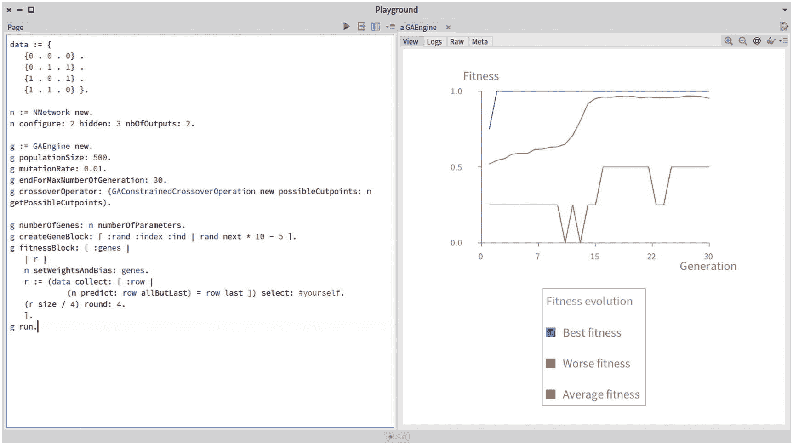
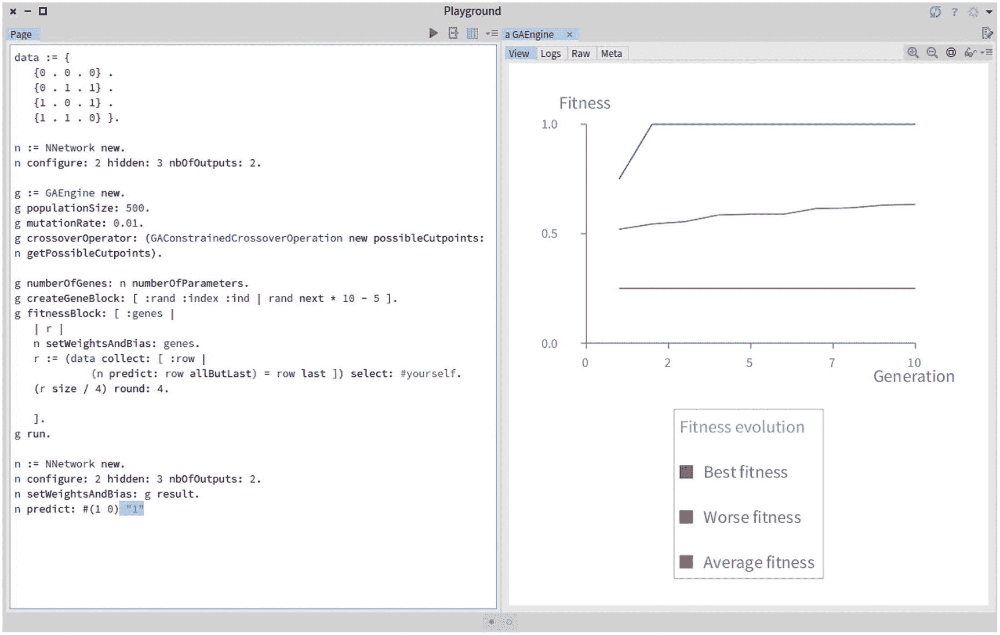
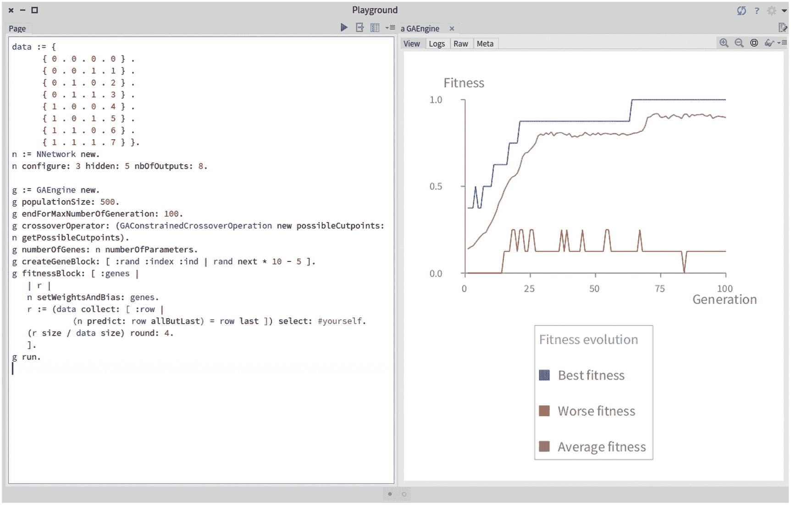
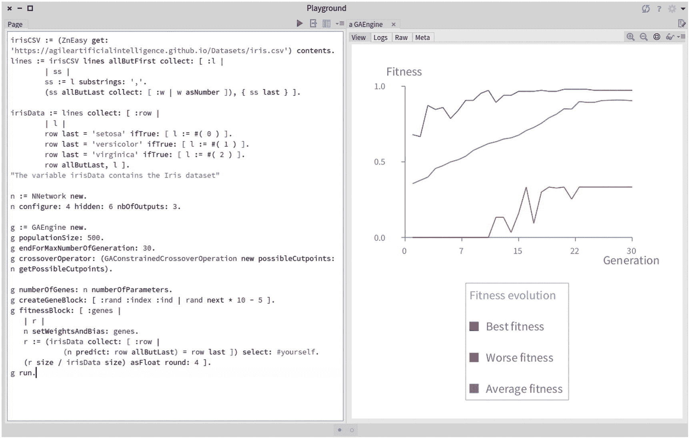

# 十四、神经进化

这一章涵盖了这本书的第三部分，也是最后一部分。这本书以神经网络为主题，神经网络是生物大脑的计算隐喻。随后，这本书涵盖了遗传算法，物种进化的计算机模拟。在这两个部分之后，可能自然会被问到的问题是:是否有可能以类似于我们的生物大脑经历了数千年进化的方式来进化神经网络？答案是肯定的，这种进化机制是本书第三部分也是最后一部分的主题。*神经进化*是人工智能的一种形式，结合了神经网络和遗传算法。

在给出了不同学习机制的一些理论背景之后，本章探索了一个简单的神经进化机制，称为*神经遗传*。

## 14.1 监督、非监督学习和强化学习

当我们讨论神经网络如何运行时，我们了解到神经网络需要示例。为了使神经网络学习数据集中的分类模式(与 Iris 数据集一样)，必须对数据集进行标记，以便神经网络识别这些模式。在 Iris 数据集的情况下，每种花的描述都伴随着花的名称。我们把花名称为一个例子的标签。从包含标签的数据集学习被称为*监督学习*:机器学习算法从标签数据中学习模式。监督学习的特点是对标记数据进行操作。

在许多情况下，获取带标签的数据集不成问题。例如，脸书有一个巨大的标签图片数据集。每次你给照片上的朋友贴上标签，你就提供了一个脸书可以用来改进其模型的例子。监督学习在数据集中找到我们有正确答案的模式，即标签。

*无监督学习*是在没有正确答案和标签的情况下寻找模式。然后提取模式，而不告诉算法这些模式是关于什么的。机器学习科学界产生了许多无监督学习技术。常见的技术包括 *k-means* (基于元素相似性的聚类技术)和*自动编码器*(学习一组数据编码的神经网络的特殊架构)。

*强化学习*是第三种学习形式，软件代理从环境中学习并做出正确的决定。神经进化是一种在某些方面与强化学习相关的技术。自动驾驶汽车、机器人和游戏是很难有好的例子的突出领域。我们在这里使用广义的强化学习这个术语:这是一个通过探索一个空间并积累奖励而变得更好的代理。因此，神经进化可能属于这一类别，因为一个群体或一个物种可能被视为试图最大化适应值的代理，这是对其组成个体的一种奖励。

本章的剩余部分将探索神经进化的第三种学习方式。

## 14.2 神经进化

*神经进化*由进化神经网络组成。随着年龄的增长，网络在识别模式方面变得更好。维基百科称“神经进化是一种人工智能形式，它使用进化算法来生成人工神经网络。”

神经进化比经典的深度学习方法有很多好处。既然不涉及培训，就不需要有例子了。因此，神经进化足以解决那些样本质量差或难以获得的问题。神经进化的第二个好处是它可以进化建筑本身。在深度学习中，根据层定义的网络架构、层大小和激活功能都需要指定。神经进化使工程师不必做武断的决定。

## 14.3 两种神经进化技术

本章和接下来的章节涵盖了两种神经进化技术，*神经发生*和*净*:

*   *神经遗传学*是遗传算法的直接应用，用于寻找神经网络的权重和偏差。这项技术是由埃德蒙·罗纳德和马克·肖瑙尔在 1994 年首创的。注意，使用这种技术，网络的架构是固定的，而权重和偏差受到演化的影响。

*   *NEAT* 代表*增强拓扑的神经进化*，由 Kenneth O. Stanley 和 Risto Miikkulainen 于 2002 年提出。NEAT 的关键要素是让神经网络进化，同时考虑网络的权重和架构。

本章的其余部分涵盖了神经遗传学方法，而 NEAT 在第 [15](15.html) 章中有详细介绍。

## 14.4 神经遗传学方法

在神经遗传技术中，层的数量、神经元的数量和激活函数是固定的，因此不受遗传算法的搜索。相反，我们只使用遗传算法来寻找每个神经元的权重和偏差。

当我们讨论动物形态的生物时，我们提出了*竞争约定问题*。当两个相对较好的个体组合成一个表现不佳的个体时，就会出现这种情况。孩子比父母更坏。对于动物形态的生物，我们通过确保交叉操作将肌肉视为一个整体来解决这个问题。我们将在这里应用完全相同的技术:交叉操作将把一个神经元视为一个整体。因此，这种手术不能重组两个神经元来形成一个新的。相反，交叉可以重组两个神经元序列，以形成一个由从父母那里获得的神经元组成的新序列。

## 14.5 扩展神经网络

我们的神经网络实现需要一些扩展，以便能够执行受约束的交叉操作。首先，网络中的神经元必须是可访问的。这对于将网络序列化为单个染色体是必要的。我们将`neurons`方法定义如下:

```py
NNetwork>>neurons
    "Return the list of neurons contains in the network"
    ^ layers flatCollect: #neurons

```

为了计算单个染色体的大小，我们需要合计每个神经元的参数数量。我们定义以下方法:

```py
Neuron>>numberOfWeights
    "Return the number of weights contained in the neuron"
    ^ weights size

```

一个网络的参数数量只是每个神经元的权重数量的总和，加上偏差的总和。因为每个神经元都有一个偏差，所以网络中偏差的数量等于网络中包含的神经元的数量。因此，我们定义这种方法:

```py
NNetwork>>numberOfParameters
    "Return the number of weights and biases contained in the network"
    ^ (self neurons collect: #numberOfWeights) sum + self neurons size

```

正如我们在动物形态生物中看到的，受约束的交叉操作必须配置一个索引切割点列表。我们定义了`getPossibleCutpoints`方法来获得当参数被线性序列化时对应于神经元极限的指标:

```py
NNetwork>>getPossibleCutpoints
    "Return the indexes of each neurons values.
    This method is useful when applying genetic algorithm to neural network"
    | result index |
    result := OrderedCollection new.
    index := 1.
    self neurons do: [ :n |
        result add: index.
        index := index + n weights size + 1\. ].
    ^ result asArray

```

在进化过程中，我们需要能够从一系列参数中重建一个网络。因此，我们定义了`setWeightsAndBias:`方法，其目的是用提供的权重和偏差填充网络:

```py
NNetwork>>setWeightsAndBias: weightsAndBias
    "Set the weights and bias of each neuron.
    This method is useful when applying genetic algorithm to neural network"
    | index |
    self assert: [ self numberOfParameters = weightsAndBias size ].
    self assert: [ weightsAndBias allSatisfy: #isNumber ].
    index := 1.
    self neurons do: [ :n |
        n weights: (weightsAndBias copyFrom: index to: n
            numberOfWeights + index - 1).
        index := index + n numberOfWeights.
        n bias: (weightsAndBias at: index).
        index := index + 1 ]

```

我们现在有了尝试第一个神经进化例子的所有要素。

## 14.6 神经遗传学举例

使用神经进化的一个经典例子是产生一个可以表达 XOR 逻辑门的神经网络。考虑以下脚本:

```py
data := {
    {0 . 0 . 0} .
    {0 . 1 . 1} .
    {1 . 0 . 1} .
    {1 . 1 . 0} }.

n := NNetwork new.
n configure: 2 hidden: 3 nbOfOutputs: 2.

g := GAEngine new.
g populationSize: 500.
g mutationRate: 0.01.
g endForMaxNumberOfGeneration: 30.
g crossoverOperator: (GAConstrainedCrossoverOperation new
    possibleCutpoints: n getPossibleCutpoints).

g numberOfGenes: n numberOfParameters.
g createGeneBlock: [ :rand :index :ind | rand next * 10 - 5 ].
g fitnessBlock: [ :genes |
    | r |
    n setWeightsAndBias: genes.
    r := (data collect: [ :row |
                (n predict: row allButLast) = row last ]) select: #
                    yourself.
    (r size / 4) round: 4.
    ].
g run.

```



图 14-1

用神经遗传学表达 XOR 逻辑门

执行脚本会产生如图 [14-1](#Fig1) 所示的输出。适应度被定义为网络在小型 XOR 数据集上的精度。如图所示，适应度很快达到`1.0`，这意味着网络可以识别数据集中包含的模式。

与本书第一部分给出的脚本类似，`data`变量包含我们希望算法为其生成神经网络的数据。`n`变量是指由变量`n`定义的两个输入、三个隐藏神经元和两个输出组成的神经网络。

用 500 个个体的群体和`0.01`的突变率来定义遗传算法引擎。算法要运行 30 代。交叉被限制在由`getPossibleCutpoints`方法的结果提供的任何神经元索引处发生。基因的数量是网络中包含的参数的数量。一个基因的值只是一个随机数，范围从`-5`到`5`。

正如你在代码中看到的，没有网络的训练。适应度用于挑选最佳网络并组合它们。正如我们在关于遗传算法的章节中看到的，适应度块是为群体中的每个个体计算的，并以该个体的基因作为参数。我们使用`setWeightsAndBias:`方法，用包含在`genes`变量中的参数配置网络`n`。然后，适应度返回正确预测的数量。

图 [14-1](#Fig1) 表明跨代的最佳适应度很快达到`1`的值，这意味着预测的完美精度。我们可以通过建立一个神经网络，用遗传算法的结果初始化它，并进行预测来验证这一点(见图 [14-2](#Fig2) ):



图 14-2

使用神经遗传学执行 1 XOR 0

```py
...
n := NNetwork new.
n configure: 2 hidden: 3 nbOfOutputs: 2.
n setWeightsAndBias: g result.
n predict: #(1 0).

```

不出所料，脚本返回`1`。本着同样的精神，我们可以尝试一个稍微复杂一点的例子。以下脚本构建了一个将二进制数转换为十进制数的网络:

```py
data := {
        { 0 . 0 . 0 . 0 } .
        { 0 . 0 . 1 . 1 } .
        { 0 . 1 . 0 . 2 } .
        { 0 . 1 . 1 . 3 } .
        { 1 . 0 . 0 . 4 } .
        { 1 . 0 . 1 . 5 } .
        { 1 . 1 . 0 . 6 } .
        { 1 . 1 . 1 . 7 } }.
n := NNetwork new.
n configure: 3 hidden: 5 nbOfOutputs: 8.

g := GAEngine new.
g populationSize: 500.
g endForMaxNumberOfGeneration: 100.
g crossoverOperator: (GAConstrainedCrossoverOperation new
    possibleCutpoints: n getPossibleCutpoints).
g numberOfGenes: n numberOfParameters.
g createGeneBlock: [ :rand :index :ind | rand next * 10 - 5 ].
g fitnessBlock: [ :genes |
    | r |
    n setWeightsAndBias: genes.
    r := (data collect: [ :row |
                (n predict: row allButLast) = row last ]) select: #
                    yourself.
    (r size / data size) round: 4.
    ].
g run.

```



图 14-3

将数字从二进制转换为十进制

图 [14-3](#Fig3) 显示了脚本的结果。适配度达到`1.0`，表示达到了完美的转换。我们可以用下面的例子来验证这一点:

```py
...
n := NNetwork new.
n configure: 3 hidden: 5 nbOfOutputs: 8.
n setWeightsAndBias: g result.
n predict: #(1 1 0).

```

将二进制数`1 1 0`转换成十进制的结果是`6`。

## 14.7 虹膜数据集

我们可以应用神经遗传学来处理前面介绍的虹膜数据集。考虑这个脚本:

```py
irisCSV := (ZnEasy get: 'https://agileartificialintelligence.github.io/
    Datasets/iris.csv') contents.
lines := irisCSV lines allButFirst collect: [ :l |
        | ss |
        ss := l substrings: ','.
        (ss allButLast collect: [ :w | w asNumber ]), { ss last } ].

irisData := lines collect: [ :row |
        | l |
        row last = 'setosa' ifTrue: [ l := #( 0 ) ].
        row last = 'versicolor' ifTrue: [ l := #( 1 ) ].
        row last = 'virginica' ifTrue: [ l := #( 2 ) ].
        row allButLast, l ].

"The variable irisData contains the Iris dataset"

n := NNetwork new.
n configure: 4 hidden: 6 nbOfOutputs: 3.

g := GAEngine new.
g populationSize: 500.
g endForMaxNumberOfGeneration: 30.
g crossoverOperator: (GAConstrainedCrossoverOperation new
    possibleCutpoints: n getPossibleCutpoints).

g numberOfGenes: n numberOfParameters.
g createGeneBlock: [ :rand :index :ind | rand next * 10 - 5 ].
g fitnessBlock: [ :genes |
    | r |
    n setWeightsAndBias: genes.
    r := (irisData collect: [ :row |
                (n predict: row allButLast) = row last ]) select: #
                    yourself.
    (r size / irisData size) asFloat round: 4 ].
g run.

```



图 14-4

神经遗传学和虹膜数据集

图 [14-4](#Fig4) 表明在最后几代中适应度达到 97%。这个小例子说明了进化的神经网络与使用反向传播的训练过的神经网络竞争得一样好。

## 14.8 关于神经遗传学的进一步阅读

本章介绍的神经发生学是使用神经进化的最简单的方法。这些技术只使用了权重和偏差。1994 年，埃德蒙·罗纳德和马克·肖瑙尔在他们的出版物《遗传着陆器:精确神经遗传控制的实验》中首次提出了这一观点。文章可在 [`https://citeseerx.ist.psu.edu/viewdoc/summary?doi=10.1.1.56.3139`](https://citeseerx.ist.psu.edu/viewdoc/summary%253Fdoi%253D10.1.1.56.3139) 获得。它展示了一个月球着陆器的小例子。

## 14.9 我们在本章中看到了什么？

这一章结合了本书前两部分的结果。特别是:

*   它介绍了如何使用遗传算法来搜索权重和偏差的相关组合，以解决特定的问题。

*   它表明，神经遗传学，一种简单的神经进化技术，可以在简单的数据集上提供类似于反向传播的结果。

下一章将介绍 NEAT，一种用于神经进化的复杂算法。