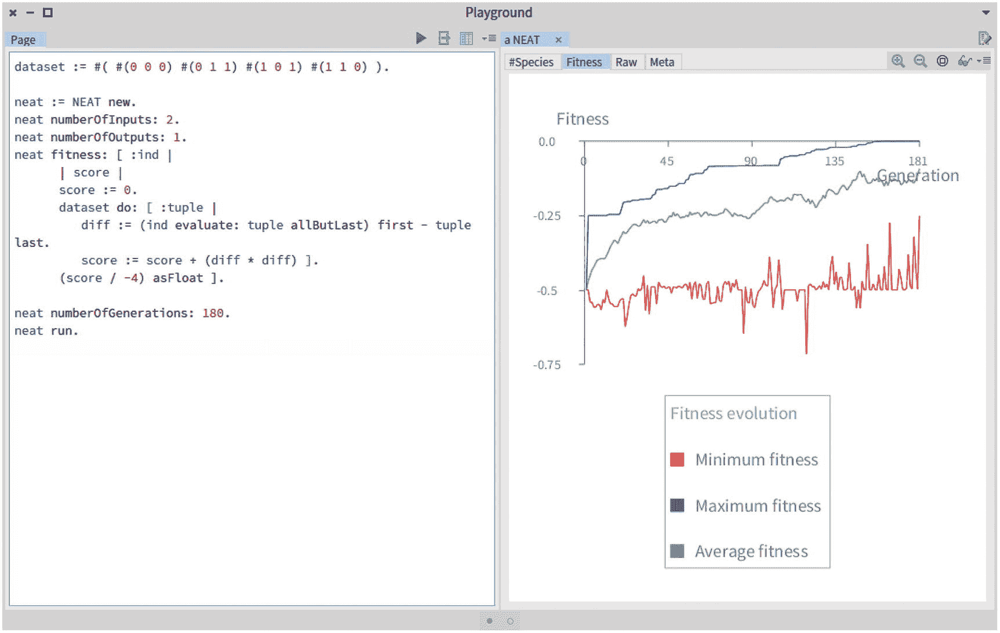
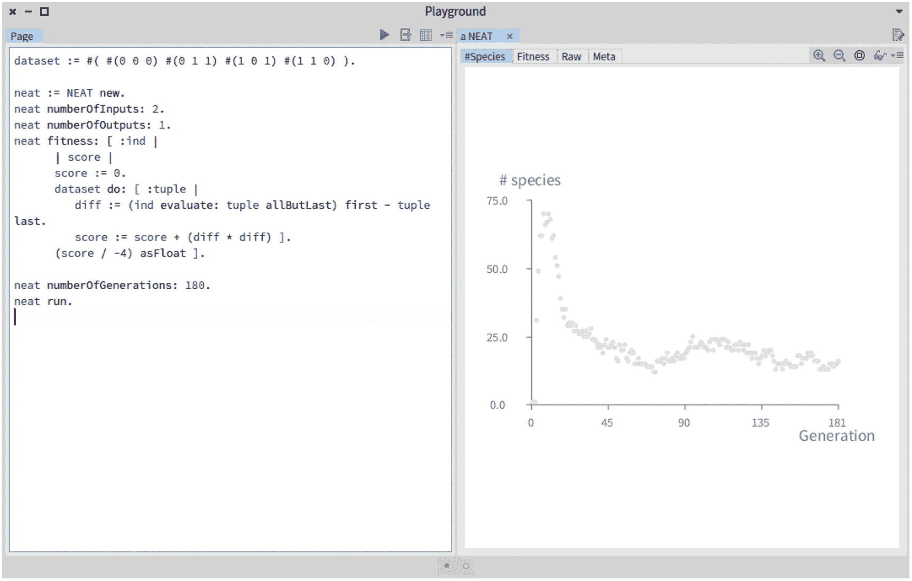
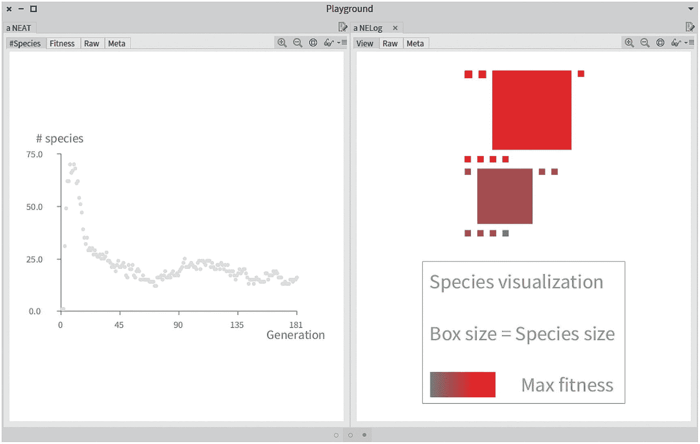
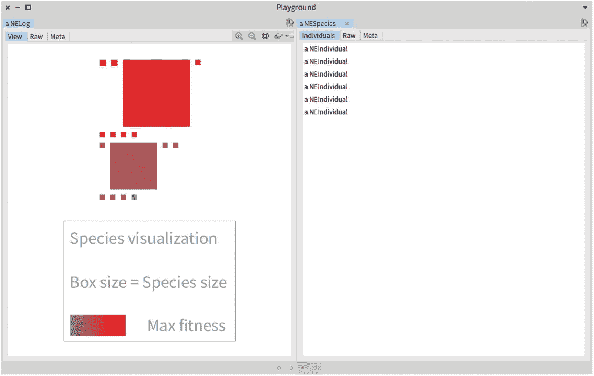
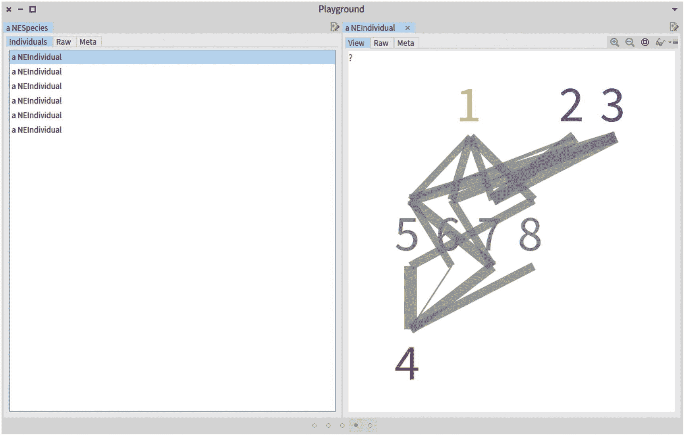
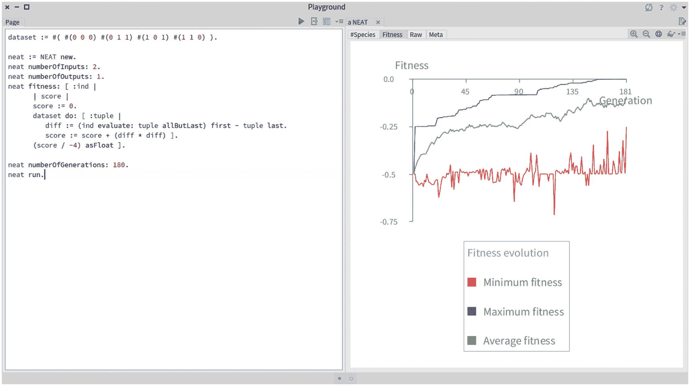

# 事务、NEAT 神经进化

NEAT 是一种算法，它按照增量和进化过程构建神经网络。它使用遗传算法来进化网络。在早期，神经网络非常简单，由几个节点和连接组成。然而，每一代都增加了复杂性。NEAT 支持许多突变，这些突变可能会添加新的节点或新的连接。因此，随着时间的推移，网络只会变得更加复杂。

NEAT 是由 Kenneth O. Stanley 和 Risto Miikkulainen 在 2002 年提出的，他们的文章题为“通过扩充拓扑结构进化神经网络”，由麻省理工学院出版社出版。希望了解更多算法设计决策的读者欢迎阅读本文。这篇文章是可访问的，在网上很容易找到。

这一章的重点是 NEAT 算法的实现。NEAT 构建由节点和连接组成的神经网络。这一章是独立的。本章提供的所有代码都应该保存在一个名为 NEAT 的包中，每个类都以两个字母 NE 为前缀。

注意，我们稍微简化了原始的 NEAT 算法，以控制章节的大小。特别是，我们使用简化的策略来创建物种并评估个体之间的相似性。

本章首先介绍一些理论背景，然后开始讨论整洁的实现。

## 15.1 词汇

这一章是关于使用遗传算法来进化神经网络。虽然我们在前面的章节中已经详细介绍了这两个概念，但是最初由 Kenneth 和 Risto 在 2002 年提出的 NEAT 算法有它自己的术语。我们在本章中使用它来避免我们的实现与“通过扩充拓扑进化神经网络”给出的 NEAT 算法的原始描述之间的必要差距在本章中，我们使用以下定义:

*   *节点*:节点是一个神经元的表示。节点可以接受输入值并产生输出值。

*   *输入节点*:简单地说，神经网络的输入值被提供给一个输入节点。输入节点的数量在进化过程中是固定的，因为它取决于算法试图解决的问题。

*   *输出节点*:输出节点是获取网络输出的节点。

*   *隐藏节点*:隐藏节点是既不是输入也不是输出的节点。当值被提供给输入节点时，计算出的值流经隐藏节点，以便到达输出节点。

*   *连接*:节点通过显式连接进行连接。每个连接都有一个权重值。

*   *连接缓存:*节点使用连接缓存来保存连接，连接缓存只是关联的集合。

*   *创新号*:每一个连接，当添加到一个个体时，都会收到一个历史标记，我们称之为创新号。每次新连接时，该数字增加 1。

*   *个体*:个体是一组节点和连接，是对其所属物种的引用，是一个连接缓存。

*   *物种*:结构相似的个体很可能属于同一物种。一个物种是一群相似的个体。

*   物种形成(specification):将一个种群分裂成多个物种的行为被称为物种形成。物种形成发生在每一代。

*   *Log* :使用 Log 对象支持监视 NEAT 算法的发展。每个日志对象都包含相关信息。

## 15.2 节点类

一个节点代表网络中的一个神经元。我们将使用“节点”这个词而不是“神经元”,因为它与我们在讨论神经网络时所看到的相当遥远。节点可以用我们将在后面看到的连接来连接。我们将该类定义如下:

```py
Object subclass: #NENode
         instanceVariableNames: 'id kind connectionsCache innovationNumber
              numberOfInputs zValue numberOfReceivedValues result'
         classVariableNames: ''
         package: 'NEAT'

```

`NENode`类定义了以下变量:

*   `id`是每个节点的数字标识符。正如我们将在后面看到的，每个连接都是在两个 id 之间定义的。一个 ID 唯一地引用一个节点。

*   `kind`代表节点的种类。节点的种类可以是`#input`，表示输入层的网络，`#output`，表示位于输出层的神经元，或者`#hidden`，表示既不是输入也不是输出的节点。

*   `connectionsCache`用于缓存网络从个体产生时节点间的连接。当个体变异时，缓存必须被重置。

*   `innovationNumber`是代表历史标记的数字。它是已执行突变的标识符值。

*   `numberOfInputs`表示节点拥有的输入数量。

*   `zValue`代表累计的`z`值。正如我们在本书的第一部分所看到的，`z`值是加权输入的总和。该值用于计算节点的输出。

*   `numberOfReceivedValues`是一个计数器，指示有多少输入已经流入节点。在每个接收到的输入值处，`zValue`被调整，`numberOfReceivedValues`变量增加`1`。当`numberOfReceivedValues`等于`numberOfInputs`时，节点被读取以产生输出值。

*   `result`保存节点的结果。这个变量充当缓存，它有助于将评估结果传播到连接的节点。

## 15.3 不同种类的节点

神经网络由节点组成。代表一个神经元的每个节点可以是输入节点、输出节点或隐藏节点。区分这些类型的节点非常重要。为此，我们使用了`kind`变量。该变量可能包含以下值之一:`#input`、`#hidden`或`#output`。

我们定义`setAsInput`将一个节点设置为输入节点:

```py
NENode>>setAsInput
           "Set the node as input"
           kind := #input

```

`setAsOutput`方法将一个节点设置为输出:

```py
NENode>>setAsOutput
           "Set the node as output"
           kind := #output

```

类似地，使用`setAsHidden`定义隐藏节点:

```py
NENode>>setAsHidden
         "Set the node as hidden, which means it is placed in the
               network between the input and output"
         kind := #hidden

```

可以使用一些测试方法来检查`kind`变量的值。如果节点是一个输入节点，`isInput`方法返回`true`:

```py
NENode>>isInput
           "Return true if the node is an input node"
           ^ kind == #input

```

如果节点是输出节点，`isOutput`方法返回`true`:

```py
NENode>>isOutput
         "Return true if the node is an output node"
         ^ kind == #output

```

`kind`方法返回节点的种类:

```py
NENode>>kind
           "Return the kind of node"
           ^ kind

```

正如我们很快会看到的，方法`kind`与复制节点相关。`kind:`方法为相应的变量赋值:

```py
NENode>>kind: aSymbol
         "The argument aSymbol should be #input, #output, or #hidden"
         kind := aSymbol

```

每个节点都有一个数字标识符，保存在变量`id`中。该标识符对应于个体中节点的索引。

```py
NENode>>id
           "Return the numerical identifier of the node"
           ^ id

```

正如我们将在后面看到的，bias 节点的标识符总是等于`1`。类似地，节点标识符可以使用以下内容来设置:

```py
NENode>>id: anInteger
           "Set the node identifier, useful when an individual structure
                 is modified"
           id := anInteger

```

为了形成神经网络，每个输入或隐藏节点可以连接到许多其他节点。当网络必须建立时，建立连接将由`NEIndividual`类命令。`connectionsCache`变量将把连接保持在适当的数据结构中。

使用`connect:weight:`方法设置两个节点之间的连接，定义如下:

```py
NENode>>connect: anotherNode weight: aWeight
           "Establish a connection between two nodes (the receiver and
                 the argument)
             The method is executed by NEIndividual>>buildNetwork"
           connectionsCache add: aWeight -> anotherNode

```

对于给定的节点，可以获得连接的节点的列表:

```py
NENode>>connectedNodes
           "Return the nodes that are connected to the node receiver"
           ^ connectionsCache collect: #value as: Array

```

可以使用这种方法获得两个连接节点之间的权重:

```py
NENode>>weightOfConnectionWith: anotherNode
           "Return the weight of the connection with another node"
           ^ (connectionsCache detect: [ :assoc | assoc value == anotherNode
                ]) key

```

对于 NEAT 的逻辑来说,`weightOfConnectionWith:`方法并不重要。然而，我们将在后面看到，通过将连接权重映射到线宽，它将在可视化中使用。

使用 NEAT 算法，应用遗传操作的个体不应被修改。相反，新的个体产生了，而原来的个体完好无损。为了获得这种保存，能够复制个体是很重要的。因此，我们应该能够复制一个节点。我们为此定义了`copy`方法:

```py
NENode>>copy
           "Return a copy of the node"
           | newNode |
           newNode := NENode new.
           newNode id: self id.
           newNode kind: self kind.
           newNode innovationNumber: self innovationNumber.
           ^ newNode

```

在评估神经网络的过程中，值在节点中流动。我们定义了`evaluate:`方法来使值流入。评估网络时，将调用节点上的`evaluate:`方法:

```py
NENode>>evaluate: aValue
           "Provide an input value to the node and contribute to the
                 intermediate zValue"

           "We just received a value. We add it to zValue."
           zValue := zValue + aValue.

           "We say we received a new value"
           numberOfReceivedValues := numberOfReceivedValues + 1.

           "If we received an adequate number of zValues,
            then we can compute the sigmoid and keep it."
           numberOfReceivedValues = numberOfInputs ifFalse: [ ^ self ].
           result := self isInput ifTrue: [ zValue ] ifFalse: [ self sigmoid: zValue ].

           "We go here only if not output"
           connectionsCache do: [ :assoc | assoc value evaluate: result ∗
                  assoc key ]

```

NEAT 支持构建神经网络的渐进过程。在进化过程中，网络每一代都变得更加复杂。这样，通常会建立到隐藏和输出节点的新连接。因此，我们需要一种方法来增加节点可以接受的输入数量。我们为此简单地定义了`increaseNumberOfInputs`方法:

```py
NENode>>increaseNumberOfInputs
           "Increase the number of input values the node accepts"
           numberOfInputs := numberOfInputs + 1

```

NEAT 算法的一个目的是跟踪个体的历史。这是算法的根本:通过有效地跟踪个体的历史，具有共同历史的个体很可能在结构上是相似的。基于个体之间的相似性，全球人口被划分为物种。创新号可通过以下方式从节点访问:

```py
NENode>>innovationNumber
           "Return the innovation number, the historical marker, an integer"
           ^ innovationNumber

```

创新数通过以下方式设置:

```py
NENode>>innovationNumber: anInteger
           "Set the node innovation number"
           innovationNumber := anInteger

```

当我们可视化一个神经网络时，我们用不同的颜色描绘偏差节点。因此，我们需要一种区分节点的方法:

```py
NENode>>isBias
           "Return true if the node is the bias node,
             i.e., if its ID equals 1"
           ^ self isInput and: [ id = 1 ]

```

节点的输入数量可通过以下方式获得:

```py
NENode>>numberOfInputs
           "Return the number of inputs the node accepts"
           ^ numberOfInputs

```

获得节点的文本表示是相关的。这在可视化网络时非常有用。我们为此定义了`printOn:`方法:

```py
NENode>>printOn: stream
           "Return a textual representation of a node. For example, a
                   node may be printed
                  a NENode<3,1,input>
            or
                  a NENode<5,205167,hidden>
            The values 3 and 5 are the node id. 1 and 205167 are
                  innovation number.
            The third component indicates the kind of node
            "
         super printOn: stream.
         stream nextPut: $<.
         id ifNotNil: [ stream nextPutAll: id asString ].
         stream nextPut: $,.
         innovationNumber ifNotNil: [ stream nextPutAll: innovationNumber
              asString ].
         stream nextPut: $,.
         kind ifNotNil: [ stream nextPutAll: kind asString ].
         stream nextPut: $>.

```

当一个个体被基因操作修改时，与该个体相关联的网络需要被无效。因此，我们提供了`resetConnections`方法，该方法删除网络节点之间的所有连接:

```py
NENode>>resetConnections
           "Remove connections associated with a node"
           connectionsCache := OrderedCollection new.
           zValue := 0.
           numberOfInputs := 0.
           numberOfReceivedValues := 0.
           result := 0.
           self isInput ifTrue: [ numberOfInputs := 1 ]

```

在我们的 NEAT 实现中，每个节点使用 sigmoid 激活函数评估其加权输入。因此，我们将`sigmoid:`函数定义如下:

```py
NENode>>sigmoid: z
           "Apply the sigmoid function to the argument"
           ^ 1 / (1 + z negated exp)

```

评估结果保存在`result`变量中。我们为它定义了一个访问器:

```py
NENode>>result
           "Return the computed result"
           ^ result

```

正如我们将在后面看到的，执行`result`方法是为了从神经网络评估中获得输出值。最后一个方法总结了节点的定义。

## 15.4 连接

正如我们已经看到的，神经网络是一个非循环图。节点需要连接，每个连接都有权重。此外，NEAT 编码了一个激活状态(一个布尔值)和一个创新数。我们定义了下面的类:

```py
Object subclass: #NEConnection
         instanceVariableNames: 'in out weight enabled innovationNumber'
         classVariableNames: ''
         package: 'NEAT'

```

`NEConnection`类有以下变量:

*   正如我们将在后面看到的，个体定义了节点的有序集合。`in`变量表示用作输入的个体中节点的索引。因此，`in`接受的值是正整数。

*   类似地，`out`表示用作输出的节点的索引。

*   `weight`是连接的权重。这通常是一个小的正或负浮点值。

*   `enabled`是一个布尔标志，表示连接是否激活。

*   `innovationNumber`是 NEAT 使用的历史标记。这个变量的值是一个正整数。

```py
NEConnection>>in
          "Return the index of the input node in the individual"
          ^ in

```

输入节点的 setter 方法如下:

```py
NEConnection>>in: anInteger
          "Set the in node index"
          in := anInteger

```

类似于`in`方法，`out`方法返回输出节点的索引:

```py
NEConnection>>out
          "Return the index of the output node in the individual"
          ^ out

```

使用相应的方法设置`out`的值:

```py
NEConnection>>out: anInteger
          "Set the out node index"
          out := anInteger

```

创建连接时，它会收到一个历史标记(创新号)，使用以下内容进行设置:

```py
NEConnection>>innovationNumber: anInteger
          "Set the innovation number"
          innovationNumber := anInteger

```

创新号通过以下方式获得:

```py
NEConnection>>innovationNumber
         "Return the historical marker of the connection, the innovation
               number"
         ^ innovationNumber

```

可以启用或禁用连接。禁用连接不会让值流动。使用以下内容启用连接:

```py
NEConnection>>makeEnabled
          "Enable the connection"
          enabled := true

```

使用以下命令禁用连接:

```py
NEConnection>>makeDisabled
          "Disable the connection"
          enabled := false

```

构建神经网络时，只考虑启用的连接。因此，需要一种检查方法，如下所示:

```py
NEConnection>>isEnabled
          "Return true if the connection is enabled"
          ^ enabled

```

连接让值流经节点。正如我们在本书的第一部分中看到的，值在传输到节点时是加权的。使用以下公式设置连接的权重:

```py
NEConnection>>weight: aNumber
          "Set the weight for the connection"
          weight := aNumber

```

相反，重量由下式得出:

```py
NEConnection>>weight
          "Return the weight of the connection"
          ^ weight

```

## 15.5 个别类

正如我们所见，在 NEAT 中，个体比标准遗传算法中的个体要复杂得多。简而言之，个体并不是基因值的简单线性序列。相反，它是一个复杂的抽象概念。我们将`NEIndividual`类定义如下:

```py
Object subclass: #NEIndividual
         instanceVariableNames: 'nodes connections random fitness species'
         classVariableNames: ''
         package: 'NEAT'

```

我们将其变量总结如下:

*   `nodes`是`NENode`对象的集合。该集合是`OrderedCollection`的一个实例。`nodes`变量包含用于构建神经网络的神经元。

*   `connections`是`NEConnection`对象的集合。当必须建立网络时，使用这些连接。

*   `random`是一个由遗传算子使用的随机数生成器。

*   `fitness`是个体的适应值。这个值是在群体生成期间计算的，我们将在后面看到。

*   `species`指个体所属的物种。

个体的初始化执行如下:

```py
NEIndividual>>initialize
         super initialize.
         nodes := OrderedCollection new.
         connections := OrderedCollection new.

         "This first node is the bias node"
         self addInputNode

```

节点可以添加到个人。我们将相应的`addNode:`方法定义如下:

```py
NEIndividual>>addNode: aNode
         "Add a node to the individual. Note that the connections must
                 be invalided and are therefore reset."
         self resetNetwork.
         nodes add: aNode.
         aNode id: nodes size.
         ^ aNode

```

使用以下代码添加隐藏节点:

```py
NEIndividual>>addHiddenNode
         "Add a hidden node"
         ^ self addNode: (NENode new setAsHidden)

```

使用以下代码添加输入节点:

```py
NEIndividual>>addInputNode
         "Add an input node"
         self addNode: (NENode new setAsInput; innovationNumber: 1).

```

按如下方式添加输出节点:

```py
NEIndividual>>addOutputNode
         "Add an output node"
         self addNode: (NENode new setAsOutput; innovationNumber: 1).

```

个人必须可以访问节点。我们将该方法定义如下:

```py
NEIndividual>>nodes
         "Return the nodes contained by the individual"
         ^ nodes

```

可以设置节点，特别是在复制个人时，如下所示:

```py
NEIndividual>>nodes: someNodes
         "Set the nodes"
         nodes := someNodes

```

我们很快就会看到，输入节点必须是个人可以访问的。我们将该方法定义如下:

```py
NEIndividual>>inputNodes
         "Return the input nodes"
         ^ nodes select: #isInput

```

类似地，输出节点可通过以下方式访问:

```py
NEIndividual>>outputNodes
         "Return the output nodes"
         ^ nodes select: #isOutput

```

输入节点的数量与确定所表示的网络是否被正确构建以及确定我们何时可视化神经网络相关。我们将该方法定义如下:

```py
NEIndividual>>numberOfInputs
         "We substrate one for the bias"
         ^ self inputNodes size - 1

```

使用此方法可以获得节点总数:

```py
NEIndividual>>numberOfNodesWithBias
         "Return the total number of nodes contained in the individual"
         ^ self nodes size

```

使用以下内容添加连接:

```py
NEIndividual>>addConnection: aConnection
         "Add a connection to the individual"
         connections add: aConnection.
         self resetNetwork.

```

类似于节点添加，当我们添加一个连接时，所表示的网络及其相关联的缓存必须被重置和失效。

每个个体明确地指的是一个神经网络。该网络使用以下方法构建:

```py
NEIndividual>>buildNetwork
         "Build the neural network represented by the individual"
         self resetNetwork.
          (connections select: #isEnabled) do: [ :c |
                 (nodes at: c in) connect: (nodes at: c out) weight: c weight.
                 (nodes at: c out) increaseNumberOfInputs ]

```

`buildNetwork`方法首先使网络无效。之后，启用的连接对象用于建立节点之间的连接。对于节点`in`和节点`out`之间的每个连接，`out`的输入数量增加。

```py
NEIndividual>>computeFitness: oneArgBlock
         "Compute the fitness of an individual"
         "If already computed, then there is nothing to do"
         fitness ifNotNil: [ ^ self ].
         fitness := oneArgBlock value: self.

```

适应度函数被定义为具有一个自变量的块。如果已经计算了适应度，那么就没有什么可做的了。

连接列表可通过以下方式获得:

```py
NEIndividual>>connections
         "Return the list of connections"
         ^ connections

```

该列表是遗传算子计算新息数所必需的。在交叉期间，一组新的连接被确定，并且它必须被设置给一个新的个体。因此，我们定义这种方法:

```py
NEIndividual>>connections: someConnections
         "Set some connections.
          This method is used when performing the crossover."
         connections := someConnections

```

使用以下内容复制个人:

```py
NEIndividual>>copy
         "Return a copy of the individual"
         | newInd |
         newInd := NEIndividual new.
         newInd random: self random.
         newInd nodes: (self nodes collect: #copy).
         newInd connections: (self connections collect: #copy).
         ^ newInd

```

适应度将由 NEAT 逻辑设置，因此我们定义以下方法:

```py
NEIndividual>>fitness: aFitnessValue
         "Set the fitness value, useful when copying an individual"
         fitness := aFitnessValue

```

与个体相关的神经网络可以使用`evaluate:`方法进行评估，其定义如下:

```py
NEIndividual>>evaluate: anArray
         "Evaluate the network using some input values.
          The method returns the resulting outputs of the network"
         self assert: [ anArray size = self numberOfInputs ] description: '
              Wrong number of arguments'.

         self buildNetwork.

         "We provide 1 to the first node, which is considered the
                bias node"
         self inputNodes with: #(1), anArray do: [ :n :aValue | n evaluate:
              aValue ].
         ^ self outputNodes collect: [ :n | n result ] as: Array

```

`evaluate:`方法首先检查提供的值的数量是否与输入节点的数量一致。由于这是评估个人时的一个常见错误，我们提供了一个断言来尽早捕捉错误。

计算之后，个人的适应度可以使用以下内容返回:

```py
NEIndividual>>fitness
         "Return the fitness of the individual"
         self assert: [ fitness notNil ] description: 'Need to compute
              fitness first'.
         ^ fitness

```

每个连接都有一个创新号。创新数序列可用于确定个体之间的相似性。稍后，我们将讨论如何定义和识别种群中的物种。与此同时，我们需要按照与连接相同的顺序获得创新数字序列。我们定义以下方法:

```py
NEIndividual>>innovationNumberSequence
         "Return the list of innovation number"
         self connections ifEmpty: [ ^ #(0) ].
         ^ self connections collect: #innovationNumber as: Array

```

在 NEAT 算法的开始，个体是在没有任何联系的情况下被创建的。NEAT 进化出最简单的个体形式，即没有连接，没有隐藏节点的个体。这些极其简单的个体虽然没有联系，但还是需要属于一个物种。如此，如果没有联系，创新号序列简单来说就是`#(0)`。物种形成算法将使用这种创新数字序列。

执行交叉操作时，了解个人拥有的连接数很重要:

```py
NEIndividual>>numberOfConnections
         "Return the number of connections"
         ^ connections size

```

在本书的第一部分，我们在描述神经网络的类上定义了`predict:`方法。我们现在将在`NEIndividual`类`:`上定义相同的方法

```py
NEIndividual>>predict: inputs
         "Make a prediction. This method assumes that the number of
                outputs is the same as the number of different values
                the network can output"
         | outputs |
         outputs := self evaluate: inputs.
         "The index of a collection begins at 1 in Pharo"
         ^ (outputs indexOf: (outputs max)) - 1

```

`predict:`方法用于对一组给定的输入值进行预测，与我们讨论神经网络时的方式完全相同。

一个个体有一个随机数发生器，当必须执行遗传操作时使用。这个生成器是由 NEAT 算法本身提供的，我们将在后面看到。使用以下内容设置随机数:

```py
NEIndividual>>random: aRandomNumberGenerator
         "Set the random number used by the genetic operations"
         random := aRandomNumberGenerator

```

使用以下方法访问随机数:

```py
NEIndividual>>random
         "Return the random number used by the genetic operations"
         ^ random

```

当一个基因操作被应用于一个个体时，适应度必须被无效。我们定义这种方法:

```py
NEIndividual>>resetFitness
         "Invalidated the fitness"
         fitness := nil

```

如果一个个体的结构被改变，网络必须被重置。我们定义这种方法:

```py
NEIndividual>>resetNetwork
         "Reset the network, which invalidates the network and the
               fitness value"
         nodes do: #resetConnections

```

`resetNetwork`方法由`addConnection:`、`addNode:`和`buildNetwork`调用。

每个个体都属于一个物种。个体和物种之间的关联是由一个专门的类`NESpeciation`建立的，这一点我们以后会看到。一个个体必须能够归还它所属的物种，这就是这个方法的作用:

```py
NEIndividual>>species
         "Return the species to which the individual belongs"
         ^ species

```

可以使用以下内容设置种类:

```py
NEIndividual>>species: aSpecies
         species := aSpecies

```

最后一个方法总结了`NEIndividual`类的定义。我们已经实现了 NEAT 算法的一半。

## 15.6 物种

我们现在需要定义一个物种到底是什么。在我们的实现中，一个物种只是一组个体。这个物种有一个数字标识符，用来记录物种的进化。

我们将`NESpecies`类定义如下:

```py
Object subclass: #NESpecies
         instanceVariableNames: 'individuals id'
         classVariableNames: ''
         package: 'NEAT'

```

该类有两个实例变量:

*   `individuals`是个体的集合。这些人只是整个人口的一小部分。在 NEAT 和标准遗传算法中，群体的大小是固定的。因此，一个物种相当于种群的一部分。一个个体只属于一个物种，这意味着所有的物种都是不相交的。

*   `id`是一个数字标识符。正如我们在`NESpeciation>>process:`中看到的，这个标识符只是用来区分个人的创新号。

该标识符可以从以下内容获得:

```py
NESpecies>>id
          "Return the identifier of the species"
          ^ id

```

物种标识符由`process:`方法设置，如前所述。相应的方法是:

```py
NESpecies>>id: anInteger
          "Set the species identifier"
          id := anInteger

```

物种的个体通过以下方式获得:

```py
NESpecies>>individuals
          "Return the individuals composing the species"
          ^ individuals

```

物种可以由物种形成对象用一些个体来初始化:

```py
NESpecies>>individuals: someIndividuals
          "Set the individuals of the species"
          individuals := someIndividuals

```

重要的是要有一些指标来表征一个特定的物种和比较物种。我们定义了三个简单的指标——平均适合度、最大适合度和个体数量。

使用以下公式给出平均适合度:

```py
NESpecies>>averageFitness
          "Return the average fitness of the species"
          ^ (self individuals collect: #fitness) average

```

物种的最大(因此也是最好的)适合度由以下方法给出:

```py
NESpecies>>maxFitness
         "Return the max fitness of the species individuals"
         ^ (self individuals collect: #fitness) max

```

组成一个物种的个体数量可以通过以下方法获得:

```py
NESpecies>>numberOfIndividuals
          "Return the size of the species"
          ^ individuals size

```

最后一个方法总结了物种的定义，因此完成了我们实现的整个物种形成机制。

## 15.7 物种形成

到目前为止，我们已经定义了个体、节点、连接和物种。我们将*物种形成*的概念定义为将相似个体的种群和群体划分为物种的行为。一个物种由结构相似的个体组成。这就是创新数字产生的地方:如果两个人有两个相似的创新数字序列，那么我们得出结论，他们在结构上是相似的。

前面我们定义了`innovationNumberSequence`方法，它返回所有个体连接的创新数。我们说明了我们的物种形成算法如何运作。考虑三个人——`i1`、`i2`和`i3`——以及他们的表情:

*   `i1 innovationNumberSequence`返回`#(1 2 4 6)`，

*   `i2 innovationNumberSequence`返回`#(1 2 4 7)`，

*   `i3 innovationNumberSequence`返回`#(1 2 4 6 8 9)`

我们的算法将考虑大小为`k`的帧内最早的历史标记。如果我们有`k = 2`，那么个人结束前的`k` th 值为:`4`代表`i1`，`4`代表`i2`，`8`代表`i3`。给定这三个个体和值`k = 2`，我们有两个物种。- `i1`和`i2`是同一物种，而- `i3`是不同物种。

请注意，窗口帧大小是一个新的超参数，我们在调整 NEAT 算法时需要考虑它。我们现在可以用`NESpeciation`类定义物种形成算法。该类定义如下:

```py
Object subclass: #NESpeciation
         instanceVariableNames: 'frameSize groups'
         classVariableNames: ''
         package: 'NEAT'

```

该类定义了两个变量:

*   `frameSize`是一个整数，代表选择相关创新数的窗口框架的大小。

*   `groups`是`NESpecies`类的实例集合。正如我们将看到的，`NESpecies`阶级是一群个体。

根据默认设置，我们选择的帧尺寸为`3`:

```py
NESpeciation>>initialize
          super initialize.
          frameSize := 3.

```

可以使用以下方法设置窗口大小:

```py
NESpeciation>>frameSize: anInteger
          "Set the window frame size hyperparameter"
          frameSize := anInteger

```

`process:`方法包含物种形成中使用的算法。它实施刚才描述的策略，定义如下:

```py
NESpeciation>>process: someIndividuals
          "Run the speciation algorithm for a given collection of
                 individuals.
           This method takes as an argument a collection of
                  innovation numbers"
          | g |
          g := someIndividuals groupedBy: [ :individual |
                | seq |
                seq := individual innovationNumberSequence.
                seq size < 2
                        ifTrue: [ seq first ]
                        ifFalse: [ (seq last: (frameSize min: seq size - 1)) first
                             ] ].

          "Bind each species to its corresponding individuals"
          groups := g associations collect: [ :assoc | NESpecies new
                individuals: assoc value; id: assoc key ].
          groups do: [ :aSpecies |
                 aSpecies individuals do: [ :i | i species: aSpecies ] ]

```

`process:`方法用一组`NESpecies`对象初始化`groups`变量。这些组是使用以下方法获得的:

```py
NESpeciation>>groups
          "Return the groups of species. Each group being an instance
                of NESpecies"
          ^ groups

```

每一种物种形成都会产生许多物种，这些物种在进化过程中会发生变化。获取生产物种的数量是一个很好的跟踪指标。考虑这种方法:

```py
NESpeciation>>numberOfSpecies
          "Return the number of species produced by the speciation"
          ^ groups size

```

这一章的结尾涵盖了演化的可视化，我们将使用这个度量。

## 15.8 交叉作业

由于个体的复杂表现，NEAT 采用了一套专用的遗传操作。本节涵盖了交叉。交叉操作在属于同一物种的个体之间进行*。这是整洁的一个重要方面。我们将`NECrossoverOperation`类定义如下:*

```py
Object subclass: #NECrossoverOperation
         instanceVariableNames: ''
         classVariableNames: ''
         package: 'NEAT'

```

关于 NEAT 的原始出版物非常非正式地描述了交叉操作。为了使这个实现简单、简短并且易于解释，我们提出了一个稍微偏离交叉的原始定义的交叉。

我们考虑的交叉算法可以描述如下。假设有两个人，`i1`和`i2`。`i1`的体能水平比`i2`好。如果`i1`或`i2`没有连接，这很可能发生在很早的一代，那么子个体具有节点`i1`并且没有连接。这似乎是一个相当武断的决定，但事实上，它通过保留最适个体的遗传信息，显示了一个保守的决定。

如果`i1`或`i2`至少有一个连接，那么我们沿着历史标记的公共序列迭代。如前所述，同一物种的个体具有共同的标记序列。孩子们的联系是从`i1`或`i2`中随机挑选的。一旦我们遍历了公共标记，我们就用`i1`的剩余连接完成了孩子的连接，这些连接是最好的个体。

正如我们所说，这个算法是对 NEAT 原始描述的简化版本。虽然它被简化了，但它执行得很好。

我们将`performOn:and:`方法定义如下:

```py
NECrossoverOperation>>performOn: i1 and: i2
          "Return a child individual that is the result of a crossover
                between individuals i1 and i2"
          "The method ASSUMES that the fitness of i1 is higher than
                the one of i2"

          | newConnections indexI1 indexI2 shouldIterate newNodes |
          "newNodes are the nodes of the child individual.
           It is simply a copy of the nodes of the best individual, i1."
          newNodes := i1 nodes collect: #copy.

          "newConnections are the connections of the child individual"
          newConnections := OrderedCollection new.

          "If any individuals has no connection, then we create a new
              individual with no connection"
           (i1 connections notEmpty and: [ i2 connections notEmpty ])
                ifFalse: [ ^ NEIndividual new nodes: newNodes; connections:
                    newConnections; random: i1 random ].

          "We initialize some temporary variables"
          indexI1 := 1.
          indexI2 := 1.
          shouldIterate := true.

          "The iteration loop"
           [ shouldIterate ] whileTrue: [
                  | c1 c2 |
                  indexI1 := indexI1 min: i1 numberOfConnections.
                  indexI2 := indexI2 min: i2 numberOfConnections.
                  c1 := i1 connections at: indexI1.
                  c2 := i2 connections at: indexI2.
                  c1 innovationNumber = c2 innovationNumber
                        ifTrue: [
                              newConnections add: (i1 random next > 0.5 ifTrue: [ c1
                                      ] ifFalse: [ c2 ]) copy.
                              indexI1 := indexI1 + 1.
                              indexI2 := indexI2 + 1\. ]
                        ifFalse: [ shouldIterate := false ].

                  (indexI1 >= i1 numberOfConnections and: [ indexI2 >= i2
                        numberOfConnections ])
                        ifTrue: [ shouldIterate := false ]
          ].
          "We consider the remainder connection from the best individual"
          newConnections addAll: ((i1 connections allButFirst: indexI1 - 1)
                  collect: #copy).

          "A new individual is returned"
          ^ NEIndividual new nodes: newNodes; connections: newConnections;
                random: i1 random

```

可以设想交叉的不同变体，并且我们的 NEAT 实现可以很容易地用新的方法来执行交叉。

## 15.9 突变的抽象定义

由于将实现几个变异操作，我们将定义一个类层次结构，其中超类将定义子类使用的功能。

`NEAbstractMutationOperation`类定义如下:

```py
Object subclass: #NEAbstractMutationOperation
         instanceVariableNames: 'random'
         classVariableNames: ''
         package: 'NEAT'

```

变异操作需要生成随机数。`NEAbstractMutationOperation`类定义了`random`变量。使用以下方法设置随机数:

```py
NEAbstractMutationOperation>>random: aRandomNumberGenerator
          random := aRandomNumberGenerator

```

我们将`randomWeight`方法定义为一个实用方法，它返回一个可以用作连接权重的随机值。我们将该方法定义如下:

```py
NEAbstractMutationOperation>>randomWeight
          "Return a random number within -5 and 5"
          ^ random next ∗ 10 - 5

```

变异操作的主要录入方法是`performOn:`，定义如下:

```py
NEAbstractMutationOperation>>performOn: anIndividual
          "Public method that performs a mutation on the argument
          the method modifies an Individual"
          random := anIndividual random.
          anIndividual resetFitness.
          self on: anIndividual

```

`performOn:`方法将个人作为参数，并对其进行修改。在我们调用这个方法之前，制作一个个体的副本是很重要的。这是因为，在构建新群体时，个体不应该被修改。该方法调用`on:`方法。`NEAbstractMutationOperation>>on:`方法是抽象的，这意味着它必须在子类中被覆盖。其定义如下:

```py
NEAbstractMutationOperation>>on: anIndividual
          "Override this method to perform the mutation"
          self subclassResponsibility

```

## 15.10 结构突变操作

我们的 NEAT 实现支持两种修改个体结构的变异操作:

*   `NEAddConnectionMutationOperation`添加两个节点之间的连接。

*   `NEAddNodeMutationOperation`添加一个隐藏节点。

这两个操作需要访问一个全局计数器，即创新数。我们将`NEAbstractStructuralMutationOperation`类定义如下:

```py
NEAbstractMutationOperation subclass: #
        NEAbstractStructuralMutationOperation
          instanceVariableNames: ''
          classVariableNames: 'InnovationNumber'
          package: 'NEAT'

```

`NEAbstractStructuralMutationOperation`类定义了类变量`InnovationNumber`。该变量由所有子类共享。每应用一次运算，新息数加一。因此，我们重写了`performOn:`方法，如下所示:

```py
NEAbstractStructuralMutationOperation>>performOn: anIndividual
          InnovationNumber isNil ifTrue: [ InnovationNumber := 1 ].
          InnovationNumber := InnovationNumber + 1.
          super performOn: anIndividual.

```

`InnovationNumber`变量被延迟初始化:第一次执行`performOn:`时，它被设置为`1`。

### 添加连接

`NEAddConnectionMutationOperation`类定义如下:

```py
NEAbstractStructuralMutationOperation subclass: #
          NEAddConnectionMutationOperation
            instanceVariableNames: ''
            classVariableNames: ''
            package: 'NEAT'

```

覆盖`on:`方法以提供添加连接的行为:

```py
NEAddConnectionMutationOperation>>on: anIndividual
           "Add a connection between two nodes to an individual"
           | array |

           "Find two nodes in which we can add a connection. No more
            than 5 tries are made"
         array := self findMissingConnectionIn: anIndividual nbTry: 5.

         "We did not find a solution, so we merely exit. There is not
                much we can do"
         array ifNil: [ ^ self ].

         "Else, we add the connection"
         anIndividual
                addConnection:
                         (NEConnection new
                                   in: array first;
                                   out: array second;
                                   weight: self randomWeight;
                                   makeEnabled;
                                   innovationNumber: InnovationNumber)

```

添加的连接有一个随机权重，它是启用的，并且有一个创新号。`array`变量是两个节点的引用，为此我们可以安全地添加一个从`arrayfirst`到`arraysecond`的连接。我们所说的“安全地”，是指这种联系不会在个体内部增加一个循环，也不存在现有的联系。

`findMissingConnectionIn:nbTry:`方法返回可以添加连接的节点。这个方法相当复杂。它将一个个体和算法在放弃前可以尝试的次数作为参数。其定义如下:

```py
NEAddConnectionMutationOperation>>findMissingConnectionIn: anIndividual
           nbTry: nbTry
           "Return an array containing two nodes.
            Only a finite number of tries are made to find those nodes."
           | node1 node2 |
           "If we made our tries, then we return nil meaning that no
               connections can be made"
           nbTry = 0 ifTrue: [ ^ nil ].

           "The connection goes from node1 to node2\. node1 cannot be
                   an output node therefore"
           node1 := (anIndividual nodes reject: #isOutput) atRandom: random.

           "Similarly, node2 cannot be an input node."
           node2 := (anIndividual nodes reject: #isInput) atRandom: random.

           "Is there already a connection from node1 to node2?"
            (anIndividual connections anySatisfy: [ :c |
                   (c in = node1 id and: [ c out = node2 id ]) ]) ifTrue: [
                        "If yes, then we iterate once more"
                        ^ self findMissingConnectionIn: anIndividual nbTry: (nbTry - 1) ].

           "We check if there is no path going from node2 to node1.
             Adding a connection should not introduce a cycle"
           (self is: node1 accessibleFrom: node2 in: anIndividual)
                 ifTrue: [ ^ self findMissingConnectionIn: anIndividual nbTry: (nbTry - 1) ].

         ^ { node1 id . node2 id }

```

如果在`nbTry = 0`时没有发现连接，则返回`nil`，导致变异操作符无效。`is:accessibleFrom:in`:方法验证是否存在从`node2`到`node1`的路径。在这种情况下，添加从`node1`到`node2`的路径将引入一个循环。因此，我们禁止这样做。该方法的结果是两个节点标识符。

```py
NEAddConnectionMutationOperation>>is: node1 accessibleFrom: node2 in:
         anIndividual
         "Is there a path going from node2 to node1?"
         anIndividual buildNetwork.
         ^ self privateIs: node1 accessibleFrom: node2

```

我们使用下面的实用方法来执行递归:

```py
NEAddConnectionMutationOperation>>privateIs: node1 accessibleFrom:
         node2
         "Recursively look for a path from node2 to node1"
         node1 == node2 ifTrue: [ ^ true ].
         node2 connectedNodes do: [ :n |
                  node1 == n ifTrue: [ ^ true ].
                  (self privateIs: node1 accessibleFrom: n) ifTrue: [ ^ true ] ].
         ^ false

```

### 添加节点

添加节点的变异操作是用`NEAddNodeMutationOperation`类定义的:

```py
NEAbstractStructuralMutationOperation subclass: #
         NEAddNodeMutationOperation
         instanceVariableNames: ''
         classVariableNames: ''
         package: 'NEAT'

```

`on:`方法定义了这个突变操作的行为:

```py
NEAddNodeMutationOperation>>on: anIndividual
           "Add a hidden node and two connections in the individual"
           | relevantConnections c |
           relevantConnections := anIndividual connections select: #isEnabled.
           relevantConnections ifEmpty: [ ^self ].

           "We pick a random connection and disable it"
           c := relevantConnections atRandom: anIndividual random.
           c makeDisabled.

           "We add a hidden node ..."
           anIndividual addHiddenNode innovationNumber: InnovationNumber.

           "... and two connections"
           anIndividual addConnection:
                   (NEConnection new in: c in; out: anIndividual
                          numberOfNodesWithBias; weight: 1; makeEnabled;
                          innovationNumber: InnovationNumber).
           anIndividual addConnection:
                   (NEConnection new in: anIndividual numberOfNodesWithBias; out:
                          c out; weight: c weight; makeEnabled; innovationNumber:
                          InnovationNumber).

```

最后一个方法总结了修改单个结构的操作的定义。

## 15.11 非结构突变操作

我们将空类`NEAbstractNonStructuralMutationOperation`定义如下:

```py
NEAbstractMutationOperation subclass: #
         NEAbstractNonStructuralMutationOperation
         instanceVariableNames: ''
         classVariableNames: ''
         package: 'NEAT'

```

由修改连接权重组成的变异操作由`NEConnectionWeightMutationOperation`定义:

```py
NEAbstractNonStructuralMutationOperation subclass: #
         NEConnectionWeightMutationOperation
         instanceVariableNames: ''
         classVariableNames: ''
         package: 'NEAT'

```

突变的核心定义如下:

```py
NEConnectionWeightMutationOperation>>on: anIndividual
          "Modify the weight of a connection"
          | c |
          anIndividual connections ifEmpty: [ ^ self ].
          c := (anIndividual connections atRandom: random).
          c weight: self randomWeight + c weight

```

`on:`方法只是将一个随机值添加到一个连接权重中。这个操作关闭了我们的 NEAT 实现所支持的遗传操作。

## 15.12 记录

能够监控 NEAT 算法的执行是我们的实现应该支持的一项基本能力。没有它，我们就无法衡量我们是否正在朝着一个解决方案靠拢。

我们将在`NELog`类的一个实例中总结每一代的人口。我们将该类定义如下:

```py
Object subclass: #NELog
         instanceVariableNames: 'generation speciation minFitness maxFitness
               averageFitness bestIndividual'
         classVariableNames: ''
         package: 'NEAT'

```

`NELog`定义了以下实例变量:

*   `generation`是所代表的世代数。

*   `speciation`指当前的物种形成。

*   `minFitness`是种群的最小适应度。

*   `maxFitness`是群体的最大适应度。

*   `averageFitness`是总体的平均适应度。

*   `bestIndividual`指种群中最优秀的个体。

每一代都有一个`NELog`对象。每个日志都引用当前世代的物种形成对象。这是一种在细粒度上分析代的有用方法。例如，我们可以在算法执行过程中监控每个物种的进化。

该类有许多访问器方法。使用以下各项可获得平均人群健康值:

```py
NELog>>averageFitness
          "Return the average population fitness"
          ^ averageFitness

```

平均适应度是由`NEAT`类设置的，我们将在后面介绍。我们将该方法定义如下:

```py
NELog>>averageFitness: aNumber
          "Set the average population fitness"
          averageFitness := aNumber

```

最大健身可通过以下方式实现:

```py
NELog>>maxFitness
          "Return the maximum fitness"
          ^ maxFitness

```

最大适合度通过以下方式设置:

```py
NELog>>maxFitness: aNumber
         "Set the maximum fitness"
         maxFitness := aNumber

```

使用以下公式获得最小适合度:

```py
NELog>>minFitness
          "Return the minimum fitness"
          ^ minFitness

```

使用以下内容设置最小适合度:

```py
NELog>>minFitness: aNumber
          "Set the minimum fitness"
          minFitness := aNumber

```

使用以下方式获得群体中的最佳个体:

```py
NELog>>bestIndividual
         "Return the best individual of the population"
         ^ bestIndividual

```

最佳个体通过以下方式设定:

```py
NELog>>bestIndividual: anIndividual
          "Set the best individual of the population"
          bestIndividual := anIndividual

```

可通过以下方式访问世代号:

```py
NELog>>generation
          "Return the generation number represented by the log"
          ^ generation

```

使用以下内容设置世代号:

```py
NELog>>generation: anInteger
          "Set the generation number"
          generation := anInteger

```

使用以下方法从日志对象中获取物种形成:

```py
NELog>>speciation
          "Return the speciation of the generation represented by the log"
          ^ speciation

```

物种形成通过以下方式设置:

```py
NELog>>speciation: aSpeciation
          "Set the speciation"
          speciation := aSpeciation

```

种群分裂的物种数量可通过以下方式获得:

```py
NELog>>numberOfSpecies
          "Return the number of species in the speciation"
          speciation ifNil: [ ^ 0 ].
          ^ speciation numberOfSpecies

```

正如我们将在后面看到的，日志中物种的数量对于可视化算法的执行是有用的。

对数对象是指物种形成。虽然便于观察算法的执行，但是保存物种形成的参考可能是非常昂贵的，特别是对于大量世代的大量群体。以下方法使我们能够在必要时释放内存:

```py
NELog>>release
          "Release the specification, and thus reduce the amount of
                consumed memory"
          speciation := nil.
          bestIndividual := nil

```

## 15.13 纯

我们已经定义了 NEAT 算法的所有相关组件。一个重要的步骤是连接不同的组件。`NEAT`类是使用 NEAT 的主要入口点。我们将`NEAT`类定义如下:

```py
Object subclass: #NEAT
         instanceVariableNames: 'configuration populationSize population
              numberOfInputs numberOfOutputs logs fitness random speciation
              numberOfGenerations shouldUseElitism'
         classVariableNames: ''
         package: 'NEAT'

```

`NEAT`类很长，包含许多变量:

*   `configuration`包含配置算法的所有相关信息。具体来说，它是指跟随`operation->probability`的关联的集合，它代表对个体应用遗传操作的概率(在`0.0`和`1.0`之间的浮动)。

*   `populationSize`代表人口数量。如同在遗传算法中一样，这个大小随着时间是恒定的。

*   `population`是`NEIndividual`对象的集合。

*   `numberOfInputs`是每个人应该拥有的输入数量。这是一个固定的常数，为所有个体所共有。

*   `numberOfOutputs`是每个个体拥有的产出数量。

*   `logs`是`NELog`的集合，描述算法的执行。

*   `fitness`是一个计算适合度的单参数块。该块为所提供的个人返回一个数值。

*   `random`是算法使用的随机数。

*   `speciation`代表当前的物种形成。这个变量表明每一代都有新的物种形成。

*   `numberOfGenerations`是最大世代数。这是结束算法执行的主要机制。

*   `shouldUseElitism`是决定我们是否应该使用精英主义的布尔值。正如后面所解释的，精英主义是一种简单的技术，它确保整体最大适应度不会随着一代代的推移而降低。

该算法初始化如下:

```py
NEAT>>initialize
          super initialize.
          self defaultConfiguration.

         "We have two inputs and one bias per default"
          numberOfInputs := 2.
          numberOfOutputs := 1.

          populationSize := 150.
          random := Random seed: 42.

          logs := OrderedCollection new.
          numberOfGenerations := 10.

          self doUseElitism

```

默认情况下，算法被调整为产生具有两个输入和一个输出的个体。人口规模`150`，在各种情况下都是足够的。算法在十代之后结束。

`NEAT`类需要许多方法访问器来支持配置和访问信息。使用以下内容设置世代数:

```py
NEAT>>numberOfGenerations: anInteger
           "Set the maximum number of generations to run before
                 stopping the algorithm"
           numberOfGenerations := anInteger

```

每个人拥有的输入数量通过以下方式设置:

```py
NEAT>>numberOfInputs: anInteger
         "Set the number of inputs each individual has"
         numberOfInputs := anInteger

```

使用以下公式设置输出数量:

```py
NEAT>>numberOfOutputs: anInteger
          "Set the number of outputs each individual has"
          numberOfOutputs := anInteger

```

使用以下内容设置群体大小:

```py
NEAT>>populationSize: anInteger
         "Set the population size"
         populationSize := anInteger

```

通过提供一个接受一个参数的块来设置适应度函数，该参数是为其计算适应度的个体:

```py
NEAT>>fitness: aOneArgumentBlock
          "Set a one-argument block as the fitness function.
           The block must return a numerical value, higher the value,
                  better the individual"
           fitness := aOneArgumentBlock

```

为了保持我们的实现简洁，我们只支持一种比较个体的方式:一个个体比另一个个体更好，如果它的适应性更高的话。因此，高度健康代表一个好的个体。

精英主义是一种简单的技术，包括从上一代人那里传承最好的元素。当建立一个规模为`N`的新群体时，只有`N`—`1`必须从遗传操作中产生，因为最好的个体会自动存活几代。精英主义的一个后果是我们没有递减的最大适应值。使用精英主义，适应度值只能往上走或者不变。乍一看，这很吸引人。然而，它略微降低了产生新个体的可能性，该新个体可能比上一代的最佳个体更好。总的来说，精英主义给出了非常好的结果，这就是我们默认启用它的原因。

精英主义通过以下方式实现:

```py
NEAT>>doUseElitism
          "Use elitism when generating a new population"
          shouldUseElitism := true

```

精英主义可以通过以下方式禁用:

```py
NEAT>>doNotUseElitism
          "Do not use elitism when generating a new population"
          shouldUseElitism := false

```

在我们的实现中，配置被定义为每个遗传操作的一组概率。使用以下内容重置配置:

```py
NEAT>>resetConfiguration
          "Reset the configuration of the algorithm"
          configuration := OrderedCollection new

```

`configuration`变量包含定义算法配置的所有参数。这是一个协会的集合，我们很快就会看到。我们将由`initialize`方法调用的`defaultConfiguration`方法定义如下:

```py
NEAT>>defaultConfiguration
          "Make the algorithm use a default configuration"
          self resetConfiguration.
          self for: NEConnectionWeightMutationOperation prob: 0.2.
          self for: NEAddConnectionMutationOperation prob: 0.2.
          self for: NEAddNodeMutationOperation prob: 0.01.
          self for: NECrossoverOperation prob: 0.2

```

到目前为止，我们定义了四种遗传操作。`defaultConfiguration`方法给出了每个操作的概率。提供给`prob:`关键字的值表示个体变异或应用交叉的概率。因此，每一代(除了第一代)的 20%由通过杂交获得的新个体组成。这些值是任意的，可以使用以下方法轻松更改:

```py
NEAT>>for: anOperationClass prob: prob
          "Set the probability to apply a genetic operation"

          "Check if we have an existing configuration for the operation"
          configuration do: [ :assoc | (assoc key isKindOf: anOperationClass)
                                   ifTrue: [ assoc value: prob. ^ self ] ].

          "If no, then we simply add it"
          configuration add: anOperationClass new -> prob

```

两个个体`ind1`和`ind2`之间的交叉使用以下方法进行:

```py
NEAT>>crossoverBetween: ind1 and: ind2
          "Perform a crossover between two individuals
           The method returns a new individual"

          ^ ind1 fitness > ind2 fitness
                ifTrue: [ NECrossoverOperation new performOn: ind1 and: ind2 ]
                ifFalse: [ NECrossoverOperation new performOn: ind2 and: ind1 ]

```

使用这种方法突变个体:

```py
NEAT>>doMutate: individual
          "Perform a mutation on the individual.
           You provide a copy of an individual as an argument"
          configuration
                 do: [ :cAssoc |
                       (cAssoc key isKindOf: NEAbstractMutationOperation) ifTrue:
                              [
                              random next <= cAssoc value
                                      ifTrue: [ cAssoc key random: random; performOn:
                                            individual ] ] ]

```

`doMutate:`方法将个人作为参数。这个个体应该是现有个体的一个副本，因为当我们构建新一代时，上一代必须保持*不变*。该方法简单地执行`defaultConfiguration`中定义的或用户使用`for:prob:`定义的突变。

我们现在可以看到用于运行 NEAT 算法的`run`方法。我们将`run`定义如下:

```py
NEAT>>run
          "Run the algorithm"
          self buildInitialPopulation.
          self doSpeciation.
          self computeFitnesses.
          self doLog.
          self runFor: numberOfGenerations

```

`run`方法首先构建初始群体。然后，如前所述，它进行物种形成。为每个个体计算适合度。执行日志来描述初始群体。然后使用`runFor:`运行迭代。我们将依次解释这些方法。

当开始算法时，在进化过程之前建立初始种群。我们定义了`buildInitialPopulation`方法，它初始化第一个群体:

```py
NEAT>>buildInitialPopulation
          "Randomly build the initial population"
          population := OrderedCollection new.
          populationSize timesRepeat: [
          | i |
          i := NEIndividual new.
          i random: random.
          numberOfInputs timesRepeat: [ i addInputNode ].
          numberOfOutputs timesRepeat: [ i addOutputNode ].
          population add: i ]

```

`population`中包含的每个个体都有一些输入和输出节点，这些节点在进化过程中被保留下来。正如我们已经看到的，我们定义的遗传操作都没有修改它们。个人现在准备计算他们的适应度。使用`computeFitnesses`计算每个人的适应值。

```py
NEAT>>computeFitnesses
          "Compute the fitness value for each individual"
          population do: [ :i | i computeFitness: fitness ]

```

必须创建日志来描述当前代。演化过程中创建的日志保存在`logs`变量中。`doLog`方法创建执行的快照，定义如下:

```py
NEAT>>doLog
          "Create a log object that summarizes the actual generation"
          | log |
          log := NELog new.
          log generation: logs size.
          log speciation: speciation.
          log minFitness: (population collect: #fitness) min.
          log maxFitness: (population collect: #fitness) max.
          log averageFitness: ((population collect: #fitness) average asFloat
                round: 3).
          log bestIndividual: self result.
          logs add: log.

```

`runFor:`方法执行特定数量代的算法，这是作为参数提供的:

```py
NEAT>>runFor: nbOfGenerations
          "Run the algorithm for a given number of generations"
          'Running the NEAT algorithm'
          displayProgressFrom: 1 to: nbOfGenerations
          during: [:bar |
                1 to: nbOfGenerations do: [:x |
                bar value: x.
                self runOneGeneration. ] ].

```

`runFor:`方法使用一个进度条作为可视指示器来监控在获得结果之前需要运行的代数。NEAT 算法通常很耗时，所以有一个进度条是有帮助的。

算法的主要逻辑在`runOneGeneration`方法中实现。这种方法将一个种群进化成一个新的种群:

```py
NEAT>>runOneGeneration
          "Run the evolution algorithm for one generation"
          | newPopulation ind1 ind2 newInd numberOfIndividualToCreate |
          "Create the species"
          self doSpeciation.

          "We have an empty new population"
          newPopulation := OrderedCollection new.

          "The number of individual to create is populationSize, or
                populationSize - 1"
          numberOfIndividualToCreate :=
                (shouldUseElitism and: [ self currentGeneration > 1 ])
                                    ifTrue: [
                                       eli best |
                                       best := self result.
                                       eli := best copy.
                                       eli fitness: best fitness.
                                       new Population add: eli.
                                       population Size - 1 ]
                                       ifFalse: [ populationSize ].

          "The new population is built"
          numberOfIndividualToCreate
                timesRepeat: [
                    "Should we do a crossover or not?"
                    random next <= self crossoverRate
                        ifTrue: [
                            s"If yes, two picked elements are combined"
                            ind1 := self selectIndividual.
                            ind2 := self selectIndividual: ind1 species
                                    individuals.
                            newInd := self crossoverBetween: ind1 and: ind2 ]
                        ifFalse: [
                                "If no, then we simply copy a selected individual"
                                    newInd := self selectIndividual copy ].

                    "We perform the mutation on the new individual"
                    self doMutate: newInd.

                    "Add it to the population"
                    newPopulation add: newInd.

                   "Compute its fitness value"
                    newInd computeFitness: fitness ].

          "The old population is replaced by the new population"
          population := newPopulation.
          self doLog

```

`runOneGeneration`的第一步是做种群的物种形成。这个动作有助于在个体之间进行交叉，因为只有属于同一物种的个体才能被结合。我们将`doSpeciation`方法定义如下:

```py
NEAT>>doSpeciation
          "Perform the speciation algorithm"
          speciation := NESpeciation new.
          speciation process: population.

```

交叉率从`configuration`变量中获得:

```py
NEAT>>crossoverRate
          "Return the crossover rate"
          | t |
          t := configuration detect: [ :assoc | assoc key isKindOf:
             NECrossoverOperation ] ifNone: [ ^ 0 ].
          ^ t value

```

当前代对于检查我们在`runOneGeneration`中是否过了第一代很有用。这很重要，因为精英主义不可能在第一代实现。我们可以通过以下方式确定当前的代数:

```py
NEAT>>currentGeneration
          "Return the current generation"
          ^ logs size

```

可以使用以下方式从群体中选择个体:

```py
NEAT>>selectIndividual
          "Select an individual from the population using the tournament
                selection algorithm"
          ^ self selectIndividual: population

```

锦标赛选择算法在`selectIndividual:`方法中实现，该方法在`NEAT`中定义。这个方法只是从提供的个体集合中挑选五个个体，并返回具有最高适应值的个体。该方法实现如下:

```py
NEAT>>selectIndividual: someIndividuals
          "Use the tournament selection algorithm to pick the best
                 individual "

          | i k winner |
          winner := someIndividuals atRandom: random.

          "We have already picked the winner, we need 4 more individuals"
          k := 4.
          k timesRepeat: [
               i := winner species individuals atRandom: random.
              winner fitness < i fitness ifTrue: [ winner := i ] ].

          "The winner of the tournament is returned"
          ^ winner

```

NEAT 算法可以运行很长一段时间(例如，几分钟、几小时、几天甚至几周)。在某些情况下，能够释放不必要的资源(如内存)可能是必不可少的。我们定义了`releaseHistory`方法，它有助于减少使用的内存量:

```py
NEAT>>releaseHistory
          "Release the memory kept in the historical logs"
          logs allButLast do: #release

```

该方法可以在健身块功能中调用。这样做时，每个日志的物种形成都将被丢弃，从而显著减少内存消耗。当执行一个重要的执行时(就像我们将在下一章中对平台游戏所做的那样)，使用操作系统的专用工具来监控内存消耗是很重要的。例如，在 MacOS 上，Activity Monitor 系统工具在估计 Pharo 消耗的内存方面做得非常好。

最后，算法的结果可以作为具有最高适应值的个体获得。

```py
NEAT>>result
          "Return the result of the algorithm, i.e., the fittest neural
                network"
          | winner |
          winner := population first.
          population do: [ :i | winner fitness < i fitness ifTrue: [ winner
                 := i ] ].
          ^ winner

```

NEAT 算法的逻辑和结构现在已经完成，可以运行了。然而，这个阶段的实现仅仅产生了一个结果，并没有告诉我们很多关于进化是如何进行的。所以，在看到第一个例子之前，还有最后一步，就是可视化部分。

## 15.14 可视化

能够可视化执行的发展对于使用它来说并不重要。然而，它是帮助我们决定是否应该停止或继续算法执行的相关信息的重要来源。正如我们在前面几章所做的，我们将使用 Roassal 和 GTInspector 来可视化一些对象。这两个重要的工具在本书中没有描述。相反，我们建议读者搜索额外的文档来源(任何网络搜索引擎都会做得很出色)。

可能最相关的可视化信息是适合度值。理解适应度是如何随着世代进化的，对于知道算法是否向预期的解收敛是至关重要的。我们将`visualizeFitness`方法定义如下:

```py
NEAT>>visualizeFitness
          "Visualizing the max, min, and average fitness for each generation"
          | g d |
          g := RTGrapher new.

          "Min fitness"
          d := RTData new.
          d label: 'Minimum fitness'.
          d noDot; connectColor: Color red.
          d points: logs.
          d y: #minFitness.
          g add: d.

          "Max fitness"
          d := RTData new.
          d label: 'Maximum fitness'.
          d noDot; connectColor: Color blue.
          d points: logs.
          d y: #maxFitness.
          g add: d.

          "Average fitness"
          d := RTData new.
          d label: 'Average fitness'.
          d noDot; connectColor: Color green.
          d points: logs.
          d y: #averageFitness.
          g add: d.

          g axisX noDecimal; title: 'Generation'.
          g axisY title: 'Fitness'.
          g legend addText: 'Fitness evolution'.
          ^ g

```

当可视化适应度时，红色曲线给出代中最差的适应度(即最小的一个)，蓝色曲线给出最佳适应度(即最高的一个)，绿色曲线表示平均适应度。使用以下代码将`visualizeFitness`方法挂接到 GTInspector 框架中:

```py
NEAT>>gtInspectorViewIn: composite
          <gtInspectorPresentationOrder: -10>
          composite roassal2
                   title: 'Fitness';
                   initializeView: [ self visualizeFitness ]

```

通过连接到 GTInspector，用户只需“检查”代码就可以在 Pharo playground 工具中看到它的结果。

另一个重要的数据来源是物种的进化。例如，它有助于评估群体是否具有足够的多样性。同样，多样化的人口有更好的机会找到解决方案。但也不应该太多样化，因为趋同很可能会放缓太多。`visualizeNumberOfSpecies`方法定义如下:

```py
NEAT>>visualizeNumberOfSpecies
          "Visualize the evolution of the number of species"
          | g d |
          g := RTGrapher new.
          d := RTData new.
          d points: logs.
          d y: #numberOfSpecies.
          g add: d.
          g axisX title: 'Generation'; noDecimal.
          g axisY title: '# species'.
          ^ g

```

我们刚刚定义的方法被挂接到 GTInspector，如下所示:

```py
NEAT>>gtInspectorNumberOfSpeciesIn: composite
          <gtInspectorPresentationOrder: -10>
          composite roassal2
                    title: '#Species';
                    initializeView: [ self visualizeNumberOfSpecies ]

```

NEAT 产生神经网络，我们需要一种方法来可视化这些网络。物种形成对象可以访问整个种群。因此，在这方面，可视化物种形成是有吸引力的。使用以下方法对物种进行可视化:

```py
NESpeciation>>visualize
          "Visualize groups of individuals"
          | b legendBuilder |
          b := RTMondrian new.
          b shape box size: [ :s | s individuals size ].
          b nodes: (self groups reverseSortedAs: #maxFitness).
          b layout grid.
          b normalizer normalizeColor: #maxFitness.
          b build.

          legendBuilder := RTLegendBuilder new.
          legendBuilder view: b view.
          legendBuilder addText: 'Species visualization'.
          legendBuilder addText: 'Box size = Species size'.
          legendBuilder addColorFadingFrom: Color gray to: Color red text:
               'Max fitness'.
          legendBuilder build.
          ^ b view

```

该方法通过以下方法连接到 GTInspector:

```py
NELog>>gtInspectorViewIn: composite
          <gtInspectorPresentationOrder: -10>
          composite roassal2
                    title: 'View';
                    initializeView: [ speciation visualize ]

```

物种的可视化可以通过点击我们之前定义的`#Species`可视化中的一个点来访问。当我们单击单个物种时，会给出组成该物种的个体列表:

```py
NESpecies>>gtInspectorListOfIndividualIn: composite
          <gtInspectorPresentationOrder: -10>
          composite list
                    title: 'Individuals';
                    display: individuals

```

当选择个体时，使用以下方法可视化神经网络:

```py
NEIndividual>>visualize
         "Visualization of the associated neural network"
         | b legendBuilder |
         self buildNetwork.
         b := RTMondrian new.
         b shape label text: #id;
                color: Color gray;
                if: #isInput color: Color blue;
                if: #isOutput color: Color red;
                if: #isBias color: Color yellow.
         b nodes: self nodes.

         b shape line color: (Color gray alpha: 0.8).
         b edges connectToAll: #connectedNodes.
         b layout tree; ifNotConnectedThen: RTGridLayout new.

         "The line width reflects the weight of the connection"
         b normalizer
                normalizeLineWidth: [ :from :to | from weightOfConnectionWith:
                      to ] min: 0.5 max: 4.
         b build.

         "Render a legend on demand, accessible from the ? top left icon"
         legendBuilder := RTLegendBuilder new.
         legendBuilder onDemand.
         legendBuilder view: b view.
         legendBuilder addText: 'Individual visualization'.
         legendBuilder addColor: Color blue text: 'Input node'.
         legendBuilder addColor: Color red text: 'Output node'.
         legendBuilder addColor: Color yellow text: 'Bias node'.
         legendBuilder addColor: Color gray text: 'Hidden node'.
         legendBuilder build.
         ^ b view

```

神经网络如下所示:

*   每个节点由一个数字表示，表示其标识符。

*   输入节点是蓝色数字。

*   输出节点是红色数字。

*   偏置节点为黄色。

*   隐藏节点是灰色的。

*   节点之间的连接是直线。

*   连接宽度表示连接权重，其中细线表示负权重，粗线表示正权重。

该方法通过以下方式与 GTInspector 挂钩:

```py
NEIndividual>>gtInspectorViewIn: composite
         <gtInspectorPresentationOrder: -10>
         composite roassal2
                   title: 'View';
                   initializeView: [ self visualize ]

```

人们可以设计更复杂的可视化，但这是一个很好的实验 NEAT 的基础。我们的实现现在已经完成，我们可以看到第一个例子。

## 15.15 异或示例

在关于神经网络的章节中，表达 XOR 逻辑门是我们看到的第一个例子。我们还可以使用以下公式生成一个神经网络来模拟这个逻辑门:

```py
dataset := #( #(0 0 0) #(0 1 1) #(1 0 1) #(1 1 0) ).

neat := NEAT new.
neat numberOfInputs: 2.
neat numberOfOutputs: 1.
neat fitness: [ :ind |
            | score |
            score := 0.
            dataset do: [ :tuple |
                    diff := (ind evaluate: tuple allButLast) first - tuple last.
                    score := score + (diff ∗ diff) ].
                     (score / -4) asFloat ].

         neat numberOfGenerations: 180.
         neat run.

```

首先，脚本定义了`dataset`变量，它包含 XOR 门的行为。我们使用和以前一样的惯例。每个示例的最后一个值是期望值，而所有其他值都是输入值。

我们需要一个具有两个输入和一个输出的神经网络来表示 XOR 门。因此，我们相应地配置了 NEAT 算法。

考虑到个体，适应度函数被表示为块。我们通过尝试数据集的每个示例来计算每个人的得分。分数除以一个负值。这很重要，因为我们的算法只能最大化适应值。如果适应值达到`0`，那么就意味着进化产生了一个完美的网络。在算法执行之后，我们可以使用以下方法从生成的网络中获得结果:

```py
neat result evaluate: #(1 1).

```

这个表达式求值为`#(0.007300764789699831)`，是一个接近`0`的值，是`1 XOR 1`的结果。

接下来，我们将提供一些视觉互动来探索进化过程。该脚本的执行如图 [15-1](#Fig1) 所示。



图 15-1

使用 NEAT 的适应度进化

图的右侧显示最大适应度达到`0`，从而说明 NEAT 产生了一个完美的神经网络。该图还显示，平均健康水平正在提高，这是意料之中的，因为总体而言，人口正在变得更好。最小适应值相对较低，这也是一件好事，因为这表明人口是多样化的。

`#Species`选项卡显示了执行过程中不同物种的数量，如图 [15-2](#Fig2) 所示。



图 15-2

进化过程中物种的数量

该图表明，该算法仅从一个物种开始执行，这并不奇怪，因为该算法在第一代中生成无连接的个体，因此，所有这些个体都是相同的。第一代的所有个体都属于同一物种。很快，我们看到物种的数量达到 70，表明种群正在变得多样化。随着行刑的进行，物种的数量下降到停留在 16 个不同物种的水平。最右边的点表示包含算法结果的总体。点击它可以显示人口的结构，如图 [15-3](#Fig3) 所示。



图 15-3

人口结构

物种按照它们最大的适合度排序。最适合的物种位于图的左上部分。而最不适合的物种在右下角。点击左上方的小方框，显示最适合的个人，如图 [15-4](#Fig4) 所示。



图 15-4

从表现最好的物种中获得个体

从列表中点击一个个体，显示其神经网络的可视化表示，如图 [15-5](#Fig5) 所示。



图 15-5

可视化神经网络

可视化以蓝色显示输入节点，以黄色显示偏置节点，以灰色显示输出节点和隐藏节点。线条的宽度表示重量。低负权重由非常细的线表示，而高权重由粗线表示。

## 15.16 虹膜示例

在关于神经网络的章节中，我们使用 Iris 数据集来说明反向传播机制。我们可以轻松地修改 Iris 数据集脚本以使用 NEAT:

```py
"We prepare the data"
irisCSV := (ZnEasy get: 'https://agileartificialintelligence.github.io/
   Datasets/iris.csv') contents.
lines := irisCSV lines.
lines := lines allButFirst.
tLines := lines collect: [ :l |
             | ss |
             ss := l substrings: ','.
              (ss allButLast collect: [ :w | w asNumber ]), (Array with: ss
                   last) ].

irisData := tLines collect: [ :row |
             | l |
             row last = 'setosa' ifTrue: [ l := #( 0 ) ].
             row last = 'versicolor' ifTrue: [ l := #( 1 ) ].
             row last = 'virginica' ifTrue: [ l := #( 2 ) ].
             row allButLast, l ].
"We run the NEAT algorithm"
neat := NEAT new.
neat numberOfInputs: 4.
neat numberOfOutputs: 3.
neat fitness: [ :ind |
             | score |
             score := 0.
             irisData do: [ :tuple |
                  diff := (ind predict: tuple allButLast) - tuple last.
                  score := score + (diff ∗ diff) ].
              (score / -4) asFloat ].

neat numberOfGenerations: 180.
neat run.

```



图 15-6

NEAT 和虹膜数据集

运行 Iris 示例的结果如图 [15-6](#Fig6) 所示。

适应度函数清楚地表明，NEAT 可以通过进化产生一个完美的神经网络。在关于神经网络的章节中，我们训练网络来学习数据集中存在的模式。使用 NEAT，我们将网络发展到能够正确识别这些模式的程度。虽然在这种情况下结果是可比较的，但是获得结果是完全不同的——在前一章我们使用反向传播，而本章使用进化。

## 15.17 我们在本章中看到了什么？

这一章关注的是 NEAT 算法。这一章提供了一个完整的 NEAT 实现，它遵循了描述 NEAT 的原始文章(做了一些小的简化)。这一章包括:

*   NEAT 算法的增量实现。

*   实现了一些可视化的算法执行探索。

*   两个小例子。

我们提供了一个简化版的 NEAT 算法。特别是，为了保持本章简短，我们采取了一些方便的决定:

*   激活函数不受遗传算法执行的搜索的影响，即，我们的节点仅使用 sigmoid 函数激活。

*   我们限制我们的算法只增加适应度。人们可以很容易地修改实现，以提供遗传算法所具有的表现力。

*   我们使用一个相当简单的物种定义。人们很容易想出一个更复杂的定义。

然而，我们提供了算法的完整实现。下一章实现了一个类似马里奥的小游戏，并在上面运行以产生一个人工玩家。