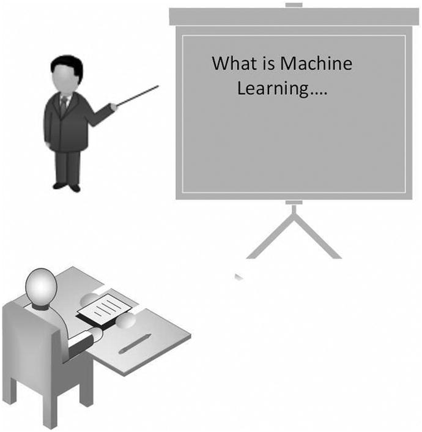
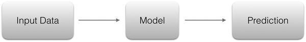
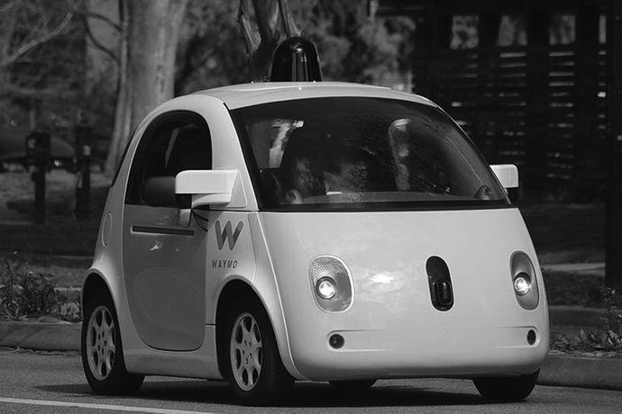
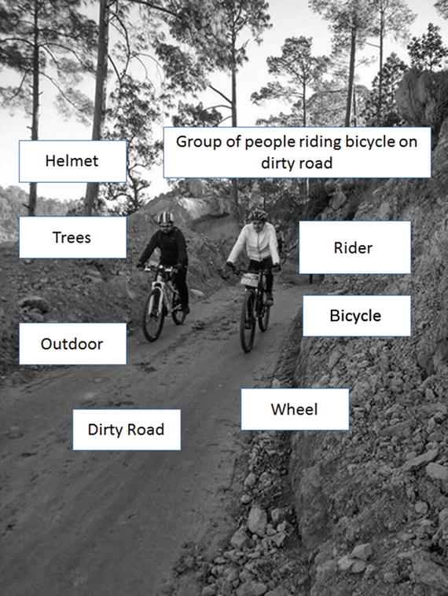
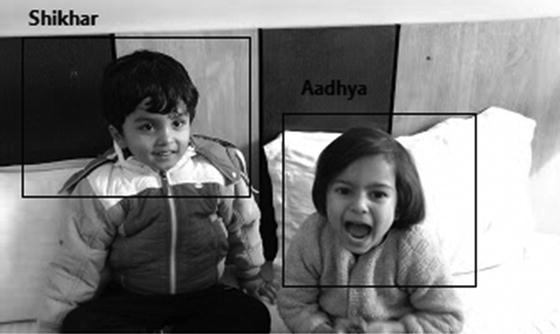

# 1.人工智能基础入门

想象一下，创建一个如此智能的软件，它不仅能理解人类语言，还能理解俚语和这些语言的微妙变化，这样你的软件就会知道“你好，计算机！你过得怎么样？”和“你好吗，伙计？”意思一样。

当你这么做的时候，为什么不在你的软件中加入听人说话并做出适当反应的能力呢？

*   用户:“电脑，我今天的日程是怎样的？”
*   软件:“你今天排得满满的，从上午 10 点到下午 1:30 有连续的会议，下午 3 点到 7 点又有会议。”

如果这还不能让你的软件足够智能，为什么不增加像人类一样对话的能力呢？

*   用户:“电脑，我错过比赛了吗？分数是多少？”
*   软件:“巴塞罗那对皇家马德里的足球比赛已经进行了 31 分钟。你最喜欢的球队巴塞罗那还没有进球。比分是 0-1。”
*   用户:“圣牛！谁从皇马进球了？”
*   软件:“c 罗第 10 分钟打进第一球。”
*   用户:“那不好看。他这个赛季的进球数是多少？”
*   软件:“到目前为止，罗纳尔多已经为他的俱乐部进了 42 个球，为他的国家进了 13 个球。”
*   用户:“真厉害。希望可怜的梅西快点赶上来。”
*   用户:“电脑，谢谢更新。”
*   软件:“不客气。”
*   软件:“半小时后别忘了回来查比分。根据控球率和投篮命中率统计，巴塞罗那有 73%的可能性在接下来的 20 分钟内得分。”

这些功能难道不会让你的软件变得聪明和智能吗？作为一名. NET 开发者，如何让你的软件像微软的 Cortana、苹果的 Siri、或者谷歌的 Assistant 一样智能？一会儿你就会明白了。

完成本章后，你将会学到以下关于人工智能的知识:

*   真实与虚构
*   历史和演变
*   微软和人工智能
*   基本概念
    *   认知、机器学习、深度学习、NLP、NLU 等。
    *   说明性图表和参考资料(如有可能)
*   微软认知服务
    *   谈论所有五个认知组
*   如何在你自己的软件中使用它
*   未来和未来

## 真实与虚构

当你听到人工智能这个词时，你会想到什么？可怕的机器人？尖端研究的课题？《终结者》电影中的阿诺德·施瓦辛格？反恐精英机器人？

Note

反恐精英是一款由 Valve 出品的第一人称射击游戏。它基于恐怖分子和反恐怖分子之间的战略斗争，前者想用炸弹炸毁一些地方，后者想阻止恐怖分子造成浩劫。虽然这种多人游戏通常在人类玩家之间进行，但一个人也可能与机器人一起玩或对抗机器人。

机器人是人工智能、编程、自我思考的虚拟玩家，可以在人类玩家不在的时候代替他们。机器人是视频游戏中的一个常见功能，有时它们只是被称为游戏的人工智能。

反恐精英，或被亲切地称为 CS，在业余和职业玩家中特别受欢迎，并且是全球顶级游戏比赛的常客。

经过几代人的研究，人工智能(AI)的含义已经发生了演变。人工智能的基本概念没有变，但它的应用变了。20 世纪 50 年代对人工智能的认识与今天它的实际应用大相径庭。而且还在不断发展。

人工智能是最近的热门话题。从流行的科幻书籍到成为一种商品，它走过了漫长的道路。而且，不，AI 和高级机器人接管世界，奴役我们人类没有任何关系。至少，现在还没有。任何足够智能的东西，从你手机的虚拟助手(Siri 和 Cortana)到你可信赖的搜索引擎(Google 和 Bing)到你最喜欢的手机或视频游戏，都是由人工智能驱动的。

对人工智能的兴趣在 2000 年代达到顶峰，尤其是在 2010 年代初。学术界和企业最近对人工智能研究的巨额投资对软件开发者来说是一个福音。微软、谷歌、脸书和亚马逊等公司在人工智能各个领域取得的进步以及随后他们产品的开源和商业化使软件开发者能够以前所未有的轻松在他们的应用程序中创建类似人类的体验。这导致了智能应用的激增，这些智能应用可以像普通人一样理解用户。

作为一名开发人员，你有没有想过如何使用人工智能来创建疯狂智能的软件？你可能有，但不知道从哪里开始。

在我们与顶级 IT 公司的软件开发人员打交道的经验中，我们在开发人员和项目经理中发现的一个共同看法是，即使添加单个人工智能元素，如自然语言理解、语音识别、机器学习等。，需要对神经网络、模糊逻辑和其他令人费解的计算机科学理论有深刻的理解。好吧，让我们告诉你好消息。情况不再是这样了。

谷歌搜索、必应(Bing)、Cortana 和脸书等你最喜爱的应用程序所依赖的智能，正慢慢地被这些公司以外的开发者所利用:一些部分是免费的，其他部分则是 SaaS 的商业产品。

## 历史和演变

我们认为，了解某件事及其重要性的最佳方式是了解它的起源——某件事的原因。

自古以来，人类就对非生物被赋予思考能力的想法着迷，要么是万能的上帝，要么是疯狂的科学家。在古代和现代文学中，有无数关于无生命的事物突然被赋予意识和智慧的记载。

希腊、中国和印度的哲学家认为人类的推理可以形式化为一套机械的规则。亚里士多德(公元前 384-322 年)发展了一种解决三段论的正式方法。欧几里德(公元前 300 年)通过他的数学著作《原本》给了我们一个推理的形式模型，其中包含了已知最早的算法之一。莱布尼茨(1646-1716)创造了一种通用的推理语言，将论证简化为计算，这种语言探索了所有理性思维可以像代数或几何那样系统化的可能性。布尔(1815-1864 年)在数理逻辑方面的工作提供了重要的突破，使人工智能看起来似乎可行。

这些正式的系统或“理论”一次又一次地被付诸实践，利用当时的技术，创造出模仿人类行为或思想的机器。人们利用钟表制造出了从精致的布谷鸟钟到自动绘画机的各种东西。这些是机器人的最早形式。在更近的时代，数学家和科学家应用形式推理原理来创造我们称之为计算机的东西。

“人工智能”一词是 1956 年夏天在达特茅斯学院校园内的一次会议上创造的。会议的提议包括这样一个断言:“学习的每个方面或智力的任何其他特征都可以被如此精确地描述，以至于可以制造一台机器来模拟它。”正是在这次会议期间，人工智能研究领域得以建立，参加会议的人成为了人工智能研究的先驱。

在接下来的几十年里，人工智能领域出现了重大突破。开发计算机程序是为了解决代数问题、证明定理和说英语。政府机构和私人组织投入大量资金来推动这项研究。但是通往现代人工智能的道路并不容易。

人工智能研究的第一次挫折发生在 1974 年。这一年到 1980 年之间的时间被称为第一个“艾冬天”在此期间，许多承诺的研究成果未能实现。这是由多种因素造成的，其中最主要的是科学家们未能预见到人工智能所带来的问题的难度。当时有限的计算能力是另一个主要原因。结果，缺乏进展导致早期支持这项研究的主要英国和美国机构切断了他们的资金。

在接下来的七年里，1980-87 年，人们对人工智能研究产生了新的兴趣。专家系统的发展促进了繁荣。专家系统正在跨组织开发，很快所有的大巨头都开始在人工智能上投入大量资金。神经网络方面的工作为光学字符识别和语音识别技术的发展奠定了基础。接下来的几年形成了第二个 AI 冬天，从 1987 年持续到 1993 年。像去年冬天一样，艾未未再次遭遇财务挫折。

Note

专家系统是一种程序，它使用从专家的知识中推导出的逻辑规则来回答或解决特定知识领域的问题。最早的例子包括从分光计读数中识别化合物的系统和诊断传染性血液疾病的系统。

专家系统将自己限制在特定知识的小范围内(从而避免了常识知识的问题),并且它们的简单设计使得程序的构建和修改变得相对容易。总而言之，这些程序被证明是有用的，这是 AI 到目前为止还没有做到的。

1993-2001 年标志着人工智能的回归，部分是由更快更便宜的计算机推动的。摩尔定律预测计算机的速度和内存容量每两年翻一番。事情就是这样。最后，由于获得了更快的计算能力，人工智能研究的旧承诺得以实现，缺乏计算能力已经开始了第一个冬天。使用先进的人工智能技术创造了专门的计算机来击败人类。谁能忘记 1997 年 IBM 的深蓝电脑和当时的国际象棋冠军加里·卡斯帕罗夫之间的标志性比赛？

人工智能广泛应用于机器人领域。日本人制造了看起来像人类的机器人，甚至能听懂和说人类的语言。西方世界也不甘落后，很快就有了一场制造最像人类的机械助手的竞赛。本田的 ASIMO 是机器人与人工智能相结合所能实现的辉煌范例:一个 4 英尺 3 英寸高的人形机器人，可以走路、跳舞、煮咖啡，甚至指挥管弦乐队。

### 当前的事态

人工智能最初的追求是建造像人类一样的机器人，能够理解我们，做我们的家务，并消除我们的孤独。但是今天，人工智能领域已经扩展到包括各种技术，帮助创建智能，功能和可靠的软件应用程序。

随着新一代科技公司的出现，21 世纪见证了人工智能的巨大进步，有时是在微软、IBM、谷歌、脸书、苹果、亚马逊等公司的研究实验室的幕后。也许当代人工智能的最佳例子之一是 IBM 的沃森，它最初是一个计算机系统，旨在与美国热门电视节目《危险边缘》中的人类竞争。在 2011 年的一场表演赛中，沃森击败了两位前冠军，赢得了 100 万美元的奖金。受沃森成功的推动，IBM 很快发布了人工智能技术，作为商业产品为其计算机系统提供动力。人工智能成为业内的一个时髦词，其他大型科技公司也带着自己的商业产品进入了这个市场。今天，有初创公司提供高度专业化但准确的人工智能即服务产品。

人工智能已经不局限于流行和企业软件应用。你最喜欢的电视和手机视频游戏已经有很长一段时间了。例如，在玩单人游戏时，你与计算机对抗，你的对手根据你的移动做出他们自己的决定。在很多游戏中，甚至可以改变对手的难度等级:难度等级越难，游戏的“AI”就越精密，你的对手也会越像人类。

### 人工智能的商品化

近年来，数据呈爆炸式增长，几乎是指数级增长。随着存储空间越来越便宜，大公司和小初创公司都不再丢弃无关的和有存档价值的数据，以便在某个时候对其进行分析，从而获得有意义的信息来帮助他们的业务。云革命在很大程度上支持了这一趋势。更快的计算机和更便宜的存储推动了云革命本身。流行供应商(如亚马逊 AWS 和微软 Azure)提供的云计算和存储非常便宜，以至于扔掉服务器和企业软件生成的几十年前的日志数据不再是一个好主意。

因此，公司每天每小时都在产生令人难以置信的大量数据。我们把这种大量的数据称为大数据。大数据在几乎所有经济领域都有应用，如银行、零售、IT、社交网络、医疗保健、科学、体育等等。

Note

为了想象大数据的规模，考虑以下统计数据。

截至 2017 年 8 月，谷歌每月处理大约 1000 亿次搜索。也就是每年超过 1.2 万亿！谷歌分析其搜索数据，以确定地理位置和人口统计的搜索趋势。

脸书每天处理来自其用户群的 3 亿多张照片。脸书分析其数据、帖子和照片，为用户提供更准确的广告。

沃尔玛每小时处理超过 100 万笔顾客交易。沃尔玛分析这些数据，看看哪些产品比其他产品表现更好，哪些产品一起销售，以及更多类似的零售分析。

由于数据的复杂性和分析所有数据所需的时间，传统的数据技术不再可行。为了分析如此大量的数据，需要一种全新的方法。事实证明，用于训练复杂人工智能系统的机器学习技术也可以用于大数据。因此，今天的人工智能不再是大型私人和公共研究机构的领地。人工智能及其各种技术被用来为各种商业建立和维护软件解决方案。

## 微软和人工智能

微软在人工智能方面有着丰富的历史。当比尔·盖茨在 1991 年创建微软研究院时，他有一个愿景，计算机有一天会看到、听到并理解人类。26 年后，人工智能更接近实现这一愿景。这些年来，微软一直没有宣布人形机器人或建造全知主机。它在人工智能方面的进展对普通公众来说并不“可见”。它一直在默默的将类人思维融入到现有的产品中。

以微软必应为例，它是微软的热门搜索引擎。Bing 不仅可以执行基于关键字的搜索，它还可以根据搜索短语的预期含义搜索网页。因此，像“泰勒·斯威夫特”这样简单的关键词搜索会给你提供官方网站、维基百科页面、社交媒体账户、最近的新闻报道和这位受欢迎的美国歌手兼作曲家的一些照片。进行更复杂的搜索，比如“谁是乌干达总统？”会给你一个大字体的准确名字和那个人的网页搜索结果。这就像问另一个人一个问题，而他知道你并不打算得到所有包含“谁是乌干达总统”的网页，而只是这个人的名字。

在这两个例子中(泰勒·斯威夫特和乌干达总统)，Bing 还会在左边显示这个人的一些简短信息:出生日期、配偶、子女等。根据被搜索者的类型，Bing 还会显示其他相关细节，如教育程度、时间表、政治家的语录，以及歌手的净资产、作品和恋情。Bing 是如何让你对一个人有如此多的了解的？必应的开发者是否已经为世界上所有的名人(现在的和过去的)创建了一个庞大的快速事实数据库？不完全是。

尽管创建这样一个数据库并非不可能，但维护它的成本将是巨大的。我们的世界很大，很大，有这么多的国家和领土，将继续产生名人。因此，这个数据库肯定存在可伸缩性问题。

微软用来解决这个问题的技术被称为机器学习。我们一会儿会看看机器学习和它的哥哥，深度学习。同样，使 Bing 能够理解搜索短语含义的东西是自然语言理解。你可以用十几种不同的方式问必应同样的问题，必应每次都会给出同样的意思。NLU 聪明地用人类下意识的方式解释人类语言。NLU 还可以帮助检测搜索短语中的拼写错误:“谁是乌干达总统”会被必应自动更正为“谁是乌干达总统”。

## 基本概念

在开始使用人工智能构建智能应用程序之前，熟悉基础知识会有所帮助。在这一节中，我们将介绍基本的术语以及每一个术语背后发生的事情，让你了解人工智能是如何工作的。图 [1-1](#Fig1) 展示了人类在教机器，机器在做笔记的未来一瞥。

图 1-1。

A human is teaching a machine the basics, and the machine is taking notes

但是，在我们深入研究各种形式的人工智能的细节之前，理解驱动它们的东西是很重要的。那个东西就是机器学习(图 [1-1](#Fig1) )。

机器学习这个术语是亚瑟·塞缪尔在他 1959 年的论文《机器学习的一些研究》中创造的。按照塞缪尔的说法，机器学习是“赋予计算机无需明确编程就能学习的能力。”我们都知道计算机是一种机器，它通过遵循人类以程序形式提供的指令来执行某些操作。那么机器怎么可能自己学习东西呢？这样的机器会用从这种学习中获得的知识做什么？

为了更好地理解机器学习，让我们以流行的语言翻译工具 Google Translate 为例，该工具可以轻松地将外语(比如说法语)翻译成英语，反之亦然。你有没有想过它是如何工作的？

考虑以下用法语写的句子(图 [1-2](#Fig2) )。

图 1-2。

A sentence in French

最简单的翻译系统会使用词对词词典将一个句子从一种语言翻译成另一种语言(图 [1-3](#Fig3) )。

图 1-3。

A literal translation into English

法语中“你的电话号码是多少”的意思在英语中直译为“你的电话号码是多少”。显然，这种简单化的翻译完全忽略了特定语言的语法规则。

这可以通过向翻译系统提供两种语言的语法规则来解决。但问题是:语法规则是在假设输入的句子语法正确的情况下工作的。在现实世界中，情况并不总是如此。此外，输出句子可能有几种不同的正确变化。这种基于规则的翻译系统将变得过于复杂，难以维护。

一个理想的翻译系统是一个只需要看训练数据就可以自己学习翻译的系统。在经历了成千上万的训练句子后，它将开始看到模式，从而自动找出语言的规则。这种自我学习就是机器学习的内容。

Google Translate 支持的不是 10 种，不是 20 种，而是 100+种语言，包括一些罕见和晦涩的语言，更多的语言会定期添加。当然，对所有可能的短语和句子进行硬编码翻译是不可能的。机器学习是谷歌翻译理解和翻译语言的能力的动力。

尽管并非完美无缺，谷歌翻译提供的翻译还是相当合理的。它不仅从谷歌提供的训练数据中学习，还从其数百万用户中学习。如果翻译不正确，用户可以选择手动提交正确的翻译。谷歌翻译从错误中学习，就像人类一样，并为未来的翻译提高对语言的理解。那是给你的机器学习！

Note

最近，谷歌翻译从使用机器学习算法转向深度学习算法。

机器学习(ML)与深度学习(DL)

如果你一直在关注新闻，你可能听说过与人工智能相关的深度学习这个术语。深度学习是最近的发展，显然不熟悉其确切含义的人会将它混淆为机器学习的继任者。这太不真实了。

虽然机器学习是实现人工智能的一种方式，但深度学习是一种机器学习技术。换句话说，深度学习不是机器学习的替代品，而是机器学习本身的一部分。

传统上，机器学习中使用的一种常见技术是人工神经网络。人工神经网络是非常 CPU 密集型的，通常最终产生低于人类的结果。最近的人工智能革命之所以成为可能，是因为深度学习，这是一种突破性的技术，使机器学习更快、更准确。深度学习算法利用并行编程，并依靠各层神经网络，而不是数百或数千，而是数百万个训练数据实例来实现一个目标(图像识别，语言翻译等)。).这种“深度”学习对于以前的 ML 技术来说是不可想象的。

公司内部开发了自己的深度学习工具，以提供人工智能驱动的云服务。谷歌在 2015 年末开源了其深度学习框架 Tensorflow。去 [`www.tensorflow.org`](http://www.tensorflow.org) 看看这个框架能做什么以及你如何使用它。

### 机器学习

机器学习是人工智能最基本的概念。ML 探索算法的研究和构建，这些算法可以从数据中学习，并基于它们的学习做出预测。ML 是智能机器的动力；这就是产生人工智能的原因。

常规的非 ML 语言翻译算法具有静态程序指令来检测句子是用哪种语言写的:使用的单词、语法结构等。类似地，非最大似然人脸检测算法对人脸有一个硬编码的定义:圆形的、肤色的、在顶部附近有两个小的黑暗区域(眼睛)等。另一方面，ML 算法没有这样的硬编码；它通过例子学习。如果你用许多用法语写的句子和一些不是用法语写的句子来训练它，当它看到法语句子时，它会学会识别它们。

很多现实世界的问题都是非线性的，比如语言翻译、天气预测、垃圾邮件过滤、预测下一任美国总统、分类问题(比如通过图像区分鸟类的种类)等等。ML 是这类非线性问题的理想解决方案，在这类问题中，使用静态程序指令设计和编程显式算法是不可行的。

我们希望上一节中的语言翻译示例能够让您对机器学习的工作原理有一个合理的理解。这只是冰山一角。ML 要复杂得多，但是您现在已经知道了基本概念。ML 是计算机科学的一个子领域，它包含几个主题，尤其是与数学和统计学相关的主题。虽然要涵盖所有的 ML 需要不止一本书，但是让我们来看看与之相关的常用术语(图 [1-4](#Fig4) 和 [1-5](#Fig5) )。

图 1-5。

The trained model can then take in new or familiar data to make informed predictions

图 1-4。

A machine learning algorithm, such as a neural network , “learns” the basics about a topic from training data. The output of such learning is a trained model.

在机器学习系统能够开始智能地回答关于某个主题的问题之前，它必须首先了解该主题。为此，ML 很大程度上依赖于关于主题的初始数据集。这个初始数据称为训练数据。训练数据越多，我们的机器能够识别的模式就越多，它就能越准确地回答关于该主题的新问题和熟悉问题。要得到可靠的结果，几百条甚至几千条记录的训练数据通常是不够的。

在几天、几个月甚至几年的时间里，使用数百万条记录或数千兆字节的数据训练了真正精确的、类似人类的机器。我们一点也不夸张。一台处理能力很好的个人电脑，一个高端显卡，要训练一个语言翻译算法，单对语言就需要一个多月的连续运行时间，数据超过 1GB【见 [`https://github.com/tensorflow/tensorflow/issues/600#issuecomment-226333266`](https://github.com/tensorflow/tensorflow/issues/600#issuecomment-226333266) 】。

训练数据的质量和模型的设计方式同样重要。所使用的数据必须准确、经过净化，并通过可靠的方式获得。模型需要用现实生活中的场景来设计。因此，下次你的图像识别应用程序错误地识别出被捕捉的对象，或者你最喜欢的语言翻译应用程序产生了一个可笑的翻译，归咎于训练数据的质量或他们使用的模型。此外，重要的是要注意，学习不仅仅是一个初始过程:它是一个持续的过程。最初，机器从训练数据中学习；后来它从它的用户那里得到了。

人工智能研究已经导致了实现机器学习的几种方法的发展。人工神经网络是最流行的方法之一。人工神经网络，或简称为神经网络，是一种受生物神经网络的结构和功能方面启发的学习算法。计算是由一组相互连接的人工神经元构成的，使用连接主义的计算方法处理信息。它们用于模拟输入和输出之间的复杂关系，以发现数据中的模式。其他流行的方法是深度学习、基于规则、决策树和贝叶斯网络。

因此，当足够的训练数据被提供给神经网络时，我们就得到所谓的训练模型。模型是数学和统计函数，可以对给定的输入进行预测(有根据的猜测)。例如，基于过去 10 年的天气信息(训练数据)，机器学习模型可以学习预测未来几天的天气。

#### 机器学习的类型

监督学习是对训练数据进行标记。对于语言检测算法来说，如果我们提供给算法的句子明确地标注了它们所用的语言，那么学习就会受到监督:用法语写的句子和不用法语写的句子；用西班牙语写的句子和不用西班牙语写的句子；诸如此类。由于先前的标记是由人工完成的，这增加了维护这种算法的工作量和成本。

无监督学习是在训练数据没有标注的情况下。由于缺乏标签，一个算法当然不能学会神奇地说出一个句子的确切语言，但它可以区分一种语言和另一种语言。也就是通过无监督学习，一个 ML 算法可以学习看到法语句子和西班牙语句子不一样，和印地语句子不一样，等等。

强化学习是指没有明确地向机器提供训练数据。为了实现目标，它必须与环境相互作用。由于缺乏训练数据，它必须从头开始学习，并依靠试凑法来做出决策和发现自己的正确路径。对于机器采取的每一个行动，都有一个结果，而对于每一个结果，它都会得到一个数字奖励。因此，如果一项行动产生了令人满意的结果，它就会得到“好”的评价。如果结果是灾难性的，它会收到“非常非常糟糕”的评论。像人类一样，机器努力最大化其总数字奖励——也就是说，通过不重复错误来获得尽可能多的“好”和“非常好”的评论。当机器必须处理非常动态的环境时，这种机器学习技术特别有用，在这种环境中，创建和提供训练数据是不可行的。比如开车(图 [1-6](#Fig6) )、玩电子游戏等等。

图 1-6。

Self-driving cars, vehicles that do not require a human to operate them, use reinforcement learning to learn from the dynamic and challenging environment (roads and traffic) to improve their driving skills over time

### 语言

人类以三种方式相互交流:口头、书面和手势。这三种方式的共同点是“语言”语言是一套对每个人都一样的交流规则。虽然同一种语言可以用于书面和口头交流，但通常有细微和明显的差异，其中书面语言更为正式。而手语，手势的语言，是完全不同的。

人工智能研究中花费的最大努力是让机器能够像人类理解自己一样自然地理解人类。由于机器理解书面文本比语音更容易，我们将从书面语言中的语言基础开始讨论。

#### 自然语言理解

NLU 是机器通过人类语言理解人类的能力。计算机天生被设计成理解比特和字节、代码和逻辑、程序和指令，而不是人类语言。也就是说，计算机擅长处理结构化数据，而不是非结构化数据。

人类语言受一些规则(语法)支配，但这些规则在日常和非正式交流中并不总是得到遵守。因此，人类可以毫不费力地理解有语法错误、发音错误、口语、缩写等错误的书面或口头句子。可以肯定地说，人类语言受灵活规则的支配。

NLU 将非结构化输入(图 [1-7](#Fig7) )转换成机器可以理解的结构化数据，这些输入由灵活且定义不明确的规则管理。如果你一直在想，这就是为什么微软的 Cortana，苹果的 Siri 和亚马逊的 Alexa 如此像人。

图 1-7。

NLU analyzes each sentence for two things: intent (the meaning or intended action) and entities. In this example, retrieving weather info is the detected intent and city (Delhi) and day (tomorrow) are the entities. A user may ask the same question in a hundred different ways, yet a good NLU system will always be able to extract the correct intent and entities out of the user’s sentence. The software can then use this extracted information to query an online weather API and show the user their requested weather info.

#### 自然语言处理

当然，人机交互不仅仅是理解给定句子的意思。NLP 包含了所有与人类语言中的人机交互有关的东西。NLU 只是 NLP 这个更大的集合中的一个任务。自然语言处理的其他任务包括

*   机器翻译:将文本从一种语言转换成另一种语言。
*   自然语言生成:NLU 的反面；将结构化数据(通常来自数据库)转换成人类可读的文本语句。例如，通过比较数据库中的两行天气信息，可以形成这样一个句子，“今天德里的天气是 26 摄氏度，比昨天下降了 2 度。”
*   情感分析:浏览一段文字(推文、脸书更新、评论、评论等)。)与产品、人、事件或地点相关，以确定对相关实体的总体情绪(负面或正面)。
*   命名实体识别:对于某些文本，确定文本中的哪些项目映射到正确的名称，例如人或地点，以及每个此类名称的类型(例如，人、位置、组织)。
*   关系抽取:抽取一段文本中涉及的实体之间的关系，如谁是谁的兄弟，原因和症状等。

NLP 比上面提到的几个任务要广泛得多，每个任务都在独立的研究之下。

### 演讲

除了智能地分析文本，人工智能还可以帮助带有监听设备(如麦克风)的机器理解正在说的内容。语音被表示为一组音频信号，声学建模用于寻找音频信号和音素(组成语音的语言单位)之间的关系。

#### 语音识别

语音识别是由计算机识别口语并将其翻译成文本。当你向 Siri 或谷歌(通过语音搜索)提问时，它会使用语音识别将你的语音转换为文本。然后，转换后的文本用于执行搜索。现代 SR 技术可以根据上下文处理口音的变化以及类似的发音单词和短语。

语音识别的应用范围从设计无障碍系统(如盲人软件)到基于语音的搜索引擎，再到免提听写。

#### 声音识别

术语语音识别或说话人识别指的是识别说话人，而不是他们在说什么。识别说话人可以简化系统中的语音翻译任务，这些系统已经过特定人的语音训练，或者可以作为安全过程的一部分用于认证或验证说话人的身份。

#### TTS 和 STT

文本到语音(TTS)和语音到文本(STT)是相关但不同的技术。

TTS 也称为语音合成，是机器“说出”一段书面文本的能力。合成语音可以通过连接存储在数据库中的多段记录语音(每段记录一个单词)来创建。或者，合成器可以结合声道模型和其他人类声音特征来创建完全“合成”的声音输出。

另一方面，STT 是语音识别的下一步。一旦语音被分解成音频信号，然后再分解成音素，机器就可以将音素转换成文本。使用相同的音素集和序列构建多个文本句子是可能的，因此机器智能地为每个构建分配一个置信度分数，更有意义的句子得到更高的分数。

### 计算机视觉

我们终于到了讨论应用于视觉数据的人工智能技术的部分:图像和视频。这种技术的广义术语叫做计算机视觉，即计算机“看”的能力。与语音一样，计算机无法像处理文本一样处理图像。图像处理技术与智能人工智能算法相结合，使机器能够看到图像，并识别和识别物体和人。

#### 目标检测

照片中的场景可能包括几十个甚至几百个对象。大多数时候，我们只关心场景中的一小部分对象。让我们称这样的物体为“有趣的”物体。对象检测是指机器检测场景中感兴趣的对象的能力。有趣的对象可能因上下文而异。例子包括

*   A speeding car on a road (traffic control) (Figure [1-8](#Fig8))

    

    图 1-8。

    A car being detected on the road
*   巨大的太阳系或星系中类似行星的物体(天文学)
*   闯入后院的窃贼(家庭安全)
*   一群人进入商场(数着人流)

#### 图像识别

发现之后通常是识别。它能够识别并标记检测到的对象和动作的确切类型(图 [1-9](#Fig9) )。举个例子，

图 1-9。

A group of riders on a dirty road

*   识别场景中的船、两个人、水和太阳
*   识别照片中动物的确切种类

图像识别也称为对象分类或匹配。在其他系统中，增强现实应用程序很常见，如谷歌眼镜。

像人工智能中的其他事情一样，图像识别系统的准确性在很大程度上取决于训练数据。使用机器学习技术，如前面的机器翻译部分所见，用数百幅图像训练系统来识别特定类别的对象。因此，我们可以首先训练系统使用数百张包含一只或多只狗的图像来识别一只狗。一旦系统能够识别狗，它就可以被训练识别德国牧羊犬、杜宾犬甚至吉娃娃。

#### 人脸识别

检测和识别人脸是图像识别的子任务(图 [1-10](#Fig10) )。使用相同的技术，可以检测照片中的人脸及其相关属性(年龄、性别、微笑等)。).如果该系统在特定人的脸上进行了预训练，它可以进行匹配以识别照片中那个人的脸。人脸识别可以用作安全认证机制，或者使用闭路电视摄像机在公共场所检测危险的罪犯。

图 1-10。

Faces being identified in an image

#### 光学字符识别

OCR 是一种用于将手写、键入或打印的文本转换为可在计算机上编辑的数据的方法。OCR 系统查看纸质文档的扫描图像，并将字母的形状与存储的字母图像进行比较。因此，它能够创建一个可以用普通文本编辑器编辑的文本文件。使用 OCR 检测到的文本可以输入到文本到语音转换(TTS)软件中，大声朗读给盲人听，否则盲人看不到文档。

在线书店通常使用 OCR 来创建印刷书籍的软拷贝。一些语言翻译工具也使用它来帮助使用移动相机直接翻译外语招牌。图 [1-11](#Fig11) 展示了谷歌如何使用 OCR 让你的手机成为实时翻译。

图 1-11。

Google allows your phone to be a real-time translator

## 微软的认知服务

认知服务是微软提供的一套与人工智能相关的软件即服务(SaaS)商业产品。认知服务(Cognitive Services)是微软多年来对认知计算和人工智能研究的产物，其中许多服务正在被微软自己的一些热门产品使用，如 Bing(搜索、地图)、Translator、Bot Framework 等。

微软已经将这些服务作为易于使用的 REST APIs 提供，可以在 web 或移动应用程序中直接使用。截至撰写本书时，有 29 种可用的认知服务，大致分为五类(表 [1-1](#Tab1) )。

表 1-1。

Cognitive Services by Microsoft

<colgroup><col> <col></colgroup> 
| 视觉计算机视觉 API 内容调节器 API 情感 API 人脸 API 视频 API 定制视觉服务视频索引器 | 语音 Bing 语音 API 自定义语音服务说话人识别 API 翻译语音 API |
| 语言 Bing 拼写检查 API 语言理解智能服务语言分析 API 文本分析 API 翻译器 API WebLM API | 知识学术知识 API 实体链接智能服务知识探索 API QnA Maker API 推荐 API 定制决策服务 |
| 搜索 Bing 自动建议 API Bing 图片搜索 API Bing 新闻搜索 API Bing 视频搜索 API Bing 网页搜索 API Bing 自定义搜索 API |   |

### 视力

Vison 服务处理视觉信息，主要是图像和视频形式的信息。

*   计算机视觉 API:从图像中提取有关其内容的丰富信息:图像的智能文本描述、检测到的人脸(年龄和性别)、图像中的主要颜色，以及图像是否包含成人内容。
*   内容审核:评估文本、图像和视频中的攻击性和不需要的内容。
*   情感 API:通过分析人脸来检测一系列的情感，比如愤怒、快乐、悲伤、恐惧、惊讶等。
*   人脸 API:检测人脸并进行相似度比较(人脸检测)，根据视觉相似度将人分组(人脸分组)，识别图像中之前标记的人(人脸验证)。
*   视频 API:用于面部检测、运动检测(在 CCTV 安全系统中有用)、生成缩略图和近实时视频分析(每帧的文本描述)的智能视频处理。
*   定制视觉服务:当您需要对场景、面部和情感之外的事物执行图像识别时，这允许您创建定制的图像分类器，通常专注于特定的领域。你可以训练这项服务，比如说，识别不同种类的鸟类，然后在观鸟爱好者的移动应用程序中使用它的 REST API。
*   视频索引器:从视频中提取见解，如人脸识别(人名)、每个人的语音情感分析(正面、负面、中性)和关键字。

### 演讲

这些服务以音频的形式处理人类语音。

*   Bing 语音 API:将语音转换为文本，理解其意图，并将文本转换回语音。在第 [7](07.html) 章中有详细介绍。
*   自定义语音服务:允许您根据应用程序的词汇和用户的说话方式来定制语音识别器的自定义语言模型。在第 [7](07.html) 章中有详细介绍。
*   说话人识别 API:识别录音或现场语音音频中的说话人。说话人识别可以被可靠地用作认证机制。
*   Translator Speech API:跨九种支持的语言实时将语音从一种语言翻译成另一种语言。

### 语言

这些服务处理自然语言理解、翻译、分析等等。

*   Bing 拼写检查 API:纠正句子中的拼写错误。除了词典中的单词，还考虑到了断词、俚语、人物和品牌名称。在第 [5 章](05.html)中有详细介绍。
*   语言理解智能服务(LUIS):自然语言理解(NLU)服务。在第 [4](04.html) 和第 [6](06.html) 章中有详细介绍。
*   语言分析 API:解析文本以进行粒度语言分析，如句子分离和标记化(将文本分成句子和标记)以及词性标记(将标记标记为名词、动词等)。).在第 [5](05.html) 章中有详细介绍。
*   文本分析 API:从文本中检测情绪(积极或消极)、关键短语、主题和语言。在第 [5 章](05.html)中有详细介绍。
*   Translator API:将文本从一种语言翻译成另一种语言，并检测给定文本的语言。在第 [5 章](05.html)中有详细介绍。
*   Web 语言模型 API:提供了各种其他语言 API 没有涵盖的自然语言处理任务:断词(在缺少空格的单词串中插入空格)、联合概率(计算特定单词序列出现的频率)、条件概率(计算特定单词跟随另一个单词的频率)和下一个单词完成(获取最有可能跟随的单词列表)。在第 [5 章](05.html)中有详细介绍。

### 知识

这些服务处理搜索大型知识库以识别实体，提供搜索建议，并给出产品推荐。

*   学术知识 API:允许您从 Microsoft Academic Graph 检索信息，这是一个科学/学术研究论文及其实体的专有知识库。使用这个 API，你可以很容易地按作者、机构、事件等找到论文。也可以找到类似的论文，检查抄袭，并检索引用统计。
*   实体链接智能服务:查找关键字(命名实体、事件、位置等。)在基于上下文的文本中。
*   知识探索服务:为您自己的数据添加对自然语言查询、自动完成搜索建议等的支持。
*   QnA Maker:从提供的数据中神奇地创建 FAQ 风格的问题和答案。QnA Maker 提供了网站和 API 的组合。使用该网站，通过您现有的 FAQ 网站、pdf、doc 或 txt 文件创建知识库。QnA Maker 将自动从您的文档中提取问题和答案，并根据您的数据训练自己回答自然语言用户查询。你可以把它想象成自动化版的路易斯。您不必培训系统，但您可以选择进行自定义再培训。QnA Maker 的 API 是接受用户查询并为您的知识库发送答案的端点。可选地，QnA Maker 可以与微软的 Bot 框架配对，为脸书、Skype、Slack 等创建开箱即用的 Bot。
*   推荐 API:这对于在线和离线的零售商店特别有用，通过向他们的顾客提供推荐，例如经常一起购买的商品，基于他们的交易历史为用户提供个性化的商品推荐等，帮助他们增加销售。像 QnA Maker 一样，您可以让推荐用户界面网站使用您的现有数据在其系统中创建产品目录和使用数据。
*   自定义决策服务:使用给定的文本信息来导出上下文，在此基础上，它可以对提供的选项进行排序，并根据排序做出决策。使用基于反馈的强化学习 ML 技术随着时间的推移进行改进。

### 搜索

这些服务帮助你利用第二大流行搜索引擎 Bing 的搜索能力。

*   Bing Autosuggest API:当用户在搜索框内并行输入时，直接从 Bing search 提供应用程序的搜索表单、智能预输入和搜索建议。
*   Bing 图像搜索 API:使用 Bing 的图像搜索，根据关键字、颜色、国家、尺寸、许可证等过滤器返回图像。
*   Bing 新闻搜索 API:根据关键字、新鲜度、国家等过滤器返回最新的新闻结果。
*   Bing 视频搜索 API:根据关键词、分辨率、视频长度、国家和定价(免费或付费)等过滤器返回视频搜索结果。
*   Bing 网络搜索 API:基于各种过滤器返回网络搜索结果。也有可能获得一个关键字或短语的相关搜索列表。
*   Bing 定制搜索:基于定制意图和主题的 Bing 搜索。因此，必应不会搜索整个网络，而是根据主题搜索网站。它还可以用于在单个或一组指定的网站上实现特定于站点的搜索。

所有认知服务 API 都有免费和现收现付两种定价等级。您可以根据应用程序的使用量选择一个层。

虽然我们很想详细介绍这些 API，但是我们受到本书范围的限制。我们将涵盖足够多的服务，包括语音、语言和搜索类别，让您在短时间内构建真正智能的应用程序。

您可以通过访问 [`www.microsoft.com/cognitive-services/en-us/apis`](http://www.microsoft.com/cognitive-services/en-us/apis) 了解有关这些服务的更多信息(可能还有最近增加的更多信息)。

## 概述

这一章是对人工智能、其历史、基本术语和技术的介绍。您还了解了微软在人工智能研究方面的努力，并快速了解了微软以认知服务 REST APIs 的形式提供的各种商业人工智能产品。

概括地说，你学到了

*   人们通常对人工智能的看法:什么是真实的，什么是虚构的
*   人工智能的历史和演变
*   今天人工智能是如何以及在哪里被使用的
*   关于机器学习，它是任何智能系统的支柱
*   关于微软的认知服务，它是企业就绪的 REST APIs，可用于创建智能软件应用程序

在下一章，你将学习如何安装构建人工智能软件的所有先决条件，然后你将使用 Visual Studio 构建你的第一个智能应用程序。