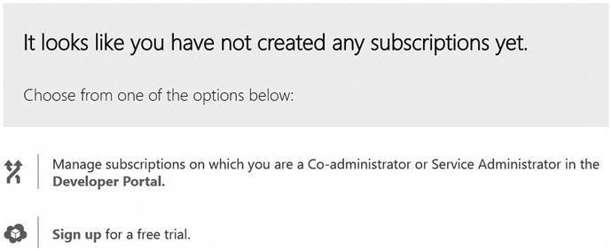
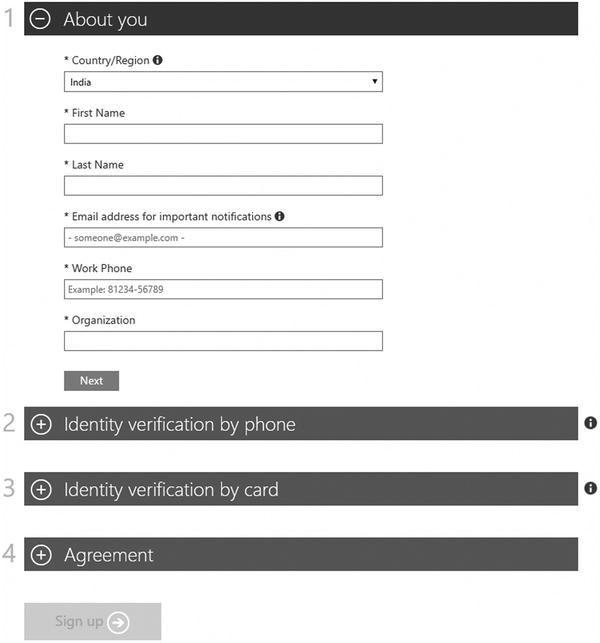
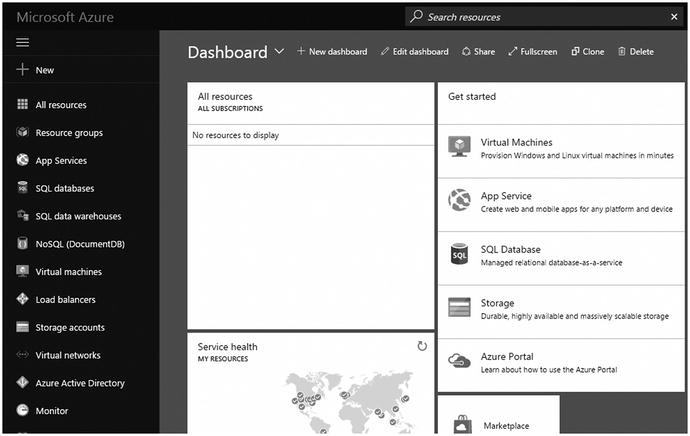
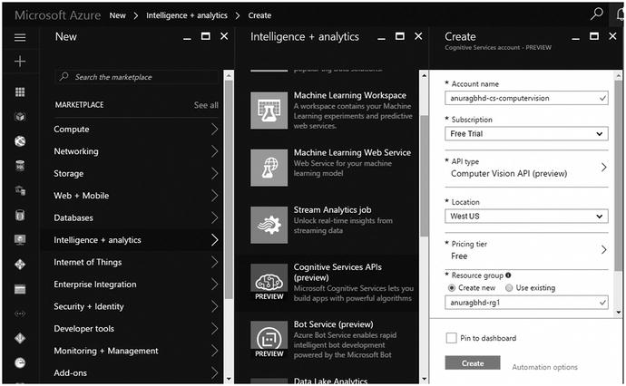
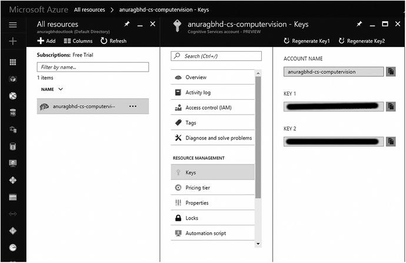
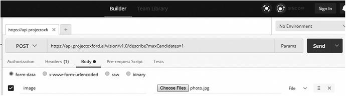
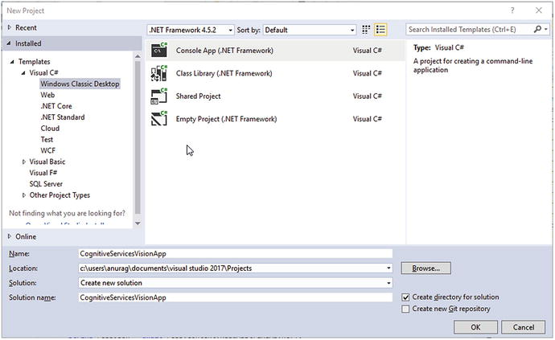
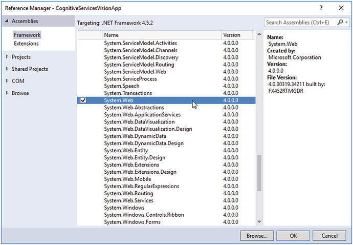
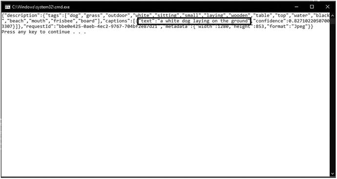
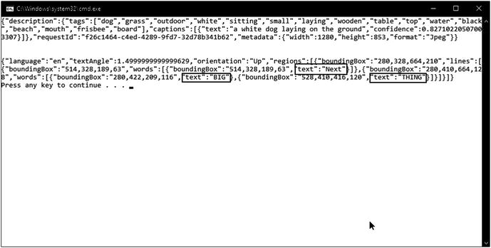

# 2.在 Visual Studio 中创建基于人工智能的应用程序

整个微软认知服务套件是作为一组 REST APIs 提供的。REST API 的好处是它不需要在编程语言中使用特殊的 SDK 或库。REST API 有一个 HTTP URL 端点，可以接受 JSON 或 XML 格式的输入，并给出相同格式的输出。正因为如此，REST APIs 在所有主流编程语言中都可以直接使用，比如 C#、Java、PHP、Ruby、Python、JavaScript 等等。因为这本书的目标。NET 开发人员，我们将限制自己在整本书中使用 C#。但是，实际上，使用认知服务的基本原则对于任何语言都是一样的。

在您可以开始使用认知服务之前，您需要为您的应用程序中要使用的每个服务提供一个订阅密钥，这反过来要求您拥有一个 Microsoft Azure 帐户。在撰写本文时，认知服务套件中的大多数 API 都有免费使用和付费模式(有些只有付费模式)。免费使用模式，即免费层，允许您使用 API 而无需向微软支付任何费用，但它通常带有限制，使该层仅适用于个人和少量应用程序。另一方面，随用随付层允许您使用 API，而不受按使用付费模型的限制。免费层和现收现付层都需要订购密钥。

Note

Azure 是面向企业和个人使用的领先云计算平台之一。它提供 SaaS(软件即服务)、PaaS(平台即服务)和 IaaS(基础设施即服务)服务，并支持许多不同的编程语言、工具和框架，包括特定于微软的和第三方的软件和系统。Azure 提供的众多云服务中有认知服务。

其他可用的服务包括基于 Windows 和 Linux 的虚拟机(用于托管网站和应用程序的虚拟专用服务器)、数据库、存储、缓存和内容交付网络(cdn)。

完成本章后，您将学会

*   使用认知服务的先决条件是什么
*   如何从 Azure 获得认知服务 API 的订阅密钥
*   如何测试认知服务 API
*   如何使用 Visual Studio 和 C#创建第一个支持人工智能的应用程序

## 使用认知服务的先决条件

正如我们之前所说的，使用 REST APIs 非常简单。您所需要的只是您最喜欢的编程语言、代码编辑器和引用输入和输出格式的 API 文档。对于大多数 REST APIs 来说都是如此。对于认知服务，您还需要一个订阅密钥来调用所需的 API。如果没有有效的订阅密钥，您的程序将无权使用该 API。

以下是创建基于人工智能的应用程序所需的一些东西:

*   可视化工作室
*   Azure 订阅密钥
*   你的热情

在这一章中，我们将帮助你创建你的第一个基于人工智能的应用程序。您将使用计算机视觉 API 来创建基于人工智能的应用程序。计算机视觉是机器能够像人类一样“看到”图像，并标记组成该图像的各种对象、特征和人的能力。

## 设置开发环境

Visual Studio (VS)是世界上最强大的集成开发编辑器之一，也是。NET 开发人员。VS 实际上是你需要在你的计算机上安装的唯一的东西，以便能够开始构建智能的(和常规的)应用程序。VS 捆绑了最新版本的。NET Framework，其中包括该框架支持的所有语言的编译器，包括 C#。

在撰写本文时，VS 的最新稳定、可生产版本是 2017 版。VS 2017 有几个版本(社区版、专业版、企业版、测试专业版)，除了社区版都是付费的。

在本书中，我们将使用 VS 2017 Professional 作为我们的 IDE 选择。但是欢迎你使用 VS 2017 社区或者 VS 2015 的任何其他版本。VS 专业版和社区版几乎是一样的，除了一些在专业版和社区版中没有的企业版特性。

如果您的计算机上已经安装了 VS，则不需要进行任何额外的安装或配置。你都准备好了！然而，如果你还没有 VS，我们强烈建议你前往 [`www.visualstudio.com`](http://www.visualstudio.com) 免费下载最新版本的 Visual Studio 社区。

Note

值得注意的是，Visual Studio 代码并不等同于 Visual Studio。后者是用于构建桌面、web 和移动应用程序的全功能 IDE，而前者是用于构建 web 和混合移动应用程序的专用 IDE。VS 代码不是 Visual Studio 的版本；相反，它是一个独立、免费、开源的 web 开发代码编辑器。

## 获取认知服务的 Azure 订阅密钥

为了在您的应用程序中使用它们，您需要为 22 个认知服务 API 中的每一个都提供一个单独的订阅密钥。让我们来看一下您需要遵循的所有步骤，以便为计算机视觉 API 获得您自己的订阅密钥。

### 步骤 1:设置 Azure 帐户

如果你已经有一个 Azure 帐户，可以跳过这一部分。注册 Azure 账户很容易，但需要你有一个微软账户。如果您还没有，请在`signup.live.com`免费获取。你有两种选择来注册 Azure 帐户:获得按需付费订阅或开始 30 天免费试用。

使用现收现付套餐，您可以根据自己使用的服务按月付费。订阅是无承诺的，这意味着它不需要您支付任何额外的初始或固定的月费。例如，如果你唯一可以利用的服务是一台每月 20 美元的虚拟机，那么只要你使用它，这就是你每月支付的全部费用。同样，如果您已经激活了一个认知服务 API 的免费层，那么如果您处于免费层的限制范围内，您就无需支付任何费用。

30 天免费试用是你最安全的选择，如果你是第一次使用，强烈建议你这样做。试用后，您的 Azure 帐户将获得 200 美元的免费点数。你可以随意使用这个信用点数。一旦你用完了你的免费信用，这通常是不太可能的情况，你将被要求支付额外的付费服务。30 天试用期结束后，您可以选择切换到现收现付套餐。否则，您将无法访问您在试用期内设置的服务。但是，您的 Azure 门户访问将保持不变。但与通常的试用不同，Azure 不会在你的试用期到期后自动将你升级到付费计划。因此，你的信用卡/借记卡被非自愿收费的风险为零。

值得一提的是，Visual Studio 专业版和企业版订阅者每个月都会获得免费的 Azure 信用:专业版 50 美元，企业版 150 美元。该金额每月自动记入与 Visual Studio 订阅相关联的 Microsoft 帐户。

假设您没有 Azure 帐户，请注册免费试用。使用微软帐户，前往`azure.microsoft.com/en-us/free`并点击“免费开始”按钮。此时可能会要求您使用 Microsoft 帐户登录。图 [2-1](#Fig1) 显示了如果您还没有帐户，您将看到的屏幕。一旦您这样做，您将收到一条消息，说明您的帐户没有现有的订阅。



图 2-1。

The Azure landing page when you do not have a subscription

单击“注册免费试用”链接。这将弹出一个注册表单，您需要提供自己的基本信息，如图 [2-2](#Fig2) 所示。



图 2-2。

Azure trial sign up form

接下来，您将被要求输入一些附加信息以进行身份验证。这包括您的手机号码和信用卡信息。请注意，只有在验证时才需要信用卡详细信息。在注册过程中，你可能会被收取少量的虚假费用，但该交易会被立即撤销。正如微软在其网站上所述，我们保持低价的方法之一是验证帐户持有人是真实的人，而不是机器人或匿名的麻烦制造者。我们使用信用卡信息进行身份验证。

一旦您的身份得到验证，您将需要接受订阅协议以完成您的申请。此时，最好花几分钟快速浏览一下协议条款和报价详情，申请表的协议部分提供了两者的链接。一旦您接受协议并点击“注册”按钮，您将被重定向到订户页面。在这里，单击“开始管理我的服务”按钮转到 Azure Portal。

### 步骤 2:创建一个新的认知服务帐户

现在是时候在 Azure 中创建你的第一个资源了:一个认知服务账户。Azure Portal 为您提供了一个类似向导的界面，帮助您以一步一步、不言自明的方式轻松创建新资源，如图 [2-3](#Fig3) 所示。



图 2-3。

Azure Portal is your go-to place for creating and managing resources, including VMs, databases, and Cognitive Services APIs

向导中的每一步都称为一个刀片。让我们为计算机视觉 API 创建一个帐户。

1.  在门户左侧菜单中，单击“新建”按钮。将显示新的资源刀片。
2.  你有两个选择:
    *   使用搜索文本框查找“认知服务”
    *   从市场菜单中，选择智能+分析➤认知服务 API。 
3.  在“创建认知服务帐户”刀片中，填写如下字段。
    *   帐户名:唯一标识您的 API 帐户的名称。此名称在 Azure 中必须是全局唯一的。我们推荐的帐户名称命名方案是<myname-cs-apitype>。比如我选了 anuragbhd-cs-computervision，在我保留之前是全局唯一的。如果您指定了一个已被使用的名称，向导窗体将会警告您。</myname-cs-apitype>
    *   订阅:只有当您的 Azure 帐户应用了多个订阅时，您才需要更改此设置。对于免费试用用户，“免费试用”将被自动选中。
    *   API 类型:点击这个字段将会显示 Azure 支持的所有认知服务 API 的列表。从该列表中，选择“计算机视觉 API”
    *   位置:Azure 资源通常在美国、加拿大、欧洲、亚洲和澳大利亚的超过 32 个位置或地区可用。选择一个离你的目标受众最近的地方是个好主意。例如，如果他们的智能应用程序将只针对印度人口，那么应该选择印度的一个位置。在撰写本文时，计算机视觉 API 仅在美国西部可用。
    *   定价层:每个认知服务 API 都有自己的一套定价选项。大多数都有免费和付费两个等级。免费层通常带有限制，只适合小规模和个人应用。出于学习目的，请从该列表中选择自由层。
    *   资源组:资源组允许你将你的 Azure 资源逻辑地分组在一起。例如，一个应用程序的所有资源(虚拟机、数据库、缓存、API)都应该放在同一个资源组中。也就是说，一个组中的所有资源共享相同的生命周期:您一起部署、更新和删除它们。选择“新建”选项并指定一个全局唯一的名称。
    *   法律术语:这是表单中的最后一个字段。查看与使用 Microsoft 认知服务相关的法律条款，然后单击“我同意”按钮。 
4.  Once all the fields are filled in, click the “Create” button, as shown in Figure [2-4](#Fig4). It will take a few seconds to a minute for your new account to be created and deployed to the selected resource group. You can track the deployment status in the alerts menu in the top-right corner of the Portal.

    

    图 2-4。

    Creating a new Cognitive Services account  
5.  一旦你闪亮的新认知服务账户准备好了，就该是你开始使用计算机视觉 API 的时候了。

### 步骤 3:获取订阅密钥

成功部署新的认知服务帐户后，您应该会收到提醒通知。这个成功通知表示新帐户已经可以使用了。

在左侧菜单中，单击“所有资源”链接。您将在列表中找到您新创建的帐户。单击帐户条目以打开资源详细信息刀片。

默认情况下，详细信息页打开，带有概述部分，如图 [2-5](#Fig5) 所示。向下滚动一点，找到资源管理下的 Keys 选项。单击此选项将显示专门为您创建的两个订阅密钥。复制两把钥匙中的任何一把，放在手边。你很快就会需要它。



图 2-5。

Getting the subscription key from the portal Note

连续 90 天未使用的免费套餐可能会过期。但是，如果您的订阅过期，您可以申请新的密钥。

## 测试 API

在将 API 上路之前，最好先进行一次试驾。这样做有两个主要好处:

*   您可以清楚地了解 API 所期望的 HTTP 请求数据格式(和报头)。类似地，您可以直接接触到 API 发出的 HTTP 响应。
*   您可以检查您的订阅密钥是否工作正常。在某些情况下，您可能会得到“无效的订阅密钥”错误，在这种情况下，您应该尝试使用两个密钥中的第二个。如果两者都失败，您应该尝试从门户中的认知服务帐户详细信息刀片重新生成密钥。

这些好处通常适用于 RESTful APIs，尤其是第一个。这就是为什么我们会有这么奇妙的 GUI API 测试工具，比如 Postman。有许多其他的 API 测试工具可以作为独立的应用程序或 Chrome/Firefox 扩展来使用。在我们所有的测试中，我们发现 Postman 功能丰富且可靠。

简而言之，Postman 允许您向 REST API 发出 HTTP 请求，并读取来自 REST API 的响应，这是您通常使用编程语言来做的事情。它为您提供了一个强大的图形界面，使用一个简单的界面来构建您的请求，无论多么复杂。它使您能够保存请求供以后使用，这样您就能够通过保存的请求数据和头来复制 API 调用。Postman 可免费用于所有主要的桌面平台，包括 Windows、Linux 和 macOS。要下载您的副本，请前往 [`www.getpostman.com`](http://www.getpostman.com) 。

### 你想做什么

如前所述，计算机视觉是机器“看”图片(就像人类一样)并给出图片细节的能力。例如，图片是关于什么的，里面有没有人，他们看起来有多大，他们在微笑吗？

计算机视觉 API 是几个功能的捆绑，比如分析图像、描述图像、OCR 等。您需要做的是使用 Vision API 的`DescribeImage`函数为您提供的图片提供一个简短的标题。

在 Postman 中使用计算机视觉 API 之前，花一些时间阅读 API 的文档，提前了解请求和响应格式。微软已经在`go.microsoft.com/fwlink/?LinkID=761228`为认知服务提供了一个精心编写的 API 文档。查看计算机视觉 API 部分下的“API 参考”页面。在这个练习中，你感兴趣的功能是描述图像。

### 怎么做

打开 Postman 测试计算机视觉 API。默认情况下，它的选项卡式界面会为您打开一个选项卡。在地址栏中，选择 POST 作为 HTTP 方法，并输入该 URL(如 API 文档中所述):

[T2`https://api.projectoxford.ai/vision/v1.0/describe`](https://api.projectoxford.ai/vision/v1.0/describe)

接下来，在请求头中指定您的订阅密钥。为此，请打开地址栏下方的“标题”选项卡，并输入以下详细信息:

*   Key: Ocp-Apim-Subscription-Key
*   值:您的订阅密钥

没有有效的订阅密钥，您将无法使用此 API。

现在，是时候指定要发送给 API 的图像了。您可以在请求正文中这样做。单击标题选项卡旁边的正文选项卡。计算机视觉 API 的`DescribeImage`函数接受两种格式的图像:在线图像 URL ( `application/json`)和二进制图像数据(`multipart/form-data`)。你会选择后者。

在“正文”选项卡中，确保选择了“表单数据”选项。输入以下键值数据:

*   关键词:图像
*   值:单击“选择文件”按钮从硬盘中选择图像文件(jpg/png)
*   类型:从下拉列表中选择文件

图 [2-6](#Fig6) 显示了你的邮递员在这一点上应该是什么样子。



图 2-6。

The Postman interface with request parameters set

现在，您可以调用 API 了。点击地址栏旁边的“发送”按钮即可。Postman 将向 Vision API 的`DescribeImage`函数发出 HTTP POST 请求，并附上您的订阅密钥和您选择的照片的原始图像数据(图 [2-7](#Fig7) )。从 API 返回响应可能需要几秒钟的时间。Postman 将在下面的响应部分显示 JSON 响应。


图 2-7。

The image that we used in our API testing

我们收到的该图片的 JSON 响应如下:

```py
{"description":{"tags":["dog","grass","outdoor","white","sitting","small","laying","wooden","table","top","water","black","beach","mouth","frisbee","board"],"captions":[{"text":"a white dog laying on the ground","confidence":0.82710220507003307}]},"requestId":"10f3cde1-8de1-4d7c-b3f3-6a34371f505d","metadata":{"width":1280,"height":853,"format":"Jpeg"}}

```

API 返回的文本标题是，“一只白色的狗躺在地上。”相当准确！

您已经成功测试了 API。现在您已经很好地理解了这个 API 的请求和响应格式，是时候使用它来创建您的第一个支持 AI 的应用程序了。

## 创建你的第一个基于人工智能的应用

是时候拿出你的安全帽并启动 Visual Studio 了(图 [2-8](#Fig8) )。打开 Visual Studio，并通过转到文件➤新➤项目创建一个新项目。在“新建项目”对话框中，选择“Visual C# ➤窗口”下的“控制台应用程序”。给新项目起一个相关的名称，比如 CognitiveServicesVisionApp，然后单击 OK 按钮创建项目。



图 2-8。

Creating a new console application in Visual Studio 2017 Note

控制台应用程序是完全在控制台(命令提示符)中运行的应用程序。它没有图形外观，不像桌面或网络应用。这是你可以用. NET 创建的最基本的应用程序。

默认情况下，Visual Studio 创建一个只有一个文件的新控制台应用程序:`Program.cs`。该文件包含具有入口点方法`Main`的类。所有的可执行代码都必须放在`Main`方法中，因为当应用程序启动时，C#编译器会调用这个方法。

Visual Studio 使用默认文件和文件夹创建一个新的控制台应用程序项目。一旦 VS 准备好新的应用程序，通过双击右边的解决方案浏览器窗格中的文件来打开`Program.cs`。如果解决方案资源管理器没有为您打开，请转到查看➤解决方案资源管理器或按 Ctrl+Alt+L 使其出现。

此时，您的`Program.cs`将是一个只有一个类`Program`和一个方法`static void Main`的准系统文件。

### 代码

修改`Program.cs`，使它看起来像清单 [2-1](#Par81) 中写的代码。

```py
using System;
using System.Configuration;
using System.Net.Http;
using System.Threading.Tasks;
using System.Web;

namespace CognitiveServicesVisionApp
{
    class Program
    {
        static void Main(string[] args)
        {
            Task<string> result = DescribeImage(@"C:\Users\anurag\Downloads\photo.jpg");
            Console.WriteLine(result.Result);
        }

        public static async Task

<string> DescribeImage(string imageFilePath)
        {
            using (HttpClient hc = new HttpClient())
            {
                hc.DefaultRequestHeaders.Add("Ocp-Apim-Subscription-Key", ConfigurationManager.AppSettings["AzureSubscriptionKeyVision"]);

                using (MultipartFormDataContent reqContent = new MultipartFormDataContent())
                {
                    var queryString = HttpUtility.ParseQueryString(string.Empty);
                    queryString["maxCandidates"] = "1";
                    var uri = "https://api.projectoxford.ai/vision/v1.0/describe?" + queryString;

                    try
                    {
                        var imgContent = new ByteArrayContent(System.IO.File.ReadAllBytes(imageFilePath));
                        reqContent.Add(imgContent);

                        HttpResponseMessage resp = await hc.PostAsync(uri, reqContent);
                        string respJson = await resp.Content.ReadAsStringAsync();
                        return respJson;
                    }
                    catch(System.IO.FileNotFoundException ex)
                    {
                        return "The specified image file path is invalid.";
                    }
                    catch(ArgumentException ex)
                    {
                        return "The HTTP request object does not seem to be correctly formed.";
                    }
                }
            }
        }
    }
}

Listing 2-1.Program.cs Modified

```

您需要添加对以下程序集的引用，此代码才能运行:

*   `System.Web`
*   `System.Configuration`
*   `System.Net.Http`

为此，请在解决方案资源管理器中右击“引用”节点，然后选择“添加引用”。在弹出的对话框中，选择上述三个组件，如图 [2-9](#Fig9) 所示。



图 2-9。

Adding references to your application in Visual Studio 2017

让我们分解这段庞大的代码，并逐行分析，看看发生了什么。

### 演练

作为一名经验丰富的程序员，您会立即注意到代码的核心在`DescribeImage()`方法中。在高层次上，`DescribeImage()`中的代码通过向计算机视觉 API 发送一幅图像来调用它，并获得该图像的一行(智能猜测)描述。

具体步骤是这样的，接下来是逐行分析:

*   创建一个能够进行 API 调用的 HTTP 客户端对象。
*   用所需的头(订阅键)、请求参数和 API URL 构建 HTTP 请求对象。
*   将图像文件作为多部分表单数据读取，并将其添加到 HTTP 请求对象中。
*   通过提供 HTTP 请求对象来调用计算机视觉 API。
*   将来自 API 的 HTTP 响应显示为字符串。

```py
public static async Task<string> DescribeImage(string imageFilePath)

```

您首先创建一个方法来为您做所有的工作。您必须使它成为静态的，以便能够从`Main`调用它，它也是静态的。它以字符串的形式接受目标图像的绝对文件路径，并以字符串的形式返回从 API 收到的响应。在这里，您在调用 API 时利用 C#的异步编程，以使用户体验更流畅、响应更快，因此有了“异步”和“任务”这两个词稍后将详细介绍这些内容。

最佳实践:尽可能使用`async`和`await`来获得无阻塞、快速的用户体验。

不好的做法:进行同步 HTTP 调用或者错误地使用`async`和`await`。

```py
using (HttpClient hc = new HttpClient())

```

接下来是`HttpClient`的一个实例，这个类提供了 get、post、put 和 delete HTTP 调用的方法。在一个`using`块中创建一个实例会自动将对象放在块的末尾。适当地处理 I/O 密集型对象是很重要的，因为它们使用的系统资源不会被保留，并立即可供其他程序使用。使用`using`块的一个替代方法是在最后调用`HttpClient`的`dispose()`方法。

最佳实践:总是调用实现`IDisposable`接口的对象的`dispose()`或`close()`方法。

不好的做法:不关心资源密集型对象可能会导致内存泄漏以及与其他系统/用户程序的不一致，这些程序依赖于您的程序所保留的资源。

```py
hc.DefaultRequestHeaders.Add("Ocp-Apim-Subscription-Key", ConfigurationManager.AppSettings["AzureSubscriptionKeyVision"]);

```

HTTP 请求由两部分组成:

*   头球
*   内容

在这里，您可以在`HttpClient`的请求头中设置 API 订阅密钥，如文档中所述。

最佳实践:将易变数据存储在配置文件中，并从配置文件中读取它。订阅是一种在一段时间后容易改变的东西。最好存放在`Web.config`里。

不好的做法:在代码中直接使用你的密钥作为字符串。如果密钥发生变化，您需要重新编译代码，并可能重新部署代码，以便应用程序使用新的密钥。

```py
using (MultipartFormDataContent reqContent = new MultipartFormDataContent())

```

计算机视觉 API 要求您将请求作为多部分表单数据内容发送。因此，您必须以所需的格式创建 HTTP 请求的内容。幸运的是，有一门课。NET 就是为此而设计的。在这里使用`using`块是可选的，但是这样做的最佳实践。

```py
var queryString = HttpUtility.ParseQueryString(string.Empty);
queryString["maxCandidates"] = "1";
var uri = "https://api.projectoxford.ai/vision/v1.0/describe?" + queryString;

```

接下来，指定 API 的 URL 及其查询字符串参数。每个认知服务 API 的查询字符串参数是不同的，并且是 100%可选的。如果不指定它们，API 将为它们采用默认值。Describe Image API 可以为同一个图像返回多个描述，这些描述具有不同级别的置信度得分。你想限制它只返回一个最高分的。您可以通过将`maxCandidates`参数的值指定为 1 来实现这一点(无论如何，默认值是 1，但是您可以增加该值以返回更多的匹配)。

最佳实践:使用。NET 的内置帮助函数`ParseQueryString()`来创建查询字符串。这个函数以 URL 安全的格式编码您的参数和它们的值。例如，有效的 URL 不能包含空格和特殊(非拉丁)字符。在发出 HTTP 请求之前，这些字符必须转换为 URL 安全格式。空格由%20 表示。另一个最佳实践是使用 use `string.Empty`代替空字符串文字" "。

不好的做法:指定查询字符串，连同 URL 字符串，自己，如`var uri = "` [`https://api.projectoxford.ai/vision/v1.0/describe?maxCandidates=1`](https://api.projectoxford.ai/vision/v1.0/describe?maxCandidates=1) `"`。这样做可能会无意中导致指定一个无效的 URL，该 URL 可能无法按预期工作。

```py
var imgContent = new ByteArrayContent(System.IO.File.ReadAllBytes(imageFilePath));
reqContent.Add(imgContent);

```

您的 HTTP 请求已经构建好了，除了一个关键的东西:图像本身。向 API 提供图像有两种方式:Web 上现有图像的 URL 和存储在本地硬盘上的图像文件的内容。我们选择了后者。发送图像内容和 HTTP 请求的方法是发送它的字节序列。`File.ReadAllBytes()`方法接受文件的绝对路径并返回其字节序列。使用`ByteArrayContent`将字节序列包装成 HTTP 安全的格式，并将其添加到前面创建的多部分表单数据内容对象中。

最佳实践:I/O 函数通常执行“危险的”操作，因此它们容易抛出异常。一个优秀的开发人员总是会将这样危险的代码封装在一个`try`块中，并尽可能多地捕捉特定的异常。

不好的做法:不使用`try-catch`进行异常处理，或者不使用全捕获`Exception`类来捕获特定的异常。

```py
HttpResponseMessage resp = await hc.PostAsync(uri, reqContent);
string respJson = await resp.Content.ReadAsStringAsync();
return respJson;

```

最后，向 API 发出一个 HTTP POST 请求，向它发送一个适当构造的请求对象。这是一个异步操作，这意味着在执行下一条语句之前，执行不会等待来自 API 的结果。C#中的阻塞操作，尤其是与网络相关的操作，必须异步执行，以避免“挂起”应用程序的用户界面。虽然从用户的角度来看，这似乎是一件合乎逻辑的事情，但如果紧跟在异步操作之后的代码依赖于操作的结果，开发人员可能会发现自己遇到了麻烦。这就是`await`关键字发挥作用的地方。`await`在内部注册一个回调函数，该函数将在成功接收结果后执行后操作代码，使其看起来好像执行实际上已经暂停，等待异步操作完成。所有的异步操作都应该被等待，等待操作的方法必须被标记为`async`，就像你在`DescribeImage()`方法的签名中所做的那样。此类方法的返回类型必须是 void 或`Task<T>`(其中 T 是异步操作结果的返回类型)。

### 结果呢

在 Visual Studio 中，按 F5 或 Ctrl+F5 将运行您的程序。作为控制台应用程序的一部分，您的程序将在命令提示符下打开并运行。

图 [2-10](#Fig10) 显示了我们在邮递员例子中使用的狗图像的结果。



图 2-10。

The highlighted text is the caption we received in the API’s result

## 让你的应用更有趣

所以你已经使用计算机视觉 API 的`DescribeImage`方法开发了你的第一个基于人工智能的应用程序。但是为什么就此打住呢？Vision API 有另外六种方法，可以对图像做六种更智能的事情。您可以使用现有的订阅密钥来调用这个 API 附带的七个方法中的任何一个。

### 从图像中提取文本

Vision API 的七种方法之一是 OCR。光学字符识别，简称 OCR，是一种从图像中检测和提取可视文本的技术。OCR 有如此多的应用，即使列出几个例子也会帮助你想象更多的例子:

*   从扫描、书写或打印的文档中提取文本
*   翻译外文标志牌上的文字
*   汽车牌照自动识别
*   实时转换手写以控制计算机

尽管 OCR 并不新鲜，也不是微软首创的，但 Cognitive Services 提供的字符识别功能非常强大，能够提取印刷和手写文本，甚至可以自动检测提取文本的语言。

### 代码

您将使用现有的控制台应用程序，并向 Program.cs 文件添加一些代码。您将创建一个名为`ExtractText()`的新方法，它本质上与`DescribeImage()`方法相同，不同之处仅在于 API URL 和请求查询字符串参数。

修改`Program.cs`，使其看起来像清单 [2-2](#Par133) 。

```py
using System;
using System.Configuration;
using System.Net.Http;
using System.Threading.Tasks;
using System.Web;

namespace CognitiveServicesVisionApp
{
    class Program
    {
        static void Main(string[] args)
        {
            Task<string> resultDescribe = DescribeImage(@"C:\Users\anurag\Downloads\photo.jpg");
            Task<string> resultText = ExtractText(@"C:\Users\anurag\Downloads\another-photo.jpg");
            Console.WriteLine(resultDescribe.Result);
            Console.WriteLine(Environment.NewLine);
            Console.WriteLine(resultText.Result);
        }

        public static async Task<string> DescribeImage(string imageFilePath)
        {
            using (HttpClient hc = new HttpClient())
            {
                hc.DefaultRequestHeaders.Add("Ocp-Apim-Subscription-Key", ConfigurationManager.AppSettings["AzureSubscriptionKeyVision"]);

                using (MultipartFormDataContent reqContent = new MultipartFormDataContent())
                {
                    var queryString = HttpUtility.ParseQueryString(string.Empty);
                    queryString["maxCandidates"] = "1";
                    var uri = "https://api.projectoxford.ai/vision/v1.0/describe?" + queryString;

                    try
                    {
                        var imgContent = new ByteArrayContent(System.IO.File.ReadAllBytes(imageFilePath));
                        reqContent.Add(imgContent);

                        HttpResponseMessage resp = await hc.PostAsync(uri, reqContent);
                        string respJson = await resp.Content.ReadAsStringAsync();
                        return respJson;
                    }
                    catch(System.IO.FileNotFoundException ex)
                    {
                        return "The specified image

file path is invalid.";
                    }
                    catch(ArgumentException ex)
                    {
                        return "The HTTP request object does not seem to be correctly formed.";
                    }
                }
            }
        }

        public static async Task<string> ExtractText(string imageFilePath)
        {
            using (HttpClient hc = new HttpClient())
            {
                hc.DefaultRequestHeaders.Add("Ocp-Apim-Subscription-Key", ConfigurationManager.AppSettings["AzureSubscriptionKeyVision"]);

                using (MultipartFormDataContent reqContent = new MultipartFormDataContent())
                {
                    var uri = "https://westus.api.cognitive.microsoft.com/vision/v1.0/ocr";

                    try
                    {
                        var imgContent = new ByteArrayContent(System.IO.File.ReadAllBytes(imageFilePath));
                        reqContent.Add(imgContent);

                        HttpResponseMessage resp = await hc.PostAsync(uri, reqContent);
                        string respJson = await resp.Content.ReadAsStringAsync();
                        return respJson;
                    }
                    catch (System.IO.FileNotFoundException ex)
                    {
                        return "The specified image file path is invalid.";
                    }
                    catch (ArgumentException ex)
                    {
                        return "The HTTP request object

does not seem to be correctly formed.";
                    }
                }
            }
        }
    }
}

Listing 2-2.Program.cs Modified Again

```

### 演练

不需要对新代码进行完整的演练(图 [2-11](#Fig11) )。


图 2-11。

The image used to test the OCR API

您已经在同一个类中创建了一个名为`ExtractText()`的新方法，因为`DescribeImage(). ExtractImage`也接受一个字符串参数作为您想要分析的图像的绝对文件路径。它以文本形式返回从 API 接收的 JSON 结果，您可以在控制台中显示该文本。

```py
Task<string> resultText = ExtractText(@"C:\Users\anurag\Downloads\another-photo.jpg");
Console.WriteLine(resultText.Result);

```

### 结果呢

在运行我们更新的应用程序时，我们在控制台中收到的输出如图 [2-12](#Fig12) 所示(检测到的文本块突出显示)。



图 2-12。

The highlighted pieces represent the text detected by the API

是不是很神奇？Vision API 甚至可以支持每个字符的小写和大写。这就是现在你手中的人工智能的不可思议的力量。

## 概述

在这一章中，你学习了构建你的第一个基于人工智能的应用程序所需的所有工具。您看到了 Visual Studio 几乎是您需要的唯一开发环境。您还了解了如何获得自己的 Azure 订阅密钥来使用认知服务 API。在设置好您的环境之后，您遵循一步一步、有条不紊的方法来创建您的基于 AI 的应用程序，该应用程序可以智能地为您的图像建议一个简短的文本描述。在这个过程中，您了解了每段主要代码的最佳和不良实践。最后，你成功地扩展了你的第一个基于人工智能的应用程序，做了一些更有趣的事情:从图像中提取文本。

概括地说，您了解了

*   将 Visual Studio 2017 设置为您的开发环境
*   获得自己的 Azure 订阅密钥，这是使用认知服务的最重要的先决条件
*   使用 Postman 测试运行计算机视觉 API 的`DescribeImage`方法，以更好地理解其请求和响应格式
*   在 Visual Studio 中创建第一个基于人工智能的控制台应用程序
*   理解代码和最佳实践
*   扩展您的应用程序以实现更多功能

在下一章中，你将了解到用户界面设计的一个新兴趋势，称为对话式用户界面，它允许我们通过类似人类的对话与计算机进行交互，而不是纯粹的图形或文本交互。