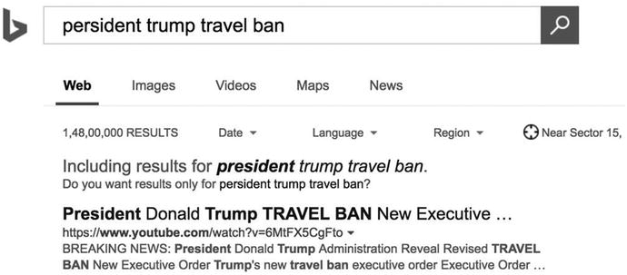
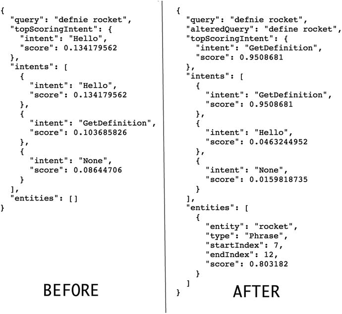
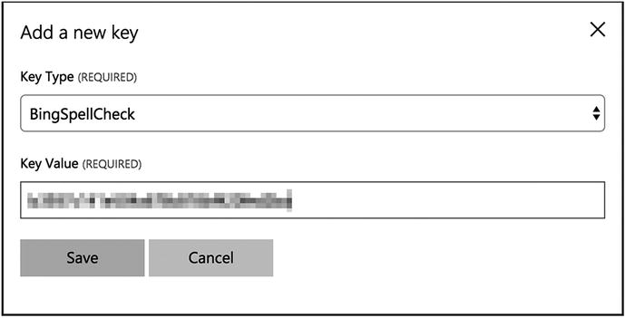
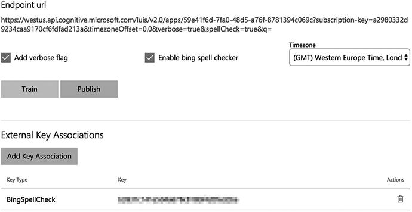
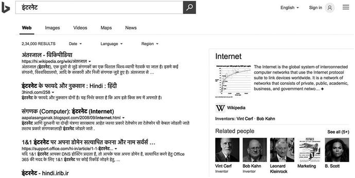
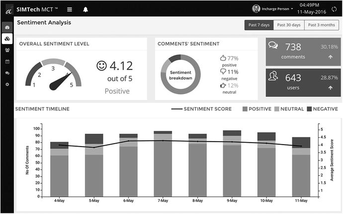

# 5.探索认知语言模式

至此，你应该对自然语言处理有了一个公正的认识。到目前为止，你一直集中精力学习语言理解及其相关概念。NLP 要比这大得多，正如您在我们对 NLP 任务的简要介绍中所看到的。那么，我们还能指望机器对自然语言做些什么呢？让我们看一看。

完成本章后，您将学会

*   LUIS 以外的四种语言 API 背后的概念和用法
    *   Bing 拼写检查 API
    *   文本分析 API
    *   Web 语言模型 API
    *   语言分析 API
*   微软和其他公司如何在现实世界中使用基于语言的认知模型
*   每个 API 提供的子任务
*   对每个任务 API 的请求和响应格式的详细解释
*   启发您下一款智能应用的现有和新的使用理念

## Bing 拼写检查 API

*   “确定一张票”
*   “渴望是什么意思”
*   "谁是马丁路德金"
*   《失落之弧的突袭者》

犯拼写错误是最常见的用户行为之一。拼写错误有不同的形式和风格，从良性和无意的错误到粗心和彻头彻尾的错误。

您不必创建文本编辑器或文字处理器来使用拼写检查来纠正文档中的错误。市场上已经充斥着这样的编辑。拼写检查在许多其他领域也有帮助。事实上，检查文本中的错误有时是软件正确工作的基本要求。

以搜索为例。很多网站和移动应用程序都提供了一个搜索文本框，用户可以自由地输入他们想要的任何内容，无论他们喜欢什么。在这里，用户不受任何搜索规则的约束；他们如此习惯于使用谷歌和必应这样的搜索引擎，以至于他们希望其他网站的搜索功能也能正常工作。给用户这种无限制的自由带来了一系列挑战。例如，用户在没有意识到的情况下犯拼写错误并不少见。考虑一个允许你搜索电影的网站。

*   用户:“力矩”
*   网站:“找不到‘momento’的结果。”"

当然，网站找不到同名电影。“Momento”是“Memento”的常见拼写错误，这是广受欢迎的克里斯托弗·诺兰电影的实际名称。责怪用户不知道他们的拼写是明智的吗？不要！一个响亮的，大不！反过来，网站不能发现这样一个基本的拼写错误是可耻的。使用一个简单的基于字典的拼写检查器可以完全避免这种情况。这个怎么样:

*   用户:“追求幸福”
*   网站:“没有找到‘追求幸福’的结果。”"

用户会发誓他们正确地写出了威尔·史密斯 2006 年电影中的每一个单词。问题出在哪里？用户正在寻找的电影的实际名称是“对海蓓娜斯的追求”问题不在于用户的搜索关键词，而在于电影片名本身。海蓓娜斯是故意拼错的幸福。无论如何，网站又一次失败了。但是这次它失败了，不是因为它不能发现一个简单的字典错误。它失败了，因为它不知道正确的电影名称。这不是一个微不足道的问题，因为我们正在讨论通过让网站以某种方式学习所有电影名称来使网站变得更加智能。

无论如何，您不希望仅仅因为您的应用程序不能正确搜索而错过您的用户。现在，您明白了为什么处理拼写错误的能力在某些情况下是一项基本要求。一个大部分时间无法返回搜索结果的网站，必然会失去最宝贵的资产:用户。一个在网站上找不到自己想要的东西的用户会在几秒钟之内转到另一个网站去寻找答案。在许多情况下，用户流失会导致收入损失。

图 [5-1](#Fig1) 显示了 bing.com 上的拼写检查。如果必应的搜索结果没有考虑拼写错误，它的用户会不会重新考虑转而使用谷歌？



图 5-1。

Spell check on Bing.com

我们怎么能忘记对话界面呢？与对话式用户界面交互的唯一方式是通过文本或语音与他们交谈。涉及到说话的地方，拼写错误是一定会发生的。下面这段与机器人的对话很容易成为最可耻的用户体验之一。

*   用户:我感觉不舒服。请帮帮忙。
*   健康机器人:你有什么症状？
*   使用者:头痛、背痛和发烧
*   健康机器人:你吃过什么药吗？
*   User:是。让我们祝贺他们。
*   健康机器人:对不起，我听不懂。
*   User:让我们来说一下。
*   健康机器人:对不起，我听不懂。
*   用户叹息，然后思考。
*   User:让我们寄生在它身上。
*   健康机器人:对不起，我听不懂。
*   用户关闭了机器人应用程序，转而向朋友求助。

### 这是什么？

Bing 拼写检查 API 是一个在线拼写检查服务，可以扫描从短到长的文本片段来检查拼写错误。对于每个检测到的错误，它以置信度得分递减的顺序提供建议的修正。该 API 受益于必应多年来在用户搜索查询方面的经验，并使用与必应完全相同的机器学习模型。它是微软认知服务套件的一部分，正如你可能猜到的那样，它比普通的拼写检查器更智能，而且不仅仅是检查拼写。

传统的拼写检查器检测拼写错误，并使用其底层单词词典提供正确拼写的建议。这种拼写检查器速度快，体积小。但是它们通常不准确，只能识别有限的专有名词，并且只定期更新以支持新的名称和单词。这些拼写检查器通常与占用空间较小的应用程序捆绑在一起，如网络浏览器和文本编辑器。

稍微复杂一点的拼写检查可以考虑语法规则，甚至额外提示语法错误。你在诸如 MS Word、LibreOffice Writer 等文字处理软件中见过这样的拼写检查器。这些比简单的基于字典的拼写检查器更大，也更准确。然而，简单检查器的所有其他限制都适用。

Bing 拼写检查 API 基于机器学习原理工作。如你所知，通过充分的训练，可以教会 ML 模型理解数据中的模式。这就是所有 Bing APIs 的情况。所有这些 API 都利用了 Bing 经过广泛训练的模型，这些模型不仅从创建它们的工程师那里学习，还从 Bing 2009 年推出以来的数百万用户那里学习。Bing APIs 提供了一种方法来挖掘它已经学习和仍在学习的大量信息。你将在第 7 章中了解 Bing 语音 API。所有其他 Bing APIs(自动建议、图片搜索、新闻搜索、视频搜索和网络搜索)将在第 8 章[中介绍。](08.html)

Bing 拼写检查 API 对文本执行上下文拼写检查，这意味着它不是根据字典规则而是根据单词在句子中的用法和位置来检测错误。考虑下面的句子:

*   “放心吧。我今晚将通过优步回家。”

根据字典的规则，这个句子错误地使用了单词“uber”优步来自德语，意思是高于或超越。在英语中，uber 必须要么用作前缀(uber-cool，Uber style)，要么用作形容词(uber intellectuals)。但如果你问另一个人，他们会告诉你，在“我将……回家”这句话中使用的这个词指的是优步，一种出租车叫车服务。你可以回顾一下我们在第五章中关于语用学的讨论:语境参考在自然语言中如此普遍，以至于一直使用完整的句子听起来很做作，也很烦人。

因此，虽然其他拼写检查器会抱怨单词 uber 的用法，但 Bing 拼写检查 API 不会检测到任何错误，因为它会知道使用该单词的上下文。事实上，它将警告专有名词优步的错误用法，如下例所示。

*   用户:“今晚我坐一辆优步。”
*   必应拼写检查:“今晚我要一辆优步优步。”

Bing 拼写检查 API 不仅可以识别品牌、人物、地点和其他专有名词，它还支持俚语和碎词。

*   "两个 knda 看起来有点像."
*   "你要去检查厨房吗？"
*   "职员克拉克·肯特是超人."
*   "警察手里拿着枪。"

Note

在撰写本书时，Bing 拼写检查 API 只支持英语(美国)文本。在不久的将来，将会推出对更多英语地区和其他语言的支持。即将推出的语言环境包括英国英语(en-GB)、加拿大英语(en-CA)、澳大利亚英语(en-AU)、新西兰英语(en-NZ)和印度英语(en-IN)，以及中文和西班牙语。

### 如何使用它

和其他认知服务 API 一样，Bing 拼写检查也是一个在线 REST API，你可以通过它的 URL 访问。但首先你需要一个 Azure 订阅密钥。参考第 [2](02.html) 章或第 [4](04.html) 章中的步骤，获取 Bing 拼写检查 API 的免费层订阅密钥。

Note

在本章中，我们没有为每个服务编写 C#代码。相反，我们使用了宝贵的书籍空间来详细解释每个服务的请求和响应结构。如果你愿意，你可以重用第 [2](02.html) 章中的 C#代码来调用本章中的服务。但是，我们鼓励您首先使用 REST API 客户端，比如 Postman，来尝试请求参数的各种组合，并探索每个认知服务 API 收到的响应。

#### 请求

Bing 拼写检查 API 端点支持 GET 和 POST 请求，这两种方法之间只有微小的区别。GET 支持更多选项，应该是首选方法，除非无法控制请求数据格式，在这种情况下应该使用 POST(比如在处理通过 HTML 表单接收的数据时)。

下面是一个 GET 请求示例:

```py
GET /bing/v5.0/spellcheck/?mode=spell&amp;mkt=en-us&amp;text=whois persident trumpp HTTP/1.1
Host: api.cognitive.microsoft.com
Ocp-Apim-Subscription-Key: abc123abc123abc123abc123abc123
Cache-Control: no-cache

```

端点 URL:

[T2`https://api.cognitive.microsoft.com/bing/v5.0/spellcheck/`](https://api.cognitive.microsoft.com/bing/v5.0/spellcheck/)

除了标有星号(*)的以外，所有的头和参数都是可选的。

请求标题:

*   `Ocp-Apim-Subscription-Key` *:应设置为 Bing 拼写检查 API 的 Azure 订阅密钥。请注意，上面示例请求中使用的密钥仅用于演示目的，是无效的。

请求参数:

*   `mode`:可以是法术，也可以是证明。Bing 拼写检查有两种工作模式:
    *   拼写模式针对搜索查询和小句进行了优化。它提供快速和相关的结果。
    *   校样模式针对长文本字符串进行了优化。它类似于 MS Word 中的拼写检查器。
*   `text` *:要检查拼写错误的文本字符串。在证明模式下，实际上对字符数没有限制。在拼写模式下，最多支持九个单词。
*   虽然拼写检查器自动理解上下文，但是当目标单词或短语事先已知时，也可以手动提供上下文。`preContextText`表示出现在目标单词/短语之前的文本。所以“斯蒂芬·斯皮尔伯格”可能是一个人的有效名字，但“斯蒂芬·斯皮尔伯格导演”意味着受欢迎的导演史蒂文·斯皮尔伯格。所以当和`preContextText`“导演”一起使用时，“斯蒂芬”变成了一个拼写错误
*   `postContextText`:这个参数类似于`preContextText`，除了它在目标单词/短语之后提供上下文，例如“无耻混蛋”对“无耻混蛋电影”
*   你的应用目标市场。根据目标市场优化拼写和语法检查。这是自动检测到的，但可以通过提供有效值来手动覆盖，如 en-us、pt-br 等。

示例 POST 请求如下所示:

```py
POST /bing/v5.0/spellcheck/?mode=spell&amp;mkt=en-us HTTP/1.1
Host: api.cognitive.microsoft.com
Ocp-Apim-Subscription-Key: abc123abc123abc123abc123abc123
Content-Type: application/x-www-form-urlencoded
Cache-Control: no-cache

Text=Bill+Gatas

```

#### 反应

让我们分析从 GET 请求收到的 JSON 响应:

```py
{
    "_type": "SpellCheck",
    "flaggedTokens": [
        {
            "offset": 0,
            "token": "whois",
            "type": "UnknownToken",
            "suggestions": [
                {
                    "suggestion": "who is",
                    "score": 1
                }
            ]
        },
        {
            "offset": 6, 

            "token": "persident",
            "type": "UnknownToken",
            "suggestions": [
                {
                    "suggestion": "president",
                    "score": 1
                }
            ]
        },
        {
            "offset": 16,
            "token": "trumpp",
            "type": "UnknownToken",
            "suggestions": [
                {
                    "suggestion": "trump",
                    "score": 1
                }
            ]
        }
    ]
}

```

响应属性:

*   `_type`:代表认知服务 API 类型的内部属性。可以忽略。
*   `flaggedTokens`:所有检测到的拼写错误的数组，其中每个错误都是由具有进一步属性的对象表示的标记。
*   `offset`:令牌在原文中的起始字符位置。
*   `token`:有错误的单词。该属性的值结合 offset 可用于确定要在原始文本中替换的拼写错误的单词。
*   `type`:拼写错误的类型。
*   `suggestions`:拼写错误单词的建议更正数组。每个建议都附有一个介于 0 和 1 之间的置信度得分。把分数低的建议过滤掉是个好主意。

### 与 LUIS 融合

正如我们在第 [4](04.html) 章中提到的，Bing 拼写检查可以在 LUIS 应用程序中启用。图 [5-2](#Fig2) 显示了这对从路易斯接收的输出有什么影响。



图 5-2。

JSON results from a LUIS application before and after enabling Bing Spell Check

按照以下步骤在 LUIS 应用程序中启用拼写检查:

1.  在`luis.ai`主页上，进入“我的钥匙”页面。
2.  In the External Keys section, click the “Add a new key” button. Fill the form as per Figure [5-3](#Fig3).

    

    图 5-3。

    Adding a new external key in LUIS  
3.  现在打开 LUIS 应用程序，您需要在其中启用拼写检查。转到发布应用程序页面。
4.  向下滚动到底部。单击“外部键关联”部分下的“添加键关联”按钮，并选择您在步骤 2 中输入的键。
5.  Finally, check the “Enable Bing spell checker” option and click Publish. Refer to Figure [5-4](#Fig4) for your app’s settings.

    

    图 5-4。

    Enabling Bing Spell Check in a LUIS application  

## 文本分析 API

数据或文本大致有两种类型:结构化和非结构化。为了理解其中的区别，让我们考虑一个简单的文本文件，其内容如下:

*   我不相信命运会落在人们身上，不管他们做什么；但是我相信除非他们采取行动，否则他们会有一个下场。

存储在文件系统上的此类文本文件将具有类似于以下内容的元数据:

*   名称:Quote.txt
*   用户:Anurag Bhandari
*   创建日期:2017 年 4 月 1 日
*   修改日期:2017 年 4 月 1 日
*   大小:125 字节

你能猜出元数据和文件内容中哪一个是结构化文本吗？如果你说元数据，你是对的。元数据有一个结构:像名称、用户、大小等字段。在所有文本文件中是相同的；只有这些字段的值会改变。你能想到其他结构化数据或文本吗？提示:电子表格、数据库、日志文件。

另一方面，文件的内容是非结构化的；它们可能是世界上任何文本。文件内容没有严格的形式或结构。这使得非结构化文本更难分析。假设您有 10，000 个这样的文本文件，并被要求使用(a)元数据和(b)文件内容以编程方式找到文件大小。甚至一个孩子也能猜到元数据在解决这样的问题时会更有帮助和更快。

分析非结构化文本是文本分析的目的。可能有数百个涉及分析非结构化文本的问题需要解决。真正困难的问题不能通过传统的编程算法有效地解决。这就是机器学习派上用场的地方。微软认知服务的文本分析 API 为四个这样的 NLP 问题提供了解决方案:语言检测、关键短语提取、情感分析和主题检测。文本分析在准确确定用户或客户对你的产品的反应方面特别有用。

### 语言检测

考虑以下与聊天机器人的对话。

*   机器人:你好。告诉我你的问题，我将把你接到有关部门。
*   User:我需要开单方面的帮助。
*   (我需要账单方面的帮助。)
*   Bot:联系我们的法语计费专家。
*   (为您接通我们讲法语的计费专家。)

该机器人检测到用户的语言是法语，并将他们连接到计费部门的法语支持操作员。由于其处理多种语言的能力，这个机器人对许多用户来说肯定是令人兴奋的(和方便的)。这种机器人将比人类有更大的优势，因为人类理解多种语言的能力不是天生的。

给定一个单词、一个短语或一大段文本，文本分析 API 可以通过 HTTP 调用检测其自然语言。文本越长，语言检测就越准确。

语言检测在许多对话式 UI 场景中都很有用。比如说，它还可以用于确定回复推文时使用的第一、第二和第三种最流行的语言。对于一家试图了解其产品受众的公司来说，这些信息可能是无价的。

语言检测派上用场的另一个地方是搜索引擎。图 [5-5](#Fig5) 展示了微软 Bing 如何智能地使用它来过滤搜索结果。



图 5-5。

Bing uses language detection to smartly filter search results based on the detected language. If the interface language (English in this case) is different from detected language (Hindi in this case), Bing also displays a summary of search keywords in the interface language.

#### 请求

语言检测、关键短语提取和情感分析 API 都需要一个 POST 请求，并共享一个公共的 JSON 主体格式。不支持 XML 正文。body 格式允许您一次发送多段文本进行分析，每段都是一个“文档”

Note

该 API 对每个提交的文档收取 1 笔交易费用。例如，如果您在单次调用中请求 1000 个文档的情感，将会扣除 1000 个交易。对于语言检测、关键短语提取和情感分析 API 来说都是如此。

```py
POST /text/analytics/v2.0/languages?numberOfLanguagesToDetect=5 HTTP/1.1
Host: westus.api.cognitive.microsoft.com
Ocp-Apim-Subscription-Key: abc123abc123abc123abc123abc123
Content-Type: application/json
Cache-Control: no-cache

{
  "documents": [
    {
      "id": "1",
      "text": "Hello. Tell me your problem and I will connect you with the concerned department."
    },
    {
      "id": "2",
      "text": "J'ai besoin d'aide pour la facturation."
    }
  ]
}

```

端点 URL:

[T2`https://westus.api.cognitive.microsoft.com/text/analytics/v2.0/languages`](https://westus.api.cognitive.microsoft.com/text/analytics/v2.0/languages)

除了标有星号(*)的参数外，所有参数都是可选的。

请求参数:

*   `numberOfLanguagesToDetect`:可选的查询字符串参数，指定每个文档要检测的语言的最大数量。这对包含多种语言文本的文档很有帮助。该值必须是大于或等于 1 的整数。默认值为 1。

请求正文:

*   `documents*`:一个 API 调用中要分析的所有文档的数组。可以提交的单个文档的最大大小是 10KB，提交的输入的总最大大小是 1MB。一次通知最多只能提交 1，000 份文件。速率限制以每分钟 100 个呼叫的速率存在。因此，建议您一次性提交大量文件。
*   `id` *:在列表中唯一标识文档的字符串。API 响应中会返回相同的内容以及检测到的语言。考虑到每个文档的 id 都是唯一的，由开发人员指定他们喜欢的 id。也许最简单的 id 方案是 1，2，3，4 等。GUIDs 可以用于更复杂的 id 值。
*   `text` *:要分析的字符串。

#### 反应

```py
{
  "documents": [
    {
      "id": "1",
      "detectedLanguages": [
        {
          "name": "English",
          "iso6391Name": "en",
          "score": 1
        }
      ]
    },
    {
      "id": "2",
      "detectedLanguages": [
        {
          "name": "French",
          "iso6391Name": "fr",
          "score": 1
        }
      ] 

    }
  ],
  "errors": []
}

```

响应属性:

*   `documents`:请求中提供的每个文档的结果数组。
*   `id`:请求中指定的文档 id。
*   `detectedLanguages`:在文档文本中检测到的语言数组。该数组中对象的数量可能取决于`numberOfLanguagesToDetect`请求参数。
*   `name`:被检测语言的全称。
*   `iso6391Name`:ISO 标准体定义的双字符语言短代码。“en”代表英语，“fr”代表法语，“es”代表西班牙语，“hi”代表印地语，等等。
*   `score`:检测的置信度，0 为最低，1 为最高。
*   `errors`:如果提供的文件有错误，相应的错误会在这个数组中。
*   `id`:检测到错误的文档。
*   `message`:详细的错误信息。

Note

在指定请求参数和主体时要格外小心。使用错误的值可能会导致 JSON 错误响应，通常遵循以下格式:

```py
{ "statusCode": number, "message": string }

```

其中`statusCode`是 HTTP 状态代码，`message`是详细的消息字符串。

### 关键短语提取

有时，从给定的一段冗长、杂乱的文本中提取关键词和短语，即主要的“谈话要点”是可取的。这些信息可以用来更清楚地理解新闻文章、博客条目或社交网络帖子的上下文。一旦知道了一篇文章的主要观点，你就可以用这些知识做很多事情。

使用从多个文档中提取的关键短语，可以生成词云来轻松地可视化文档中最流行的关键短语。图 [5-6](#Fig6) 显示了一个词云，它说明了热门手机游戏《愤怒的小鸟朋友》Android 版本的用户评论中的主要话题。


图 5-6。

Rovio, creators of the Angry Birds franchise, can see that users are talking mostly about power ups, expensive, tournament, etc. The company can use this information as invaluable feedback to improve its next release.

类似地，提取关键短语的能力对于数字广告网络也至关重要，比如 Google AdSense 和 DoubleClick。这种网络使用从网页中提取的关键词，向访问者显示更相关的广告。

#### 请求

```py
POST /text/analytics/v2.0/keyPhrases HTTP/1.1
Host: westus.api.cognitive.microsoft.com
Ocp-Apim-Subscription-Key: abc123abc123abc123abc123abc123
Content-Type: application/json
Cache-Control: no-cache

{
  "documents": [
    {
      "id": "1",
      "text": "Tesla will unveil an electric articulated lorry in September, chief executive Elon Musk has said. Additionally, he said an electric pick-up truck would be shown off in around 18-24 months.",
      "language": "en"
    },
    {
      "id": "2",
      "text": "La carta a Cristiano Ronaldo de la víctima de su presunta violación: 'Te dije no, te grité, rogué que parases'",
      "language": "es"
    }
  ]
}

```

端点 URL:

[T2`https://westus.api.cognitive.microsoft.com/text/analytics/v2.0/keyPhrases`](https://westus.api.cognitive.microsoft.com/text/analytics/v2.0/keyPhrases)

请求参数:

此 API 没有参数。

请求正文:

JSON 请求体就像您在语言检测中看到的那样。文档对象中的一个附加属性是`language. language`，它是一个可选属性，应该为非英语文档指定。目前，该 API 仅支持英语(en)、西班牙语(es)、德语(de)和日语(ja)语言。

#### 反应

```py
{
  "documents": [
    {
      "keyPhrases": [
        "electric articulated lorry",
        "September",
        "chief executive Elon Musk",
        "electric pick",
        "Tesla",
        "truck",
        "months"
      ],
      "id": "1"
    },
    {
      "keyPhrases": [
        "víctima",
        "Cristiano Ronaldo",
        "carta",
        "presunta violación"
      ],
      "id": "2"
    }
  ],
  "errors": []
}

```

响应属性:

*   `documents`:请求中提供的文件清单。
*   `id`:请求中指定的唯一文档 id。
*   `keyPhrases`:在相应文档中检测到的所有关键短语的数组。

### 情感分析

情感分析是用于确定一段文本中的语气是积极的、中性的还是消极的过程。对给定文本进行分析以得出总体情绪得分，其中 0 表示非常负面，1 表示非常正面。

情感分析作为一种产品反馈工具已经使用了相当长的时间。大数据革命让大大小小的公司都可以利用在线用户反馈的财富，这些反馈以直接评论、脸书帖子/评论、Twitter 帖子、博客等形式出现。大数据分析工具和机器学习实现了对大量数据的指数级快速分析，以确定用户或客户对应用程序或产品的关键响应。

图 [5-7](#Fig7) 显示了在情感分析的帮助下可以创建的可视化类型。



图 5-7。

Dashboard generated by online tool SIMTech MCT Note

使用分类技术生成情感得分。分类器的输入特征包括 n 元语法、从词性标签生成的特征和嵌入的单词。该分类器部分使用 Sentiment140 数据进行训练。支持的语言包括英语(en)、西班牙语(es)、法语(fr)和葡萄牙语(pt)。

#### 请求

```py
POST /text/analytics/v2.0/sentiment HTTP/1.1
Host: westus.api.cognitive.microsoft.com
Ocp-Apim-Subscription-Key: abc123abc123abc123abc123abc123
Content-Type: application/json
Cache-Control: no-cache

{
  "documents": [
    {
      "id": "1",
      "text": "You need to change it back! The new graphics are awful! Massive headache after a few minutes of play. Your graphic are what made candy crush different to other match 3 games now its a unplayable as the others. Im out till you fix it",
      "language": "en"
    },
    {
      "id": "2",
      "text": "Great mental exercise and the variation of the levels keeps your interest. Never boring, just frustrating

enough to make sure you come back to try again!"
    }
  ]
}

```

端点 URL:

[T2`https://westus.api.cognitive.microsoft.com/text/analytics/v2.0/sentiment`](https://westus.api.cognitive.microsoft.com/text/analytics/v2.0/sentiment)

请求参数:

此 API 没有参数。

请求正文:

这里没什么异常。和前面一样，`language`属性是可选的。

#### 反应

```py
{
  "documents": [
    {
      "score": 0.0344527179662149,
      "id": "1"
    },
    {
      "score": 0.796423438202407,
      "id": "2"
    }
  ],
  "errors": []
}

```

响应属性:

`score`表示文档文本的整体情绪。0.03 是非常消极的，而 0.79 是非常积极的。

### 话题检测

主题是给定文本的一行简短摘要。它可以是一个单词或多个相关的单词。主题检测与关键短语提取没有太大的不同，就像后者一样，它提供了主要的谈话点或文本的亮点。但是，它不是给你多个关键短语，而是返回整个文本的一个主题。

Note

这个 API 设计用于处理短文本文档，比如用户评论、评论和其他类似的反馈。它不能很好地处理长文本，如书籍摘录、文章等。

主题检测尤其有助于更容易地阅读关于一本书、一部电影、一款应用或一款产品的长篇客户评论。基于相似性，多个评论文本可以被分配完全相同的主题。通常，关键短语提取和情感分析足以获得关于产品发布的一般客户情感的好主意。人们应该额外进行话题检测以详细理解反馈，这是关键短语所不能提供的。

#### 请求

这个 API 期望文本文档的格式类似于其他三个文本分析 API。然而，调用 API 并不简单。话题检测是一个耗时的过程。微软要求你在一次 API 调用中发送至少 100 个文本文档。尽管 1 个文档的最大大小不能超过 30KB，并且整个请求正文的最大大小不能超过 30MB，但是文本文档的最大数量没有设定限制。提醒一下，出于计费目的，API 调用中的每个文档都算作一个事务。你每 5 分钟最多可以调用 5 次 API。

由于话题检测是一个耗时的过程，您不会立即得到响应。对 API 的请求将文档提交到一个队列，并返回一个 URL，该 URL 带有 HTTP 状态代码 202，应该定期轮询以检索结果。

```py
POST /text/analytics/v2.0/topics HTTP/1.1
Host: westus.api.cognitive.microsoft.com
Ocp-Apim-Subscription-Key: abc123abc123abc123abc123abc123
Content-Type: application/json
Cache-Control: no-cache

 {
     "documents": [
         {
             "id": "1",
             "text": "I love this product and have no complaints except that I cannot have 2 of them."
         },
         ...
         {
             "id": "100",
             "text": "The sound quality is not as good as my other speakers."
         }
     ],
     "stopWords": [
         "problem", "bug", "feedback"
     ],
     "topicsToExclude": [
         "create a ticket", "Amazon Echo"
     ]
 }

```

端点 URL:

[T2`https://westus.api.cognitive.microsoft.com/text/analytics/v2.0/topics`](https://westus.api.cognitive.microsoft.com/text/analytics/v2.0/topics)

除了标有星号(*)的参数外，所有参数都是可选的。

请求参数:

*   `minDocumentsPerWord`:指定主题词相同的文档的最小数量的整数。例如，如果将它设置为 2，那么将排除所有只分配给 1 个文档的主题词。此参数可以帮助您排除罕见的主题词。
*   `maxDocumentsPerWord`:与`minDocumentsPerWord`相反。用这个排除很常见的话题词。

请求正文:

文档列表格式保持不变。文档对象中没有`language`属性，因为英语是唯一支持的语言。文本为非英语语言的文档将被忽略。同样，长度少于三个单词的文档将被忽略。

*   `stopWords`:不应该是检测到的主题的一部分的单词列表。有助于排除给定场景中常见的隐含词语。例如，如果主题检测是在反馈评论上执行的，诸如问题、bug、反馈等词。不会给话题增加任何价值。除了明确指定的停用词，API 还会考虑它们的复数形式。
*   `topicsToExclude`:类似于`stopWords`属性。允许您指定要排除的完整主题名称。完整和部分产品名称是该属性的良好候选。

#### 反应

对上述 POST 请求的即时响应将有一个空的主体，并以 202 作为其 HTTP 状态代码。它将具有以下标题:

```py
'operation-location': 'https://westus.api.cognitive.microsoft.com/text/analytics/v2.0/operations/<operationId>'

```

`operation-location`头的值是 URL 端点，当结果准备好时，它将最终返回结果。处理请求所需的时间取决于原始 POST 请求中提供的文档数量和长度。

必须定期轮询此 URL(建议持续时间为每分钟一次)以检查结果。

```py
GET https://westus.api.cognitive.microsoft.com/text/analytics/v2.0/operations/<operationId>

```

每次上述调用都会返回一个 JSON 响应，至少包含属性`status`，其值可以是`notstarted`、`running`和`succeeded`中的一个。你想投票直到你得到`succeeded`作为一个状态值。

最终响应将具有以下形式:

```py
{
     "status": "succeeded",
     "operationProcessingResult": {
           "topics": [
             {
                 "id": "d8f62239-4ab5-4f95-8067-b2fca96d0c40"
                 "score": "7"
                 "keyPhrase": “no complaint"
             },
             ...
             {
                 "id": "8af50d44-92d0-464f-886a-9690542f259b"
                 "score": "2"
                 "keyPhrase": “sound quality not good"
             }
         ],
           "topicAssignments": [
             {
                 "topicId": "d8f62239-4ab5-4f95-8067-b2fca96d0c40",
                 "documentId": "1",
                 "distance": "0.354"
             },
             ...
             {
                 "topicId": "8af50d44-92d0-464f-886a-9690542f259b",
                 "documentId": "100",
                 "distance": "0.758"
             }
         ],
           "errors": []
     }
 }

```

响应属性:

*   `topics`:为所提供的文档检测到的所有不同主题的数组。
    *   `id`:API 生成的唯一主题 id。
    *   `score`:共享该主题的文档数。
    *   `keyPhrase`:检测到的话题。
    *   `topicAssignments`:每个文档的主题分配数组。
    *   `topicId`:主题数组中看到的唯一 id。
    *   `documentId`:请求中提供的唯一文档 id。
    *   `distance`:文档-主题关联得分。介于 0 和 1 之间。分数越低，隶属度越高。

### 使用想法

*   选举预测:对从社交媒体、新闻文章、公众投票和调查中收集的数据进行情绪分析并不新鲜。但是很长一段时间以来，所使用的方法主要是统计方法。随着机器学习，特别是深度学习技术的出现，预测选举的获胜者将产生更准确的结果。
*   自动生成妈妈。收集和阐明会议记录(MOM)是正式会议中的一项标准活动。在 Slack 和 IRC 等平台上基于文本的会议中，主题检测和关键短语提取等技术对于自动化 MOM 生成来说是一个天赐良机。
*   呼叫记录分析:作为一种审计手段，通常会记录用户给呼叫中心支持人员的呼叫。使用语音转文本，可以从这些录音中生成文本抄本。然后，可以将抄本用作文档来执行情感分析和关键短语提取，以更好地分析客户的满意度。

## Web 语言模型(WebLM) API

创建用于机器学习的语言模型需要适当创建的语料库。正如您在前面章节中了解到的，ML 模型的性能与其训练数据(语料库)一样好。语料库越大，训练数据越多，得到的模型越好。即使对于大公司来说，手工创建训练所需规模的大型语料库实际上也是不可行的。翻译成几种语言的欧洲联盟法院诉讼公开记录被用来建立语言翻译系统模型。欧盟文件并不是唯一可以用来建立语言模型的自由文本。当然，还有万维网。

万维网令人惊叹的一点是，它在数十亿的网页中包含了无限量的文本。它可以形成一个令人难以置信的大语料库，任何人都可以完全免费地训练他们的机器学习语言模型。这正是微软对 Bing 的索引网页所做的。他们使用从数百万网页中读取的文本创建了大量的语料库。

使用从网络上收集的文本制作的语料库不适合诸如机器翻译之类的应用，因为存在几种异常:语法错误、俚语、亵渎、缺少标点符号等等。但是从网上收集的语料库可以让我们对普通大众如何使用语言有一个大致的了解。常见的模式可以在单词和短语的不正确用法中找到。这足以使用语料库创建模型来做一些事情，如预测序列中的下一个单词和分解缺少空格的一串单词。微软把以这种方式创建的语言模型称为 Web 语言模型或 WebLM。

文本可能出现在网页的不同部分:正文、标题、锚元素和搜索查询。从这四个部分中提取的文本有细微到明显的差异。虽然短语“试用”可能在锚文本和搜索查询中很常见，但它通常在正文部分以更正确的形式出现。因此，微软使用网页的这四个部分的文本创建了四种不同的模型:

*   Bing 锚模型
*   Bing 人体模型
*   Bing 查询模型
*   Bing 标题模型

目前，WebLM API 支持的唯一语言是美国英语。

Note

WebLM 语料库并不像无数句子的随机集合那样简单。它包含了所谓的 n 元语法，而不是简单的单词和短语。微软称之为网络 N-gram 语料库。

n-gram 是从一个更大、更完整的序列中派生出来的 n 个项目的部分序列。一个项目可以是一个字符、一个单词或一个短语。考虑下面的例句:

“布鲁诺是一只好狗。”

可以从上述完整序列中得到的 n-gram 序列是

1 克(单克)-布鲁诺，是一个，好狗

布鲁诺是一只非常非常好的狗

布鲁诺是一只非常非常好的狗

MS Web N-gram 语料库拥有多达 5 个 gram 的序列。它使用这些 n-grams，以便像断词和预测序列中的下一个单词这样的任务可以完成。

图 [5-8](#Fig8) 显示了微软 Bing 可能如何使用 WebLM 来显示搜索结果。


图 5-8。

Word breaking and next word prediction in action on the Bing search page

Bing Search 不仅能够将单词“happyeaster2017”分解为“happy easter 2017”，还可以通过检查最常见的 next 单词的查询语言模型来显示类似的搜索查询(“happy easter 2017 wallpaper”)。

WebLM API 支持以下四种任务或操作:

*   将没有空格的字符串拆分成单词
*   词序列的联合概率
*   一个单词继承给定单词序列的条件概率
*   预测可能跟随给定单词序列的下一个单词

### 断词

我们知道将一个连续的字符串分解成单个的单词是非常有用的。但是我们在哪里可以找到这种奇怪字符串的实例呢？换句话说，有哪个头脑正常的人会写出连在一起的单词？

你可能见过比你意识到的更多的这样的字符串。社交媒体上的散列标签是一个非常常见的例子。

# iamfeanggood # germanyvsargentinafootballlive # epic fail

将散列标签串分解成单个单词的能力可以为数据分析系统提供大量隐藏的材料进行分析。连续字符串也可能出现在 URL 和内部链接中。

[`www.example.com/topsellers`](http://www.example.com/topsellers) ， [`www.example.com/tutorial#creatinganewproject`](http://www.example.com/tutorial#creatinganewproject)

#### 请求

```py
POST /text/weblm/v1.0/breakIntoWords?model=body&amp;text=germanyvsargentinafootballlive&amp;order=5&amp;maxNumOfCandidatesReturned=3 HTTP/1.1
Host: westus.api.cognitive.microsoft.com
Ocp-Apim-Subscription-Key: abc123abc123abc123abc123abc123
Cache-Control: no-cache

```

端点 URL:

[T2`https://westus.api.cognitive.microsoft.com/text/weblm/v1.0/breakIntoWords`](https://westus.api.cognitive.microsoft.com/text/weblm/v1.0/breakIntoWords)

除了标有星号(*)的参数外，所有参数都是可选的。

请求参数:

*   `model` *:要使用的 Bing 语言模型。锚点、正文、查询和标题之一。
*   `text` *:要拆分成单个单词的字符串。如果字符串中已经存在空格，它们将在结果中保持不变。
*   `order`:n-gram 的顺序。1，2，3，4 和 5 中的一个。默认值为 5。
*   `maxNumOfCandidatesReturned`:返回的最大匹配数。默认值为 5。

这个 API 不需要请求体。

#### 反应

```py
{
  "candidates": [
    {
      "words": "germany vs argentina football live",
      "probability": -12.873
    },
    {
      "words": "g ermany vs argentina football live",
      "probability": -19.08
    },
    {
      "words": "germany vs argentina football l i v e",
      "probability": -19.432
    }
  ]
}

```

响应属性:

*   `candidates`:所有可能匹配的数组，受`maxNumOfCandidatesReturned`请求参数限制。
    *   `words`:候选匹配中破碎的单个单词。
    *   `probability`:负值越小表示置信度越高。

### 联合概率

联合概率告诉你某个单词序列一起出现的频率。举个例子，

*   我来了= >很有可能
*   你好伙计= >有点可能
*   微软洗衣机= >完全不可能

#### 请求

```py
POST /text/weblm/v1.0/calculateJointProbability?model=body&amp;order=5 HTTP/1.1
Host: westus.api.cognitive.microsoft.com
Ocp-Apim-Subscription-Key: abc123abc123abc123abc123abc123
Content-Type: application/json
Cache-Control: no-cache

{
        "queries":
        [
                "but",
                "wide world",
                "natural language processing",
                "natural language dinner"
        ]
}

```

端点 URL:

[T2`https://westus.api.cognitive.microsoft.com/text/weblm/v1.0/calculateJointProbability`](https://westus.api.cognitive.microsoft.com/text/weblm/v1.0/calculateJointProbability)

除了标有星号(*)的参数外，所有参数都是可选的。

请求参数:

*   `model` *
*   `order`

请求正文:

*   `queries`:字符串数组。每个字符串都是一个序列，必须计算其联合概率。单字查询是有效的。

#### 反应

```py
{
  "results": [
    {
      "words": "but",
      "probability": -2.9
    },
    {
      "words": "wide world",
      "probability": -6.381
    },
    {
      "words": "natural language processing",
      "probability": -6.807
    },
    {
      "words": "natural language dinner",
      "probability": -12.939
    }
  ]
}

```

响应属性:

*   `results`:一个结果数组，请求体中指定的每个查询一个结果。
    *   `words`:来自请求的查询序列。
    *   `probability`:负分越低，单词或序列越常见。

### 条件概率

条件概率告诉你一个单词出现在某个单词序列之后有多普遍。举个例子，

*   最畅销艺术家= >很有可能
*   畅销书作者= >很有可能
*   最畅销的人= >很有可能
*   销量最高的 rat = >完全不可能

可能的用例有

*   解读一个混乱的句子。
*   正确猜测单词排序不正确的简短搜索查询。

#### 请求

```py
POST /text/weblm/v1.0/calculateConditionalProbability?model=body&amp;order=5 HTTP/1.1
Host: westus.api.cognitive.microsoft.com
Ocp-Apim-Subscription-Key: abc123abc123abc123abc123abc123
Content-Type: application/json
Cache-Control: no-cache

{
        "queries":
        [
                {
                        "words": "top selling",
                        "word": "artist"
                },
                {
                        "words": "top selling",
                        "word": "rat"
                },
                {
                        "words": "game of",
                        "word": "thrones"
                }
        ]
}

```

端点 URL:

[T2`https://westus.api.cognitive.microsoft.com/text/weblm/v1.0/calculateConditionalProbability`](https://westus.api.cognitive.microsoft.com/text/weblm/v1.0/calculateConditionalProbability)

除了标有星号(*)的参数外，所有参数都是可选的。

请求参数:

*   `model` *
*   `order`

请求正文:

*   `queries`
    *   `words`:目标单词之前的单词序列。
    *   `word`:目标词。

#### 反应

```py
{
  "results": [
    {
      "words": "top selling",
      "word": "artist",
      "probability": -2.901
    },
    {
      "words": "top selling",
      "word": "rat",
      "probability": -5.848
    },
    {
      "words": "game of",
      "word": "thrones",
      "probability": -0.475
    }
  ]
}

```

### 下一个单词预测

在前面的图 [5-8](#Fig8) 中，你看到了下一个单词预测是如何通过建议搜索查询后可能出现的单词来工作的。使用这个 API，可以为某个单词序列生成下一个单词建议。举个例子，

*   纽约市
*   纽约时报
*   纽约大学

#### 请求

```py
POST /text/weblm/v1.0/generateNextWords?model=body&amp;words=Microsoft Windows&amp;order=5&amp;maxNumOfCandidatesReturned=5 HTTP/1.1
Host: westus.api.cognitive.microsoft.com

Ocp-Apim-Subscription-Key: abc123abc123abc123abc123abc123
Cache-Control: no-cache

```

端点 URL:

[T2`https://westus.api.cognitive.microsoft.com/text/weblm/v1.0/generateNextWords`](https://westus.api.cognitive.microsoft.com/text/weblm/v1.0/generateNextWords)

除了标有星号(*)的参数外，所有参数都是可选的。

请求参数:

*   `model` *
*   `order`
*   `maxNumOfCandidatesReturned`
*   `words` *:需要为其生成下一个单词建议的单词序列的字符串。该序列可以只包含一个单词。

这个 API 不需要请求体。

#### 反应

```py
{
  "candidates": [
    {
      "word": "7",
      "probability": -0.892
    },
    {
      "word": "xp",
      "probability": -0.998
    },
    {
      "word": "currentversion",
      "probability": -1.047
    },
    {
      "word": "server",
      "probability": -1.123
    },
    {
      "word": "8",
      "probability": -1.201
    }
  ]
}

```

## 语言分析 API

这个 API 提供的操作处理分析给定文本的语言结构。这种分析的输出可能有助于更好地理解文本的含义和上下文。

语言分析 API 支持以下三种操作:

*   句子分离和标记化:将文本分成句子和标记。
*   词性标注:将句子中的每个单词归类为语法成分(名词、动词、形容词等)。).
*   选区分析:将文本分解成所有可能的短语。

这种语言分析通常是其他 NLP 任务的第一步，例如自然语言理解、文本到语音转换、机器翻译等等。除了作为自然语言处理领域的第一步，语言分析在面向消费者的认知应用中也有应用。

为了能够执行这三种分析，必须使用树库来训练系统。树库是一个语料库，其中包含大量的词性标注单词和解析短语。微软为了这个 API，使用了 Penn Treebank 3 来训练它的系统。

### 句子分离和标记化

在软件开发中，将大块文本分解成单独的句子和标记是一个非常常见的需求。但是，我们不是已经知道解决办法了吗？考虑以下文本:

*   很高兴见到你。再见，再见。

将文本拆分成句子时，首先想到的是围绕句号或点(。)符号。当然，让我们用上面的文字做那件事。我们得到两个句子。

*   句子 1:很高兴见到你。
*   第二句:再见，再见。

下面这段文字怎么样:

*   他说，“我要去听音乐会。”噗的一声，他不见了！

将它分割在句号周围会得到以下结果:

*   句子 1:他说:“我要去听音乐会。
*   第二句:“然后，噗，他不见了！

你肯定不想这样。在这一点上，你无疑意识到不是所有的句子都以句号结尾。举个例子，

*   我做得怎么样？我表现好吗？
*   你疯了吗！我与此事无关。
*   什么？！你疯了吗？

这就是认知句子分离派上用场的地方。您可以使用 API 从一篇很长的文章或书中提取所有句子，并存储它们以供进一步分析。或者你可能只是想把你的应用程序或网站上的一大段文字限制在几句话内。

记号化，或者把句子分解成单个单词和其他记号，是另一回事。就像句子分割一样，标记化不能简单地通过总是在空格周围分割一个句子来实现。像缩写和所有格这样的东西必须要注意，还有其他的。像汉语这样的语言并不总是在单词之间有空格。

那句“我和罗尼的破眼镜没有任何关系，我发誓。”包含以下令牌:

我和罗尼的破眼镜没有任何关系-我发誓。

t 是 not 的缩写。s 是所有格。圆点和逗号是标点符号。这些是除了通常的单词之外的一些标记，应该被检测以进行适当的进一步分析。

#### 请求

```py
POST /linguistics/v1.0/analyze HTTP/1.1
Host: westus.api.cognitive.microsoft.com
Ocp-Apim-Subscription-Key: abc123abc123abc123abc123abc123
Content-Type: application/json
Cache-Control: no-cache

{
        "language": "en",
        "analyzerIds": ["08ea174b-bfdb-4e64-987e-602f85da7f72"],
        "text": "How did I do? Was I good?"
}

```

端点 URL:

[T2`https://westus.api.cognitive.microsoft.com/linguistics/v1.0/analyze`](https://westus.api.cognitive.microsoft.com/linguistics/v1.0/analyze)

除了标有星号(*)的参数外，所有参数都是可选的。

请求参数:

此 API 没有请求参数。

请求正文:

*   `language` *:要分析的文本语言的 ISO 639-1 双字母代码。
*   `analyzerIds` *:要使用的分析器的 GUIDs 数组(令牌、POS_Tags 或 Constituency _ Tree)。
*   `text` *:要分析的那段文本。

Note

您可以在同一段文本上同时使用所有三个分析器。要获得所有支持的分析器的列表(在撰写本文时有三个)及其 GUIDs，使用语言分析 API 订阅密钥对 [`https://westus.api.cognitive.microsoft.com/linguistics/v1.0/analyzers`](https://westus.api.cognitive.microsoft.com/linguistics/v1.0/analyzers) 进行 get 调用。

#### 反应

```py
 [
  {
    "analyzerId": "08ea174b-bfdb-4e64-987e-602f85da7f72",
    "result": [
      {
        "Len": 13,
        "Offset": 0,
        "Tokens": [
          {
            "Len": 3,
            "NormalizedToken": "How",
            "Offset": 0,
            "RawToken": "How"

          },
          {
            "Len": 3,
            "NormalizedToken": "did",
            "Offset": 4,
            "RawToken": "did"
          },
          {
            "Len": 1,
            "NormalizedToken": "I",
            "Offset": 8,
            "RawToken": "I"
          },
          {
            "Len": 2,
            "NormalizedToken": "do",
            "Offset": 10,
            "RawToken": "do"
          },
          {
            "Len": 1,
            "NormalizedToken": "?",
            "Offset": 12,
            "RawToken": "?"
          }
        ]
      },
      {
        "Len": 11,
        "Offset": 14,
        "Tokens": [
          {
            "Len": 3,
            "NormalizedToken": "Was",
            "Offset": 14,
            "RawToken": "Was"
          },
          {
            "Len": 1,
            "NormalizedToken": "I",
            "Offset": 18,
            "RawToken": "I"
          },
          {
            "Len": 4,
            "NormalizedToken": "good",
            "Offset": 20,
            "RawToken": "good"
          },
          {
            "Len": 1,
            "NormalizedToken": "?",
            "Offset": 24,
            "RawToken": "?"
          }
        ]
      }
    ]
  }
]

```

请注意，结果不是一个对象，而是一个对象数组。这是因为这个 API 为您提供了在同一文本上一次执行多个分析的选项。每个分析器的结果都作为根数组的对象返回。

响应属性:

*   `analyzerId`:用于相应结果集的分析仪的 GUID。
*   `result`:分析的结果。一系列句子。
    *   `Len`:句子中的字符总数。
    *   `Offset`:句子在文本中的起始位置。从 0 开始。
    *   `Tokens`:句子中的记号数组。
        *   `Len`:令牌中的字符数。
        *   `Offset`:句子中标记的起始位置。
        *   `RawToken`:检测到的令牌。
        *   `NormalizedToken`:以在解析树中安全使用的格式表示的令牌。

### 词性标注

记得你在学校的时候，刚开始学习识别句子的语法结构。

你的老师会说“主语-动词-宾语”，然后根据专有名词和普通名词来定义主语和宾语。此后，你逐渐学会了识别句子中的形容词、副词、介词和连词。把老师教发现语法结构的技巧想象成简化版的词性标注。

像名词、动词和形容词这样的东西叫做词类。词性标注是一种常见的消歧技术，它可以使易混淆/模糊的单词变得更加清晰；它用于根据各自的位置和上下文来识别给定句子中的词性。也就是说，对于句子中每个单词，词性标注会告诉你这个单词是什么词性。考虑下面的句子:

*   他将参加竞选。

关于这个句子，一个有趣的事情是单词“contest”，它可以是名词，也可以是动词。在这种情况下，它被用作动词。词性标注者必须聪明地检测上下文和周围的单词，以正确地标注单词。以下是上述句子的词性标注版本:

*   他(PRP)将(VBZ)参加(NNS)的选举。

检测到以下标签:

*   PRP =代词，人称
*   VBZ =动词，现在时态，第三人称单数
*   VBG =动词、现在分词或动名词
*   TO =“TO”作介词或不定式标记
*   VB =动词，基本形式
*   DT =限定词
*   NNS =名词，普通，复数

所有可能标签的完整列表可以在网上以及微软的 POS 标签文档中找到。

词性标注在 NLU 和语言翻译中特别有用。

#### 请求

```py
POST /linguistics/v1.0/analyze HTTP/1.1

Host: westus.api.cognitive.microsoft.com
Ocp-Apim-Subscription-Key: abc123abc123abc123abc123abc123
Content-Type: application/json
Cache-Control: no-cache

{
        "language": "en",
        "analyzerIds": ["4fa79af1-f22c-408d-98bb-b7d7aeef7f04"],
        "text": "He is going to contest the election"
}

```

端点 URL:

[T2`https://westus.api.cognitive.microsoft.com/linguistics/v1.0/analyze`](https://westus.api.cognitive.microsoft.com/linguistics/v1.0/analyze)

除了标有星号(*)的参数外，所有参数都是可选的。

请求参数:

此 API 没有请求参数。

请求正文:

*   `language` *
*   `analyzerIds` *
*   `text` *

#### 反应

```py
 [
  {
    "analyzerId": "4fa79af1-f22c-408d-98bb-b7d7aeef7f04",
    "result": [
      [
        "DT",
        "VBZ",
        "JJ",
        "."
      ],
      [
        "PRP",
        "VBP",
        "PRP",
        "."
      ]
    ]
  }
]

```

响应属性:

结果是每个句子中的标签数组。标签与句子中的单词顺序相同。

### 选区分析

选区分析用于检测给定句子中的短语。这与您在文本分析 API 中看到的关键短语提取不同，因为与 KPE 不同，选区分析不仅返回关键短语，还返回所有可能的短语。这些信息可能对 KPE 分析本身有用。

*   我想买一台带显卡的笔记本电脑。

在上面的句子中，你能辨认出几个短语？

让我们看看。“我想买一台笔记本电脑”，“买一台笔记本电脑”，“一台带显卡的笔记本电脑”，“显卡”都是有效短语。你能找到更多吗？完成后参见图 [5-9](#Fig9) 。


图 5-9。

A parsed tree for the above sentence. Words including and between each pair of nodes in the above binary tree are a valid phrase.

重要的是要注意，短语不仅仅是任何一组词。短语是可以在句子中作为一个整体替换或移动的东西，使得句子保持语法正确并且易于理解。例如，“我想买”和“一台带显卡的笔记本电脑”是上面句子中的两个主要短语。如果我们交换他们的位置，句子仍然是可以理解的:

*   我想买一台带显卡的笔记本电脑

因为“to buy”不是一个短语，改变它的位置会使句子变得不可理解:

*   我想要一台带显卡的笔记本电脑

短语通常相互嵌套，如果不了解句子的语法结构，很难找到。

#### 请求

```py
POST /linguistics/v1.0/analyze HTTP/1.1
Host: westus.api.cognitive.microsoft.com
Ocp-Apim-Subscription-Key: abc123abc123abc123abc123abc123
Content-Type: application/json
Cache-Control: no-cache

{
        "language": "en",
        "analyzerIds": ["22a6b758-420f-4745-8a3c-46835a67c0d2"],
        "text": "I want to buy a laptop with graphics card."
}

```

端点 URL:

[T2`https://westus.api.cognitive.microsoft.com/linguistics/v1.0/analyze`](https://westus.api.cognitive.microsoft.com/linguistics/v1.0/analyze)

除了标有星号(*)的参数外，所有参数都是可选的。

请求参数:

此 API 没有请求参数。

请求正文:

*   `language` *
*   `analyzerIds` *
*   `text` *

#### 反应

```py
 [
  {
    "analyzerId": "22a6b758-420f-4745-8a3c-46835a67c0d2",
    "result": [
      "(TOP (S (NP (PRP I)) (VP (VBP want) (S (VP (TO to) (VP (VB buy) (NP (DT a) (NN laptop)) (PP (IN with) (NP (NNS graphics) (NN card))))))) (. .)))"
    ]
  }
]

```

响应属性:

结果是一组经过解析的句子。尝试用图 [5-9](#Fig9) 映射解析的圆括号格式，看看如何解释它。

## 概述

在本章中，您学习了除语言理解(NLU)之外的 NLP 任务，这在上一章中已有所了解。

概括地说，您了解了

*   认知服务的语言类别中的四个 API:Bing 拼写检查、文本分析、WebLM 和语言学分析
*   每个 API 及其所有操作的理论和应用
*   使用 API 的详细概述
*   实时实施示例和新的使用理念

在下一章中，您将应用 LUIS 和 Bot 框架的知识来构建一个企业级聊天机器人。