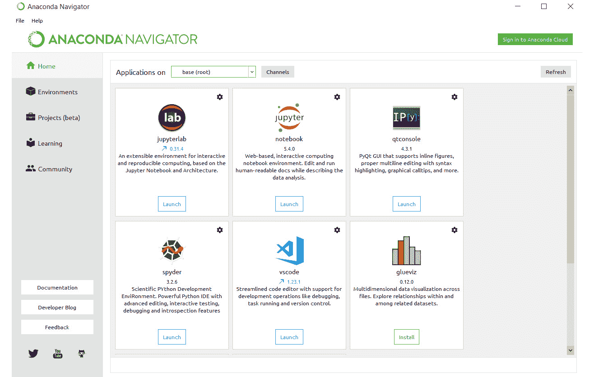

# 零、前言

## 关于

本节简要介绍作者、本书涵盖的内容、入门所需的技能，以及完成所有包含的活动和练习所需的硬件和软件要求。

## 关于这本书

机器学习和神经网络正迅速成为构建智能应用的支柱。这本书首先向你介绍 Python，并讨论人工智能搜索算法的使用。您将学习数学密集型主题，如回归和分类，并通过 Python 示例进行说明。

然后，你将进步到先进的人工智能技术和概念，并在现实生活的数据集上工作，以形成决策树和集群。将向您介绍神经网络，这是一个强大的工具，受益于摩尔定律应用于 21 世纪的计算能力。到本书结束时，你会感到自信，并期待用你新获得的技能构建你自己的人工智能应用程序！

### 关于作者

Zsolt Nagy 是一家广告技术公司的工程经理，专注于数据科学。在获得本体推理硕士学位后，他主要使用人工智能分析在线扑克策略，以辅助职业扑克玩家做出决策。扑克热潮结束后，他致力于在领导力和软件工程领域建立 T 形轮廓。

### 目标

*   理解人工智能的重要性、原理和领域
*   了解如何使用 Python 实现寻路和击败游戏的基本人工智能
*   用 Python 实现应用于现实世界问题的回归和分类练习
*   使用决策树和随机森林在 Python 中执行预测分析
*   使用 k-means 和 mean shift 算法在 Python 中执行聚类
*   通过实际例子理解深度学习的基础

### 观众

软件开发人员，他们认为他们的未来作为数据科学家更有利可图，或者希望使用机器学习来丰富他们当前的个人或专业项目。不需要人工智能方面的经验，但是，至少需要一门编程语言(最好是 Python)和高中水平的数学知识。虽然这是一本关于人工智能的初级书籍，但中级学生将通过实现实际应用程序、使用和更新他们的基本人工智能知识来提高他们的 Python。

### 接近

这本书采取了一种实践的方法来教你关于人工智能和用 Python 进行机器学习。它包含多种活动，使用真实生活场景，让您在高度相关的环境中练习和应用新技能。

### 最低硬件要求

为了获得最佳的学生体验，我们建议采用以下硬件配置:

*   处理器:英特尔酷睿 i5 或同等处理器
*   内存:8 GB 内存
*   存储:35 GB 可用空间

### 软件要求

您还需要预先安装以下软件:

*   操作系统:Windows 7 SP1 64 位、Windows 8.1 64 位或 Windows 10 64 位、Ubuntu Linux 或最新版本的 macOS
*   浏览器:谷歌浏览器(最新版本)
*   蟒蛇(最新版本)
*   IPython(最新版本)

### 习俗

文本中的码字、数据库表名、文件夹名、文件名、文件扩展名、路径名、虚拟 URL、用户输入和 Twitter 句柄如下所示:“最常见的激活函数是`sigmoid`和`tanh`(双曲正切函数)”

代码块设置如下:

```
from sklearn.metrics.pairwise import euclidean_distances
points = [[2,3], [3,7], [1,6]]
euclidean_distances([[4,4]], points)
```

新术语和重要单词用粗体显示。你在屏幕上看到的单词，例如，在菜单或对话框中，出现在文本中，就像这样:“由支持向量机找到的最佳分离器被称为**最佳分离超平面**。”

### 安装和设置

在开始阅读本书之前，您需要安装 Python 3.6 和 Anaconda。您可以在此找到安装它们的步骤:

**安装 Python**

按照以下链接的说明安装 Python 3.6:[https://realpython.com/installing-python/](https://realpython.com/installing-python/)。

**安装虚拟环境**

从以下链接安装 Anaconda 版本。Anaconda 对于避免包冲突是必不可少的，通过避免令人沮丧的错误来节省您的时间/精力。

要安装 Anaconda，请点击以下链接:[https://www.anaconda.com/download/](https://www.anaconda.com/download/)。

选择您的操作系统，并选择最新版本的 Python。下载完软件包后，运行它。

点击**下一个**后，会看到一个许可协议。点击**我同意**，你可以选择是为你自己还是为电脑的所有用户安装 Anaconda。后者需要管理员权限。选择**唯我独尊**。

然后，您必须选择想要安装 Anaconda 的文件夹。确保文件夹名称中没有空格或长 Unicode 字符。请确保您的计算机上至少有 3 GB 的空间，并且您的互联网连接速度足以下载该文件。

在下一个屏幕上，您可以选择是否要将 Anaconda 添加到 **PATH** 环境变量中。不要选择这个选项，因为你可以从**开始**菜单中启动 Anaconda。

点击**安装**。在你的电脑上安装 Anaconda 需要几分钟的时间。安装完成后，您可以选择了解关于 Anaconda Cloud 和 Anaconda 支持的更多信息，或者您可以取消选中这些框并完成安装。

### 启动蟒蛇

你可以在**开始**菜单中找到安装好的 Anaconda。如果您在开始阅读本书之前已经安装了 Anaconda，您可以选择将其升级到 Python 3。最干净的方法是卸载并重新安装它。

Anaconda Navigator 为您提供了本书所需的大部分工具。通过选择右上角的选项启动 **IPython** 。



Jupyter 笔记本是您执行本书 Python 代码的地方。

### 附加资源

本书的代码包也可以在 GitHub 上找到:https://GitHub . com/TrainingByPackt/Artificial-Intelligence-and-Machine-Learning-Fundamentals。

我们在[https://github.com/PacktPublishing/](https://github.com/PacktPublishing/)也有丰富的书籍和视频目录中的其他代码包。看看他们！