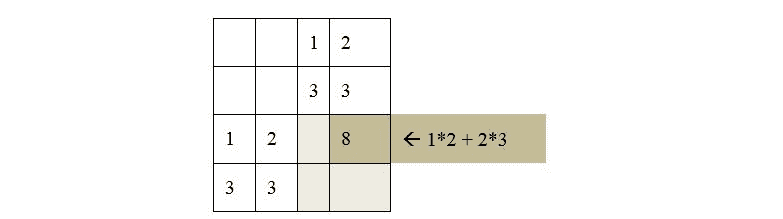
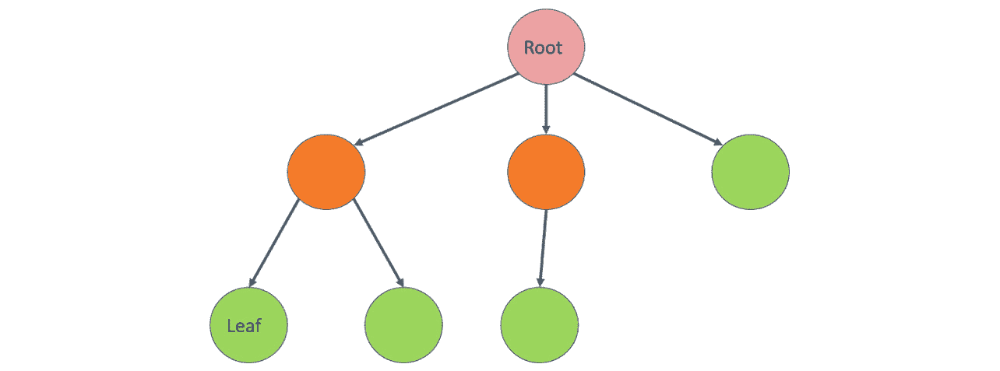

<title>C11461_01_SG_Final_NT</title>

one

# 人工智能原理

## 学习目标

本章结束时，您将能够:

*   描述人工智能的各个领域
*   解释人工智能中使用的主要学习模型
*   解释为什么 Python 是人工智能项目的流行语言
*   为给定的游戏在人工智能中建模状态空间

在这一章中，你将学习人工智能的目的、领域和应用，以及我们将在 Python 中使用的特性的简短总结。

## 简介

在讨论不同的人工智能技术和算法之前，我们将看看人工智能和机器学习的基础知识，并复习一些基本定义。然后，使用引人入胜的例子，我们将在书中继续前进。将使用真实世界的例子，以易于消化的方式呈现人工智能的基本概念。

如果你想成为某方面的专家，你需要非常擅长基本面。所以，让我们从理解什么是人工智能开始:

**定义**:人工智能(AI)是一门使用硬件和软件解决方案来构建智能的科学。

它的灵感来自逆向工程，例如，人脑中神经元的工作方式。我们的大脑由称为神经元的小单元和称为神经网络的神经元网络组成。除了神经网络，神经科学中还有许多其他模型可以用来解决人工智能中的现实问题。

机器学习是一个经常与人工智能混淆的术语。它起源于 20 世纪 50 年代，由阿瑟·李·塞缪尔于 1959 年首次定义。

**定义**:机器学习是一个研究领域，它关注的是在没有明确编程的情况下赋予计算机学习的能力。

汤姆·米切尔提出了一个更精确的机器学习的数学定义。

**定义**:如果一个计算机程序在任务 T 和性能测量 P 上的性能(由 P 测量)随着经验 E 而提高，则称该程序从经验 E 中学习。

从这两个定义可以得出结论，机器学习是实现人工智能的一种方式。但是，没有机器学习也可以有人工智能。例如，如果你硬编码规则和决策树，或者你应用搜索技术，你创建了一个人工智能代理，即使你的方法与机器学习没有什么关系。

### AI 如何解决现实世界的问题？

**人工智能根据人脑处理信息的方式，实现人类智能的自动化。**

每当我们解决一个问题或与人互动时，我们都会经历一个过程。每当我们限制一个问题或交互的范围时，这个过程通常可以被建模和自动化。

人工智能让电脑看起来像人类一样思考。

有时候，感觉 AI 知道我们需要什么。想想你在网上购物后收到的个性化优惠券。到本书结束时，你会明白，要选择最成功的产品，你需要被展示如何最大化你的购买——这是一个相对简单的任务。然而，它也是如此高效，以至于我们经常认为计算机“知道”我们需要什么。

AI 是由执行低级指令的计算机来完成的。

即使一个解决方案看起来很智能，我们也要编写代码，就像其他软件解决方案一样。即使我们正在模拟神经元，简单的机器代码和计算机硬件执行“思考”过程。

大多数人工智能应用都有一个主要目标。当我们与人工智能应用程序交互时，它看起来像人类，因为它可以将问题域限制在主要目标上。因此，我们有机会在低级计算机指令的帮助下，分解复杂的过程并模拟智能。

人工智能可以刺激人类的感官和专业领域的思维过程。

我们必须模拟人类的感官和思想，有时欺骗 AI 相信我们正在与另一个人互动。在特殊情况下，我们甚至可以增强自己的感官。

同样，当我们与聊天机器人互动时，我们希望机器人能理解我们。我们希望聊天机器人甚至语音识别系统能够提供符合我们期望的人机界面。为了满足这些期望，计算机需要模拟人类的思维过程。

### 学科的多样性

一辆无法感知其他汽车正在同一条高速公路上行驶的自动驾驶汽车将会非常危险。AI 智能体需要处理和感知周围的事物，以便驾驶汽车。但这本身是不够的。如果不了解移动物体的物理学，在正常环境下驾驶汽车几乎是不可能的，更不用说是致命的任务了。

为了创建一个可用的人工智能解决方案，涉及到不同的学科。例如:

*   **机器人学:**在太空中移动物体
*   **算法理论:**构造高效算法
*   **统计:**得出有用的结果，预测未来，分析过去
*   心理学:模拟人类大脑的工作方式
*   软件工程:创建经得起时间考验的可维护的解决方案
*   **计算机科学或计算机编程:**在实践中实施我们的软件解决方案
*   **数学**:进行复杂的数学运算
*   **控制理论**:创建前馈和反馈系统
*   **信息论:**对信息进行表示、编码、解码和压缩
*   **图论:**对空间中的不同点进行建模和优化，并表示层次结构
*   **物理:**模拟真实世界
*   **计算机图形和图像处理**显示和处理图像和电影

在本书中，我们将涵盖其中的一些学科。请记住，专注就是力量，我们现在专注于对人工智能的高层次理解。

## 人工智能的领域和应用

现在我们知道了什么是人工智能，让我们继续前进，调查人工智能应用的不同领域。

**模拟人类行为**

人类有五种基本感觉，简单地分为视觉、听觉、动觉、嗅觉和味觉。然而，为了理解如何创建智能机器，我们可以将学科划分如下:

*   听和说
*   理解语言
*   回忆事情
*   思考
*   看见
*   移动的

其中一些超出了我们的范围，因为本书的目的是理解基本原理。例如，为了移动机械臂，我们必须学习复杂的大学水平的数学来理解发生了什么。

**听说**

使用语音识别系统，人工智能可以收集信息。使用语音合成，它可以将内部数据转换成可理解的声音。语音识别和 **语音合成**技术处理人类发出的或人类能够理解的声音的识别和构建。

想象一下，你正在去一个不会说当地语言的国家旅行。你可以对着手机的麦克风说话，期待它“理解”你说的话，然后翻译成另一种语言。同样的情况也可以反过来发生，当地人说话，人工智能将声音翻译成你能理解的语言。语音识别和语音合成使这成为可能。

#### 注意

语音合成的一个例子是谷歌翻译。您可以导航到[https://translate.google.com/](https://translate.google.com/)，通过点击翻译单词下方的扬声器按钮，让翻译说出非英语单词。

**理解语言**

我们可以通过处理自然语言来理解它。这个领域被称为**自然语言处理，简称**或 NLP。

说到自然语言处理，我们倾向于基于**统计学习来学习语言。**

**记起事情**

我们需要表现我们对世界的了解。这就是创建**知识库**和称为**本体**的分层表示发挥作用的地方。本体对我们世界中的事物和想法进行分类，并包含这些类别之间的关系。

**思考**

我们的人工智能系统必须通过使用专家系统成为某个领域的专家。一个**专家系统**可以以确定性的方式基于数学逻辑，也可以以模糊的、非确定性的方式。

专家系统的知识库用不同的技术来表示。随着问题领域的增长，我们创建了层次化的本体。

我们可以通过在大脑的构建模块上模拟网络来复制这种结构。这些构建模块被称为神经元，网络本身被称为一个**神经网络**。

还有一个你需要连接神经网络的关键术语:**深度学习**。深度学习之所以有深度，是因为它超越了模式识别和分类。学习被印入网络的神经结构中。例如，一个特殊的深度学习任务是使用**计算机视觉**的**物体识别**。

**见**

我们必须通过感官与现实世界互动。到目前为止，关于语音识别和合成，我们只涉及了听觉。如果我们不得不看东西呢？然后，我们将不得不创造**计算机视觉**技术来了解我们的环境。毕竟，识别面孔是有用的，大多数人都是这方面的专家。

计算机视觉依靠**图像处理**。虽然图像处理不是直接的人工智能学科，但它是人工智能的必修学科。

**移动**

移动和触摸对我们人类来说是很自然的，但对计算机来说却是非常复杂的任务。移动由**机器人**处理。这是一个非常数学化的话题。

机器人技术基于**控制理论**，在这里你创建一个反馈回路，并根据收集到的反馈控制物体的运动。有趣的是，控制理论在其他领域也有应用，这些领域与空间中的运动物体完全无关。这是因为所需的反馈回路类似于经济学中的模型。

### 模拟智能——图灵测试

艾伦·图灵，图灵机的发明者，一个用于算法理论的抽象概念，提出了一种测试智力的方法。这个测试在 AI 文献中被称为**图灵测试**。

使用文本界面，一个询问者与一个人和一个聊天机器人聊天。聊天机器人的工作是误导询问者，以至于他们无法判断计算机是否是人类。

我们需要通过哪些学科的图灵测试？

首先，我们需要理解一种口语，才能知道审讯者在说什么。我们通过使用**自然语言处理****(****NLP****)**来做到这一点。我们也必须做出回应。

我们需要成为人类思维感兴趣的事物的专家。我们需要建立一个人性的**专家系统**，涉及我们世界中的物体和抽象思想的分类，以及历史事件甚至情感。

通过图灵测试非常困难。目前的预测表明，直到 2020 年代末，我们才能创造出足够好的系统来通过图灵测试。如果这还不够，我们可以进一步推进到全面的图灵测试，其中也包括运动和视觉。

## 人工智能工具和学习模型

在前面的章节中，我们发现了人工智能的基础。人工智能的核心任务之一是学习。

**智能代理**

在解决 AI 问题时，我们在环境中创建一个可以从其周围收集数据并影响其周围环境的参与者。这个演员被称为智能代理。

智能代理:

*   是自主的
*   通过传感器观察周围环境
*   使用致动器在其环境中起作用
*   指导其活动以实现目标

代理还可以学习并访问知识库。

我们可以把代理看作是一个将感知映射到行动的函数。如果代理有一个内部知识库，感知、动作和反应也可能改变知识库。

行动可能会受到奖励或惩罚。设定正确的目标并实施胡萝卜加大棒的情境有助于代理学习。如果目标设定正确，智能体有机会击败通常更复杂的人脑。这是因为无论我们在玩什么游戏，人类大脑的头号目标都是生存。代理的首要动机是达到目标本身。因此，智能代理在没有任何知识的情况下进行随机移动时不会感到尴尬。

### 分类和预测

不同的目标需要不同的过程。让我们来探讨一下 AI 推理最流行的两种类型:**分类**和**预测**。

**分类**是弄清楚如何根据另一个对象来定义一个对象的过程。例如，父亲是有一个或多个孩子的男性。如果简是孩子的父母，简是女性，那么简就是母亲。还有，简是人，是哺乳动物，是活的有机体。我们知道简有国籍和出生日期。

**预测**是根据模式和概率预测事物的过程。例如，如果一位顾客在一家标准超市购买有机牛奶，这位顾客比普通顾客更有可能购买有机酸奶。

### 学习模型

人工智能学习的过程可以在有人监督或无人监督的情况下完成。监督学习基于标记数据和从训练数据推断函数。线性回归就是一个例子。无监督学习基于未标记的数据，并且通常工作在聚类分析上。

## Python 在人工智能中的作用

为了将基本的人工智能概念付诸实践，我们需要一种支持人工智能的编程语言。在本书中，我们选择了 Python。Python 是人工智能如此好的选择有几个原因:

*   Python 是**高级编程语言**。这意味着您不必担心内存分配、指针或一般的机器码。您可以用一种方便的方式编写代码，并依赖 Python 的健壮性。Python 也是**跨平台兼容**。
*   对**开发者体验**的强调使得 Python 成为软件开发者中非常受欢迎的选择。事实上，根据 https://www.hackerrank.com[的 2018 年开发者调查，在所有年龄段中，Python 都是软件开发者的首选语言。这是因为 Python 易读且简单。因此，Python 对于**快速应用开发**非常有用。](https://www.hackerrank.com)
*   Despite being an interpreted language, Python is comparable to other languages used in data science such as R. Its main advantage is **memory efficiency**, as Python can handle large, in-memory databases.

    #### 注意

    Python 是一种多用途语言。它可以用来创建桌面应用程序、数据库应用程序、移动应用程序以及游戏。Python 的网络编程特性也值得一提。此外，Python 是一个优秀的原型工具。

### 为什么 Python 在机器学习、数据科学、AI 领域占优势？

为了理解 Python 在机器学习、数据科学和人工智能中的主导性质，我们必须将 Python 与这些领域中使用的其他语言进行比较。

其中一个主要的替代品是 R，Python 相对于 R 的优势是 Python 更通用，更实用。

与 Java 和 C++相比，用 Python 写程序要快得多。Python 还提供了高度的灵活性。

谈到灵活性和便利性，有一些语言在本质上是相似的:Ruby 和 JavaScript。Python 比这些语言更有优势，因为 Python 有可用的 AI 生态系统。在任何领域，开源、第三方库的支持极大地决定了该语言的成功。Python 的第三方 AI 库支持非常优秀。

### 巨蟒中的蟒蛇

我们已经在序言中安装了 Anaconda。当涉及到人工智能的实验时，Anaconda 将是我们的头号工具。

这个列表目前还不完整，因为 Anaconda 中有 700 多个可用的库。然而，如果你知道这些库，那么你就有了一个好的开始，因为你将能够用 Python 实现基本的人工智能算法。

Anaconda 在一个地方提供了包、ide、数据可视化库和高性能并行计算工具。Anaconda 隐藏了配置问题和维护数据科学、机器学习和人工智能堆栈的复杂性。这个特性在 Windows 中特别有用，因为版本不匹配和配置问题在 Windows 中最容易出现。

Anaconda 附带了 IPython 控制台，您可以在其中以文档风格编写代码和注释。当你尝试人工智能的特性时，你的想法就像一个交互式的教程，在这里你运行你代码的每一步。

#### 注意

IDE 代表集成开发环境。虽然文本编辑器提供了一些突出显示和格式化代码的功能，但 IDE 通过提供自动重构、测试、调试、打包、运行和部署代码的工具，超越了文本编辑器的功能。

### 用于人工智能的 Python 库

这里提供的库列表并不完整，因为 Anaconda 中有 700 多个可用的库。然而，这些具体的例子将让你有一个良好的开端，因为它们将为你能够用 Python 实现基本的人工智能算法打下良好的基础:

*   NumPy 是 Python 的一个计算库。由于 Python 没有内置的数组数据结构，我们必须使用一个库来有效地建模向量和矩阵。在数据科学中，我们需要这些数据结构来执行简单的数学运算。我们将在未来的模块中广泛使用 NumPy。
*   SciPy 是一个高级库，包含用于数据科学的算法。它是 NumPy 的一个很好的补充库，因为它给了你所有你需要的高级算法，不管是线性代数算法，图像处理工具，还是矩阵运算。
*   **pandas** : pandas 提供快速、灵活、富于表现力的数据结构，比如一维序列和二维数据帧。它有效地加载、格式化和处理不同类型的复杂表格。
*   **sci kit-learn**:sci kit-learn 是 Python 主要的机器学习库。它基于 NumPy 和 SciPy 库。scikit-learn 为您提供了执行分类和回归、数据预处理以及监督和非监督学习所需的功能。
*   **NLTK** :本书我们不会涉及自然语言处理但是 NLTK 还是值得一提的，因为这个库是 Python 的主要自然语言工具包。您可以使用这个库执行分类、标记化、词干化、标记、解析、语义推理和许多其他服务。
*   **TensorFlow** : TensorFlow 是 Google 的神经网络库，非常适合实现深度学习人工智能。TensorFlow 的柔性核心可用于解决各种各样的数值计算问题。TensorFlow 的一些现实应用包括谷歌语音识别和物体识别。

### NumPy 库简介

NumPy 库将在本书中扮演主要角色，因此值得进一步探索。

启动 IPython 控制台后，您可以简单地导入 NumPy，如下所示:

```
import numpy as np
```

一旦 NumPy 被导入，您就可以使用它的别名 **np** 来访问它。NumPy 包含一些数据结构的有效实现，比如向量和矩阵。Python 没有内置的数组结构，所以 NumPy 的数组就派上了用场。让我们看看如何定义向量和矩阵:

```
np.array([1,3,5,7])
```

输出如下所示:

```
array([1, 3, 5, 7])
```

我们可以使用以下语法声明一个矩阵:

```
A = np.mat([[1,2],[3,3]])
A
```

输出如下所示:

```
matrix([[1, 2],
        [3, 3]])
```

array 方法创建数组数据结构，而`mat`创建矩阵。

我们可以用矩阵进行许多运算。这些包括加法、减法和乘法:

矩阵加法:

```
A + A
```

输出如下所示:

```
matrix([[2, 4],
        [6, 6]])
```

矩阵减法:

```
A - A
```

输出如下所示:

```
matrix([[0, 0],
        [0, 0]])
```

矩阵乘法:

```
A * A
```

输出如下所示:

```
matrix([[ 7,  8],
        [12, 15]])
```

矩阵加法和减法逐个单元地工作。

矩阵乘法根据线性代数规则工作。要手动计算矩阵乘法，必须对齐两个矩阵，如下所示:



###### 图 1.1:两个矩阵的乘法计算

要获得矩阵的第 *(i，j)个*元素，需要计算矩阵的第*行与第*行和第*列的点(标量)积。两个向量的标量积是它们对应坐标的乘积之和。*

另一种常见的矩阵运算是矩阵的行列式。行列式是与方阵有关的数。使用 NumPy 计算行列式很容易:

```
np.linalg.det( A )
```

输出为`-3.0000000000000004`。

技术上，行列式可以计算为`1*3 – 2*3 = -3`。请注意，NumPy 使用浮点运算来计算行列式，因此，结果的准确性并不完美。这个错误是由于浮点在大多数编程语言中的表示方式造成的。

我们也可以转置一个矩阵，就像这样:

```
np.matrix.transpose(A)
```

输出如下所示:

```
matrix([[1, 3],
        [2, 3]])
```

当计算一个矩阵的转置时，我们将它的值翻转到主对角线上。

NumPy 还有许多其他重要的特性，因此，我们将在本书的大部分章节中使用它。

### 练习 1:使用 NumPy 进行矩阵运算

我们将使用 IPython 和下面的矩阵来解决这个问题。我们将从理解 NumPy 语法开始:


###### 图 1.2:简单矩阵

使用 NumPy，计算如下:

*   矩阵的平方
*   矩阵的行列式
*   矩阵的转置

让我们从 NumPy 矩阵运算开始:

1.  导入 NumPy 库。

    ```
    import numpy as np
    ```

2.  Create a two-dimensional array storing the matrix:

    ```
    A = np.mat([[1,2,3],[4,5,6],[7,8,9]])
    ```

    请注意`np.mat`构造。如果你创建了一个`np.array`而不是`np.mat`，数组乘法的解将是不正确的。

3.  NumPy supports matrix multiplication by using the asterisk:

    ```
    A * A
    matrix([[ 30,  36,  42],
             [ 66,  81,  96],
             [102, 126, 150]])
    1 * 1 + 2 * 4 + 3 * 7
    ```

    输出为`30`。

4.  Use `np.linalg.det` to calculate the determinant of the matrix:

    ```
    np.linalg.det( A )
    1*5*9 + 2*6*7 + 3*4*8 - 1*6*8 - 2*4*9 - 3*5*7
    ```

    输出为`0`。

    无论何时使用 NumPy，都要确保考虑到浮点算术舍入错误的可能性，即使您似乎是在使用整数。

5.  Use `np.matrix.transpose` to get the transpose of the matrix:

    ```
    np.matrix.transpose(A)
    matrix([[1, 4, 7],
             [2, 5, 8],
             [3, 6, 9]])
    ```

    如果`T`是矩阵 A 的转置，那么`T[j][i]`等于`A[i][j]`。

    NumPy 为向量、矩阵和其他数学结构提供了许多有用的特性。

## 用于游戏人工智能的 Python

一个**人工智能游戏玩家**只不过是一个**智能代理**有一个明确的目标:赢得游戏并击败所有其他玩家。在游戏方面，人工智能实验取得了令人惊讶的结果。今天，没有人能在国际象棋比赛中打败人工智能。

围棋是人类大师能够持续击败电脑玩家的最后一盘棋。然而，在 2017 年，谷歌的游戏 AI 击败了围棋大师。

### 游戏中的智能代理

智能代理根据游戏规则进行游戏。代理可以通过其**传感器**感知游戏的**当前状态**，并可以评估潜在步骤的**效用**。一旦代理找到了**最佳可能步骤**，它就使用其执行器执行动作。代理根据其所拥有的信息，找到达到目标**的最佳可能行动。行动要么**奖励**要么**惩罚**。胡萝卜加大棒是奖励和惩罚的极好例子。想象一只驴子在你的手推车前面。你把一根胡萝卜放在驴子的眼前，于是这只可怜的动物开始向它走去。驴子一停下来，骑手可能会用棍子进行惩罚。这不是人类的运动方式，而是奖惩在一定程度上控制了生命体。同样的事情也发生在学校、工作和日常生活中。我们有收入和法律惩罚来塑造我们的行为，而不是胡萝卜和大棒。**

在大多数游戏和游戏化的应用程序中，一系列好的动作会产生奖励。当一个人类玩家感觉受到奖励时，一种叫做多巴胺的荷尔蒙就会被释放出来。多巴胺也被认为是奖励的化学物质。当人类实现一个目标或完成一项任务时，多巴胺就会释放出来。这种荷尔蒙让你感到快乐。人类倾向于以最大化幸福的方式行动。这一系列动作被称为**强迫循环**。另一方面，聪明的代理人只对他们的目标感兴趣，即最大化他们的奖励，最小化他们的惩罚。

在对游戏建模时，我们必须确定它们的**状态空间**。一个动作导致一个**状态转换**。当我们探究所有可能行为的后果时，我们得到了一个**决策树**。随着我们开始探索所有玩家可能的未来行动，直到游戏结束，这棵树变得更深。

人工智能的优势在于每秒执行数百万个可能的步骤。所以游戏 AI 往往归结为一个**搜索练习**。当探索游戏中所有可能的移动顺序时，我们得到了游戏的**状态树**。

考虑一个象棋人工智能。通过构建由所有可能的移动序列组成的状态树来评估所有可能的移动有什么问题？

就复杂性而言，国际象棋是一种精彩的游戏。可能的移动数量组合爆炸。

白棋从 20 个可能的移动开始:8 个兵可以移动一步或两步，两个骑士可以向上向左移动，或者向上向右移动。然后，黑棋可以进行这二十步棋中的任何一步。每个玩家只需走一步，就已经有 20*20 = 400 种可能的组合。

在第二步棋之后，我们得到了 8902 个可能的棋盘星座，这个数字还在继续增长。只要走七步，你就要搜索 10921506 个可能的星座。

一盘棋的平均长度大约是 40 步。一些特殊的游戏需要超过 200 步才能完成。

结果，计算机玩家根本没有时间探索整个状态空间。因此，搜索活动必须以适当的奖励、惩罚和规则的简化来引导。

### 广度优先搜索和深度优先搜索

创造一个游戏人工智能通常是一个搜索练习。因此，我们需要熟悉两种主要的搜索技术:广度优先搜索(BFS)和深度优先搜索(DFS)。

这些搜索技术应用于一棵**有向有根树**。树是一种数据结构，它具有节点和连接这些节点的边，使得树的任意两个节点通过一条路径连接:



###### 图 1.3:有向根树

当树有根时，树中有一个特殊的节点叫做根，我们从这里开始遍历。有向树是这样一种树，它的边只能在一个方向上遍历。节点可以是内部节点或叶子。内部节点至少有一条边，通过这条边我们可以离开这个节点。一片**叶子**没有从节点伸出的边。

在 AI 搜索中，树根是起始状态。我们通过生成搜索树的后继节点从这个状态开始遍历。关于我们访问这些后继节点的顺序，搜索技术有所不同。

假设我们有一个由根定义的树，以及一个从根生成所有后继节点的函数。在这个例子中，每个节点都有一个值和一个深度。我们从 1 开始，可以将值增加 1 或 2。我们的目标是达到值 5。

```
root = {'value': 1, 'depth': 1}
def succ(node):
    if node['value'] == 5:
        return []
    elif node['value'] == 4:
        return [{'value': 5,'depth': node['depth']+1}]
    else:
        return [
            {'value': node['value']+1, 'depth':node['depth']+1},
            {'value': node['value']+2, 'depth':node['depth']+1}
        ]
```

我们将首先对此示例执行 DFS:

```
def bfs_tree(node):
    nodes_to_visit = [node]
    visited_nodes = []
    while len(nodes_to_visit) > 0:
        current_node = nodes_to_visit.pop(0)
        visited_bodes.append(current_node)
        nodes_to_visit.extend(succ(current_node))
    return visited_nodes
bfs_tree(root)
```

输出如下所示:

```
 [{'depth': 1, 'value': 1},
 {'depth': 2, 'value': 2},
 {'depth': 2, 'value': 3},
 {'depth': 3, 'value': 3},
 {'depth': 3, 'value': 4},
 {'depth': 3, 'value': 4},
 {'depth': 3, 'value': 5},
 {'depth': 4, 'value': 4},
 {'depth': 4, 'value': 5},
 {'depth': 4, 'value': 5},
 {'depth': 4, 'value': 5},
 {'depth': 5, 'value': 5}]
```

请注意，广度优先搜索首先查找到叶子的最短路径，因为它按照深度递增的顺序枚举所有节点。

如果我们必须遍历一个图，而不是一个有向根树，广度优先搜索看起来会有所不同:每当我们访问一个节点时，我们都必须检查该节点以前是否被访问过。如果该节点以前被访问过，我们可以简单地忽略它。

在本章中，我们只对树使用**广度优先遍历**。深度优先搜索与广度优先搜索惊人地相似。**深度优先遍历**和 BFS 的区别在于访问节点的顺序。BFS 在访问任何其他节点之前会先访问一个节点的所有子节点，而 DFS 会先在树中深入挖掘:

```
def dfs_tree(node):
    nodes_to_visit = [node]
    visited_nodes = []
    while len(nodes_to_visit) > 0:
        current_node = nodes_to_visit.pop()
        visited_nodes.append(current_node)
        nodes_to_visit.extend(succ(current_node))
    return visited_nodes
dfs_tree(root)
```

输出如下所示:

```
 [{'depth': 1, 'value': 1},
 {'depth': 2, 'value': 3},
 {'depth': 3, 'value': 5},
 {'depth': 3, 'value': 4},
 {'depth': 4, 'value': 5},
 {'depth': 2, 'value': 2},
 {'depth': 3, 'value': 4},
 {'depth': 4, 'value': 5},
 {'depth': 3, 'value': 3},
 {'depth': 4, 'value': 5},
 {'depth': 4, 'value': 4},
 {'depth': 5, 'value': 5}]
```

如您所见，DFS 算法挖掘深度很快。它不一定首先找到最短的路径，但是它保证在探索第二条路径之前找到一片叶子。

在游戏 AI 中，BFS 算法通常更适合评估游戏状态，因为 DFS 可能会丢失。想象开始一个国际象棋游戏，其中 DFS 算法可能很容易在搜索中丢失。

### 探索游戏的状态空间

我们来探讨一个简单游戏的状态空间:井字游戏。

井字游戏中，给出一个 3x3 的游戏板。两个玩家玩这个游戏。一个玩符号 X，另一个玩符号 o。X 开始游戏，每个玩家一个接一个地移动。游戏的目标是得到三个你自己的水平、垂直或对角的标志。

让我们将井字游戏棋盘的单元格表示如下:


###### 图 1.4:井字游戏板

在下面的例子中，X 从位置 1 开始。O 在 5 号位报复，X 在 9 号位移动，然后 O 移动到 3 号位:


###### 图 1.5:带有零号和十字号的井字游戏棋盘

这是第二个玩家的错误，因为现在 X 被迫在 7 号单元格上放置一个标记，从而为赢得游戏创造了两个未来场景。无论 O 是通过移动到 4 号或 8 号单元格来防守，X 都会通过选择另一个未被占据的单元格来赢得比赛。

#### 注意

你可以在 http://www.half-real.net/tictactoe/试玩这个游戏。

为了简单起见，我们将只探索 AI 播放器启动时属于案例的状态空间。我们将从一个随机播放的 AI 播放器开始，在一个空的单元格中放置一个标志。用这个 AI 播放器玩了之后，我们会创建一个完整的决策树。一旦我们生成了所有可能的游戏状态，你将体验到它们的组合爆炸。由于我们的目标是使这些复杂性变得简单，我们将使用几种不同的技术来使 AI 玩家变得更聪明，并减少决策树的大小。到这个实验结束时，我们将拥有一个不到 200 种不同游戏结局的决策树，作为奖励，人工智能玩家将永远不会输掉一场游戏。

要进行随机移动，您必须知道如何使用 Python 从列表中选择随机元素。我们将使用随机库的`choice`函数:

```
from random import choice
choice([2, 4, 6, 8])
```

输出为`6`。

选择函数的输出是列表中的随机元素。

#### 注意

在下面的练习中，我们将使用阶乘符号。阶乘用“！”表示感叹号。根据定义，0！= 1，而 n！= n*(n-1)！。在我们的例子中，是 9！= 9* 8!= 9*8*7!= … = 9*8*7*6*5*4*3*2*1.

### 练习 2:估计井字游戏中可能状态的数量

粗略估计井字游戏状态空间的每个级别上可能的状态数:

*   据我们估计，我们不会停止，直到所有的细胞董事会已被填满。一个玩家可能会在游戏结束前获胜，但是为了统一起见，我们将继续游戏。
*   第一个玩家将选择九个单元格中的一个。第二个玩家将从剩下的八个单元格中选择一个。然后，第一个玩家可以从剩下的七个单元格中选择一个。这种情况一直持续到任何一个玩家赢得游戏，或者第一个玩家被迫走第九步，也就是最后一步。
*   因此，可能的决策序列的数量是 9！= 362880.这些序列中有一些是无效的，因为玩家可能在不到九步的情况下赢得游戏。赢一局至少要走五步，因为第一个玩家需要走三步。
*   To calculate the exact size of the state space, we would have to calculate the number of games that are won in five, six, seven, and eight steps. This calculation is simple, but due to its exhaustive nature, it is out of scope for us. We will therefore settle for the magnitude of the state space.

    #### 注意

    在生成所有可能的井字游戏后，研究人员统计出 255，168 种可能的游戏。在这些游戏中，第一名玩家赢得了 131，184 场，第二名玩家赢得了 77，904 场，46，080 场游戏以平局结束。访问[http://www.half-real.net/tictactoe/allgamesoftictactoe.zip](http://www.half-real.net/tictactoe/allgamesoftictactoe.zip)下载所有可能的井字游戏。

即使像井字游戏这样简单的游戏也有很多状态。想象一下开始探索所有可能的国际象棋游戏有多难。因此，我们可以得出结论，暴力搜索很少是理想的。

### 练习 3:随机创建人工智能

在这一节中，我们将为井字游戏创建一个实验框架。我们将在假设人工智能玩家总是开始游戏的基础上建立游戏模型。创建一个函数来打印你的内部表示，并允许你的对手随机进入一个移动。确定玩家是否获胜。为了确保这种情况正确发生，您需要完成前面的练习:

1.  我们将从`random`库中导入选择函数:

    ```
    from random import choice
    ```

2.  为了简单起见，我们将在一个简单的字符串中模拟九个单元。一个九个字符长的 Python 字符串按照以下顺序存储这些单元格:“`123456789`”。让我们确定必须包含匹配符号的索引三元组，以便玩家赢得游戏:

    ```
    combo_indices = [
        [0, 1, 2],
        [3, 4, 5],
        [6, 7, 8],
        [0, 3, 6],
        [1, 4, 7],
        [2, 5, 8],
        [0, 4, 8],
        [2, 4, 6]
    ]
    ```

3.  让我们为空单元格、AI 和对手玩家定义*符号*常量:

    ```
    EMPTY_SIGN = '.'
    AI_SIGN = 'X'
    OPPONENT_SIGN = 'O'
    ```

4.  让我们创建一个打印电路板的函数。我们将在棋盘前后添加一个空行，这样我们就可以方便地读取游戏状态:

    ```
    def print_board(board):
        print(" ")
        print(' '.join(board[:3]))
        print(' '.join(board[3:6]))
        print(' '.join(board[6:]))
        print(" ")
    ```

5.  我们将描述人类玩家的移动。输入参数是电路板、从 1 到 3 的行号和从 1 到 3 的列号。这个函数的返回值是一个包含新棋的棋盘:

    ```
    def opponent_move(board, row, column):
        index = 3 * (row - 1) + (column - 1)
        if board[index] == EMPTY_SIGN:
            return board[:index] + OPPONENT_SIGN + board[index+1:]
        return board
    ```

6.  是时候定义一个人工智能玩家的随机移动了。我们将使用`all_moves_from_board`函数生成所有可能的移动，然后我们将从可能的移动列表中选择一个随机移动:

    ```
    def all_moves_from_board_list(board, sign):
        move_list = []
        for i, v in enumerate(board):
            if v == EMPTY_SIGN:
                move_list.append(board[:i] + sign + board[i+1:])
        return move_list
    def ai_move(board):
        return choice(all_moves_from_board(board, AI_SIGN))
    ```

7.  在定义了移动之后，我们必须确定一个玩家是否赢得了游戏:

    ```
    def game_won_by(board):
        for index in combo_indices:
            if board[index[0]] == board[index[1]] == board[index[2]] != EMPTY_SIGN:
                return board[index[0]]
        return EMPTY_SIGN
    ```

8.  最后，但同样重要的是，我们将创建一个游戏循环，以便我们可以测试电脑玩家和人类玩家之间的交互。尽管我们将在下面的例子中进行彻底的搜索:

    ```
    def game_loop():
        board = EMPTY_SIGN * 9
        empty_cell_count = 9
        is_game_ended = False
        while empty_cell_count > 0 and not is_game_ended:
            if empty_cell_count % 2 == 1:
                board = ai_move(board)
            else:
                row = int(input('Enter row: '))
                col = int(input('Enter column: '))
                board = opponent_move(board,	 row, col)
            print_board(board)
            is_game_ended = game_won_by(board) != EMPTY_SIGN
        empty_cell_count = sum(
                1 for cell in board if cell == EMPTY_SIGN
            ) 
        print('Game has been ended.')
    ```

9.  使用`game_loop`功能运行游戏:

    ```
    game_loop()
    ```

如你所见，如果对手犯错，即使是随机出牌的对手也可能不时获胜。

### 活动 1:生成井字游戏中所有可能的步骤序列

这项活动将探索两个玩家随机游戏时可能出现的组合爆炸。我们将使用一个程序，建立在先前的结果上，生成计算机玩家和人类玩家之间所有可能的移动序列。假设人类玩家可以做出任何可能的移动。在本例中，假设电脑玩家随机游戏，我们将检查属于两个随机游戏玩家的赢、输和平局:

1.  创建一个函数，将`all_moves_from_board`函数映射到棋盘空间/方格列表的每个元素上。这样，我们将拥有决策树的所有节点。
2.  决策树从`[ EMPTY_SIGN * 9 ]`开始，每走一步就展开一次。让我们创建一个`filter_wins`函数，它从移动列表中取出已完成的游戏，并将它们附加到一个数组中，该数组包含 AI 玩家和对手玩家赢得的棋盘状态:
3.  然后，使用一个`count_possibilities`函数打印以平局结束、被第一个玩家赢得和被第二个玩家赢得的决策树叶子的数量。
4.  在每个状态中，我们最多有 9 个步骤。在第 0、2、4、6 和 8 次迭代中，人工智能玩家移动。在所有其他迭代中，对手移动。我们在所有步骤中创建所有可能的移动，并从移动列表中取出完成的游戏。
5.  然后，执行一定数量的可能性来体验组合爆炸。

如您所见，棋盘状态树由 266，073 片树叶组成。`count_possibilities`函数本质上实现了一个 BFS 算法来遍历游戏的所有可能状态。请注意，我们对这些状态进行了多次计数，因为在步骤 1 的右上角放置一个 X 并在步骤 3 的左上角放置一个 X 会导致类似的可能状态，即从左上角开始，然后在右上角放置一个 X。如果我们实现了重复状态的检测，我们将需要检查更少的节点。然而，在这个阶段，由于游戏的深度有限，我们将省略这一步。

一个`count_possibilities`。在决策树中，我们通过在一定程度上调查所有可能的未来步骤来探索每个步骤的效用。在我们的例子中，我们可以通过观察固定最初几步后的赢和输的次数来计算最初几步的效用。

#### 注意

树根是初始状态。树的内部状态是游戏尚未结束并且可以移动的状态。一片树叶包含一个游戏结束的状态。

这项活动的解决方案可在第 258 页找到。

## 总结

在这一章中，我们学习了什么是人工智能，以及它的多个学科。

我们已经看到了人工智能如何被用来增强或替代人类的脑力，来听、说、理解语言、存储和检索信息、思考、看和移动。然后，我们继续学习在他们的环境中行动的智能代理，以看似智能的方式解决问题，以追求先前确定的目标。当代理学习时，他们可以在有人监督或无人监督的情况下学习。我们可以使用智能代理对事物进行分类或对未来进行预测。

然后我们介绍了 Python，了解了它在人工智能领域的作用。我们研究了一些用于开发智能代理和为代理准备数据的重要 Python 库。作为热身，我们用一个例子来结束本章，在这个例子中，我们使用 NumPy 库在 Python 中执行一些矩阵操作。我们还学习了如何为井字游戏创建搜索空间。在下一章，我们将学习如何在搜索空间的帮助下传递智能。