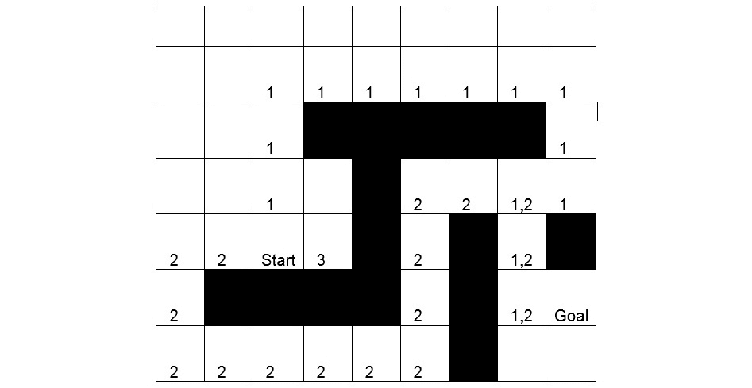
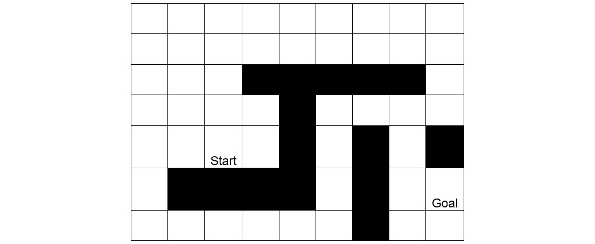
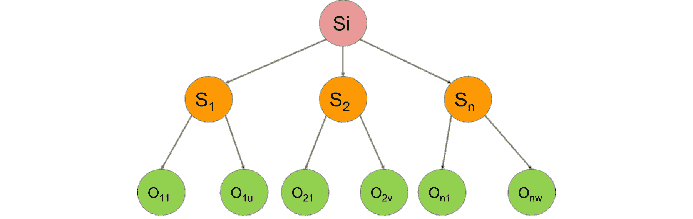
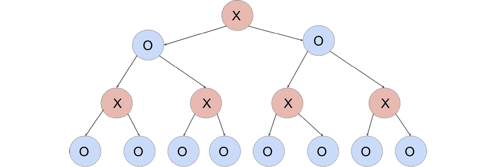
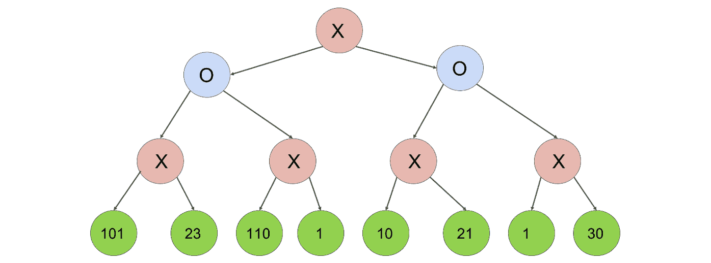
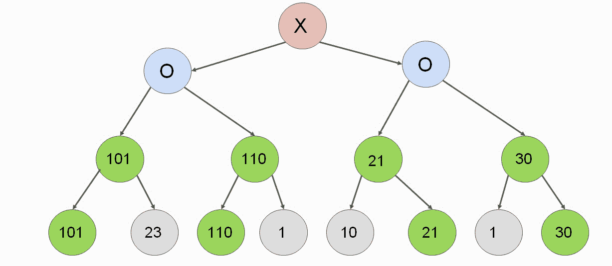
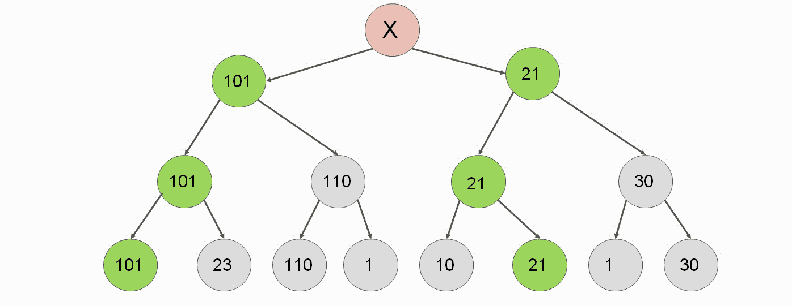
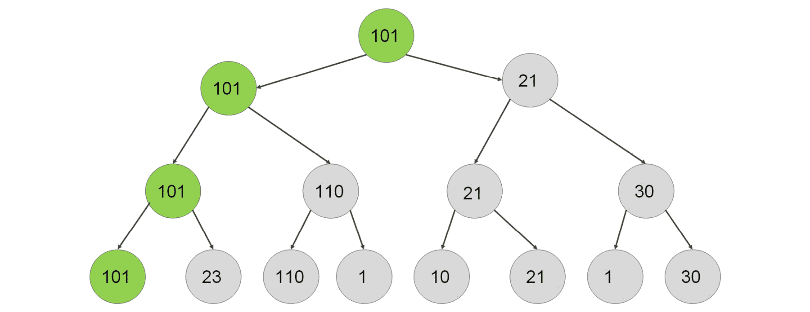
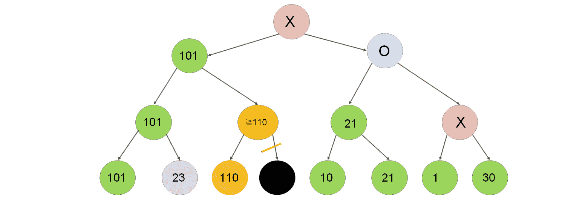
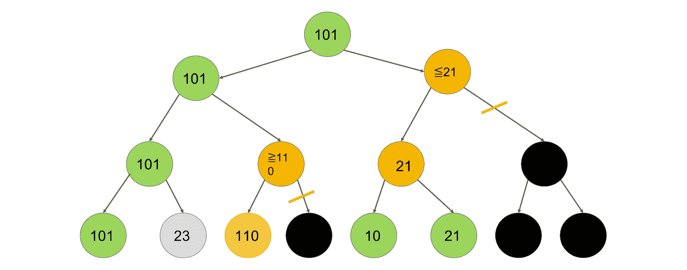

# 二、人工智能与搜索技术和游戏

## 学习目标

本章结束时，您将能够:

*   基于静态规则用 Python 构建一个简单的游戏 AI
*   确定启发式在游戏人工智能中的作用
*   采用搜索技术和寻路算法
*   用最小最大算法实现双人游戏的游戏人工智能

在这一章中，我们将着眼于创建智能代理。

## 简介

在前一章中，我们理解了智能代理的重要性。我们还检查了游戏 AI 的游戏状态。在这一章中，我们将集中讨论如何创建智能并将其引入代理。

我们将着眼于减少状态空间中的状态数量，并分析游戏棋盘可以经历的阶段，并使环境以我们获胜的方式工作。到本章结束时，我们将会有一个从来没有输过一场比赛的井字游戏玩家。

### 练习 4:教导代理人赢得胜利

在本练习中，我们将了解如何减少获胜所需的步骤。我们将让我们在前一章中开发的代理检测它可以赢得游戏的情况。以随机播放为例，比较可能状态的数量。

1.  我们将定义两个函数，`ai_move`和`all_moves_from_board`。我们将创建`ai_move`,以便它返回一个将考虑其先前移动的移动。如果这步棋能赢，则`ai_move`会选择这步棋。

    ```py
    def ai_move(board):
        new_boards = all_moves_from_board(board, AI_SIGN)
        for new_board in new_boards:
        if game_won_by(new_board) == AI_SIGN:
        return new_board
        return choice(new_boards)
    ```

2.  让我们用一个游戏循环来测试这个应用。每当人工智能有机会赢得比赛时，它总是将 X 放在正确的单元格:

    ```py
    game_loop()
    ```

3.  输出如下:

    ```py
    . X .
    . . .
    . . .
    Enter row: 3
    Enter column: 1
    . X .
    . . .
    O . .

    . X X
    . . .
    O . .

    Enter row: 2
    Enter column: 1

    . X X
    O . .
    O . .

    X X X
    O . .
    O . .
    Game has been ended.
    ```

4.  为了计算所有可能的移动，我们必须修改`all_moves_from_board`函数来包含这个改进。我们必须这样做，如果游戏被`AI_SIGN`赢得，它将返回那个值:

    ```py
    def all_moves_from_board(board, sign):
        move_list = []
        for i, v in enumerate(board):
            if v == EMPTY_SIGN:
                new_board = board[:i] + sign + board[i+1:]
                move_list.append(new_board)
                if game_won_by(new_board) == AI_SIGN:
                    return [new_board]
        return move_list
    ```

5.  然后我们生成所有可能的移动。一旦我们发现一个为人工智能赢得游戏的移动，我们就返回它。我们不关心人工智能是否有多种选择来一步赢得比赛——我们只是返回第一种可能性。如果人工智能不能赢，我们返回所有可能的移动。
6.  让我们看看这意味着在每一步计算所有的可能性:

    ```py
    count_possibilities()
    ```

7.  输出如下:

    ```py
    step 0\. Moves: 1
    step 1\. Moves: 9
    step 2\. Moves: 72
    step 3\. Moves: 504
    step 4\. Moves: 3024
    step 5\. Moves: 8525
    step 6\. Moves: 28612
    step 7\. Moves: 42187
    step 8\. Moves: 55888
    First player wins: 32395
    Second player wins: 23445
    Draw 35544
    Total 91344
    ```

### 活动 2:教导代理人认识到其防范损失的情况

在本节中，我们将讨论如何使计算机播放器播放得更好，以便我们可以减少状态空间和损失的数量。我们将迫使计算机防御玩家将他们的第三个符号放在行、列或对角线上:

1.  创建一个名为`player_can_win`的函数，它使用`all_moves_from_board`函数从棋盘中取出所有的棋步，并使用一个名为`next_move`的变量对其进行迭代。在每一次迭代中，它检查游戏是否可以通过符号获胜，然后返回 true 或 false。
2.  扩展人工智能的移动，使它更喜欢安全的移动。如果对手不能在下一步赢得比赛，这一步棋是安全的。
3.  测试新的应用。你会发现人工智能已经做出了正确的举动。
4.  将这个逻辑放在状态空间生成器中，通过生成所有可能的游戏来检查计算机玩家做得如何。

我们不仅再次排除了几乎三分之二的可能游戏，而且大多数时候，人工智能玩家要么获胜，要么接受平局。尽管我们努力让人工智能变得更好，但它仍然会以 962 种方式失败。我们将在下一个活动中消除所有这些损失。

#### 注意

这项活动的解决方案可在第 261 页找到。

### 活动 3:固定 AI 的第一步和第二步，使其无敌

本节将讨论如何集中进行彻底搜索，以便找到比其他搜索更有用的移动。我们将通过硬编码第一步和第二步来减少可能的游戏:

1.  计算棋盘上空白区域的数量，如果有 9 或 7 个空白区域，进行硬编码移动。你可以尝试不同的硬编码动作。
2.  占领任何一个角落，然后占领对面的角落，导致没有损失。如果对手占据了对面的角落，在中间移动不会造成损失。
3.  After fixing the first two steps, we only need to deal with 8 possibilities instead of 504\. We also guided the AI into a state, where the hardcoded rules were enough to never lose a game.

    #### 注意

    这项活动的解决方案可在第 263 页找到。

让我们总结一下我们用来缩减状态空间的重要技术:

1.  **经验简化**:我们认为最佳的第一步是拐角移动。我们只是硬编码了一步棋，而不是考虑其他的选择来关注游戏的其他方面。在更复杂的游戏中，经验性的移动经常会误导人。最著名的国际象棋人工智能胜利往往违反了国际象棋大师的常识。
2.  **对称**:我们从一个角球移动开始后，注意到从赢得比赛的角度来看，位置 1、3、7、9 是等价的。尽管我们没有进一步发展这个想法，请注意，我们甚至可以旋转桌子，以进一步缩小状态空间，并将所有四个角的移动视为完全相同的移动。
3.  **归约不同的排列导致相同的状态**:假设我们可以出招 A 或 B，假设我们的对手出招 X，其中 X 既不等于出招 A 也不等于出招 B，如果我们探索序列 A，X，B，我们开始探索序列 B，X，那么我们就不必考虑序列 B，X，A，这是因为两个序列导致完全相同的博弈状态，我们之前已经探索过包含这三个动作的状态。
4.  **玩家的强制移动**:当玩家水平、垂直或对角收集两个符号，并且该行的第三个单元格是空的，我们被迫占据那个空单元格，要么赢得游戏，要么阻止对手赢得游戏。强制移动可能意味着其他强制移动，这进一步缩小了状态空间。
5.  **对手的被迫移动**:当对手的移动明显是最优时，考虑对手没有做出最优移动的情况是没有意义的。当对手可以通过占据一个单元格来赢得游戏时，我们是否继续对对手错过最佳移动的情况进行长时间的探索并不重要。当对手未能阻止我们赢得比赛时，我们通过不探究案例节省了很多。这是因为在对手犯错之后，我们会简单地赢得比赛。
6.  **随机移动**:当我们无法决定，也没有能力去搜索的时候，我们就随机移动。随机移动几乎总是不如基于搜索的有根据的猜测，但有时，我们没有其他选择。

## 启发式

在本主题中，我们将通过定义和应用启发法来指导我们的搜索，从而使知情搜索技术形式化。

### 不知情和知情的搜索

在井字游戏的例子中，我们实现了一个贪婪的算法，它首先专注于赢，然后专注于不输。当谈到立即赢得游戏时，贪婪算法是最优的，因为从来没有比赢得游戏更好的步骤。说到不损失，重要的是我们如何避免损失。我们的算法只是选择了一个随机的安全移动，而没有考虑我们创造了多少获胜的机会。

广度优先搜索和深度优先搜索是不统一的，因为它们考虑了博弈中所有可能的状态。知情搜索智能地探索可用状态的空间。

### 创造启发法

如果我们想做出更好的决策，我们会通过考虑长期效用，应用启发式方法来引导搜索向正确的方向发展。这样，我们就可以根据未来可能发生的事情做出更明智的决策。这样也可以帮助我们更快的解决问题。我们可以按如下方式构建试探法:

*   对游戏中走一步棋的效用的有根据的猜测
*   从玩家的角度对给定游戏状态的效用进行有根据的猜测
*   对距离我们目标的距离的有根据的猜测

试探法是基于其效用来评估游戏状态或向新游戏状态过渡的功能。启发式是使搜索问题知情的基石。

在本书中，我们将使用效用和成本作为否定的术语。效用最大化和搬迁成本最小化被认为是同义词。

启发式评估函数的一个常用示例出现在寻路问题中。假设我们在状态树中寻找一条通向目标状态的路径。每一步都有一个相关联的成本来表示旅行距离。我们的目标是最小化达到目标状态的成本。

以下是解决寻路问题的启发式示例:获取当前状态和目标的坐标。不考虑连接这些点的路径，计算这些点之间的距离。平面上两点的距离是连接这两点的直线的长度。这种启发式被称为欧几里德距离。

假设我们定义了一个迷宫中的寻路问题，在这里我们只能向上、向下、向左或向右移动。迷宫中有一些障碍物阻碍了我们的行动。我们可以用来评估我们离目标状态有多近的一种启发式方法称为曼哈顿距离，它被定义为当前状态和结束状态的相应坐标之间的水平和垂直距离之和。

### 可接受和不可接受的试探法

我们刚刚在寻路问题上定义的两个试探法在用于它们给定的问题域时被称为可容许试探法。容许意味着我们可能会低估达到最终状态的代价，但我们绝不会高估它。在下一个主题中，我们将探索在当前状态和目标状态之间找到最短路径的算法。这个算法的最优性质取决于我们是否能定义一个可接受的启发式函数。

不可接受的试探的一个例子是应用在二维地图上的曼哈顿距离。想象一下，在我们的当前状态和目标状态之间有一条直接的路径。当前状态位于坐标(2，5)，目标状态位于坐标(5，1)。

两个节点的曼哈顿距离如下:

```py
abs(5-2) + abs(1-5) = 3 + 4 = 7
```

由于我们高估了从当前节点到目标的旅行成本，当我们可以对角移动时，曼哈顿距离是不可接受的。

### 启发式评估

从开始玩家的角度创建井字游戏状态的启发式评估。

我们可以定义博弈状态的效用或一步棋的效用。两者都有效，因为博弈状态的效用可以定义为导致博弈状态的移动的效用。

**启发式 1:残局的简单评估**

让我们通过评估一个棋盘来定义一个简单的启发:我们可以定义一个博弈状态的效用或者一个走法的效用。两者都有效，因为博弈状态的效用可以定义为导致博弈状态的移动的效用。游戏的效用可以是:

*   +1，如果状态暗示 AI 玩家将赢得游戏
*   -1，如果状态暗示 AI 玩家将输掉游戏
*   0，如果已经达到平局或者从当前状态不能确定明显的获胜者

这个启发很简单，因为任何人都可以看着棋盘，分析一个玩家是否会赢。

这个启发式的效用取决于我们是否能提前下很多棋。请注意，我们甚至无法在五步之内赢得游戏。我们在主题 A 中看到，当我们进行到第 5 步时，我们有 13，680 种可能的组合。在这 13，680 个案例中的大多数情况下，我们的启发式算法返回零。

如果我们的算法不深入这五个步骤，我们完全不知道如何开始游戏。因此，我们可以发明一种更好的启发式方法。

**启发 2:一步棋的效用**

*   两个 AI 符号排成一行、一列或对角线，第三个单元格为空:+1000 为空单元格。
*   对手有两个在一排，一列，或对角线上，第三个单元格是空的:+100 为空单元格。
*   一个 AI 在行、列或对角线上签名，另外两个单元格为空:+10 为空单元格。
*   没有 AI 或对手在行、列或对角线上签名:空单元格+1。
*   被占用的单元格的值为负无穷大。实际上，由于规则的性质，-1 也可以。

为什么我们对四条规则使用乘数因子 10？因为一行、一列和一条对角线有八种可能的方法来做三个。因此，即使我们对游戏一无所知，我们也可以肯定，一个较低级别的规则可能不会累积到覆盖一个较高级别的规则。换句话说，如果我们能赢得比赛，我们将永远不会防御对手的举动。

#### 注意

因为我们对手的工作也是获胜，我们可以从对手的角度来计算这个启发。我们的任务也是最大化这个价值，这样我们就可以抵御对手的最优策略。这也是最小最大算法背后的思想。如果我们想把这个启发转换成描述当前棋盘的启发，我们可以计算所有打开的单元格的启发值，并取 AI 角色的最大值，这样我们就可以最大化我们的效用。

对于每个板，我们将创建一个效用矩阵。例如，考虑以下电路板:


###### 图 2.1:井字游戏状态

从这里，我们可以构造它的效用矩阵:


###### 图 2.2:井字游戏效用矩阵

在第二行，如果我们要选择左边的单元格，它并不是很有用。注意，如果我们有一个更优的效用函数，我们会奖励阻挡对手。

第三列的两个单元格都连续两次获得 10 点的提升。

右上的单元格也因为防守对手的对角线得到 100 分。

从这个矩阵中，很明显我们应该选择右上方的移动。

我们可以使用这种启发式方法来指导我们走向最佳的下一步棋，或者通过取这些值的最大值来给出当前棋盘上更有根据的分数。我们已经在主题 A 中以硬编码规则的形式在技术上使用了这种启发式的一部分。不过，请注意，试探法的真正效用不是对电路板的静态评估，而是它在限制搜索空间方面提供的指导。

### 练习 5:使用启发式函数进行井字游戏静态评估

使用启发式函数对井字游戏进行静态评估。

1.  在这一节中，我们将创建一个函数，它采用可能移动的效用向量，采用效用向量中表示三元组的三个索引，并返回一个函数。返回的函数需要一个 points 参数，并修改 Utilities 向量，以便它向(I，j，k)三元组中的每个单元格添加点，只要该单元格的原始值为非负。换句话说，我们只增加了空单元格的效用。

    ```py
    def init_utility_matrix(board):
        return [0 if cell == EMPTY_SIGN else -1 for cell in board]
    def generate_add_score(utilities, i, j, k):
        def add_score(points):
            if utilities[i] >= 0:
                utilities[i] += points
            if utilities[j] >= 0:
                utilities[j] += points
            if utilities[k] >= 0:
                utilities[k] += points
        return add_score
    ```

2.  我们现在拥有了创建属于任何棋盘星座的效用矩阵的一切:

    ```py
    def utility_matrix(board):
        utilities = init_utility_matrix(board)
        for [i, j, k] in combo_indices:
            add_score = generate_add_score(utilities, i, j, k)
            triple = [board[i], board[j], board[k]]
            if triple.count(EMPTY_SIGN) == 1:
                if triple.count(AI_SIGN) == 2:
                    add_score(1000)
                elif triple.count(OPPONENT_SIGN) == 2:
                    add_score(100)
            elif triple.count(EMPTY_SIGN) == 2 and triple.count(AI_SIGN) == 1:
                add_score(10)
            elif triple.count(EMPTY_SIGN) == 3:
                add_score(1)
        return utilities
    ```

3.  我们现在将创建一个函数，严格选择具有最高效用值的移动。如果多次移动具有相同的效用，该函数将返回两次移动。

    ```py
    def best_moves_from_board(board, sign):
        move_list = []
        utilities = utility_matrix(board)
        max_utility = max(utilities)
        for i, v in enumerate(board):
            if utilities[i] == max_utility:
                move_list.append(board[:i] + sign + board[i+1:])
        return move_list
    def all_moves_from_board_list(board_list, sign):
        move_list = []
        get_moves = best_moves_from_board if sign == AI_SIGN else all_moves_from_board
        for board in board_list:
            move_list.extend(get_moves(board, sign))
        return move_list
    ```

4.  让我们运行应用。

    ```py
    count_possibilities()
    step 0\. Moves: 1
    step 1\. Moves: 1
    step 2\. Moves: 8
    step 3\. Moves: 24
    step 4\. Moves: 144
    step 5\. Moves: 83
    step 6\. Moves: 214
    step 7\. Moves: 148
    step 8\. Moves: 172
    First player wins: 504
    Second player wins: 12
    Draw 91
    Total 607
    ```

### 使用试探法进行知情搜索

我们还没有体验到启发式的真正力量，因为我们在不知道未来行动的影响的情况下采取行动，因此影响了对手的合理发挥。

这就是为什么一个更准确的启发式比简单地硬编码游戏中的前两步棋会导致更多的损失。请注意，在之前的主题中，我们选择了这两个步骤，这是基于我们在固定第一步的情况下运行游戏所产生的统计数据。这种方法本质上是启发式搜索应该有的。静态评估无法与生成成千上万的未来状态和选择一个使我们的回报最大化的游戏相竞争。

### 启发式的类型

因此，更准确的启发式比简单地硬编码游戏中的前两步棋会导致更多的损失。请注意，在主题 A 中，我们选择了这两个步骤，这是基于我用固定的第一步运行游戏所产生的统计数据。这种方法本质上是启发式搜索应该有的。静态评估无法与生成成千上万的未来状态和选择一个使我们的回报最大化的游戏相竞争。

*   这是因为我们的试探法并不精确，而且很可能也不被接受。

我们在前面的练习中看到启发式并不总是最优的:在第一个主题中，我们提出了允许 AI 总是赢得比赛或以平局结束的规则。这些启发法让人工智能经常获胜，代价是在少数情况下失败。

*   如果我们低估了一个博弈状态的效用，我们就说一个启发式是可接受的，但是我们永远不会高估它。

在井字游戏的例子中，我们可能高估了一些游戏状态的效用。为什么？因为我们最终亏损了 12 次。一些导致失败的游戏状态有一个最大启发式得分。为了证明我们的启发式方法是不可接受的，我们需要做的就是找到一个我们在选择一个导致失败的游戏状态时忽略的可能获胜的游戏状态。

还有两个描述启发式的特性:最优和完整:

*   **最优试探法**总能找到最佳的可能解决方案。
*   **完全启发式**有两种定义，取决于我们如何定义问题域。从广义上说，如果一个启发式算法总能找到一个解，那么它就是完备的。严格地说，如果一个启发式算法找到了所有可能的解，那么它就是完整的。我们的井字游戏试探法并不完整，因为我们故意忽略了许多可能获胜的州，而偏爱一个失败的州。

## 用 A*算法寻路

在前两个主题中，我们学习了如何定义一个智能代理，以及如何创建一个启发式规则来引导代理达到期望的状态。我们知道这并不完美，因为有时我们忽略了几个获胜的州，而偏爱几个失败的州。

我们现在将学习一种结构化的最佳方法，以便我们可以执行搜索来找到当前状态和目标状态之间的最短路径:算法**A ***(**“A 星”而不是“A 星”**):


###### 图 2.3:在迷宫中寻找最短路径

对于一个人来说，仅仅通过看图像就能找到最短的路径。我们可以得出结论，最短路径有两个潜在的候选:路线一开始向上，路线二开始向左。然而，人工智能不知道这些选项。事实上，对电脑玩家来说，最合理的第一步是移动到下图中数字 3 所代表的方块:

为什么？因为这是减少起始状态和目标状态之间距离的唯一步骤。所有其他步骤最初远离目标状态:



###### 图 2.4:带实用程序的最短寻路游戏板

### 练习 6:寻找到达目标的最短路径

寻找最短路径的步骤如下:

1.  使用 Python 描述板、初始状态和最终状态。创建一个函数，返回可能的后续状态列表。
2.  我们将使用元组，其中第一个坐标表示从 1 到 7 的行号，第二个坐标表示从 1 到 9 的列号:

    ```py
    size = (7, 9)
    start = (5, 3)
    end = (6, 9)
    obstacles = {
        (3, 4), (3, 5), (3, 6), (3, 7), (3, 8),
        (4, 5),
        (5, 5), (5, 7), (5, 9),
        (6, 2), (6, 3), (6, 4), (6, 5), (6, 7),
        (7, 7)
    }
    ```

3.  我们将使用数组理解以下面的方式生成后继状态。我们从当前列向左移动一个，向右移动一个，只要我们留在板上。我们从当前行向上移动一个，向下移动一个，只要我们还在棋盘上。我们获取新的坐标，生成所有四个可能的元组，并过滤结果，以便新的状态不会出现在障碍列表中。排除返回到我们之前访问过的字段的移动也是有意义的，以避免无限循环:

    ```py
    def successors(state, visited_nodes):
        (row, col) = state
        (max_row, max_col) = size
        succ_states = []
        if row > 1:
            succ_states += [(row-1, col)]
        if col > 1:
            succ_states += [(row, col-1)]
        if row < max_row:
            succ_states += [(row+1, col)]
        if col < max_col:
            succ_states += [(row, col+1)]
        return [s for s in succ_states if s not in visited_nodes if s not in obstacles]
    ```

### 练习 7:使用 BFS 寻找最短路径

要找到最短路径，请按照下列步骤操作:

使用 BFS 算法寻找最短路径。

回想一下基本的 BFS 实现。

1.  我们必须修改这个实现来包含成本。我们来衡量一下成本:

    ```py
    import math
    def initialize_costs(size, start):
        (h, w) = size
        costs = [[math.inf] * w for i in range(h)]
        (x, y) = start
        costs[x-1][y-1] = 0
        return costs
    def update_costs(costs, current_node, successor_nodes):
        new_cost = costs[current_node[0]-1][current_node[1]-1] + 1
        for (x, y) in successor_nodes:
            costs[x-1][y-1] = min(costs[x-1][y-1], new_cost)
    def bfs_tree(node):
        nodes_to_visit = [node]
        visited_nodes = []
        costs = initialize_costs(size, start)
        while len(nodes_to_visit) > 0:
            current_node = nodes_to_visit.pop(0)
            visited_nodes.append(current_node)
            successor_nodes = successors(current_node, visited_nodes)
            update_costs(costs, current_node, successor_nodes)
            nodes_to_visit.extend(successor_nodes)
        return costs
    bfs_tree(start)
    ```

2.  输出如下:

    ```py
    [[6, 5, 4, 5, 6, 7, 8, 9, 10],
     [5, 4, 3, 4, 5, 6, 7, 8, 9],
     [4, 3, 2, inf, inf, inf, inf, inf, 10],
     [3, 2, 1, 2, inf, 12, 13, 12, 11],
     [2, 1, 0, 1, inf, 11, inf, 13, inf],
     [3, inf, inf, inf, inf, 10, inf, 14, 15],
     [4, 5, 6, 7, 8, 9, inf, 15, 16]]
    ```

3.  您可以看到，简单的 BFS 算法成功地确定了从起始节点到任何节点(包括目标节点)的成本。让我们测量一下找到目标节点所需的步骤数:

    ```py
    def bfs_tree_verbose(node):
        nodes_to_visit = [node]
        visited_nodes = []
        costs = initialize_costs(size, start)
        step_counter = 0
        while len(nodes_to_visit) > 0:
            step_counter += 1
            current_node = nodes_to_visit.pop(0)
            visited_nodes.append(current_node)
            successor_nodes = successors(current_node, visited_nodes)
            update_costs(costs, current_node, successor_nodes)
            nodes_to_visit.extend(successor_nodes)
            if current_node == end:
                print(
                    'End node has been reached in ', 
                    step_counter, ' 
                    steps'
                )
                return costs
        return costs
    bfs_tree_verbose(start)
    ```

4.  已经在 110 步中到达终点:

    ```py

    [[6, 5, 4, 5, 6, 7, 8, 9, 10],
     [5, 4, 3, 4, 5, 6, 7, 8, 9],
     [4, 3, 2, inf, inf, inf, inf, inf, 10],
     [3, 2, 1, 2, inf, 12, 13, 12, 11],
     [2, 1, 0, 1, inf, 11, inf, 13, inf],
     [3, inf, inf, inf, inf, 10, inf, 14, 15],
     [4, 5, 6, 7, 8, 9, inf, 15, 16]]
    ```

我们现在将学习一种可以找到从起始节点到目标节点的最短路径的算法:A*算法。

### 介绍 A*算法

A*是一个完整且最优的启发式搜索算法，在当前游戏状态和获胜状态之间找到最短的可能路径。在这种状态下完整和最优的定义如下:

*   完全意味着 A*总会找到解。
*   最优意味着 A*会找到最佳解。

要设置 A*算法，我们需要以下内容:

*   初始状态
*   目标状态的描述
*   衡量目标状态进展的可接受的启发法
*   为实现目标制定后续步骤的方法

设置完成后，我们在初始状态下使用以下步骤执行 A*算法:

1.  我们生成所有可能的后续步骤。
2.  我们按照这些孩子离目标的距离来存储他们。
3.  We select the child with the best score first and repeat these three steps on the child with the best score as the initial state. This is the shortest path to get to a node from the starting node.

    `distance_from_end( node )`是一个可接受的启发式估计，显示我们离目标节点有多远。

在寻路中，欧几里得距离是一个很好的启发。如果当前节点是(x，y ),目标节点是(u，v ),则:

*distance _ from _ end(node)= sqrt(ABS(x–u)* * 2+ABS(y–v)* * 2)*

其中:

*   `sqrt`是平方根函数。别忘了从数学库中导入。
*   `abs`是绝对值函数。`abs( -2 )` = `abs( 2 )` = `2`。
*   `x ** 2`是 *x* 的二次方。

我们将使用`distance_from_start`矩阵来存储距起始节点的距离。在算法中，我们将这个成本矩阵称为`distance_from_start( n1 )`。对于坐标为`(x1, y1)`的任意节点`n1`，该距离等同于`distance_from_start[x1][y1]`。

我们将使用`succ( n )`符号从`n`生成一个后继节点列表。

我们来看看算法的伪代码:

```py
frontier = [start], internal = {}
# Initialize the costs matrix with each cell set to infinity.
# Set the value of distance_from_start(start) to 0\. 
while frontier is not empty: 
    # notice n has the lowest estimated total 
    # distance between start and end. 
    n = frontier.pop()
    # We'll learn later how to reconstruct the shortest path
    if n == end: 
        return the shortest path. 
    internal.add(n) 
    for successor s in succ(n): 
        if s in internal: 
            continue # The node was already examined
        new_distance = distance_from_start(n) + distance(n, s) 
        if new_distance >= distance_from_start(s): 
            # This path is not better than the path we have 
            # already examined. 
            continue 
        if s is a member of frontier:
            update the priority of s
        else:
            Add s to frontier.
```

关于最短路径的检索，我们可以利用成本矩阵。这个矩阵包含路径上每个节点到起始节点的距离。因为后退时成本总是降低的，所以我们需要做的就是从末端节点开始，贪婪地向成本降低的方向后退:

```py
path = [end_node], distance = get_distance_from_start( end_node )
while the distance of the last element in the path is not 0:
    for each neighbor of the last node in path:
        new_distance = get_distance_from_start( neighbor )
        if new_distance < distance: 
            add neighbor to path, and break out from the for loop
return path
```

当我们有一个起始状态和一个目标状态时，A*会发光。A*算法的复杂度是`O( E )`，其中`E`代表场中所有可能的边。在我们的例子中，我们有多达四条边离开任何节点:上、下、左、右。

#### 注意

为了按照正确的顺序对边界列表进行排序，我们必须使用一种特殊的 Python 数据结构:优先级队列。

```py
# Import heapq to access the priority queue
import heapq
# Create a list to store the data
data = []
# Use heapq.heappush to push (priorityInt, value) pairs to the queue
heapq.heappush(data, (2, 'first item'))
heapq.heappush(data, (1, 'second item'))
# The tuples are stored in data in the order of ascending priority
[(1, 'second item'), (2, 'first item')]
# heapq.heappop pops the item with the lowest score from the queue
heapq.heappop(data)
```

输出如下所示:

```py
 (1, 'second item')
# data still contains the second item
data
```

输出如下所示:

```py
 [(2, 'first item')]
```

为什么算法使用的启发式算法是可接受的很重要？

因为这是我们保证算法最优性质的方法。对于任何节点`x`，我们测量以下各项的总和:从开始节点到`x`的距离，从`x`到结束节点的估计距离。如果估计永远不会高估从`x`到末端节点的距离，我们就永远不会高估总距离。一旦到了目标节点，我们的估计为零，从起点到终点的总距离就变成了一个精确的数字。

我们可以肯定我们的解决方案是最优的，因为在优先级队列中没有其他项目具有更低的估计成本。假设我们从不高估我们的成本，我们可以确定算法边界中的所有节点都具有与我们找到的路径相似的总成本或更高的总成本。

实现 A*算法，在下面的游戏场中找到成本最低的路径:



###### 图 2.5:最短的寻路游戏板

我们将重用游戏建模练习中的初始化代码:

```py
import math
import heapq
size = (7, 9)
start = (5, 3)
end = (6, 9)
obstacles = {
    (3, 4), (3, 5), (3, 6), (3, 7), (3, 8),
    (4, 5),
    (5, 5), (5, 7), (5, 9),
    (6, 2), (6, 3), (6, 4), (6, 5), (6, 7),
    (7, 7)
}
# Returns the successor nodes of State, excluding nodes in VisitedNodes
def successors(state, visited_nodes):
    (row, col) = state
    (max_row, max_col) = size
    succ_states = []
    if row > 1:
        succ_states += [(row-1, col)]
    if col > 1:
        succ_states += [(row, col-1)]
    if row < max_row:
        succ_states += [(row+1, col)]
    if col < max_col:
        succ_states += [(row, col+1)]
    return [s for s in succ_states if s not in visited_nodes if s not in obstacles]
```

我们还编写了初始化成本矩阵的代码:

```py
import math
def initialize_costs(size, start):
    costs = [[math.inf] * 9 for i in range(7)]
    (x, y) = start
    costs[x-1][y-1] = 0
    return costs
```

我们将省略更新成本的函数，因为我们将在 A*算法中这样做:

让我们初始化 A*算法的边界和内部列表。对于 frontier，我们将使用 Python PriorityQueue。不要直接执行这段代码，因为我们将在 A*搜索函数中使用这四行代码:

```py
frontier = []
internal = set()
heapq.heappush(frontier, (0, start))
costs = initialize_costs(size, start)
```

现在是时候实现一个启发式函数了，它使用我们在理论部分看到的算法来测量当前节点和目标节点之间的距离:

```py
def distance_heuristic(node, goal):
    (x, y) = node
    (u, v) = goal
    return math.sqrt(abs(x - u) ** 2 + abs(y - v) ** 2)
```

最后一步是将 A*算法翻译成功能代码:

```py
def astar(start, end):
    frontier = []
    internal = set()
    heapq.heappush(frontier, (0, start))
    costs = initialize_costs(size, start)
    def get_distance_from_start(node):
        return costs[node[0] - 1][node[1] - 1]
    def set_distance_from_start(node, new_distance):
        costs[node[0] - 1][node[1] - 1] = new_distance
    while len(frontier) > 0:
        (priority, node) = heapq.heappop(frontier)
        if node == end:
            return priority
        internal.add(node)
        successor_nodes = successors(node, internal)
        for s in successor_nodes:
            new_distance = get_distance_from_start(node) + 1
            if new_distance < get_distance_from_start(s):
                set_distance_from_start(s, new_distance)
                # Filter previous entries of s
                frontier = [n for n in frontier if s != n[1]]
                heapq.heappush(frontier, (
                    new_distance + distance_heuristic(s, end), s
                )
                )
astar(start, end)
15.0
```

我们的实现和原始算法之间存在一些差异:

我们定义了一个`distance_from_start`函数，使得访问`costs`矩阵变得更容易和更有语义性。注意，我们从 1 开始对节点索引进行编号，而在矩阵中，索引从 0 开始。因此，我们从节点值中减去 1 来获得索引。

在生成后继节点时，我们自动排除了内部集中的节点。确保我们只获得检查尚未结束的邻居，这意味着他们的分数不一定是最优的。

因此，我们可以跳过步骤检查，因为内部节点永远不会在`succ( n )`中结束。

因为我们使用的是优先级队列，所以在插入节点 s 之前，我们必须确定它的估计优先级。但是，如果我们知道这个节点没有分数较低的条目，我们将只把这个节点插入到 frontier。

可能发生的情况是，节点 s 已经在具有较高分数的边界队列中。在这种情况下，我们在将这个条目插入优先级队列的正确位置之前删除它。当我们找到结束节点时，我们简单地返回最短路径的长度，而不是路径本身。

为了获得更多关于执行的信息，让我们将这些信息打印到控制台。要了解 A*算法的作用，请执行以下代码并研究日志:

```py
def astar_verbose(start, end):
    frontier = []
    internal = set()
    heapq.heappush(frontier, (0, start))
    costs = initialize_costs(size, start)
    def get_distance_from_start(node):
        return costs[node[0] - 1][node[1] - 1]
    def set_distance_from_start(node, new_distance):
        costs[node[0] - 1][node[1] - 1] = new_distance
    steps = 0
    while len(frontier) > 0:
        steps += 1
        print('step ', steps, '. frontier: ', frontier)
        (priority, node) = heapq.heappop(frontier)
        print(
            'node ', 
            node, 
            'has been popped from frontier with priority',  
            priority
        )
        if node == end:
            print('Optimal path found. Steps: ', steps)
            print('Costs matrix: ', costs)
            return priority
        internal.add(node)
        successor_nodes = successors(node, internal)
        print('successor_nodes', successor_nodes)
        for s in successor_nodes:
            new_distance = get_distance_from_start(node) + 1
            print(
                's:', 
                s, 
                'new distance:', 
                new_distance, 
                ' old distance:', 
                get_distance_from_start(s)
            )
            if new_distance < get_distance_from_start(s):
                set_distance_from_start(s, new_distance)
                # Filter previous entries of s
                frontier = [n for n in frontier if s != n[1]]
                new_priority = new_distance + distance_heuristic(s, end)
                heapq.heappush(frontier, (new_priority, s))
                print( 
        'Node', 
        s, 
        'has been pushed to frontier with priority', 
        new_priority 
    )
    print('Frontier', frontier)
    print('Internal', internal)
    print(costs)
astar_verbose(start, end)
```

输出如下所示:

```py
step  1 . Frontier:  [(0, (5, 3))]
Node  (5, 3) has been popped from Frontier with priority 0
successors [(4, 3), (5, 2), (5, 4)]
s: (4, 3) new distance: 1  old distance: inf
Node (4, 3) has been pushed to Frontier with priority 7.324555320336759
s: (5, 2) new distance: 1  old distance: inf
Node (5, 2) has been pushed to Frontier with priority 8.071067811865476
s: (5, 4) new distance: 1  old distance: inf
Node (5, 4) has been pushed to Frontier with priority 6.0990195135927845
step  2 . Frontier:  [(6.0990195135927845, (5, 4)), (8.071067811865476, (5, 2)), (7.324555320336759, (4, 3))]
Node  (5, 4) has been popped from Frontier with priority 6.0990195135927845
successors [(4, 4)]
s: (4, 4) new distance: 2  old distance: inf
Node (4, 4) has been pushed to Frontier with priority 7.385164807134504
…
step  42 . Frontier:  [(15.0, (6, 8)), (15.60555127546399, (4, 6)), (15.433981132056603, (1, 1)), (15.82842712474619, (4, 7))]
Node  (6, 8) has been popped from Frontier with priority 15.0
successors [(7, 8), (6, 9)]
s: (7, 8) new distance: 15  old distance: inf
Node (7, 8) has been pushed to Frontier with priority 16.414213562373096
s: (6, 9) new distance: 15  old distance: inf
Node (6, 9) has been pushed to Frontier with priority 15.0
step  43 . Frontier:  [(15.0, (6, 9)), (15.433981132056603, (1, 1)), (15.82842712474619, (4, 7)), (16.414213562373096, (7, 8)), (15.60555127546399, (4, 6))]
Node  (6, 9) has been popped from Frontier with priority 15.0
Optimal path found. Steps:  43
Costs matrix:  [[6, 5, 4, 5, 6, 7, 8, 9, 10], [5, 4, 3, 4, 5, 6, 7, 8, 9], [4, 3, 2, inf, inf, inf, inf, inf, 10], [3, 2, 1, 2, inf, 12, 13, 12, 11], [2, 1, 0, 1, inf, 11, inf, 13, inf], [3, inf, inf, inf, inf, 10, inf, 14, 15], [4, 5, 6, 7, 8, 9, inf, 15, inf]]
```

我们已经看到 A *搜索返回正确的值。问题是，我们如何重建整个路径？

为了清楚起见，从代码中删除 print 语句，并继续使用我们在步骤 4 中实现的 A*算法。我们不返回最短路径的长度，而是返回路径本身。我们将编写一个函数，通过从结束节点往回走，分析成本矩阵来提取这条路径。暂时不要全局定义这个函数。我们将在之前创建的 A*算法中将其定义为局部函数:

```py
def get_shortest_path(end_node):
    path = [end_node]
    distance = get_distance_from_start(end_node)
    while distance > 0:
        for neighbor in successors(path[-1], []):
            new_distance = get_distance_from_start(neighbor)
            if new_distance < distance:
                path += [neighbor]
                distance = new_distance
                break  # for
    return path
```

现在我们知道了如何解构路径，让我们将它返回到 A*算法中:

```py
def astar_with_path(start, end):
    frontier = []
    internal = set()
    heapq.heappush(frontier, (0, start))
    costs = initialize_costs(size, start)
    def get_distance_from_start(node):
        return costs[node[0] - 1][node[1] - 1]
    def set_distance_from_start(node, new_distance):
        costs[node[0] - 1][node[1] - 1] = new_distance
    def get_shortest_path(end_node):
        path = [end_node]
        distance = get_distance_from_start(end_node)
        while distance > 0:
            for neighbor in successors(path[-1], []):
                new_distance = get_distance_from_start(neighbor)
                if new_distance < distance:
                    path += [neighbor]
                    distance = new_distance
                    break  # for
        return path
    while len(frontier) > 0:
        (priority, node) = heapq.heappop(frontier)
        if node == end:
            return get_shortest_path(end)
        internal.add(node)
        successor_nodes = successors(node, internal)
        for s in successor_nodes:
            new_distance = get_distance_from_start(node) + 1
            if new_distance < get_distance_from_start(s):
                set_distance_from_start(s, new_distance)
                # Filter previous entries of s
                frontier = [n for n in frontier if s != n[1]]
                heapq.heappush(frontier, (
                    new_distance + distance_heuristic(s, end), s
                )
                )
astar_with_path( start, end )
```

输出如下所示:

```py

[(6, 9),
 (6, 8),
 (5, 8),
 (4, 8),
 (4, 9),
 (3, 9),
 (2, 9),
 (2, 8),
 (2, 7),
 (2, 6),
 (2, 5),
 (2, 4),
 (2, 3),
 (3, 3),
 (4, 3),
 (5, 3)]
```

从技术上讲，我们不需要从成本矩阵中重建路径。我们可以在一个矩阵中记录每个节点的父节点，并简单地检索坐标以节省一点搜索。

### 使用 simpleai 库进行实际搜索

GitHub 上提供了`simpleai`库，其中包含了许多流行的 AI 工具和技术。

#### 注意

你可以在 https://github.com/simpleai-team/simpleai 的[进入图书馆。简单 AI 库的文档可以在这里访问:](https://github.com/simpleai-team/simpleai)[http://simpleai.readthedocs.io/en/latest/](http://simpleai.readthedocs.io/en/latest/)。要访问`simpleai`库，首先您必须安装它:

```py
pip install simpleai
```

一旦安装了 simpleai，就可以从 Python 的 Jupyter QtConsole 中的 simpleai 库中导入类和函数:

```py
from simpleai.search import SearchProblem, astar
```

`astar` import 负责执行搜索问题内部的 A*算法。

为了简单起见，我们没有在前面的代码示例中使用类，而是以一种简单的老式方式关注算法，没有任何混乱。然而,`simpleai`库将迫使我们使用类。

要描述搜索问题，您需要提供以下信息:

*   **构造器**:这个初始化状态空间，从而描述问题。我们将把大小、起点、终点和障碍值作为属性添加到对象中，使它们在对象中可用。在构造函数的最后，不要忘记调用超级构造函数，也不要忘记提供初始状态。
*   `(x, y)`”，并将该命令表示为`(x, y)`。这个函数或多或少包含了我们之前在`succ`函数中实现的逻辑，只是我们不会根据一组访问过的节点过滤结果。
*   **result( state0，action)** :返回应用于 state0 的动作的新状态。
*   **is_goal( state )** :如果状态是目标状态，则返回 true。在我们的实现中，我们必须将状态与结束状态坐标进行比较。
*   `newState`通过行动。在我们的例子中，移动的成本统一为 1:

    ```py
    import math
    from simpleai.search import SearchProblem, astar
    class ShortestPath(SearchProblem):
        def __init__(self, size, start, end, obstacles):
            self.size = size
            self.start = start
            self.end = end
            self.obstacles = obstacles
            super(ShortestPath, self).__init__(initial_state=self.start)
        def actions(self, state):
            (row, col) = state
            (max_row, max_col) = self.size
            succ_states = []
            if row > 1:
                succ_states += [(row-1, col)]
            if col > 1:
                succ_states += [(row, col-1)]
            if row < max_row:
                succ_states += [(row+1, col)]
            if col < max_col:
                succ_states += [(row, col+1)]
            return [s for s in succ_states if s not in self._obstacles]
        def result(self, state, action):
            return action
        def is_goal(self, state):
            return state == end
        def cost(self, state, action, new_state):
            return 1
        def heuristic(self, state):
            (x, y) = state
            (u, v) = self.end
            return math.sqrt(abs(x-u) ** 2 + abs(y-v) ** 2)
    size = (7, 9)
    start = (5, 3)
    end = (6, 9)
    obstacles = {
        (3, 4), (3, 5), (3, 6), (3, 7), (3, 8),
        (4, 5),
        (5, 5), (5, 7), (5, 9),
        (6, 2), (6, 3), (6, 4), (6, 5), (6, 7),
        (7, 7)
    } 
    searchProblem = ShortestPath(Size, Start, End, Obstacles)
    result = astar( searchProblem, graph_search=True )
    result
    Node <(6, 9)>
    result.path()
    [(None, (5, 3)),
     ((4, 3), (4, 3)),
     ((3, 3), (3, 3)),
     ((2, 3), (2, 3)),
     ((2, 4), (2, 4)),
     ((2, 5), (2, 5)),
     ((2, 6), (2, 6)),
     ((2, 7), (2, 7)),
     ((2, 8), (2, 8)),
     ((2, 9), (2, 9)),
     ((3, 9), (3, 9)),
     ((4, 9), (4, 9)),
     ((4, 8), (4, 8)),
     ((5, 8), (5, 8)),
     ((6, 8), (6, 8)),
     ((6, 9), (6, 9))]
    ```

`simpleai`库使得搜索描述比手工实现容易得多。我们所需要做的就是定义一些基本的方法，然后我们就可以访问一个有效的搜索实现。

## 用最小最大算法和阿尔法-贝塔剪枝的游戏人工智能

在前两个主题中，我们看到了为像井字游戏这样的简单游戏创建一个获胜策略是多么困难。上一个主题介绍了一些用 A*算法解决搜索问题的结构。我们还看到像`simpleai`库这样的工具帮助我们减少了用代码描述任务的工作量。

我们将利用所有这些知识来增强我们的游戏人工智能技能，并解决更复杂的问题。

### 回合制多人游戏的搜索算法

回合制多人游戏如井字游戏类似于寻路问题。我们有一个初始状态，我们有一系列的结束状态，在那里我们赢得了游戏。

回合制多人游戏的挑战是对手可能的移动组合爆炸。这种差异证明了对待回合制游戏不同于常规寻路问题的合理性。

例如，在井字游戏中，假设我们开始游戏，我们可以从一个空的棋盘上选择九个格子中的一个，并将我们的标记放在那里。让我们用函数`succ`来表示这个算法，象征着后继状态的创建。假设我们的初始状态用`Si`表示。

`succ(Si) returns [ S1, S2, ..., Sn ]`，其中`S1, S2, ..., Sn`是继承状态:


###### 图 2.6:表示函数后继状态的树形图

然后，对手也采取行动，这意味着从每个可能的状态，我们必须检查更多的状态:



###### 图 2.7:表示父子关系的树形图

未来可能状态的扩展在以下两种情况下停止:

*   游戏结束
*   由于资源的限制，不值得为具有某种效用的状态解释任何超过某一深度的移动

一旦停止扩展，我们必须对状态进行静态启发式评估。这正是我们在前两个主题中所做的，当选择最佳移动时；然而，我们从未考虑过未来的状态。

因此，即使我们的算法变得越来越复杂，在不使用未来可能状态的知识的情况下，我们也很难检测出我们当前的举措可能是赢家还是输家。我们控制未来的唯一方法是改变我们的启发式方法，知道我们在未来会赢、输或平多少场比赛。我们要么最大化我们的胜利，要么最小化我们的损失。我们仍然没有深入挖掘，看看我们的损失是否可以通过更聪明的人工智能来避免。

所有这些问题都可以通过深入挖掘未来状态并递归评估分支的效用来避免。为了考虑未来的状态，我们将学习最小最大算法及其变体，Negamax 算法。

### 最小最大算法

假设有一个游戏，其中一个启发式函数可以从人工智能玩家的角度评估游戏状态。例如，我们对井字游戏练习使用了特定的评估:

*   赢得比赛的一步棋+1，000 分
*   阻止对手赢得比赛的一步棋加 100 分
*   在一行、一列或对角线上创造两个的移动+10 分
*   在行、列或对角线上创建一个移动的+1 点

这种静态评估很容易在任何节点上实现。问题是，当我们深入到所有可能的未来状态的树中时，我们还不知道如何处理这些分数。这就是最小最大算法发挥作用的地方。

假设我们构建了一个树，其中包含每个玩家在一定深度内可能进行的每一步棋。在树的底部，我们评估每个选项。为了简单起见，让我们假设我们有一个搜索树，如下所示:



###### 图 2.8:特定深度的搜索树示例

AI 玩 X，玩家玩 o，带 X 的节点表示该 X 移动了。带 O 的节点表示该 O 行动了。

假设在树的底部有所有的 O 片叶子，由于资源的限制，我们没有计算更多的值。我们的任务是评估树叶的效用:



###### 图 2.9:可能移动的搜索树示例

我们必须从我们的角度选择最好的可能的行动，因为我们的目标是最大化我们行动的效用。这种最大化收益的愿望代表了最小最大算法中的最大部分:



###### 图 2.10:具有最佳可能移动的搜索树示例

如果我们向上移动一级，就轮到我们的对手行动了。我们的对手选择了对我们最不利的价值观。这是因为我们对手的工作就是尽量减少我们赢得比赛的机会。这是最小最大算法的最小部分:



###### 图 2.11:最小化赢得游戏的机会

在顶部，我们可以选择用 101 工具移动或用 21 工具移动。因为我们正在最大化我们的价值，我们应该选择 101。



###### 图 2.12:最大化赢得游戏的机会

让我们看看如何实现这个想法:

```py
def min_max( state, depth, is_maximizing):
    if depth == 0 or is_end_state( state ):
    	return utility( state )
    if is_maximizing:
        utility = 0
        for s in successors( state ):
            score = MinMax( s, depth - 1, false )
            utility = max( utility, score )
        return utility
    else
        utility = infinity
        for s in successors( state ):
            score = MinMax( s, depth - 1, true )
            utility = min( utility, score )
        return utility
```

这是最小最大算法。我们从自己的角度评价树叶。然后，自下而上，我们应用递归定义:

*   从我们的角度来看，我们的对手通过选择最差的节点来进行最优博弈。
*   从我们的角度来看，我们通过选择最佳节点来优化游戏。

为了理解最小最大算法在井字游戏中的应用，我们还需要考虑几个因素:

*   `is_end_state`是一个决定是否应该评估状态而不是深入挖掘的函数，要么是因为游戏已经结束，要么是因为游戏即将使用强制移动结束。使用我们的效用函数，可以肯定地说，只要我们达到 1000 或更高的分数，我们就有效地赢得了游戏。所以，`is_end_state`可以简单的查看一个节点的得分，确定我们是否需要深入挖掘。
*   虽然`successors`函数只依赖于状态，但是传递轮到谁走棋的信息是很实用的。因此，如果需要，不要犹豫，添加一个参数；你不必遵循伪代码。
*   我们希望将实现最小最大算法的努力降到最低。为此，我们将评估该算法的现有实现，并且我们还将在本主题的其余部分简化算法描述的二元性。
*   与我们可以在该算法中使用的效用函数相比，建议的效用函数相当精确。一般来说，我们越深入，我们的效用函数就越不精确。例如，如果我们可以在井字游戏中深入九步，我们需要做的就是赢了就奖励 1 分，平了就奖励 0 分，输了就奖励-1 分。考虑到这一点，只需九个步骤，评估板就完成了，我们拥有了进行评估所需的所有信息。如果我们只能看四步深，这个效用函数在游戏开始时就完全没用了，因为我们至少需要五步才能赢得游戏。
*   通过修剪该树，可以进一步优化最小最大算法。修剪是一种行为，我们除去对最终结果没有贡献的分支。通过消除不必要的计算，我们节省了宝贵的资源，这些资源可以用于更深入地研究树。

### 用α-β剪枝优化最小最大算法

之前思考过程中的最后一个考虑促使我们通过将注意力集中在重要的节点上来探索减少搜索空间的可能优化。

树中有几个节点星座，我们可以确定子树的评估对最终结果没有贡献。我们将找到、检查和归纳这些星座来优化最小最大算法。

让我们通过前面的节点示例来检查修剪:



###### 图 2.13:展示修剪节点的搜索树

在计算了值为 101、23 和 110 的节点后，我们可以得出结论，在上面两层，将选择值 101。为什么？

*   假设 X <= 110。那么就会选择 110 和 X 的最大值，也就是 110，X 就省略了。
*   假设 X > 110。那么 110 和 X 的最大值就是 X。再高一级，算法将从两个值中选择最低值。101 和 X 的最小值永远是 101，因为 X > 110。因此，X 将被省略一级以上。

这就是我们如何修剪这棵树。

在右边，假设我们计算分支 10 和 21。他们的最大值是 21。计算这些值的含义是，我们可以省略节点 Y1、Y2 和 Y3 的计算，我们将知道 Y4 的值小于或等于 21。为什么？

21 和 Y3 的最小值永远不会大于 21。所以 Y4 永远不会大于 21。

我们现在可以在效用为 101 的节点和最大效用为 21 的节点之间进行选择。很明显，我们必须选择效用为 101 的节点。



###### 图 2.14:修剪一棵树的例子

这就是阿尔法-贝塔剪枝背后的思想。我们修剪那些我们知道不需要的子树。

让我们看看如何在最小最大算法中实现阿尔法-贝塔剪枝。

首先，我们将在 Minmax 的参数列表中添加一个 alpha 和一个 beta 参数:

```py
def min_max(state, depth, is_maximizing, alpha, beta):
    if depth == 0 or is_end_state(state):
    	return utility(state)
    if is_maximizing:
        utility = 0
        for s in successors(state):
            score = MinMax(s, depth - 1, false, alpha, beta)
            utility = max(utility, score)
        return utility
    else
        utility = infinity
        for s in successors(state):
            score = MinMax(s, depth - 1, true, alpha, beta)
            utility = min(utility, score)
        return utility
```

对于`isMaximizing`分支，我们计算新的 alpha 分数，并且每当`beta <= alpha`出现以下情况时就退出循环:

```py
def min_max(state, depth, is_maximizing, alpha, beta):
    if depth == 0 or is_end_state(state):
    	return utility(state)
    if is_maximizing:
        utility = 0
        for s in successors(state):
            score = MinMax(s, depth - 1, false, alpha, beta)
            utility = max(utility, score)
            alpha = max(alpha, score)
            if beta <= alpha:
                break
        return utility
    else
        utility = infinity
        for s in successors(state):
            score = MinMax(s, depth - 1, true, alpha, beta)
            utility = min(utility, score)
        return utility
```

我们需要为最小化分支做双重处理:

```py
def min_max(state, depth, is_maximizing, alpha, beta):
    if depth == 0 or is_end_state( state ):
    	return utility(state)
    if is_maximizing:
        utility = 0
        for s in successors(state):
            score = min_max(s, depth - 1, false, alpha, beta)
            utility = max(utility, score)
            alpha = max(alpha, score)
            if beta <= alpha: break
        return utility
    else
        utility = infinity
        for s in successors(state):
            score = min_max(s, depth - 1, true, alpha, beta)
            utility = min(utility, score)
            beta = min(beta, score)
            if beta <= alpha: break
        return utility
```

我们已经完成了实现。建议您在脑海中一步一步地执行我们的示例树上的算法，以获得实现的感觉。

缺少了一个重要的部分，它阻止我们正确地执行:alpha 和 beta 的初始值。任何超出效用值可能范围的数字都可以。我们将使用正无穷大和负无穷大作为初始值来调用最小最大算法:

```py
alpha = infinity
beta = -infinity
```

### 干涸的最小最大算法 NegaMax 算法

最小最大算法非常有效，尤其是在 alpha-beta 修剪的情况下。唯一的问题是，我们在算法中有一个 if 和一个 else 分支，这两个分支本质上是互相否定的。

我们知道，在计算机科学中，有干代码和湿代码。干代表不要重复自己。湿代表我们喜欢打字。当我们写同样的代码两次时，我们写的时候出错的几率会加倍。我们也加倍了未来执行每次维护工作的机会。因此，最好重用我们的代码。

当实现最小最大算法时，我们总是从人工智能玩家的角度计算节点的效用。这就是为什么我们必须在实现中有一个效用最大化分支和一个效用最小化分支，这在本质上是双重的。由于我们更喜欢只描述问题一次的干净代码，我们可以通过改变评估的角度来摆脱这种二元性。

每当轮到人工智能玩家时，算法都不会改变。

每当轮到对手的时候，我们就否定视角。把 AI 玩家的效用最小化，就相当于把对手的效用最大化。

这简化了最小最大算法:

```py
def Negamax(state, depth, is_players_point_of_view):
    if depth == 0 or is_end_state(state):
        return utility(state, is_players_point_of_view)
    utility = 0
    for s in successors(state):
        score = Negamax(s,depth-1,not is_players_point_of_view)
    return score
```

使用 Negamax 算法有必要的条件:板状态的评估必须是对称的。如果一个游戏状态从第一个玩家的角度来看值+20，那么从第二个玩家的角度来看值-20。所以我们经常把分数归一化到零左右。

### 使用 EasyAI 库

我们已经看到了帮助我们搜索寻路问题的`simpleai`库。我们现在将使用 EasyAI 库，它可以轻松地处理双人游戏的 AI 搜索，将井字游戏问题的实现简化为编写几个函数来计算棋盘的效用并确定游戏何时结束。

你可以在 https://github.com/Zulko/easyAI 的 GitHub 上阅读这个库的文档。

要安装 EasyAI 库，请运行以下命令:

```py
pip install easyai
```

#### 注意

和往常一样，如果您正在使用 Anaconda，您必须在 Anaconda 提示符下执行这个命令，而不是在 Jupyter QtConsole 中。

一旦 EasyAI 可用，遵循文档的结构来描述井字游戏问题是有意义的。这个实现来自[https://zulko.github.io/easyAI/examples/games.html](https://zulko.github.io/easyAI/examples/games.html)，在那里井字游戏问题以简洁优雅的方式被描述:

```py
from easyAI import TwoPlayersGame
from easyAI.Player import Human_Player
class TicTacToe( TwoPlayersGame ):
    """ The board positions are numbered as follows:
            7 8 9
            4 5 6
            1 2 3
    """    
    def __init__(self, players):
        self.players = players
        self.board = [0 for i in range(9)]
        self.nplayer = 1 # player 1 starts.

    def possible_moves(self):
        return [i+1 for i,e in enumerate(self.board) if e==0]

    def make_move(self, move):
        self.board[int(move)-1] = self.nplayer
    def unmake_move(self, move): # optional method (speeds up the AI)
        self.board[int(move)-1] = 0

    def lose(self):
        """ Has the opponent "three in line ?" """
        return any( [all([(self.board[c-1]== self.nopponent)
                      for c in line])
                      for line in [[1,2,3],[4,5,6],[7,8,9], 
                                   [1,4,7],[2,5,8],[3,6,9],
                                   [1,5,9],[3,5,7]]]) 

    def is_over(self):
        return (self.possible_moves() == []) or self.lose()

    def show(self):
        print ('\n'+'\n'.join([
                        ' '.join([['.','O','X'][self.board[3*j+i]]
                        for i in range(3)])
                 for j in range(3)]) )

    def scoring(self):
        return -100 if self.lose() else 0

if __name__ == "__main__":

    from easyAI import AI_Player, Negamax
    ai_algo = Negamax(6)
    TicTacToe( [Human_Player(),AI_Player(ai_algo)]).play()
```

在这个实现中，由于 Negamax 算法在深度 6 中探索搜索标准，计算机玩家从不失败。

请注意评分函数的简单性。赢或输可以引导人工智能玩家达到从不输掉游戏的目标。

### 活动 4:连接四个

在这一节中，我们将练习使用 **EasyAI** 库并开发一个启发式程序。为此，我们将使用游戏 Connect 4。游戏棋盘有七格宽，七格高。移动时，您只能选择要放置令牌的列。然后，重力将令牌拉下到尽可能低的空单元格中。你的目标是在你的对手或你用完空位之前，水平、垂直或对角地连接你自己的四个标记。游戏规则可以在 https://en.wikipedia.org/wiki/Connect_Four 的[找到。](https://en.wikipedia.org/wiki/Connect_Four)

我们可以不动定义中的一些函数。我们必须实现以下方法:

*   `__init__`
*   `possible_moves`
*   `make_move`
*   `unmake_move (optional)`
*   `lose`
*   `show`

1.  我们将重用井字游戏中的基本计分功能。一旦你测试了这个游戏，你会发现这个游戏并不是不可战胜的，而是玩得出奇的好，即使我们只是使用了基本的试探法。
2.  然后，我们来写`init`方法。我们将棋盘定义为一维列表，就像井字游戏的例子一样。我们也可以使用二维列表，但是建模不会变得更容易或更困难。我们将生成游戏中所有可能的获胜组合，并保存它们以备将来使用。
3.  我们来处理动作。可能的移动函数是一个简单的枚举。请注意，我们在移动名称中使用从 1 到 7 的列索引，因为在人类玩家界面中用 1 开始列索引比用 0 更方便。对于每一列，我们检查是否有未被占用的字段。如果有，我们将使列成为可能的移动。
4.  移动类似于可能的移动功能。我们检查 move 列，从底部开始找到第一个空单元格。一旦我们找到它，我们就占领它。还可以阅读`make_move`函数的对偶的实现:`unmake_move`。在`unmake_move`函数中，我们从上到下检查列，并在第一个非空单元格处移除移动。请注意，我们依赖于`easyAi`的内部表示，这样它就不会撤销没有做过的移动。如果我们不这样做，这个函数将删除另一个玩家的令牌，而不检查谁的令牌被删除。
5.  因为我们已经有了需要检查的元组，所以我们可以重用井字游戏示例中的 lose 函数。
6.  我们的最后一个任务是实现打印电路板的 show 方法。我们将重用井字游戏的实现，只改变变量。
7.  Now that all of the functions are complete, you can try out the example. Feel free to play a round or two against the opponent. You can see that the opponent is not perfect, but it plays reasonably well. If you have a strong computer, you can increase the parameter of the Negamax algorithm. I encourage you to come up with a better heuristic.

    #### 注意

    这项活动的解决方案可在第 265 页找到。

## 总结

在这一章中，我们学习了如何在游戏中应用搜索技术。

首先，我们创建了一个静态方法，根据预定义的规则玩井字游戏，而不考虑未来。然后，我们将这些规则量化成一个数字，我们称之为启发式。在下一个主题中，我们学习了如何在 A*搜索算法中使用试探法来找到问题的最优解。

最后，我们了解了 Minmax 和 NegaMax 算法，这样 AI 就可以赢得双人游戏。

现在你已经知道了编写游戏 AI 的基础，是时候了解人工智能中的一个不同领域了:机器学习。在下一章，你将学习回归。