<title>C11461_03_SG_Final_NT</title>

three

# 回归

## 学习目标

本章结束时，您将能够:

*   描述回归中涉及的数学逻辑
*   说明 NumPy 库在回归中的使用
*   识别一元和多元线性回归
*   使用多项式回归

本章涵盖了线性和多项式回归的基础知识。

## 简介

回归是一个广泛的话题，它连接了数理统计、数据科学、机器学习和人工智能。由于回归的基础植根于数学，我们将从探索数学基础开始。

本主题的大部分将涉及不同形式的线性回归，包括单变量线性回归、多变量线性回归、单变量多项式回归和多变量多项式回归。Python 为执行回归操作提供了很多支持。

在比较和对比支持向量回归和线性回归时，我们还将使用替代回归模型。在本章中，我们将使用从在线服务提供商加载的股票价格数据。本章中的模型并不旨在提供交易或投资建议。

#### 注意

虽然不建议使用本章中的模型来提供交易或投资建议，但这是一个非常令人兴奋和有趣的旅程，它解释了回归的基本原理。

## 一元线性回归

一般的回归问题可以定义如下。假设我们有一组数据点。我们需要找出一条最佳拟合曲线来近似拟合给定的数据点。这条曲线将描述我们的输入变量 x(数据点)和输出变量 y(曲线)之间的关系。

在现实生活中，我们经常有多个输入变量决定一个输出变量。回归帮助我们理解当我们保持除了一个输入变量之外的所有输入变量不变，而我们改变其余的输入变量时，输出变量是如何变化的。

### 什么是回归？

在本章中，我们将在二维平面上进行回归分析。这意味着我们的数据点是二维的，我们正在寻找一条曲线来近似如何从一个变量计算另一个变量。

我们将了解以下回归类型:

*   **使用 1 次多项式的单变量线性回归**:这是回归的最基本形式，其中直线近似未来数据集的轨迹。
*   **使用 1 次多项式的多变量线性回归**:我们将使用 1 次方程，但我们现在将允许多个输入变量，也称为特征。
*   **单变量多项式回归**:这是单变量线性回归的一般形式。因为用于近似输入和输出之间关系的多项式是任意次的，所以我们可以创建比直线更好地拟合数据点的曲线。回归仍然是线性的——不是因为多项式是线性的，而是因为回归问题可以用线性代数来建模。
*   **多变量多项式回归**:这是使用高次多项式和多特征来预测未来的最普通的回归问题。
*   **支持向量回归**:这种形式的回归使用支持向量机来预测数据点。包含这种回归类型是为了将其用法与其他四种回归类型进行比较。

在本主题中，我们将处理第一种线性回归:我们将使用一个变量，回归的多项式将描述一条直线。

在二维平面上，我们将使用 Déscartes 坐标系，通常称为笛卡尔坐标系。我们有一个 *X* 和一个 *Y* 轴，这两个轴的交点就是原点。我们用点的 X 和 Y 坐标来表示它们。

例如，点(2，1)对应于以下坐标系中的橙色点:

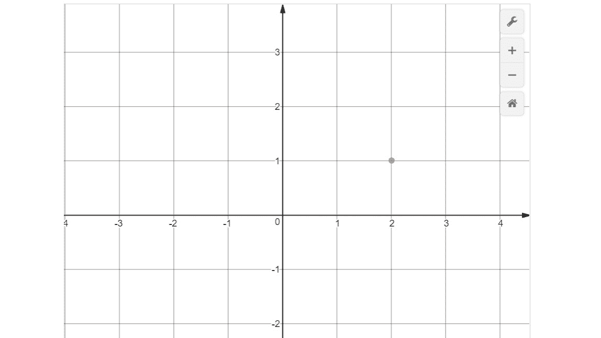

###### 图 3.1:点(2，1)在坐标系上的表示

一条直线可以用等式`y = a*x + b`来描述，其中 a 是等式的斜率，决定等式向上攀升的陡峭程度，b 是常数，决定直线与 Y 轴的交点

在下图中，您可以看到三个等式:

*   蓝线用 y = 2*x + 1 等式描述。
*   橙色线用 y = x + 1 方程描述。
*   紫线用 y = 0.5*x + 1 等式描述。

可以看到，这三个方程都与 y 轴相交于 1，它们的斜率由我们乘以 x 的因子决定。

如果你知道 x，你可以算出 y，如果你知道 y，你可以算出 x:

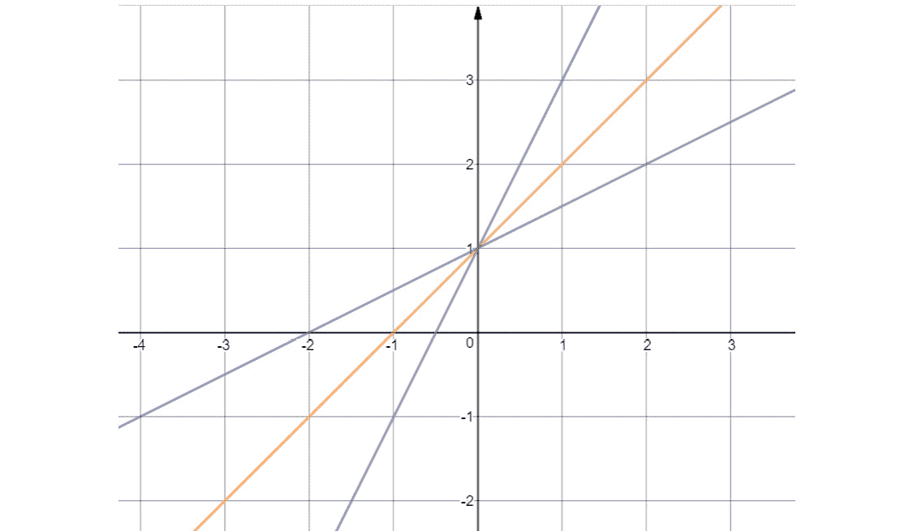

###### 图 3.2:y = 2 * x+1、y = x + 1 和 y = 0.5*x + 1 在坐标系中的表示

我们也可以用方程描述更复杂的曲线:

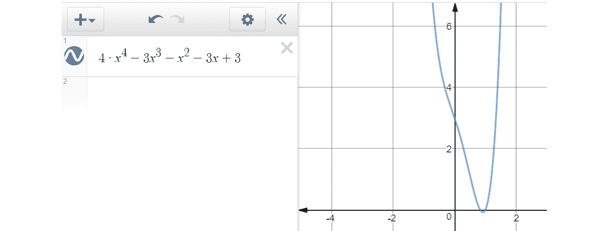

###### 图 3.3:显示复杂曲线的图像

#### 注意

如果你想用笛卡尔坐标系做更多的实验，你可以使用下面的绘图仪:[https://S3-us-west-2 . amazonaws . com/oer files/College+Algebra/calculator . html](https://s3-us-west-2.amazonaws.com/oerfiles/College+Algebra/calculator.html)。

### 功能和标签

在机器学习中，我们区分特征和标签。特征被认为是我们的输入变量，标签是我们的输出变量。

当谈到回归时，标签的可能值是一组连续的有理数。

将要素视为 X 轴上的值，将标注视为 Y 轴上的值。

回归的任务是根据特征值预测标注值。我们通常通过向前移动特性的值来创建标签。例如，如果我们想预测 1 个月后的股票价格，并且我们通过将 1 个月后的股票价格特征转移到未来来创建标签，那么:

*   对于至少 1 个月前的每个股票价格特征值，可以使用训练数据来显示未来 1 个月的预测股票价格数据
*   对于上个月，预测数据不可用，所以这些值都是 NaN(不是数字)

我们必须删除上个月，因为我们不能使用这些值进行预测。

### 特征缩放

有时，我们有多个特性，它们的值可能在完全不同的范围内。想象一下将地图上的微米与现实世界中的千米进行比较。由于九个零的大小差异，它们不容易处理。

一个不太明显的区别是英制和公制数据之间的差异。磅和千克，厘米和英寸，不能比较。

因此，我们通常将我们的特征缩放到更容易处理的归一化值，因为我们可以更容易地比较这个范围的值。我们一起扩展训练和测试数据。范围通常在[-1；1].

我们将演示两种类型的缩放:

*   最小-最大归一化
*   均值归一化

最小-最大缩放的计算方法如下:

```
x_scaled[n] = (x[n] - min(x)) / (max(x)-min(x))
```

均值归一化的计算方法如下:

```
avg = sum(x) / len(x)
x_scaled[n] = (x[n] – avg) / (max(x)-min(x))
 [(float(i)-avg)/(max(fibonacci)-min(fibonacci)) for i in fibonacci]
```

以下是最小-最大值和最小-最大值的示例:

```
fibonacci = [0, 1, 1, 2, 3, 5, 8, 13, 21, 34, 55, 89, 144]
# Min-Max scaling:
[(float(i)-min(fibonacci))/(max(fibonacci)-min(fibonacci)) for i in fibonacci]
[0.0,
 0.006944444444444444,
 0.006944444444444444,
 0.013888888888888888,
 0.020833333333333332,
 0.034722222222222224,
 0.05555555555555555,
 0.09027777777777778,
 0.14583333333333334,
 0.2361111111111111,
 0.3819444444444444,
 0.6180555555555556,
 1.0]
# Mean normalization:
avg = sum(fibonacci) / len(fibonacci)
# 28.923076923076923
[(float(i)-avg)/(max(fibonacci)-min(fibonacci)) for i in fibonacci]
[-0.20085470085470086,
 -0.19391025641025642,
 -0.19391025641025642,
 -0.18696581196581197,
 -0.18002136752136752,
 -0.16613247863247863,
 -0.1452991452991453,
 -0.11057692307692307,
 -0.05502136752136752,
 0.035256410256410256,
 0.18108974358974358,
 0.4172008547008547,
 0.7991452991452992]
```

缩放可能会增加处理时间，但通常这是一个明智的步骤。

在 scikit-learn 库中，我们可以访问扩展 NumPy 数组的函数:

```
import numpy as np
from sklearn import preprocessing
preprocessing.scale(fibonacci)
array([-0.6925069 , -0.66856384, -0.66856384, -0.64462079, -0.62067773,
       -0.57279161, -0.50096244, -0.38124715, -0.18970269,  0.12155706,
        0.62436127,  1.43842524,  2.75529341])
```

缩放方法执行均值归一化。请注意，结果是一个 NumPy 数组。

### 用训练和测试数据进行交叉验证

交叉验证衡量统计模型的预测性能。交叉验证的结果越好，你就越能相信你的模型可以用来预测未来。

在交叉验证期间，我们测试我们的模型在真实的测试数据上预测未来的能力。预测过程中不使用测试数据。

**训练数据**用于构建预测我们结果的模型。

一旦我们从数据源加载数据，我们通常会将数据分成较大的训练数据块和较小的测试数据块。这种分离随机打乱了训练和测试数据的条目。然后，它给你一系列的训练特性，它们对应的训练标签，测试特性，以及它们对应的测试标签。

我们可以使用 scikit-learn 的`model_selection`库进行训练-测试分割。

假设在我们的虚拟示例中，我们将斐波那契数据及其指数缩放为标签:

```
features = preprocessing.scale(fibonacci)
label = np.array(range(13))
```

我们用 10%的数据作为测试数据。

```
from sklearn import model_selection
(x_train, x_test, y_train, y_test) = 
model_selection.train_test_split(features, label, test_size=0.1)
x_train
array([-0.66856384,  0.12155706, -0.18970269, -0.64462079,  1.43842524,
        2.75529341, -0.6925069 , -0.38124715, -0.57279161, -0.62067773,
       -0.66856384])
x_test
array([-0.50096244,  0.62436127])
y_train
array([1, 9, 8, 3, 11, 12, 0, 7, 5, 4, 2])
y_test
array([6, 10])
```

在训练和测试中，如果我们得到的比率是错误的，我们就有过度拟合或欠拟合模型的风险。

当我们对模型训练得太好，并且它与训练数据集拟合得太好时，就会发生过度拟合。该模型在训练数据上非常准确，但在现实生活中不可用，因为当用于任何其他数据时，其准确性会降低。该模型根据训练数据中的随机噪声进行调整，并假定该噪声的模式会产生错误的预测。当模型与训练数据的拟合度不足以识别数据的重要特征时，就会出现欠拟合。因此，它无法对新数据做出必要的预测。例如，当我们试图对非线性数据进行线性回归时。例如，斐波那契数列不是线性的，因此，类似斐波那契数列的模型也不可能是线性的。

#### 注意

如果你记得笛卡尔坐标系，你知道横轴是 X 轴，纵轴是 Y 轴。我们的特征在 X 轴上，而标签在 Y 轴上。所以我们把特征和 X 作为同义词，而标签往往用 y 来表示，所以 x_test 表示特征测试数据，x_train 表示特征训练数据，y_test 表示标签测试数据，y_train 表示标签训练数据。

### 用 scikit-learn 拟合数据模型

我们在一个虚拟的例子上说明回归的过程，其中我们只有一个特征和非常有限的数据。

因为我们只有一个特性，所以我们必须通过用`x_train.reshape (-1,1)`将`x_train`整形为包含一个特性的 NumPy 数组来格式化它。

因此，在执行拟合最佳直线的代码之前，请执行以下代码:

`x_train = x_train.reshape(-1, 1)`

`x_test = x_test.reshape(-1, 1)`

`# array([a, b, c]).reshape(-1, 1) becomes:`

`# array([[a, b, c]])`

假设我们有特征和标签的训练和测试数据。

我们可以根据这些数据建立一个模型来进行预测。为此，我们现在将使用线性回归:

```
from sklearn import linear_model
linear_regression = linear_model.LinearRegression()
model = linear_regression.fit(x_train, y_train)
model.predict(x_test)
array([4.16199119, 7.54977143])
```

我们还可以计算与模型相关的分数:

```
model.score(x_test, y_test)
-0.17273705326696565
```

这个分数是均方误差，代表模型的准确性。它代表了我们根据标注预测特征的能力。

这个数字表明型号很差。可能的最高分是 1.0。如果我们通过忽略特征来不断预测标签，则可以获得 0.0 分。在本书中我们将省略这个分数的数学背景。

我们的模型表现不佳有两个原因:

*   11 训练数据和 2 测试数据根本不足以执行适当的预测分析。
*   即使我们忽略点的数量，斐波纳契`x -> y`函数也不会描述 x 和 y 之间的线性关系。用直线逼近非线性函数只有在我们非常接近训练区间时才有用。

未来我们会看到很多更精确的模型，甚至可能达到 0.9 的模型分数。

### 使用 NumPy 数组的线性回归

NumPy 数组比 Python 列表更方便的一个原因是它们可以被视为向量。有一些定义在向量上的运算可以简化我们的计算。我们可以对相似长度的向量进行运算。两个向量的和与(向量)积等于一个向量，其中每个坐标是相应坐标的和或(向量)积。

例如:

```
import numpy as np
v1 = np.array([1,2,3])
v2 = np.array([2,0,2])
v1 + v2  # array([3, 2, 5])
v1 * v2   # array([2, 0, 6])
```

向量和标量的乘积是向量，其中每个坐标乘以标量:

```
v1 * 2 # array([2, 4, 6])
```

向量的二次幂等于向量与其自身的矢量积。双星号表示超级运算符:

```
v1 ** 2 # array([1, 4, 9], dtype=int32)
```

假设我们在平面上有一组点。我们的工作是找到最佳拟合线。

我们来看两个例子。

我们的第一个例子包含 13 个看似线性的值。我们正在绘制以下数据:

```
[2, 8, 8, 18, 25, 21, 32, 44, 32, 48, 61, 45, 62]
```

如果你想画一条最接近这些点的线，你的猜测会非常接近现实:

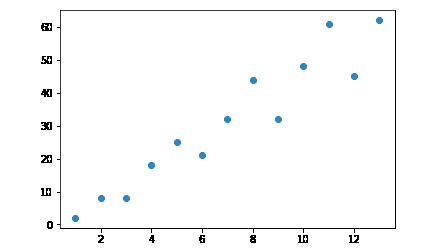

###### 图 3.4:绘制的数值图[2，8，8，18，25，21，32，44，32，48，61，45，62]

我们的第二个例子是缩放后的 Fibonacci 序列的前 13 个值。尽管我们可以定义一条最接近这些点的直线，但从这些点的分布可以看出，我们的模型不会太有用:

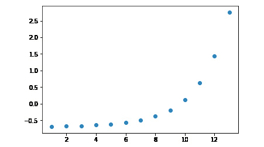

###### 图 3.5:斐波纳契值的曲线图

我们已经学过什么是直线方程:`y = a * x + b`

在这个等式中，`a`是斜率，`b`是`y`-截距。为了找到最佳拟合线，我们必须找到系数`a`和`b`。

我们的工作是最小化距离最佳拟合线的距离总和。

在本书中，我们将省去计算系数`a`和`b`背后的思考过程，因为你会发现它几乎没有实际用途。我们宁愿利用平均值作为列表中值的算术平均值。为此我们可以使用 NumPy 提供的均值函数。

让我们找出最适合这两个例子的直线:

```
import numpy as np
from numpy import mean
x = np.array(range(1, 14))
y = np.array([2, 8, 8, 18, 25, 21, 32, 44, 32, 48, 61, 45, 62])
a = (mean(x)*mean(y) - mean(x*y)) / (mean(x) ** 2 - mean( x ** 2 ))
4.857142857142859
b = mean(y) - a*mean(x)
-2.7692307692307843
```

一旦我们用前面的系数画出线 y = a*x + b，我们得到下面的图形:

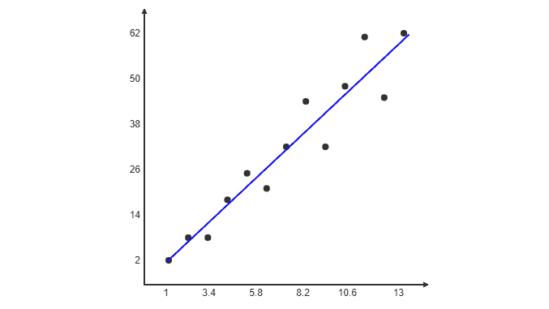

###### 图 3.6:数组值[2，8，8，18，25，21，32，44，32，48，61，45，62]和直线 y=a*x+b 的曲线图

#### 注意

你可以在 http://www.endmemo.com/statistics/lr.php 找到一个线性回归计算器。您还可以查看计算器，了解给定数据集上最佳拟合线的样子。

关于比例斐波纳契值，最佳拟合线如下所示:

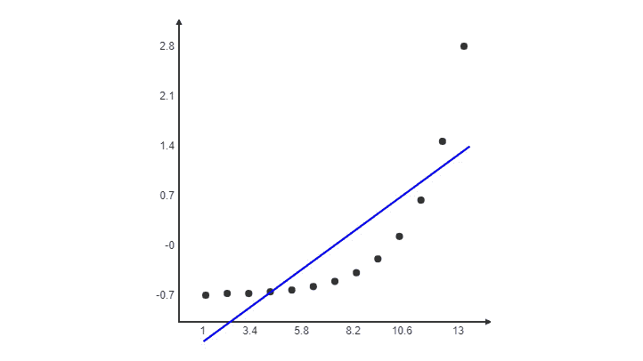

###### 图 3.7:显示斐波纳契值和线 y=a*x+b 的曲线图

第二数据集的最佳拟合线从训练区间之外的任何地方都明显显得更加偏离。

#### 注意

我们不一定要用这个方法来进行线性回归。许多库，包括 scikit-learn，将帮助我们自动化这个过程。一旦我们对多个变量执行线性回归，我们最好使用一个库来执行回归。

### 使用 NumPy Polyfit 拟合模型

NumPy Polyfit 也可用于创建一个变量的线性回归的最佳拟合线。

回想最佳拟合线的计算:

```
import numpy as np
from numpy import mean
x = np.array(range(1, 14))
y = np.array([2, 8, 8, 18, 25, 21, 32, 44, 32, 48, 61, 45, 62])
a = (mean(x)*mean(y) - mean(x*y)) / (mean(x) ** 2 - mean( x ** 2 ))
4.857142857142859
b = mean(y) - a*mean(x)
-2.7692307692307843
```

求系数 a 和 b 的方程相当长。幸运的是，`numpy.polyfit`执行这些计算来找到最佳拟合线的系数。`polyfit`函数接受三个参数:`x`值的数组、`y`值的数组和要寻找的多项式次数。正如我们在寻找一条直线一样，`x`的最高幂是多项式中的 1:

```
import numpy as np
x = np.array(range(1, 14))
y = np.array([2, 8, 8, 18, 25, 21, 32, 44, 32, 48, 61, 45, 62])
[a, b] = np.polyfit(x, y, 1)
[4.857142857142858, -2.769230769230769]
```

用 Python 绘制结果

假设你有一组数据点和一条回归线。我们的任务是将点和线一起绘制出来，以便我们可以亲眼看到结果。

为此，我们将使用`matplotlib.pyplot`库。这个库有两个重要的功能:

*   **分散:**显示平面上分散的点，由 x 坐标列表和 y 坐标列表定义。
*   **绘图:**连同两个参数，该函数绘制由两个点定义的线段，或由多个点定义的一系列线段。绘图类似于散点图，不同之处在于它不是显示点，而是用线将点连接起来。

具有三个参数的图绘制根据第三个参数格式化的线段和/或两点

线段由两点定义。由于`x`的范围在 1 和 14 之间，所以显示 0 和 15 之间的段是有意义的。我们必须将`x`的值代入`a*x+b`方程，得到相应的`y`值:

```
import matplotlib.pyplot as plot
x = np.array(range(1, 14))
y = np.array([2, 8, 8, 18, 25, 21, 32, 44, 32, 48, 61, 45, 62])
a = (mean(x)*mean(y) - mean(x*y)) / (mean(x) ** 2 - mean(x ** 2))
4.857142857142859
b = mean(y) - a*mean(x)
-2.7692307692307843
# Plotting the points
plot.scatter(x, y)
# Plotting the line
plot.plot([0, 15], [b, 15*a+b])
```

输出如下所示:

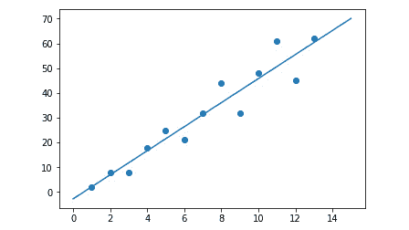

###### 图 3.8:显示数据点如何拟合回归线的图表

您可能需要调用`plot.show()`来显示前面的图形。在 IPython 控制台中，坐标系会自动显示出来。

片段和分散的数据点按预期显示。

Plot 有一个高级签名。您可以使用一个 plot 调用在该图上绘制分散的点、线和任何曲线。这些变量分为三组进行解释:

*   x 值
*   y 值
*   字符串形式的格式化选项

让我们创建一个函数，用于从一个近似 x 值数组中导出一个近似 y 值数组:

```
def fitY( arr ):
    return [4.857142857142859 * x - 2.7692307692307843 for x in arr]
```

我们将使用`fit`函数来绘制值:

```
plot.plot( 
    x, y, 'go',
    x, fitY(x), 'r--o'
)
```

输出如下所示:

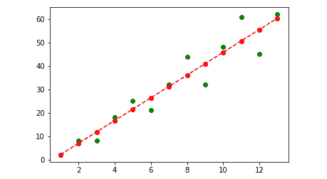

###### 图 3.9:使用拟合函数的绘图函数的图形

Python 绘图仪库为大多数绘图问题提供了一个简单的解决方案。你可以在这张图上画任意多的线、点和曲线。

每三个变量负责格式化。字母 g 代表绿色，而字母 r 代表红色。你可以用 b 代表蓝色，y 代表黄色，以此类推。如果没有颜色，每个三元组将使用不同的颜色显示。o 字符表示我们希望在每个数据点所在的位置显示一个点。因此，“go”与运动无关，它要求绘图仪绘制绿点。“-”字符负责显示虚线。如果你只用一个减号，会出现一条直线而不是虚线。

如果我们简化这种格式，我们可以指定我们只想要任意颜色的点，和另一种任意颜色的直线。通过这样做，我们可以简单地编写下面的情节调用:

```
plot.plot( 
    x, y, 'o',
    x, fitY(x), '-'
)
```

输出如下所示:

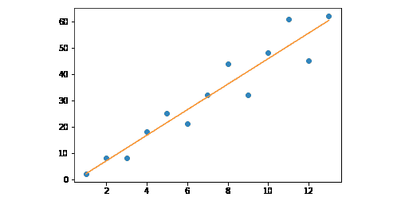

###### 图 3.10:带虚线的绘图函数图

显示曲线时，绘图仪用线段连接点。此外，请记住，即使是复杂的曲线序列也是连接点的近似值。例如，如果你执行来自[https://gist.github.com/traeblain/1487795](https://gist.github.com/traeblain/1487795)的代码，你会发现蝙蝠侠功能的片段是相互连接的:

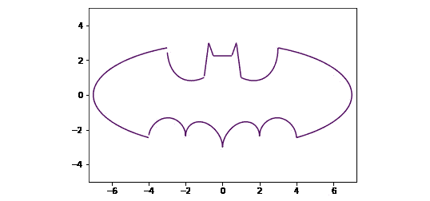

###### 图 3.11:蝙蝠侠函数图

有很多种绘制曲线的方法。我们已经看到 NumPy 库的`polyfit`方法返回一个系数数组来描述一个线性方程:

```
import numpy as np
x = np.array(range(1, 14))
y = np.array([2, 8, 8, 18, 25, 21, 32, 44, 32, 48, 61, 45, 62])
np.polyfit(x, y, 1)
# array([ 4.85714286, -2.76923077])
```

这个数组描述了等式`4.85714286 * x - 2.76923077`。

假设我们现在想画一条曲线，`y = -x**2 + 3*x - 2`。这个二次方程由系数数组`[-1, 3, -2].`描述，我们可以写自己的函数来计算属于 x 值的 y 值。然而，NumPy 库已经有了一个特性来为我们做这项工作:`np.poly1d`:

```
import numpy as np
x = np.array(range( -10, 10, 0.2 ))
f = np.poly1d([-1,3,-2])
```

poly1d 调用创建的 f 函数不仅可以处理单个值，还可以处理列表或 NumPy 数组:

```
f(5)
# -12
f(x)
# array([-132, -110,  -90,  -72,  -56,  -42,  -30,  -20,  -12,   -6,   -2, 0,    0,   -2,   -6,  -12,  -20,  -30,  -42,  -56])
```

我们现在可以使用这些值来绘制一条非线性曲线:

```
import matplotlib.pyplot as plot
plot.plot(x, f(x))
```

输出如下所示:

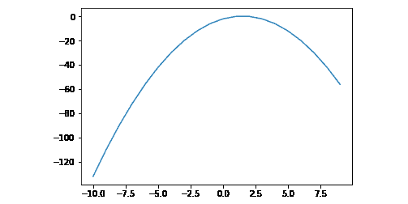

###### 图 3.12:py plot 函数的图形

### 用线性回归预测值

假设我们对属于`x`坐标`20`的`y`值感兴趣。基于线性回归模型，我们需要做的就是用`20`的值代替`x`:

```
# Plotting the points
plot.scatter(x, y)
# Plotting the prediction belonging to x = 20
plot.scatter(20, a * 20 + b, color='red')
# Plotting the line
plot.plot([0, 25], [b, 25*a+b])
```

输出如下所示:

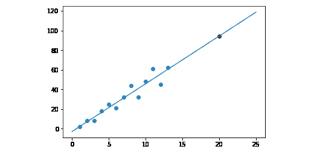

###### 图 3.13:使用线性回归显示预测值的图表

这里，我们用红色表示预测值。这个红点在最佳拟合线上。

### 活动 5:预测人口

你在大都会的政府办公室工作，试图预测对小学容量的需求。你的任务是预测 2025 年和 2030 年开始上小学的儿童人数。过去的数据如下:

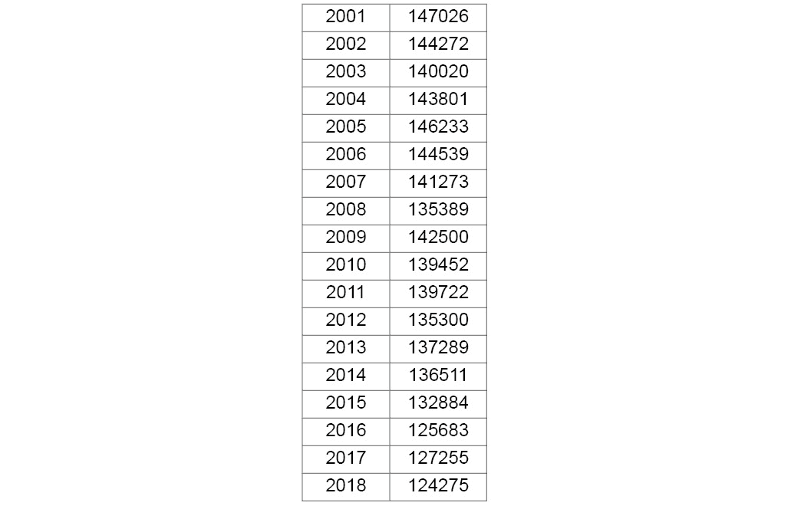

###### 图 3.14:2001 年至 2018 年开始上小学的儿童人数表

将这些趋势绘制在二维图表上。为此，您必须:

1.  使用线性回归。特征是从 2001 年到 2018 年。为简单起见，我们可以将 2001 年表示为第 1 年，将 2018 年表示为第 18 年。
2.  使用`np.polyfit`确定回归线的系数。
3.  Plot the results using `matplotlib.pyplot` to determine future tendencies.

    #### 注意

    这项活动的解决方案在第 269 页。

## 多元线性回归

在上一个主题中，我们讨论了一元线性回归。现在我们将学习线性回归的扩展版本，其中我们将使用多个输入变量来预测输出。

我们将依靠加载和预测股票价格的例子。因此，我们将试验用于加载股票价格的主要库。

### 多元线性回归

如果您还记得线性回归中最佳拟合直线的公式，它被定义为`y = a*x + b`，其中`a`是直线的斜率，`b`是直线的 y 截距，`x`是特征值， `y`是计算的标签值。

在多元回归中，我们有多个特征和一个标签。假设我们有三个特征，`x1`、`x2`和`x3`，我们的模型变化如下:

```
y = a1 * x1 + a2 * x2 + a3 * x3 + b
```

在 NumPy 数组格式中，我们可以将该等式写成如下形式:

```
y = np.dot(np.array([a1, a2, a3]), np.array([x1, x2, x3])) + b
```

为了方便起见，用向量乘法的形式来定义整个方程是有意义的。`b`的系数将会是`1`:

```
y = np.dot(np.array([b, a1, a2, a3]) * np.array([1, x1, x2, x3]))
```

多元线性回归是两个向量的简单标量积，其中系数`b`、`a1`、`a2`和`a3`确定四维空间中的最佳拟合方程。

为了理解多元线性回归的公式，你需要两个向量的标量积。由于标量积的另一个名称是点积，执行此运算的 NumPy 函数称为点:

`import numpy as np`

`v1 = [1, 2, 3]`

`v2 = [4, 5, 6]`

`np.dot( v1, v2 ) = 1 * 4 + 2 * 5 + 3 * 6 = 32`

我们简单地对每个坐标的乘积求和。

我们可以通过最小化数据点和方程描述的最近点之间的误差来确定这些系数。为简单起见，我们将省略最佳拟合方程的数学解，而使用 scikit-learn。

#### 注意

在 n 维空间中，n 大于 3，维数决定了模型中的不同变量。在前面的示例中，我们有三个要素和一个标签。这产生了四个维度。如果你想想象一个四维空间，为了简化可以想象三维空间和时间。五维空间可以想象成四维空间，其中每个时间点都有温度。维度只是特征(和标签)；它们不一定与我们的三维空间概念相关。

### 线性回归的过程

我们将遵循以下简单的步骤来解决线性回归问题:

1.  从数据源加载数据。
2.  为预测准备数据(标准化、格式化、过滤)。
3.  计算回归线的参数。不管我们是使用一元线性回归还是多元线性回归，我们都将遵循这些步骤。

### 从数据源导入数据

有多个库可以为我们提供对数据源的访问。因为我们将使用股票数据，所以让我们讨论两个适合检索金融数据的例子，Quandl 和 Yahoo Finance:

*   scikit-learn 附带了一些数据集，可用于练习您的技能。
*   [Quandl.com](http://Quandl.com)为您提供免费和付费的金融数据集。
*   [pandas.io](http://pandas.io) 帮你装载任何。csv，。excel，。json 或 SQL 数据。
*   雅虎财经为您提供金融数据集。

### 用雅虎财经载入股票价格

用 Yahoo Finance 加载股票数据的过程非常简单。您只需在 CLI 中使用以下命令安装 fix_yahoo_finance 软件包:

```
pip install fix_yahoo_finance
```

从 2015 年开始，我们将下载一个数据集，其中包含标准普尔 500 指数的开盘、盘高、盘低、收盘、调整收盘和成交量值:

```
import fix_yahoo_finance as yahoo
spx_data_frame = yahoo.download("^GSPC", "2015-01-01")
```

这就是你需要做的。包含标准普尔 500 指数的数据框准备就绪。

您可以使用绘图方法绘制指数价格:

```
spx_data_frame.Close.plot()
```

输出如下所示:

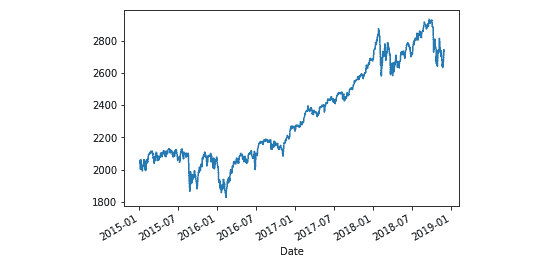

###### 图 3.15:显示雅虎财经股价的图表

也可以使用以下命令将数据保存到 CSV 文件中:

```
spx.to_csv("spx.csv")
```

### 用熊猫加载文件

假设给出了一个包含股票数据的 CSV 文件。我们现在将使用 pandas 从该文件加载数据:

```
import pandas as pd
spx_second_frame = pd.read_csv("spx.csv", index_col="Date", header=0, parse_dates=True)
```

为了正确解析数据，我们必须设置索引列名，指定没有标题，并确保日期被解析为日期。

### 用 Quandl 加载股票价格

Quandl.com 是金融和经济数据集的可靠来源。

### 练习 8:使用 Quandl 加载股票价格

1.  打开 Anaconda 提示符并使用以下命令安装 Quandl:

    ```
    pip install quandl
    ```

2.  去 https://www.quandl.com/。
3.  点击财务数据。
4.  在过滤器中，点击**空闲**标签旁边的复选框。如果你订阅了 Quandl，你可以用它来下载股票数据。
5.  选择您想使用的股票或指数。对于我们的例子，我们将使用耶鲁大学经济系收集的 S&P 综合指数数据。这个链接是[https://www.quandl.com/data/YALE/SPCOMP-S-P-Composite](https://www.quandl.com/data/YALE/SPCOMP-S-P-Composite)。
6.  找到属于您想要载入的乐器的 Quandl ticker。我们对标准普尔 500 数据的 Quandl 代码是“`YALE/SPCOMP`”。
7.  从 Jupyter QtConsole 加载数据:

    ```
    import quandl
    data_frame = quandl.get("YALE/SPCOMP")
    ```

8.  导入值的所有列都是特性:

    ```
    data_frame.head()
    ```

9.  输出如下:

    ```
                S&P Composite  Dividend  Earnings        CPI  Long Interest Rate  \
    Year                                                                        
    1871-01-31           4.44      0.26       0.4  12.464061            5.320000   
    1871-02-28           4.50      0.26       0.4  12.844641            5.323333   
    1871-03-31           4.61      0.26       0.4  13.034972            5.326667   
    1871-04-30           4.74      0.26       0.4  12.559226            5.330000   
    1871-05-31           4.86      0.26       0.4  12.273812            5.333333   
                Real Price  Real Dividend  Real Earnings  \
    Year                                                   
    1871-01-31   89.900119       5.264421       8.099110   
    1871-02-28   88.415295       5.108439       7.859137   
    1871-03-31   89.254001       5.033848       7.744382   
    1871-04-30   95.247222       5.224531       8.037740   
    1871-05-31   99.929493       5.346022       8.224650   
                Cyclically Adjusted PE Ratio  
    Year                                      
    1871-01-31                           NaN  
    1871-02-28                           NaN  
    1871-03-31                           NaN  
    1871-04-30                           NaN  
    1871-05-31                           NaN  
                                     ...  
    2016-02-29                     24.002607  
    2016-03-31                     25.372299  
    ```

### 准备预测数据

在我们执行回归之前，我们必须选择我们感兴趣的特征，我们还必须找出我们进行回归的数据范围。

为预测准备数据是回归过程的第二步。这个步骤也有几个子步骤。我们将按照以下顺序完成这些子步骤:

1.  假设一个数据帧带有预加载的数据。
2.  从数据集中选择您感兴趣的列。
3.  用数值替换 NaN 值以避免删除数据。
4.  确定预测间隔 T，确定您希望在未来查看的时间量或数据行数。
5.  用您希望预测的值创建一个标签列。对于数据帧的第 I 行，标签的值应该属于时刻 i+T。
6.  对于最后 T 行，标签值是 NaN。从数据框中删除这些行。
7.  根据要素和标签创建 NumPy 数组。
8.  缩放特征数组。
9.  分离训练和测试数据。

一些特征彼此高度相关。例如，实际股息栏与实际价格成比例增长。它们之间的比率并不总是相似的，但它们确实相关。

由于回归不是检测特征之间的相关性，我们宁愿去掉一些我们知道是多余的属性，并对不相关的特征执行回归。

如果您已经学习了使用 Quandl 加载股票价格一节，那么您已经有了一个包含标准普尔 500 指数历史数据的数据框架。我们将保留长期利率、实际价格和实际股息列:

```
data_frame[['Long Interest Rate', 'Real Price', 'Real Dividend', 'Cyclically Adjusted PE Ratio']]
```

由于您不能处理 NaN 数据，您可以通过填充数字来代替 NaN。一般来说，你有两种选择:

*   去掉这些数据
*   用有意义的默认值替换数据

```
data_frame.fillna(-100, inplace=True)
```

我们可以通过使用`len`函数来检查数据帧的长度，如下面的代码所示:

```
len(data_frame)
1771
```

我们的数据帧的长度是 1771。

如果我们想预测未来 20 年的真实价格，我们必须预测 240 个值。这大约是数据帧长度的 15%,非常合理。

因此，我们将通过将实际价格值上移 240 个单位来创建一个实际价格标签:

```
data_frame['Real Price Label'] = data_frame['Real Price'].shift( -240 )
```

这样每一个真实的价格标签值都是 20 年后的真实价格值。

移动这些值的副作用是 NaN 值出现在最后 240 个值中:

```
data_frame.tail()
```

输出如下所示:

```

            S&P Composite  Dividend  Earnings       CPI  Long Interest Rate  \
Year                                                                          
2018-03-31        2702.77     50.00       NaN  249.5540               2.840   
2018-04-30        2653.63     50.33       NaN  250.5460               2.870   
2018-05-31        2701.49     50.66       NaN  251.5880               2.976   
2018-06-30        2754.35     50.99       NaN  252.1090               2.910   
2018-07-31        2736.61       NaN       NaN  252.3695               2.830   
             Real Price  Real Dividend  Real Earnings  \
Year                                                    
2018-03-31  2733.262995      50.564106            NaN   
2018-04-30  2672.943397      50.696307            NaN   
2018-05-31  2709.881555      50.817364            NaN   
2018-06-30  2757.196024      51.042687            NaN   
2018-07-31  2736.610000            NaN            NaN   
            Cyclically Adjusted PE Ratio  Real Price Label  
Year                                                        
2018-03-31                     31.988336               NaN  
2018-04-30                     31.238428               NaN  
2018-05-31                     31.612305               NaN  
2018-06-30                     32.091415               NaN  
2018-07-31                     31.765318               NaN
```

我们可以通过在数据帧上执行 dropna 来消除它们:

```
data_frame.dropna(inplace=True)
```

这样，我们就有了截至 1998 年 7 月的数据，并在实际价格标签列中有了截至 2018 年的未来值:

```
data_frame.tail()
```

输出如下所示:

```

            S&P Composite  Dividend  Earnings    CPI  Long Interest Rate  \
Year                                                                       
1998-03-31        1076.83   15.6400   39.5400  162.2                5.65   
1998-04-30        1112.20   15.7500   39.3500  162.5                5.64   
1998-05-31        1108.42   15.8500   39.1600  162.8                5.65   
1998-06-30        1108.39   15.9500   38.9700  163.0                5.50   
1998-07-31        1156.58   16.0167   38.6767  163.2                5.46   
             Real Price  Real Dividend  Real Earnings  \
Year                                                    
1998-03-31  1675.456527      24.334519      61.520900   
1998-04-30  1727.294510      24.460428      61.112245   
1998-05-31  1718.251850      24.570372      60.705096   
1998-06-30  1716.097117      24.695052      60.336438   
1998-07-31  1788.514193      24.767932      59.808943   
            Cyclically Adjusted PE Ratio  Real Price Label  
Year                                                        
1998-03-31                     36.296928       2733.262995  
1998-04-30                     37.276934       2672.943397  
1998-05-31                     36.956599       2709.881555  
1998-06-30                     36.802293       2757.196024  
1998-07-31                     38.259645       2736.610000  
```

让我们为回归准备我们的特征和标签。

对于要素，我们将使用数据框的 drop 方法。drop 方法返回一个不包含被删除列的新数据框:

```
import numpy as np
features = np.array(data_frame.drop('Real Price Label', 1))
label = np.array(data_frame['Real Price Label'])
```

第二个参数中的 1 指定我们要删除列。由于原始数据帧未被修改，因此可以直接从中提取标签。

现在是时候使用 Scikit Learn 的预处理模块来扩展特性了:

```
from sklearn import preprocessing
scaled_features = preprocessing.scale(features)
features
array([[6.19000000e+00, 2.65000000e-01, 4.85800000e-01, ...,
        7.10000389e+00, 1.30157807e+01, 1.84739523e+01],
       [6.17000000e+00, 2.70000000e-01, 4.81700000e-01, ...,
        7.16161179e+00, 1.27768459e+01, 1.81472582e+01],
       [6.24000000e+00, 2.75000000e-01, 4.77500000e-01, ...,
        7.29423423e+00, 1.26654431e+01, 1.82701191e+01],
       ...,
       [1.10842000e+03, 1.58500000e+01, 3.91600000e+01, ...,
        2.45703721e+01, 6.07050959e+01, 3.69565985e+01],
       [1.10839000e+03, 1.59500000e+01, 3.89700000e+01, ...,
        2.46950523e+01, 6.03364381e+01, 3.68022935e+01],
       [1.15658000e+03, 1.60167000e+01, 3.86767000e+01, ...,
        2.47679324e+01, 5.98089427e+01, 3.82596451e+01]])
scaled_features
array([[-0.47564285, -0.62408514, -0.57496262, ..., -1.23976862,
        -0.84099698,  0.6398416 ],
       [-0.47577027, -0.62273749, -0.5754623 , ..., -1.22764677,
        -0.85903686,  0.57633607],
       [-0.47532429, -0.62138984, -0.57597417, ..., -1.20155224,
        -0.86744792,  0.60021881],
       ...,
       [ 6.54690076,  3.57654404,  4.13838295, ...,  2.19766676,
         2.75960615,  4.23265262],
       [ 6.54670962,  3.60349707,  4.11522706, ...,  2.22219859,
         2.73177202,  4.20265751],
       [ 6.85373845,  3.62147473,  4.07948167, ...,  2.23653834,
         2.69194545,  4.48594968]])
```

如您所见，缩放后的特征更易于阅读和解释。在缩放数据时，我们必须一起缩放所有数据，包括训练和测试数据。

### 执行并验证线性回归

既然缩放已经完成，我们的下一个任务是将训练和测试数据相互分离。我们将使用 90%的数据作为训练数据，其余的(10%)将用作测试数据:

```
from sklearn import model_selection
(features_train, features_test, label_train, label_test) = 
    model_ selection.train_test_split(
        scaled_features, label, test_size=0.1
    )
```

train_test_split 函数打乱了我们的数据行，保持了一致性，并将所有数据的大约 10%放入测试变量中，将 90%放入训练变量中。这将帮助我们评估我们的模型有多好。

我们现在可以根据训练数据创建线性回归模型:

```
from sklearn import linear_model
model = linear_model.LinearRegression()
model.fit(features_train, label_train)
```

一旦模型准备好了，我们就可以用它来预测属于测试特征值的标签:

```
label_predicted = model.predict(features_test)
```

如果您对预测特征值和精确测试特征值之间的关系感兴趣，可以使用 Python 二维绘图仪实用程序绘制它们:

```
from matplotlib import pyplot as plot
plot.scatter(label_test, label_predicted)
```

这为您提供了一个图表图像，其中测试数据与预测结果进行了比较。这些值越接近`y = x`线越好。

从下图中可以看出，预测确实以`y=x`线为中心，存在一定程度的误差。这个错误是显而易见的，否则，我们将能够通过这样一个简单的预测赚很多钱，每个人都将追求预测股票价格，而不是在自己的专业领域工作:

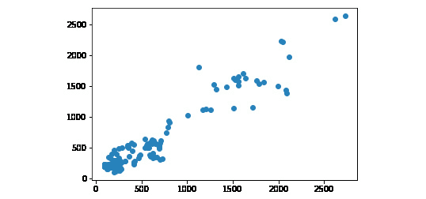

###### 图 3.16:散点图函数图

我们可以断定这个模型有一定程度的误差。问题是，我们如何量化这个误差？答案很简单:我们可以使用计算模型均方差的内置实用程序对模型进行评分:

```
model.score(features_test, label_test)
0.9051697119010782
```

我们可以断定这个模型非常准确。这并不奇怪，因为每一个金融顾问骗子都倾向于告诉我们，这个市场每年增长 6-7%左右。这是一个线性增长，该模型基本上预测市场将继续以线性速度增长。得出市场长期会上涨的结论并不是火箭科学。

### 预测未来

我们已经对测试数据进行了预测。现在，是时候用实际数据来展望未来了。

```
import quandl
import numpy as np
from sklearn import preprocessing
from sklearn import model_selection
from sklearn import linear_model
data_frame = quandl.get("YALE/SPCOMP")
data_frame[['Long Interest Rate', 'Real Price', 'Real Dividend', 'Cyclically Adjusted PE Ratio']]
data_frame.fillna(-100, inplace=True)
data_frame['Real Price Label'] = data_frame['Real Price'].shift(-240)
data_frame.dropna(inplace=True)
features = np.array(data_frame.drop('Real Price Label', 1))
label = np.array(data_frame['Real Price Label'])
scaled_features = preprocessing.scale(features)
(features_train, features_test, label_train, label_test) = 
    model_ selection.train_test_split(
        scaled_features, label, test_size=0.1
    )
model = linear_model.LinearRegression()
model.fit(features_train, label_train)
label_predicted = model.predict(features_test)
```

预测未来的诀窍在于，我们必须保存属于我们在构建模型时丢弃的值的值。我们根据 20 年前的历史数据建立了股票价格模型。现在，我们必须保留这些数据，而且我们还必须在扩展中包括这些数据:

```
import quandl
import numpy as np
from sklearn import preprocessing
from sklearn import model_selection
from sklearn import linear_model
data_frame = quandl.get("YALE/SPCOMP")
data_frame[['Long Interest Rate', 'Real Price', 'Real Dividend', 'Cyclically Adjusted PE Ratio']]
data_frame.fillna(-100, inplace=True)
# We shift the price data to be predicted 20 years forward
data_frame[ 'Real Price Label'] = data_frame['Real Price'].shift(-240)
# Then exclude the label column from the features
features = np.array(data_frame.drop('Real Price Label', 1))
# We scale before dropping the last 240 rows from the
# features
scaled_features = preprocessing.scale(features)
# Save the last 240 rows before dropping them
scaled_features_latest_240 = scaled_features[-240:] 
# Exclude the last 240 rows from the data used for model
# building
scaled_features = scaled_features[:-240]
# Now we can drop the last 240 rows from the data frame
data_frame.dropna(inplace=True)
# Then build the labels from the remaining data
label = np.array(data_frame['Real Price Label'])
# The rest of the model building stays
(features_train, features_test, label_train, label_test) = 
    model_ selection.train_test_split(
        scaled_features, label, test_size=0.1
    )
model = linear_model.LinearRegression()
model.fit(features_train, label_train)
```

既然我们已经获得了过去 20 年的特征的比例值，我们现在可以使用以下代码预测未来 20 年的指数价格:

```
label_predicted = model.predict(scaled_features_latest_240) 
```

这在理论上听起来很棒，但在实践中，利用这种模式通过对预测下注来赚钱，绝不比在赌场赌博好。这只是一个用于说明预测的示例模型；用于市场价格的短期或长期投机，肯定是不够的。

如果你看看这些数值，你就会明白为什么这个预测很容易适得其反。第一，有几个负值，对于指数来说是不可能的。然后，由于一些重大的市场崩溃，线性回归预测了未来的一个点，即指数将在一年内从 3000 多点下降到几乎为零。基于有限的数据，线性回归并不是预测未来 20 年的完美工具。此外，请注意，股票价格意味着接近时间不变系统。这意味着过去并不意味着未来的任何模式。

让我们输出属于前十年的预测:

```
from matplotlib import pyplot as plot
plot.plot(list(range(1,241)), label_predicted[:240])
```

输出如下所示:

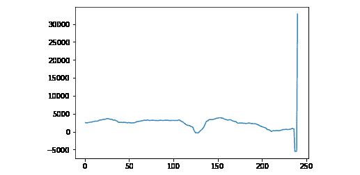

###### 图 3.17:范围为 1 到 241 且标签预测为 240 的绘图函数的图形

由于极端值，该图在接近末尾时难以阅读。让我们忽略过去的五年，只画出预测的前 180 个月，得出我们的结论:

```
plot.plot(list(range(1,181)), label_predicted[:180])
```

输出如下所示:

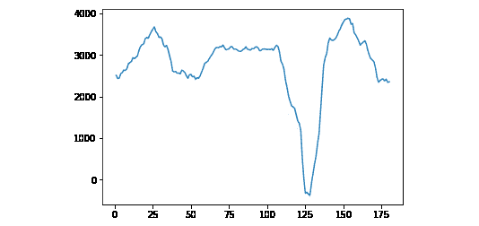

###### 图 3.18:范围为 1 到 181 且标签预测为 180 的绘图函数的图形

这对美国经济来说是一个可怕的未来。根据这个模型，标准普尔 500 有一个大约 2.5-3 年的牛市，并且在很长一段时间内不会恢复。另外，请注意，我们的模型不知道索引值不能为负。

## 多项式和支持向量回归

在执行多项式回归时，x 和 y 之间的关系，或者使用它们的其他名称、特征和标签，不是线性方程，而是多项式方程。这意味着代替`y = a*x+b`方程，我们可以在方程中有多个系数和 x 的多个幂。

让事情变得更复杂的是，我们可以使用多个变量执行多项式回归，其中每个特征可能具有乘以该特征的不同幂的系数。

我们的任务是找到一条最适合我们数据集的曲线。一旦多项式回归扩展到多个变量，我们将学习支持向量机模型来执行多项式回归。

### 一元多项式回归

概括地说，到目前为止，我们已经执行了两种类型的回归:

*   简单线性回归:`y = a*x + b`
*   多元线性回归:`y = b + a1 * x1 + a2 * x2 + … + an * xn`

我们现在将学习如何用一个变量进行多项式线性回归。多项式线性回归的方程式如下:

```
y = b + a1*x + a2*(x ** 2) + a3*(x ** 3) + … + an * (x ** n)
```

将系数向量`(b, a1, a2, …, an)`乘以多项式中 x 的次数向量`(1, x**1, x**2, …, x**n)`。

有时，多项式回归比线性回归效果更好。如果标注和要素之间的关系可以使用线性方程来描述，那么使用线性方程就非常有意义。如果我们有一个非线性增长，多项式回归往往会更好地逼近要素和标注之间的关系。

单变量线性回归最简单的实现是 NumPy 库的`polyfit`方法。在下一个练习中，我们将执行次数为 2 和 3 的多元多项式线性回归。

#### 注意

即使我们的多项式回归有一个包含系数 x ** n 的方程，这个方程在文献中仍然被称为多项式线性回归。回归是线性的，不是因为我们限制在方程中使用 x 的高次幂，而是因为系数 a1，a2，…等在方程中是线性的。这意味着我们使用线性代数的工具集，并使用矩阵和向量来寻找使近似误差最小化的缺失系数。

### 练习 9:一次、二次和三次多项式回归

对以下两个数据集执行一次、二次和三次多项式回归:

```
Declare the two datasets
import numpy as np
from matplotlib import pyplot as plot
# First dataset:
x1 = np.array(range(1, 14))
y1 = np.array([2, 8, 8, 18, 25, 21, 32, 44, 32, 48, 61, 45, 62])
# Second dataset:
x2 = np.array(range(1, 14))
y2 = np.array([0, 1, 1, 2, 3, 5, 8, 13, 21, 34, 55, 89, 144])
```

然后在图表上标出你的结果:

让我们从绘制第一个示例开始:

```
import matplotlib.pyplot as plot
deg1 = np.polyfit(x1, y1, 1)
# array([ 4.85714286, -2.76923077])
f1 = np.poly1d(deg1)
deg2 = np.polyfit(x1, y1, 2)
# array([-0.03196803,  5.3046953 , -3.88811189])
f2 = np.poly1d(deg2)
deg3 = np.polyfit(x1, y1, 3)
# array([-0.01136364,  0.20666833,  3.91833167, -1.97902098])
f3 = np.poly1d(deg3)
plot.plot(
    x1, y1, 'o',
    x1, f1(x1),
    x1, f2(x1),
    x1, f3(x1)
 )
plot.show() 
```

输出如下所示:

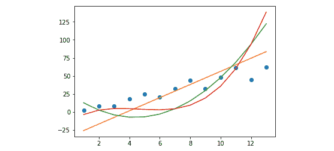

###### 图 3.19:显示带有线性曲线的第一个数据集的图表

当系数从左到右以递减的顺序列举时，我们可以看到较高次的系数几乎可以忽略不计。换句话说，三条曲线几乎在彼此之上，我们只能检测到右边缘附近的发散。这是因为我们正在处理一个可以用线性模型很好地近似的数据集。

事实上，第一个数据集是由一个线性函数创建的。x**2 和 x**3 的任何非零系数都是基于可用数据过度拟合模型的结果。线性模型比任何高次多项式更适合预测定型数据范围之外的值。

让我们将这种行为与第二个例子进行对比。我们知道斐波纳契数列是非线性的。因此，使用线性方程来近似它显然是欠拟合的情况。这里，我们期望更高次的多项式表现得更好:

```
deg1 = np.polyfit(x2, y2, 1)
# array([  9.12087912, -34.92307692])
f1 = np.poly1d(deg1)
deg2 = np.polyfit(x2, y2, 2)
# array([  1.75024975, -15.38261738,  26.33566434])
f2 = np.poly1d(deg2)
deg3 = np.polyfit(x2, y2, 3)
# array([0.2465035, -3.42632368, 14.69080919, 
# -15.07692308])
f3 = np.poly1d(deg3)
plot.plot(
    x2, y1, 'o',# blue dots
    x2, f1(x2), # orange
    x2, f2(x2), # green
    x2, f3(x2)  # red
)
```

输出如下所示:

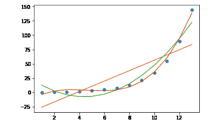

###### 图 3.20:显示第二个数据集点和三条多项式曲线的图形

区别很明显。二次曲线比线性曲线更适合这些点。三次曲线更好。

如果你研究比奈的公式，你会发现斐波那契函数是一个指数函数，因为第 x 个斐波那契数是作为一个常数的第 x 次幂计算的。因此，我们使用的多项式次数越高，我们的近似就越精确。

### 多元多项式回归

当我们有一个 n 次变量时，方程中有 n+1 个系数:

```
y = b + a1*x + a2*(x ** 2) + a3*(x ** 3) + … + an * (x ** n)
```

一旦我们处理了多个特征 x1，x2，…，xm，以及它们的 n 次幂，我们就得到一个系数的 m * (n+1)矩阵。一旦我们开始探索细节并证明多项式模型如何工作，数学将变得相当冗长。我们也将失去二维曲线的良好可视化效果。

因此，我们将应用上一节中学到的关于一元多项式回归的章节，并省略数学运算。当训练和测试线性回归模型时，我们可以计算均方误差来查看模型的逼近程度。

在 scikit-learn 中，近似中使用的多项式的次数是模型中的一个简单参数。

由于多项式回归是线性回归的一种形式，我们可以在不改变回归模型的情况下执行多项式回归。我们需要做的只是转换输入，并保持线性回归模型。

输入的转换由`PolynomialFeatures`包的`fit_transform`方法执行:

```
import numpy as np
import quandl 
from sklearn import preprocessing
from sklearn import model_selection
from sklearn import linear_model
from matplotlib import pyplot as plot
from sklearn.preprocessing import PolynomialFeatures 
data_frame = quandl.get("YALE/SPCOMP")
data_frame.fillna(-100, inplace=True)
# We shift the price data to be predicted 20 years forward
data_frame['Real Price Label'] = data_frame['Real Price'].shift(-240)
# Then exclude the label column from the features
features = np.array(data_frame.drop('Real Price Label', 1))
# We scale before dropping the last 240 rows from the features
scaled_features = preprocessing.scale(features)
# Save the last 240 rows before dropping them
scaled_features_latest_240 = scaled_features[-240:]
# Exclude the last 240 rows from the data used for model building
scaled_features = scaled_features[:-240]
# Now we can drop the last 240 rows from the data frame
data_frame.dropna(inplace=True)
# Then build the labels from the remaining data
label = np.array(data_frame['Real Price Label'])
# Create a polynomial regressor model and fit it to the training data
poly_regressor = PolynomialFeatures(degree=3)
poly_scaled_features = poly_regressor.fit_transform(scaled_features)
# Split to training and testing data
(
    poly_features_train, poly_features_test, 
    poly_label_train, poly_label_test
) = model_selection.train_test_split(
    poly_scaled_ features, 
    label, test_size=0.1
)
# Apply linear regression
model = linear_model.LinearRegression()
model.fit(poly_features_train, poly_label_train)
# Model score
print('Score: ', model.score(poly_features_test, poly_label_test))
# Prediction
poly_label_predicted = model.predict(poly_features_test)
plot.scatter(poly_label_test, poly_label_predicted)
```

模型得分太好了。很有可能，多项式模型会过度拟合数据集。

scikit-learn 中还有另一种执行多项式回归的模型，称为 SVM 模型，代表支持向量机。

### 支持向量回归

支持向量机是定义在向量空间上的二元分类器。向量机用曲面划分状态空间。SVM 分类器获取分类数据，并试图预测未分类数据的归属。一旦确定了数据点的分类，就会对其进行标记。

支持向量机也可以用于回归。我们可以预测序列中的未来值，而不是标记数据。支持向量回归模型使用我们的数据之间的空间作为误差范围。根据误差幅度，它对未来值进行预测。

如果误差幅度太小，我们就有过度拟合现有数据集的风险。如果误差幅度太大，我们就有对现有数据集进行欠拟合的风险。

在分类器的情况下，核描述了划分状态空间的表面。在回归量的情况下，核也用于测量误差幅度。该内核可以使用线性模型、多项式模型或许多其他可能的模型。默认的核是 **RBF** ，代表**径向基函数**。

支持向量回归是一个高级主题，超出了本书的范围。因此，我们将只坚持在测试数据上尝试另一个回归模型是多么容易。

假设我们在两个独立的 NumPy 数组中有我们的特性和标签。让我们回忆一下我们是如何对它们进行线性回归的:

```
from sklearn import model_selection
from sklearn import linear_model
(features_train, features_test, label_train,
 label_test) = model_selection.train_test_split(scaled_features, label, test_size=0.1)
model = linear_model.LinearRegression()
model.fit(features_train, label_train)
```

我们可以通过将线性模型更改为支持向量模型来使用支持向量机执行回归:

```
from sklearn import model_selection
from sklearn import svm
from matplotlib import pyplot as plot
# The rest of the model building stays the same
(features_train, features_test, label_train,
 label_test) = model_selection.train_test_split(scaled_features, label, test_size=0.1)
model = svm.SVR()
model.fit(features_train, label_train)
label_predicted = model.predict(features_test)
print('Score: ', model.score(features_test, label_test))
plot.plot(label_test, label_predicted, 'o')
```

输出如下所示:

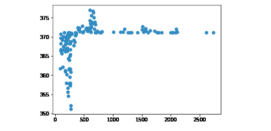

###### 图 3.21:显示线性模型支持向量回归的图表

输出如下所示:

```
 -0.19365084431020874
```

模型分数相当低，点没有对齐在`y=x`线上。使用默认值的预测非常低。

模型的输出描述了支持向量机的参数:

```
SVR(C=1.0, cache_size=200, coef0=0.0, degree=3, epsilon=0.1, gamma='auto', kernel='rbf', max_iter=-1, shrinking=True, tol=0.001, verbose=False)
```

我们可以调整这些参数，通过创建更好的算法来提高预测的准确性。

### 具有 3 次多项式核的支持向量机

让我们把支持向量机的内核换成 poly。多项式的默认次数是 3:

```
model = svm.SVR(kernel='poly') 
model.fit(features_train, label_train) 
label_predicted = model.predict(features_test) 
plot.plot(label_test, label_predicted, 'o')
```

输出如下所示:

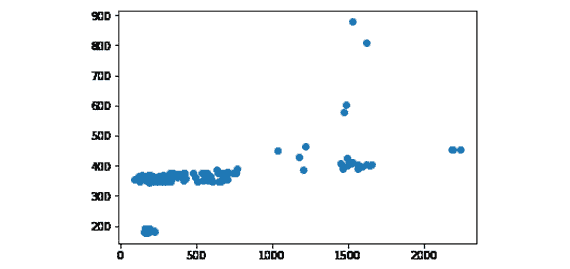

###### 图 3.22:显示支持向量回归的图，其多项式核为 3 次

```
model.score(features_test, label_test)
```

输出如下所示:

```
0.06388628722032952
```

使用支持向量机，我们经常会发现点集中在很小的区域。我们可以改变误差幅度，把这些点分开得更远一点。

### 活动 6:用多元二次和三次线性多项式回归预测股票价格

在本节中，我们将讨论如何使用 scikit-learn 执行线性、多项式和支持向量回归。我们还将学习如何为给定的任务找到最合适的模型。我们假设你是一家金融机构的软件工程师，你的雇主想知道线性回归和支持向量回归哪个更适合预测股票价格。您必须从数据源加载标准普尔 500 的所有数据。然后，在分离定型数据和测试数据之前，您需要使用线性回归、三次多项式线性回归和具有 3 次多项式核的支持向量回归来构建回归变量。绘制测试标签和预测结果，并与 y=x 线进行比较。最后，比较三个模型的得分情况。

1.  使用 Quandl 加载标准普尔 500 指数数据，然后为预测准备数据。
2.  Use a polynomial of degree 1 for the evaluation of the model and for the prediction.

    圆点离 y=x 线越近，模型的误差就越小。

    用二次多项式执行线性多元回归。唯一的变化是线性回归模型。

3.  使用 3 次多项式核执行支持向量回归。

这个模型看起来一点也不高效。出于某种原因，该模型显然更倾向于完全不现实的较低标准普尔 500 值，假设股票市场不会在一天内损失 80%的价值。

#### 注意

这项活动的解决方案在第 271 页。

## 总结

在本章中，我们已经学习了线性回归的基础知识。

在学习了一些基础数学之后，我们开始学习使用一个变量和多个变量的线性回归数学。

回归带来的挑战包括从外部数据源加载数据，如. csv 文件、Yahoo Finance 或 Quandl。加载数据后，我们学习了如何识别要素和标签、如何缩放数据以及如何格式化数据以执行回归。

我们学习了如何训练和测试线性回归引擎，以及如何预测未来。我们的结果通过一个名为`pyplot`的易于使用的 Python 图形绘制库可视化。

更复杂的线性回归形式是任意次的线性多项式回归。我们学习了如何定义这些多元回归问题。我们比较了他们在股票价格预测问题上的表现。作为多项式回归的替代方法，我们还引入了支持向量机作为回归模型，并用两个内核进行了实验。

你将很快了解机器学习的另一个领域。这种机器学习方法的设置和代码结构将非常类似于回归，而问题域有些不同。在下一章，你将学习分类的来龙去脉。