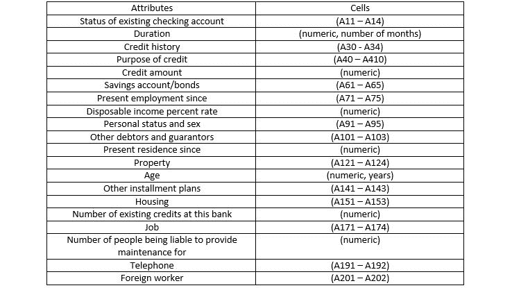
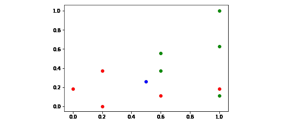
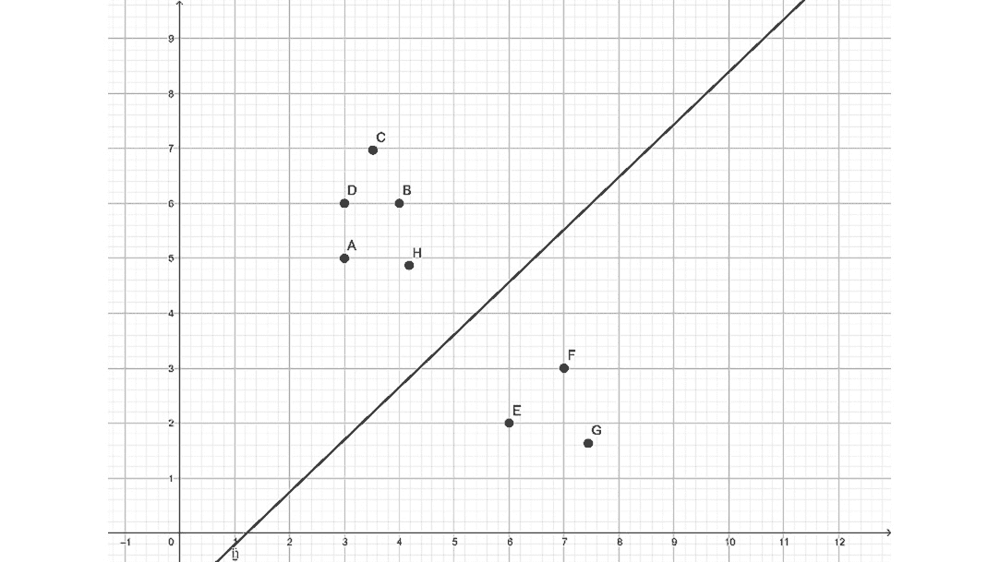
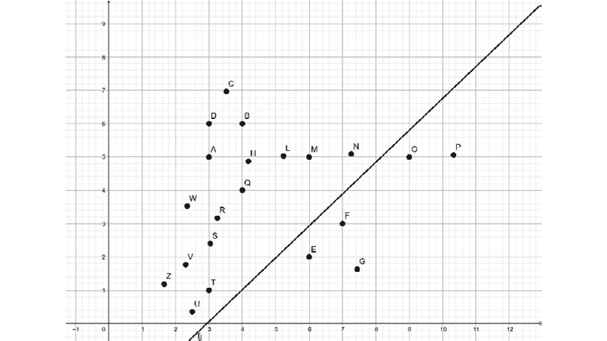
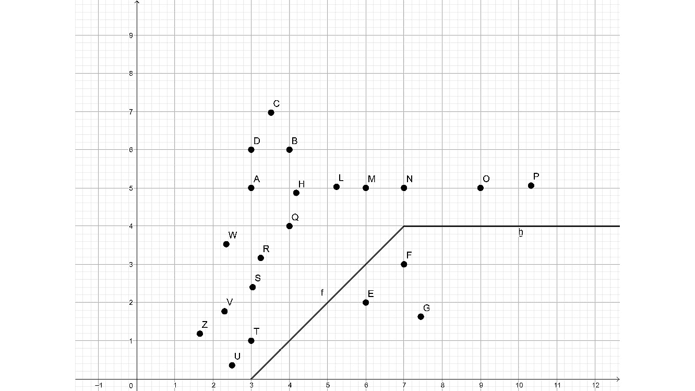

# 四、分类

## 学习目标

本章结束时，您将能够:

*   描述分类的基本概念
*   为分类加载和预处理数据
*   实现 k-最近邻和支持向量机分类器

在第二章中，我们将关注分类的目标，并学习 k-最近邻和支持向量机。

four

## 简介

在本章中，我们将学习分类器，尤其是 k-最近邻分类器和支持向量机。我们将使用这种分类来对数据进行分类。正如我们对回归所做的那样，我们将基于训练数据构建一个分类器，并使用测试数据测试我们的分类器的性能。

## 分类的基础

回归侧重于创建一个最适合我们的数据来预测未来的模型，而分类则是创建一个将我们的数据分成不同类别的模型。

假设您有一些属于不同类别的数据，分类有助于您预测新数据点所属的类别。分类器是确定属于域中任何数据点的标签值的模型。假设你有一组点，`P = {p1, p2, p3, ..., pm}`，和另一组点，`Q = {q1, q2, q3, ..., qn}`。您将这些点视为不同类的成员。为简单起见，我们可以想象`P`包含信用良好的个人，而`Q`包含在信用偿还倾向方面有风险的个人。

您可以划分状态空间，使`P`中的所有点都在状态空间的一个集群上，然后与包含`Q`中所有点的状态空间集群分离。一旦你在状态空间内找到这些有界空间，称为**集群**，你就成功地执行了**集群**。

假设我们有一个点，它不等于前面的任何一个点。点`x`属于集群`P`还是集群`Q`？这个问题的答案是一个`x`。

分类通常由接近程度决定。点`x`越靠近簇`P`中的点，它越有可能属于簇`P`。这就是最近邻分类背后的思想。在 k 近邻分类的情况下，我们找到点`x`的 k 近邻，根据来自同一类的最近邻的最大数量进行分类。除了 k 近邻，我们还会使用支持向量机进行分类。在这一章中，我们将详细介绍这种信用评分方法。

我们可以自己收集随机的虚拟数据，也可以选择使用包含数百个数据点的在线数据集。为了让这种学习体验尽可能真实，我们会选择后者。让我们继续做一个练习，让我们下载一些可用于分类的数据。下载机器学习数据集的一个热门地方是 https://archive.ics.uci.edu/ml/datasets.html。您可以找到五个不同的信贷审批数据集。我们现在将加载关于德国信贷批准的数据集，因为对于一个例子来说，1000 个数据点的大小是完美的，并且它的文档是可用的。

`german` **数据集可用 CSV 格式**

CSV 代表逗号分隔值。CSV 文件是一个简单的文本文件，其中文件的每一行都包含数据集中的一个数据点。数据点的属性以固定顺序给出，由逗号等分隔符分隔。这个字符可能不会出现在数据中，否则我们就不知道分隔符是数据的一部分还是用作分隔符。尽管逗号分隔值这个名称表明分隔符是逗号，但情况并非总是如此。例如，在我们的例子中，分隔符是一个空格。CSV 文件用于许多应用程序，包括 Excel。CSV 是不同应用程序之间的一个很好的精简接口。

### 练习 10:加载数据集

1.  Visit [https://archive.ics.uci.edu/ml/datasets/Statlog+%28German+Credit+Data%29](https://archive.ics.uci.edu/ml/datasets/Statlog+%28German+Credit+Data%29). The data files are located at [https://archive.ics.uci.edu/ml/machine-learning-databases/statlog/german/](https://archive.ics.uci.edu/ml/machine-learning-databases/statlog/german/).

    ```
    A11 6 A34 A43 1169 A65 A75 4 A93 A101 4 A121 67 A143 A152 2 A173 1 A192 A201 1
    A12 48 A32 A43 5951 A61 A73 2 A92 A101 2 A121 22 A143 A152 1 A173 1 A191 A201 2
    A14 12 A34 A46 2096 A61 A74 2 A93 A101 3 A121 49 A143 A152 1 A172 2 A191 A201 1
    ```

    解释这些数据的说明在`german.doc`文件中，在这里你可以看到属性列表。这些属性是:现有支票账户的状态(A11-A14)、持续时间(数字、月数)、信用历史(A30 - A34)、信用目的(A40-A410)、信用金额(数字)、储蓄账户/债券(A61-A65)、当前就业时间(A71-A75)、可支配收入百分比(数字)、个人状态和性别(A91-A95)、其他债务人和担保人(A101-A103)、当前居住时间(数字)、财产(A121-A124)、年龄(数字、年份)、其他分期付款计划(数字) 该银行的现有信贷数量、工作(A171-A174)、负责维护(数字)电话(A191-A192)和外籍工人(A201-A202)的人数。

    分类结果如下:`1 means good debtor, while 2 means bad debtor`。

    我们的任务是确定如何将 20 个输入变量的状态空间分成两类:好债务人和坏债务人。

2.  我们将使用 pandas 库来加载数据。不过，在加载数据之前，我建议给`german.data`文件添加一个头。在第一行之前插入以下标题行:

    ```
    CheckingAccountStatus DurationMonths CreditHistory CreditPurpose CreditAmount SavingsAccount EmploymentSince DisposableIncomePercent PersonalStatusSex OtherDebtors PresentResidenceMonths Property Age OtherInstallmentPlans Housing NumberOfExistingCreditsInBank Job LiabilityNumberOfPeople Phone ForeignWorker CreditScore
    import pandas
    data_frame = pandas.read_csv('german.data', sep=' ') 
    ```

3.  `read_csv`的第一个参数是文件路径。例如，如果你把它保存到你的 Windows PC 的 E 盘，那么你也可以在那里写一个绝对路径: *e:\german.data* 。



###### 图 4.1:显示各个单元格中属性列表的表格

我们来看看数据的格式。`data_frame.head()`调用打印 CSV 文件的前五行，由 pandas 数据帧构成:

```
data_frame.head()
```

输出如下所示:

```
  CheckingAccountStatus  DurationMonths CreditHistory CreditPurpose  \
0                   A11               6           A34           A43   
..
4                   A11              24           A33           A40   
   CreditAmount SavingsAccount EmploymentSince  DisposableIncomePercent  \
0          1169            A65             A75                        4   
..
4          4870            A61             A73                        3   
  PersonalStatusSex OtherDebtors     ...      Property Age  \
0               A93         A101     ...          A121  67   
..
4               A93         A101     ...          A124  53   
   OtherInstallmentPlans Housing NumberOfExistingCreditsInBank   Job  \
0                   A143    A152                             2  A173   
..
4                   A143    A153                             2  A173   
  LiabilityNumberOfPeople  Phone ForeignWorker CreditScore  
0                       1   A192          A201           1  
..
4                       2   A191          A201           2  
[5 rows x 21 columns]
```

我们已经成功地将数据加载到数据框架中。

### 数据预处理

在构建分类器之前，我们最好格式化我们的数据，以便我们能够以最适合分类的格式保存相关数据，并删除所有我们不感兴趣的数据。

1.**替换或删除数值**

例如，如果数据集中有`N/A`(或`NA`)值，我们最好将这些值替换为我们能够处理的数值。NA 代表不可用。我们可以选择忽略具有 NA 值的行，或者用异常值替换它们。异常值是从数据集中的常规值中明显突出出来的值，如-1，000，000。DataFrame 的 replace 方法执行这种类型的替换。用异常值替换 NA 值如下所示:

```
data_frame.replace('NA', -1000000, inplace=True)
```

replace 方法将所有 NA 值更改为数值。

这个数值应该远离数据帧中的任何合理值。负一百万被分类器识别为异常，假设那里只有正值。

用极值替换不可用数据的替代方法是删除包含不可用数据的行:

```
data_frame.dropna(0, inplace=True)
```

第一个参数指定我们删除行，而不是列。第二个参数指定我们执行删除操作，而不克隆数据帧。删除 NA 值是不太可取的，因为您通常会丢失数据集的一个合理的块。

2.**删除列**

如果有一列我们不想包含在分类中，我们最好删除它。否则，分类器可能会在绝对没有相关性的地方检测到错误的模式。例如，你的电话号码本身就不太可能与你的信用评分相关联。这是一个 9 到 12 位的数字，很容易给分类器带来很多噪音。所以我们放弃了电话专栏。

```
data_frame.drop(['Phone'], 1, inplace=True)
```

第二个参数表示我们删除列，而不是行。第一个参数是我们想要删除的列的枚举。`inplace`参数使得调用修改原始数据帧。

3.**转换数据**

通常，我们使用的数据格式对于分类过程来说并不总是最佳的。出于多种原因，我们可能希望将数据转换为不同的格式，例如:

*   突出显示我们感兴趣的数据方面(例如，最小最大值缩放或归一化)
*   丢弃我们不感兴趣的数据(例如，二进制化)
*   标签编码

`MinMaxScaler`sci kit 预处理实用程序的方法:

```
from sklearn import preprocessing
data = np.array([
    [19, 65],
    [4, 52],
    [2, 33]
])
preprocessing.MinMaxScaler(feature_range=(0,1)).fit_transform(data)
```

输出如下所示:

```
 array([[1\.        , 1\.        ],
       [0.11764706, 0.59375   ],
       [0\.        , 0\.        ]])
```

`MinMaxScaler`缩放数据中的每一列，使列中最小的数字变为 0，最大的数字变为 1，并且所有介于两者之间的值在 0 和 1 之间按比例缩放。

**二进制化**根据以下条件将数据转换为 1 和 0:

```
preprocessing.Binarizer(threshold=10).transform(data)
array([[1, 1],
       [0, 1],
       [0, 1]])
```

**标签编码**对于为 sci kit-学会处理准备要素非常重要。虽然有些要素是字符串标签，但 scikit-learn 希望这些数据是数字。

这就是 scikit-learn 的预处理库发挥作用的地方。

#### 注意

您可能已经注意到，在信用评分示例中，有两个数据文件。一个包含字符串形式的标签，另一个包含整数形式的标签。我故意让您加载带有字符串标签的数据，以便您获得一些如何使用标签编码器正确预处理数据的经验。

标签编码不是火箭科学。它创建了字符串标签和数值之间的映射，以便我们可以向 scikit-learn 提供数字:

```
from sklearn import preprocessing
labels = ['Monday', 'Tuesday', 'Wednesday', 'Thursday', 'Friday']
label_encoder = preprocessing.LabelEncoder()
label_encoder.fit(labels)
```

让我们列举编码:

```
[x for x in enumerate(label_encoder.classes_)]
```

输出如下所示:

```
[(0, 'Friday'),
 (1, 'Monday'),
 (2, 'Thursday'),
 (3, 'Tuesday'),
 (4, 'Wednesday')]
```

我们可以使用编码器来转换值:

```
encoded_values = label_encoder.transform(['Wednesday', 'Friday'])
```

输出如下所示:

```
 array([4, 0], dtype=int64)
```

将编码值转换回标签的逆转换由`inverse_transform`函数执行:

```
label_encoder.inverse_transform([0, 4])
```

输出如下所示:

```
 array(['Wednesday', 'Friday'], dtype='<U9')
```

### 练习 11:预处理数据

在本练习中，我们将使用熊猫数据集。

1.  Load the CSV data of the 2017-2018 January kickstarter projects from [https://github.com/TrainingByPackt/Artificial-Intelligence-and-Machine-Learning-Fundamentals/blob/master/Lesson04/Exercise%2011%20Pre-processing%20Data/ks-projects-201801.csv](https://github.com/TrainingByPackt/Artificial-Intelligence-and-Machine-Learning-Fundamentals/blob/master/Lesson04/Exercise%2011%20Pre-processing%20Data/ks-projects-201801.csv) and apply the preprocessing steps on the loaded data.

    #### 注意

    请注意，您需要一个正常工作的互联网连接来完成本练习。

2.  如果你打开文件，你会看到你不必费心添加一个头，因为它包含在 CSV 文件:

    ```
    ID,name,category,main_category,currency,deadline,goal,launched,pledged,state,backers,country,usd pledged,usd_pledged_real,usd_goal_real
    ```

3.  导入数据并使用 pandas 创建数据框架:

    ```
    import pandas
    data_frame = pandas.read_csv('ks-projects-201801.csv', sep=',')
    data_frame.head()
    ```

4.  上一个命令打印属于数据集的前五个条目。我们可以看到每一列的名称和格式。现在我们已经有了数据，是时候执行一些预处理步骤了。
5.  假设数据集中有一些 NA 或 N/A 值。你可以用下面的`replace`操作来代替它们:

    ```
       data_frame.replace('NA', -1000000, inplace=True)
       data_frame.replace('N/A', -1000000, inplace=True)
    ```

6.  在进行分类或回归时，保留 ID 列只是自找麻烦。在大多数情况下，ID 与最终结果不相关。因此，删除 ID 列是有意义的:

    ```
    data_frame.drop(['ID'], 1, inplace=True)
    ```

7.  假设我们只对项目是否有支持者感兴趣。这是二值化的一个完美例子:

    ```
    from sklearn import preprocessing
    preprocessing.Binarizer(threshold=1).transform([data_frame['backers']])
    ```

8.  The output will be as follows:

    ```
     array([[0, 1, 1, ..., 0, 1, 1]], dtype=int64)
    ```

    #### 注意

    我们将丢弃生成的二进制数组。为了利用二进制数据，我们必须用它替换 backers 列。为了简单起见，我们将省略这一步。

9.  让我们对标签进行编码，使它们成为可以被分类器解释的数值:

    ```
    labels = ['AUD', 'CAD', 'CHF', 'DKK', 'EUR', 'GBP', 'HKD', 'JPY', 'MXN', 'NOK', 'NZD', 'SEK', 'SGD', 'USD']
    label_encoder = preprocessing.LabelEncoder()
    label_encoder.fit(labels)
    label_encoder.transform(data_frame['currency'])
    ```

10.  输出如下:

    ```
     array([ 5, 13, 13, ..., 13, 13, 13], dtype=int64)
    ```

您必须了解文件中可能出现的所有标签。文档负责为您提供可用的选项。在不太可能的情况下，文档对您不可用，您必须从文件中反向工程可能的值。

一旦返回编码后的数组，就会出现与上一点相同的问题:我们必须通过用这些新值替换 DataFrame 的`currency`列来利用这些值。

### 目标列的最小最大缩放比例

当引入最小最大缩放时，您会看到，不是缩放矩阵中每个向量的值，而是缩放每个向量中每个坐标的值。这就是矩阵结构描述数据集的方式。一个向量包含一个数据点的所有属性。当只缩放一个属性时，我们必须转置想要缩放的列。

你在*第一章*、*人工智能原理*中学习了 NumPy 的转置运算:

```
import numpy as np
values_to_scale = np.mat([data_frame['goal']]).transpose()
```

然后，我们必须应用`MinMaxScaler`来缩放转置值。要在一个数组中获得结果，我们可以将结果转置回它们的原始形式:

```
preprocessing
    .MinMaxScaler(feature_range=(0,1))
    .fit_transform(values_to_scale)
    .transpose()
```

输出如下所示:

```
array([[9.999900e-06, 2.999999e-04, 4.499999e-04, ..., 1.499999e-04, 1.499999e-04, 1.999990e-05]])
```

这些值看起来很奇怪，因为 Kickstarter 上有一些高目标，可能使用七位数的值。除了线性最小最大值标度，也可以使用数量和对数标度，计算目标价格有多少位数。这是另一个对于降低分类工作的复杂性有意义的转换。

和往常一样，您必须将结果放在 DataFrame 的相应列中，以便利用转换后的值。

我们将在这里停止预处理。希望这些不同方法的用法现在已经很清楚了，将来您会对使用这些预处理方法有很强的掌握。

### 识别特征和标签

类似于回归，在分类中，我们也必须分离我们的特征和标签。从最初的例子继续，我们的特性是所有的列，除了最后一列，它包含信用评分的结果。我们唯一的标签是信用评分栏。

我们将使用 NumPy 数组来存储我们的特征和标签:

```
import numpy as np
features = np.array(data_frame.drop(['CreditScore'], 1))
label = np.array(data_frame['CreditScore'])
```

现在我们已经准备好了我们的特性和标签，我们可以使用这些数据进行交叉验证。

### 使用 scikit-learn 进行交叉验证

关于回归的另一个相关点是，我们可以使用交叉验证来训练和测试我们的模型。这个过程与回归问题的情况完全相同:

```
from sklearn import model_selection
features_train, features_test, label_train, label_test =
    model_selection.train_test_split(
        features,
        label,
        test_size=0.1
    )
```

`train_test_split`方法将我们的特征和标签打乱，然后分成一个训练数据集和一个测试数据集。我们可以将测试数据集的大小指定为一个介于`0`和`1`之间的数字。`0.1`的`test_size`意味着数据的`10%`将进入测试数据集。

### 活动 7:为分类准备信贷数据

在本节中，我们将讨论如何为分类器准备数据。我们将使用来自[https://archive . ics . UCI . edu/ml/machine-learning-databases/statlog/german/](https://archive.ics.uci.edu/ml/machine-learning-databases/statlog/german/)的`german.data`作为示例，并将准备用于训练和测试分类器的数据。确保所有标签都是数字，并且这些值是为分类准备的。使用 80%的数据点作为训练数据:

1.  从[https://archive . ics . UCI . edu/ml/machine-learning-databases/statlog/german/](https://archive.ics.uci.edu/ml/machine-learning-databases/statlog/german/)中保存`german.data`，并在 Sublime Text 或 Atom 等文本编辑器中打开。向其中添加标题行。
2.  使用 pandas 导入数据文件，并用异常值替换 NA 值。
3.  执行标签编码。将数据框中的所有标签转换为整数。
4.  将特征与标签分开。我们可以应用我们在理论部分看到的同样的方法。
5.  一起执行训练和测试数据的缩放。使用 Scikit 预处理库中的`MinMaxScaler`。
6.  The final step is cross-validation. Shuffle our data and use 80% of all data for training and 20% for testing.

    #### 注意

    这项活动的解决方案在第 276 页。

### k 近邻分类器

我们将从第一个主题停止的地方继续。我们有了训练和测试数据，现在是时候准备我们的分类器来执行 k-最近邻分类了。在介绍了 K 近邻算法之后，我们将使用 scikit-learn 来执行分类。

### 介绍 K-最近邻算法

分类算法的目标是划分数据，以便我们可以确定哪些数据点属于哪个区域。假设给定一组分类点。我们的任务是确定一个新的数据点属于哪一类。

k-最近邻分类器接收具有给定特征和标签值的数据点类。该算法的目标是分类数据点。这些数据点包含特征坐标，分类的目的是确定标签值。分类基于接近度。邻近性被定义为欧几里德距离。如果`A`和`B`之间的欧几里德距离小于`A`和`C`之间的欧几里德距离，则`A`比`C`更靠近点`B`。

k-最近邻分类器获取数据点的 k-最近邻。属于点 A 的标签是点 A 的 k 个最近邻中出现频率最高的标签值，确定`K`的值是一个不明显的任务。显然，如果有两个组，比如有信用的和没有信用的，我们需要 K 是 3 或更大，因为否则，使用`K=2`，我们可以很容易地在邻居的数量之间产生平局。然而，一般来说，K 的值不依赖于组的数量或特征的数量。

k 近邻的一个特例是当`K=1`。在这种情况下，分类归结为查找点的最近邻。`K=1`通常会给我们比`K=3`更差的结果。

### 距离函数

许多距离度量可以与 k-最近邻算法一起工作。我们现在将计算两个数据点的欧几里德距离和曼哈顿距离。欧几里得距离是我们计算平面或三维空间中两点之间距离的方法的概括。

点`A = (a1, a2, …, an)`和`B=(b1, b2, …, bn)`之间的距离是连接这两点的线段的长度；


###### 图 4.2:A 点和 B 点之间的距离

从技术上讲，当我们只是寻找最近邻时，我们不需要计算平方根，因为平方根是一个单调函数。

由于我们将在本书中使用欧几里德距离，让我们看看如何使用一个 scikit-learn 函数调用来计算多个点的距离。我们必须从`sklearn.metrics.pairwise`导入`euclidean_distances`。此函数接受两组点，并返回一个矩阵，该矩阵包含每个点到第一组和第二组点的成对距离:

```
from sklearn.metrics.pairwise import euclidean_distances
points = [[2,3], [3,7], [1,6]]
euclidean_distances([[4,4]], points)
```

输出如下所示:

```
array([[2.23606798, 3.16227766, 3.60555128]])
```

例如,( 4，4)和(3，7)的距离大约是 3.162。

我们还可以计算同一集合中各点之间的欧几里德距离:

```
euclidean_distances(points)
array([[0\.        , 4.12310563, 3.16227766],
       [4.12310563, 0\.        , 2.23606798],
       [3.16227766, 2.23606798, 0\.        ]])
```

**曼哈顿/海明距离**

汉明距离和曼哈顿距离代表相同的公式。

曼哈顿距离依赖于计算数据点坐标差的绝对值:


###### 图 4.3:曼哈顿和海明距离

欧几里得距离是对距离的更精确的概括，而曼哈顿距离稍微容易计算。

### 练习 12:举例说明 K-最近邻分类器算法

假设我们有一个雇员数据列表。我们的特点是每周工作小时数和年薪。我们的标签表明员工是否在我们公司工作了两年以上。如果停留时间少于两年，则用零表示，如果超过或等于两年，则用一表示。

我们想创建一个 3-最近邻分类器，用于确定一名员工是否在我们公司工作了至少两年。

然后，我们希望使用这个分类器来预测一个要求每周工作 32 小时、年收入 52，000 美元的员工是否会在该公司工作两年。

数据集如下所示:

```
employees = [
    [20, 50000, 0],
    [24, 45000, 0],
    [32, 48000, 0],
    [24, 55000, 0],
    [40, 50000, 0],
    [40, 62000, 1],
    [40, 48000, 1],
    [32, 55000, 1],
    [40, 72000, 1],
    [32, 60000, 1]
]
```

1.  Scale the features:

    ```
    import matplotlib.pyplot as plot
    from sklearn import preprocessing
    import numpy as np
    from sklearn.preprocessing import MinMaxScaler
    scaled_employees = preprocessing.MinMaxScaler(feature_range=(0,1))
        .fit_transform(employees)
    array([[0\.        , 0.18518519, 0\.        ],
           [0.2       , 0\.        , 0\.        ],
           [0.6       , 0.11111111, 0\.        ],
           [0.2       , 0.37037037, 0\.        ],
           [1\.        , 0.18518519, 0\.        ],
           [1\.        , 0.62962963, 1\.        ],
           [1\.        , 0.11111111, 1\.        ],
           [0.6       , 0.37037037, 1\.        ],
           [1\.        , 1\.        , 1\.        ],
           [0.6       , 0.55555556, 1\.        ]])
    ```

    在这一点上缩放我们请求的员工也是有意义的:*【32，52000】*变成了 *[ (32-24)/(40 - 24)，(52000-45000)/(72000-45000)]=[0.5，0.25925925925925924]* 。

2.  Plot these points on a two-dimensional plane such that the first two coordinates represent a point on the plane, and the third coordinate determines the color of the point:

    ```
    import matplotlib.pyplot as plot
    [	
        plot.scatter(x[0], x[1], color = 'g' if x[2] > 0.5 else 'r') 
        for x in scaled_employees
    ] + [plot.scatter(0.5, 0.25925925925925924, color='b')]
    ```

    输出如下所示:

    

    ###### 图 4.4:绘制在二维平面上的点

3.  为了计算蓝点和所有其他点的距离，我们将应用第一章*人工智能*的转置函数。如果我们转置`scaledEmployee`矩阵，我们得到三个十的数组。特征值在前两个数组中。我们可以简单地使用`[:2]`索引来保存它们。然后，将这个矩阵转置回它的原始形式，得到特征数据点的数组:

    ```
    scaled_employee_features = scaled_employees.transpose()[:2].transpose()
    scaled_employee_features
     array([[0\.        , 0.18518519],
        [0.2       , 0\.        ],
        [0.6       , 0.11111111],
        [0.2       , 0.37037037],
        [1\.        , 0.18518519],
        [1\.        , 0.62962963],
        [1\.        , 0.11111111],
        [0.6       , 0.37037037],
        [1\.        , 1\.        ],
           [0.6       , 0.55555556]])
    ```

4.  使用

    ```
    from sklearn.metrics.pairwise import euclidean_distances
    euclidean_distances(
        [[0.5, 0.25925925925925924]], 
        scaled_employee_features
    )
     array([[0.50545719, 0.39650393, 0.17873968, 0.31991511, 0.50545719,
            0.62223325, 0.52148622, 0.14948471, 0.89369841, 0.31271632]])
    ```

    计算欧几里德距离

最短距离如下:

*   `0.14948471`为点`[0.6, 0.37037037, 1.]`
*   `0.17873968`为点`[0.6, 0.11111111, 0.]`
*   `0.31271632`为点[ `0.6, 0.55555556, 1.]`

由于三个点中有两个点的标签为 1，我们发现了两个绿点和一个红点。这意味着我们的 3-最近邻分类器将新员工归类为更有可能呆至少两年而不是根本不呆。

#### 注意

虽然，第四分只是以极小的差距与前三失之交臂。事实上，如果有两个不同颜色的点与目标的距离第三小，我们的算法就会找到平局。在距离竞赛的情况下，可能会出现平局。不过，这是一种边缘情况，在现实生活中几乎不会出现。

### 练习 13:sci kit-learn 中的 k 近邻分类

1.  把我们的数据分成四类:`training`和`testing`、`features`和`labels` :

    ```
    from sklearn import model_selection
    import pandas
    import numpy as np
    from sklearn import preprocessing
    features_train, features_test, label_train, label_test =
    model_selection.train_test_split(
        scaled_features,
        label,
        test_size=0.2
    )
    ```

2.  Create a K-Nearest Neighbor classifier to perform this classification:

    ```
    from sklearn import neighbors
    classifier = neighbors.KNeighborsClassifier()
    classifier.fit(features_train, label_train)
    ```

    由于我们没有提到 K 的值，所以默认为 *5* 。

3.  Check how well our classifier performs on the test data:

    ```
    classifier.score(features_test, label_test)
    ```

    输出为`0.665`。

您可能会发现其他数据集的评级更高，但可以理解的是，超过 20 个要素可能很容易包含一些随机噪声，从而难以对数据进行分类。

### 练习 14:使用 k-最近邻分类器进行预测

这段代码建立在前面练习的代码之上。

1.  我们将创建一个数据点，我们将通过获取第 i *个*测试数据点:

    ```
    data_point = [None] * 20
    for i in range(20):
        data_point[i] = features_test[i][i]
    data_point = np.array(data_point)
    ```

    的第 i *个*元素进行分类
2.  我们有一个一维数组。分类器需要包含数据点数组的数组。因此，我们必须将我们的数据点整形为一个数据点数组:

    ```
    data_point = data_point.reshape(1, -1)
    ```

3.  这样，我们就创建了一个完全随机的角色，我们感兴趣的是他们是否被归类为值得信任的人:

    ```
    credit_rating = classifier.predict(data_point)
    classifier.predict(data_point)
    array([1], dtype=int64)
    ```

我们已经成功地根据输入数据对新用户进行了评级。

### sci kit-learn 中 k 近邻分类器的参数化

可以在这里访问 k 近邻分类器的文档:[http://sci kit-learn . org/stable/modules/generated/sk learn . neighbors . kneighborsclassifier . html](http://scikit-learn.org/stable/modules/generated/sklearn.neighbors.KNeighborsClassifier.html)。

分类器的参数化可以微调分类器的准确性。由于我们还没有了解 k-最近邻的所有可能的变化，我们将专注于您基于该主题已经了解的参数。

**n_neighbors** :这是 k 近邻算法的 k 值。默认值为 5。

**metric** :在创建分类器的时候，你会看到一个怪异的名字——“Minkowski”。不要担心这个名字，你已经学习了一阶和二阶闵可夫斯基度规。该指标有一个功率参数。对于 *p=1* ，闵可夫斯基度规与曼哈顿度规相同。对于 *p=2* ，闵可夫斯基度规与欧几里德度规相同。

这就是闵可夫斯基度规的力量。默认值为 2。

创建分类器后，必须指定这些参数:

```
classifier = neighbors.KNeighborsClassifier(n_neighbors=50)
```

### 活动 8:提高信用评分的准确性

在本节中，我们将了解 k-最近邻分类器的参数化如何影响最终结果。信用评分的准确率目前相当低:66.5%。想办法提高几个百分点。为了确保这种情况正确发生，您需要完成前面的练习。

有许多方法可以完成这个练习。在此解决方案中，我将向您展示一种提高信用评分的方法，这将通过更改参数化来实现:

1.  将 k-最近邻分类器的 k 值从默认值 5 增加到 10、15、25 和 50。
2.  对所有四个`n_neighbors`值运行该分类器，并观察结果。
3.  Higher K values do not necessarily mean a better score. In this example, though, `K=50` yielded a better result than `K=5`.

    #### 注意

    这项活动的解决方案在第 280 页。

## 用支持向量机分类

我们首先在第 3 章*回归*中使用支持向量机进行回归。在本主题中，您将了解如何使用支持向量机进行分类。和往常一样，我们将使用 scikit-learn 在实践中运行我们的示例。

### 什么是支持向量机分类器？

定义在 n 维向量空间上的支持向量机的目标是在该 n 维空间中找到一个曲面，该曲面将该空间中的数据点分成多个类。

在二维空间中，这个曲面通常是一条直线。在三维空间中，支持向量机经常找到一个平面。一般来说，支持向量机找到一个超平面。基于机器可用的信息，这些表面在某种意义上是最佳的，它优化了 n 维空间的分离。

支持向量机找到的最优分离器称为**最佳分离超平面**。

使用支持向量机来寻找分离两组数据点的一个表面。换句话说，支持向量机就是**二元分类器**。这并不意味着支持向量机只能用于二分类。虽然我们只讨论了一个平面，但是通过推广任务本身，支持向量机可以用于将空间划分为任意数量的类。

分离器表面在最大化每个数据点到分离器表面的距离的意义上是最佳的。

向量是定义在 n 维空间上的数学结构，具有大小(长度)和方向。在二维空间中，绘制从原点到点(x，y)的向量(x，y)。基于几何学，你可以用勾股定理计算矢量的长度，通过计算横轴和矢量的夹角计算矢量的方向。

例如，在二维中，向量(3，-4)具有以下大小:

`sqrt( 3 * 3 + 4 * 4 ) = sqrt( 25 ) = 5`

它有以下方向:

`np.arctan(-4/3) / 2 / np.pi * 360 = -53.13010235415597 degrees`

### 了解支持向量机

假设给出两组点，**红色**和**蓝色**。为简单起见，我们可以想象一个具有两个特征的二维平面:一个映射在水平轴上，另一个映射在垂直轴上。

支持向量机的目标是找到将点 **A** 、 **D** 、 **C** 、 **B** 和 **H** 与点 **E** 、 **F** 和 **G** 分开的最佳分隔线:



###### 图 4.5:红色和蓝色成员的分隔线

分离并不总是那么明显。例如，如果在 E、F 和 G 之间有一个蓝点，那么就没有一条线可以准确无误地将所有点分开。如果蓝色类中的点围绕红色类中的点形成一个完整的圆，则没有直线可以将这两个集合分开:



###### 图 4.6:带有两个异常点的图表

例如，在上图中，我们容许两个异常点，O 和 p。

在下面的解决方案中，我们不容许异常值，我们创建了一条由两条半直线组成的最佳分离路径，而不是一条直线:



###### 图 4.7:去除两个异常值分离的图形

所有数据点的完美分离很少值得投入资源。因此，支持向量机可以被正则化，以简化和限制最佳分离形状的定义，并允许异常值。

支持向量机的**正则化参数**决定允许或禁止错误分类的错误率。

支持向量机有一个核参数。线性核严格使用线性方程来描述最佳分离超平面。多项式核使用多项式，而指数核使用指数表达式来描述超平面。

页边距是以分隔符为中心的区域，以最靠近分隔符的点为边界。平衡边距包含每个类中与直线等距的点。

当定义最佳分离超平面的允许误差率时，伽马参数决定在确定分隔符的位置时是否只有靠近分隔符的点才算数，或者是否离线最远的点也算数。灰度系数越高，影响分隔符位置的点数越少。

### sci kit-learn 中的支持向量机

我们的切入点是之前活动的最终结果。一旦我们分割了训练和测试数据，我们就可以设置分类器了:

```
features_train, features_test, label_train, label_test = model_selection
    .train_test_split(
        scaled_features,
        label,
        test_size=0.2
    )
```

我们将使用`svm.SVC()`分类器，而不是使用 K-最近邻分类器:

```
from sklearn import svm
classifier = svm.SVC()
classifier.fit(features_train, label_train)
# Let's can check how well our classifier performs on the 
# test data:
classifier.score(features_test, label_test)
```

输出为`0.745`。

似乎 scikit-learn 的默认支持向量机分类器比 k-最近邻分类器做得稍好。

### sci kit 的参数-学习 SVM

以下是 scikit-learn SVM 的参数:

**内核**:这是一个字符串或可调用参数，指定算法中使用的内核。预定义的核有线性核、多边形核、rbf 核、sigmoid 核和预计算核。默认值是 rbf。

**次数**:使用多项式时，可以指定多项式的次数。默认值为 3。

`number_of_features`。

**C** :浮点数，默认值为 1.0，描述误差项的惩罚参数。

你可以在[http://sci kit-learn . org/stable/modules/generated/sk learn . SVM . SVC . html](http://scikit-learn.org/stable/modules/generated/sklearn.svm.SVC.html)的参考文档中读到关于 rest 参数的内容。

这里有一个 SVM 的例子:

```
classifier = svm.SVC(kernel="poly", C=2, degree=4, gamma=0.05)
```

### 活动 9:sci kit-learn 中的支持向量机优化

在本节中，我们将讨论如何使用支持向量机分类器的不同参数。我们将使用、比较和对比您所了解的不同支持向量回归分类器参数，并在我们在之前的活动中加载和准备的训练和测试数据中找到一组能够产生最高分类数据的参数。为了确保您能够完成本练习，您需要完成本章的第一个练习。

我们将尝试几种组合。您可能需要选择不同的参数并检查结果:

1.  让我们首先选择线性核，并检查分类器的拟合和得分。
2.  完成后，选择次数为 4、C=2、gamma=0.05 的多项式核，并检查分类器的拟合度和得分。
3.  然后，选择次数为 4、C=2、gamma=0.25 的多项式核，并检查分类器的拟合度和得分。
4.  之后，选择次数为 4、C=2、gamma=0.5 的多项式核，并检查分类器的拟合度和得分。
5.  选择下一个分类器作为 sigmoid 内核。
6.  Lastly, choose the default kernel with a gamma of 0.15 and check the classifier's fit and score.

    #### 注意

    这项活动的解决方案可在第 280 页找到。

## 总结

在这一章中，我们学习了分类的基础知识。在发现分类的目标、加载和格式化数据之后，我们发现了两种分类算法:K-最近邻和支持向量机。我们使用基于这两种方法的自定义分类器来预测值。在下一章，我们将使用树进行预测分析。