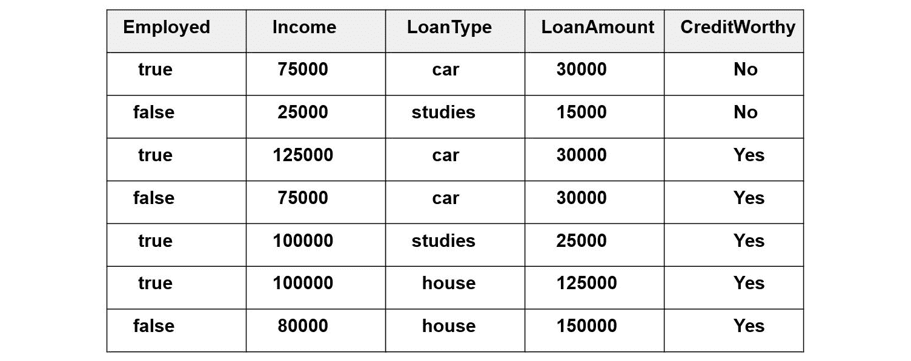
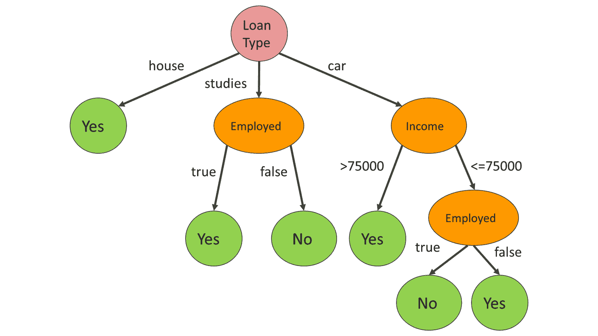
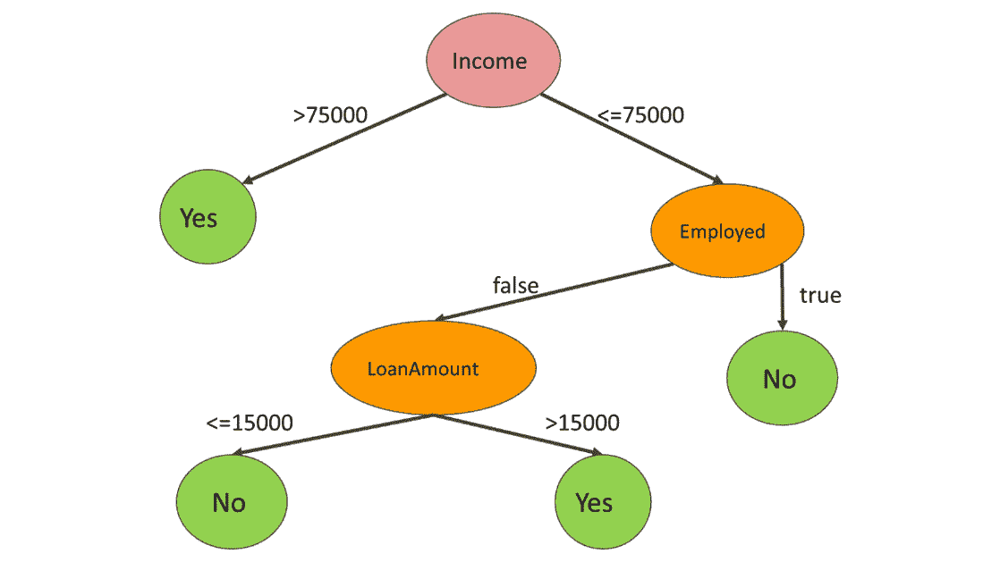

# 五、将树用于预测分析

## 学习目标

本章结束时，您将能够:

*   理解用于评估数据模型效用的指标
*   基于决策树分类数据点
*   基于随机森林算法的数据点分类

在本章中，我们将详细了解两种监督学习算法。第一种算法将帮助我们使用决策树对数据点进行分类，而另一种算法将帮助我们使用随机森林进行分类。

## 决策树简介

在决策树中，我们在训练数据中有输入和相应的输出。像任何树一样，决策树也有叶子、分支和节点。叶子是末端节点，就像是或否。节点是做出决定的地方。决策树由规则组成，我们使用这些规则来制定关于数据点预测的决策。

决策树的每个节点代表一个特征，从内部节点出来的每个边代表树的可能值或可能的值区间。树的每个叶子代表树的一个标签值。

正如我们在前面章节中了解到的，数据点有特征和标签。决策树的任务是根据固定的规则预测标签值。这些规则来自对训练数据的观察模式。

让我们考虑一个确定标签值的例子

假设给定以下训练数据集。制定有助于确定标签值的规则:



###### 图 5.1:制定规则的数据集

在这个例子中，我们基于四个特征来预测标签值。为了建立一个决策树，我们必须对现有的数据进行观察。根据我们掌握的数据，我们可以得出以下结论:

*   所有房屋贷款都被确定为有信用的。
*   只要债务人有工作，学习贷款就是值得信赖的。如果债务人没有工作，他/她就没有信用。
*   年收入 75，000 英镑以上的贷款是有信用的。
*   在 75，000 英镑/年或低于 75，000 英镑/年时，只要债务人没有工作，汽车贷款就是有信用的。

根据我们如何考虑这些规则的顺序，我们可以建立一个树，并描述一种可能的信用评分方式。例如，下面的树映射了前面的四个规则:



###### 图 5.2:贷款类型的决策树

我们首先确定贷款类型。根据第一条规则，房屋贷款自动具有信用价值。学习贷款由第二个规则描述，导致包含另一个就业决策的子树。因为我们已经支付了房屋贷款和学习贷款，所以只剩下汽车贷款了。第三个规则描述了收入决定，而第四个规则描述了就业决定。

每当我们必须对一个新的债务人进行评分，以确定他/她是否值得信任时，我们都必须从头到尾检查决策树，并观察底部的真值或假值。

显然，基于七个数据点的模型是非常不准确的，因为我们可以归纳出与现实完全不符的规则。因此，规则往往是基于大量数据确定的。

这不是我们创建决策树的唯一方法。我们也可以基于其他规则序列构建决策树。让我们从图 5.1 的数据集中提取一些其他的规则。

观察 1:请注意，严格高于 75，000 英镑的个人薪金都是值得信赖的。这意味着我们可以通过一次决策对七个数据点中的四个数据点进行分类。

**规则一:**收入>7.5 万= >信誉良好为真。

**规则 1** 对七个数据点中的四个数据点进行分类；对于剩下的三个数据点，我们需要更多的规则。

**观察 2:** 在剩余的三个数据点中，有两个数据点没有被采用。一个是有工作的，没有信用。通过一个模糊的概括，我们可以宣称以下规则:

**规则二:**假设收入<= 75000，以下成立:就业==真= >信用度为假。

前两个规则对五个数据点进行分类。只剩下两个数据点了。我们知道他们的收入少于或等于 75，000 英镑，而且他们都没有工作。尽管如此，它们之间还是有一些不同之处:

*   有信用的人挣 75000 英镑，而没有信用的人挣 25000 英镑。
*   信用可靠的人申请汽车贷款，而信用不可靠的人申请学习贷款。
*   信用好的人贷款 30，000 英镑，而信用不好的人贷款 15，000 英镑

任何这些差异都可以被提取到一个规则中。对于离散范围，如汽车、病历报告和房屋，规则是简单的成员资格检查。在工资和贷款金额等连续范围的情况下，我们需要确定分支的范围。

假设我们选择贷款金额作为第三个规则的基础。

**规则三:**

假设`Income <= 75,000`和`Employed == false`，

如果`LoanAmount <= AMOUNT`

那么`CreditWorthy`就是`false`

否则`CreditWorthy`就是`true`

第一行描述了导致这个决定的路径。第二行描述条件，最后两行描述结果。

请注意，规则中有一个常量。金额应该等于多少？

答案是，15，000 <= AMOUNT < 30，000 范围内的任何数字都可以。我们可以自由选择任何数字。在本例中，我们选择了范围的下限:



###### 图 5.3:收入决策树

第二个决策树不太复杂。与此同时，我们不能忽视这样一个事实，即模型说，“较高的贷款额比较低的贷款额更有可能得到偿还。”同样难以忽视的是，收入较低的就业者从不偿还贷款。不幸的是，没有足够的可用训练数据，这很可能导致我们得出错误的结论。

当基于几个数据点做出决策时，过度拟合是决策树中经常出现的问题。这个决定很少有代表性。

因为我们可以以任何可能的顺序构建决策树，所以定义算法构建决策树的理想方式是有意义的。因此，我们现在将探索一种在决策过程中对特性进行优化排序的好方法。

### 熵

在信息论中，熵度量属性的可能值随机分布的程度。随机性程度越高，属性的熵就越高。

熵是一个事件的最高可能性。如果我们事先知道结果会是什么，那么这个事件就没有随机性。所以熵为零。

当测量一个待分类系统的熵时，我们测量的是标签的熵。

熵的定义如下:

*   `[v1, v2, ..., vn]`是属性的可能值
*   `[p1, p2, ..., pn]`是假设这些值均匀分布时，这些值在该属性中出现的概率
*   `p1 + p2 + ... + pn = 1`

###### 图 5.4:熵公式

熵的符号是信息论中的 H。不是因为熵与 H 音有任何关系，而是因为 H 是大写希腊字母 eta 的符号。η是，熵的符号。

#### 注意

我们使用熵对决策树中的节点进行排序，因为熵越低，其值的分布就越不随机。分布中的随机性越小，标签的值就越有可能被确定。

为了在 Python 中计算分布的熵，我们必须使用 NumPy 库:

```py
import numpy as np
distribution = list(range(1,4)) 
minus_distribution = [-x for x in distribution]
log_distribution = [x for x in map(np.log2,distribution)]
entropy_value = np.dot(minus_distribution, log_distribution)
```

该分布以 NumPy 数组或常规列表的形式给出。在第 2 行，您必须插入您自己的发行版来代替`[p1, p2, …, pn]`。

我们需要创建第 3 行中分布的取反值的向量。

在第 4 行，我们必须对分布列表中的每个值取以 2 为底的对数

最后，我们用标量积计算和，也称为两个向量的点积。

让我们以函数的形式定义前面的计算:

```py
def entropy(distribution):
    minus_distribution = [-x for x in distribution]
    log_distribution = [x for x in map(np.log2, distribution)]
    return np.dot(minus_distribution, log_distribution)
```

#### 注意

你首先在第三章、*回归*中了解了点积。对于每个 I，两个向量的点积通过将第一个向量的第 I 个坐标乘以第二个向量的第 I 个坐标来计算。一旦我们得到了所有的乘积，我们就可以对这些值求和:

`np.dot([1, 2, 3], [4, 5, 6]) # 1*4 + 2*5 + 3*6 = 32`

### 练习 15:计算熵

计算*图 5.1* 中数据集中特征的熵。

我们将计算所有特征的熵。

1.  我们有四个特点:**就业**、**收入**、**贷款类型**、**贷款金额**。为简单起见，我们现在将把**收入**和**贷款金额**中的值视为离散值。
2.  The following is the distribution of values for `true 4/7 times`

    `false 3/7 times`

3.  Let's use the entropy function to calculate the entropy of the Employed column:

    ```py
    H_employed = entropy([4/7, 3/7])
    ```

    输出为`0.9852`。

4.  The following is the distribution of values for `25,000 1/7 times`

    `75,000 2/7 times`

    `80,000 1/7 times`

    `100,000 2/7 times`

    `125,000 1/7 times`

5.  Let's use the entropy function to calculate the entropy of the Income column:

    ```py
    H_income = entropy([1/7, 2/7, 1/7, 2/7, 1/7])
    ```

    输出为`2.2359`。

6.  The following is the distribution of values for `car 3/7 times`

    `studies 2/7 times`

    `house 2/7 times`

7.  Let's use the entropy function to calculate the entropy of the LoanType column:

    ```py
    H_loanType = entropy([3/7, 2/7, 2/7])
    ```

    输出为`1.5567`。

8.  The following is the distribution of values for `15,000 1/7 times`

    `25,000 1/7 times`

    `30,000 3/7 times`

    `125,000 1/7 times`

    `150,000 1/7 times`

9.  Let's use the entropy function to calculate the entropy of the LoanAmount column:

    ```py
    H_LoanAmount = entropy([1/7, 1/7, 3/7, 1/7, 1/7])
    ```

    输出为`2.1281`。

10.  你可以看到，分布越接近均匀分布，熵就越高。
11.  在这个练习中，我们作弊了一点，因为这些不是我们用来构造树的熵。在这两棵树中，我们都有类似“大于 75，000”的条件。因此，我们也将计算属于我们在原始树中使用的决策点的熵。
12.  The following is the distribution of values for `true 4/7 times`

    `false 3/7 times`

13.  Let's use the entropy function to calculate the entropy of the Income>75,000 column:

    ```py
    H_incomeMoreThan75K = entropy([4/7, 3/7])
    ```

    输出为`0.9852`。

14.  The following is the distribution of values for `true 6/7 times`

    `false 1/7 times`

15.  让我们用熵函数来计算`0.5917`的熵。

直观上，分布[1]是最具确定性的分布。这是因为我们知道，一个特性的值有 100%的机会保持不变。

`H([1]) = 1 * np.log2( 1 ) # 1*0 =0`

我们可以得出结论，分布的熵是严格非负的。

### 信息增益

当我们根据属性的值划分数据集中的数据点时，我们减少了系统的熵。

为了描述信息增益，我们可以计算标签的分布。最初，我们的数据集中有五个信用可靠的人和两个信用不可靠的人。属于初始分布的熵如下:

```py
H_label = entropy([5/7, 2/7])
0.863120568566631
```

让我们看看，如果我们根据贷款金额是否大于 15，000 对数据集进行分区，会发生什么。

*   在组 1 中，我们得到一个属于 15，000 贷款金额的数据点。这个数据点不值得信任。
*   在第 2 组中，我们有 5 个信用良好的个人和 1 个信用不佳的个人。

每组中标签的熵如下:

```py
H_group1 = entropy([1]) #0
H_group2 = entropy([5/6, 1/6]) #0.65
```

为了计算信息增益，让我们计算组熵的加权平均值:

```py
H_group1 * 1/7 + H_group2 * 6/7 #0.55
Information_gain = 0.8631 – 0.5572 #0.30
```

当创建决策树时，在每个节点上，我们的工作是使用最大化信息增益的规则来划分数据集。

我们还可以使用基尼不纯度来代替基于熵的信息增益，以构建分裂决策树的最佳规则。

### 基尼不纯

除了熵，还有另一个广泛使用的指标可以用来衡量分布的随机性:基尼系数。

基尼系数的定义如下:


###### 图 5.5:基尼系数杂质

对于两个变量，基尼系数为:


###### 图 5.6:两个变量的基尼系数

由于对数的使用，熵的计算可能会慢一点。另一方面，基尼系数在衡量随机性时不够精确。

#### 注意

熵信息增益和基尼杂质信息增益谁更适合创建决策树？

有些人更喜欢基尼不纯，因为你不用用对数来计算。在计算方面，没有一个解决方案特别复杂，所以两个都可以使用。当谈到性能时，以下研究得出结论，这两个指标之间往往只有微小的差异:[https://www . unine . ch/files/live/sites/imi/files/shared/documents/papers/Gini _ index _ full text . pdf](https://www.unine.ch/files/live/sites/imi/files/shared/documents/papers/Gini_index_fulltext.pdf)。

我们已经知道，我们可以根据信息增益或基尼系数优化决策树。不幸的是，这些指标只适用于离散值。如果标签是在一个连续的区间上定义的，比如一个价格区间或者工资区间，那该怎么办？

我们必须使用其他指标。您可以从技术上理解基于连续标签创建决策树背后的想法，这是关于回归的。本章中我们可以重复使用的度量是均方误差。代替基尼杂质或信息增益，我们必须最小化均方误差来优化决策树。由于这是一本初学者的书，我们将省略这个指标。

### 退出条件

我们可以根据规则值连续分割数据点，直到决策树的每个叶子的熵为零。问题是这种最终状态是否可取。

通常，这种状态是不可取的，因为我们有过度拟合模型的风险。当我们对模型的规则太具体、太吹毛求疵，并且做出决策的样本量太小时，我们就有做出错误结论的风险，从而识别出数据集中根本不存在于现实生活中的模式。

例如，如果我们旋转轮盘赌三次，我们得到 12，25，12，得出结论，每一次奇数旋转的结果都是 12，这不是一个明智的策略。通过假设每一个奇数自旋等于 12，我们发现了一个完全由随机噪声引起的规则。

因此，对我们仍然可以分割的数据集的最小大小设置限制是一个退出条件，在实践中运行良好。例如，如果一旦数据集的大小小于 50、100、200 或 500，就停止分割，则可以避免对随机噪声作出结论，从而将模型过度拟合的风险降至最低。

另一个流行的退出条件是对树深度的最大限制。一旦我们达到一个固定的树深度，我们就对树叶中的数据点进行分类。

### 使用 scikit-learn 构建决策树分类器

我们已经学习了如何从一个`.csv`文件中加载数据，如何对数据进行预处理，以及如何将数据分割成一个训练和测试数据集。如果你需要刷新你的知识，回到前面的章节，在回归和分类的背景下你经历这个过程。

我们现在假设一组训练特征、训练标签、测试特征和测试标签作为 scikit-learn 训练-测试-分割调用的返回值给出。

注意，在 scikit-learn 的旧版本中，您必须导入 cross_validation，而不是模型选择:

```py
features_train, features_test, label_train, label_test = 
    model_selection.train_test_split(
        features,
        label,
        test_size=0.1
    )
```

我们不会关注如何获得这些数据点，因为这个过程与回归和分类的情况完全相同。

是时候导入和使用 scikit-learn 的决策树分类器了:

```py
from sklearn.tree import DecisionTreeClassifier
decision_tree = DecisionTreeClassifier(max_depth=6)
decision_tree.fit( features_train, label_train )
```

我们在`DecisionTreeClassifier`中设置一个可选参数，即`max_depth`，来限制决策树的深度。完整的参数列表可以阅读官方文档:[http://sci kit-learn . org/stable/modules/generated/sk learn . tree . decision tree classifier . html](http://scikit-learn.org/stable/modules/generated/sklearn.tree.DecisionTreeClassifier.html)。一些比较重要的参数如下:

*   **判据**:基尼代表基尼杂质，熵代表信息增益。
*   **max_depth** :这是树的最大深度。
*   **min_samples_split** :这是分割一个内部节点所需的最小样本数。

您还可以试验文档中列举的所有其他参数。我们将在本主题中省略它们。

一旦建立了模型，我们就可以使用决策树分类器来预测数据:

```py
decision_tree.predict(features_test)
```

您将在本主题末尾的活动中构建一个决策树分类器。

### 评估分类器的性能

在拆分训练和测试数据后，决策树模型有一个评分方法来评估测试数据被模型分类的好坏。我们已经在第 3 章和第 4 章中学习了如何使用评分方法:

```py
decision_tree.score(features_test, label_test)
```

score 方法的返回值是一个小于或等于 1 的数字。我们越接近 1，我们的模型就越好。

我们现在将学习另一种评估模型的方法。您也可以在上一章构建的模型上随意使用这种方法。

假设我们有一个测试特性和一个测试标签:

```py
# testLabel denotes the test label
predicted_label = decision_tree.predict(testFeature)
```

假设我们正在调查一个标签值，正值。

我们将使用以下定义来定义一些指标，帮助您评估您的分类器有多好:

*   `positiveValue == predictedLabel == testLabel`
*   `positiveValue != predictedLabel == testLabel`
*   `positiveValue == predictedLabel != testLabel`
*   `positiveValue != predictedLabel != testLabel`

假阳性是等于正值的预测，但是测试数据中的实际标签不等于这个正值。例如，在技术面试中，误报是指一个不称职的软件开发人员，他被录用是因为他表现得令人信服，掩盖了他完全没有能力。

不要混淆假阳性和假阴性。以技术面试为例，一个错误的否定是一个软件开发人员有足够的能力做这项工作，但他没有被录用。

使用前面的四个定义，我们可以定义三个度量来描述我们的模型预测现实的程度。符号#( X)表示 X 中值的数量。使用技术术语，#( X)表示 X 的基数:

**定义(精度):**

`#( True Positives ) / (#( True Positives ) + #( False Positives ))`

**定义(回忆):**

`#( True Positives ) / (#( True Positives ) + #( False Negatives ))`

精度以我们的分类器发现的正值为中心。这些结果有些是真阳性，有些是假阳性。高精度意味着与真阳性结果相比，假阳性结果的数量非常低。这意味着一个精确的分类器在找到肯定结果时很少出错。

回想一下，在测试数据中，中心值为正。这些结果中的一些被分类器发现。这些才是真正的正价值观。分类器没有发现的那些正值是假阴性。具有高召回值的分类器找到大多数正值。

### 练习 16:精确和回忆

找出以下两个分类器的精度和召回值:

```py
# Classifier 1
TestLabels1 = [True, True, False, True, True]
PredictedLabels1 = [True, False, False, False, False]
# Classifier 2
TestLabels2 = [True, True, False, True, True]
PredictedLabels = [True, True, True, True, True]
```

1.  根据公式，让我们计算分类器 1 的真阳性、假阳性和假阴性的数量:

    ```py
    TruePositives1 = 1 # both the predicted and test labels are true
    FalsePositives1 = 0 # predicted label is true, test label is false
    FalseNegatives1 = 3 # predicted label is false, test label is true
    Precision1 = TruePositives1 / (TruePositives1 + FalsePositives1) 
    Precision1 # 1/1 = 1
    Recall1 = TruePositives1 / (TruePositives1 + FalseNegatives1)
    Recall1 #1/4 = 0.25
    ```

2.  第一个分类器具有极好的精度，但是召回率差。让我们对第二个分类器进行同样的计算。

    ```py
    TruePositives2 = 4
    FalsePositives2 = 1
    FalseNegatives2 = 0
    Precision2 = TruePositives2 / (TruePositives2 + FalsePositives2) Precision2 #4/5 = 0.8
    Recall2 = TruePositives2 / (TruePositives2 + FalseNegatives2)
    Recall2 # 4/4 = 1
    ```

3.  第二个分类器有很好的召回率，但是它的精确度并不完美。
4.  F1 分数是精确度和召回率的调和平均值。其值介于 0 和 1 之间。F1 分数的优点是它考虑了假阳性和假阴性。

### 练习 17:计算 F1 分数

计算上一练习中两个分类器的 F1 分数:

1.  F1 分数的计算公式如下:

    ```py
    2*Precision*Recall / (Precision + Recall)
    ```

2.  第一分类器具有以下 F1 分数:

    ```py
    2 * 1 * 0.25 / (1 + 0.25) # 0.4
    ```

3.  第二分类器具有以下 F1 分数:

    ```py
    2 * 0.8 * 1 / (0.8 + 1) # 0.888888888888889
    ```

现在我们知道了 precision、recall 和 F1 分数的含义，让我们使用 scikit-learn 实用程序来计算和打印这些值:

```py
from sklearn.metrics import classification_report
print( 
    classification_report( 
        label_test, 
        decision_tree.predict(features_test) 
    ) 
)
```

输出如下所示:

```py
             precision    recall  f1-score   support
          0       0.97      0.97      0.97        36
          1       1.00      1.00      1.00         5
          2       1.00      0.99      1.00       127
          3       0.83      1.00      0.91         5
avg / total       0.99      0.99      0.99       173
```

在本例中，有四个可能的标签值，分别用 0、1、2 和 3 表示。在每一行中，您将获得属于每个可能的标签值的精度、召回率和 F1 分值。您还可以在支持列中看到数据集中有多少标签值。最后一行包含一个聚合的精度、召回率和 f1 值。

如果使用标签编码将字符串标签编码为数字，则可能需要执行逆转换来找出哪一行属于哪一个标签。在下面的例子中，Class 是标签的名称，`labelEncoders['Class']`是属于 Class 标签的标签编码器:

```py
labelEncoders['Class'].inverse_transform([0, 1, 2, 3])
array(['acc', 'good', 'unacc', 'vgood'])
```

如果您喜欢单独计算精确度、召回率和 F1 分数，您可以使用单独调用。注意，在下一个例子中，我们将调用每个 score 函数两次:一次用`average=None`，一次用`average='weighted'`。

当平均值被指定为 None 时，我们得到属于每个可能的标签值的分数值。如果将结果与相应列的前四个值进行比较，可以在表中看到相同的舍入值。

当平均值被指定为加权时，您将获得属于分数名称列和平均值/总计行的单元格值:

```py
from sklearn.metrics import recall_score, precision_score, f1_score
label_predicted = decision_tree.predict(features_test)
```

计算没有平均值的精度分数可以这样完成:

```py
precision_score(label_test, label_predicted, average=None)
```

输出如下所示:

```py
 array([0.97222222, 1\.        , 1\.        , 0.83333333])
```

使用加权平均值计算精度分数的方法如下:

```py
precision_score(label_test, label_predicted, average='weighted')
```

输出为`0.989402697495183`。

计算没有平均值的回忆分数可以这样做:

```py
recall_score(label_test, label_predicted, average=None)
```

输出如下所示:

```py
 array([0.97222222, 1\.        , 0.99212598, 1\.        ])
```

使用加权平均值计算召回分数的方法如下:

```py
recall_score(label_test, label_predicted, average='weighted')
```

输出为`0.9884393063583815`。

计算没有平均值的 f1_score 可以这样完成:

```py
f1_score(label_test, label_predicted, average=None)
```

输出如下所示:

```py
 array([0.97222222, 1\.        , 0.99604743, 0.90909091])
```

使用加权平均值计算 f1_score 的方法如下:

```py
f1_score(label_test, label_predicted, average='weighted')
```

输出为`0.988690625785373`。

还有一个分数值得考察:准确率分数。假设#( Dataset)表示整个数据集的长度，或者换句话说，是真阳性、真阴性、假阳性和假阴性的总和。

精确度定义如下:

**定义(准确性)** : #(真阳性)+ #(真阴性)/ #(数据集)

准确性是一种度量标准，用于确定分类器给我们正确答案的次数。这是我们用来评估分类器得分的第一个指标。每当我们调用分类器模型的评分方法时，我们计算它的准确性:

```py
from sklearn.metrics import accuracy_score
accuracy_score(label_test, label_predicted )
```

输出为`0.9884393063583815`。

计算决策树得分的方法如下:

```py
decisionTree.score(features_test, label_test)
```

输出为`0.9884393063583815`。

### 混乱矩阵

我们将用一种数据结构来结束这个主题，这种数据结构可以帮助您评估分类模型的性能:混淆矩阵。

混淆矩阵是一个正方形矩阵，其中行数和列数等于不同标签值的数量。在矩阵的列中，我们放置每个测试标签值。在矩阵的行中，我们放置每个预测的标签值。

对于每个数据点，我们基于预测的和实际的标签值向混淆矩阵的相应单元加 1。

### 练习 18:混淆矩阵

构建以下两种分布的混淆矩阵:

```py
# Classifier 1
TestLabels1 = [True, True, False, True, True]
PredictedLabels1 = [True, False, False, False, False]
# Classifier 2
TestLabels2 = [True, True, False, True, True]
PredictedLabels = [True, True, True, True, True]
```

1.  我们将从第一个分类器开始。列确定测试标签的位置，而行确定预测标签的位置。第一个条目是`TestLabels1[0]`和`PredictedLabels1[0]`。值为 true 和 true，因此我们在左上角的列中加 1。
2.  第二个值是`TestLabels1[1] = True`和`PredictedLabels1[1] = False.`，这些值决定了 2x2 矩阵的左下角单元。
3.  在完成所有五个标签对的放置之后，我们得到下面的混淆矩阵:

    ```py
           True  False
    True      1      0
    False     3      1
    ```

4.  在完成所有五个标签对的放置之后，我们得到下面的混淆矩阵:

    ```py
           True  False
    True      4      1
    False     0      0
    ```

5.  在 2x2 矩阵中，我们有以下分布:

    ```py
                    True            False
    True    TruePositives  FalsePositives
    False  FalseNegatives   TrueNegatives    
    ```

6.  混淆矩阵可用于计算精确度、召回率、准确度和 f1_score 指标。计算很简单，并且隐含在指标的定义中。
7.  混淆矩阵可以通过 scikit-learn 计算:

    ```py
    from sklearn.metrics import confusion_matrix
    confusion_matrix(label_test, label_predicted)
    array([[ 25,   0,  11,   0],
         [  5,   0,   0,   0],
         [  0,   0, 127,   0],
           [  5,   0,   0,   0]])
    ```

8.  请注意，这与我们在上一节中使用的示例不同。因此，如果您使用混淆矩阵中的值，您将获得不同的精确度、召回率和 f1_score 值。
9.  你也可以用熊猫来创建混淆矩阵:

    ```py
    import pandas
    pandas.crosstab(label_test, label_predicted)
    col_0   0    2
    row_0         
    0      25   11
    1       5    0
    2       0  127
    3       5    0
    ```

让我们通过计算模型的准确度分数来验证这些值:

*   我们有 127 + 25 = 152 个数据点被正确分类。
*   数据点的总数是 152 + 11 + 5 + 5 = 173。
*   152/173 是 0.8786127167630058。

让我们使用之前使用的 scikit-learn 实用程序来计算准确度分数:

```py
from sklearn.metrics import accuracy_score
 accuracy_score(label_test, label_predicted)
```

输出如下所示:

```py
 0.8786127167630058
```

我们得到了相同的价值。所有的度量都可以从混淆矩阵中得出。

### 活动 10:汽车数据分类

在本部分，我们将讨论如何建立一个可靠的决策树模型，能够帮助贵公司找到客户可能购买的汽车。我们假设你受雇于一家汽车租赁公司，该公司致力于与客户建立持久的关系。您的任务是建立一个决策树模型，将汽车分为四类:不可接受、可接受、良好和非常好。

这项活动的数据集可以在这里访问:[https://archive.ics.uci.edu/ml/datasets/Car+Evaluation](https://archive.ics.uci.edu/ml/datasets/Car+Evaluation)。单击数据文件夹链接下载数据集。然后，单击数据集描述链接访问属性的描述。

让我们评估一下您的决策树模型的效用:

1.  从这里下载汽车数据文件:[https://archive . ics . UCI . edu/ml/machine-learning-databases/car/car . data](https://archive.ics.uci.edu/ml/machine-learning-databases/car/car.data)。在 CSV 文件的前面添加一个标题行，这样就可以很容易地在 Python 中引用它。我们简单地称标签类。我们根据[https://archive . ics . UCI . edu/ml/machine-learning-databases/car/car . names](https://archive.ics.uci.edu/ml/machine-learning-databases/car/car.names)中的描述给这六个特性命名。
2.  Load the dataset into Python and check if it has loaded properly.

    是时候用 scikit-learn 的交叉验证(在新版本中，这是模型选择)特性来分离训练和测试数据了。我们将使用 10%的测试数据。

    请注意，从 scikit-learn 0.20 开始，`train_test_split`方法将在`model_selection`模块中可用，而在`cross_validation`模块中不可用。在以前的版本中，`model_selection`已经包含了`train_test_split`方法。

    构建决策树分类器。

3.  根据测试数据检查我们模型的得分。
4.  Create a deeper evaluation of the model based on the `classification_report` feature.

    #### 注意

    这项活动的解决方案在第 282 页。

## 随机森林分类器

如果您想一想随机森林分类器这个名称，得出以下结论是有意义的:

*   一个森林由多棵树组成。
*   这些树可以用来分类。
*   因为到目前为止我们用于分类的唯一一棵树是决策树，所以随机森林是决策树的森林是有意义的。
*   树的随机性意味着我们的决策树是以随机的方式构建的。
*   因此，我们将把我们的决策树建立在信息增益或基尼不纯的基础上。

一旦你理解了这些基本概念，你基本上就知道随机森林分类器是什么了。森林中的树木越多，预测就越准确。在执行预测时，每棵树都执行分类。我们收集结果，得票最多的班级获胜。

随机森林可用于回归和分类。使用随机森林进行回归时，不是统计一个类的最多票数，而是取预测结果的算术平均值(average)的平均值并返回。然而，随机森林对于回归来说不如对于分类来说理想，因为用于预测值的模型通常是不受控制的，并且通常返回大范围的值。这些值的平均值往往没有太大的意义。管理回归练习中的噪音比分类更难。

随机森林通常比一个简单的决策树更好，因为它们提供了冗余。它们更好地处理异常值，并且过度拟合模型的可能性更低。只要您对创建模型时使用的数据使用决策树，它们似乎表现得很好。一旦你用它们来预测新数据，随机森林就失去了优势。随机森林广泛用于分类问题，无论是银行或电子商务的客户细分、图像分类还是医学。如果你有一台装有 Kinect 的 Xbox，你的 Kinect 设备包含一个随机森林分类器来检测你的身体部位。

随机森林分类和回归是集成算法。集成学习背后的思想是，我们对潜在具有不同弱点的多个代理的决策采取一种聚合的观点。由于聚合投票，这些弱点被抵消，多数票可能代表正确的结果。

### 构建随机森林

构建随机森林的树的一种方法是限制分类任务中使用的要素数量。假设你有一个特征集，f，特征集的长度是`#(F)`。特征集中的特征数量为`dim(F)`，其中 dim 代表尺寸。

假设我们将训练数据限制到大小为 *s < #(F)* 的不同子集，并且每个随机森林接收大小为 s 的不同训练数据集。假设我们指定我们将使用可能特征中的 *k < dim(F)* 特征来构建随机森林中的树。k 个特征的选择是随机选择的。

我们完整地构建每个决策树。一旦我们得到一个新的数据点进行分类，我们就执行随机森林中的每棵树来执行预测。预测结果出来后，我们会计算投票，投票最多的类别将是随机森林预测的数据点的类别。

在随机森林术语中，我们用一个词来描述随机森林的性能优势:装袋。Bagging 是一种包含引导和使用聚合决策的技术。引导负责创建包含原始数据集的条目子集的数据集。原始数据集和引导数据集的大小仍然相同，因为允许我们在引导数据集中多次选择相同的数据点。

包外数据点是那些不会出现在一些自举数据集中的数据点。为了测量随机森林分类器的袋外误差，我们必须在随机森林分类器的树上运行所有袋外数据点，这些树是在不考虑袋外数据点的情况下构建的。误差范围是正确分类的袋外数据点和所有袋外数据点之间的比率。

### 使用 scikit-learn 进行随机森林分类

我们的起点是列车-测试拆分的结果:

```py
from sklearn import model_selection
features_train, features_test, label_train, label_test = 
    model_selection.train_test_split(
        features,
        label,
        test_size=0.1
    )
```

随机森林分类器可以如下实现:

```py
from sklearn.ensemble import RandomForestClassifier
random_forest_classifier = RandomForestClassifier(
    n_estimators=100, 
    max_depth=6
)
randomForestClassifier.fit(features_train, label_train)
labels_predicted = random_forest_classifier.predict(features_test)
```

scikit-learn 的接口使得处理随机森林分类器变得容易。在前三章中，我们已经习惯了这种调用分类器或回归模型进行预测的方式。

### 随机森林分类器的参数化

像往常一样，查阅文档以获得完整的参数列表。可以在这里找到文档:http://sci kit-learn . org/stable/modules/generated/sk learn . ensemble . randomforestclassifier . html # sk learn . ensemble . randomforestclassifier。

我们将只考虑可能参数的子集，基于您已经知道的内容，这是基于构建随机森林的描述:

*   **n_estimators** :随机森林中的树木数量。默认值为 10。
*   **准则**:用基尼或熵来确定你在每棵树中使用的是基尼杂质还是使用熵的信息增益。
*   `sqrt`"为特征数的平方根。
*   **max_depth** :每棵树的最大深度。
*   **min_samples_split** :给定节点的数据集中执行拆分的最小样本数。这也可能会减小树的大小。
*   **bootstrap**:Boolean，表示构造树时是否对数据点使用 bootstrap。

### 特征重要性

随机森林分类器为您提供了关于数据分类中每个要素重要性的信息。请记住，我们使用大量随机构建的决策树来分类数据点。我们可以测量这些数据点的行为有多准确，我们还可以看到哪些特征在决策中至关重要。

我们可以使用以下查询来检索特征重要性分数的数组:

```py
random_forest_classifier.feature_importances_
```

输出如下所示:

```py
array([0.12794765, 0.1022992 , 0.02165415, 0.35186759, 0.05486389,
       0.34136752])
```

在这个六特征分类器中，第四和第六特征显然比任何其他特征重要得多。第三个特征具有非常低的重要性分数。

当我们有很多特征，并且我们想要减少特征大小以避免分类器迷失在细节中时，特征重要性分数就派上了用场。当我们有很多特征时，我们有过度拟合模型的风险。因此，通过删除最不重要的特征来减少特征的数量通常是有帮助的。

### 极度随机化的树木

极度随机化的树通过在随机森林中已经随机化的因子之上随机化分裂规则，增加了随机森林中的随机化。

参数化类似于随机森林分类器。可以在这里看到完整的参数列表:[http://sci kit-learn . org/stable/modules/generated/sk learn . ensemble . extractreesclassifier . html](http://scikit-learn.org/stable/modules/generated/sklearn.ensemble.ExtraTreesClassifier.html)。

Python 实现如下:

```py
from sklearn.ensemble import ExtraTreesClassifier
extra_trees_classifier = ExtraTreesClassifier(
    n_estimators=100, 
    max_depth=6
)
extra_trees_classifier.fit(features_train, label_train)
labels_predicted = extra_trees_classifier.predict(features_test)	
```

### 活动 11:为您的汽车租赁公司进行随机森林分类

在这一部分中，我们将优化您的分类器，以便您在为您的车队选择未来的汽车时更加满足您的客户。我们将对您在本章之前的活动中处理的汽车经销商数据集执行随机森林和极端随机森林分类。对模型提出进一步的改进建议，以提高分类器的性能:

1.  遵循先前活动的步骤 1 至 5。
2.  如果您正在使用`IPython`，您的变量可能已经可以在您的控制台中访问。
3.  创建一个随机森林和一个非常随机的树分类器，并训练模型。
4.  评估这两个模型在测试数据上的表现。我们还可以计算准确度分数。
5.  作为第一个优化技术，让我们看看哪些特性更重要，哪些特性不太重要。由于随机化，移除最不重要的特征可以减少模型中的随机噪声。
6.  从模型中删除第三个特征并重新训练分类器。比较新模型与原来的模型相比效果如何。
7.  进一步调整分类器的参数化。

请注意，我们通过允许最大特征数来减少不确定性的数量，这最终会导致某种程度的过度拟合。

#### 注意

这项活动的解决方案在第 285 页。

## 总结

在这一章中，我们学习了如何使用决策树进行预测。使用集成学习技术，我们创建了复杂的强化学习模型来预测任意数据点的类别。

从表面上看，决策树本身被证明是非常准确的，但它们容易过度拟合模型。随机森林和极度随机化的树通过引入一些随机元素和投票算法来对抗过度拟合，其中多数获胜。

除了决策树、随机森林和极度随机化的树，我们还学习了评估模型效用的新方法。在使用众所周知的准确度分数之后，我们开始使用精确度、召回率和 F1 分数来评估我们的分类器工作得有多好。所有这些值都来自混淆矩阵。

在下一章中，我们将描述聚类问题，并比较和对比两种聚类算法。