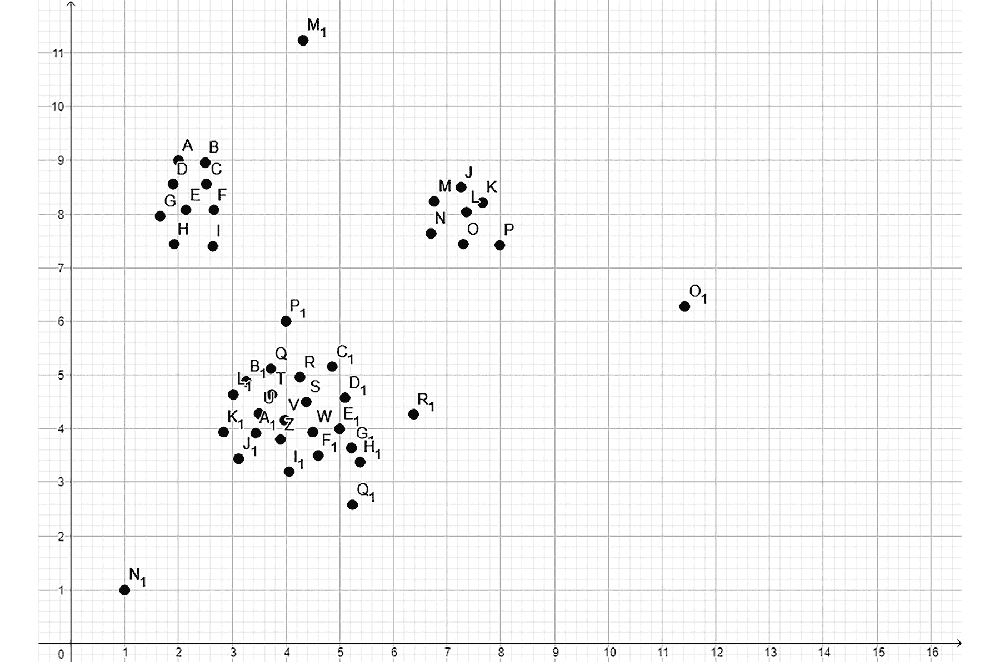
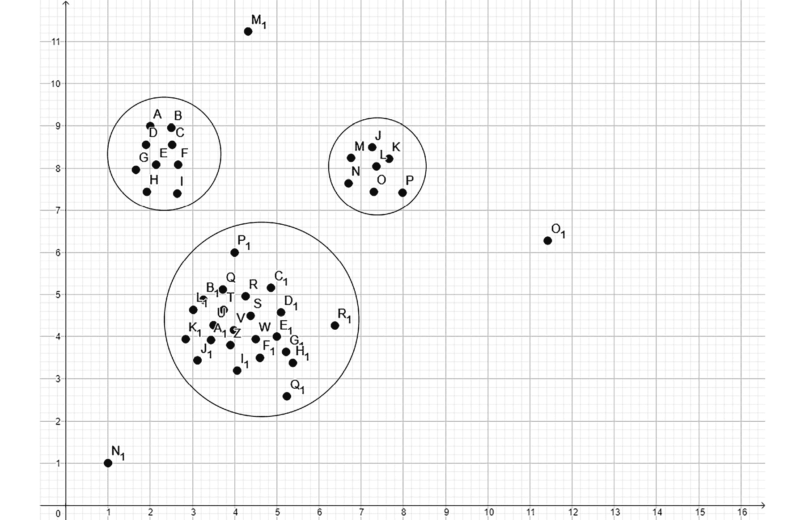
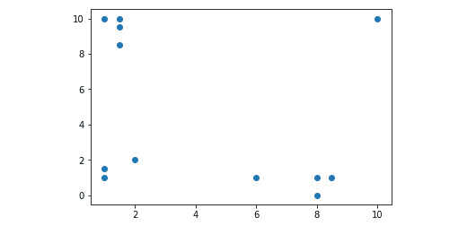
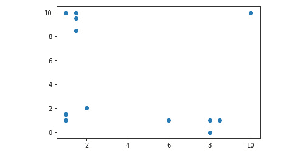
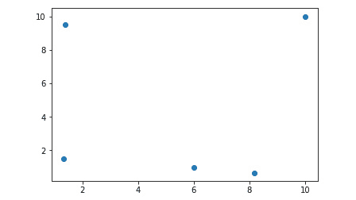

# 六、聚类

## 学习目标

本章结束时，您将能够:

*   总结集群的基础知识
*   使用 k-means 算法执行平面聚类
*   使用均值漂移算法执行分层聚类

在这一章中，你将学习聚类的基础知识，这将通过两个无监督学习算法来说明。

## 集群简介

在前面的章节中，我们讨论了监督学习算法来执行分类和回归。我们使用训练数据来训练我们的分类或回归模型，然后我们使用测试数据来验证我们的模型。

在这一章中，我们将使用聚类算法来执行无监督学习。

我们可以使用聚类来分析数据，以找到某些模式并创建组。除此之外，集群还可以用于许多目的:

*   市场细分检测市场中你应该从根本上关注的最佳股票。我们可以利用聚类来检测趋势、细分客户，或者向特定类型的客户推荐特定的产品。
*   在计算机视觉中，使用聚类来执行图像分割，其中我们在计算机处理的图像中找到不同的对象。
*   聚类可以与分类相结合，其中聚类可以生成多个特征的紧凑表示，然后可以将其提供给分类器。
*   聚类还可以通过检测异常值来过滤数据点。

不管我们是将聚类应用于遗传学、视频、图像还是社交网络，如果我们使用聚类来分析数据，我们可能会发现值得统一对待的数据点之间的相似性。

我们在没有指定标签的情况下执行聚类。聚类分析根据数据点之间的距离来定义分类。而；在分类中，我们定义精确的标签类来分组分类的数据点，在聚类中，没有标签。我们只需给机器学习模型提供特征，该模型就必须找出这些特征集所在的聚类。

### 定义聚类问题

假设你是一名商店经理，负责确保商店的盈利能力。你的产品分为几类。商店的不同顾客喜欢不同的商品。

例如，对生物产品感兴趣的顾客倾向于选择生物产品。如果你查看亚马逊，你还会发现不同类别产品的建议。这是基于用户可能感兴趣的内容。

我们将以这样一种方式定义聚类问题，即我们将能够在我们的数据点之间找到这些相似性。假设我们有一个由点组成的数据集。聚类通过描述这些点是如何分布的来帮助我们理解这种结构。

让我们看一个二维空间中数据点的例子:



###### 图 6.1:二维空间中的数据点

在本例中，很明显有三个集群:



###### 图 6.2:使用二维空间中的数据点形成的三个集群

这三个集群很容易被检测到，因为这些点彼此靠近。聚类确定彼此接近的数据点。还有一些不属于任何聚类的离群点。聚类算法应该准备好适当地处理这些离群点，而不是将它们移动到聚类中。

虽然在二维空间中识别聚类很容易，但我们通常有多维数据点。因此，了解哪些数据点彼此接近非常重要。此外，定义检测数据点是否彼此靠近的距离度量也很重要。一个众所周知的距离度量是欧几里德距离。在数学中，我们经常用欧氏距离来度量两点之间的距离。因此，对于聚类算法来说，欧几里德距离是一个直观的选择，这样我们就可以在定位聚类时确定数据点的接近程度。

包括欧几里德距离在内的大多数距离度量都有一个缺点:我们增加的维度越多，这些距离相互之间就越一致。因此，去除作为噪声而不是有用信息的特征可以极大地提高聚类模型的准确性。

### 聚类方法

聚类有两种类型:**扁平化**和**层级化**。

在平面聚类中，我们指定希望机器找到的聚类数。平面聚类的一个例子是 k-means 算法，其中 K 指定了我们希望该算法使用的聚类数。

在分层聚类中，机器学习算法找出所需的聚类数。

分层聚类也有两种方法:

*   **自底向上的层次聚类**将每个点视为一个聚类。这种方法将彼此靠近的集群联合在一起。
*   **自上而下的层次聚类**将数据点视为跨越整个状态空间的一个聚类。然后，聚类算法将我们的聚类分成更小的聚类。
*   **点分配聚类**根据新数据点与现有聚类的接近程度，将新数据点分配给这些聚类。

### scikit-learn 支持的聚类算法

在本章中，我们将了解 scikit-learn 支持的两种聚类算法:k 均值算法和 T2 均值偏移算法。

**k-means** 是平面聚类的一个例子，我们必须事先指定聚类的数量。k-means 是一种通用的聚类算法，如果聚类的数量不太高并且聚类的大小是均匀的，则该算法表现良好。

**Mean-shift** 是分层聚类的一个例子，其中聚类算法决定了聚类的数量。当我们事先不知道聚类的数目时，使用均值漂移。与 k-means 相比，mean shift 支持存在许多聚类的用例，即使聚类的大小相差很大。

scikit-learn 提供了其他聚类算法。这些措施如下:

*   **相似性传播**:类似于均值漂移
*   **谱聚类**:如果只有几个聚类，且聚类大小均匀，则性能更好
*   **沃德层次聚类**:预期有多个聚类时使用
*   **聚集聚类**:预期有多个聚类时使用
*   **DBSCAN 聚类**:支持不均匀的聚类大小和不平坦的点分布几何形状
*   **高斯混合**:使用平面几何，有利于密度估计
*   **Birch 聚类**:支持大数据集，去除离群值，支持数据约简

关于聚类算法的完整描述，包括性能比较，请访问 scikit 的聚类页面-在[http://scikit-learn.org/stable/modules/clustering.html](http://scikit-learn.org/stable/modules/clustering.html)了解。

## k 均值算法

k-means 算法是一种平面聚类算法。它的工作原理如下:

*   设置 k 的值。
*   从数据集中选择 K 个数据点，作为各个聚类的初始中心。
*   计算每个数据点到所选中心点的距离，并对聚类中初始中心最接近数据点的每个点进行分组。
*   一旦所有点都在 K 个聚类之一中，就计算每个聚类的中心点。该中心点不必是数据集中的现有数据点；它只是一个平均值。
*   重复此过程，将每个数据点分配到中心距离该数据点最近的聚类中。重复进行，直到中心点不再移动。

为了确保 k-means 算法终止，我们需要以下内容:

*   如果质心移动小于公差值，退出时的最大公差级别
*   移动移动点的最大重复次数

由于 k-means 算法的性质，它将很难处理大小相差很大的聚类。

k-means 算法有许多日常生活中的用例:

市场细分:公司从他们的客户群中收集各种数据。对公司的客户群执行 k-means 聚类分析揭示了具有定义特征的细分市场。属于同一细分市场的客户可以得到类似的对待。不同的部分接受不同的治疗。

**书籍、电影或其他文档的分类:**当影响者建立个人品牌，作者写书和创作书籍，或者一家公司管理其社交媒体账户时，内容就是王道。内容通常由标签和其他数据来描述。该数据可用作聚类的基础，以定位本质上相似的文档组。

**侦测欺诈和犯罪活动:**欺诈者通常会以客户或访客异常行为的形式留下线索。例如，汽车保险保护司机免受盗窃和事故造成的损害。真盗和假盗的特征是特征值不同。同样，故意撞坏一辆车留下的痕迹与意外撞坏一辆车留下的痕迹是不同的。聚类通常可以检测欺诈，帮助行业专业人士更好地了解他们最差客户的行为。

### 练习 19:sci kit 中的 k-means-learn

要在二维平面中绘制数据点并对其执行 k-means 算法以执行聚类，请执行以下步骤:

1.  We will create an artificial dataset as a NumPy Array to demonstrate the k-means algorithm:

    ```py
    import numpy as np
    data_points = np.array([
        [1, 1], 
        [1, 1.5],
        [2, 2],
        [8, 1],
        [8, 0],
        [8.5, 1],
        [6, 1],
        [1, 10],
        [1.5, 10],
        [1.5, 9.5],
        [10, 10],
        [1.5, 8.5]
    ])
    import matplotlib.pyplot as plot
    plot.scatter(data_points.transpose()[0], data_points.transpose()[1])
    ```

    输出如下所示:

    

    ###### 图 6.3:使用 matplotlib.pyplot 显示二维平面上的数据点的图表

    #### 注意

    我们使用了`transpose array` 方法来获得第一个特性和第二个特性的值。这与前几章是一致的。我们也可以使用适当的数组索引来访问这些列:`dataPoints[:,0]`相当于`dataPoints.transpose()[0]`。

2.  现在我们有了数据点，是时候对它们执行 k-means 算法了。如果我们在 k-means 算法中将 K 定义为`3`，我们期望在图的左下角、左上角和右下角有一个聚类:

    ```py
    from sklearn.cluster import KMeans
    k_means_model = KMeans(n_clusters=3)
    k_means_model.fit(data_points)
    ```

3.  Once the clustering is done, we can access the center point of each cluster:

    ```py
    k_means_model.cluster_centers_
     array([[1.33333333, 1.5       ],
            [3.1       , 9.6       ],
            [7.625     , 0.75      ]])
    ```

    事实上，聚类的中心点似乎位于图形的左下角、左上角和右下角。左上角聚类的 X 坐标是 3.1，很可能是因为它包含了我们的离群数据点[10，10]。

4.  让我们用不同的颜色和它们的中心点来画出这些簇。要知道哪个数据点属于哪个聚类，我们必须查询 k-means 分类器的`labels_` 属性:

    ```py
    k_means_model.labels_
     array([0, 0, 0, 2, 2, 2, 2, 1, 1, 1, 1, 1])
    ```

5.  The output array shows which data point belongs to which cluster. This is all we need to plot the data:

    ```py
    plot.scatter(
        k_means_model.cluster_centers_[:,0], 
        k_means_model.cluster_centers_[:,1]
    )
    for i in range(len(data_points)): 
        plot.plot( 
            data_points[i][0], 
            data_points[i][1], 
            ['ro','go','yo'][k_means_model.labels_[i]]  
        )
    plot.show()
    ```

    输出如下所示:

    

    ###### 图 6.4:选择三个集群时，以红色、绿色和蓝色显示数据点的图形

    蓝色中心点确实在它们的簇内，簇由红色点、绿色点和黄色点表示。

6.  Let's see what happens if we choose only two clusters instead of three:

    ```py
    k_means_model = KMeans(n_clusters=2)
    k_means_model.fit(data_points)
    plot.scatter(
        k_means_model.cluster_centers_[:,0], 
        k_means_model.cluster_centers_[:,1]
    )
    for i in range(len(data_points)): 
        plot.plot( 
            data_points[i][0], 
            data_points[i][1], 
            ['ro','go'][k_means_model.labels_[i]]  
        )
    plot.show()
    ```

    输出如下所示:

    .jpg)

    ###### 图 6.5:选择两个集群时，以红色、蓝色和绿色显示数据点的图形

    这一次，我们只有红绿点，我们有一个底部集群和一个顶部集群。有趣的是，第二个示例中顶部的红色聚类与第一个示例中的顶部聚类包含相同的点。第二个示例的底部聚类由连接第一个示例的左下和右下聚类的数据点组成。

7.  我们也可以使用 k-means 模型进行预测。输出是一个数组，包含属于每个数据点的簇号:

    ```py
    k_means_model.predict([[5,5],[0,10]])
     array([1, 0])
    ```

### scikit-learn 中 k-means 算法的参数化

与第 3、4、5 章中的分类和回归模型一样，k-means 算法也可以参数化。完整的参数列表可以在[http://sci kit-learn . org/stable/modules/generated/sk learn . cluster . k means . html](http://scikit-learn.org/stable/modules/generated/sklearn.cluster.KMeans.html)找到。

一些例子如下:

*   `n_clusters`:数据点被分隔的聚类数。默认值为 **8** 。
*   `max_iter`:最大迭代次数。
*   `tol`:检查是否可以退出 k-means 算法的容差。

在上一节中，我们使用了两个属性来检索聚类中心点和聚类本身:

`cluster_centers_`:返回聚类中心点的坐标。

`labels_`:返回一个整数数组，表示数据点所属的聚类数。编号从零开始。

### 练习 20:检索中心点和标签

要了解`cluster_centers_`和`labels_`的用法，请执行以下步骤:

1.  回想一下我们在 scikit-learn 中执行 k-means 算法的例子。我们有 12 个数据点和三个集群:

    ```py
    data_points = np.array([
        [1, 1],
        [1, 1.5],
        [2, 2],
        [8, 1],
        [8, 0],
        [8.5, 1],
        [6, 1],
        [1, 10],
        [1.5, 10],
        [1.5, 9.5],
        [10, 10],
        [1.5, 8.5]
    ])
    k_means_model.cluster_centers_
     array([[1.33333333, 1.5       ],
          [3.1       , 9.6       ],
           [7.625     , 0.75      ]])
    ```

2.  Apply the **labels_** property on the cluster:

    ```py
    k_means_model.labels_
     array([0, 0, 0, 2, 2, 2, 2, 1, 1, 1, 1, 1])
    ```

    **cluster_centers_** 属性的输出很明显:它显示了中心点的 X 和 Y 坐标。**标签 _** 属性是一个长度为 12 的数组，显示它所属的 12 个数据点的分类。第一个群集与数字 0 相关联，第二个与 1 相关联，第三个与 2 相关联，依此类推。

### 销售数据的 k-均值聚类

在接下来的活动中，我们将考虑销售数据，并对该销售数据执行 k 均值聚类。

### 活动 12:销售数据的 k 均值聚类

在第部分，我们将检测表现相似的产品销售，以识别产品销售趋势。

我们将使用销售交易周数据集，该数据集位于以下 URL:

[https://archive . ics . UCI . edu/ml/datasets/Sales _ Transactions _ Dataset _ Weekly](https://archive.ics.uci.edu/ml/datasets/Sales_Transactions_Dataset_Weekly)使用 k-means 算法对数据集执行聚类。请确保根据您在前面章节中所学的知识准备好用于聚类的数据。

使用 k-means 算法的默认设置:

1.  使用 pandas 加载数据集。如果您检查 CSV 文件中的数据，您会发现第一列包含产品 ID 字符串。这些值只是给聚类过程增加了噪声。另外，请注意，对于第 0 周到第 51 周，有一个 W 前缀的标签和一个规范化标签。使用规范化标签更有意义，这样我们可以从数据集中删除常规的每周标签。创建一个 k 均值聚类模型，并将数据点归入 8 个聚类。从聚类算法中检索中心点和标签。
2.  可以使用 **labels_** 属性检索属于每个数据点的标签。这些标注决定了原始数据框行的聚类。这些标签有什么好处？

假设，在原始数据框中，给出了产品名称。你可以很容易地认识到这样一个事实:相似类型的产品卖得相似。也有波动很大的产品，有季节性的产品。例如，如果一些产品促进脂肪流失和保持身材，他们往往会在上半年，海滩季节之前销售。

#### 注意

这项活动的解决方案在第 291 页。

## 均值漂移算法

均值漂移是一种分层聚类算法。与 k-means 算法不同，在 mean shift 中，聚类算法确定需要多少个聚类，并执行聚类。这是有利的，因为我们很少知道我们要寻找多少个集群。

这个算法在我们的日常生活中也有很多用例。例如，Xbox Kinect 设备使用均值漂移算法来检测人体部位。一些手机也使用均值漂移算法来检测人脸。随着社交媒体平台的增长，图像分割是许多用户已经习惯的功能。因为图像分割也是计算机视觉的基础，所以可以在那里找到一些应用。均值漂移算法也可以挽救生命，因为它内置于许多现代汽车的汽车检测软件中。想象一下，有人在你面前紧急刹车。你的汽车的图像分割软件检测到你前面的汽车正在惊人地靠近你，并在你意识到紧急情况之前施加紧急制动。这些驾驶辅助设备在现代汽车中普遍存在。自动驾驶汽车仅一步之遥。

### 练习 21:举例说明 2D 的平均转变

要使用均值漂移算法学习聚类，请执行以下步骤:

1.  让我们回忆一下上一个主题的数据点:

    ```py
    data_points = np.array([
        [1, 1], 
        [1, 1.5],
        [2, 2],
        [8, 1],
        [8, 0],
        [8.5, 1],
        [6, 1],
        [1, 10],
        [1.5, 10],
        [1.5, 9.5],
        [10, 10],
        [1.5, 8.5]
    ])
    r = 2;
    ```

2.  我们现在的任务是找到一个点 P (x，y ),对于该点，在从点 P 开始的半径 R 内的数据点的数量是最大的。点数分布如下:

    ###### 图 6.6:显示数据点数组中数据点的图形

3.  假设我们最初将点 P 等同于第一个数据点，[1，1]:

    ```py
    P = [1, 1]
    ```

4.  让我们找出距离这个点 R 以内的点:

    ```py
    from scipy.spatial import distance
    points = np.array([
        p0 for p0 in data_points if distance.euclidean(p0, P) <= r 
    ])
    points
     array([[1\. , 1\. ],
       [1\. , 1.5],
       [2\. , 2\. ]])
    ```

5.  让我们计算数据点的平均值:

    ```py
    import numpy as np
    P = [  
        np.mean( points.transpose()[0] ), 
        np.mean(points.transpose()[1] ) 
    ]
    P
     [1.3333333333333333, 1.5]
    ```

6.  既然已经计算了新的平均值，我们可以再次检索给定半径内的点:

    ```py
    points = np.array([
        p0 for p0 in data_points if distance.euclidean( p0, P) <= r 
    ])
    points
     array([[1\. , 1\. ],
       [1\. , 1.5],
       [2\. , 2\. ]])
    ```

7.  这是相同的三点，所以我们可以停在这里。在`[1.3333333333333333, 1.5]`的均值附近发现了三个点。这个中心周围半径为 2 的点形成一个簇。
8.  如果我们检查数据点[1，1.5]和[2，2]，我们会得到相同的结果。让我们继续我们列表中的第四点，[8，1]:

    ```py
    P = [8, 1]
    points = np.array( [
        p0 for p0 in data_points if distance.euclidean(p0, P) <= r 
    ])
    points
     array([[8\. , 1\. ],
            [8\. , 0\. ],
            [8.5, 1\. ],
            [6\. , 1\. ]])
    ```

9.  This time, all four points in the area were found. Therefore, we can simply calculate their mean:

    ```py
    P = [  
        np.mean(points.transpose()[0]), 
        np.mean(points.transpose()[1]) 
    ]
     [7.625, 0.75]
    ```

    这个平均值不会改变，因为在下一次迭代中，我们将找到相同的数据点。

10.  请注意，我们幸运地选择了点[8，1]。如果我们从`P = [8, 0]`或`P = [8.5, 1]`开始，我们只会发现三个点，而不是四个点:

    ```py
    P = [8, 0]
    points = np.array([
        p0 for p0 in data_points if distance.euclidean(p0, P) <= r 
    ])
    points
     array([[8\. , 1\. ],
       [8\. , 0\. ],
       [8.5, 1\. ]])
    ```

11.  计算完这三个点的平均值后，我们必须使用移动后的平均值重新进行距离计算:

    ```py
    P = [  
        np.mean(points.transpose()[0]), 
        np.mean(points.transpose()[1]) 
    ]
    P
     [8.166666666666666, 0.6666666666666666]
    ```

12.  The output for point P = [8.5, 1] is the following array:

    ```py
     array([[8\. , 1\. ],
       [8\. , 0\. ],
       [8.5, 1\. ]])
    ```

    我们只是又找到了同样的三个点。这意味着从[8，1]开始，我们得到了比从[8，0]或[8.5，1]开始更大的集群。因此，我们必须选择包含最多数据点的中心点。

13.  现在，让我们检查一下如果我们从第四个数据点开始发现会发生什么，**【6，1】**:

    ```py
    P = [6, 1]
    points = np.array([
        p0 for p0 in data_points if distance.euclidean(p0, P) <= r 
    ])
    points
     array([[8., 1.],
      [6., 1.]])
    ```

14.  我们成功地找到了数据点[8，1]。因此，我们必须将平均值从[6，1]移动到计算出的新平均值[7，1]:

    ```py
    P = [  
        np.mean(points.transpose()[0]), 
        np.mean(points.transpose()[1]) 
    ]
    P
     [7.0, 1.0]
    ```

15.  Let's check if we found more points:

    ```py
    points = np.array([
        p0 for p0 in data_points if distance.euclidean(p0, P) <= r 
    ])
    points
     array([[8\. , 1\. ],
       [8\. , 0\. ],
       [8.5, 1\. ],
       [6\. , 1\. ]])
    ```

    是的–我们成功地找到了所有四个点！因此，我们已经成功地定义了一个大小为 4 的集群。均值会和之前一样:`[7.625, 0.75]`。

    这是一个简单的应用均值漂移算法的聚类示例。我们只是提供了一个例子来说明该算法是如何寻找聚类的。然而，还有一个问题:半径的值。

    请注意，如果半径没有设置为 2，我们可以简单地从包括所有数据点的大半径开始，然后减小半径，或者从非常小的半径开始，确保每个数据点都在自己的簇中，然后增加半径，直到获得所需的结果。

### sci kit-learn 中的均值漂移算法

让我们使用与 k-means 算法中相同的数据点:

```py
import numpy as np
data_points = np.array([
    [1, 1], 
    [1, 1.5],
    [2, 2],
    [8, 1],
    [8, 0],
    [8.5, 1],
    [6, 1],
    [1, 10],
    [1.5, 10],
    [1.5, 9.5],
    [10, 10],
    [1.5, 8.5] 
])
```

均值漂移聚类算法的语法类似于 k 均值聚类算法。

```py
from sklearn.cluster import MeanShift
mean_shift_model = MeanShift()
mean_shift_model.fit(data_points)
```

聚类完成后，我们可以访问每个聚类的中心点:

```py
mean_shift_model.cluster_centers_
```

输出如下所示:

```py
array([[ 1.375     ,  9.5       ],
       [ 1.33333333,  1.5       ],
       [ 8.16666667,  0.66666667],
       [ 6\.        ,  1\.        ],
       [10\.        , 10\.        ]])
```

均值漂移模型找到了 5 个聚类，其中心如前面的代码所示。

与 k-means 类似，我们也可以获得标签:

```py
mean_shift_model.labels_
```

输出如下所示:

```py
 array([1, 1, 1, 2, 2, 2, 3, 0, 0, 0, 4, 0], dtype=int64)
```

输出数组显示了哪个数据点属于哪个聚类。这就是我们绘制数据所需的全部内容:

```py
plot.scatter(
    mean_shift_model.cluster_centers_[:,0], 
    mean_shift_model.cluster_centers_[:,1]
)
for i in range(len(data_points)): 
    plot.plot( 
        data_points[i][0], 
        data_points[i][1], 
        ['ro','go','yo', 'ko', 'mo'][mean_shift_model.labels_[i]]  
    )
plot.show()
```

输出如下所示:



###### 图 6.7:基于 k 均值的图表，

三个蓝色点是红色、绿色和黄色集群的中心点。坐标系中还有两个单点簇，分别属于点(6，1)和(10，10)。

### Python 中的图像处理

要解决即将到来的活动，您需要知道如何在 Python 中处理图像。为此，我们将使用 SciPy 库。

有多种方法可以从路径中读取图像文件。

最简单的是来自 Python 图像库(PIL)的**图像**接口:

```py
from PIL import Image
image = Image.open('file.jpg')
```

前面的代码假设在 **open** 方法的字符串参数中指定的文件路径指向一个有效的图像文件。

我们可以通过查询 size 属性来获取图像的大小:

```py
image.size
```

输出如下所示:

```py
 (750, 422)
```

我们可以从包含每个像素的 RGB 值的图像创建一个二维 NumPy 数组:

```py
import numpy as np
pixel_array = np.array(image)
```

一旦构建了像素阵列，我们就可以轻松地检索和操作每个像素:

```py
pixel_array[411][740]
```

输出如下所示:

```py
 array([29, 33, 32], dtype=uint8)
```

也可以使用图像的`load()`方法来访问图像的像素。一旦我们访问了这些像素，我们就可以根据文件格式获得每个像素的 RGB 或 RGBA 值:

```py
pixels = image.load()
pixels[740, 411]
```

输出如下所示:

```py
 (29, 33, 32)
```

注意像素坐标的顺序是相反的，也就是从左向右读时的`pixel_array[411][740]`。我们正在读取完全相同的像素，但是我们必须提供不同的坐标。

我们还可以将像素设置为一个新值:

```py
pixels[740, 411] = (255, 0, 0)
```

如果要保存更改，使用图像的`save()`方法:

```py
image.save('test.jpg')
```

为了对图像的像素执行聚类分析，我们需要将图像转换为数据框。这意味着我们必须将图像的像素转换成一个元组或一组`['x', 'y', 'red', 'green', 'blue']`值。一旦我们有了这些值的一维数组，我们就可以将它们转换成熊猫数据帧:

```py
import pandas
data_frame = pandas.DataFrame( 
    [[x,y,pixels[x,y][0], pixels[x,y][1], pixels[x,y][2]] 
        for x in range(image.size[0]) 
        for y in range(image.size[1]) 
    ], 
    columns=['x', 'y', 'r', 'g', 'b' ] 
)
data_frame.head()
```

输出如下所示:

```py
   x  y  r   g   b
0  0  0  6  29  71
1  0  1  7  32  73
2  0  2  8  37  77
3  0  3  8  41  82
4  0  4  7  45  84
```

要完成使用均值漂移算法处理图像的活动，您只需知道这些。

### 活动 13:使用均值漂移算法进行形状识别

在本节中，我们将学习如何对图像进行聚类。假设你在一家从照片中检测人类情绪的公司工作。你的任务是在头像照片中提取组成人脸的像素。

创建一个具有均值漂移的聚类算法来聚类图像的像素。检查均值偏移算法的结果，并检查在头像图像上使用时是否有任何聚类包含人脸。

然后，应用 k-means 算法，使用固定的默认聚类数(本例中为 8)。将您的结果与均值漂移聚类算法进行比较:

1.  选择要群集的映像并加载该映像。
2.  将像素转换为数据帧以执行聚类。使用 scikit-learn 对图像执行均值漂移聚类。注意，这一次，我们将跳过特征的归一化，因为像素的接近度和颜色分量的接近度以接近相等的权重表示。该算法将找到两个聚类。
3.  根据您使用的图像，请注意 Mean Shift 算法如何处理人类肤色，以及图像的哪些其他部分被放在同一个簇中。包含化身中大部分皮肤的聚类通常包括与皮肤颜色非常接近和/或具有相似颜色的数据点。
4.  让我们使用 k-means 算法在相同的数据上形成八个聚类。

您将会看到，聚类算法确实找到了相近且包含相似颜色的数据点。

#### 注意

这项活动的解决方案在第 293 页。

## 总结

在本章中，我们学习了聚类的工作原理。聚类是无监督学习的一种形式，其中给定特征，聚类算法找到标签。

有两种类型的聚类:平面聚类和层次聚类。

k-means 算法是一种平面聚类算法，其中我们为 K 个聚类确定 K 个中心点，并且该算法找到数据点。

均值漂移是分层聚类算法的一个示例，其中不同标签值的数量由算法确定。

最后一章将介绍一个领域，由于计算能力和廉价、可扩展的在线服务器容量的爆炸，这个领域在这十年变得很受欢迎。这个领域是神经网络和深度学习的科学。