# 七、使用神经网络的深度学习

## 学习目标

本章结束时，您将能够:

*   执行基本的张量流运算来求解各种表达式
*   描述人工神经网络如何工作
*   用 TensorFlow 训练和测试神经网络
*   用 TensorFlow 实现深度学习神经网络模型

在本章中，我们将使用 TensorFlow 库检测手写数字。

## 简介

在这一章中，我们将学习另一种监督学习技术。但是，这一次，我们没有使用分类或回归等简单的数学模型，而是使用了一种完全不同的模型:**神经网络**。虽然我们将使用神经网络进行监督学习，但请注意，神经网络也可以对无监督学习技术进行建模。这个模型的重要性在上个世纪增加了，因为在过去，使用这个模型进行监督学习所需的计算能力是不够的。所以上个世纪在实践中出现了神经网络。

## TensorFlow for Python

TensorFlow 是 Google 维护的最重要的机器学习和开源库之一。TensorFlow API 有多种语言版本，包括 Python、JavaScript、Java 和 c。由于 TensorFlow 支持监督学习，我们将使用 TensorFlow 来构建图形模型，然后使用该模型进行预测。

TensorFlow 与张量一起工作。张量的一些例子是:

*   浮点数等标量值。
*   任意长度的向量。
*   一个正则矩阵，包含 p 乘以 q 个值，其中 p 和 q 是有限整数。
*   一种 p x q x r 广义类矩阵结构，其中 p，q，r 是有限整数。将此结构想象为三维空间中的矩形对象，边长为 p、q 和 r。此数据结构中的数字可以在三维空间中可视化。
*   观察上述四种数据结构，更复杂的 n 维数据结构也可以是张量的有效例子。

在这一章中，我们将坚持标量、向量和正规矩阵张量。在本章的范围内，把张量想象成标量值，或者数组，或者数组的数组。

TensorFlow 用于创建人工神经网络，因为它对其输入、输出、内部节点以及这些节点之间的有向边进行建模。TensorFlow 还带有数学函数来转换信号。当神经网络中的神经元被激活时，这些数学函数也将在建模时派上用场。

#### 注意

张量是类似数组的对象。流象征着张量数据的操作。所以，本质上，TensorFlow 是一个数组数据操作库。

TensorFlow 的主要用例是人工神经网络，因为该领域需要对大型数组和矩阵进行操作。TensorFlow 附带了许多与深度学习相关的功能，因此它是神经网络的最佳环境。TensorFlow 用于语音识别和语音搜索，它也是 translate.google.com 背后的大脑。在本章的后面，我们将使用 TensorFlow 来识别手写字符。

### 在 Anaconda 导航器中安装 TensorFlow

让我们打开 Anaconda 提示符并使用`pip`安装 TensorFlow:

```
pip install tensorflow
```

安装将需要几分钟，因为软件包本身相当大。如果你更喜欢使用你的显卡 GPU 而不是你的 CPU，你也可以使用`tensorflow-gpu`。确保你只使用 GPU 版本，如果你有足够好的显卡的话。

完成安装后，可以在 IPython 中导入 TensorFlow:

```
import tensorflow as tf
```

首先，我们将使用 TensorFlow 来构建一个图。这个模型的执行是分开的。这种分离很重要，因为执行是资源密集型的，因此可以在专门解决计算量大的问题的服务器上运行。

### 张量流运算

TensorFlow 提供了许多操作来操作数据。这些操作的几个例子如下:

*   `add`和`multiply`
*   `exp`和`log`
*   `greater`、`less`和`equal`
*   `concat`、`slice`和`split`
*   `matrix_inverse`、`matrix_determinant`和`matmul`
*   `sigmoid`、`ReLU`和`softmax`

### 练习 22:使用基本运算和张量流常数

使用 Tensorflow 中的算术运算求解表达式: *2 * 3 + 4*

这些操作可用于构建图形。为了更好地理解张量流常数和基本算术运算符，让我们考虑一个简单的表达式 *2 * 3 + 4* 该表达式的图形如下:

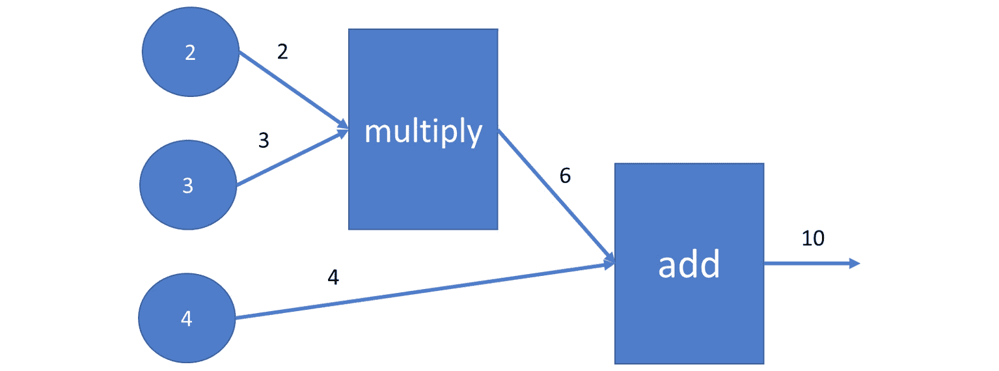

###### 图 7.1:表达式 2*3+4 的图形

1.  使用以下代码在 TensorFlow 中对此图建模:

    ```
    import tensorflow as tf
    input1 = tf.constant(2.0, tf.float32, name='input1')
    input2 = tf.constant(3.0, tf.float32, name='input2')
    input3 = tf.constant(4.0, tf.float32, name='input3')
    product12 = tf.multiply(input1, input2)
    sum = tf.add(product12, input3)
    ```

2.  一旦构建了图形，为了执行计算，我们必须打开一个 TensorFlow 会话并执行我们的节点:

    ```
    with tf.Session() as session:
        print(session.run(product12))
        print(session.run(sum))
    6.0
    10.0
    ```

### 占位符和变量

现在您可以用 TensorFlow 构建表达式了，让我们更进一步，构建占位符和变量。

当会话开始执行时，占位符被替换为常数值。占位符本质上是在求解表达式之前被替换的参数。变量是在会话执行期间可能会改变的值。

让我们用张量流创建一个参数化表达式:

```
import tensorflow as tf
input1 = tf.constant(2.0, tf.float32, name='input1')
input2 = tf.placeholder(tf.float32, name='p')
input3 = tf.Variable(0.0, tf.float32, name='x')
product12 = tf.multiply(input1, input2)
sum = tf.add(product12, input3)
with tf.Session() as session:
    initializer = tf.global_variables_initializer()
    session.run(initializer)
    print(session.run(sum, feed_dict={input2: 3.0}))
```

输出为`6.0`。

在`session.run`中执行后，`tf.global_variables_initializer()`调用将`input3`中的变量初始化为默认值零。

通过使用提要字典在另一个`session.run`语句中计算总和，因此使用常量`3.0`代替`input2`参数。

注意，在这个特定的例子中，变量 x 被初始化为零。在 TensorFlow 会话执行期间，x 的值不变。稍后，当我们将使用 TensorFlow 描述神经网络时，我们将定义一个优化目标，会话将优化变量的值以满足该目标。

### 全局变量初始化器

由于 TensorFlow 经常使用矩阵运算，因此了解如何将随机变量矩阵初始化为根据以零为中心的正态分布随机生成的值是有意义的。

不仅仅是矩阵，所有的全局变量都在会话中通过调用`tf.global_variables_initializer()`来初始化:

```
randomMatrix = tf.Variable(tf.random_normal([3, 4]))
with tf.Session() as session:
    initializer = tf.global_variables_initializer()
    print( session.run(initializer))
    print( session.run(randomMatrix))

None
[[-0.41974232  1.8810892  -1.4549098  -0.73987174]
 [ 2.1072254   1.7968426  -0.38310152  0.98115194]
 [-0.550108   -0.41858754  1.3511614   1.2387075 ]]
```

如您所见，`tf.Variable`的初始化需要一个参数:值`tf.random_normal([3,4])`。

## 神经网络简介

神经网络是人工智能的最新分支。神经网络的灵感来自人脑的工作方式。最初，它们是由沃伦麦卡洛克和沃尔特皮茨在 20 世纪 40 年代发明的。神经网络是一种数学模型，用于描述人脑如何解决问题。

当谈到数学模型时，我们将使用人工神经网络这个短语，而当谈到人脑时，我们将使用生物神经网络。人工神经网络是监督学习算法。

与其他分类或回归模型相比，神经网络的学习方式更加复杂。神经网络模型具有大量的内部变量，并且输入和输出变量之间的关系可能经过多个内部层。与其他监督学习算法相比，神经网络具有更高的准确性。

#### 注意

用 TensorFlow 掌握神经网络是一个复杂的过程。本节的目的是为您提供入门资源。

在这一章中，我们将要使用的主要例子是从图像中识别数字。我们正在考虑这个图像，因为它很小，我们有大约 70，000 张图像可用。处理这些图像所需的处理能力与普通计算机相似。

人工神经网络的工作原理类似于人脑的工作原理。人脑中的树突与细胞核相连，而细胞核与轴突相连。在这里，树枝状大分子充当输入，细胞核是计算发生的地方(加权和和激活函数)，轴突的作用类似于输出。

然后，我们通过将加权和传递给激活函数来确定哪个神经元触发。如果该函数确定某个神经元必须触发，则信号会出现在输出中。这个信号可以是网络中其他神经元的输入:

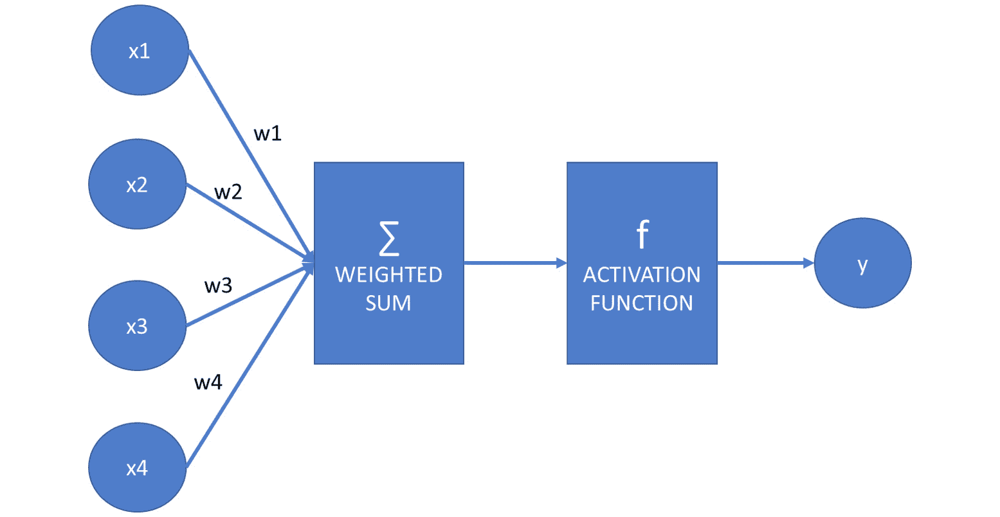

###### 图 7.2:显示人工神经网络如何工作的图表

假设`f`是激活函数，`x1`、`x2`、`x3`和`x4`是输入，它们的和用权重`w1`、`w2`、`w3`和`w4`加权:

```
y = f(x1*w1 + x2*w2 + x3*w3 + x4*w4)
```

假设矢量`x`为(`x1`、`x2`、`x3`、`x4`)，矢量`w`为(`w1`、`w2`、`w3`、`w4`)，我们可以把这个方程写成这两个矢量的标量或点积:

```
y = f(x ⋅ w)
```

我们定义的结构是一个神经元:

让我们隐藏这个神经元的细节，以便更容易构建神经网络:

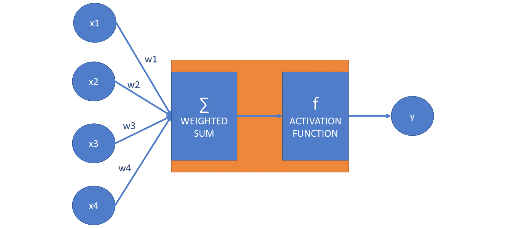

###### 图 7.4:表示神经元隐藏层的图表

我们可以创建多个盒子和多个输出变量，它们可能会由于读取输入的加权平均值而被激活。

尽管在下图中有从所有输入指向所有框的箭头，但请记住箭头上的权重可能为零。我们仍然在图中显示这些箭头:

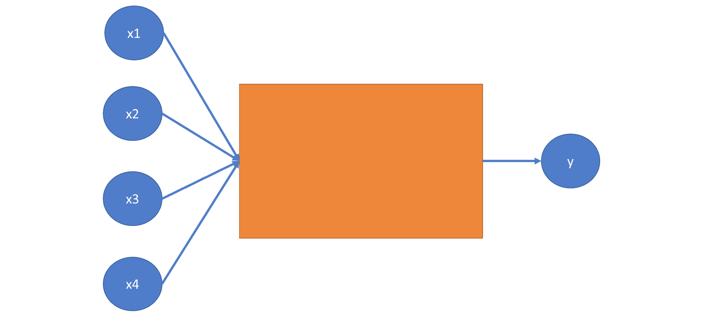

###### 图 7.5:表示神经网络的图表

描述输入和输出之间关系的方框称为隐藏层。具有一个隐藏层的神经网络称为**常规神经网络**。

当连接输入和输出时，我们可能有多个隐藏层。具有多个层的神经网络被称为**深度神经网络**:

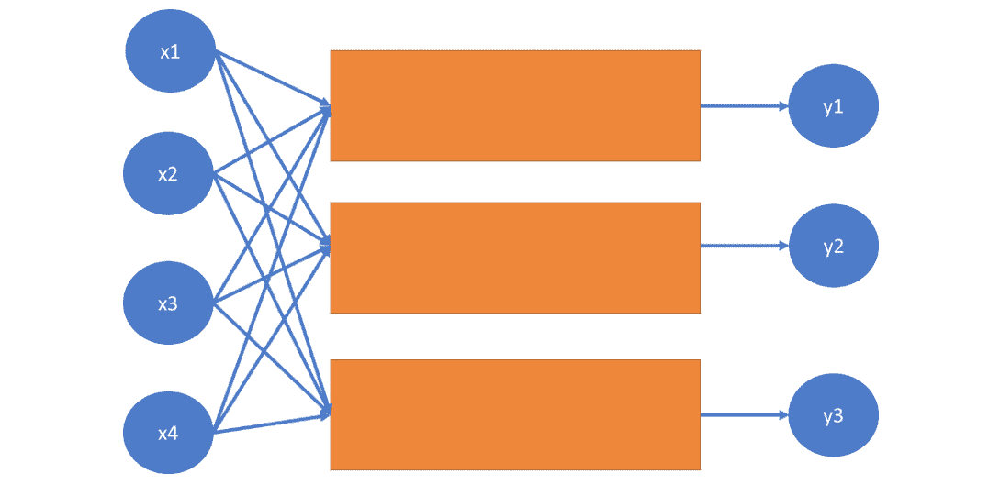

###### 图 7.6:表示深度神经网络的图表

深度学习这个术语来源于多层的存在。创建人工神经网络时，我们可以指定隐藏层的数量。

### 偏见

让我们再来看看神经网络中神经元的模型:

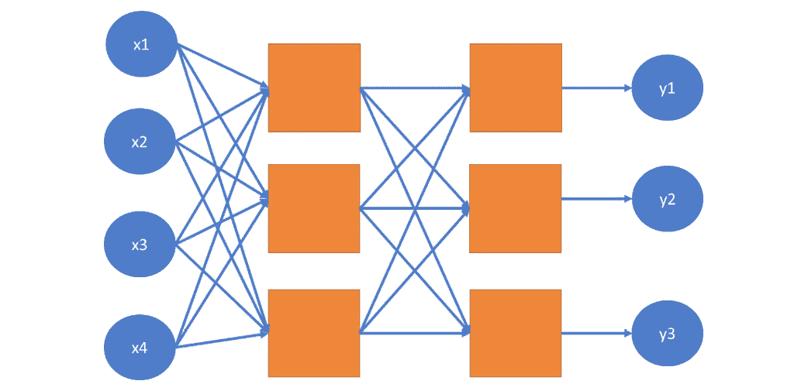

###### 图 7.7:神经网络中神经元的示意图

我们了解到这个神经元的方程式如下:

```
y = f(x1*w1 + x2*w2 + x3*w3 + x4*w4)
```

这个等式的问题在于，没有依赖于输入 x1、x2、x3 和 x4 的常数因子。这意味着神经网络中的每个神经元在没有偏差的情况下，总是在每个权重输入对的乘积为零时产生这个值。

因此，我们在等式中加入偏差:

```
y = f(x1*w1 + x2*w2 + x3*w3 + x4*w4 + b)
y = f(x ⋅ w + b)
```

第一个等式是详细的形式，描述了每个坐标、权重系数和偏差的作用。第二个方程是向量形式，其中 x = (x1，x2，x3，x4)，w = (w1，w2，w3，w4)。向量之间的点运算符表示两个向量的点或标量积。这两个方程是等价的。我们将在实践中使用第二种形式，因为使用 TensorFlow 定义变量向量比逐个定义每个变量更容易。

同样，对于 *w1* 、 *w2* 、 *w3* 、 *w4* ，偏差 *b* 是一个变量，意味着它的值在学习过程中可以变化。

通过将该常数因子嵌入每个神经元，神经网络模型从更好地拟合特定训练数据集的目的出发变得更加灵活。

#### 注意

由于一些负权重的存在，可能会出现乘积`p = x1*w1 + x2*w2 + x3*w3 + x4*w4`为负的情况。我们可能仍然希望给模型一定的灵活性，让它能够用大于给定负数的值来激发神经元。因此，例如，增加一个恒定的偏置 b = 5，可以确保神经元也为-5 和 0 之间的值触发。

### 人工神经网络的用例

人工神经网络在监督学习技术中占有一席之地。他们可以模拟分类和回归问题。分类器神经网络寻找特征和标签之间的关系。特征是输入变量，而分类器可以选择作为返回值的每个类是单独的输出。在回归的情况下，输入变量是要素，而只有一个输出:预测值。虽然传统的分类和回归技术在人工智能中有其使用案例，但人工神经网络通常更善于发现输入和输出之间的复杂关系。

### 激活功能

在神经网络中使用不同的激活函数。如果没有这些函数，神经网络将是一个线性模型，可以很容易地用矩阵乘法来描述。

神经网络的激活函数提供了非线性。最常见的激活函数是`sigmoid`和`tanh`(双曲正切函数)。

`sigmoid`的公式如下:

```
import numpy as np
def sigmoid(x): 
    return 1 / (1 + np.e ** (-x))
```

让我们使用`pyplot`来绘制这个函数:

```
import matplotlib.pylab as plt
x = np.arange(-10, 10, 0.1)
plt.plot(x, sigmoid(x))
plt.show()
```

输出如下所示:

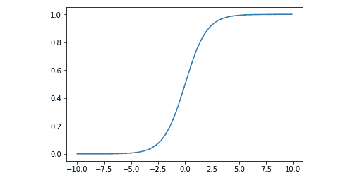

###### 图 7.8:显示 s 形曲线的图表

sigmoid 函数有几个问题。

首先，它可能不成比例地放大或减弱重量。

第二，`sigmoid(0)`不为零。这使得学习过程更加困难。

双曲正切的公式如下:

```
def tanh(x): 
    return 2 / (1 + np.e ** (-2*x)) - 1
```

我们也可以这样绘制这个函数:

```
x = np.arange(-10, 10, 0.1)
plt.plot(x, tanh(x))
plt.show()
```

输出如下所示:

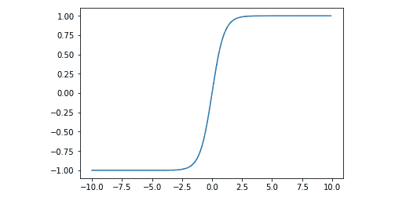

###### 图 7.9:绘制双曲正切后的图形

这两个函数都给神经元发出的值增加了一点非线性。sigmoid 函数看起来稍微平滑一些，而 tanh 函数给出的结果稍微尖锐一些。

另一个激活功能最近开始流行:`ReLU`。`ReLU`代表整流线性单元:

```
def relu(x):
    return 0 if x < 0 else x
```

使神经网络模型非线性化使得该模型更容易逼近非线性函数。如果没有这些非线性函数，不管网络的层数有多少，我们都只能近似线性问题:

```
def reluArr(arr):
   return [relu(x) for x in arr]
x = np.arange(-10, 10, 0.1)
plt.plot(x, reluArr(x))
plt.show()
```

输出如下所示:

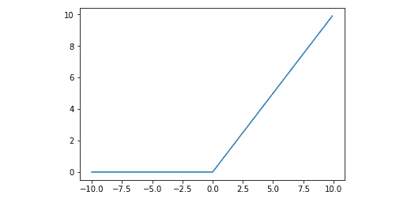

###### 图 7.10:显示 ReLU 函数的图形

从快速收敛到神经网络的权重和偏差的最终值的角度来看，`ReLU`激活函数表现得令人惊讶地好。

我们将在本章中多使用一个函数:`softmax`。

`softmax`函数将列表中的值缩小到 *0* 和 *1* 之间，这样列表中元素的总和就变成了 *1* 。`softmax`功能的定义如下:

```
def softmax(list): 
    return np.exp(list) / np.sum(np.exp(list))
```

这里有一个例子:

```
softmax([1,2,1])
```

输出如下所示:

```
array([0.21194156, 0.57611688, 0.21194156])
```

无论何时我们过滤一个列表，而不是单个值，都可以使用`softmax`函数。列表中的每个元素都将被转换。

让我们尝试不同的激活功能。通过解决以下练习，观察这些函数如何抑制加权输入。

### 练习 23:激活功能

考虑以下神经网络:

*y = f( 2 * x1 + 0.5 * x2 + 1.5 * x3 - 3)。*

假设 *x1* 为 1， *x2* 为 2，计算以下 x 值的 *y* 的值:-1，0，1，2，当:

*   f 是`sigmoid`函数
*   f 是`tanh`函数
*   f 是`ReLU`函数

执行以下步骤:

1.  代入已知系数:

    ```
    def get_y( f, x3 ):
        return f(2*1+0.5*2+1.5*x3)
    ```

2.  使用以下三个激活器功能:

    ```
    import numpy as np
    def sigmoid(x): 
        return 1 / (1 + np.e ** (-x))
    def tanh(x): 
        return 2 / (1 + np.e ** (-2*x)) - 1
    def relu(x):
        return 0 if x < 0 else x
    ```

3.  Calculate the sigmoid values, using the following commands:

    ```
    get_y( sigmoid, -2 )
    get_y(sigmoid, -1)
    get_y(sigmoid, 0)
    get_y(sigmoid, 1)
    get_y(sigmoid, 2)
    ```

    输出为`0.9975273768433653`

4.  As you can see, the changes are dampened quickly as the sum of the expression inside the `sigmoid` function increases. We expect the `tanh` function to have an even bigger dampening effect:

    ```
    get_y(tanh, -2)
    get_y(tanh, -1)
    get_y(tanh, 0)
    get_y(tanh, 1)
    get_y(tanh, 2)
    ```

    输出为`0.9999877116507956`

5.  Based on the characteristics of the `tanh` function, the output approaches the 1 asymptote faster than the sigmoid function. For *x3 = -2*, we calculate `f(0)`. While `sigmoid(0)` is *0.5*, `tanh(0)` is *0*. As opposed to the other two functions, the `ReLu` function does not dampen positive values:

    ```
    get_y(relu,-2)
    get_y(relu,-1)
    get_y(relu,0)
    get_y(relu,1)
    get_y(relu,2)
    ```

    输出为`6.0`

    `ReLU`函数的另一个优点是它的计算是所有激活函数中最简单的。

### 向前和向后传播

由于人工神经网络提供了一种监督学习技术，我们必须使用训练数据来训练我们的模型。训练网络是寻找属于每个可变输入对的权重的过程。权重优化的过程包括两个步骤的重复执行:前向传播和后向传播。

向前传播和向后传播这两个名称暗示了这些技术是如何工作的。我们首先初始化神经网络箭头的权重。然后，我们应用前向传播，接着是后向传播。

**正向传播**根据输入值计算输出值。**反向传播**根据模型创建的标签值和训练数据中的实际标签值之间的误差幅度，调整权重和偏差。权重的调整速率取决于神经网络的学习速率。学习率越高，在反向传播期间调整的权重和偏差越多。神经网络的动量决定了过去的结果如何影响即将到来的权重和偏差值。

### 配置神经网络

下列参数通常用于创建神经网络:

*   隐藏层数
*   每个隐藏层的节点数
*   激活功能
*   学习率
*   动力
*   向前和向后传播的迭代次数
*   误差容限

有一些经验法则可以用来确定每个隐藏层的节点数。如果隐藏层包含的节点多于输入的大小，则可能会使模型过拟合。通常，介于输入数和输出数之间的节点数是合理的。

### 导入 TensorFlow 数字数据集

手写数字的识别乍一看似乎是一项简单的任务。然而，这个任务是一个简单的分类问题，有十个可能的标签值。TensorFlow 为数字识别提供了一个示例数据集。

#### 注意

你可以在 TensorFlow 的网站上阅读这个数据集:[https://www.tensorflow.org/tutorials/](https://www.tensorflow.org/tutorials/)。

我们将使用`keras`来加载数据集。您可以使用以下命令在 Anaconda 提示符下安装它:

```
pip install keras
```

请记住，我们将对这些数据集执行监督学习，因此我们需要训练和测试数据:

```
import tensorflow.keras.datasets.mnist as mnist
(features_train, label_train),(features_test, label_test) =
mnist.load_ data()
```

这些特征是包含 28x28 图像的像素值的数组。标签是 0 到 9 之间的一位数整数。让我们看看第五元素的特性和标签。我们将使用在上一节中使用的同一个图像库:

```
from PIL import Image
Image.fromarray(features_train[5])
```

###### 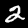

###### 图 7.11:用于训练的图像

```
label_train[5]
2
```

在本章末尾的活动中，您的任务是创建一个神经网络，根据这些手写数字的值对其进行分类。

### 建模特征和标签

我们将通过对要素和标注进行建模的示例来识别 TensorFlow 数字数据集中的书写数字。

我们有一个 28x28 像素的图像作为输入。每个图像的值不是黑就是白。因此，特征集由 28 * 28 = 784 像素的向量组成。

这些图像是灰度图像，由颜色范围从 0 到 255 的图像组成。为了处理它们，我们需要缩放数据。通过将训练和测试特征除以 255.0，我们确保我们的特征在 0 和 1 之间缩放:

```
features_train = features_train / 255.0
features_test = features_test / 255.0
```

请注意，我们可以用一个 28x28 的正方形矩阵来描述这些特征，但我们宁愿将矩阵展平，而只使用一个矢量。这是因为神经网络模型通常处理一维数据。

关于标签的建模，许多人认为用一个标签建模最有意义:一个从 0 到 9 的整数值。这种方法是有问题的，因为计算中的小误差可能导致完全不同的数字。我们可以想象 a 5 类似于 a 6，所以相邻的值在这里工作得很好。但是，在 1 和 7 的情况下，一个小的误差就可能使神经网络把 1 实现为 2，或者把 7 实现为 6。这非常令人困惑，并且可能需要更多的时间来训练神经网络，以减少相邻值的错误。

更重要的是，当我们的神经网络分类器返回 4.2 的结果时，我们可能会像《银河系漫游指南》中的主人公一样难以解释答案。 4.2 最有可能是 4。但如果不是，也许是 5，或者 3，或者 6。这不是数字检测的工作方式。

因此，使用一个包含 10 个标签的向量来建模这个任务更有意义。当使用 TensorFlow 进行分类时，为每个可能的类创建一个标签是非常合理的，其值在 0 到 1 之间。这些数字描述了所读取的数字被分类为标签所代表的类别的成员的概率。

例如，值`[0, 0.1, 0, 0, 0.9, 0, 0, 0, 0, 0]`表示我们的数字有 90%的几率是 4，有 10%的几率是 2。

在分类问题的情况下，我们总是对每个类使用一个输出值。

让我们继续讨论权重和偏见。为了连接 28*28 = 784 个特征和 10 个标签，我们需要一个 784 x 10 的权重矩阵，该矩阵具有 784 行和 10 列。

所以方程变成了`y = f( x ⋅ W + b )`，其中 x 是 784 维空间中的向量，W 是 784×10 的矩阵，b 是十个维度中偏差的向量。y 向量也包含十个坐标。f 函数定义在具有十个坐标的向量上，并且应用在每个坐标上。

#### 注意

要将数据点的二维 28x28 矩阵转换为 28x28 元素的一维向量，我们需要展平该矩阵。与许多其他语言和库不同，Python 没有 flatten 方法。

因为展平是一项简单的任务，所以让我们构造一个展平方法:

```
def flatten(matrix): 
    return [elem for row in matrix for elem in row]
flatten([[1,2],[3,4]])
```

输出如下所示:

```
 [1, 2, 3, 4]
```

让我们将特征从 28*28 矩阵展平到 784 维空间的向量:

```
features_train_vector = [ 
    flatten(image) for image in features_train 
]
features_test_vector = [ 
    flatten(image) for image in features_test 
]
```

要将标签转换为矢量形式，我们需要执行归一化:

```
import numpy as np
label_train_vector = np.zeros((label_train.size, 10))
for i, label in enumerate(label_train_vector):
    label[label_train[i]] = 1
label_test_vector = np.zeros((label_test.size, 10))
for i, label in enumerate(label_test_vector):
    label[label_test[i]] = 1
```

### 多标签张量流建模

我们现在将在 TensorFlow 中对以下等式建模:`y = f( x ⋅ W + b )`

导入 TensorFlow 后，我们将定义特征、标签和权重:

```
import tensorflow as tf
f = tf.nn.sigmoid
x = tf.placeholder(tf.float32, [None, 28 * 28])
W = tf.Variable(tf.random_normal([784, 10]))
b = tf.Variable(tf.random_normal([10]))
```

如果我们知道如何使用 TensorFlow 执行点积乘法，我们可以简单地编写方程`y = f( x ⋅ W + b )`。

如果我们把 x 当作一个 *1x84* 矩阵，我们可以用`tf.matmul`函数把它和 *784x10* W 矩阵相乘。

因此，我们的等式变成如下:`y = f( tf.add( tf.matmul( x, W ), b ) )`

您可能已经注意到，x 包含占位符，而 W 和 b 是变量。这是因为 x 的值是给定的。我们只需要把它们代入方程。TensorFlow 的任务是优化 W 和 b 的值，使我们读取正确数字的概率最大化。

让我们用函数的形式来表示 y 的计算:

```
def classify(x):
    return f(tf.add(tf.matmul(x, W), b))
```

#### 注意

这是我们可以定义激活函数的地方。在本章末尾的练习中，您最好使用 softmax activator 功能。这意味着您必须在代码中用 softmax 替换 sigmoid:`f = tf.nn.softmax`

### 优化变量

占位符代表输入。TensorFlow 的任务就是优化变量。

为了执行优化，我们需要使用一个代价函数:交叉熵。交叉熵具有以下特性:

*   如果预测输出与实际输出匹配，则其值为零
*   之后它的值严格为正

我们的任务是最小化交叉熵:

```
y = classify(x)
y_true = tf.placeholder(tf.float32, [None, 10])
cross_entropy = tf.nn.sigmoid_cross_entropy_with_logits(
    logits=y, 
    labels=y_true
)
```

尽管计算 y 的函数被称为 classify，但我们在这里并不执行实际的分类。请记住，我们使用占位符来代替 x，并且在运行 TensorFlow 会话时会替换实际值。

`sigmoid_cross_entropy_with_logits`函数接受两个参数来比较它们的值。第一个参数是标签值，而第二个参数是预测的结果。

为了计算成本，我们必须调用 TensorFlow 的`reduce_mean`方法:

```
cost = tf.reduce_mean(cross_entropy)
```

成本的最小化通过一个优化器。我们将使用带学习率的`GradientDescentOptimizer`。学习率是影响模型调整速度的神经网络参数:

```
optimizer = tf.train.GradientDescentOptimizer(learning_rate = 0.5).minimize(cost)
```

这个阶段不执行优化，因为我们还没有运行 TensorFlow。我们将在主循环中执行优化。

如果您使用不同的 activator 函数，如 softmax，您必须在源代码中替换它。而不是下面的语句:

```
cross_entropy = tf.nn.sigmoid_cross_entropy_with_logits(
    logits=y, 
    labels=y_true
)
```

使用以下内容:

```
cross_entropy = tf.nn.softmax_cross_entropy_with_logits_v2(
 logits=y, 
 labels=y_true
)
```

#### 注意

方法名中的 _v2 后缀。这是因为原来的`tf.nn.softmax_cross_entropy_with_logits`方法已经过时了。

### 训练张量流模型

我们需要创建一个 TensorFlow 会话并运行模型:

```
session = tf.Session()
```

首先，我们使用`tf.global_variables_initializer()`初始化变量:

```
session.run(tf.global_variables_initializer())
```

然后是优化循环。我们将确定迭代次数和批量大小。在每次迭代中，我们将随机选择与批量大小相等的多个特征标签对。

出于演示的目的，我们不是创建随机的批处理，而是在每次新的迭代开始时简单地输入即将到来的上百个图像。

由于我们总共有 60，000 张图像，我们可以进行多达 300 次迭代，每次迭代有 200 张图像。实际上，我们将只运行几次迭代，这意味着我们将只使用一小部分可用的训练数据:

```
iterations = 300
batch_size = 200
for i in range(iterations):
    min = i * batch_size
    max = (i+1) * batch_size
    dictionary = { 
        x: features_train_vector[min:max],
        y_true: label_train_vector[min:max]
    }
    session.run(optimizer, feed_dict=dictionary)
    print('iteration: ', i)
```

### 使用模型进行预测

我们现在可以使用训练好的模型来执行预测。语法很简单:我们将测试特性提供给会话的字典，并请求`classify(x)`值:

```
session.run(classify(x), feed_dict={
    x: features_test_vector[:10]
} )
```

### 测试模型

既然我们的模型已经过训练，可以用它来进行预测，那么是时候测试它的性能了:

```
label_predicted = session.run(classify(x), feed_dict={
    x: features_test_vector
})
```

我们必须从每个结果中取最大值的索引，将`labelsPredicted`值转换回从 0 到 9 的整数。我们将使用一个 NumPy 函数来执行这个转换。

`argmax`函数返回具有最大值的列表或数组参数的索引。以下是这方面的一个例子:

```
np.argmax([0.1, 0.3, 0.5, 0.2, 0, 0, 0, 0.2, 0, 0 ])
```

输出为`2`。

下面是第二个使用`argmax`函数的例子

```
np.argmax([1, 0, 1]) 
```

输出为`0`。

让我们执行转换:

```
label_predicted = [ 
    np.argmax(label) for label in label_predicted 
]
```

我们可以使用 scikit-learn 来使用我们在前面章节中了解到的指标。让我们先计算混淆矩阵:

```
from sklearn.metrics import confusion_matrix, accuracy_score, precision_score, recall_score, f1_score
confusion_matrix(label_test, label_predicted)
accuracy_score(label_test, label_predicted)
precision_score( label_test, label_predicted, average='weighted' )
recall_score( label_test, label_predicted, average='weighted' )
f1_score( label_test, label_predicted, average='weighted' )
```

### 随机选择样本量

回想一下神经网络的训练功能:

```
iterations = 300
batch_size = 200
for i in range(iterations):
    min = i * batch_size
    max = (i+1) * batch_size
    dictionary = { 
        x: features_train_vector[min:max],
        y_true: label_train_vector[min:max]
    }
    session.run(optimizer, feed_dict=dictionary)
```

问题是 6 万个数字中，我们只能取 5 次迭代。如果我们想要超越这个阈值，我们将冒重复这些输入序列的风险。

我们可以通过从训练数据中随机选择值来最大化使用训练数据的有效性。

为此，我们可以使用`random.sample`方法:

```
iterations = 6000
batch_size = 100
sample_size = len(features_train_vector)
for _ in range(iterations):
    indices = random.sample(range(sample_size), batchSize)
    batch_features = [ 
        features_train_vector[i] for i in indices
    ]
    batch_labels = [
        label_train_vector[i] for i in indices
    ]
    min = i * batch_size
    max = (i+1) * batch_size
    dictionary = { 
        x: batch_features,
        y_true: batch_labels
    }
    session.run(optimizer, feed_dict=dictionary)
```

#### 注意

随机抽样方法从列表中随机选择给定数量的元素。例如，在匈牙利，主要的国家彩票从 90 个号码中选出 5 个号码。我们可以使用下面的表达式来模拟一轮抽奖:

```
import random
random.sample(range(1,91), 5)
```

输出如下所示:

```
 [63, 58, 25, 41, 60]
```

### 活动 14:书面数字检测

在这一节中，我们将讨论如何通过检测手写数字为加密货币交易者提供更多的安全性。我们将假设你是一个新的加密货币交易平台的软件开发人员。您正在实现的最新安全措施要求识别手写数字。使用 MNIST 库来训练神经网络识别数字。你可以在 https://www.tensorflow.org/tutorials/了解更多关于这个数据集的信息。

通过执行以下步骤，尽可能提高模型的准确性:

1.  加载数据集并格式化输入。
2.  建立张量流图。我们现在将使用`ReLU`函数，而不是 sigmoid 函数。
3.  训练模型。
4.  测试模型并计算准确度分数。
5.  通过重新运行负责训练数据集的代码段，我们可以提高其准确性。运行代码 50 次。
6.  打印混淆矩阵。

在第 50 轮结束时，混淆矩阵有所改善。

不错的结果。10 个数字中有 8 个以上被准确识别。

#### 注意

这项活动的解决方案可在第 298 页找到。

如你所见，神经网络不是线性改进的。在一段时间内，训练网络似乎很少或没有带来精度的增加。然而，在某个阈值之后，出现了突破，准确度大大提高。

这种行为类似于为人类学习。你现在可能也有神经网络的问题。但是，在深入钻研材料，试出几道习题之后，你就会一个又一个突破，你的进度就会加快。

## 深度学习

在本主题中，我们将增加神经网络的层数。你可能还记得，我们可以添加隐藏层到我们的图表。我们的目标是通过实验隐藏层来提高模型的准确性。

### 添加图层

回想一下具有两个隐藏层的神经网络图:

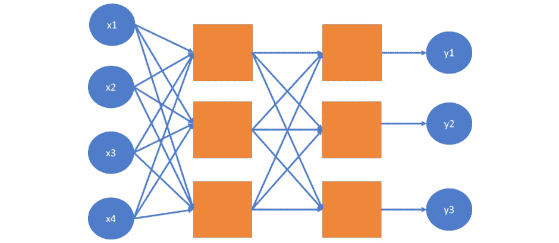

###### 图 7.12:显示神经网络中两个隐藏层的图表

我们可以通过复制权重和偏差，并确保张量流变量的维度匹配，在等式中添加第二层。请注意，在第一个模型中，我们将 784 个特征转换为 10 个标签。

在这个模型中，我们将把 784 个特征转换成指定数量的输出。然后我们将这些输出转换成 10 个标签。

确定添加的隐藏层的节点数并不完全科学。在本例中，我们将使用计数 200，因为它介于特征尺寸和标签尺寸之间。

由于我们有两层，我们将分别为权重和偏差定义两个矩阵`(W1, W2)`和向量`(b1, b2)`。

首先，我们使用`W1`和`b1`减少 784 个输入点，并创建 200 个变量值。我们将这些值作为第二层的输入，并使用`W2`和`b2`创建 10 个标签值:

```
x = tf.placeholder(tf.float32, [None, 28 * 28 ])
f = tf.nn.softmax
W1 = tf.Variable(tf.random_normal([784, 200]))
b1 = tf.Variable(tf.random_normal([200]))
layer1_out = f(tf.add( tf.matmul(x, W1), b1))
W2 = tf.Variable(tf.random_normal([200, 10]))
b2 = tf.Variable(tf.random_normal([10]))
y = f(tf.add(tf.matmul(layer1_out, W2), b2))
```

如果需要，我们可以通过这种方式增加层数。第 n 层的输出必须是第 n+1 层的输入。代码的其余部分保持原样。

### 卷积神经网络

**卷积神经网络**(**CNN**)是为模式识别而优化的人工神经网络。CNN 基于卷积层，卷积层是深度神经网络的隐藏层之一。卷积层由使用卷积运算转换其输入的神经元组成。

当使用卷积层时，我们用 m*n 矩阵检测图像中的图案，其中 m 和 n 分别小于图像的宽度和高度。当执行卷积运算时，我们在图像上滑动这个 m*n 矩阵，匹配每一种可能性。我们计算 m*n 卷积滤波器和我们的卷积滤波器当前所在的图像的 3×3 段的像素值的标量积。卷积运算从原始图像创建一个新图像，其中我们图像的重要部分被突出显示，不太重要的部分被模糊。

卷积运算汇总了它正在查看的窗口的信息。因此，它是识别图像中形状的理想算子。形状可以在图像上的任何位置，卷积运算符可以识别相似的图像信息，而不管它的确切位置和方向。卷积神经网络超出了本书的范围，因为它是一个更高级的主题。

### 活动 15:深度学习的书面数字检测

在这一部分，我们将讨论深度学习如何提高模型的性能。我们将假设您的老板对您在活动 14 中展示的结果不满意，并要求您考虑在您的原始模型中添加两个隐藏层，以确定新层是否会提高模型的准确性。为了确保您能够正确完成本活动，您需要了解深度学习:

1.  执行上一活动中的步骤，并测量模型的准确性。
2.  通过添加新层来改变神经网络。我们将结合`ReLU`和`softmax`激活器功能。
3.  重新训练模型。
4.  评估模型。求准确率分数。
5.  运行代码 50 次。
6.  打印混淆矩阵。

这种深层神经网络的行为甚至比单层神经网络更混乱。从 0.572 到 0.5723 的精度需要 200 个样本的 600 次迭代。这次迭代没多久，我们在同样的迭代次数下，从 0.6076 跳到了 0.6834。

由于深度神经网络的灵活性，我们期望比在简单模型的情况下更晚达到精确度上限。由于深度神经网络的复杂性，它也更有可能长时间陷入局部最大值。

#### 注意

这项活动的解决方案可在第 302 页找到。

## 总结

在本书中，我们在人工智能原理一章中学习了人工智能的基础知识和应用，然后我们编写了一个 Python 代码来模拟井字游戏。

在 AI 与搜索技术和游戏这一章中，我们用游戏 AI 工具和搜索技术解决了井字游戏。我们学习了广度优先搜索和深度优先搜索的搜索算法。A*算法帮助学生建立寻路问题的模型。这一章以多人游戏建模结束。

在接下来的几章中，我们学习了使用回归和分类的监督学习。这些章节包括数据预处理、训练测试分割和在几个真实场景中使用的模型。当预测股票数据时，线性回归、多项式回归和支持向量机都派上了用场。使用 k-最近邻和支持向量分类器进行分类。几个活动帮助学生应用分类的基础知识一个有趣的现实生活用例:信用评分。

在*第 5 章*、*使用树进行预测分析*中，我们介绍了决策树、随机森林和极度随机化的树。本章介绍了评估模型效用的不同方法。我们学习了如何计算模型的准确度、精确度、召回率和 F1 值。我们还学习了如何创建模型的混淆矩阵。通过对 car 数据的评估，将本章的模型应用于实践。

第六章、*聚类*中介绍了无监督学习，以及 k-means 和 mean shift 聚类算法。这些算法的一个有趣的方面是标签不是预先给定的，而是在聚类过程中检测到的。

本书以第 7 章*神经网络深度学习*结束，其中介绍了神经网络和使用 TensorFlow 的深度学习。我们在一个真实的例子中使用了这些技术:检测书写数字。