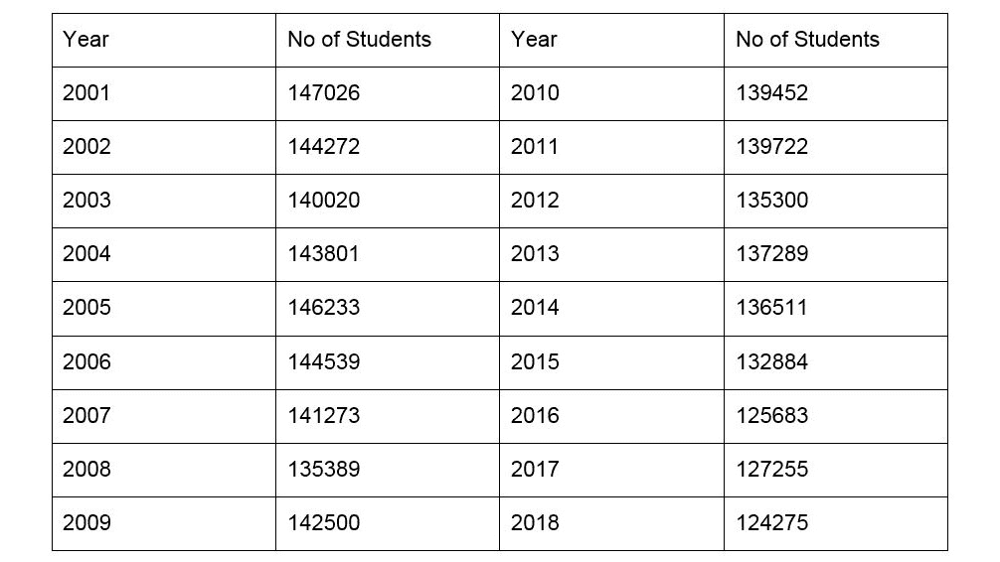
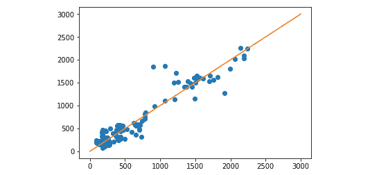
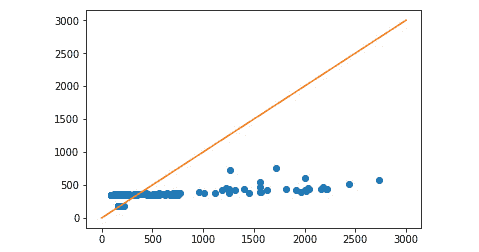

# 八、附录

## 关于

本节旨在帮助学生完成书中的活动。它包括学生为实现活动目标而要执行的详细步骤。

## 第一章:人工智能的原理

在代码中，反斜杠(\)表示换行符，其中代码不适合一行。行尾的反斜杠对换行符进行转义。这意味着反斜杠后面的行中的内容应该被看作是从反斜杠字符所在的位置开始的。

### 活动 1:生成井字游戏中所有可能的步骤序列

本节将探讨两个玩家随机游戏时可能出现的组合爆炸。我们将使用一个程序，建立在先前的结果上，生成计算机玩家和人类玩家之间所有可能的移动序列。根据行动顺序确定不同的赢、输和平局的数量。假设人类玩家可以做出任何可能的移动。在本例中，假设电脑玩家随机游戏，我们将检查属于两个随机游戏玩家的赢、输和平局:

1.  创建一个函数，将`all_moves_from_board`函数映射到棋盘列表的每个元素上。这样，我们将拥有决策树中每个深度的所有节点:

    ```py
    def all_moves_from_board(board, sign):
        move_list = []
        for i, v in enumerate(board):
            if v == EMPTY_SIGN:
                move_list.append(board[:i] + sign + board[i+1:])
        return move_list
    ```

2.  决策树从`[ EMPTY_SIGN * 9 ]`开始，每走一步后扩展:

    ```py
    all_moves_from_board_list( [ EMPTY_SIGN * 9 ], AI_SIGN )
    ```

3.  输出如下:

    ```py
     ['X........',
     '.X.......',
     '..X......',
     '...X.....',
     '....X....',
     '.....X...',
     '......X..',
     '.......X.',
     '........X']
     ['XO.......',
     'X.O......',
     'X..O.....',
     'X...O....',
     'X....O...',
     'X.....O..',
     'X......O.',
    .
    .
    .
    .
    '......OX.',
     '.......XO',
     'O.......X',
     '.O......X',
     '..O.....X',
     '...O....X',
     '....O...X',
     '.....O..X',
     '......O.X',
     '.......OX']
    ```

4.  让我们创建一个`filter_wins`函数，从移动列表中取出已结束的游戏，并将它们附加到一个数组中，该数组包含 AI 玩家和对手玩家赢得的棋盘状态:

    ```py
    def filter_wins(move_list, ai_wins, opponent_wins):
        for board in move_list:
            won_by = game_won_by(board)
            if won_by == AI_SIGN:
                ai_wins.append(board)
                move_list.remove(board)
            elif won_by == OPPONENT_SIGN:
                opponent_wins.append(board)
                move_list.remove(board)
    ```

5.  在这个函数中，三个列表可以被认为是参考类型。这意味着该函数不返回值，而是操纵这三个列表而不返回它们。
6.  让我们完成这一部分。然后使用`count_possibilities`函数打印以平局结束、第一名玩家获胜和第二名玩家获胜的决策树叶子的数量:

    ```py
    def count_possibilities():
        board = EMPTY_SIGN * 9
        move_list = [board]
        ai_wins = []
        opponent_wins = []
        for i in range(9):
            print('step ' + str(i) + '. Moves: ' + \        str(len(move_list)))
            sign = AI_SIGN if i % 2 == 0 else OPPONENT_SIGN
            move_list = all_moves_from_board_list(move_list, sign)
            filter_wins(move_list, ai_wins, opponent_wins)
        print('First player wins: ' + str(len(ai_wins)))
        print('Second player wins: ' + str(len(opponent_wins)))
        print('Draw', str(len(move_list)))
        print('Total', str(len(ai_wins) + len(opponent_wins) + \    len(move_list)))
    ```

7.  在每个状态中，我们最多有 9 个步骤。在第 0、2、4、6 和 8 次迭代中，人工智能玩家移动。在所有其他迭代中，对手移动。我们在所有步骤中创建所有可能的移动，并从移动列表中取出结束的游戏。
8.  然后执行可能性的数量来体验组合爆炸。

    ```py
    count_possibilities()
    ```

9.  输出如下:

    ```py
    step 0\. Moves: 1
    step 1\. Moves: 9
    step 2\. Moves: 72
    step 3\. Moves: 504
    step 4\. Moves: 3024
    step 5\. Moves: 13680
    step 6\. Moves: 49402
    step 7\. Moves: 111109
    step 8\. Moves: 156775
    First player wins: 106279
    Second player wins: 68644
    Draw 91150
    Total 266073
    ```

如您所见，棋盘状态树由 266，073 片树叶组成。`count_possibilities`函数本质上实现了广度优先搜索算法来遍历游戏的所有可能状态。请注意，我们确实对这些状态进行了多次计数，因为在步骤 1 的右上角放置一个 X 并在步骤 3 的左上角放置一个 X 会导致类似的可能状态，即从左上角开始，然后在右上角放置一个 X。如果我们实现了重复状态的检测，我们将需要检查更少的节点。但现阶段由于游戏深度有限，我们省略这一步。

## 第二章:人工智能与搜索技术和游戏

### 活动 2:教代理意识到其防范损失时的情形

按照以下步骤完成活动:

1.  创建一个函数`player_can_win`，使用函数`all_moves_from_board`获取棋盘上的所有移动，并使用变量`next_move`对其进行迭代。在每一次迭代中，它检查是否可以通过符号赢得游戏，然后返回 true 或 false。

    ```py
    def player_can_win(board, sign):
        next_moves = all_moves_from_board(board, sign)
        for next_move in next_moves:
            if game_won_by(next_move) == sign:
                return True
        return False
    ```

2.  我们将扩展人工智能的移动，使它更喜欢安全的移动。如果对手不能在下一步赢得比赛，这一步棋是安全的。

    ```py
    def ai_move(board):
        new_boards = all_moves_from_board(board, AI_SIGN)
        for new_board in new_boards:
            if game_won_by(new_board) == AI_SIGN:
                return new_board
        safe_moves = []
        for new_board in new_boards:
            if not player_can_win(new_board, OPPONENT_SIGN):
                safe_moves.append(new_board)
        return choice(safe_moves) if len(safe_moves) > 0 else \        new_boards[0]
    ```

3.  您可以测试我们的新应用。你会发现人工智能已经做出了正确的举动。
4.  我们现在将这个逻辑放在状态空间生成器中，并通过生成所有可能的游戏来检查计算机玩家做得有多好。

    ```py
    def all_moves_from_board( board, sign ):
    ```

5.  我们现在将这个逻辑放在状态空间生成器中，并通过生成所有可能的游戏来检查计算机玩家做得有多好。

    ```py
    def all_moves_from_board(board, sign):
        move_list = []
        for i, v in enumerate(board):
            if v == EMPTY_SIGN:
                new_board = board[:i] + sign + board[i+1:]
                move_list.append(new_board)
                if game_won_by(new_board) == AI_SIGN:
                    return [new_board]
        if sign == AI_SIGN:
            safe_moves = []
            for move in move_list:
                if not player_can_win(move, OPPONENT_SIGN):
                    safe_moves.append(move)
            return safe_moves if len(safe_moves) > 0 else \            move_list[0:1]
        else:
            return move_list
    ```

6.  尽可能地计算可能性。

    ```py
    count_possibilities()
    ```

7.  输出如下:

    ```py
    step 0\. Moves: 1
    step 1\. Moves: 9
    step 2\. Moves: 72
    step 3\. Moves: 504
    step 4\. Moves: 3024
    step 5\. Moves: 5197
    step 6\. Moves: 18606
    step 7\. Moves: 19592
    step 8\. Moves: 30936
    First player wins: 20843
    Second player wins: 962
    Draw 20243
    Total 42048
    ```

我们比以前做得更好。我们不仅再次排除了几乎 2/3 的可能游戏，而且大多数时候，人工智能玩家要么获胜，要么接受平局。尽管我们努力让人工智能变得更好，它仍然会以 962 种方式失败。我们将在下次活动中消除所有这些损失。

### 活动 3:修正 AI 的第一步和第二步，使其无敌

按照以下步骤完成活动:

1.  我们将计算棋盘中空白区域的数量，并在出现 9 或 7 个空白区域时进行硬编码移动。你可以尝试不同的硬编码动作。我们发现，占领任何角落，然后占领对面的角落，导致没有损失。如果对手占据了对面的角落，在中间移动不会造成损失。

    ```py
    def all_moves_from_board(board, sign):
        if sign == AI_SIGN:
            empty_field_count = board.count(EMPTY_SIGN)
            if empty_field_count == 9:
                return [sign + EMPTY_SIGN * 8]
            elif empty_field_count == 7:
                return [
                    board[:8] + sign if board[8] == \                    EMPTY_SIGN else
                    board[:4] + sign + board[5:]
                ]
        move_list = []
        for i, v in enumerate(board):
            if v == EMPTY_SIGN:
                new_board = board[:i] + sign + board[i+1:]
                move_list.append(new_board)
                if game_won_by(new_board) == AI_SIGN:
                    return [new_board]
        if sign == AI_SIGN:
            safe_moves = []
            for move in move_list:
                if not player_can_win(move, OPPONENT_SIGN):
                    safe_moves.append(move)
            return safe_moves if len(safe_moves) > 0 else \            move_list[0:1]
        else:
            return move_list
    ```

2.  让我们验证状态空间

    ```py
    countPossibilities()
    ```

3.  输出如下:

    ```py
    step 0\. Moves: 1
    step 1\. Moves: 1
    step 2\. Moves: 8
    step 3\. Moves: 8
    step 4\. Moves: 48
    step 5\. Moves: 38
    step 6\. Moves: 108
    step 7\. Moves: 76
    step 8\. Moves: 90
    First player wins: 128
    Second player wins: 0
    Draw 60
    ```

4.  修正了前两步后，我们只需要处理 8 种可能性，而不是 504 种。我们还引导人工智能进入一种状态，在这种状态下，硬编码的规则足以让它永远不会输掉一场比赛。
5.  修正步骤并不重要，因为我们会给 AI 硬编码的步骤，但它很重要，因为它是评估和比较每一步的工具。
6.  修正了前两步后，我们只需要处理 8 种可能性，而不是 504 种。我们还引导人工智能进入一种状态，在这种状态下，硬编码的规则足以让它永远不会输掉一场比赛。

### 活动 4:连接四个

本节将练习使用`EasyAI`库并开发一种启发式方法。我们将使用连接四个游戏。游戏棋盘有七格宽，七格高。移动时，您只能选择要放置令牌的列。然后重力将代币拉下到尽可能低的空单元。你的目标是在你的对手这样做之前，或者你用完空白空间之前，水平、垂直或对角地连接你自己的四个标记。游戏规则见:[https://en.wikipedia.org/wiki/Connect_Four](https://en.wikipedia.org/wiki/Connect_Four)

1.  让我们建立两个玩家的游戏框架:

    ```py
    from easyAI import TwoPlayersGame
    from easyAI.Player import Human_Player
    class ConnectFour(TwoPlayersGame):
        def __init__(self, players):
            self.players = players
        def possible_moves(self):
            return []
        def make_move(self, move):
            return
        def unmake_move(self, move): 
    # optional method (speeds up the AI)
            return
        def lose(self):
            return False
        def is_over(self):
            return (self.possible_moves() == []) or self.lose()
        def show(self):
            print ('board')
        def scoring(self):
            return -100 if self.lose() else 0

    if __name__ == "__main__":
        from easyAI import AI_Player, Negamax
        ai_algo = Negamax(6)
    ```

2.  我们可以不动定义中的一些函数。我们必须实现以下方法:

    ```py
    __init__
    possible_moves
    make_move
    unmake_move (optional)
    lose
    show
    ```

3.  我们将重用井字游戏中的基本计分功能。一旦你测试了这个游戏，你会发现这个游戏并不是不可战胜的，而是玩得出奇的好，即使我们只是使用了基本的试探法。
4.  让我们编写 init 方法。我们将棋盘定义为一维列表，类似于井字游戏的例子。我们也可以使用二维列表，但是建模不会变得更容易或更困难。除了像在井字游戏中那样进行初始化之外，我们还会提前一点。我们将生成游戏中所有可能的获胜组合，并保存它们以备将来使用:

    ```py
    def __init__(self, players):
            self.players = players
            #  0  1  2  3  4  5  6
            #  7  8  9 10 11 12 13
            # ...
            # 35 36 37 38 39 40 41
            self.board = [0 for i in range(42)]
            self.nplayer = 1  # player 1 starts.
            def generate_winning_tuples():
                tuples = []
                # horizontal
                tuples += [
                    list(range(row*7+column, row*7+column+4, 1))
                    for row in range(6)
                    for column in range(4)]
                # vertical
                tuples += [
                    list(range(row*7+column, row*7+column+28, 7))
                    for row in range(3)
                    for column in range(7)
                ]
                # diagonal forward
                tuples += [
                    list(range(row*7+column, row*7+column+32, 8))
                    for row in range(3)
                    for column in range(4)
                ]
                # diagonal backward
                tuples += [
                    list(range(row*7+column, row*7+column+24, 6))
                    for row in range(3)
                    for column in range(3, 7, 1)
                ]
                return tuples
    self.tuples=generate_winning_tuples()
    ```

5.  我们来处理动作。可能的移动函数是一个简单的枚举。请注意，我们在移动名称中使用从 1 到 7 的列索引，因为在人类玩家界面中用 1 开始列索引比用 0 更方便。对于每一列，我们检查是否有未被占用的字段。如果有，我们将使列成为可能的移动。

    ```py
    def possible_moves(self):
            return [column+1
                    for column in range(7)
                    if any([
                        self.board[column+row*7] == 0
                        for row in range(6)
                    ])
                    ]
    ```

6.  移动类似于可能的移动功能。我们检查 move 的列，找到从底部开始的第一个空单元格。一旦我们找到它，我们就占领它。还可以阅读 make_move 函数的对偶的实现:unmake_move。在 unmake_move 函数中，我们从上到下检查列，并在第一个非空单元格处移除移动。请注意，我们依赖于 easyAi 的内部表示，这样它就不会撤销没有做过的动作。否则，该函数将移除另一个玩家的令牌，而不检查谁的令牌被移除。

    ```py
    def make_move(self, move):
            column = int(move) - 1
            for row in range(5, -1, -1):
                index = column + row*7
                if self.board[index] == 0:
                    self.board[index] = self.nplayer
                    return
        def unmake_move(self, move):  
    # optional method (speeds up the AI)
            column = int(move) - 1
            for row in range(6):
                index = column + row*7
                if self.board[index] != 0:
                    self.board[index] = 0
                    return
    ```

7.  因为我们已经有了需要检查的元组，所以我们可以重用井字游戏示例中的 lose 函数。

    ```py
    def lose(self):
            return any([all([(self.board[c] == self.nopponent)
                             for c in line])
                        for line in self.tuples])
        def is_over(self):
            return (self.possible_moves() == []) or self.lose()
    ```

8.  我们的最后一个任务是打印电路板的 show 方法。我们将重用井字游戏实现，只是改变变量。

    ```py
    def show(self):
            print('\n'+'\n'.join([
                ' '.join([['.', 'O', 'X'][self.board[7*row+column]]
                          for column in range(7)]
                         )
                for row in range(6)])
            )
    ```

现在所有的函数都完成了，您可以尝试这个例子了。随意和对手打一两回合。你可以看到对手并不完美，但它打得相当好。如果你有一台很强的计算机，你可以增加 Negamax 算法的参数。我鼓励你想出一个更好的启发法。

### 第三章:回归

### 活动 5:预测人口

你在大都会的政府办公室工作，试图预测对小学容量的需求。你的任务是预测 2025 年和 2030 年开始上小学的儿童人数。过去的数据如下:



###### 图 3.21 小学数据

在二维图表上绘制趋势。使用线性回归。

我们的特征是从 2001 年到 2018 年。为简单起见，我们可以将 2001 年表示为第 1 年，将 2018 年表示为第 18 年。

```py
x = np.array(range(1, 19))
y = np.array([
    147026,
    144272,
    140020,
    143801,
    146233,
    144539,
    141273,
    135389,
    142500, 
    139452,
    139722,
    135300,
    137289,
    136511,
    132884,
    125683,
    127255,
    124275
])
```

使用 np.polyfit 确定回归线的系数。

```py
[a, b] = np.polyfit(x, y, 1)
[-1142.0557275541753, 148817.5294117646]
```

使用 matplotlib.pyplot 绘制结果以确定未来趋势。

```py
import matplotlib.pyplot as plot
plot.scatter( x, y ) 
plot.plot( [0, 30], [b, 30*a+b] )
plot.show()
```

### 活动 6:用多元二次和三次线性多项式回归预测股票价格

本节将讨论如何使用 scikit-learn 执行线性、多项式和支持向量回归。我们还将学习预测给定任务的最佳模型。我们将假设你是一家金融机构的软件工程师，你的雇主想知道线性回归或支持向量回归是否更适合预测股票价格。您必须从数据源加载标准普尔 500 的所有数据。然后，使用线性回归、三次多项式线性回归和支持向量回归(多项式核为 3 次)构建回归变量。然后分离训练和测试数据。绘制测试标签和预测结果，并与`y` = `x`线进行比较。最后，比较三个模型的得分。

让我们使用`Quandl`加载标准普尔 500 指数数据，然后准备用于预测的数据。您可以在多变量线性回归主题的预测未来部分中阅读该过程。

```py
import quandl
import numpy as np
from sklearn import preprocessing
from sklearn import model_selection
from sklearn import linear_model
from sklearn.preprocessing import PolynomialFeatures
from matplotlib import pyplot as plot
from sklearn import svm
data_frame = quandl.get("YALE/SPCOMP")
data_frame[['Long Interest Rate', 'Real Price',
           'Real Dividend', 'Cyclically Adjusted PE Ratio']]
data_frame.fillna(-100, inplace=True)
# We shift the price data to be predicted 20 years forward
data_frame['Real Price Label'] = data_frame['RealPrice'].shift(-240)
# Then exclude the label column from the features
features = np.array(data_frame.drop('Real Price Label', 1))
# We scale before dropping the last 240 rows from the features
scaled_features = preprocessing.scale(features)
# Save the last 240 rows before dropping them
scaled_features_latest240 = scaled_features[-240:]
# Exclude the last 240 rows from the data used for # # modelbuilding
scaled_features = scaled_features[:-240]
# Now we can drop the last 240 rows from the data frame
data_frame.dropna(inplace=True)
# Then build the labels from the remaining data
label = np.array(data_frame['Real Price Label'])
# The rest of the model building stays
(features_train,
    features_test,
    label_train,
    label_test
) = model_selection.train_test_split(
    scaled_features,
    label,
   test_size=0.1
)
```

让我们首先使用一个 1 次多项式来评估模型和进行预测。我们仍然在重新创建第二个主题的主要示例。

```py
model = linear_model.LinearRegression()
model.fit(features_train, label_train)
model.score(features_test, label_test)
```

1.  输出如下:

    ```py
     0.8978136465083912
    ```

2.  输出始终取决于测试数据，因此每次运行后，这些值可能会有所不同。

    ```py
    label_predicted = model.predict(features_test)
    plot.plot(
        label_test, label_predicted, 'o',
        [0, 3000], [0, 3000]
    )
    ```



###### 图 3.22:显示输出的图表

圆点离 y=x 线越近，模型的误差就越小。

```py
It is now time to perform a linear multiple regression with quadratic polynomials. The only change is in the Linear Regression model
poly_regressor = PolynomialFeatures(degree=3)
poly_scaled_features = poly_regressor.fit_transform(scaled_features)
(poly_features_train,
 poly_features_test,
 poly_label_train,
 poly_label_test) = model_selection.train_test_split(
    poly_scaled_features,
    label,
    test_size=0.1)
model = linear_model.LinearRegression()
model.fit(poly_features_train, poly_label_train)
print('Polynomial model score: ', model.score(
    poly_features_test, poly_label_test))
print('\n')
poly_label_predicted = model.predict(poly_features_test)
plot.plot(
    poly_label_test, poly_label_predicted, 'o',
    [0, 3000], [0, 3000]
)
```

该模型在测试数据上表现惊人地好。因此，我们已经可以怀疑我们的多项式对于训练和测试中使用的场景是过度拟合的。

我们现在将使用 3 次多项式核执行支持向量回归。

```py
model = svm.SVR(kernel='poly')
model.fit(features_train, label_train)
label_predicted = model.predict(features_test)
plot.plot( 
    label_test, label_predicted, 'o',
    [0,3000], [0,3000]
)
```



###### 图 3.23:显示输出的图表

```py
model.score(features_test, label_test)
```

输出将是`0.06388628722032952`。

我们现在将使用 3 次多项式核执行支持向量回归。

## 第四章:分类

### 活动 7:为分类准备信贷数据

本节将讨论如何为分类器准备数据。我们将使用来自[https://archive . ics . UCI . edu/ml/machine-learning-databases/statlog/german/](https://archive.ics.uci.edu/ml/machine-learning-databases/statlog/german/)的 german.data 作为示例，并准备用于训练和测试分类器的数据。确保所有的标签都是数字，并且这些值是为分类准备的。使用 80%的数据点作为训练数据。

1.  从[https://archive . ics . UCI . edu/ml/machine-learning-databases/statlog/german/](https://archive.ics.uci.edu/ml/machine-learning-databases/statlog/german/)中保存 german.data，在 Sublime Text 或 Atom 之类的文本编辑器中打开。添加以下第一行:

    ```py
    CheckingAccountStatus DurationMonths CreditHistory CreditPurpose CreditAmount SavingsAccount EmploymentSince DisposableIncomePercent PersonalStatusSex OtherDebtors PresentResidenceMonths Property Age OtherInstallmentPlans Housing NumberOfExistingCreditsInBank Job LiabilityNumberOfPeople Phone ForeignWorker CreditScore
    ```

2.  使用 pandas 导入数据文件，并用异常值替换 NA 值:

    ```py
    import pandas
    data_frame = pandas.read_csv('german.data', sep=' ') 
    data_frame.replace('NA', -1000000, inplace=True)
    ```

3.  执行标签编码。我们需要将数据框中的所有标签转换成整数。我们可以在一维数组中创建所有标签。然而，这是非常低效的，因为每个标签只出现在一列中。将我们的标签按列分组更有意义:

    ```py
    labels = {
     'CheckingAccountStatus': ['A11', 'A12', 'A13', 'A14'],
     'CreditHistory': ['A30', 'A31', 'A32', 'A33', 'A34'],
     'CreditPurpose': ['A40', 'A41', 'A42', 'A43', 'A44', 'A45', 'A46', 'A47', 'A48', 'A49', 'A410'],
     'SavingsAccount': ['A61', 'A62', 'A63', 'A64', 'A65'],
     'EmploymentSince': ['A71', 'A72', 'A73', 'A74', 'A75'],
     'PersonalStatusSex': ['A91', 'A92', 'A93', 'A94', 'A95'], 
     'OtherDebtors': ['A101', 'A102', 'A103'], 
     'Property': ['A121', 'A122', 'A123', 'A124'],
     'OtherInstallmentPlans': ['A141', 'A142', 'A143'],
     'Housing': ['A151', 'A152', 'A153'],
     'Job': ['A171', 'A172', 'A173', 'A174'],
     'Phone': ['A191', 'A192'],
     'ForeignWorker': ['A201', 'A202']
    }
    ```

4.  Let's create a label encoder for each column and encode the values:

    ```py
    from sklearn import preprocessing
    label_encoders = {}
    data_frame_encoded = pandas.DataFrame()
    for column in data_frame:
        if column in labels:
            label_encoders[column] = preprocessing.LabelEncoder()
            label_encoders[column].fit(labels[column])
            data_frame_encoded[column] = label_encoders[
                column].transform(data_frame[column])
        else:
            data_frame_encoded[column] = data_frame[column]
    ```

    让我们验证我们做的一切都是正确的:

```py
data_frame_encoded.head()
CheckingAccountStatus  DurationMonths  CreditHistory  CreditPurpose  \
0                      0               6              4              4   
1                      1              48              2              4   
2                      3              12              4              7   
3                      0              42              2              3   
4                      0              24              3              0   
   CreditAmount  SavingsAccount  EmploymentSince  DisposableIncomePercent  \
0          1169               4                4                        4   
1          5951               0                2                        2   
2          2096               0                3                        2   
3          7882               0                3                        2   
4          4870               0                2                        3   
   PersonalStatusSex  OtherDebtors     ...       Property  Age  \
0                  2             0     ...              0   67   
1                  1             0     ...              0   22   
2                  2             0     ...              0   49   
3                  2             2     ...              1   45   
4                  2             0     ...              3   53   
   OtherInstallmentPlans  Housing  NumberOfExistingCreditsInBank  Job  \
0                      2        1                              2    2   
1                      2        1                              1    2   
2                      2        1                              1    1   
3                      2        2                              1    2   
4                      2        2                              2    2   
   LiabilityNumberOfPeople  Phone  ForeignWorker  CreditScore  
0                        1      1              0            1  
1                        1      0              0            2  
2                        2      0              0            1  
3                        2      0              0            1  
4                        2      0              0            2  
[5 rows x 21 columns]
label_encoders
{'CheckingAccountStatus': LabelEncoder(),
 'CreditHistory': LabelEncoder(),
 'CreditPurpose': LabelEncoder(),
 'EmploymentSince': LabelEncoder(),
 'ForeignWorker': LabelEncoder(),
 'Housing': LabelEncoder(),
 'Job': LabelEncoder(),
 'OtherDebtors': LabelEncoder(),
 'OtherInstallmentPlans': LabelEncoder(),
 'PersonalStatusSex': LabelEncoder(),
 'Phone': LabelEncoder(),
 'Property': LabelEncoder(),
 'SavingsAccount': LabelEncoder()}
```

所有 21 列都是可用的，标签编码器也保存在一个对象中。我们的数据现在已经过预处理。

如果不想解码编码值，就不需要保存这些标签编码器。我们保存它们只是为了完整。

1.  It is time to separate features from labels. We can apply the same method as the one we saw in the theory section:

    ```py
    import numpy as np
    features = np.array(
        data_frame_encoded.drop(['CreditScore'], 1)
    )
    label = np.array(data_frame_encoded['CreditScore'])
    ```

    我们的功能尚未缩放。这是一个问题，因为信用额度的差距可能远远大于年龄的差异。

    我们必须一起执行训练和测试数据的缩放，因此，我们仍然可以执行缩放的最新步骤是在我们从测试数据中分离训练数据之前。

2.  让我们使用 scikit 预处理库中的最小-最大缩放器:

    ```py
    scaled_features = preprocessing.MinMaxScaler(
    feature_range=(0,1)).fit_transform(features)
    ```

3.  最后一步是交叉验证。我们将重组我们的数据，将所有数据的 80%用于训练，20%用于测试。

    ```py
    from sklearn import model_selection
    features_train, features_test, label_train,
    label_test = model_selection.train_test_split(
        scaled_features,
        label,
        test_size = 0.2
    )
    ```

### 活动 8:提高信用评分的准确性

本节将学习 k-最近邻分类器的参数化如何影响最终结果。目前信用评分的准确率很低，只有 66.5%。想办法将其提高几个百分点。为了确保正确发生，您需要做前面的练习。

有许多方法可以完成这个练习。在这个解决方案中，我将向您展示一种通过改变参数化来提高信用评分的方法。

您必须完成练习 13，才能完成本练习。

1.  将 K-最近邻分类器的 K 值从默认值 5 增加到 10、15、25 和 50。评估结果:

    ```py
    You must have completed Exercise 13, to be able to complete this activity
    classifier = neighbors.KNeighborsClassifier(n_neighbors=10)
    classifier.fit(
        features_train,label_train
        )
    classifier.score(features_test, label_test)
    ```

2.  在对所有四个`n_neighbors`值运行这些行之后，我得到了以下结果:

    ```py
    K=10: accuracy is 71.5%
    K=15: accuracy is 70.5%
    K=25: accuracy is 72%
    K=50: accuracy is 74%
    ```

3.  更高的 K 值不一定意味着更好的分数。然而在这个例子中，`K=50`比`K=5`产生了更好的结果。

### 活动 9:sci kit-learn 中的支持向量机优化

本节将讨论如何使用支持向量机分类器的不同参数。我们将对您学习的不同支持向量回归分类器参数进行比较和对比，并找出一组参数，这些参数会在先前活动中加载和准备的训练和测试数据上产生最高的分类数据。为了确保正确进行，您需要完成之前的活动和练习。

我们将尝试几种组合。你可以选择不同的参数

1.  线性内核

    ```py
    classifier = svm.SVC(kernel="linear")
    classifier.fit(features_train, label_train)
    classifier.score(features_test, label_test)
    ```

2.  Polynomial kernel of degree 4, C=2, gamma=0.05

    ```py
    classifier = svm.SVC(kernel="poly", C=2, degree=4, gamma=0.05)
    classifier.fit(features_train, label_train)
    classifier.score(features_test, label_test)
    ```

    输出如下:0.705。

3.  Polynomial kernel of degree 4, C=2, gamma=0.25

    ```py
    classifier = svm.SVC(kernel="poly", C=2, degree=4, gamma=0.25)
    classifier.fit(features_train, label_train)
    classifier.score(features_test, label_test)
    ```

    输出如下:0.76。

4.  Polynomial kernel of degree 4, C=2, gamma=0.5

    ```py
    classifier = svm.SVC(kernel="poly", C=2, degree=4, gamma=0.5)
    classifier.fit(features_train, label_train)
    classifier.score(features_test, label_test)
    ```

    输出如下:0.72。

5.  Sigmoid kernel

    ```py
    classifier = svm.SVC(kernel="sigmoid")
    classifier.fit(features_train, label_train)
    classifier.score(features_test, label_test)
    ```

    输出如下:0.71。

6.  Default kernel with a gamma of 0.15

    ```py
    classifier = svm.SVC(kernel="rbf", gamma=0.15)
    classifier.fit(features_train, label_train)
    classifier.score(features_test, label_test)
    ```

    输出如下:0.76。

## 第 5 章:使用树进行预测分析

### 活动 10:汽车数据分类

本节将讨论如何建立一个可靠的决策树模型，能够帮助您的公司找到客户可能购买的汽车。我们假设你受雇于一家汽车租赁公司，致力于与客户建立持久的关系。你的任务是建立一个决策树模型，将汽车分为四类:不可接受、可接受、好、非常好。

数据集可以在这里访问:[https://archive.ics.uci.edu/ml/datasets/Car+Evaluation](https://archive.ics.uci.edu/ml/datasets/Car+Evaluation)。单击数据文件夹链接下载数据集。单击数据集描述链接可访问属性的描述。

评估你的决策树模型的效用。

1.  Download the car data file from here: [https://archive.ics.uci.edu/ml/machine-learning-databases/car/car.data](https://archive.ics.uci.edu/ml/machine-learning-databases/car/car.data). Add a header line to the front of the CSV file to reference it in Python more easily:

    `Buying,Maintenance,Doors,Persons,LuggageBoot,Safety,Class`

    我们简单地称标签类。我们根据它们在[https://archive . ics . UCI . edu/ml/machine-learning-databases/car/car . names](https://archive.ics.uci.edu/ml/machine-learning-databases/car/car.names)中的描述来命名这六个特性。

2.  将数据集加载到 Python 中

    ```py
    import pandas
    data_frame = pandas.read_csv('car.data')
    data_frame.head()
    Buying Maintenance Doors Persons LuggageBoot Safety  Class
    0  vhigh       vhigh     2       2       small    low  unacc
    1  vhigh       vhigh     2       2       small    med  unacc
    2  vhigh       vhigh     2       2       small   high  unacc
    3  vhigh       vhigh     2       2         med    low  unacc
    4  vhigh       vhigh     2       2         med    med  unacc
    ```

3.  由于分类处理数字数据，我们必须执行标签编码，如前一章所示。

    ```py
    labels = {
        'Buying': ['vhigh', 'high', 'med', 'low'],
        'Maintenance': ['vhigh', 'high', 'med', 'low'],
        'Doors': ['2', '3', '4', '5more'],
        'Persons': ['2', '4', 'more'],
        'LuggageBoot': ['small', 'med', 'big'],
        'Safety': ['low', 'med', 'high'],
        'Class': ['unacc', 'acc', 'good', 'vgood']
    }
    from sklearn import preprocessing
    label_encoders = {}
    data_frame_encoded = pandas.DataFrame()
    for column in data_frame:
        if column in labels:
            label_encoders[column] = preprocessing.LabelEncoder()
            label_encoders[column].fit(labels[column])
            data_frame_encoded[column] = label_encoders[column].transform(data_frame[column])
        else:
    data_frame_encoded[column] = data_frame[column]
    ```

4.  让我们从标签中分离特征:

    ```py
    import numpy as np
    features = np.array(data_frame_encoded.drop(['Class'], 1))
    label = np.array( data_frame_encoded['Class'] )
    ```

5.  It is time to separate training and testing data with the cross-validation (in newer versions model-selection) featue of scikit-learn. We will use 10% test data:

    ```py
    from sklearn import model_selection
    features_train, features_test, label_train, label_test = model_selection.train_test_split(
        features,
        label,
        test_size=0.1
    )
    ```

    请注意，从 scikit-learn 0.20 开始，train_test_split 方法将在 model_selection 模块中可用，而不是在 cross_validation 模块中。在以前的版本中，model_selection 已经包含了 train_test_split 方法。

6.  We have everything to build the decision tree classifier:

    ```py
    from sklearn.tree import DecisionTreeClassifier
    decision_tree = DecisionTreeClassifier()
    decision_tree.fit(features_train, label_train)
    DecisionTreeClassifier(
        class_weight=None,
        criterion='gini',
        max_depth=None,
        max_features=None,
        max_leaf_nodes=None,
        min_impurity_decrease=0.0,
        min_impurity_split=None,
        min_samples_leaf=1,
        min_samples_split=2,
        min_weight_fraction_leaf=0.0,
        presort=False,
        random_state=None,
        splitter='best'
    )
    ```

    您可以看到决策树分类器的参数化。我们可以设置很多选项来调整分类器模型的性能。

7.  让我们根据测试数据对我们的模型进行评分:

    ```py
    decision_tree.score( features_test, label_test )
     0.9884393063583815
    ```

8.  This is the point where your knowledge up until chapter 4 would take you on model evaluation. We will now go a bit further and create a deeper evaluation of the model based on the classification_report feature we learned in this topic:

    ```py
    from sklearn.metrics import classification_report
    print( 
        classification_report( 
            label_test, 
            decision_tree.predict(features_test) 
        ) 
    )
                 precision    recall  f1-score   support
              0       0.97      0.97      0.97        36
              1       1.00      1.00      1.00         5
              2       1.00      0.99      1.00       127
              3       0.83      1.00      0.91         5
    avg / total       0.99      0.99      0.99       173
    ```

    该模型已被证明是相当准确的。在如此高的准确度分数的情况下，怀疑过度拟合的可能性。

### 活动 11:为您的汽车租赁公司进行随机森林分类

1.  This section will optimize your classifier to satisfy your clients better when selecting future cars for your car fleet. We will be performing random forest and extreme random forest classification on your car dealership data set you worked on in Activity 1 of this chapter. Suggest further improvements to the model to improve the performance of the classifier.

    ```py
    from sklearn import model_selection
    features_train, features_test, label_train, label_test = model_selection.train_test_split(
        features,
        label,
        test_size=0.1
    )
    ```

    如果您使用的是 IPython，您的变量可能已经可以在控制台中访问了。

2.  让我们创建一个随机森林和一个非常随机的树分类器，并训练模型。

    ```py
    from sklearn.ensemble import RandomForestClassifier,ExtraTreesClassifier
    random_forest_classifier = RandomForestClassifier(n_estimators=100, max_depth=6)
    random_forest_classifier.fit(features_train, label_train)
    extra_trees_classifier =ExtraTreesClassifier(
        n_estimators=100, max_depth=6
    )
    extra_trees_classifier.fit(features_train, label_train)
    ```

3.  让我们估计一下这两个模型在测试数据上的表现如何:

    ```py
    from sklearn.metrics import classification_report
    print( 
        classification_report( 
            label_test, 
            random_forest_classifier.predict(features_test) 
        ) 
    )
                     precision    recall  f1-score   support
              0       0.78      0.78      0.78        36
              1       0.00      0.00      0.00         5
              2       0.94      0.98      0.96       127
              3       0.75      0.60      0.67         5
    avg / total       0.87      0.90      0.89       173
    print( 
        classification_report( 
            label_test, 
            extra_trees_classifier.predict(features_test) 
        ) 
    )
                 precision    recall  f1-score   support
              0       0.72      0.72      0.72        36
              1       0.00      0.00      0.00         5
              2       0.93      1.00      0.96       127
              3       0.00      0.00      0.00         5
    avg / total       0.83      0.88      0.86       173
    ```

4.  We can also calculate the accuracy scores:

    ```py
    random_forest_classifier.score(features_test, label_test) 
     0.9017341040462428
    extra_trees_classifier.score(features_test, label_test)
     0.884393063583815
    ```

    我们可以看到，随机森林分类器的性能比额外的树分类器稍好。

5.  As a first optimization technique, let's see which features are more important and which features are less important. Due to randomization, removing the least important features may reduce the random noise in the model.

    ```py
    random_forest_classifier.feature_importances_
    array([0.12656512, 0.09934031, 0.02073233, 0.35550329, 0.05411809, 0.34374086])
    extra_trees_classifier.feature_importances_
    array([0.08699494, 0.07557066, 0.01221275, 0.38035005, 0.05879822, 0.38607338])
    data_frame_encoded.head()
    Buying  Maintenance  Doors  Persons  LuggageBoot  Safety  Class
    0       3            3      0        0            2       1      
    1       3            3      0        0            2       2      
    2       3            3      0        0            2       0      
    3       3            3      0        0            1       1      
    4       3            3      0        0            1       2      
    ```

    最不重要的特征是门。事后看来，这一点非常明显:例如，车门的数量对汽车评级的影响并不比安全评级大。

6.  从模型中删除第三个特征并重新训练分类器。

    ```py
    features2 = np.array(data_frame_encoded.drop(['Class', 'Doors'], 1))
    label2 = np.array(data_frame_encoded['Class'])
    features_train2,
    features_test2,
    label_train2,
    label_test2 = model_selection.train_test_split(
        features2,
        label2,
        test_size=0.1
    )
    random_forest_classifier2 = RandomForestClassifier(
        n_estimators=100, max_depth=6
    ) 
    random_forest_classifier2.fit(features_train2, label_train2)
    extra_trees_classifier2 = ExtraTreesClassifier(
        n_estimators=100, max_depth=6
    ) 
    extra_trees_classifier2.fit(features_train2, label_train2)
    ```

7.  让我们来比较一下新模型与原来模型相比表现如何:

    ```py
    print( 
        classification_report( 
            label_test2, 
            random_forest_classifier2.predict(features_test2) 
        ) 
    )
                precision    recall  f1-score   support
              0       0.89      0.85      0.87        40
              1       0.00      0.00      0.00         3
              2       0.95      0.98      0.96       125
              3       1.00      1.00      1.00         5
    avg / total       0.92      0.93      0.93       173
    ```

8.  Second Model:

    ```py
    print( 
        classification_report( 
            label_test2, 
            extra_trees_classifier2.predict(features_test2) 
        ) 
    )
                precision    recall  f1-score   support
              0       0.78      0.78      0.78        40
              1       0.00      0.00      0.00         3
              2       0.93      0.98      0.95       125
              3       1.00      0.40      0.57         5
    avg / total       0.88      0.90      0.88       173
    ```

    尽管我们确实提高了几个百分点，但请注意，由于以下原因，直接比较是不可能的。首先，训练-测试分离选择不同的数据用于训练和测试。几个选择不当的数据点很容易导致分数增加或减少几个百分点。第二，我们训练分类器的方式也有随机因素。这种随机化也可能稍微改变分类器的性能。在解释结果时，始终使用最佳判断，如果需要，在不同的列车测试分段上多次测量您的结果。

9.  让我们稍微调整一下分类器的参数化。以下一组参数将随机森林分类器的 F1 分数提高到 97%:

    ```py
    random_forest_classifier2 = RandomForestClassifier(
        n_estimators=150, 
        max_ depth=8, 
        criterion='entropy', 
        max_features=5
    )
    random_forest_classifier2.fit(features_train2, label_train2)
    print( 
        classification_report( 
            label_test2, 
            random_forest_classifier2.predict(features_test2) 
        ) 
    )
               precision    recall  f1-score   support
              0       0.95      0.95      0.95        40
              1       0.50      1.00      0.67         3
              2       1.00      0.97      0.98       125
              3       0.83      1.00      0.91         5
    avg / total       0.97      0.97      0.97       173
    ```

10.  在额外的树分类器上使用相同的参数，我们也得到了令人惊讶的好结果:

    ```py
    extra_trees_classifier2 = ExtraTreesClassifier(
        n_estimators=150, 
        max_depth=8, 
        criterion='entropy', 
        max_features=5
    )
    extra_trees_classifier2.fit(features_train2, label_train2)
    print( 
        classification_report( 
            label_test2, 
            extra_trees_classifier2.predict(features_test2) 
        ) 
    )
                precision    recall  f1-score   support
              0       0.92      0.88      0.90        40
              1       0.40      0.67      0.50         3
              2       0.98      0.97      0.97       125
              3       0.83      1.00      0.91         5
    avg / total       0.95      0.94      0.94       173
    ```

## 第六章:集群

### 活动 12:销售数据的 k 均值聚类

本部分将检测性质相似的产品销售，以识别产品销售趋势。

我们将使用来自以下网址的每周销售交易数据集:

[https://archive . ics . UCI . edu/ml/datasets/Sales _ Transactions _ Dataset _ Weekly](https://archive.ics.uci.edu/ml/datasets/Sales_Transactions_Dataset_Weekly)使用 k-means 算法对数据集执行聚类。确保根据您在前面章节中所学的知识准备好用于聚类的数据。

使用 k-means 算法的默认设置。

1.  使用 pandas 加载数据集。

    ```py
    import pandas
    pandas.read_csv('Sales_Transactions_Dataset_Weekly.csv')
    ```

2.  如果您检查 CSV 文件中的数据，您会发现第一列包含产品 id 字符串。这些值只是给聚类过程增加了噪声。另请注意，对于 0 到 51 周，有一个 W 前缀的标签和一个规范化标签。使用规范化标签更有意义，因此我们可以从数据集中删除常规的每周标签。

    ```py
    import numpy as np
    drop_columns = ['Product_Code']
    for w in range(0, 52):
        drop_columns.append('W' + str(w))
    features = data_frame.drop(dropColumns, 1) 
    ```

3.  除了最小值和最大值

    ```py
    from sklearn.preprocessing import MinMaxScaler
    scaler = MinMaxScaler()
    scaled_features = scaler.fit_transform(features)
    ```

    ，我们的数据点都是归一化的
4.  创建一个 k 均值聚类模型，并将数据点归入 8 个聚类。

    ```py
    from sklearn.cluster import KMeans
    k_means_model = KMeans()
    k_means_model.fit(scaled_features)
    ```

5.  可以使用 labels_ property 检索属于每个数据点的标签。这些标注决定了原始数据框行的聚类。

    ```py
    k_means_model.labels_
    ```

6.  从聚类算法中检索中心点和标签:

    ```py
    k_means_model.cluster_centers_
     array([5, 5, 4, 5, 5, 3, 4, 5, 5, 5, 5, 5, 4, 5, 0, 0, 0, 0, 0, 4, 4, 4,
           4, 0, 0, 5, 0, 0, 5, 0, 4, 4, 5, 0, 0, 0, 0, 0, 0, 0, 0, 0, 0, 0,
           0, 0, 0, 0, 0, 5, 0, 0, 5, 0, 0, 0, 0, 0, 4, 0, 0, 5, 0, 0, 5, 0,
           ...
           1, 7, 3, 2, 6, 7, 6, 2, 2, 6, 2, 7, 2, 7, 2, 6, 1, 3, 2, 2, 6, 6,
           7, 7, 7, 1, 1, 2, 1, 2, 7, 7, 6, 2, 7, 6, 6, 6, 1, 6, 1, 6, 7, 7,
           1, 1, 3, 5, 3, 3, 3, 5, 7, 2, 2, 2, 3, 2, 2, 7, 7, 3, 3, 3, 3, 2,
           2, 6, 3, 3, 5, 3, 2, 2, 6, 7, 5, 2, 2, 2, 6, 2, 7, 6, 1])
    ```

这些标签有什么好处？

假设在原始数据框中，给出了产品名称。你可以很容易地认出相似类型的产品卖得相似。也有波动很大的产品，有季节性的产品。例如，如果一些产品促进脂肪流失和保持身材，他们往往会在上半年，海滩季节之前销售。

### 活动 13:使用均值漂移算法进行形状识别

本节将学习如何对图像进行聚类。我们将假设你在一家从照片中检测人类情感的公司工作。你的任务是在头像照片中提取组成人脸的像素。

创建一个具有均值漂移的聚类算法来聚类图像的像素。检查均值偏移算法的结果，并检查在头像图像上使用时是否有任何聚类包含人脸。

然后应用 k-means 算法，使用固定的默认聚类数:8。将您的结果与均值漂移聚类算法进行比较。

1.  选择要群集的映像并加载该映像。
2.  我们从作者的 Youtube 频道选择了这张图片:

    ###### 图 7.13:带有作者图片的图像

3.  图像尺寸已经显著减小，因此我们的算法将更快地终止。

    ```py
    image = Image.open('destructuring.jpg')
    pixels = image.load()
    ```

4.  将像素转换成数据帧以执行聚类

    ```py
    import pandas
    data_frame = pandas.DataFrame( 
        [[x,y,pixels[x,y][0], pixels[x,y][1], pixels[x,y][2]] 
            for x in range(image.size[0]) 
            for y in range(image.size[1]) 
        ], 
        columns=['x', 'y', 'r', 'g', 'b'] 
    )
    ```

5.  使用 scikit-learn 对图像执行均值漂移聚类。注意，这一次我们将跳过特征的归一化，因为像素的接近度和颜色分量的接近度以接近相等的权重表示。像素距离的最大差异是 750，而颜色分量的最大差异是 256。

    ```py
    from sklearn.cluster import MeanShift
    mean_shift_model = MeanShift()
    mean_shift_model.fit(data_frame)
    for i in range(len(mean_shift_model.cluster_centers_)):
        image = Image.open('destructuring.jpg')
        pixels = image.load()
        for j in range(len(data_frame)):
            if (mean_shift_model.labels_[j] != i ):
               pixels[ int(data_frame['x'][j]), 
           int(data_frame['y'][j]) ] = (255, 255, 255)
        image.save( 'cluster' + str(i) + '.jpg' )
    ```

6.  该算法找到了以下两个集群:

    ###### 图 7.14:执行 k 均值聚类后的图像

7.  Mean Shift 算法将我的皮肤和黄色 JavaScript 以及解构文本处理得足够接近，以形成同一个集群。
8.  让我们使用 k-means 算法在相同的数据上形成八个聚类。

    ```py
    k_means_model = KMeans(n_clusters=8)
    k_means_model.fit(data_frame)
    for i in range(len(k_means_model.cluster_centers_)):
        image = Image.open('destructuring.jpg')
        pixels = image.load()
        for j in range(len(data_frame)):
            if (k_means_model.labels_[j] != i):
                pixels[int(data_frame['x'][j]), int(data_frame['y'][j])] = (255, 255, 255)
        image.save('kmeanscluster' + str(i) + '.jpg')
    ```

9.  The 8 clusters are the following:

    第一个的输出如下:


###### 图 7.15:执行 k 均值聚类后的图像

第二个的输出如下:


###### 图 7.16:执行 k 均值聚类后的图像

第三个的输出如下:


###### 图 7.17:执行 k 均值聚类后的图像

第四个的输出如下:


###### 图 7.18:执行 k 均值聚类后的图像

第五个的输出如下:


###### 图 7.19:执行 k 均值聚类后的图像

第六个的输出如下:


###### 图 7.20:执行 k 均值聚类后的图像

第七个的输出如下:


###### 图 7.21:执行 k 均值聚类后的图像

第八个的输出如下:


###### 图 7.22:执行 k 均值聚类后的图像

如你所见，第五集群很好地认出了我的脸。聚类算法确实定位了接近的并且包含相似颜色的数据点。

## 第七章:用神经网络进行深度学习

### 活动 14:书面数字检测

1.  本节将讨论如何通过检测手写数字为加密货币交易者提供更高的安全性。我们将假设你是一个新的加密货币交易平台的软件开发人员。您正在实现的最新安全措施要求识别手写数字。使用 MNIST 库来训练神经网络识别数字。你可以在[https://www.tensorflow.org/tutorials/](https://www.tensorflow.org/tutorials/)上阅读更多关于这个数据集的信息。
2.  尽可能提高模型的精度。为了确保它正确发生，您需要完成前面的主题。
3.  加载数据集并格式化输入

    ```py
    import tensorflow.keras.datasets.mnist as mnist
    (features_train, label_train),
    (features_test, label_test) = mnist.load_data()
    features_train = features_train / 255.0
    features_test = features_test / 255.0
    def flatten(matrix): 
        return [elem for row in matrix for elem in row]
    features_train_vector = [ 
        flatten(image) for image in features_train 
    ]
    features_test_vector = [ 
        flatten(image) for image in features_test 
    ]
    import numpy as np
    label_train_vector = np.zeros((label_train.size, 10))
    for i, label in enumerate(label_train_vector):
        label[label_train[i]] = 1
    label_test_vector = np.zeros((label_test.size, 10))
    for i, label in enumerate(label_test_vector):
        label[label_test[i]] = 1
    ```

4.  建立张量流图。我们现在将使用`relu`函数，而不是`sigmoid`函数。

    ```py
    import tensorflow as tf
    f = tf.nn.softmax
    x = tf.placeholder(tf.float32, [None, 28 * 28 ])
    W = tf.Variable( tf.random_normal([784, 10]))
    b = tf.Variable( tf.random_normal([10]))
    y = f(tf.add(tf.matmul( x, W ), b ))
    ```

5.  训练模型。

    ```py
    import random
    y_true = tf.placeholder(tf.float32, [None, 10])
    cross_entropy = tf.nn.softmax_cross_entropy_with_logits_v2(
        logits=y, 
        labels=y_true
    )
    cost = tf.reduce_mean(cross_entropy)
    optimizer = tf.train.GradientDescentOptimizer(
        learning_rate = 0.5
    ).minimize(cost)
    session = tf.Session()
    session.run(tf.global_variables_initializer())
    iterations = 600
    batch_size = 200
    sample_size = len(features_train_vector)
    for _ in range(iterations):
        indices = random.sample(range(sample_size), batchSize)
        batch_features = [ 
            features_train_vector[i] for i in indices
        ]
        batch_labels = [
            label_train_vector[i] for i in indices
        ]
        min = i * batch_size
        max = (i+1) * batch_size
        dictionary = { 
            x: batch_features,
            y_true: batch_labels
        }
        session.run(optimizer, feed_dict=dictionary)
    ```

6.  测试模型

    ```py
    label_predicted = session.run(classify( x ), feed_dict={
        x: features_test_vector
    })
    label_predicted = [ 
        np.argmax(label) for label in label_predicted 
    ]
    confusion_matrix(label_test, label_predicted)
    array([[  0,   0, 223,  80,  29, 275, 372,   0,   0,   1],
       [  0, 915,   4,  10,   1,  13, 192,   0,   0,   0],
       [  0,  39, 789,  75,  63,  30,  35,   0,   1,   0],
       [  0,   6,  82, 750,  13, 128,  29,   0,   0,   2],
       [  0,  43,  16,  16, 793,  63,  49,   0,   2,   0],
       [  0,  22,  34, 121,  40, 593,  76,   5,   0,   1],
       [  0,  29,  34,   6,  44,  56, 788,   0,   0,   1],
       [  1,  54,  44, 123, 715,  66,  24,   1,   0,   0],
       [  0,  99, 167, 143,  80, 419,  61,   0,   4,   1],
       [  0,  30,  13,  29, 637, 238,  58,   3,   1,   0]], dtype=int64)
    ```

7.  计算准确度分数:

    ```py
    accuracy_score(label_test, label_predicted)
     0.4633
    ```

8.  通过重新运行负责训练数据集的代码段，我们可以提高准确率:

    ```py
    for _ in range(iterations):
        indices = random.sample(range(sample_size), batch_size)
        batch_features = [ 
            features_train_vector[i] for i in indices
        ]
        batch_labels = [
            label_train_vector[i] for i in indices
        ]
        min = i * batch_size
        max = (i+1) * batch_size
        dictionary = { 
            x: batch_features,
            y_true: batch_labels
        }
        session.run(optimizer, feed_dict=dictionary)
    array([
     [946,  0,    6,    3,    0,    1,   15,    2,    7,    0],
     [ 0,1097,    3,    7,    1,    0,    4,    0,   23,    0],
     [11,   3,  918,   11,   18,    0,   13,    8,   50,    0],
     [3,    0,   23,  925,    2,   10,    4,    9,   34,    0],
     [2,    2,    6,    1,  929,    0,   14,    2,   26,    0],
     [16,   4,    7,   62,    8,  673,   22,    3,   97,    0],
     [8,    2,    4,    3,    8,    8,  912,    2,   11,    0],
     [5,    9,   33,    6,    9,    1,    0,  949,   16,    0],
     [3,    4,    5,   12,    7,    4,   12,    3,  924,    0],
     [8,    5,    7,   40,  470,   11,    5,  212,  251,    0]
    ],
          dtype=int64)
    ```

不错的结果。10 个数字中有 8 个以上被准确识别。

### 活动 15:深度学习的书面数字检测

本节将讨论深度学习如何提高模型的性能。我们将假设您的老板对您在之前的活动中展示的结果不满意，并要求您考虑在您的原始模型中添加两个隐藏层，并确定新层是否会提高模型的准确性。为了确保它正确发生，你需要有深度学习的知识。

1.  执行上一个活动的代码，测量模型的准确性。
2.  通过添加新层来改变神经网络。我们将结合`relu`和`softmax`激活器功能:

    ```py
    x = tf.placeholder(tf.float32, [None, 28 * 28 ])
    f1 = tf.nn.relu
    W1 = tf.Variable(tf.random_normal([784, 200]))
    b1 = tf.Variable(tf.random_normal([200]))
    layer1_out = f1(tf.add(tf.matmul(x, W1), b1))
    f2 = tf.nn.softmax
    W2 = tf.Variable(tf.random_normal([200, 100]))
    b2 = tf.Variable(tf.random_normal([100]))
    layer2_out = f2(tf.add(tf.matmul(layer1_out, W2), b2))
    f3 = tf.nn.softmax
    W3 = tf.Variable(tf.random_normal([100, 10]))
    b3 = tf.Variable( tf.random_normal([10]))
    y = f3(tf.add(tf.matmul(layer2_out, W3), b3))
    ```

3.  重新训练模型

    ```py
    y_true = tf.placeholder(tf.float32, [None, 10])
    cross_entropy = tf.nn.softmax_cross_entropy_with_logits_v2(
        logits=y, 
        labels=y_true
    )
    cost = tf.reduce_mean(cross_entropy)
    optimizer = tf.train.GradientDescentOptimizer(
    learning_rate=0.5).minimize(cost)
    session = tf.Session()
    session.run(tf.global_variables_initializer())
    iterations = 600
    batch_size = 200
    sample_size = len(features_train_vector)
    for _ in range(iterations):
        indices = random.sample(range(sample_size), batchSize)
        batch_features = [ 
            features_train_vector[i] for i in indices
        ]
        batch_labels = [
            label_train_vector[i] for i in indices
        ]
        min = i * batch_size
        max = (i+1) * batch_size
        dictionary = { 
            x: batch_features,
            y_true: batch_labels
        }
        session.run(optimizer, feed_dict=dictionary)
    ```

4.  评估模型

    ```py
    label_predicted = session.run(y, feed_dict={
        x: features_test_vector
    })
    label_predicted = [ 
        np.argmax(label) for label in label_predicted 
    ]
    confusion_matrix(label_test, label_predicted)
    array([[ 801,   11,    0,   14,    0,    0,   56,    0,   61,   37],
           [   2, 1069,    0,   22,    0,    0,   18,    0,    9,   15],
           [ 276,  138,    0,  225,    0,    2,  233,    0,  105,   53],
           [  32,   32,    0,  794,    0,    0,   57,    0,   28,   67],
           [  52,   31,    0,   24,    0,    3,  301,    0,   90,  481],
           [  82,   50,    0,  228,    0,    3,  165,    0,  179,  185],
           [  71,   23,    0,   14,    0,    0,  712,    0,   67,   71],
           [  43,   85,    0,   32,    0,    3,   31,    0,  432,  402],
           [  48,   59,    0,  192,    0,    2,   45,    0,  425,  203],
           [  45,   15,    0,   34,    0,    2,   39,    0,  162,  712]],
          dtype=int64)
    ```

5.  计算准确度分数。

    ```py
    accuracy_score(label_test, label_predicted)
    ```

输出为`0.4516`。

准确度没有提高。

让我们看看进一步的运行是否会提高模型的准确性。

第二轮:0.5216

第三次运行:0.5418

第四轮:0.5567

第五次:0.564

第六轮:0.572

第七次:0.5723

第八轮:0.6001

第九轮:0.6076

第十轮:0.6834

第二十轮:0.7439

第三十次运行:0.7496

第四十次运行:0.7518

第五十轮:0.7536

之后，我们得到了以下结果:0.755，0.7605，0.7598，0.7653

最终混淆矩阵:

```py
array([[ 954,    0,    2,    1,    0,    6,    8,    0,    5,    4],
       [   0, 1092,    5,    3,    0,    0,    6,    0,   27,    2],
       [   8,    3,  941,   16,    0,    2,   13,    0,   35,   14],
       [   1,    1,   15,  953,    0,   14,    2,    0,   13,   11],
       [   4,    3,    8,    0,    0,    1,   52,    0,   28,  886],
       [   8,    1,    5,   36,    0,  777,   16,    0,   31,   18],
       [   8,    1,    6,    1,    0,    6,  924,    0,    9,    3],
       [   3,   10,  126,   80,    0,    4,    0,    0,   35,  770],
       [   4,    0,    6,   10,    0,    6,    4,    0,  926,   18],
       [   4,    5,    1,    8,    0,    2,    2,    0,   18,  969]],
      dtype=int64)
```

这种深层神经网络的行为甚至比单层神经网络更混乱。从 0.572 到 0.5723 的精度需要 200 个样本的 600 次迭代。这次迭代后不久，我们的迭代次数从 0.6076 增加到 0.6834。