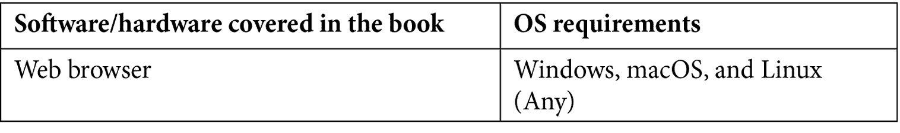

<title>B16953_Preface_Final_PG_ePub</title>

# 前言

深度学习能让所有人都能接触到吗？毫无疑问，这是谷歌或亚马逊等巨头提供的云服务试图实现的目标。Google AutoML 和 Amazon ML 服务是基于云的服务，使所有技能水平的开发人员都可以轻松使用机器学习技术。AutoKeras 是免费的开源替代方案，并且，正如我们很快将看到的，是一个奇妙的框架。

当面对深度学习问题时，创建模型时架构的选择或某些参数的配置通常来自数据科学家的直觉，基于多年的研究和经验。

就我而言，作为一名没有广泛数据科学背景的软件工程师，我一直在寻找自动化这一部分的方法，使用不同的搜索算法(网格、进化或贝叶斯)来探索组成模型的不同变量。

像许多其他 Python 开发人员一样，我从 scikit-learn 的机器学习世界开始，然后跳入 TensorFlow 和 Keras 的深度学习项目，测试不同的框架，如 Hyperas 或 TPOT，以自动化模型生成，甚至开发了一个来探索我的 Keras 模型中的架构，但 AutoKeras 一经发布，我就找到了我需要的一切，从那以后我一直在使用它并为项目做出贡献。

AutoKeras 有一个庞大的社区，它每天都在增长，并由广为人知的深度学习框架 Keras 提供支持，但除了它的文档和偶尔的博客文章，迄今为止，几乎没有任何关于它的书籍——这本书试图填补这一空白。

这本书和框架都是针对广泛的 ML 专业人员的，从寻找云服务替代方案的初学者(通过定义其输入和输出将其用作黑盒)，到希望通过详细定义搜索空间参数并将生成的模型导出到 Keras 进行手动微调来实现自动化探索的经验丰富的数据科学家。如果你是第一批，也许这些术语和概念对你来说听起来很奇怪，但是不要担心，我们会在整本书中详细解释它们。

# 这本书是给谁的

这本书是为机器学习和深度学习爱好者准备的，他们希望将自动化 ML 技术应用到他们的项目中。为了从本书中获得最大收益，需要具备 Python 编程的基础知识。

# 这本书涵盖了什么

[*第 1 章*](B16953_01_Final_PG_ePub.xhtml#_idTextAnchor014)*自动机器学习简介*，涵盖了自动机器学习的主要概念，概述了 AutoML 方法及其软件系统的类型。

[*第 2 章*](B16953_02_Final_PG_ePub.xhtml#_idTextAnchor029) ，*AutoKeras 入门*，涵盖了 AutoKeras 入门所需的一切，并借助一个基础的、解释清楚的代码示例将其付诸实践。

[*第三章*](B16953_03_Final_PG_ePub.xhtml#_idTextAnchor051) ，*用 AutoKeras 实现机器学习流水线自动化*，解释了标准的机器学习流水线，解释了如何用 AutoKeras 实现这样一个流水线的自动化，并描述了在训练模型之前要应用的主要数据准备最佳实践。

[*第 4 章*](B16953_04_Final_PG_ePub.xhtml#_idTextAnchor063) 、*使用 AutoKeras 进行图像分类和回归*，重点介绍如何通过创建更复杂、更强大的图像识别器将 AutoKeras 应用于图像，检查它们的工作方式，并了解如何对它们进行微调以提高它们的性能。

[*第五章*](B16953_05_Final_PG_ePub.xhtml#_idTextAnchor077) 、*使用 AutoKeras 进行文本分类和回归*，重点介绍使用 AutoKeras 处理文本(单词序列)。本章还解释了什么是递归神经网络以及它们是如何工作的。

[*第 6 章*](B16953_06_Final_PG_ePub.xhtml#_idTextAnchor096) ，*使用 AutoKeras* 处理结构化数据，使您能够探索结构化数据集，对其进行转换，并将其用作特定模型的数据源，以及创建您自己的分类和回归模型来解决基于结构化数据的任务。

[*第 7 章*](B16953_07_Final_PG_ePub.xhtml#_idTextAnchor109)*使用 AutoKeras 的情感分析*，使用文本分类器从文本数据中提取情感，并通过实现情感预测器以实用的方式应用文本分类的概念。

[*第八章*](B16953_08_Final_PG_ePub.xhtml#_idTextAnchor117) ，*话题分类使用 AutoKeras* ，着重讲解前面章节所学的基于文本的任务的实用方面。它教你如何用 AutoKeras 创建一个主题分类器，然后将其应用于任何主题或基于类别的数据集。

[*第 9 章*](B16953_09_Final_PG_ePub.xhtml#_idTextAnchor129)*处理多模态数据和多任务*，涵盖了 AutoModel API 的使用，展示了如何处理多模态和多任务数据。

[*第十章*](B16953_10_Final_PG_ePub.xhtml#_idTextAnchor140) 、*导出和可视化模型*，教你导出和导入 AutoKeras 模型，并以图形方式实时可视化我们的模型训练过程中发生的事情。

# 为了充分利用这本书



如果你使用的是这本书的数字版本，我们建议你自己输入代码或者通过 GitHub 库获取代码(链接见下一节)。这样做将帮助您避免任何与复制和粘贴代码相关的潜在错误。

# 下载示例代码文件

你可以从 GitHub 的 https://GitHub . com/packt publishing/Automated-Machine-Learning-with-AutoKeras 下载本书的示例代码文件。如果代码有更新，它将在现有的 GitHub 库中更新。

我们在[https://github.com/PacktPublishing/](https://github.com/PacktPublishing/)也有丰富的书籍和视频目录中的其他代码包。看看他们！

# 下载彩色图片

我们还提供了一个 PDF 文件，其中有本书中使用的截图/图表的彩色图像。可以在这里下载:[https://static . packt-cdn . com/downloads/9781800567641 _ color images . pdf](https://static.packt-cdn.com/downloads/9781800567641_ColorImages.pdf)。

# 使用的惯例

本书通篇使用了许多文本约定。

`Code in text`:表示文本中的码字、数据库表名、文件夹名、文件名、文件扩展名、路径名、伪 URL、用户输入和 Twitter 句柄。下面是一个例子:“将下载的`WebStorm-10*.dmg`磁盘镜像文件挂载为系统中的另一个磁盘。”

代码块设置如下:

```
import autokeras as ak 
import matplotlib.pyplot as plt 
import numpy as np 
import tensorflow as tf 
from tensorflow.keras.datasets import mnist 
```

当我们希望将您的注意力吸引到代码块的特定部分时，相关的行或项目以粗体显示:

```
[default]
exten => s,1,Dial(Zap/1|30)
exten => s,2,Voicemail(u100)
exten => s,102,Voicemail(b100)
exten => i,1,Voicemail(s0)
```

任何命令行输入或输出都按如下方式编写:

```
$ mkdir css
$ cd css
```

**Bold** :表示一个新术语、一个重要单词或您在屏幕上看到的单词。例如，菜单或对话框中的单词出现在文本中，如下所示。下面是一个例子:“一个**训练数据集**用于训练模型，一个**测试数据集**用于测试预测模型。”

注意

**notebook** 是由 Jupyter Notebook(https://Jupyter . org)生成的文件，Jupyter Notebook 是一个开源框架，用于创建和共享包含实时代码、可视化和富文本的文档。编辑和执行都在 web 浏览器中完成，添加代码片段(称为单元格)和丰富的文本，向我们清楚、直观地展示正在编程的内容。这些代码单元中的每一个都可以独立运行，使得开发具有交互性，并且避免了在出现错误时必须运行所有代码。

# 取得联系

我们随时欢迎读者的反馈。

**总体反馈**:如果您对本书的任何方面有疑问，请在邮件主题中提及书名，并发邮件至 customercare@packtpub.com联系我们。

**勘误表**:虽然我们已经尽力确保内容的准确性，但错误还是会发生。如果你在这本书里发现了一个错误，请告诉我们，我们将不胜感激。请访问 www.packtpub.com/support/errata，选择您的图书，点击勘误表提交表格链接，并输入详细信息。

**盗版**:如果您在互联网上遇到我们作品的任何形式的非法拷贝，如果您能提供我们的地址或网站名称，我们将不胜感激。请通过 copyright@packt.com 的[联系我们，并提供材料链接。](mailto:copyright@packt.com)

**如果你有兴趣成为一名作家**:如果有你擅长的主题，并且你有兴趣写书或投稿，请访问 authors.packtpub.com。

# 评论

请留下评论。一旦你阅读并使用了这本书，为什么不在你购买它的网站上留下评论呢？潜在的读者可以看到并使用您不带偏见的意见来做出购买决定，我们 Packt 可以了解您对我们产品的看法，我们的作者可以看到您对他们的书的反馈。谢谢大家！

更多关于 Packt 的信息，请访问[packt.com](http://packt.com)。