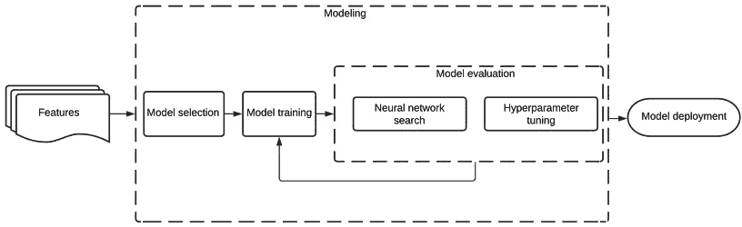
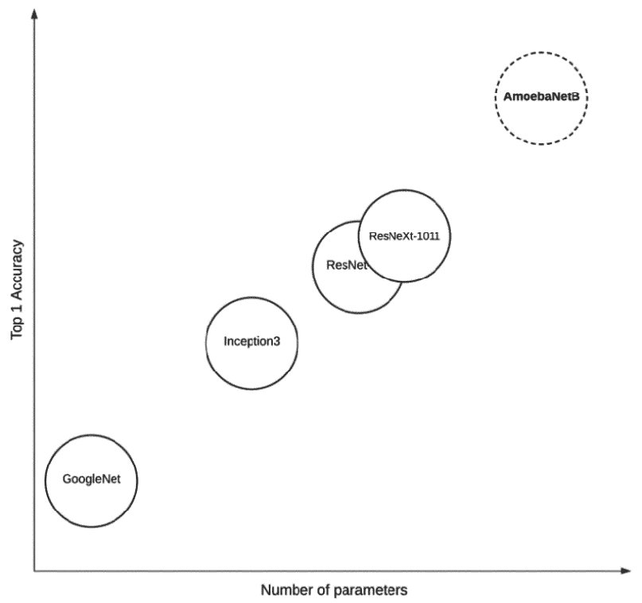

<title>B16953_01_Final_PG_ePub</title>

# *第一章*:自动化机器学习简介

在这一章中，我们通过对 AutoML 方法及其软件系统类型的概述，涵盖了与**自动化机器学习** ( **AutoML** )相关的主要概念。

如果你是一名使用 AutoML 的开发人员，你将能够把你的知识运用到这本实用指南中，在你的项目中开发和使用最先进的人工智能算法。到本章结束，你会对**机器学习** ( **ML** )工作流的解剖，AutoML 是什么，以及它的不同类型有一个清晰的了解。

通过对基本概念和实际例子的清晰解释，你将看到标准 ML 和 AutoML 方法之间的区别以及各自的优缺点。

在本章中，我们将讨论以下主要话题:

*   标准 ML 工作流程的剖析
*   什么是 AutoML？
*   汽车类型

# 标准 ML 工作流程的剖析

在传统的 ML 应用中，专业人员必须使用一组输入数据来训练模型。如果这些数据的形式不正确，专家可能需要应用一些数据预处理技术，如特征提取、特征工程或特征选择。

一旦数据准备就绪，模型可以训练，下一步就是选择正确的算法并优化超参数，以最大限度地提高模型预测的准确性。每个步骤都包含耗时的挑战，通常还需要有经验和知识的数据科学家才能成功。在下图中，我们可以看到典型 ML 管道中的主要步骤:

图 1.1–ML 管道步骤

这些流水线过程中的每一个都涉及一系列步骤。在接下来的部分中，我们将更详细地描述每个过程和相关概念。

## 数据摄取

将传入的数据传输到数据存储是任何 ML 工作流的第一步。这里的目标是在不做任何转换的情况下存储原始数据，以允许我们拥有原始数据集的不可变记录。数据可以从各种数据源获得，比如数据库、消息总线、流等等。

## 数据预处理

第二阶段，数据预处理，是流水线中最耗时的任务之一，涉及许多子任务，如**数据清理**、**特征提取**、**特征选择**、**特征工程**和**数据分离**。让我们仔细看看每一个:

*   **数据清理**过程是负责从数据集中检测并修复(或删除)损坏或错误的记录。因为数据是未处理的和非结构化的，它很少以正确的形式被处理；它意味着填充缺失的字段，删除重复的行，或者规范化和修复数据中的其他错误。
*   **特征提取**是一个过程，通过从其他特征的组合中创建新的特征(并消除原有的特征)来减少大型数据集中所需的资源数量。分析大型数据集的主要问题是要考虑的变量数量。处理大量变量通常需要大量的硬件资源，如内存和计算能力，还会导致过拟合，这意味着该算法对训练样本非常有效，而对新样本的泛化能力很差。特征提取基于新变量的构造，结合现有变量来解决这些问题，而不损失数据的精度。
*   **特征选择**是选择变量子集用于建立模型的过程。执行特征选择简化了模型(使其更易为人理解)，减少了训练时间，并通过减少过拟合来提高泛化能力。应用特征选择方法的主要原因是数据包含一些冗余或不相关的特征，因此移除它们不会导致太多信息损失。
*   **特征工程**是一个过程，通过数据挖掘技术，利用领域知识从原始数据中提取特征。这通常需要知识渊博的专家，并用于提高 ML 算法的性能。

**数据分离**包括将数据集分成两个子集:一个**训练数据集**用于训练模型，一个**测试数据集**用于测试预测模型。

建模分为三个部分:

1.  选择候选模型进行评估。
2.  训练选择的模型(改进它)。
3.  评估模型(与其他模型进行比较)。

这个过程是迭代的，包括测试各种模型，直到获得一个以有效的方式解决问题的模型。下图显示了 ML 管道的建模阶段的详细模式:

图 1.2–ML 管道的建模阶段

在概述了建模阶段之后，让我们更详细地看看每个建模步骤。

让我们更深入地研究建模的三个部分，以便对它们有一个详细的了解。

### 型号选择

在选择要使用的候选模型时，除了性能之外，考虑几个因素也很重要，例如可读性(由人来看)、调试的简易性、可用的数据量，以及训练和预测的硬件限制。

选择模型时要考虑的要点如下:

*   **可解释性和易调试性**:如何知道一个模型为什么做出一个特定的决策。我们如何修复错误？
*   **数据集类型**:有更适合特定类型数据的算法。
*   **数据集大小**:有多少数据可用，这种情况将来会改变吗？
*   **资源**:你有多少时间和资源用于训练和预测？

### 模特培训

该过程使用训练数据集来为每个选择的候选模型提供信息，允许模型通过应用提取训练样本中发现的模式的反向传播算法来从中学习。

该模型被输入来自数据预处理步骤的输出数据。该数据集被发送到所选择的模型，并且一旦被训练，模型配置和学习的参数将被用于模型评估。

### 模型评估

该步骤负责使用测试数据集评估模型的性能，以测量预测的准确性。这个过程包括调整和改进模型，生成一个新的候选模型版本以供再次训练。

### 模型调整

该模型评估步骤包括修改超参数，如学习率、优化算法或特定于模型的架构参数，如神经网络的层数和操作类型。在标准 ML 中，这些程序需要由专家手动执行。

其他时候，被评估的模型被丢弃，并且另一个新的模型被选择用于训练。通常，通过迁移学习从先前训练的模型开始会缩短训练时间，并提高最终模型预测的精度。

因为主要的瓶颈是训练时间，所以模型的调整应该集中在效率和可再现性上，以便训练尽可能快，并且有人可以再现已经采取的步骤来提高性能。

## 模型部署

一旦选择了最佳模型，通常会通过 API 服务投入生产，供最终用户或其他内部服务使用。

通常，选择最佳模型以两种部署模式之一进行部署:

*   **离线** ( **异步**):在这种情况下，模型预测在批处理中定期计算，并作为键值数据库存储在数据仓库中。
*   **在线** ( **同步**):在这种模式下，预测是实时计算的。

部署包括向现实世界的应用程序公开您的模型。这个应用可以是任何东西，从向流媒体平台的用户推荐视频到在移动应用上预测天气。

将 ML 模型发布到产品中是一个复杂的过程，通常涉及多种技术(版本控制、容器化、缓存、热交换、a/b 测试等等),这超出了本书的范围。

## 模型监控

一旦投入生产，模型将受到监控，以了解它在现实世界中的表现，并进行相应的校准。该模式代表了从数据接收到部署的连续模型周期:

图 1.3–模型循环阶段

在接下来的部分中，我们将解释监控您的生产模型非常重要的主要原因。

### 为什么要监控你的模型？

你的模型预测会随着时间而退化。这种现象叫做漂移。漂移是输入数据变化的一个结果，所以随着时间的推移，预测自然会变差。

让我们以搜索引擎的用户为例。预测模型可以使用用户特征(如个人信息、搜索类型和点击结果)来预测要显示哪些广告。但过一段时间后，这些搜索可能并不能代表当前的用户行为。

一个可能的解决方案是用最新的数据重新训练模型，但这并不总是可能的，有时甚至可能适得其反。想象在新冠肺炎疫情开始时用搜索训练模型。这将只显示与疫情相关的产品广告，导致其余产品的销售数量急剧下降。

对抗漂移的一个更聪明的选择是监控我们的模型，通过了解正在发生的事情，我们可以决定何时以及如何重新训练它。

### 你如何监控你的模型？

如果您很快就有了与预测进行比较的实际值——我的意思是您在做出预测后马上就有了真实的标签——您只需要监控诸如准确性、F1 分数等性能指标。但往往，预测和基本真相之间有延迟；例如，在预测电子邮件中的垃圾邮件时，用户可以在电子邮件创建后的几个月内报告它是垃圾邮件。在这种情况下，您必须使用基于统计方法的其他测量方法。

对于其他复杂的流程，在很难考虑经典 ML 评估指标和真实世界相关实例之间的直接关系的情况下，有时更容易进行流量/案例分割并监控纯业务指标。

### 您应该在模型中监控什么？

任何 ML 管道都涉及性能数据监控。监控模型的一些可能变量如下:

*   **选择的模型**:选择了哪种模型，架构类型、优化器算法和超参数值是什么？
*   **输入数据分布**:通过比较训练数据的分布和输入数据的分布，我们可以检测出用于训练的数据是否代表了现实世界中现在正在发生的事情。
*   **部署日期**:模型发布的日期。
*   **使用的特征**:用作模型输入的变量。有时，生产中有一些相关的特性我们在模型中没有使用。
*   **预期值与观察值的对比**:比较预期值和观察值的散点图通常是最广泛使用的方法。
*   **发布次数**:模型发布的次数，通常用模型版本号表示。
*   **时间运行**:模型部署已经多久了？

现在我们已经看到了管道的不同组件，我们准备在下一节介绍主要的 AutoML 概念。

# 什么是 AutoML？

建模阶段的主要任务是选择要评估的不同模型，并调整每个模型的不同超参数。数据科学家通常执行的这项工作需要大量时间和经验丰富的专业人员。从计算的角度来看，超参数调优是一个全面的搜索过程，因此可以实现自动化。

**AutoML** 是一个使用人工智能算法自动化前面描述的 ML 管道的每个步骤的过程，从数据预处理到 ML 模型的部署，允许非数据科学家(如软件开发人员)使用 ML 技术，而不需要该领域的经验。在下图中，我们可以看到 AutoML 系统的输入和输出的简单表示:

图 1.4–AutoML 如何工作

AutoML 还能够生成更简单的解决方案，更敏捷的概念验证创建，以及无人值守的模型训练，这些模型通常优于手动创建的模型，极大地提高了模型的预测性能，并允许数据科学家执行更难以自动化的更复杂的任务，如*模型监控*部分中定义的数据预处理和特征工程。在介绍 AutoML 类型之前，让我们快速看一下 AutoML 和传统 ML 之间的主要区别。

## 与标准方法的差异

在标准 ML 方法中，数据科学家要训练一个输入数据集。通常，这些原始数据还没有准备好用于训练算法，因此专家必须应用不同的方法，例如数据预处理、特征工程和特征提取方法，以及通过算法选择和超参数优化的模型调整，来最大化模型的预测性能。

所有这些步骤都是耗时和资源密集型的，是将 ML 付诸实践的主要障碍。

有了 AutoML，我们为非专业人士简化了这些步骤，使应用 ML 以更简单、更快速的方式解决问题成为可能。

既然已经解释了 AutoML 的主要概念，我们可以将它们付诸实践了。但是首先，我们将了解 AutoML 的主要类型以及一些广泛使用的工具来执行 AutoML。

# 汽车的类型

这一章将探索目前可用于前面列出的每一种 AutoML 类型的框架，给你一个关于 AutoML 的想法。但是首先，让我们简单地讨论一下端到端的 ML 管道，看看每个流程出现在管道中的什么地方。

正如我们在前面的工作流程图中看到的，ML 管道比建模管道涉及更多的步骤，比如数据步骤和部署步骤。在本书中，我们将重点关注建模的自动化，因为这是需要更多时间投入的阶段之一，正如我们将在后面看到的，我们将研究的 AutoML 框架 AutoKeras 使用神经架构搜索和超参数优化方法，两者都应用于建模阶段。

AutoML 尝试自动化管道中的每个步骤，但自动化的主要耗时步骤通常如下:

*   自动化特征工程
*   自动化模型选择和超参数调整
*   自动神经网络体系结构选择

## 自动化特征工程

模型使用的特性对 ML 算法的性能有直接影响。特征工程需要大量的时间和人力资源(数据科学家)的投入，并涉及大量的试验和错误，以及深入的领域知识。

自动特征工程基于迭代地创建新的特征集，直到 ML 模型获得良好的预测性能。

在标准特征工程过程中，收集数据集，例如，来自收集候选人行为数据的求职网站的数据集。通常，如果数据中没有新要素，数据科学家会创建新要素，如下所示:

*   搜索关键字
*   候选人宣读的职位名称
*   候选申请频率
*   自上次应用以来的时间
*   候选人申请的职务待遇类型

特征工程自动化试图创建一种算法，从数据中自动生成或获得这些类型的特征。

还有一种专门的形式的 ML，称为深度学习，在中，使用模型层上的矩阵变换自动从图像、文本和视频中提取特征。

## 自动模型选择和超参数优化

在数据预处理阶段之后，必须搜索一个 ML 算法来用这些特征进行训练，以便它能够根据新的观察结果进行预测。与上一步相反，模型的选择充满了可供选择的选项。有分类和回归模型、基于神经网络的模型、聚类模型等等。

每种算法都适用于某一类问题，通过自动选择模型，我们可以针对特定任务执行所有合适的模型，并选择最准确的模型，从而找到最佳模型。没有一种最大似然算法能很好地处理所有数据集，有些算法比其他算法需要更多的超参数调整。事实上，在模型选择过程中，我们倾向于试验不同的超参数。

### 什么是超参数？

在模型的训练阶段，有很多变量需要设置。基本上，我们可以将它们分为两种类型:**参数**和**超参数**。**参数**是那些在模型训练过程中学习到的参数，例如神经网络中的权重和偏差，而**超参数**是那些在训练过程之前被初始化为学习率、退出因子等的参数。

#### 搜索方法的类型

有许多算法可以找到模型的最佳超参数。下图突出显示了 AutoKeras 也使用的最著名的工具:

图 1.5–超参数搜索方法路径

让我们试着更详细地理解这些方法:

*   **Grid search**: Given a set of variables (hyperparameters) and a set of values for each variable, grid search performs an exhaustive search, testing all possible combinations of these values in the variables to find the best possible model based on a defined evaluation metric, such as precision. In the case of a neural network with learning rate and dropout as hyperparameters to tune, we can define a learning rate set of values as [0.1, 0,01] and a dropout set of values as [0.2, 0,5], so grid search will train the model with these combinations:

    (a) *learning_rate* : 0.1，dropout=0.2 = >模型版本 1

    (b) *learning_rate* : 0.01，dropout=0.2 = >车型版本 2

    (c) *learning_rate* : 0.1，dropout=0.5 = >模型版本 3

    (d) *learning_rate* : 0.01，dropout=0.5 = >车型版本 4

*   **随机搜索**:这类似于网格搜索，但以随机顺序运行模型组合的训练。随机探索特性使得随机搜索通常比网格搜索便宜。
*   **贝叶斯搜索**:该方法基于贝叶斯定理进行超参数拟合，只探索最大化概率函数的组合。
*   超级波段(Hyperband):这是随机搜索的一种新颖的变体，试图使用基于 bandit 的超参数优化方法来解决探索/开发困境。

## 自动神经网络架构选择

神经网络体系结构的设计是 ML 世界中最复杂和最乏味的任务之一。通常，在传统的 ML 中，数据科学家花费大量时间通过具有不同超参数的不同神经网络架构进行迭代，以优化模型目标函数。这很耗时，需要很深的知识，并且有时容易出错。

在 2010 年代中期，引入了通过采用进化算法和强化学习来实现神经网络搜索以设计和找到最佳神经网络架构的思想。它被称为**网络架构搜索** ( **NAS** )。基本上，它训练一个模型来创建层，将它们堆叠起来，创建一个深度神经网络架构。

NAS 系统包括以下三个主要组件:

*   **搜索空间**:由一组操作块(全连接、卷积等)以及这些操作如何相互连接以形成有效的网络架构组成。传统上，搜索空间的设计是由数据科学家完成的。
*   **搜索算法**:NAS 搜索算法测试大量候选网络架构模型。从获得的度量中，它选择具有最高性能的候选者。
*   **评估策略**:由于为了获得成功的结果，需要测试大量的模型，该过程在计算上非常昂贵，因此新方法经常出现以节省时间或计算资源。

在下图中，您可以看到三个描述的组件之间的关系:

图 1.6–NAS 组件关系

目前，NAS 是一个新的研究领域，引起了很多关注，并发表了几篇研究论文:[http://www . ml 4 aad . org/automl/literature-on-neural-architecture-search/](http://www.ml4aad.org/automl/literature-on-neural-architecture-search/)。一些被引用最多的论文如下:

*   **NASNet**([https://arxiv.org/abs/1707.07012](https://arxiv.org/abs/1707.07012))–*学习可扩展图像识别的可转移架构*:图像分类的高精度模型基于非常复杂的神经网络，具有许多层。NASNet 是一种直接从感兴趣的数据集学习模型架构的方法。由于当数据集非常大时这样做的成本很高，所以它首先在小数据集中寻找架构构建块，然后将该块转移到更大的数据集。这种方法是一个成功的例子，说明你可以用 AutoML 实现什么，因为 NASNet 生成的模型通常比最先进的、人类设计的模型更好。在下图中，我们可以看到 NASNet 是如何工作的:

图 1.7–NAS 概述

*   **AmoebaNet**–*正则化进化用于图像分类器架构搜索*:这种方法使用一种进化算法来高效地发现高质量的架构。迄今为止，应用于图像分类的进化算法还没有超过人类创造的算法。AmoebaNet-A 首次超过他们。关键是通过引入年龄属性来修改选择算法，以支持最年轻的基因型。AmoebaNet-A 与使用更复杂的架构搜索方法发现的最新一代 ImageNet 模型具有相似的精度，表明进化可以使用相同的硬件更快地获得结果，尤其是在早期搜索阶段，这在可用计算资源很少的情况下尤为重要。下图展示了历史上一些有代表性的下一代影像分类模型的精度与模型大小的相关性。虚线圆显示了 AmoebaNet 模型的 84.3%的准确性:

图 1.8–使用 ImageNet 数据集的最新影像分类模型的最高精度与模型大小之间的相关性

*   **高效的神经架构搜索**(**ENAS**):NASNet 的这个变种通过允许所有子模型共享权重来提高其效率，因此不需要从头开始训练每个子模型。这种优化显著提高了分类性能。

有许多 ML 工具可用，它们都有相似的目标，来自动化 ML 管道的不同步骤。以下是一些最常用的工具:

*   **AutoKeras** :基于深度学习框架 Keras，使用超参数搜索和 NAS 的 AutoML 系统。
*   **auto-sk learn**:AutoML工具包，允许您使用一种特殊类型的 scikit-learn 估计器，它使用贝叶斯优化、元学习和模型集成来自动进行算法选择和超参数调整。
*   **DataRobot** :一个人工智能平台，它自动执行端到端流程，用于大规模构建、部署和维护人工智能。
*   **Darwin** :一个人工智能工具，自动化模型生命周期中最慢的步骤，确保模型的长期质量和可扩展性。
*   **H2O-无人驾驶赛**:一个 AutoML 的 AI 平台。
*   Google 的 AutoML :一套 ML 产品，使得没有 ML 经验的开发者能够在他们的项目中训练和使用高性能的模型。为了做到这一点，这个工具使用了谷歌强大的下一代转移学习和神经架构搜索技术。
*   **微软 Azure AutoML** :这个云服务并行创建了许多管道，为你尝试不同的算法和参数。
*   **基于树的流水线优化工具**(**TPOT**):Python自动化机器学习工具使用遗传编程优化机器学习流水线。

在论文*AutoML 方法和工具的评估和比较*中，我们可以看到对当前存在的主要 AutoML 工具的详尽比较，从中我们可以得出结论，虽然主要的商业解决方案，如 H2O-DriverlessAI、DataRobot 和 Darwin，允许我们检测数据模式，执行特征工程，并出于解释目的分析详细结果，但开源工具更专注于自动化建模任务、培训和模型评估，将面向数据的任务留给数据科学家。

该研究还得出结论，在测试的各种评估和基准中，AutoKeras 是最稳定和高效的工具，这在性能和稳定性都是关键因素的生产环境中非常重要。除了作为一个广泛使用的工具之外，这些良好的特性也是在撰写本书时选择 AutoKeras 作为 AutoML 框架的主要原因。

# 总结

在这一章中，我们定义了 AutoML 的目的和优势，从描述 ML 流水线的不同阶段到详细描述超参数优化和神经架构搜索的算法类型。

现在，我们已经学习了 AutoML 的主要概念，我们准备进入下一章，在这一章中，您将学习如何安装 AutoKeras，以及如何使用它来训练一个简单的网络，然后在学习更复杂的技术时训练高级模型。

# 延伸阅读

*   贝叶斯定理:[https://towards data science . com/Bayes-theory-the holy-grail-of-data-science-55d 93315 defb](https://towardsdatascience.com/bayes-theorem-the-holy-grail-of-data-science-55d93315defb)
*   探索与开发的困境:[https://towards data science . com/intuition-exploration-vs-exploitation-c 645 a 1d 37 c 7 a](https://towardsdatascience.com/intuition-exploration-vs-exploitation-c645a1d37c7a)
*   多臂强盗:[https://homes.di.unimi.it/~cesabian/Pubblicazioni/ml-02.pdf](https://homes.di.unimi.it/~cesabian/Pubblicazioni/ml-02.pdf)
*   阿米巴内特:[https://arxiv.org/abs/1802.01548](https://arxiv.org/abs/1802.01548)
*   https://arxiv.org/abs/1802.03268
*   AutoML 方法和工具的评估和比较:[https://arxiv.org/pdf/1908.05557.pdf](https://arxiv.org/pdf/1908.05557.pdf)