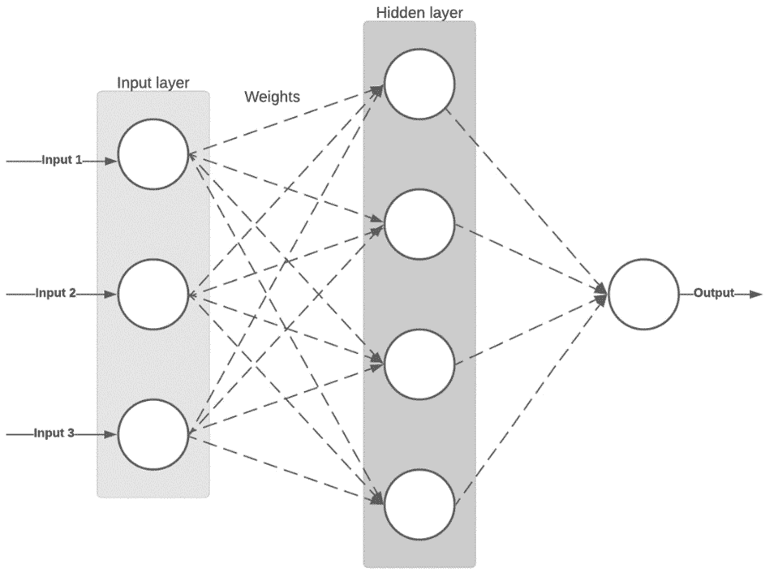
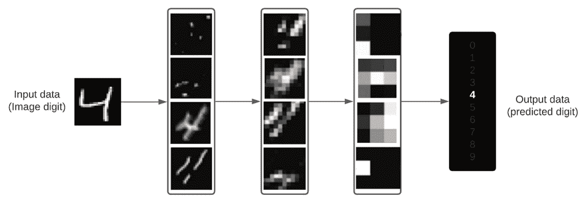
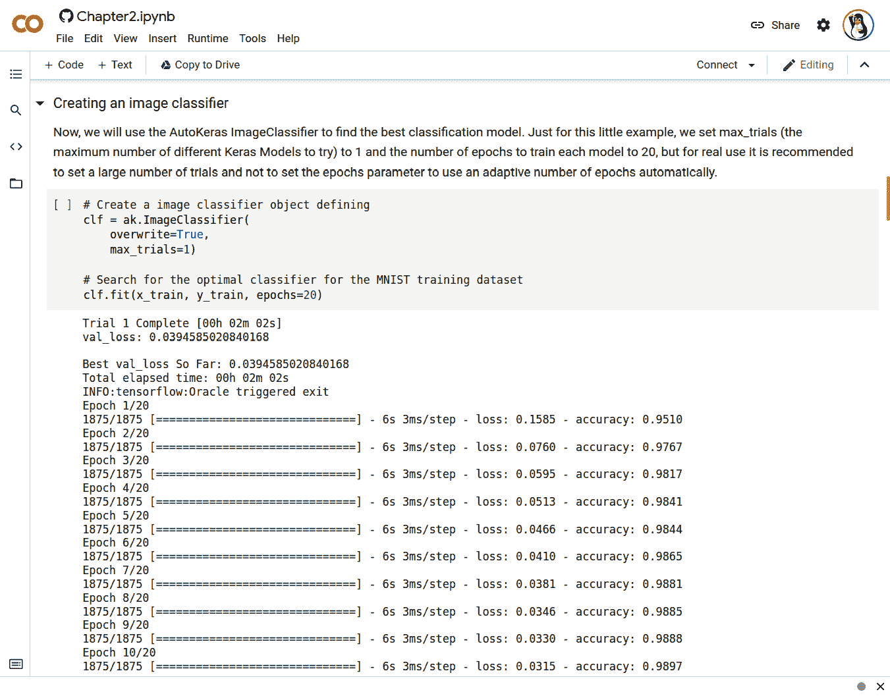
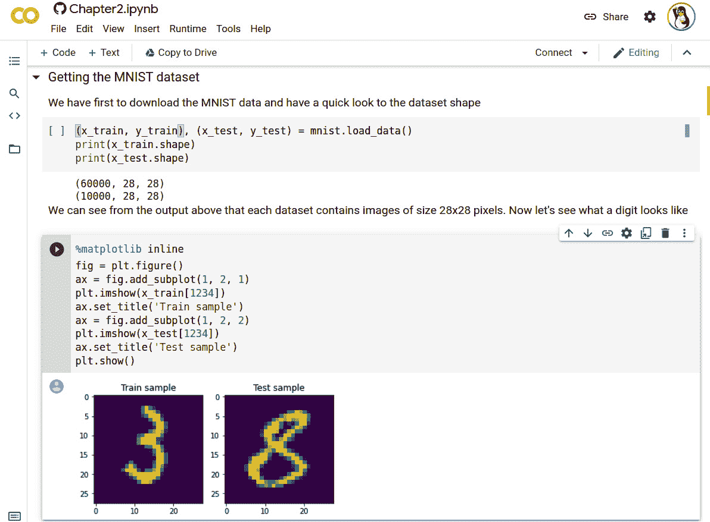
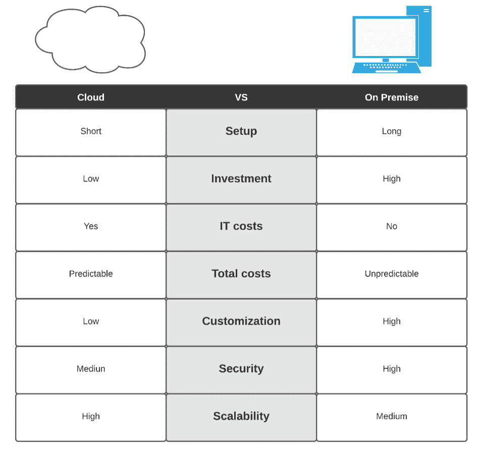
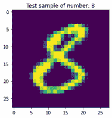
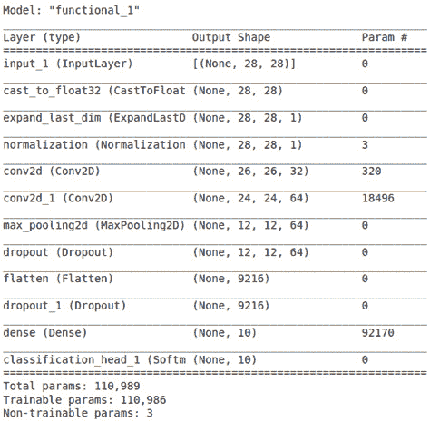
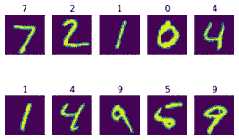
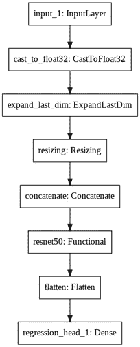

<title>B16953_02_Final_PG_ePub</title>

# *第二章【AutoKeras 入门*

在这一章中，我们将回顾开始使用 **AutoKeras** 所需的一切，并通过一个基础的、解释清楚的代码示例将其付诸实践。在本章结束时，你将知道如何从著名的**改进的国家标准与技术研究院** ( **MNIST** )数据集中创建一个简单的手写数字分类器，只需几行代码。

正如我们在前一章中看到的， **DL** ( **DL** )自动化设法加快培训时间，并从在其他不太可能自动化的管道流程中分配人力资源(数据科学家)中受益。

为了实现这种自动化，我们选择了 AutoKeras。这是一个基于 **Keras** 的 **ML** ( **ML** )自动化框架，Keras 是一个基于 **TensorFlow** 的广为人知的神经网络库，为开发 DL 模型提供了高级积木。

接下来，我们将通过一个实际的例子来了解如何安装 AutoKeras 并将其付诸实施，但让我们首先解释一些相关的概念，回答这些问题:

*   什么是深度学习？
*   什么是神经网络，它是如何学习的？
*   深度学习模型是如何学习的？
*   为什么是偷车贼？
*   安装 AutoKeras
*   你好，MNIST:实现我们的第一个 AutoKeras 实验

# 技术要求

本书中的所有编码示例都以 Jupyter Notebook 的形式提供，可以从以下网站下载:[https://github . com/packt publishing/Automated-Machine-Learning-with-AutoKeras](https://github.com/PacktPublishing/Automated-Machine-Learning-with-AutoKeras)。

Jupyter Notebook 提供了一个基于 Python 的环境，在这个环境中，代码可以作为一系列步骤来开发，这些步骤被称为单元。通过在单元中执行基于 Linux 的命令，笔记本还提供了在移动中安装库/依赖项的灵活性。

因此，要运行本章中的编码示例，您只需要一台安装了 Jupyter 的计算机。例如，在 Ubuntu/Linux 中，您可以用下面的命令行安装它:

```
$ apt-get install python3-pip jupyter-notebook
```

前面的命令将安装 Jupyter 笔记本包及其所有依赖项。

你也可以看一下*在 Ubuntu Linux 工作站上安装 AutoKeras*一节了解更多细节。

或者，您也可以使用 Google Colaboratory 运行这些笔记本，在这种情况下，您只需要一个网络浏览器。更多详细信息，请参见 *AutoKeras 与谷歌联合实验室*部分。

# 什么是深度学习？

DL 是 ML 的一个子类，基于通过实现负责提取相关特征的连续层从数据中提取模式。这些模式是通过称为神经网络(受我们大脑神经元的启发)的 ML 模型学习的，并以一层一层堆叠的方式构建，但什么是层？层是一组称为*单元*的节点，它们通过处理输入和生成输出来执行操作。这种操作可以是无状态的，但是它通常有一个存储在浮点数数组中的状态，称为*权重*。

让我们来看一个识别一位数图像的多层深度神经网络，如下所示:


图 2.1–用于数字分类的神经网络层的可视化表示

我们可以把网络想象成一个有几个过滤器的漏斗，其中每一层都相当于一个减少杂质的过滤器，直到得到想要的值。

DL 在许多领域有多种应用，如计算机视觉、**自然语言处理** ( **NLP** )、信号处理以及许多其他领域，因此本书中解释的技术可以应用于解决多个学科的问题。

我们现在将看到对神经网络和学习如何发生的简要解释。

# 什么是神经网络，它是如何学习的？

正如我们之前所说，神经网络是一组相互连接的层。每层包含一组节点，每个节点都有一个相关的权重。神经网络学习包括以适当的方式简单地修改这些权重，以便模型做出良好的预测。在下图中，我们可以看到一个简单的双层网络:



图 2.2-两层神经网络的可视化表示

上图中的每个圆圈都是一个人工神经元，它只不过是一个受生物神经元功能启发的数学函数。这些人工神经元是人工神经网络中的基本单元，它们的操作包括接收一个或多个输入(数值)并将它们乘以一个因子或权重，然后将结果相加以生成输出值。

这些模型很简单但是非常强大，因为从一组定义了输入和输出的数据中，它们可以学习预测我们不知道其输出的新数据。例如，如果我们用基于一系列输入变量(平方米、位置等)的房价来训练我们的神经网络，该网络可以基于这些变量来预测新房子的价格。

已经介绍了 DL 模型的主要概念，现在让我们看看这些模型是如何学习的。

# 深度学习模型如何学习？

让我们来看一个识别一位数图像的多层深度神经网络，如下:



图 2.3–数字分类神经网络层内容的呈现

如上图所示，网络从数字图像中提取模式。在每一层中，它获得不同的表示，因此每一层专门研究图像的一些特定特征，给出必要的关键字来识别它所属的类别。

这基本上就是 DL，一种从数据中学习模式的多阶段技术。这是基于一个非常简单的概念，但是通过调整和放大，你可以做出惊人的预测。

现在让我们来看看为什么 AutoKeras 是我们**自动化 ML** ( **AutoML** )的首选工具。

# 为什么是自动贩卖机？

正如我们在前面的章节中所解释的，AutoKeras 是一个开源的 AutoML 框架，它允许非 ML 专家以简单的方式创建高性能的模型。有类似的工具有相同的目标，但 AutoKeras 是专门从事 DL。虽然这不是唯一的解决方案，但有几种 AutoML 服务可用；大多数都是云计算平台(亚马逊、谷歌、**国际商业机器** ( **IBM** ))并且有一些显著的缺点，这里概述如下:

*   机器学习云平台价格昂贵；你通常有一个免费信用的试用期，但如果你想经常使用它们，你必须每月支付一笔费用。
*   根据云平台的不同，有些不容易配置和扩展，这有时需要您了解容器和集群。
*   他们倾向于提供简单易用但不太灵活的现成解决方案。

由于 AutoKeras 基于开源模型，它解决了这些问题，因为您可以查看源代码，安装它，并免费在本地运行它。

AutoKeras 基于以下四个主要功能，易于安装和使用:

*   它基于 Keras API 拥有清晰直观的**应用编程接口** ( **API** )。没有编程经验的用户可以很容易地学会如何使用它，但它也允许高级用户调整较低级别的系统参数。
*   它既可以在本地工作，也可以在云中工作。
*   它基于一种动态配置，可调整本地系统上可用的**图形处理单元** ( **GPU** )内存的功能中神经架构的大小。
*   它是由开源社区积极开发和维护的。

让我们看一个实际的例子，它使用 AutoKeras 创建了一个简单的分类器来预测手写数字。但是首先，我们必须通过安装 AutoKeras 及其必要的依赖项来配置工作环境。

## 如何运行 AutoKeras 实验？

作为实现本书所有编码示例的主要工具，我们将使用 Jupyter notebook。

注意

**notebook** 是由 Jupyter Notebook(【https://jupyter.org】)生成的文件，Jupyter Notebook 是一个开源框架，用于创建和共享文档，其中包含实时代码、可视化和富文本。编辑和执行都在 web 浏览器中完成，添加代码片段(称为单元格)和丰富的文本，向我们清楚、直观地展示正在编程的内容。这些代码单元中的每一个都可以独立运行，使得开发具有交互性，并且避免了在出现错误时必须运行所有代码。

在下面的截图中，您可以看到 Jupyter 笔记本如何在网络浏览器中运行我们的实验(笔记本文件),只需点击工具栏上的**运行**按钮:



图 2.4–Jupyter 笔记本电脑仅运行 AutoKeras 实验中的训练单元

使用 Jupyter 笔记本是入门 AutoKeras 的好方法，但不是唯一的方法；或者，您也可以在独立的 Python 脚本中创建您的实验，并从命令行或从您自己的**集成开发环境** ( **IDE** )运行它们。

# 安装 AutoKeras

在接下来的章节中，我们将详细解释安装 AutoKeras 的不同选项，以及如何逐步配置每个选项。

安装 AutoKeras 时有两种选择:我们可以安装在本地工作站上，也可以安装在云中。这两种选择各有利弊，我们将在本章进行分析。

## 在云中安装 AutoKeras

在云中，我们选择了两个选项:将其安装在**亚马逊网络服务** ( **AWS** )实例/容器上，或者使用**谷歌合作实验室**。在这两种情况下，我们将使用 Jupyter 笔记本从 web 浏览器连接到云实例，如下面的屏幕截图所示。我们只需要一台连接互联网的电脑来运行笔记本电脑:


图 2.5–AutoKeras 云配置

让我们更详细地看看云的选项。

### AutoKeras 与谷歌合作实验室

谷歌提供了一项名为**合作实验室**的 Jupyter 笔记本托管服务，在这里你可以上传你的 Jupyter 笔记本，并在谷歌的云服务器上运行它们，利用谷歌硬件(GPU 或**张量处理单元** ( **TPU** )的能力，而不管你的工作站的能力。你所需要的只是一个网络浏览器。此外，正如我们之前所说，笔记本可以安装自己的依赖项，因此 AutoKeras 安装可以在运行笔记本时执行(就像我们在本书中对笔记本所做的那样)。

只需遵循以下三个步骤，您就可以运行我们的 MNIST 笔记本:

1.  在[https://colab.research.google.com](https://colab.research.google.com)创建一个账户。
2.  在 Colaboratory 中，通过以下链接从 GitHub 打开实验:[https://colab . research . Google . com/GitHub/packt publishing/Automated-Machine-Learning-with-AutoKeras/blob/main/chapter 02/chapter 2 . ipynb](https://colab.research.google.com/github/PacktPublishing/Automated-Machine-Learning-with-AutoKeras/blob/main/Chapter02/Chapter2.ipynb)。
3.  Click the **Run** button to start the AutoKeras installation and run the experiment.

    在下面的截图中，您可以看到 Colaboratory 正在运行我们的实验:



图 2.6–在 Google 联合实验室中运行的 AutoKeras

因此，Google Colaboratory 是一个非常好的选择，可以快速轻松地探索和运行您的笔记本，但接下来，我们还将详细解释如何安装 Jupyter notebook，以及必要的依赖项，以便在 AWS 实例或您自己的工作站上运行我们的笔记本。

### AWS 的自动贩卖机

基本上，我们必须确保我们创建了一个亚马逊 EC2 Ubuntu/ Linux 实例，具有 GPU 支持和**计算统一设备架构** ( **CUDA** )库。因为 AutoKeras 将在我们的 Jupyter 笔记本运行时安装，所以我们只需安装 Jupyter 框架并在那里运行我们的笔记本。以下屏幕截图显示了 AWS 实例中 AutoKeras 安装的客户端和服务器端:


图 2.7–在 AWS 实例中运行的 AutoKeras

AWS 有许多实例,其中一些已经预装了 CUDA 和 Jupyter 库，其端口被映射为从您的浏览器访问。这些的配置超出了本书的范围，但是在[https://docs.aws.amazon.com/dlami/](https://docs.aws.amazon.com/dlami/)有关于如何设置 DL **亚马逊机器映像** ( **AMIs** )的详细信息，允许你在亚马逊 Linux 或 Ubuntu 上快速构建亚马逊**弹性计算云** ( **EC2** )实例，预装了最流行的 DL 框架。

如果你更喜欢容器而不是实例，你也可以选择运行 **AWS DL 容器** ( **AWS DL 容器**)，它们是类似于以前 ami 的 Docker 映像，预装了 DL 软件。在 https://aws.amazon.com/machine-learning/containers/了解更多信息。

### 云中的 AutoKeras:优势和劣势

如果你没有一个强大的 GPU，云是一个很好的廉价选择，无需购买额外的硬件。

云产品让 AutoKeras 的入门变得简单；你可以在一个 AWS 实例上从头开始设置，将你的实验上传到云服务，比如谷歌联合实验室([colab.research.google.com](http://colab.research.google.com))，或者使用 AutoKeras 扩展在远程服务器上运行培训。在本书的最后，我们将看到一个名为 TensorFlow Cloud 的扩展，它允许你在**谷歌云平台** ( **GCP** )上运行你的程序，只需插入几行代码，轻松利用这个云平台的计算能力。

但是对于更密集的 DL 使用，从长远来看，这种配置并不是最合适的。云实例或服务是昂贵的，如果你需要训练一个模型超过几个小时，那么投资一个具有一个或多个 GPU 的本地工作站是值得的。

另一方面，如果您需要大规模的按需配置，建立自己的服务器集群需要很高的人力和硬件资源成本，并且比云替代方案更难以扩展和维护。

在此屏幕截图中，您可以看到云和内部部署的主要区别:



图 2.8–云中的 AutoKeras 与本地成本

简而言之，在云中运行 AutoKeras 是一个非常好的开始方式。你可以按照本书中的代码示例，使用 Google Colaboratory 等云工具的力量获得前沿的预测结果，但如果你打算自己运行几天甚至几周的训练实验，最好是自己弄个 GPU。

## 在本地安装 AutoKeras

如果你已经有了自己的硬件资源，是时候安装软件来运行你的模型了。接下来概述的选项将指导您实现这一目标。

### 选择哪个操作系统

说到为 AutoKeras 选择操作系统，Linux 无疑是最适合你的工作站和云的选择。

虽然可以在 Windows 中使用 AutoKeras，但不建议这样做。

更具体地说，理想的选择是 Ubuntu Linux 机器，这是因为有大量可用的软件包，而且它是 ML 社区使用最多的系统。如果你用的是 Windows，最简单快捷的解决方案就是在你的工作站上安装 Ubuntu 双引导，按照这个链接的指示:[https://help.ubuntu.com/community/WindowsDualBoot](https://help.ubuntu.com/community/WindowsDualBoot)。

您也可以使用 AutoKeras Docker 映像，但是根据您的硬件，这有时会在访问 GPU 时产生问题。

### 在 Ubuntu Linux 工作站上安装 AutoKeras

一旦你在工作站上安装了 Ubuntu，你就可以按照以下步骤安装 AutoKeras 并运行本书附带的笔记本文件:

1.  打开一个 shell 并运行这些命令来安装 Jupyter 笔记本:

    ```
    $ apt-get install python3-pip jupyter-notebook
    ```

2.  运行此命令启动笔记本:

    ```
    $ jupyter-notebook
    ```

3.  现在，在浏览器中转到`http://127.0.0.1:8888`并打开笔记本文件。
4.  In the top menu, go to **Runtime** -> **Run All** to run the experiment. AutoKeras and its dependencies will be installed before running the rest of the code.

    重要说明

    **GPU 设置(可选)**:如果您的工作站上有 GPU，并且希望 AutoKeras 使用它们来加速这些 GPU 的训练，您可以按照本教程进行设置:

    [https://www.tensorflow.org/install/gpu](https://www.tensorflow.org/install/gpu)

请记住，AutoKeras 是一项正在进行的工作，它发展非常快，在安装过程中可能会有变化。因此，我建议看看最新的安装说明，在[https://autokeras.com/install/](https://autokeras.com/install/)。

使用 Docker 容器运行 AutoKeras。开始使用 TensorFlow 和 Keras 最简单的方法是在 Docker 容器中运行。

Docker 是一套工具，它允许你在叫做容器的包中安装软件，在操作系统层面使用虚拟化。每个容器的行为就像一个单独的操作系统，有自己的软件、库和配置文件，并且这些都是相互隔离的。创建 Docker 容器的过程包括三个步骤，如下所示:

1.  首先，在名为 **Dockerfile** 的文件中定义 Docker 容器。
2.  然后，使用 Docker 命令行工具，您可以从这个 Docker 文件构建一个映像。
3.  最后，您可以从这个映像启动一个 Docker 容器。

您可以在下图中看到这三个步骤:


图 2.9–从 Dockerfile 文件构建容器

有一个名为 Docker Hub([https://hub.docker.com/](https://hub.docker.com/))的 Docker 图片公共存储库。在那里，你可以找到数以千计的预装软件包 Docker 图像。

您可以在最新版本的框架中使用 Docker image for AutoKeras，并通过以下步骤安装其依赖项:

1.  将最新的 AutoKeras Docker 映像下载到您的机器，如下:

    ```
    $ docker pull haifengjin/autokeras:latest
    ```

2.  Run the AutoKeras Docker container, as follows:

    ```
     $ docker run -it --shm-size 2G  haifengjin /autokeras /bin/bash.
    ```

    如果需要更多内存，只需更改`shm-size`值。

3.  在容器内运行本地 Python 脚本，如下所示:

```
$ docker run -it -v hostDir:/app --shm-size 2G  haifengjin /autokeras python file.py. 
```

注意，我们已经挂载了要执行的 Python 文件所在的`hostDir:/app`主机文件夹。

您还可以安装 Jupyter 笔记本，并从笔记本实验中运行 AutoKeras 安装过程，就像我们在上一节中所做的那样。

# 你好，MNIST:实施我们的第一个 AutoKeras 实验

我们的第一个实验将是使用 MNIST 数据集的图像分类器。这个 MINST 分类任务就像 DL 的*《hello world》*。将手写数字图像分为 10 类(0 到 9)是一个经典问题。这些图像来自 MNIST，这是 ML 中最著名和最广泛使用的数据集。它包含 NIST 在 20 世纪 80 年代收集的 70，000 幅图像(60，000 幅用于训练，10，000 幅用于测试)。

在下一张截图中，您可以看到 MNIST 数据集中每个数字的一些样本:


图 2.10-MNIST 数据集样本图像

AutoKeras 的设计目的是轻松地对所有类型的数据输入进行分类——如结构化数据、文本或图像——因为每种类型都包含一个特定的类。

对于这个任务，我们将使用`ImageClassifier`。这个类生成并测试不同的模型和超参数，返回一个最佳分类器来对手写数字图像进行分类。

现在，我们来详细看看笔记本最相关的单元格。

## 导入所需的包

加载 AutoKeras 和所需的包，如 matplotlib，如下所示:

```
import autokeras as ak
import matplotlib.pyplot as plt
import numpy as np
import tensorflow as tf
from tensorflow.keras.datasets import mnist
```

前面的包包括一个绘图 Python 库，我们用它来绘制一些数字表示，我们使用的数据集是 MNIST 手写数字数据集。

## 获取 MNIST 数据集

我们必须首先将 MNIST 数据加载到内存中，并快速浏览一下数据集的形状。为此，我们运行以下代码:

```
(x_train, y_train), (x_test, y_test) = mnist.load_data()
print(x_train.shape)
print(x_test.shape)
```

将显示以下输出:

```
Downloading data from https://storage.googleapis.com/tensorflow/tf-keras-datasets/mnist.npz
11493376/11490434 [==============================] - 0s 0us/step
(60000, 28, 28)
(10000, 28, 28)
```

我们可以从前面的输出中看到，每个数据集包含大小为`28x28`像素的图像。

现在，让我们通过运行下面的代码来看看一个数字是什么样子的:

```
%matplotlib inline
fig = plt.figure()
ax = fig.add_subplot(1, 2, 1)
plt.imshow(x_train[1234])
ax.set_title('Train sample')
ax = fig.add_subplot(1, 2, 2)
plt.imshow(x_test[1234])
ax.set_title('Test sample')
plt.show()
```

将显示以下输出:


图 2.11–训练和测试样本可视化

一旦我们看了数据集的一些样本，让我们看看它们的分布。

## 数字是如何分布的？

当我们使用数据集时，检查数据是否均匀分布是非常重要的。这可以通过使用`numpy`函数轻松完成，如以下代码块所示:

```
train_histogram = np.histogram(y_train)
test_histogram = np.histogram(y_test)
_, axs = plt.subplots(1, 2)
axs[0].set_xticks(range(10))
axs[0].bar(range(10), train_histogram[0])
axs[1].set_xticks(range(10))
axs[1].bar(range(10), test_histogram[0])
plt.show()
```

将显示以下输出:


图 2.12–训练和测试数据集直方图

它看起来是同质的——每组数字都有相似数量的样本，所以现在是时候创建我们的模型了。

## 创建图像分类器

我们现在将使用 AutoKeras `ImageClassifier`类来寻找最佳分类模型。对于这个小例子，我们将`max_trials`(可尝试的不同 Keras 模型的最大数量)设置为 1，将训练每个模型的时期数设置为 20，但在实际使用中，建议设置大量试验，不要设置`epochs`参数，而是自动使用自适应的时期数。代码可以在这里看到:

```
clf = ak.ImageClassifier(max_trials=1)
```

让我们运行训练来搜索 MNIST 训练数据集的最佳分类器，如下所示:

```
clf.fit(x_train, y_train, epochs=10)
```

将显示以下输出:


图 2.13–图像分类器训练的笔记本输出

在前面的输出中，我们可以看到，该模型在短短几分钟内就达到了训练数据集的相当高的精度。我们还可以看到，生成的最佳模型被保存到了磁盘上。

我们还可以看到，精度在每个时期都在增加，因此，如果我们增加*时期的数量*，我们将有一个更精确的模型，尽管这也需要更长的时间来完成。同样重要的是要考虑到，在大量的历元之后，模型通常会停止学习。

让我们用测试数据集来测试它，以了解预测的实际准确性。

## 用测试集评估模型

在训练之后，是时候使用保留的测试数据集来测量我们的模型的实际预测了。这样，我们可以排除训练集获得的良好结果是由于过度拟合。看看下面的代码片段:

```
metrics = clf.evaluate(x_test, y_test)
print(metrics)
```

将显示以下输出:

```
313/313 [==============================] - 1s 4ms/step - loss: 0.0354 - accuracy: 0.9889
[0.03537507727742195, 0.9889000058174133]
```

我们在这里可以看到，考虑到我们在训练阶段只花了几分钟，使用我们的测试数据集有非常好的预测准确性(98.8%)。

让我们看看它是如何预测单个测试样本的。首先，我们将数字及其真实值可视化，如下所示:

```
plt.imshow(x_test[1234])
plt.title('Test sample of number: %s' % y_test[1234])
plt.show()
```

将显示以下输出:



图 2.14–待预测的测试样本

现在，我们使用分类器打印预测值，如下所示:

```
print(clf.predict(x_test[1234, None]))
```

将显示以下输出:

```
[['8']]
```

我们可以看到输出与真实值匹配，所以我们的分类器已经正确地预测到了这一点。现在让我们看看分类器的内部，了解它是如何工作的。

## 可视化模型

我们现在正在将我们的分类器模型导出到 Keras，这样我们就可以看到一点摘要，以及找到的最佳生成模型的架构。下面是我们需要的代码:

```
model = clf.export_model()
model.summary()
```

将显示以下输出:



图 2.15–图像分类器模型架构总结

如果你没有 Keras 或 Tensorflow 的经验，这个输出会有点混乱，但是不要担心——使用 AutoKeras 没有必要理解它，因为该工具完成了所有的工作，将我们从这些细节中抽象出来，但是知道它是如何工作的总是好的。在后面的章节中，我们将详细了解每一层的含义，但让我们先来看一下这里发生了什么。

每一层都对输入数据执行转换操作，将转换后的数据传递给下一层。

第一层有一个 28x28 的输入，对应于图像的像素，如下面的代码片段所示:

```
input_1 (InputLayer)         [(None, 28, 28)]        0       
```

以下三层对图像进行转换和归一化，使其适应卷积运算(Conv2D)的输入:

```
tf_op_layer_Cast (TensorFlow (None, 28, 28)          0      
____________________________________________________________
tf_op_layer_ExpandDims (Tens (None, 28, 28, 1)       0      
_____________________________________________________________
normalization (Normalization (None, 28, 28, 1)       3       
```

广泛用于图像分类的卷积运算层通过使用过滤器来提取图像的特征(我们将在后面的章节中讨论)。我们可以在下面的代码片段中看到这个过程:

```
conv2d (Conv2D)              (None, 26, 26, 32)      320     
_____________________________________________________________
conv2d_1 (Conv2D)            (None, 24, 24, 64)      18496   
_____________________________________________________________
max_pooling2d (MaxPooling2D) (None, 12, 12, 64)      0       
```

随后，有几个层通过执行脱落(任意断开部分神经连接)来防止过拟合，如下所示:

```
dropout (Dropout)            (None, 12, 12, 64)      0      
____________________________________________________________
flatten (Flatten)            (None, 9216)            0       
____________________________________________________________
dropout_1 (Dropout)          (None, 9216)            0       
```

然后，执行全连接操作，将卷积操作的输出维数减少到 10 个元素，对应于从 0 到 9 的数字，如下所示:

```
dense (Dense)                (None, 10)              92170   
```

最后，最后一层(Softmax)只剩下对应于最终预测数的 10 个元素的最高值，如下所示:

```
classification_head_1 (Softm (None, 10)              0  
```

有一种更图形化的方式来可视化模型，所以让我们通过运行下面的代码来看看:

```
from tensorflow.keras.utils import plot_model
plot_model(clf.export_model())
```

将显示以下输出:


图 2.16–图像分类器模型架构可视化

在前面的图中，每个块代表一个层，每个块的输出连接到下一个层的输入，除了第一个块(其输入是图像)和最后一个块(其输出是预测)。

## 创建图像回归器

现在，我们将使用不同的方法从图像中计算出数字值:回归模型称为 regressor。

图像回归器将尝试预测数字的标量值，将其分类到 0-9 类别中。

AutoKeras 已经有一个名为`ImageRegressor`的特殊类可以使用，它将找到最佳回归模型。

正如我们对分类器所做的那样，对于这个小示例，我们将`max_trials`(要尝试的不同 Keras 模型的最大数量)设置为 1，将训练每个模型的时期数设置为 20，但是对于实际使用，建议设置大量的试验，而不要将`epochs`参数设置为自动使用自适应的时期数。

首先，我们初始化图像回归器，如下所示:

```
reg = ak.ImageRegressor(
overwrite=True,
max_trials=1)
```

现在，为图像回归器提供训练数据集，如下所示。

```
reg.fit(x_train, y_train, epochs=20)
```

现在是关键时刻，让我们用测试集来评估一下。

## 用测试集评估模型

最后，我们使用以下代码，通过测试数据集评估最佳模型:

```
reg.evaluate(x_test, y_test)
```

将显示以下输出:


图 2.17–图像回归器培训的笔记本输出

20 分钟后，找到的最好的型号有一个`0.083`，还不错。MSE 是一种广泛使用的度量标准，用于测量回归模型中的性能。

让我们用找到的最佳模型来预测测试数据集的前 10 个数字，并打印预测值和真实值来进行比较。我们可以通过运行以下代码来实现这一点:

```
predicted_y = reg.predict(x_test[:10])
print(list(y_test[:10]))
print([round(float(i)) for i in predicted_y])
```

将显示以下输出:

```
[7, 2, 1, 0, 4, 1, 4, 8, 5, 9]
[7, 2, 1, 0, 4, 1, 4, 8, 5, 9]
```

正如你所看到的，它是预测每一种情况下的真实值。让我们通过运行以下代码以更图形化的方式来查看它:

```
fig = plt.figure()
for i, v in enumerate(predicted_y):
    ax = fig.add_subplot(2, 5, i+1)
    ax.set_axis_off()
    ax.set_title(round(float(v)))
    plt.imshow(x_test[i])
plt.show()
```

将显示以下输出:



图 2.18–标有预测值的图像数字

请注意，我们已经将回归器返回的浮点值四舍五入，以将其与真实值进行比较。这样做是因为回归器总是返回接近真实值的连续值，所以如果我们想预测离散值(0 到 9 位数字)，我们必须进行舍入来返回预测值。

现在，正如我们对分类器所做的那样，让我们来看看最佳生成模型的架构。

## 可视化模型

我们将模型导出到 Keras 模型，然后调用`model.summary`函数来查看架构，如下所示:

```
model = clf.export_model()
model.summary()
```

将显示以下输出:


图 2.19–图像回归器模型架构摘要

正如我们对分类器所做的那样，有一种更直观的方式来查看它，如下所示:

```
from tensorflow.keras.utils import plot_model
plot_model(clf.export_model())
```

将显示以下输出:



图 2.20–图像回归模型架构可视化

在这个分类器的例子中，我们给出了每个块的快速视图。我们不会在这里深入探讨，因为我认为这对于“入门”章节来说已经足够了。在接下来的章节中，我们将更详细地解释屏幕截图中出现的每个模块。

# 总结

在本章中，您已经学习了 AutoKeras 入门的主要选项，从安装到在各种环境中运行。

您还看到了 AutoKeras 的强大之处，它通过几行代码和 2 分钟的培训实现了高精度图像分类器的两种不同方法。

既然您已经学会了从零开始实现 DL 模型，遵循这些相同的步骤并简单地更改数据集，您的模型将能够对所有类型的图像进行分类。

在接下来的章节中，您将学习如何解决与作为输入数据源的图像、结构化数据和明文相关的更复杂的任务，但在此之前，在下一章中，我们将看到如何通过使用一些有趣的工具来尽可能自动化这个过程，从而准备数据以馈送给 AutoKeras。