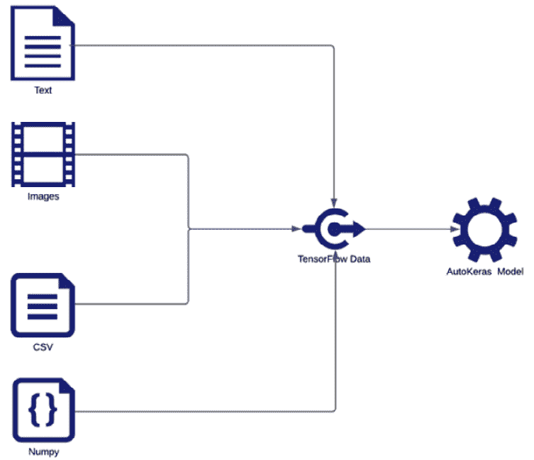
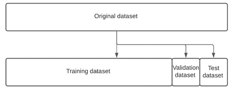

# *第三章*:用 AutoKeras 自动化机器学习流水线

机器学习流水线的自动化涉及到一系列过程的自动化，如**数据探索**、**数据预处理**、**特征工程**、**算法选择**、**模型训练**、**超参数调优**。****

本章解释了标准的机器学习管道，以及如何用 **AutoKeras** 来自动化其中的一些。我们还将描述在训练模型之前要应用的主要数据准备最佳实践。后数据准备步骤由 AutoKeras 执行，我们将在后面的章节中深入了解。

正如我们在第一章中看到的，AutoKeras 可以通过应用超参数优化和**神经架构搜索** ( **NAS** )来自动化所有管道建模步骤，但在这些步骤之前，必须手动或使用其他工具来完成一些数据预处理。

我们将解释我们的模型所期望的数据表示，以及 AutoKeras 应用的基本预处理技术。在本章结束时，你将学会以合适和最佳的方式为你的模型提供数据的主要格式和技术。

将涉及的主要议题如下:

*   理解张量
*   为深度学习模型准备数据
*   以多种格式将数据加载到 AutoKeras 中
*   分割数据集用于训练和评估

在本章中，我们将了解一些基本的预处理技术以及如何使用 AutoKeras 助手来应用它们，但是首先，让我们解释一下我们的模型需要什么样的数据结构以及它们是如何表示的。

# 理解张量

在 MNIST 的例子中，数字图像存储在 NumPy 矩阵中，也称为张量。这些张量是机器学习模型的基本数据结构。现在我们知道了模型的燃料，让我们更深入地理解什么是张量以及它们的不同类型。

## 什么是张量？

张量基本上是一个多维数组的数字，通常是 N 维的浮点数(也称为*轴*)。

张量由三个关键属性定义:轴的数量或等级，每个轴或形状的维度，以及它包含的数据类型。我们来详细解释一下:

*   `numpy` nomenclature (`ndim`). For instance, a scalar (a single number) has no axes, a vector (a list of numbers) has one, a matrix (a list of vectors) has two, and a 3D tensor (a list of matrices) has three. Let's look at a practical example:

    ```
    >>> import numpy as np 
    >>> x = np.array([[1, 2, 3], [4, 5, 6], [7, 8, 9], [10, 11, 12]]) 
    >>> x.ndim
    2
    ```

    在前面的代码片段中，我们创建了一个矩阵并打印了它的秩(`2`)。

*   **Shape (each axis dimension)**: This is the dimension of each axis and returns a tuple with the lengths of the corresponding array dimensions. In the case of a matrix, the first item would correspond to the number of rows and the second item would correspond to the number of columns, as shown in the following code:

    ```
    >>> import numpy as np 
    >>> x = np.array([[1, 2, 3], [4, 5, 6], [7, 8, 9], [10, 11, 12]]) 
    >>> x.shape 
    (4, 3) 
    ```

    这一次，我们创建了一个矩阵并打印出它的形状(4 行，3 列)。

*   **数据类型**:张量中包含的数据类型通常是浮点数，因为计算机处理这类数据的方式更优。例如，在下面的矩阵中，存储的项是整数:

    ```
    >>> import numpy as np 
    >>> x = np.array([[1, 2, 3], [4, 5, 6], [7, 8, 9], [10, 11, 12]]) 
    >>> x.dtype 
    dtype('int64')Here we have created a matrix and printed the type of its items (int64)
    ```

既然我们已经解释了张量的关键属性，让我们看看我们可以使用什么类型的张量。

## 张量的类型

根据它们的维度，我们可以将张量分类如下:

*   **Scalar (N=0)**: A tensor containing just one number is called a scalar; let's create one:

    ```
    >>> import numpy as np 
    >>> t = np.array(123) 
    >>> t 
    array(123) 
    >>> v.ndim 
    0
    ```

    通过创建一个标量并打印它的等级，我们可以看到它的值是 0。

*   **Vector (N=1)**: A 1D tensor is a called vector. It's an array of numbers of 1 dimension, as shown in the following code:

    ```
    >>> x = np.array([1, 2, 3]) 
    >>> xarray([1, 2, 3]) 
    >>> x.ndim 
    1
    ```

    这里，我们创建了一个一维的向量并打印出它的秩。

*   `[1, 2, 3]`和第一列分别为`[1, 4, 7]`。
*   **3D tensors (N=3)**: A 3D tensor is an array of matrices. This tensor is typically used to represent images using a 3-matrice array, with each matrix representing a color (red, green, or blue) of the pixel. You can imagine it as a cube filled with numbers. Let's create one using the following code:

    ```
    >>> x = np.array([[[1, 2, 3], [4, 5, 6], [7, 8, 9]], [[10, 11, 12], [13, 14, 15], [16, 17, 18]], [[19, 20, 21], [22, 23, 24], [25, 26, 27]]]) 
     >>> x.ndim 
     3
    ```

    这里，我们可以看到返回的 3D 张量的秩是 3。

*   **4D 张量(N=4)** : 4D 张量是 3D 张量的阵列。这种复杂的结构通常用于存储视频，视频基本上是一批帧的，其中每一帧都是由一个 3D 张量表示的图像。

以下是这些等级的直观表示:


图 3.1–不同等级张量的可视化表示

3D 张量可以存储 RGB 图像或帧，而 4D 张量可以包含作为帧阵列的视频。

# 为深度学习模型准备数据

在前面的章节中，我们解释了 AutoKeras 是一个专门研究深度学习的框架，它使用神经网络作为学习引擎。我们还学习了如何为作为输入数据的手写数字 MNIST 数据集创建端到端的分类器/回归器模型。该数据集已经过预处理以供模型使用，这意味着所有图像都具有相同的属性(相同的大小、颜色等)，但情况并非总是如此。

一旦我们知道张量是什么，我们就准备好学习如何为我们的神经网络提供信息。大多数数据预处理技术都是特定于领域的，当我们需要在具体的例子中使用它们时，我们将在后面的章节中解释它们。但是首先，我们将介绍一些基础知识，它们是每种特定技术的基础。

## 神经网络模型的数据预处理操作

在这一节中，我们将看到一些可以用来将原始输入数据转换成更合适格式的操作。这将允许我们为神经网络提供信息，以提高模型的学习性能。

主要的数据预处理操作是特征工程、数据标准化、数据矢量化和缺失值处理。让我们详细看看它们:

*   **Feature engineering**: This is the process of extracting features from raw data using the domain knowledge of human experts, in such a way that these extracted features improve the performance of our models.

    在传统的机器学习中，功能工程至关重要，但在深度学习中，这一过程并不重要，因为神经网络可以自动从原始输入数据中提取相关特征。然而，在某些情况下，功能工程仍然至关重要，例如当我们没有大型数据集，输入数据是结构化的，或者我们的资源有限。在这些情况下，这一步是实现我们目标的关键。

*   **数据标准化**:神经网络在小输入值的情况下工作得更好，通常在 0 到 1 之间。对于模型来说，从小数字中学习更容易，因为学习算法是基于对其权重参数进行的梯度更新，以这种方式，小值将导致更快的更新，从而加快过程，而大值将减慢过程。通常，数据集具有较大的值，因此在将它们合并到我们的模型中之前，我们需要将它们更改并缩放到 0 到 1 的范围。这种技术被称为规范化。AutoKeras 已经为我们做了这件事。在前面的数字分类示例中，数据集包含编码为从 0 到 255 的整数的图像。然而，我们在没有执行标准化的情况下填充了我们的模型，因为 AutoKeras 自动为我们执行了标准化。
*   `MINST`上一章显示的例子，数据集已经矢量化，所以这个过程没有必要。
*   **缺失值处理**:数据集在一些记录中经常包含缺失的值。您的模型应该如何处理这些不完整的记录？通常，对于深度学习模型，将缺失值初始化为 0 是一种常见的做法，只要 0 还不是一个重要的值。一旦神经网络模型学习到 0 表示一个缺失值，它每次都会忽略它。重要的是要注意，如果你的模型将暴露于现实世界中缺失的值，并且你在没有它们的情况下训练它，它将不会学会忽略它们。因此，在这种情况下，常见的做法是人工生成缺失值，以迫使您的模型学会如何处理它们。

现在我们已经了解了主要的数据结构和它们的`transform`操作，我们将看看 AutoKeras 支持哪些数据格式，以及它有哪些实用程序可以将原始数据转换成更合适的格式。

# 以多种格式将数据加载到 AutoKeras 中

正如我们前面提到的，AutoKeras 自动执行规范化。然而，在接下来的章节中，你将会看到你可以用一种更加个性化的方式来创建你的模型。更具体地说，您可以使用特殊的块来规范化您的数据。

现在，让我们看看可以用来填充模型的不同数据结构。

AutoKeras 模型接受三种类型的输入:

*   一个 **NumPy 数组**是一个数组，它通常被 **Scikit-Learn** 和许多其他基于 Python 的库使用。只要你的数据适合内存，这总是最快的选择。
*   **Python 生成器**将批量数据从磁盘加载到内存中，因此当整个数据集不适合内存时，这是一个不错的选择。
*   **TensorFlow 数据集**是一个高性能的选项，类似于 Python 生成器，但它最适合深度学习和大型数据集。这是因为数据可以从磁盘或分布式文件系统中流出。

在将数据提供给 AutoKeras 模型之前，可以使用其中一种格式准备数据。如果您正在处理大型数据集，并且需要在 GPU 中进行训练，最佳选择是使用 **TensorFlow Dataset** 对象，因为它们在性能和通用性方面有许多优势，例如:

*   它可以执行异步预处理和数据排队。
*   它提供 GPU 内存数据预加载，以便在 GPU 完成处理前一批数据后可用。
*   它提供了转换原语，因此您可以将函数应用于数据集的每个元素，从而生成新的转换数据集。
*   在内存中维护从数据集读取的最新批次的缓存。
*   您可以从几个来源加载( **NumPy 数组**、 **Python 生成器**、 **CSV 文件**、文本文件、文件夹等等)。

下图显示了可以使用 TensorFlow 数据集对象作为输入的所有不同数据源:



图 3.2–张量流数据集对象输入源的可视化表示

AutoKeras 有非常有用的实用程序来帮助您将磁盘上的原始数据转换成 TensorFlow 数据集:

*   `autokeras.image_dataset_from_directory` converts image files stored in a directory in a specific way into a tagged dataset of image tensors. Let's learn how to process a images directory.

    下面的目录结构良好，这意味着我们可以将它提供给 AutoKeras。每类图像都有一个子文件夹:

    ```
    main_directory/
    ...class_a/
    ......a_image_1.jpg
    ......a_image_2.jpg
    ...class_b/
    ......b_image_1.jpg
    ......b_image_2.jpg
    ```

    现在，我们必须将这个文件夹路径传递给`autokeras`函数，以便从 images 目录创建一个数据集:

    ```
    autokeras.image_dataset_from_directory(
        main_directory,
        batch_size=32,
        color_mode="rgb",
        image_size=(256, 256),
        interpolation="bilinear",
        shuffle=True,
        seed=None,
        validation_split=None,
        subset=None,
    )
    ```

    有几个参数，但只需要路径目录(`main_directory`)；其余参数是默认设置的。我们将在后面的章节中更详细地解释它们。

*   `autokeras.text_dataset_from_directory` generates a Tensorflow Dataset from text files stored in a directory in a specific way. As we saw previously with the images, we have to create a subfolder for every category:

    ```
    # Directory structure
    main_directory/
    ...class_a/
    ......a_text_1.txt
    ......a_text_2.txt
    ...class_b/
    ......b_text_1.txt
    ......b_text_2.txt
    # Create a dataset from the texts directory
    autokeras.text_dataset_from_directory(directory, batch_size=32, max_length=None, shuffle=True, seed=None, validation_split=None, subset=None)
    ```

    正如我们前面提到的，对于图像，只需要路径目录(`directory`)；其余的参数，如果还没有初始化，将默认设置。我们将在后面的章节中更详细地解释这些。

此外，AutoKeras 可以通过将文件名作为参数直接传递给其结构化数据模型来处理 CSV 文件；也就是`autokeras.StructuredDataClassifier`和`autokeras.StructuredDataRegressor`。现在我们知道了哪种数据最适合 AutoKeras，以及预处理它有哪些实用程序，我们将学习如何划分我们的数据集，以便我们可以正确地评估和测试我们的模型。

# 分割数据集用于训练和评估

为了评估一个模型，您必须将数据集分成三个子集:训练集、验证集和测试集。在训练阶段，AutoKeras 将使用训练数据集训练您的模型，同时使用验证数据集评估其性能。准备就绪后，将使用测试数据集进行最终评估。

## 为什么应该分割数据集

拥有一个在训练期间不使用的单独的测试数据集对于避免信息泄露非常重要。

正如我们前面提到的，验证集用于根据模型的性能调整模型的超参数，但是关于验证数据的一些信息被过滤到模型中。由于这一点，你冒着最终得到一个与验证数据人工配合良好的模型的风险，因为这就是你训练它的目的。然而，模型的实际性能是由于我们使用了以前未见过的数据，而不是验证数据，因此我们必须使用不同的、以前从未见过的数据集来评估我们的模型。这就是所谓的测试数据集。

为了避免信息泄露，非常重要的一点是，您的模型从来没有访问过任何关于测试集的信息，即使是间接的。这就是拥有一个独立的测试数据集如此重要的原因。

## 如何分割数据集

在上一章中的 MNIST 例子中，我们没有显式分割数据集，因为`load_data`方法为我们做了这种分割。但是，这些数据集通常只是一组需要拆分的记录。以下是数据集分割的直观表示:



图 3.3–数据集分割的可视化表示

当 AutoKeras 训练一个模型时，默认情况下它会保留 20%的训练集用于验证，但是您可以在`fit`函数中使用`validation_split param`来定义不同的百分比。在下面的代码中，我们使用这个参数来拆分训练数据，并使用最后的 15%作为验证数据:

```
reg.fit(x_train, y_train,validation_split=0.15)  
```

我们也可以手动创建验证数据集，并将其作为`validation_data param: split = 5000` : 传递

```
x_val = x_train[split:] 
y_val = y_train[split:] 
x_train = x_train[:split] 
y_train = y_train[:split] 
reg.fit(x_train, 
        y_train, 
        epochs=2, 
        validation_data=(x_val, y_val))
```

你也可以使用`train_test_split`功能来拆分:

```
X_train, X_test, y_train, y_test = train_test_split(X, y, test_size=0.20, ...) 
```

现在，让我们总结一下本章所学的内容。

# 总结

在本章中，我们学习了张量、网络的主要数据结构、神经网络的一些数据预处理操作、支持的 AutoKeras 数据格式及其数据预处理实用程序。最后，我们学习了如何快速简单地分割数据集。现在，您已经准备好以最合适的方式为 AutoKeras 模型提供动力。

在下一章，我们将学习 AutoKeras 如何处理图像。我们还将介绍一些可以用来从图像中提取特定特征的技术，以及如何应用它们。