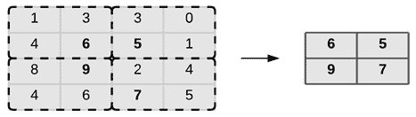
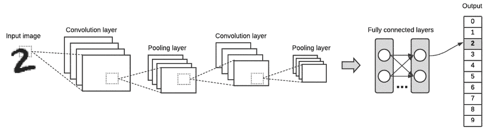
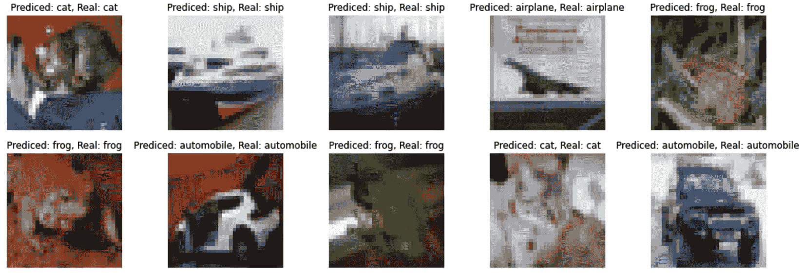
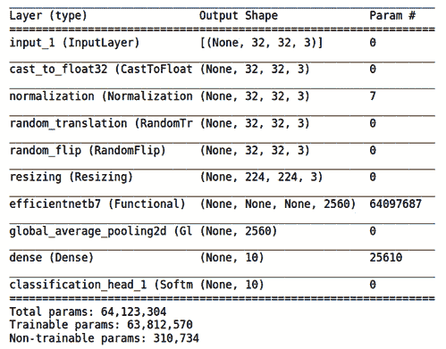
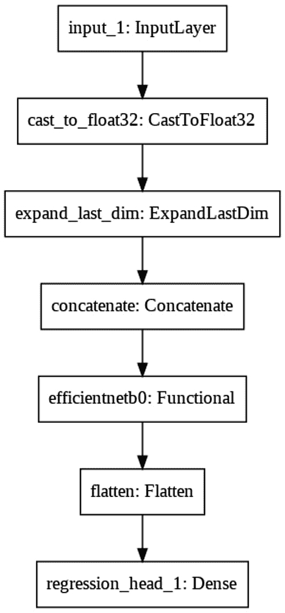
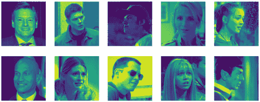
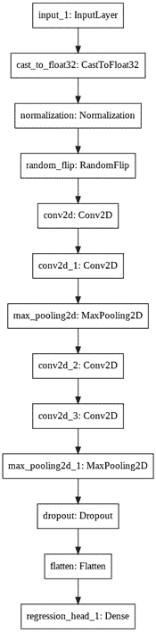

# 四、使用 AutoKeras 的图像分类和回归

在这一章中，我们将重点介绍 AutoKeras 在图像中的应用。在 [*第二章*](B16953_02_Final_PG_ePub.xhtml#_idTextAnchor029) 、*AutoKeras*入门中，我们第一次接触到了应用于图像的**深度学习** ( **DL** )，通过创建两个识别手写数字的模型(一个分类器和一个回归器)。我们现在将创建更复杂和更强大的图像识别器，检查它们是如何工作的，并看看如何对它们进行微调以提高它们的性能。

阅读完本章后，你将能够创建自己的图像模型，并应用它们来解决现实世界中的各种问题。

正如我们在 [*第二章*](B16953_02_Final_PG_ePub.xhtml#_idTextAnchor029) 、【AutoKeras 入门中讨论的，最适合识别图像的模型使用一种叫做**卷积神经网络** ( **CNN** )的神经网络。对于我们将在本章中看到的两个例子，AutoKeras 也将选择 CNN 来创建其模型。那么，让我们更详细地看看这些类型的神经网络是什么，以及它们是如何工作的。

在本章中，我们将讨论以下主要话题:

*   了解 CNN——这些神经网络是什么，它们是如何工作的？
*   创建 CIFAR-10 图像分类器
*   创建和微调强大的图像分类器
*   创建一个图像回归器来找出人的年龄
*   创建和微调强大的图像回归器

# 技术要求

本书中的所有编码示例都以 Jupyter 笔记本的形式提供，可以从以下链接下载:[https://github . com/packt publishing/Automated-Machine-Learning-with-AutoKeras](https://github.com/PacktPublishing/Automated-Machine-Learning-with-AutoKeras)。

因为可以执行代码单元，所以每个笔记本都可以通过添加一个代码片段来自行安装，以满足您的需求。因此，在每个笔记本的开头都有一个用于环境设置的代码单元，用于安装 AutoKeras 及其依赖项。

因此，要运行编码示例，您只需要一台安装了 Ubuntu/Linux 操作系统的计算机，并且您可以使用以下命令行安装 Jupyter 笔记本:

```
$ apt-get install python3-pip jupyter-notebook
```

或者，您也可以使用谷歌协同实验室运行这些笔记本，在这种情况下，您只需要一个网络浏览器——有关更多详细信息，请参见 [*第 2 章*](B16953_02_Final_PG_ePub.xhtml#_idTextAnchor029) 、*AutoKeras*入门中的 *AutoKeras with Google 协同实验室*部分。此外，在*安装 AutoKeras* 部分，您还可以找到其他安装选项。让我们从详细了解 CNN 开始。

### 了解 CNN

CNN 是一种神经网络，受生物大脑视觉皮层神经元功能的启发。

这些类型的网络在解决诸如图像分类、对象检测、分割等计算机视觉问题方面表现得非常好。

下面的截图显示了 CNN 如何识别一只猫:


图 4.1–CNN 如何识别一只猫

但是，与经典的全连接模型相比，为什么这些 CNN 工作得如此之好？要回答这个问题，让我们深入了解卷积层和池层的作用。

### 卷积层

CNN 中的关键构建模块是卷积层，它使用一个窗口(内核)来扫描图像并对其执行转换以检测模式。

内核只不过是一个简单的神经网络，由扫描窗口的像素矩阵提供，输出一个数字向量，我们将使用它作为过滤器。

让我们想象一个卷积层，它有许多小正方形模板(称为内核),这些模板遍历图像并寻找模式。当输入图像的平方与内核模式匹配时，内核返回正值；否则，它返回`0`或更少。

以下屏幕截图显示了卷积层如何处理图像:


图 4.2–卷积层如何处理图像

一旦我们有了过滤器，我们必须使用池操作来减少它们的维数，这将在下面解释。

### 汇集层

池层的功能是逐渐减小输入特征矩阵的大小，以减少网络中的参数和计算的数量。最常见的池形式是最大池，它通过将最大值过滤器应用于输入要素矩阵的非重叠子区域来执行缩减。

以下屏幕截图提供了最大池的示例:



图 4.3–最大池示例

在前面的截图中，我们可以看到一个对特性矩阵进行最大池化操作的例子。在图像的情况下，这个矩阵将由图像的像素值组成。

应用该操作通过减少要处理的特征数量来降低计算成本，并且它还有助于防止过拟合。接下来，我们将了解卷积层和池层如何在 CNN 中结合。

### CNN 结构

通常，CNN 由一系列卷积层组成，后面是一个汇集层(缩减)。这种组合重复了几次，我们可以在下面的截图示例中看到:



图 4.4–CNN 管道示例

在这个过程中，第一层检测简单的特征，例如图像的轮廓，第二层开始检测更高级的特征。在中间层，它已经能够检测更复杂的形状，如鼻子或眼睛。在最后一层，它通常能够区分人脸。

这种看似简单的重复过程极其强大，在每一步都能检测到比其前身稍微高级的特征，并产生惊人的预测。

## 超越经典神经网络

经典的神经网络使用全连接(密集)层作为主要的特征变换操作，而 CNN 使用卷积和池层(Conv2D)。

全连接层和卷积层的主要区别如下:

*   完全连接的层在其输入特征空间中学习全局模式(例如，在来自**修改的国家标准与技术研究所** ( **MNIST** )数据集的数字的情况下，在来自 [*第 2 章*](B16953_02_Final_PG_ePub.xhtml#_idTextAnchor029) 、【AutoKeras 入门的示例中看到，输入特征空间将是来自图像的所有像素)。
*   另一方面，卷积层学习局部模式——在图像的情况下，在贯穿图像的小二维窗口中找到的模式。

在下面的屏幕截图中，我们可以看到这些小窗口如何检测线条、边缘等局部图案:


图 4.5–卷积网络模式提取的可视化表示

卷积操作通过扫描输入图像的窗口(2D 矩阵)对其进行变换，生成具有不同特征的新图像。这些生成的图像中的每一个都被称为**滤镜**，每个滤镜都包含从原始图像中提取的不同图案(边缘、轴、直线等等)。

在 CNN 的每个中间层中创建的过滤器集合被称为特征图，它是维数为 *r x c x n* 的矩阵，其中 *r* 和 *c* 是行和列， *n* 是过滤器的数量。

基本上，这些特征图就是 CNN 学习的参数。

从第二章 、*AutoKeras*中查看 MNIST 分类器的架构时，我们已经可以看到，CNN 堆叠了几个卷积层(Conv2D)和池层(MaxPooling2D)。后者的任务包括减少过滤器的尺寸，保持最相关的值。这有助于清除噪音并减少模型的训练时间。

现在，是实现一些实际例子的时候了。让我们从一个众所周知的数据集的图像分类器开始。

# 创建 CIFAR-10 图像分类器

我们将要创建的模型将对来自名为`32x32` **红色、绿色、蓝色** ( **RGB** )彩色图像的数据集的图像进行分类，分为 10 个不同的类别。它是一个图像集合，通常用于训练 ML 和计算机视觉算法。

以下是数据集中的类:

*   `airplane`
*   `automobile`
*   `bird`
*   `cat`
*   `deer`
*   `dog`
*   `frog`
*   `horse`
*   `ship`
*   `truck`

在下一张截图中，您可以看到在 CIFAR-10 数据集中找到的一些随机图像样本:


图 4.6–CIFAR-10 图像样本

这个问题被认为已经解决了。实现接近 80%的分类准确率是相对容易的。为了获得更好的性能，我们必须使用深度学习 CNN，使用它可以在测试数据集中实现大于 90%的分类精度。我们来看看如何用 AutoKeras 实现。

这是一个分类任务，所以我们可以使用`ImageClassifier`类。这个类生成并测试不同的模型和超参数，返回一个最佳分类器，将每个图像分类到相应的类中。

注意

带有完整源代码的笔记本可以在[https://github . com/packt publishing/Automated-Machine-Learning-with-AutoKeras/blob/main/chapter 04/chapter 4 _ cifar 10 . ipynb](https://github.com/PacktPublishing/Automated-Machine-Learning-with-AutoKeras/blob/main/Chapter04/Chapter4_Cifar10.ipynb)找到。

现在让我们详细看看笔记本的相关单元格，如下所示:

*   `pip`包管理器:

    ```
    !pip3 install autokeras
    ```

*   `matplotlib`，一个 Python 绘图库，我们将使用它来绘制一些数字表示，以及 CIFAR-10，它包含分类图像数据集。这里显示了导入包的代码:

    ```
    import autokeras as ak
    import matplotlib.pyplot as plt
    from tensorflow.keras.datasets import cifar10
    ```

*   **Getting the CIFAR-10 dataset**: We have to first load the CIFAR-10 dataset in memory and have a quick look at the dataset shape, as follows:

    ```
    (x_train, y_train), (x_test, y_test) = cifar10.load_data()
    print(x_train.shape)
    print(x_test.shape)
    ```

    以下是上述代码的输出:

    ```
    Downloading data from https://www.cs.toronto.edu/~kriz/cifar-10-python.tar.gz
    170500096/170498071 [==============================] - 11s 0us/step
    (50000, 32, 32, 3)
    (10000, 32, 32, 3)
    ```

虽然它是一个众所周知的机器学习数据集，但确保数据均匀分布总是很重要的，以避免出现意外。这可以使用`numpy`函数轻松完成，如以下代码块所示:

```
import numpy as np 
train_histogram = np.histogram(y_train)
test_histogram = np.histogram(y_test)
_, axs = plt.subplots(1, 2)
axs[0].set_xticks(range(10))
axs[0].bar(range(10), train_histogram[0])
axs[1].set_xticks(range(10))
axs[1].bar(range(10), test_histogram[0])
plt.show()
```

正如您在下面的截图中看到的，这些样本非常平衡:


图 4.7–训练和测试数据集直方图

既然我们已经确定数据集是正确的，那么是时候创建我们的图像分类器了。

# 创建和微调强大的图像分类器

我们现在将使用的 AutoKeras `ImageClassifier`类来寻找最佳分类模型。对于这个小例子，我们将`max_trials`(可以尝试的不同 Keras 模型的最大数量)设置为`2`，并且我们不设置`epochs`参数，这样它将自动使用自适应的时期数量。真正使用的话，建议设置大量试验。代码如下所示:

```
clf = ak.ImageClassifier(max_trials=2)
```

让我们运行训练来搜索 CIFAR-10 训练数据集的最佳分类器，如下所示:

```
clf.fit(x_train, y_train)
```

以下是输出:


图 4.8–图像分类器训练的笔记本输出

之前的输出显示训练数据集的准确性正在提高。

由于它必须处理成千上万张彩色图像， AutoKeras 将生成的模型训练起来会更昂贵，所以这个过程将需要几个小时，即使使用`max_trials = 5`。增加这个数字会给我们一个更精确的模型，尽管这也需要更长的时间来完成。

## 提高模型性能

如果我们需要在更短的时间内获得更高的精度，我们可以使用先进的 AutoKeras 功能来微调我们的模型，该功能允许您定制您的搜索空间。

通过使用带有`ImageBlock`的`AutoModel`而不是`ImageClassifier`，我们可以创建高级配置，例如`block_type`作为要寻找的神经网络类型。我们还可以执行数据标准化或数据扩充。

如果我们有深度学习的知识，并且以前面对过这个问题，我们可以设计一个合适的架构，例如基于`EfficientNet`的图像分类器，这是一个用于图像识别的深度残差学习架构。

有关更多详细信息，请参见以下示例:

```
input_node = ak.ImageInput()
output_node = ak.ImageBlock(
             block_type="efficient",
             augment=False)(input_node)
output_node = ak.ClassificationHead()(output_node)
clf = ak.AutoModel(inputs=input_node, outputs=output_node, max_trials=2)
clf.fit(x_train, y_train)
```

在前面的代码块中，我们已经用设置对进行了如下操作:

*   有了`block_type = "efficient"`，AutoKeras 只会探索`EfficientNet`架构。
*   初始化`augment = True`意味着我们想要做数据增强，这是一种从原始图像创建新的人工图像的技术。一旦激活它，AutoKeras 将在原始图像中执行一系列变换，如平移、缩放、旋转或翻转。

您也可以不指定这些参数，在这种情况下，这些不同的选项会被自动调整。

你可以在这里看到更多关于`EfficientNet`功能的细节:

*   [https://keras.io/api/applications/efficientnet/](https://keras.io/api/applications/efficientnet/)
*   [https://keras.io/api/applications/resnet/](https://keras.io/api/applications/resnet/)

## 用测试集评估模型

在训练之后，是时候使用保留的测试数据集来测量我们的模型的实际预测。通过这种方式，我们可以将从训练集获得的良好结果与以前从未见过的数据集进行对比。为此，我们运行以下代码:

```
metrics = clf.evaluate(x_test, y_test)
print(metrics)
```

以下是输出:

```
313/313 [==============================] - 34s 104ms/step - loss: 0.5260 - accuracy: 0.8445
[0.525996744632721, 0.8445000052452087]
```

我们在这里可以看到，使用我们的测试数据集，预测准确性还有一定的提高空间(84.4%)，尽管对于仅仅几个小时的训练来说，这是一个相当不错的分数；但仅仅是增加试验，我们已经实现了第一个模型(`ImageClassifier`)的 98%的精确训练，并在谷歌实验室中运行了一天。

一旦我们创建并训练了我们的分类器模型，让我们看看它是如何对测试样本子集进行预测的。为此，我们运行以下代码:

```
import matplotlib.pyplot as plt
labelNames = ["airplane", "automobile", "bird", "cat", "deer", "dog", "frog", "horse", "ship", "truck"]
fig = plt.figure(figsize=[18,6])
for i in range(len(predicted_y)):
    ax = fig.add_subplot(2, 5, i+1)
    ax.set_axis_off()
    ax.set_title('Prediced: %s, Real: %s' % (labelNames[int(predicted_y[i])],labelNames[int(y_test[i])]))
    img = x_test[i]
    ax.imshow(img)
plt.show()
```

下面是的输出:



图 4.9–带有预测标签和真实标签的样本

我们可以看到，所有预测的样本都与其真实值匹配，因此我们的分类器已经正确预测。现在，让我们看看分类器的内部，了解它是如何工作的。

## 可视化模型

现在，我们可以用找到的最佳生成模型(准确率为 98%的模型)的架构来看一个小小的总结，我们将解释其性能如此之好的原因。运行以下代码查看摘要:

```
model = clf.export_model()
model.summary()
```

以下是输出:



图 4.10-最佳模型架构总结

这里的关键层是`efficientnetb7`层，它实现了 Google 创建的尖端架构。今天，`EfficientNet`模型是图像分类的最佳选择，因为这是一种最新的架构，不仅注重提高准确性，而且注重模型的效率，以便它们比现有的基于卷积网络的架构实现更高的精度和更好的效率，将参数大小和每秒**浮点运算** ( **FLOPS** )减少一个数量级。然而，我们不需要了解它的任何信息，因为 AutoKeras 自动为我们选择了它。

让我们以更直观的方式来看看这些块是如何相互连接的，如下所示:



图 4.11-最佳模型架构可视化

正如我们在 [*第二章*](B16953_02_Final_PG_ePub.xhtml#_idTextAnchor029) ，*AutoKeras*入门中所解释的，每个块代表一个层，每个块的输出都连接到下一个块的输入，除了第一个块(其输入是图像)和最后一个块(其输出是预测)。`efficientnetb7`层之前的块都是数据预处理块，它们负责将图像调整为适合该`EfficientNet`块的格式，并通过增强技术生成额外的图像。

现在是解决一个非分类问题的时候了。在下面的实际例子中，我们将基于一组名人数据创建一个人类年龄预测器——一个有趣的工具，可能会让任何人脸红。

# 创建一个图像回归器来找出人的年龄

在这一部分，我们将创建一个模型，从人脸图像中找出一个人的年龄。为此，我们将使用从**互联网电影数据库** ( **IMDb** )中的名人图像中提取的人脸数据集来训练模型。

因为我们想估计年龄，我们将使用图像回归器来完成这项任务。

在下一张截图中，你可以看到一些名人面孔的样本:



图 4.12-来自 IMDb 人脸数据集的一些图像样本

这个有完整源代码的笔记本可以在这里找到:[https://github . com/packt publishing/Automated-Machine-Learning-with-AutoKeras/blob/main/chapter 04/chapter 4 _ celebrityagedetector . ipynb](https://github.com/PacktPublishing/Automated-Machine-Learning-with-AutoKeras/blob/main/Chapter04/Chapter4_CelebrityAgeDetector.ipynb)。

我们现在将详细解释笔记本的相关代码单元，如下所示:

*   `pip`包管理器。此处显示代码:

    ```
    !pip3 install autokeras
    ```

*   **导入需要的包**:我们现在加载 AutoKeras 和一些更常用的包，比如 matplotlib，一个 Python 绘图库，我们将使用它来绘制一些图片样本和类别分布。执行此操作的代码如下所示:

    ```
    import autokeras as ak
    import matplotlib.pyplot as plt
    ```

*   **Getting the IMDb faces dataset**: Before training, we have to download the IMDb cropped faces dataset that contains the images of each face, as well as metadata with the age tags.

    以下命令行是等幂的，它们仅在数据不存在时才下载和提取数据:

    ```
    !wget -nc https://data.vision.ee.ethz.ch/cvl/rrothe/imdb-wiki/static/imdb_crop.tar
    !tar --no-overwrite-dir -xf imdb_crop.tar
    ```

    以下是上述代码的输出:

    ```
    Resolving data.vision.ee.ethz.ch (data.vision.ee.ethz.ch)... 129.132.52.162
    Connecting to data.vision.ee.ethz.ch (data.vision.ee.ethz.ch)|129.132.52.162|:443... connected.
    HTTP request sent, awaiting response... 200 OK
    Length: 7012157440 (6.5G) [application/x-tar]
    Saving to: 'imdb_crop.tar'
    imdb_crop.tar       100%[===================>]   6.53G  27.7MB/s    in 3m 59s  
    2020-12-20 00:05:48 (28.0 MB/s) - 'imdb_crop.tar' saved [7012157440/7012157440]
    ```

*   `MatLab` file.

    b.年龄不在参数中，必须计算。

    c.这些图像不是同质的——它们有不同的尺寸和颜色。

    为了解决这些问题，我们创建了以下实用函数:

    a.这将 IMDb 的 MatLab 文件转换成熊猫的数据帧，并计算年龄。

    b.`normalize_dataset(df_train_set)`:返回一组标准化的图像(调整大小为`128x128`并转换为灰度)和转换为整数的年龄。

在笔记本中，您会找到关于这些功能如何工作的更多详细信息。

现在让我们看看如何使用它们，如下所示:

```
df = imdb_meta_to_df("imdb_crop/imdb.mat")
```

在前面的代码片段中，我们使用了`imdb_meta_to_df`函数将存储在 MatLab 文件中的`imdb`元数据信息转换为 Pandas 数据帧。

数据帧包含大量图像；为了加快训练速度，我们将只使用其中的一部分来创建数据集，如下所示:

```
train_set = df.sample(10000)
test_set = df.sample(1000)
```

现在，我们使用标准化的图像和年龄创建最终数据集，如下所示:

```
train_imgs, train_ages = normalize_dataset(train_set)
test_imgs, test_ages = normalize_dataset(test_set)
```

一旦所有的图像都是相同的尺寸(128×128)和相同的颜色(灰度),并且我们有了标签和估计的年龄，我们就可以开始填充我们的模型了，但是首先我们必须创建它。

# 创建和微调强大的图像回归器

因为我们想要预测的年龄，而这是一个标量值，所以我们将使用 AutoKeras `ImageRegressor`作为年龄预测器。我们将`max_trials`(可以尝试的不同 Keras 模型的最大数量)设置为`10`，并且我们没有将`epochs`参数设置为，这样它将自动使用自适应的历元数量。真正使用的话，建议设置大量试验。代码如下所示:

```
reg = ak.ImageRegressor(max_trials=10)
```

让我们运行训练模型来搜索训练数据集的最佳回归量，如下所示:

```
reg.fit(train_imgs, train_ages)
```

以下是上述代码的输出:


图 4.13–我们的年龄预测训练的笔记本输出

先前的输出显示训练数据集的损失正在减少。

这个训练过程在合作实验室进行了 1 个小时。我们已经将搜索限制到 10 个架构(`max_trials = 10`)，并将图像数量限制到 10，000。增加这些数字会给我们一个更精确的模型，尽管它会也需要更长的时间来完成。

## 提高模型性能

如果我们需要在更短的时间内获得更高的精度，我们可以使用先进的 AutoKeras 功能来微调我们的模型，该功能允许您定制您的搜索空间。

正如我们之前在回归器示例中所做的，我们可以将`AutoModel`与`ImageBlock`一起使用，而不是`ImageRegressor`，这样我们就可以实现高级配置，比如定义一个特定架构的神经网络来使用`block_type`进行搜索。我们还可以执行数据预处理操作，例如标准化或扩充。

正如我们在前面的图像分类器示例中所做的，我们可以设计一个合适的架构作为基于`EfficientNet`的图像回归器，例如，这是一个用于图像识别的深度剩余学习架构。

有关更多详细信息，请参见以下示例:

```
input_node = ak.ImageInput()
output_node = ak.Normalization()(input_node)
output_node = ak.ImageAugmentation()(output_node)
output_node = ak.ImageBlock(block_type="efficient")(input_node)
output_node = ak.RegressionHead()(output_node)
reg = ak.AutoModel(inputs=input_node, outputs=output_node, max_trials=20)
reg.fit(train_imgs, train_ages)
```

在前面的代码中，我们对设置进行了如下操作:

*   `Normalization`块将把 0 到 255 范围内的所有图像值转换成 0 到 1 之间的浮点数。
*   该形状已被设置为 0 到 1 之间的值(60000，28 * 28)。
*   对于`ImageBlock(block_type="efficient"`，我们告诉 AutoKeras 只扫描`EfficientNet`架构。
*   `ImageAugmentation`模块执行数据扩充，这是一种从原始图像创建新的人工图像的技术。

您也可以不指定这些参数中的任何一个，在这种情况下，这些不同的选项将被自动调整。

你可以在这里看到更多关于`EfficientNet`功能的细节:

[https://keras.io/api/applications/efficientnet/](https://keras.io/api/applications/efficientnet/)

## 用测试集评估模型

训练之后，是时候使用保留的测试数据集测量我们模型的实际预测了。这样，我们可以排除训练集获得的良好结果是由于过度拟合。执行此操作的代码如下所示:

```
print(reg.evaluate(test_imgs, test_ages))
```

以下是上述代码的输出:

```
32/32 [==============================] - 2s 51ms/step - loss: 165.3358 - mean_squared_error: 165.3358
[165.33575439453125, 165.33575439453125]
```

这个错误仍然有很大的改进余地，但让我们看看它是如何预测测试样本子集的，如下所示:

```
fig = plt.figure(figsize=[20,100])
for i, v in enumerate(predicted_y[0:80]):
    ax = fig.add_subplot(20, 5, i+1)
    ax.set_axis_off()
    ax.set_title('Prediced: %s, Real: %s' % (predicted_y[i][0], test_ages[i]))
    img = test_imgs[i]
    ax.imshow(img)
plt.show()
```

下面是前面代码的输出:


图 4.14–带有预测标签和真实标签的样本

我们可以看到，一些预测样本接近该人的真实年龄，但另一些则不然，因此投资更多的训练时间和微调将使它预测得更好。让我们看看分类器的内部，了解它是如何工作的。

## 可视化模型

我们现在可以看到一个简短的摘要，其中包含通过运行以下代码找到的最佳生成模型的架构:

```
model = clf.export_model()
model.summary()
```

以下是上述代码的输出:


图 4.15-最佳模型架构总结

这里的关键层是卷积和池模块，正如我们在本章开始时解释的那样。这些层从图像中学习有助于执行预测的局部模式。这是一个直观的表示:



图 4.16-最佳模型架构可视化

首先，有一些数据预处理模块，用于标准化图像和进行数据扩充；然后，有几个堆叠的卷积和池块；然后，丢弃块进行正则化(一种基于在训练时丢弃随机神经元来减少过拟合的技术，以减少最接近的神经元之间的相关性)；最后，我们看到回归模块，将输出转换为标量(年龄)。

# 总结

在这一章中，我们学习了卷积网络如何工作，如何实现图像分类器，以及如何对其进行微调以提高其准确性。我们还学习了如何实现一个图像回归器，并对其进行微调以提高其性能。

现在我们已经学会了如何处理图像，我们准备进入下一章，在这一章中，您将学习如何通过使用 AutoKeras 实现分类和回归模型来处理文本。