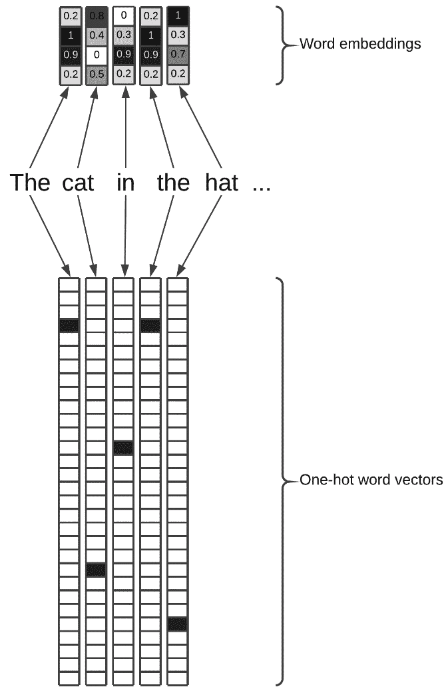
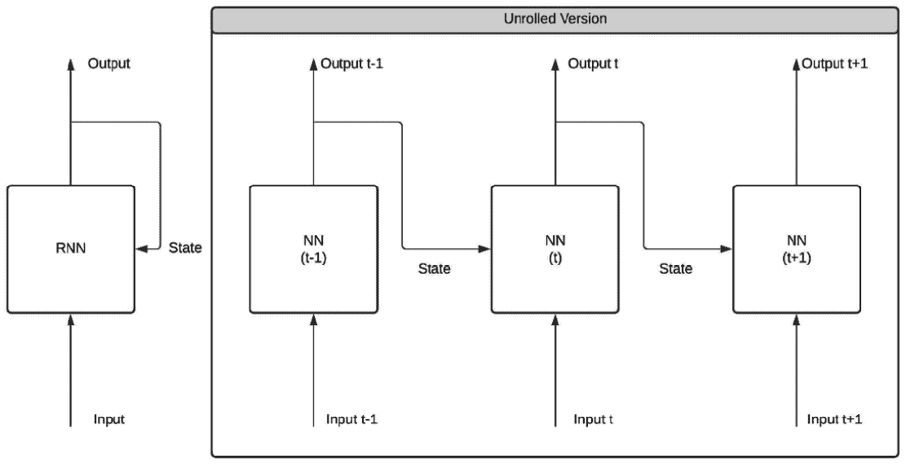
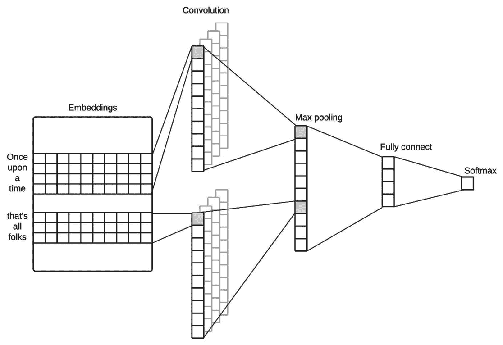
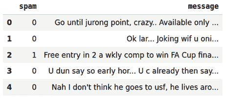
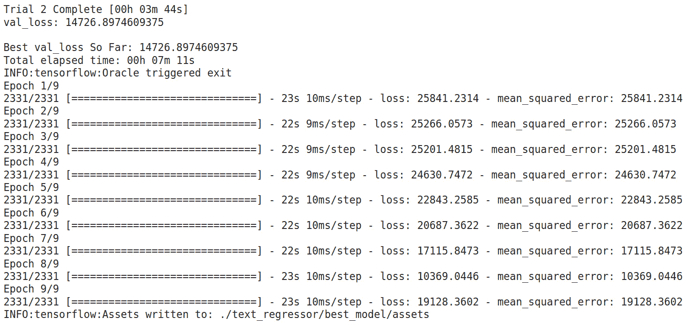

<title>B16953_05_Final_PG_ePub</title>

# *第五章*:使用 AutoKeras 的文本分类和回归

在这一章中，我们将重点介绍如何使用 AutoKeras 处理文本(一系列单词)。

在前一章中，我们看到有一种专门的适合图像处理的网络，叫做**卷积神经网络** ( **CNN** )。在本章中，我们将看到什么是 **递归神经网络** ( **RNNs** )以及它们是如何工作的。RNN 是一种非常适合处理文本的神经网络。

我们还将使用分类器和回归器来解决基于文本的任务。在本章结束时，你将学会如何使用 AutoKeras 解决各种各样基于文本的问题，例如从 tweets 中提取情感，检测电子邮件中的垃圾邮件，等等。

在本章中，我们将讨论以下主题:

*   使用文本数据
*   了解 RNNs——这些神经网络是什么，它们是如何工作的？
*   一维细胞神经网络
*   创建垃圾邮件检测器
*   预测新闻在社交媒体中的受欢迎程度

# 技术要求

本书中的所有编码示例都以 Jupyter 笔记本的形式提供，可以从以下链接下载:[https://github . com/packt publishing/Automated-Machine-Learning-with-AutoKeras](https://github.com/PacktPublishing/Automated-Machine-Learning-with-AutoKeras)。

由于代码单元可以被执行，所以每个笔记本都可以通过添加一个满足您需求的代码片段来自行安装。因此，在每个笔记本的开头都有一个用于环境设置的代码单元，用于安装 AutoKeras 及其依赖项。

因此，要运行编码示例，您只需要一台安装了 Ubuntu Linux 操作系统的计算机，并可以使用以下命令行安装 Jupyter 笔记本:

```
$ apt-get install python3-pip jupyter-notebook
```

或者，您也可以使用 Google Colaboratory 运行这些笔记本，在这种情况下，您只需要一个网络浏览器。更多详情，请参见 [*第 2 章*](B16953_02_Final_PG_ePub.xhtml#_idTextAnchor029) 、*AutoKeras*入门中的 *AutoKeras 与谷歌联合实验室*部分。此外，在*安装 AutoKeras* 部分，您还可以找到其他安装选项。

# 处理文本数据

AutoKeras 允许我们快速、轻松地创建高性能模型来解决基于文本的任务。

文本是为 DL 模型提供信息的极好来源，并且有许多基于文本的来源，例如社交媒体、聊天、电子邮件、文章、书籍和无数基于文本来自动化的任务，例如:

*   **翻译**:将一种语言的源文本转换成另一种语言的文本。
*   对话机器人:使用 ML 模型模拟人类对话。
*   **情感分析**:通过分析文本数据对情感进行分类。
*   **垃圾邮件分类器**:使用机器学习模型的邮件分类。
*   **文档摘要器**:自动生成文档摘要。
*   **文本生成器**:自动从头开始生成文本。

与其他类型的数据一样，AutoKeras 将做所有的预处理，以便我们可以将文本直接传递给我们的模型，但在开始实际示例之前，让我们先看看它在幕后做了什么。

## 标记化

正如我们已经知道的，神经网络将数字向量作为输入，因此文本必须在称为**矢量化**的过程中转换为数字张量。然而，在此之前，我们必须将文本分割成段。

该文本分割可以在不同单元的帮助下完成，例如:

*   **字**:按字分文。
*   **字符**:将文本分割成字符。
*   **N-gram** :提取单词或字符的 N-gram。n 元语法是多个连续单词或字符的重叠组合。

前面提到的单元是称为**记号**，将文本分割成所述记号的过程是称为**记号化**。在矢量化过程中，这是将文本转换为张量的必要步骤，我们接下来将对此进行解释。

## 矢量化

一旦文本被标记化，就执行矢量化。这个过程将每个单词/字符/N-gram 转换成一个向量。

所有文本矢量化过程都包括以下步骤:

1.  应用一些记号化方案
2.  将数字向量与所生成的令牌相关联

这些向量打包成序列张量，馈入**深度神经网络** ( **DNNs** )。

有多种方式将令牌与向量相关联。我们来看两个最重要的，如下:

*   `1`并且向量的所有剩余值都是零。
*   **Token embedding** is another form of token-vector association that is widely used and is more powerful than one-hot encoding. While the vectors obtained by one-hot encoding are binary (one input with value *1* and the rest of values *0*) and large (they must have the same length as the number of words in the vocabulary), the embeddings of words are low-dimensional floating-point vectors.

    通过一键编码获得的字向量是静态的(在数组中的位置决定了该字，并且这些值从不改变)，而字嵌入向量是动态的(它们是从数据中学习的)，以这种方式，它们的值在学习期间被修改，与它们具有神经网络层的权重的方式相同。

    正是这种动力使它能够在更小的空间里存储更多的信息，正如你在下面的截图中看到的:



图 5.1–一键编码与嵌入比较

正如卷积网络是基于图像的任务最合适的选择一样，当我们谈论文字处理时，最理想的网络类型是 RNN。让我们在下一节看看这是由什么组成的。

# 了解 RNNs

到目前为止，所有神经网络的一个共同特征是它们没有记忆。由全连接层或卷积层形成的网络独立处理每个输入，使其与其他层隔离。然而，在 RNNs 中，“过去”被考虑在内，并且这是使用其先前的输出作为状态来完成的；因此，RNN 图层将有两个输入，一个是当前矢量的标准输入，另一个是前一个矢量的输出，如下图所示:



图 5.2-展开的 RNN 环

RNN 通过对整个元素序列进行内部循环来实现这种记忆功能。让我们用一些伪代码来解释一下，如下:

```
state = 0
for input in input_sequence:
     output = f(input, state)
     state = output
```

有几种类型的 RNN 架构，它们的系统比这里介绍的要复杂得多，但这超出了本书的范围。理解这里解释的概念就足够了，因为要使用的架构的配置和选择都将由 AutoKeras 处理。

# 一维细胞神经网络(Conv1D)

在处理文本时，另一个需要考虑的架构是一维 CNN(Conv1D)。它们所依据的原理类似于我们在前一章看到的 2D CNN， [*第四章*](B16953_04_Final_PG_ePub.xhtml#_idTextAnchor063) ，*使用 AutoKeras 的图像分类和回归*。这些神经网络设法通过过滤器学习文本中的模式，就像他们在前一章对图像所做的一样。

下图显示了一维 CNN 的一个示例:



图 5.3–文本序列上的 1D 卷积

如果序列中元素的时间顺序对预测很重要，那么 rnn 会更有效，因此一维 CNN 通常与 rnn 结合使用来创建高性能模型。AutoKeras 执行的详尽搜索将两者都考虑在内，以找到最佳模型。

现在，让我们用一些实际例子将学到的概念付诸实践。

# 创建垃圾邮件检测器

我们将要创建的模型将从`emails`数据集中检测垃圾邮件。这是一个包含 5572 封电子邮件的小数据集，标有一个`spam`列。

包含完整源代码的笔记本可以在以下链接中找到:

[https://colab . research . Google . com/github/packt publishing/auto-Machine-Learning-with-AutoKeras/blob/main/chapter 05/chapter 5 _ spam detector . ipynb](https://colab.research.google.com/github/PacktPublishing/Automated-Machine-Learning-with-AutoKeras/blob/main/Chapter05/Chapter5_SpamDetector.ipynb)

现在让我们详细看看笔记本的相关单元格，如下所示:

*   `pip`包管理器:

    ```
    !pip3 install autokeras
    ```

*   本项目所需的`tensorflow`、`pandas`、`numpy`、`autokeras`依赖:

    ```
    import tensorflow as tf
    import pandas as pd 
    import numpy as np
    import autokeras as ak
    from sklearn import model_selection
    ```

*   `emails` spam dataset from our GitHub repository, as follows:

    ```
    emails_dataset = pd.read_csv("https://raw.githubusercontent.com/PacktPublishing/Automated-Machine-Learning-with-AutoKeras/main/spam.csv", encoding="latin-1")
    ```

    我们现在通过重命名相关列并删除不必要的列来准备数据集，如下所示:

    ```
    emails_dataset.drop(['Unnamed: 2', 'Unnamed: 3', 'Unnamed: 4'], axis = 1, inplace = True)
    emails_dataset.rename(columns = {'v1': 'spam', 'v2': 'message'}, inplace = True)
    emails_dataset['spam'] = emails_dataset['spam'].map({'ham': 0, 'spam': 1})
    emails_dataset.head()
    ```

    下面是前面代码的输出:



图 5.4–数据集预览的笔记本输出

现在让我们将数据集分为`train`和`test`数据集，如下所示:

```
x_train, x_test, y_train, y_test = model_selection.train_test_split(emails_dataset.message.to_numpy(), emails_dataset.spam.to_numpy())
```

我们已经准备好创建垃圾邮件分类器。

## 创建垃圾邮件预测器

现在，我们将使用 AutoKeras `TextClassifier`类来寻找最佳分类模型。就这个小例子而言，我们将`max_trials`(可以尝试的不同 Keras 模型的最大数量)设置为 2，并且我们不设置`epochs`参数，而是定义一个`2`时期的`EarlyStopping`回调，这样，如果验证损失在两个连续时期内没有改善，则训练过程停止。代码如下面的代码片段所示:

```
clf = ak.TextClassifier(max_trials=2)
cbs = [tf.keras.callbacks.EarlyStopping(patience=2)]
```

让我们运行训练来搜索训练数据集的最佳分类器，如下所示:

```
clf.fit(x_train, y_train, callbacks=cbs)
```

以下是上述代码的输出:


图 5.5-文本分类器训练的笔记本输出

先前的输出显示训练数据集的准确性正在提高。

如我们所见，我们在验证集中获得了损失值`0.080`。对于一分钟的训练来说，这是一个非常好的数字。我们将搜索限制在两种架构上(`max_trials = 2`)。增加这个数字会给我们一个更精确的模型，尽管这也需要更长的时间来完成。

## 评估模型

是时候用测试数据集评估最佳模型了。我们可以通过运行以下命令来实现这一点:

```
clf.evaluate(x_test, y_test)
```

以下是前面命令的输出:

```
44/44 [==============================] - 0s 4ms/step - loss: 0.0491 - accuracy: 0.9849
[0.04908078908920288, 0.9849246144294739]
```

正如我们所看到的，`0.9849` as 在测试集中的预测准确性对于投入的时间来说是一个非常好的最终预测分数。

## 可视化模型

现在，我们可以看到最佳生成模型的架构的一个小总结。我们可以通过运行以下代码来实现这一点:

```
model = clf.export_model()
model.summary()
```

以下是上述代码的输出:


图 5.6-最佳模型架构总结

正如我们在这里看到的，AutoKeras 选择了卷积模型(Conv1D)来完成这项任务。正如我们在 [*第 4 章*](B16953_04_Final_PG_ePub.xhtml#_idTextAnchor063) ，*使用 AutoKeras* 进行图像分类和回归中所解释的，当序列中元素的顺序对于预测不重要时，这种架构非常有用，就像这种情况。

这是该架构的可视化表示:


图 5.7–最佳模型架构可视化

正如您已经知道的，生成模型并选择最佳模型是 AutoKeras 自动完成的任务，但是让我们简要解释一下这些模块。

每个块代表一层，每个块的输出连接到下一个块的输入，除了第一个块(其输入是文本)和最后一个块(其输出是预测的数字)。Conv1D 块之前的块都是数据预处理块，用于对生成文本的嵌入进行矢量化处理，以提供给 Conv1D 块，并通过 max pooling 层降低过滤器的维数。请注意，AutoKeras 还添加了几个下降块来减少过度拟合。

在下一节中，我们将通过一个实际的例子来解决一个文本回归问题:我们将创建一个新闻流行度预测器。

# 预测社交媒体中的新闻流行度

在这一节中，我们将创建一个模型，该模型将根据一篇文章的文本找出该文章在社交媒体平台上的受欢迎程度。为此，我们将用 2015-2016 年间收集的一个*新闻人气*数据集([https://archive . ics . UCI . edu/ml/datasets/News+人气+in+Multiple+Social+Media+Platforms](https://archive.ics.uci.edu/ml/datasets/News+Popularity+in+Multiple+Social+Media+Platforms))来训练模型。

因为我们想要近似一个分数(喜欢的数量)，我们将为这个任务使用一个文本回归。

在下一张截图中，您可以看到从该数据集中提取的一些样本:


图 5.8-新闻流行度数据集中的几个样本

这个笔记本带有完整的源代码，可以在[https://colab . research . Google . com/github/packt publishing/Automated-Machine-Learning-with-AutoKeras/blob/main/chapter 05/chapter 5 _ spam detector . ipynb](https://colab.research.google.com/github/PacktPublishing/Automated-Machine-Learning-with-AutoKeras/blob/main/Chapter05/Chapter5_SpamDetector.ipynb)找到。

我们现在将详细解释笔记本的相关代码单元，如下:

*   **获取文章数据集**:在训练之前，我们必须下载包含每篇文章的文本以及流行度评分的数据集。下面是执行此操作的代码:

    ```
    news_df = pd.read_csv("https://archive.ics.uci.edu/ml/machine-learning-databases/00432/Data/News_Final.csv")
    ```

*   `Title` and `Headline` text columns to feed our regression model.

    现在，我们提取 LinkedIn 上每篇文章的流行度得分，用作标签。我们决定只使用 LinkedIn 的分数来简化这个例子。代码如下面的代码片段所示:

    ```
    media_success_outputs = news_df.LinkedIn.to_numpy(dtype="int")
    ```

    接下来，我们将创建训练和测试数据集，如下所示:

*   使用`sklearn`功能设定`train`和`test`，如下:

    ```
    from sklearn.model_selection import train_test_split
    x_train, x_test, y_train, y_test = train_test_split(text_inputs, media_success_outputs, test_size = 0.2, random_state = 10)
    ```

一旦我们创建了数据集，我们就可以为模型提供数据了，但是首先，我们必须创建它。

## 创建文本回归器

因为我们想要从一组文本句子中预测一个流行度分数，并且这个分数是一个标量值，所以我们将使用 AutoKeras `TextRegressor`。对于这个例子，我们将`max_trials`设置为`2`，并且我们不设置`epochs`参数，而是定义一个`2`耐心时期的`EarlyStopping`回调，使得如果验证损失在两个连续时期中没有减少，则训练过程停止。代码可以在下面的代码片段中看到:

```
reg = ak.ImageRegressor(max_trials=2)
cbs = [tf.keras.callbacks.EarlyStopping(patience=2)]
```

让我们运行训练以搜索训练数据集的最佳回归量，如下所示:

```
reg.fit(x_train, y_train, callbacks=cbs)
```

以下是上述代码的输出:



图 5.9-我们的新闻流行预测培训的笔记本输出

从前面的输出中我们可以看到，几分钟后我们有了一个模型，其中`14726`是最终得分中的最佳验证损失(`121`(T2 的平方根)，对于投入的时间来说，这是一个不错的结果。让我们看看它是如何与测试集一起工作的。

## 评估模型

使用测试数据集评估最佳模型的时间。我们通过运行以下代码来实现这一点:

```
reg.evaluate(x_test, y_test)
```

以下是上述代码的输出:

```
583/583 [==============================] - 3s 5ms/step - loss: 13944.2070 - mean_squared_error: 13944.2070

[13944.20703125, 13944.20703125]
```

正如我们所见，`13944`对于投入的时间来说是一个非常好的预测分数。如果我们用更多的试验运行 AutoKeras，我们会得到更好的结果。

## 可视化模型

现在，是时候来看看我们的引擎盖下有什么了。我们将运行以下代码:

```
model = reg.export_model()
model.summary()
```

以下是上述代码的输出:


图 5.10-最佳模型架构总结

正如在之前的分类示例中，AutoKeras 选择了卷积模型(Conv1D)来完成这项任务。正如我们之前解释的，这是一个比 RNN 耗时更少的架构，并且最适合于序列中元素的顺序对于预测不重要的情况。

## 提高模型性能

正如我们在前面的示例中所做的，如果我们需要在更短的时间内获得更高的精度，我们可以使用高级 AutoKeras 功能来微调我们的模型，该功能允许您定制您的搜索空间。

通过使用带有`TextBlock`的`AutoModel`而不是`TextRegressor`，我们可以创建高级配置，例如`block_type`用于要寻找的神经网络类型；或者，如果你的文本源有更大的词汇量(不同单词的数量)，你可能需要在 AutoKeras 中创建一个自定义的管道来增加`max_tokens`参数。

有关更多详细信息，请参见以下示例:

```
cbs = [tf.keras.callbacks.EarlyStopping(patience=2)]
input_node = ak.TextInput()
output_node = ak.TextToIntSequence(max_tokens=20000)(input_node)
output_node = ak.TextBlock(block_type='ngram')(input_node)
output_node = ak.RegressionHead()(output_node)
automodel = ak.AutoModel(inputs=input_node, outputs=output_node, objective='val_mean_squared_error', max_trials=2)
automodel.fit(x_train, y_train, callbacks=cbs)
```

在前面的代码块中，我们已经完成了以下设置:

*   如果确认损失在两个连续时期内没有减少，则`EarlyStopping`模块将停止训练。
*   `max_token`参数被设置为`20000`,因为我们的文本源具有更大的词汇表(不同单词的数量)。
*   使用`TextBlock(block_type="ngram"`，我们告诉 AutoKeras 只扫描使用 N-gram 嵌入的模型。

您也可以不指定这些参数中的任何一个，在这种情况下，这些不同的选项将被自动调整。

## 用测试集评估模型

在训练之后，是时间使用保留的测试数据集来测量我们的模型的实际预测。这样，我们可以排除训练集获得的良好结果是由于过度拟合。为此，请运行以下代码:

```
automodel.evaluate(x_test, y_test)
```

以下是上述代码的输出:

```
583/583 [==============================] - 6s 9ms/step - loss: 13508.9316 - mean_squared_error: 13508.9316
[13508.931640625, 13508.931640625]
```

性能比没有微调的模型稍好，但长时间训练肯定会提高性能。

# 总结

在本章中，我们学习了神经网络如何处理文本数据，什么是递归神经网络以及它们是如何工作的。

我们还将神经网络的概念付诸实践，利用 AutoKeras 的强大功能，仅用几行代码就实现了垃圾邮件预测器和新闻流行度回归器。

现在我们已经学会了如何处理文本，我们准备进入下一章，在这一章中，您将学习如何通过使用 AutoKeras 实现分类和回归模型来处理结构化数据。